# 南昌大学 811K 序列前言

K 序列为南昌大学 811 的历年真题序列, 包含了 07-23 年的历年真题以及市面上最详细的解答, 考研的小伙伴拿到这本真题集的时候, 可以看到往年真题中, 有些年份的试题非常多, 有些又会少一些, 很多同学一看很多题就心里发怵, 有些年份又很少题就心里很开心, 其实往年会有 A/B 卷, 还有些年份因为参考人数非常少, 记题不完全的原因, 所以题量会有些许影响, 但是西瓜哥可以在这保证, 历年的真题包括含有 A/B 卷的年份, 我能收集到的都收录到这本 K 序列中了, 供大家练习, 23 题型改为全大题的形式, 之后也会如此, 平时复习需要面面俱到。

南昌大学真题难度属于中等偏下一点，题目不会太难，但是真题中又不乏有一些创新性的题，所以在平时备考的过程中，复习应需面面俱到，专业课复习前期应把课本上的知识吃透，如果买了OR知识点序列可以配合着知识点序列R把知识点掌握好，同时把训练题库O给做好，做完这些后，再开始做真题K序列会游刃有余。郑君里这本教材编写的知识点其实稍具跳跃性，他的课后习题在前几章会大量出现一些后面的知识点，所以做起来会有点吃力，所以这里也尽量不推荐大家看完书就做他的课后题，买了我们资料的小伙伴可以找我领取一份他的划重点。

总之，学习需要脚踏实地，不论是专业课还是公共课，勤学多问，上岸的必然是你！

——西瓜哥

---

---

# 目录

07年南昌大学信号与系统真题

07年南昌大学信号与系统真题详解 4

08年南昌大学信号与系统真题

08年南昌大学信号与系统真题详解. 13

09年南昌大学信号与系统真题 20

09年南昌大学信号与系统真题详解 24

10年南昌大学信号与系统真题 30

10年南昌大学信号与系统真题详解 33

11年南昌大学信号与系统真题 38

11年南昌大学信号与系统真题详解 42

12年南昌大学信号与系统真题 50

12年南昌大学信号与系统真题详解. 56

13年南昌大学信号与系统真题 71

13年南昌大学信号与系统真题详解. 75

14年南昌大学信号与系统真题. 83

14年南昌大学信号与系统真题详解 87

15年南昌大学信号与系统真题 102

15年南昌大学信号与系统真题详解 108

16年南昌大学信号与系统真题 118

16年南昌大学信号与系统真题详解. 121

17年南昌大学信号与系统真题 127

17年南昌大学信号与系统真题详解 129

---

18年南昌大学信号与系统真题 133

18年南昌大学信号与系统真题详解 137

19年南昌大学信号与系统真题 147

19年南昌大学信号与系统真题详解 151

20年南昌大学信号与系统真题 158

20年南昌大学信号与系统真题详解 162

21年南昌大学信号与系统真题 172

21年南昌大学信号与系统真题详解 175

22年南昌大学信号与系统真题 183

22年南昌大学信号与系统真题详解 187

23年南昌大学信号与系统真题详解12月份会在答疑群公布

---

# 南昌大学

# 2007年招收攻读硕士研究生

# 入学考试自命题试题

科目代码及名称： 信号与系统811

适用专业： 电子与通信工程等

(所有答案都必须写在答题纸上, 写在试卷纸上及草稿纸上无效, 考完后试题随答题纸收回)

# 一．单项选择题（每题5分，共35分）

1. 连续系统的单位冲击响应为 \(h(t)\), 信号通过线性系统不失真的条件是 ( )

A. \(h(t)\) 为常数

B. \(h(t) = 0\) ，当 \(t < 0\) 时

C. \(h(t) = k \delta \left(t - t_{0}\right), t_{0}\) 和 \(k\) 为常数

D. \(h(t)\) 绝对可和

2. 离散时间系统的单位函数响应 \( h(n) = 2^{n}u(-n) \)，则系统为（）

A. 稳定的因果系统

B. 不稳定的因果系统

C. 稳定的非因果系统

D. 不稳定的非因果系统

3. 离散时间非周期性信号频谱是（）（刺猬哥考研团队，答疑交流群 709502924）

A. 周期和离散的

B. 非周期和离散的

C. 周期和连续的

D. 非周期性和连续的

4. 离散时间系统的系统函数 \(\mathrm{H(z)} = \frac{z}{z - 1}\), 则系统为 ( )

A. 低通滤波器

B. 带通滤波器

C. 带阻滤波器

D. 高通滤波器

5. 若 \(f(t)\) 为实函数, 且为奇函数, 则它的傅立叶变换下面说法正确的是的 ( )

A. 相位谱为频率的连续函数

B. 相位谱为一固定常数

---

C. 相位谱为 0 或 \(\pi\)

D. 相位谱为 \(\frac{\pi}{2}\) 或 \(-\frac{\pi}{2}\)

6. 一个二阶的 LTI 系统, 起始状态为 \(y(0_{-})\)、\(y'(0_{-})\), 激励为 \(e(t)\), 系统的零输入响应为 \(y_{zi}(t)\), 系统的零状态响应为 \(y_{zs}(t)\), 则系统的全响应 \(y(t) = y_{zi}(t) + y_{zs}(t)\), 若起始状态变为 \(ky(0_{-})\)、\(ky'(0_{-})\), 激励变为 \(\frac{1}{k} e(t - t_0)\), 则系统的全响应为 ( )

A. \(ky_{zi}(t) + \frac{1}{k} y_{zs}(t)\)

B. \(k y_{z i}\left(t - t_{0}\right) + \frac{1}{k} y_{z s}\left(t - t_{0}\right)\)

C. \(y(t)\)

D. \(ky_{zi}(t) + \frac{1}{k} y_{zs}(t - t_0)\)

7. 已知系统的输入为 \(x(n)\), 输出为 \(y(n)\), 其输入输出关系为 \(y(n) = n x(n)\) 则系统为 ( ) (刺猬哥考研团队, 答疑交流群 709502924)

A. 线性时不变系统

B. 线性时变系统

C. 非线性时不变系统

D. 非线性时变系统

# 二．填空题（每题5分共15分）

1. \(\frac{d}{dw}\left(e^{-jwt_0}\right)\) 的傅立叶反变换为(其中 \(t_0\) 为常数)________；

2. 已知 \(F(S) = \frac{1 - e^{-s}}{s^2 + 1}\), 其原函数 \(f(t) =\)

3. 已知 \( y(n) = (N - |n|)\left[u(n + N) - u(n - N)\right]*u(n) \)，则 \( y(0) = \) ______；

# 三．画图题 (20分)

1. 已知 \( f(t) = u(t + 2) - u(t - 2) \)，\( h(t) \) 的傅里叶变换 \( H(j\omega) = 4Sa(\omega) \)，\( y(t) = f(t)*h(t) \)，画出 \( y(t) \) 的波形。（西瓜哥QQ：915211156）

---

24最强信号辅导班招生啦！让你节省时间，不走弯路，取得佳绩！联系西瓜哥qq915211156 加Q群709502924，使用刺猬哥团队正版核心序列ORK，享受高质量全天候优质答疑指导

# 四. 计算题 (每题 20 分, 共 80 分)

1. 已知一个二阶离散时间系统函数 \(H(z)\) 中的一个极点为 \(z = 0\), 且已知 \(H(e^{j0}) = \infty, H(e^{\pm j\frac{\pi}{2}}) = 0, H(e^{j\pi}) = 4\), 写出系统函数 \(H(z)\) 的表示式。

2. 求信号 \(x(t) = \frac{1}{a^{2} + t^{2}}\) 的傅里叶变换。（刺猬哥考研团队，答疑交流群 709502924）

3. 一阶低通滤波器。当激励为 \( \sin (2t) u(t) \) 时, 自由响应为 \( 2e^{-3t} u(t) \), 求系统的强迫响应。(设初始状态为零) (西瓜哥 QQ: 915211156)

4. 描述某离散系统的差分方程为 \( y(n) + 3y(n - 1) + 2y(n - 2) = x(n) \)，且 \( y(0) = 0, y(1) = 2 \)，激励信号 \( x(n) = 2^n u(n) \)，求零输入响应 \( y_{zi}(n) \) 和零状态响应 \( y_{zs}(n) \).

---

# 2007南昌大学信号与系统811真题详解

——西瓜哥原创作答

# 一、单项选择题

题 1 解: C

线性不失真的时域条件与频域条件必须记牢，多年真题考察此知识点。

题 2 解: C

因果性的充分必要条件: \(h(n) = h(n) u(n)\)

稳定性的充分必要条件: \(\sum_{n=-\infty}^{\infty}\left|h(n)\right| \leq M \quad \mathrm{M}\) 为有界值

代入条件, 可知是稳定非因果系统。考察系统特性的题是常考题, 必须掌握。

题 3 解: C

时域采样（离散化）对应频域周期延拓，频域采样（离散化）对应时域周期延拓。

也就是说时域离散对应频域是周期的，时域非周期对应频域是连续的。

题 4 解: A

利用零极点几何法画出大致的频谱图，在靠近极点 \(z = 1\) 时，形成波峰，在远离极点时，形成波谷。此方法必须掌握，详见教材 8.10 节离散时间系统的频率响应特性。

题 5 解: D

奇偶虚实性, \(f(t)\) 为偶实, \(F(\omega)\) 为实, 只有实部 \(R(\omega)\), 相位 \(\pm \pi\)

$$
f (t) = f _ {e} (t) + f _ {0} (t), f (t) \text {为 实 奇 ，} F (\omega) \text {为 虚 奇 ， 只 有 虚 部} j I (\omega), \text {相 位 为} \pm \frac {\pi}{2}
$$

题 6 解: D

理解下面三个 LTI 系统的性质性质:

---

24最强信号辅导班招生啦！让你节省时间，不走弯路，取得佳绩！联系西瓜哥qq915211156 加Q群709502924，使用刺猬哥团队正版核心序列ORK，享受高质量全天候优质答疑指导

(1) 响应的可分解性: 系统响应可以分解为零输入响应和零状态响应

(2) 零状态线性: 当起始状态为零时, 系统的零状态响应对于外加激励信号呈现线性。

(3) 零输入线性: 当外加激励为零时, 系统的零输入响应对于各起始状态呈现线性。因此题便可迎刃而解。(西瓜哥 QQ: 915211156)

题 7 解: B

假设 \( y(n) = r[x(n)] \)

因为 \(r\left[a_{1} x_{1}(n) + a_{2} x_{2}(n)\right] = a_{1} y_{1}(n) + a_{2} y_{2}(n)\) 所以线性

因为 \(r\left[x\left(n + n_{0}\right)\right] = n x\left(n + n_{0}\right) \neq \left(n + n_{0}\right) x\left(n + n_{0}\right) = y\left(n + n_{0}\right)\) 所以时变

# 二、填空题

题 8 解: \(-j t \delta\left(t - t_{0}\right)\)

利用傅里叶变换的频域微分性质。

题9解： \(\sin t\cdot u(t) - \sin (t - 1)u(t - 1)\)

牢记 \(\mathcal{L}[\sin (w_0 t) u(t)] = \frac{w_0}{s^2 + w_0^2}\) （刺猬哥考研团队，答疑交流群 709502924）

题10解： \(\frac{N(N + 1)}{2}\)

采用图像法求卷积和，能比较快速得到答案。

# 三、画图题

题1解：

$$
H (j \omega) = 4 S a (\omega) \leftrightarrow 2 G _ {2} (t) = h (t)
$$

$$
y (t) = f (t) ^ {*} h (t) = 2 g _ {4} (t) ^ {*} g _ {2} (t)
$$

---

24最强信号辅导班招生啦！让你节省时间，不走弯路，取得佳绩！联系西瓜哥qq915211156 加Q群709502924，使用刺猬哥团队正版核心序列ORK，享受高质量全天候优质答疑指导

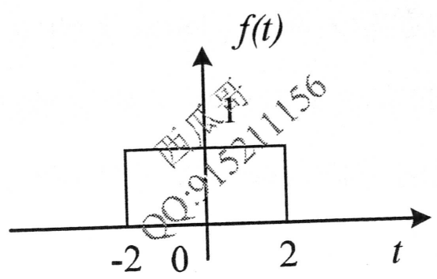

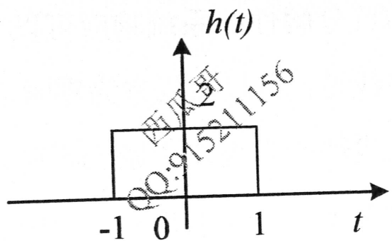

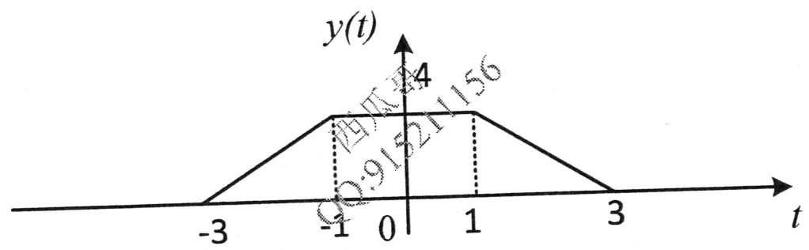

# 四、计算题:

1.

解: 由题意画出系统零极点分布图:

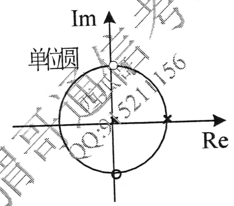

由题 \(H(e^{j0}) = \infty, H(e^{\pm j\frac{\pi}{2}}) = 0,\) \(H(e^{j\pi}) = 4\)

可知 \(H(1) = \infty, H(\pm j) = 0, H(-1) = 4\)

可知极点为 0 和 1 , 两个零点为 \(\pm j\)

设 \(H(z) = \frac{H_0(z + j)(z - j)}{z(z - 1)}\)

$$
H \left(e ^ {j \pi}\right) = \frac {H _ {0} \left(e ^ {j \pi} + j\right) \left(e ^ {j \pi} - j\right)}{e ^ {j \pi} \left(e ^ {j \pi} - 1\right)} = 4
$$

得 \(H_{0} = 4\)

---

所以 \(H(z) = \frac{4(z + j)(z - j)}{z(z - 1)} = \frac{4(z^2 + 1)}{z(z - 1)}\)

2.

解: \(e^{-a|t|} \leftrightarrow \frac{2a}{a^2 + \omega^2}\)

$$
\frac {2 a}{a ^ {2} + t ^ {2}} \leftrightarrow 2 \pi e ^ {- a | \omega |}
$$

$$
\frac {1}{a ^ {2} + t ^ {2}} \leftrightarrow \frac {\pi}{a} e ^ {- a | \omega |}
$$

3.

解：设系统完全响应为：

$$
y (t) = 2 e ^ {- 3 t} + A \sin 2 t + B \cos 2 t, \quad t \geq 0
$$

$$
\int y \left(0 _ {+}\right) = 2 + B = 0
$$

$$
\left\lfloor y ^ {\prime} \left(0 _ {+}\right) = - 6 + 2 A = 0 \right.
$$

所以 \(A = 3, B = 2\)

所以系统的强迫响应: \(y(t) = (3 \sin 2 t - 2 \cos 2 t) u(t)\)

(刺猬哥考研团队, 答疑交流群 709502924)

4.

$$
\begin{array}{l} Y (z) + 3 [ y (- 1) + z ^ {- 1} Y (z) ] + 2 [ y (- 2) + y (- 1) z ^ {- 1} + z ^ {- 2} Y (z) ] = X (z) \\ \rightarrow \left(1 + 3 z ^ {- 1} + 2 z ^ {- 2}\right) Y (z) + \left[ 3 y (- 1) + 2 y (- 2) + 2 y (- 1) z ^ {- 1} \right] = X (z) \\ \rightarrow Y (z) = \frac {x (z)}{1 + 3 z ^ {- 1} + 2 z ^ {- 2}} + \frac {- 3 y (- 1) - 2 y (- 2) - 2 y (- 1) z ^ {- 1}}{1 + 3 z ^ {- 1} + 2 z ^ {- 2}} \\ \end{array}
$$

由差分方程知 \(y(n) = x(n) - 3y(n - 1) - 2y(n - 2)\)，可以得到：

\(y(1) = x(1) - 3y(0) - 2y(-1)\), 得到 \(y(-1) = 0\)

\(y(0) = x(0) - 3y(-1) - 2y(-2)\), 得到 \(y(-2) = \frac{1}{2}\)

---

从而：

$$
Y (z) = \frac {z}{(z - 2) \left(1 + 3 z ^ {- 1} + 2 z ^ {- 2}\right)} + \frac {- 1}{1 + 3 z ^ {- 1} + 2 z ^ {- 2}} = \frac {z ^ {3}}{(z - 2) (z + 1) (z + 2)} - \frac {z ^ {2}}{(z + 2) (z + 1)}
$$

$$
Y _ {z i} (z) = \frac {- z ^ {2}}{(z + 2) (z + 1)}, \quad \frac {Y _ {z i}}{z} = \frac {- z}{(z + 2) (z + 1)} = \frac {- 2}{z + 2} + \frac {1}{z + 1}
$$

$$
Y _ {z i} (z) = \frac {- 2 z}{z + 2} + \frac {z}{z + 1}
$$

$$
y _ {z i} (n) = - 2 (- 2) ^ {n} u (n) + (- 1) ^ {n} u (n) = \left[ (- 2) ^ {n + 1} + (-) ^ {n} \right] u (n)
$$

$$
Y _ {z s} (z) = \frac {\frac {1}{3} z}{z - 2} + \frac {z}{z + 2} + \frac {- \frac {1}{3} z}{z + 1}
$$

$$
y _ {z s} (n) = \left[ \frac {1}{3} (2) ^ {n} + (- 2) ^ {n} - \frac {1}{3} (- 1) ^ {n} \right] u (n)
$$

(西瓜哥 QQ: 915211156)

_西瓜哥原创作答_

---

# 南昌大学

# 2008年招收攻读硕士研究生

# 入学考试自命题试题

科目代码及名称： 信号与系统811

适用专业： 电子与通信工程等

(所有答案都必须写在答题纸上, 写在试卷纸上及草稿纸上无效, 考完后试题随答题纸收回)

# 一．单项选择题（每题5分，共25分）

1. 微分方程 \( y''(t) + 5y'(t) + ty(t) = f(t + 6) \) 所描述的系统是（）

A. 时不变因果系统

B. 时不变非因果系统

C. 时变因果系统

D. 时变非因果系统

2. 已知 \(f(-5t + 6)\), 为求 \(f(2t + 8)\), 下列哪种运算顺序可以求得正确结果是 ( )

A. 反褶后将图形扩展 \(\frac{5}{2}\) 倍再向 \(t\) 负方向平移 1 个单位

B. 反褶后将图形扩展 \(\frac{5}{2}\) 倍再向 \(t\) 正方向平移 1 个单位

C. 将图形扩展 3 倍后向 \(t\) 负方向平移 1 个单位再反褶

D. 将图形扩展 \(\frac{5}{2}\) 倍后向 \(t\) 负方向平移 1 个单位再反褶

3. 序列 \(f(n) = \cos \frac{n \pi}{2} [u(n - 2) - u(n - 5)]\) 的正确图形是 ( )

A.

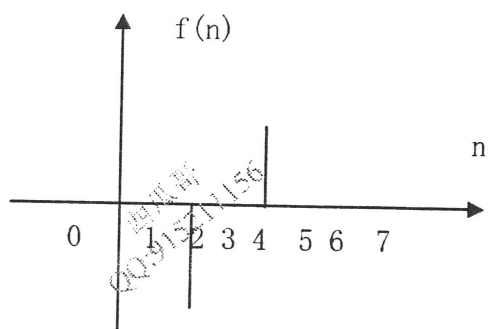

B.

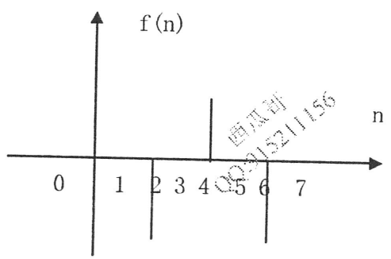

---

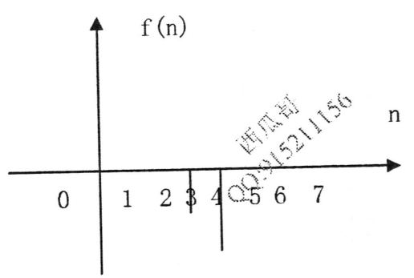

D.

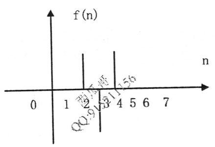

C.

4. 象函数 \( F(s) = \frac{2}{s^2 + 4s + 3} \) 的拉普拉斯反变换是（）

A. \((e^{t} + e^{3t})u(t)\)

B. \((e^{t} - e^{3t})u(t)\)

C. \((e^{-t} + e^{-3t})u(t)\)

D. \((e^{-t} - e^{-3t})u(t)\)

5. 离散时间系统的系统函数 \( H(z) = \frac{z + 1}{z - 1} \)，则系统为（）

A. 低通滤波器

B. 带通滤波器

C. 带阻滤波器

D. 高通滤波器

# 二．填空题（每题5分，共25分）

1. 已知序列的象函数 \(H(z) = \frac{z}{(z + 1)^2}, |z| > 1\)，则原序列 \(f(k)\) 为 ______；

2. 如下图 2.2 所示: 信号的傅立叶变换为: \(F(j\omega) = R(\omega) + jX(\omega)\), 则信号 \(y(t)\) 的傅立叶变换为

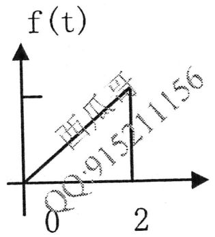

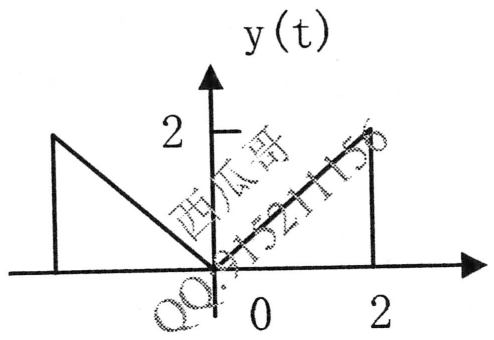

3. 求频谱函数 \(F(j\omega) = [u(\omega) - u(\omega - 2)]e^{-j\omega}\) 的傅里叶反变换 \(\mathrm{f(t)}\) 为

4. 符号函数 \( \operatorname{sgn}(2t - 4) \) 的频谱函数 \( F(j\omega) = \) _______；

---

5. 信号 \(f(t) = (\cos 2\pi t) u(t - 1)\) 的单边拉普拉斯变换为

# 三．简单计算（每题16分，共48分）

1. 已知序列的 \(Z\) 变换 \(F(z) = \frac{-9z^{2} - 13z}{(z + 1)(z + 2)(z - 3)}\), \(|z| > 3\), 求该 \(F(z)\) 对应序列的时域表达式。（刺猬哥考研团队，答疑交流群 709502924）

2. 已知 \( F(s) = \frac{s^3 + s^2 + 2s + 1}{s^3 + 6s^2 + 11s + 6} = \frac{s^3 + s^2 + 2s + 1}{(s + 1)(s + 2)(s + 3)} \) 求原函数 \( f(t) \) 的初值和终值。

3. 若 \(F[f(t)] = F(\omega), p(t) = \cos t, f_p(t) = f(t)p(t)\), 其中 \(F(\omega)\) 的图像如下图所示, 求 \(F_p(\omega)\) 的表达式, 并画出频谱图。（西瓜哥QQ: 915211156）

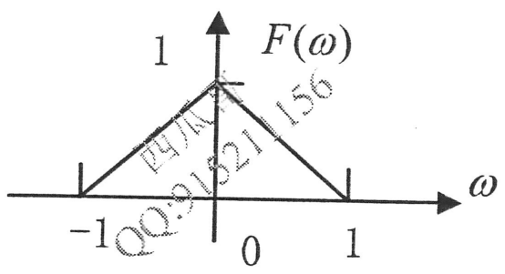

# 四．计算题（每题26分，共52分）

1. 已知输入信号 \(x(t)\) 的频谱图及带通滤波器。低通滤波器的频谱特性如下图所示，试

---

求图中所示系统中信号经过带通滤波器 \(H_{1}\) 及低通滤波器 \(H_{2}\) 后的频谱图及频谱函数。

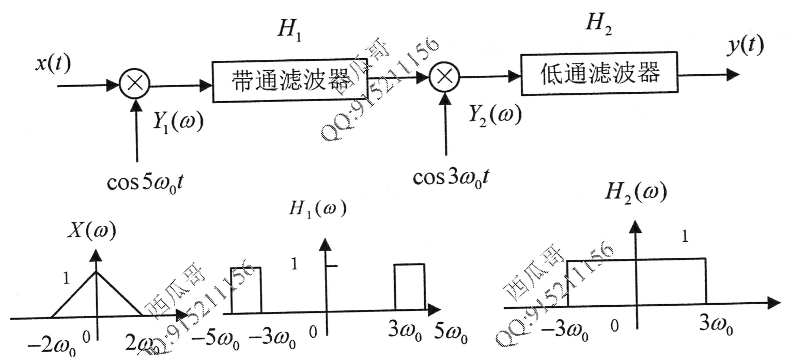

2. 某一阶线性时不变系统，当激励信号 \(x(t) = u(t)\) 时，全响应为 \(y(t) = \left(\frac{1}{2} +\frac{3}{2} e^{-2t}\right)u(t)\)，若系统的起始状态为 \(y(0_{-}) = 1\)

1) 求系统的零输入响应 \(y_{zi}(t)\) 与冲激响应 \(h(t)\);

(2) 求系统函数 \(H(s)\); (刺猬哥考研团队, 答疑交流群 709502924)

3) 画出 \(H(s)\) 的零极点分布图, 并说明系统的稳定性。

---

# 2008南昌大学信号与系统811真题详解

——西瓜哥原创作答

# 一、选择题

题 1 解: D

时变性:

$$
\begin{array}{l} f (t + 6 + t _ {0}) \\ = y ^ {\prime \prime} \left(t + t _ {0}\right) + 5 y ^ {\prime} \left(t + t _ {0}\right) + \left(t + t _ {0}\right) y \left(t + t _ {0}\right) \\ \neq y ^ {\prime \prime} (t + t _ {0}) + 5 y ^ {\prime} (t + t _ {0}) + t y (t + t _ {0}) \\ \end{array}
$$

所以系统为时变系统

因果性: 令 \(t = 1\)

$$
y ^ {\prime \prime} (1) + 5 y ^ {\prime} (1) + y (1) = f (7)
$$

激励时间为 7 , 响应时间为 1 , 响应在激励之前, 故非因果。

题 2 解: A

考察信号的基本运算，必须熟练掌握

题 3 解: A

注意 \(u(n - 2) - u(n - 5)\) 的区间为 \([2,3,4]\), \(n = 3\) 时, \(\cos \frac{n\pi}{2} = 0\) 。

题 4 解: D

常见的拉普拉斯反变换

题 5 解: A

---

该系统的极点为1，零点为-1，用几何确定法，画出大致频谱图。在 \(\omega = 0\) 处出现峰值，在 \(\frac{\omega_s}{2}\) 处出现波谷。所以该系统为低通滤波器。

# 二、填空题

题1解： \(-k(-1)^{k}u(k)\)

常见的逆 \(Z\) 变换类型, 记住常见的几种变换即可。

题2解： \(Y(j\omega) = 2R(\omega)\)

将 \(f(t)\) 分解成奇分量、偶分量: \(f(t) = f_{e}(t) + f_{o}(t)\), \(f_{e}(t) = \frac{1}{2} (f(t) + f(-t))\)

其中偶分量的傅里叶变换与 \(f(t)\) 频域的实部相等: \(\mathcal{F}[f_{e}(t)] = R(\omega)\)

又因为: \(y(t) = f(t) + f(-t) = 2f_{e}(t)\)

$$
\mathcal {F} [ y (t) ] = \mathcal {F} [ 2 f _ {e} (t) ] = 2 R (\omega)
$$

题 3 解: \(\frac{1}{\pi} S a(t - 1) e^{j(t - 1)}\)

牢记这几个变换对:

设: \(G_{\tau}(t) = u\left(t + \frac{\tau}{2}\right) - u\left(t - \frac{\tau}{2}\right)\), 也就是一个宽度为 \(\tau\), 中心在原点的时域矩形框。

\(G_{2 \omega_0}(\omega) = u\left(\omega + \omega_0\right) - u\left(\omega - \omega_0\right)\), 也就是一个宽度为 \(\omega_0\), 中心在原点的频域矩形框。

则: \(E G_{\tau}(t) \xleftarrow{\mathcal{F}} E \tau S a\left(\frac{\tau}{2} \omega\right)\), \(S a\left(\omega_{0} t\right) \xleftarrow{\mathcal{F}} \frac{\pi}{\omega_{0}} G_{2 \omega_{0}}(\omega)\)

---

24最强信号辅导班招生啦！让你节省时间，不走弯路，取得佳绩！联系西瓜哥qq915211156 加Q群709502924，使用刺猬哥团队正版核心序列ORK，享受高质量全天候优质答疑指导

此题便能迎刃而解。

题4解： \(\frac{2}{j\omega} e^{-2j\omega}\)

记住: \(F[\operatorname{sgn}(t)] = \frac{2}{j\omega}\), 即可轻易地解出此题。

题5解： \(\frac{s}{s^2 + 4\pi^2} e^{-s}\)

$$
L [ (\cos 2 \pi t) u (t) ] = \frac {s}{s ^ {2} + 4 \pi^ {2}}
$$

$$
f (t) = (\cos 2 \pi t) u (t - 1) = (\cos 2 \pi (t - 1)) u (t - 1)
$$

$$
L [ f (t) ] = \frac {s}{s ^ {2} + 4 \pi^ {2}} e ^ {- s}
$$

# 三、简单计算

1. 解：

$$
\frac {F (z)}{z} = \frac {- 9 z ^ {2} - 1 3 z}{(z + 1) (z + 2) (z - 3)} = \frac {1}{z + 1} + \frac {1}{z + 2} - \frac {2}{z - 3}
$$

可能对应的序列表达式: \(f(n) = (-1)^{n} u(n) + (-2)^{n} u(n) - 2 \cdot 3^{n} u(n)\)

2. 解:

利用部分分式法展开计算其逆变换

---

$$
F (s) = \frac {s ^ {3} + s ^ {2} + 2 s + 1}{(s + 1) (s + 2) (s + 3)} = 1 - \frac {\frac {1}{2}}{s + 1} + \frac {7}{s + 2} - \frac {\frac {2 3}{2}}{s + 3}
$$

从而再根据常见的拉普拉斯变换对可以得到:

$$
f (t) = \delta (t) - \left(\frac {1}{2} e ^ {- t} - 7 e ^ {- 2 t} + \frac {2 3}{2} e ^ {- 3 t}\right) u (t)
$$

可得初值, 终值: \(f\left(0_{+}\right) = -5 、 f(\infty) = 0\)

也可以利用终值定理求终值。初值定理要注意 \(F(s)\) 不是真分式。

3. 解:

$$
p (t) = \cos t
$$

因此 \(P(\omega) = \pi [\delta (\omega +1) + \delta (\omega -1)]\)

又因为 \(f_{p}(t) = f(t)\cdot p(t)\)

所以 \(F_{p}(\omega) = \frac{1}{2\pi} F(\omega)*P(\omega) = \frac{1}{2} [F(\omega +1) + F(\omega -1)]\)

\(F_{p}(\omega)\) 的频谱图如下所示

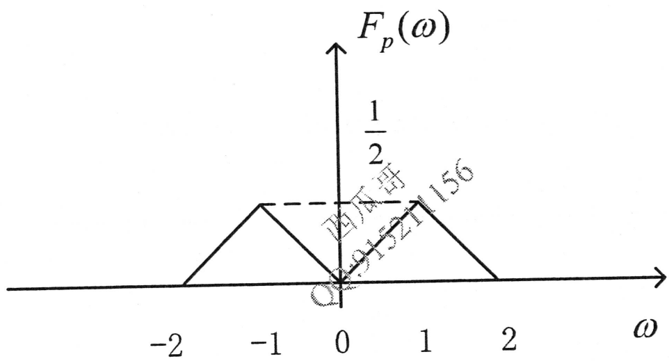

# 四、计算题

---

1. 解:

设经过带通滤波器后输出为 \(f_{1}(t)\), 经过低通滤波器后输出为 \(f_{2}(t)\)

$$
H _ {2} (w) = u \left(w + 3 w _ {0}\right) - u \left(w - 3 w _ {0}\right)
$$

$$
y _ {1} (t) = x (t) \cdot \cos 5 w _ {0} t
$$

$$
Y _ {1} (w) = \frac {1}{2} \left[ X \left(w + 5 w _ {0}\right) + X \left(w - 5 w _ {0}\right) \right]
$$

$$
F _ {1} (w) = Y _ {1} (w) H _ {1} (w) = \frac {1}{2} \left[ \left(\frac {- w}{2 w _ {0}} - \frac {3}{2}\right) \left(u \left(w + 5 w _ {0}\right) - u \left(w + 3 w _ {0}\right)\right) + \left(\frac {w}{2 w _ {0}} - \frac {3}{2}\right) \left(u \left(w - 3 w _ {0}\right) - u \left(w - 5 w _ {0}\right)\right) \right]
$$

\(F_{1}(\omega)\) 频域图如下:

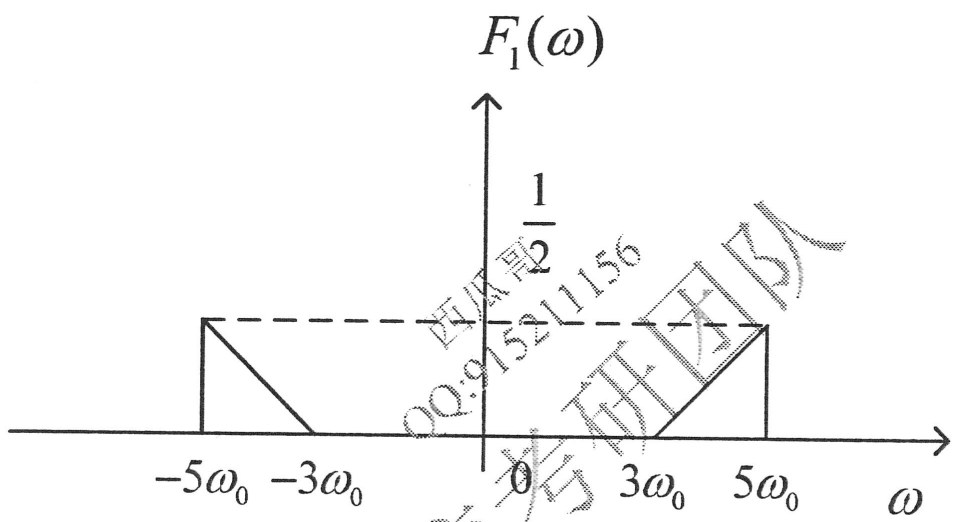

$$
y _ {2} (t) = f _ {1} (t) \cos 3 \omega_ {0} t
$$

$$
Y _ {2} (\omega) = \frac {1}{2} \left[ F _ {1} \left(\omega + 3 \omega_ {0}\right) + F _ {1} \left(\omega - 3 \omega_ {0}\right) \right]
$$

$$
F _ {2} (\omega) = Y _ {2} (\omega) H _ {2} (\omega) = \frac {1}{4} \left\{\left(\frac {- \omega}{2 \omega_ {0}}\right) [ u (\omega + 2 \omega_ {0}) - u (\omega) ] + \left(\frac {\omega}{2 \omega_ {0}}\right) [ u (\omega) - u (\omega - 2 \omega_ {0}) ] \right\}
$$

\(F_{2}(\omega)\) 频域图如下：

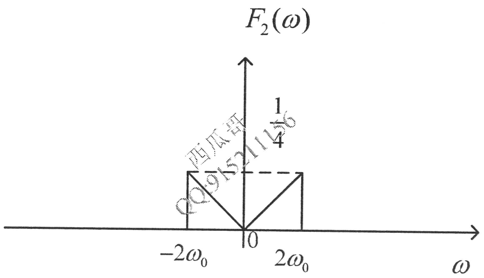

---

2. 解：

(1)

因为系统的起始状态 \(y(0_{-}) = 1\) 是零输入的，可当作全响应的零输入响应。

所以起始的零输入响应: \(y_{zi}(0_{-}) = 1\)

设 \(y_{zi}(t) = ke^{-2t}u(t)\)

将 \(y_{zi}(0_{-}) = 1\) 代入得 \(k = 1\), 即 \(y_{zi}(t) = e^{-2t} u(t)\)

$$
y _ {z s} (t) = y (t) - y _ {z i} (t) = \left(\frac {1}{2} + \frac {1}{2} e ^ {- 2 t}\right) u (t)
$$

于是， \(Y_{zs}(s) = \frac{1}{2s} +\frac{1}{2(s + 2)}\)

又因为，\(X(s) = L[u(t)] = \frac{1}{s}\)

所以 \(H(s) = \frac{Y_{zs}(s)}{X(s)} = 1 - \frac{1}{s + 2}\)

$$
h (t) = \mathcal {L} ^ {- 1} [ H (s) ] = \delta (t) - e ^ {- 2 t} u (t)
$$

(2)

由（1）知 \(H(s) = \frac{Y_{zs}(s)}{X(s)} = 1 - \frac{1}{s + 2} = \frac{s + 1}{s + 2}\)

(3)

由 \(H(s)\) 可知: \(s = -1\) 是 \(H(s)\) 的零点, \(s = -2\) 是 \(H(s)\) 的极点。

零极点分布图如下所示。

---

24最强信号辅导班招生啦！让你节省时间，不走弯路，取得佳绩！联系西瓜哥qq915211156 加Q群709502924，使用刺猬哥团队正版核心序列ORK，享受高质量全天候优质答疑指导

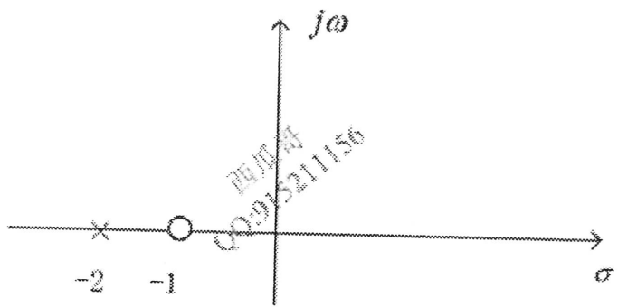

因为 \(H(s)\) 的极点为负数，所以系统是稳定的。

西瓜哥原创答

---

# 南昌大学

# 2009年招收攻读硕士研究生

# 入学考试自命题试题

科目代码及名称： 信号与系统811

适用专业： 电子与通信工程等

(所有答案都必须写在答题纸上, 写在试卷纸上及草稿纸上无效, 考完后试题随答题纸收回)

# 一．单项选择题（每题5分，共25分）

1. 系统 \(y(n) = \sin \left(\frac{2 \pi}{7} n + \frac{\pi}{6}\right) x(n)\), 是一个什么样的系统: ( ) ;

A. 线性时变系统

B. 线性时不变系统

C. 非线性时变系统

D. 非线性时不变系统

2. 如下图所示信号 \(f(t)\), 其傅里叶变换 \(F[f(t)] = F(j \omega) = R(\omega) + j X(\omega)\), 实部 \(\mathrm{R}(\mathrm{w})\) 的表示式为: ( ) ; (刺猬哥考研团队, 答疑交流群 709502924)

A. \(3 \mathrm{Sa}(2 \omega)\)

B. \(3 \mathrm{~Sa} (\omega / 2)\)

C. \(3 \mathrm{Sa}(\omega)\)

D. \(2 \mathrm{Sa}(\omega)\)

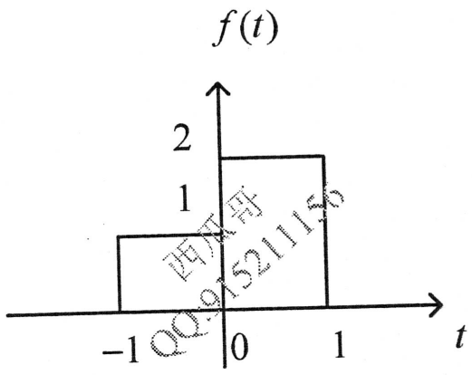

3. 已知 \(f(t)\) 的频带宽度为 \(\Delta \omega\), 则 \(f(2 t - 4)\) 的频带宽度为 ( ) ;

---

A. \(2 \Delta \omega\)

B. \(1 / 2 \Delta \omega\)

C. \(2(\Delta \omega - 4)\)

D. \(2(\Delta \omega - 2)\)

4. 系统函数 \(H(s)\) 与激励信号 \(X(s)\) 之间（ ）；

A. 是反比关系

B. 无关系

C. 线性关系

D. 不确定

5. 一个因果稳定的离散系统, 其 \(H(z)\) 的全部极点须分布在 \(z\) 平面的 ( ) ;

A. 单位圆外

B. 单位圆内

C. 单位圆上

D. 单位圆内 (不含 \(z = 0\) )

# 二．填空题 （每题5分，共20分）

1. \(\frac{d}{dt} [e^{-t} u(t)^{*} u(t)] =\) ________；（刺猬哥考研团队，答疑交流群 709502924）

2. 已知 \(\mathcal{F}[f(t)] = F(j\omega), \mathcal{F}[f(t - \tau)\cos \omega_0 t] = \) ________;

3. 已知系统函数 \(H(s) = \frac{1}{s^2 + (1 - k)s + k + 1}\), 要使系统稳定, 试确定 \(k\) 值的范围________;

4. \(Z\left[\left(\frac{1}{2}\right)^{n} u(n) + \delta (n)\right] =\) ，收敛域为

# 三．简单计算题（每题15分，共45分）

1. 画出如图所示信号 \(f(t)\) 的偶分量 \(f_{e}(t)\) 和奇分量 \(f_{o}(t)\) 。

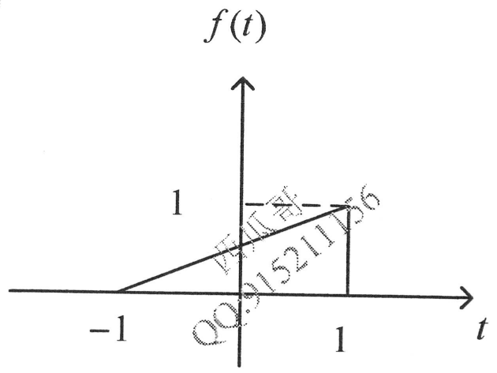

2. 计算 \( f(t) = e^{-t} [u(t) - u(t - 3)] \) 和 \( x(t) = u(t) - u(t - 2) \) 两者的卷积。

---

3. 已知系统函数的极点为 \(p_{1} = 0\), \(p_{2} = -1\), 零点为 \(z_{1} = 1\), 如该系统的冲激响应的终值为 -10 , 求此系统的系统函数 \(H(s)\) 。

# 四. 计算题 (每题 20 分, 共 60 分)

1. 系统如下图所示, 已知 \(x(t) = \frac{\sin t}{\pi t}, s(t) = \cos (1000 t)\), 低通滤波器的频率特性为 \(H(j \omega) = [u(\omega + 2) - u(\omega - 2)] e^{-j \omega}\), 画出 \(Y_{A}(j \omega)\) 及 \(Y_{B}(j \omega)\) 和求 \(y(t)\) 。

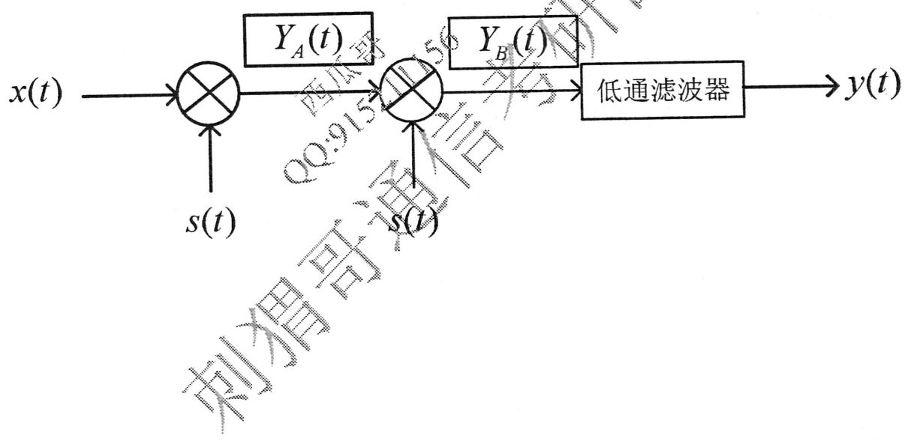

2. 系统如图所示（设系统初始无储能），

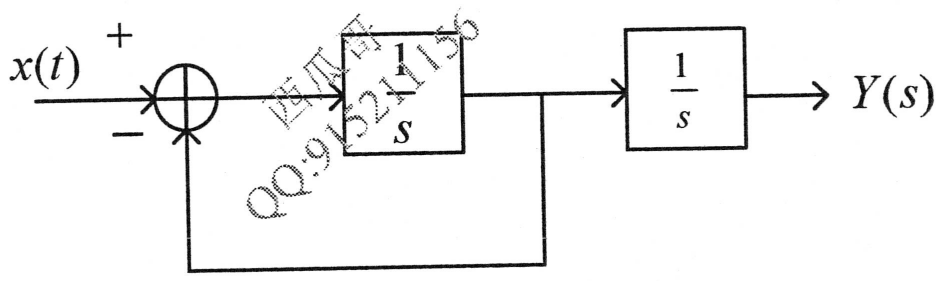

---

24最强信号辅导班招生啦！让你节省时间，不走弯路，取得佳绩！联系西瓜哥qq915211156 加Q群709502924，使用刺猬哥团队正版核心序列ORK，享受高质量全天候优质答疑指导

求系统函数 \(H(s) = \frac{Y(s)}{X(s)}\), 并讨论系统的稳定性, 求系统的冲激响应和阶跃响应。

3. 已知一因果离散系统的差分方程为: \(y(n) + 3y(n - 1) + 2y(n - 2) = x(n) - x(n - 1)\), 已知 \(y(-2) = 0\), \(y(-1) = 1\), \(x(n) = 3 \cdot (2)^n u(n)\), 求零输入响应 \(y_{zi}(n)\) 与零状态响应 \(y_{zs}(n)\)。（刺猬哥考研团队，西瓜哥 QQ：915211156）

---

# 2009 南昌大学信号与系统 811 真题详解

——西瓜哥原创作答

# 一、选择题

题 1 解: A

$$
\begin{array}{l} y (n) = \sin (\frac {2 \pi}{7} n + \frac {\pi}{6}) x (n) \\ r \left[ a _ {1} x _ {1} (n) + a _ {2} x _ {2} (n) \right] = a _ {1} y _ {1} (n) + a _ {2} y _ {2} (n) \\ \end{array}
$$

因为: \(r[x(n - m)] = \sin \left(\frac{2\pi}{7} n + \frac{\pi}{6}\right) x(n - m) \neq y(n - m)\)

所以该系统为线性时变系统。（刺猬哥考研团队，西瓜哥QQ：915211156）

题 2 解: C

先将 \( f(t) \) 分解成奇分量和偶分量: \( f(t) = f_{e}(t) + f_{o}(t) \)

然后求出偶分量: \(f_{e}(t) = \frac{1}{2} [f(t) + f(-t)] = \frac{3}{2} [u(t + 1) - u(t - 1)]\)

若时域为实数, 则信号时域的偶分量的频域等于信号频域的实部。

得: \(R(\omega) = \mathcal{F}[f_{e}(t)] = 3 S a(\omega)\)

这里需要记住下面的傅里叶变换。

设: \(G_{\tau}(t) = u\left(t + \frac{\tau}{2}\right) - u\left(t - \frac{\tau}{2}\right)\), 也就是一个宽度为 \(\tau\), 中心在原点的时域矩形框。 \(G_{2 \omega_0}(\omega) = u\left(\omega + \omega_0\right) - u\left(\omega - \omega_0\right)\), 也就是一个宽度为 \(\omega_0\), 中心在原点的频域矩形框。

则: \(E G_{\tau}(t) \xrightarrow{\mathcal{F}} E \tau S a\left(\frac{\tau}{2} \omega\right)\) (1)

$$
S a \left(\omega_ {0} t\right) \xrightarrow {\mathcal {F}} \frac {\pi}{\omega_ {0}} G _ {2 \omega_ {0}} (\omega) \tag {2}
$$

---

24最强信号辅导班招生啦！让你节省时间，不走弯路，取得佳绩！联系西瓜哥qq915211156 加Q群709502924，使用刺猬哥团队正版核心序列ORK，享受高质量全天候优质答疑指导

题3解：A

根据傅里叶变换的尺度变换性质, 时域压缩成一半, 频域扩展成两倍。

也可以根据频域带宽与时域脉冲宽度存在反比的关系来解答。

题 4 解: B

系统函数是系统固有的，与激励信号没有关系。

题 5 解: B

考察离散系统的因果稳定性特点

# 二. 填空题

题 6 解: \(e^{-t} u(t)\)

$$
\frac {d}{d t} \left[ e ^ {- t} u (t) ^ {*} u (t) \right] = \frac {d u (t)}{d t} * e ^ {- t} u (t) = \delta (t) ^ {*} e ^ {- t} u (t)
$$

题7解： \(\frac{1}{2} e^{-j\omega \tau}[F(j\omega +\omega_0) + F(j\omega -\omega_0)]\)

$$
\begin{array}{l} F [ \cos (w _ {0} t) ] = \pi [ \delta (w + w _ {0}) + \delta (w - w _ {0}) ] \\ F [ f (t - \tau) ] = F (j w) e ^ {- j \tau w} \\ F [ f (t - \tau) \square \cos (w _ {0} t) ] = \frac {1}{2 \pi} F [ \cos (w _ {0} t) ] * F [ f (t - \tau) ] \\ = [ \frac {1}{2} e ^ {- j (\omega + \omega_ {0}) \tau} F (j \omega + \omega_ {0}) + \frac {1}{2} e ^ {- j (\omega - \omega_ {0}) \tau} F (j \omega - \omega_ {0}) ] \\ \end{array}
$$

本题综合考察傅利叶变换的性质。

题8解： \((-1,1)\)

要使系统稳定, 系统函数的极点 \(s_{1} . s_{2}\) 横坐标需要小于 0 .

---

$$
f (s) = s ^ {2} + (1 - k) s + k + 1 = 0
$$

要使得解: \(R \left[ s_{1} \right] < 0, R \left[ s_{2} \right] < 0\), 也就是所有的根为负数

只需使得 \(\left\{ \begin{array}{l} s_{1} + s_{2} = -1 + k < 0 \\ s_{1}s_{2} = k + 1 > 0 \end{array} \right.\)

不一定要有实根，只需实部小于 0 .

2z-1 2z-2 1 题9解： z- 1 2

$$
Z [ (\frac {1}{2}) ^ {n} u (n) + \delta (n) ] = \frac {z}{z - \frac {1}{2}} + 1 = \frac {2 z - \frac {1}{2}}{z - \frac {1}{2}}
$$

收敛域为: \(|z| > \frac{1}{2}\) （刺猬哥考研团队, 西瓜哥QQ: 915211156）

# 二、简单计算题

题 1 解:

利用下式画图

$$
f _ {e} (t) = \frac {1}{2} (f (t) + f (- t)) = \frac {1}{2} [ u (t + 1) - u (t - 1) ]
$$

$$
f _ {o} (t) = \frac {1}{2} (f (t) - f (- t)) = \frac {t}{2} [ u (t + 1) - u (- t - 1) ]
$$

可以得到其分别的图像如下所示:

---

_\(f_{e}(t)\)_

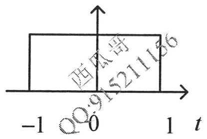

_偶分量_

_\(\mathbf{f}_o(t)\)_

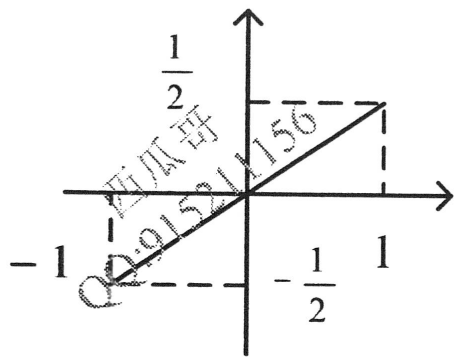

_奇分量_

题2解：

$$
\begin{array}{l} s (t) = f (t) * g (t) = f ^ {- 1} (t) * g ^ {\prime} (t) \\ = (1 - e ^ {- t}) u (t) - [ 1 - e ^ {- (t - 2)} ] u (t - 2) - e ^ {- 3} [ 1 - e ^ {- (t - 3)} ] u (t - 3) + e ^ {- 3} [ 1 - e ^ {- (t - 5)} ] u (t - 5) \\ \end{array}
$$

题3解：

假设系统函数为: \(H(s) = k \frac{s - 1}{s(s + 1)}\)

利用终值定理: \(h(\infty) = \lim _{s \rightarrow 0} s F(s)=-k=-10\)

得： \(H(s) = \frac{10s - 10}{s(s + 1)}\)

# 四．计算题

题1解：

$$
\begin{array}{l} y _ {A} (t) = x (t) s (t) = \frac {\sin t}{\pi t} \text {c o s} (1 0 0 0 t) \\ X (\omega) = u (\omega + 1) - u (\omega - 1) \\ Y _ {A} (\omega) = F \left[ y _ {A} (t) \right] = \frac {1}{2 \pi} X (\omega) * S (\omega) = \frac {1}{2} \left[ X (\omega + 1 0 0 0) + X (\omega - 1 0 0 0) \right] \\ \end{array}
$$

---

由此画出 \(Y_{A}(\omega)\) 的图像

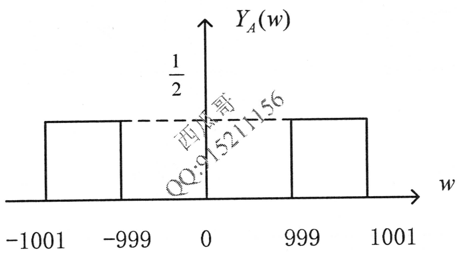

$$
\begin{array}{l} Y _ {B} (t) = y _ {A} (t) \text {S} (t) = x (t) s (t) s (t) = x (t) \frac {\cos (2 0 0 0 t) + 1}{2} \\ Y _ {B} (\omega) = \frac {1}{2} X (\omega) + \frac {1}{4} [ X (\omega + 2 0 0 0) + X (\omega - 2 0 0 0) ] \\ \end{array}
$$

由此画出 \(Y_{B}(\omega)\) 的图像

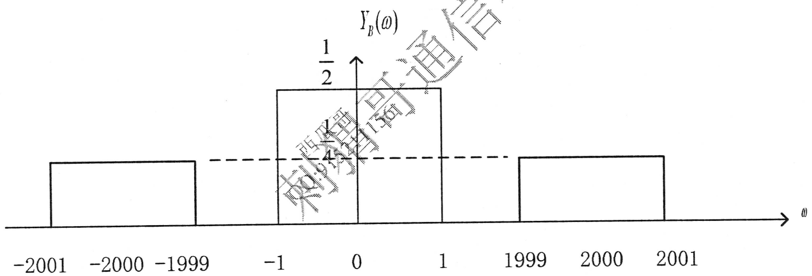

$$
\begin{array}{l} Y (\omega) = Y _ {B} (\omega) \square H (\omega) = \frac {1}{2} [ u (\omega + 1) - u (\omega - 1) ] \square^ {- j \omega} \\ y (t) = F ^ {- 1} [ Y (\omega) ] = \frac {1}{2 \pi} S a (t - 1) \\ \end{array}
$$

题2解：

$$
Y (s) = H (s) X (s) = \frac {1}{s (s + 1)} X (s)
$$

---

可得到系统函数 \(H(s) = \frac{1}{s(s + 1)}\)

由： \(H(s) = \frac{1}{s(s + 1)} = \frac{1}{s} -\frac{1}{s + 1}\)

一个极点在 \(\mathrm{jw}\) 轴上，所以系统临界稳定

可得到冲激响应 \(h(t) = (1 - e^{-t})u(t)\)

由 \(G(s) = \frac{1}{s} \mathrm{H}(s) = \frac{1}{s^2(s + 1)} = \frac{1}{s^2} - \frac{1}{s} + \frac{1}{s + 1}\)

可得阶跃响应 \(g(t) = (t - 1 + e^{-t})u(t)\)

题3解：

系统的特征方程为: \(\lambda^2 + 3\lambda + 2 = 0\)

特征根为: \(\lambda_{1} = -1, \lambda_{2} = -2\)

则零输入响应为： \(y_{zi}(n) = A_1(-1)^n +A_2(-2)^n,n\geq 0\)

代入起始状态得: \(A_{1} = 1, A_{2} = -4\)

$$
y _ {z i} (n) = [ (- 1) ^ {n} - 4 (- 2) ^ {n} ] \cdot u (n)
$$

对差分方程两端作单边 \(Z\) 变换（起始状态为 0），有：

$$
Y _ {z s} (z) = \frac {3 z ^ {2} (z - 1)}{(z + 1) (z + 2) (z - 2)} = \frac {- 2 z}{z + 1} + \frac {9}{2} \cdot \frac {z}{z + 2} + \frac {1}{2} \cdot \frac {z}{z - 2}
$$

可得零状态响应: \(y_{zs}(n) = [-2 \cdot (-1)^{n} + \frac{9}{2} (-2)^{n} + \frac{1}{2} (2)^{n}] u(n)\)

---

# 南昌大学

# 2010年招收攻读硕士研究生

# 入学考试自命题试题

科目代码及名称： 信号与系统811

适用专业： 电子与通信工程等

(所有答案都必须写在答题纸上, 写在试卷纸上及草稿纸上无效, 考完后试题随答题纸收回)

# 一、填空题（每题5分，总共50分）

1. \(\int_{0_{-}}^{+3}e^{-2t}\sum_{k = -\infty}^{\infty}\delta (t - 2k)dt = \underline{\quad};\)

2. 信号的频域宽度与其时域脉冲宽度之间存在________的关系。

3. 已知 \(f(t)\) 的傅里叶变换为 \(U(\omega)\), 则 \(f(t)\) 为 ____________;

4. 确定 \(S a(50 t) \cdot S a(100 t)\), 其奈奎斯特抽样间隔

5. 已知 \(f(t) = \sin \omega_0 (t - t_0)\), 则其单边拉式变换为

6. 对于一稳定系统, 其冲激响应 \(h(t)\) 应满足的条件为

7. 一双边序列 \(x[n]\), 其 \(z\) 变换为 \(X(z) = \frac{5 z}{7 z - 3 z^{2} - 2}\), 则 \(x[n]\) 为

8. \(X(n) = A \cos \left(\frac{3\pi}{7} n - \frac{\pi}{8}\right)\) 为一周期序列, 则其周期为

9. 已知 \(\mathcal{F}[f(t)] = F(\omega)\), 则 \(f(8 - 2t)\) 的傅里叶变换为

10. 假定信号通过线性系统不失真, 则其系统函数 \(H(j \omega)\) 为

---

# 二、简单计算题（每题20分，总共40分）

1. 已知二阶系统其系统函数为: \(H(z) = \frac{3z + 10}{z^2 + 7z + 12}\), 请画出系统流图及列写系统的差分方程。

2. 已知 \(f(t) = e^{-at} u(t)\), 如果频带 \((- \omega_{c}, \omega_{c})\) 包含信号的总能量的 \(50 \%\), 求其 \(\omega_{c}\).

# 三、计算题（每题30分，总共60分）

1. 某一线性系统, 输入信号 \(x(t)\) 的频谱 \(X(\omega)\), 它通过网络 \(H_{1}(\omega)\) 后便采用冲激序列 \(\delta_{T}(t)\) 进行采样, \(H_{1}(\omega)\) 的频率特性如图所示。

(1) 为保证不出现混叠效应, 求最低抽样频率。

(2) 求抽样输出信号 \(y(t)\) 的频谱函数。

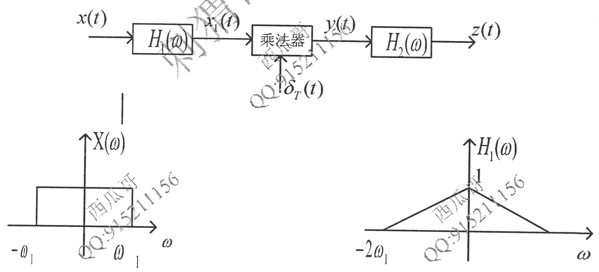

---

2. 某线性非时变系统的系统函数 \( H(s) = \frac{s + c}{s^2 + as + b} \)，已知当输入 \( f(t) = u(t) \) 时，其全响应为 \( y(t) = (1 - e^{-2t} + 2e^{-3t})u(t) \)。

(1) 求系统函数中的 \(a 、 b\) 和 \(c\) 的值。

(2) 求该系统的零输入响应和零状态响应。

---

# 2010南昌大学信号与系统811真题详解

——西瓜哥原创作答

# 一、填空题

题 1 解: \(1 + e^{-4}\)

$$
\begin{array}{l} \int_ {0 ^ {-}} ^ {+ 3} e ^ {- 2 t} \sum_ {k = - \infty} ^ {\infty} \delta (t - 2 k) d t = \int_ {0 ^ {-}} ^ {+ 3} \sum_ {k = - \infty} ^ {\infty} e ^ {- 4 k} \delta (t - 2 k) d t \\ = \sum_ {k = - \infty} ^ {\infty} e ^ {- 4 k} \int_ {0 ^ {-}} ^ {+ 3} \delta (t - 2 k) d t = \sum_ {k = 0} ^ {1} e ^ {- 4 k}. 1 = 1 + e ^ {- 4} \\ \end{array}
$$

题2解： \(B_{\omega} = \frac{2\pi}{\tau}\)

信号的等效脉冲宽度与占有的等效带宽成反比。

题3解： \(\frac{j}{2\pi t} +\frac{\delta(t)}{2}\)

因为: \(\mathcal{F} - [u(t)] = \pi \delta (\omega) + \frac{1}{j \omega}\)

再根据傅里叶变换的对称性得 \(\mathcal{F}^{-1}[u(\omega)] = \frac{j}{2\pi t} + \frac{\delta(t)}{2}\)

题 4 解: \(\frac{\pi}{150} s\)

将 \(S a(50 t) \cdot S a(100 t)\) 转到频域, 可知频带宽为 \(\omega_{m} = 150\)

奈全斯特抽样间隔为: \(T_{s} = \frac{2 \pi}{\omega_{s}} = \frac{2 \pi}{2 \omega_{m}} = \frac{\pi}{150}\)

这是一道常考题, 将时域转到频域去解。如果不是很理解得可以参考 2011 年真题得第 3 , 第 4 题解析。

---

\(\omega_{0} \cos \left(\omega_{0} t_{0}\right) - s \sin \left(\omega_{0} t_{0}\right)\) 题5解：\(\frac{\omega_{0} \cos \left(\omega_{0} t_{0}\right)}{\omega_{0}^{2} + s^{2}} - \frac{s \sin \left(\omega_{0} t_{0}\right)}{\omega_{0}^{2} + s^{2}}\)

因为： \(\mathcal{L}[\sin (\omega_0t)u(t)] = \frac{\omega}{\omega^2 + s^2}\)

本题求的是 \(\mathcal{L}[\sin \omega_0(t - t_0)u(t)] = \mathcal{L}[\sin (\omega_0t)\cos (\omega_0t_0)u(t) - \cos (\omega_0t)\sin (\omega_0t_0)u(t)]\)

$$
= \frac {\omega_ {0} \cos \left(\omega_ {0} t _ {0}\right)}{\omega_ {0} ^ {2} + s ^ {2}} - \frac {s \sin \left(\omega_ {0} t _ {0}\right)}{\omega_ {0} ^ {2} + s ^ {2}}
$$

题 6 解: \(\lim_{t \to \infty} [h(t)] = 0, \int_{-\infty}^{\infty} |h(t)| dt \leq M\)

考察线性系统的稳定性

题7解： \((\frac{1}{3})^{n + 1}u(n) + 2^{n + 1}u(-n - 1)\)

原式可以变换为: \(X(z) = \frac{5z}{7z - 3z^2 - 2} = \frac{z}{z - \frac{1}{3}} + \frac{-z}{z - 2}\) 。收敛域为 \(\frac{1}{3} < |z| < 2\)

而根据

$$
Z [ - a ^ {n} u (- n - 1) ] = \frac {z}{z - a}, | z | <   | a |
$$

得 \(Z^{-1}[X(z)] = \left(\frac{1}{3}\right)^n u(n) + 2^n u(-n - 1)\)

题 8 解: 14

假设周期为 \(T\),

则 \(x(n) = A \cos \left(\frac{3\pi}{7} n - \frac{\pi}{8}\right) = x(n + T) = A \cos \left(\frac{3\pi}{7} n + \frac{3\pi}{7} T - \frac{\pi}{8}\right)\)

---

24最强信号辅导班招生啦！让你节省时间，不走弯路，取得佳绩！联系西瓜哥qq915211156 加Q群709502924，使用刺猬哥团队正版核心序列ORK，享受高质量全天候优质答疑指导

也即 \(\frac{3 \pi}{7} n - \frac{\pi}{8} + 2 m \pi = \frac{3 \pi}{7} n + \frac{3 \pi}{7} T - \frac{\pi}{8}\) 其中 \(m\) 为任意整数

解得； \(T = \frac{14\mathrm{m}}{3}\) 当 \(m = 3\) 时 \(T\) 取得最小正周期14

题 9 解: \(\frac{1}{2} F\left(-\frac{j \omega}{2}\right) e^{-j4 \omega}\)

考察傅里叶变换的时移与尺度变换性质。

题 10 解: \(H(j \omega) = k e^{-j \omega t_{0}}\)

考察线性系统不失真的条件。

# 二、简答计算题

题1解：

因为系统函数为: \(H(z) = \frac{3z + 10}{z^2 + 7z + 12} = \frac{3z^{-1} + 10z^{-2}}{1 + 7z^{-1} + 12z^{-2}}\) 可通过梅森公式画出信号流图。

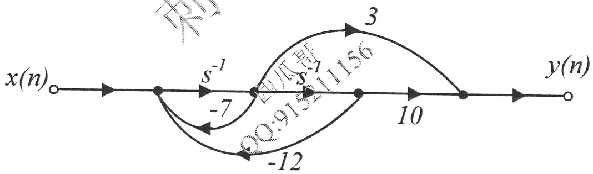

差分方程: \(y(n) + 7y(n - 1) + 12y(n - 2) = 3x(n - 1) + 10x(n - 2)\)

题2解：

$$
F (\omega) = \frac {1}{a + j \omega}, | F (\omega) | = \frac {1}{\sqrt {a ^ {2} + \omega^ {2}}}
$$

---

$$
E = \int_ {- \infty} ^ {\infty} | f (t) | ^ {2} d t = \frac {1}{2 a} = 2 \times \frac {1}{2 \pi} \int_ {- \omega_ {c}} ^ {\omega_ {c}} | F (\omega) | ^ {2} d \omega
$$

所以 \(\left[\frac{1}{\pi} \times \frac{\arctan \frac{\omega}{a}}{a}\right]_{-\omega_c}^{\omega_c} = \frac{1}{2a}\)

得 \(\omega_{c} = a\)

# 三、计算题

题1解：

(1)

保证不混叠

$$
f = \frac {\omega_ {1}}{2 \pi}, f _ {s} \geq 2 f = \frac {\omega_ {1}}{\pi}
$$

(2)

$$
\begin{array}{l} X _ {1} (\omega) = X (\omega). H _ {1} (\omega) \\ y (t) = x _ {1} (t). \delta_ {T} (t) \\ Y (\omega) = \frac {1}{2 \pi} X (\omega) \square H _ {1} (\omega) * \frac {2 \pi}{T} \sum_ {n = - \infty} ^ {\infty} \delta (\omega - n \square \frac {2 \pi}{T}) \\ = \frac {1}{T} \sum_ {n = - \infty} ^ {\infty} X _ {1} \left(\omega - n \frac {2 \pi}{T}\right) \\ \end{array}
$$

其中 \(X_{1}(jw) = 1 - \frac{|\omega|}{2\omega_{1}}, |\omega| < \omega_{1}\)

(刺猬哥考研团队, 答疑交流群 709502924)

题2解：

(1)

由系统函数可得系统差分方程为:

---

$$
y ^ {\prime \prime} (t) + a y ^ {\prime} (t) + b y (t) = x ^ {\prime} (t) + c x (t) \quad (1)
$$

对（1）进行拉式变换： \(s^2 Y - sy(0-) - y'(0-) + a[sY - y(0-)] + bY = sX + cX\) (2)

由（2）得 \(Y = \frac{(s + c)X}{s^2 + as + b} +\frac{sy(0 - ) + y'(0 - ) + ay(0 - )}{s^2 + as + b}\) (3）

其中（3）式第一项为零状态响应，第二项为零输入响应。

由全响应 \(\mathrm{y}(\mathrm{t})\) 可知， \(Y = \frac{1}{s} -\frac{1}{s + 2} +\frac{2}{s + 3} = \frac{2s^2 + 6s + 6}{(s + 2)(s + 3)s}\) (4)

由（4）式可知系统函数的两个极点分别为-2，-3

也即 \(s^2 + as + b = (s + 2)(s + 3)\)，得到 \(a = 5, b = 6\)

将 \(X(s) = \frac{1}{s}\) 代入零状态响应：\(Y_{zs} = \frac{(s + c)}{(s + 2)(s + 3)s} = \frac{\frac{c}{6} + \frac{c - 2}{-2}}{s + 2} + \frac{\frac{c - 3}{3}}{s + 3}\) (5)

\(\frac{c}{6}\) 应该为 \(\mathrm{u(t)}\) 的拉式变换, 得 \(\frac{c}{6} = 1, c = 6\)

综上所述： \(a = 5,b = 6,c = 6\)

(2)

由（5）式知： \(Y_{zs} = \frac{1}{s} -\frac{2}{s + 2} +\frac{1}{s + 3}\) (6)

于是 \(y_{zs} = (1 - 2e^{-2t} + e^{-3t})u(t)\) \(y_{zi} = y - y_{zs} = (e^{-2t} + e^{-3t})u(t)\)

(刺猬哥考研团队, 答疑交流群 709502924)

---

# 南昌大学

# 2011年招收攻读硕士研究生

# 入学考试自命题试题

科目代码及名称： 信号与系统811

适用专业： 电子与通信工程等

(所有答案都必须写在答题纸上, 写在试卷纸上及草稿纸上无效, 考完后试题随答题纸收回)

# 一、填空题（每题5分，总共50分）

1. \(\int_{-\infty}^{\infty}\delta (at - b)\sin^{2}(t - 4)dt =\)

2. 令 \(h(t)\) 为因果系统的单位冲激响应, \(h_e(t) = t[u(t) - u(t - 1)] + u(t - 1), t > 0\), \((h_e(t)\) 为该因果系统 \(h(t)\) 的偶分量), 则 \(h(t)\) 的数学表达式为

3. 已知 \(F[f(t)] = u(\omega + \omega_0) - u(\omega - \omega_0)\), 则 \(f(t)\) 为

4. 确定 \(S_{a}(50 t) + S_{a}(100 t)\) 其奈奎斯特抽样间隔

5. 若 \(f(t)\) 的拉氏变换为 \(F(s), F(s) = \frac{b(s - 1)}{s(s + 1)}\) 且 \(f(\infty) = 10\)，则 b 为

6. 求 \( f(t) = t^2 \cos 2t \) 的单边拉氏变换

7. 最小相移网络在 \(S\) 平面的零分布有何特点

8. 已知 \( f(n) = (n - 1)u(n - 1) \)，则其单边 \( z \) 变换为

9. 离散时间系统的系统函数 \(H(z) = \frac{z}{z - 0.5}\), 则该系统为哪种______滤波器。

10. 某双边序列 \(x(n) = b^{|n|}\) （其中 \(\frac{1}{b} > b > 0\)）则其收敛域为

---

# 二、问答及简单计算题（每题15分，总共30分）

1. 请阐述线性失真与非线性失真的区别。（刺猬哥考研团队，答疑交流群 709502924）

2. 电路如下图所示, \(R = 2 \Omega\), \(\mathrm{L} = 1 \mathrm{H}, \mathrm{C} = 1 \mathrm{~F}, x(t)\) 为激励信号, 以 \(V_{c}(t)\) 作为响应。求系统函数 \(h(t)\).

(1) 求该系统的系统函数 \(H(s)\) 及冲激响应 \(h(t)\)

(2) 求系统的起始状态 \(i_{L}(0_{-})\), \(V_{c}(0_{-})\), 使系统的零输入响应等于冲激响应

(3) 求系统的起始状态 \(i_{L}(0_{-})\), \(V_{c}(0_{-})\), 使系统对 \(x(t) = u(t)\) 的全响应仍为 \(u(t)\)

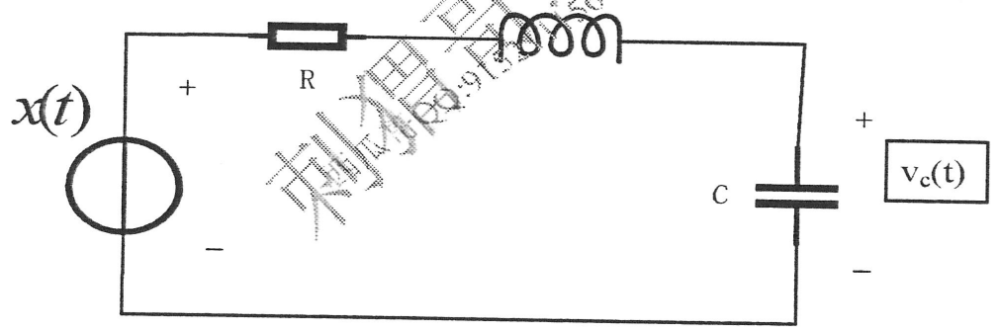

---

# 三、计算题（每题35分，总共70分）

1. 下图为一个正交振幅调制（QAM）系统的方框图。设输入信号 \(f_{1}(t)\) 和 \(f_{2}(t)\) 的带宽都为 \(\omega_{0}\)，其中 \(\omega_{0} << \omega_{c}\)，\(\omega_{c}\) 为载波角频率。试计算：\(g_{1}(t)\) 和 \(g_{2}(t)\) 的频谱函数。

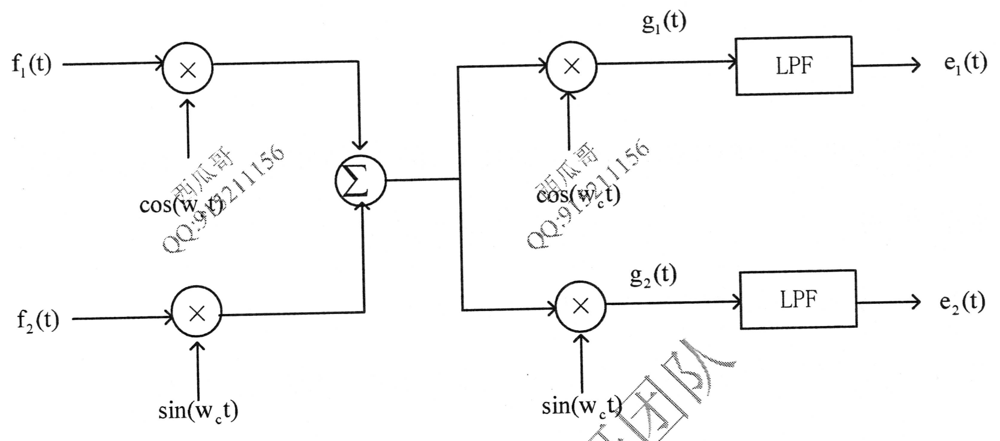

---

24最强信号辅导班招生啦！让你节省时间，不走弯路，取得佳绩！联系西瓜哥qq915211156加Q群709502924，使用刺猬哥团队正版核心序列ORK，享受高质量全天候优质答疑指导

2. 一离散系统如图所示。

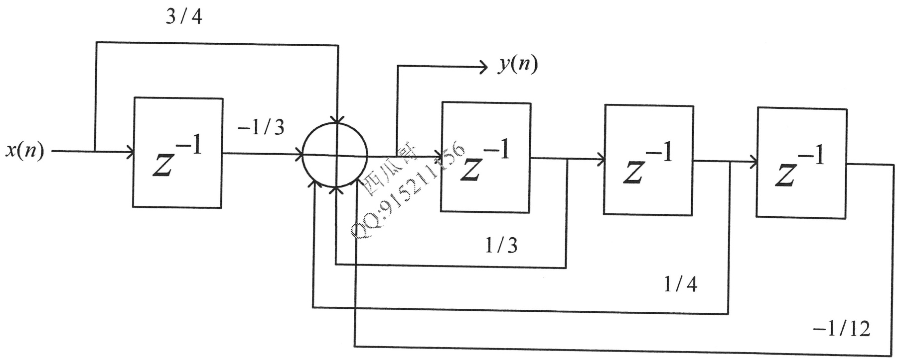

(1) 列出系统得差分方程

(2) 求系统函数 \(H(z)\)

（3）求单位样值响应 \(h(n)\) 。

(4) 判断系统的稳定性。（刺猬哥考研团队，答疑交流群 709502924）

---

# 2011 南昌大学信号与系统 811 真题详解

——西瓜哥原创作答

# 一、填空题

题1解： \(\frac{1}{|a|}\sin^2\left(\frac{b}{a} -4\right)\)

$$
\begin{array}{l} \int_ {- \infty} ^ {\infty} \delta (a t - b) \sin^ {2} (t - 4) d t = \int_ {- \infty} ^ {\infty} \delta (a t - b) \sin^ {2} (\frac {b}{a} - 4) d t \\ = \sin^ {2} (\frac {b}{a} - 4) \int_ {- \infty} ^ {\infty} \delta (a t - b) d t = \frac {1}{| a |} \sin^ {2} (\frac {b}{a} - 4) \\ \end{array}
$$

本题主要考察冲激函数的性质: \(\int_{-\infty}^{\infty} f(t) \delta(at - b) dt = \frac{1}{|a|} f\left(\frac{b}{a}\right)\)

题2解： \(h(t) = 2t[u(t) - u(t - 1)] + 2u(t - 1)\)

将 \( h(t) \) 分解成偶分量 \( h_e(t) \)，奇分量 \( h_o(t) \) 的叠加。

$$
\left\{ \begin{array}{l} h (t) = h _ {e} (t) + h _ {o} (t) \quad (1) \\ h (- t) = h _ {e} (- t) + h _ {o} (- t) = h _ {e} (t) - h _ {a} (t) \end{array} \right. \tag {2}
$$

由(1)、(2)解得: \(h_{e}(t) = \frac{1}{2} (h(t) + h(-t))\) (3)

又因为 \(h(t)\) 是因果信号, 所以

$$
h (t) = \left\{ \begin{array}{l l} 0, & t <   0 \\ h (0), & t = 0 \\ h (t), & t > 0 \end{array} \right. \quad h (- t) = \left\{ \begin{array}{l l} h (- t), & t <   0 \\ h (0), & t = 0 \\ 0, & t > 0 \end{array} \right. \tag {5}
$$

将(4)、(5)代入(3)中得:

$$
h _ {e} (t) = \left\{ \begin{array}{l l} \frac {1}{2} h (- t), & t <   0 \\ h (0), & t = 0 \\ \frac {1}{2} h (t), & t > 0 \end{array} \right. \tag {6}
$$

---

24最强信号辅导班招生啦！让你节省时间，不走弯路，取得佳绩！联系西瓜哥qq915211156 加Q群709502924，使用刺猬哥团队正版核心序列ORK，享受高质量全天候优质答疑指导

由(4)，(6)得 \(h(t) = \left\{ \begin{array}{ll}0, & t < 0\\ h_e(0), & t = 0\\ 2h_e(t), & t > 0 \end{array} \right.\) (7)，得 \(h(t) = 2t[u(t) - u(t - 1)] + 2u(t - 1)\)

这是考试比较经典的通过偶分量求解原函数的题, 需要将整个推导过程熟练运用。做习惯了就要记住(7)这个结论。（刺猬哥考研团队，西瓜哥QQ: 915211156）

题 3 解: \(\frac{\omega_{0}}{\pi} S a\left(\omega_{0} t\right)\)

这里涉及到一对经典的傅里叶变换对，必须牢记，几乎年年真题都会用到这个变换对进行快速求解。

设: \(G_{\tau}(t) = u\left(t + \frac{\tau}{2}\right) - u\left(t - \frac{\tau}{2}\right)\), 也就是一个宽度为 \(\tau\), 中心在原点的时域矩形框。

\(G_{2\omega_0}(\omega) = u(\omega + \omega_0) - u(\omega - \omega_0)\), 也就是一个宽度为 \(\omega_0\), 中心在原点的频域矩形框。

则： \(EG_{\tau}(t)\xrightarrow{\mathcal{F}}E\tau Sa(\frac{\tau}{2}\omega)\) (1)

$$
S a \left(\omega_ {0} t\right) \xrightarrow {\mathcal {F}} \frac {\pi}{\omega_ {0}} G _ {2 \omega_ {0}} (\omega) \tag {2}
$$

(1)、（2）两对变换一定要牢牢记住。我们可以稍作分析一下这两对变换，(1)是时域函数为矩形框，对应的频域为 \( S a \) 函数。(2)是时域为 \( S a \) 函数，对应频域函数图形为矩形框。也就是说通过这两对变换，如果时域给出矩形框函数或者 \( S a \) 函数，我们可以求其频域；如果频域给出矩形框函数或者 \( S a \) 函数，我们可以求其时域。

我们将题目的参数代入(2)式即可得出答案:

$$
S a \left(\omega_ {0} t\right) \xrightarrow {\mathcal {F}} \frac {\pi}{\omega_ {0}} G _ {2 \omega_ {0}} (\omega)
$$

$$
\frac {\pi}{\omega_ {0}} G _ {2 \omega_ {0}} (\omega) \xrightarrow {\mathcal {F} ^ {- 1}} S a (\omega_ {0} t)
$$

$$
G _ {2 \omega_ {0}} (\omega) \xrightarrow {\mathcal {F} ^ {- 1}} \frac {\omega_ {0}}{\pi} S a \left(\omega_ {0} t\right)
$$

题 4 解: \(\frac{\pi}{100}\)

$$
F \left[ S a (5 0 t) + S a (1 0 0 t) \right] = \frac {\pi}{5 0} G _ {1 0 0} (\omega) + \frac {\pi}{1 0 0} G _ {2 0 0} (\omega) \tag {1}
$$

更多优质考研资讯，关注b站 | 公众号“刺猬哥通信电子考研”、知乎“刺猬哥通信考研”

---

由此可知该信号频带宽度为: \(\omega_{m} = 100\)

奈奎斯特频带宽度为: \(\omega_{s} = 2 \omega_{m} = 200\)

奈奎斯特间隔: \(T_{s} = \frac{2 \pi}{\omega_{s}} = \frac{2 \pi}{200} = \frac{\pi}{100}\)

说明: \(G_{2 \omega_0}(\omega) = u\left(\omega + \omega_0\right) - u\left(\omega - \omega_0\right)\), 由 (1) 可知该信号的频域为一个宽度为 100 的矩形框与一个宽度为 200 的矩形框相加, 所得的频域范围为 \([- 100.100]\), 由于负数频域只是我们假想出来便于计算的, 真实并不存在的。所以该频域的真实频带宽度为 \(\omega_m = 100\) 。

题 5 解: -10

本题主要运用了单边拉式变换的终值定理.

\( f(\infty) = \lim_{s \to 0} s F(s), \quad s = 0 \) 在收敛域内，即终值存在才可用终值定理。

$$
\lim  _ {s \rightarrow 0} s F (s) = \lim  _ {s \rightarrow 0} s \frac {b (s - 1)}{s (s + 1)} = \lim  _ {s \rightarrow 0} \frac {b s ^ {2} - b s}{s ^ {2} + s} = - b
$$

由 \(f(\infty) = 10 = \lim_{s\to 0}sF(s) = -b\) 得 \(b = -10\)

题6解： \(\frac{2s^3 - 24s}{(s^2 + 4)^3}\)

由单边拉氏变换得复频域微分特性: \(t^{n} f(t) \xrightarrow{\mathcal{L}} (-1)^{n} \frac{d^{n} F(s)}{ds^{n}}\) (1)

$$
\mathcal {L} [ \cos (\omega t) ] = \frac {s}{s ^ {2} + \omega^ {2}} \tag {2}
$$

得 \(\mathcal{L}[t^2\cos (2t)] = (-1)^2\frac{d^2\frac{s}{s^2 + 2^2}}{ds^2} = \frac{2s^3 - 24s}{(s^2 + 4)^3}\)

题 7 解: 零点仅位于左半平面或 \(j \omega\) 轴

纯概念题, 考察最小相移网络的零点分布特性。

---

题 8 解: \(\frac{1}{(z - 1)^2}\)

$$
\begin{array}{l} \mathcal {L} [ n u (n) ] = \frac {z}{(z - 1) ^ {2}} \quad (1) \\ \mathcal {L} [ x (n - m) u (n - m) ] = z ^ {- m} X (z) \tag {2} \\ \end{array}
$$

(2) 是单边拉氏变换得位移性质, \(X(z) = \mathcal{L}[x(n) u(n)]\)

将（1）式代入（2）得 \(\mathcal{L}[(n - 1)u(n - 1)] = z^{-1}X(z) = z^{-1}Z[nu(n)] = z^{-1}\frac{z}{(z - 1)^2} = \frac{1}{(z - 1)^2}\)

题 9 解: 低通

本题主要考察离散时间系统的频率响应特性。

由 \(H(z) = \frac{z}{z - 0.5}\) 可知 \(Z\) 域零极点位置，画出图如下。

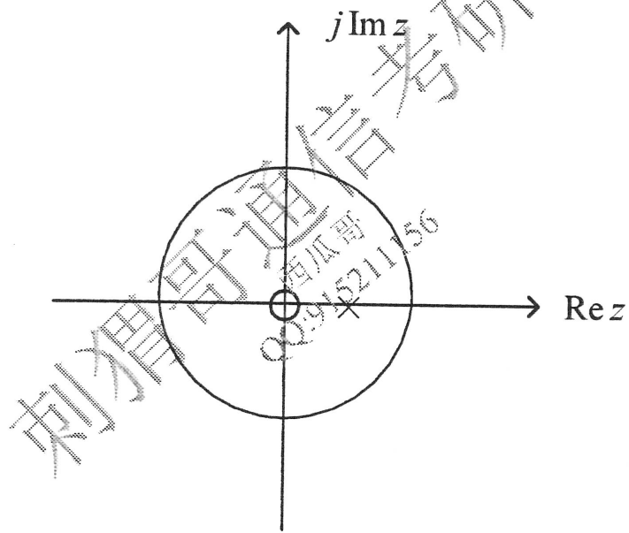

由此可大致画出其频域图

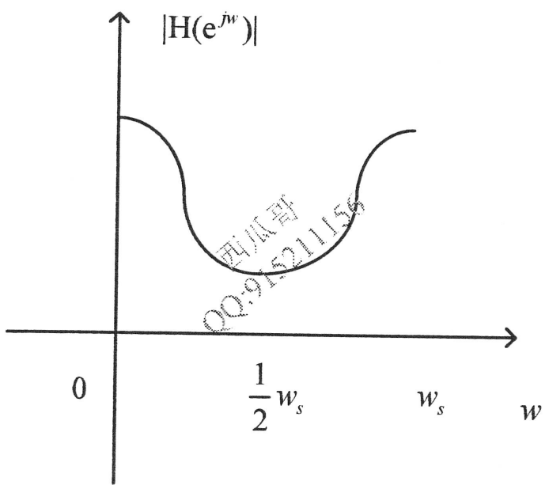

很容易可以看出这函数是具有低通特性。

---

不是很理解的可以仔细阅读教材 8-10 节 (刺猬哥考研团队, 西瓜哥 QQ: 915211156)

题 10 解: \(b < |z| < \frac{1}{b}\)

收敛条件为 \(\sum_{n = -\infty}^{\infty}x(n)z^{-n} < \infty\) (1)

将 \(x(n) = b^{|n|}\) 代入（1）

$$
\sum_ {n = - \infty} ^ {\infty} b ^ {| n |} z ^ {- n} = \sum_ {n = - \infty} ^ {- 1} b ^ {- n} z ^ {- n} + 1 + \sum_ {n = 1} ^ {\infty} b ^ {n} z ^ {- n} = \sum_ {n = 1} ^ {\infty} b ^ {n} z ^ {n} + 1 + \sum_ {n = 1} ^ {\infty} b ^ {n} z ^ {- n} <   \infty \tag {2}
$$

可将（2）的三项分别小于正无穷来求解。

当 \(\sum_{n=1}^{\infty} b^{n} z^{n}<\infty\), 只需 \(\lim _{n \rightarrow \infty}\left|\frac{b^{n+1} z^{n+1}}{b^{n} z^{n}}\right|=b|z|<1\) (3)

当 \(\sum_{n=1}^{\infty} b^{n} z^{-n}<\infty\), 只需 \(\lim _{n \rightarrow \infty}\left|\frac{b^{n+1} z^{-(n+1)}}{b^{n} z^{-n}}\right|=b\left|z^{-1}\right|<1\) (4)

由（3）、（4）得 \(b < |z| < \frac{1}{b}\)

# 二、问答及简单计算题(此类题近些年不考了)

题 1 解:

(1)产生的原因不同, 线性失真是由于电路中存在线性元件, 其阻抗随频率的不同而不同,从而导致这么大电器对不同频率的信号分量的放大倍数与延迟时间不同而引起的。而非线性失真是由于引进非线性元件或进入非线性区域而引起的。

2) 产生的结果不同, 线性失真可能使不同频率信号分量的大小及相对时间关系发生变化, 但决不会产生输入信号所没有的新的频率成分。而非线性失真的主要特征是产生了输入信号所没的的新的频率的成分。

3) 另外线性失真是在波形畸变上出现了对称的失真, 这种失真一般出现在有深度负反馈的功率放大器中; 其结果会产生多于的偶次谐波分量。而非线性失真则是波形畸变是不对称的, 这种失真是一种指数型失真, 一般出现在三极管单管甲类放大电路中, 其结果会产生多余的奇次谐波分量（刺猬哥考研团队，答疑交流群 709502924）

---

题2解：

(1) 列写电路方程: \(x(t) = i_{L} R + L \frac{d i_{L}}{d t} + v_{c}\) (1)

其中 \(i_{L} = C \frac{d v_{c}}{d t}\) (2)

将（2）式代入（1）式中得： \( LC\frac{d^2v_c}{dt^2} + CR\frac{dv_c}{dt} + v_c = x(t) \) （3）

将 L、R、C 具体数值代入（3）中 \(\frac{d^2 v_c}{dt^2} + 2 \frac{dv_c}{dt} + v_c = x(t)\) (4)

将（4）进行拉氏变换 \(s^{2} V_{c} - s v_{c}(0-) - v_{c}^{\prime}(0-)+2 s V_{c}-2 v_{c}(0-)+V_{c}=X\) (5)

将（5）整理得 \(V_{c} = \frac{X}{s^{2} + 2s + 1} +\frac{s v_{c}(0 - ) + v_{c}{}^{\prime}(0 - ) + 2v_{c}(0 - )}{s^{2} + 2s + 1} = V_{c z s} + V_{c z i}\) （6）

对于（6）式可以对应得到零状态输出 \(V_{czs}\) 与零输入输出 \(V_{czi}\)

$$
V _ {c z s} = \frac {X}{s ^ {2} + 2 s + 1} = X H (s) \tag {7}
$$

$$
V _ {c z i} = \frac {s v _ {c} (0 -) + v _ {c} ^ {\prime} (0 -) + 2 v _ {c} (0 -)}{s ^ {2} + 2 s + 1} \tag {8}
$$

由（7）式得到： \(H(s) = \frac{1}{s^2 + 2s + 1} = \frac{1}{(s + 1)^2}\) (9)

对（9）式进行拉式反变换： \( h(t) = te^{-t}u(t) \)

(2) 因为系统的零输入响应等于冲激响应, 也就是说 (8) 与 (9) 式相等。

得: \(V_{czi} = \frac{s v_c (0-) + v_c'(0-) + v_c(0-)}{s^2 + 2s + 1} = H(s) = \frac{1}{(s + 1)^2}\) (10)

s的系数 \(v_{c}(0 - ) = 0\), 才能使得等式右边恒为1, 由此解得 \(v_{c}^{\prime}(0 - ) = 1\)

由（2）式得 \(i_{L}(0-) = C v_{c}{}^{\prime}(0-) = 1\)

故 \(v_{c}(0 - ) = 0, i_{L}(0 - ) = 1\)

(3) 根据题意列出输出等式:

---

$$
\begin{array}{l} V _ {c} = L [ u (t) ] = \frac {1}{s} = \frac {\frac {1}{s}}{s ^ {2} + 2 s + 1} + \frac {s v _ {c} (0 -) + v _ {c} ^ {\prime} (0 -) + 2 v _ {c} (0 -)}{s ^ {2} + 2 s + 1} \tag {11} \\ = \frac {1 + s ^ {2} v _ {c} (0 -) + s v _ {c} ^ {\prime} (0 -) + 2 s v _ {c} (0 -)}{s (s + 1) ^ {2}} = \frac {1}{s}. \frac {1 + s ^ {2} v _ {c} (0 -) + s v _ {c} ^ {\prime} (0 -) + 2 s v _ {c} (0 -)}{s ^ {2} + 2 s + 1} \\ \end{array}
$$

由（11）得 \(\frac{1 + s^2v_c(0-) + sv_c'(0-)+2sv_c(0-)}{s^2+2s+1} = 1\) (12)

由（12）得 \(v_{c}(0-) = 1, v_{c}^{\prime}(0-) = 0 = i_{L}(0-)\)

# 三、计算题

题1解：

设 \(f(t) = f_{1}(t)\cos (\omega_{c}t) + f_{2}(t)\sin (\omega_{c}t)\)

同义 \(F[\cos (\omega_{c}t)] = \pi [\delta (\omega +\omega_{c}) + \delta (\omega -\omega_{c})]\)

因为: \(F[\sin (\omega_{c} t)] = j \pi [\delta (\omega + \omega_{c}) - \delta (\omega - \omega_{c})]\)

所以: \(F[f(t)] = \frac{1}{2} [F_{1}(\omega + \omega_{c}) + F_{1}(\omega - \omega_{c})] + \frac{j}{2} [F_{2}(\omega + \omega_{c}) - F_{2}(\omega - \omega_{c})]\)

又因为 \(g_{1}(t) = f(t)\cos (\omega_{c}t)\)

$$
g _ {2} (t) = f (t) \sin (\omega_ {c} t)
$$

所以:

$$
\begin{array}{l} G _ {1} (\omega) = \frac {1}{2} \left(F \left(\omega + \omega_ {c}\right) + F \left(\omega - \omega_ {c}\right)\right) \\ = \frac {1}{4} \left(2 F _ {1} (\omega) + F _ {1} \left(\omega + 2 \omega_ {c}\right) + F _ {1} \left(\omega - 2 \omega_ {c}\right)\right) + \frac {j}{4} \left(F _ {2} \left(\omega + 2 \omega_ {c}\right) - F _ {2} \left(\omega - 2 \omega_ {c}\right)\right) \\ \end{array}
$$

$$
\begin{array}{l} G _ {2} (\omega) = \frac {j}{2} \left(F \left(\omega + \omega_ {c}\right) - F \left(\omega - \omega_ {c}\right)\right) \\ = \frac {j}{4} \left(F _ {1} \left(\omega + 2 \omega_ {c}\right) - F _ {1} \left(\omega - 2 \omega_ {c}\right)\right) - \frac {1}{4} \left(F _ {2} \left(\omega + 2 \omega_ {c}\right) + F _ {2} \left(\omega - 2 \omega_ {c}\right) - 2 F _ {2} (\omega)\right) \\ \end{array}
$$

题2解：

(1)

差分方程为:

$$
\frac {3}{4} x (n) - \frac {1}{3} x (n - 1) + \frac {1}{3} y (n - 1) + \frac {1}{4} y (n - 2) - \frac {1}{1 2} y (n - 3) = y (n) \tag {1}
$$

---

(2)

将式（1）作 \(Z\) 变换： \(\frac{3}{4} X(z) - \frac{1}{3} z^{-1}X(z) + \frac{1}{3} z^{-1}Y(z) + \frac{1}{4} z^{-2}Y(z) - \frac{1}{12} z^{-3}Y(z) = Y(z)\) (2）得：

$$
H (z) = \frac {Y (z)}{X (z)} = \frac {9 z ^ {3} - 4 z ^ {2}}{1 2 z ^ {3} - 4 z ^ {2} - 3 z + 1}
$$

(3)

$$
\frac {H (z)}{z} = \frac {9 z ^ {2} - 4 z}{1 2 z ^ {3} - 4 z ^ {2} - 3 z + 1} = \frac {A _ {1}}{2 z - 1} + \frac {A _ {2}}{2 z + 1} + \frac {A _ {3}}{3 z - 1}
$$

得: \(A_{1} = \frac{1}{4}, A_{2} = \frac{17}{20}, A_{3} = \frac{3}{5}\)

则：

$$
H (z) = \frac {\frac {1}{8} z}{z - \frac {1}{2}} + \frac {\frac {1 7}{4 0} z}{z + \frac {1}{2}} + \frac {\frac {1}{5} z}{z - \frac {1}{3}}
$$

得： \(h(n) = [\frac{1}{8} (\frac{1}{2})^n +\frac{17}{40} (-\frac{1}{2})^n +\frac{1}{5} (\frac{1}{3})^n ]u(n)\) (4）

H(z)的分母为: \(12z^{3} - 4z^{2} - 3z + 1 = (3z - 1)(4z^{2} - 1) = 0\)

得到极点: \(z_{1} = \frac{1}{3} z_{2} = -\frac{1}{2} z_{3} = \frac{1}{2}\)

因为三个极点都在单位圆内，所以此系统稳定

(刺猬哥考研团队, 答疑交流群 709502924)

---

# 南昌大学

# 2012年招收攻读硕士研究生

# 入学考试自命题试题

科目代码及名称： 信号与系统811

适用专业： 信息与通信工程、电子信息等

(所有答案都必须写在答题纸上, 写在试卷纸上及草稿纸上无效, 考完后试题随答题纸收回)

一、单项选择题（每小题3分，共30分）

1. 信号 \(f(t) = 2 \cos \frac{\pi}{4} (t - 2) + 3 \sin \frac{\pi}{4} (t + 2)\) 与冲激函数 \(\delta(t - 2)\) 之积为（）；

A. 2 B. \(2 \delta (t - 2)\) C. \(3 \delta (t - 2)\) D. \(5 \delta (t - 2)\)

2. 已知 LTI 系统的系统函数 \(H(s) = \frac{s + 1}{s^2 + 5s + 6}, \operatorname{Re}[s] > -2\)，则该系统是（）；

A. 因果不稳定系统 
B. 非因果稳定系统

C. 因果稳定系统 
D. 非因果不稳定系统

3. 线性时不变系统的冲激响应曲线如图所示, 该系统微分方程的特征根是 ( ) ;

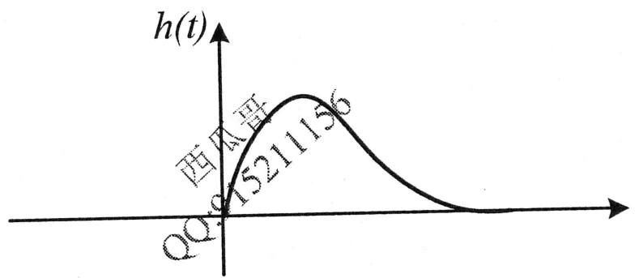

A. 常数 
B. 实数 
C. 复数 
D. 实数和复数

4. （西瓜哥QQ915211156）积分 \(\int_{-\infty}^{\infty} f(t) \delta(t) dt\) 的结果是（ ）。

---

A. \(f(0)\) 
B. \(f(t)\) 
C. \(f(t)\delta (t)\) 
D. \(f(0)\delta (t)\)

5. 卷积 \(\delta(t)^{*} f(t)^{*} \delta(t)\) 的结果为（ ）。

A. \(\delta (t)\) 
B. \(\delta (2 t)\) 
C. \(f(t)\) 
D. \(f(2 t)\)

6. 零输入响应是 ( )。(刺猬哥考研团队, 答疑交流群 709502924)

A. 全部自由响应 B. 部分自由响应 C. 部分零状态响应 D. 全响应

7. 信号 \(u(t) - u(t - 2)\) 的拉氏变换的收敛域是 ( )。

A. \(\operatorname{Re}[s] > 0\) 
B. \(\operatorname{Re}[s] > 2\) 
C. 全 \(s\) 平面 
D. 不存在

8. 能量信号其（ ）。

A. 能量 \(E = 0 \mathrm{~B}\). 功率 \(P = 0 \mathrm{C}\). 能量 \(E = \infty \quad\) 
D. 功率 \(P = \infty\)

9. 在工程上，从抽样信号恢复原始信号时需要通过的滤波器是（）。

A. 高通滤波器 B. 低通滤波器 C. 带通滤波器 D. 带阻滤波器

10. 设一个矩形脉冲的面积为 \(S\), 则矩形脉冲的傅氏变换在原点的函数值等于 ( )。

A. \(\frac{S}{2}\) 
B. \(\frac{S}{3}\) 
C. \(\frac{S}{4}\) 
D. \(S\)

11. 设系统零状态响应与激励的关系是 \(y_{zs}(t) = |f(t)|\), 则以下表述不对的是 ( )。

A. 系统是线性的 B. 系统是时不变 C. 系统是因果的 D. 系统是稳定的

12. 信号 \( f(t) = \sin 2\pi t \) 的最小取样频率是（ ）；

A. \(1 \mathrm{~Hz} \quad\) 
B. \(2 \mathrm{~Hz} \quad\) 
C. \(4 \mathrm{~Hz} \quad\) 
D. \(8 \mathrm{~Hz} \quad\)

13. (刺猬哥考研团队, 答疑交流群 709502924) 理想低通滤波器是( )

A. 因果系统 
B. 物理可实现系统 
C. 非因果系统 
D. 响应不超前于激励发生的系统

14. \(\frac{1}{j \omega}\) 具有( )；（西瓜哥 QQ915211156）

A. 微分特性 B. 积分特性 C. 延时特性 D. 因果特性

15. 线性时不变系统零状态响应曲线如图所示, 则系统的输入应当是( ) ;

---

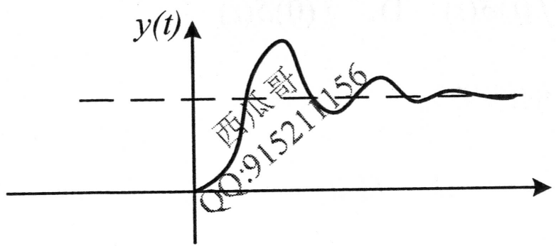

A. 阶跃信号

B. 正弦信号

C. 冲激信号

D. 斜升信号

# 二、填空题(本大题共 15 小题, 每小题 2 分, 共 30 分)

1. （西瓜哥 QQ915211156）已知一信号 \(f(t)\) 的频谱 \(F(j \omega)\) 的带宽是 \(\omega_{1}\), 则 \(f^{2}(2 t)\) 的频谱的带宽为 ____________;

2. 已知一离散时间系统的系统函数 \(H(z) = \frac{1}{2 + z^{-1} - z^{-2}}\), 判断该系统是否稳定 _______；

3. 已知某因果系统的系统函数 \(H(s) = \frac{1}{s^2 + (3 - k)s + k}\) 要使系统稳定, 则 \(k\) 值的范围为

4. （刺猬哥考研团队，答疑交流群 709502924）\(\sin t \cdot \delta'(t) =\) _______；

5. 积分器的频域系统函数 \(H(j\omega)\) 为

6. 信号不失真的条件为系统函数 \(H(j\omega) =\)

7. \(e^{-2t}u(t)^{*}\delta (t - 3) = \underline{\quad};\)

8. \(\int_0^\infty Sa(t)dt =\)

9. 阶跃函数 \(u(t)\) 与符号函数 \(\operatorname{sgn}(t)\) 的关系是

10. 偶周期信号的傅里叶级数中只有________；

11. 已知系统的单位冲激响应为 \(h(t)\), 则该系统函数 \(H(j \omega) =\)

12. 如果一个系统的幅频响应 \(\left|H(j\omega)\right|\) 是常数, 那么这个系统就称为

13. 单位冲激信号的拉氏变换结果是

14. 在收敛坐标 \(\sigma_0\) 的条件下, 系统的频率响应和系统函数之间的关系是把系统函数中的 \(s\) 用 \(j\omega\) 代替后的数学表达式。

---

15. 系统函数零点全在左半平面的系统称为________；

三、判断题（本大题共15小题，每小题1分，共15分，判断下列各题，正确的在题后括号内打“√”，错的打“×”）

1. 已知 \(f_{1}(t) = u(t + 1) - u(t - 1), f_{2}(t) = u(t - 1) - u(t - 2)\), 则 \(f_{1}(t)^{*} f_{2}(t)\) 的非零值区间为 \([0,3]\) 。( )

2. 若 \(L[f(t)] = F(s)\), 则 \(L[f(t - t_0)] = e^{-st_0}F(s)\) 。( )

3. 奇函数加上直流后，傅氏函数中仍含有正弦分量。（）

4. （刺猬哥考研团队，答疑交流群 709502924）\(L^{-1}\left[\frac{e^{-s}}{1 + s^2}\right] = \sin (t - 1)\)。（）

5. 一个系统的零状态响应就等于它的自由响应。（）

6. 若系统的起始状态为零, 则系统的零状态响应就是系统的强迫响应。( )

7. \(H(s)\) 的零点与 \(h(t)\) 的形式无关。（）

8. 若一个连续 LTI 系统是因果系统, 它一定是一个稳定系统。( )

9. 因果连续 \(LTI\) 系统的系统函数的极点一定在 \(s\) 平面的左半平面。（）

10. 一个信号存在拉氏变换就一定存在傅氏变换。（）

11. 周期连续信号，其频谱是离散的非周期的。（）

12. 稳定系统的 \(H(s)\) 极点一定在 \(s\) 平面的左半平面。（）

13. 因果稳定系统的系统函数的极点一定在 \(s\) 平面的左半平面。（）

14. 任意系统的 \(H(s)\) 只要在在 \(s\) 处用 \(j\omega\) 代入就可以得到该系统的频率响应 \(H(j\omega)\)。（）

15. 系统的 \(h(t)\) 是由其系统函数 \(H(s)\) 的零极点位置决定的。（）

# 四、计算与证明题（本大题共8题，共75分）

1. (10 分) 考虑一个 LTI 系统, 其输入 \(x(t)\) 和输出 \(y(t)\) 之间的关系通过如下方程所示:

(1) 求该系统的单位冲激响应;

(2) 当输入信号 \(x(t) = u(t)\) 时, 求输出信号。

---

2. (8 分) 考虑一因果 LTI 系统, 其系统函数 \(H(s) = \frac{s + 3}{s + 2}\), 画出系统方框图。

3. (7 分) 某 LTI 系统, 其初始状态一定, 已知当激励为 \(f(t)\) 时, 其全响应为 \(y_{1}(t) = e^{-t} + \cos \pi t, t \geq 0\); 若初始状态保持不变, 激励为 \(2 f(t)\) 时, 其全响应为 \(y_{2}(t) = 2 \cos \pi t, t \geq 0\); 求: 初始状态不变, 而激励为 \(3 f(t)\) 时系统的全响应。

4. (10 分) 如图 (a) 所示系统, 其中 \(f(t) = \frac{\sin 2 t}{2 \pi t}, s(t) = \cos (1000 t)\), 系统中理想带通滤波器的频率响应如图 (b) 所示, 其相频特性 \(\varphi(\omega) = 0\), 求输出信号 \(y(t)\) 。

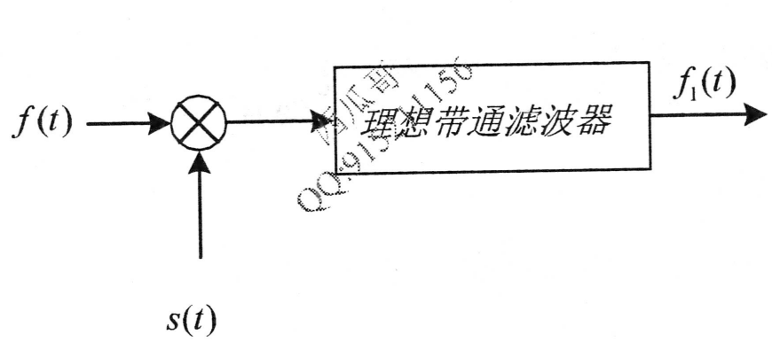

_(a)_

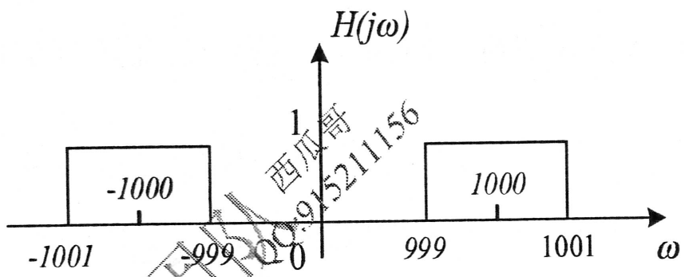

_(b)_

5. (10 分)（西瓜哥 QQ915211156）已知某 LTI 系统的输入为: \( f(k) = \begin{cases} 1, & k = 0 \\ 4, & k = 1, 2 \\ 0, & k \text{为其它} \end{cases} \) 其零状态响应 \( y(k) = \begin{cases} 0, & k < 0 \\ 9, & k \geq 0 \end{cases} \)，求系统的单位序列响应 \( h(k) \)。

6. (10 分) 如图反馈因果系统, 问当 \(K\) 满足什么条件时, 系统是稳定的? 其中子系统的系统函数 \(G(s) = \frac{1}{[(s + 1)(s + 2)]}\) 。

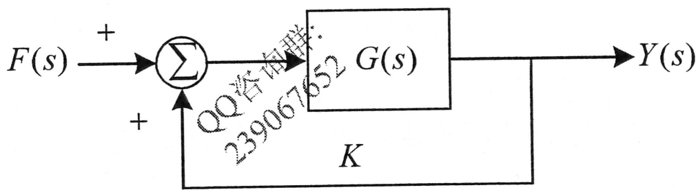

7. (10 分) 已知象函数 \(F(z) = \frac{z\left(z^{3} - 4z^{2} + \frac{9}{2}z + \frac{1}{z}\right)}{\left(z - \frac{1}{2}\right)(z - 1)(z - 2)(z - 3)}\) ，求以下的逆 \(z\) 变换。

---

24最强信号辅导班招生啦！让你节省时间，不走弯路，取得佳绩！联系西瓜哥qq915211156 加Q群709502924，使用刺猬哥团队正版核心序列ORK，享受高质量全天候优质答疑指导

(1) \(\left|z\right| > 3\)

(2) \(1 < |z| < 2\)

8. (10 分) 如下图所示的周期为 \(2 \pi\) 、幅值为 1 伏的方波 \(u_{s}(t)\) 作用于 \(R L\) 电路, 已知 \(R = 1 \Omega, L = 1 H\).

(1) 写出以回路 \(i(t)\) 为输出的电路的微分方程。

(2) 求出电流 \(i(t)\) 的前三次谐波。

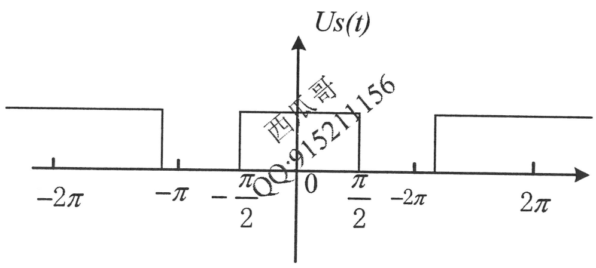

_(a)_

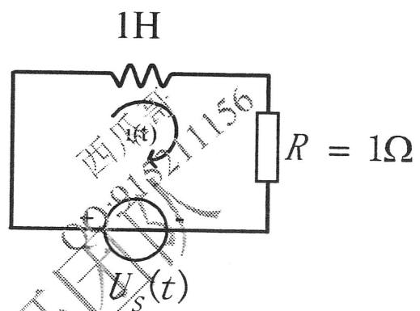

_(b)_

---

# 2012 南昌大学信号与系统 811 真题详解

——西瓜哥原创作答

# 一、选择题

题 1 解: 选 B

$$
\begin{array}{l} f (t) \delta (t - 2) = [ 2 \cos \frac {\pi}{4} (t - 2) + 3 \sin \frac {\pi}{4} (t + 2) ] \delta (t - 2) \\ = (2 \cos 0 + 3 \sin \pi) \delta (t - 2) \\ = 2 \delta (t - 2) \\ \end{array}
$$

本题运用到冲激函数的筛选性质即 \(x(t) \delta(t - t_0) = x(t_0) \delta(t - t_0)\).

题 2 解: 选 C (刺猬哥考研团队, 答疑交流群 709502924)

由题目给出的系统函数 \(H(s) = \frac{s + 1}{s^2 + 5s + 6} = \frac{s + 1}{(s + 2)(s + 3)}\)

可知两个极点分别是 \(s_{1} = -2, s_{2} = -3\) ，因此系统是稳定的。

如果系统要是因果的，那么应满足 \(\operatorname{Re}[s] > -2\) ，显然题目满足条件。

因此系统是因果稳定的，故选 C.

本题考察系统函数零、极点与系统特性, 极点全在 s 平面的左半平面系统则为稳定系统;系统的冲激响应函数 h(t), 在 t<0 的条件下, h(t)=0, 则此系统为因果系统反映在 s 平面中就是收敛域应该是 s 平面上某一收敛轴的右半平面。

题 3 解: 选 B

由题中给出的冲激响应曲线知 \(h(t) = t e^{-a t} u(t)\)

我们取 \(a = 1\) 时的情况进行分析, 即 \(h(t) = t e^{-t} u(t)\)

进行拉普拉斯变化得到: \(e^{-t} u(t) \xleftarrow{\mathcal{L}\left\{e^{-t} u(t)\right\}} \frac{1}{s + 1}\)

则 \(te^{-t}u(t) \xleftarrow{\mathcal{L}\{te^{-t}u(t)\}} \frac{1}{(s + 1)^2} = H(s) = \frac{Y(s)}{X(s)} = \frac{1}{s^2 + 2s + 1}\)

---

等式交叉相乘我们可以得到 \(s^{2} Y(s) + 2 s Y(s) + Y(s) = X(s)\)

将上式转化为时域中的式子为 \(y''(t) + 2y'(t) + y(t) = x(t)\)

系统的特征方程为 \(\lambda^2 + 2\lambda + 1 = 0\) ，可知方程的根为 \(\lambda_1 = \lambda_2 = -1\)

故该系统微分方程的根为实数。

本题考察拉普拉斯变化的相关性质以及时域和频域的相关关系, 复习中应当牢记相关性质, 做题才能轻松应对。

题 4 解: 选 A

$$
\int_ {- \infty} ^ {+ \infty} f (t) \delta (t) d t = \int_ {- \infty} ^ {+ \infty} f (0) \delta (t) d t = f (0)
$$

本题为基础题, 主要考查冲激函数的抽样特性, 即 \(\int_{-\infty}^{+\infty} f(t) \delta(t - t_0) dt = f(t_0)\).

题 5 解: 选 A

$$
\delta (t) * f (t) * \delta (t) = f (t)
$$

本题考察与冲激函数的卷积, 与冲激函数卷积的概念是移位。每一时刻的输出是函数 \(f(t)\) 在此时刻与冲激函数的加权求和获得的值, 即函数此时刻的值。按顺序卷积即可得到答案。

题 6 解: 选 B

本题考查零输入响应的定义，在没有外加激励时，仅由 \( t = 0 \) 时刻的非零初始状态引起的响应称为零输入响应。

题7解：选C

$$
u (t) - u (t - 2) \xleftarrow {\mathcal {L}} \frac {1 - e ^ {- 2 s}}{s}
$$

且 \(\lim_{t \to \infty} [u(t) - u(t - 2)] e^{-at} = 0\), \(a\) 取任意值都成立, 因此收敛域是全平面。

---

题8解：选B

能量信号在时间区间内的能量为有限值，而功率为 0；功率信号在时间区间内功率是有限值而能量是无限的。

本题不难，主要考查能量信号和功率信号的区别，注意区分即可。

题9解：选B

工程上抽样信号的谐波含量太高，会造成控制系统的误动作，所以，需要先经过一个低通滤波器进行过滤，将尽可能多的主要谐波过滤掉，保证整个工控系统控制的精度。

本题考察抽样定理在工程上的应用，较为基础。

题 10 解: 选 D

设矩形脉冲函数为 \(f(t)\), \(f(t)\) 覆盖的面积为 \(\int_{-\infty}^{+\infty} f(t) dt = S\)

由傅里叶变化的公式 \(F(\omega) = \int_{-\infty}^{+\infty} f(t) e^{-j\omega t} dt\)

令 \(\omega = 0\) 可得 \(F(0) = \int_{-\infty}^{+\infty}f(t)dt = S\) ，故选D

本题考察傅里叶变化式的相关应用，灵活运用公式即可。

题 11 解: 选 A

零状态响应 \(y_{zs} = |f(t)|\)

当输入函数为 \(f_{1}(t)\) 时候, 输出为 \(\left|f_{1}(t)\right|\), 当输入函数为 \(f_{2}(t)\) 时候, 输出为 \(\left|f_{2}(t)\right|\)

当输入函数为 \(f_{1}(t) + f_{2}(t)\) 时候, 输出为 \(\left|f_{1}(t) + f_{2}(t)\right| \neq \left|f_{1}(t)\right| + \left|f_{2}(t)\right|\)

所以系统是非线性的。

本题考察线性系统的判断, 线性主要包括齐次性和叠加性。判断方法是, 系统若满足对任意激励信号: 先线性运算, 后经过系统与先经过系统后经过线性运算的结果相等。

题12解：选B

$$
\sin 2 \pi t \xleftarrow {\mathcal {F}} j \pi [ \delta (\omega + 2 \pi) - \delta (\omega - 2 \pi) ]
$$

---

由该信号的傅里叶变化可知其信号频域宽度 \(\omega_{b}\) 为 \(2 \pi\)

根据奈奎斯特采样定理知 \(\omega_{s} \geq 2 \omega_{b} = 4 \pi\)

则采样频率 \(f = \frac{1}{T} = \frac{1}{\frac{2 \pi}{\omega_{S}}} = 2 \mathrm{~Hz}\)

本题难度不大, 主要考查傅里叶变换以及奈奎斯特采样定理, 此题注意, 我们所说的带宽通常指的是正半部分的频带宽度。

题13解：选C

理想低通滤波器的频域特性如下所示:

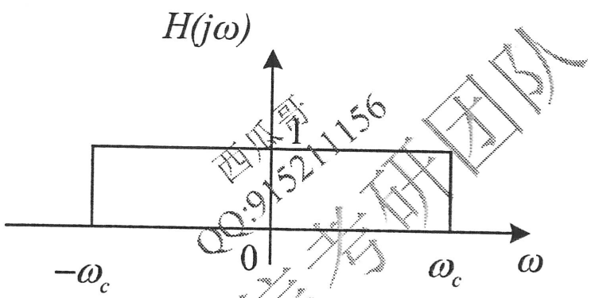

其冲激响应为 \(h(t) = \frac{\omega_c \sin [\omega_c (t - t_0)]}{\pi \omega_c (t - t_0)}\)

由此可以看出该系统是非因果的

本题考察低通滤波器的时域特性, 根据傅里叶变换对可以确定低通滤波器的时域特性, 因果系统的单位冲激响应满足如下特性 \(h(t) = 0, (t < 0)\) 。

题 14 解: 选 B

本题为基础题, 掌握傅里叶变化的基本性质就可以做出此道题, 根据傅里叶变换的时域积分性质, 可知 \(\int_{-\infty}^{t} f(t) d t \xrightarrow{F T} \frac{1}{j \omega} F(j \omega) + \pi \delta(\omega) F(0)\), 即说明其满足时域积分特性。

题 15 解: 选 A (刺猬哥考研团队, 答疑交流群 709502924)

单位阶跃响应是指系统在单位阶跃信号的作用下所产生的零状态响应。本题展示的曲线为欠阻尼二阶系统的单位阶跃响应，欠阻尼二阶系统的单位阶跃响应为一条衰减振荡曲

---

线，记住即可。

# 二、填空题

题 1 解: \(4 \omega_{1}\)

已知 \(f(t)\) 的频谱 \(F(j \omega)\) 的带宽为 \(\omega_{1}\)

根据傅里叶变换的性质, \(f(2 t)\) 的傅里叶变换为 \(\frac{1}{2} F\left(\frac{j \omega}{2}\right)\), 其带宽为 \(2 \omega_{1}\)

进 \(f^{2}(2 t)\) 的傅里叶变换为 \(\frac{1}{2 \pi} \left[\frac{1}{2} F\left(\frac{j \omega}{2}\right) * \frac{1}{2} F\left(\frac{j \omega}{2}\right)\right] = \frac{1}{8 \pi} F\left(\frac{j \omega}{2}\right) * F\left(\frac{j \omega}{2}\right)\)

其带宽也为 \(4 \omega_{1}\)

题 2 解: 系统临界稳定

$$
H (z) = \frac {1}{2 + z ^ {- 1} - z ^ {- 2}} = \frac {z ^ {2}}{2 z ^ {2} + z - z} = \frac {z ^ {2}}{(2 z - 1) (z + 1)}
$$

由系统函数知极点为 \(\lambda_{1} = \frac{1}{2}, \lambda_{2} = -1\), 有一个极点在单位圆。

$$
H (z) = \frac {2}{3} \frac {z}{(2 z - 1)} + \frac {1}{3} \frac {z}{(z + 1)} = \frac {1}{3} \frac {z}{(z - \frac {1}{2})} + \frac {1}{3} \frac {z}{(z + 1)}
$$

由此可以知道 \(h(n) = \frac{1}{3} \left[ \left( \frac{1}{2} \right)^n - (-1)^n \right] u(n)\)

因此系统临界稳定。

本题考察 \(z\) 变化以及系统稳定性的相关判定。

题 3 解: \(0 < k < 3\)

根据系统函数 \(H(s) = \frac{1}{s^2 + (3 - k)s + k}\)

要使系统稳定, 则极点都在左半平面, 则有 \(s_{1} s_{2} = k > 0\), 且 \(s_{1} + s_{2} = -\frac{3 - k}{2} < 0\)

由此得到 \(k\) 的范围为 \(0 < k < 3\)

本题考查零极点和系统稳定性之间的关系, 若系统稳定, 则极点都在左半平面, 由此可以得到答案。

---

题4解： \(-\delta (t)\)

本题考查冲激函数的相关性质, 由 \(f(t) \delta'(t) = f(0) \delta'(t) - f'(0) \delta(t)\), 代入函数以及相关数值计算可得答案。

题 5 解: \(\frac{1}{j \omega} + \pi \delta(\omega)\)

积分器的函数表达式为 \(\int_{-\infty}^{t} f(\tau) d \tau\), 其傅里叶变化为 \(F(j \omega) \left[\frac{1}{j \omega} + \pi \delta(\omega)\right]\), 因为系统的输出函数和输入函数的关系为 \(Y(j \omega) = H(j \omega) X(j \omega)\), 因此可以得到积分器的系统函数为

$$
\frac {1}{j \omega} + \pi \delta (\omega).
$$

本题考察傅里叶变化的积分性质，以及输出函数与输入函数之间的频域关系。

题6解： \(k e^{-j\omega t_0}\)

信号不失真的时域条件为 \(y(t) = kx(t - t_0)\)，即时域波形未改变，只是幅度上产生变化，在时间上有所延迟，系统的输出函数和输入函数的关系为 \(Y(j\omega) = H(j\omega)X(j\omega)\)，对时域表达式的两边傅里叶变化可以得到 \(Y(j\omega) = Ke^{-j\omega t_0}X(j\omega)\)，从而 \(H(j\omega) = ke^{-j\omega t_0}\)

本题考察信号不失真的系统函数, 我们可以从时域条件出发, 得到它的频域条件, 最后确定它的系统函数。

题7解： \(e^{-3(t - 3)}u(t - 3)\)

本题考察连续信号的卷积计算，以及冲激函数的抽样性质，根据卷积公式 \(\int_{-\infty}^{+\infty} f(\tau) \delta(t - \tau) dt\) 计算可得最终答案。（刺猬哥考研团队，答疑交流群 709502924）

题8解：\(\frac{\pi}{2}\)

---

本题考察抽样函数的积分, 记住 \(\int_{0}^{+\infty} S a(t) d t = \frac{\pi}{2}\) 和 \(\int_{-\infty}^{+\infty} S a(t) d t = \pi\) 两个公式即可, 想了解相关推导过程可以在答疑群里私聊西瓜哥。(西瓜哥 QQ: 915211156)

题 9 解: \(u(t) = \frac{1 + \operatorname{sgn}(t)}{2}\)

本题考察阶跃函数和符号函数之间的关系, 符号在小于 0 的时候是 -1 , 大于 0 的时候是 1 。而阶跃函数在小于 0 的时候是 0 , 大于 0 的时候是 1 , 根据函数的值可以确定他们之间的关系。

题 10 解: 直流项和余弦项

本题考查傅里叶级数相关知识, 偶函数的傅里叶展开为余弦级数, 不含正弦项; 奇函数的傅里叶展开为正弦级数, 不含余弦项。

题 11 解: \(\mathcal{F}[h(t)]\)

本题考查系统中冲激响应 \(h(t) 、 H(j\omega) 、 H(s)\) 之间的关系, \(h(t)\) 对其进行傅里叶变化就是 \(H(j\omega)\), 对其进行拉氏变换就是 \(H(s)\).

题 12 解: 全通系统

本题考察相关全通系统的概念, 全通系统是指不改变信号幅度谱, 只改变相位谱的信号处理系统。

题 13 解: 1

本题考查傅里叶级数相关知识, 偶函数的傅里叶展开为余弦级数, 不含正弦项; 奇函数的傅里叶展开为正弦级数, 不含余弦项。对 \(\delta(t)\) 进行拉式变化可得

$$
\delta (s) = \int_ {- \infty} ^ {+ \infty} \delta (t) e ^ {- s t} d t, \text {根 据 冲 激 函 数 的 抽 样 特 性 可 得 结 果 为} 1.
$$

题 14 解: \(\sigma_{0}<0\)

---

本题考查 \(s\) 域和频域的转化, 只有 \(s\) 域的收敛域包括 \(\omega = 0\) 的轴, 两者之间才能进行题目中所示的转化, 因此收敛域左边应当小于等于 0 , 但是当收敛域坐标为 0 时候, 两者之间会相差一个冲击项, 所以最后的答案为 \(\sigma_0 < 0\).

# 题 15 解: 最小相移系统

本题考查最小相移系统的定义，对于闭环系统,如果它的开环传递函数极点和零点的实部都小于或等于零，则称它是最小相位系统，如果开环传递函数中有正实部的零点或极点，或有延迟环节，则称系统是非最小相位系统。

# 三、判断题:

题1解：错

本题考察函数的卷积计算, \(f_{1}(t)\) 为范围为 \([-1,1]\) 范围内的门函数, 而 \(f_{2}(t)\) 为 \([1,2]\) 范围内的门函数, 两者卷积计算其非零区间为 \((0,3)\), 本题注意非零区间为开区间, 而题中给的是闭区间, 此处应注意, 其它的熟练掌握图解法计算卷积即可。

题2解：对

本题考查拉氏变换的时移特性, \(f(t - t_{0})\) 的拉氏变换为 \(F(S)e^{-st_{0}}\)

题3解：对

本题考察傅里叶级数相关知识, 奇函数的傅里叶展开为正弦级数, 不含余弦项。加上直流信号后并不影响其傅里叶展开式。

题4解：错

本题考察拉氏变换和逆变换, 本题中逆变换的结果为 \(\sin (t - 1) u(t - 1)\).

题5解：错

本题考察零状态响应和自由响应之间的关系，系统响应等于零输入响应加零状态响应，

---

零状态响应由一部分自由响应和强迫响应构成，零输入响应由一部分自由响应构成。

题6解：错

系统的零状态响应为系统的初始状态为零，只有输入信号时系统所产生的响应，零状态响应由一部分自由响应和强迫响应构成，并不只是强迫响应。

题 7 解: 对

\(H(s)\) 中的零点和极点只有极点确定了系统函数的形式, 而零点与 \(h(t)\) 的形式无关。(刺客哥考研团队, 答疑交流群 709502924)

题8解：错

因果性的判定为收敛域为右半平面, 而稳定性的判定是要收敛域包含 \(j \omega\) 轴, 两者不一定同时成立, 因此本题错误。(西瓜哥 QQ: 915211156)

题9解：错

因果性的判定为收敛域为右半平面, 极点可以在任何位置, 只要保证它的收敛域为右半平面即可。

题 10 解: 错

本题考查傅里叶变化和拉氏变换的关系, 系统的收敛域只有包含 \(j \omega\) 轴的时候, 那么系统有拉氏变换的同时才有傅氏变换。

题 11 解: 对

周期信号的频谱特点: 周期信号的频谱是离散的非周期的。非周期信号的频谱特点: 非周期信号的频谱是连续的。

题12解：错

本题考察稳定性的相关判定, 稳定性的判定是要收敛域包含 \(j \omega\) 轴, 可以为极点左右分

---

布的双边序列，收敛域也包含 \(j \omega\) 轴。

题 13 解: 错

本题考察因果性和稳定性的相关判定, 一阶系统中, 当极点位于左半平面或者在虚轴上时, 系统处于稳定和临界稳定状态, 当系统为二阶系统时, 只有极点在左半平面才保证稳定, 所以此题极点不一定全在左半平面。

题 14 解: 错

本题考查 \(s\) 域和频域的转化, 只有 \(s\) 域的收敛域包括 \(\omega = 0\) 的轴, 两者之间才能进行题目中所示的转化, 因此收敛域左边应当小于等于 0 , 但是当收敛域坐标为 0 时候, 两者之间会相差一个冲击项, 所以最后的答案为 \(\sigma_0 < 0\). 系统的收敛域只有包含 \(j \omega\) 轴的时候, 那么系统有拉氏变换的同时才有傅氏变换。

题 15 解: 对

本题考察零极点和系统函数之间的关系，LTI连续因果系统 \(h(t)\) 的函数形式由 \(H(s)\) 的极点确定，零点影响 \(h(t)\) 的幅度、相位。

# 四、简答题:

1.

(1) \( y(t) = \int_{-\infty}^{t} e^{-(t - \tau)} x(\tau - 2)d\tau \)

令 \(\tau - 2 = t - \tau' \Rightarrow y(t) = \int_{2}^{+\infty} e^{-(\tau' - 2)} x(t - \tau') d\tau' = \int_{-\infty}^{+\infty} e^{-(\tau' - 2)} u(\tau' - 2)x(t - \tau') d\tau'\)

因此 \(h(t) = e^{-(t - 2)}u(t - 2)\)

(2)

当输入信号 \(x(t) = u(t)\) 时

则 \(y(t) = h(t)*u(t)\)

$$
= \int_ {- \infty} ^ {t} h (\tau) d \tau
$$

---

24最强信号辅导班招生啦！让你节省时间，不走弯路，取得佳绩！联系西瓜哥qq915211156加Q群709502924，使用刺猬哥团队正版核心序列ORK，享受高质量全天候优质答疑指导

$$
\begin{array}{l} = \int_ {- \infty} ^ {t} e ^ {- (\tau - 2)} u (\tau - 2) d \tau \\ = \int_ {- \infty} ^ {t - 2} e ^ {- x} u (x) d x \\ = - e ^ {- x} \Big | _ {0} ^ {t - 2} = [ 1 - e ^ {- (t - 2)} ] u (t - 2) \\ \end{array}
$$

(西瓜哥原创解答, 西瓜哥 QQ915211156)

2.

在 \(LTI\) 系统中 \(H(s) = \frac{s + 3}{s + 2} = \frac{Y(s)}{X(s)}\)

$$
\Rightarrow s Y (s) + 2 Y (s) = s X (s) + 3 X (s)
$$

从而得到其微分方程为 \(y^\prime (t) + 2y(t) = x^\prime (t) + 3x(t)\)

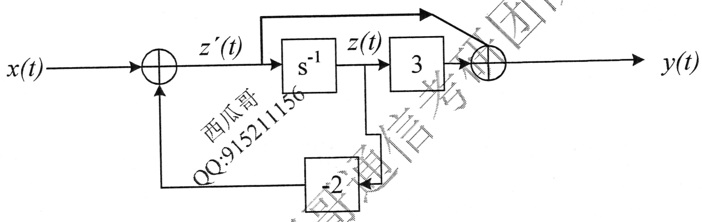

3.

由题意可知, 当输入为 \(f(t)\) 以及 \(2 f(t)\) 的时候他们的全响应

初始条件不变从而 \(y_{1}(t) = y_{zi}(t) + y_{zs}(t), y_{2}(t) = y_{zi}(t) + 2y_{zs}(t)\)

故 \(y_{zs}(t) = y_2(t) - y_1(t) = (\cos \pi t - e^{-t})u(t)\)

$$
y _ {z i} (t) = y _ {1} (t) - y _ {z s} (t) = 2 e ^ {- t} u (t)
$$

初始条件不变时，当输入为 \(3f(t)\) 时，\(y_{3}(t) = y_{zi}(t) + 3y_{zs}(t) = (3\cos \pi t - e^{-t})u(t)\)

(刺猬哥考研团队, 答疑交流群 709502924)

4.

---

$$
\begin{array}{l} f (t) = \frac {\sin 2 \pi t}{2 \pi t} = \frac {1}{\pi} S a 2 t \xleftarrow {F T} \frac {1}{2} G _ {4} (\omega) \\ f _ {s} (t) = f (t) \boxplus s (t) \\ \end{array}
$$

则 \(F_{s}(j \omega) = \frac{1}{2 \pi} F(j \omega) * S(j \omega)\)

计算得到 \(F_{s}(j \omega) = \frac{1}{4} G_{4}(\omega + 1000) + \frac{1}{4} G_{4}(\omega - 1000)\), 其频谱函数如下:

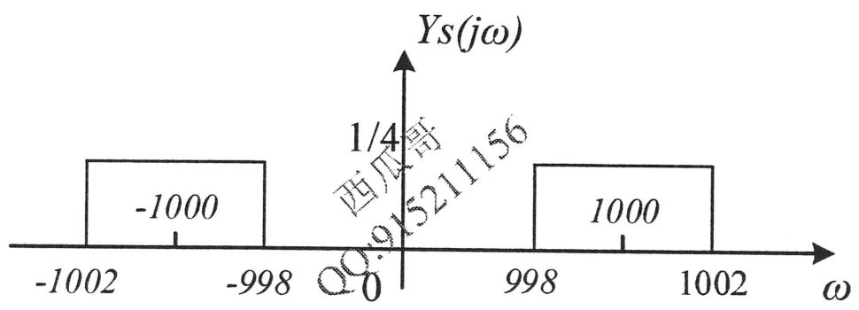

带通滤波器的频率响应如下：

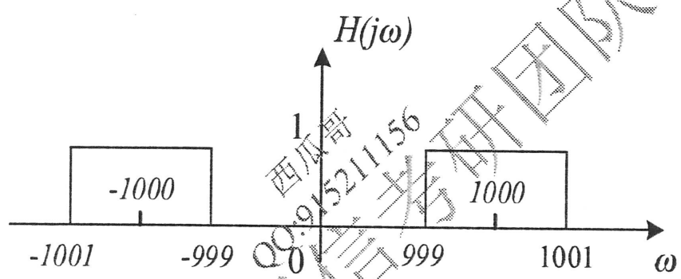

故 \(Y(j\omega) = \frac{1}{4} G_{2}(\omega + 1000) + \frac{1}{4} G_{2}(\omega - 1000) \Rightarrow y(t) = \frac{1}{2\pi} S a(t)\cos(1000t)\)

5. (1)

$$
f (k) = \left\{ \begin{array}{l l} 1, k = 0 \\ 4, k = 1, 2 \\ 0, k = \text {其 它} \end{array} \right., \text {且} y _ {z s} (k) = 9 u (k)
$$

可知 \(f(k) = \delta (k) + 4\delta (k - 1) + 4\delta (k - 2)\)

根据 \(\frac{Y(z)}{F(z)} = H(z)\), 并代入相应式子的 \(z\) 变换:

$$
\begin{array}{l} F (z) = 1 + 4 z ^ {- 1} + 4 z ^ {- 2} \text {、} Y _ {z s} (z) = \frac {9 z}{z - 1} \\ \Rightarrow H (z) = \frac {9 z}{(z - 1) \left(z + 4 z ^ {- 1} + 4 z ^ {- 2}\right)} \\ \end{array}
$$

---

$$
= \frac {9 z ^ {3}}{(z - 1) (z ^ {2} + 4 z + 4)}
$$

分解因式我们可以得到: \(H(z) = \frac{z}{z - 1} - 12\frac{z}{(z + 2)^2} + 8\frac{z}{z + 2}\)

故我们可以得到 \(h(k) = [1 + 6k(-2)^{k} + 8(-2)^{k}]u(k)\)

(刺猬哥考研团队, 答疑交流群 709502924)

6. 系统框图如下:

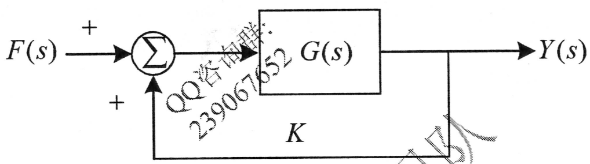

根据梅森公式可得 \(\Rightarrow H(s) = \frac{G(s)}{1 - kG(S)} \Rightarrow H(s) = \frac{1}{s^2 + 3s + 2 - k}\)

要使系统是稳定的，那么要使得系统的极点都在左半平面

即方程 \(s^2 + 3s + 2 - k\) 的解均为负值

从而我们得到: \(s_{1} \cdot s_{2} > 0, s_{1} + s_{2} < 0 \Rightarrow 2 + k > 0 \Rightarrow k < 2\)

7. 由于逆系统与原系统的关系为 \(H_{1}(s) H_{2}(s) = 1\)

$$
F (z) = \frac {z \left(z ^ {3} - 4 z ^ {2} + \frac {9}{2} z + \frac {1}{z}\right)}{(z - \frac {1}{2}) (z - 1) (z - 2) (z - 3)}
$$

注意利用部分分数法求系数的时候，分子分母不能保留负次数幂，且分式要为真分式：

$$
\frac {F (z)}{z} = \frac {z ^ {4} - 4 z ^ {3} + \frac {9}{2} z ^ {2} + 1}{z (z - \frac {1}{2}) (z - 1) (z - 2) (z - 3)}
$$

因式分解可以得到 \(F(z) = k_{0} + k_{1}\frac{z}{(z - \frac{1}{2})} +k_{2}\frac{z}{(z - 1)} +k_{3}\frac{z}{(z - 2)} +k_{4}\frac{z}{(z - 3)}\)

---

可知系数分别为: \(k_{0} = \frac{1}{3}, k_{1} = -\frac{9}{5}, k_{2} = \frac{5}{2}, k_{3} = -1, k_{4} = \frac{29}{30}\)

(1) 当 \(|z| > 3\) 时, \(f(n)\) 为因果序列

$$
\Rightarrow f (n) = k _ {0} + k _ {1} (\frac {1}{2}) ^ {n} u (n) + k _ {2} u (n) + k _ {3} (2) ^ {n} u (n) + k _ {4} (3) ^ {n} u (n)
$$

(2) 当 \(1 < |z| < 2\) 时, \(f(n)\) 为双边序列

$$
\Rightarrow f (n) = k _ {0} + k _ {1} (\frac {1}{2}) ^ {n} u (n) + k _ {2} u (n) - k _ {3} (2) ^ {n} u (- n - 1) - k _ {4} (3) ^ {n} u (- n - 1)
$$

(刺猬哥考研团队, 答疑交流群 709502924)

8. 由题意可知:

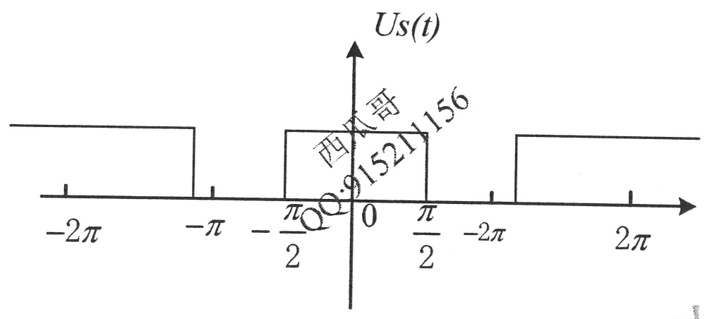

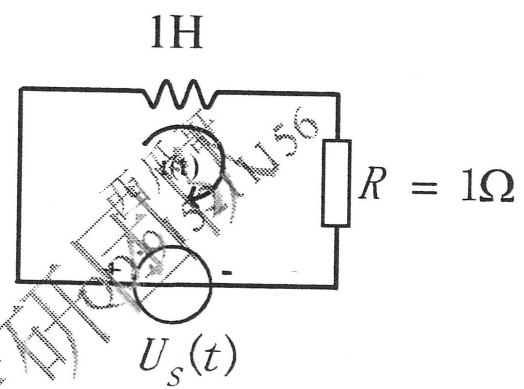

(1)

由题意 \(T = 2 \pi, A = 1, R = 1 \Omega, L = 1 H\)

对电路进行分析，对其状态量做拉普拉斯变换可以得到：

$$
I (s) = \frac {u (s)}{1 + s} \Rightarrow \frac {d i (t)}{d t} + i (t) = u _ {s} (t)
$$

(2)

系统函数 \(H(s) = \frac{I(s)}{U(s)} = \frac{1}{1 + s} \Rightarrow H(j\omega) = \frac{1}{1 + j\omega}\)

则 \(\left|H(j\omega)\right| = \frac{1}{\sqrt{1 + \omega^2}}, \varphi(\omega) = -\arctan \omega\)

\(U_{s}(t)\) 为偶函数时, 则不含有正弦分量, 只有余弦分量和直流分量, \(\omega_{1} = \frac{2 \pi}{T} = 1\).

因为 \(G_{\pi}(t)\xleftarrow{FT}\pi Sa(\frac{\pi}{2}\omega)\)

所以 \(U_{s}(t)\) 的傅里叶级数系数 \(F_{n} = \frac{1}{2 \pi} \pi S a\left(\frac{\pi}{2} n \omega_{1}\right) = \frac{1}{2} S a\left(\frac{\pi}{2} n\right)\)

因此 \(U_{s}(t) = \frac{1}{2} +\sum_{n = 1}^{\infty}Sa(\frac{\pi}{2} n)\cos nt\)

---

一次谐波为： \(\frac{\sin\frac{\pi}{2}}{\frac{\pi}{2}}\cos t = \frac{2}{\pi}\cos t\)

二次谐波为: \(\frac{\sin \pi}{\pi} \cos 2 t = 0\)

三次谐波为： \(\frac{\sin\frac{3\pi}{2}}{\frac{3\pi}{2}}\cos 3t = -\frac{2}{3\pi}\cos 3t\)

当 \(\omega = 1\) 时，\(\left|H(j\omega)\right| = \frac{\sqrt{2}}{2}, \varphi(\omega) = -\frac{\pi}{4}\)；当 \(\omega = 3\) 时，\(\left|H(j\omega)\right| = \frac{\sqrt{10}}{10}, \varphi(\omega) = -\arctan 3\)；

故通过的一次谐波为 \(\frac{\sqrt{2}}{\pi} \cos \left(t - \frac{\pi}{4}\right)\), 通过的二次谐波为 0 , 通过的三次谐波为

$$
- \frac {\sqrt {1 0}}{1 5 \pi} \cos (3 t - \arctan 3).
$$

西瓜哥原创作答

---

# 南昌大学

# 2013年招收攻读硕士研究生

# 入学考试自命题试题

科目代码及名称： 信号与系统811

适用专业： 信息与通信工程、电子信息等

(所有答案都必须写在答题纸上, 写在试卷纸上及草稿纸上无效, 考完后试题随答题纸收回)

# 一、单项选择题（每小题3分，共30分）

1. 信号 \(f(t) = \int_0^t\lambda h(t - \lambda)d\lambda\) 的拉普拉斯变化为（ ）；

A. \(\frac{1}{s} H(s)\)

B. \(\frac{1}{s^{2}} H(s)\)

C. \(\frac{1}{s^{3}} H(s)\)

D. \(\frac{1}{s^{4}} H(s)\)

2. 若系统的起始状态为 0 , 在 \(x(t)\) 的激励下, 所得响应为 ( ) ;

A. 强迫响应

B. 稳态响应

C. 暂态响应

D. 零状态响应

3. 线性系统应满足以下规律 ( )；(刺猬哥考研团队, 答疑交流群 709502924)

A. 若起始状态为零, 则零输入响应为零

B. 若起始状态为零, 则零状态响应为零

C. 若系统的零状态响应为零, 则强迫响应也为零

D. 若激励信号为零, 则零输入响应就是自由响应

4. （西瓜哥QQ915211156）序列 \(f(n) = 2^{-n}u(n)\) 的单边 \(\mathcal{Z}\) 变化 \(F(z)\) 等于（）。

A. \(\frac{z^{-2}}{2 z - 1}\)

B. \(\frac{z}{2 z - 1}\)

C. \(\frac{2 z}{2 z - 1}\)

D. \(\frac{2 z}{2 z + 1}\)

5. 线性时不变系统输出中的自由响应的形式由如下什么所决定 ( )。

---

A. 系统函数极点的位置

B. 激励信号的形式

C. 系统的起始状态

D. 以上均不对

6. 将信号 \( f(t) \) 变化为（ ）称为对信号 \( f(t) \) 的平移或移位。

A. \(f\left(t - t_{0}\right)\)

B. \(f\left(t_{0}-t\right)\)

C. \(f(at)\)

D. \(f(-t)\)

7. 下列说法不正确的是 ( )。

A. 一般周期信号为功率信号

B. 时限信号为能量信号

C. 单位阶跃信号是功率信号

D. 单位冲激信号是能量信号

8. 以下对序列的收敛域描写错误的是 ( )。

A. 对于有限长序列, 其双边 \(z\) 变换的收敛域在整个平面

B. 对于因果序列, 其双边 \(z\) 变换的收敛域为某个圆外区域

C. 对于反因果序列, 其双边 \(z\) 变换的收敛域为某个圆外区域

D. 对于双边序列, 其双边 \(z\) 变换的收敛域为环状区域

9. 已知 \(f(t)\), 为了求 \(f\left(t_{0}-a t\right)\), 下列运算正确的是 ( )。

A. \(f(-a t)\) 左移 \(t_{0}\)

B. \(f(-a t)\) 右移 \(\frac{t_{0}}{a}\)

C. \(f(at)\) 左移 \(t_{0}\)

D. \(f(at)\) 右移 \(\frac{t_{0}}{a}\)

10. 某系统的的系统函数为 \(H(s)\), 若同时存在频响函数 \(H(j \omega)\), 则该系统为 ( )。

A. 时不变系统

B. 因果系统

C. 稳定系统

---

24最强信号辅导班招生啦！让你节省时间，不走弯路，取得佳绩！联系西瓜哥qq915211156 加Q群709502924，使用刺猬哥团队正版核心序列ORK，享受高质量全天候优质答疑指导

D. 线性系统

二、填空题(本大题共5小题，每小题2分，共10分)

1. （西瓜哥 QQ915211156）已知 \(f(t)\) 的频谱 \(F(j \omega)\) 的带宽是 \(\omega_{1}\), 则 \(f(2 t - 4)\) 的频谱的带宽为 ____________;

2. 两个时间函数 \(f_{1}(t)\), \(f_{2}(t)\) 在 \([t_{1}, t_{2}]\) 区间内相互正交的条件为

3. 已知冲激序列 \(\delta_{\tau}(t) = \sum_{n=-\infty}^{+\infty} \delta(t - nT)\), 其指数形式的傅里叶级数是

4. 若连续线性时不变系统的输入信号为 \(f(t)\), 响应为 \(y(t)\), 则系统无畸变传输的时域表达式为 \(y(t) =\) ________; (刺猬哥考研团队, 答疑交流群 709502924)

5. \(F(s) = \frac{4s + 5}{2s + 1}\) 的初值为 , 终值为

# 三、画图题

1. 已知 \(f(-2t + 1)\) 的波形如图所示, 画出 \(f(t)\) 的波形。

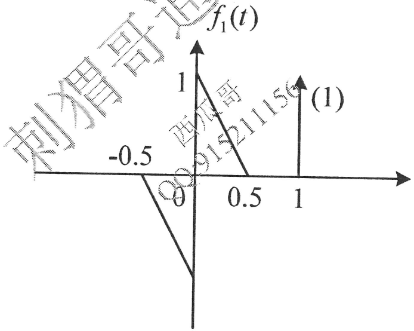

2. \(f_{1}(t)\) 和 \(f_{2}(t)\) 的频谱如图所示, \(f_{1}(t) + f_{2}(t) 、 f_{1}(t) * f_{2}(t)\) 以及 \(f_{1}(t) \cdot f_{2}(t)\) 的频谱表达式,并画出频谱图。(刺猬哥考研团队, 答疑交流群 709502924)

---

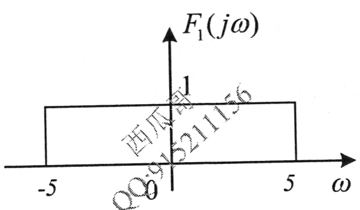

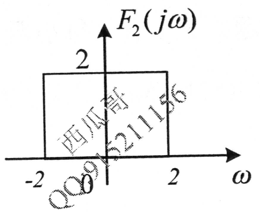

# 四、计算与证明题

1. 已知 \(x_{1}(n) = \left\{ \begin{array}{ccc} 2 & 3 & -1 & 0 & 0 \\ \uparrow & & & & \end{array} \right\}\), \(x_{2}(n) = \left\{ \begin{array}{cccc} 3 & 1 & 0 & 0 & 2 \\ \uparrow & & & & \end{array} \right\}\), 求卷积 \(x(n) = x_{1}(n)*x_{2}(n)\).

2. 已知某系统的数学模型为 \(\frac{d^2y(t)}{dt^2} + 3\frac{dy(t)}{dt} + 2y(t) = \frac{df(t)}{dt} + 2f(t)\), 求系统的冲激响应 \(h(t)\); 若输入信号为 \(f(t) = e^{-3t}u(t)\) 时, 用时域卷积法求系统的零状态响应。

3. 用图解法求图中信号的卷积 \(g(t) = x(t)*h(t)\).

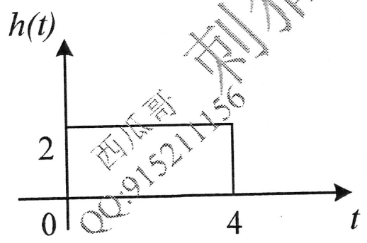

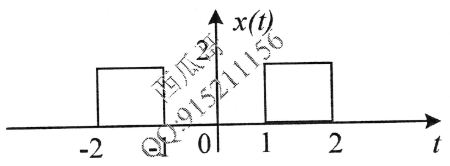

---

# 2013 南昌大学信号与系统 811 真题详解

——西瓜哥原创作答

# 一、选择题

题 1 解: 选 B

$$
f (t) = \int_ {0} ^ {t} \lambda h (t - \lambda) d \lambda = t \varepsilon (t) * h (t) \varepsilon (t) \leftrightarrow \frac {H (s)}{s ^ {2}}
$$

本体考查利用性质计算拉普拉斯变换，熟记常用性质即可。

题 2 解: 选 D (刺猬哥考研团队, 答疑交流群 709502924)

本题考查零状态响应的概念：零状态响应就是系统在零初始状态下由外施激励引起的响应。

题 3 解: 选 A

零输入响应：没有外加激励信号作用，完全由起始状态所产生的响应当起始状态为零，则零输入响应为零，所以A对B错。

C 和 D 中的概念等效需要在 LTI 线性时不变系统中才成立。

题 4 解: 选 C

$$
f (n) = 2 ^ {- n} u (n) \leftrightarrow F (z) = \frac {2 z}{2 z - 1} | z | > \frac {1}{2}
$$

本题考查单边 \(z\) 变换的相关计算, 较为基础。

题 5 解: 选 A

自由响应是由系统本身结构决定的，与外加激励无关。

故系统函数极点的位置可以决定自由响应

题 6 解: 选 A

---

由信号的时移变换可知 \(f(t - t_0)\) 表示信号向右平移 \(t_0\) 个单位

题 7 解: 选 D

由 Parseval 定理 \(\int_{-\infty}^{+\infty}|x(t)|^2 dt = \frac{1}{2\pi}\int_{-\infty}^{+\infty}|X(j\omega)|^2 d\omega\)

\(\int_{-\infty}^{+\infty}|\delta (t)|^2 dt = \frac{1}{2\pi}\int_{-\infty}^{+\infty}|1|^2 d\omega = +\infty\) 故单位冲激信号不是能量信号

题 8 解: 选 C

对于反因果序列, 其双边 \(z\) 变换的收敛域为某个圆内区域

题 9 解: 选 B

\( f\left( {{t}_{0} - {at}}\right)  = f\left\lbrack  {-a\left( {t - \frac{{t}_{0}}{a}}\right) }\right\rbrack \text{即是}f\left( {-{at}}\right) \text{向右平移}\frac{{t}_{0}}{a} \)

题 10 解: 选 C

某系统的的系统函数为 \(H(s)\), 若同时存在频响函数 \(H(j \omega)\), 说明 \(H(s)\) 的收敛域包含虚轴, 故可得系统稳定。

# 二、填空题

1. \(2\omega_{1}\)

由 \(f(t) \leftrightarrow F(j\omega)\) 可得 \(f(2t) \leftrightarrow \frac{1}{2} F\left(j \frac{\omega}{2}\right)\) 和 \(f(2t - 4) \leftrightarrow \frac{1}{2} F\left(j \frac{\omega}{2}\right) e^{-j2\omega}\)

故 \(f(2 t - 4)\) 的频谱的带宽为 \(2 \omega_{1}\)

2. \(\int_{-\infty}^{+\infty}f_1^* (t)f_2(t)dt = \int_{-\infty}^{+\infty}f_2^* (t)f_1(t)dt = 0\)

此条件由复杂的数学推导而来, 记住即可, 有兴趣可以看看书中推导过程。

---

3. \(\sum_{n = -\infty}^{+\infty}\frac{1}{T} e^{jn\frac{2\pi}{T} t}\)

$$
a _ {0} = \frac {1}{T} \int_ {- \frac {T}{2}} ^ {\frac {T}{2}} \delta_ {\tau} (t) d t = \frac {1}{T}
$$

$$
a _ {n} = \frac {1}{T} \int_ {- \frac {T}{2}} ^ {\frac {T}{2}} \delta_ {\tau} (t) e ^ {- j n w _ {0} t} d t = \frac {1}{T} (n \neq 0)
$$

$$
\delta_ {\tau} (t) = \sum_ {n = - \infty} ^ {+ \infty} a _ {n} e ^ {j n \frac {2 \pi}{T} t} = \sum_ {n = - \infty} ^ {+ \infty} \frac {1}{T} e ^ {j n \frac {2 \pi}{T} t}
$$

4. \(y(t) = K f\left(t - t_{0}\right)\) \((K, t_{0}\) 均为常数）

由题知系统是线性时不变系统且无畸变传输，响应只会有幅值大小变化和平移变换

5. \(\frac{3}{2}, 0\)

$$
F (s) = 2 + \frac {3}{2 s + 1}
$$

由初值定理 \(f(0_{+}) = \lim_{s\to \infty}sF(s) = \frac{3}{2}\)

由终值定理 \(\lim_{t\to \infty}f(t) = \lim_{s\to 0}sF(s) = 0\)

# 三、画图题:

1.

一般我们信号变换相关的题采用的顺序为：平移、尺度变化、反转

变换为原来的信号我们的顺序就是其反向过程为：反转、尺度变化、平移

我们已知 \(f(-2t + 1)\) 的图像, 首先我们进行反转得到 \(f(2t + 1)\) 的图像:

---

24最强信号辅导班招生啦！让你节省时间，不走弯路，取得佳绩！联系西瓜哥qq915211156加Q群709502924，使用刺猬哥团队正版核心序列ORK，享受高质量全天候优质答疑指导

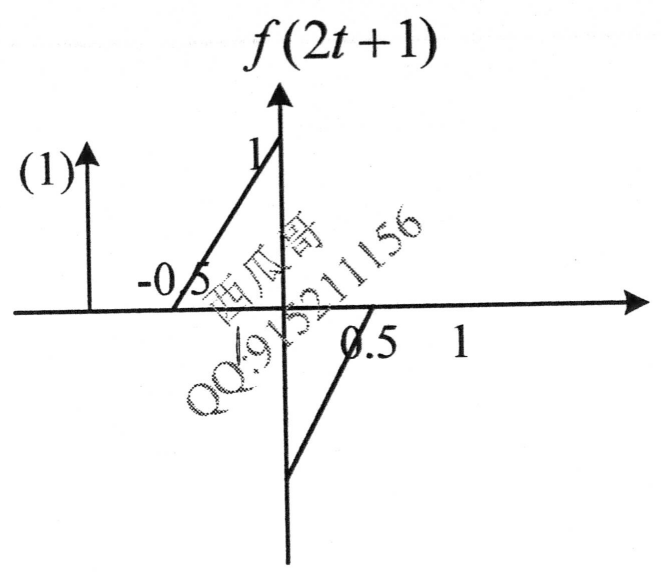

下一步还原尺度变换得到 \(f(t + 1)\) 的图像:

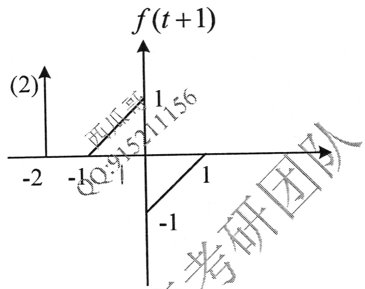

最后移位可以得到 \(f(t)\) 的图像为:

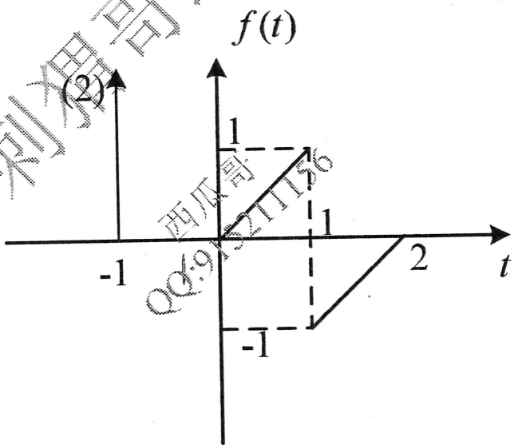

(西瓜哥原创解答, 西瓜哥 QQ915211156)

2.

\(\mathcal{F}[f_1(t) + f_2(t)] = F_1(j\omega) + F_2(j\omega)\), 其图像如下:

---

24最强信号辅导班招生啦！让你节省时间，不走弯路，取得佳绩！联系西瓜哥qq915211156 加Q群709502924，使用刺猬哥团队正版核心序列ORK，享受高质量全天候优质答疑指导

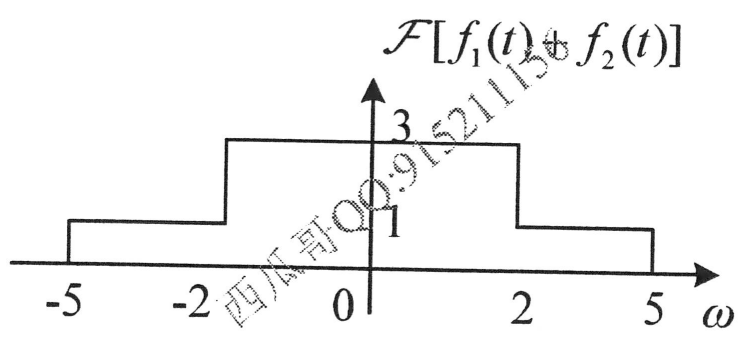

\(\mathcal{F}[f_{1}(t) * f_{2}(t)] = F_{1}(j \omega) \cdot F_{2}(j \omega)\), 其图像如下所示:

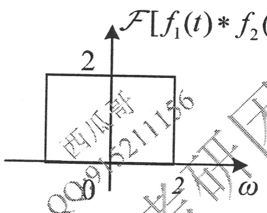

\(\mathcal{F}[f_1(t)\cdot f_2(t)] = \frac{1}{2\pi} F_1(j\omega)*F_2(j\omega),\) 其图像如下所示：

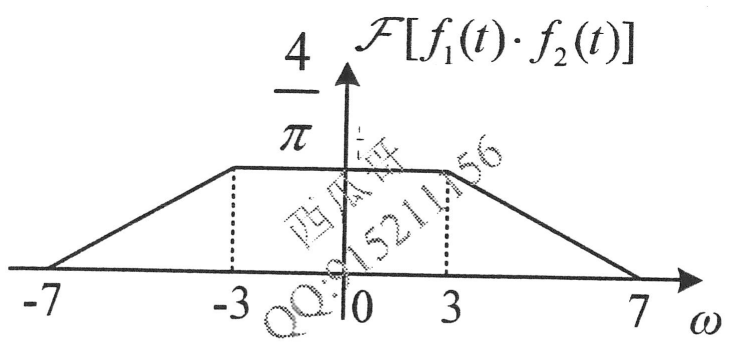

四、简答题:

1.

---

$$
\begin{array}{l} x _ {1} (n) = \left\{ \begin{array}{c c c c c} 2 & 3 & - 1 & 0 & 0 \\ & \uparrow & & & \end{array} \right\} \\ x _ {2} (n) = \left\{ \begin{array}{l l l l l} 3 & 1 & 0 & 0 & 2 \\ \uparrow & & & & \end{array} \right\} \\ x (n) = x _ {1} (n) * x _ {2} (n) = \left\{ \begin{array}{c c c c c c c c c} 6 & 1 1 & 0 & - 1 & 4 & 6 & - 2 & 0 & 0 \\ & \uparrow \end{array} \right\} \\ \end{array}
$$

本题考查离散函数卷积的计算, 利用对位相乘法进行计算即可。

(西瓜哥原创解答, 西瓜哥 QQ915211156)

2.

当激励 \(x(t) = \delta (t)\) 时, 为冲激响应 \(h(t)\), 由已知的系统微分方程我们知:

$$
h ^ {\prime \prime} (t) + 3 h ^ {\prime} (t) + 2 h (t) = \delta^ {\prime} (t) + 2 \delta (t) \dots
$$

其特征方程为: \(\lambda^2 + 3\lambda + 2 = 0\), 解得其特征值为 \(\lambda_1 = -1, \lambda_2 = -2\)

\(h(t)\) 的齐次解为 \(h(t) = a e^{-t} + b e^{-2 t}\)

根据冲激函数匹配法，我们知：

\(\left\{ \begin{array}{l}h^{\prime \prime}(t) = m\delta^{\prime}(t) + n\delta (t) + q\Delta u(t)\\ h^{\prime}(t) = m\delta (t) + n\Delta u(t)\\ h(t) = m\Delta u(t) \end{array} \right.\) ，代入系统微分方程得到：

$$
m \delta^ {\prime} (t) + n \delta (t) + q \Delta u (t) + 3 q \delta (t) + n \Delta u (t) + 2 m \Delta u (t) = \delta^ {\prime} (t) + 2 \delta (t)
$$

对比左右系数得到: \(m = 1, n = -1, q = 1\)

由系统的初始条件 \(h\left(0_{+}\right)=m+h\left(0_{-}\right)=1\), 及 \(h^{\prime}\left(0_{+}\right)=n+h^{\prime}\left(0_{-}\right)=-1\)

可得: \(a = 1, b = 0\), 则 \(h(t) = e^{-t} u(t)\)

当输入信号为 \(f(t) = e^{-3t} u(t)\) 时,

零状态响应 \(y_{zs}(t) = f(t)*h(t) = \int_{-\infty}^{+\infty}e^{-3\tau}u(\tau)e^{-(t - \tau)}u(t - \tau)d\tau = \frac{1}{2} (e^{-t} - e^{-3t})u(t)\)

(刺猬哥考研团队，西瓜哥 QQ: 915211156)

---

3.

由卷积的定义知 \(g(t) = x(t) * h(t) = \int_{-\infty}^{+\infty} x(\tau) h(t - \tau) d\tau\) ，利用图解法如下所示：

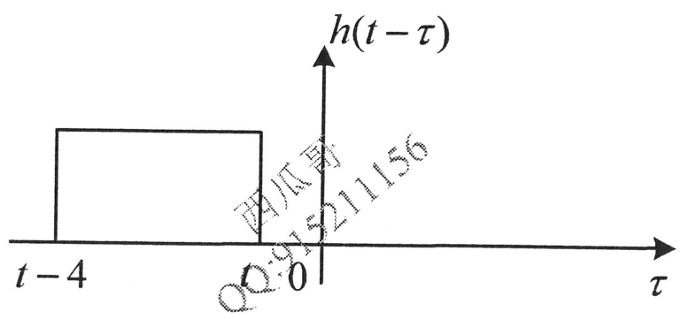

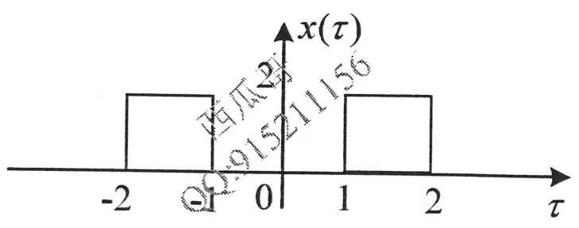

从下述图像中我们可以看出当 \(t \leq -2\) 时，两者的图像没有交集，\(x(\tau) h(t - \tau) = 0\)，因此 \(g(t) = 0\).

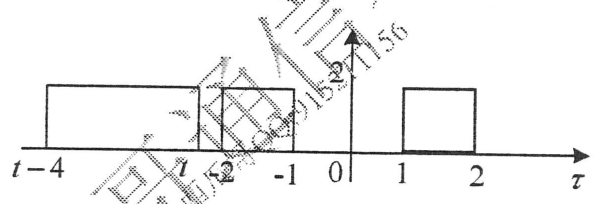

当 \(-2 \leq t \leq -1\) 时候, 其图像如下所示, \(g(t) = \int_{-2}^{t} 4dt = 4(t + 2)\)

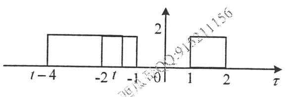

当 \(-1 \leq t \leq -1\) 时候, 其图像如下所示, \(g(t) = \int_{-2}^{-1} 4dt = 4\).

---

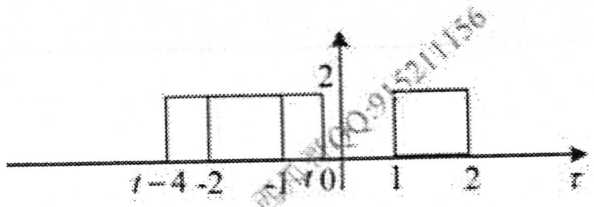

当 \(-1 \leq t \leq 2\) 时候, 其图像如下所示, \(g(t) = \int_{-2}^{-1} 4dt + \int_{1}^{t} 4dt = 4t\).

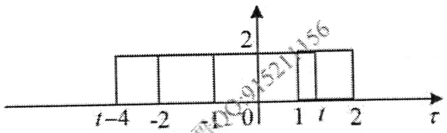

同理当 \(2 \leq t \leq 3\) 时, \(g(t) = \int_{t - 4}^{-1} 4dt + \int_{1}^{2} 4dt = 16 - 4t\).

同理当 \(3 \leq t \leq 5\) 时, \(g(t) = \int_{1}^{2} 4dt = 4\)

同理当 \(5 \leq t \leq 6\) 时, \(g(t) = \int_{t - 4}^{2} 4dt = 24 - 4t\).

同理当 \(6 < t\) 时, \(g(t) = 0\)

(刺猬哥考研团队, 答疑交流群 709502924)

西瓜哥原创作答

---

# 南昌大学

# 2014年招收攻读硕士研究生

# 入学考试自命题试题

科目代码及名称： 信号与系统811

适用专业： 信息与通信工程、电子信息等

(所有答案都必须写在答题纸上, 写在试卷纸上及草稿纸上无效, 考完后试题随答题纸收回)

# 一、填空题（每小题5分，共50分）

1. （西瓜哥QQ915211156） \(x(t) = \int_{-10}^{10}(2t^2 + t - 4)\delta(2t - 4)dt =\)

2. 若LTI系统的输入与输出关系为 \( y(t) = \int_{-\infty}^{+\infty} e^{-2(t - \tau)} x(\tau - 1)d\tau \) （其中 \( x(t) \) 与 \( y(t) \) 分别为输入和输出），求系统的冲激响应为

3. 已知 \(f(t) \xleftarrow{FT} F(\omega)\), \(f(d) = \frac{d}{dt} \left( \frac{\sin \omega_c t}{2\pi t} \right)\), 求 \(F(\omega) =\)

4. 计算能量信号 \(f(t) = e^{-t} u(t)\) 在频带 \(-5(\text{rad} / s) \leq \omega \leq 5(\text{rad} / s)\) 内的能量占信号总能量的百分比为________；（西瓜哥 QQ915211156）

5. 已知 \(f(t) \xleftarrow{\mathcal{L}} F(S) = \frac{1 - e^{-s}}{s(s + 1)}\), 则 \(f(t) =\)

6. 已知因果系统传递函数 \( H(s) = \frac{1}{(s + a)(s + b)} \)，\( a, b \) 满足 ______ 时可以使系统稳定；

7. 令 \(h[n]\) 为离散时间系统的单位样值响应, 假设该系统是一个因果系统, 且 \(h[n]\) 的偶分量 \(h_c[n]\) 在 \(n \geq 0\) 的范围内描述为 \(h_c[n] = \left\{ \begin{array}{l} 0, n = 0 \\ 2, n = 1 \\ 4, n \geq 2 \end{array} \right.\), 则 \(h[n]\) 在整个时间范围内的数学表达式

---

为________；（刺猬哥考研团队，答疑交流群709502924）

8. 已知 \( f(n) \xleftarrow{z} F(z) \)，\( f(n) = \left(\frac{1}{2}\right)^n u(-n) \)，求 \( F(z) = \) ______；

9. 已知 \(x(n) = \cos \frac{\pi}{8} n^{2}\) 为一个周期信号，则其周期为

10. 已知离散时间系统的单位样值响应为 \(h(n) = \left(-\frac{1}{2}\right)^n u(n) + (1.01)^n u(1 - n)\), 判断该系统的因果性与稳定性________;（西瓜哥 QQ915211156）

# 二、简单计算题(本大题共4小题，每小题8分，共32分)

1. (8 分) 周期信号 \(f(t) = 1 - \frac{1}{2} \cos \left(\frac{\pi}{4} t - \frac{2\pi}{3}\right) + \frac{1}{4} \sin \left(\frac{\pi}{3} t - \frac{\pi}{6}\right)\), 画出它的单边幅度频谱图和相位频谱图。

2. (8 分) 已知某系统的系统函数为 \(H(s) = \frac{1}{s^2 + 2s + k - 2}\)

(1) 若要使系统稳定, 求 \(k\) 值应该满足的条件; (3 分)

(2) 在系统临界稳定的条件下, 画出系统的幅频特性和相频特性曲线。(5 分)

3. (8 分) 序列 \(x(n)\) 的自相关序列 \(\phi_{xx}(n) = \sum_{k=-\infty}^{+\infty} x(k) x(n+k)\), 试用 \(x(n)\) 的 \(Z\) 变换来确定 \(\phi_{xx}(n)\) 的 \(Z\) 变换。

4. (8 分) 一离散系统的系统流图如下图所示, 列写系统的状态方程与输出方程 (写成矩阵形式, 从上往下第二个二分之一的箭头往下)

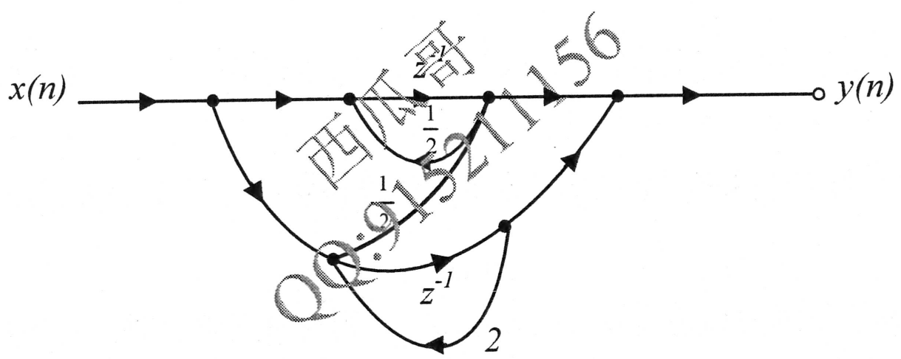

---

# 三、计算题（本大题共4小题，第1、2小题15分，第3题20分，第四题18分，共68分）

1. (15 分) 某线性非时变系统的系统函数 \(H(s) = \frac{s + c}{s^2 + as + b}\), 已知当输入 \(f(t) = u(t)\) 时, 其全响应为 \(y(t) = (1 - e^{-2t} + 2e^{-3t})u(t)\)

(1) 求系统函数中的 \(a 、 b\) 和 \(c\) 的值；（7 分）

(2) 求该系统的零输入响应和零状态响应。（8 分）

2. (8 分) 由下图所示系统, 已知 \(f_{1}(t) = S a(t)\), \(f_{2}(t) = f_{1}^{2}(t)\)

(1) 分别画出 \(f_{1}(t)\) 与 \(f_{2}(t)\) 的幅度谱 \(\left|F_{1}(\omega)\right|\) 和 \(\left|F_{2}(\omega)\right|\); (5 分)

(2) 为了从 \(f_{3}(t)\) 恢复 \(f_{2}(t)\), 求最小采样频率 \(f_{\min }\) 以及最大采样间隔 \(T_{\max }\); (5 分)

(3) 取 \(T_{s} = T_{\max}\), 写出 \(\mathcal{F}[f_{3}(t)] = F_{3}(\omega)\) 的表达式, 并画出频谱图 \(F_{3}(\omega)\)。(5 分)

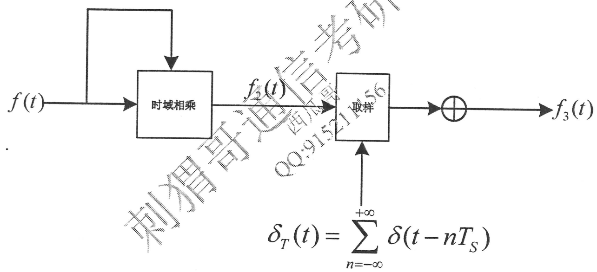

3. (20 分) 系统如下图所示, 且 \(x(t) = \delta(t)\)

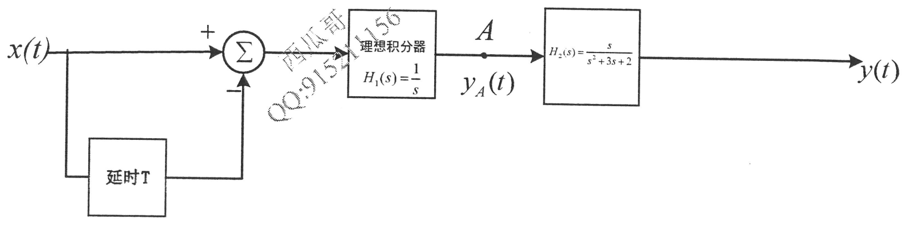

---

(1) 画出 \(A\) 点 \(y_{A}(t)\) 的波形；（3分）

(2) 求出系统响应 \(y(t)\); (4 分)

(3) 粗略画出 \(H_{2}(s)\) 的零极点图以及幅频和相频特性曲线；（7分）

(4) 求出整个系统的系统函数 \(H(s)\), 并根据系统函数写出系统的微分方程; (4 分)

4. (18 分) 已知一离散系统在 \(Z\) 平面上的零极点分别为: 零点 \(z_{1} = 0\), 极点 \(p_{1} = -\frac{1}{2}, p_{2} = 1\), 且已知系统的单位冲激响应 \(h(n)\) 的终值满足 \(\lim _{n \rightarrow \infty} h(n)=\frac{1}{3}\), 系统的初始条件为 \(y(0)=2, y(1)=1\), 求

(1) 系统的系统函数以及零输入响应；（6 分）

(2) 若系统的激励为 \(x(n) = (-3)^{n} u(n)\), 求零状态响应。(6 分)

(3) 写出该离散系统的差分方程

---

# 2014南昌大学信号与系统811真题详解

——西瓜哥原创作答

# 一、填空题

题 1 解: 3

$$
x (t) = \int_ {- 1 0} ^ {1 0} (2 t ^ {2} + t - 4) \delta (2 t - 4) d t = \frac {1}{2} \int_ {- 1 0} ^ {1 0} (2 t ^ {2} + t - 4) \delta (t - 2) d t = \frac {1}{2} \times 6 = 3
$$

本题考察冲激函数的相关性质的应用, 这道题应用到了 \(\delta (a t) = \frac{1}{\left| a \right|} \delta (t)\) 的尺度变换性质,

以及冲激函数的抽样筛选性质 \(\int_{-\infty}^{+\infty} f(t) \delta(t - t_0) dt = f(t_0)\), 掌握好公式小心计算即可。

题 2 解: \(e^{-2(t - 1)}\)

冲激响应就是系统函数 \(h(t)\), 所以本题题意就是让我们求出 \(h(t)\)

而我们知道 \(y(t) = x(t)*h(t) = \int_{-\infty}^{+\infty}h(m)x(t - m)dm\)

题中已知 \(y(t) = \int_{-\infty}^{+\infty} e^{-2(t - \tau)} x(\tau - 1)d\tau\) ，那我们需要做的是将之凑出卷积形式

我们令 \(\tau - 1 = t - m \Rightarrow \tau = t - m + 1\), 将其代入上式可得: \(y(t) = \int_{-\infty}^{+\infty} e^{-2(m - 1)} x(t - m) dm\)

可知 \(h(m) = e^{-2(m - 1)}\)

将变量代换可得 \(h(t) = e^{-2(t - 1)}\)

题3解： \(\frac{j\omega}{2} G_{2\omega_c}(\omega)\)

首先我们来分析 \(\frac{\sin \omega_c t}{2\pi t}\), 我么可以把它变化为熟知的抽样函数为 \(g(t) = \frac{\omega_c}{2\pi} \frac{\sin \omega_c t}{\omega_c t}\)

由题意可知 \(f(t) = \frac{d}{dt} g(t)\)

首先我们对 \(g(t)\) 进行傅里叶变换, \(g(t) \xleftarrow{FT} G(j\omega) = \frac{\omega_c}{2\pi} \cdot \frac{\pi}{\omega_c} G_{2\omega_c}(\omega) = \frac{1}{2} G_{2\omega_c}(\omega)\).

由傅里叶变化的微分性质, 可得 \(f(t)\) 的 \(F(j \omega) = \frac{j \omega}{2} G_{2 \omega_c}(\omega)\)

---

本题考察傅里叶变化相关性质的应用，首先我们要记住常见的傅里叶变换对 \(\frac{\sin\omega t}{\pi t}\xleftarrow{FT}G_{2\omega}\)，在看到相关表达式之后，可以变换为与之相关的表达式，就可以轻而易举写出其傅里叶变化，其次应用到傅里叶变换的微分特性，时域微分，对应在频域上就是乘以一个 \(j\omega\) 的乘积项。

题4解： \(\frac{2}{\pi}\arctan 5\)

根据帕斯瓦尔定理我们知能量的计算公式 \(E = \frac{1}{2\pi}\int_{-\infty}^{+\infty}\left|F(j\omega)\right|^2 d\omega\)

对 \(f(t) = e^{-t} u(t)\) 进行傅里叶变化可得 \(F(j \omega) = \frac{1}{1 + j \omega}\)

则 \(\left|F(j\omega)\right|^2 = \frac{1}{1 + \omega^2}\), 代入能量的公式得到 \(E = \frac{1}{2\pi} \int_{-\infty}^{+\infty} \frac{1}{1 + \omega^2} d\omega = \frac{1}{2\pi} \arctan \omega \Bigg|_{-\infty}^{\infty} = \frac{1}{2}\)

在频带 \(-5(rad / s) \leq \omega \leq 5(rad / s)\) 范围内的信号能量为 \(E_{1} = \frac{1}{2\pi}\int_{-5}^{+5}\frac{1}{1 + \omega^{2}} d\omega = \frac{1}{\pi}\arctan 5\) 则能量占比 \(\eta = \frac{E_1}{E} = \frac{2}{\pi}\arctan 5.\)

本题考查帕斯瓦尔定理的相关应用，对于非周期信号，我们可以利用其时域表达式进行能量计算，也可以用其频域表达式进行能量计算，他们之间满足一定的关系，即为帕斯瓦尔定理：\(\int_{-\infty}^{+\infty}\left|x(t)\right|^2 dt = \frac{1}{2\pi}\int_{-\infty}^{+\infty}\left|X(j\omega)\right|^2 d\omega\)，本题中我们可以看到要我们求某个频带范围内的能量和总能量之间的比值，所以我们可以直接用频域表达式进行计算。计算时小心仔细即可。

题5解： \(f(t) = (1 - e^{-t})u(t) - [1 - e^{-(t - 1)}]u(t - 1)\)

由题中所给的 \(F(s) = \frac{1 - e^{-s}}{s(s + 1)}\), 我么可以将其拆分变换为 \(\frac{1 - e^{-s}}{s} - \frac{1 - e^{-s}}{s + 1}\)

由常见的拉氏变换 \(u(t) \xleftarrow{\mathcal{L}} \frac{1}{s}\)，可得 \(e^{-t} u(t) \xleftarrow{\mathcal{L}} \frac{1}{s + 1}\)

对其进行拉普拉斯逆变换可得 \(f(t) = u(t) - u(t - 1) - [e^{-t}u(t) - e^{-(t - 1)}u(t - 1)]\)

化简可得 \(f(t) = (1 - e^{-t})u(t) - [1 - e^{-(t - 1)}]u(t - 1)\)

---

本题考察的是拉式变化的逆变换的相关计算，以及相关性质的应用，本题考查了时移性质的应用即 \(f(t - t_0) \xleftarrow{\mathcal{L}} F(s)e^{-st_0}\)，以及频移性质 \(f(t)e^{s_0t} \xleftarrow{\mathcal{L}} F(s - s_0)\)。熟练掌握性质才能从容不迫地应对此类试题。

题6解： \(a > 0,b > 0\)

法一: 根据因果系统函数 \(H(s) = \frac{1}{(s + a)(s + b)}\), 我们知道系统的两个极点 \(s_{1} = -a, s_{2} = -b\) 要使系统稳定, 那么两个极点都应该在系统的左半平面, 从而我们得到 \(-a < 0\) 且 \(-b < 0\),从而得到答案 \(a > 0, b > 0\).

法二: 令 \(A(s) = s^{2} + (a + b)s + ab\), 当三个项的系数全部大于 0 时, 系统稳定, 从而有: \(\left\{ \begin{array}{l} a + b > 0 \\ ab > 0 \end{array} \right. \Rightarrow \left\{ \begin{array}{l} a > 0 \\ b > 0 \end{array} \right.\).

本题考察根据系统函数判断系统的稳定性的相关知识点。本题为因果系统, 那么 \(H(s)\) 的收敛域是位于最右边极点的右半平面, 要使系统稳定, 则收敛域要包括 \(j \omega\) 轴, 那么就要求所有的极点都在左半平面, 由此进行解题。

题7解： \(4u(n - 1) + 4u(n - 2)\)

因为系统是因果系统则当 \(n < 0\) 时 \(h(n) = 0\), 根据偶分量和总式子之间的关系 \(h_{e}(n) = \frac{h(n) + h(-n)}{2}, n \geq 0\), 可知 \(h(n) = 2 h_{e}(n) = 4 u(n - 1) + 4 u(n - 2)\)

本题考察信号奇偶分量的定义, 偶分量 \(h_{e}(n) = \frac{h(n) + h(-n)}{2}\), 还考察了因果系统的相关定义, 平时复习要对这些细节之处多多注意。(刺猬哥考研团队, 答疑交流群 709502924)

题8解： \(F(z) = \frac{-\frac{1}{2}}{z - \frac{1}{2}},|z| <   \frac{1}{2}\)

---

法一: (2) \(u[n] \xleftarrow{zT} \frac{1}{1 - 2z^{-1}}, |z| > 2\), 由时间反转性质有:

$$
f (n) = (\frac {1}{2}) ^ {n} u (- n) \xleftarrow {\mathcal {Z T}} \frac {1}{1 - 2 z}
$$

法二：由 \(-\left(\frac{1}{2}\right)^n u[-n-1] \xleftarrow{ZT} \frac{1}{1 - az^{-1}}, |z| < \frac{1}{2}\)，则

$$
\left(\frac {1}{2}\right) ^ {n} u [ - n - 1 ] \xleftarrow {Z T} \frac {- 1}{1 - \frac {1}{2} z ^ {- 1}}, | z | <   \frac {1}{2}
$$

用 \(n - 1\) 替换了 \(n\), 则有

$$
\left(\frac {1}{2}\right) ^ {n - 1} u [ - n ] \xleftarrow {Z T} \frac {- 1}{1 - a z ^ {- 1}} z ^ {- 1}, | z | <   \frac {1}{2}
$$

两边同时乘以 \(\frac{1}{2}\), 则有

$$
\left(\frac {1}{2}\right) ^ {n} u [ - n ] \xleftarrow {Z T} \frac {1}{1 - 2 z}, | z | <   \frac {1}{2}
$$

法三：因为 \(\left(\frac{1}{2}\right)^n u[-n-1] \xleftarrow{zT} \frac{-1}{1-\frac{1}{2}z^{-1}}, |z|<\frac{1}{2}\)

又由 \(\left(\frac{1}{2}\right)^n u[-n] = \left(\frac{1}{2}\right)^n u[-n - 1] + \delta(n)\)

从而有 \(\left(\frac{1}{2}\right)^n u[-n] \xleftarrow{z_T} \frac{-1}{1 - \frac{1}{2}z^{-1}} + 1 = \frac{1}{1 - 2z}, |z| < \frac{1}{2}\)

本题考查 \(z\) 变化的计算, 根据常见信号的的 \(z\) 变换, 我们可以利用性质得到本题序列的 \(z\) 变换, 解析中三种方法可以仔细琢磨。并且要牢记常见信号的 \(z\) 变换。(西瓜哥 QQ: 915211156)

题9解：8

如果 \(x(n)\) 是一个周期信号, 那么有 \(x(n + N) = x(n)\), 代入表达式计算可得

\(\cos \frac{\pi}{8} (n^{2} + 2 n N + N^{2}) = \cos \frac{\pi}{8} n^{2}\), 由此可得 \((2 n N + N^{2}) \frac{\pi}{8} = 2 k \pi \Rightarrow 2 n N + N^{2} = 16 k\), 从而得到 \(N = 8\).

本题考察对周期信号周期的相关计算, 周期信号满足 \(x(n + N) = x(n)\), 由此计算即可。

题 10 解: 非因果稳定系统

---

从单位样值响应中可以看出 \((- \frac{1}{2})^{n} u(n)\) 是一个因果右边序列, 其收敛域为 \(\left|z\right| > \left| - \frac{1}{2}\right| = \frac{1}{2},\) \((1.01)^{n} u(1 - n)\) 是一个反因果左边序列, 其收敛域为 \(\left|z\right| < 1.01\), 因此整个系统的收敛域为 \(\frac{1}{2} < \left|z\right| < 1.01\), 由此可以看出系统为非因果稳定系统。

本题考查收敛域判断因果性和稳定性，系统如果是稳定的，那么收敛域要在最右边极点的右边区域，显然本题不符合，系统要是稳定的，要使收敛域包括单位圆，显然成立，因此该系统是非因果稳定系统。（西瓜哥QQ：915211156）

# 二、简单计算题

1.

原式可以归一化写为 \(f(t) = 1 + \frac{1}{2} \cos \left(\frac{\pi}{4} t + \frac{\pi}{3}\right) + \frac{1}{4} \cos \left(\frac{\pi}{3} t - \frac{2\pi}{3}\right)\).

根据信号表达式我们可以确定其基频 \(\omega_{0} = \frac{\pi}{12}\), 画出其单边幅度谱如下:

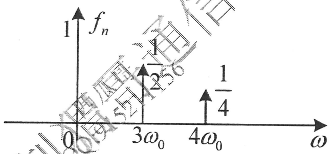

画出其单边相位频谱图如下:

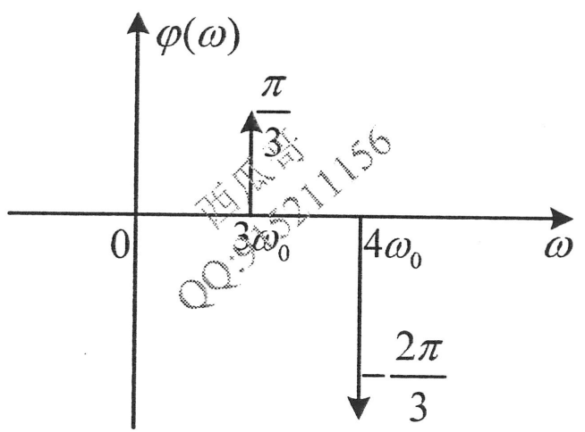

(西瓜哥原创解答, 西瓜哥 QQ915211156)

2.

---

(1)

$$
H (s) = \frac {1}{s ^ {2} + 2 s + k - 2}
$$

这道题, 我们求极点来判断的话会比较麻烦, 此题我们采用罗斯判定, 即分母的每一项的系数全部大于零, 则系统稳定, 则有 \(k - 2 > 0\), 解得 \(k > 2\).

(2)

临界稳定时, \(k = 2\), 极点位于虚轴上, \(H(s) = \frac{1}{s(s + 2)}\)

注意此处极点在虚轴上，所以不可以直接令 \(s = jw\)

这里我们先对 \(H(s)\) 部分分式法逆变换得到:

$$
H (s) = \frac {1}{s ^ {2} + 2 s} = \frac {\frac {1}{2}}{s} + \frac {- \frac {1}{2}}{s + 2}
$$

再逆变换得到 \(h(t) = \frac{1}{2} u(t) - \frac{1}{2} e^{-2t}u(t)\)

再对得到的表达式傅里叶变换得到:

$$
H (j w) = \frac {1}{2} [ \pi \delta (w) + \frac {1}{j w} ] - \frac {1}{2} \frac {1}{j w + 2} = \frac {\pi}{2} \delta (w) + \frac {1}{- w ^ {2} + 2 j w}
$$

冲激项只影响幅度而不影响相位，由此我们可以得到幅频和相频表达式如下：

\(\left|H(j\omega)\right| = \frac{1}{\sqrt{\omega^4 + 4\omega^2}} +\frac{\pi}{2}\delta (w),\) 幅频特性如下：

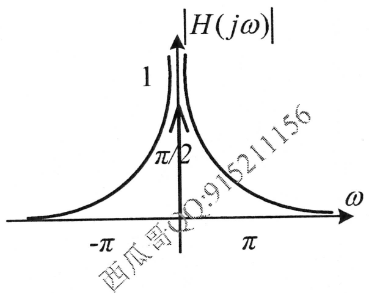

相频我们看除冲激项以外的那一部分，此处我们有两种办法对相频进行处理，首先我们

---

从表达式出发, 接下来进入本题中最重要的点, 首先我们看分子部分, 毋庸置疑, 分子相位是 0 , 我们接下来看分母部分, 分母部分无论 \(w\) 取多少, 实部总为负数, 而虚部要么是正数要么是负数, 所以分母代表的复数始终在复频域的第二或者第三象限, 如果在第二象限, 那么这个复数的角度是否大于了二分之派, 如果在第三象限, 那么这个复数的角度是不是大于了负二分之派(从转动范围上看而不是数值大小看)。而我们常用的 arctan 函数, 其值域是负二分之派到二分之派, 所以此时的相位表达式需要加以转换才能加以使用, 以后记住如果在第二象限, 那么要在 arctan 前加一个 \(\pi\), 如果在第三象限要在 arctan 前加一个负派, 因此此处的表达式变成:

$$
\varphi (\omega) = \left\{ \begin{array}{l} 0 - \left(\pi - \arctan \frac {2}{\omega}\right), \omega > 0 \\ 0 - \left(- \pi - \arctan \frac {2}{\omega}\right), \omega <   0 \end{array} \right.
$$

当 \(\omega = 0^{+}\)的时候，代入大于0的表达式，得到 \(\varphi (0^{+}) = 0 - (\pi -\arctan +\infty) = -\frac{\pi}{2}\) 当 \(\omega = 0^{-}\)的时候，代入小于0的表达式，得到 \(\varphi (0^{-}) = 0 - (-\pi -\arctan -\infty) = \frac{\pi}{2}\) 当 \(\omega = +\infty\) 的时候，代入大于0的表达式，得到 \(\varphi (+\infty) = 0 - (\pi -\arctan 0^{+}) = -\pi\) 当 \(\omega = -\infty\) 的时候，代入小于0的表达式，得到 \(\varphi (-\infty) = 0 - (-\pi -\arctan 0^{-}) = \pi\) 由此可以画出其相频图如下所示：

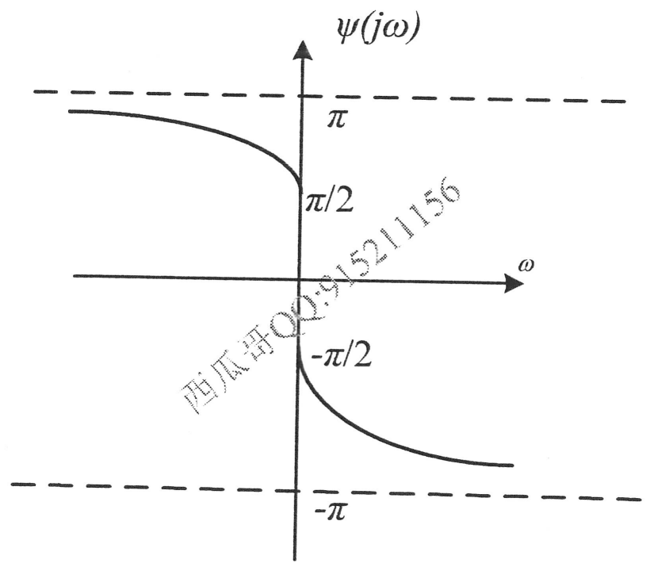

为了验证正确性，我们采用几何法分析再来解这道题，一个极点在 0，一个极点在负二

---

当 \(\omega = 0^{+}\)的时候，代表动点沿着 \(\mathrm{jw}\) 轴正半轴刚刚出发，这时候，这个点到0构成的矢量线的角度为二分之派，而到-2这个极点的矢量线的角度为0，则此时整体的相位为分子相位的0减去分母相位的二分之派为负二分之派；当 \(\omega = 0^{-}\)的时候，代表动点沿着 \(\mathrm{jw}\) 轴负半轴刚刚出发，这时候，这个点到0构成的矢量线的角度为负二分之派，而到-2这个极点的矢量线的角度为0，则此时整体的相位为分子相位的0减去分母相位的负二分之派为二分之派；当 \(\omega = +\infty\)的时候，代表动点到无穷远，此时动点到0和负二两个极点的矢量线的角度都近似为二分之派，则此时整体的相位为分子相位的0减去分母相位的派为负派；当 \(\omega = -\infty\)的时候，同样分析，整体相位为派，由此两种方法的结果一致，证明了方法的可行性！

3.

由题中定义 \(\phi_{xx}(n) = \sum_{k = -\infty}^{+\infty}x(k)x(n + k)\)

又由 \(x(n)\) 的 \(z\) 变换公式 \(x(n) \xleftarrow{ZT} X(z) = \sum_{n=-\infty}^{+\infty} x(n) z^{-n}\)

将以上两式结合得到:

$$
\begin{array}{l} \phi (z) = \sum_ {n = - \infty} ^ {+ \infty} [ \sum_ {k = - \infty} ^ {\infty} x (k) x (n + k) ] z ^ {- n} \\ = \sum_ {k = - \infty} ^ {+ \infty} x (k) \sum_ {n = - \infty} ^ {\infty} x (n + k) z ^ {- n} \\ \end{array}
$$

接下来令 \(n + k = t\) ，得到：

$$
\begin{array}{l} \phi (z) = \sum_ {k = - \infty} ^ {+ \infty} x (k) \sum_ {t = - \infty} ^ {\infty} x (t) z ^ {- (t - k)} \\ = \sum_ {k = - \infty} ^ {+ \infty} x (k) \left(\frac {1}{z}\right) ^ {- k} \sum_ {t = - \infty} ^ {\infty} x (t) z ^ {- t} \\ = x (\frac {1}{z}) x (z) \\ \end{array}
$$

(刺猬哥考研团队, 答疑交流群 709502924)

---

4. 从上往下第二个二分之一的箭头往下

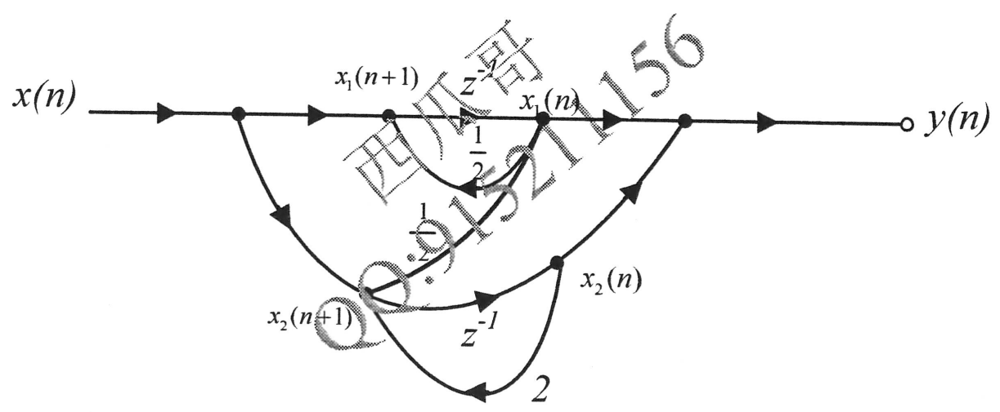

从右往左，从上到下依次设状态变量为 \(x_{1}(n) 、 x_{2}(n)\)

$$
x _ {1} (n + 1) = \frac {1}{2} x _ {1} (n) + x (n)
$$

$$
x _ {2} (n + 1) = \frac {1}{2} x _ {1} (n) + 2 x _ {2} (n) + x (n)
$$

$$
y (n) = x _ {1} (n) + x _ {2} (n)
$$

状态方程： \(\left[ \begin{array}{l}x_{1}(n + 1)\\ x_{2}(n + 1) \end{array} \right] = \left[ \begin{array}{ll}\frac{1}{2} & 0\\ \frac{1}{2} & 2 \end{array} \right]\left[ \begin{array}{l}x_{1}(n)\\ x_{2}(n) \end{array} \right] + \left[ \begin{array}{l}1\\ 1 \end{array} \right]x(n)\)

输出方程: \(y(n) = \left[ \begin{array}{ll}1 & 1 \end{array} \right]\left[ \begin{array}{l}x_{1}(n)\\ x_{2}(n) \end{array} \right] + 0\cdot x(n)\)

# 三、计算题:

1.

(1)

已知输入 \(f(t)\) 的全响应为 \(y(t) = (1 - e^{-2t} + 2e^{-3t})u(t)\), 输入 \(f(t) = u(t)\), 所以强迫响应为 \(u(t)\), 由剩下的自由响应部分 \((-e^{-2t} + 2e^{-3t})u(t)\) 可以得到极点为 \(s_1 = -2, s_2 = -3\)

从而 \(s^2 + as + b = (s + 2)(s + 3) = s^2 + 5s + 6 \Rightarrow a = 5, b = 6\)

---

对 \(f(t)\) 进行拉氏变换得 \(F(s) = \frac{1}{s}\)

$$
Y _ {z s} (s) = H (s) F (s) = \frac {s + c}{s (s + 2) (s + 3)}
$$

对全响应两边求拉氏变换得:

\(Y(s) = \frac{1}{s} -\frac{1}{s + 2} +\frac{2}{s + 3} = \frac{2s^2 + 6s + 6}{s(s + 2)(s + 3)}\) 说明极点 \(s = 0\) 引入了强迫响应

则 \(Y_{zi}(s) = Y(s) - Y_{zs}(s) = \frac{2s^2 + 5s + 6 - c}{s(s + 2)(s + 3)}\)

零输入响应下, 是没有外加激励信号的, 也即没有强迫响应, 所以由激励信号 \(u(t)\) 影响的部分 (即 s) 应该被约去, 只有 \(c = 6\) 时情况成立。

(2)

由第一小问知:

$$
\left\{ \begin{array}{l} Y _ {z s} (s) = \frac {s + 6}{s (s + 2) (s + 3)} \\ Y _ {z i} (s) = \frac {2 s + 5}{(s + 2) (s + 3)} \end{array} \right.
$$

利用部分分式法对上两个式子进行展开：

$$
Y _ {z s} (s) = \frac {s + 6}{s (s + 2) (s + 3)} = \frac {1}{s} + \frac {- 2}{s + 2} + \frac {1}{s + 3}
$$

从而 \(y_{zs}(t) = (1 - 2e^{-2t} + e^{-3t})u(t)\)

同理 \(Y_{zi}(s) = \frac{2s + 5}{(s + 2)(s + 3)} = \frac{1}{s + 2} +\frac{1}{s + 3}\)

从而 \(y_{zi}(t) = (e^{-2t} + e^{-3t})u(t)\)

(西瓜哥原创解答，西瓜哥 QQ915211156)

2.

(1)

---

$$
f _ {1} (t) = S a (t) \xleftarrow {\mathcal {F}} F _ {1} (\omega) = \pi G _ {2} (\omega)
$$

\(f_{2}(t) = f_{1}(t)\cdot f_{1}(t)\), 时域相乘, 频域相卷则

\(f_{2}(t) \xleftarrow{\mathcal{F}} F_{2}(\omega) = \frac{1}{2\pi} \pi G_{2}(\omega) * \pi G_{2}(\omega) = \frac{\pi}{2} G_{2}(\omega) * G_{2}(\omega)\), 画出它们的幅度谱如下:

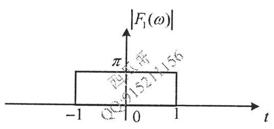

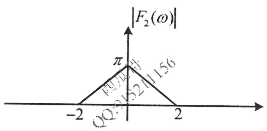

(2)

根据奈奎斯特抽样定理

采样频率要大于 \(f_{2}(t)\) 信号最大频率的两倍: \(\omega_{s} \geq 2 \omega_{m} = 4\)

\(T_{\max} = \frac{2 \pi}{\omega} = \frac{\pi}{2}\), 同时 \(f_{\min} = \frac{1}{T_{\max}} = \frac{2}{\pi}\) (西瓜哥 QQ:915211156)

(3)

\(T_{s} = T_{\max} = \frac{\pi}{2}\), 则 \(\delta_{T}(t) = \sum_{n=-\infty}^{+\infty} \delta(t - \frac{\pi}{2} n)\)

$$
f _ {3} (t) = f _ {2} (t) \cdot \delta_ {T} (t)
$$

再根据时域相乘，频域卷积的性质 \(f_{3}(t)\xleftarrow{\mathcal{F}}\frac{1}{2\pi} F_{1}(\omega)*F_{2}(\omega)\)

而 \(\delta_{T}(t) \xleftarrow{\mathcal{F}} 4 \sum_{n=-\infty}^{\infty} \delta(\omega - 4 n)\) （需要记忆的公式，有兴趣推导过程的可以私聊西瓜哥）

$$
\therefore F _ {3} (\omega) = \frac {1}{2 \pi} F _ {1} (\omega) * 4 \sum_ {n = - \infty} ^ {\infty} \delta (\omega - 4 n) = \frac {2}{\pi} F _ {1} (\omega) * \sum_ {n = - \infty} ^ {\infty} \delta (\omega - 4 n)
$$

频域上体现为 \(F_{1}(\omega)\) 的移位, 其幅度谱图像如下所示:

---

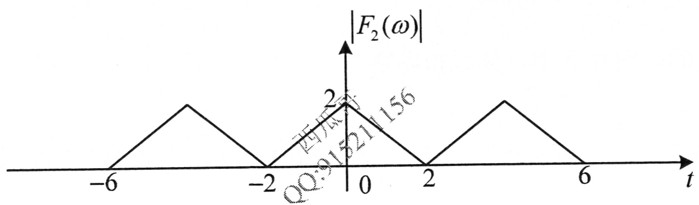

3.

(1)

由系统框图可知:

进入理想积分器的信号为 \(x(t) - x(t - T)\)

且已知 \(x(t) = \delta (t)\), 则进入理想积分器的信号为 \(\delta (t) - \delta (t - T)\)

则 \(y_{A}(t) = [\delta (t) - \delta (t - T)]* h_{1}(t)\)

因为理想积分器的系统函数 \(H_{1}(s) = \frac{1}{s} \Rightarrow h_{1}(t) = u(t)\)

\(\therefore y_{A}(t) = [\delta (t) - \delta (t - T)] * u(t) = u(t) - u(t - T)\) （冲激函数的性质）

画出其波形如下:

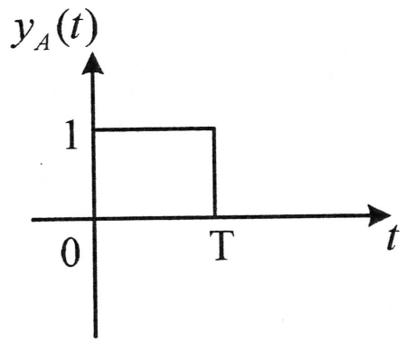

(2)

$$
\begin{array}{l} y (t) = y _ {A} (t) * h _ {2} (t) \\ Y (s) = Y _ {A} (s) \cdot H _ {2} (s) \\ = \frac {1 - e ^ {- s T}}{s} \cdot \frac {s}{s ^ {2} + 3 s + 2} = \frac {1 - e ^ {- s T}}{(s + 1) (s + 2)} \\ \end{array}
$$

---

$$
= (1 - e ^ {- s T}) (\frac {1}{s + 1} - \frac {1}{s + 2})
$$

由此 \(y(t) = \mathcal{L}^{-1}[Y(s)] = (e^{-t} - e^{-2t})u(t) - [e^{-(t - T)} - e^{-2(t - T)}]u(t - T)\)

(3)

\(H_{2}(s) = \frac{s}{(s + 1)(s + 2)}\), 本题要求粗略画出幅频和相频特性曲线.

我们采用几何画法根据零极点图定性绘制系统的幅频特性和相频特性曲线, 画出其零极点图如下:

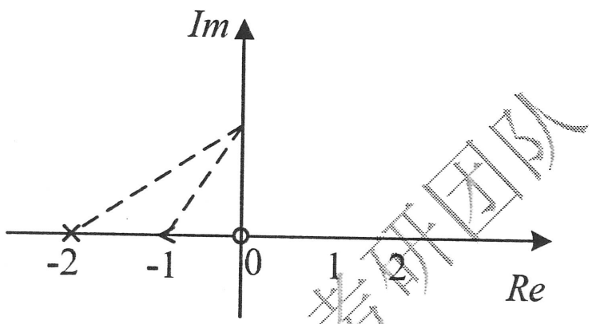

从而得到系统的幅频特性如下：

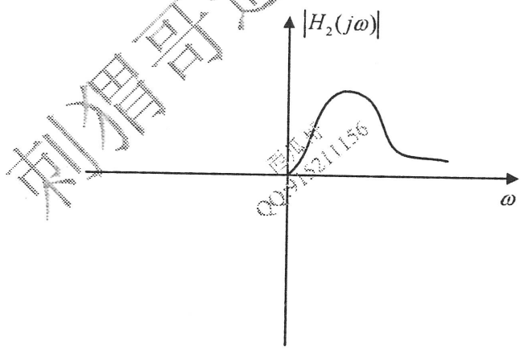

其相位频特性如下：

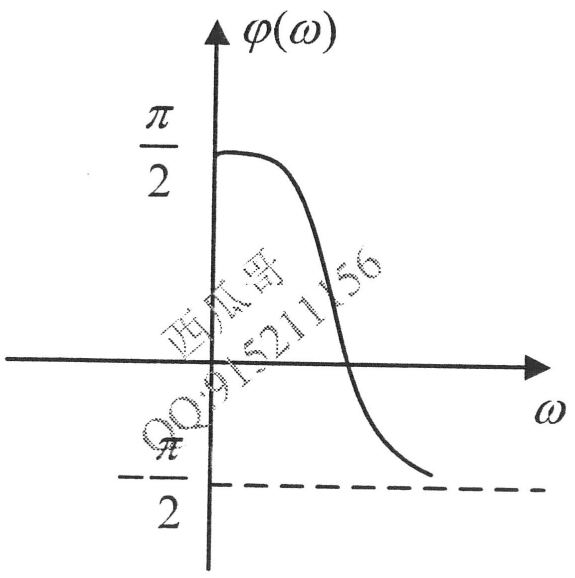

---

(4)

$$
H (s) = \frac {Y (s)}{X (s)} = \frac {1 - e ^ {- s T}}{s ^ {2} + 3 s + 2}
$$

等式左右相乘可得:

$$
s ^ {2} Y (s) + 3 s Y (s) + 2 Y (s) = \left(1 - e ^ {- s T}\right) X (s)
$$

因此可以得到系统的微分方程为:

$$
y ^ {\prime \prime} (t) + 3 y ^ {\prime} (t) + 2 y (t) = x (t) - x (t - T)
$$

(刺猬哥考研团队, 答疑交流群 709502924)

4.

(1)

由题目所给条件 \(z_{1} = 0, p_{1} = -\frac{1}{2}, p_{3} = 1\)

设系统的系统函数为 \(H(z) = \frac{kz}{(z + \frac{1}{2})(z - 1)}\)

根据离散系统的终值定理, 我们知 \(\lim _{n \rightarrow \infty} h(n)=\lim _{z \rightarrow 1}\left(z-1\right) H(z)=\frac{1}{3}\)

由此我们得到 \(k = \frac{1}{2}\) ， \(\therefore H(z) = \frac{\frac{1}{2}z}{(z + \frac{1}{2})(z - 1)} = \frac{z}{2z^2 - z - 1}\)

接下来我们求零输入响应:

$$
H (z) = \frac {Y (z)}{X (z)} = \frac {z ^ {- 1}}{2 - z ^ {- 1} - z ^ {- 2}} \Rightarrow 2 Y (z) - z ^ {- 1} Y (z) - z ^ {- 2} Y (z) = z ^ {- 1} X (z)
$$

\(z\) 逆变换可以得到: \(2y(n) - y(n - 1) - y(n - 2) = x(n - 1)\)

其特征方程为 \(2 \lambda^{2} - \lambda - 1 = 0\), 算出其特征根为 \(\lambda_{1} = -\frac{1}{2}, \lambda_{2} = 1\)

\(y_{zi}(n) = a\left(-\frac{1}{2}\right)^n + b(1)^n\) ，将初始条件 \(y(0) = 2, y(1) = 1\) 代入零输入方程

得到 \(a = \frac{2}{3}, b = \frac{4}{3}\)，由此 \(y_{zi}(n) = \frac{2}{3} (-\frac{1}{2})^n u(n) + \frac{4}{3} u(n)\).

(2)

---

24最强信号辅导班招生啦！让你节省时间，不走弯路，取得佳绩！联系西瓜哥qq915211156 加Q群709502924，使用刺猬哥团队正版核心序列ORK，享受高质量全天候优质答疑指导

由 \(x(n) = (-3)^{n} u(n)\) 可知其 \(z\) 变换 \(X(z) = \frac{z}{z + 3}\)

从而 \(Y(z) = X(z)H(z) = \frac{z^2}{2(z + 3)(z + \frac{1}{2})(z - 1)}\)

根据部分分式法展开可得 \(Y(z) = -\frac{\frac{3}{20}z}{z + 3} + \frac{\frac{1}{15}z}{z + \frac{3}{2}} + \frac{\frac{1}{12}z}{z + 1}\)

由 \(z\) 域逆变换可得 \(y(n) = \left[-\frac{3}{20} (-3)^n + \frac{1}{15} \left(-\frac{1}{2}\right)^n + \frac{1}{12}\right] u(n)\).

(3)

$$
H (z) = \frac {Y (z)}{X (z)} = \frac {z ^ {- 1}}{2 - z ^ {- 1} - z ^ {- 2}} \Rightarrow 2 Y (z) - z ^ {- 1} Y (z) - z ^ {- 2} Y (z) = z ^ {- 1} X (z)
$$

对等式两边 \(z\) 逆变换可以得到差分方程: \(2y(n) - y(n - 1) - y(n - 2) = x(n - 1)\).

---

# 南昌大学

# 2015年招收攻读硕士研究生

# 入学考试自命题试题

科目代码及名称： 信号与系统811

适用专业： 信息与通信工程、电子信息等

(所有答案都必须写在答题纸上, 写在试卷纸上及草稿纸上无效, 考完后试题随答题纸收回)

一、单项选择题（共15题，每小题2分，共30分）

1. 下列各式中，错误的是（）；（刺猬哥考研团队，答疑交流群 709502924）

\(\int_{-\infty}^{+\infty} f(t) \delta(2t) dt = \frac{1}{2} f(0)\)

B. \(\int_{-\infty}^{+\infty} f(t) \delta(2t - t_0) dt = \frac{1}{2} f(t_0)\)

C. \(\int_{-\infty}^{+\infty} f(t - t_0) \delta(2t) dt = \frac{1}{2} f(-t_0)\)

D. \(\int_{-\infty}^{+\infty} f(t) \delta(2t - t_0) dt = \frac{1}{2} f\left(\frac{t_0}{2}\right)\)

2. 已知系统响应 \( y(t) \) 与激励 \( f(t) \) 的关系为 \( y(t) = f(t - 1) - f(1 - t) \)，则该系统是（）；

A. 线性非时变非因果系统 
B. 非线性非时变因果系统

C. 线性时变非因果系统 
D. 线性时变因果系统

3. 两信号波形如下图所示, 设 \(y(t) = f_{1}(t)^{*} f_{2}(t)\), 则 \(y(6) =\) ( ) ;

A. 2

B. 4

C. 6

D. 8

---

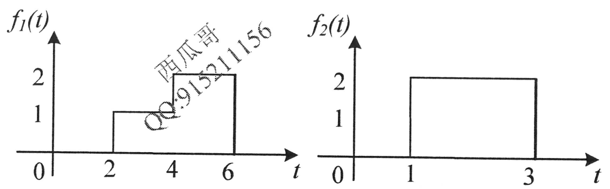

4. 下图所示周期信号 \(f(t)\) 的傅里叶级数中所含有的频率分量是 ( )；

A. 余弦项的奇次谐波, 无直流分量

B. 正弦项的偶次谐波, 直流

C. 正弦和余弦项的偶次谐波, 直流

D. 正弦和余弦项的奇次谐波, 无直流

(虚线也是信号的一部分)

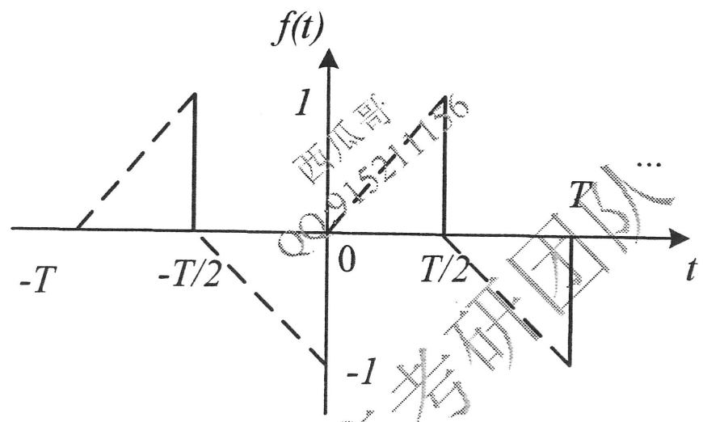

5. 若 \(f(t)\) 的傅里叶变换为 \(F(j \omega)\), 则 \(t f(3 t)\) 的傅里叶变换为 ( )；

A. \(j F \left(j \frac{\omega}{3}\right)\)

B. \(-j \frac{1}{3} \frac{d}{d\omega} F\left(j \frac{\omega}{3}\right)\)

C. \(j \frac{1}{9} \frac{d}{d\omega} F\left(j \frac{\omega}{3}\right)\)

D. \(j \frac{1}{3} \frac{d}{d\omega} F\left(j \frac{\omega}{3}\right)\)

6. 已知 \(F(s) = \frac{e^{-s}}{s(2s + 1)}\), 则 \(f(t) =\) ( ); (西瓜哥 QQ915211156)

A. \([1 - e^{-\frac{t - 1}{2}}]u(t)\)

B. \([1 - e^{\frac{t - 1}{2}}]u(t - 1)\)

C. \([1 - 2e^{-\frac{t - 1}{2}}]u(t)\)

D. \([1 - 2e^{\frac{t - 1}{2}}]u(t - 1)\)

7. 已知 \(f(t) \xleftarrow{\mathcal{L}} F(s) = \frac{s + 3}{s^2 + 3s + 2}\), 且 \(f(t)\) 是因果信号, 则 \(F(s)\) 的收敛域为 ( )。

A. \(-2 < \sigma < -1\)

B. \(-1 < \sigma < \infty\)

C. \(-\infty < \sigma < -2\)

D. 无法确定

8. 某信号的频谱是周期的离散谱,则对应的时域信号应是 ( )。

A. 离散的周期信号

B. 连续的非周期信导

C. 离散的非周期信号

---

D. 连续的周期信号（刺猬哥考研团队，答疑交流群 709502924）

9. 因果系统的系统函数为 \(H(z) = \frac{1 + z^{-1} + z^{-2}}{(1 - z^{-1})(1 - 2z^{-1})}\), 则该系统是 ( )。

A. 稳定的

B. 不稳定的

C. 临界稳定的

D. 无法确定

10. 线性系统响应的分解性满足以下规律（）。

A. 若系统响应的起始状态为零, 则零状态响应与强迫响应相等

B. 若系统的激励信号为零, 则零输入响应与自由响应相等

C. 若系统的起始状态为零, 则自由响应也为零

D. 若系统的强迫响应为零, 则零状态响应也为零

11. 欲使信号通过系统后只产生相位变化, 则该系统一定是 ( )。

A. 高通滤波器网络

B. 全通网络

C. 带通滤波器网络

D. 最小相移网络

12. 如果一连续时间系统的系统函数 \(H(s)\) 只有一对在虚轴上的共轭极点, 则它的 \(h(t)\) 应是 ( )。

A. 指数增长信号

B. 指数衰减振荡信号

C. 常数

D. 等幅振荡信号

13. 线性系统响应中以下规律错误的是 ( )。(刺猬哥考研团队, 答疑交流群 709502924)

A. 若起始状态为零, 则零输入响应为零

B. 若起始状态为零, 则零状态响应为零

C. 若系统的零状态响应为零, 则强迫响应也为零

D. 若激励信号为零, 零输入响应就是自由响应

14. 连续周期信号的频谱具有 ( )。

A. 连续性、周期性

B. 连续性、非周期性

C. 离散性、周期性

D. 离散性、非周期性

15. 系统函数 \(H(s)\) 的极点在 \(S\) 平面的位置对系统时域响应 ( )。

A. 无影响

B. 位于 \(S\) 平面的左半平面, 系统为稳定系统

C. 位于 \(S\) 平面的右半平面, 系统为稳定系统

D. 位于虚轴上的一阶级点对应的响应函数随时间变化

---

# 二、填空题(本大题共6小题，每小题5分，共30分)

1. （西瓜哥 QQ915211156）已知 \(\left[\cos \left(t + \frac{\pi}{4}\right) \delta (t)\right]' =\)

2. 激励为 \(f(t)\), 响 应 为 \(y(t)\) 的 线 性 时 不 变 因 果 系 统 描 述 为 \(y'(t) + 2y(t) = 3f'(t) + f(t)\), 则系统的冲激响应 \(h(t) =\)

3. 卷积积分 \([u(t) - u(t - 2)] * \delta'(t - 2) = \underline{\quad}\);

4. 已知信号 \(f(t) = U_m \cos(\omega_0 t)\) 的自相关函数 \(R_f(\tau) = \frac{U_m^2}{2} \cos(\omega_0 \tau)\), 则信号 \(f(t)\) 的功率谱 \(P_f(\omega) =\) ________; (刺猬哥考研团队, 答疑交流群 709502924)

5. 信号 \(f(t) = S a (100 t) - S a ^{2} (60 t)\) 的无失真均匀抽样奈奎斯特频率 \(f_{1} =\)

6. 已知 \(f(t) \xleftarrow{\mathcal{L}} F(s) = \frac{2}{s^2 + 2s + 4}\), 则 \(\int_{0}^{t-1} f(x) dx\) 的拉普拉斯变换为

# 三、计算、画图题（90分）

1. (10 分) 已知信号 \(f(t)\) 如下图所示, 试画出其一阶导数 \(f^{\prime}(t)\) 的图像, 写出其对应的函数表达式。

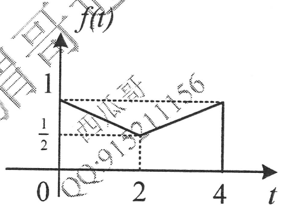

2. (10 分) 求微分方程 \(2y''(t) + 8y(t) = f(t)\) 所描述的系统的单位冲激响应 \(h(t)\) 。

3. (10 分) 已知信号 \(f_{1}(t) \xleftarrow{FT} F_{1}(j \omega) = R(\omega) + j X(\omega)\), 且 \(f_{1}(t) 、 f_{2}(t)\) 的波形如下图所示, 求 \(f_{2}(t) \xleftarrow{FT} F_{1}(j \omega) = ?\)

---

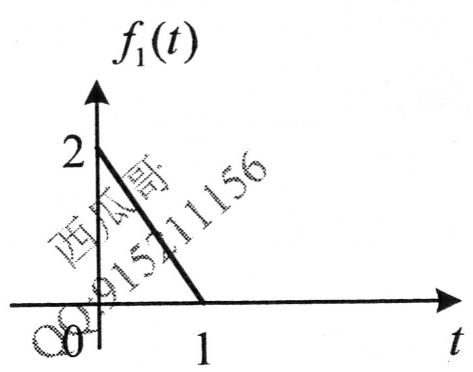

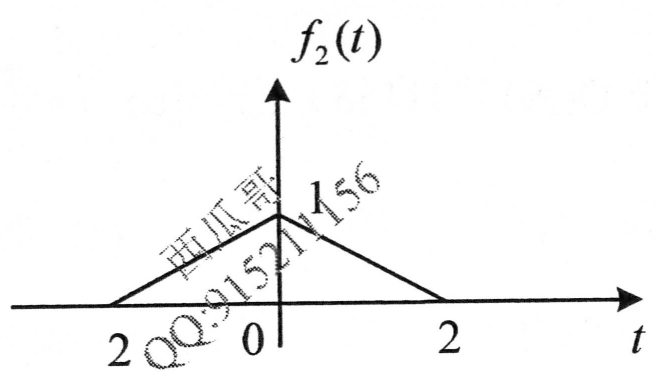

4. (10 分) 已知一个 LTI 连续时间系统的冲激响应为 \(h(t) = \omega S a\left(\frac{\omega t}{2}\right)\), 求输入信号 \(f(t) = \cos \left(\omega_0 t\right)\) 的响应 \(y(t)\).

5. (10 分) 已知 \(LTI\) 连续时间系统, 在相同的初始条件下, 当输入为 \(f(t) = \delta(t)\) 时,系统的全响应为 \(y_{1}(t) = \delta(t) + e^{-2t} u(t)\); 而当输入为 \(f(t) = u(t)\) 时, 系统的全响应为 \(y_{2}(t) = 4e^{-2t} u(t)\), 求系统函数 \(H(s)\) 和系统冲激响应 \(h(t)\) 。

6. (10 分) 已知某 LTI 离散因果时间系统差分方程为:

$$
y [ n ] + c _ {1} y [ n - 1 ] + c _ {2} y [ n - 2 ] = f [ n ] + d _ {1} f [ n - 1 ] + d _ {2} f [ n - 2 ]
$$

其中 \(c_{1} 、 c_{2} 、 d_{1} 、 d_{2}\) 为实常数, 且已知系统在原点处有二阶零点, 有一个极点在 \(p_{2} = \frac{1}{2}\) 处, \(H(2) = 1\) 。求系统函数 \(H(z)\), 并注明收敛域。

7. (15 分) 某线性系统的信号流图如下图所示, 求:

(1) 该系统的系统函数 \(H(s)\) 及单位冲激响应 \(h(t)\);

(2) 判断该系统是否稳定，并说明理由。

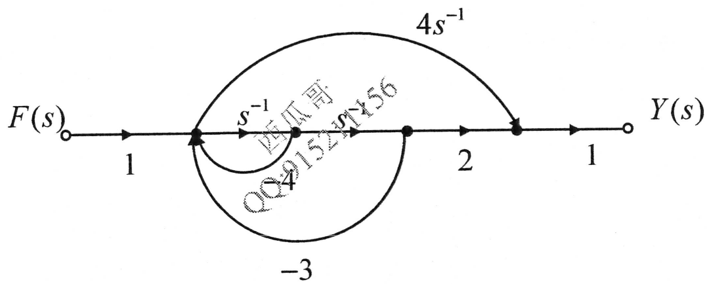

---

24最强信号辅导班招生啦！让你节省时间，不走弯路，取得佳绩！联系西瓜哥qq915211156 加Q群709502924，使用刺猬哥团队正版核心序列ORK，享受高质量全天候优质答疑指导

8. (15 分) 如下图所示系统, 以 \(x_{1}(t) 、 x_{2}(t) 、 x_{3}(t)\) 为状态变量, 以 \(y(t)\) 为响应, 列出系统状态方程和输出方程。

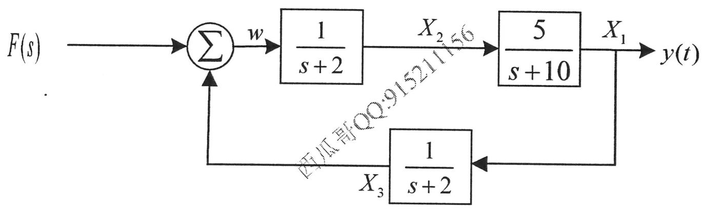

---

# 2015南昌大学信号与系统811真题详解

——西瓜哥原创作答

# 一、选择题

题 1 解: 选 B

$$
\begin{array}{l} \int_ {- \infty} ^ {+ \infty} f (t) \delta (2 t) d t = \int_ {- \infty} ^ {+ \infty} f (t) \frac {1}{2} \delta (t) d t = \frac {1}{2} f (0) \\ \int_ {- \infty} ^ {+ \infty} f (t) \delta \left(2 t - t _ {0}\right) d t = \int_ {- \infty} ^ {+ \infty} f (t) \frac {1}{2} \delta \left(t - \frac {t _ {0}}{2}\right) d t = \frac {1}{2} f \left(\frac {t _ {0}}{2}\right) \\ \int_ {- \infty} ^ {+ \infty} f (t - t _ {0}) \delta (2 t) d t = \int_ {- \infty} ^ {+ \infty} f (t - t _ {0}) \frac {1}{2} \delta (t) d t = \frac {1}{2} f (0 - t _ {0}) = \frac {1}{2} f (- t _ {0}) \\ \end{array}
$$

所以 \(B\) 错。

本题运用到冲激函数的筛选性质以及尺度变换性质的应用。

题 2 解: 选 C (刺猬哥考研团队, 答疑交流群 709502924)

线性性质满足齐次可加性, 当输入为 \(a f_{1}(t), b f_{2}(t)\), 以及 \(a f_{1}(t) + b f_{2}(t)\) 时候, 其对应的响应 \(y_{1}(t) + y_{2}(t) = y_{3}(t)\), 因此该系统为线性系统。接下来判断时变系统, 当输入为 \(f(t - t_{0})\) 时, 输出为 \(f(t - t_{0} - 1) - f(1 - t - t_{0})\), 而 \(y(t - t_{0}) = f(t - 1 - t_{0}) - f(1 - t + t_{0})\), 两者不相等, 系统为时变的。当 \(t = 0\) 时候, \(y(0) = f(-1)\), 输出与之前的输入有关, 因此系统是非因果的。

本题考查线性、时变以及因果系统的相关判定，要熟练掌握该部分内容，老师出题很喜欢出这一部分的内容。

题 3 解: 选 C

$$
y (t) = f _ {1} (t) * f _ {2} (t) = \int_ {- \infty} ^ {+ \infty} f _ {1} (\tau) \cdot f _ {2} (t - \tau) d \tau
$$

根据上式 \(y(6) = \int_{-\infty}^{+\infty}f_1(\tau)\cdot f_2(6 - \tau)d\tau\)

对两个图像卷积可以得到 \(y(6) = 2 \times 1 + 2 \times 2 = 6\)

本题考察卷积的相关应用, 本题要求 \(y(6)\), 相当于求 \(\int_{-\infty}^{+\infty} f_{1}(\tau) \cdot f_{2}(6 - \tau) d \tau\), 利用图解法等相关卷积计算方法, 可以轻易得到答案为 6 .

---

题 4 解: 选 D

奇次谐波满足 \(f(t) = -f\left(t \pm \frac{T}{2}\right)\), 偶次谐波满足 \(f(t) = f\left(t \pm \frac{T}{2}\right)\)

从图像中我们可以看出该周期信号为奇次谐波，所以 B、C 排除

易知傅里叶级数展开是包含了余弦和正弦的，A排除

直流分量 \(a_{0} = \frac{1}{T} \int_{-\infty}^{+\infty} f(t) dt = 0\)

题5解：选D

$$
f (t) \xleftarrow {\mathcal {F}} F (j \omega)
$$

由傅里叶变换的尺度变换性质知 \(f(3 t) \xleftarrow{\mathcal{F}} \frac{1}{3} F\left(j \frac{\omega}{3}\right)\)

又由频域微分性质 \(-jtf(t) \xleftarrow{\mathcal{F}} \frac{dF(j\omega)}{d\omega}\) 知 \(tf(t) \xleftarrow{\mathcal{F}} j \frac{dF(j\omega)}{d\omega}\)

所以 \(t f(3 t) \xleftarrow{\mathcal{F}} j \frac{1}{3} \left[ F\left(j \frac{\omega}{3}\right)\right]' = \frac{j}{3} \frac{d}{d \omega} F\left(j \frac{\omega}{3}\right)\)

本题考查傅里叶变换性质的应用，本题中用到尺度变化性质和频域微分性质，要熟练掌握。

题 6 解: 选 B

$$
F (s) = \frac {e ^ {- s}}{s (2 s + 1)}
$$

利用部分分式法展开得到: \(F(s) = \left(\frac{1}{s} - \frac{2}{2s + 1}\right)e^{-s} = \left(\frac{1}{s} - \frac{1}{s + \frac{1}{2}}\right)e^{-s}\)

拉普拉斯逆变换得到 \(f(t) = [1 - e^{-\frac{1}{2}(t - 1)}]u(t - 1)\)

本题考查利用部分分式法求拉普拉斯逆变换的相关计算, 我们一般不采用留数法计算逆变换, 一般用部分分式法将其化为常见的拉氏变换对进行逆变换。

题 7 解: 选 B

---

$$
f (t) \xleftarrow {\mathcal {L}} F (s) = \frac {s + 3}{s ^ {2} + 3 s + 2}
$$

由此可以知道系统的极点为 \(s_{1} = -1, s_{2} = -2\)

系统为因果信号，收敛域在最右边极点的右端，则收敛域为 \(\sigma_0 > -1\)。

本题考查因果系统的收敛域的判定, 如果一个系统是因果系统的话, 其收敛域在系统最右端极点的右侧区域。

题 8 解: 选 A

接下来记住几个频域和时域的对应关系，频域周期对应时域离散，频域非周期对应时域连续，频域离散对应时域周期，频域连续对应时域非周期，故本题选A.

题 9 解: 选 B

由题意系统函数可化为 \(H(z) = \frac{z^2 + z + 1}{(z - 1)(z - 2)}\), \(z_1 = 1, z_2 = 2\)

系统是因果系统, 因此其收敛域为 \(\left|z\right| > \left|z_{2}\right| = 2\)

收敛域并不包括单位圆，因此系统是不稳定的。

本题考查系统稳定性的判断, 一个系统如果要是稳定系统, 那么收敛域要包括单位圆。

题 10 解: 选 B

\(y(t) = y_{zi}(t) + y_{zs}(t)\), 且全响应为强迫响应和自由响应之和, 当零输入响应为 0 时, 零状态响应为强迫响应与自由响应之和, A 错。当零状态响应为 0 , 强迫响应也为 0 , 此时零输入响应就为自由响应, B 正确。自由响应包含一部分零输入响应和一部分零状态响应, 起始状态为零, 则零输入响应为零, 自由响应不为零, C 错。若系统的强迫响应为零, 零状态响应为强迫响应和一部分自由响应之和, 判断不了零状态响应也为零。

题 11 解: 选 B

产生相位变换的是移相器, 本题中能起到该作用的是全通网络。零

题 12 解: 选 D

本题考查由极点判断信号 \(h(t)\) 的形式, 当极点在虚轴上的共轭极点时, 它是等幅振荡信号.

---

号，当极点在左半平面时，他是指数增长信号，当极点在右半平面，他还是指数衰减信号，当极点为0时，它是常数信号。

本题难度不大, 记住几种情况下信号 \(h(t)\) 的形式即可。

题 13 解: 选 B

本题同第四小题一样的分析方法, 可以回头去看一下相关解析, 初始条件为零, 而输入信号不一定为零, 因此零状态响应不一定为零, 早期的题有点不严谨, 总体来说 B 是绝对错的, 所以选 B.

题 14 解: 选 D

本题同第八题，记住几个频域和时域的对应关系，频域周期对应时域离散，频域非周期对应时域连续，频域离散对应时域周期，频域连续对应时域非周期，由对应关系可以知道答案。

题 15 解: 选 B (刺猬哥考研团队, 答疑交流群 709502924)

当极点全在左半平面的话，系统是稳定的，B 正确、C 错误。对于 D 选项，我们假设系统函数 \(H(s) = \frac{1}{s}\)，其对应的系统响应为 \(h(t) = u(t)\)，响应函数不随时间的变化而变化，由此 D 错误。对于 A 选项，我们令 \(H(s) = \frac{1}{s^2 + 1}\)，\(h(t) = \cos t\)，响应函数随时间变化而变化，A 错误。

# 二、填空题

题 1 解: \(\frac{\sqrt{2}}{2} \delta'(t)\)

$$
\begin{array}{l} [ \cos (t + \frac {\pi}{4}) \delta (t) ] ^ {\prime} = - \sin (t + \frac {\pi}{4}) \delta (t) + \cos (t + \frac {\pi}{4}) \delta^ {\prime} (t) \\ = - \sin (\frac {\pi}{4}) \delta (t) + \cos (\frac {\pi}{4}) \delta^ {\prime} (t) + \sin (\frac {\pi}{4}) \delta (t) \\ = \cos (\frac {\pi}{4}) \delta^ {\prime} (t) = \frac {\sqrt {2}}{2} \delta^ {\prime} (t) \\ \end{array}
$$

---

本题考查冲激函数相关性质的应用, 本题应用到筛选性质 \(f(t) \delta(t) = f(0) \delta(t)\) 和冲激函数的导函数的性质 \(f(t) \delta'(t) = f(0) \delta'(t) - f'(0) \delta(t)\), 相关性质的推导可以私聊西瓜哥 (西瓜哥 QQ: 915211156)

题 2 解: 系统临界稳定

等式两边拉氏变换有:

$$
s Y (s) + 2 Y (s) = 3 s F (s) + F (s)
$$

$$
(s + 2) Y (s) = (3 s + 1) F (s) \Rightarrow H (s) = \frac {Y (s)}{F (s)} = \frac {3 s + 1}{s + 2}
$$

由部分分式法展开得到 \(H(s) = 3 - \frac{5}{s + 2}\)

拉普拉斯逆变换得到 \(h(t) = 3 \delta(t) - 5 e^{-2 t} u(t)\)

本题考查微分方程与系统函数之间的变换, 我们要记住 \(H(s) = \frac{Y(s)}{X(s)}\), 得到系统函数

后, 我们一般采用部分分式法将系统函数展开为几个常用的拉普拉斯变化对, 逆变换得到其响应函数。

题 3 解: \(\delta(t - 2) - \delta(t - 4)\)

本题考查卷积相关性质的应用，在卷积中一项是积分，一项是微分，那么它们两卷卷积的结果等于原函数卷积的结果即： \(\int_{-\infty}^{t}f_{1}(\tau)d\tau *f_{2}^{\prime}(t) = f_{1}(t)*f_{2}(t)\) .则

$$
[ \delta (t) - \delta (t - 2) ] * \delta (t - 2) = \delta (t - 2) - \delta (t - 4)
$$

题 4 解: \(\frac{U_{m}^{2}}{2} \pi \left[ \delta \left( \omega + \omega_{0} \right) + \delta \left( \omega - \omega_{0} \right) \right]\)

本题考查的内容属于通信原理中的相关知识点，有些许超纲，但是我们也可以做一个了解和知识的补充，在信号的计算中，自相关函数和功率谱互为一对傅里叶变换对，因此

$$
P _ {f} (\omega) = \int_ {- \infty} ^ {+ \infty} R _ {f} (t) e ^ {- j \omega t} d t = \frac {U _ {m} {} ^ {2}}{2} \int_ {- \infty} ^ {+ \infty} \cos \left(\omega_ {0} t\right) e ^ {- j \omega t} d t = \frac {U _ {m} {} ^ {2}}{2} \pi \left[ \delta \left(\omega + \omega_ {0}\right) + \delta \left(\omega - \omega_ {0}\right) \right]
$$

利用傅里叶变化的定义式解题即可, 平时也要熟记常见的傅里叶变换对。(刺猬哥考研团队, 答疑交流群 709502924)

---

题 5 解: \(\frac{120}{\pi}\)

$$
\begin{array}{l} S a (1 0 0 t) \xleftarrow {\mathcal {F}} \frac {\pi}{1 0 0} G _ {2 0 0} (\omega) \quad , \quad S a (6 0 t) \xleftarrow {\mathcal {F}} \frac {\pi}{6 0} G _ {1 2 0} (\omega) \\ S a ^ {2} (6 0) \xleftarrow {\mathcal {F}} \frac {1}{2 \pi} \cdot \frac {\pi}{6 0} \cdot \frac {\pi}{6 0} G _ {1 2 0} (\omega) * G _ {1 2 0} (\omega) \\ \end{array}
$$

门函数和门函数的卷积为三角形的函数, 其横坐标范围为卷积项的横坐标范围之和。所以该信号的最高截止频率为 \(\omega_{\max} = 120\), 根据奈奎斯特采样定理, \(\omega_{s} \geq 2 \omega_{m s} = 240\) 则频率 \(f_{s} = \frac{\omega_{s}}{2 \pi} = \frac{120}{\pi}\).

题6解： \(\frac{2e^{-s}}{s(s^2 + 2s + 4)}\)

根据拉普拉斯变换的时域积分性质我们知 \(\int_0^t f(\tau)d\tau \xleftarrow{\mathcal{L}}\frac{F(s)}{s}\)

再根据时移性质有: \(\int_{0}^{t-1} f(\tau) d\tau \xleftarrow{\mathcal{L}} \frac{F(s)}{s} e^{-s}\).

从而本题答案为： \(\frac{2e^{-s}}{s(s^2 + 2s + 4)}\)

# 三、计算、画图题:

1.

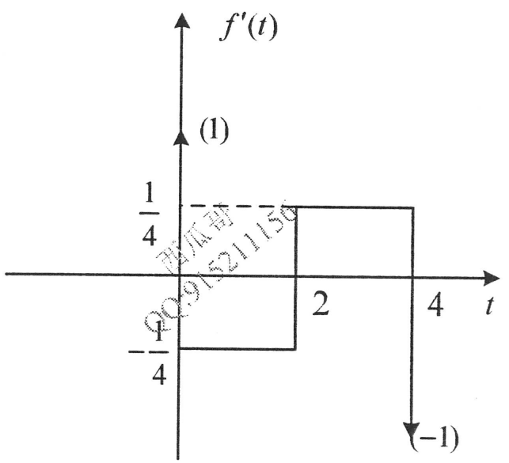

本题 \(f(t)\) 信号在 \(t = 0\) 时有向上的突变，因此微分后体现为值为1的冲激响应，同理 \(t = 4\) 时体现为

---

值为-1的冲激响应，在 \(0 < t < 2\) 这一段，微分后为斜率 \(-\frac{1}{4}\)，在 \(2 < t < 4\) 这一段，微分后为斜率 \(\frac{1}{4}\)，画出的图像如上所示。其函数表达式为 \(f'(t) = \delta(t) - \delta(t - 4) + \frac{1}{2} u(t - 2) - \frac{1}{4} u(t) - \frac{1}{4} u(t - 4)\)（西瓜哥原创解答，西瓜哥QQ915211156）

2.

对等式两边进行拉普拉斯变换得到：

$$
2 s ^ {2} Y (s) + 8 Y (s) = F (s)
$$

从而 \((2s^{2} + 8)Y(s) = F(s)\)

$$
\begin{array}{l} H (s) = \frac {Y (s)}{F (s)} = \frac {1}{2 s ^ {2} + 8} = \frac {\frac {1}{2}}{s ^ {2} + 4} = \frac {1}{4} \frac {2}{s ^ {2} + 4} \\ \frac {2}{s ^ {2} + 4} \xleftarrow {\mathcal {L} ^ {1}} \sin 2 t u (t) \\ \end{array}
$$

由此拉氏逆变换得到响应函数为 \(h(t) = \frac{1}{4} \sin 2tu(t)\).

本题中我们要记住两个拉氏变换对 \(\sin (at)u(t)\xleftarrow{\mathcal{L}}\frac{a}{s^2 + a^2},\cos (at)u(t)\xleftarrow{\mathcal{L}}\frac{s}{s^2 + a^2}\)

3.

本题中我们先根据图像找到 \( f_{1}(t) \) 和 \( f_{2}(t) \) 之间的关系为 \( f_{2}(t) = \frac{1}{2} f_{1}\left(\frac{1}{2} t\right) + \frac{1}{2} f_{1}\left(-\frac{1}{2} t\right) \)

由此我们利用傅里叶变换的性质计算 \(f_{2}(t)\) 的傅里叶变换:

首先 \(f_{1}(\frac{1}{2} t) \longleftrightarrow 2F_{1}(2j\omega) = 2R(2\omega) + 2jX(2\omega)\)

$$
f _ {1} \left(- \frac {1}{2} t\right) \xleftarrow {\mathcal {F}} 2 F _ {1} (- 2 j \omega) = 2 R (- 2 \omega) + 2 j X (- 2 \omega)
$$

因为 \(f_{1}(t)\) 是一个实函数, 因此其频谱的实部为偶函数, 虚部为奇函数。

$$
\begin{array}{l} R (\omega) = R (- \omega), X (\omega) = - X (- \omega) \\ f _ {2} (t) = \frac {1}{2} f _ {1} (\frac {1}{2} t) + \frac {1}{2} f _ {1} (- \frac {1}{2} t) \xleftarrow {\mathcal {F}} 2 R (2 \omega) \\ \end{array}
$$

本题中也可以直接对三角脉冲求傅里叶变换得到其 \(F_{2}(j \omega) = 2 S a^{2}(\omega)\), 但本题中还是主要考察了

---

要考查两函数时域和频域之间的关系。（刺猬哥考研团队，答疑交流群 709502924）

4.

\(y(t) = f(t)*h(t)\) 对等式两边进行傅里叶变换可以得到 \(Y(j\omega) = H(j\omega)\cdot F(j\omega)\)

由题知 \(f(t) = \cos (\omega_0 t)\), 其傅里叶变换为 \(\pi [\delta (\omega + \omega_0) + \delta (\omega - \omega_0)]\)

$$
H (j \omega) = \frac {\pi \omega}{\frac {\omega}{2}} G _ {\omega} (\omega) = 2 \pi G _ {\omega} (\omega)
$$

当 \(\omega_0 > \frac{\omega}{2}\) 时, \(Y(j\omega) = 0\), 则 \(y(t) = 0\) 。

当 \(\omega_0 \leq \frac{\omega}{2}\) 时, \(Y(j\omega) = 2\pi^2 [\delta (\omega + \omega_0) + \delta (\omega - \omega_0)]\), 则 \(y(t) = 2\pi \cos (\omega_0 t)\)

5.

根据题意可以列出以下两个方程:

\(\left\{ \begin{array}{l} \delta (t) * h(t) + y_{zi}(t) = y_1(t) \\ u(t) * h(t) + y_{zi}(t) = y_2(t) \end{array} \right.\)，初始条件相同，因此零输入响应相同。

对以上两个等式进行拉氏变换有:

$$
\left\{ \begin{array}{l} H (s) + Y _ {z i} (s) = 1 + \frac {1}{s + 2} = \frac {s + 3}{s + 2} \\ \frac {1}{s} H (s) + Y _ {z i} (s) = \frac {1}{s + 4} \end{array} \Rightarrow (1 - \frac {1}{s}) H (s) = \frac {s - 1}{s + 2} \right.
$$

从而 \(H(s) = \frac{s - 1}{s + 2} \cdot \frac{s}{s - 1} = \frac{s}{s + 2} = 1 - \frac{2}{s + 2}\)

拉氏逆变换得到 \(h(t) = \delta (t) - 2e^{-2t}u(t)\)

(刺猬哥考研团队, 答疑交流群 709502924)

6. 系统框图如下:

根据系统的差分方程 \(y[n] + c_{1} y[n - 1] + c_{2} y[n - 2] = f[n] + d_{1} f[n - 1] + d_{2} f[n - 2]\)

对等式两边 \(z\) 变换得到: \(Y(z) + c_{1} z^{-1} Y(z) + c_{2} z^{-2} Y(z) = F(z) + d_{1} z^{-1} F(z) + d_{2} z^{-2} F(z)\)

从而 \(H(z) = \frac{Y(z)}{F(z)} = \frac{1 + d_1z^{-1} + d_2z^{-2}}{1 + c_1z^{-1} + c_2z^{-2}} = \frac{z^2 + d_1z + d_2}{z^2 + c_1z + c_2}\)

---

由题意系统在原点处有二阶零点，所以 \(H(z) = \frac{z^2}{z^2 + c_1z + c_2}\)

又有一个极点为 \(\frac{1}{2}\), 则 \(H(z) = \frac{z^2}{(z - \frac{1}{2})(z - a)}\)

又因为 \(H(2) = 1\) ，代入计算 \(a = -\frac{2}{3}, H(z) = \frac{z^2}{(z - \frac{1}{2})(z + \frac{2}{3})}\)

系统是因果的，所以其收敛域为 \(\left|z\right| > \frac{2}{3}\)

7.

(1)由梅森公式可得系统函数为:

$$
H (s) = \frac {2 s ^ {- 2} + 4 s ^ {- 1}}{1 - (- 4 s ^ {- 1} - 3 s ^ {- 2})} = \frac {2 + 4 s}{s ^ {2} + 4 s + 3} = \frac {2 + 4 s}{(s + 1) (s + 3)}
$$

由部分分式法展开得:

$$
H (s) = \frac {- 1}{s + 1} + \frac {5}{s + 3}
$$

拉普拉斯逆变换得到:

$$
h (t) = \left[ 5 e ^ {- 3 t} - e ^ {- t} \right] u (t)
$$

(2)由第一小问知： \(H(s) = \frac{2 + 4s}{(s + 1)(s + 3)}\) ，它的两个极点为 \(s_1 = -1,s_2 = -3\)

极点都在 \(s\) 域的左半平面, 所以系统稳定 (刺猬哥考研团队, 答疑交流群 709502924)

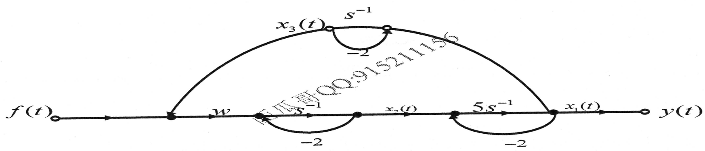

由题意系统框图画出其信号流图为上图所示，根据信号流图我们分析状态变量如下：

$$
x _ {1} ^ {\prime} (t) = 5 \left[ x _ {2} (t) - 2 x _ {1} (t) \right] \quad , \quad x _ {1} ^ {\prime} (t) = - 2 x _ {2} (t) + w \left[ f (t) + x _ {3} (t) \right] \quad , \quad x _ {3} ^ {\prime} (t) = x _ {1} (t) - 2 x _ {3} (t) ]
$$

---

转换为矩阵形式为:

$$
\left[ \begin{array}{c} x _ {1} ^ {\prime} (t) \\ x _ {2} ^ {\prime} (t) \\ x _ {3} ^ {\prime} (t) \end{array} \right] = \left[ \begin{array}{c c c} - 1 0 & 5 & 0 \\ 0 & - 2 & w \\ 1 & 0 & - 2 \end{array} \right] \left[ \begin{array}{c} x _ {1} (t) \\ x _ {2} (t) \\ x _ {3} (t) \end{array} \right] + \left[ \begin{array}{c} 0 \\ w \\ 0 \end{array} \right] f (t)
$$

输出方程为 \(y(t) = x_{1}(t)\), 转换为矩阵形式为:

$$
\left[ \begin{array}{c c c} 1 & 0 & 0 \end{array} \right] \left[ \begin{array}{c} x _ {1} (t) \\ x _ {2} (t) \\ x _ {3} (t) \end{array} \right]
$$

西瓜哥原创作答

---

# 南昌大学

# 2016年招收攻读硕士研究生

# 入学考试自命题试题

科目代码及名称： 信号与系统811

适用专业： 信息与通信工程、电子信息等

(所有答案都必须写在答题纸上, 写在试卷纸上及草稿纸上无效, 考完后试题随答题纸收回)

一、填空题（每小题5分，共50分）

1. 已知 \( f_{1}(t) = u(t) - u(t - 1) \)，\( f_{2}(t) = u(t + 1) \) 则 \( f_{1}(t)*f_{2}(t) \) 的非零值区间是 ______；

2. \(\int_{-\infty}^{+\infty}[t^2 - e^{-2t}]\delta(t - 1)dt = \_\); （西瓜哥QQ915211156）

3. 一起始储能为零的系统, 当输入为 \(u(t)\) 时, 系统响应为 \(e^{-3t} u(t)\), 则当输入为 \(\delta(t)\) 时,系统的响应为

4. 如果一线性时不变系统的输入为 \(f(t)\), 零状态响应为 \(y_{zs}(t) = 4 f\left(t - t_{0}\right)\), 则该系统的单位冲激响应 \(h(t) =\)

5. \(\int_{0}^{\infty} S a(t) d t =\) ________；（刺猬哥考研团队，答疑交流群 709502924）

6. 对于频率在 \(6000 \sim 7000 \mathrm{~Hz}\) 之间的信号进行采集, 无失真恢复信号的最低采样频率为

7. 已知 \(F(s) = \frac{s + 1}{s^2 + 5s} + 6\) ，则 \(f(0_+) = \_\)；\(f(\infty) = \_\)

8. 离散时间系统的差分方程为 \(2y[n] - y[n - 1] = 4x[n] + 2x[n - 1]\), 则该系统的单位抽样响应 \(h[n] =\) ________;

---

9. 已知一系统的系统函数 \(H(z) = \frac{1}{2 + z^{-1} - z^{-2}}\), 判断该系统是否稳定________;

10. 根据下图所示系统的信号流图, 可以写出系统函数 \(H(s) =\)

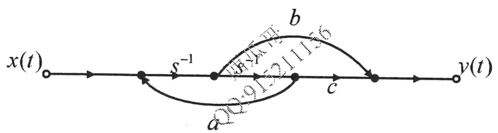

# 二、计算题

1. 已知某系统的频响特性 \(H(j \omega)\) 及激励信号的频谱 \(F(j \omega)\) 如下图所示。

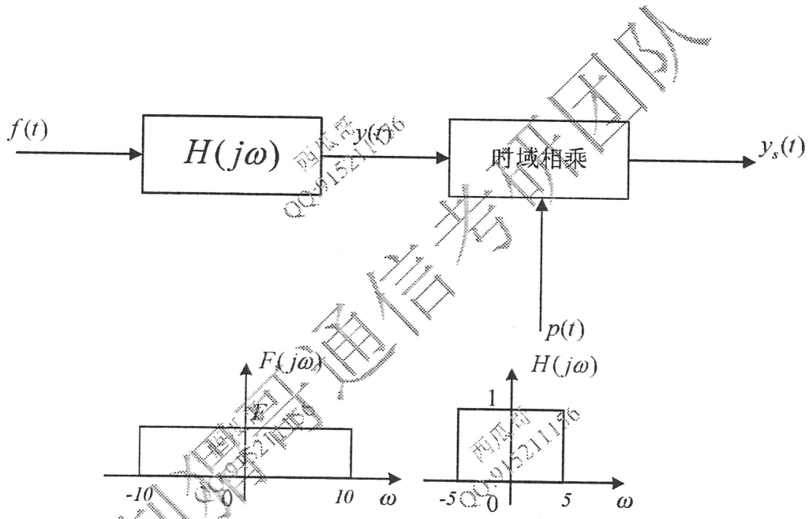

(1) 画出 \(y(t)\) 的频谱 \(Y(j \omega)\), 并写出 \(Y(j \omega)\) 的表达式;

(2) 若 \(p(t) = \cos 200 t\), 画出 \(y_{s}(t)\) 的频谱 \(Y_{s}(j \omega)\)

2. 某系统的系统函数 \(H(s)\) 的零极点分布如图所示, 且已知 \(\left. H(s) \right|_{s=0} = -1\) 。

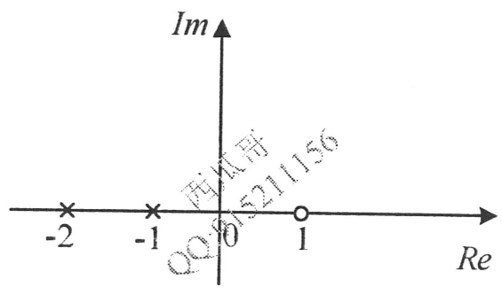

---

(1) 写出系统函数 \(H(s)\);

(2) 若激励信号 \(x(t) = u(t)\), 求系统的零状态响应 \(y_{zs}(t)\), 并指出其自由响应与强迫响应分量。

(3) 画出系统的直接型模型框图和信号流图。

3. 某因果离散时间系统由两个子系统级联而成, 如下图所示, 若描述两个子系统的差分方程分别为:

$$
y _ {1} [ n ] = 0. 4 x [ n ] + 0. 6 x [ n - 1 ]
$$

$$
y [ n ] - \frac {1}{3} y [ n - 1 ] = y _ {1} [ n ]
$$

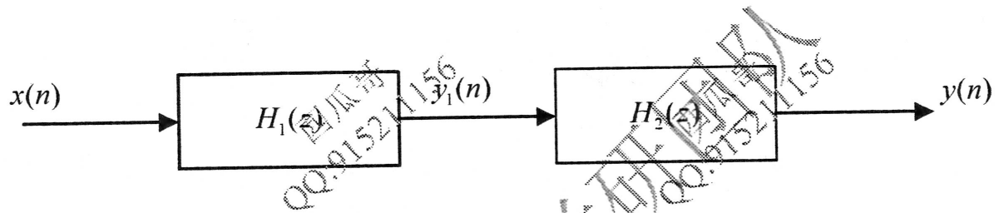

(1) 求出每个子系统的系统函数 \(H_{1}(z)\) 和 \(H_{2}(z)\);

(2) 求整个系统的单位样值响应 \(h[n]\);

(3) 画出整个系统的结构框图或信号流图。

---

# 2016 南昌大学信号与系统 811 真题详解

——西瓜哥原创作答

# 一、填空题

题1解： \((-1, +\infty)\)

本题考察连续函数卷积的相关计算, 本题可以采用图解法对卷积式进行计算, \(f_{1}(t)\) 是取值范围在 \([0,1]\) 幅度为 1 的矩形窗, \(f_{2}(t)\) 是左移一个单位的阶跃信号, 根据图解法相关计算可以确定非零值区间为 \((-1, +\infty)\).

题 2 解: \(1 - e^{-2}\)

$$
\int_ {- \infty} ^ {+ \infty} \left[ t ^ {2} - e ^ {- 2 t} \right] \delta (t - 1) d t = \int_ {- \infty} ^ {+ \infty} \left[ t ^ {2} - e ^ {- 2 t} \right] \bigg | _ {t = 1} \delta (t - 1) d t = 1 - e ^ {- 2}
$$

本题考察冲激函数 \(\delta(t)\) 的抽样特性即 \(\int_{-\infty}^{+\infty} f(t) \delta(t - t_0) dt = f(t_0)\)，这个性质要牢记。

题3解： \(\delta (t) - 3e^{-3t}u(t)\)

该系统起始储能为零, 则输入信号后系统的响应为零状态响应, 本题已知阶跃响应求系统的冲激响应, 考察阶跃响应和冲激响应之间的关系, 单位冲激信号通过积分可得单位阶跃信号, 反之单位阶跃信号微分可求得单位冲激信号。在线性时不变系统中, 其响应也有对应关系, 则冲激响应为 \(\frac{d}{dt} [e^{-3t} u(t)] = \delta(t) - 3e^{-3t} u(t)\).

题 4 解: \(4 \delta \left(t - t_{0}\right)\)

本题考查零状态响应的计算, 零状态响应为系统初始状态为零时, 只有输入信号时系统所具有的响应, \(y_{zs}(t) = f(t) * h(t)\), 由题已知输入信号与零状态响应, 则单位冲激响应 \(h(t) = \delta (t - t_0)\).

---

题5解： \(\frac{\pi}{2}\)

本题考察抽样函数的积分, 记住 \(\int_{0}^{+\infty} S a(t) d t=\frac{\pi}{2}\) 和 \(\int_{-\infty}^{+\infty} S a(t) d t=\pi\) 两个公式即可, 想了解相关推导过程可以在答疑群里私聊西瓜哥。(西瓜哥 QQ: 915211156)

题 6 解: \(2000 \mathrm{~Hz}\)

本题采样定理, 要使得无失真恢复原信号, 那么就要求采样后频域不能重叠, 首先我们来看本题中的信号频域图如下所示:

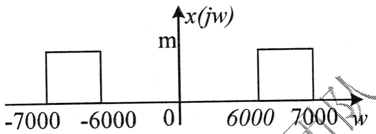

由图像知这种为带通形式的采样, 最小采样频率公式为 \(f_{s} = 2 B \left(1 + \frac{k}{n}\right)\), 其中 B 为正轴的信号频域宽度, 本题中为 \(1000 \mathrm{HZ}, \mathrm{k}\) 为最高频除以带宽的小数部分, n 为整数部分, 当最低频率远远大于带宽的时候, 采样率约等于 2B.

本题需要与低通采样做一个区分，低通采样中采样频率 \( f_{s} \) 大于信号中最高频率 \( f_{\max} \) 的2倍时 \(\left(f_{s} > 2f_{\max}\right)\)，采样之后的数字信号便能完整地反映真实信号。

题7解：1； \(\frac{1}{5}\)

本题考察初值定理和终值定理, 拉氏变换中初值定理为 \(f(0_{+}) = \lim_{t \to 0_{+}} f(t) = \lim_{s \to \infty} sF(s)\), 代入可以计算出 \(f(0_{+}) = 1\); 终值定理为 \(f(\infty) = \lim_{t \to \infty} f(t) = \lim_{s \to 0} sF(s)\), 代入可以计算出 \(f(\infty) = \frac{1}{5}\). (刺猬哥考研团队, 答疑交流群 709502924)

---

题 8 解: \(2\left(\frac{1}{2}\right)^{n} u[n] + \left(\frac{1}{2}\right)^{n - 1} u[n - 1]\)

本题 \(z\) 逆变换的相关计算, 首先从差分方程中对两边进行 \(z\) 变换我们可以得到以下式子 \(2 Y(z) - Y(z) z^{-1} = 4 X(z) + 2 X(z) z^{-1}\), 而 \(Y(z) = X(z) \cdot H(z)\), 由两式可得 \(H(z) = \frac{4 + 2 z^{-1}}{2 - z^{-1}}\).

利用部分分式法将其写为 \(H(z) = 2 \frac{z}{z - \frac{1}{2}} + \frac{1}{z - \frac{1}{2}}\), 从而根据常见信号的 \(z\) 变换我们可以

得到答案 \(h[n] = 2 \left(\frac{1}{2}\right)^{n} u[n] + \left(\frac{1}{2}\right)^{n-1} u[n-1]\). （西瓜哥 QQ: 915211156）

题 9 解: 临界稳定

本题考察利用极点位置判断系统稳定，由给出的系统函数，我们可以得到两个极点为 \(p_{1} = -1, p_{2} = \frac{1}{2}\)，从而有一个极点位于单位圆上，由此系统处于临界稳定状态。

题10解： \(\frac{bs^{-1} + cs^{-2}}{1 - as^{-2}}\)

本题利用梅森公式解题，梅森公式的方法可以在交流群中试听课程中了解，（刺猬哥考研团队，答疑交流群 709502924）

# 二、计算题

1.

(1)

\(Y(j\omega) = F(j\omega)\cdot H(j\omega) = E[u(\omega +5) - u(\omega -5)]\) ，画出其频谱图 \(Y(j\omega)\) 如下：

---

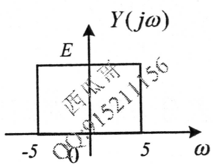

(2)由前一小题知 \(Y(j \omega) = E[u(\omega + 5) - u(\omega - 5)]\)

时域相乘中的信号 \(p(t) = \cos 200 t\), 其频谱函数 \(P(j \omega) = \pi [\delta (\omega + 200) + \delta (\omega - 200)]\)

时域相乘, 频域相卷积, 则 \(Y_{s}(j \omega) = \frac{1}{2 \pi} Y(j \omega) * P(j \omega)\)

代入已知条件计算得到 \(Y_{s}(j \omega) = \frac{1}{2} \left\{ Y[j(\omega + 200)] + Y[j(\omega - 200)] \right\}\) 。画出其频谱图如下:

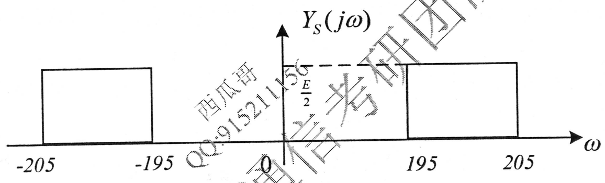

(西瓜哥原创解答, 西瓜哥 QQ915211156)

2.

(1)

从题中所给的零极点分布图设 \(H(s) = a \frac{s - 1}{(s + 1)(s + 2)}\)

根据题中所给条件 \(H(s)\big|_{s = 0} = -1\) 求得 \(a = 2\)

从而 \(H(s) = \frac{2(s - 1)}{(s + 2)(s + 1)}\)

(2)

$$
H (S) = \frac {Y _ {z s} (s)}{X (s)} = \frac {2 (s - 1)}{(s + 1) (s + 2)}
$$

---

24最强信号辅导班招生啦！让你节省时间，不走弯路，取得佳绩！联系西瓜哥qq915211156 加Q群709502924，使用刺猬哥团队正版核心序列ORK，享受高质量全天候优质答疑指导

当输入激励信号 \(x(t) = u(t)\) 时, 其拉氏变换为 \(X(s) = \frac{1}{s}\)

从而 \(Y_{zs}(s) = H(s)X(s) = \frac{2(s - 1)}{s(s + 1)(s + 2)}\)

利用部分分式法展开可得 \(Y_{zs}(s) = \frac{4}{s + 1} -\frac{3}{s + 2} -\frac{1}{s}\)

$$
y _ {z s} (t) = \mathcal {L} ^ {- 1} \left[ Y _ {z s} (s) \right] = \left(4 e ^ {- t} - 3 e ^ {- 2 t} - 1\right) u (t)
$$

自由分量为 \((4e^{-t} - 3e^{-2t})u(t)\), 强迫分量为 \(-u(t)\).

(3)

系统函数为 \(H(s) = \frac{2(s - 1)}{(s + 1)(s + 2)}\), 根据梅森公式可以画出其信号流图如下:

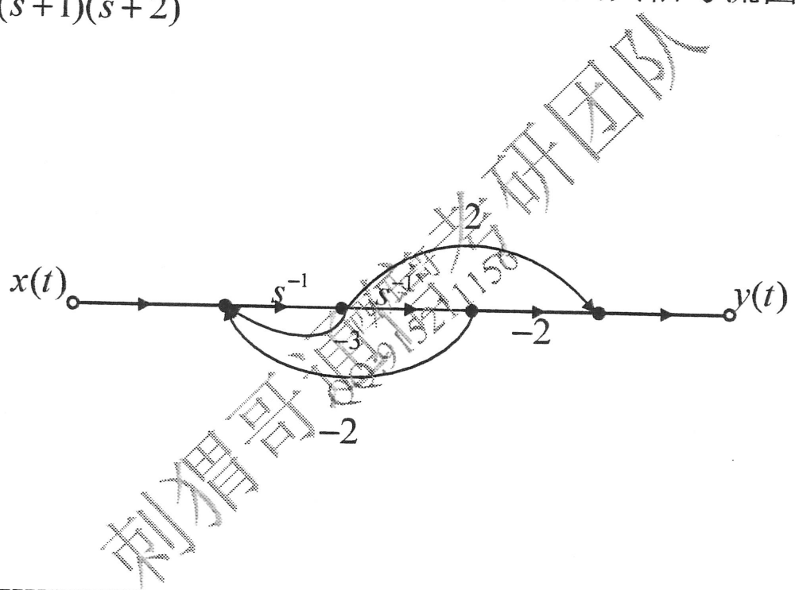

3.

(1)

\(y_{1}(n) = 0.4x(n) + 0.6x(n - 1)\), 等式两边进行 \(z\) 变换得 \(Y_{1}(z) = 0.4X(z) + 0.6X(z)z^{-1}\).

因为 \(Y(z) = X(z)H(z)\)

由此可得 \(H_{1}(z) = 0.4 + 0.6z^{-1} = \frac{\frac{2}{5}(z + \frac{3}{2})}{z}, |z| > 0\)

同理在框图后面一部分 \(y_{1}(n)\) 作为激励信号, 输出 \(y(n)\), 根据其差分方程可得

---

$$
H _ {2} (z) = \frac {1}{1 - \frac {1}{3} z ^ {- 1}} = \frac {z}{z - \frac {1}{3}}, | z | > \frac {1}{3}
$$

(2)

设整个系统得系统函数为 \(H(z)\)

$$
H (z) = H _ {1} (z) \cdot H _ {2} (z) = \frac {2 \left(z + \frac {3}{2}\right)}{5 \left(z - \frac {1}{3}\right)}
$$

利用部分分式法展开可得 \(H(z) = \frac{2}{5} \frac{z}{z - \frac{1}{3}} + \frac{3}{5} \frac{1}{z - \frac{1}{3}}\)

则 \(h(n) = \mathcal{L}^{-1}[H(z)] = \frac{2}{5}\left(\frac{1}{3}\right)^n +\frac{3}{5}\left(\frac{1}{3}\right)^{n - 1}u(n - 1) = \frac{2}{5}\delta (n) + \frac{11}{5}\left(\frac{1}{3}\right)^n u(n - 1)\)

(3)

整个系统的系统函数为 \(\frac{\frac{2}{5}z + \frac{3}{5}}{z - \frac{1}{3}}\) ，根据梅森公式，可得信号流图如下所示：

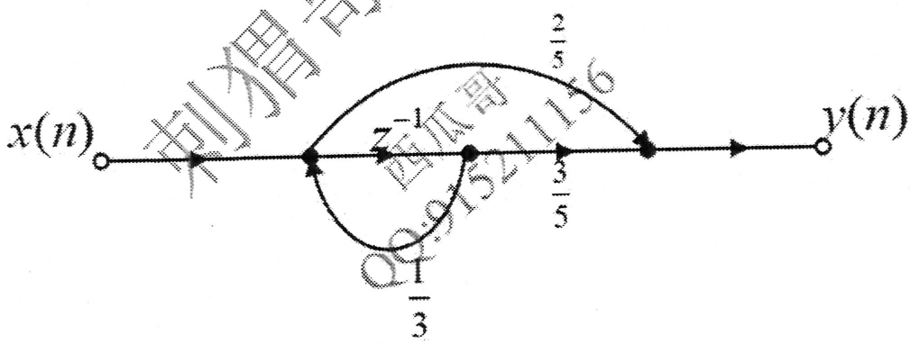

(刺猬哥考研团队, 答疑交流群 709502924)

---

# 南昌大学

# 2017年招收攻读硕士研究生

# 入学考试自命题试题

科目代码及名称： 信号与系统811

适用专业： 信息与通信工程、电子信息等

(所有答案都必须写在答题纸上, 写在试卷纸上及草稿纸上无效, 考完后试题随答题纸收回)

一、填空题（每小题3分，共30分）

1. 如果一个系统的幅频响应是常数，那么这个系统就称为________；

2. 系统函数零点全在左半平面的系统称为________；

3. 已知 \( f(t) \)，\( f(-2t) \) (怎么变换)得到 \( f(3 - 2t) \)

4. \(F(s) = \frac{4s + 5}{2s + 1}\) 的初值为 ，终值为

5. 若连续线性时不变系统的输入信号为 \(f(t)\), 响应为 \(y(t)\), 则系统无畸变传输的时域表达式为 \(y(t) =\)

6. \(\int_{-\infty}^{\infty}\sin \pi t\delta (2t - 1)dt = \underline{\quad};\)

7. 已知冲激序列 \(\delta_T(t) = \sum_{n=-\infty}^{\infty} \delta(t - nT_1)\)，其傅里叶变换为 ______；

8. 为使线性时不变离散系统是稳定的, 其系统函数 \(H(s)\) 的极点必须在 \(S\) 平面的:

9. 已知一阶因果离散系统, 其单位样值响应 \(h(n) = (-3)^n u(n)\), 则该离散系统的差分方程

---

程为________；（西瓜哥QQ：915211156）

10. 已知 \(f(n) = (n - 1) u(n - 1)\), 则其单边 \(z\) 变换为

11. 离散时间系统的系统函数 \(H(z) = \frac{z}{z - 0.5}\), 则该系统为何种滤波器________;

12. 一因果系统的系统函数为 \(H(z) = \frac{2z - 4}{2z^2 + 2z - 1}\), 判断该系统的稳定性 ______;

# 二、计算题

1. 系统如下图所示, 已知 \(x(t) = \frac{\sin \pi t}{\pi t}, s(t) = \cos 1000 t\), 低通滤波器的频率特性为 \(H(j \omega) = \left[u(\omega + 2) - u(\omega - 2)\right] e^{-j \omega}\), 求 \(Y_{A}(j \omega), Y_{B}(j \omega)\) 和 \(y(t)\) 。

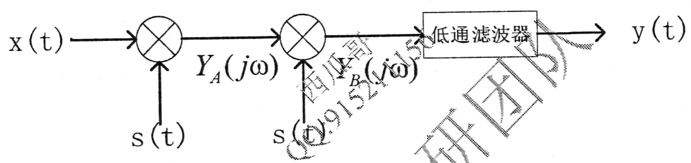

2. 系统如图所示（设系统初始无储能），

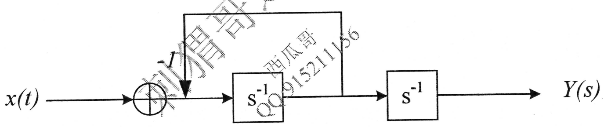

求系统函数 \(H(s) = \frac{Y(s)}{X(s)}\) ，并讨论系统的稳定性，求系统的冲激响应和阶跃响应。

3. 已知一因果离散系统的差分方程为: \(y(n) - y(n - 1) - 2y(n - 2) = x(n) + 2x(n - 2)\), 已知 \(y(-1) = 2\), \(y(0) = 2\), \(x(n) = u(n)\), 求零输入响应 \(y_{zi}(n)\) 与零状态响应 \(y_{zs}(n)\)。（刺猬哥考研团队，答疑交流群709502924）

---

# 2017 南昌大学信号与系统 811 真题详解

——西瓜哥原创作答

# 一、填空题

题1解：全通网络

题 2 解: 最小相移网络

题 3 解: 向右平移 \(\frac{3}{2}\) 个单位

题 4 解: 初值: \(\frac{3}{2}\), 终值: 0 (刺猬哥考研团队, 答疑交流群 709502924)

$$
f \left(0 _ {+}\right) = \lim  _ {t \rightarrow 0 _ {+}} f (t) = \lim  _ {s \rightarrow \infty} s F (s)
$$

又因为： \(F(s) = 2 + \frac{3}{2s + 1}\) ，所以 \(f(0_{+}) = \lim_{x\to \infty}s\frac{3}{2s + 1} = \frac{3}{2}\)

$$
\lim  _ {t \rightarrow \infty} f (t) = \lim  _ {s \rightarrow 0} s F (s) = \lim  _ {s \rightarrow 0} s \frac {4 s + 5}{2 s + 1} = 0
$$

此题求初值时注意要将分式化简, 课本上这条性质有举例, 要仔细看一下.

题5解： \(y(t) = kf(t - t_0)\) ， \((\mathrm{k},t_{0}\) 为常数）

题6解： \(\int_{-\infty}^{\infty}\sin \pi t\delta (2t - 1)dt = \int_{-\infty}^{\infty}\sin \pi t\frac{1}{2}\delta \left(t - \frac{1}{2}\right)dt = \frac{1}{2}\)

题 7 解:

$$
\begin{array}{l} \delta_ {T} (t) = \sum_ {n = - \infty} ^ {\infty} \delta (t - n T _ {1}) \\ = \sum_ {n = - \infty} ^ {\infty} F (n) e ^ {j n \omega_ {1} t} \\ \end{array}
$$

$$
\omega_ {1} = \frac {2 \pi}{T _ {1}}
$$

---

$$
\begin{array}{l} F (n) = \frac {1}{T _ {1}} \int_ {\frac {T _ {1}}{2}} ^ {\frac {T _ {1}}{2}} \delta (t) e ^ {- j n \omega_ {1} t} = \frac {1}{T _ {1}} \\ \mathcal {F} \left[ \delta_ {T} (t) \right] = \mathcal {F} \left[ \frac {1}{T _ {1}} \sum_ {n = - \infty} ^ {\infty} e ^ {j n \omega_ {1} t} \right] \\ = \frac {1}{T _ {1}} \sum_ {N = - \infty} ^ {\infty} 2 \pi \delta (\omega - n \omega_ {1}) \\ = \frac {2 \pi}{T _ {1}} \sum_ {N = - \infty} ^ {\infty} \delta \left(\omega - n \frac {2 \pi}{T _ {1}}\right) \\ \end{array}
$$

题 8 解: 左半平面

题9解： \(h(n) = (-3)^n u(n)\)

$$
H (z) = \frac {Y (Z)}{X (Z)} = \frac {z}{z + 3}
$$

故有: \( y(n) + 3y(n - 1) = x(n) \)

题10解： \(F(z) = \sum_{n = 1}^{\infty}\left(n - 1\right)u\left(n - 1\right)z^{-n}\)

令 \(n - 1 = k\)；\(= \sum_{k=0}^{\infty} ku(k)z^{-(k+1)}\)

$$
\begin{array}{l} = \sum_ {k = 0} ^ {\infty} k u (k) z ^ {- k} \cdot z ^ {- 1} \\ = \frac {1}{(z - 1) ^ {2}} \\ \end{array}
$$

题 11 解: \(H(z) = \frac{1}{1 - 0.5z^{-1}}\), \(H\left(e^{j\omega}\right) = \frac{1}{1 - 0.5e^{-j\omega}}\)

---

$$
\left| H \left(e ^ {j \omega}\right) \right| = \left| \frac {1}{1 - 0 . 5 \cos \omega + j \sin \omega} \right| = \frac {1}{\sqrt {1 . 2 5 - \cos w}}
$$

故函数特性可判断为低通滤波器

题 12 解: 不稳定

# 二、计算题

题1解：

$$
Y _ {A} (t) = x (t) s (t) \rightarrow Y _ {A} (j \omega) = \frac {1}{2 \pi} \left[ X (\omega) ^ {*} S (\omega) \right]
$$

$$
Y _ {A} (\omega) = \frac {1}{2} [ X (\omega + 1 0 0 0) + X (\omega - 1 0 0 0 ]
$$

$$
x (t) = \frac {\sin \pi t}{\pi t} = S a (\pi t) \rightarrow g _ {2 \pi} (t) \leftrightarrow 2 \pi S a (\pi \omega)
$$

$$
2 \pi S a (\pi t) \leftrightarrow 2 \pi g _ {2 \pi} (\omega)
$$

$$
S a (\pi t) \leftrightarrow g _ {2 \pi} (\omega)
$$

$$
Y _ {A} (\omega) = \frac {1}{2} \left[ g _ {2 \pi} (\omega + 1 0 0 0) + g _ {2 \pi} (\omega - 1 0 0 0) \right]
$$

$$
Y _ {B} (\omega) = \frac {1}{2} \left[ Y _ {A} (\omega + 1 0 0 0) + Y _ {A} (\omega - 1 0 0 0 \right] = \frac {1}{4} \left[ g _ {2 \pi} (\omega + 2 0 0 0) + g _ {2 \pi} (\omega - 2 0 0 0) \right] + \frac {1}{2} g _ {2 \pi} (\omega)
$$

$$
Y (\omega) = Y _ {B} (\omega) \cdot H (\omega) = \frac {1}{2} [ u (\omega + 2) - u (\omega - 2) ] e ^ {- j \omega} = \frac {1}{2} g _ {4} (\omega) e ^ {- j \omega}
$$

所以 \(y(t) = \frac{1}{\pi} S a[2(t - 1)]\)

(刺猬哥考研团队, 答疑交流群 709502924)

题2解：

$$
\begin{array}{l} \left\{ \begin{array}{l} X (s) - s R (s) = s ^ {2} R (s) \\ Y (s) = R (s) \end{array} \right. \\ \rightarrow H (s) = \frac {Y (s)}{X (s)} = \frac {1}{s (s + 1)} = \frac {1}{s} + \frac {- 1}{s + 1} \\ \end{array}
$$

$$
h (t) = u (t) - e ^ {- t} u (t) = \left(1 - e ^ {- t}\right) u (t)
$$

---

$$
\begin{array}{l} G (s) = \frac {1}{s} \cdot \frac {1}{s (s + 1)} = \frac {- 1}{s} + \frac {1}{s ^ {2}} + \frac {1}{s + 1} \\ g (t) = - u (t) + t u (t) + e ^ {- t} u (t) \\ \end{array}
$$

极点为 \(s_{1} = 0, s_{2} = -1\), 系统处于临界稳定状态

题3解：

由差分方程可得:

$$
\begin{array}{l} Y (z) - \left[ z ^ {- 1} Y (z) + y (- 1) \right] - 2 \left[ z ^ {- 2} Y (z) + y (- 1) z ^ {- 1} + y (- 2) \right] = X (z) + 2 z ^ {- 2} X (z) \\ \left(1 - z ^ {- 1} - 2 z ^ {- 2}\right) Y (z) - y (- 1) - 2 y (- 1) z ^ {- 1} - 2 y (- 2) = \left(1 + 2 z ^ {- 2}\right) X (z) \\ Y (z) = \frac {\left(1 + 2 z ^ {- 2}\right) X (z)}{1 - z ^ {- 1} - 2 z ^ {- 2}} + \frac {y (- 1) + 2 y (- 1) z ^ {- 1} + 2 y (- 2)}{1 - z ^ {- 1} - 2 z ^ {- 2}} \\ \end{array}
$$

又因为: \(X(z) = \frac{z}{z - 1}\)

所以 \(Y_{zs}(z) = \frac{(z^2 + 2)z}{(z^2 - z - 2)(z - 1)}\)

所以 \(\frac{Y_{zs}(z)}{z} = \frac{z^2 + 2}{(z^2 - z - 2)(z - 1)} = \frac{2}{z - 2} +\frac{\frac{1}{2}}{z + 1} +\frac{-\frac{3}{2}}{z - 1}\)

$$
\begin{array}{l} Y _ {z s} (z) = \frac {2 z}{z - 2} + \frac {\frac {1}{2} z}{z + 1} + \frac {- \frac {3}{2} z}{z - 1} \\ y _ {z s} (n) = \left[ 2 \cdot 2 ^ {n} + \frac {1}{2} (- 1) ^ {n} - \frac {3}{2} \right] u (n) \\ y (0) = y (- 1) + 2 y (- 2) + 1 \\ y (- 2) = - \frac {1}{2} \\ y _ {z i} (z) = \frac {2 z}{z - 2} - \frac {z}{z + 1} \\ y _ {z i} (n) = \left[ 2 \cdot 2 ^ {n} - (- 1) ^ {n} \right] u (n) \\ \end{array}
$$

(刺猬哥考研团队, 答疑交流群 709502924)

---

# 南昌大学

# 2018年招收攻读硕士研究生

# 入学考试自命题试题

科目代码及名称： 信号与系统811

适用专业： 信息与通信工程、电子信息等

(所有答案都必须写在答题纸上, 写在试卷纸上及草稿纸上无效, 考完后试题随答题纸收回)

# 一、填空题（每小题3分，共30分）

1. 已知 \(f(t) = \frac{1}{\pi t}\), 则其频谱函数 \(F(j \omega) =\)

2. 已知 \( f(t) = \left(\sin 2t - \frac{\pi}{4}\right) \)，则其单边拉普拉斯变换的象函数 \( F(s) = \) ______；

3. 图示信号 \(f(t)\), 其傅氏变换 \(\mathcal{F}[f(t)] = F(j\omega) = R(\omega) + jX(\omega)\), 实部 \(R(w)\) 的表示式为: ________; (刺猬哥考研团队, 答疑交流群 709502924)

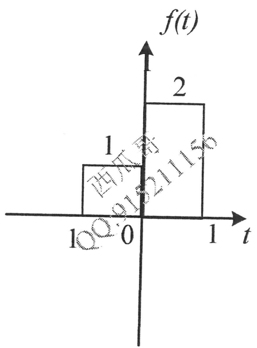

4. 如果一个线性时不变系统的输入为 \(f(t)\), 零状态响应为 \(y_{zs}(t) = 2 f(t - t_0)\), 则该系统的单位冲激响应 \(h(t)\) 为

---

5. 若已知 \( f_{1}(t) \) 的拉氏变换 \( F_{1}(s) = \frac{1}{s} \)，则 \( f(t) = f_{1}(t)^{*}f_{1}(t) \) 的拉氏变换 \( F(s) = \) ______；

6. 已知某因果系统的系统函数为 \(H(s) = \frac{1}{s^2 + (3 - k)s + k}\), 要使系统稳定, 则 \(\mathrm{k}\) 值的范围是______; (刺猬哥考研团队, 答疑交流群 709502924)

7. 信号不失真的条件为系统函数________；

8. 已知 \(f(k) = (k - 1) u(k)\), 其双边 \(k\) 变换的象函数为 \(\_ \_ \_ \_ \_ \_\), 收敛域为 \(\_ \_ \_ \_ \_\);

9. 一个有限长连续时间信号, 时间长度为 2 分钟, 频谱包含直流至 \(100 \mathrm{~Hz}\) 的分量。为了方便计算机处理, 对其取样构成离散信号, 最小的理想取样点数为

10. 已知一离散时间 LTI 系统的单位阶跃响应 \(g(k) = (0.5)^k u(k)\), 则该系统的单位样值响应 \(h(k) =\) ________;

11. 系统函数零点全在左半平面的系统称为________；

12. 如图所示某离散系统的 \(z\) 域信号流图, 为使系统稳定, 则常数 \(k\) 的取值范围是_________；(刺猬哥考研团队, 西瓜哥 QQ: 915211156)

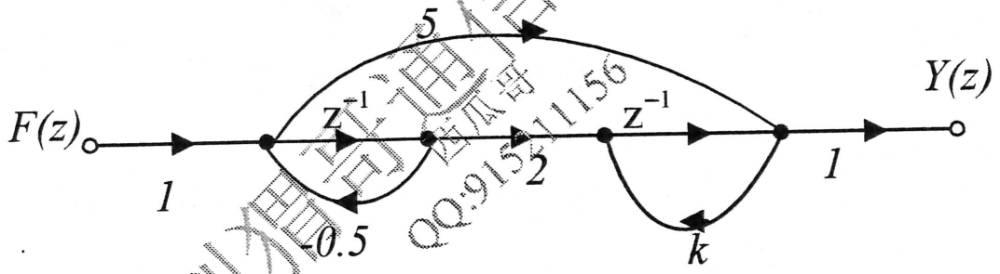

# 二、简答题

1. \(f(t)\) 的波形如图示, 则 \(f\left(-\frac{1}{2} t + 1\right)\) 的波形为:

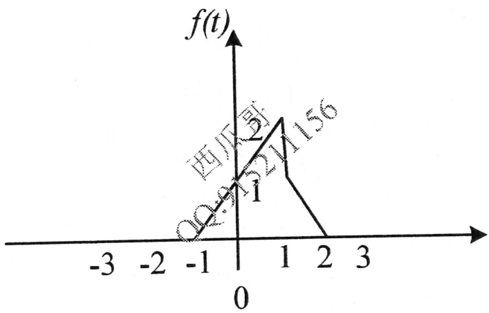

2. 已知 \(x(n)\) 的双边 \(\mathbf{z}\) 变换 \(X(z)\)，证明 \(\mathcal{Z}[x(-n)] = X(z^{-1})\)

---

3. 对于题图所示的 \(R C\) 电路, 若初始储能为 0 , 以 \(x(t)\) 作为激励, \(v_{2}(t)\) 作为响应。

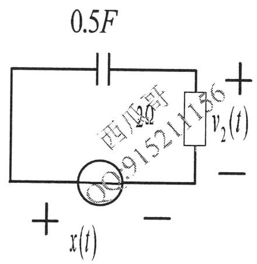

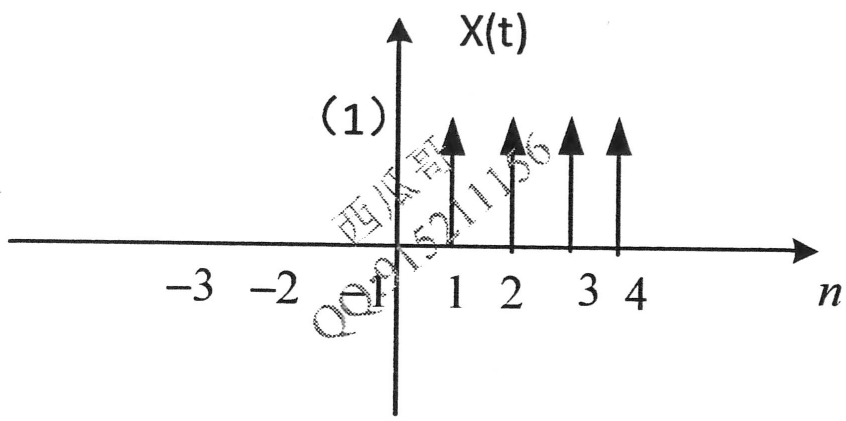

(1) 求系统的冲激响应 \(h(t)\) 与阶跃响应 \(g(t)\), 并画出 \(h(t)\) 与 \(\mathrm{g}(t)\) 的波形;

(2) 若激励信号 \(x_{1}(t) = u(t) - u(t - 1)\), 求系统响应 \(v_{2}(t)\);

(3) 若激励信号 \(x_{2}(t)\) 如图所示, 求系统响应 \(v_{2}(t)\)

# 三、计算题

1. 已知系统的微分方程为 \(\frac{d^2y(t)}{dt^2} + 3\frac{dy(t)}{dt} + 2y(t) = x(t)\)，系统的起始状态 \(y(0_{-}) = 1\)，\(y'(0_{-}) = 2\)，激励信号 \(x(t) = u(t)\)。求：

(1) 系统的系统函数 \(H(s)\)

(2) 系统的单位冲激响应 \(h(t)\)

（3）系统的零状态响应 \(y_{\mathrm{zs}}(t)\)

(4) 系统的零输入响应 \(y_{zi}(t)\)

(5) 指出系统全响应 \(y(t)\) 中的自由响应及稳态响应和暂态响应各分量。

(刺猬哥考研团队, 答疑交流群 709502924)

---

2. 已知离散时间系统的差分方程为 \( y(n) - 0.7y(n - 1) + 0.1y(n - 2) = x(n) \)，其中 \( x(n) \) 为输入，\( y(n) \) 为输出，\( y(-1) = 1 \)，\( y(-2) = 1 \)，\( x(n) = u(n) \)，求：

(1) 系统函数 \(H(z)\) 并判断系统稳定性。

(2) 系统单位函数响应 \(h(n)\)

(3) 画出系统信号流图

(4) 系统的零输入响应

(5) 系统的零状态响应

3. 已知某线性微分方程为: \(\frac{d^3y(t)}{dt^3} + 4\frac{d^2y(t)}{dt^2} + 5\frac{dy(t)}{dt} + 2y(t) = \frac{d^2x(t)}{dt^2} + 6\frac{dx(t)}{dt} + 4x(t)\), 初始状态为0;

(1) 列出系统的系统函数 \(H(s)\)

(2) 求系统的单位冲激响应

(3) 画出系统的信号流图

(4) 列出系统的状态方程并写出矩阵的形式

---

# 2018南昌大学信号与系统811真题详解

——西瓜哥原创作答

# 一、填空题

题1解： \(jsgn(-\omega)\)

sgn(t)的傅里叶变换为 \(\frac{2}{j\omega}\)

利用对称性即有 \(\frac{1}{jt} \leftrightarrow 2\pi s g n(-\omega)\)、\(\frac{1}{\pi t} \leftrightarrow j s g n(-\omega)\)

题 2 解: \(\frac{\sqrt{2} - \frac{\sqrt{2} s}{2}}{s^{2} + 4}\) (刺猬哥考研团队, 西瓜哥 QQ: 915211156)

$$
f (t) = \frac {\sqrt {2}}{2} \sin 2 t - \frac {\sqrt {2}}{2} \cos 2 t
$$

经拉氏变换得到： \(F(s) = \frac{\sqrt{2}}{2}\frac{2}{s^2 + 4} -\frac{\sqrt{2}}{2}\frac{s}{s^2 + 4} = \frac{\sqrt{2} - \frac{\sqrt{2}s}{2}}{s^2 + 4}\)

题 3 解: \( f(t) = g_{1}\left(t + \frac{1}{2}\right) + 2g_{2}\left(t - \frac{1}{2}\right) \)

$$
\begin{array}{l} \leftrightarrow \mathcal {F} [ f (t) ] = e ^ {j \frac {1}{2} \omega} S a \left(\frac {\omega}{2}\right) + 2 e ^ {- j \frac {1}{2} \omega} S a \left(\frac {\omega}{2}\right) \\ = \frac {\left(e ^ {j \frac {1}{2} \omega} + 2 e ^ {- j \frac {1}{2} \omega}\right) \sin \frac {\omega}{2}}{\frac {\omega}{2}} \\ \end{array}
$$

---

$$
\begin{array}{l} = \frac {\left(3 \cos \frac {\omega}{2} - j \sin \frac {\omega}{2}\right) \sin \frac {\omega}{2}}{\frac {\omega}{2}} \\ = \frac {\frac {3}{2} \sin \omega}{\frac {\omega}{2}} - j \frac {\sin^ {2} \frac {\omega}{2}}{\frac {\omega}{2}} \\ = R (\omega) + j X (\omega) \\ \end{array}
$$

所以，实部 \(R(\omega) = 3Sa(\omega)\)

题4解： \(2\delta \left(t - t_0\right)\)

题 5 解: \(\frac{1}{s^{2}}\)

\(F(s) = F_{1}(s)\cdot F_{1}(s) = \frac{1}{s^{2}}\) （刺猬哥考研团队，答疑交流群709502924）

题 6 解: \(0 < k < 3\)

$$
\left\{ \begin{array}{l} 3 - k > 0 \\ k > 0 \end{array} \right.
$$

此类题型注：要使极点全部位于左半开平面

(1)、对于二阶多项式

a. 形如 \(s^2 + \alpha s + \beta\) 需要满足

$$
\left\{ \begin{array}{l} \alpha > 0 \\ \beta > 0 \end{array} \right.
$$

形如 \(s^3 + \alpha s^2 + \beta s + r\)

$$
\left\{ \begin{array}{l} \alpha > 0 \\ \beta > 0 \\ r > 0 \\ \alpha \beta > r \end{array} \right..
$$

---

题 7 解: \(\left|H(j\omega)\right| = k, k\) 为常数, \(\varphi(\omega) = -\omega t_{0}, t_{0}\) 为常数

题8解：

$$
\begin{array}{l} F (z) = \sum_ {n = - \infty} ^ {\infty} (n - 1) u (n) z ^ {- n} \\ = \sum_ {n = 0} ^ {\infty} (n - 1) z ^ {- n} \\ = \frac {z}{(z - 1) ^ {2}} - \frac {z}{z - 1} \\ = \frac {2 z - z ^ {2}}{(z - 1) ^ {2}} \\ \end{array}
$$

收敛域: \(|z| > 1\)

题 9 解: 24000

$$
f _ {m} = 1 0 0 \mathrm {H z} f _ {s} \geq 2 f _ {m} = 2 0 0 \mathrm {H z}
$$

$$
T _ {m a x} = \frac {1}{f _ {s m i n}} = \frac {1}{2 0 0} s
$$

$$
N = \frac {1 2 0 s}{T _ {m a x}} = 2 4 0 0 0 \text {个}
$$

题10解： \(h(n) = g(n) - g(n - 1) = 0.5^{n}u(n) - 0.5^{n - 1}u(n - 1)\)

题 11 解: 最小相位系统

题 12 解: \(-1 < k < 1\)

所有环路: \(L 1: -0.5 z^{-1} \quad L 2: k z^{-1}\)

---

互不接触环路: \(L 1: -0.5 z^{-1} \quad L 2: k z^{-1} \quad L 1 L 2: -0.5 k z^{-2}\)

$$
\begin{array}{l} \Delta = 1 - \left(- 0. 5 z ^ {- 1} + k z ^ {- 1}\right) + \left(- 0. 5 k z ^ {- 2}\right) \\ = 1 - (k - 0. 5) z ^ {- 1} - 0. 5 k z ^ {- 2} \\ \end{array}
$$

前向通路: \(g_{1} = 5, \Delta_{1} = 1\) 、 \(g_{2} = 2 z^{-2}, \Delta_{2} = 1\)

所以 \(H(z) = \frac{1}{\Delta} \sum_{k} g_{k} \Delta_{k}\)

$$
= \frac {5 z ^ {2} + 2}{z ^ {2} - (k - 0 . 5) z - 0 . 5 k}
$$

令 \(F(k) = z^2 - (k - 0.5)z - 0.5k\)

一个极点是 \(\mathrm{k}\), 另一个极点是 -0.5

为使系统稳定，则需要极点都在单位圆内，于是有

$$
\left\{ \begin{array}{l} 1 > 0. 5 \\ 1 > | k | \end{array} \right.
$$

得到：\(-1 < k < 1\) （刺猬哥考研团队，西瓜哥QQ：915211156）

# 二、简答题

1.

\((f(t) \rightarrow f(at + b)\): 先平移再尺度变换和反褶。\(f(at + b) \rightarrow f(t)\): 先尺度变换再反褶

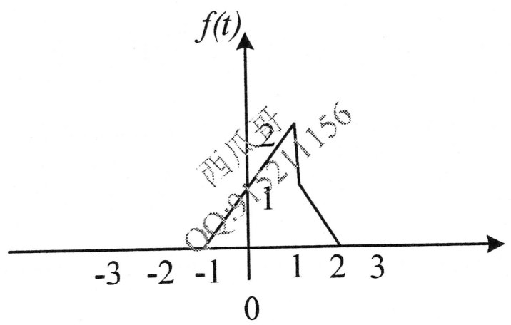

用 \((t + 1)\) 换 \(\mathbf{t}\) 得到：

---

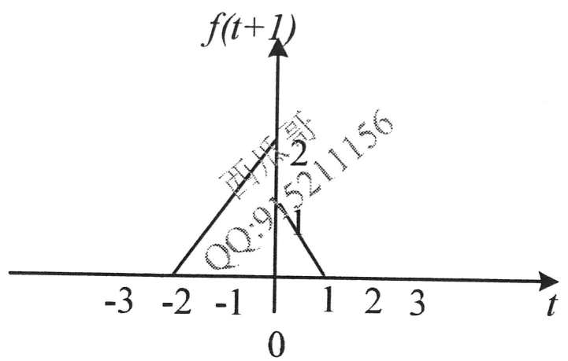

用 \(\frac{1}{2} t\) 换 \(t\) 得到:

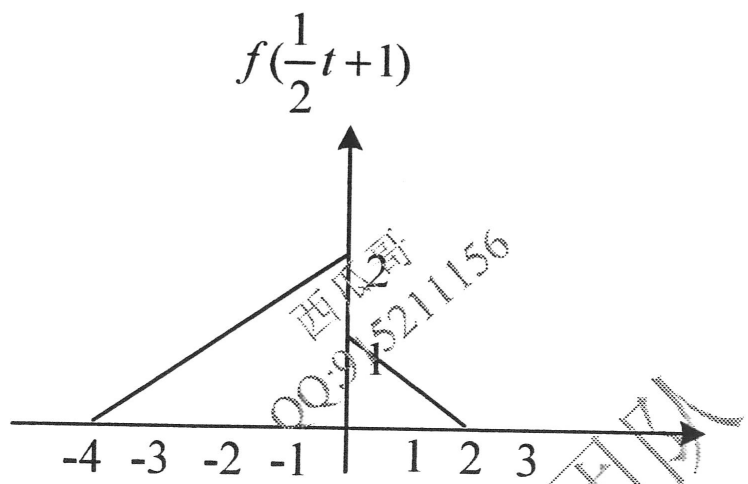

用 \(-\frac{1}{2} t\) 换 \(\frac{1}{2} t\) 得到:

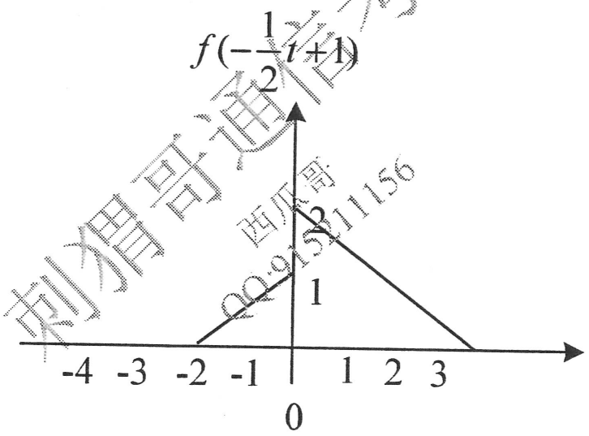

2.

因为 \(X(z) = \sum_{n = -\infty}^{\infty}x(n)z^{-n}\)

且 \(\mathcal{Z}\left[x(-n)\right] = \sum_{n=-\infty}^{\infty} x(-n) z^{-n}\)

---

令 \((k = -n)\to \mathcal{Z}\big[x(k)\big] = \sum_{n = -\infty}^{\infty}x\big(k\big)(z^{-1})^{-k} = X\big(z^{-1}\big)\)

所以: \(\mathcal{Z}[x(-n)] = X(z^{-1})\) （刺猬哥考研团队, 答疑交流群 709502924）

3.

(1)

若 \(x(t) = \frac{1}{C}\int_{-\infty}^{t}i_c(\tau)d\tau +v_2(t)\)

$$
\leftrightarrow E (s) = \frac {1}{S C} \cdot \frac {V _ {s}}{2} + V _ {2} (s)
$$

$$
H (s) = \frac {V _ {2} (s)}{E (s)} = 1 - \frac {1}{s + 1}
$$

$$
h (t) = \delta (t) - e ^ {- t} u (t)
$$

求积分所以 \(g(t) = e^{-t}u(t)\)

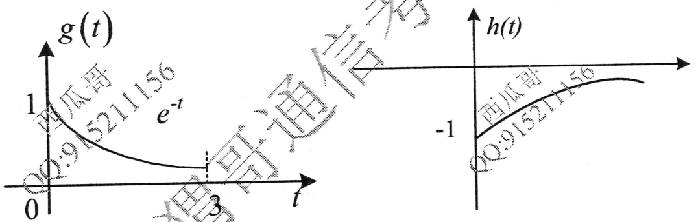

(2)

当 \(x_{1}(t) = u(t) - u(t - 1)\) 时

$$
X _ {1} (s) = \frac {1}{s} - \frac {e ^ {- s}}{s}
$$

$$
V _ {2} (s) = X _ {1} (s) \cdot H (s) = \left(\frac {1}{s} - \frac {e ^ {- s}}{s}\right) \cdot \frac {s}{s + 1} = \frac {1}{s + 1} - \frac {e ^ {- s}}{s + 1}
$$

所以: \(v_{2}(t) = e^{-t} u(t) - e^{-(t-1)} u(t-1)\)

(3) \(x_{2}(t) = \sum_{n=0}^{\infty} \delta(t - n)\) 时

---

$$
X _ {2} (s) = 1 + e ^ {- s} + e ^ {- 2 s} + \dots + e ^ {- n s} = \frac {1 + \left(e ^ {- s}\right) ^ {n}}{1 + e ^ {- s}} = \frac {1}{1 + e ^ {- s}}
$$

所以: \(V_{2}(s) = X_{1}(s) \cdot H(s) \rightarrow v_{2}(t) = x_{2}(t)^{*} h(t)\)

$$
v _ {2} (t) = \left[ \delta (t) - e ^ {- t} u (t) \right] * \sum_ {n = 0} ^ {\infty} \delta (t - n) = \sum_ {n = 0} ^ {\infty} \left[ \delta (t - n) - e ^ {- (t - n)} u (t - n) \right]
$$

# 三、计算题:

1.

解：

(1)

由微分方程得： \(s^2 Y(s) + 3sY(s) + 2Y(s) = X(s)\rightarrow H(s) = \frac{Y(s)}{X(s)} = \frac{1}{s^2 + 3s + 2}\)

(2)

$$
H (s) = \frac {1}{s ^ {2} + 3 s + 2} = \frac {1}{s + 1} - \frac {1}{s + 2}
$$

所以： \(h(t) = e^{-t}u(t) - e^{-2t}u(t)\)

(3)

求系统的零状态响应， \(x(t) = u(t),y(0_{-}) = y^{\prime}(0_{-}) = 0\)

$$
s ^ {2} Y _ {z s} (s) + 3 s Y _ {z s} (s) + 2 Y _ {z s} (s) = \frac {1}{s}
$$

$$
Y _ {z s} (s) = \frac {1}{s (s + 1) (s + 2)} = \frac {\frac {1}{2}}{s} + \frac {- 1}{s + 1} + \frac {\frac {1}{2}}{s + 2}
$$

所以: \(y_{zs}(t) = \frac{1}{2} u(t) - e^{-t}u(t) + \frac{1}{2} e^{-2t}u(t)\) 强迫响应

(4) 求系统的零输入响应:

即 \(s^2 Y_{zi}(s) - sy(0_+) - y'(0_+) + 3[sY_{zi}(s) - y(0_+)] + 2Y_{zi}(s) = 0\)

$$
\begin{array}{l} Y _ {z i} (s) = \frac {s + 5}{(s + 1) (s + 2)} = \frac {A}{s + 1} + \frac {B}{s + 2} = \frac {4}{s + 1} + \frac {- 3}{s + 2} \\ y _ {z i} (t) = 4 e ^ {- t} u (t) - 3 e ^ {- 2 t} u (t) \quad \text {自 由 响 应} \\ \end{array}
$$

---

(5) 全响应: \(y(t) = y_{zs}(t) + y_{zi}(t) = \frac{1}{2} u(t) + 3e^{-t}u(t) - \frac{5}{2} e^{-2t}u(t)\)

所以自由响应和暂态响应分量: \(3e^{-t}u(t) - \frac{5}{2} e^{-2t}u(t)\)

强迫响应和稳态响应分量: \(\frac{1}{2} u(t)\)

2.解； \(Y(z) - 0.7z^{-1}Y(z) + 0.1z^{-2}Y(z) = X(z)\)

$$
H (z) = \frac {Y (z)}{X (z)} = \frac {1}{1 - 0 . 7 z ^ {- 1} + 0 . 1 z ^ {- 2}} = \frac {z ^ {2}}{z ^ {2} - 0 . 7 z + 0 . 1} = \frac {z ^ {2}}{(z - 0 . 5) (z - 0 . 2)}
$$

极点为: \(P = 0.5, P = 0.2\), 都在单位圆内, 所以系统稳定

(2)

设 \(\frac{H(z)}{z} = \frac{z}{z^2 - 0.7z + 0.1} = \frac{A}{z - 0.2} +\frac{B}{z - 0.5}\)

$$
H (z) = \frac {- \frac {2}{3} z}{z - 0 . 2} + \frac {\frac {5}{3} z}{z - 0 . 5}
$$

$$
h (n) = - \frac {2}{3} (0. 2) ^ {n} u (n) + \frac {5}{3} (0. 5) ^ {n} u (n)
$$

(3) \(H(z) = \frac{1}{1 - 0.7z^{-1} + 0.1z^{-2}}\)

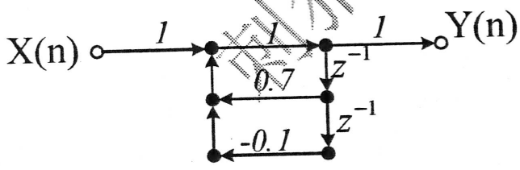

(4) 零输入响应:

$$
\begin{array}{l} Y (z) - 0. 7 \left[ z ^ {- 1} Y (z) + y (- 1) \right] + 0. 1 \left[ z ^ {- 2} Y (z) + z ^ {- 1} y (- 1) + y (- 2) \right] = 0 \\ \rightarrow Y (z) = \frac {0 . 6 z ^ {2} - 0 . 1 z}{z ^ {2} - 0 . 7 z + 0 . 1} = \frac {(0 . 6 z - 0 . 1) z}{(z - 0 . 5) (z - 0 . 2)} = \frac {\frac {2}{3} z}{z - 0 . 5} + \frac {- \frac {1}{1 5} z}{z - 0 . 2} \\ y _ {z i} (n) = \frac {2}{3} (0. 5) ^ {n} u (n) - \frac {1}{1 5} (0. 2) ^ {n} u (n) \\ \end{array}
$$

(5) 零状态响应:

---

$$
Y (z) - 0. 7 z ^ {- 1} Y (z) + 0. 1 z ^ {- 2} Y (z) = \frac {z}{z - 1}
$$

$$
\begin{array}{l} Y _ {z s} (z) = \frac {z}{z - 1} \cdot \frac {z ^ {2}}{(z - 0 . 5) (z - 0 . 2)} \\ = \frac {\frac {5}{2} z}{z - 1} + \frac {- \frac {5}{3} z}{z - 0 . 5} + \frac {\frac {1}{6} z}{z - 0 . 2} \\ \end{array}
$$

$$
y _ {z s} (n) = \frac {5}{2} u (n) - \frac {5}{3} (0. 5) ^ {n} u (n) + \frac {1}{6} (0. 2) ^ {n} u (n)
$$

3.

解：

(1)

$$
s ^ {3} Y (s) + 4 s ^ {2} Y (s) + 5 s Y (s) + 2 Y (s) = s ^ {2} X (s) + 6 s X (s) + 4 X (s)
$$

$$
H (s) = \frac {Y (s)}{X (s)} = \frac {s ^ {2} + 6 s + 4}{s ^ {3} + 4 s ^ {2} + 5 s + 2}
$$

(2)

$$
H (s) = \frac {- 4}{s + 2} + \frac {5}{s + 1} - \frac {1}{(s + 1) ^ {2}}
$$

从而得到 \(h(t) = -4e^{-2t}u(t) + 5e^{-t}u(t) - te^{-t}u(t)\)

(3) \(H(s) = \frac{s^2 + 6s + 4}{s^3 + 4s^2 + 5s + 2}\)

信号流图如下:

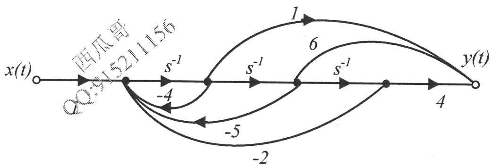

(4)

如上图可知:

状态方程:

---

$$
\left\{ \begin{array}{l} x _ {1} = x _ {2} \\ x _ {2} = x _ {3} \\ x _ {3} = - 2 x _ {1} - 5 x _ {2} - 4 x _ {3} + e (t) \end{array} \right.
$$

$$
y (t) = 4 x _ {1} + 6 x _ {2} + x _ {3}
$$

矩阵形式:

$$
\left[ \begin{array}{l} \dot {x} _ {1} \\ \dot {x} _ {2} \\ \dot {x} _ {3} \end{array} \right] = \left[ \begin{array}{l l l} 0 & 1 & 0 \\ 0 & 0 & 1 \\ - 2 & - 5 & - 4 \end{array} \right] \left[ \begin{array}{l} x _ {1} \\ x _ {2} \\ x _ {3} \end{array} \right] + \left[ \begin{array}{l} 0 \\ 0 \\ 1 \end{array} \right] e (t)
$$

\(y = \left[ \begin{array}{lll}4 & 6 & 1 \end{array} \right]\left[ \begin{array}{l}x_{1}\\ x_{2}\\ x_{3} \end{array} \right]\) （刺猬哥考研团队，答疑交流群709502924）

---

# 南昌大学

# 2019年招收攻读硕士研究生

# 入学考试自命题试题

科目代码及名称： 信号与系统811

适用专业： 信息与通信工程、电子信息等

(所有答案都必须写在答题纸上, 写在试卷纸上及草稿纸上无效, 考完后试题随答题纸收回)

# 一、填空题（每小题3分，共30分）

1. \(\int_{-\infty}^{t}e^{-\tau}\delta (-2\tau -4)d\tau =\)

2. 求 \( f(t) = \frac{\sin 4t}{t} \) 的能量：

3. 已知信号 \( f(t) = \frac{\sin \omega_c t}{\pi t} \)，求 \( F(\omega) = \)

4. 已知 \( y(t) = \int_{0}^{t}\lambda^{2}h(t - \lambda)d\lambda \)，求其拉氏变换：

5. \(f(t)\) 带宽为 \(1000\mathrm{Hz}\)，求 \(f^2 (2t - 3)\) 的带宽：

6. \(F(s) = \frac{s}{s + 1}\), 求 \(y(t) = 3e^{-2t}f(3t)\) 的单边拉氏变换:

7. 若离散系统具有因果稳定性, 则其系统函数的极点位于:

8. \(X(z) = \frac{z^2 + 1}{z^2 + z - 2}, 1 < |z| < 2\)，求 \(x(n) = \) ________.

9. \(x(n) = \left\{ \begin{array}{cccccc}2 & 3 & 0 & 4 & -1 & 5 & 2\\ & & \uparrow & & \\ & & n = 0 & & \end{array} \right\}\) ，求 \(x(2n) =\)

---

10. 若阶跃响应 \( g(n) = \left(\frac{1}{4}\right)^n u(n) \)，求 \( h(n) = \)

# 二、简答题

1. \(r(t) = e(2t) + \int_{-\infty}^{3t}e(\tau)d\tau\) 是否具有线性、时不变性？

2. 设 \(f_{1}(t)\) 为题图 (a) 所示的三角形脉冲, \(f_{2}(t)\) 为题图 (b) 所示的冲激序列, 即 \(f_{2}(t) = \sum_{n=-\infty}^{\infty} \delta(t - nT)\) 对下列 T 值 \(T = 1\), \(T = 2\), 求出 \(s(t) = f_{1}(t)^{*} f_{2}(t)\), 并画出 \(s(t)\) 的波形 (\(f_{1}(t)\) 的具体表达式不用写)

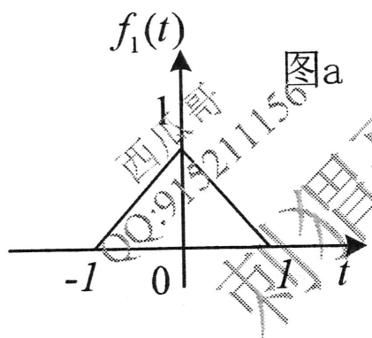

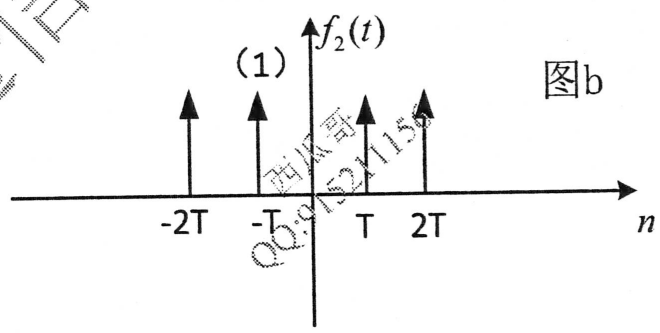

---

3. 求 \( f(t) = \sin 2t \cdot \sin 4t \) 通过下列系统是否失真？

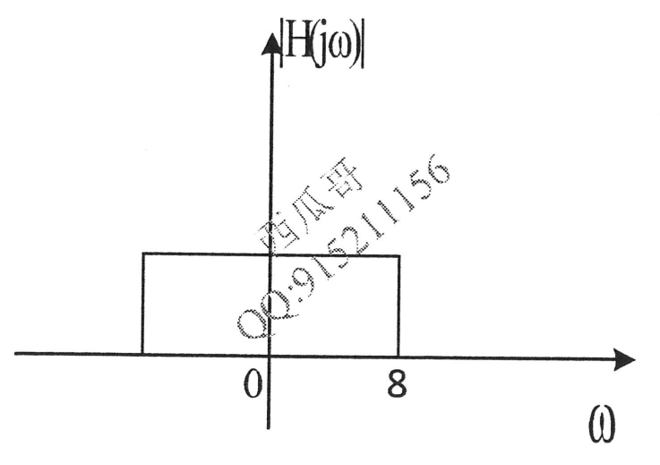

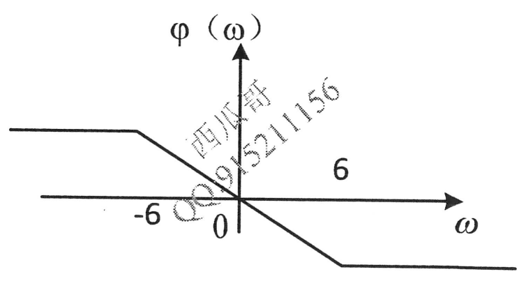

# 三、计算题

1. 若 \(r(0_{-}) = 2, r'(0_{-}) = 1\)，其零输入响应为 \(r_{zi1} = \left(3e^{-t} - e^{-2t}\right)\)，若 \(r(0_{-}) = 1, r'(0_{-}) = 2\)，其零输入响应 \(r_{zs2}(t) = \left(e^{-t} - 2e^{-2t}\right)\)，若输入激励 \(e(t) = e^{-4t}u(t)\)，其零状态响应 \(r_{zs}(t) = \left(e^{-t} - 2e^{-2t} + 0.5e^{-3t}\right)u(t)\)，试求当输入为 \(e(t) = \delta(t) - 4e^{-4t}u(t)\)，初始状态为 \(r(0_{-}) = 3, r'(0_{-}) = 0\) 的全响应？

2. 已知 \(X(j \omega), H_{1}(j \omega), H_{2}(j \omega)\) 的频谱如下图所示, 若输出 \(y(t) = x(t)\)

（1）求 \(x_{2}(t)\) 频谱图；

(2) 求 \(\omega_{3}\);

(3) 求 \(H_{3}\left(j \omega\right)\) 并画出频谱图(粗略画出即可), 其中 \(H_{2}\left(j \omega\right)\left\{\begin{array}{c} \frac{\sin 5 \omega}{\omega} \left| \omega \right| \leq 10 \pi \\ 0 \left| \omega \right| \geq 10 \pi \end{array}\right.\)

---

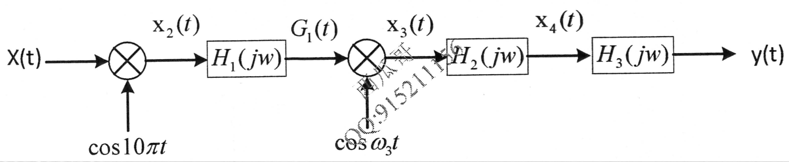

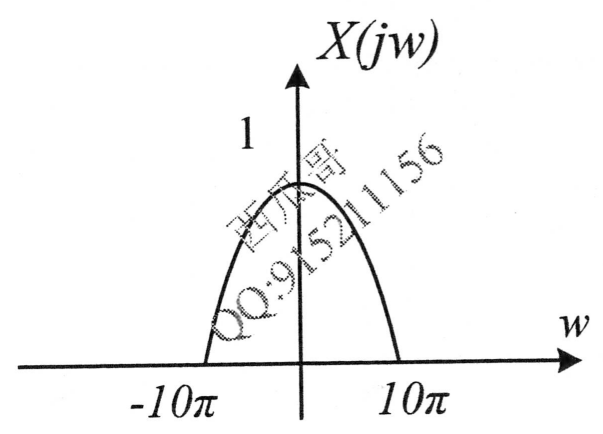

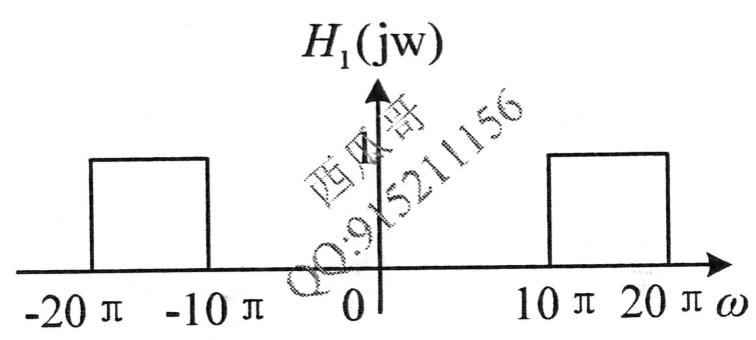

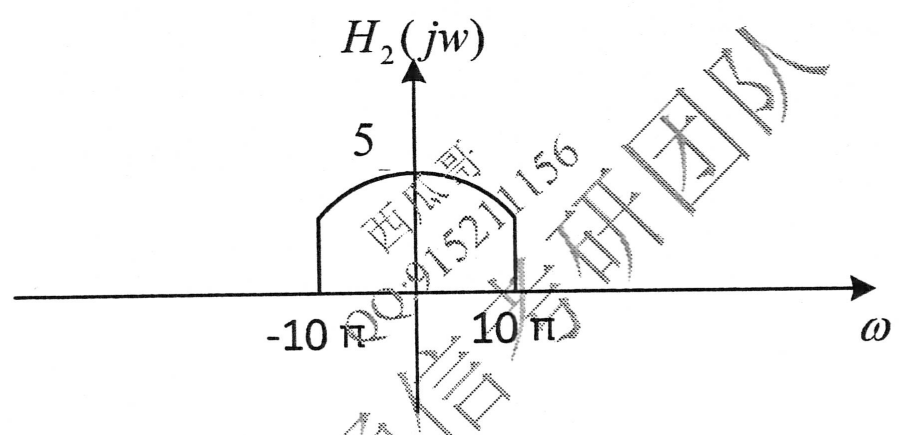

3. 若 \( y(n) - y(n - 1) - 2y(n - 2) = x(n) + 2x(n - 1) \)，求：

(1) \(H(z)\)

(2) \(h(n)\)

（3）若 \(x(n) = u(n)\) ，求零状态响应；

(4) 画出信号流图

---

# 2019 南昌大学信号与系统 811 真题详解

——西瓜哥原创作答

# 一、填空题

题1解： \(\int_{-\infty}^{t}e^{-\tau}\delta (-2\tau -4)d\tau = \int_{-\infty}^{t}e^{-\tau}\frac{1}{|-2|}\delta (\tau +2)d\tau = \frac{1}{2} e^{2}u(t + 2)\)

题2解： \(4\pi (J)\)

$$
E = \int_ {- \infty} ^ {\infty} | f (t) | ^ {2} d t = \frac {1}{2 \pi} \int_ {- \infty} ^ {\infty} | F (j \omega) | ^ {2} d \omega
$$

$$
g _ {8} (t) \leftrightarrow 8 S a (4 \omega)
$$

$$
8 S a (4 t) \leftrightarrow 2 \pi g _ {8} (- \omega)
$$

$$
4 S a (4 t) \leftrightarrow \pi g _ {8} (\omega)
$$

所以 \(E = \frac{1}{2\pi}\int_{-\infty}^{\infty}\left|\pi g_8(\omega)\right|^2 d\omega = \frac{\pi}{2}\int_{-4}^{4}\left|g_8(\omega)\right|^2 d\omega = 4\pi (J)\)

题3解： \(g_{2\omega_c}(\omega)\)

$$
f (t) = \frac {\omega_ {c}}{\pi} S a (\omega_ {c} t)
$$

$$
g _ {2 \omega_ {c}} (t) \leftrightarrow 2 \omega_ {c} S a (\omega_ {c} \omega)
$$

$$
2 \omega_ {c} S a (\omega_ {c} t) \leftrightarrow 2 \pi g _ {2 \omega_ {c}} (\omega)
$$

所以: \(\frac{\omega_{c}}{\pi} S a\left(\omega_{c} t\right) \leftrightarrow g_{2 \omega_{c}}(\omega)\)

题4解： \(y(t) = t^{2} * h(t)\)

$$
\begin{array}{l} = \int_ {0} ^ {t} \lambda^ {2} f (t - \lambda) \\ = \int_ {- \infty} ^ {\infty} \lambda^ {2} u (\lambda) h (t - \lambda) u (t - \lambda) d \lambda \\ = t ^ {2} u (t) * h (t) u (t) \\ \end{array}
$$

---

$$
\leftrightarrow Y (s) = \frac {2}{s ^ {3}} H (s)
$$

题5解：

$$
f (t): B = 1 0 0 0 H z
$$

\(f(2t - 3) \Leftrightarrow \frac{1}{2} F(jw / 2)e^{-j\frac{3}{2} w}: B = 2000Hz\) ，频域变成原来的两倍

\(
f^{2}\left(2t - 3\right)\Leftrightarrow \frac{1}{2\pi}\times \frac{1}{2}\times \frac{1}{2}\times e^{-j3w}F(jw / 2)*F(jw / 2):w_{c} = 4000Hz,
\)

故: 带宽 \(\mathrm{B} = 4000 \mathrm{~Hz}\)

题 6 解:

$$
f (3 t) \leftrightarrow \frac {1}{3} H \left(\frac {s}{3}\right)
$$

$$
e ^ {- 2 t} f (3 t) \leftrightarrow \frac {1}{3} F \left(\frac {S + 2}{3}\right)
$$

$$
3 e ^ {- 2 t} f (3 t) \leftrightarrow F \left(\frac {s + 2}{3}\right)
$$

$$
Y (s) = F \left(\frac {s + 2}{3}\right) = \frac {\frac {s + 2}{3}}{\frac {s + 2}{3} + 1} = \frac {s + 2}{s + 5}
$$

题 7 解: 单位圆内

5 2题8解： \(\frac{X(z)}{z} = \frac{-1}{z} +\frac{\frac{5}{6}}{z + 2} +\frac{\frac{2}{3}}{z - 1}\)

$$
X (z) = - \frac {1}{2} + \frac {\frac {5}{6} z}{z + 2} + \frac {\frac {2}{3} z}{z - 1}, \quad 1 <   | z | <   2
$$

极点: -2,1

---

极点绝对值：2,1

(因果性只与极点绝对值有关)

所以 \(x(n) = -\frac{1}{2}\delta (n) - \frac{5}{6} (-2)^n u(-n - 1) + \frac{2}{3} u(n)\)

题9解： \(x(2n) = \{2,0, - 1, - 2\}\)

$$
\begin{array}{c} \uparrow \\ n = 0 \end{array}
$$

题10解： \(h(n) = y(n) - y(n - 1) = \left(\frac{1}{4}\right)^n u(n) - \left(\frac{1}{4}\right)^{n - 1}u(n - 1)\)

# 二、简答题

题1解：线性：当 \(e(t) = k_1e_1(t) + k_2e_2(t)\) 时，

$$
\begin{array}{l} r (t) = e (2 t) + \int_ {- \infty} ^ {3 t} e (\tau) d \tau \\ = k _ {1} e _ {1} (2 t) + k _ {2} e _ {2} (2 t) + \int_ {- \infty} ^ {3 t} \left[ k _ {1} e _ {1} (\tau) + k _ {2} e _ {2} (\tau) \right] d \tau \\ = k _ {1} \left[ e _ {1} (2 t) + \int_ {- \infty} ^ {3 t} e _ {1} (\tau) d \tau \right] + k _ {2} \left[ e _ {2} (2 t) + \int_ {- \infty} ^ {3 t} e _ {2} (\tau) d \tau \right] \\ = k _ {1} r _ {1} (t) + k _ {2} r _ {2} (t) \\ \end{array}
$$

所以满足线性条件

时不变性: 当 \(e(t) = e_1(t - t_0)\) 时

对于 \(r(t) = e(2t)\) \(\begin{array}{l} 2t = \tau \\ \rightarrow \end{array}\) \(e(\tau) = e_1(\tau - t_0) = e_1(2t - t_0)\)

$$
r _ {1} (t - t _ {0}) = e _ {1} (2 (t - t _ {0})) = e _ {1} (2 t - 2 t _ {0})
$$

显然: \(r(t) \neq r_1(t - t_0)\)

所以不满足时不变的特性

---

题2解： \(s(t) = f_1(t)^*f_2(t) = \sum_{n = -\infty}^{\infty}f_1(t - nT).\)

当 \(T = 2\) 时： \(s(t)\) 的图形如图所示：

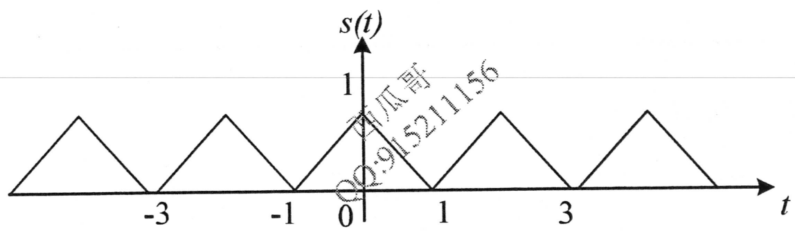

当 \(T = 1\) 时：\(s(t)\) 的图形如图所示：

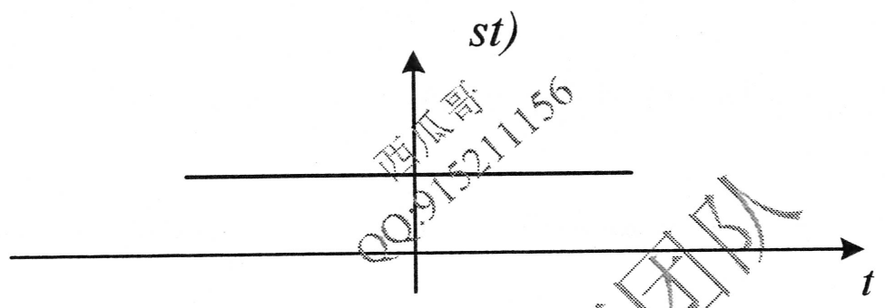

题 3 解: \(f(t) = \sin 2t \cdot \sin 4t\)

$$
\begin{array}{l} \leftrightarrow F (\omega) = \frac {1}{2 \pi} \cdot j \pi [ \delta (\omega + 2) - \delta (\omega - 2) ] ^ {*} j \pi [ \delta (\omega + 4) - \delta (\omega - 4) ] \\ = - \frac {\pi}{2} \left[ \delta (\omega + 6) - \delta (\omega - 2) - \delta (\omega + 2) + \delta (\omega - 6) \right] \\ \end{array}
$$

由图可以看出在 \(-6 \leq \omega \leq 6\) 内 \(|H(j\omega)| = k\)，\(\varphi(\omega) = -t_0\omega\)，其中 \(k\) 和 \(t_0\) 为常数所以 \(f(t)\) 通过该系统不产生失真

# 三、计算题

1.

解：

$$
r _ {z i 3} = 2 r _ {z i 1} - r _ {z i 2} = 5 e ^ {- t} u (t)
$$

由于 \(e_3(t) = \frac{de(t)}{dt}\)

输入 \(e(t)\) 时，\(r_{zs}(t) = (e^{-t} - 2e^{-2t} + 0.5e^{-3t})\mathfrak{u}(t)\)

---

输入 \(e_{3}(t) = e^{\prime}(t)\) 时，\(r_{zs3}(t) = -0.5\delta(t) + \left(-e^{-t} + 4e^{-2t} - 1.5e^{-3t}\right)u(t)\)

所以: \(r(t) = r_{zi3}(t) + r_{zi3}(t)\)

$$
= - 0. 5 \delta (t) + \left(4 e ^ {- t} + 4 e ^ {- 2 t} - 1. 5 e ^ {- 3 t}\right) u (t)
$$

2.

解:

(1)

$$
\begin{array}{l} X _ {2} (\omega) = \frac {1}{2 \pi} X (\omega) ^ {*} F [ \cos (1 0 \pi t) ] \\ = \frac {1}{2} \left[ X (\omega + 1 0 \pi) + X (\omega - 1 0 \pi) \right] \\ \end{array}
$$

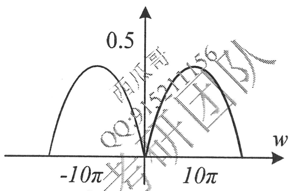

(2）

$$
G (j \omega) = X _ {2} (j \omega) H _ {1} (j \omega)
$$

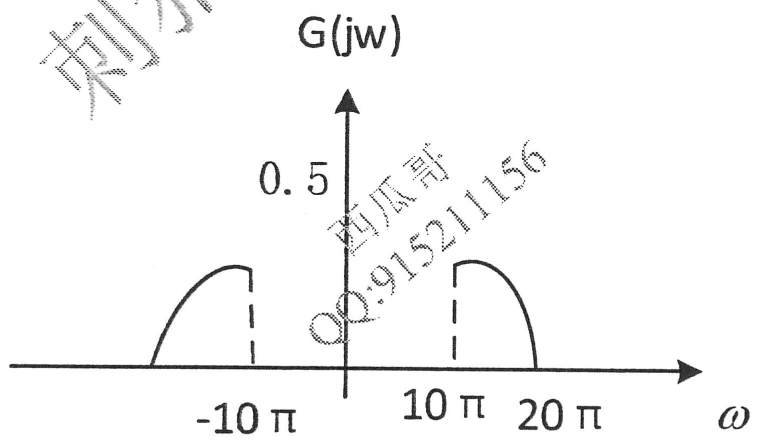

$$
\begin{array}{l} X _ {3} (\omega) = \frac {1}{2 \pi} G (\omega) ^ {*} \mathcal {F} [ \cos (\omega_ {3} t) ] \\ = \frac {1}{2 \pi} G (\omega) ^ {*} \pi \left[ \delta \left(\omega + \omega_ {3}\right) + \delta \left(\omega - \omega_ {3}\right) \right] \\ = \frac {1}{2} \left[ G \left(\omega + \omega_ {3}\right) + G \left(\omega - \omega_ {3}\right) \right] \\ \end{array}
$$

要使 \(y(t) = x(t)\) ，即 \(Y(\omega) = X(\omega)\)

即要求 \(X_{3}(\omega)\) 如下图：

---

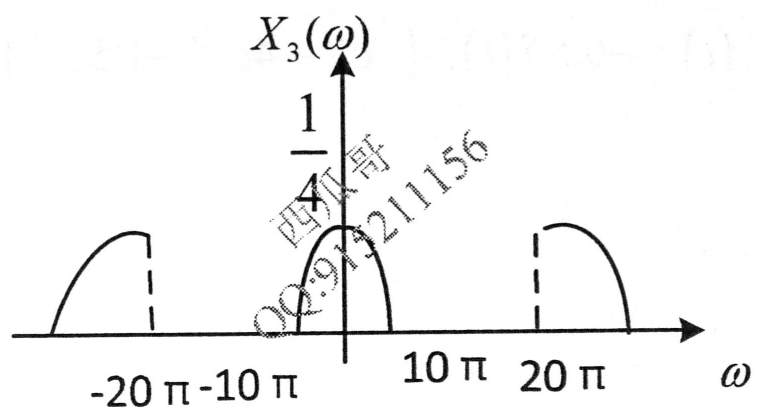

即 \(\omega_{3} = 10 \pi\)

(3)

$$
X _ {4} (\omega) = X _ {3} (\omega) \cdot H _ {2} (j \omega)
$$

$$
Y (\omega) = X _ {4} (\omega) \cdot H _ {3} (\omega)
$$

所以 \(H_{3}(j\omega) = \frac{Y(\omega)}{X_{4}(\omega)} = \frac{X(\omega)}{X_{3}(\omega)\cdot H_{2}(j\omega)} = \frac{4}{H_{2}(j\omega)} = \left\{\frac{4\omega}{\sin 5\omega},|\omega |\leq 10\pi \right.\)

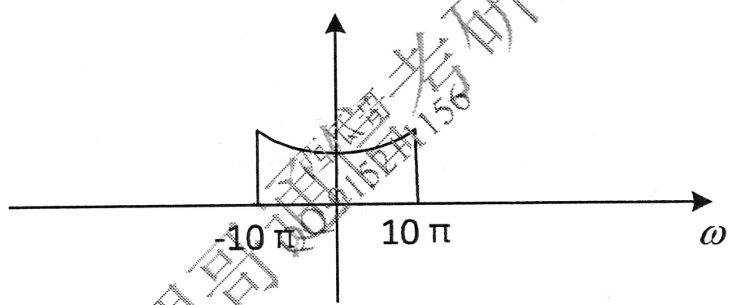

(粗略画出, 实际为不断震荡的函数图像)

3.

解：

(1) \(Y(z) - z^{-1}Y(z) - 2z^{-2}Y(z) = X(z) + 2z^{-1}X(z)\)

$$
H (z) = \frac {Y (z)}{X (z)} = \frac {z ^ {2} + 2 z}{z ^ {2} - z - 2}
$$

(2) \(\frac{H(z)}{z} = \frac{z + 2}{z^2 - z - 2} = \frac{\frac{4}{3}}{z - 2} + \frac{-\frac{1}{3}}{z + 1}\)

$$
H (z) = \frac {\frac {4}{3} z}{z - 2} + \frac {- \frac {1}{3} z}{z + 1}
$$

$$
h (n) = \frac {4}{3} 2 ^ {n} u (n) - \frac {1}{3} (- 1) ^ {n} u (n)
$$

---

(3) \(x(n) = u(n) \leftrightarrow X(z) = \frac{z}{z - 1}\)

$$
Y (z) = X (z) \cdot H (z) = \frac {\left(z ^ {2} + 2 z\right) z}{(z - 2) (z + 1) (z - 1)}
$$

$$
Y (z) = \frac {\frac {8}{3} z}{z - 2} + \frac {- \frac {1}{6} z}{z + 1} + \frac {- \frac {3}{2} z}{z - 1}
$$

$$
y (n) = \left(\frac {8}{3} 2 ^ {n} - \frac {1}{6} (- 1) ^ {n} - \frac {3}{2}\right) u (n)
$$

(4)

$$
H (z) = \frac {1 + 2 z ^ {- 1}}{1 - z ^ {- 1} - 2 z ^ {- 2}}
$$

画出其信号流图如下所示:

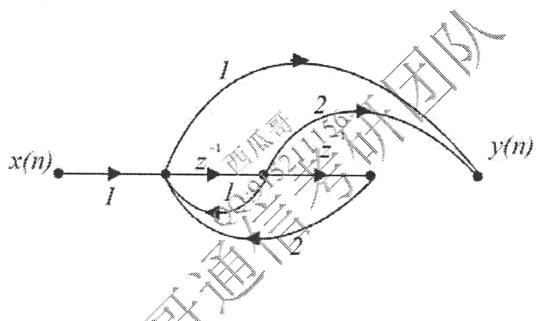

_南昌大学811信号与系…_

_扫一扫二维码，加入群。_

_西瓜_

_00-915271168_

刺猬哥

考研团队

西瓜哥原创作答

---

# 南昌大学

# 2020年招收攻读硕士研究生

# 入学考试自命题试题

科目代码及名称： 信号与系统811

适用专业： 信息与通信工程、电子信息等

(所有答案都必须写在答题纸上, 写在试卷纸上及草稿纸上无效, 考完后试题随答题纸收回)

# 一、填空题

1. \(\int_{-3}^{1} e^{-3t} \delta(t - 2) dt =\) ________；（刺猬哥考研团队，答疑交流群 709502924）

2. \(S a\left[\pi (t - 4)\right] \delta (t - 4) =\) ________；（刺猬哥考研团队，西瓜哥QQ：915211156）

3. \(x(t)\) 傅里叶级数系数为 \(a_{k}\), 若两条相邻谱线间隔为 \(\frac{\pi}{2}\), 试求其基本周期________;

4. \(F(\omega) = \operatorname{sgn}(\omega + 1) - \operatorname{sgn}(w - 1)\)，求 \(f(t)\) ______；

5. \(f(t)\) 最高频率为 \(f_{w}\), \(y(t) = f\left(\frac{t}{2}\right) f\left(\frac{t}{4}\right)\), 求最小抽样频率________;

6. \(x(t)\) 的幅频特性为 \(2\left[\delta (\omega + \pi) + \delta (\omega - \pi)\right]\), 相频为 \(e^{-j5 \omega}\), 求 \(x(t) =\)

7. \(x(t) = \cos (\omega_0 t + \theta) u(t)\), 求拉氏变换 __________;

8. \(x(t) = \delta (t + 4) - \delta (t - 2)\), 求 \(y(t) = \int_{-\infty}^{t} x(\tau) d\tau\) 的能量 ______;

9. 在输入 \(f(t)\) 的条件下, 零状态为 \(4 \frac{df(t - 2)}{dt}\), 则该冲激响应 \(h(t) =\)

---

10. 若 \(Z\) 变换收敛域 \(\left|z\right| > R_{\mathrm{x}}\), 则该序列是

11. 求 \(x(n) = (-2)^n u(-n - 1)\) 的 \(\mathbf{Z}\) 变换

12.双边 \(x(n)\) 的 \(Z\) 变换为 \(X(z)\) ，求 \(x(-n)\) 的 \(Z\) 变换

# 二、简答题

1. 已知 \( f(t) = 4 + 3\cos \left(2t + 45^o\right) - 2\cos \left(3t - 15^o\right) + \sin \left(4t + 120^o\right) \)

(1) 画出单边幅度谱和单边相位谱。

(2) 求平均功率。(西瓜哥 QQ: 915211156)

2. 单位阶跃响应 \(g(t) = \left(1 + t e^{-2 t}\right) u(t)\), 则求 \(H(s)\) 并写出微分方程。

3. 因果实信号 \(x(n)\) 的傅里叶变换是 \(X\left(e^{j\omega}\right)\), 其实部为 \(1 + 2\cos \omega - \cos 2\omega + 3\cos 3\omega\), 求 \(x(n)\). (刺猬哥考研团队, 答疑交流群 709502924)

# 四、计算题

1. 脉冲信号 \(x(t) = \left\{ \begin{array}{l} 1, |t| < 2 \\ 0, |t| > 2 \end{array} \right.\), 其中 \(\omega_0 = \frac{3}{4}\pi\), \(\omega_c = \frac{\pi}{4}\). 画出 \(y(t)\) 频谱图。并分析滤波特性,求出系统单位响应 \(h(t)\).

---

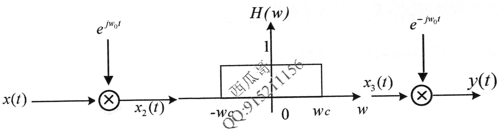

2. 某一抽样系统，输入 \(x(t) = A + B\cos \left(\frac{2\pi t}{T}\right)\)，抽样信号为 \(p(t) = \sum_{n = -\infty}^{\infty}\delta \left[t - n(T + \Delta)\right]\)，抽样后 \(g(t) = x(t)p(t)\) 通过理想低通滤波器为 \(H(\omega)\) \(\begin{cases} 1,|\omega | < \frac{1}{2(T + \Delta)}\\ 0,|\omega | > \frac{1}{2(T + \Delta)} \end{cases}\)，抽样后 \(g(t)\) 通过低通滤波器输出为 \(y(t) = kx(at)\)，且 \(T >> \Delta\) 其中 \(a < 1\)，\(k\) 为实数，求：

(1) \(g(t)\) 的傅里叶变换。

(2)为使输出达到要求，求 \(a, k\) ，并求取值范围

注：本题为郑君里第三版信号与系统 5-25 题，第二问与课本完全一致。

---

3. \(H(z) = \frac{z}{\left(z - \frac{1}{2}\right)(z - 2)(z - 3)}, \frac{1}{2} < |z| < 2\)

(1)判断因果性和稳定性

(2)单位响应 \(h(n)\)

(3)若取 \(H(z)\) 单位圆内零、极点构成一个因果系统 \(H_{1}(z)\), 写出 \(H_{1}(z)\), 并画出 \(H_{1}(z)\) 的幅频特性曲线。(刺猬哥考研团队, 答疑交流群 709502924)

---

# 2020南昌大学信号与系统811真题详解

——西瓜哥原创作答

# 一、填空题

题 1 解: 0

\(t = 2\) 不在积分区间 \((-3,1)\) 中，故结果为 0

题2解： \(\delta (t - 4)\)

\(\operatorname{Sa}\left[\pi (t - 4)\right]\delta (t - 4), t = 4\) 时, 原式 \(\operatorname{Sa}\left[\pi (t - 4)\right] = 1\)

故结果等于 \(\delta (t - 4)\) （刺猬哥考研团队，答疑交流群709502924）

题3解：4

$$
F _ {n} = \frac {1}{T _ {1}} \int_ {t _ {0}} ^ {t _ {0} + T} f (t) e ^ {- j n w _ {1} t} d t
$$

$$
\omega_ {1} = \frac {\pi}{2}, \quad T = \frac {2 \pi}{\omega_ {1}} = 4
$$

题 4 解:

$$
\begin{array}{l} F (\omega) = \operatorname {s g n} (\omega + 1) - \operatorname {s g n} (w - 1) \\ = S g n (\omega) ^ {*} \left[ \delta (\omega + 1) - \delta (\omega - 1) \right] \\ \end{array}
$$

又因为 \( Sgn(t) \leftrightarrow \frac{2}{j\omega} \) （傅里叶变换）

有 \(\frac{2}{jt} \leftrightarrow 2\pi \operatorname{sgn}(-\omega)\)

$$
\operatorname {s g n} (\omega) = - \frac {1}{j \pi t}
$$

所以： \(F\big[\big(f(t)\big)\big]\) （代表f（t）的傅里叶变换）=Sgn（ω）*[δ（ω+1)-δ（ω-1)]

---

24最强信号辅导班招生啦！让你节省时间，不走弯路，取得佳绩！联系西瓜哥qq915211156 加Q群709502924，使用刺猬哥团队正版核心序列ORK，享受高质量全天候优质答疑指导

$$
\begin{array}{l} = 2 \pi \cdot \frac {1}{- j \pi t} \cdot \frac {1}{j \pi} \cdot \sin t \\ = \frac {2}{\pi t} \sin t \\ \end{array}
$$

题 5 解: \(\frac{3}{2} f_{m}\)

总结：若 \(f(t)\) 的最高频率为 \(f\)

1) \(f(at)\) 的最高频率为 \(af\)

2) \(f^{n}(t)\) 最高频率为 \(n f\)

若 \(f_{1}(t)\) 的最高频率为 \(f_{1}, f_{2}(t)\) 的最高频率为 \(f_{2}\), 那么:

1) \(f_{1}(t) + f_{2}(t)\) 的最高频率为 \(f_{1}\) 和 \(f_{2}\) 中较大的一个,

2) \(f_{1}(t) \cdot f_{2}(t)\) 的最高频率为二者之和

3) \(f_{1}(t)^{*}f_{2}(t)\) 的最高频率为二者中较小的那个

低通最小抽样频率 \(= 2\) 倍最高频率

题6解： \(\left|X(\omega)\right| = 2\left[\delta (\omega +\pi) + \delta (\omega -\pi)\right],\varphi (\omega) = e^{-j5\omega}\)

$$
X (\omega) = 2 \left[ \delta (\omega + \pi) + \delta (\omega - \pi) \right] \varphi (\omega)
$$

$$
x (t) = \frac {2}{\pi} \cos [ \pi (t - 5) ] = - \frac {2}{\pi} \cos (\pi t)
$$

题 7 解: \(x(t) = \cos \omega_0 t \cos \theta - \sin \omega_0 t \sin \theta\)

拉氏变换得到: \(\frac{s \cos \theta - \omega_{0} \sin \theta}{s^{2} + \omega_{0}^{2}}\) (刺猬哥考研团队, 西瓜哥 QQ:915211156)

---

题8解： \(y(t) = \int_{-\infty}^{t}[\delta (\tau +4) - \delta (\tau -2)]d\tau = u(t + 4) - u(t - 2)\)

$$
E = \lim  _ {\alpha \rightarrow \infty} \int_ {- \alpha} ^ {\alpha} | y (t) | ^ {2} d t = 6 J
$$

题9解： \(4\frac{d\delta(t - 2)}{dt}\)

题 10 解: 因果序列

题11解： \(X(z) = \sum_{n = -\infty}^{-1}(-2)^{n}z^{-n}\)

$$
\begin{array}{l} = \sum_ {n = 1} ^ {\infty} (- 2) ^ {n} z ^ {n} \\ = \sum_ {n = 0} ^ {\infty} (- 2) ^ {n} z ^ {n} - 1 \\ = \frac {2}{z + 2} - 1 \\ = \frac {- z}{z + 2} \\ \end{array}
$$

题12解： \(X(z) = \sum_{n = -\infty}^{\infty}x(n)z^{-n}\)

$$
= \sum_ {n = - \infty} ^ {\infty} x (- n) z ^ {- n}
$$

令-n=k，得到： \(\sum_{k = -\infty}^{\infty}x(k)z^{k}\)

$$
= \sum_ {k = - \infty} ^ {\infty} x (k) (z ^ {- 1}) ^ {k}
$$

---

$$
= X \left(z ^ {- 1}\right)
$$

# 二、简答题

题1解：

(1) \(f(t) = 4 + 3 \cos \left(2 t + 45^{o}\right) - 2 \cos \left(3 t - 15^{o}\right) + \sin \left(4 t + 120^{o}\right)\)

$$
= 4 + 3 \cos (2 t + 4 5 ^ {o}) + 2 \cos (3 t + 1 6 5 ^ {o}) + \cos (4 t + 3 0 ^ {o})
$$

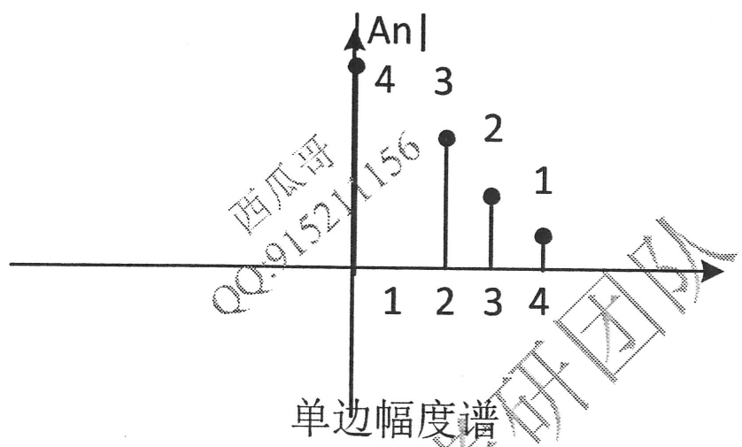

Ps: 此类题型要化为标准式, 符号要统一化为 “+” 和函数化为 \(\cos\) 函数

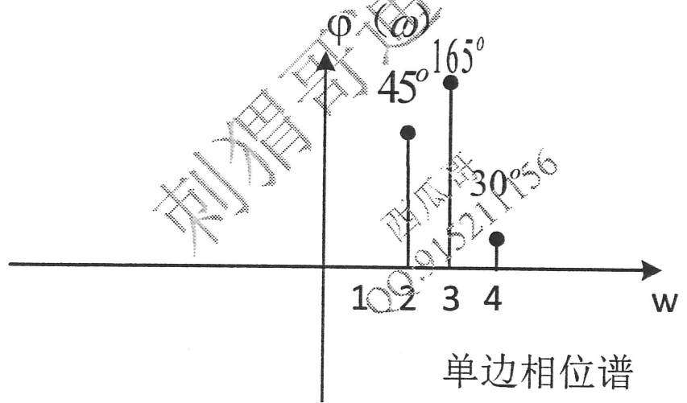

(2)

解：

$$
\begin{array}{l} P = \overline {{f (t) ^ {2}}} = \frac {1}{T _ {1}} \int_ {t _ {0}} ^ {t _ {0} + T _ {1}} f (t) ^ {2} d t \\ = a _ {0} ^ {2} + \frac {1}{2} \sum_ {n = 1} ^ {\infty} \left(a _ {n} ^ {2} + b _ {n} ^ {2}\right) \\ \end{array}
$$

---

$$
\begin{array}{l} = c _ {0} ^ {2} + \frac {1}{2} \sum_ {n = 1} ^ {\infty} c _ {n} ^ {2} \\ = 1 6 + \frac {1}{2} (9 + 4 + 1) \\ = 2 3 \\ \end{array}
$$

题2解：

$$
h (t) = \frac {d g (t)}{d t} = \delta (t) + \left(e ^ {- 2 t} - 2 t e ^ {- 2 t}\right) u (t)
$$

所以经拉氏变换得到:

$$
\begin{array}{l} H (s) = 1 + \frac {1}{s + 2} - \frac {2}{(s + 2) ^ {2}} = \frac {s ^ {2} + 5 s + 4}{(s + 2) ^ {2}} = \frac {Y (s)}{E (s)} \\ s ^ {2} Y (s) + 4 s Y (s) + 4 Y (S) = s ^ {2} E (s) + 5 s E (s) + 4 E (s) \\ \end{array}
$$

再经逆变换得到: \(y''(t) + 4y'(t) + 4y(t) = e''(t) + 5e'(t) + 4e(t)\)

(西瓜哥 QQ:915211156)

题3解：

$$
x (z) = \sum_ {n = - \infty} ^ {\infty} x (n) z ^ {- n}
$$

$$
\begin{array}{l} X \left(e ^ {j \omega}\right) = \sum_ {n = - \infty} ^ {\infty} x (n) e ^ {- j n \omega} \\ = \sum_ {n = - \infty} ^ {\infty} x (n) \left[ \cos (n \omega) - j \sin (n \omega) \right] \\ \end{array}
$$

又因为： \(Re\left\{X\left(e^{j\omega}\right)\right\} = \sum_{n = -\infty}^{\infty}x(n)\cos (n\omega)\)

$$
= 1 + 2 \cos \omega - \cos 2 \omega + 3 \cos 3 \omega
$$

所以： \(x(n) = \{1,2, - 1,3\}\) n=0

---

# 三、计算题

题1解： \(x(t) = u(t + 2) - u(t - 2) = g_4(t)\)

$$
F [ x (t) ] = X (\omega) = 4 S a (2 \omega)
$$

$$
x _ {2} (t) = x (t) e ^ {j w _ {0} t}
$$

$$
X _ {2} (\omega) = 4 S a \left[ 2 \left(\omega - \omega_ {0}\right) \right]
$$

$$
X _ {3} (\omega) = 4 S a \left[ 2 \left(\omega - \omega_ {0}\right) \right] \cdot g _ {2 \omega_ {c}} (\omega), \quad y (t) = x _ {3} (t) e ^ {- j \omega_ {0} t}
$$

$$
\begin{array}{l} Y (\omega) = X _ {3} (\omega + \omega_ {0}) \\ = 4 S a (2 \omega) \cdot g _ {2 \omega_ {c}} (\omega + \omega_ {0}) \\ \end{array}
$$

所以: \(H(j \omega) = g_{2 \omega_c}(\omega + \omega_0) = g_{\frac{\pi}{2}}\left(\omega + \frac{3}{4} \pi\right)\), 即为带通滤波器

所以： \(h(t) = \frac{1}{4} S a\left(\frac{\pi}{4} t\right)e^{-j\frac{3}{4}\pi t}\)

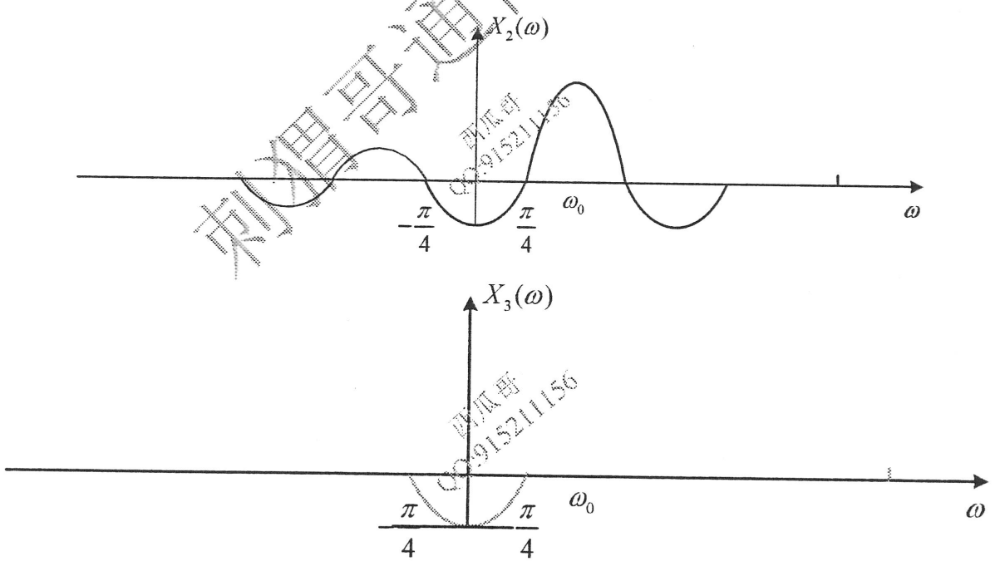

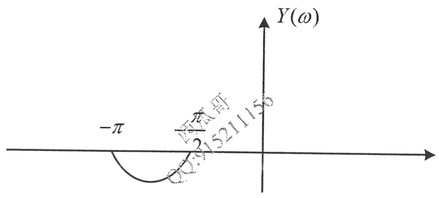

---

题2解：(1)

$$
\begin{array}{l} X (\omega) = \mathcal {F} [ x (t) ] = 2 \pi \mathrm {A} \delta (w) + \pi \mathrm {B} \left[ \delta \left(w + \frac {2 \pi}{T}\right) + \delta \left(w - \frac {2 \pi}{T}\right) \right] \\ p (t) = \sum_ {n = - \infty} ^ {\infty} \delta [ t - n (T + \Delta) ] P (\omega) = \mathcal {F} [ p (t) ] = \frac {2 \pi}{T + \Delta} \sum_ {n = - \infty} ^ {\infty} \delta \left(w - \frac {2 \pi n}{T + \Delta}\right) \\ \end{array}
$$

采样时域相乘, 频域相卷, 所以有: \(G(\omega) = \frac{1}{2\pi} X(\omega)^{*} P(\omega)\)

$$
\begin{array}{l} = \frac {1}{2 \pi} \left[ 2 \pi A \delta (w) + \pi B \left[ \delta \left(w + \frac {2 \pi}{T}\right) + \delta \left(w - \frac {2 \pi}{T}\right) \right] * \frac {2 \pi}{T + \Delta} \sum_ {n = - \infty} ^ {\infty} \delta \left(w - \frac {2 \pi n}{T + \Delta}\right) \right. \\ = \frac {2 \pi A}{T + \Delta} \sum_ {n = - \infty} ^ {\infty} \delta \left(w - \frac {2 \pi n}{T + \Delta}\right) + \frac {B \pi}{T + \Delta} \sum_ {n = - \infty} ^ {\infty} \delta \left(w + \frac {2 \pi}{T} - \frac {2 \pi n}{T + \Delta}\right) + \frac {B \pi}{T + \Delta} \sum_ {n = - \infty} ^ {\infty} \delta \left(w - \frac {2 \pi}{T} - \frac {2 \pi n}{T + \Delta}\right) \\ \end{array}
$$

(2)

由第一问中计算的铺垫, 第二问我们开始从频谱图对信号进行分析, 为了方便, 我们定义 \(w_{s} = \frac{2 \pi}{T + \Delta}\), 且由题意已知 \(T >> \Delta\), 那么就有以下的关系:

\(\frac{2 \pi}{T} > w_{s}\) 且 \(\frac{2 \pi}{T} \approx w_{s}\) (此题注意采样频率和旁瓣十分接近)

为了区分我们画出原信号以及冲激采样后的信号频谱如下两图所示:

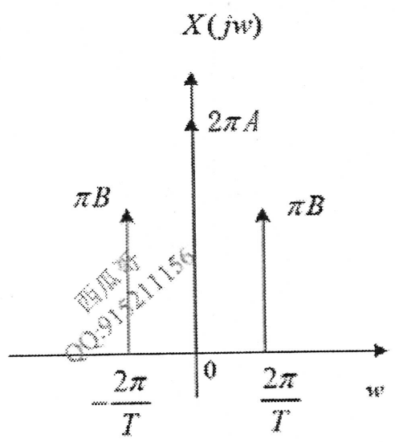

---

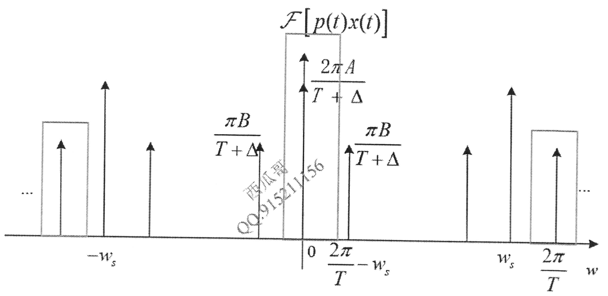

此时采样后的频谱序列中基波部分并不是原来的输入信号的基波了, 此题采样频率和原始信号边带频率十分接近, 导致一个周期内的频谱图像的横坐标做了压缩变换(和原来的基波不尽相同), 图中红框部分是原来对应的基波范围点。

根据题意，采样后的信号要送进低通滤波器，而此时采样后的信号有多个频率分量，但是加低通滤波器好像也恢复不出原来的信号了，因为对应的基波不同了，但是此题很巧妙，它题目问的是要使得输出为 \( y(t) = kx(at) \)，这就允许我们得到对频域尺度变换的结果，再根据式子得到几个系数的取值。

我们首先来确定滤波器的范围，由上述分析可知有：

$$
\frac {2 \pi}{T} - w _ {s} <   \frac {1}{2 (T + \Delta)} <   - \frac {2 \pi}{T} + 2 w _ {s}
$$

解得: \(\Delta < \frac{T}{4 \pi}\)

在满足滤波器条件的情况下，我们得到的是一个经过尺度变换的频域表达式，所以这里我们要确定变换的比例以及对幅度的影响来确定另外两个变量的值。

我们写出此时输出信号的频域表达式为:

$$
Y (\omega) = \frac {2 \pi \mathrm {A}}{T + \Delta} \delta (w) + \frac {\pi \mathrm {B}}{T + \Delta} \bigg [ \delta \bigg (w + \frac {2 \pi \Delta}{T (T + \Delta)} \bigg) + \delta \bigg (w - \frac {2 \pi \Delta}{T (T + \Delta)} \bigg) \bigg ]
$$

其中: \(\frac{2 \pi}{T} - w_{s} = \frac{2 \pi \Delta}{T (T + \Delta)}\)

---

傅里叶逆变换可以得到 \(y(t) = \frac{1}{T + \Delta}\left[A + B\cos \left(\frac{2\pi}{T}\frac{\Delta}{(T + \Delta)} t\right)\right]\)

所以 \(k = \frac{1}{(T + \Delta)}, a = \frac{\Delta}{(T + \Delta)}\)

(注: 此题难度★★★☆☆, 西瓜哥原创小结: 中等题, 近些年来常考, 输入信号通过冲激串采样再经过低通滤波器恢复原信号, 处理这类题的关键就在于正确处理冲激串的傅里叶变换, 将时域上的相乘转换到频域上的卷积延拓, 但是本题的采样频率是一个小坑之处, 一下没注意容易陷入一个死胡同之中, 要看清题目, 冷静作答。)

题3解：

(1)

极点 \(p_1 = \frac{1}{2},\quad p_2 = 2,\quad p_3 = 3\) ，且 \(\frac{1}{2} < |z| < 2\)

所以该系统为非因果稳定系统

(2)

设 \(\frac{H(z)}{z} = \frac{A}{z - \frac{1}{2}} +\frac{B}{z - 2} +\frac{C}{z - 3}\)

可得 \(A = \frac{4}{15}, B = \frac{2}{3}, C = \frac{2}{5}\)

于是 \(H(z) = \frac{\frac{4}{15}z}{z - \frac{1}{2}} +\frac{-\frac{2}{3}z}{z - 2} +\frac{\frac{2}{5}z}{z - 3}\)

即 \(h(n) = \frac{4}{15}\left(\frac{1}{2}\right)^n u(n) + \frac{2}{3} 2^n u(-n - 1) - \frac{2}{5} 3^n u(-n - 1)\)

(3)

$$
H _ {1} (z) = \frac {H _ {0} Z}{Z - \frac {1}{2}}
$$

---

$$
H _ {1} \left(e ^ {j \omega}\right) = \frac {H _ {0} e ^ {j \omega}}{e ^ {j \omega} - \frac {1}{2}} = \left| H _ {1} \left(e ^ {j \omega}\right) \right| e ^ {j \varphi (\omega)} = \frac {A}{B} e ^ {j (\theta - \varphi)}
$$

当 \(w = 0\) 时, \(\left|H_{1}\left(e^{j \omega}\right)\right| = 2 H_{0}\)

当 \( w = \pi \) 时，\(|H_1(e^{j\omega})| = \frac{2}{3} H_0\)

如图:

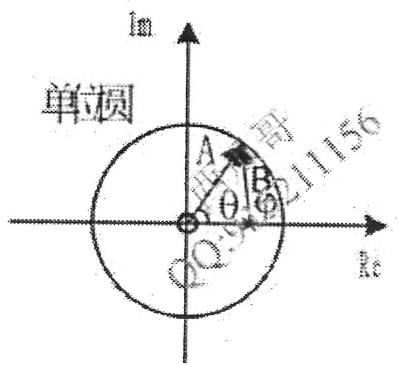

其中幅频特性曲线如图所示：

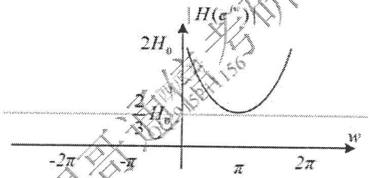

（刺猬哥考研团队，答疑交流群709502924）

---

# 南昌大学

# 2021年招收攻读硕士研究生

# 入学考试自命题试题

科目代码及名称： 信号与系统811

适用专业： 信息与通信工程、电子信息等

(所有答案都必须写在答题纸上, 写在试卷纸上及草稿纸上无效, 考完后试题随答题纸收回)

一、填空题（每小题3分，共30分）

1. 冲激响应 \(h(t) = \frac{3}{2} \left(e^{-2t} + e^{-4t}\right) u(t)\), 求微分方程

2. \(\int_{-\infty}^{+\infty}\frac{\sin\pi t}{t}\delta(t)\mathrm{d}t =\) （刺猬哥考研团队，西瓜哥QQ:915211156）

3. \(f(t) = e^{-(2 + j2)t}u(t), F(j\omega) = \underline{\quad};\)

4. \(F(j\omega) = 2\cos 3\omega, f(t) = \_\)

5. \(\int_{-\infty}^{+\infty}\left(3 - t^2\right)\left[\delta \left(\frac{t}{2} -1\right) + \delta '(t - 1)\right]dt = \underline{\quad};\)

6. \(f(t) = 2t\frac{d}{dt}\left[\sin \left(2t - \frac{\pi}{6}\right)\delta (t)\right]\) 的傅里叶变换

7. 卷积和 \(u(n + 1)^{*}\left[u(n - 2) + \delta (n - 1)\right] =\)

8. 有限频带信号 \(f(t)\) 最高频率 \(f_{m} H z\), 若对 \(f_{1}(t) = f(4 t) f^{2}(t)\) 时域采样, 使频谱不发生混叠的奈奎斯特频率是 ; (刺猬哥考研团队, 答疑交流群 709502924)

9. \(F(j\omega) = \left[\mathrm{u}(\omega) - \mathrm{u}(\omega -2)\right]e^{-j2\omega},f(t) = \underline{\quad};\)

10. \(y^{\prime}(t) + 3y^{\prime}(t) + 2y(t) = f(t) + f^{\prime}(t),f(t) = e^{-t}u(t),y(0_{-}) = 2,y^{\prime}(0^{+}) = 3,y^{\prime}(0_{-}) =\)

---

24最强信号辅导班招生啦！让你节省时间，不走弯路，取得佳绩！联系西瓜哥qq915211156加Q群709502924，使用刺猬哥团队正版核心序列ORK，享受高质量全天候优质答疑指导

;

11. \(x(n) = \left(\frac{1}{2}\right)^n u(-n)\); \(x(n)\) 的 \(z\) 变换和收敛域 _______；

12. \(F(n)\) 的 \(z\) 变换 \(F(z) = \frac{z^2}{(z + 1)(z - 2)}\), \(f(n)\) 是因果序列, 其 \(f(n)\) 序列为

# 二、计算题

1. 如下图所示:

(1)求 \(H(z)\)

(2)描述其差分方程

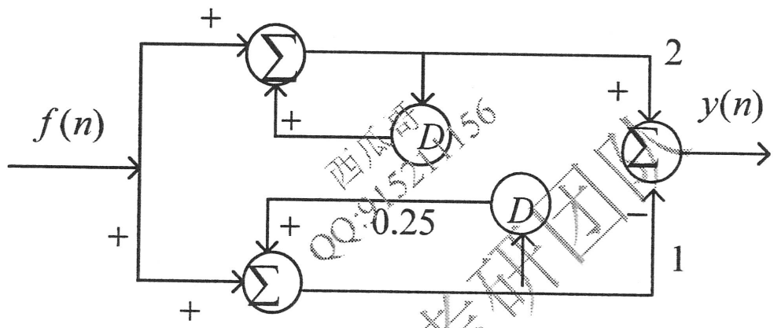

2. \(f(t) = 3 + \sin (5t + \frac{\pi}{6}) - 2\cos \left(8t - \frac{2\pi}{3}\right)\)

(1) 画出单边幅度谱图, 相位谱图

(2) 计算功率（刺猬哥考研团队，答疑交流群 709502924）

3. \(H(s) = \frac{Y(s)}{E(s)} = 2\), \(H_{1}(s) = \frac{1}{s + 3}\)

(1) 求子系统 \(H_{2}(s)\)

(2) 使 \(H_{2}(s)\) 稳定, 求 \(\mathrm{k}\) 范围

---

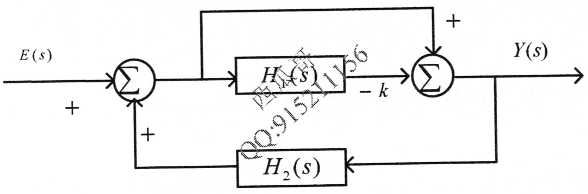

4. \(y(n) - \frac{3}{4} y(n - 1) + \frac{1}{8} y(n - 2) = f(n) + \frac{2}{3} f(n - 1)\)

(1) 求 \(H(z)\)

(2) 求单位序列响应

5. \(H(s) = \frac{s + 1}{s^2 + 5s + 6}, y(0_{-}) = y'(0_{-}) = 1\) ，初始状态为0

(1) 求零输入响应 \(y_{zi}(t)\) (刺猬哥考研团队, 西瓜哥 QQ: 915211156)

(2) 输入信号 \(f(t) = 5 \cos t u(t)\), 求零状态响应和稳态响应

6. 写出以 \(x_{1}(\mathrm{n})\), \(x_{2}(\mathrm{n})\), \(x_{3}(\mathrm{n})\) 为状态变量的状态方程和输出方程

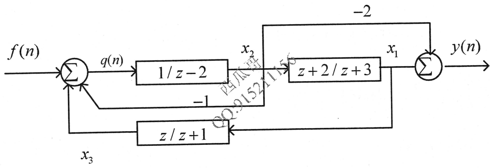

---

# 2021南昌大学信号与系统811真题详解

——西瓜哥原创作答

# 一、填空题

题 1 解: \(h(t) = \frac{3}{2} \left(e^{-2t} + e^{-4t}\right) u(t)\)

$$
H (s) = \frac {3}{2} \left(\frac {1}{s + 2} + \frac {1}{s + 4}\right) = \frac {3 s + 9}{s ^ {2} + 6 s + 8}
$$

微分方程为: \(y''(t) + 6y'(t) + 8y(t) = 3f'(t) + 9f(t)\)

题2解： \(\int_{-\infty}^{\infty}\frac{\sin\pi t}{t}\delta (t)dt = \int_{-\infty}^{\infty}\pi \frac{\sin\pi t}{\pi t}\delta (t)dt = \int_{-\infty}^{\infty}\pi \delta (t)dt = \pi\)

题3解： \(f(t) = e^{-(2 + 2j)t}u(t) = e^{-2t}\times e^{-2jt}u(t)\)

$$
e ^ {- 2 t} u (t) \leftrightarrow \frac {1}{2 + j \omega}, f (t \pm t _ {0}) \leftrightarrow e ^ {\pm j \omega t _ {0}} F (j \omega)
$$

$$
f (t) e ^ {\pm j \omega_ {0} t} \leftrightarrow F [ j (\omega \mp \omega_ {0}) ]
$$

所以原式 \(F(j\omega) = \frac{1}{2 + j(\omega + 2)}\)

题4解： \(\cos 3t\leftrightarrow \pi \Big[\delta (\omega +3) + \delta (\omega -3)\Big]\)

对称性得: \(\pi \left[\delta (t + 3) + \delta (t - 3)\right] \leftrightarrow 2\pi \cos (-3\omega) = 2\pi \cos 3\omega\)

$$
\delta (t + 3) + \delta (t - 3) \leftrightarrow 2 \cos 3 \omega
$$

所以原式: \(f(t) = \delta (t + 3) + \delta (t - 3)\)

题5解： \(f(t)\delta '(t - t_0) = f(t_0)\delta '(t - t_0) - f'(t_0)\delta (t - t_0)\)

---

$$
\begin{array}{l} \delta \left(\frac {t}{2} - 1\right) + \delta^ {\prime} (t - 1) = 2 \delta (t - 2) + \delta^ {\prime} (t - 1) \\ \left(3 - t ^ {2}\right) \delta \left(\frac {t}{2} - 1\right) = 2 \left(3 - t ^ {2}\right) \delta (t - 2) = - 2 \delta (t - 2) \\ \end{array}
$$

即原式 \(= \int_{-\infty}^{\infty}\left[-2\delta (t - 2) + 2\delta '(t - 1) + 2\delta (t - 1)\right]dt = 0\)

(刺猬哥考研团队, 答疑交流群 709502924)

题6解：1

$$
\begin{array}{l} f (t) = 2 t \frac {d}{d t} \left[ \sin \left(2 t - \frac {\pi}{6}\right) \delta (t) \right] \\ \sin (2 t - \frac {\pi}{6}) \delta (t) = - \frac {1}{2} \delta (t), f (t) = 2 t \frac {d}{d t} \left[ - \frac {1}{2} \delta (t) \right] = - t \delta^ {\prime} (t) \\ \delta^ {\prime} (t) = j \omega \quad (- j t) f (t) \leftrightarrow \frac {d F (j \omega)}{d \omega} \\ \end{array}
$$

所以： \(\left(-j t\right) \delta^{\prime}\left(t\right) \leftrightarrow \frac{d j \omega}{d \omega} = j\)

即 \(-t\delta^{\prime}(t)\leftrightarrow 1\)

所以: \(f(t) = 2t\frac{d}{dt}\left[\sin \left(2t - \frac{\pi}{6}\right)\delta (t)\right]\) 的傅里叶变换为1

题7解： \(u(n + 1)^{*}\bigl [u(n - 2) + \delta (n - 1)\bigr ] = u(n + 1)^{*}u(n - 2) + u(n)\)

$$
\begin{array}{l} \frac {z}{z - 1} z ^ {- 2} \cdot \frac {z}{z - 1} z = \frac {z}{(z - 1) ^ {2}} \\ \frac {z}{(z - 1) ^ {2}} \leftrightarrow n u (n) \\ \end{array}
$$

即原式 \(= (n + 1) u(n)\) （刺猬哥考研团队，西瓜哥QQ：915211156）

题8解： \(12f_{m}\)

---

$$
f (4 t) f ^ {2} (t) \rightarrow \text {奈 奎 斯 特 频 率} = 2 \left(2 f _ {m} + 4 f _ {m}\right) = 1 2 f _ {m}
$$

总结：若 \(f(t)\) 的最高频率为 \(f\)

1) \(f(at)\) 的最高频率为 \(af\)

(2) \(f^{n}(t)\) 最高频率为 \(n f\)

若 \(f_{1}(t)\) 的最高频率为 \(f_{1}, f_{2}(t)\) 的最高频率为 \(f_{2}\), 那么:

1) \(f_{1}(t) + f_{2}(t)\) 的最高频率为 \(f_{1}\) 和 \(f_{2}\) 中较大的一个

2) \(f_{1}(t) \cdot f_{2}(t)\) 的最高频率为二者之和

3) \(f_{1}(t)^{*} f_{2}(t)\) 的最高频率为二者中较小的那个

低通最小抽样频率 \(= 2\) 倍最高频率

(注: 此题难度★★☆☆☆, 西瓜哥原创小结: 本题考察抽样频率相关内容, 具体总结可参看上述解析中。)

题 9 解: \(u(\omega) - u(\omega - 2) = g_2(\omega - 1), F(j\omega) = g_2(\omega - 1)e^{-j2\omega}\)

\(g_{2}(t) \leftrightarrow \alpha S a(\omega)\), 对称性得: \(2 S a(t) \leftrightarrow 2 \pi g_{2}(-\omega) = 2 \pi g_{2}(\omega)\)

$$
g _ {2} (\omega) \leftrightarrow \frac {1}{\pi} S a (t), \quad g _ {2} (\omega - 1) \leftrightarrow \frac {1}{\pi} S a (t) e ^ {j t}
$$

即 \(f(t) = \frac{1}{\pi} S a(t - 2)e^{j(t - 2)}\)

题 10 解: \(f(t) = e^{-t} u(t), f'(t) = -e^{-t} u(t) + \delta(t)\)

利用冲激函数匹配法: \(y''(t) + 3y'(t) + 2y(t) = \delta(t)\)

$$
\left\{\begin{array}{l}y ^ {\prime} \left(0 _ {+}\right) - y ^ {\prime} \left(0 _ {-}\right) = 1\\y \left(0 _ {+}\right) - y \left(0 _ {-}\right) = 0\end{array}\rightarrow \left\{\begin{array}{l}y ^ {\prime} \left(0 _ {-}\right) = 2\\y \left(0 _ {-}\right) = 2\end{array}\right.\right.
$$

题11解： \(x(n) = 2^{-n}u(-n)\)

$$
2 ^ {n} u (n) \leftrightarrow \frac {2}{z - 2}
$$

---

$$
X (z) = \frac {z ^ {- 1}}{z ^ {- 1} - 2} = \frac {1}{1 - 2 z} \quad | z | <   \frac {1}{2}
$$

题12解： \(F(z) = \frac{z^2}{(z + 1)(z - 2)},\frac{F(z)}{z} = \frac{z}{(z + 1)(z - 2)} = \frac{\frac{1}{3}}{z + 1} +\frac{\frac{2}{3}}{z - 2}\)

$$
F (z) = \frac {\frac {1}{3} z}{z + 1} + \frac {\frac {2}{3} z}{z - 2},
$$

\( f(n) = \left[\frac{1}{3} (-1)^n + \frac{2}{3} 2^n\right] u(n), |z| > 2 \) （刺猬哥考研团队，答疑交流群709502924）

# 二、计算题

题 1 解:

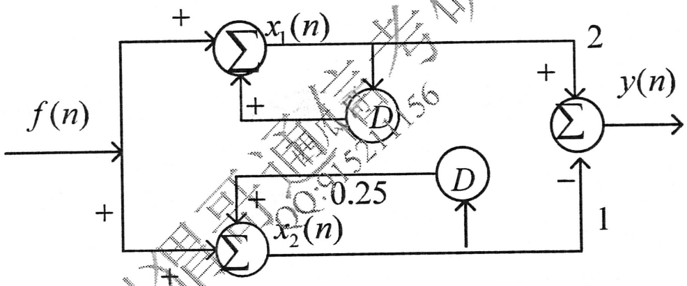

因为 \(\left\{ \begin{array}{l}x_{1}(n - 1) + f(n) = x_{1}(n)\\ 0.25x_{2}(n - 1) + f(n) = x_{2}(n) \end{array} \right.\)

$$
\begin{array}{l} 2 x _ {1} (n) - x _ {2} (n) = y (n) \\ \left\{ \begin{array}{c} z ^ {- 1} x _ {1} (z) + F (z) = x _ {1} (z) \\ 0. 2 5 z ^ {- 1} x _ {2} (z) + F (z) = x _ {2} (z) \end{array} \right. \\ 2 x _ {1} (z) - x _ {2} (z) = Y (z) \\ \end{array}
$$

---

$$
2 \frac {F (z)}{1 - z ^ {- 1}} - \frac {F (z)}{1 - 0 . 2 5 z ^ {- 1}} = Y (z)
$$

$$
H (z) = \frac {Y (z)}{F (z)} = \frac {1 + 0 . 5 z ^ {- 1}}{1 - 0 . 2 5 z ^ {- 1} + 0 . 2 5 z ^ {- 2}}
$$

差分方程为: \(y(n) - 1.25y(n - 1) + 0.25y(n - 2) = f(n) + 0.5f(n - 1)\)

题 2 解: \(f(t) = 3 + \sin \left(5 t + \frac{\pi}{6}\right) - 2 \cos \left(8 t - \frac{2}{3} \pi\right)\)

$$
= 3 + \cos \left(5 t - \frac {\pi}{3}\right) + 2 \cos \left(8 t + \frac {1}{3} \pi\right)
$$

单边幅度谱和相位谱如下所示:

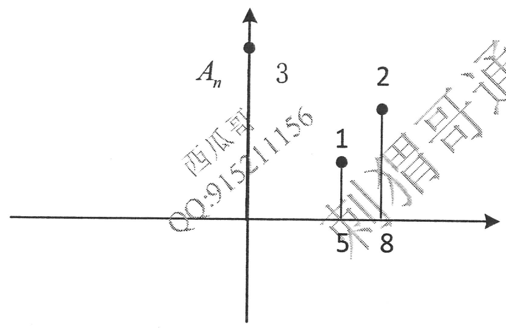

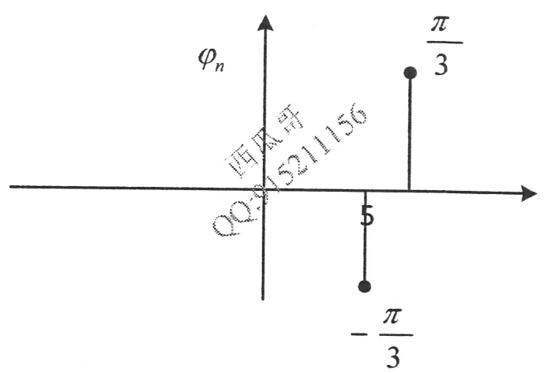

(2) \(P = \left(A_{0}\right)^{2} + \sum_{n=1}^{\infty} \frac{A_{n}^{2}}{2} = 9 + \frac{1}{2}\left(1 + 2^{2}\right) = \frac{23}{2}\)

题3解：（1）

$$
\left\{ \begin{array}{l} X (s) H (s) (- k) + X (s) = Y (s) \\ E (s) + Y (s) H _ {2} (s) = X (s) \end{array} \right.
$$

---

$$
\begin{array}{l} \left[ E (s) + Y (s) H _ {2} (s) \right] \cdot \left(1 - k H _ {2} (s)\right) = Y (s) \\ \frac {Y (s)}{E (s)} = H (s) = \frac {1}{\frac {1}{1 - k H _ {1} (s)} - H _ {2} (s)} = 2 \\ H _ {2} (s) = \frac {1}{1 - k H _ {1} (s)} - \frac {1}{2} = \frac {1}{1 - \frac {k}{s + 3}} - \frac {1}{2} = \frac {s + 3 + k}{2 (s + 3 - k)} \\ \end{array}
$$

(2) \(3 - k > 0\), 即 \(k < 3\)

题 4 解:

$$
\begin{array}{l} y (n) - \frac {3}{4} y (n - 1) + \frac {1}{8} y (n - 2) = f (n) + \frac {2}{3} f (n - 1) \\ H (z) = \frac {1 + \frac {2}{3} z ^ {- 1}}{1 - \frac {3}{4} z ^ {- 1} + \frac {1}{8} z ^ {- 2}} = \frac {z ^ {2} + \frac {2}{3} z}{z ^ {2} - \frac {3}{4} z + \frac {1}{8}} \\ \frac {H (z)}{z} = \frac {z + \frac {2}{3}}{\left(z - \frac {1}{2}\right) \left(z - \frac {1}{4}\right)} = \frac {\frac {1 4}{3}}{z - \frac {1}{2}} - \frac {\frac {1 1}{3}}{z - \frac {1}{4}} \tag {2} \\ h (n) = \left[ \frac {1 4}{3} \left(\frac {1}{2}\right) ^ {n} - \frac {1 1}{3} \left(\frac {1}{4}\right) ^ {n} \right] u (n) \\ \end{array}
$$

题 5 解:

\(H(s) = \frac{s + 1}{s^2 + 5s + 6}\)，微分方程为： \(y''(t) + 5y'(t) + 6y(t) = f(t) + f'(t)\)

---

(1) \(y_{zi}(t) = C_1 e^{-2t} + C_2 e^{-3t}, y(0_-) = y'(0_+) = 1\)

所以: \(\left\{ \begin{array}{l} C_{1} + C_{2} = 1 \\ -2C_{1} - 3C_{2} = 1 \end{array} \right. \rightarrow \left\{ \begin{array}{l} C_{1} = 4 \\ C_{2} = -3 \end{array} \right.\)

于是: \(y_{zi}(t) = (4e^{-2t} - 3e^{-3t})u(t)\)

(2) \(f(t) = 5 \cos t u(t), F(s) = \frac{5 s}{s^{2} + 1}\)

$$
\begin{array}{l} Y _ {z s} (s) = H (s) F (s) = \frac {(s + 1) 5 s}{(s ^ {2} + 1) (s ^ {2} + 5 s + 6)} = \frac {(s + 1) 5 s}{(s ^ {2} + 1) (s + 2) (s + 3)} \\ = \frac {2}{s + 2} - \frac {3}{s + 3} + \frac {s}{s ^ {2} + 1} \\ \end{array}
$$

即： \(y_{zs}(t) = (2e^{-2t} - 3e^{-3t} + cost)u(t)\)

稳态响应：costu(t)

(刺猬哥考研团队, 西瓜哥 QQ: 915211156)

题6解：

设五端加法器输出为 \(q(n)\)

$$
q (n) = f (n) + x _ {3} (n) - x _ {2} (n) \text {、 且} \frac {X _ {2} (z)}{Q (z)} = \frac {1}{z - 2}
$$

$$
(z - 2) x _ {2} (z) = Q (z)
$$

即：\(\dot{x}_{2}(n) - 2x_{2}(n) = q(n) = f(n) + x_{3}(n) - x_{2}(n)\)

---

整理得： \(\dot{x}_2(n) = q(n) = f(n) + x_3(n) + x_2(n)\) (1）

同理: \(\frac{X_{3}(z)}{X_{1}(z)} = \frac{z}{z + 1}\), 得: \(\dot{x}_{3}(n) + x_{3}(n) = \dot{x}_{1}(n)\) (2)

\(\frac{X_{1}(z)}{X_{2}(z)} = \frac{z + 2}{z + 3}\), 得: \(\dot{x}_{2}(n) + 2x_{2}(n) = \dot{x}_{1}(n) + 3x_{1}(n)\) (3)

将（1）代入（3）得： \(\dot{x}_1(n) = f(n) + x_3(n) + 3x_2(n) - 3x_1(n)\) (4)

将（4）代入（2）得： \(\dot{x}_3(n) = f(n) + 2x_3(n) + 3x_2(n) - 3x_1(n)\) (5)

由上式可得

$$
\left[ \begin{array}{l} \dot {x} _ {1} (n) \\ \dot {x} _ {2} (n) \\ \dot {x} _ {3} (n) \end{array} \right] = \left[ \begin{array}{l l l} - 3 & 3 & 1 \\ 0 & 1 & 1 \\ - 3 & 3 & 0 \end{array} \right] \left[ \begin{array}{l} x _ {1} (n) \\ x _ {2} (n) \\ x _ {3} (n) \end{array} \right] + \left[ \begin{array}{l} 1 \\ 1 \\ 1 \end{array} \right] \left[ f (n) \right]
$$

$$
y (n) = - 2 x _ {2} (n) + x _ {1} (n)
$$

即得: \(\left[y(n)\right] = \begin{bmatrix} 1 & -2 & 0 \end{bmatrix} \begin{bmatrix} x_1(n) \\ x_2(n) \\ x_3(n) \end{bmatrix}\) （刺猬哥考研团队，答疑交流群709502924）

_西瓜哥原创作答_

---

# 南昌大学

# 2022年招收攻读硕士研究生

# 入学考试自命题试题

科目代码及名称： 信号与系统811

适用专业： 信息与通信工程、电子信息等

(所有答案都必须写在答题纸上, 写在试卷纸上及草稿纸上无效, 考完后试题随答题纸收回)

# 一、填空题（每小题5分，共50分）

1. 求 \(\sin t\delta'(t) =\) _______；

2. 已知如下电路图, 参数为 \(L_{1} = 3 H\) 、 \(L_{2} = 6 H\) 、 \(R = 9 \Omega\), 求系统函数 \(h(t) =\) ________;（刺猬哥考研团队，西瓜哥QQ:915211156）

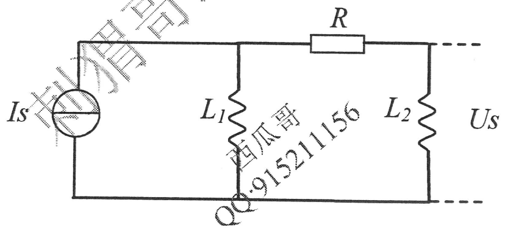

3. 求 \(\sin (\pi t)[u(t) - u(t - 1)]\) 的单边拉氏变换

4. 求 \(S a(100 t) + S a^{2}(60 t)\) 的奈奎斯特采样周期________；

5. 已知系统函数 \(H(s) = \frac{Y(s)}{F(s)} = \frac{s}{s + 1}, y_{zs} = (1 - e^{-t})u(t)\), 则输入 \(f(t)\) 为

6. 已知 \(f(t)\) 的傅里叶变换为 \(F(jw)\), 则 \(f(t) \sum_{-\infty}^{+\infty} \delta(t - nT_s) [T_s\) 为周期]的傅里叶变换为 ____________;

7. 已知离散系统函数 \(\frac{z^2 + 1.2z + 0.2}{(z - 0.4)(z + 0.5)}\), 则系统是否稳定 __________;

---

8. \(\frac{s^3 + 5s^2 + 9s + 7}{(s + 1)(s + 2)}\) 的逆变换为________；（刺猬哥考研团队，答疑交流群239067652）

9. 求 \(2u(1 - 2w)\) 的傅里叶逆变换为

10. 以下哪一个描述线性、时不变、无记忆系统________；

(1) \(y(n) = f^{2}(n)\) (2) \(y(n) = 2f(n)\) (3) \(y(n + 1) = 2f(n) + 3\) (4) \(y(n + 1) = f(n)\cos (3n)\)

11. \(n(-2)^{n - 1}u(n)\) 的 \(\mathbf{z}\) 变换为

12. 已知 \( F(z) = \frac{z^2}{(z + 1)^2(z - 2)} \)，\( 1 < |z| < 2 \)，求 \( f(n) = \) ______；

# 二、电路分析题

13. 已知电路图如下图所示，电阻值图中给出，设 \(I_{i} = X_{1}\) 、 \(U_{c} = X_{2}\)

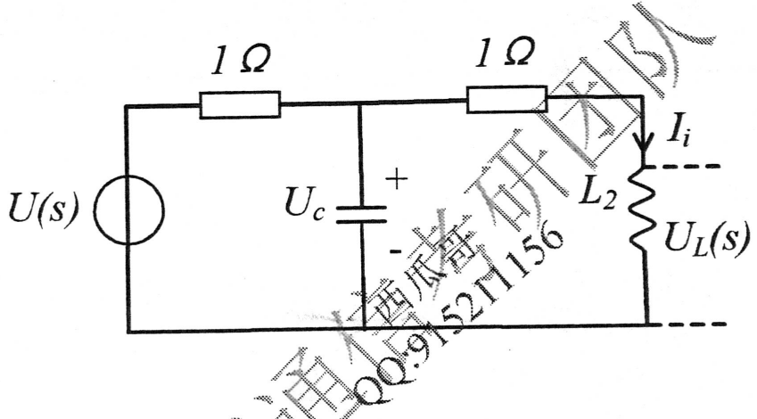

(1)求系统输入输出状态方程

(2)求系统函数 \(H(s)\)

(3)判断系统是否稳定，并说明原因

# 三、积分题

14. 求 \(\int_{0}^{\infty} \frac{\sin^{2} w}{w^{2}} d w\) 的积分值, 写出计算过程

(刺猬哥考研团队, 西瓜哥 QQ:915211156)

---

# 四、离散系统分析题

15. 已知离散系统框图如下：（刺猬哥考研团队，西瓜哥 QQ:915211156）

\(W(n)\) 为中间变量而不是系数

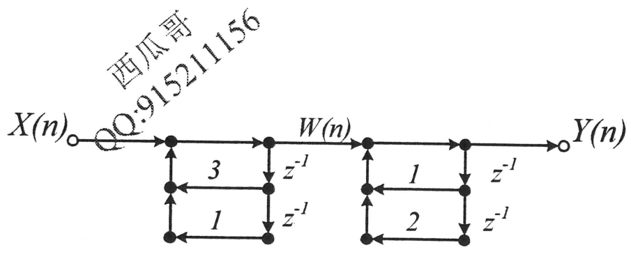

(1)求 \(H(z)\)

(2)求系统差分方程

# 五、连续系统分析题

16. 已知系统差分方程为 \(y(n) + 3y(n - 1) + 2y(n - 2) = f(n) - f(n - 1)\), 激励信号为 \((-2)^{n}u(n)\), 系统的初始值 \(y(-1) = 1\) 、 \(y(-2) = 2\), 求系统的零输入和零状态响应。

# 六、系统分析题

17. 连续系统框图如下, 已知 \(x(t)\) 是输入函数, \(y(t)\) 是输出函数, \(e(t)\) 是误差函数, 且 \(\mathrm{k}\) 大于 0 .

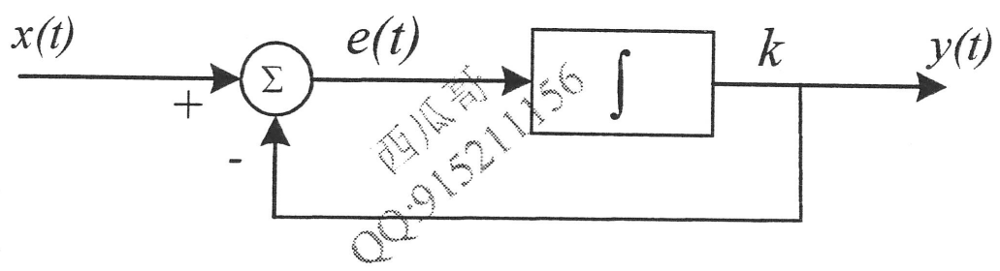

(1) 若 \(x(t) = Au(t)\), 求 \(e(\infty)\) 的值。

(2) 若 \(x(t) = A \sin \left(w_{0} t + \varphi_{0}\right)\), 求正弦稳态输出响应 \(y(t)\) (刺猬哥考研团队, 西瓜哥 QQ:915211156)

---

# 七、综合题

18.

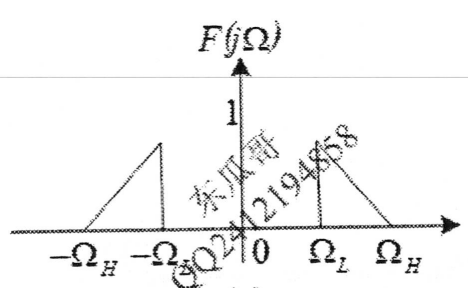

_(a)_

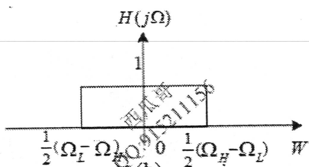

_(0)_

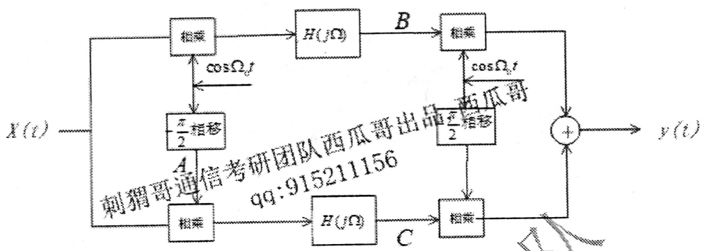

_(c)_

(1)求 \(A\) 处的频谱函数；

(2) 画出 \(B 、 C\) 处的频谱图;

(3) 画出输出 \(y(t)\) 的频谱图。

(刺猬哥考研团队，西瓜哥 QQ:915211156)

---

# 2022南昌大学信号与系统811真题详解

——西瓜哥原创作答

# 一、填空题

题 1 解: \(-\delta(t)\) (刺猬哥考研团队, 西瓜哥 QQ:915211156)

提示: \(f(t) \delta'(t) = f(0) \delta'(t) - f'(0) \delta(t)\), 按公式代入即可。

题2解： \(h(t) = 2\delta '(t) - 2\delta (t) + 2e^{-t}u(t)\)

由电路图知电流源为输入, L2 两端电压为输出, 设经过 L1 回路电流为 \(i_{1}\), 经过 L1 回路电流为 \(i_{2}\), 则整体可列出以下关系式:

$$
\left\{ \begin{array}{l} I (s) = I _ {1} (s) + I _ {2} (s) \\ I _ {1} (s) \cdot S L _ {1} = I _ {2} (s) \cdot (R + S L _ {2}) \\ U (s) = I _ {2} (s) \cdot S L _ {2} \end{array} \right.
$$

代入题中所给条件，可得输入输出关系为：

$$
U (s) = \frac {2 s ^ {2}}{s + 1} \cdot I (s) \Rightarrow H (s) = \frac {U (s)}{I (s)} = \frac {2 s ^ {2}}{s + 1}
$$

由此逆变换得到 \(h(t) = 2\delta'(t) - 2\delta(t) + 2e^{-t}u(t)\)

题3解： \(\frac{\pi(1 + e^{-s})}{s^2 + \pi^2}\) （刺猬哥考研团队，西瓜哥QQ:915211156）

本题利用常见拉式变换对 \(\sin w_{0} t u(t) \leftrightarrow \frac{w_{0}}{s^{2} + w_{0}^{2}}\), 以及 \(\sin \pi (t - 1) = -\sin \pi t\) 解题。

题 4 解: \(\frac{\pi}{120}\)

该信号最大频率为 120 , 奈奎斯特采样频率为 240 , 采样周期 \(\frac{2 \pi}{w} = \frac{\pi}{120}\)

题5解： \(f(t) = tu(t)\)

可知 \(F(s) = \frac{1}{s^2} \Rightarrow f(t) = tu(t)\) （刺猬哥考研团队，答疑交流群 709502924）

---

题6解： \(\frac{1}{T_s}\sum_{n = -\infty}^{+\infty}F(w - n\frac{2\pi}{T_s})\)

冲击串采样对应频域卷积移位，简单题。

题 7 解: 稳定

极点全在单位圆内，则该系统必是因果稳定的。

(刺猬哥考研团队，西瓜哥 QQ: 915211156)

题8解： \(\delta '(t) + 2\delta (t) + 2e^{-t}u(t) - e^{-2t}u(t)\)

拉普拉斯逆变换, 注意要把分式变为真分式后再采用部分分式法分解.

题 9 解: \(\left[\frac{1}{\pi j t} + \delta (t)\right] \cdot e^{j \frac{t}{2}}\)

本题利用对称性解题即可, 很多同学可能最后算到的冲激函数尺度变换没有化简, 应该可以得分, 即为 \(\left[\frac{1}{\pi j t} + \frac{1}{2} \delta\left(\frac{t}{2}\right)\right] \cdot e^{j \frac{t}{2}}\) (刺猬哥考研团队, 西瓜哥 QQ:915211156)

题 10 解: (2) \(y(n) = 2 f(n)\)

简单线性、时不变、无记忆系统的判定（刺猬哥考研团队，西瓜哥QQ:915211156）

题 11 解: \(\frac{z}{(z + 2)^2}\)

本题记住 \(na^n u(n) \leftrightarrow \frac{az}{(z - a)^2}\), 并且把等式拆分为 \(-\frac{1}{2} n(-2)^n u(n)\) 即可五秒解题

题12解： \(f(n) = \left[-\frac{2}{9} (-1)^n -\frac{1}{3} n(-1)^n\right]u(n) - \frac{2}{9}\cdot 2^n u(-n - 1)\)

$$
F (z) = \frac {z ^ {2}}{(z + 1) (z - 2)}, \quad \frac {F (z)}{z} = \frac {z}{(z + 1) ^ {2} (z - 2)} = \frac {- \frac {2}{9}}{z + 1} + \frac {\frac {1}{3}}{(z + 1) ^ {2}} + \frac {\frac {2}{9}}{z - 2}
$$

---

(刺猬哥考研团队, 答疑交流群 709502924)

# 二、电路分析题

题 13 解:

(1) (刺猬哥考研团队, 西瓜哥 QQ:915211156)

本题已经提供好了状态量，那么只要依据给出的状态量进行电路分析即可，简单分析以下状态量存在的关系：①电容两端电压等于电容右端电阻和电感电压之和；②电压源等于电容两端电压和电容左侧电阻电压之和；依据此列出关系式如下：

$$
\left\{ \begin{array}{l} U _ {c} (t) = I _ {i} (t) \cdot R + L \cdot \frac {d I _ {i} (t)}{d t} \\ U (t) = \left(I _ {i} (t) + c \cdot \frac {d U _ {c} (t)}{d t}\right) \cdot R + U _ {c} (t) \\ U _ {L} (t) = L \cdot \frac {d I _ {i} (t)}{d t} \end{array} \right.
$$

代入电阻、电容、电感值以及替换题设中给定的状态量可以得到:

$$
\left\{ \begin{array}{l} X _ {2} = X _ {1} + \dot {X} _ {1} \\ U (t) = X _ {1} + \dot {X} _ {2} + X _ {2} \\ U _ {L} (t) = \dot {X} _ {1} \end{array} \Rightarrow \left\{ \begin{array}{l} \dot {X} _ {1} = X _ {2} - X _ {1} \\ \dot {X} _ {2} = U (t) - X _ {1} - X _ {2} \\ U _ {L} (t) = \dot {X} _ {1} = X _ {2} - X _ {1} \end{array} \right. \right.
$$

写成矩阵形式为：（刺猬哥考研团队，西瓜哥QQ:915211156）

$$
\left[ \begin{array}{l} \dot {X} _ {1} \\ \dot {X} _ {2} \end{array} \right] = \left[ \begin{array}{l l} - 1 & - 1 \\ - 1 & - 1 \end{array} \right] \left[ \begin{array}{l} X _ {1} \\ X _ {2} \end{array} \right] + \left[ \begin{array}{l} 0 \\ 1 \end{array} \right] U (t) 、 U _ {L} (t) = \left[ \begin{array}{l l} - 1 & 1 \end{array} \right] \left[ \begin{array}{l} X _ {1} \\ X _ {2} \end{array} \right]
$$

(2) (刺猬哥考研团队，西瓜哥 QQ:915211156)

根据系统分压关系亦或是用网孔电压法，可以得到系统输入输出对应为：

$$
U (s) \cdot \frac {s}{s ^ {2} + 2 s + 2} = U _ {L} (s) \Rightarrow H (s) = \frac {s}{s ^ {2} + 2 s + 2}
$$

(3) (刺猬哥考研团队, 西瓜哥 QQ:915211156)

从第二问的系统函数可知两个极点分别对应的是 \(X_{1} = -1 + i\) 、 \(X_{2} = -1 - i\) ，可知极点全在 \(j w\) 轴左侧，从系统函数还原成微分方程可轻易判断该系统是因果的，从而因果系

---

统，极点全在 \(j w\) 轴左侧，则该系统稳定。

# 三、积分题

题 14 解: (刺猬哥考研团队, 西瓜哥 QQ:915211156)

本题可利用数学分部积分求, 也可用信号里面的帕塞瓦尔定理去做, 本题给出信号里面的做法:

$$
\int_ {0} ^ {\infty} \frac {\sin^ {2} w}{w ^ {2}} d w = \frac {1}{2} \int_ {- \infty} ^ {\infty} \frac {\sin^ {2} w}{w ^ {2}} d w = \frac {1}{2} \cdot 2 \pi \int_ {- \infty} ^ {\infty} \left| \frac {1}{2} G _ {2} (t) \right| ^ {2} d t = \frac {\pi}{2}
$$

# 四、离散系统分析题（刺猬哥考研团队，西瓜哥QQ:915211156）

题15解：

(1) 根据梅森公式可得 \(H(z) = \frac{1}{1 - 4z^{-1} - 3z^{-2} + 3z^{-2} + 7z^{-3} + 2z^{-4}} = \frac{1}{1 - 4z^{-1} + 7z^{-3} + 2z^{-4}}\)

(2) 由系统函数可得差分方程为: \( y(n) - 4y(n - 1) + 7y(n - 3) + 2y(n - 4) = x(n) \)

# 五、连续系统分析题（刺猬哥考研团队，西瓜哥QQ:915211156）

题 16 解:

由题可设 \(y_{zi}(t) = k_1(-1)^n +k_2(-2)^n\) ，代入系统初值可得 \(y_{zi}(t) = 5\cdot (-1)^n -12\cdot (-2)^n\)

根据差分方程以及激励信号形式可得: \(Y_{zs}(s) = \frac{z^2(z - 1)}{(z + 2)^2(z + 1)} = \frac{-z}{z + 2} + \frac{-6z}{(z + 2)^2} + \frac{2z}{z + 1}\).

差分方程, 零状态解默认取大于 0 部分, 则为因果序列, 逆变换得:

$$
y _ {z s} (t) = - (- 2) ^ {n} u (n) + 3 n (- 2) ^ {n} u (n) + 2 (- 1) ^ {n} u (n)
$$

---

# 六、系统分析题（刺猬哥考研团队，西瓜哥QQ:915211156）

题17解：

(1)

$$
E (s) = X (s) - \frac {k E (s)}{s} \Rightarrow E (s) = X (s) \cdot \frac {s}{s + k} = \frac {A}{s + k}
$$

由题设 \(k > 0\), 所以极点在虚轴左侧, 收敛于包含虚轴, 则本问可用终值定理

$$
e (\infty) = \lim  _ {s \rightarrow 0} s E (s) = \lim  _ {s \rightarrow 0} \frac {A s}{s + k} = 0
$$

(意义: 当输入时间无穷大时, 系统的输出等于输入, 传输信号误差极限为 0)

(2) (刺猬哥考研团队, 西瓜哥 QQ:915211156)

由梅森公式可知:

\(H(s) = \frac{k}{1 + ks^{-1}} = \frac{k}{s + k}\), 极点包含虚轴, 则可得到频谱函数为 \(H(jw) = \frac{k}{jw + k}\).

从输入信号形式可看出本题采用特征函数响应去处理，因此输出信号为：

$$
y (t) = \left| H \left(j w _ {0}\right) \right| \cdot A \cdot \sin \left(w _ {0} t + \varphi_ {0} + \varphi \left(j w _ {0}\right)\right)
$$

其中 \(\left|H(jw_{0})\right| = \frac{k}{\sqrt{k^{2} + w_{0}^{2}}}\) 、 \(\varphi (jw_{0}) = -\arctan (\frac{w_{0}}{k})\) (咱们刺猬哥通信班学员都知道相位在不同象限的求解方法以及特征函数响应的巧用，本题 easy，不过很多人对这个误差函数有疑问，其实不就是给你设好的环路中的一个状态量吗。)

(刺猬哥考研团队，西瓜哥 QQ: 915211156)

# 七、综合题

题 18 解:

---

(1) \(\cos \left(\Omega_{L} t\right)\) 经 \(-\frac{\pi}{2}\) 的相移, 可得

$$
f _ {A} = \cos \left(\Omega_ {0} t - \frac {\pi}{2}\right) = \sin \left(\Omega_ {0} t\right) \leftrightarrow j \pi \left[ \delta \left(\Omega + \Omega_ {0}\right) - \delta \left(\Omega - \Omega_ {0}\right) \right]
$$

故 \(F_{A} = j \pi \left[ \delta \left(\Omega + \Omega_{0}\right) - \delta \left(\Omega - \Omega_{0}\right) \right]\), 其中 \(\Omega_{0} = \frac{\Omega_{L} + \Omega_{H}}{2}\)

(2) 令 \(x_{1}(t) = x(t) \cos \left(\Omega_{0} t\right)\), \(x_{2}(t) = x(t) \sin \left(\Omega_{0} t\right)\)

$$
X _ {1} (j \Omega) = \frac {1}{2 \pi} X (j \Omega) * \pi [ \delta (\Omega + \Omega_ {0}) + \delta (\Omega - \Omega_ {0}) ] = \frac {1}{2} \{X [ j (\Omega + \Omega_ {0}) ] + X [ j (\Omega - \Omega_ {0}) ] \}
$$

$$
X _ {2} (j \Omega) = \frac {1}{2 \pi} X (j \Omega) * j \pi [ \delta (\Omega + \Omega_ {0}) - \delta (\Omega - \Omega_ {0}) ] = \frac {j}{2} \{X [ j (\Omega + \Omega_ {0}) ] - X [ j (\Omega - \Omega_ {0}) ] \}
$$

其中 \(\Omega_{0} = \frac{\Omega_{L} + \Omega_{H}}{2}\) （刺猬哥考研团队，西瓜哥QQ:915211156）

$$
Y _ {B} (j \Omega) = X _ {1} (j \Omega) H (j \Omega), \quad Y _ {C} (j \Omega) = X _ {2} (j \Omega) H (j \Omega)
$$

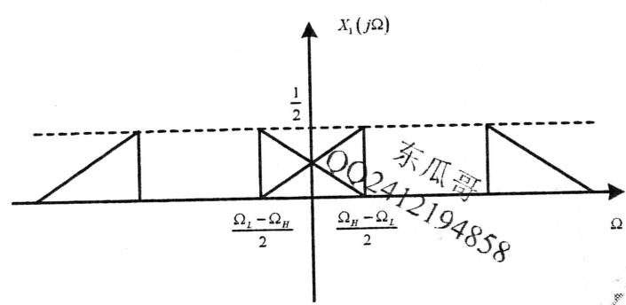

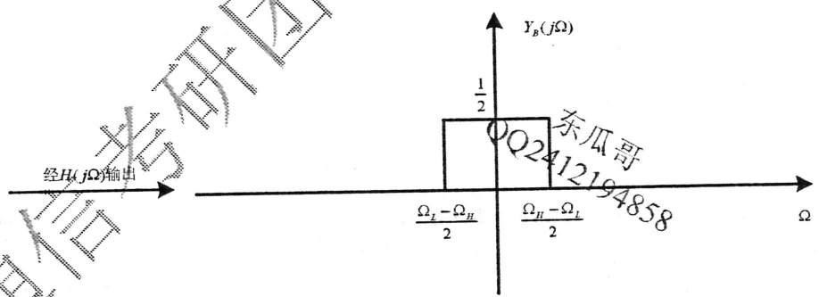

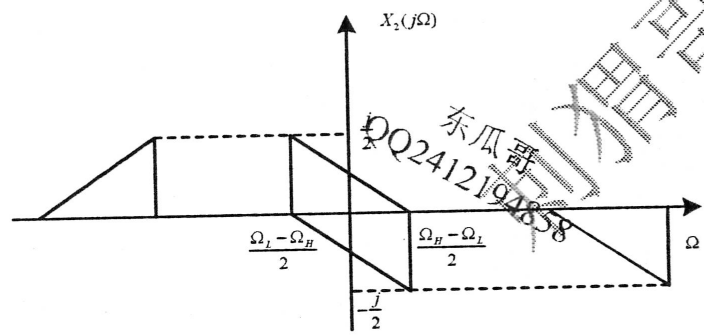

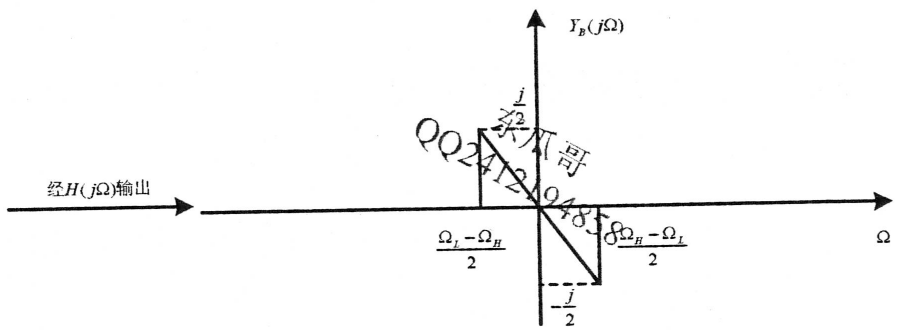

(3) 令 \( y_{1}(t) = y_{B}(t)\cos(\Omega_{0}t) \), \( y_{2}(t) = y_{C}(t)\sin(\Omega_{0}t) \)

所以 \(Y_{1}(j \Omega) = \frac{1}{2 \pi} Y_{B}(j \Omega)* = \frac{1}{2} Y_{B}(j \Omega)*\cos (\Omega_{0} t)\)

$$
\begin{array}{l} Y _ {1} (j \Omega) = \frac {1}{2 \pi} Y _ {B} (j \Omega) * \pi [ \delta (\Omega + \Omega_ {0}) + \delta (\Omega - \Omega_ {0}) ] = \frac {1}{2} \left\{Y _ {B} [ j (\Omega + \Omega_ {0}) ] + Y _ {B} [ j (\Omega - \Omega_ {0}) ] \right\} \\ Y _ {2} (j \Omega) = \frac {1}{2 \pi} Y _ {C} (j \Omega) * j \pi [ \delta (\Omega + \Omega_ {0}) - \delta (\Omega - \Omega_ {0}) ] = \frac {\dot {j}}{2} \{Y _ {C} [ j (\Omega + \Omega_ {0}) ] - Y _ {C} [ j (\Omega - \Omega_ {0}) ] \} \\ \end{array}
$$

其中 \(\Omega_0 = \frac{\Omega_L + \Omega_H}{2}, Y(j\Omega) = Y_1(j\Omega) + Y_2(j\Omega)\)

则可画出频谱图: (信号答疑交流群: 457799762)

---

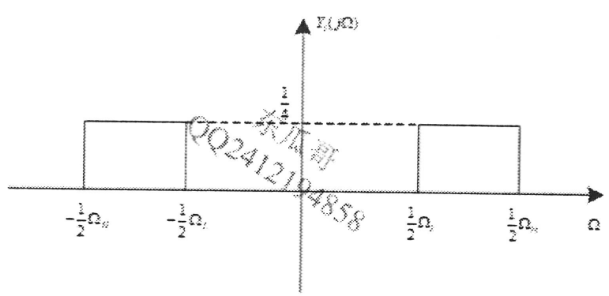

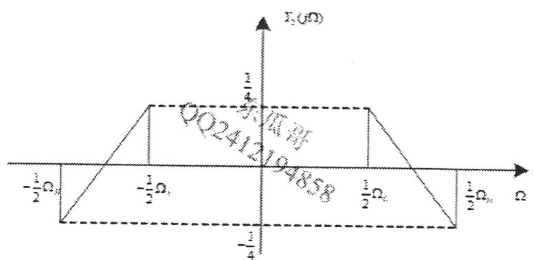

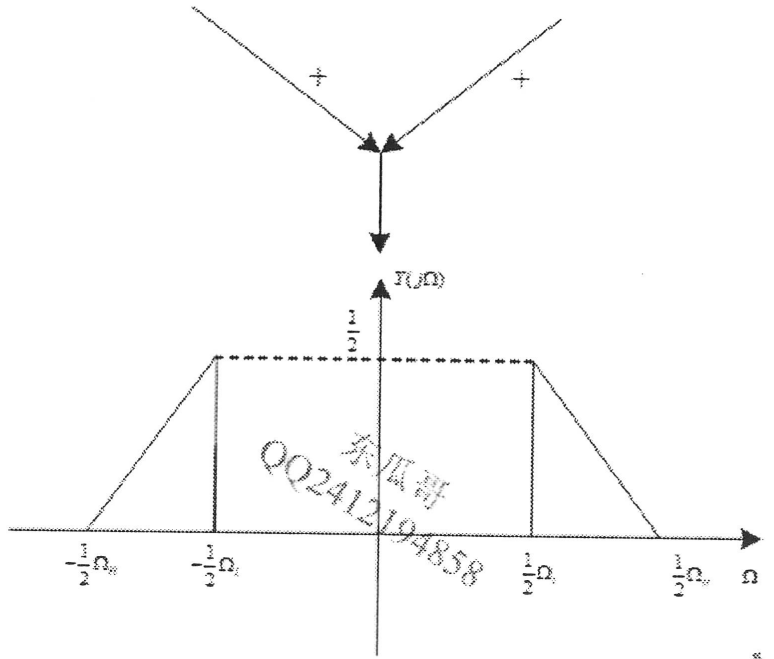

(西瓜哥原创小结: 此题难度★★★☆☆, 一道十分经典的频谱搬移问题, 此题防止大家在做多了抽样问题, 而忘记了对这一题型的考察。此题步骤繁琐, 有一定的难度, 很好了的考察了大家对这一类问题的解题, 大家遵循一步一步的原则, 做出来的难度并不是很大, 此题一定要注意计算。(刺猬哥考研团队, 西瓜哥 QQ:915211156)

_南昌大学811信号与系…_

_扫一扫二维码，加入群缘。_

_西瓜_

# 西瓜哥原创作答

---

