# 南昌考研信号与系统核心序列 O

# 序列——绪论

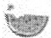

# 西瓜哥原创作答

1. 以下哪一个序列为线性、时不变、无记忆系统________；

A. $y(n) = f^{2}(n)$

B. $y(n) = 2 f(n)$

C. $y(n + 1) = 2f(n) + 3$

D. $y(n + 1) = f(n)\cos (3n)$

2. 已知 $f(t)$, 为求 $f(1 - 2 t)$, 应按照下列哪种运算求得正确结果 ( )。

A. $f(-2 t)$ 左移1

B. $f(2 t)$ 右移 $1 \mathrm{~m}$

C. $f(2 t)$ 左移 $\frac{1}{2}$

D. $f(-2t)$ 右移 $\frac{1}{2}$

（刺猬哥考研团队西瓜哥QQ:915211156）

3. $S a\left[\pi (t - 4)\right]\delta (t - 4) = \underline{\quad};$

A. 1

B. $\delta (t - 4)$

C. 0

D. $S a(0)$

4. 连续系统输入 $f(t)$ 与输出 $y(t)$ 之间的关系为 $y(t) = \frac{df(t)}{dt} + |f(t)|$, 关于该系统下面的说法正确的是 ( )。(刺猬哥考研团队西瓜哥 QQ:915211156)

A. 线性时不变

B. 线性时变

C. 非线性时不变

D. 非线性时变

---

5.（西瓜哥915211156）下列等式不成立的是

A. $f(t)\delta '(t) = f(0)\delta '(t)$

B. $f(t)\delta (t) = f(0)\delta (t)$

C. $f(t)^{*} \delta^{\prime}(t) = f^{\prime}(t)$

D. $f(t)^{*} \delta(t) = f(t)$

6. 差分方程 $ y(n + 2) + 5y(n + 1) + 6y(n) = x(n + 1) + 4x(n) $ 描述的离散系统是: 1) 线性的 2) 因果的 3) 一阶的 4) 时不变的。这些说法中有几个是正确的?

A.1 个

B.2 个

C. 3 个

D.4 个

7. （西瓜哥 915211156）下列方程所描述的系统中（其中 $f(t)$ 为激励，$y(t)$ 为响应），线性时不变系统是

A. $y(t) = \int_{-\infty}^{3t} f(\tau) d\tau$

B. $y(t) = f(t - 1) + f(1 - t)$

C. $y(t) = \left\{ \begin{array}{l} 0, f(t) < 0 \\ f(t), f(t) > 0 \end{array} \right.$

D. $y(t) = f(t - 1) + f(t + 1)$

8. $u(n + 1)^{*}\left[u(n - 2) + \delta (n - 1)\right] = \underline{\quad}.$

9. $\int_{-3}^{1} e^{-3t} \delta(t - 2) dt =$ ________。（刺猬哥考研团队西瓜哥QQ:915211156）

10. $x(t) = \delta (t + 4) - \delta (t - 2)$, 求 $y(t) = \int_{-\infty}^{t} x(\tau)d\tau$ 的能量

---

11. $\int_{-\infty}^{+\infty}\left(3 - t^2\right)\left[\delta \left(\frac{t}{2} - 1\right) + \delta '(t - 1)\right]dt = \underline{\quad}$

12. 连续时间信号 $x(t) = 2 + \cos \left(\frac{\pi}{7} t\right) - \sin \left(\frac{\pi}{5} t\right)$, 其基波周期 $T =$

13. 信号 $x(n) = \cos \left(\frac{\pi}{3} n^{2}\right)$ 的最小周期为 ; (刺猬哥考研团队西瓜哥 QQ:915211156)

14. 已知一个信号 $f(t)$, 将保存该信号的磁带二倍速倒放, 然后左移三个时间单位, 再加强两倍。得到的波形如下图 $f_{1}(t)$ 所示。(西瓜哥 QQ915211156)

(1) 确定该信号 $f(t)$ 的表达式；

(2) 画出该信号 $f(t)$ 的波形图。（刺猬哥考研团队西瓜哥 QQ:915211156）

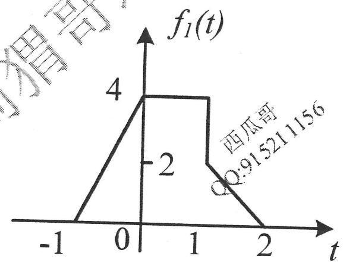

15. 已知 $f(t)$ 波形如下, 画出 $f(4 - 2t)\left[u(t + 3) - u(t - 1)\right]$ 波形图。

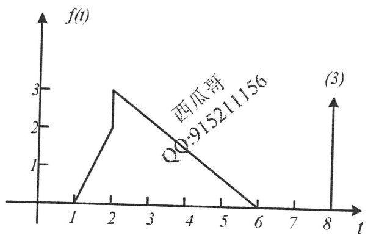

16. 设 $x(t)$ 为系统的输入, $y(t)$ 为系统的输出, 且满足 $y(t) = \int_{-\infty}^{3t} x(\tau) d\tau$, 试分析此系统是否

---

属于线性时不变系统及因果系统，并说明理由。

17. 连续时间函数 $f(t) = x(-3t + 1)$, 如下图所示, 要求:

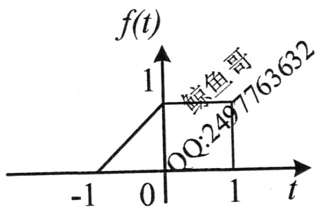

(1) 画出 $x(t)$ 的图像;

(2) 将 $f(t)$ 进行奇偶分解, 画出奇偶波形;

(3) 求 $f(t)$ 的总能量和平均功率。

18. 已知 $\delta (\alpha t) = \frac{1}{|\alpha|} \delta (t)$, 其中 $\alpha \neq 0$, $n$ 为自然数, 证明冲激函数的如下特性:

$\delta^{(n)}(\alpha t + \beta) = \frac{1}{|\alpha|}\frac{1}{\alpha^n}\delta^{(n)}(t + \frac{\beta}{\alpha})$ （刺猬哥考研团队西瓜哥QQ:915211156）

19. 证明 $x(t) \delta'(t) = x(0) \delta'(t) - \frac{dx(t)}{dt} \delta(t)$。

20. 已知微分方程为 $y'(t) + 2y(t) + 3 = f(t)$, 判断其是否是线性、时变及因果的, 给出详细步骤说明理由。

---

# 序列 O 序列一详解—西瓜哥原创作答

题 1 解: B

(注: 此题难度★☆☆☆☆, 西瓜哥原创小结: 本题考察简单线性、时不变、无记忆问题系统的判定)

题2解：D

$$
f (- 2 t) \text {右 移} \frac {1}{2}, f \Big [ - 2 \Big (t - \frac {1}{2} \Big) \Big ] = f (1 - 2 t)
$$

(注: 此题难度★☆☆☆☆, 西瓜哥原创小结: 平移是只针对于自变量)

题 3 解: B

$\operatorname{Sa}\left[\pi (t - 4)\right]\delta (t - 4), t = 4$ 时, 原式 $\operatorname{Sa}\left[\pi (t - 4)\right] = 1$

故结果等于 $\delta (t - 4)$

(注: 此题难度★☆☆☆☆, 西瓜哥原创小结: 基础题, 考察冲激函数的抽样筛选性。)

题4解：C

出现绝对值，非线性系统。微分和绝对值不影响时不变性。

(注: 此题难度★☆☆☆☆, 西瓜哥原创小结: 考察线性时不变性的判断, 非线性:常数、绝对值、平方。时变: 输入输出前的系数是变量。)

题 5 解: A

A 选项冲激偶不具有该性质; $f(t) \delta^{\prime}(t) = f(0) \delta^{\prime}(t) - f^{\prime}(0) \delta(t)$

(注: 此题难度★☆☆☆☆, 西瓜哥原创小结: B,C,D 均为冲激信号重要公式, 考生需要熟练掌握。) (刺猬哥考研团队西瓜哥 QQ:915211156)

更多优质考研资讯，关注b站 | 公众号“刺猬哥通信电子考研”、知乎“刺猬哥通信考研”

---

题6解：C

(1) 线性性判断:

已知 $ y(n + 2) + 5y(n + 1) + 6y(n) = x(n + 1) + 4x(n) $

设有 $x_{1}(n)\rightarrow y_{1}(n),y_{1}(n + 2) + 5y_{1}(n + 1) + 6y_{1}(n) = x_{1}(n + 1) + 4x_{1}(n)$

$$
x _ {2} (n) \rightarrow y _ {2} (n), \quad y _ {2} (n + 2) + 5 y _ {2} (n + 1) + 6 y _ {2} (n) = x _ {2} (n + 1) + 4 x _ {2} (n)
$$

令 $x_{3}(n) = ax_{1}(n) + bx_{2}(n)$

$$
\begin{array}{l} x _ {3} (n) \rightarrow y _ {3} (n), \quad y _ {3} (n + 2) + 5 y _ {3} (n + 1) + 6 y _ {3} (n) = x _ {3} (n + 1) + 4 x _ {3} (n) \\ y _ {3} (n + 2) + 5 y _ {3} (n + 1) + 6 y _ {3} (n) = a x _ {1} (n + 1) + b x _ {2} (n + 1) + 4 a x _ {1} (n) + 4 b x _ {2} (n) \\ \end{array}
$$

其中 $ax_{1}(n + 1) + 4ax_{1}(n) = ay_{1}(n + 2) + 5ay_{1}(n + 1) + 6ay_{1}(n)$

$$
b x _ {2} (n + 1) + 4 b x _ {2} (n) = b y _ {2} (n + 2) + 5 b y _ {2} (n + 1) + 6 b y _ {2} (n)
$$

对比可得: $y_{3}(n) = a y_{1}(n) + b y_{2}(n)$, 故系统线性;

(2)因果性判断：（刺猬哥考研团队西瓜哥QQ:915211156）

比较差分方程最高阶: $y(n + 2)$ 与 $x(n + 1)$, 可见任何时刻系统的输出都只与过去的输入有关, 故系统因果;

(3)根据系统极点的个数, 可知系统为二阶系统;

(4)时变性判断:

已知 $ y(n + 2) + 5y(n + 1) + 6y(n) = x(n + 1) + 4x(n) $

设有 $x_{1}(n) \rightarrow y_{1}(n)$, $y_{1}(n + 2) + 5y_{1}(n + 1) + 6y_{1}(n) = x_{1}(n + 1) + 4x_{1}(n)$.

令 $x_{2}(n) = x_{1}(n - n_{0})$

$$
\begin{array}{l} x _ {2} (n) \rightarrow y _ {2} (n) \\ y _ {2} (n + 2) + 5 y _ {2} (n + 1) + 6 y _ {2} (n) = x _ {2} (n + 1) + 4 x _ {2} (n) = x _ {1} \left(n + 1 - n _ {0}\right) + 4 x _ {1} \left(n - n _ {0}\right) \\ \end{array}
$$

其中 $x_{1}(n + 1 - n_{0}) + 4x_{1}(n - n_{0}) = y_{1}(n + 2 - n_{0}) + 5y_{1}(n + 1 - n_{0}) + 6y_{1}(n - n_{0})$

对比可得: $y_{2}(n) = y_{1}\left(n - n_{0}\right)$, 故系统时不变;

更多优质考研资讯, 关注b站 | 公众号“刺猬哥通信电子考研”、知乎“刺猬哥通信考研”

---

因此有 3 个说法正确。（刺猬哥考研团队西瓜哥 QQ:915211156）

(注: 此题难度★★★☆☆, 西瓜哥原创小结: 牢牢抓住定义判断即可, 判断差分方程所描述系统的性质第一次见可能会无从下手。)

题 7 解: D (刺猬哥考研团队西瓜哥 QQ:915211156)

A 选项: $y(t) = \int_{-\infty}^{3 t} f(\tau) d \tau$

设 $f_{1}(t)\rightarrow y_{1}(t) = \int_{-\infty}^{3t}f_{1}(\tau)d\tau$

令 $f_{2}(t) = f_{1}(t - t_{0})$ ， $f_{2}(t)\rightarrow y_{2}(t) = \int_{-\infty}^{3t}f_{2}(\tau)d\tau = \int_{-\infty}^{3t}f_{1}(\tau -t_{0})d\tau = \int_{-\infty}^{3t - t_{0}}f_{1}(\tau)d\tau$

可得 $y_{2}(t) \neq y_{1}(t - t_{0}) = \int_{-\infty}^{3(t - t_{0})} f_{1}(\tau) d\tau$，故时变；

B 选项: $y(t) = f(t - 1) + f(1 - t)$

设 $f_{1}(t) \rightarrow y_{1}(t) = f_{1}(t - 1) + f_{1}(1 - t)$

令 $f_{2}(t) = f_{1}(t - t_{0})$ ， $f_{2}(t)\rightarrow y_{2}(t) = f_{2}(t - 1) + f_{2}(1 - t) = f_{1}(t - 1 - t_{0}) + f_{1}(1 - t - t_{0})$

可得 $y_{2}(t)\neq y_{1}(t - t_{0}) = f_{1}(t - t_{0} - 1) + f_{1}(1 - (t - t_{0})) = f_{1}(t - t_{0} - 1) + f_{1}(1 - t + t_{0})$ ，故时变；

C 选项: $ y(t) = \begin{cases} 0, & f(t) < 0 \\ f(t), & f(t) > 0 \end{cases} $

设 $f_{1}(t)\rightarrow y_{1}(t) = \left\{ \begin{array}{ll}0, & f_{1}(t) <   0\\ f_{1}(t),f_{1}(t) > 0 \end{array} \right.$ ， $f_{2}(t)\to y_{2}(t) = \left\{ \begin{array}{ll}0, & f_{2}(t) <   0\\ f_{2}(t),f_{2}(t) > 0 \end{array} \right.$

令 $f_{3}(t) = a f_{1}(t) + b f_{2}(t)$，则有 $f_{3}(t) \rightarrow y_{3}(t) = \begin{cases} 0, & f_{3}(t) < 0 \\ f_{3}(t), & f_{3}(t) > 0 \end{cases}$

$y_{3}(t) = \left\{ \begin{array}{ll}0, & af_{1}(t) + bf_{2}(t) <   0\\ af_{1}(t) + bf_{2}(t),af_{1}(t) + bf_{2}(t) > 0 \end{array} \right.\neq ay_{1}(t) + by_{2}(t)$ ，故非线性；

(注: 此题难度★★★☆☆, 西瓜哥原创小结: D 选项的线性和时不变判断方法如下)。综上, 这种题大家一定要动笔多练, 好记性不如烂笔头。)

题8解：

$$
(n + 1) u (n)
$$

---

$$
u (n + 1) ^ {*} \left[ u (n - 2) + \delta (n - 1) \right] = u (n + 1) ^ {*} u (n - 2) + u (n) = (n + 1) u (n)
$$

(注: 此题难度★☆☆☆☆, 西瓜哥原创小结: 本题考察卷积和的基本运算)

题 9 解: 0 (刺猬哥考研团队西瓜哥 QQ:915211156)

$t = 2$ 不在积分区间 $(-3,1)$ 中，故结果为 0

(注: 此题难度★☆☆☆☆, 西瓜哥原创小结: 本题考察冲激函数的抽样筛选性, 冲激函数需在积分的区间范围内才有值。)

题 10 解: $6 J$

$$
\begin{array}{l} y (t) = \int_ {- \infty} ^ {t} [ \delta (\tau + 4) - \delta (\tau - 2) ] d \tau = u (t + 4) - u (t - 2) \\ E = \lim  _ {\alpha \rightarrow \infty} \int_ {- \alpha} ^ {\alpha} | y (t) | ^ {2} d t = 6 J \\ \end{array}
$$

(注: 此题难度★☆☆☆☆, 西瓜哥原创小结: 基础题, 本题考察能量的计算公式,求出时间表达式后套入公式计算即可。)

题 11 解: 0

$$
f (t) \delta^ {\prime} (t - t _ {0}) = f (t _ {0}) \delta^ {\prime} (t - t _ {0}) - f ^ {\prime} (t _ {0}) \delta (t - t _ {0})
$$

$\delta \left(\frac{t}{2} - 1\right) + \delta^{\prime}(t - 1) = 2\delta (t - 2) + \delta^{\prime}(t - 1)$ （刺猬哥考研团队西瓜哥QQ:915211156）

$$
\left(3 - t ^ {2}\right) \delta \left(\frac {t}{2} - 1\right) = 2 \left(3 - t ^ {2}\right) \delta (t - 2) = - 2 \delta (t - 2)
$$

即原式 $= \int_{-\infty}^{\infty}\left[-2\delta (t - 2) + 2\delta '(t - 1) + 2\delta (t - 1)\right]dt = 0$

(注: 此题难度★☆☆☆☆, 西瓜哥原创小结: 本题考察冲激偶函数的基本性质有:

$$
f (t) \delta^ {\prime} (t - t _ {0}) = f (t _ {0}) \delta^ {\prime} (t - t _ {0}) - f ^ {\prime} (t _ {0}) \delta (t - t _ {0})
$$

题12解：70

周期 $T = \frac{2 \pi}{\omega}$, $\cos \left(\frac{\pi}{7} t\right)$ 的周期为 14, $\sin \left(\frac{\pi}{5} t\right)$ 的周期为 10, $x(t)$ 的周期 T 为两者的更多优质考研资讯, 关注 b 站 | 公众号“刺猬哥通信电子考研”、知乎“刺猬哥通信考研”

---

最小公倍数, 故 $T = 70$ 。 (刺猬哥考研团队西瓜哥 QQ:915211156)

(西瓜哥原创小结: 此题难度 $\bigstar \bigstar \bigstar \bigstar \bigstar$, 考查周期求取。)

题 13 解: 6

根据周期定义: $x(n + N) = x(n)$

$\Rightarrow \frac{2 \pi}{3} n N + \frac{\pi}{3} N^{2}$ 为 $2 \pi$ 的整数倍

$$
\begin{array}{l} \cos \left[ \frac {\pi}{3} (n + N) ^ {2} \right] = \cos \left(\frac {\pi}{3} n ^ {2}\right) \\ \cos \left(\frac {\pi}{3} n ^ {2} + \frac {2 \pi}{3} n N + \frac {\pi}{3} N ^ {2}\right) = \cos \left(\frac {\pi}{3} n ^ {2}\right) \\ \end{array}
$$

$\frac{2 \pi}{3} n N + \frac{\pi}{3} N^{2} = 2 \pi m$ （$m$ 为整数）可得 $N$ 最小取 6。

(西瓜哥原创小结: 此题难度 $\bigstar \bigstar \bigstar \bigstar \bigstar$, 分析: N 的取值要将分母的 3 约掉; N 最小取 3 时, 有 $2 \pi n + 3 \pi$ 不满足为 $2 \pi$ 的整数倍; N 取 6 时, 有 $4 \pi n + 12 \pi$ 满足为 $2 \pi$ 的整数倍。) (刺猬哥考研团队西瓜哥 QQ:915211156)

题14解：

(1)由已知条件可得： $f_{1}(t) = 2f[-2(t + 3)]\Rightarrow f(t) = \frac{1}{2} f_{1}\left[-\frac{t}{2} -3\right]$

(2) $f(t)$ 的波形图如下图所示:

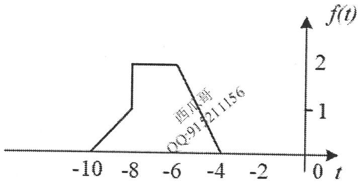

(注: 此题难度★★☆☆☆, 西瓜哥原创小结: 本题主要考察自变量的变换, 但是在做变换之前得先读懂题目的意思, 不然本题的分数也不好拿, 去年有些学长学姐误解题目意思导致这题一分都没得到, 磁带二倍速播放意味着时间被压缩, 原来 T 秒能播完的内容, 现在只用 T/2 秒就可以播完, 体现在表达式中就是 $f(2 t)$, 再进行

---

24最强信号辅导班招生啦！让你节省时间，不走弯路，取得佳绩！联系西瓜哥qq915211156加Q群709502924，使用刺猬哥团队正版核心序列ORK，享受高质量全天候优质答疑指导

倒放就是时域翻转, 体现在表达式中就是 $f(-2 t)$, 再进行时移动和幅度变换则可得到本题最终的结果。）（刺猬哥考研团队西瓜哥 QQ:915211156)

题15解：

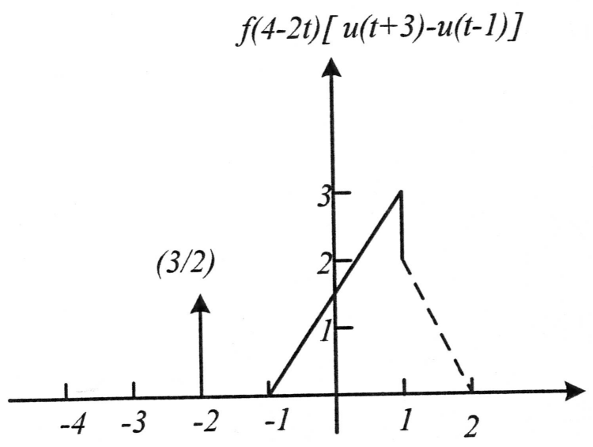

(注: 此题难度★★☆☆☆, 西瓜哥原创小结: 本题主要考察自变量的变换, 变换的一般顺序是 $f(t + 4) \rightarrow f(2t + 4) \rightarrow f(-2t + 4)$, 这样最不容易出错。本题出题者的另一个考察点为冲激函数做尺度变换时, 不光横轴对应的冲激点会被压缩, 而且对应的幅值也会变, 也即 $\delta(at) = \frac{1}{|a|} \delta(t)$ 。)

题 16 解: (刺猬哥考研团队西瓜哥 QQ:915211156)

本题系统为线性、时变、非因果。

# 线性判断：

输入 $x_{1}(t) \Rightarrow y_{1}(t) = \int_{-\infty}^{3 t} x_{1}(\tau) d \tau$, 输入 $x_{2}(t) \Rightarrow y_{2}(t) = \int_{-\infty}^{3 t} x_{2}(\tau) d \tau$

输入 $x_{3}(t) = ax_{1}(t) + bx_{2}(t) \Rightarrow y_{3}(t) = \int_{-\infty}^{3t} ax_{1}(\tau) + bx_{2}(\tau)d\tau = ay_{1}(t) + by_{2}(t)$, 系统线性;

# 时变性判定:

设输入 $x(t)$, 先时移得到 $x\left(t - t_{0}\right)$, 经过系统 $y_{1}(t) = \int_{-\infty}^{3 t} x\left(\tau - t_{0}\right) d \tau = \int_{-\infty}^{3 t - t_{0}} x(m) d m$

输入 $x(t)$, 先过系统得到 $y_{2}(t) = \int_{-\infty}^{3 t} x(\tau) d \tau$, 再时移得到 $y_{2}\left(t - t_{0}\right) = \int_{-\infty}^{3\left(t - t_{0}\right)} x(\tau) d \tau$

明显, 经过两种方式得到的输出并不相同, 因此本题系统是时变的。

# 因果性判定：

更多优质考研资讯，关注b站 | 公众号“刺猬哥通信电子考研”、知乎“刺猬哥通信考研”

---

24最强信号辅导班招生啦！让你节省时间，不走弯路，取得佳绩！联系西瓜哥qq915211156 加Q群709502924，使用刺猬哥团队正版核心序列ORK，享受高质量全天候优质答疑指导

根据系统 $y(t) = \int_{-\infty}^{3 t} x(\tau) d \tau$, 我们令 $t = 1$, 发现 $y(1) = \int_{-\infty}^{3} x(\tau) d \tau$, 当前时刻的输出和未来时刻的输入有关, 为非因果系统。

(注: 此题难度★★☆☆☆, 西瓜哥原创小结: 本题主要考察系统性质的判定, 线性的证明一般是证明齐次性和可加性, 时不变性一般是通过先系统再延时的输出和先延时后系统的输出做对比, 因果性一般看当前时刻的输出是否只和当前时刻的输入或之前时间的输入有关而定, 如果给定冲激响应函数 $h(t)$, 只要冲激响应函数在小于零的部分为 0 则系统为因果系统。按流程计算一般就不会出错, 小心即可。) (刺猬哥考研团队西瓜哥 QQ:915211156)

题17解：

(1) 从 $f(t)$ 到 $x(t)$, 需依次将 $t$ 替换成 $t + \frac{1}{3}, -t, \frac{1}{3} t$

对应图形变换依次为，向左移动 $\frac{1}{3}$ 个单位，翻转，横坐标拉伸3倍。

得到 $x(t)$ 图形如下图所示

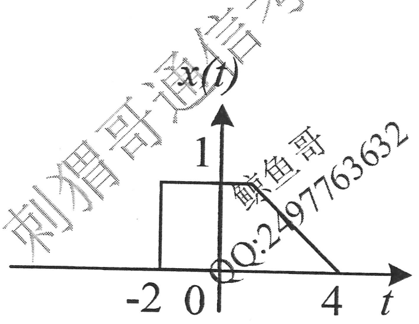

(2) $f_{e}(t) = \frac{f(t) + f(-t)}{2}, f_{o}(t) = \frac{f(t) - f(-t)}{2}$, 画出图形如下

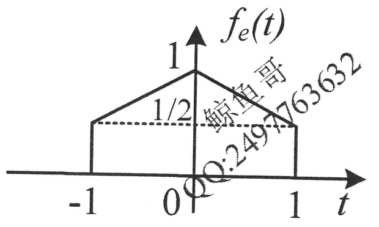

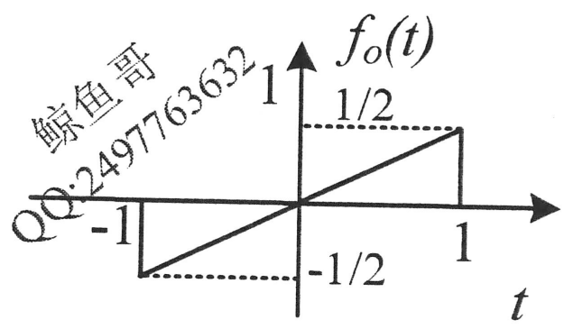

(3) 总能量 $E = \int_{-\infty}^{\infty}\left|f(t)\right|^{2}dt = \int_{-1}^{0}(t + 1)^{2}dt + \int_{0}^{1}1dt = \frac{4}{3}$,

更多优质考研资讯，关注b站 | 公众号“刺猬哥通信电子考研”、知乎“刺猬哥通信考研”

---

24最强信号辅导班招生啦！让你节省时间，不走弯路，取得佳绩！联系西瓜哥qq915211156加Q群709502924，使用刺猬哥团队正版核心序列ORK，享受高质量全天候优质答疑指导

$ P = \lim_{T \to \infty} \frac{1}{T} \int_{-\infty}^{\infty} |f(t)|^{2} dt = \lim_{T \to \infty} \frac{1}{T} \left( \int_{-1}^{0} (t + 1)^{2} dt + \int_{0}^{1} 1 dt \right) = 0 $ （能量有限，平均功率为0）

(注: 此题难度★★☆☆☆, 图形变换关键在于针对 $t$ 本身进行变换, 至于变换顺序共有 $A_{3}^{3} = 6$ 种, 都可)

题 18 解:

已知 $\delta (\alpha t) = \frac{1}{|\alpha|} \delta (t)$, 则 $\delta (\alpha t + \beta) = \frac{1}{|\alpha|} \delta (t + \frac{\beta}{\alpha})$

两边求 $n$ 次导数后: $\alpha^{n} \delta^{(n)} (\alpha t + \beta) = \frac{1}{|\alpha|} \delta^{(n)} \left(t + \frac{\beta}{\alpha}\right)$

故 $\delta^{(n)}(\alpha t + \beta) = \frac{1}{|\alpha|} \frac{1}{\alpha^n} \delta^{(n)}(t + \frac{\beta}{\alpha})$

(注: 此题难度★★☆☆☆, 利用已知条件并结合数学求导。)

题 19 解: (刺猬哥考研团队西瓜哥 QQ:915211156)

证明: $x(t) \delta(t) = x(0) \delta(t)$, $\frac{d[x(t) \delta(t)]}{dt} = \frac{x(0) d[\delta(t)]}{dt} = x(0) \delta'(t)$.

又 $\frac{d[x(t)\delta(t)]}{dt} = x'(t)\delta(t) + x(t)\delta'(t)$, 联立两式, 得证。

(西瓜哥 Tips: 此题难度★★★☆☆, 此公式结论务必记住。)

题 20 解:

由于微分方程中含有常数3，所以该系统是非线性的；

由于微分方程中各项的系数皆为常数，所以该系统是时不变的；

由于系统的输入与输出具有实时性, 没有发生输出超前输入, 所以该系统是因果的。

(刺猬哥通信考研团队, 答疑交流群 709502924)

(西瓜哥 Tips: 此题难度★★★☆☆, 此题主要考察基本系统性质的判定, 对这部分内容应该要重点掌握。)

更多优质考研资讯，关注b站 | 公众号“刺猬哥通信电子考研”、知乎“刺猬哥通信考研”

---

# 南昌考研信号与系统核心序列 O

# 序列二—连续时间系统的时域分析

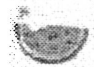

# 西瓜哥原创作答

1. 卷积 $\delta(t)^{*} f(t)^{*} \delta(t)$ 的结果为 ( )

A. $\delta (t)$ B. $\delta (2t)$ C. $f(t)$ D. $f(2t)$

2. 信号 $f_{1}(t)$ 和 $f_{2}(t)$ 的波形如图所示, 设 $y(t) = f_{1}(t)^{*} f_{2}(t)$, 则 $y(6)$ 等于 ( )。

A.2

B.4

C.6

D.8

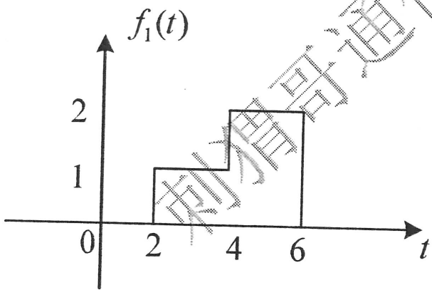

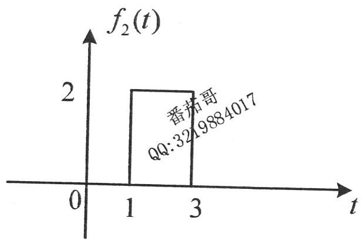

(刺猬哥考研团队西瓜哥 QQ:915211156)

3. 设系统零状态响应与激励的关系是 $y_{zs}(t) = |f(t)|$，则以下表述不对的是（ ）。

A. 系统是线性的 B. 系统是时不变 C. 系统是因果的 D. 系统是稳定的

---

4. 系统结构框图如下, 该系统单位冲激响应 $h(t)$ 的表达式为 ( )。

A. $\frac{1}{T} \int_{-\infty}^{t} (x(\tau) - x(\tau - T)) d\tau$

B. $x(t) - x(t - T)$

C. $\frac{1}{T}\int_{-\infty}^{t}(\delta (\tau) - \delta (\tau -T))d\tau$

D. $\delta (t) - \delta (t - T)$

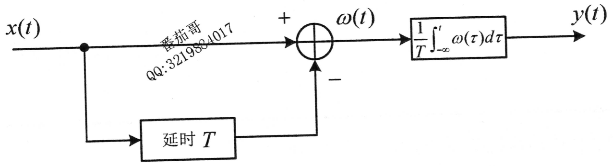

5. 零输入响应是 ( )。(刺猬哥考研团队西瓜哥 QQ:915211156)

A. 全部自由响应

B. 部分自由响应

C. 部分状态响应

D. 全响应与强迫响应之差

6. 已知信号 $x_{1}(t) = \sin t u(t)$, $x_{2}(t) = \delta^{\prime}(t) + u(t)$, 则 $x_{1}(t) * x_{2}(t) =$ ( )。

A. $\delta(t)$

B. $\sin t \delta(t)$

C. $u(t)$

D. $\cos t u(t)$

7. 下列表达式中正确的是（）。

A. $f(t)*\delta (at) = f(t)$

B. $f(t) \cdot \delta(t) = f(0)$

C. $f(t) * \delta^{\prime}(t) = f^{\prime}(t)$

D. $f(t) \cdot \delta'(t) = f(0) \cdot \delta'(t)$

8. $y^{\prime \prime}(t) + 3y^{\prime}(t) + 2y(t) = f(t) + f^{\prime}(t),\quad f(t) = e^{-t}u(t),\quad y(0_{-}) = 2,\quad y^{\prime}(0^{+}) = 3,\quad y^{\prime}(0_{-}) =$ ________。（刺猬哥考研团队西瓜哥QQ:915211156）

---

9. $x_{1}(t) = u(t) - u(t - T)$, $x_{2}(t) = u(t) - u(t - 2T)$, 则 $f(t) = x_{1}(t)*x_{2}(t) = \_ \_ \_ \_ \_ \_ $;

10. 卷积 $6e^{-\frac{1}{2} t} u(t) * \frac{d}{dt} [e^{-2t + 1} \delta(t)]$ 等于 ________。（刺猬哥考研团队西瓜哥 QQ:915211156）

11. (西瓜哥 915211156) 若两个连续时间信号 $f_{1}(t)$ 和 $f_{2}(t)$ 的卷积积分为 $f_{1}(t)^{*} f_{2}(t) = t \cos \frac{\pi t}{3} u(t)$, 则 $f_{1}(t - 1)^{*} f_{2}(t - 2) =$ ________。

12. 已知输入 $ f(t) = t e^{-t} u(t) $，LTI系统的单位冲激响应 $ h(t) = e^{-t} \cos t u(t) $，求系统的零状态响应 $ y(t) = $ ________。

13. 求给定微分方程 $\frac{d^2}{dt^2} y(t) + 5\frac{d}{dt} y(t) + 6y(t) = 2x(t) + \frac{d}{dt} x(t)$ 所描述系统的齐次解和特解, 其中 $x(t) = e^{-t}$。（刺猬哥考研团队西瓜哥QQ:915211156）

14. 某 LTI 系统在输入 $e_{1}(t) = u(t - 2) - u(t - 1)$, 其零状态响应为

$$
r _ {1} (t) = e ^ {- 2 (t - 2)} u (t - 2) - e ^ {- 2 (t - 1)} u (t - 1)
$$

(1)求解关于该系统的单位冲激响应 $h(t)$ 和系统函数 $H(s)$

(2) 若输入为 $e_{2}(t) = (t - 1)e^{-2(t - 1)}u(t - 1)$, 求零状态响应 $r_{2}(t)$ 。

---

15. 连续时间 LTI 系统有两个起始状态为 $x_{1}(0) 、 x_{2}(0)$, 已知

(1) 当 $x_{1}(0) = x_{2}(0) = 1$ 时, 其零输入响应为 $2 e^{-t} u(t)$;

(2) 当 $x_{1}(0) = 1, x_{2}(0) = -1$ 时, 其零输入响应为 $2 e^{-2 t} u(t)$;

(3)当 $x_{1}(0) = 1, x_{2}(0) = 1$ 时，激励为 $x(t)$，其全响应为 $(1 - e^{-t})u(t)$。

试求当 $x_{1}(0) = 1, x_{2}(0) = 2$, 激励为 $3x(t - 1)$ 时的全响应 $y(t)$ 。

16. $\frac{d^{2}y(t)}{dt^{2}} + 6\frac{dy(t)}{dt} + 5y(t) = \frac{df(t)}{dt} + 5f(t), y'(0_{-}) = 1, y(0_{-}) = 0, f(t) = e^{-3t}u(t)$，请使用时域法求零输入，零状态，全响应，强迫响应，自由响应。

17. 某 LTI 系统的单位冲激响应为 $h(t)$, 当输入为 $x(t)$ 时得零状态响应 $y_{zs}(t) = \int_{-\infty}^{t} e^{-(t - \tau)} x(\tau - 3)d\tau$, 求: (刺猬哥考研团队西瓜哥 QQ:915211156)

(1)系统的冲激响应;

(2) 当 $x(t) = u(t + 1) - u(t - 1)$ 时的零状态响应 $y_{zs}(t)$;

(3)若组合系统如下图所示, 其中 $h_{0}(t) = \delta (t - 2)$, 输入为第二问的 $x(t)$, $h_{1}(t)$ 就是第一小问中的系统函数 $h(t)$, 求组合系统的零状态响应。

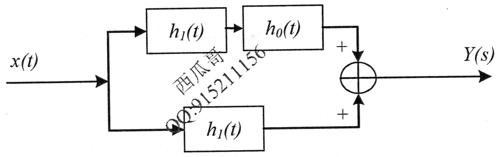

---

18. 已知某系统的数学模型为 $\frac{d^2y(t)}{dt^2} + 3\frac{dy(t)}{dt} + 2y(t) = \frac{df(t)}{dt} + 2f(t)$, 求系统的冲激响应 $h(t)$; 若输入信号为 $f(t) = e^{-3t}u(t)$ 时, 用时域卷积法求系统的零状态响应。

19. 已知 $f_{1}(t) 、 f_{2}(t)$ 的波形如图所示, 求 $y(t) = f_{1}(t)^{*} f_{2}(t)$, 并画出 $y(t)$ 的波形。

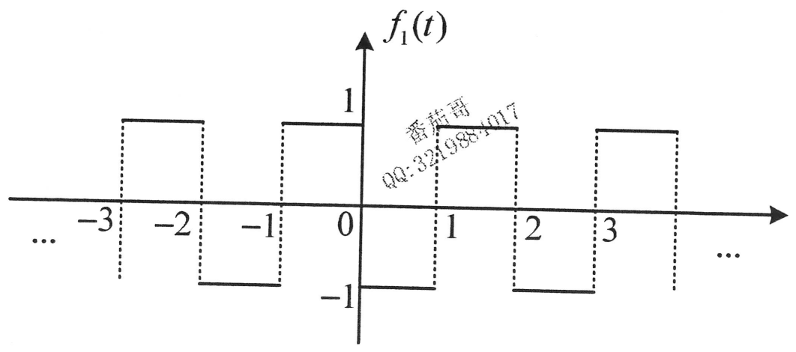

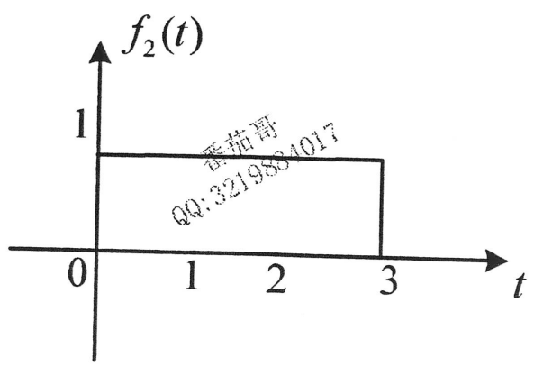

20. 已知微分方程 $ y''(t) + a_0y'(t) + a_1y(t) = b_0x'(t) + b_1x(t) $，初始条件始终不变，满足以下条件：当输入为 $ x_{1}(t) = e^{-2t}u(t) $，全响应 $ y_{1}(t) = (-e^{-t} + e^{-2t} - e^{-3t})u(t) $；

当输入为 $x_{2}(t) = \delta (t) - 2e^{-2t}u(t)$, 全响应 $y_{2}(t) = (3e^{-t} - 2e^{-2t} - 5e^{-3t})u(t)$;

要求从时域角度求：（1） $a_0,a_1$ ；(2） $y_{zi}(t),h(t),b_0,b_1$ 。

(刺猬哥考研团队西瓜哥 QQ:915211156)

21. 某线性非时变系统的系统函数 $H(s) = \frac{s + c}{s^2 + as + b}$, 已知当输入 $f(t) = u(t)$ 时, 其全响应为 $y(t) = (1 - e^{-2t} + 2e^{-3t})u(t)$

(1)求系统函数中的 a、b 和 c 的值；

(2)求该系统的零输入响应和零状态响应。

---

# 序列 O 序列二详解—西瓜哥原创作答

题 1 解: 选 C

$$
\delta (t) * f (t) * \delta (t) = f (t)
$$

(西瓜哥原创小结: 此题难度 $\star \star \star \star \star$, 本题考察与冲激函数的卷积, 与冲激函数卷积的概念是移位。每一时刻的输出是函数 $f(t)$ 在此时刻与冲激函数的加权求和获得的值, 即函数此时刻的值。按顺序卷积即可得到答案。)

题 2 解: C

$y(t) = f_{1}(t)^{*}f_{2}(t) = \int_{-\infty}^{+\infty}f_{1}(\tau)\cdot f_{2}(t - \tau)d\tau ,y(6) = \int_{-\infty}^{+\infty}f_{1}(\tau)\cdot f_{2}(6 - \tau)d\tau ,$ 然后在同一坐标系下画出 $f_{1}(\tau),f_{2}(6 - \tau)$ 的图像，再计算即可，得到 $y(6) = \int_3^4 1\cdot 2d\tau +\int_4^5 2\cdot 2d\tau = 6$

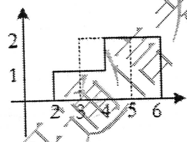

(实线为 $f_{1}(\tau)$, 虚线为 $f_{2}(6 - \tau)$)

(注: 此题难度★★☆☆☆, 西瓜哥原创小结: 注意算卷积积分时, 不是看两个函数图像围成的面积值, 要看在公共范围内, 被积函数的取值, 然后相乘积分。)

题 3 解: 选 A

零状态响应 $y_{zs} = |f(t)|$

当输入函数为 $f_{1}(t)$ 时候, 输出为 $\left|f_{1}(t)\right|$, 当输入函数为 $f_{2}(t)$ 时候, 输出为 $\left|f_{2}(t)\right|$

当输入函数为 $f_{1}(t) + f_{2}(t)$ 时候, 输出为 $\left|f_{1}(t) + f_{2}(t)\right| \neq \left|f_{1}(t)\right| + \left|f_{2}(t)\right|$

所以系统是非线性的。

(西瓜哥原创小结: 此题难度 $\bigstar \bigstar \bigstar \bigstar \bigstar$, 本题考察线性系统的判断, 线性主要包括齐次性和叠加性。判断方法是, 系统若满足对任意激励信号: 先线性运算, 后经过系统与先经过系统后经过线性运算的结果相等。)

更多优质考研资讯，关注b站 | 公众号“刺猬哥通信电子考研”、知乎“刺猬哥通信考研”

---

题 4 解: C (刺猬哥考研团队西瓜哥 QQ:915211156)

由图可知: $y(t) = \frac{1}{T} \int_{-\infty}^{t} (x(\tau) - x(\tau - T)) d\tau = \frac{1}{T} \int_{-\infty}^{t} x(\tau) * (\delta(\tau) - \delta(\tau - T)) d\tau$

由于 $y(t) = x(t)*h(t)\Rightarrow y^{(-1)}(t) = x^{(-1)}(t)*h(t) = x(t)*h^{(-1)}(t)$

可得 $y(t) = x(t) * \frac{1}{T} \int_{-\infty}^{t} (\delta(\tau) - \delta(\tau - T)) d\tau$

故可知 $h(t) = \frac{1}{T} \int_{-\infty}^{t} (\delta(\tau) - \delta(\tau - T)) d\tau$ （刺猬哥考研团队西瓜哥QQ:915211156）

(西瓜哥原创小结: 此题难度 $\star \star \star \star \star$, 已知 $f(t) = f_{1}(t) * f_{2}(t)$, 在 $f_{1}(-\infty) = f_{2}(-\infty) = 0$ 条件下, 有 $f(t) = f_{1}(t) * f_{2}(t) = f_{1}^{(1)}(t) * f_{2}^{(-1)}(t) = f_{1}^{(-1)}(t) * f_{2}^{(1)}(t)$ 上标 (1) 是微分, 上标 (-1) 是积分。)

题 5 解: B (刺猬哥考研团队西瓜哥 QQ:915211156)

零输入响应：部分自由响应

零状态响应：部分自由响应+强迫响应

(注: 此题难度★☆☆☆☆, 西瓜哥原创小结: 概念题, 下面给出几个响应之间的关系: ①全响应=零输入+零状态; ②全响应=自由+强迫; ③自由响应=所有零输入+部分零状态 (跟零输入形式类似); 强迫响应=部分零状态 (跟输入激励形式类似); ④自由响应是方程的齐次解; 强迫响应是方程的特解。)

题 6 解: C

$$
\begin{array}{l} x _ {1} (t) * x _ {2} (t) = \sin t u (t) * [ \delta^ {\prime} (t) + u (t) ] \\ = \sin t u (t) * \delta^ {\prime} (t) + \sin t u (t) * u (t) \\ = [ \sin t u (t) ] ^ {\prime} + \int_ {- \infty} ^ {t} \sin \tau u (\tau) d \tau \\ = \cos t u (t) + (- \cos t + 1) u (t) \\ = u (t) \\ \end{array}
$$

(注: 此题难度★☆☆☆☆, 西瓜哥原创小结: 本题考查卷积积分的运算, 常用卷积公式)

积公式有 $f(t)*u(t) = \int_{-\infty}^{t}f(\tau)d\tau ;f(t)*\delta (t) = f(t);f(t)*\delta '(t) = f'(t)\circ)$

---

题 7 解: C (刺猬哥考研团队西瓜哥 QQ:915211156)

$$
\begin{array}{l} f (t) * \delta (a t) = f (t) * \frac {1}{| a |} \delta (t) = \frac {1}{| a |} f (t) \\ f (t) \cdot \delta (t) = f (0) \delta (t) \\ f (t) \cdot \delta^ {\prime} (t) = f (0) \cdot \delta^ {\prime} (t) - f ^ {\prime} (0) \delta (t) \\ \end{array}
$$

(注: 此题难度★☆☆☆☆, 西瓜哥原创小结: 基础题, 考察冲激函数及冲激偶函数的性质, 序列 R 均有总结, 建议人手一份, 有时间多看看。)

题 8 解: 2 (刺猬哥考研团队西瓜哥 QQ:915211156)

$$
\begin{array}{l} \left\{ \begin{array}{l} y ^ {\prime} (0 _ {-}) = 2 \\ y (0 _ {-}) = 2 \end{array} \right. \\ f (t) = e ^ {- t} u (t), \quad f ^ {\prime} (t) = - e ^ {- t} u (t) + \delta (t) \\ \end{array}
$$

利用冲激函数匹配法： $y^{\prime \prime}(t) + 3y^{\prime}(t) + 2y(t) = \delta (t)$

$$
\left\{\begin{array}{l}y ^ {\prime} (0 _ {+}) - y ^ {\prime} (0 _ {-}) = 1\\y (0 _ {+}) - y (0 _ {-}) = 0\end{array}\right.\rightarrow \left\{\begin{array}{l}y ^ {\prime} (0 _ {-}) = 2\\y (0 _ {-}) = 2\end{array}\right.
$$

(注: 此题难度★★☆☆☆, 西瓜哥原创小结: 本题考察冲激函数匹配法相关内容,当然也可以通过 s 域求解出响应方程代值计算。)

题 9 解: $f(t) = t u(t) - (t - T) u(t - T) - (t - 2T) u(t - 2T) + (t - 3T) u(t - 3T)$

$$
u (t) ^ {*} u (t) = t u (t)
$$

$$
\begin{array}{l} f (t) = [ u (t) - u (t - T) ] ^ {*} [ u (t) - u (t - 2 T) ] \\ = t u (t) - (t - T) u (t - T) - (t - 2 T) u (t - 2 T) + (t - 3 T) u (t - 3 T) \\ \end{array}
$$

或者写成分段函数形式 $f(t) = \left\{ \begin{array}{ll}t,0\leq t\leq T\\ T,T <   t\leq 2T\\ 3T - t,2T <   t\leq 3T\\ 0,else \end{array} \right.$

(注: 此题难度★★☆☆☆, 考察卷积的计算, 可以记住常见卷积 $u(t)^{*} u(t) = t u(t)$,更多优质考研资讯, 关注b站 | 公众号“刺猬哥通信电子考研”、知乎“刺猬哥通信考研”

---

题10解： $-3e^{-\frac{1}{2} t + 1}u(t) + 6e\delta (t)$

$$
\begin{array}{l} 6 e ^ {- \frac {1}{2} t} u (t) * \frac {d}{d t} [ e ^ {- 2 t + 1} \delta (t) ] = \frac {d}{d t} [ 6 e ^ {- \frac {1}{2} t} u (t) ] * e ^ {- 2 t + 1} \delta (t) \\ = \left[ - 3 e ^ {- \frac {1}{2} t} u (t) + 6 e ^ {- \frac {1}{2} t} \delta (t) \right] * e \delta (t) \\ = - 3 e ^ {- \frac {1}{2} t + 1} u (t) + 6 e \delta (t) \\ \end{array}
$$

(西瓜哥原创小结: 此题难度 $\star \star \star \star \star$, 送分题, 熟练掌握卷积的性质, 可大大简化计算量。) (刺猬哥考研团队西瓜哥 QQ:915211156)

题 11 解: $(t - 3) \cos \frac{\pi (t - 3)}{3} u(t - 3)$

设 $ y(t) = x(t)*h(t) $，则有 $ y(t - t_1 - t_2) = x(t - t_1)*h(t - t_2) $

证明：已知 $y(t) = \int_{-\infty}^{+\infty}x(\tau)h(t - \tau)d\tau$

$$
\begin{array}{l} x \left(t - t _ {1}\right) * h \left(t - t _ {2}\right) = \int_ {- \infty} ^ {+ \infty} x \left(\tau - t _ {1}\right) h \left(t - \tau - t _ {2}\right) d \tau , \text {令} \tau - t _ {1} = \tau^ {\prime} \Rightarrow \tau = t _ {1} + \tau^ {\prime}, d \tau = d \tau^ {\prime} \\ = \int_ {- \infty} ^ {+ \infty} x \left(\tau^ {\prime}\right) h \left(t - \tau^ {\prime} - t _ {1} - t _ {2}\right) d \tau^ {\prime} = \int_ {- \infty} ^ {+ \infty} x \left(\tau^ {\prime}\right) h \left[ \left(t - t _ {1} - t _ {2}\right) - \tau^ {\prime} \right] d \tau^ {\prime} = y \left(t - t _ {1} - t _ {2}\right) \\ \end{array}
$$

故 $f_{1}(t - 1)^{*}f_{2}(t - 2) = (t - 3)\cos \frac{\pi(t - 3)}{3} u(t - 3)$

(西瓜哥原创小结: 此题难度 $\star \star \star \star \star$, 送分题, 卷积时移性质的运用。)

题12解： $e^{-t}(1 - \cos t)u(t)$

$$
\begin{array}{l} y (t) = \int_ {- \infty} ^ {+ \infty} f (\tau) h (t - \tau) d t = \int_ {- \infty} ^ {+ \infty} \tau e ^ {- \tau} u (\tau) \cdot e ^ {- t + \tau} \cos (t - \tau) u (t - \tau) d \tau \\ = e ^ {- t} \int_ {0} ^ {t} \tau \cos (t - \tau) d \tau \text {令} t - \tau = u, d \tau = - d u \\ = e ^ {- t} \int_ {0} ^ {t} (t - u) \cos (u) d u \\ = e ^ {- t} (1 - \cos t) u (t) \\ \end{array}
$$

(西瓜哥原创小结: 此题难度 $\bigstar \bigstar \bigstar \bigstar$, 学过高数的变限积分都知道, 第二行需要更多优质考研资讯, 关注 b 站 | 公众号“刺猬哥通信电子考研”、知乎“刺猬哥通信考研”

---

题 13 解:

由题意: 先写出齐次方程为: $\frac{d^2}{dt^2} y(t) + 5\frac{d}{dt} y(t) + 6y(t) = 0$

其特征方程为: $\alpha^{2} + 5\alpha + 6 = 0$, 特征根为 $\alpha_{1} = -2, \alpha_{2} = -3$

因此齐次解形式为 $y_{n}(t) = C_{1}e^{-2t} + C_{2}e^{-3t}$

设特解形式 $y_{p}(t) = Be^{-t}$, 将 $y_{p}(t)$ 及 $x(t)$ 代入原方程, 有

$$
B e ^ {- t} - 5 B e ^ {- t} + 6 B e ^ {- t} = - e ^ {- t} + 2 e ^ {- t} \Rightarrow B = \frac {1}{2}
$$

故 $y_{p}(t) = \frac{1}{2} e^{-t}$ （刺猬哥考研团队西瓜哥 QQ:915211156）

(西瓜哥原创小结: 此题难度★★☆☆☆, 微分方程的齐次解和特解, 实际上属于数学内容, 考的频率较低, 若是完全不懂, 考试碰到铁定吃亏。)

题 14 解:

(1)输入 $e_{1}(t)$ 和其零状态响应 $r_{1}(t)$ 的拉氏变换为:

$$
E _ {1} (s) = \frac {1}{s} \left(e ^ {- 2 s} - e ^ {- s}\right), R _ {1} (s) = \frac {1}{s + 2} \left(e ^ {- 2 s} - e ^ {- s}\right)
$$

故系统函数和单位冲激响应为:

$$
H (s) = \frac {R _ {1} (s)}{E _ {1} (s)} = \frac {s}{s + 2} = 1 - \frac {2}{s + 2}, h (t) = \delta (t) - 2 e ^ {- 2 t} u (t)
$$

(2)输入 $e_{2}(t)$ 的拉氏变换为:

$$
E _ {2} (s) = \left[ - \frac {d}{d s} \frac {1}{s + 2} \right] e ^ {- s} = \frac {e ^ {- s}}{(s + 2) ^ {2}}
$$

所以其零状态响应的拉氏变换为:

$$
R _ {2} (s) = E _ {2} (s) H (s) = \frac {s e ^ {- s}}{(s + 2) ^ {3}} = \left[ \frac {1}{(s + 2) ^ {2}} - \frac {2}{(s + 2) ^ {3}} \right] e ^ {- s}
$$

求其逆变换得

---

$$
r _ {2} (t) = (t - 1) e ^ {- 2 (t - 1)} u (t - 1) - (t - 1) ^ {2} e ^ {- 2 (t - 1)} u (t - 1)
$$

(西瓜哥原创小结: 此题难度 $\star \star \star \star \star$, 本题求解冲激响应时发现, 冲激响应本质是零状态响应, 可以直接用变换法导出结果, $H(s) = \frac{R_{1}(s)}{E_{1}(s)}$ )

题 15 解:

由题意: 设 $x_{1}(0) = 1, \longrightarrow y_{1zi}(t)$, $x_{2}(0) = 1, \longrightarrow y_{1zi}(t)$, 系统冲激响应为 $h(t)$;

由（1）可得 $y_{1zi}(t) + y_{2zi}(t) = 2e^{-t}u(t)$

由（2）可得 $y_{1zi}(t) - y_{2zi}(t) = 2e^{-2t}u(t)$

由（3）可得 $y_{1zi}(t) + y_{2zi}(t) + x(t)*h(t) = (1 - e^{-t})u(t)$

可知 $y(t) = y_{1zi}(t) + 2y_{2zi}(t) + 3x(t - 1)*h(t) = (3e^{-t} - e^{-2t})u(t) + 3(1 - 3e^{-t + 1})u(t - 1)$

(西瓜哥原创小结: 中等题, 考察响应求解, 本题思路在于理解一个初始条件对应一个零输入响应, 再结合 LTI 系统性质列方程, 求解零输入以及零状态响应。)

题 16 解: (刺猬哥考研团队西瓜哥 QQ:915211156)

先求单位冲激响应: $h(t)$ 满足方程: $h^{\prime \prime}(t) + 6 h^{\prime}(t) + 5 h(t) = \delta^{\prime}(t) + 5 \delta(t)$

冲激响应即零状态响应, 所以 $t < 0$ 时, $h(t) = 0$, 则 $h(0_{-}) = 0, h^{\prime}(0_{-}) = 0$

$$
t > 0 _ {+} \text {时 ,} h ^ {\prime \prime} (t) + 6 h ^ {\prime} (t) + 5 h (t) = 0
$$

方程特征根: -1, -5, 则 $h(t) = C_{1} e^{-t} + C_{2} e^{-5 t}$

$$
t <   0 \text {时 ，} h (t) = 0, \text {则} h \left(0 _ {-}\right) = 0, h ^ {\prime} \left(0 _ {-}\right) = 0
$$

用冲激匹配法

$$
\begin{array}{l} \left\{ \begin{array}{l} h ^ {\prime \prime} (t) = a \delta^ {\prime} (t) + b \delta (t) + c u (t) \\ h ^ {\prime} (t) = a \delta (t) + b u (t) \\ h (t) = a u (t) \end{array} \right. \Rightarrow \left\{ \begin{array}{l} a = 1 \\ b = - 1 \end{array} \right. \Rightarrow \left\{ \begin{array}{l} h (0 +) = 1 \\ h ^ {\prime} (0 +) = - 1 \end{array} \right. \Rightarrow \left\{ \begin{array}{l} C _ {1} = 1 \\ C _ {2} = 0 \end{array} \right. \\ \Rightarrow h (t) = e ^ {- t} u (t) \\ \end{array}
$$

---

则零状态响应: $y_{zs}(t) = h(t)^{*} f(t) = e^{-t} u(t)^{*} e^{-3t} u(t) = \frac{1}{2} e^{-t} u(t) - \frac{1}{2} e^{-3t} u(t)$

再求零输入响应: $y_{zi}(t) = B_1 e^{-t} + B_2 e^{-5t}$, 代入 $y'(0_+) = 1, y(0_+) = 0$.

$$
\Rightarrow \left\{ \begin{array}{l} B _ {1} = \frac {1}{4} \\ B _ {2} = - \frac {1}{4} \end{array} \right. \Rightarrow y _ {z i} = \frac {1}{4} e ^ {- t} - \frac {1}{4} e ^ {- 5 t}
$$

全响应: $y(t) = y_{zs}(t) + y_{zi}(t) = \frac{3}{4} e^{-t} u(t) - \frac{1}{4} e^{-5t} u(t) - \frac{1}{2} e^{-3t} u(t)$

强迫响应: $-\frac{1}{2} e^{-3t} u(t)$

自由响应: $\frac{3}{2} e^{-t} u(t) - \frac{1}{4} e^{-5 t} u(t)$ (刺猬哥考研团队西瓜哥 QQ:915211156)

(注: 此题难度★★☆☆☆, 西瓜哥原创小结: 本题求解冲激响应时发现, 冲激响应本质是零状态响应, 但最终求解时却可以转换至零输入求解, 可以对这部分总结下。最后注意对比零状态响应和强迫响应、零输入响应和自由响应之间的区别。近年真题中越来越喜欢考查时域法求解, 考生要重视。)

题 17 解:

(1) $y_{zs}(t) = \int_{-\infty}^{t} e^{-(t - \tau)} x(\tau - 3)d\tau$

令 $m = \tau - 3$, 则有下面的转换:

$$
\begin{array}{l} y _ {z s} (t) = \int_ {- \infty} ^ {t - 3} e ^ {- (t - 3 - m)} x (m) d m \\ = \int_ {- \infty} ^ {+ \infty} e ^ {- (t - 3 - m)} u (t - 3 - m) x (m) d m \\ = e ^ {- (t - 3)} u (t - 3) ^ {*} x (t) \\ \end{array}
$$

因为零状态响应是输入信号和冲激函数的卷积, 所以可以得到 $h(t) = e^{-(t - 3)} u(t - 3)$

(2)

当输入信号为 $x(t) = u(t + 1) - u(t - 1)$ 时,

$$
y _ {z s} (t) = x (t) * h (t) = e ^ {- 3 (t - 3)} u (t - 3) * [ u (t + 1) - u (t - 1) ]
$$

根据常见的卷积计算 $e^{-t} u(t) * u(t) = (1 - e^{-t}) u(t)$ 以及卷积运算的时移性质有:

$$
y _ {z s} (t) = [ 1 - e ^ {- (t - 2)} ] u (t - 2) - [ 1 - e ^ {- (t - 4)} ] u (t - 4)
$$

更多优质考研资讯, 关注b站 | 公众号“刺猬哥通信电子考研”、知乎“刺猬哥通信考研”

---

写成分段函数形式有 $y_{zs}(t) = \left\{ \begin{array}{ll}0,t <   2\\ 1 - e^{-(t - 2)},2\leq t\leq 4\\ e^{-(t - 4)} - e^{-(t - 2)},t > 4 \end{array} \right.$

(3)从系统框图可知总系统函数为:

$$
h (t) = h _ {1} (t) * h _ {0} (t) + h _ {1} (t) = e ^ {- (t - 5)} u (t - 5) + e ^ {- (t - 3)} u (t - 3)
$$

零状态响应 $y_{3z s}(t) = x(t) * h(t)$ （刺猬哥考研团队西瓜哥 QQ:915211156）

$$
\begin{array}{l} y _ {3 z s} (t) = [ u (t + 1) - u (t - 1) ] * \left[ e ^ {- (t - 5)} u (t - 5) + e ^ {- (t - 3)} u (t - 3) \right] \\ = (1 - e ^ {- (t - 4)}) u (t - 4) - (1 - e ^ {- (t - 6)}) u (t - 6) + (1 - e ^ {- (t - 2)}) u (t - 2) - (1 - e ^ {- (t - 4)}) u (t - 4) \\ = - (1 - e ^ {- (t - 6)}) u (t - 6) + (1 - e ^ {- (t - 2)}) u (t - 2) \\ \end{array}
$$

(注: 此题难度★★☆☆☆, 西瓜哥原创小结: 本题考察两个点: 1) 输入输出方程给定条件下, 求解系统的冲激响应。2) 已知冲激响应的形式和输入信号的形式求解系统的零状态响应, 时域里体现为冲激响应和输入信号的卷积。求解卷积的过程中发现平时积累点常见的卷积计算结果再配合上卷积的相应性质能大大简化计算。)(刺猬哥考研团队西瓜哥QQ:915211156)

题18解：

当激励 $x(t) = \delta (t)$ 时, 为冲激响应 $h(t)$, 由已知的系统微分方程我们知:

$$
h ^ {\prime \prime} (t) + 3 h ^ {\prime} (t) + 2 h (t) = \delta^ {\prime} (t) + 2 \delta (t) \dots \dots
$$

其特征方程为: $\lambda^2 + 3\lambda + 2 = 0$, 解得其特征值为 $\lambda_1 = -1, \lambda_2 = -2$

$h(t)$ 的齐次解为 $h(t) = a e^{-t} + b e^{-2 t}$

根据冲激函数匹配法，我们知：

$\left\{ \begin{array}{l}h^{\prime \prime}(t) = m\delta^{\prime}(t) + n\delta (t) + q\Delta u(t)\\ h^{\prime}(t) = m\delta (t) + n\Delta u(t)\\ h(t) = m\Delta u(t) \end{array} \right.$ ，代入系统微分方程得到：

$$
m \delta^ {\prime} (t) + n \delta (t) + q \Delta u (t) + 3 q \delta (t) + n \Delta u (t) + 2 m \Delta u (t) = \delta^ {\prime} (t) + 2 \delta (t)
$$

对比左右系数得到: $m = 1, n = -1, q = 1$

---

由系统的初始条件 $h(0_{+}) = m + h(0_{-}) = 1$, 及 $h^{\prime}(0_{+}) = n + h^{\prime}(0_{-}) = -1$

可得: $a = 1, b = 0$, 则 $h(t) = e^{-t} u(t)$

当输入信号为 $f(t) = e^{-3t} u(t)$ 时,

零状态响应 $y_{zs}(t) = f(t)*h(t) = \int_{-\infty}^{+\infty}e^{-3\tau}u(\tau)e^{-(t - \tau)}u(t - \tau)d\tau = \frac{1}{2} (e^{-t} - e^{-3t})u(t)$

(西瓜哥原创小结: 此题难度 $\bigstar \bigstar \bigstar \bigstar \bigstar$, 输入输出方程给定条件下, 求解系统的冲激响应。2) 已知冲激响应的形式和输入信号的形式求解系统的零状态响应, 时域里体现为冲激响应和输入信号的卷积。求解卷积的过程中发现平时积累点常见的卷积计算结果再配合上卷积的相应性质能大大简化计算。)

题 19 解: (刺猬哥考研团队西瓜哥 QQ:915211156)

已知 $f_{1}(t) = [u(t + 1) - 2u(t) + u(t - 1)]*\sum_{n = -\infty}^{+\infty}\delta (t - 2n),f_{2}(t) = u(t) - u(t - 3)$

$$
y (t) = f _ {1} (t) * f _ {2} (t) = [ u (t + 1) - 2 u (t) + u (t - 1) ] * \sum_ {n = - \infty} ^ {+ \infty} \delta (t - 2 n) * [ u (t) - u (t - 3) ]
$$

$ = [u(t + 1) - 2u(t) + u(t - 1)]*[u(t) - u(t - 3)]*\sum_{n = -\infty}^{+\infty}\delta (t - 2n) $ （卷积的结合律）

设 $f(t) = [u(t + 1) - 2u(t) + u(t - 1)]*[u(t) - u(t - 3)]$

$$
= (t + 1) u (t + 1) - 2 t u (t) + (t - 1) u (t - 1) - (t - 2) u (t - 2) + 2 (t - 3) u (t - 3) - (t - 4) u (t - 4)
$$

$$
= \left\{ \begin{array}{l} 0, t <   - 1 \\ t + 1, - 1 <   t <   0 \\ - t + 1, 0 <   t <   1 \\ 0, 1 <   t <   2 \\ - t + 2, 2 <   t <   3 \\ t - 4, 3 <   t <   4 \\ 0, t > 4 \end{array} \right.
$$

$f(t)$ 图形如下:

---

24最强信号辅导班招生啦！让你节省时间，不走弯路，取得佳绩！联系西瓜哥qq915211156 加Q群709502924，使用刺猬哥团队正版核心序列ORK，享受高质量全天候优质答疑指导

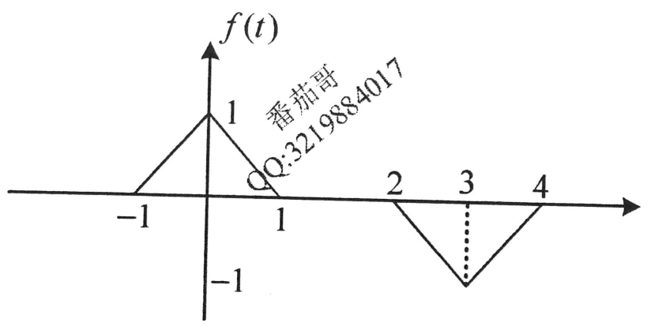

$$
y (t) = [ (t + 1) u (t + 1) - 2 t u (t) + (t - 1) u (t - 1) - (t - 2) u (t - 2) - 2 (t - 3) u (t - 3) - (t - 4) u (t - 4) ] *
$$

$\sum_{n = -\infty}^{+\infty}\delta (t - 2n)$ （西瓜哥QQ915211156）

$y(t)$ 图形如下：（刺猬哥考研团队西瓜哥 QQ:915211156）

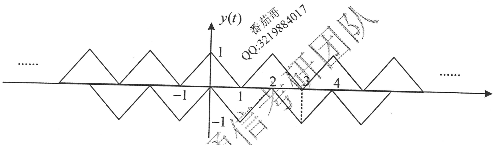

由图可知，周期延拓后图形呈现周期性，且周期为 2

对相同区间范围内的图形进行叠加，以区间 $(-1, 1)$ 为例

$-1 < t < 0$ 时, $t + 1 + t = 2t + 1$

$0 < t < 1$ 时, $-t + 1 - t = -2t + 1$

故叠加后 $y(t)$ 图形如下:

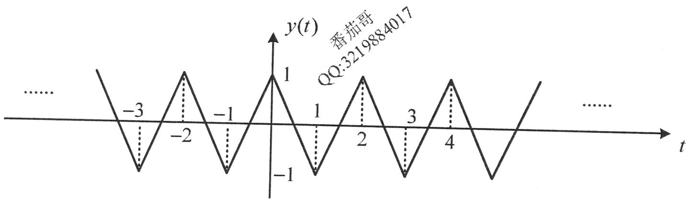

(西瓜哥原创小结: 此题难度 $\bigstar \bigstar \bigstar \bigstar \bigstar$, 将卷积计算和其性质考查到极致, 不可多得的好题, 值得三刷。) (刺猬哥考研团队西瓜哥 QQ:915211156)

更多优质考研资讯，关注b站 | 公众号“刺猬哥通信电子考研”、知乎“刺猬哥通信考研”

---

题 20 解:

由题意可知：（刺猬哥考研团队西瓜哥QQ:915211156）

(1) 特征方程: $\lambda^2 + a_0\lambda + a_1 = 0$ 的特征根为 $-1, -3$

解得: $\left\{ \begin{array}{l} a_{0} = 4 \\ a_{1} = 3 \end{array} \right.$

(2) 设零输入响应 $y_{zi}(t) = A_1 e^{-t} + A_2 e^{-3t}$

当输入为 $x_{1}(t) = e^{-2t}u(t)$, 全响应 $y_{1}(t) = (-e^{-t} + e^{-2t} - e^{-3t})u(t)$;

可得: $y_{1}\left(0_{+}\right) = -1, y_{1}^{\prime}\left(0_{+}\right) = 2$

利用冲激函数匹配法: $y_{1}''(t) + 4y_{1}'(t) + 3y_{1}(t) = (b_{1} - 2b_{0})e^{-2t}u(t) + b_{0}\delta(t)$

$$
\left\{ \begin{array}{l} y _ {1} ^ {\prime} (0 _ {+}) - y _ {1} ^ {\prime} (0 _ {-}) = b _ {0} \\ y _ {1} (0 _ {+}) - y _ {1} (0 _ {-}) = 0 \end{array} \right. \Rightarrow \left\{ \begin{array}{l} y _ {1} ^ {\prime} (0 _ {-}) = 2 - b _ {0} \\ y _ {1} (0 _ {-}) = - 1 \end{array} \right. \tag {①}
$$

当输入为 $x_{2}(t) = \delta (t) - 2e^{-2t}u(t)$, 全响应 $y_{2}(t) = (3e^{-t} - 2e^{-2t} - 5e^{-3t})u(t)$;

可得: $y_{2}\left(0_{+}\right) = -4, y_{2}^{\prime}\left(0_{+}\right) = 16$.

利用冲激函数匹配法：（刺猬哥考研团队西瓜哥QQ:915211156）

$$
y _ {2} ^ {\prime \prime} (t) + 4 y _ {2} ^ {\prime} (t) + 3 y _ {2} (t) = (4 b _ {0} - 2 b _ {1}) e ^ {- 2 t} u (t) + (b _ {1} - 2 b _ {0}) \delta (t) + b _ {0} \delta^ {\prime} (t)
$$

$$
\begin{array}{l} \left\{ \begin{array}{l} y _ {2} ^ {\prime \prime} (t) = a \delta^ {\prime} (t) + b \delta (t) + c e ^ {- 2 t} u (t) \\ y _ {2} ^ {\prime} (t) = a \delta (t) + b e ^ {- 2 t} u (t) \\ y _ {2} (t) = a u (t) + \dots \end{array} \right. \Rightarrow \left\{ \begin{array}{l} a = b _ {0} \\ 4 a + b = b _ {1} - 2 b _ {0} \end{array} \right. \Rightarrow \left\{ \begin{array}{l} a = b _ {0} \\ b = b _ {1} - 6 b _ {0} \end{array} \right. \\ \left\{ \begin{array}{l} y _ {2} ^ {\prime} (0 _ {+}) - y _ {2} ^ {\prime} (0 _ {-}) = b _ {1} - 6 b _ {0} \\ y _ {2} (0 _ {+}) - y _ {2} (0 _ {-}) = b _ {0} \end{array} \right. \Rightarrow \left\{ \begin{array}{c} y _ {2} ^ {\prime} (0 _ {-}) = 1 6 - b _ {1} + 6 b _ {0} \\ y _ {2} (0 _ {-}) = - 4 - b _ {0} \end{array} \right. \tag {②} \\ \end{array}
$$

由于系统初始条件始终不变，故联立①②可得 $\left\{ \begin{array}{l} b_{0} = -3 \\ b_{1} = -7 \end{array} \right.$

y（0）=5进而得到初始值 y(0_)=-1 e-t-2e-3t

$$
y _ {z s 1} (t) = (- 2 e ^ {- t} + e ^ {- 2 t} + e ^ {- 3 t}) u (t)
$$

更多优质考研资讯，关注b站 | 公众号“刺猬哥通信电子考研”、知乎“刺猬哥通信考研”

---

$$
y _ {z s 2} (t) = h (t) - 2 y _ {z s 1} (t) = \left(2 e ^ {- t} - 2 e ^ {- 2 t} - 3 e ^ {- 3 t}\right) u (t)
$$

故 $h(t) = (-2e^{-t} - e^{-3t})u(t)$

(QQ915211156 西瓜哥原创小结: 此题难度★★★★★, 该题难点在于用时域求解,整体过程对数学功底要求很高, 同学们第一次学往往晕头转向的, 难度系数拉满;考试过程中若遇到, 思维要灵活多变, 在草稿纸上先用频域的方法将答案解出, 在试卷上根据题目条件列写时域等式关系, 最后直接得出结果, 也起到了验证答案的作用。) (刺猬哥考研团队西瓜哥 QQ:915211156)

题 20 解:

(1)

已知输入 $ f(t) $ 的全响应为 $ y(t) = (1 - e^{-2t} + 2e^{-3t})u(t) $，输入 $ f(t) = u(t) $，所以强迫响应为 $ u(t) $，由剩下的自由响应部分 $ (-e^{-2t} + 2e^{-3t})u(t) $ 可以得到极点为 $ s_1 = -2, s_2 = -3 $ 从而 $ s^2 + as + b = (s + 2)(s + 3) = s^2 + 5s + 6 \Rightarrow a = 5, b = 6 $

对 $f(t)$ 进行拉氏变换得 $F(s) = \frac{1}{s}$

$$
Y _ {z s} (s) = H (s) F (s) = \frac {s + c}{s (s + 2) (s + 3)}
$$

对全响应两边求拉氏变换得:

$ Y(s) = \frac{1}{s} - \frac{1}{s + 2} + \frac{2}{s + 3} = \frac{2s^2 + 6s + 6}{s(s + 2)(s + 3)} $ 说明极点 $ s = 0 $ 引入了强迫响应

则 $Y_{zi}(s) = Y(s) - Y_{zs}(s) = \frac{2s^2 + 5s + 6 - c}{s(s + 2)(s + 3)}$

零输入响应下, 是没有外加激励信号的, 也即没有强迫响应, 所以由激励信号 $u(t)$影响的部分 (即 s) 应该被约去, 只有 $c = 6$ 时情况成立。

(2)

由第一小问知:

---

$$
\left\{ \begin{array}{l} Y _ {z s} (s) = \frac {s + 6}{s (s + 2) (s + 3)} \\ Y _ {z i} (s) = \frac {2 s + 5}{(s + 2) (s + 3)} \end{array} \right.
$$

利用部分分式法对上两个式子进行展开:

$$
Y _ {z s} (s) = \frac {s + 6}{s (s + 2) (s + 3)} = \frac {1}{s} + \frac {- 2}{s + 2} + \frac {1}{s + 3}
$$

从而 $y_{zs}(t) = (1 - 2e^{-2t} + e^{-3t})u(t)$

同理 $Y_{zi}(s) = \frac{2s + 5}{(s + 2)(s + 3)} = \frac{1}{s + 2} +\frac{1}{s + 3}$

从而 $y_{zi}(t) = (e^{-2t} + e^{-3t})u(t)$

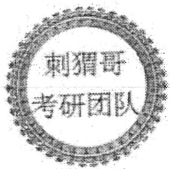

西瓜哥原创编写

---

# 南昌考研信号与系统核心序列 O

# 序列三——傅里叶变换

# 西瓜哥原创作答

1. 下图所示周期信号 $f(t)$ 的傅里叶级数中所含有的频率分量是 ( )；

A. 余弦项的奇次谐波, 无直流分量

B. 正弦项的偶次谐波, 直流

C. 正弦和余弦项的偶次谐波, 直流

D. 正弦和余弦项的奇次谐波, 无直流

(虚线也是信号的一部分)

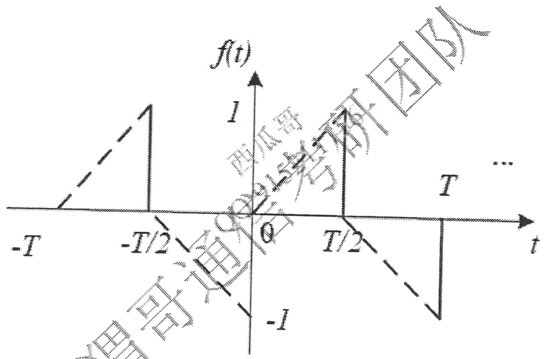

2. 若 $f(t)$ 的傅里叶变换为 $F(j \omega)$, 则 $t f(3 t)$ 的傅里叶变换为 ( )；

A. $j F \left(j \frac{\omega}{3}\right)$

B. $-j \frac{1}{3} \frac{d}{d\omega} F\left(j \frac{\omega}{3}\right)$

C. $j \frac{1}{9} \frac{d}{d\omega} F\left(j \frac{\omega}{3}\right)$

D. $j \frac{1}{3} \frac{d}{d\omega} F\left(j \frac{\omega}{3}\right)$

3. 求 $f(t) = \sin \left(w_{0} t\right) u(t)$ 的傅里叶变换 ( )。(刺猬哥考研团队西瓜哥 QQ:915211156)

A. $\frac{\pi}{j} [\delta (w - w_0) - \delta (w + w_0)]$

B. $\pi \left[ \delta \left( w + w _ { 0 } \right) - \delta \left( w - w _ { 0 } \right) \right]$

C. $\frac{\pi}{2} \left[ \delta \left( w + w_{0} \right) - \delta \left( w - w_{0} \right) \right] + \frac{j w}{w_{0}^{2} - w^{2}}$

D. $j \frac{\pi}{2} \left[ \delta \left( w + w_{0} \right) - \delta \left( w - w_{0} \right) \right] + \frac{w_{0}}{w_{0}^{2} - w^{2}}$

---

4. 已知 $f(t) = e^{-|t|} \xrightarrow{\mathcal{F}} \frac{2}{1 + w^2}$, 则 $g(t) = \frac{4t}{(1 + t^2)^2}$ 的傅氏变换为 ( )。

A. $G(w) = -j2\pi we^{-|w|}$

B. $G(w) = -2\pi we^{-|w|}$

C. $G(w) = j2\pi w e^{-|w|}$

D. $G(w) = 2\pi w e^{-|w|}$

(刺猬哥考研团队西瓜哥 QQ:915211156)

5. 某信号的频谱密度函数为 $F(jw) = [u(w + 2\pi) - u(w - 2\pi)]e^{-j3w}$, 则 $f(t) = (\quad)$。

A. $S a[2 \pi (t - 3)]$

B. $2 S a[2 \pi (t - 3)]$

C. $S a(2 \pi t)$

D. $2 S a (2 \pi t)$

6. 由图, 周期信号 $f(t)$ 的周期为 4 , $f(t)$ 的三角函数形式的傅里叶系数的特点是

A.既有正弦项和余弦项

B.既有正弦项又有余弦项, 又有直流项

C.仅有正弦项

D.仅有余弦项

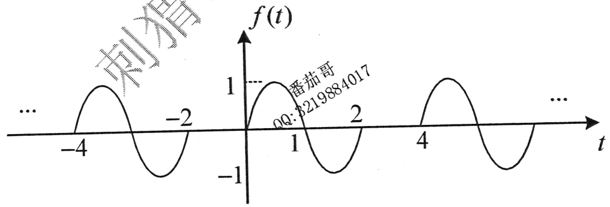

7. 如下图所示信号 $f(t)$, 其傅里叶变换 $F[f(t)] = F(j\omega) = R(\omega) + jX(\omega)$, 实部 $R(w)$ 的表示式为: ( ) ; (刺猬哥考研团队, 答疑交流群 709502924)

A. $3 \mathrm{Sa}(2 \omega)$

B. $3 \mathrm{~S} a\left(\omega / 2\right)$

C. $3 \mathrm{~S} a(\omega)$

D. $2 \operatorname{Sa}(\omega)$

---

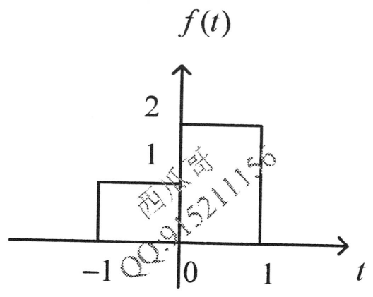

8. 如题图所示信号 $f(t)$ 的傅里叶变换 $F(j \omega) = R(\omega) + j X(\omega)$, 则信号 $y(t)$ 的傅里叶变换 $Y(j \omega)$ 为 ( )。(刺猬哥考研团队西瓜哥 QQ:915211156)

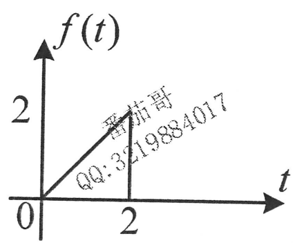

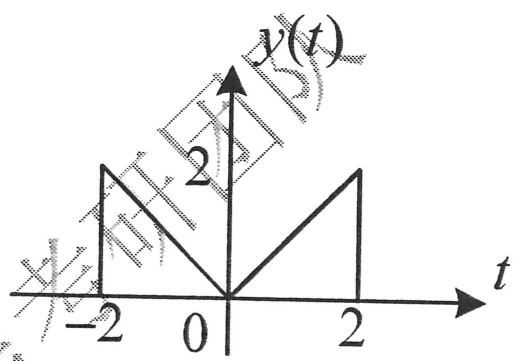

A. $R(\omega)$

B. $2 R(\omega)$

C. $X(\omega)$

D. $2 X(\omega)$

9. 已知 $ f(t) = u[\sin(\pi t)] $，则其傅里叶变换 $ F(w) = $ ________。

10. 频谱函数 $F(j\omega) = \frac{2}{j\omega}$ 的傅里叶逆变换等于

11. 周期性单位冲激序列 $\delta_{T}(t) = \sum_{n=-\infty}^{\infty} \delta(t - nT)$ 的周期为 $T = 2$ ，且 $\omega = \frac{2 \pi}{T}$ ，则其傅里叶变换为________。（刺猬哥考研团队西瓜哥 QQ:915211156）

---

12. 已知 $f(t) \xleftarrow{F} F(j\omega)$，则如下图波形 $F(0)$ 为

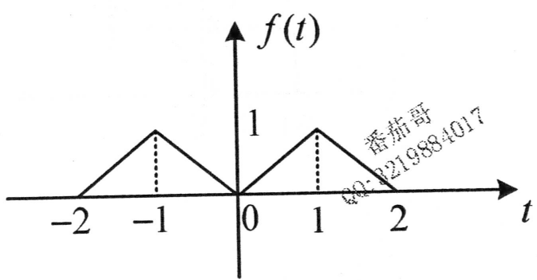

13. 已知 $x(t)$ 的傅里叶变换为 $X(j\omega)$, 则 $g(t) = \int_{-\infty}^{1 - \frac{1}{2} t} x(\tau) d\tau$ 的傅里叶变换 $G(j\omega) =$

14. 已知 $ f(t) = 4 + 3\cos \left(2t + 45^o\right) - 2\cos \left(3t - 15^o\right) + \sin \left(4t + 120^o\right) $

(1) 画出单边幅度谱和单边相位谱。

(2) 求平均功率。

15. 如图所示信号 $x(t)$ 的傅里叶变换为 $X(\omega)$, 求积分 $\int_{-\infty}^{+\infty} X(\omega) \cdot \frac{\sin \omega}{\omega} \cdot e^{-j3\omega} d\omega$, 要求有清晰的解题步骤, 只有答案者不给分。

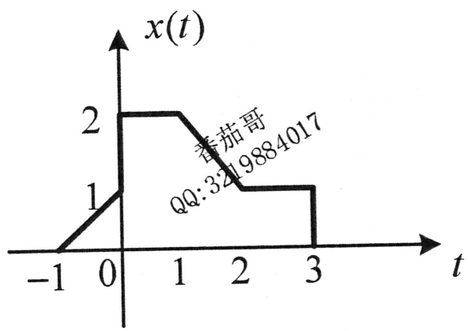

---

16. 已知 $ f(t) $ 为周期信号，周期为 2，且为 $ f(t) = \begin{cases} 1, & 0 \leq t \leq 1 \\ 0, & 1 < t < 2 \end{cases} $。求 $ f(t) $ 的三角形式傅里叶级数。

17. 试画出信号 $f(t) = \operatorname{sgn}\left\{\sin \left[\frac{\pi}{2}(t - 1)\right]\right\}$ 的波形, 并求出该信号的指数函数形式傅里叶级数表达式。（刺猬哥考研团队西瓜哥 QQ:915211156）

18. 以下 $f(t)$ 信号的傅里叶级数为: $f(t) = \frac{2E}{\pi} \sum_{n=1}^{\infty} \frac{1}{n} \sin \frac{n\pi}{2} \cos n\omega_1 t$ 。

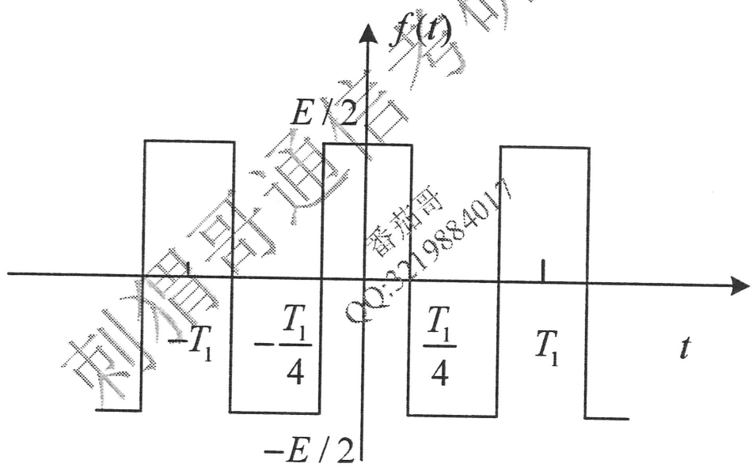

(1) 画出该信号 $f(t)$ 的 $C_{n} - \omega$ 频谱图;

(2) 写出 $f(t)$ 的复指数形式傅里叶级数, 并画出 $F_{n} - \omega$ 频谱图。

19. 已知 $ f(t) = \operatorname{sgn}(t^2 - 9) $，求其傅里叶变换 $ F(w) $.

20. 已知信号 $f(t)$ 如图所示, 其傅里叶变换 $F(j \omega)$, 分别计算:

---

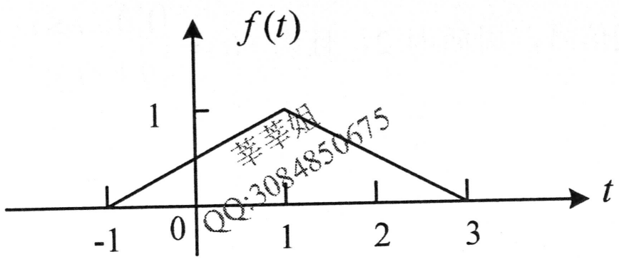

(1) $F(0)$;

(2) $\int_{-\infty}^{\infty} F(j\omega)d\omega$

(3) 信号的能量 $E = \frac{1}{2 \pi} \int_{-\infty}^{\infty} \left| F(j \omega) \right|^{2} d \omega$;

(4) $\int_{-\infty}^{\infty} F(j\omega)\frac{2\sin\omega}{\omega} e^{j2\omega}d\omega$。

21. 已知 $x_{1}(t) = S a(100 t), x_{2}(t) = S a(150 t)$, 试确定下列信号的奈奎斯特频率和奈奎斯特间隔。

(1) $x_{1}(t) + x_{2}(t)$

(2) $x_{1}(t) \cdot x_{2}(t)$

(3) $x_{1}(t)*x_{2}(t)$

(4) $x_{1}^{2}(t) + x_{2}^{2}(t)$

22. 计算下列各式：（刺猬哥考研团队西瓜哥QQ:915211156）

1) $\int_{-\infty}^{\infty} \frac{\sin^{2} \pi t}{t^{2}} dt$

2) $\int_{-\infty}^{\infty} \frac{\sin^{3} \pi t}{t^{3}} dt$

23. 试计算下列信号的傅里叶变换: (刺猬哥考研团队西瓜哥 QQ:915211156)

(1) $f_{1}(t) = \operatorname{sgn}(t)$;

(2) $f_{2}(t) = \frac{1}{\pi t}$;

(2) $f_{3}(t) = -\frac{1}{\pi t^{2}}$。

---

24最强信号辅导班招生啦！让你节省时间，不走弯路，取得佳绩！联系西瓜哥qq915211156 加Q群709502924，使用刺猬哥团队正版核心序列ORK，享受高质量全天候优质答疑指导

24. 某系统如题图所示, 输入 $f_{1}(t)$ 为带限信号, $H(j \omega)$ 为带通滤波器。

(1) 当 $\omega_{2} = 2 \omega_{1}, \omega_{a} = \omega_{1}, \omega_{b} = \omega_{2}, T = \frac{2 \pi}{\omega_{2}}$ 时, 求 $f_{s}(t)$ 的频谱和 $f_{2}(t)$ 的频谱;

(2) 当 $\omega_{1} > \omega_{2} - \omega_{1}$ 时, 为了得到 $f_{2}(t) = f_{1}(t)$, 求最大的 $\mathrm{T}$ 和常数 $\mathrm{A}, \omega_{\mathrm{a}}, \omega_{\mathrm{b}}$ 值。

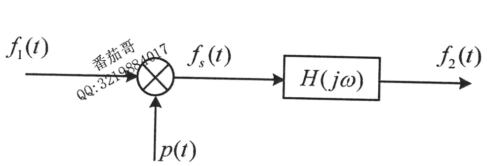

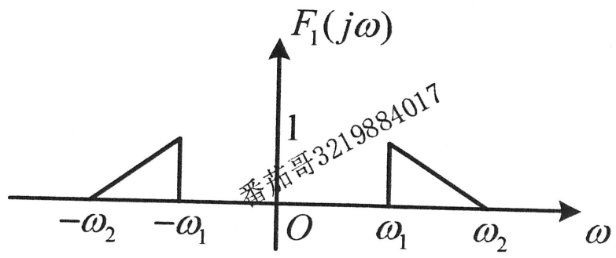

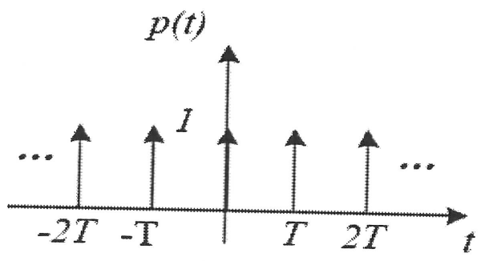

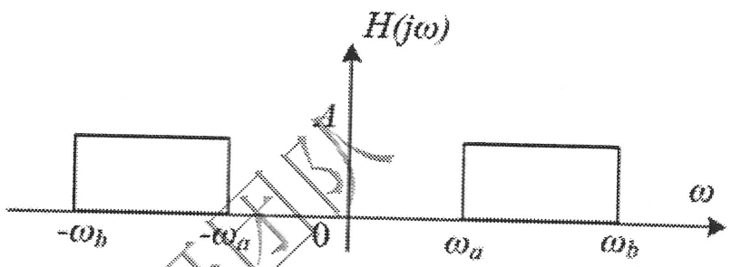

25. 系统如下图所示，已知 $x(t) = \frac{\sin\pi t}{\pi t}, s(t) = \cos 1000t$，低通滤波器的频率特性为 $H(j\omega) = [u(\omega + 2) - u(\omega - 2)]e^{-j\omega}$，求 $Y_A(j\omega), Y_B(j\omega)$ 和 $y(t)$。

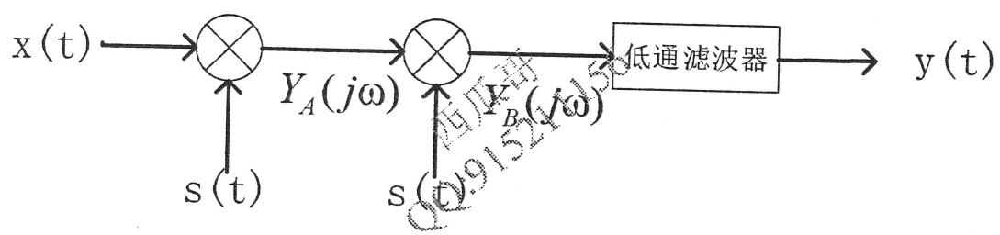

---

# 序列 O 序列三详解—西瓜哥原创作答

题 1 解: 选 D

奇次谐波满足 $f(t) = -f\left(t \pm \frac{T}{2}\right)$, 偶次谐波满足 $f(t) = f\left(t \pm \frac{T}{2}\right)$

从图像中我们可以看出该周期信号为奇次谐波，所以 B、C 排除

易知傅里叶级数展开是包含了余弦和正弦的，A排除

直流分量 $a_{0} = \frac{1}{T} \int_{-\infty}^{+\infty} f(t) dt = 0$

题2解：

$$
f (t) \xleftarrow {\mathcal {F}} F (j \omega)
$$

由傅里叶变换的尺度变换性质知 $f(3t) \longleftrightarrow \frac{1}{3} F\left(j \frac{\omega}{3}\right)$.

又由频域微分性质 $-j t f(t) \xleftarrow{\mathcal{F}} \frac{d F(j \omega)}{d \omega}$ 知 $j t f(t) \xleftarrow{\mathcal{F}} j \frac{d F(j \omega)}{d \omega}$

所以 $tf(3t) \xleftarrow{\mathcal{F}} j\frac{1}{3} [F(j\frac{\omega}{3})]' = \frac{j}{3}\frac{d}{d\omega} F(j\frac{\omega}{3})$

(注: 此题难度★☆☆☆☆, 西瓜哥原创小结: 本题考查傅里叶变换性质的应用, 本题中用到尺度变化性质和频域微分性质, 要熟练掌握。)

题 3 解: D (刺猬哥考研团队西瓜哥 QQ:915211156)

$$
f (t) = \sin \left(w _ {0} t\right) u (t) \text {欧 拉 公 式} \sin \left(w _ {0} t\right) u (t) = \frac {e ^ {j w _ {0} t} - e ^ {- j w _ {0} t}}{2 j} u (t)
$$

$$
e ^ {j w _ {0} t} u (t) \text {的 傅 里 叶 变 换 为} \pi \delta (w - w _ {0}) + \frac {1}{j (w - w _ {0})}, e ^ {j w _ {0} t} \text {仅 表 示 频 移}
$$

$$
e ^ {- j w _ {0} t} u (t) \text {的 傅 里 叶 变 换 为} \pi \delta (w + w _ {0}) + \frac {1}{j (w + w _ {0})}
$$

$$
F (w) = \frac {1}{2 j} \left[ \pi \delta \left(w - w _ {0}\right) + \frac {1}{j \left(w - w _ {0}\right)} - \pi \delta \left(w + w _ {0}\right) - \frac {1}{j \left(w + w _ {0}\right)} \right]
$$

更多优质考研资讯，关注b站 | 公众号“刺猬哥通信电子考研”、知乎“刺猬哥通信考研”

---

24最强信号辅导班招生啦！让你节省时间，不走弯路，取得佳绩！联系西瓜哥qq915211156加Q群709502924，使用刺猬哥团队正版核心序列ORK，享受高质量全天候优质答疑指导

$$
\begin{array}{l} = \frac {\pi}{2 j} [ \delta (w - w _ {0}) - \delta (w + w _ {0}) ] + \frac {1}{2} \left(\frac {1}{w + w _ {0}} - \frac {1}{w - w _ {0}}\right) \\ = j \frac {\pi}{2} [ \delta (w + w _ {0}) - \delta (w - w _ {0}) ] + \frac {w _ {0}}{w _ {0} ^ {2} - w ^ {2}} \\ \end{array}
$$

(注: 此题难度 $\star \star \star \star \star$, 西瓜哥原创小结: 常规题, 掌握欧拉公式:

$$
e ^ {j w t} = \cos w t + j \sin w t, e ^ {- j w t} = \cos w t - j \sin w t
$$

$$
\cos w t = \frac {1}{2} \left(e ^ {j w t} + e ^ {- j w t}\right), \sin w t = \frac {1}{2 j} \left(e ^ {j w t} - e ^ {- j w t}\right)
$$

题 4 解: A (刺猬哥考研团队西瓜哥 QQ:915211156)

频域微分性质: $t e^{-|t|} \xrightarrow{\mathcal{F}} j \frac{-2 \cdot 2 w}{\left(1 + w^{2}\right)^{2}} = \frac{-4 j w}{\left(1 + w^{2}\right)^{2}}$

对称性质: $\frac{-4j t}{\left(1 + t^{2}\right)^{2}} \xrightarrow{\mathcal{F}} -2 \pi w e^{-|w|}$

同乘j后， $\frac{4t}{(1 + t^2)^2}\xrightarrow{\mathcal{F}} -j2\pi we^{-|w|}$

(注: 此题难度★☆☆☆☆, 西瓜哥原创小结: 考察傅里叶变换的对称性)

题 5 解: B

$$
F (j w) = [ u (w + 2 \pi) - u (w - 2 \pi) ] e ^ {- j 3 w} = G _ {4 \pi} (w) e ^ {- j 3 w}
$$

$$
S a \left(w _ {0} t\right) \leftrightarrow \frac {\pi}{w _ {0}} G _ {2 w _ {0}} (w), \text {令} w _ {0} = 2 \pi , S a (2 \pi t) \leftrightarrow \frac {\pi}{2 \pi} G _ {4 \pi} (w) = \frac {1}{2} G _ {4 \pi} (w)
$$

$$
2 S a (2 \pi t) \leftrightarrow G _ {4 \pi} (w), \text {所 以} 2 S a [ 2 \pi (t - 3) ] \leftrightarrow [ u (w + 2 \pi) - u (w - 2 \pi) ] e ^ {- j 3 w}
$$

(注: 此题难度 $\star \star \star \star \star$, 西瓜哥原创小结: 门信号的傅里叶变换)

题 6 解: A (刺猬哥考研团队西瓜哥 QQ:915211156)

傅里叶级数的三角函数形式: $f(t) = \frac{a_{0}}{2} + \sum_{n=1}^{+\infty} a_{n} \cos (n \omega_{0} t) + \sum_{n=1}^{+\infty} b_{n} \sin (n \omega_{0} t)$

---

直流项: $a_{0} = \frac{2}{T} \int_{T} f(t) d t = 0$

$$
\begin{array}{l} a _ {n} = \frac {2}{T} \int_ {- T / 2} ^ {T / 2} f (t) \cos \left(n \omega_ {0} t\right) d t = \frac {1}{2} \int_ {0} ^ {2} \sin (\pi t) \cos \left(\frac {\pi n}{2} t\right) d t \\ = \frac {1}{4} \int_ {0} ^ {2} \sin [ (\pi + \frac {n}{2} \pi) t ] + \sin [ (\pi - \frac {n}{2} \pi) t ] d t = \frac {2}{(n ^ {2} - 4) \pi} [ \cos (n \pi) - 1 ] \\ \end{array}
$$

(已知 $\sin \alpha + \sin \beta = 2 \sin \left(\frac{\alpha + \beta}{2}\right) \cos \left(\frac{\alpha - \beta}{2}\right)$ )

$$
\begin{array}{l} b _ {n} = \frac {2}{T} \int_ {- T / 2} ^ {T / 2} f (t) \sin (n \omega_ {0} t) d t = \frac {1}{2} \int_ {0} ^ {2} \sin (\pi t) \sin (\frac {\pi n}{2} t) d t \\ = \frac {1}{4} \int_ {0} ^ {2} \cos [ (\pi - \frac {n}{2} \pi) t ] - \cos [ (\pi + \frac {n}{2} \pi) t ] d t = \left\{ \begin{array}{l} \frac {1}{2}, n = 2 \\ 0, e l s e \end{array} \right. \\ \end{array}
$$

(已知 $\cos \alpha -\cos \beta = -2\sin (\frac{\alpha + \beta}{2})\sin (\frac{\alpha - \beta}{2})$ )

故 $f(t)$ 的三角函数形式既有正弦项和余弦项。

(注: 此题难度★★★☆☆, 西瓜哥原创小结: 注意 $b_{n}$ 在 $n = 2$ 处值不为零, 绝大部分同学都会忽略。) (刺猬哥考研团队西瓜哥 QQ:915211156)

题 7 解: C

先将 $f(t)$ 分解成奇分量和偶分量: $f(t) = f_{e}(t) + f_{o}(t)$

然后求出偶分量: $f_{e}(t) = \frac{1}{2} [f(t) + f(-t)] = \frac{3}{2} [u(t + 1) - u(t - 1)]$

若时域为实数, 则信号时域的偶分量的频域等于信号频域的实部。

得: $R(\omega) = \mathcal{F}[f_{e}(t)] = 3 S a(\omega)$

这里需要记住下面的傅里叶变换。

设: $G_{\tau}(t) = u\left(t + \frac{\tau}{2}\right) - u\left(t - \frac{\tau}{2}\right)$, 也就是一个宽度为 $\tau$, 中心在原点的时域矩形框。

$G_{2\omega_0}(\omega) = u(\omega + \omega_0) - u(\omega - \omega_0)$, 也就是一个宽度为 $\omega_0$, 中心在原点的频域矩形框。

则： $EG_{\tau}(t)\xrightarrow{\mathcal{F}}E\tau Sa(\frac{\tau}{2}\omega)$ (1)

更多优质考研资讯，关注b站 | 公众号“刺猬哥通信电子考研”、知乎“刺猬哥通信考研”

---

$$
S a \left(\omega_ {0} t\right) \xrightarrow {\mathcal {F}} \frac {\pi}{\omega_ {0}} G _ {2 \omega_ {0}} (\omega) \tag {2}
$$

题 8 解: B (刺猬哥考研团队西瓜哥 QQ:915211156)

由图像可知 $y(t) = f(t) + f(-t) = 2f_{e}(t)$, 又因 $f_{e}(t) \xleftarrow{F} R(\omega)$, 故 $Y(j\omega) = 2R(\omega)$

(注: 此题难度★★☆☆☆, 西瓜哥原创小结: 常规题。考察傅里叶变换的奇偶虚实性, 若有 $f(t) = f_{e}(t) + f_{o}(t)$, 则 $f_{e}(t) \xleftarrow{F} R(\omega), f_{o}(t) \xleftarrow{F} jX(\omega)$)

题9解：$\pi \sum_{n = -\infty}^{\infty}Sa\left(\frac{n\pi}{2}\right)e^{-j\frac{n\pi}{2}}\delta (w - n\pi)$

根据阶跃函数定义, 最后 $f(t)$ 为周期为 2 的矩形脉冲信号, 占空比为 0.5

$$
F _ {n} = \frac {1}{T} F _ {0} (w) | _ {w = n w _ {1} = n \pi} = \frac {1}{2} S a \left(\frac {w}{2}\right) e ^ {- j \frac {w}{2} | _ {w = n \pi}} = \frac {1}{2} S a \left(\frac {n \pi}{2}\right) e ^ {- j \frac {n \pi}{2}}
$$

根据周期信号的傅里叶变换（刺猬哥考研团队西瓜哥QQ:915211156）

$$
F (w) = 2 \pi \sum_ {n = - \infty} ^ {\infty} F _ {n} \delta (w - n w _ {1}) = \pi \sum_ {n = - \infty} ^ {\infty} S a \left(\frac {n \pi}{2}\right) e ^ {- j \frac {n \pi}{2}} \delta (w - n \pi)
$$

（注：此题难度★★☆☆☆，西瓜哥原创小结：首先需要根据 $u(t)$ 画出 $u[\sin (\pi t)]$ 的图像，然后求解周期信号的傅里叶变换）

题 10 解: $\operatorname{sgn}(t)$

已知 $u(t) \xleftarrow{F} \frac{1}{j\omega} + \pi \delta(\omega)$, $u(-t) \xleftarrow{F} -\frac{1}{j\omega} + \pi \delta(\omega)$

故 $\operatorname{sgn}(t) = u(t) - u(-t) \xleftarrow{F} \frac{2}{j\omega}$

(注: 此题难度★★☆☆☆, 西瓜哥原创小结: 重要常见傅里叶变换对, 有些同学可能会错写成 $2u(t)$ )。(刺猬哥考研团队西瓜哥 QQ:915211156)

---

题11解： $\pi \sum_{n = -\infty}^{\infty}\delta (\omega -\pi n)$

已知 $\delta_T(t) = \sum_{n=-\infty}^{\infty} \delta(t - nT)$ 周期为 $T$

$$
F _ {n} = \frac {1}{T} \int_ {T} \delta_ {T} (t) e ^ {- j n \frac {2 \pi}{T} t} d t = \frac {1}{T}, \text {故} \delta_ {T} (t) = \sum_ {n = - \infty} ^ {\infty} \delta (t - n T) = \frac {1}{T} \sum_ {n = - \infty} ^ {\infty} e ^ {j n \frac {2 \pi}{T} t}
$$

由此可引出周期冲激串信号的傅里叶变换！！！（重要程度五颗星）

$$
\sum_ {n = - \infty} ^ {\infty} \delta (t - n T) \xleftarrow {F} \frac {2 \pi}{T} \sum_ {n = - \infty} ^ {\infty} \delta (\omega - \frac {2 \pi}{T} n) = \pi \sum_ {n = - \infty} ^ {\infty} \delta (\omega - \pi n)
$$

(注: 此题难度★★☆☆☆, 西瓜哥原创小结: 此结论务必记住, 必考点!)

题12解：2

$$
F (0) = F (j \omega) \mid_ {\omega = 0} = \int_ {- \infty} ^ {+ \infty} f (t) d t = 2
$$

(注: 此题难度★☆☆☆☆, 西瓜哥原创小结: 送分题, 考查傅里叶变换的定义, 正逆变换都要熟悉, 经常考。) (刺猬哥考研团队西瓜哥 QQ:915211156)

题13解： $G(j\omega) = \frac{-X(-2j\omega)}{j\omega} e^{-j2\omega} + \pi X(0)\delta (\omega)$

令 $f(t) = \int_{-\infty}^{t}x(\tau)d\tau$ 则有 $f(t)\longleftrightarrow F(j\omega) = \frac{1}{j\omega} X(j\omega) + \pi X(0)\delta (\omega)$

$g(t) = f(1 - \frac{1}{2} t)$, 则有 $f(1 + t) \xleftarrow{F} F(j\omega)e^{j\omega}$.

$$
\begin{array}{l} g (t) = f \left(1 - \frac {1}{2} t\right) \xleftarrow {F} 2 F (- 2 j \omega) e ^ {- 2 j \omega} \\ = \frac {2 X (- 2 j \omega)}{- 2 j \omega} e ^ {- 2 j \omega} + 2 \pi X (0) \delta (- 2 \omega) e ^ {- 2 j \omega} = \frac {- X (- 2 j \omega)}{j \omega} e ^ {- 2 j \omega} + \pi X (0) \delta (\omega) \\ \end{array}
$$

(QQ915211156 西瓜哥 Tips: 此题难度★★★★☆, 此题最典型的错误解法就是先求导, 再积分。原因在于求导再积分, 无法恢复成原来的函数。

$$
g (t) = \int_ {- \infty} ^ {1 - \frac {1}{2} t} x (\tau) d \tau \Rightarrow g ^ {\prime} (t) = - \frac {1}{2} x \left(1 - \frac {1}{2} t\right),
$$

更多优质考研资讯，关注b站 | 公众号“刺猬哥通信电子考研”、知乎“刺猬哥通信考研”

---

24最强信号辅导班招生啦！让你节省时间，不走弯路，取得佳绩！联系西瓜哥qq915211156 加Q群709502924，使用刺猬哥团队正版核心序列ORK，享受高质量全天候优质答疑指导

$$
\begin{array}{l} \int_ {- \infty} ^ {t} g ^ {\prime} (\tau) d \tau = \int_ {- \infty} ^ {t} - \frac {1}{2} x (1 - \frac {1}{2} \tau) d \tau = \int_ {- \infty} ^ {t} x (1 - \frac {1}{2} \tau) d (1 - \frac {1}{2} \tau), \text {令} 1 - \frac {1}{2} \tau = \tau^ {\prime} \\ \int_ {- \infty} ^ {t} g ^ {\prime} (\tau) d \tau = \int_ {- \infty} ^ {t} x \left(1 - \frac {1}{2} \tau\right) d \left(1 - \frac {1}{2} \tau\right) = \int_ {+ \infty} ^ {1 - \frac {1}{2} t} x \left(\tau^ {\prime}\right) d \tau^ {\prime} \neq g (t) \\ \end{array}
$$

题 14 解: (刺猬哥考研团队西瓜哥 QQ:915211156)

(1)

$$
\begin{array}{l} f (t) = 4 + 3 \cos (2 t + 4 5 ^ {o}) - 2 \cos (3 t - 1 5 ^ {o}) + \sin (4 t + 1 2 0 ^ {o}) \\ = 4 + 3 \cos (2 t + 4 5 ^ {o}) + 2 \cos (3 t + 1 6 5 ^ {o}) + \cos (4 t + 3 0 ^ {o}) \\ \end{array}
$$

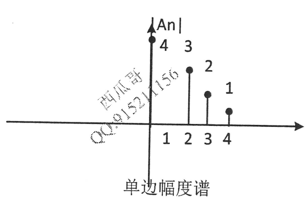

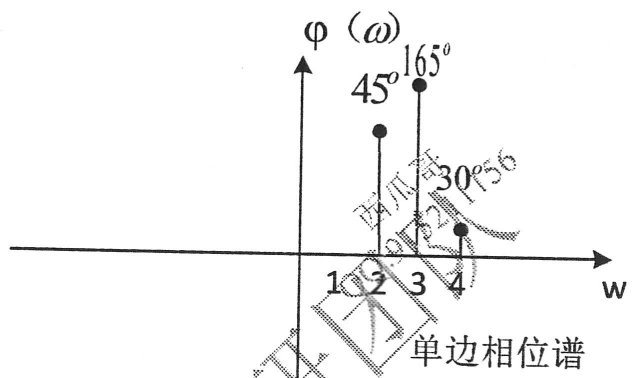

Ps: 此类题型要化为标准式, 符号要统一化为 “+” 和函数化为 $\cos$ 函数

(2) (刺猬哥考研团队西瓜哥 QQ:915211156)

$$
P = \overline {{f (t) ^ {2}}} = \frac {1}{T _ {1}} \int_ {t _ {0}} ^ {t _ {0} + T _ {1}} f (t) ^ {2} d t = a _ {0} ^ {2} + \frac {1}{2} \sum_ {n = 1} ^ {\infty} \left(a _ {n} ^ {2} + b _ {n} ^ {2}\right) = c _ {0} ^ {2} + \frac {1}{2} \sum_ {n = 1} ^ {\infty} c _ {n} ^ {2} = 1 6 + \frac {1}{2} (9 + 4 + 1) = 2 3
$$

(注: 此题难度★☆☆☆☆, 西瓜哥原创小结: 本题考察傅里叶级数单边谱的知识,此类题型要化为标准式, 符号要统一化为“+”和函数化为 $\cos$ 函数, 体现幅度为正,负由相位派体现。)

题 15 解:

$\int_{-\infty}^{+\infty} X(\omega) \cdot \frac{\sin \omega}{\omega} \cdot e^{-j3\omega} d\omega$ 的值

首先设 $Y(\omega) = X(\omega) \cdot \frac{\sin \omega}{\omega} \cdot e^{-j3\omega}$, $H(\omega) = \frac{\sin \omega}{\omega} \cdot e^{-j3\omega}$

可得 $h(t) = \frac{1}{2} g_{2}(t - 3)$

原式 $= \int_{-\infty}^{+\infty} Y(\omega) d\omega = 2\pi y(0)$ （傅里叶逆变换定义式）

$y(0) = \int_{-\infty}^{+\infty}x(\tau)h(-\tau)d\tau = 0$ （卷积定义式）

更多优质考研资讯，关注b站 | 公众号“刺猬哥通信电子考研”、知乎“刺猬哥通信考研”

---

故结果为 0

(注: 此题难度★★☆☆☆, 西瓜哥原创小结: 傅里叶变换定义和卷积定义热门考点, 务必熟练运用。) (刺猬哥考研团队西瓜哥 QQ:915211156)

题 16 解:

由题意:

$$
\begin{array}{l} \omega_ {0} = \frac {2 \pi}{T} = \pi \\ a _ {0} = \frac {1}{T} \int_ {0} ^ {T} f (t) d t = \frac {1}{2} \\ a _ {n} = \frac {2}{T} \int_ {0} ^ {T} f (t) \cos (n \pi t) d t = \int_ {0} ^ {1} \cos (n \pi t) d t = 0 \\ b _ {n} = \frac {2}{T} \int_ {0} ^ {T} f (t) \sin (n \pi t) d t = \int_ {0} ^ {1} \sin (n \pi t) d t = \frac {1}{n \pi} [ 1 - (- 1) ^ {n} ] \\ f (t) = a _ {0} + \sum_ {n = 1} ^ {\infty} \left[ a _ {n} \cos (n \pi t) + b _ {n} \sin (n \pi t) \right] = \frac {1}{2} + \sum_ {n = 1} ^ {\infty} \frac {1}{n \pi} [ 1 - (- 1) ^ {n} ] \sin (n \pi t) \\ \end{array}
$$

（QQ915211156 西瓜哥 Tips: 此题难度★★☆☆☆, 考查三角形式傅里叶级数的系数计算。）

题 17 解:

由题意:

$$
f (t) = \left\{ \begin{array}{l l} 1, \sin [ \frac {\pi}{2} (t - 1) ] > 0 \\ - 1, \sin [ \frac {\pi}{2} (t - 1) ] <   0 \end{array} = \left\{ \begin{array}{l l} 1, 4 k + 1 <   t <   4 k + 3 \\ - 1, 4 k - 1 <   t <   4 k + 1 \end{array} \right. \text {(其 中} k \text {取 整 数}) \right.
$$

$f(t)$ 波形如下:

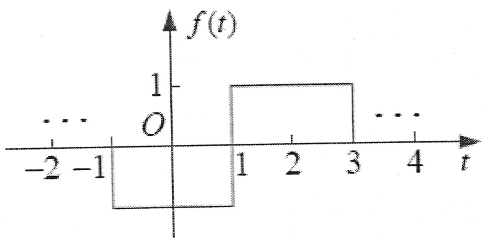

更多优质考研资讯，关注b站 | 公众号“刺猬哥通信电子考研”、知乎“刺猬哥通信考研”

---

24最强信号辅导班招生啦！让你节省时间，不走弯路，取得佳绩！联系西瓜哥qq915211156加Q群709502924，使用刺猬哥团队正版核心序列ORK，享受高质量全天候优质答疑指导

可见 $f(t)$ 周期 $T = 4$ ， $\omega_0 = \frac{2\pi}{T} = \frac{\pi}{2}$

$$
\begin{array}{l} F _ {n} = \frac {1}{T} \int_ {- 1} ^ {3} f (t) e ^ {- j n \omega_ {0} t} d t = \frac {1}{4} (- \int_ {- 1} ^ {1} e ^ {- j n \frac {\pi}{2} t} d t + \int_ {1} ^ {3} e ^ {- j n \frac {\pi}{2} t} d t) \\ = \frac {1}{4} \frac {e ^ {- j \frac {\pi}{2} n} - e ^ {j \frac {\pi}{2} n}}{j \frac {\pi}{2} n} - \frac {1}{4} \frac {e ^ {- j \frac {3 \pi}{2} n} - e ^ {- j \frac {\pi}{2} n}}{j \frac {\pi}{2} n} = \frac {1}{2} \frac {e ^ {- j \frac {\pi}{2} n} - e ^ {j \frac {\pi}{2} n}}{j \pi n} - \frac {1}{2} \frac {e ^ {- j n \pi} \left(e ^ {- j \frac {\pi}{2} n} - e ^ {j \frac {\pi}{2} n}\right)}{j \pi n} \\ = \frac {1}{2} \frac {- 2 j \sin (\frac {\pi}{2} n)}{j \pi n} + \frac {1}{2} \frac {e ^ {- j n \pi} \cdot 2 j \sin (\frac {\pi}{2} n)}{j \pi n} \\ = \left\{ \begin{array}{l} - S a (\frac {n \pi}{2}), n = 2 m + 1 \\ 0, n = 2 m \end{array} \right. \\ \end{array}
$$

(其中 $m$ 为整数, $e^{-jn\pi} = (e^{-j\pi})^n = (-1)^n$ )

故 $f(t) = \sum_{n = -\infty}^{+\infty}F_ne^{jn\omega_0t} = \sum_{m = -\infty}^{+\infty} - Sa[\frac{\pi}{2} (2m + 1)]e^{j\frac{\pi}{2} (2m + 1)t}$

(注: 此题难度★★★☆☆, 西瓜哥原创小结: 考查傅里叶级数的指数形式, 套公式计算即可, 有一定计算量, 其中涉及的化简技巧对数学要求较高。)

题18解：

(1) 根据 $f(t) = c_{0} + \sum_{n=1}^{\infty} c_{n} \cos (n \omega_{1} t + \varphi_{n})$ 其中 $\omega_{1} = \frac{2\pi}{T_{1}}$

$$
c _ {n} = \frac {2 E}{n \pi} \sin (\frac {n \pi}{2})
$$

可画频谱图:

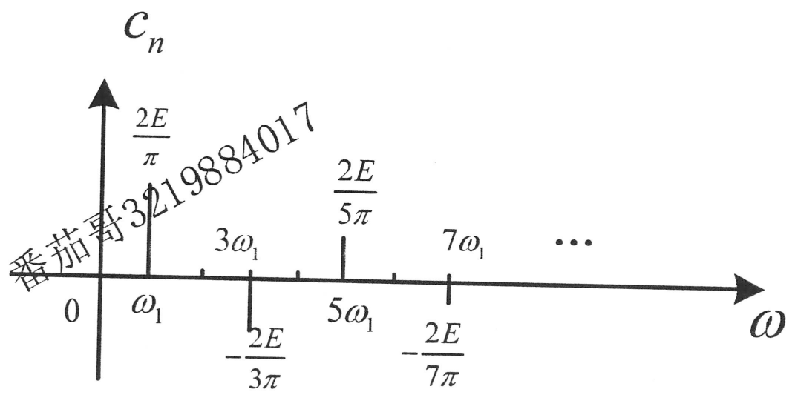

更多优质考研资讯，关注b站 | 公众号“刺猬哥通信电子考研”、知乎“刺猬哥通信考研”

---

(2) 由 $\cos n\omega_{1}t = \frac{1}{2} e^{-jn\omega_{1}t} + \frac{1}{2} e^{jn\omega_{1}t}$

$$
\begin{array}{l} f (t) = \frac {E}{\pi} \sum_ {n = 1} ^ {+ \infty} \frac {1}{n} \sin \left(\frac {n \pi}{2}\right) e ^ {j n \omega_ {\mathrm {l}} t} + \frac {E}{\pi} \sum_ {n = 1} ^ {+ \infty} \frac {1}{n} \sin \left(\frac {n \pi}{2}\right) e ^ {- j n \omega_ {\mathrm {l}} t} \\ = \frac {E}{\pi} \sum_ {n = - \infty} ^ {+ \infty} \frac {1}{n} \sin \left(\frac {n \pi}{2}\right) e ^ {j n \omega_ {1} t} \\ \end{array}
$$

(其中 $n \neq 0$)

可得 $F_{n} = \frac{E}{\pi} \frac{1}{n} \sin \left(\frac{n \pi}{2}\right), n \neq 0$

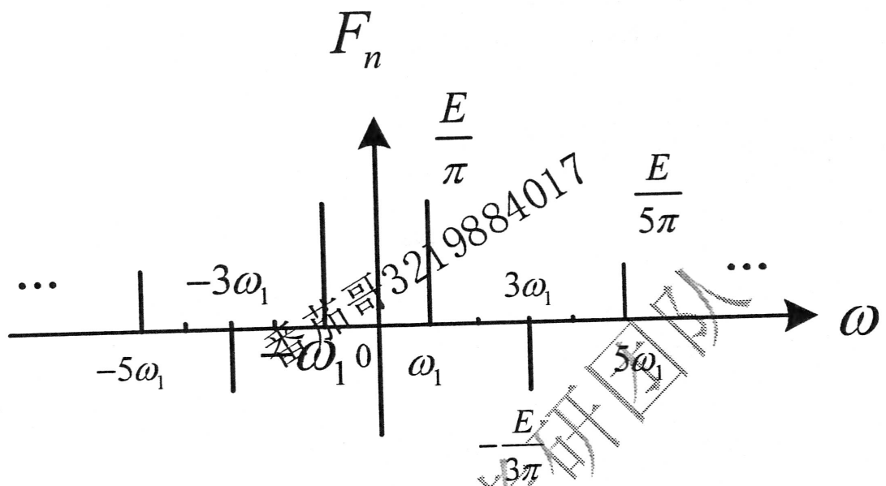

(注: 此题难度★★☆☆☆, 西瓜哥原创小结: 对于周期信号, 画频谱图一般都是画其傅里叶级数系数和频谱的图像; 对于非周期信号, 画频谱图则是画其傅里叶变换和频率的图像, 考生注意区分。) (刺猬哥考研团队西瓜哥 QQ:915211156)

题 19 解:

由题意可得 $f(t)$ 的图像如下图所示

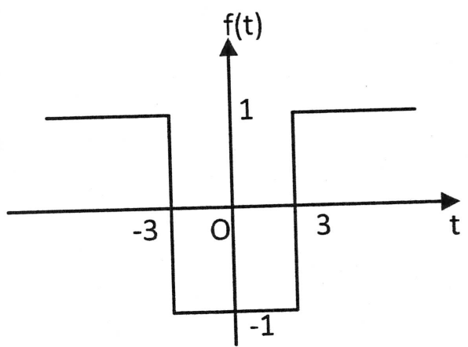

(刺猬哥通信考研团队, 答疑交流群 709502924)

则所求傅里叶变换 $F(\omega) = -6Sa(3\omega) + 2\pi \delta (\omega) + \frac{e^{-j3\omega}}{j\omega} -\frac{e^{j3\omega}}{j\omega}$

更多优质考研资讯, 关注b站 | 公众号“刺猬哥通信电子考研”、知乎“刺猬哥通信考研”

---

（注：此题难度★★☆☆☆，西瓜哥原创小结：此题主要考察常见傅里叶变换，解题的关键点就在于准确得出 $f(t) = \operatorname{sgn}(t^2 - 9)$ 的表达式。）

题20解：

(1) 根据傅里叶变换: $F(j \omega) = \int_{-\infty}^{\infty} f(t) e^{-j \omega t} d t$

可知: $F(0) = \int_{-\infty}^{\infty} f(t) dt = \frac{1}{2} \times 4 \times 1 = 2$.

(2) 根据傅里叶变换的对称性: $f(t) = \frac{1}{2\pi} \int_{-\infty}^{\infty} F(j\omega) e^{j t\omega} d\omega$

可知: $\int_{-\infty}^{\infty} F(j\omega) d\omega = 2\pi f(0)$

如图所示: $\int_{-\infty}^{\infty} F(j \omega) d \omega = 2 \pi f(0) = \pi$

(3) 信号的能量 $E = \frac{1}{2\pi} \int_{-\infty}^{\infty} |F(j\omega)|^{2} d\omega = \int_{-\infty}^{\infty} |f(t)|^{2} dt$

可得: $E = \int_{-\infty}^{\infty}\left|f(t)\right|^2 dt = \int_{-1}^{1}\left[\frac{1}{2}(t + 1)\right]^2 dt + \int_{1}^{3}\left[-\frac{1}{2}(t - 3)\right]^2 dt = \frac{4}{3}$

(4) 已知 $F(j \omega) \frac{2 \sin \omega}{\omega} = 2 F(j \omega) \cdot S a(\omega)$.

令 $H(j\omega) = 2F(j\omega) \cdot Sa(\omega)$ （刺猬哥考研团队西瓜哥QQ:915211156）

则原式 $= \int_{-\infty}^{\infty} H(j\omega) e^{j2\omega} d\omega = 2\pi h(2)$

由于 $H(j\omega) = 2F(j\omega)\cdot Sa(\omega)$ ，则 $h(t) = f(t)^{*}g_{2}(t) = \int_{-\infty}^{\infty}f(\tau)g_{2}(t - \tau)d\tau$

可得: $h(2) = \int_{-\infty}^{\infty} f(\tau) g_2(2 - \tau) d\tau$

$$
\begin{array}{l} = \int_ {1} ^ {3} f (\tau) d \tau \\ = \int_ {1} ^ {3} \left[ - \frac {1}{2} (\tau - 3) \right] d \tau \\ = 1 \\ \end{array}
$$

可得: $\int_{-\infty}^{\infty} F(j\omega) \frac{2\sin\omega}{\omega} e^{j2\omega} d\omega = 2\pi h(2) = 2\pi$

(注: 此题难度★★★☆☆, 荣莘姐原创小结: 前三问属于常规题, 此题难在第四问, 很多同学想不到将 $F(j \omega) \frac{2 \sin \omega}{\omega}$ 看作整体, 原因在于对傅里叶逆变换的定义式记忆还不够熟练。) (刺猬哥考研团队西瓜哥 QQ:915211156)

---

题 21 解:

由题意可知:

$$
\begin{array}{l} x _ {1} (t) = S a (1 0 0 t) \xleftarrow {F} X _ {1} (j \omega) = \frac {\pi}{1 0 0} G _ {2 0 0} (\omega), \text {可 得} \omega_ {m 1} = 1 0 0 r a d / s, f _ {m 1} = \frac {\omega_ {m 1}}{2 \pi} = \frac {5 0}{\pi} \\ x _ {2} (t) = S a (1 5 0 t) \xleftarrow {F} X _ {2} (j \omega) = \frac {\pi}{1 5 0} G _ {3 0 0} (\omega), \text {可 得} \omega_ {m 2} = 1 5 0 r a d / s, f _ {m 2} = \frac {\omega_ {m 2}}{2 \pi} = \frac {7 5}{\pi} \\ \end{array}
$$

(1) $x_{1}(t) + x_{2}(t)$

最高频率为 $f_{m} = \frac{75}{\pi}$, 则奈奎斯特频率 $f_{s} = 2 f_{m} = \frac{150}{\pi}$, 奈奎斯特间隔 $T_{s} = \frac{1}{f_{s}} = \frac{\pi}{150}$

(2) $x_{1}(t) \cdot x_{2}(t)$

最高频率为 $f_{m} = \frac{125}{\pi}$, 则奈奎斯特频率 $f_{s} = 2 f_{m} = \frac{250}{\pi}$, 奈奎斯特间隔 $T_{s} = \frac{1}{f_{s}} = \frac{\pi}{250}$

(3) $x_{1}(t)*x_{2}(t)$

最高频率为 $f_{m} = \frac{50}{\pi}$, 则奈奎斯特频率 $f_{s} = 2 f_{m} = \frac{100}{\pi}$, 奈奎斯特间隔 $T_{s} = \frac{1}{f_{s}} = \frac{\pi}{100}$

(4) $x_{1}^{2}(t) + x_{2}^{2}(t)$

最高频率为 $f_{m} = \frac{150}{\pi}$, 则奈奎斯特频率 $f_{s} = 2 f_{m} = \frac{300}{\pi}$, 奈奎斯特间隔 $T_{s} = \frac{1}{f_{s}} = \frac{\pi}{300}$ (注: 此题难度★☆☆☆☆, 西瓜哥原创小结: 基础题, 考察抽样定理。记忆口诀:在时域上, 相加/减取最大, 相乘取之和, 相卷取最小。)

题 22 解: (刺猬哥考研团队西瓜哥 QQ:915211156)

1) 令 $x_{1}(t) = \frac{\sin \pi t}{t} \leftrightarrow X_{1}(j\omega) = \pi G_{2\pi}(\omega)$.

根据帕塞瓦尔定理，有

$$
\int_ {- \infty} ^ {\infty} \frac {\sin^ {2} \pi t}{t ^ {2}} d t = \int_ {- \infty} ^ {\infty} \left| x _ {1} (t) \right| ^ {2} d t = \frac {1}{2 \pi} \int_ {- \infty} ^ {\infty} \left| X _ {1} (j \omega) \right| ^ {2} d \omega = \frac {1}{2 \pi} \cdot 2 \pi \cdot \pi^ {2} = \pi^ {2}
$$

2）令 $x(t) = x_1^2 (t) = \frac{\sin^2\pi t}{t^2}\leftrightarrow X(j\omega) = \frac{1}{2\pi} X_1(j\omega)*X_1(j\omega)$

更多优质考研资讯，关注b站 | 公众号“刺猬哥通信电子考研”、知乎“刺猬哥通信考研”

---

24最强信号辅导班招生啦！让你节省时间，不走弯路，取得佳绩！联系西瓜哥qq915211156 加Q群709502924，使用刺猬哥团队正版核心序列ORK，享受高质量全天候优质答疑指导

$$
\begin{array}{l} \int_ {- \infty} ^ {\infty} \frac {\sin^ {3} \pi t}{t ^ {3}} d t = \int_ {- \infty} ^ {\infty} y (t) d t = Y (j \omega) \big | _ {\omega = 0} \\ = \frac {1}{2 \pi} X (j \omega) * X _ {1} (j \omega) \big | _ {\omega = 0} = \frac {1}{2 \pi} \int_ {- \infty} ^ {\infty} X (j \lambda) X _ {1} [ j (0 - \lambda) ] d \lambda \\ = \frac {1}{2 \pi} \int_ {- \pi} ^ {\pi} \pi X (j \lambda) d \lambda = \frac {1}{2 \pi} \int_ {- \pi} ^ {\pi} \pi \frac {1}{2 \pi} X _ {1} (j \lambda) * X _ {1} (j \lambda) d \lambda \\ = \frac {1}{4 \pi} \int_ {- \pi} ^ {\pi} \pi G _ {2 \pi} (\lambda) * \pi G _ {2 \pi} (\lambda) d \lambda = \frac {\pi}{4} \int_ {- \pi} ^ {\pi} G _ {2 \pi} (\lambda) * G _ {2 \pi} (\lambda) d \lambda \\ = \frac {\pi}{4} \cdot \left(\frac {1}{2} 2 \pi \cdot \pi + 2 \pi \cdot \pi\right) = \frac {3 \pi^ {3}}{4} \\ \end{array}
$$

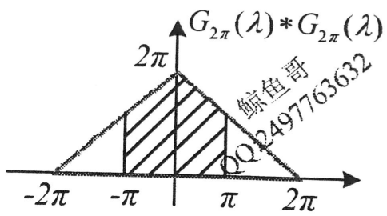

(QQ915211156 西瓜哥 Tips: 此题难度★★★★☆, 第 1) 小题为帕塞瓦尔定理的典型应用; 而对于第 2) 小题, 部分同学能想到 $\frac{\sin^3\pi t}{t^3} = \frac{\sin^2\pi t}{t^2} \cdot \frac{\sin\pi t}{t}$, 进而利用卷积的性质进行变换, 但未察觉到解此题的另一个突破口: $\int_{-\infty}^{\infty} y(t) dt = Y(j\omega)\big|_{\omega=0}$ )

题 23 解:

(1) 已知 $f_{1}(t) = \operatorname{sgn}(t) = u(t) - u(-t)$

$$
\begin{array}{l} u (t) \xleftarrow {F} \frac {1}{j \omega} + \pi \delta (\omega), u (- t) \xleftarrow {F} - \frac {1}{j \omega} + \pi \delta (\omega) \\ f _ {1} (t) = \operatorname {s g n} (t) = u (t) - u (- t) \xleftarrow {F} F _ {1} (j \omega) = \frac {2}{j \omega} \\ \end{array}
$$

(2) 根据 (1) 的结果, 利用对称性得 (若 $x(t) \longleftrightarrow X(j\omega)$, 则 $X(jt) \longleftrightarrow 2\pi x(-\omega)$)

$$
\frac {2}{j t} \xleftarrow {F} 2 \pi \operatorname {s g n} (- \omega) = - 2 \pi \operatorname {s g n} \omega
$$

故 $f_{2}(t) = \frac{1}{\pi t} \xleftarrow{F} f_{2}(j \omega) = -j \operatorname{sgn} \omega$

(3) 根据 (2) 和时域微分性质得 (若 $x(t) \longleftrightarrow X(j\omega)$, 则 $\frac{dx(t)}{dt} \longleftrightarrow j\omega X(j\omega)$) $-\frac{1}{\pi t^2} \longleftrightarrow j\omega[-j\operatorname{sgn}(\omega)] = \omega\operatorname{sgn}(\omega)$

(注: 此题难度★★☆☆☆, 西瓜哥原创小结: 第一问的傅里叶变换属于常见傅里叶变换对, 第二三问若单独给出, 这种并不常见的傅里叶变换会让基础不扎实的同学一脸懵逼, 此题西瓜哥第一问属于给了个铺垫, 二三问紧随其后, 环环相扣, 不可更多优质考研资讯, 关注b站 | 公众号“刺猬哥通信电子考研”、知乎“刺猬哥通信考研”

---

# 题 24 解:

(1) 由题意: $f_{s}(t) = f_{1}(t)p(t)$

其中 $p(t) = \sum_{n=-\infty}^{+\infty} \delta(t - nT) \xleftarrow{F} P(j\omega) = \frac{2\pi}{T} \sum_{n=-\infty}^{+\infty} \delta(\omega - \frac{2\pi}{T} n)$

$$
F _ {s} (j \omega) = \frac {1}{2 \pi} F _ {1} (j \omega) * P (j \omega) = \frac {1}{2 \pi} F _ {1} (j \omega) * \frac {2 \pi}{T} \sum_ {n = - \infty} ^ {+ \infty} \delta (\omega - \frac {2 \pi}{T} n) = \frac {1}{T} \sum_ {n = - \infty} ^ {\infty} F _ {1} [ j (\omega - \frac {2 \pi}{T} n) ]
$$

其中 $\frac{2 \pi}{T} = \omega_{2} = 2 \omega_{1}$

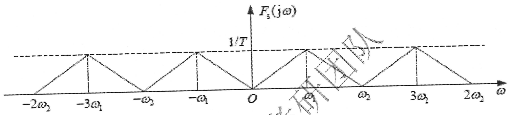

$F_{2}(j \omega) = F_{s}(j \omega) H(j \omega), \quad f_{2}(t)$ 的频谱如下:

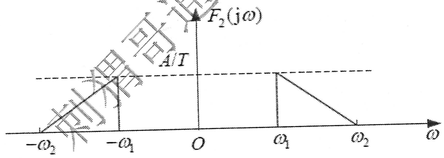

(2) $F_{s}(j\omega) = \frac{1}{T}\sum_{n = -\infty}^{\infty}F_{1}[j(\omega -\frac{2\pi}{T} n)]$

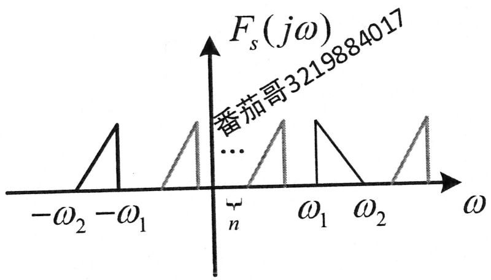

---

(1) $-\omega_{2} + \frac{2\pi}{T} \geq -\omega_{1} \Rightarrow T \leq \frac{2\pi}{\omega_{2} - \omega_{1}}$

(2) $-\omega_{1} + n\frac{2\pi}{T} \leq \omega_{1} \Rightarrow T \geq \frac{n\pi}{\omega_{1}}$

(3) $-\omega_{2} + (n + 1)\frac{2\pi}{T} \geq \omega_{2} \Rightarrow T \leq \frac{(n + 1)\pi}{\omega_{2}}$

(4) $n\left(\omega_{2} - \omega_{1}\right) \leq 2 \omega_{1} \Rightarrow n \omega_{2} \leq (n + 2) \omega_{1}$

(5) $\frac{2\pi}{T} + \omega_{1} - \omega_{2} \geq \omega_{2} - \omega_{1} \Rightarrow T \leq \frac{\pi}{\omega_{2} - \omega_{1}}$

(6) $\omega_{1}< \omega_{2}< 2 \omega_{1} \Rightarrow n \omega_{1}< n \omega_{2}< 2 n \omega_{1}$ (刺猬哥考研团队西瓜哥 QQ:915211156)

情况一: 当 $\frac{n \pi}{\omega_{1}} \leq \frac{(n + 1) \pi}{\omega_{2}} \leq \frac{\pi}{\omega_{2} - \omega_{1}}$ 时, $T_{\max } = \frac{(n + 1) \pi}{\omega_{2}}$

情况二: 当 $\frac{n \pi}{\omega_{1}} \leq \frac{\pi}{\omega_{2} - \omega_{1}} \leq \frac{(n + 1) \pi}{\omega_{2}}$ 时, $T_{\max} = \frac{\pi}{\omega_{2} - \omega_{1}}$

$$
A = T _ {\mathrm {m a x}}, \omega_ {a} = \omega_ {1}, \omega_ {b} = \omega_ {2}
$$

(注: 此题难度★★★★★, 西瓜哥原创小结: 以上为带通采样定理的详细分析过程, 难度五颗星为敬。) (刺猬哥考研团队西瓜哥 QQ:915211156)

题 25 解:

$$
Y _ {A} (t) = x (t) s (t) \rightarrow Y _ {A} (j \omega) = \frac {1}{2 \pi} \left[ X (\omega) ^ {*} S (\omega) \right]
$$

$$
Y _ {A} (\omega) = \frac {1}{2} [ X (\omega + 1 0 0 0) + X (\omega - 1 0 0 0 ]
$$

$$
x (t) = \frac {\sin \pi t}{\pi t} = S a (\pi t) \rightarrow g _ {2 \pi} (t) \leftrightarrow 2 \pi S a (\pi \omega)
$$

$$
2 \pi S a (\pi t) \leftrightarrow 2 \pi g _ {2 \pi} (\omega)
$$

$$
S a (\pi t) \leftrightarrow g _ {2 \pi} (\omega)
$$

$$
Y _ {A} (\omega) = \frac {1}{2} \left[ g _ {2 \pi} (\omega + 1 0 0 0) + g _ {2 \pi} (\omega - 1 0 0 0) \right]
$$

$$
Y _ {B} (\omega) = \frac {1}{2} \left[ Y _ {A} (\omega + 1 0 0 0) + Y _ {A} (\omega - 1 0 0 0 \right]
$$

---

24最强信号辅导班招生啦！让你节省时间，不走弯路，取得佳绩！联系西瓜哥qq915211156加Q群709502924，使用刺猬哥团队正版核心序列ORK，享受高质量全天候优质答疑指导

$$
\begin{array}{l} = \frac {1}{4} \left[ g _ {2 \pi} (\omega + 2 0 0 0) + g _ {2 \pi} (\omega - 2 0 0 0) \right] + \frac {1}{2} g _ {2 \pi} (\omega) \\ Y (\omega) = Y _ {B} (\omega) \cdot H (\omega) = \frac {1}{2} [ u (\omega + 2) - u (\omega - 2) ] e ^ {- j \omega} = \frac {1}{2} g _ {4} (\omega) e ^ {- j \omega} \\ \end{array}
$$

所以 $y(t) = \frac{1}{\pi} S a[2(t - 1)]$

(注: 此题难度★★☆☆☆, 西瓜哥原创小结: 傅里叶变换综合题。)

西瓜哥原创编写

---

# 南昌考研信号与系统核心序列 O

# 序列四—拉普拉斯变换、连续系统 $S$ 域分析

# 西瓜哥原创作答

1. 已知 $F(s) = \frac{e^{-s}}{s(2 s + 1)}$, 则 $f(t) =$ ( ); (西瓜哥 QQ915211156)

A. $[1 - e^{\frac{t - 1}{2}}]u(t)$

B. $[1 - e^{\frac{t - 1}{2}}]u(t - 1)$

C. $[1 - 2e^{-\frac{t - 1}{2}}]u(t)$

D. $[1 - 2e^{\frac{t - 1}{2}}]u(t - 1)$

2. 单边拉氏变换 $F(s) = \frac{e^{-(s + 3)}}{s + 3}$ 的原函数 $f(t) = ()$。

A. $e^{-3(t - 1)}u(t - 1)$

B. $e^{3(t - 3)}u(t - 3)$

C. $e^{-3t}u(t - 1)$

D. $e^{-3t} u(t - 3)$

(刺猬哥考研团队西瓜哥 QQ:915211156)

3. 某连续时间系统的单位阶跃响应为 $s(t) = (1 + t e^{-2t}) u(t)$, 则该系统的系统函数 $H(s) = ()$。

A. $1 + \frac{s}{(s + 2)^{2}}$

B. $\frac{1}{s} + \frac{s}{(s + 2)^{2}}$

C. $\frac{1}{s} + \frac{1}{s + 2} + \frac{1}{(s + 2)^2}$

D. $1 + \frac{1}{(s + 2)^{2}}$

4. 已知 $\cos \omega_0tu(t) \xleftarrow{LT} \frac{s}{s^2 + \omega_0^2}, \sigma > 0$ ，所以 $\cos \omega_0(t - t_0)u(t) \xleftarrow{LT} \underline{\quad}$，$\sigma > 0$ 。

---

A. $\frac{s}{s^{2} + \omega_{0}^{2}} e^{-st_{0}}$

B. $\frac{s \cos \omega_{0} t_{0}}{s^{2} + \omega_{0}^{2}}$

C. $\frac{s - s e^{-s t_{0}}}{s^{2} + \omega_{0}^{2}}$

D. $\frac{s \cos \omega_{0} t_{0} + \omega_{0} \sin \omega_{0} t_{0}}{s^{2} + \omega_{0}^{2}}$

5. （西瓜哥 915211156）已知因果信号 $x(t)$ 的拉氏变换为 $X(s)$，则信号 $f(t) = \int_{0}^{t} \lambda x(t - \lambda) d\lambda$ 的拉氏变换为（ ）。（刺猬哥考研团队西瓜哥 QQ:915211156）

A. $\frac{1}{s} X(s)$

B. $\frac{1}{s^{2}} X(s)$

C. $\frac{1}{s^{3}} X(s)$

D. $\frac{1}{s^{4}} X(s)$

6. 如图所示, 电路中 $e_{s}(t)$ 表示激励源, $i(t)$ 表示电路的响应, $R = 1 \Omega, C = 1 F, L = 1 H$, 图中的网络函数为 ( )。

A. $\frac{s^{2} + s + 1}{s + 1}$

B. $\frac{s + 1}{s^{2} + s + 1}$

C. $1 + \frac{s^{2} + s}{s^{2} + s + 1}$

D. $\frac{s^{2} + s + 1}{s^{2} + s}$

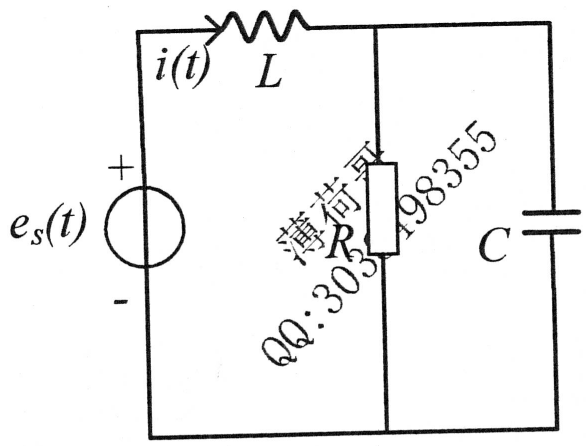

7. 已知冲激响应 $h(t) = \frac{3}{2} \left(e^{-2t} + e^{-4t}\right) u(t)$, 求微分方程 ____________;

8. 已知如下电路图, 参数为 $L_{1} = 3 H 、 L_{2} = 6 H 、 R = 9 \Omega$, 求系统冲激响应 $h(t) =$

---

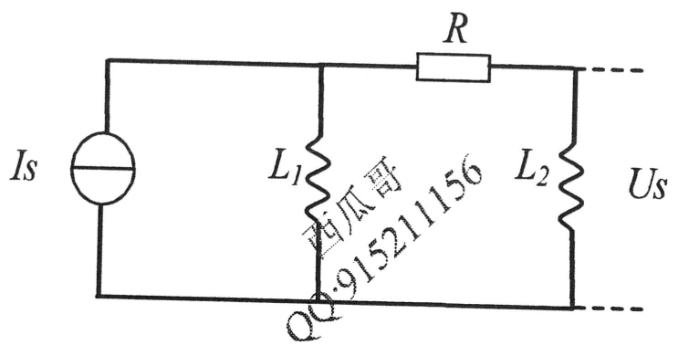

9. 已知 $f(t) \xleftarrow{\mathcal{L}} F(s) = \frac{2}{s^2 + 2s + 4}$, 则 $\int_{0}^{t - 1} f(x) dx$ 的拉普拉斯变换为

10. 已知 $f(t)$ 如下图所示, 则 $f(t)$ 的拉普拉斯变换为

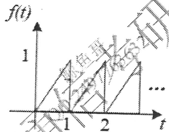

11. 单边拉普拉斯变换 $X(s) = \frac{1}{1 + e^{-2s}}$ ，则其收敛域为 ______，其逆变换 $x(t) =$ ______。

12. 象函数 $X_{2}(s) = \frac{s^{3}}{s^{2} + s + 1}$ 对应反变换的初值与终值分别是 ,

13. 因果 $L T I$ 系统的输入输出方程为（刺猬哥考研团队西瓜哥 QQ:915211156）

---

$\frac{dy(t)}{dt} + y(t) = \int_{-\infty}^{t - 1} x(\tau - 1)e^{-(t - \tau)}(t - \tau)d\tau,$ 求系统的冲激响应 $h(t)$。

14. 计算下列各信号的拉普拉斯变换 $X(s)$, 写出零极点并表明收敛域。

(1) $x(t) = e^{-2t} u(t) + e^{3t} u(t)$

(2) $x(t) = e^{-5t}u(t) - e^{2t}u(-t)$

(3) $x(t) = e^{3t} u(-t) + e^{4t} u(-t)$

(4) $x(t) = u(t + 2) - u(t - 3)$

(5) $x(t) = e^{-2t} \cos (3t) u(t)$ （刺猬哥考研团队西瓜哥QQ:915211156）

15. 利用性质计算下列各信号的拉普拉斯变换 $X(s)$

(1) $x(t) = (t - 3)u(t - 2)$

(3) $x(t) = (1 - e^{-2t})u(t - 1)$

(5) $x(t) = \delta (2t)$

(7) $x(t) = e^{3t - 1}\delta (t - 1)$

(9) $x(t) = \frac{d}{dt} [t e^{-3t} u(t)]$

(2) $x(t) = e^{-3(t - 2)}u(t - 2)$

(4) $x(t) = \sin \left[\omega_{0}(t - 3)\right] u(t - 3)$

(6) $x(t) = u(3t)$

(8) $x(t) = \int_{0^{-}}^{t} e^{-2\tau} \sin (3\tau) d\tau$

(10) $x(t) = t \frac{d}{dt} [e^{-3t} \cos (2t) u(t)]$

16. 利用初值和终值定理计算下列信号的初值 $x(0^{+})$ 和终值 $x(+\infty)$, 若没有终值, 说明为什么

---

么？

(1) $X(s) = \frac{s}{(s + 1)(s + 2)}$;

(2) $X(s) = \frac{s + 3}{s^2 + 9}$;

(3) $X(s) = \frac{4(s + 1)}{(s + 2)(s^2 + 2s + 2)}$;

(4) $X(s) = \frac{e^{-3s}}{(s + 2)(s + 1)^2}$;

(5) $X(s) = \frac{2}{s(s - 2)}$;

17. 求下列函数 $X(s)$ 的（单边）拉普拉斯逆变换 $x(t)$ 。

(1) $X(s) = \frac{2s + 2}{s^2 + 6s + 8}$

(3) $X(s) = \frac{s + 3}{(s + 3)^2 + 25}$

(5) $X(s) = \frac{s^2 - s + 1}{s(s + 1)^2}$

(7) $X(s) = \frac{(s + 1)^2}{s + 2}$

(9) $X(s) = \frac{1}{s + 1} \cdot \frac{1}{1 - e^{-2s}}$

(2) $X(s) = \frac{s}{s^2 + 4}$

(4) $X(s) = \frac{s^2 - 2s + 1}{s(s^2 + 1)^2}$

(6) $X(s) = \frac{s^2 + 2}{(s + 2)(s^2 + 4s + 5)}$

(8) $X(s) = \frac{2(s - 3e^{-2s})}{s^2 + 3s + 2}$

(10) $X(s) = \frac{1}{s + 1} \cdot \frac{1}{1 + e^{-s}}$

---

18. $H(s) = \frac{Y(s)}{E(s)} = 2$ ， $H_{1}(s) = \frac{1}{s + 3}$

(1)求子系统 $H_{2}\left(s\right)$

(2) 使 $H_{2}(s)$ 稳定, 求 $\mathrm{k}$ 范围.

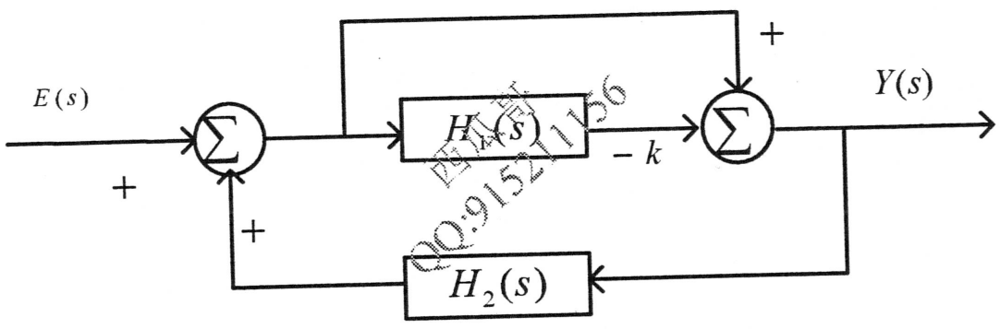

19. 已知微分方程 $y^{\prime \prime}(t) - 2y^{\prime}(t) - 15y(t) = f^{\prime}(t) - 13f(t)$

(1)求 $H(s),h(t)$ ；

(2)画出系统框图;

(3)画出零极点，并判断稳定性；

(4) $y\left(0^{-}\right) = 2, y^{\prime}\left(0^{-}\right) = 6, f(t) = 16 e^{13 t} u(t)$, 求零输入响应, 零状态响应, 自由响应, 强迫响应。(刺猬哥考研团队西瓜哥 QQ:915211156)

20. 已知连续时间 LTI 系统可由线性常系统微分方程 $\frac{d^2y(t)}{dt^2} + a\frac{dy(t)}{dt} + by(t) = 3\frac{dx(t)}{dt} + 2x(t)$ 确定。若输入 $x(t) = e^{4t}$ 时，输出 $y(t) = \frac{7}{3}e^{4t}$，输入 $x(t) = e^{3t}$ 时，输出 $y(t) = \frac{11}{2}e^{3t}$，要求：

(1)求系数 $a, b$ 的值；（刺猬哥考研团队西瓜哥 QQ:915211156）

(2)求系统的系统函数 $H(s)$, 画出该系统函数对应的零极点图;

(3)求系统的单位冲击响应 $h(t)$;

(4)判断系统的因果性和稳定性;

(5)若输入 $x(t) = e^{2t}u(t)$, 求系统的输出。

---

21. 某因果连续线性时不变系统满足以下条件:

(1)初始状态不为 0 , 输入 $x(t) = u(t)$ 时, 全响应为 $y_{1}(t) = \left(3 e ^{-2 t} + \frac{2}{3} e ^{- t}\right) u(t)$;

(2) 初始状态同 (1), 输入 $x(t) = \frac{d \delta(t)}{dt}$ 时, 全响应为 $y_{2}(t) = \left(-3 e^{-2 t} + \frac{2}{3} e^{-t}\right) u(t) + 2 \delta(t)$;试求: (西瓜哥 QQ:915211156)

(1) 系统单位冲激响应 $h(t)$ 并判断系统的稳定性;

(2) 画出系统的模拟框图;

(3) 输入 $x(t) = u(t)$, 初始状态 $y\left(0^{-}\right) = 1, y^{\prime}\left(0^{-}\right) = 0$ 时的全响应。

22. 某因果系统, 框图如下, 其中 $a, b, c$ 均为实数, 已知当输入信号为 $x(t) = u(t)$, 系统全响应方程为 $y(t) = (1 - e^{-t} + 3e^{-3t})u(t)$, 要求:

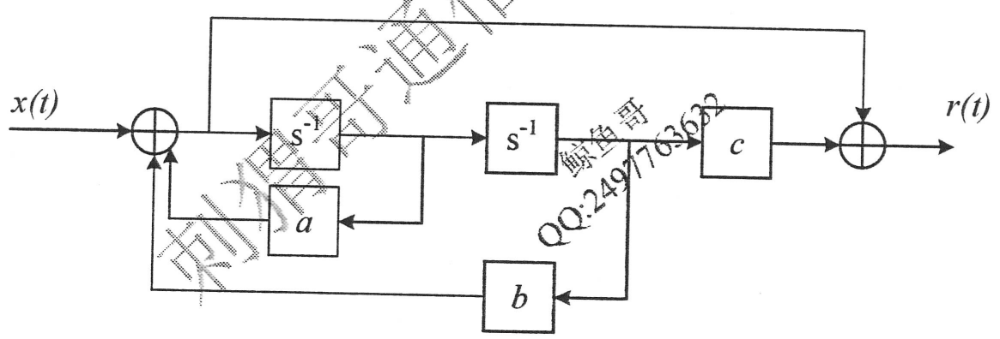

1）求 $a, b, c, H(s)$ 及其收敛域；

2）求 $y_{zs}(t)$ 及 $y_{zi}(t)$

(3) 求 $y(0_{-})$ 及 $y'(0_{-})$ 。

23. 已知一个连续时间 LTI 系统是稳定系统, 系统的单位冲激响应为偶信号, 系统函数 $H(s)$ 满足以下条件, 试确定该系统的系统函数及收敛域。

---

(1) $H(s)$ 在有限的 $s$ 平面内只有 4 个极点, 没有零点;

(2) $h(-t)$ 的拉氏变换的一个极点为 $s = 1$;

3） $h(t)e^{2t}$ 的拉氏变换的一个极点为 $s = 0$

(4) $H(0) = \frac{1}{4}$。（刺猬哥考研团队西瓜哥QQ:915211156）

24. 某稳定的连续时间 LTI 系统的系统函数为 $H(s) = \frac{3s - 0.5}{(s^2 + 0.5s - 1.5)e^{2s}}$,

(1) 确定其收敛域, 画出其零极点分布图;

(2) 求出该系统的单位冲激响应 $h(t)$;

(3) 该系统是因果的 (或能实现) 吗? 若不能实现, 请设计一个与它的幅频特性完全相同的连续时间因果稳定系统, 画出系统并联系时的模拟框图, 写出描述系统的微分方程。

25. 已知某 LTI 系统当输入 $x_{1}(t) = \left(\cos \sqrt{5} t - \frac{2}{\sqrt{5}} \sin \sqrt{5} t\right) u(t)$ 时，零状态响应为 $y_{1}(t) = k t e^{-a t} u(t)$；当输入 $x_{2}(t) = \delta(t) - 3 e^{b t} u(-t)$ 时，零状态响应为 $y_{2}(t) = \frac{2}{3} e^{-t} u(t) - \left(\frac{1}{3} + 3 t\right) e^{2 t} u(-t)$，这里 $a$、$b$ 均为常数。

(1) 确定 $a 、 b$ 和 $k$ 的值;

(2) 求该系统的系统函数 $H(\mathbf{s})$ 及其收敛域;

(3) 求该系统的单位阶跃响应 $s(t)$;

(4) 判断系统的因果性和稳定性。（刺猬哥考研团队西瓜哥 QQ:915211156）

26. 一个因果 LTI 系统 $S_{1}$ 的单位冲激响应为 $h(t)$, 其输入 $x(t)$ 与输出 $y(t)$ 可以用以下微分方程表示:

---

程来描述: $\frac{d^{3} y(t)}{d t^{3}} + (1 + 2 a) \frac{d^{2} y(t)}{d t^{2}} + a (2 + a) \frac{d y(t)}{d t} + a^{2} y(t) = x(t)$, 另有 LTI 系统 $S_{2}$, 单位冲激响应为 $g(t)$, 两系统的单位响应有如下关系: $g(t) = \frac{h(t)}{d t} + h(t)$, 求:

(1) 确定实数 $a$ 的取值范围, 以使得 $g(t)$ 所代表的系统稳定;

(2) 若输入 $x(t) = 1$ 时, 系统 $S_{2}$ 的输出 $y(t) = \frac{1}{4}$, 求 $h(t)$ 。

27. 已知系统框图如下, 当输入 $x_{1}(t) = (\sin t + \cos t) u(t)$ 时, $y_{1}(t) = \frac{1}{2} (\sin t + \cos t - e^{-t}) u(t)$.

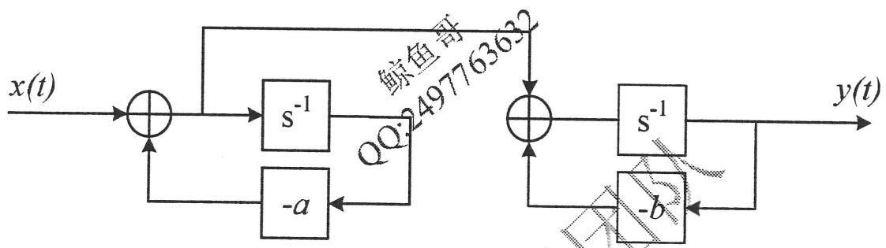

(1)求 $a, b, H(s)$;

(2)当输入为 $x_{2}(t) = \sin t$ 时，输出 $y_{2}(t)$ 为多少？

(3)若并联一个系统 $h_1(t)$ 得到输出 $\delta (t)$, 求系统函数 $H_{1}(s)$ 和单位冲激函数 $h_1(t)$ 。

28. 对于下图所示系统, 系统 $H_{1}$ 的输出 $y_{1}(t)$ 为系统 $H_{2}$ 中的输入电压, $y(t)$ 为系统 $H_{2}$ 中电容两端的电压, 求解下列问题:

(1)求出 $y_{1}(t)$, 画出其频谱 $Y_{1}(j \omega)$;

(2)求出 $ y(t) $ 。

---

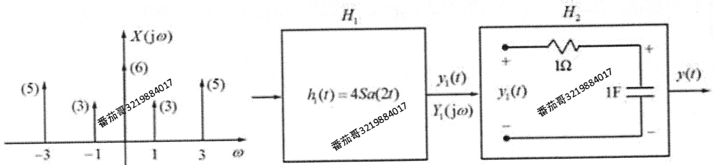

29. 如图所示的电路, 已知 $u_{s}(t) = 12 V$, $L = 1 H$, $C = 1 F, R_{1} = 3 \Omega, R_{2} = 2 \Omega, R_{3} = 1 \Omega$ 。原电路已处于稳定状态, 当 $t = 0$ 时, 开关 S 闭合, 求 S 闭合后 $R_{3}$ 两端电压的零输入响应 $y_{z i}(t)$ 和零状态响应 $y_{z s}(t)$ 。

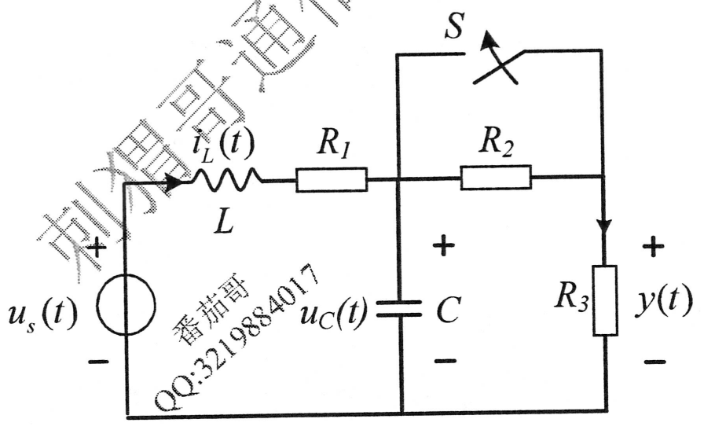

---

24最强信号辅导班招生啦！让你节省时间，不走弯路，取得佳绩！联系西瓜哥qq915211156 加Q群709502924，使用刺猬哥团队正版核心序列ORK，享受高质量全天候优质答疑指导

30. 如图所示是一种常用的分压电路, 若以 $u_{1}(t)$ 为输入, $u_{2}(t)$ 为输出, 试分析为使输出不失真, 电路各元件应满足的条件。

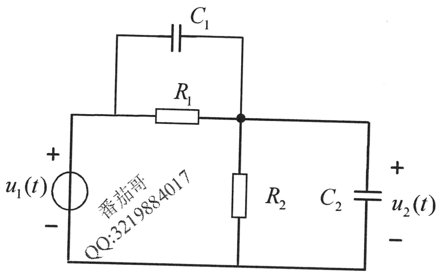

31. 已知电路图如下所示, 0 时刻之前开关闭合且稳定, 0 时刻闭合开关, 用复频域分析法求电容、电感两端的电压。

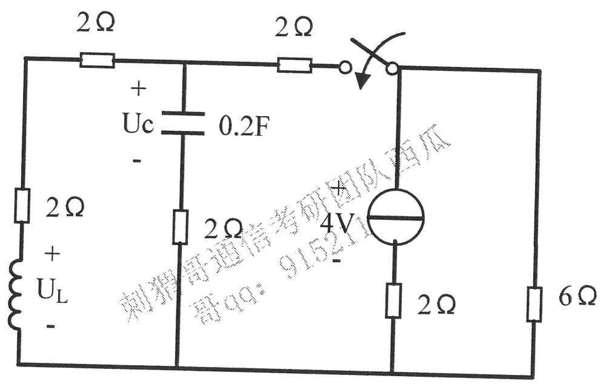

---

32. 图中 $u_{C}\left(0_{-}\right)=8 \mathrm{~V}, i_{L}\left(0_{-}\right)=4 \mathrm{~A}$, 当 $t=0$ 时开关 $S$ 闭合, 试画出该电路 $S$ 域电路, 并求 $t \geq 0$时的 $I_{L}(s)$ 。

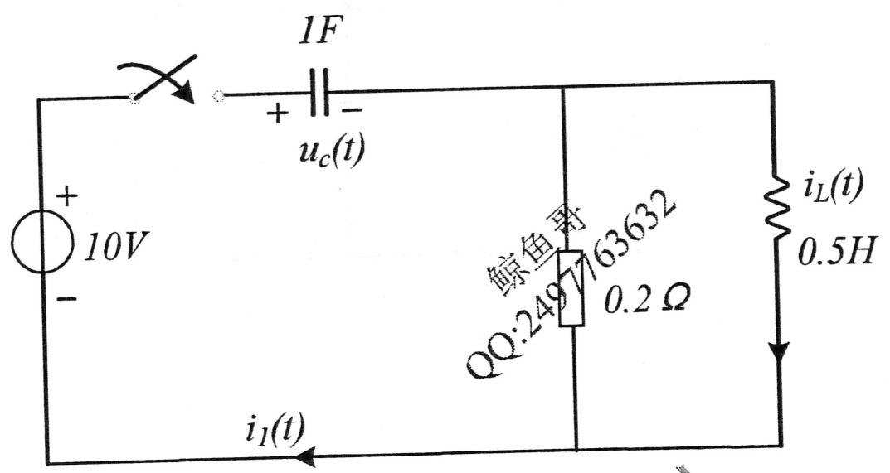

33. 电路如下图所示, $t < 0$ 时电路已处于稳态, $t = 0$ 时开关闭合。试用复频域分析法求 $t \geq 0$时电路中的电流 $i(t)$ 。

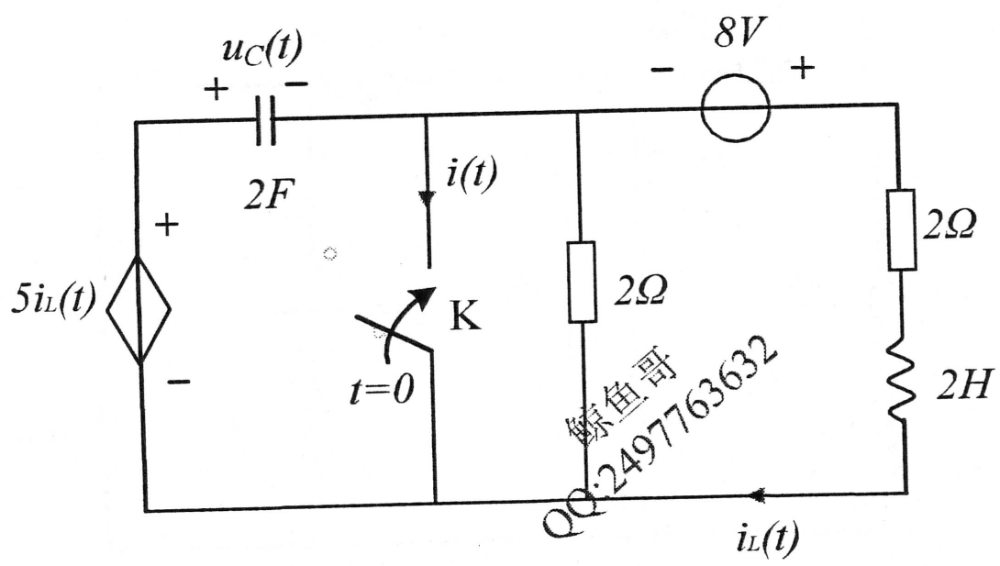

---

34. 已知 $H_{c}(s) = \frac{1}{\left(s + e^{j \frac{\pi}{4}}\right)\left(s + e^{-j \frac{\pi}{4}}\right)}$, 求:

(1) $H_{c}(0) 、 H_{c}(\infty)$ 及半功率频率点并画出频响图

(2) $H_{d}(z) = H_{c}(s)\left|_{s = \frac{1 - z^{-1}}{1 + z^{-1}}}, \right.$ 证 $H_{d}(e^{jw}) = H_{c}(j\tan \frac{w}{2})$

(3)说明 $H_{d}\left(e^{j w}\right)$ 的幅频特性

---

# 序列 O 序列四详解—西瓜哥原创作答

题 1 解: B

$$
F (s) = \frac {e ^ {- s}}{s (2 s + 1)}
$$

利用部分分式法展开得到: $F(s) = \left(\frac{1}{s} - \frac{2}{2s + 1}\right)e^{-s} = \left(\frac{1}{s} - \frac{1}{s + \frac{1}{2}}\right)e^{-s}$.

拉普拉斯逆变换得到 $f(t) = [1 - e^{-\frac{1}{2} (t - 1)}]u(t - 1)$

(注: 此题难度★☆☆☆☆, 西瓜哥原创小结: 本题考查利用部分分式法求拉普拉斯逆变换的相关计算, 我们一般不采用留数法计算逆变换, 一般用部分分式法将其化为常见的拉氏变换对进行逆变换。)

题 2 解: C

已知 $u(t) \xleftarrow{L} \frac{1}{s}$

先时移 $u(t - 1) \xleftarrow{L} \frac{1}{s} e^{-s}$

再频移 $e^{-3t} u(t - 1) \xleftarrow{L} \frac{1}{s + 3} e^{-(s + 3)}$

(注: 此题难度★☆☆☆☆, 西瓜哥原创小结: 基础题, 傅里叶变换和拉氏变换的频移有区别, 注意区分。) (刺猬哥考研团队西瓜哥 QQ:915211156)

题 3 解: A

$$
s (t) = \left(1 + t e ^ {- 2 t}\right) u (t) \xleftarrow {L} S (s) = \frac {1}{s} + \frac {1}{\left(s + 2\right) ^ {2}}
$$

$$
S (s) = \frac {1}{s} H (s) \Rightarrow H (s) = 1 + \frac {s}{(s + 2) ^ {2}}
$$

(注: 此题难度★☆☆☆☆, 西瓜哥原创小结: 基础题。)

题 4 解: D

---

$$
\begin{array}{l} \cos \omega_ {0} (t - t _ {0}) u (t) = \cos (\omega_ {0} t - \omega_ {0} t _ {0}) u (t) \\ = \cos \omega_ {0} t \cos \omega_ {0} t _ {0} u (t) + \sin \omega_ {0} t \sin \omega_ {0} t _ {0} u (t) \\ \end{array}
$$

再做拉式变换即可得到答案

(注: 此题难度★☆☆☆☆, 西瓜哥原创小结: 注意 $\sin , \cos$ 只存在单边拉普拉斯变换。)

题 5 解: B (刺猬哥考研团队西瓜哥 QQ:915211156)

已知 $x(t) \longleftrightarrow X(s)$, 且因果信号 $x(t) = x(t) u(t)$

$$
f (t) = \int_ {0} ^ {t} \lambda x (t - \lambda) d \lambda = \int_ {- \infty} ^ {+ \infty} \lambda u (\lambda) x (t - \lambda) u (t - \lambda) d \lambda = t u (t) * x (t) u (t) = t u (t) * x (t)
$$

可得: $f(t) \xleftarrow{L} F(s) = \frac{1}{s^2} X(s)$

(注: 此题难度★★☆☆☆, 西瓜哥原创小结: 此题关键在于凑卷积的定义式, 类似卷积积分, 卷积和, 三大变换的定义式是务必熟透在心的, 妥妥的高频考点。)

题 6 解: B

$$
\begin{array}{l} R _ {\text {总}} = s + \frac {1}{s} / / 1 = \frac {s ^ {2} + s + 1}{s + 1} \\ H (s) = \frac {I (s)}{E _ {s} (s)} = \frac {1}{R _ {\text {总}}} = \frac {s + 1}{s ^ {2} + s + 1} \\ \end{array}
$$

(注: 此题难度★☆☆☆☆, 西瓜哥原创小结: 常规题, 转换为 s 域图求解)

题7解： $y^{\prime \prime}(t) + 6y^{\prime}(t) + 8y(t) = 3f^{\prime}(t) + 9f(t)$

$$
\begin{array}{l} h (t) = \frac {3}{2} \left(e ^ {- 2 t} + e ^ {- 4 t}\right) u (t) \\ H (s) = \frac {3}{2} \left(\frac {1}{s + 2} + \frac {1}{s + 4}\right) = \frac {3 s + 9}{s ^ {2} + 6 s + 8} \\ \end{array}
$$

微分方程为: $y''(t) + 6y'(t) + 8y(t) = 3f'(t) + 9f(t)$

(注: 此题难度★☆☆☆☆, 西瓜哥原创小结: 基础题, 本题考察系统函数和微分方程之间的关系, 在时域输出等于输入卷积冲激响应, s 域中输出等于输入乘系统更多优质考研资讯, 关注 b 站 | 公众号“刺猬哥通信电子考研”、知乎“刺猬哥通信考研”

---

函数。）（刺猬哥考研团队西瓜哥QQ:915211156）

题 8 解: $h(t) = 2 \delta'(t) - 2 \delta(t) + 2 e^{-t} u(t)$

由电路图知电流源为输入, L2 两端电压为输出, 设经过 L1 回路电流为 $i_{1}$, 经过 L1 回路电流为 $i_{2}$, 则整体可列出以下关系式:

$$
\left\{ \begin{array}{l} I (s) = I _ {1} (s) + I _ {2} (s) \\ I _ {1} (s) \cdot S L _ {1} = I _ {2} (s) \cdot (R + S L _ {2}) \\ U (s) = I _ {2} (s) \cdot S L _ {2} \end{array} \right.
$$

代入题中所给条件，可得输入输出关系为：

$$
U (s) = \frac {2 s ^ {2}}{s + 1} \cdot I (s) \Rightarrow H (s) = \frac {U (s)}{I (s)} = \frac {2 s ^ {2}}{s + 1}
$$

由此逆变换得到 $h(t) = 2 \delta'(t) - 2 \delta(t) + 2 e^{-t} u(t)$

(注: 此题难度★★★☆☆, 西瓜哥原创小结: 本题考查电路的 s 域解法, 本题只需要要求系统函数, 不需要考虑初值。) (刺猬哥考研团队西瓜哥 QQ:915211156)

题9解: $\frac{2e^{-s}}{s(s^{2} + 2s + 4)}$

根据拉普拉斯变换的时域积分性质我们知 $\int_0^t f(\tau)d\tau \xleftarrow{\mathcal{L}}\frac{F(s)}{s}$

再根据时移性质有: $\int_0^{t-1} f(\tau) d\tau \xleftarrow{\mathcal{L}} \frac{F(s)}{s} e^{-s}$

从而本题答案为: $\frac{2e^{-s}}{s(s^2 + 2s + 4)}$

题 10 解: $\frac{1}{s^{2}} -\frac{e^{-s}}{s\left(1 - e^{-s}\right)}$

设 $f_{1}(t)$ 为 0-1 间的第一个单元, 则 $f_{1}(t) = t[u(t) - u(t - 1)]$

$$
\frac {d [ f _ {1} (t) ]}{d t} = = u (t) - u (t - 1) - \delta (t - 1) \Leftrightarrow \frac {1 - e ^ {- s}}{s} - e ^ {- s}, \text {故} f _ {1} (t) \Leftrightarrow \frac {1 - e ^ {- s}}{s ^ {2}} - \frac {e ^ {- s}}{s}
$$

更多优质考研资讯，关注b站 | 公众号“刺猬哥通信电子考研”、知乎“刺猬哥通信考研”

---

由 $f_{2}(t) = f_{1}(t - 1)$, 得 $f_{2}(t) \Leftrightarrow F_{1}(s)e^{-s}$

$$
F (s) = \sum_ {n = 0} ^ {\infty} F _ {1} (s) e ^ {- n s} = (\frac {1 - e ^ {- s}}{s ^ {2}} - \frac {e ^ {- s}}{s}) (1 + e ^ {- s} + \dots + e ^ {- n s}) = \frac {1}{s ^ {2}} - \frac {e ^ {- s}}{s (1 - e ^ {- s})}
$$

(注: 此题难度★★☆☆☆, 西瓜哥原创小结: 无穷项等比数列求和公式: $\frac{a_{1}}{1 - q}$;

其中 $a_{1}$ 是首项, $q$ 是公比且满足 $|q| < 1$ 。)

题 11 解: $\operatorname{Re}\{s\} > 0, \sum_{k=0}^{\infty} (-1)^{k} \delta(t - 2k)$

由 $\delta (t - 2) \longleftrightarrow e^{-2s}$, 想到

$$
\begin{array}{l} \delta (t) + (- 1) \delta (t - 2) + \dots + (- 1) ^ {k} \delta (t - 2 k) + \dots \\ \longleftrightarrow 1 + (- 1) e ^ {- 2 s} + \dots + (- 1) ^ {k} e ^ {- 2 k s} + \dots = \lim  _ {k \rightarrow \infty} \frac {1 - (- 1) ^ {k + 1} e ^ {- 2 (k + 1) s}}{1 - (- e ^ {- 2 s})} \\ \end{array}
$$

单边拉氏变换, 则 $k \in [0, \infty)$, 当 $k \rightarrow \infty$ 时, 为使 $(-1)^{k+1} e^{-2(k+1)s} = 0$, 则 $\operatorname{Re}\{s\} > 0$

故 $\sum_{k=0}^{\infty}(-1)^{k}\delta(t-2k) \xleftarrow{L} \frac{1}{1 + e^{-2s}}, \operatorname{Re}\{s\} > 0$

(QQ915211156 西瓜哥 Tips: 此题难度★★★☆☆, 注意 $X(s)$ 的形式, 经验题)

题 12 解: $0; 0$

$X_{2}(s) = \frac{s^{3}}{s^{2} + s + 1}$ 虽然有一对共轭极点，但位于左半 S 平面，因而终值存在 $\lim_{t\to \infty}x_2(t) = \lim_{s\to 0}s\frac{s^3}{s^2 + s + 1} = 0$ ，又因 $X_{2}(s)$ 分子的阶次大于分母的阶次，所以求初值要利用长除法求出真分式 $X_{0}(s)$

$$
X _ {2} (s) = \frac {s ^ {3}}{s ^ {2} + s + 1} = s - 1 + \frac {1}{s ^ {2} + s + 1}
$$

故初值 $x_{2}\left(0_{+}\right)=\lim _{s \rightarrow \infty} s X_{0}(s)=\lim _{s \rightarrow \infty} s \cdot \frac{1}{s^{2}+s+1}=0$

---

(QQ915211156 西瓜哥 Tips: 此题难度★★☆☆☆, 拉氏变换与 Z 变换的初值、终值求取方法与注意事项, 考生可归纳记忆, 也可视频跟学)

题 13 解: (刺猬哥考研团队西瓜哥 QQ:915211156)

1）因为 $\int_{-\infty}^{t - 1}x(\tau -1)e^{-(t - \tau)}(t - \tau)d\tau = x(t - 1)^{*}te^{-t}u(t - 1)$

下面计算 $t e^{-t} u(t - 1)$ 的拉氏变换, $e^{-t} u(t) \xleftarrow{LT} \frac{1}{s + 1}$

e-（t-1）u(t-1)←LT→e-ss+1，由拉氏变换的频域微分性质有

$ t e ^{- (t - 1)} u (t - 1) \xleftarrow {L T} \frac {e ^{- s}(s + 2)}{(s + 1)^{2}} \text{, 从而} t e ^{- t} u (t - 1) \xleftarrow {L T} \frac {e ^{-(s + 1)}(s + 2)}{(s + 1)^{2}} $

对方程两边取拉氏变换得 $(s + 1)Y(s) = X(s)e^{-s} \cdot \frac{e^{-(s + 1)}(s + 2)}{(s + 1)^2}$.

$$
H (s) = \frac {Y (s)}{X (s)} = \frac {(s + 2) e ^ {- (2 s + 1)}}{(s + 1) ^ {3}} = e ^ {- (2 s + 1)} \cdot \left(\frac {1}{(s + 1) ^ {3}} + \frac {1}{(s + 1) ^ {2}}\right),
$$

因为 $\left(\frac{t^{2}}{2} e^{-t} + te^{-t}\right)u(t)\xleftarrow{LT}\frac{1}{(s+1)^{3}} +\frac{1}{(s+1)^{2}}$ ，再由拉氏变换的平移性质有

$$
\begin{array}{l} \left(\frac {(t - 2) ^ {2}}{2} e ^ {- (t - 2)} + (t - 2) e ^ {- (t - 2)}\right) u (t - 2) \xleftarrow {L T} e ^ {- 2 s} \left(\frac {1}{(s + 1) ^ {3}} + \frac {1}{(s + 1) ^ {2}}\right) \\ \left(\frac {(t - 2) ^ {2}}{2} e ^ {- (t - 1)} + (t - 2) e ^ {- (t - 1)}\right) u (t - 2) \xleftarrow {L T} e ^ {- (2 s + 1)} \left(\frac {1}{(s + 1) ^ {3}} + \frac {1}{(s + 1) ^ {2}}\right) \\ \frac {(t - 2) ^ {2}}{2} + (t - 2) = \frac {1}{2} t ^ {2} - t \\ \end{array}
$$

从而冲激响应为 $h(t) = \left(\frac{1}{2} t^{2} - t\right) e ^{- (t - 1)} u (t - 2)$

(QQ915211156 西瓜哥 Tips: 此题难度★★★★☆, 拉氏变换性质的极致考查。)

题 14 解: (刺猬哥考研团队西瓜哥 QQ:915211156)

由拉氏变换定义可知:

(1) $x(t) = e^{-2t} u(t) + e^{3t} u(t)$

更多优质考研资讯，关注b站 | 公众号“刺猬哥通信电子考研”、知乎“刺猬哥通信考研”

---

$$
X (s) = \int_ {- \infty} ^ {+ \infty} x (t) e ^ {- s t} d t = \int_ {0} ^ {+ \infty} e ^ {- (s + 2) t} d t + \int_ {0} ^ {+ \infty} e ^ {- (s - 3) t} d t
$$

只有当 $\operatorname{Re}(s) > 3$ 时, $X(s)$ 才存在, 且为

$$
X (s) = \frac {1}{s + 2} + \frac {1}{s - 3} = \frac {2 s - 1}{(s + 2) (s - 3)}, \operatorname {R e} (s) > 3
$$

其中零点为 $\frac{1}{2}$, 极点为 -2,3

(2) $x(t) = e^{-5t} u(t) - e^{2t} u(-t)$

$$
X (s) = \int_ {- \infty} ^ {+ \infty} x (t) e ^ {- s t} d t = \int_ {0} ^ {+ \infty} e ^ {- (s + 5) t} d t + \int_ {- \infty} ^ {0} e ^ {- (s - 2) t} d t
$$

只有当 $-5 < \operatorname{Re}(s) < 2$ 时, $X(s)$ 才存在, 且为

$$
X (s) = \frac {1}{s + 5} + \frac {1}{s - 2} = \frac {2 s + 3}{(s + 5) (s - 2)}, - 5 <   \operatorname {R e} (s) <   2
$$

其中零点为 $-\frac{3}{2}$, 极点为 $-5, 2$ (刺猬哥考研团队西瓜哥 QQ:915211156)

(3) $x(t) = e^{3t}u(-t) + e^{4t}u(-t)$

$$
X (s) = \int_ {- \infty} ^ {+ \infty} x (t) e ^ {- s t} d t = \int_ {- \infty} ^ {0} e ^ {- (s - 3) t} d t + \int_ {- \infty} ^ {0} e ^ {- (s - 4) t} d t
$$

只有当 $\operatorname{Re}(s) < 3$ 时，$X(s)$ 才存在，且为

$$
X (s) = - \frac {1}{s - 3} - \frac {1}{s - 4} = - \frac {2 s - 7}{(s - 3) (s - 4)}, \operatorname {R e} (s) <   3
$$

其中零点为 $\frac{7}{2}$, 极点为 3,4 (刺猬哥考研团队西瓜哥 QQ:915211156)

(4) $x(t) = u(t + 2) - u(t - 3)$

$$
X (s) = \int_ {- \infty} ^ {+ \infty} x (t) e ^ {- s t} d t = \int_ {- 2} ^ {3} e ^ {- s t} d t
$$

不管 $s$ 取什么, $X(s)$ 都存在, 且为 (即收敛域是整个 $s$ 平面)

$ X(s) = \frac{1}{s} (e^{2s} - e^{-3s}) $，收敛域是整个 $ s $ 平面；

当 $e^{2s} = e^{-3s} \Rightarrow e^{5s} = 1 = e^{j2\pi k}$, 可得 $s = \frac{j2\pi k}{5}, k = 0, \pm 1, \pm 2 \ldots$

故零点为 $\frac{j 2 \pi k}{5}, k = \pm 1, \pm 2 \ldots$; 没有极点 (在 $s = 0$ 处的零极点抵消)

(5) $x(t) = e^{-2t} \cos (3t) u(t)$

---

$$
X (s) = \int_ {- \infty} ^ {+ \infty} x (t) e ^ {- s t} d t = \int_ {0} ^ {+ \infty} e ^ {- (s + 2) t} \cos (3 t) d t = \frac {1}{2} \int_ {0} ^ {+ \infty} e ^ {- (s + 2 - j 3) t} d t + \frac {1}{2} \int_ {0} ^ {+ \infty} e ^ {- (s + 2 + j 3) t} d t
$$

只有当 $\operatorname{Re}(s) > -2$ 时，$X(s)$ 才存在，且为

$$
X (s) = \frac {1}{2} \frac {1}{s + 2 - j 3} + \frac {1}{2} \frac {1}{s + 2 + j 3} = \frac {s + 2}{(s + 2) ^ {2} + 9}, \operatorname {R e} (s) > - 2
$$

其中零点为-2，极点为-2±j3

(注: 此题难度★☆☆☆☆, 西瓜哥原创小结: 基础题, 此题建议都使用拉氏变换定义, 加深对定义的理解。)

题 15 解: (刺猬哥考研团队西瓜哥 QQ:915211156)

由题意:

(1) $x(t) = (t - 3) u(t - 2)$

已知 $u(t) \xleftarrow{L} \frac{1}{s}, t u(t) \xleftarrow{L} \frac{1}{s^2}$

则 $u(t - 2) \xleftarrow{L} \frac{1}{s} e^{-2s}, (t - 2) u(t - 2) \xleftarrow{L} \frac{1}{s^2} e^{-2s}$

故 $x(t) = (t - 3)u(t - 2)\longleftrightarrow X(s) = \frac{1}{s^2} e^{-2s} - \frac{1}{s} e^{-2s},\operatorname {Re}(s) > 0$

(2) $x(t) = e^{-3(t - 2)} u(t - 2)$ (刺猬哥考研团队西瓜哥 QQ:915211156)

已知 $e^{-3t}u(t)\xleftarrow{L}\frac{1}{s + 3}$

故 $x(t) = e^{-3(t - 2)}u(t - 2)\xleftarrow{L} X(s) = \frac{1}{s + 3} e^{-2s},\quad \operatorname {Re}(s) > - 3$

(3) $x(t) = (1 - e^{-2t})u(t - 1)$

已知 $u(t) \xleftarrow{L} \frac{1}{s}, e^{-2t} u(t) \xleftarrow{L} \frac{1}{s + 2}$

则 $u(t - 1) \xleftarrow{L} \frac{1}{s} e^{-s}, e^{-2(t - 1)} u(t - 1) \xleftarrow{L} \frac{1}{s + 2} e^{-s}$.

故 $x(t) = (1 - e^{-2t})u(t - 1)\xleftarrow{L} X(s) = \frac{1}{s} e^{-s} - \frac{1}{s + 2} e^{-s}e^{-2},\operatorname {Re}(s) > 0$

(4) $x(t) = \sin \left[\omega_{0}(t - 3)\right] u(t - 3)$ (刺猬哥考研团队西瓜哥 QQ:915211156)

已知 $\sin \left(\omega_{0} t\right) u(t) \xleftarrow{L} \frac{\omega_{0}}{s^{2}+\omega_{0}^{2}}$

更多优质考研资讯，关注b站 | 公众号“刺猬哥通信电子考研”、知乎“刺猬哥通信考研”

---

24最强信号辅导班招生啦！让你节省时间，不走弯路，取得佳绩！联系西瓜哥qq915211156 加Q群709502924，使用刺猬哥团队正版核心序列ORK，享受高质量全天候优质答疑指导

则 $x(t) = \sin [\omega_0 (t - 3)] u(t - 3) \xleftarrow{L} X(s) = \frac{\omega_0}{s^2 + \omega_0^2} e^{-3s}, \operatorname{Re}(s) > 0$

(5) $x(t) = \delta (2t)$

$ x(t) = \delta(2t) = \frac{1}{2} \delta(t) \xrightarrow{L} \frac{1}{2}, \text{收敛域是整个 } s \text{ 平面} $

(6) $x(t) = u(3t)$

$$
x (t) = u (3 t) = u (t) \xleftarrow {L} \frac {1}{s}, \quad \operatorname {R e} (s) > 0
$$

(7) $x(t) = e^{3t - 1} \delta(t - 1)$

$ x(t) = e^{3t - 1}\delta (t - 1) = e^{2}\delta (t - 1)\xleftarrow{L} X(s) = e^{2 - s}, \text{收敛域是整个} s\text{平面} $

(8) $x(t) = \int_{0^{-}}^{t} e^{-2\tau} \sin (3\tau) d\tau$

$ x(t) = \int_{0^{-}}^{t} e^{-2\tau} \sin(3\tau) d\tau = \int_{-\infty}^{+\infty} e^{-2\tau} \sin(3\tau) u(\tau) u(t - \tau) d\tau = e^{-2t} \sin(3t) u(t) * u(t) $

则 $X(s) = \frac{3}{s(s + 2)^2 + 9s}, \operatorname{Re}(s) > 0$ （刺猬哥考研团队西瓜哥QQ:915211156）

(9) $x(t) = \frac{d}{dt} [t e^{-3t} u(t)]$

已知 $e^{-3t}u(t)\xleftarrow{L}\frac{1}{s + 3}$

根据频域微分性质: $t e^{-3 t} u(t) \xleftarrow{L} \frac{1}{(s + 3)^{2}}$

再根据时域微分性质: $x(t) = \frac{d}{dt} [t e^{-3t} u(t)] \xrightarrow{L} X(s) = \frac{s}{(s + 3)^2}, \operatorname{Re}(s) > -3$

(10) $x(t) = t \frac{d}{dt} [e^{-3t} \cos (2t) u(t)]$

已知 $\cos (2t)u(t)\xleftarrow{L}\frac{s}{s^2 + 4}$

根据频移性质: $e^{-3t} \cos (2t) u(t) \xleftarrow{L} \frac{s + 3}{(s + 3)^2 + 4}$

再根据时域微分性质: $\frac{d}{dt} [e^{-3t}\cos (2t)u(t)]\xleftarrow{L}\frac{s(s + 3)}{(s + 3)^2 + 4}$

再根据频域微分性质: $x(t) \longleftrightarrow X(s) = -\frac{d}{ds} \left[\frac{s(s + 3)}{(s + 3)^2 + 4}\right]$, $\operatorname{Re}(s) > -3$

更多优质考研资讯，关注b站 | 公众号“刺猬哥通信电子考研”、知乎“刺猬哥通信考研”

---

(注: 此题难度★★☆☆☆, 西瓜哥原创小结: 基础题, 考查常见拉氏变换对及其性质。) (刺猬哥考研团队西瓜哥 QQ:915211156)

题 16 解:

由题意:

(1) $X(s) = \frac{s}{(s + 1)(s + 2)}$

$$
x \left(0 ^ {+}\right) = \lim  _ {s \rightarrow \infty} s X (s) = \lim  _ {s \rightarrow \infty} \frac {s ^ {2}}{(s + 1) (s + 2)} = 1
$$

$ x(+\infty) = \lim_{s \to 0} sX(s) = \lim_{s \to 0} \frac{s^2}{(s + 1)(s + 2)} = 0 $ （刺猬哥考研团队西瓜哥QQ:915211156）

(2) $X(s) = \frac{s + 3}{s^2 + 9}$

$ x(0^{+}) = \lim_{s\to \infty}sX(s) = \lim_{s\to \infty}\frac{s(s + 3)}{s^{2} + 9} = 1 $

极点为 $\pm 3 j$, 在 $j \omega$ 轴上有共轭极点, 故无终值;

(3) $X(s) = \frac{4(s + 1)}{(s + 2)(s^2 + 2s + 2)}$

$$
x \left(0 ^ {+}\right) = \lim  _ {s \rightarrow \infty} s X (s) = \lim  _ {s \rightarrow \infty} \frac {4 s (s + 1)}{(s + 2) (s ^ {2} + 2 s + 2)} = 0
$$

$$
x (+ \infty) = \lim  _ {s \rightarrow 0} s X (s) = \lim  _ {s \rightarrow 0} \frac {4 s (s + 1)}{(s + 2) (s ^ {2} + 2 s + 2)} = 0
$$

(4) $X(s) = \frac{e^{-3s}}{(s + 2)(s + 1)^2}$

$$
x \left(0 ^ {+}\right) = \lim  _ {s \rightarrow \infty} s X (s) = \lim  _ {s \rightarrow \infty} \frac {s e ^ {- 3 s}}{(s + 2) (s + 1) ^ {2}} = 0
$$

$ x(+\infty) = \lim_{s \to 0} sX(s) = \lim_{s \to 0} \frac{se^{-3s}}{(s + 2)(s + 1)^2} = 0 $ （刺猬哥考研团队西瓜哥QQ:915211156）

(5) $X(s) = \frac{2}{s(s - 2)}$

---

$ x(0^{+}) = \lim_{s\to \infty}sX(s) = \lim_{s\to \infty}\frac{2s}{s(s - 2)} = 0 $ （刺猬哥考研团队西瓜哥QQ:915211156）

极点为 $0,2$, 在 $s$ 右半平面上有极点, 故无终值;

（注：此题难度★★☆☆☆，西瓜哥原创小结：基础题，考查连续信号的初值和终值定理；前提信号是因果信号，初值定理使用方法：①判断式子是否为真分式；②对真分式 $X(s)$ 套用公式 $x(0^{+}) = \lim_{s\to \infty}sX(s)$ ；终值定理使用方法：①判断式子的极点位置；②若式子极点均在 $s$ 平面的左半平面以及在 $s = 0$ 处有一阶极点，则可使用终值定理 $x(+\infty) = \lim_{s\to 0}sX(s)$ 公式求解，反之则没有终值。）

题 17 解:

由题意:

(1) $X(s) = \frac{2s + 2}{s^2 + 6s + 8}$

$$
X (s) = \frac {2 s + 2}{s ^ {2} + 6 s + 8} = - \frac {1}{s + 2} + \frac {3}{s + 4} \xleftarrow {L} x (t) = e ^ {- 2 t} u (t) + 3 e ^ {- 4 t} u (t)
$$

(2) $X(s) = \frac{s}{s^2 + 4}$

$ X(s) = \frac{s}{s^2 + 4} \xleftarrow{L} x(t) = \cos(2t) u(t) $ （刺猬哥考研团队西瓜哥QQ:915211156）

(3) $X(s) = \frac{s + 3}{(s + 3)^2 + 25}$

$$
\frac {s}{s ^ {2} + 2 5} \xleftarrow {L} \cos (5 t) u (t)
$$

$$
X (s) = \frac {s + 3}{(s + 3) ^ {2} + 2 5} \xleftarrow {L} x (t) = e ^ {- 3 t} \cos (5 t) u (t)
$$

(4) $X(s) = \frac{s^2 - 2s + 1}{s(s^2 + 1)^2}$

$$
X (s) = \frac {s ^ {2} - 2 s + 1}{s \left(s ^ {2} + 1\right) ^ {2}} = \frac {1}{s} - \frac {s}{s ^ {2} + 1} - \frac {2}{\left(s ^ {2} + 1\right) ^ {2}}
$$

其中 $\frac{1}{s} \xleftarrow{L} u(t), \frac{s}{s^2 + 1} \xleftarrow{L} \cos(t)u(t)$.

---

$$
t \cos (t) u (t) \xleftarrow {L} \frac {s ^ {2} - 1}{(s ^ {2} + 1) ^ {2}} = \frac {s ^ {2} + 1 - 2}{(s ^ {2} + 1) ^ {2}} = \frac {1}{s ^ {2} + 1} - \frac {2}{(s ^ {2} + 1) ^ {2}}
$$

可知 $-\frac{2}{(s^2 + 1)^2} \xleftarrow{L} t \cos(t) u(t) - \sin(t) u(t)$

$$
X (s) = \frac {1}{s} - \frac {s}{s ^ {2} + 1} - \frac {2}{\left(s ^ {2} + 1\right) ^ {2}} \xleftarrow {L} x (t) = u (t) - \cos (t) u (t) + t \cos (t) u (t) - \sin (t) u (t)
$$

(5) $X(s) = \frac{s^2 - s + 1}{s(s + 1)^2}$

$$
X (s) = \frac {s ^ {2} - s + 1}{s (s + 1) ^ {2}} = \frac {(s + 1) ^ {2} - 3 s}{s (s + 1) ^ {2}} = \frac {1}{s} - \frac {3}{(s + 1) ^ {2}}
$$

$ X(s) \xleftarrow{L} x(t) = u(t) - 3te^{-t}u(t) $ （刺猬哥考研团队西瓜哥QQ:915211156）

(6) $X(s) = \frac{s^2 + 2}{(s + 2)(s^2 + 4s + 5)}$

$$
X (s) = \frac {s ^ {2} + 2}{(s + 2) (s ^ {2} + 4 s + 5)} = 6 \frac {1}{s + 2} - \frac {5 s + 1 4}{s ^ {2} + 4 s + 5} = 6 \frac {1}{s + 2} - \frac {5 (s + 2)}{(s + 2) ^ {2} + 1} - \frac {4}{(s + 2) ^ {2} + 1}
$$

$$
X (s) \xleftarrow {L} x (t) = [ 6 e ^ {- 2 t} - 5 e ^ {- 2 t} \cos (t) - 4 e ^ {- 2 t} \sin (t) ] u (t)
$$

(7) $X(s) = \frac{(s + 1)^2}{s + 2}$

$$
X (s) = \frac {s ^ {2} + 2 s + 1}{s + 2} = \frac {s (s + 2) + 1}{s + 2} = s + \frac {1}{s + 2} \xleftarrow {L} x (t) = \delta^ {\prime} (t) + e ^ {- 2 t} u (t)
$$

(8) $X(s) = \frac{2\left(s - 3e^{-2s}\right)}{s^2 + 3s + 2}$ （刺猬哥考研团队西瓜哥QQ:915211156）

$$
X (s) = \frac {2 s}{s ^ {2} + 3 s + 2} - \frac {6 e ^ {- 2 s}}{s ^ {2} + 3 s + 2}
$$

其中 $\frac{2s}{s^2 + 3s + 2} = \frac{4}{s + 2} -\frac{2}{s + 1}\xleftarrow{L}\left(4e^{-2t} - 2e^{-t}\right)u(t)$

$$
\frac {6 e ^ {- 2 s}}{s ^ {2} + 3 s + 2} = \frac {6 e ^ {- 2 s}}{s + 1} - \frac {6 e ^ {- 2 s}}{s + 2} \xleftarrow {L} (6 e ^ {- (t - 2)} - 6 e ^ {- 2 (t - 2)}) u (t - 2)
$$

故 $X(s) \xleftarrow{L} x(t) = (4e^{-2t} - 2e^{-t})u(t) - (6e^{-(t-2)} - 6e^{-2(t-2)})u(t-2)$

---

24最强信号辅导班招生啦！让你节省时间，不走弯路，取得佳绩！联系西瓜哥qq915211156加Q群709502924，使用刺猬哥团队正版核心序列ORK，享受高质量全天候优质答疑指导

(9) $X(s) = \frac{1}{s + 1} \cdot \frac{1}{1 - e^{-2s}}$

已知 $\frac{1}{s + 1} \xleftarrow{L} e^{-t} u(t)$

$$
\frac {1}{1 - e ^ {- 2 s}} = 1 + e ^ {- 2 s} + e ^ {- 4 s} + \dots \xleftarrow {L} \sum_ {n = 0} ^ {+ \infty} \delta (t - 2 n)
$$

故 $X(s) \xleftarrow{L} x(t) = e^{-t} u(t) * \sum_{n=0}^{+\infty} \delta(t - 2n) = \sum_{n=0}^{+\infty} e^{-(t - 2n)} u(t - 2n)$

(10) $X(s) = \frac{1}{s + 1} \cdot \frac{1}{1 + e^{-s}}$

已知 $\frac{1}{s + 1} \longleftrightarrow e^{-t} u(t)$ （刺猬哥考研团队西瓜哥 QQ:915211156）

$$
\frac {1}{1 + e ^ {- s}} = 1 - e ^ {- s} + e ^ {- 2 s} - e ^ {- 3 s} + \dots \xleftarrow {L} \sum_ {n = 0} ^ {+ \infty} (- 1) ^ {n} \delta (t - n)
$$

注意: $\sum_{n=0}^{+\infty}(-1)^{n}\delta(t-n)=\sum_{n=0}^{+\infty}\delta(t-2n)-\sum_{n=0}^{+\infty}\delta(t-1-2n)$

故 $X(s)\xleftarrow{L}x(t)=e^{-t}u(t)*\sum_{n=0}^{+\infty}(-1)^{n}\delta(t-n)=\sum_{n=0}^{+\infty}(-1)^{n}e^{-(t-n)}u(t-n)$

(注: 此题难度★★☆☆☆, 西瓜哥原创小结: 基础题, 考查拉普拉斯逆变换, 大家要熟记常见的拉氏变换对以及其性质, 掌握用待定系数法将分式展开, 方便作逆变换。) (刺猬哥考研团队西瓜哥 QQ:915211156)

题18解：

(1) $\left\{ \begin{array}{l} X(s)H(s)(-k) + X(s) = Y(s) \\ E(s) + Y(s)H_2(s) = X(s) \end{array} \right.$

$$
\left[ E (s) + Y (s) H _ {2} (s) \right] \cdot \left(1 - k H _ {2} (s)\right) = Y (s)
$$

$$
\frac {Y (s)}{E (s)} = H (s) = \frac {1}{\frac {1}{1 - k H _ {1} (s)} - H _ {2} (s)} = 2
$$

$$
H _ {2} (s) = \frac {1}{1 - k H _ {1} (s)} - \frac {1}{2} = \frac {1}{1 - \frac {k}{s + 3}} - \frac {1}{2} = \frac {s + 3 + k}{2 (s + 3 - k)}
$$

(2) $3 - k > 0$, 即 $k < 3$

---

(注: 此题难度★★★☆☆, 西瓜哥原创小结: 考查根据框图写出系统函数, 可以用梅森公式也可以用解析中给出的中间变量法, 但是注意本题用梅森公式的时候容易漏了两个加法器上端的线和 $H_{2}(s)$ 组成的环, 第二问则根据因果稳定系统的极点分布即可判断。)

题 19 解: (刺猬哥考研团队西瓜哥 QQ:915211156)

(1) 对微分方程两边同时做双边拉普拉斯变换可得:

$$
s ^ {2} Y (s) - 2 s Y (s) - 1 5 Y (s) = s F (s) - 1 3 F (s) \Rightarrow H (s) = \frac {Y (s)}{F (s)} = \frac {s - 1 3}{s ^ {2} - 2 s - 1 5}
$$

$$
H (s) = \frac {Y (s)}{F (s)} = \frac {s - 1 3}{s ^ {2} - 2 s - 1 5} = \frac {2}{s + 3} - \frac {1}{s - 5} \xleftarrow {L} h (t) = 2 e ^ {- 3 t} u (t) - e ^ {5 t} u (t)
$$

(2) $H(s) = \frac{s - 13}{s^2 - 2s - 15}$ （刺猬哥考研团队西瓜哥QQ:915211156）

对于 $H_{1}(s) = \frac{1}{s^{2} - 2s - 15}$, 设中间变量为 $z(t) \Rightarrow z^{\prime}(t) - 2z^{\prime}(t) - 15z(t) = f(t)$.

对于 $H_{2}(s) = s - 13 \Rightarrow y(t) = z^{'}(t) - 13z(t)$

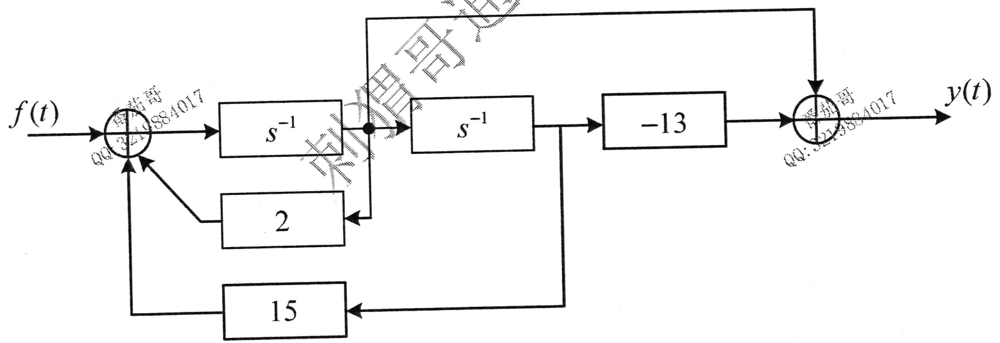

(3) 微分方程若不作说明, 默认为因果系统; 则系统的收敛域为 $\operatorname{Re}\{s\} > 5$, 收敛区域不包含 $j \omega$ 轴, 故系统不稳定。

---

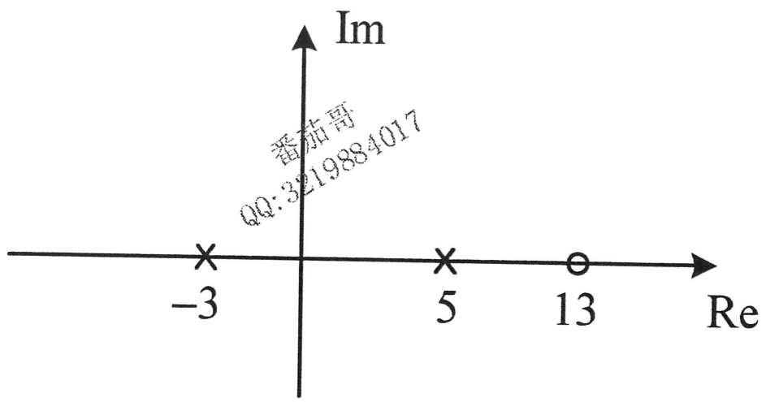

(4) 微分方程两边同时取单边拉普拉斯变换可得:

$$
[ s ^ {2} Y (s) - s y (0 ^ {-}) - y ^ {\prime} (0 ^ {-}) ] - 2 [ s Y (s) - y (0 ^ {-}) ] - 1 5 Y (s) = s F (s) - f (0 ^ {-}) - 1 3 F (s)
$$

$$
Y (s) = \frac {(s - 1 3) F (s)}{s ^ {2} - 2 s - 1 5} + \frac {y ^ {\prime} (0 ^ {-}) + s y (0 ^ {-}) - 2 y (0 ^ {-}) - f (0 ^ {-})}{s ^ {2} - 2 s - 1 5}
$$

$$
Y _ {z s} (s) = \frac {(s - 1 3) F (s)}{s ^ {2} - 2 s - 1 5} = \frac {1 6}{(s + 3) (s - 5)} = \frac {2}{s - 5} - \frac {2}{s + 3}
$$

$$
Y _ {z s} (s) \xleftarrow {L} y _ {z s} (t) = \left(2 e ^ {5 t} - 2 e ^ {- 3 t}\right) u (t)
$$

$$
Y _ {z i} (s) = \frac {y ^ {\prime} \left(0 ^ {-}\right) + s y \left(0 ^ {-}\right) - 2 y \left(0 ^ {-}\right) - f \left(0 ^ {-}\right)}{s ^ {2} - 2 s - 1 5} = \frac {2 s + 2}{s ^ {2} - 2 s - 1 5} = \frac {1}{2} \frac {1}{s + 3} + \frac {3}{2} \frac {1}{s - 5}
$$

$$
Y _ {z i} (s) \xleftarrow {L} y _ {z i} (t) = \left(\frac {1}{2} e ^ {- 3 t} + \frac {3}{2} e ^ {5 t}\right) u (t)
$$

$$
y (t) = y _ {z s} (t) + y _ {z i} (t) = \left(- \frac {3}{2} e ^ {- 3 t} + \frac {7}{2} e ^ {5 t}\right) u (t)
$$

强迫响应：0

自然响应: $\left(-\frac{3}{2} e^{-3 t} + \frac{7}{2} e^{5 t}\right) u(t)$

(注: 此题难度★★☆☆☆, 西瓜哥原创小结: 常规题, 综合考察连续时间的复频域分析。)

题 20 解: (刺猬哥考研团队西瓜哥 QQ:915211156)

(1) 由微分方程可知, 系统函数 $H(s) = \frac{3 s + 2}{s^{2} + a s + b}$.

因输出 $y(t) = H(s)e^{s_0t}\bigg|_{s = s_0}$, 由已知可得

---

$\left\{ \begin{array}{l} H(4) = \frac{7}{3} \\ H(3) = \frac{11}{2} \end{array} \right.$, 解得 $\left\{ \begin{array}{l} a = -3 \\ b = 2 \end{array} \right.$

(2) $H(s) = \frac{3s + 2}{s^2 - 3s + 2}$, 零极点图如下图所示:

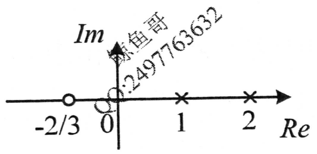

3) $H(s) = \frac{3s + 2}{s^2 - 3s + 2} = \frac{-5}{s - 1} + \frac{8}{s - 2}$

由已知条件可知 $s = 3,4$ 在 $H(s)$ 的收敛域内，因此 $ROC:\operatorname{Re}\{s\} >2$

$$
h (t) = (- 5 e ^ {t} + 8 e ^ {2 t}) u (t)
$$

(4) 收敛域不包括 $j \omega$ 轴, 但包括 $\infty$, 故系统因果不稳定.

5) $X(s) = \frac{1}{s - 2}$

$$
Y (s) = X (s) H (s) = \frac {1}{s - 2} \left(\frac {3 s + 2}{s ^ {2} - 3 s + 2}\right) = \frac {5}{s - 1} + \frac {- 5}{s - 2} + \frac {8}{(s - 2) ^ {2}}
$$

$$
y (t) = \left(5 e ^ {t} - 5 e ^ {2 t} + 8 t e ^ {2 t}\right) u (t)
$$

(刺猬哥考研团队: 此题难度★★★☆☆)

题 21 解: (刺猬哥考研团队西瓜哥 QQ:915211156)

(1) 设系统的单位冲激响应为 $h(t)$, 零输入响应为 $y_{zi}(t)$, 则有

$$
\begin{array}{l} y _ {1} (t) = \left(3 e ^ {- 2 t} + \frac {2}{3} e ^ {- t}\right) u (t) = u (t) * h (t) + y _ {z i} (t) ① \\ y _ {2} (t) = \left(- 3 e ^ {- 2 t} + \frac {2}{3} e ^ {- t}\right) u (t) + 2 \delta (t) = \frac {d \delta (t)}{d t} * h (t) + y _ {z i} (t) ② \\ \end{array}
$$

通过①- ②可得 $6e^{-2t}u(t) - 2\delta (t) = [u(t) - \frac{d\delta(t)}{dt} ]*h(t)$

$$
H (s) = \frac {2 s}{(s + 1) (s + 2)} = - \frac {2}{s + 1} + \frac {4}{s + 2}, \operatorname {R e} \{s \} > - 1 \xrightarrow {L} h (t) = - 2 e ^ {- t} u (t) + 4 e ^ {- 2 t} u (t)
$$

更多优质考研资讯，关注b站 | 公众号“刺猬哥通信电子考研”、知乎“刺猬哥通信考研”

---

24最强信号辅导班招生啦！让你节省时间，不走弯路，取得佳绩！联系西瓜哥qq915211156 加Q群709502924，使用刺猬哥团队正版核心序列ORK，享受高质量全天候优质答疑指导

系统函数收敛域包含 $j \omega$ 轴, 故系统稳定。

(2) 由题意:

$$
H (s) = \frac {1}{s ^ {2} + 3 s + 2} (2 s)
$$

对于 $H_{1}(s) = \frac{1}{s^{2} + 3s + 2}$, 设中间变量为 $z(t)$

$\Rightarrow \frac{d^{2} z(t)}{d t^{2}} + 3 \frac{d z(t)}{d t} + 2 z(t) = x(t)$, 画出 $H_{1}(s)$ 框图:

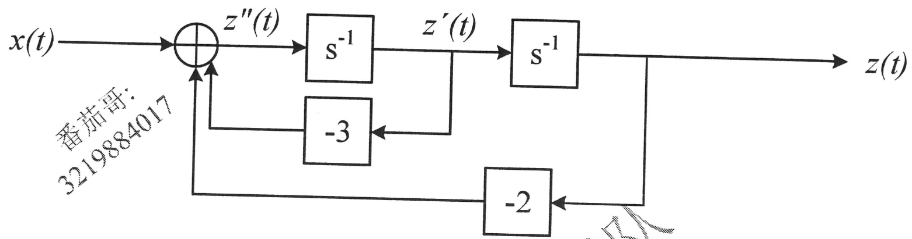

对于 $H_{2}(s) = 2 s$, $\Rightarrow y(t) = 2 \frac{d z(t)}{d t}$

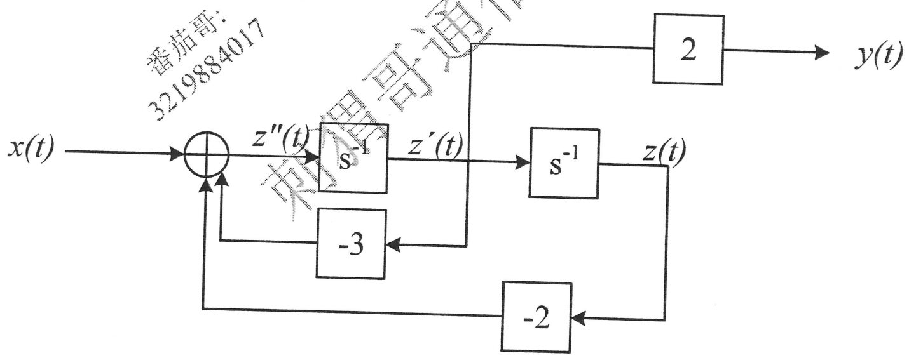

(3) 设零输入响应 $y_{zi}(t) = Ae^{-t} + Be^{-2t}$, 将初始状态 $y(0^{-}) = 1, y'(0^{-}) = 0$ 代入可得 $\left\{ \begin{array}{l} A + B = 1 \\ -A - 2B = 0 \end{array} \right. \Rightarrow \left\{ \begin{array}{l} A = 2 \\ B = -1 \end{array} \right.$, 故零输入响应 $y_{zi}(t) = (2e^{-t} - e^{-2t})u(t)$ （取 0 时刻之后的部分）

零状态响应 $y_{zs}(t) = x(t)*h(t)\xleftarrow{L}Y_{zs}(s) = \frac{2}{(s + 1)(s + 2)} = \frac{2}{s + 1} -\frac{2}{s + 2}$

y $z s\left(t\right) = \left(2 e ^{- t} - 2 e ^{- 2 t}\right) u (t)$ ，全响应为 $y(t) = y_{zi}(t) + y_{zs}(t) = (4e^{-t} - 3e^{-2t})u(t)$

---

（注：此题难度★★☆☆☆）

题 22 解: (刺猬哥考研团队西瓜哥 QQ:915211156)

(1) 设左侧加法器的输出信号为 $w(t) \xleftarrow{L} W(s)$, 则有

$$
\left\{ \begin{array}{l} a \cdot W (s) s ^ {- 1} + b W (s) s ^ {- 2} + X (s) = W (s) \\ c W (s) s ^ {- 2} + W (s) = Y (s) \end{array} \right.
$$

得到: $H(s) = \frac{Y(s)}{X(s)} = \frac{s^{2} + c}{s^{2} - as - b}$ (也可根据梅森公式直接写出)

则系统的微分方程为: $y''(t) - ay'(t) - by(t) = x''(t) + cx(t)$,

对方程两边取拉氏变换得：

$$
\left[ s ^ {2} Y (s) - s y \left(0 ^ {-}\right) - y ^ {\prime} \left(0 ^ {-}\right) \right] - a \left[ s Y (s) - y \left(0 ^ {-}\right) \right] - b Y (s) = s ^ {2} x (s) + c x (s),
$$

由输入 $x(t) = u(t)$ 有 $X(s) = \frac{1}{s}$,

则 $Y(s) = \frac{s^2 + c + s^2y(0^-) + [y'(0) - ay(0^-)]s}{s(s^2 - as - b)}$

由 $x(t) = u(t)$ 的全响应为 $y(t) = (1 - e^{-t} + 3e^{-3t})u(t)$, 得

$$
Y (s) = \frac {1}{s} - \frac {1}{s + 1} + \frac {3}{s + 3}, \quad \operatorname {R e} \{s \} > 0
$$

对比两式，可得：

$$
\left\{ \begin{array}{l} a = - 4, b = - 3, c = 3 \\ y \left(0 ^ {-}\right) = 2, y ^ {\prime} \left(0 ^ {-}\right) = - 4 \end{array} \right.
$$

则 $H(s) = \frac{s^2 + 3}{s^2 + 4s + 3},\operatorname {Re}\{s\} > - 1$

2) $Y_{zs}(s) = H(s)X(s) = \frac{1}{s} - \frac{2}{s + 1} + \frac{2}{s + 3}, \operatorname{Re}\{s\} > 0$，则

$$
y _ {z s} (t) = \left(1 - 2 e ^ {- t} + 2 e ^ {- 3 t}\right) u (t), \quad y _ {z i} (t) = y (t) - y _ {z s} (t) = \left(e ^ {- t} + e ^ {- 3 t}\right) u (t);
$$

(3) 1) 问已经求得: $y\left(0^{-}\right)=2, y^{\prime}\left(0^{-}\right)=-4$, 也可根据 $y_{z i}(t)$ 的表达式来求取。

(QQ915211156 西瓜哥 Tips: 此题难度★★★☆☆, 待定系数较多, 直接进行逆变换不可行, 而是将已知的响应进行正变换, 进而利用等式恒等求值)

更多优质考研资讯, 关注b站 | 公众号“刺猬哥通信电子考研”、知乎“刺猬哥通信考研”

---

题 23 解: (刺猬哥考研团队西瓜哥 QQ:915211156)

(1) $h(t)$ 为偶函数, 则 $h(-t) = h(t)$;

$$
H (s) = \int_ {- \infty} ^ {\infty} h (t) e ^ {- s t} d t = \int_ {- \infty} ^ {\infty} h (- t) e ^ {- s t} d t = \int_ {- \infty} ^ {\infty} h (\tau) e ^ {s \tau} d \tau = H (- s)
$$

由条件(2)知, $H(-s)$ 在 $s = 1$ 处有极点, 而 $H(s)$ 为偶函数

故 $H(s)$ 在 $s = \pm 1$ 处有极点；

又由条件(3): $h(t)e^{2t} \leftrightarrow H(s - 2)$, 在 $s = 0$ 处有一个极点, 即 $H(-2) = \infty$. 故 $H(s)$ 在 $s = \pm 2$ 处有极点。

又由条件(1)知 $H(s)$ 共 4 个极点, 1 个零点

故 $H(s) = \frac{K}{(s^2 - 1)(s^2 - 4)}$

由条件(4)，$H(0) = \frac{K}{4} = \frac{1}{4} \Rightarrow K = 1$

故 $H(s) = \frac{1}{(s^2 - 1)(s^2 - 4)}$

系统稳定, 则收敛域需包括 $j \omega$ 轴, 收敛域 $R O C: -1 < \operatorname{Re}\{s\} < 1$

(刺猬哥考研团队: 此题难度★★★☆☆)

题 24 解: (刺猬哥考研团队西瓜哥 QQ:915211156)

(1) 由 $H(s)$ 可知, 系统极点为 $s_{1,2} = -\frac{3}{2}, 1$

因系统稳定, 收敛域需包含 $j \omega$ 轴, 则 $H(s)$ 收敛域为 $-\frac{3}{2} < \operatorname{Re}\{s\} < 1$, 零极点图如下

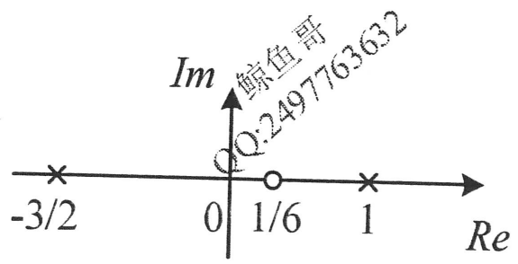

---

(2) $H(s) = \frac{3s - 0.5}{(s + 1.5)(s - 1)} e^{-2s} = \left(\frac{2}{s + 1.5} + \frac{1}{s - 1}\right)e^{-2s}, -\frac{3}{2} < \operatorname{Re}\{s\} < 1$，逆变换，得

$$
h (t) = 2 e ^ {- \frac {3}{2} (t - 2)} u (t - 2) - e ^ {t - 2} u (- t + 2)
$$

(3) 显然, 由 $H(s)$ 可知, 该信号为双边信号, 不能满足因果性;

(或 显然, 当 $t < 0$ 时, $h(t) \neq 0$, 系统非因果)

考虑 $\left|H(j\omega)\right| = \left|\frac{3j\omega - 0.5}{(j\omega + 1.5)(j\omega - 1)} e^{-2j\omega}\right| = \left|\frac{3j\omega - 0.5}{(j\omega + 1.5)(j\omega - 1)}\right| = \left|\frac{3j\omega - 0.5}{(j\omega + 1.5)(j\omega + 1)}\right|$

( $\left|j\omega -1\right| = \sqrt{(-1 + j\omega)(-1 - j\omega)} = \sqrt{1 + \omega^2} = \sqrt{(1 + j\omega)(1 - j\omega)} = \left|j\omega +1\right|$ ，也可借助极坐标来理解，两者模相等）

可设计系统函数为 $H_{1}(s) = \frac{3s - 0.5}{(s + 1.5)(s + 1)}$, $\operatorname{Re}\{s\} > -1$ 的因果稳定系统

其微分方程为: $\frac{d^2y(t)}{dt^2} +\frac{5}{2}\frac{dy(t)}{dt} +\frac{3}{2} y(t) = 3\frac{dx(t)}{dt} -\frac{1}{2} x(t)$

$H_{1}(s) = \frac{3s - 0.5}{(s + 1.5)(s + 1)} = \frac{10}{s + \frac{3}{2}} +\frac{-7}{s + 1}$ 画出其并联型模拟框图如下：

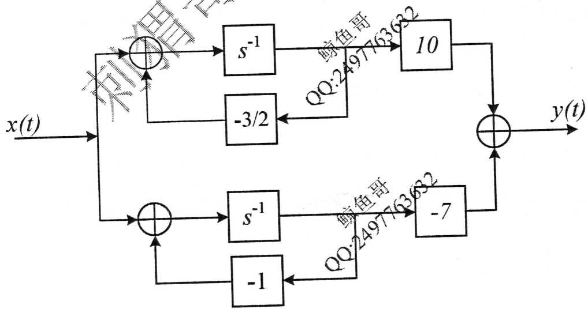

（QQ915211156 西瓜哥 Tips: 此题难度★★★☆☆, 注意第 3）的变换只需保证模不变即可）

题 25 解: (刺猬哥考研团队西瓜哥 QQ:915211156)

1）根据已知，有 $X_{1}(s) = \frac{s - 2}{s^{2} + 5},\operatorname {Re}\{s\} >0$ $Y_{1}(s) = \frac{k}{(s + a)^{2}},\operatorname {Re}\{s\} > - a$

更多优质考研资讯, 关注b站 | 公众号“刺猬哥通信电子考研”、知乎“刺猬哥通信考研”

---

24最强信号辅导班招生啦！让你节省时间，不走弯路，取得佳绩！联系西瓜哥qq915211156 加Q群709502924，使用刺猬哥团队正版核心序列ORK，享受高质量全天候优质答疑指导

$$
\Rightarrow H (s) = \frac {k \left(s ^ {2} + 5\right)}{\left(s + a\right) ^ {2} (s - 2)}
$$

又 $X_{2}(s) = 1 + \frac{3}{s - b} = \frac{s - b + 3}{s - b},\operatorname {Re}\{s\} <  b$

$$
Y _ {2} (s) = \frac {s ^ {2} + 5}{(s - 2) ^ {2} (s + 1)}, - 1 <   \operatorname {R e} \{s \} <   2 \Rightarrow H (s) = \frac {(s ^ {2} + 5) (s - b)}{(s - 2) ^ {2} (s + 1) (s - b + 3)}
$$

比较可知 $a = 1, b = 2, k = 1$

(2) 由 1) 可得系统函数 $H(s) = \frac{s^2 + 5}{(s + 1)^2 (s - 2)}$ 且收敛域为 $-1 < \operatorname{Re}\{s\} < 2$

3） $S(s) = \frac{1}{s} X(s) = \frac{s^2 + 5}{s(s + 1)^2(s - 2)},0 <   \operatorname {Re}\{\mathbf{s}\} <  2$ ，取逆变换得

单位阶跃响应 $s(t) = (2 t e^{-t} + 2 e^{-t} - \frac{5}{2}) u(t) - \frac{1}{2} e^{2 t} u(-t)$

(4) 由收敛域可知系统非因果, 收敛域包括虚轴, 所以系统稳定。

（QQ915211156 西瓜哥 Tips: 此题难度★★★★★, 看到 $X_{1}(s)$ 的表达式, 才会发现 $x_{1}(t)$ 表达中的 $\sqrt{}$ 等都是纸老虎）

题 26 解: (刺猬哥考研团队西瓜哥 QQ:915211156)

(1) 微分方程两边拉氏变换, 得到

$$
H (s) = \frac {Y (s)}{X (s)} = \frac {1}{s ^ {3} + (1 + 2 a) s ^ {2} + a (2 + a) s + a ^ {2}}
$$

由 $g(t) = \frac{dh(t)}{dt} + h(t)$, 得到

$$
G (s) = s H (s) + H (s) = \frac {s + 1}{s ^ {3} + (1 + 2 a) s ^ {2} + a (2 + a) s + a ^ {2}} = \frac {1}{(s + a) ^ {2}}
$$

$g(t)$ 代表系统稳定, 故双重极点 $-a$ 在左半平面, 则 $a > 0$ 。

(2) 输入 $x(t) = 1 = e^{0t}$

故输出 $y(t) = H(s)\big|_{s=0} \cdot e^{0t} = \frac{1}{a^2} = \frac{1}{4}$

(特殊函数法: $y(t) = e^{s_0t} * h(t) = \int_{-\infty}^{\infty} e^{s_0(t - \tau)} h(\tau) d\tau = e^{s_0t} \int_{-\infty}^{\infty} e^{s_0\tau} h(\tau) d\tau = e^{s_0t} H(s)\bigg|_{s = s_0}$)

---

由1）可知， $a = 2$

$$
\begin{array}{l} H (s) = \frac {1}{(s + 2) ^ {2} (s + 1)} = \frac {1}{s + 1} + \frac {- 1}{s + 2} + \frac {- 1}{(s + 2) ^ {2}} \\ h (t) = \left(e ^ {- t} - e ^ {- 2 t} - t e ^ {- 2 t}\right) u (t) \\ \end{array}
$$

(QQ915211156 西瓜哥 Tips: 此题难度★★★☆☆, 此题切入点为通过拉氏变换表示系统函数, 再利用系统稳定性的条件来求得 $a$ 的范围。第 2) 问解题关键是运用复指数信号响应的求取方法。另一种思路是通过拉氏变换与逆变换来表示输出, 从而求得 $a$ 的值, 相比之下麻烦不少, 未列出)

题 27 解: (刺猬哥考研团队西瓜哥 QQ:915211156)

(1) 令左侧加法器的输出为 $w(t)$, 由系统框图, 有

$$
\left\{ \begin{array}{l} W (s) = X (s) - a \cdot s ^ {- 1} \cdot W (s) \\ [ W (s) - b Y (s) ] \cdot s ^ {- 1} = Y (s) \end{array} \right.
$$

消去 $W(s)$ ，得： $H(s) = \frac{s}{(s + a)(s + b)}.$

又 $x_{1}(t)\leftarrow \frac{s + 1}{s^{2} + 1},\operatorname {Re}\{s\} >0,\quad y_{1}(t)\leftarrow \frac{s}{(s^{2} + 1)(s + 1)},\operatorname {Re}\{s\} >0$

H(s) = Y(s) X(s) = s (s+1)²,Re{s}> -1，对比可得a=b=1

2) $x_{2}(t) = \sin t = \frac{1}{2j} e^{jt} - \frac{1}{2j} e^{-jt}$

$s = \pm j$ 在收敛域内, 由特征函数法, 有

$$
y _ {2} (t) = \frac {1}{2 j} e ^ {j t} H (j) - \frac {1}{2 j} e ^ {- j t} H (- j) = \frac {1}{4 j} e ^ {j t} - \frac {1}{4 j} e ^ {- j t} = \frac {1}{2} \sin t
$$

(3) 根据题意, 有 $y(t) = x(t) * [h(t) + h_1(t)] = \delta(t)$.

拉氏变换，得 $\frac{s + 1}{s^2 + 1} \left[ \frac{s}{(s + 1)^2} + H_1(s) \right] = 1$

---

24最强信号辅导班招生啦！让你节省时间，不走弯路，取得佳绩！联系西瓜哥qq915211156 加Q群709502924，使用刺猬哥团队正版核心序列ORK，享受高质量全天候优质答疑指导

$$
H _ {1} (s) = \frac {s ^ {2} + 1}{s + 1} - \frac {s}{(s + 1) ^ {2}} = \frac {s ^ {3} + s ^ {2} + 1}{(s + 1) ^ {2}} = s - 1 + \frac {1}{s + 1} + \frac {1}{(s + 1) ^ {2}}, \operatorname {R e} \{s \} > - 1
$$

逆变换, 得 $h_{1}(t) = \delta^{\prime}(t) - \delta(t) + e^{-t} u(t) + t e^{-t} u(t)$

(QQ915211156 西瓜哥 Tips: 此题难度★★★☆☆, 从 2) 结果来看, 系统为无相移的全通系统, 如果采用 $y(t) = \left|H(j\omega)\right|\sin \left(t + \varphi_{H}\right)$ 的方法, 解题更为迅速; 另外,利用梅森公式求系统函数同样可行, 但一方面本题存在不相关环路, 另一方面, 广工真题出题人更鼓励设置中间量列写方程组来求取)

题 28 解: (刺猬哥考研团队西瓜哥 QQ:915211156)

(1) $h_{1}(t) = 4 \operatorname{Sa}(2 t) \xleftarrow{F} H_{1}(j \omega) = 2 \pi G_{4}(\omega)$

$$
X (j \omega) = 5 \delta (\omega + 3) + 3 \delta (\omega + 1) + 6 \delta (\omega) + 3 \delta (\omega - 1) + 5 \delta (\omega - 3)
$$

$$
Y _ {1} (j \omega) = X (j \omega) H _ {1} (j \omega) = 6 \pi \delta (\omega + 1) + 1 2 \pi \delta (\omega) + 6 \pi \delta (\omega - 1) \xleftarrow {F} y _ {1} (t) = 6 + 6 \cos t
$$

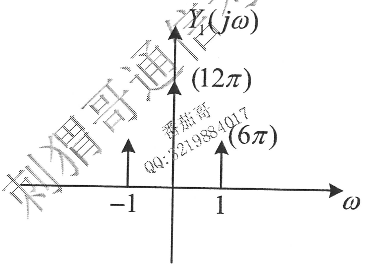

(2) 应用电路的 S 域模型, 可列方程 $Y_{1}(s) = \frac{Y(s)}{\frac{1}{s}} + Y(s) \Rightarrow H_{2}(s) = \frac{Y(s)}{Y_{1}(s)} = \frac{1}{s + 1}$.

$H_{2}(j\omega) = \frac{1}{j\omega + 1} = \frac{1}{\sqrt{\omega^{2} + 1}} e^{-j\arctan \omega}$ 即 $|H_{2}(j\omega)| = \frac{1}{\sqrt{\omega^{2} + 1}}, \varphi(\omega) = -\arctan \omega$

$$
\begin{array}{l} y _ {1} (t) = 6 \cos (0 \cdot t) + 6 \cos t \rightarrow y (t) = 6 | H _ {2} (j 0) | \cos (0 \cdot t + \varphi (0)) + 6 | H _ {2} (j 1) | \cos (t + \varphi (1)) \\ = 6 + 3 \sqrt {2} \cos \left(t - \frac {\pi}{4}\right) \\ \end{array}
$$

(QQ915211156 西瓜哥 Tips: 此题难度★★☆☆☆, 第一问很基础, 第二问涉及电路 S 域分析知识, 注意图中的电阻不是电感, 看单位区分。)

---

题 29 解: (刺猬哥考研团队西瓜哥 QQ:915211156)

由题意:

$t < 0$ 时, 开关未闭合时, 电路达到稳态, 可求电容电感的初始值:

$\left\{u_{c}\left(0_{-}\right)=\frac{R_{2}+R_{3}}{R_{1}+R_{2}+R_{3}} u_{s}\left(t\right)=6 V\right.$ $\left.i_{L}\left(0_{-}\right)=\frac{1}{R_{1}+R_{2}+R_{3}} u_{s}\left(t\right)=2 A\right.$, 画出电路的 S 域模型:

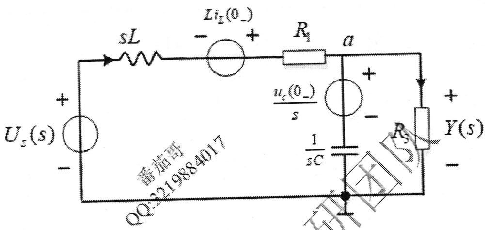

列出 $a$ 点的结点方程:

$\frac{U_s(s) + Li_L(0_-) - Y(s)}{sL + R_1} = \frac{Y(s) - \frac{u_c(0_-)}{s}}{\frac{1}{R_3}} + \frac{Y(s)}{R_3}$ 整理可得：

$$
(s C + \frac {1}{R _ {3}} + \frac {1}{s L + R _ {1}}) Y (s) = \frac {U _ {s} (s)}{s L + R _ {1}} + \frac {\frac {u _ {c} (0 _ {-})}{s}}{\frac {1}{s C}} + \frac {L i _ {L} (0 _ {-})}{s L + R _ {1}}
$$

$$
\begin{array}{l} Y _ {z i} (s) = \frac {6 s + 2 0}{(s + 2) ^ {2}} = \frac {8}{(s + 2) ^ {2}} + \frac {6}{s + 2} \xleftarrow {L} y _ {z i} (t) = (8 t + 6) e ^ {- 2 t} u (t) \\ Y _ {z s} (s) = \frac {1 2}{s (s + 2) ^ {2}} = \frac {3}{s} - \frac {6}{(s + 2) ^ {2}} - \frac {3}{s + 2} \xleftarrow {L} y _ {z s} (t) = 3 u (t) - (6 t + 3) e ^ {- 2 t} u (t) \\ \end{array}
$$

(QQ915211156 西瓜哥 Tips: 此题难度★★☆☆☆, 经典电路 S 域分析题, 各大高校热门考研真题, 无数次被考查。)

题 30 解: (刺猬哥考研团队西瓜哥 QQ:915211156)

在外加输入激励前，电路没有初始储能，故电路的 S 域模型如下：

更多优质考研资讯, 关注b站 | 公众号“刺猬哥通信电子考研”、知乎“刺猬哥通信考研”

---

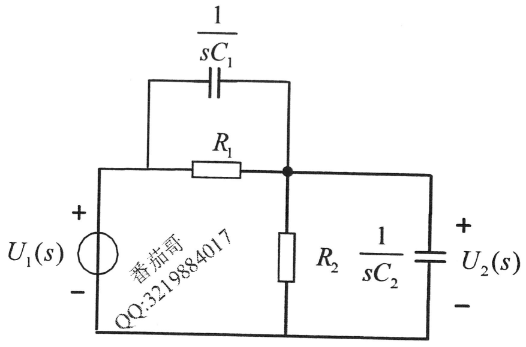

$$
H (s) = \frac {U _ {2} (s)}{U _ {1} (s)} = \frac {\frac {R _ {2} \frac {1}{s C _ {2}}}{R _ {2} + \frac {1}{s C _ {2}}}}{\frac {R _ {2} \frac {1}{s C _ {2}}}{R _ {2} + \frac {1}{s C _ {2}}} + \frac {R _ {1} \frac {1}{s C _ {1}}}{R _ {1} + \frac {1}{s C _ {1}}}} = \frac {s C _ {1} R _ {1} R _ {2} + R _ {2}}{s \left(C _ {1} + C _ {2}\right) R _ {1} R _ {2} + R _ {1} + R _ {2}}
$$

若要输出不失真, 则 $H(s) = K$, 即 $\frac{C_{1} R_{1} R_{2}}{R_{2}} = \frac{\left(C_{1} + C_{2}\right) R_{1} R_{2}}{R_{1} + R_{2}} \Rightarrow C_{1} R_{1} = C_{2} R_{2}$

(QQ915211156 西瓜哥 Tips: 此题难度★★☆☆☆, 电路 S 域分析结合无失真定义, $H(s)$ 分子分母对应项互成比例时, 其值为常数。)

题31解：

$$
i _ {c} (0 _ {-}) = 0. 5 A, u _ {c} (0 _ {-}) = 0. 5 \times 4 = 2 V
$$

由 KVL, 有 $s I_{L}(s) - 0.5 + 6 I_{L}(s) - \frac{2}{s} + I_{L}(s) \frac{5}{s} = 0$

有 $I_{\text {总}}(s) = \frac{\frac{1}{2} s + 2}{s^{2} + 6 s + 5}$, 则电容和电感分别有

$$
U _ {c} (s) = - I _ {\text {总}} (s) \frac {5}{s} + \frac {2}{5}, U _ {L} (s) = I _ {\text {总}} (s) \cdot s - 0. 5
$$

代入化简可得 $U_{c}(s) = \frac{\frac{15}{8}}{s + 1} +\frac{\frac{1}{8}}{s + 5}, U_{L}(s) = -\frac{\frac{3}{8}}{s + 1} -\frac{\frac{5}{8}}{s + 5}$

---

求反变换可得 $u_{c}(t) = \left(\frac{15}{8} e^{-t} + \frac{1}{8} e^{-5t}\right) u(t), u_{L}(t) = \left(-\frac{3}{8} e^{-t} - \frac{5}{8} e^{-5t}\right) u(t)$

题 32 解: (刺猬哥考研团队西瓜哥 QQ:915211156)

$S$ 域等效电路如下图所示:

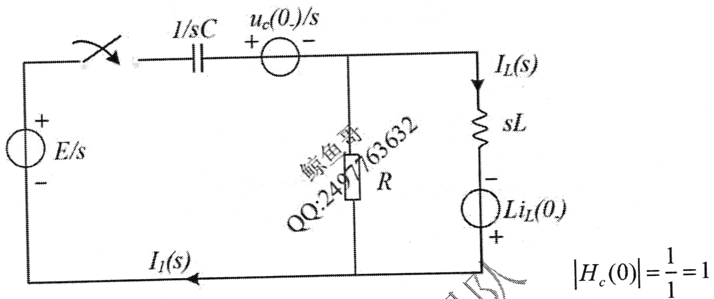

其中: $C = 1, R = 0.2, L = 0.5, u_{C}\left(0_{-}\right) = 8, i_{L}\left(0_{-}\right) = 4$, 由 KCL、KVL 定律, 有

$\left\{ \begin{array}{l} \frac{sL I_{L}(s) - L i_{L}(0_{-})}{R} + I_{L}(s) = I_{1}(s) \\ \frac{10}{s} - I_{1}(s) \frac{1}{sC} - \frac{u_{C}(0_{-})}{s} = sL I_{L}(s) - L i_{L}(0_{-}) \end{array} \right.$, 得 $I_{L}(s) = \frac{24 + 4s}{s^{2} + 5s + 2}$

(西瓜哥 Tips: 此题难度★★★☆☆, 考生需熟练掌握该解题方法。题目比较常规,但多数考生没有复习该知识点。电路相关功底较差的同学可仔细学习相关教材或跟学高视频课中的相关专题。)

题 33 解: (刺猬哥考研团队西瓜哥 QQ:915211156)

$t = 0_{-}$时, $i_{L}\left(0_{-}\right) = \frac{8 V}{4 \Omega} = 2 A, u_{C}\left(0_{-}\right) = 14 V$

受控源: $u_{L}(t) = 2 \times 5 = 10 V$

$t \geq 0$时, s 域等效电路:

---

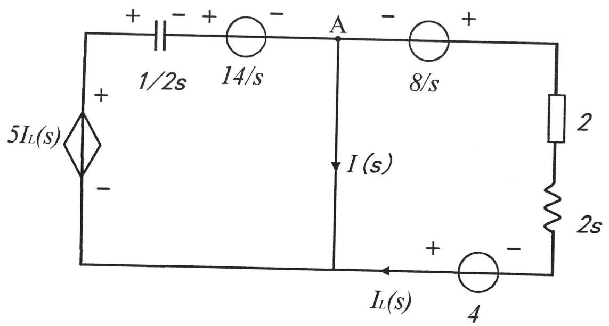

对节点A列KCL方程可知 $\frac{5I_L(s) - \frac{14}{s}}{1 / 2s} = I(s) + I_L(s)$

对右侧回路, 由 KVL 可知, $\frac{8}{s} + 4 = (2 + 2 s) I_{L}(s)$

上述两式联立解得 $I(s) = \frac{-8s^2 + 10s - 4}{s(s + 1)} = -8 + \frac{-4}{s} +\frac{22}{s + 1}$ 逆变换，有

$$
i (t) = - 8 \delta (t) - 4 u (t) + 2 2 e ^ {- t} u (t)
$$

(QQ915211156 西瓜哥 Tips: 此题难度★★★☆☆, 刺猬哥考研团队)

题 34 解:

(1) 根据题中所给的系统函数可化简为 $H_{c}(s) = \frac{1}{s^{2} + \sqrt{2}s + 1}$, 令 s 等于题设中要求的值可得: $H_{c}(0) = 1, H_{c}(\infty) = 0$, 要求其半功率频率点并画出频响图, 因为极点全在 jw 轴左侧, 因此直接令 s=jw 可得:

$$
H _ {c} (j w) = \frac {1}{- w ^ {2} + \sqrt {2} w j + 1} \Rightarrow \left| H _ {c} (j w) \right| = \frac {1}{\sqrt {\left(1 - w ^ {2}\right) ^ {2} + 2 w ^ {2}}}
$$

当 $w = 0$ 时候, 幅频响应有最大值为, 半功率频率点为幅度为最大值 $\frac{\sqrt{2}}{2}$ 倍处的频率值, 算出来其对应的频率点 $\omega = 1$, 画出频响图如下:

---

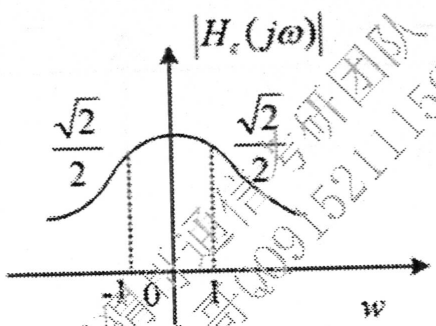

(2)

根据变换公式 $s = \frac{1 - z^{-1}}{1 + z^{-1}}$, 令 $s = j\Omega, z = e^{jw}$ 可得:

$$
j \Omega = \frac {1 - e ^ {- j w}}{1 + e ^ {j w}} = \frac {e ^ {- \frac {j w}{2}}}{e ^ {- \frac {j w}{2}}} \frac {e ^ {\frac {j w}{2}} - e ^ {- \frac {j w}{2}}}{e ^ {\frac {j w}{2}} - e ^ {- \frac {j w}{2}}} = \frac {j \sin \frac {w}{2}}{\cos \frac {w}{2}} = j \tan \frac {w}{2} \Rightarrow \Omega = \tan \frac {w}{2}
$$

所以 $H_{d}\left(e^{j w}\right)=H_{c}\left(j \Omega\right) \Bigg|_{\Omega=\tan \frac{w}{2}}=H_{c}\left(j \tan \frac{w}{2}\right)$

(3)

$$
H _ {d} \left(e ^ {j \omega}\right) = H _ {c} \left(j \tan \frac {\omega}{2}\right) = \frac {1}{\sqrt {(1 - \tan^ {2} \frac {w}{2}) ^ {2} + 2 \tan^ {2} \frac {w}{2}}}
$$

因为题目并未要求我们画出离散幅频响应图，所以我们只需要代入0、二分之派以及派的值比较大小即可得到该滤波器为低通滤波器。

(注: 此题难度★★★☆☆, 西瓜哥原创小结: 这个题很新, 引入了数字信号处理的双线性变换法来分析映射前后的频率关系, 除了第二问, 其它设问的思路都是比较常见的。)

西瓜哥原创编写

---

# 南昌考研信号与系统核心序列 O

# 序列五—傅里叶变换应用于通信系统

(滤波、调制与抽样)

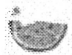

西瓜哥原创作答

1. 信号 $f(t) = \sin 2\pi t$ 的最小取样频率是 ( )；

A. $1 \mathrm{~Hz}$

B. $2 \mathrm{~Hz}$

C. $4 H z$

D. $8 \mathrm{~Hz}$

2. 欲使信号通过线性系统不产生失真，则该系统应具有（）。

A. 幅频特性为线性, 相频特性也为线性

B. 幅频特性为线性, 相频特性为常数

C. 幅频特性为常数, 相频特性为线性

D.系统的冲激响应为 $h(t) = k u\left(t - t_{0}\right)$

(刺猬哥考研团队西瓜哥 QQ:915211156)

3. 理想不失真传输系统的传输函数 $H(j\omega)$ 是（）。

A. $K e^{-j \omega_0 t}$

B. $K e^{-j \omega t_{0}}$

C. $K e ^{- j \omega t _{0}}\left[ u \left(\omega + \omega_{c}\right) - u \left(\omega - \omega_{c}\right)\right]$

D. $K e^{-j \omega_0 t_0}$

4. 欲使信号通过系统后只产生相位变化, 则该系统一定是 ( )。

A. 高通滤波网络

B. 带通滤波网络

C.全通网络

D. 最小相移网络

(刺猬哥考研团队西瓜哥 QQ:915211156)

5. 已知因果系统输入输出的关系式为, 则该系统是 ( )。

A. 低通滤波器

B. 高通滤波器

C. 带通滤波器

D. 全通滤波器

---

6. 已知系统的冲激响应或频率响应函数, 在以下系统中, ( ) 能无失真传输信号?

(A) $h(t) = 5\delta (t - 1)$

(B) $H(j\omega) = 2e^{-j\omega},|\omega | < 1$

(C) $H(j\omega) = \frac{2 - j\omega}{2 + j\omega}$

(D) $h(t) = \sin t$

7. 已知一连续时间 LTI 系统的频率响应为 $H(j \omega) = \frac{3 - j \omega}{3 + j \omega}$, 该系统的幅频特性 $|H(j \omega)| =$ ________; 该系统 ________ (是或不是) 无失真传输系统。

8. 信号 $x(t) = \cos (30t) + 2\cos (90t)$ 通过一幅频特性 $|H(j\omega)| = 4$ ， $\omega \in (-\infty, +\infty)$，相频特性 $\varphi(j\omega) = \begin{cases} -0.1\omega, & |\omega| \leq 60 \\ -6, & \omega > 60 \\ 6, & \omega < -60 \end{cases}$ 的滤波系统后输出波形不会出现失真。（）（T/F）

9. $f(t)$ 最高频率为 $f_{m}$, $y(t) = f\left(\frac{t}{2}\right) f\left(\frac{t}{4}\right)$, 求最小抽样频率________。（刺猬哥考研团队西瓜哥 QQ:915211156）

10. 已知系统如下图所示，输入信号为 $x(t) = A + B\cos \left(\frac{2\pi t}{T}\right)$，取样信号为 $p(t) = \sum_{n=-\infty}^{\infty} \delta[t - n(T + \Delta)]$，$T >> \Delta$，取样后通过一个理想低通滤波器 $H(jw)$，$H(jw) = \begin{cases} 1, & |w| < \frac{1}{2(T + \Delta)} \\ 0, & \text{other} \end{cases}$，取样信号通过滤波器后输出为 $y(t) = kx(at)$，其中 $a < 1, k$ 为实系数，求（刺猬哥考研团队西瓜哥 QQ:915211156）

---

(1) $g(t)$ 的傅里叶变 $\frac{d}{dt} y(t) + 3y(t) = \frac{d}{dt} x(t)$ 换 $G(w)$

(2) 为使输出达到要求, $a, k, \Delta$ 应满足的条件是

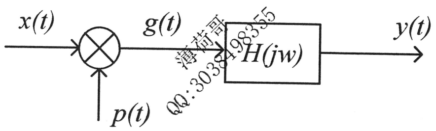

11. 在现实生活中常常会碰到回音问题, 使得声音失真, 例如, 在一个空旷的山谷发出声音,可以感觉到在起始声音脉冲后面, 会紧跟着有一个规则间隔的衰弱的声音。回音现象可以由一系列冲激组成的冲激响应的 LTI 模型来表示: $ h(t) = \sum_{k=0}^{\infty} h_k \delta(t - kT) $ 。式中, T 表示不同传播路径电波到达接收机的时间间隔, $ h_k $ 表示第 $ k $ 条传播路径的增益。假设 $ x(t) $ 表示原始信号, 而 $ y(t) = x(t) * h(t) $ 是未加消除噪声处理所听到的实际信号。为消除回音, 加入一个回音消除系统, 该系统是一个具有冲激响应为 $ g(t) $ 的 LTI 系统, 使得 $ y(t) * g(t) = x(t) $ 。冲激响应 $ g(t) $ 也是一个冲激串, 用 $ g(t) = \sum_{k=0}^{\infty} g_k \delta(t - kT) $ 表示。

(1) 若 $h_0 = 1, h_1 = \frac{1}{3}$, 其他 $h_k = 0$, 求 $g(t)$

(2) 假设产生回音的模型如下图所示, 每个延迟信号代表 $y(t)$ 的反馈, 它延迟了 $T$ 秒, 且幅度改变了 $a$ 倍 $(a > 0)$, 求该系统的冲激响应, 并说明 $a$ 取何值时, 系统是稳定的。

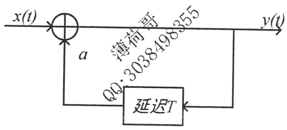

---

12. 下图 a 所示为一个用交替符号冲激 $c$ 来采样的信号系统, 输入信号的傅里叶变换 $F(jw)$

如图 b 所示:

对于 $T_{s} < \frac{\pi}{2w_{m}}$ ，(1)画出 $f_{p}(t)$ 和的 $y(t)$ 傅里叶变换；

(2) 确定一个能够从 $f_{p}(t)$ 恢复 $f(t)$ 的系统;

(3)确定一个能从 $ y(t) $ 恢复 $ f(t) $ 的系统;

(4) 确定 $f(t)$ 既能从 $f_{p}(t)$ 又能从 $y(t)$ 恢复的相对于 $w_{m}$ 最大的 $T$.

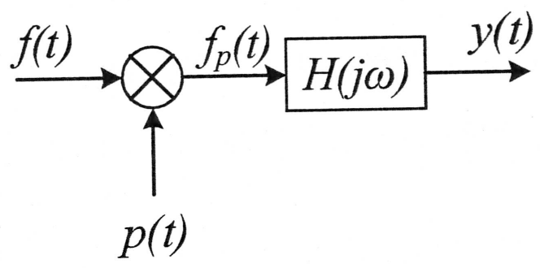

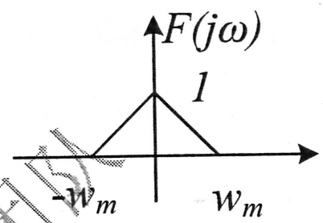

$$
x (t) = 2 e ^ {- t} u (t) H (j \omega) = \left\{ \begin{array}{l l} e ^ {- j \omega} & | \omega | <   \omega_ {c} \\ \theta & | \omega | > \omega_ {c} \end{array} T = \frac {4 \pi}{\omega_ {0}} \right. \quad (\quad a \quad)
$$

(b)

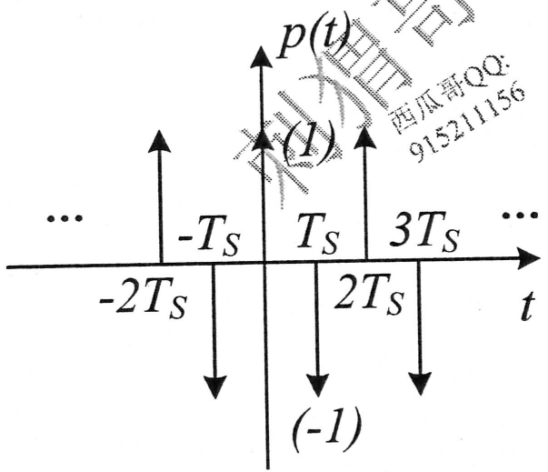

(c)

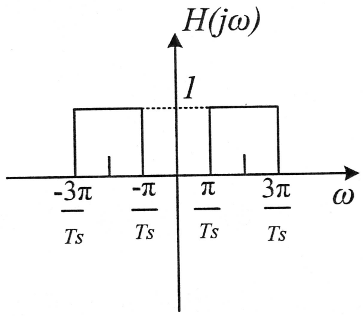

(d)

---

13. 已知一理想低通滤波器的频率响应为, 其中 $\omega_{c}$ 为截止频率。

(1) 将信号 $x_{p}(t) = x(t)p(t) = \cos (\omega_{0}t)\cdot \sum_{k = -\infty}^{+\infty}\delta (t - kT)$ 输入该滤波器, 其中,

求 $x_{p}(\mathfrak{t})$ 的频谱函数 $X_{p}(\mathrm{j}\omega)$; 若要求此时滤波器的输出仅包含三个频率分量, $\omega_{c}$ 应满足什么条件? 并求此时滤波器的输出 $y(\mathfrak{t})$ 。

(2) 当输入信号, 若要求输出信号的能量是输入信号能量的 $50 \%$, 试确定 $\omega_{c}$ 应具有的值。

14. 在保密通信中，可将语音信号在传输前进行倒频，接收端收到倒频信号后，再设法恢复原频谱。如下图所示的倒频系统，输入带限信号 $f(t)$ 的频谱如下图（a）所示，其最高频率为 $\omega_{m}$ 。图（b）中 HP 是截止频率为 $\omega_{b}$ （$\omega_{b} > \omega_{m}$）的理想低通滤波器，频率响应 $H_{1}(j\omega) = \begin{cases} 1, & |\omega| > \omega_{b} \\ 0, & |\omega| < \omega_{b} \end{cases}$，LP 是截止频率为 $\omega_{m}$ 的理想低通滤波器，频率响应 $H_{2}(j\omega) = \begin{cases} 1, & |\omega| < \omega_{m} \\ 0, & |\omega| > \omega_{m} \end{cases}$，试画出 $x_{1}(t)$、$x_{2}(t)$、$x_{3}(t)$、$y(t)$ 的频谱图。

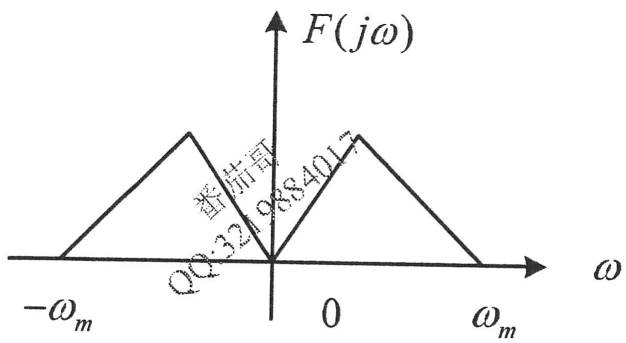

_(a)_

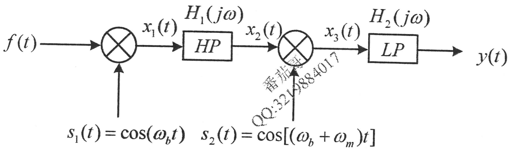

_(b)_

---

15. 已知输入为 $x(t)$, 输出为 $y(t)$; $H_{LPF}$ 为截至频率为 $\omega_0$, 幅度为 1 的低通滤波器; 整个系统如图所示。

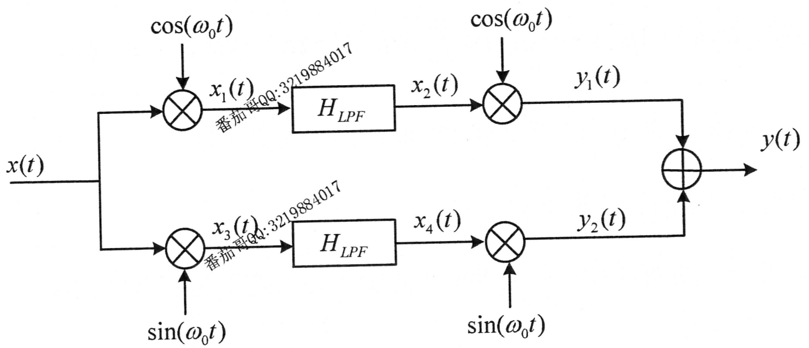

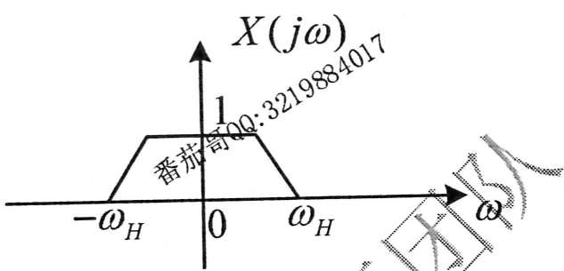

(1) 求整个系统的 $H(j \omega)$;

(2) 若 $x(t)$ 的频谱如图所示, 画出 $y(t)$ 的频谱。（其中 $\omega_{0} >> \omega_{H}$）

16. 考虑下图所示调制系统，其中 $H(j\omega) = \begin{cases} -j, & \omega > 0 \\ j, & \omega < 0 \end{cases}$，输入 $x(t)$ 的频谱如下右图所示，$\omega_{m} << \omega_{c}$。

(1) 请画出信号 $y_{1}(t), y_{2}(t), y(t)$ 的频谱;

(2) 请问如何从 $y(t)$ 中恢复出输入信号 $x(t)$?

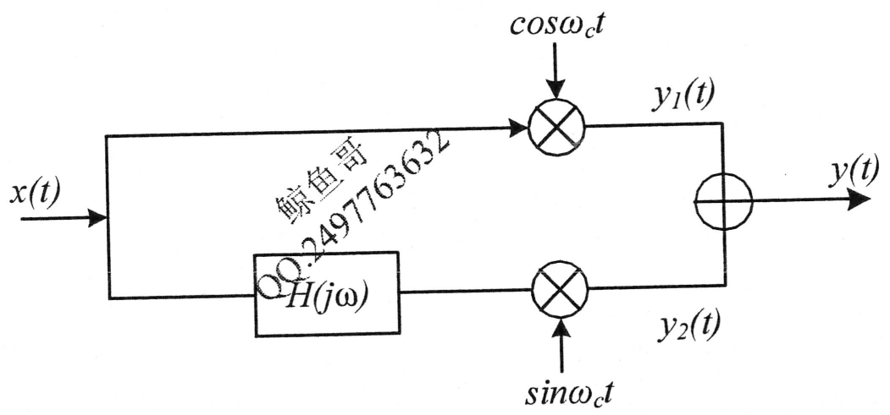

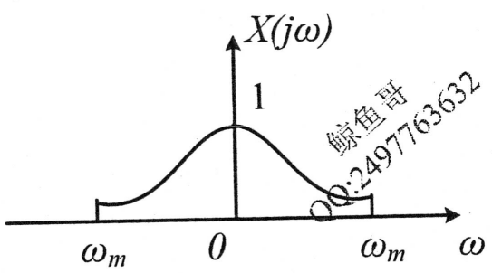

---

17. (西瓜哥 915211156) 如下图中, $\cos \left(\omega_{0} t\right)$ 是自激振荡器, 理想低通滤波器 $H_{1}(j \omega)$ 为 $H_{1}(j \omega) = [u(\omega + 2 \Omega) - u(\omega - 2 \Omega)] e^{-j \omega t_{0}}$ 且 $\omega_{0} >> \Omega$ 。

(1) 求整个系统的冲激响应 $h(t)$;

(2) 若输入 $e(t)$ 为 $\left(\frac{\sin (\Omega t)}{\Omega t}\right)^{2} \cos \omega_{0} t$, 求输出 $r(t)$ 。

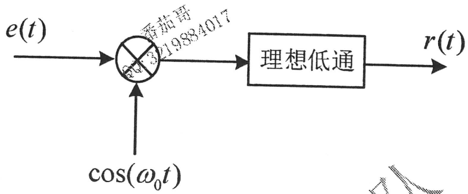

18. 下图所示为一个幅度调制的非线性系统, 该系统由以下 2 个部分组成, 先把调制信号与载波之和平方, 然后通过带通滤波器获得已调信号, 若 $g(t)$ 是带限信号, 若 $g(t)$ 是带限信号, 即 $\left|\omega\right|>\omega_{m}$ 时, $G(\omega)=0$。（刺猬哥考研团队，西瓜哥QQ:915211156）

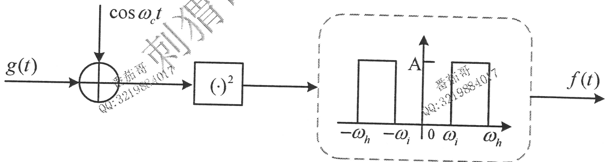

(1) 确定带通滤波器参量 $\mathrm{A} 、 \omega_{i} 、 \omega_{h}$ 的约束, 使得 $f(t) = g(t) \cos \omega_{c} t$;

(2) 求对 $\omega_{c} 、 \omega_{m}$ 的约束。（刺猬哥考研团队，西瓜哥 QQ:915211156）

19. 正交幅度调制（QAM）可以在一个公共信道中同时传送两个信号，有效地提高信道的带宽。QAM 系统的基本原理如图所示，假设输入信号 $f_{1}(t)$ 和 $f_{2}(t)$ 的带宽为 $\omega_{0}$ 且满足 $\omega_{0} << \omega_{c}, \omega_{c}$ 为载波频率。低通滤波器 LPF 的截至频率为 $3\omega_{0}$，幅度为 1。求：

---

(1) 假设 $f_{1}(t)$ 和 $f_{2}(t)$ 的频谱分别为 $F_{1}(j \omega)$ 和 $F_{2}(j \omega)$, 写出 $g_{1}(t)$ 和 $g_{2}(t)$ 的频域表达式;

(2) 计算输出信号 $e_{1}(t)$ 和 $e_{2}(t)$ 。

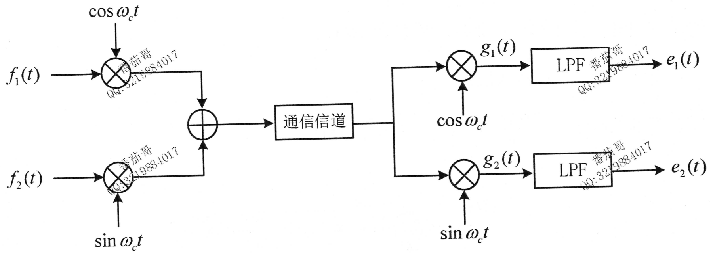

20. 下图 (a) 为抑制载波振幅调制的接收系统, 其中 $e(t) = \frac{\sin t}{\pi t}, -\infty < t < +\infty$,

$ s(t) = \cos(1000t), -\infty < t < +\infty $；低通滤波器的传输函数如图（b）所示，$\varphi(\omega) = 0$。

(1) 画出 A、B、C 点的频谱图；

(2) 求输出信号 $r(t)$ 。

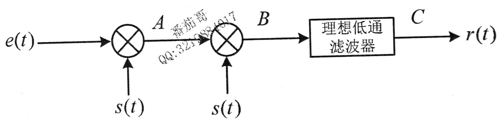

_图 $(a)$_

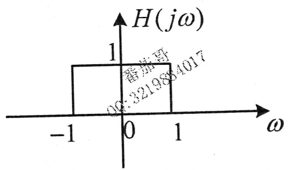

_图 $(b)$_

---

21 已知某系统如图 (a) 所示, 其中 A 为不等于 0 的常数, $A + x(t) > 0$,

H(jω)=j,ω>0，x(t)的频谱X(jω）、H(jω）、H3(jω)如图（b）、（c）、（d）。

(西瓜哥 QQ:915211156)

求：

(1) $x_{2}(t)$ 的时域表达式;

(2) $x_{3}(t)$ 的时域表达式;

(3) $x_{4}(t)$ 的时域表达式;

(4) $x_{5}(t)$ 的时域表达式;

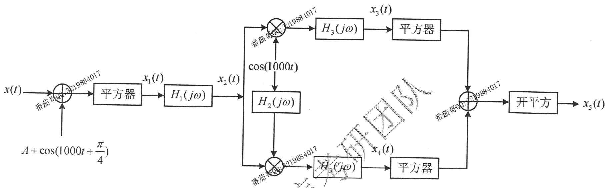

_(a)_

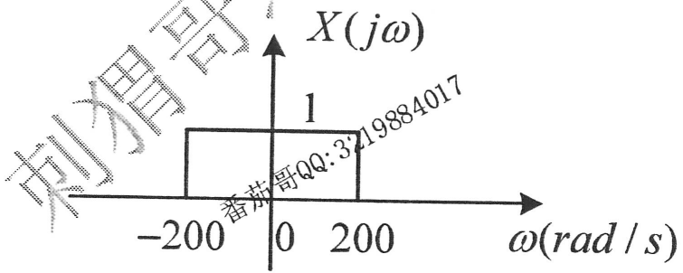

_(b)_

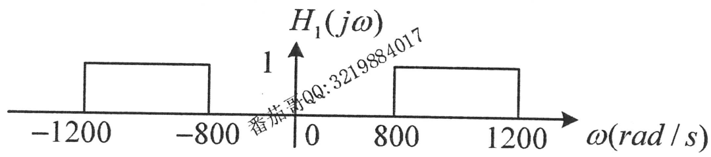

_(c)_

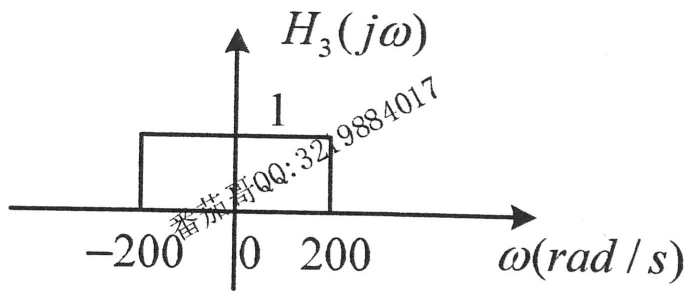

_(d)_

---

22. 已知一频分多路复用系统如图所示, 复用输出信号 $y(t)$ 。其中 $x_{1}(t) 、 x_{2}(t)$ 为要传送的基带信号, 频谱分别为 $X_{1}(j \omega) = 50 - |\omega|, |\omega| \leq 50; X_{2}(j \omega) = 100 - |\omega|, |\omega| \leq 100$ 。

解复用部分有 $\frac{2\pi}{T_1} = 200, \frac{2\pi}{T_2} = 400$ ， $H_{1}(j\omega) = \begin{cases} 1, & |\omega + 200| \leq 50 \\ 1, & |\omega - 200| \leq 50 \\ 0, & \text{else} \end{cases}$ （西瓜哥QQ:915211156）

$$
H _ {2} (j \omega) = \left\{ \begin{array}{l} 1, | \omega + 4 0 0 | \leq 1 0 0 \\ 1, | \omega - 4 0 0 | \leq 1 0 0 \\ 0, e l s e \end{array} \right.
$$

求：

(1) 图中 A 点处的频谱表达式 (或画出 A 点的频谱图);

(2) 图中 $g_{1}(t)$ 点处的频谱表达式 (或画出 $g_{1}(t)$ 点的频谱图);

(3) 图中 B 点处的频谱表达式 (或画出 B 点的频谱图);

(4) 请设计滤波器 $H_{3}(j \omega), H_{4}(j \omega)$, 使其输出分别为 $x_{1}(t), x_{2}(t)$ 。

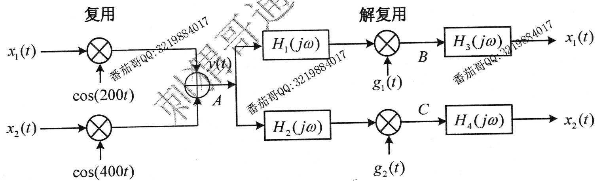

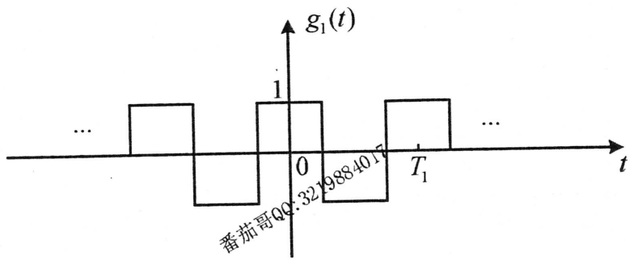

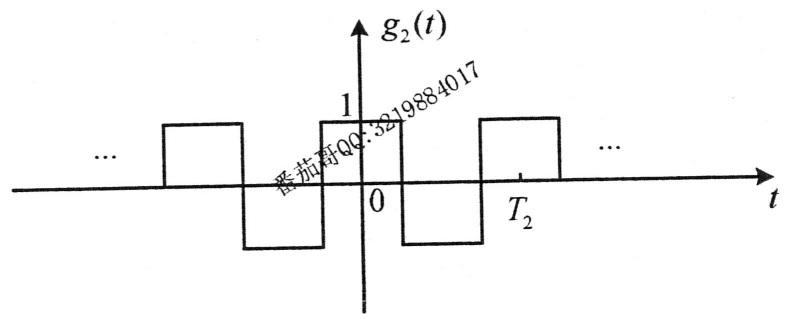

---

23. 当 $x(t)$ 为实信号时, 另一种带通采样的方法是先进行复指数调制再采样, 如下图所示; 若设 $x(t)$ 为实信号, 且 $X(j\omega)$ 只在 $10 \leq |\omega| \leq 20$ 为非零值, 有低通滤波器 $H_{1}(j\omega)$

$$
H _ {1} (j \omega) = \left\{ \begin{array}{l l} 1, | \omega | <   5 \\ 0, | \omega | > 0 \end{array} , \quad h (t) = e ^ {- j 1 5 t}, \quad p (t) = \sum_ {n = - \infty} ^ {+ \infty} \delta (t - n T); \right. \text {试 求 :}
$$

(1) $e_{1}(t)$ 的频谱表达式；（或画出其频谱图）

(2) $e_{2}(t)$ 的频谱表达式; (或画出其频谱图)

(3) $x_{p}(t)$ 的频谱表达式；（或画出其频谱图）

(4) 求出 $x_{p}(t)$ 可无失真恢复出 $e_{2}(t)$ 的 $\mathrm{T}$ 的最大值;

(5) 设计一个可恢复出 $x(t)$ 的系统。

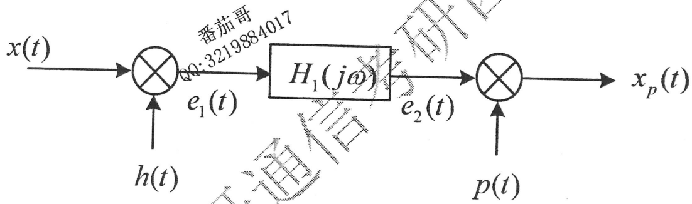

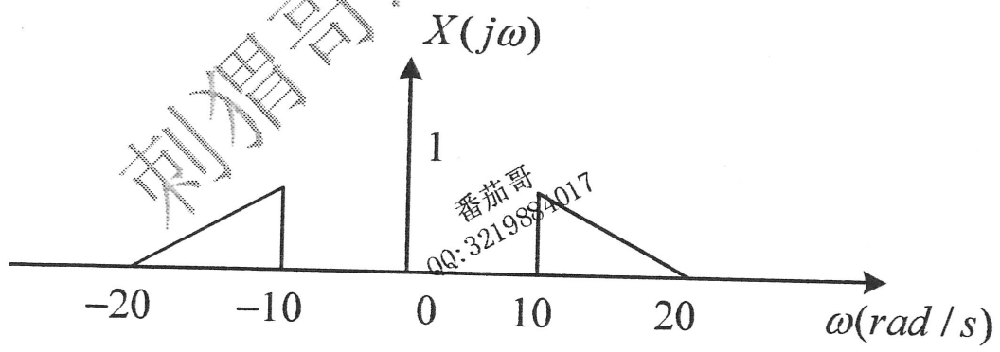

---

24.

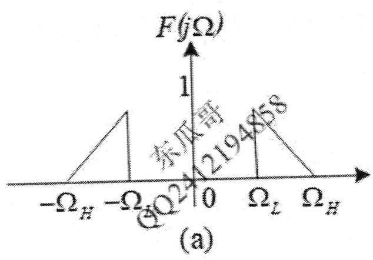

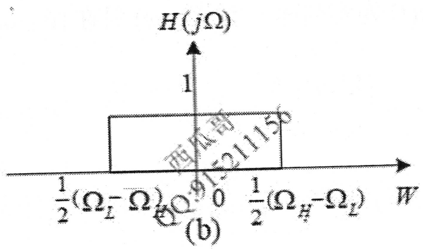

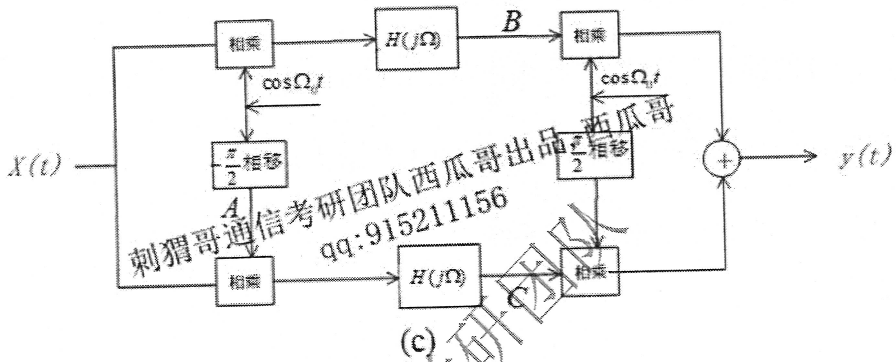

(1)求 $A$ 处的频谱函数；

(2) 画出 $B 、 C$ 处的频谱图;

(3)画出输出 $y(t)$ 的频谱图。

(刺猬哥考研团队, 西瓜哥 QQ:915211156)

---

# 序列 O 序列五详解—西瓜哥原创作答

题 1 解: B

$$
\sin 2 \pi t \xleftarrow {\mathcal {F}} j \pi [ \delta (\omega + 2 \pi) - \delta (\omega - 2 \pi) ]
$$

由该信号的傅里叶变化可知其信号频域宽度 $\omega_{b}$ 为 $2 \pi$

根据奈奎斯特采样定理知 $\omega_{s} \geq 2 \omega_{b} = 4 \pi$

则采样频率 $f = \frac{1}{T} = \frac{1}{\frac{2 \pi}{\omega_{S}}} = 2 \mathrm{~Hz}$

(注: 此题难度★☆☆☆☆, 西瓜哥原创小结: 本题难度不大, 主要考查傅里叶变换以及奈奎斯特采样定理, 此题注意, 我们所说的带宽通常指的是正半部分的频带宽度。)

题 2 解: C

无失真传输系统的幅频响应为一个与频域无关的常数，相频响应为频率的线性函数。

(注: 此题难度★☆☆☆☆, 西瓜哥原创小结: 基础题, 考察无失真传输定义, R 序列有总结。)

题 3 解: B (刺猬哥考研团队西瓜哥 QQ:915211156)

无失真传输系统的幅频响应为一个与频域无关的常数，相频响应为频率的线性函数。

(注: 此题难度★☆☆☆☆, 西瓜哥原创小结: 基础题, 考察无失真传输定义, R 序列有总结。)

题 4 解: C (刺猬哥考研团队西瓜哥 QQ:915211156)

全通网络在全频带内的幅值增益为1，不会引起通过信号的幅值变化，一般用于对输入信号的相位进行改变。

---

(注: 此题难度★★☆☆☆, 西瓜哥原创小结: 基础题。)

题5解：B

系统函数 $H(s) = \frac{s}{s + 3}$, 极点位于左半平面, $H(j\omega) = \frac{j\omega}{j\omega + 3}$, 在 $\omega$ 从 $0 \to \infty$ 的过程中, $H(j\omega)$ 单调递增, 且 $H(0) = 0, H(\infty) = 1$, 故该系统为高通滤波器。

(QQ915211156 西瓜哥 Tips: 此题难度★★☆☆☆, 也可利用画图法进行分析。)

(注: 此题难度★☆☆☆☆, 西瓜哥原创小结: )

题 6 解: A

无失真传输的条件: $H(j \omega) = K e^{-j \omega t_{0}}$, $h(t) = K \delta(t - t_{0})$

（QQ915211156 西瓜哥 Tips: 此题难度★★☆☆☆, 干扰项 C, 幅频响应为常数, 但相频不与 $\omega$ 成正比。直接套上述条件公式最为直接）

题 7 解: 1; 不是 (刺猬哥考研团队西瓜哥 QQ:915211156)

$$
| H (j \omega) | = \frac {\sqrt {9 + \omega^ {2}}}{\sqrt {9 + \omega^ {2}}} = 1, \quad \angle H (j \omega) = - \arctan \frac {\omega}{3} - \arctan \frac {\omega}{3} = - 2 \arctan \frac {\omega}{3}
$$

相频特性不满足线性，故系统不是无失真传输系统。

题 8 解: F

无失真传输指一个确定信号通过系统后, 其时域波形被改变, 仅幅度上产生变化,在时间上有所延迟: $y(t) = K x\left(t - t_{0}\right) \Rightarrow H(j \omega) = K e^{-j \omega t_{0}}$

$\varphi (\omega)$ 为 $\omega$ 的线性函数, 且必须过原点。(R 序列有总结)

很明显题中相频特性不满足条件。

(注: 此题难度★★☆☆☆, 西瓜哥原创小结: 基础题, 无失真定义以及等价条件务必熟记。) (刺猬哥考研团队西瓜哥 QQ:915211156)

---

题 9 解: $\frac{3}{2} f_{m}$

总结: 若 $f(t)$ 的最高频率为 $f$

1) $f(at)$ 的最高频率为 $af$

(2) $f^{n}\left(t\right)$ 最高频率为 $n f$

若 $f_{1}(t)$ 的最高频率为 $f_{1}, f_{2}(t)$ 的最高频率为 $f_{2}$, 那么:

(1) $f_{1}(t) + f_{2}(t)$ 的最高频率为 $f_{1}$ 和 $f_{2}$ 中较大的一个值；

(2) $f_{1}(t) \cdot f_{2}(t)$ 的最高频率为二者之和.

(3) $f_{1}(t)^{*} f_{2}(t)$ 的最高频率为二者中较小的那个

低通最小抽样频率 $= 2$ 倍最高频率

(注: 此题难度★★☆☆☆, 西瓜哥原创小结: 本题考察抽样频率相关内容, 具体总结可看上述解析中。)

题 10 解: (刺猬哥考研团队西瓜哥 QQ:915211156)

(1)

$$
\begin{array}{l} x (t) = A + B \cos \left(\frac {2 \pi t}{T}\right) \Leftrightarrow X (j w) = 2 \pi A \delta (w) + \pi B \left[ \delta \left(w + \frac {2 \pi}{T}\right) + \delta \left(w - \frac {2 \pi}{T}\right) \right] \\ p (t) = \sum_ {n = - \infty} ^ {\infty} \delta [ t - n (T + \Delta) ] \leftrightarrow P (w) = \frac {2 \pi}{T + \Delta} \sum_ {n = - \infty} ^ {\infty} \delta \left(w - n \frac {2 \pi}{T + \Delta}\right) \\ \end{array}
$$

由框图可知 $g(t) = x(t)p(t)$,

$$
\begin{array}{l} G (w) = \frac {1}{2 \pi} X (w) * P (w) \\ = \frac {1}{2 \pi} X (w) * \frac {2 \pi}{T + \Delta} \sum_ {n = - \infty} ^ {\infty} \delta \left(w - n \frac {2 \pi}{T + \Delta}\right) \\ = \frac {1}{T + \Delta} \sum_ {n = - \infty} ^ {\infty} X (w - n w _ {s}) \\ \end{array}
$$

---

24最强信号辅导班招生啦！让你节省时间，不走弯路，取得佳绩！联系西瓜哥qq915211156加Q群709502924，使用刺猬哥团队正版核心序列ORK，享受高质量全天候优质答疑指导

$$
= \frac {\pi}{T + \Delta} \sum_ {n = - \infty} ^ {\infty} \left[ 2 A \delta (w - n w _ {s}) + B \left[ \delta \left(w + \frac {2 \pi}{T} - n w _ {s}\right) + \delta \left(w - \frac {2 \pi}{T} - n w _ {s}\right) \right] \right]
$$

其中 $w_{s} = \frac{2 \pi}{T + \Delta}$

(2) 送入理想低通滤波器的信号有多个频率分量, 由输出 $y(t) = kx(at)$, 可知只允许基带信号通过。因此低通滤波器的频带必须有

$$
\frac {2 \pi}{T} - w _ {s} <   \frac {1}{2 (T + \Delta)} <   - \frac {2 \pi}{T} + 2 w _ {s},
$$

即 $\frac{2 \pi}{T} - \frac{2 \pi}{T + \Delta} < \frac{1}{2 (T + \Delta)} < -\frac{2 \pi}{T} + \frac{4 \pi}{T + \Delta}$, 化简后解得 $\Delta < \frac{T}{4 \pi}$

$G(w)$ 的图像如下图所示

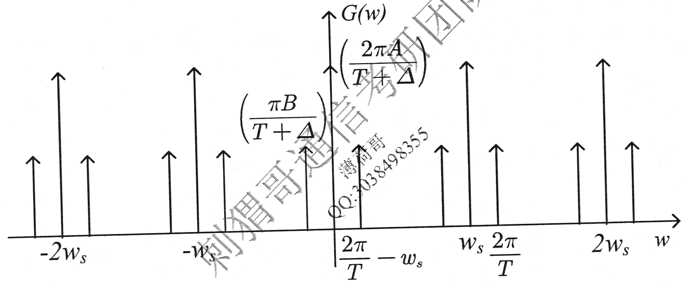

由 $y(t) = kx(at) = k\left[A + B\cos \left(\frac{2\pi}{T} at\right)\right]$ 可知

$$
\begin{array}{l} Y (j w) = \frac {2 \pi A}{T + \Delta} \delta (w) + \frac {\pi B}{T + \Delta} \left[ \delta \left(w + \frac {2 \pi}{T} - \frac {2 \pi}{T + \Delta}\right) + \delta \left(w - \frac {2 \pi}{T} + \frac {2 \pi}{T + \Delta}\right) \right] \\ = \frac {2 \pi A}{T + \Delta} \delta (w) + \frac {\pi B}{T + \Delta} \left[ \delta \left(w + \frac {2 \pi \Delta}{T (T + \Delta)}\right) + \delta \left(w - \frac {2 \pi \Delta}{T (T + \Delta)}\right) \right] \\ \end{array}
$$

逆变换可得，

$$
y (t) = \frac {A}{T + \Delta} + \frac {B}{T + \Delta} \cos \left[ \frac {2 \pi \Delta}{T (T + \Delta)} t \right] = \frac {1}{T + \Delta} \left[ A + B \cos \left(\frac {2 \pi}{T} \frac {\Delta}{T + \Delta} t\right) \right]
$$

更多优质考研资讯, 关注b站 | 公众号“刺猬哥通信电子考研”、知乎“刺猬哥通信考研”

---

$$
= k \left[ A + B \cos \left(\frac {2 \pi}{T} a t\right) \right]
$$

对比可得 $k = \frac{1}{T + \Delta}, a = \frac{\Delta}{T + \Delta}$

(此题难度★★★★☆, 西瓜哥原创小结: 考点: 调制解调, 周期冲激串的傅里叶变换, 做此类题目时, 应掌握频域画法, 通过频域图进行求解易于理解。)

题 11 解: (刺猬哥考研团队西瓜哥 QQ:915211156)

(1) 根据题意知 $h(t) = \delta(t) + \frac{1}{3} \delta(t - T) \leftrightarrow H(w) = 1 + \frac{1}{3} e^{-j w T}$.

由题目知 $y(t) * g(t) = x(t) \leftrightarrow Y(w)G(w) = X(w)$

得 $G(w) = \frac{X(w)}{Y(w)} = \frac{1}{H(w)} = \frac{1}{1 + \frac{1}{3}e^{-jwT}} = \sum_{n=0}^{\infty}\left(-\frac{1}{3}e^{-jwT}\right)^n$

所以 $g(t) = \sum_{n=0}^{\infty}\left(-\frac{1}{3}\right)^{n}\delta(t - nT)$ （刺猬哥考研团队西瓜哥QQ:915211156）

(2) 由框图可知: $x(t) + ay(t - T) = y(t)$ 得 $X(w) = Y(w)[1 - ae^{-jwT}]$.

系统函数 $H(w) = \frac{Y(w)}{X(w)} = \frac{1}{1 - ae^{-jwT}}$ ， $h(t) = \sum_{n = 0}^{\infty}a^{n}\delta (t - nT)$

令 $1 - ae^{-jwT} = 0 \rightarrow e^{\ln a}e^{-sT} = e^{-j2k\pi} \rightarrow s = \frac{j2k\pi + \ln a}{T} \rightarrow \sigma = \frac{\ln a}{T}$

系统稳定时, 极点位于 $s$ 域的左半平面, $\sigma = \frac{\ln a}{T} < 0, 0 < a < 1$

(此题难度★★★☆☆, 西瓜哥原创小结: 考察实际应用题, 要从中能看出考察系统间的关系, 以及读出重点部分)

题 12 解: (刺猬哥考研团队西瓜哥 QQ:915211156)

(1) $p(t) = \sum_{k = -\infty}^{\infty} \delta (t - k2T_s) - \sum_{k = -\infty}^{\infty} \delta (t - k2T_s - T_s)$

---

设 $p_1(t) = \sum_{k = -\infty}^{\infty}\delta (t - k2T_s), p_2(t) = \sum_{k = -\infty}^{\infty}\delta (t - k2T_s - T_s)$

则 $P_{1}(j\omega) = \frac{\pi}{T_{s}}\sum_{k = -\infty}^{\infty}\delta (\omega -k\frac{\pi}{T_{s}})$

$$
P _ {2} (j \omega) = P _ {1} (j \omega) e ^ {- j \omega T _ {s}} = \frac {\pi}{T _ {s}} \sum_ {k = - \infty} ^ {\infty} \delta (\omega - k \frac {\pi}{T _ {s}}) e ^ {- j \omega T _ {s}} = \frac {\pi}{T _ {s}} \sum_ {k = - \infty} ^ {\infty} \delta (\omega - k \frac {\pi}{T _ {s}}) e ^ {- j k \pi} = \frac {\pi}{T _ {s}} \sum_ {k = - \infty} ^ {\infty} (- 1) ^ {k} \delta (\omega - k \frac {\pi}{T _ {s}})
$$

则 $P(j\omega) = \frac{2\pi}{T_s}\sum_{\substack{k = -\infty \\ k\text{为奇数}}}\delta (\omega -k\frac{\pi}{T_s})$ ，则 $F_{p}(j\omega) = \frac{1}{T_{s}}\sum_{\substack{k = -\infty \\ k\text{为奇数}}}^{\infty}X(j(\omega -k\frac{\pi}{T_{s}}))$

要满足不重叠, 应满足 $2 \omega_{m}<\frac{2 \pi}{T_{s}}, T_{s}<\frac{\pi}{\omega_{m}}$, 题目满足条件

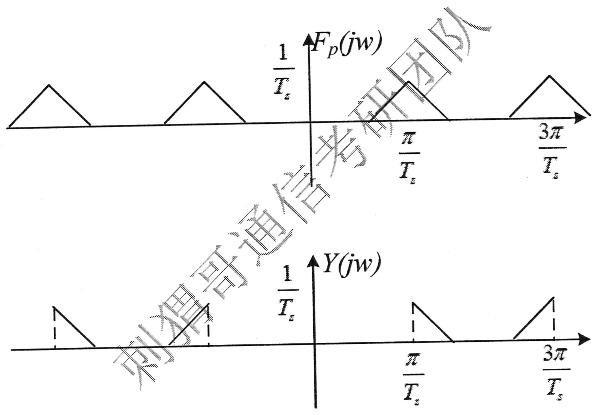

(2): 要从 $f_{p}(t)$ 中恢复 $f(t)$, 先移位再过低通滤波器即可。

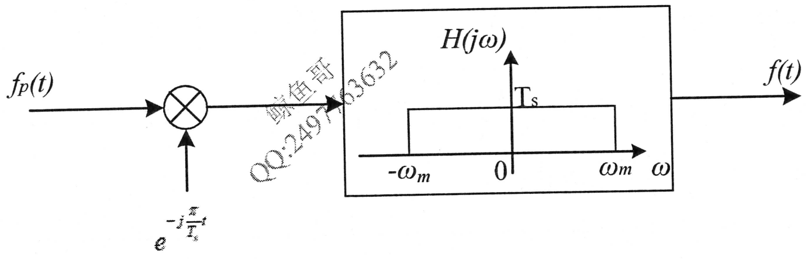

(3): 要从 $y(t)$ 中恢复 $f(t)$:

---

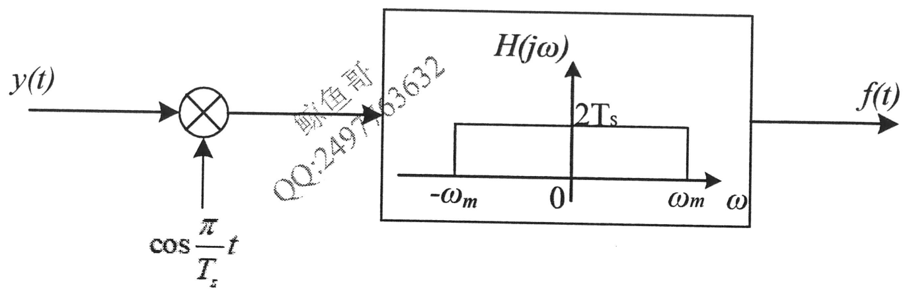

(4) 由题目可知要满足不重叠, 应满足 $2 \omega_{m}<\frac{2 \pi}{T_{s}}, T_{s}<\frac{\pi}{\omega_{m}}$

(注: 此题难度★★★☆☆, 西瓜哥原创小结: 本题的关键在于分解正负交替的 $p(t)$,准确求得其傅里叶变换, 也可以直接求 $p(t)$ 的傅里叶级数, 再求其傅里叶变换。这道题目第一问很经典, 在各个学校的考研题中都经常出现, 属于必须掌握的内容,课程课对此部分也有对应的总结。)

题13解：

1) $X_{p}(\mathrm{j}\omega) = \frac{1}{2\pi}\{\pi [\delta (\omega +\omega_{0}) + \delta (\omega -\omega_{0})]\} *\frac{2\pi}{T}\sum_{k = -\infty}^{\infty}\delta (\omega -k\frac{2\pi}{T})$

$$
= \frac {\omega_ {0}}{4} \sum_ {k = - \infty} ^ {\infty} [ \delta (\omega + \omega_ {0} - \frac {k}{2} \omega_ {0}) + \delta (\omega - \omega_ {0} - \frac {k}{2} \omega_ {0}) ] = \frac {\omega_ {0}}{2} \sum_ {k = - \infty} ^ {+ \infty} \delta (\omega - \frac {k}{2} \omega_ {0})
$$

H(jω)通带|ω|<ωc,故Xp(jω)只在ω=2ω0,k=0,±1,±2……处有非零值，或只包含三个频率分量，这三个分量分别位于-ω0/2,0,ω0/2处，

故截止频率满足: $\frac{\omega_{0}}{2}< \omega_{c}< \omega_{0}$

此时 $Y(\mathrm{j}\omega) = \frac{\omega_0}{2} [\delta (\omega +\frac{\omega_0}{2}) + \delta (\omega) + \delta (\omega -\frac{\omega_0}{2})]\mathrm{e}^{-\mathrm{j}\omega}$

逆变换得: $y(t) = \frac{\omega_0}{4\pi} [2 \cos \frac{\omega_0 (t - 1)}{2} + 1]$

(2) 输入能量 $E_{i} = \lim_{T \to \infty} \int_{-T}^{T} \left| 2e^{-t} u(t) \right|^{2} dt = \lim_{T \to \infty} \int_{0}^{T} 4e^{-2t} dt = \lim_{T \to \infty} (-2e^{-2t})_{0}^{T} = 2$, 故输出信号的

---

能量为 1

$$
\begin{array}{l} \because X (\mathrm {j} \omega) = \frac {2}{1 + j \omega}, \mathrm {Y} (\mathrm {j} \omega) = \mathrm {X} (\mathrm {j} \omega) \mathrm {H} (\mathrm {j} \omega) = \frac {2 e ^ {- j \omega}}{1 + j \omega}, | \omega | <   \omega_ {c} \\ \therefore E _ {o} = \frac {1}{2 \pi} \int_ {- \omega_ {c}} ^ {\omega_ {c}} \left| \frac {2 e ^ {- j \omega}}{1 + j \omega} \right| ^ {2} d \omega = \frac {1}{2 \pi} \int_ {- \omega_ {c}} ^ {\omega_ {c}} \frac {4 \left| e ^ {- j \omega} \right| ^ {2}}{1 + \omega^ {2}} d \omega = \frac {2}{\pi} \arctan \omega \Bigg | _ {- \omega_ {c}} ^ {\omega_ {c}} = \frac {4}{\pi} \arctan \omega_ {c} (\left| e ^ {- j \omega} \right| \text {即}) \\ \end{array}
$$

单位复指数的模，为1。也可利用欧拉公式：

$$
\left| e ^ {- j \omega} \right| = \left| \cos \omega + j \sin \omega \right| = \sqrt {(\cos \omega + j \sin \omega) (\cos \omega - j \sin \omega)} = 1)
$$

由 $\frac{4}{\pi} \arctan \omega_{c} = 1 \Rightarrow \arctan \omega_{c} = \frac{\pi}{4} \Rightarrow \omega_{c} = 1$

（QQ915211156 西瓜哥 Tips: 此题难度★★★★☆, 综合类题目, 需掌握并运用调制相关的傅里叶变换、滤波及能量计算公式。）

题 14 解:

由题意:

$$
\begin{array}{l} x _ {1} (t) = f (t) s _ {1} (t) = f (t) \cos \left(w _ {b} t\right) \leftrightarrow X _ {1} (j w) = \frac {1}{2 \pi} F (j w) * \pi \left[ \delta \left(w + w _ {b}\right) + \delta \left(w - w _ {b}\right) \right] \\ = \frac {1}{2} \left\{F [ j (w + w _ {b}) ] + F [ j (w - w _ {b}) ] \right\} \\ \end{array}
$$

可画 $x_{1}(t)$ 的频谱图

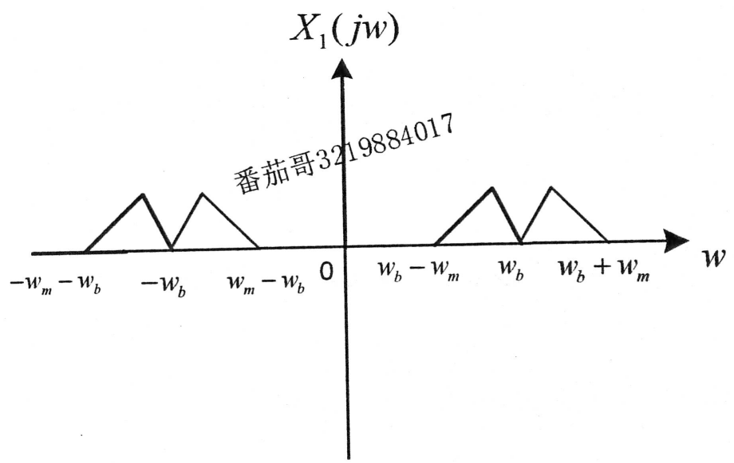

$X_{2}(jw) = X_{1}(jw)H_{1}(jw)$ 可画 $x_{2}(t)$ 的频谱图

更多优质考研资讯, 关注b站 | 公众号“刺猬哥通信电子考研”、知乎“刺猬哥通信考研”

---

24最强信号辅导班招生啦！让你节省时间，不走弯路，取得佳绩！联系西瓜哥qq915211156加Q群709502924，使用刺猬哥团队正版核心序列ORK，享受高质量全天候优质答疑指导

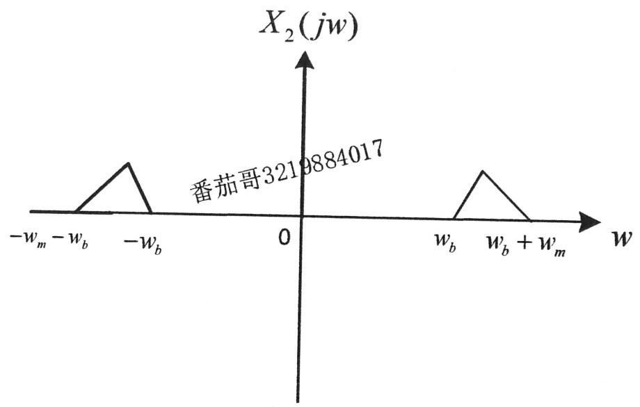

$$
\begin{array}{l} x _ {3} (t) = x _ {2} (t) s _ {2} (t) = x _ {2} (t) \cos [ (w _ {b} + w _ {m}) t ] \leftrightarrow X _ {3} (j w) = \frac {1}{2 \pi} X _ {2} (j w) * \pi \left[ \delta \left(w + w _ {b} + w _ {m}\right) + \delta \left(w - w _ {b} - w _ {m}\right) \right] \\ = \frac {1}{2} \left\{X _ {2} \left[ j \left(w + w _ {b} + w _ {m}\right) \right] + X _ {2} \left[ j \left(w - w _ {b} - w _ {m}\right) \right] \right\} \\ \end{array}
$$

可画 $x_{3}(t)$ 的频谱图

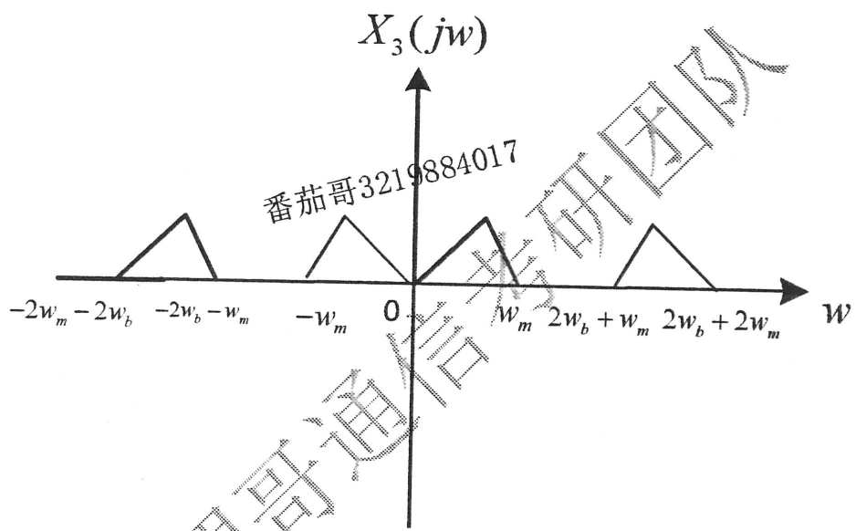

$Y(jw) = X_{2}(jw)H_{2}(jw)$ 可画 $y(t)$ 的频谱图

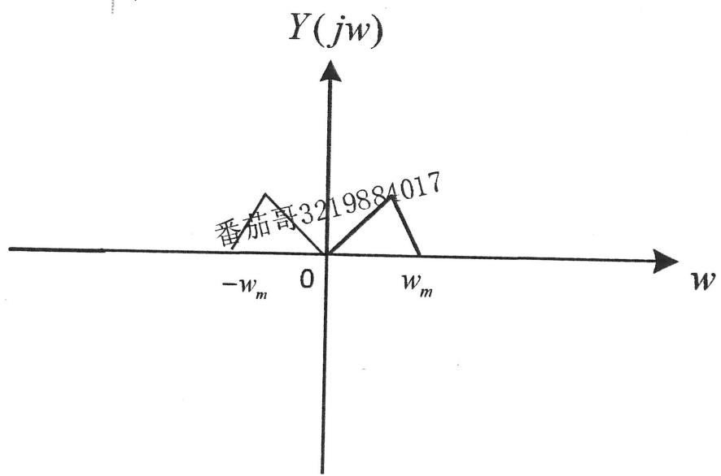

(注: 此题难度★★★☆☆, 西瓜哥原创小结: 正余弦信号的傅里叶变换务必熟记。)

题 15 解: (刺猬哥考研团队西瓜哥 QQ:915211156)

(1) 根据框图的上支路可得:

更多优质考研资讯，关注b站 | 公众号“刺猬哥通信电子考研”、知乎“刺猬哥通信考研”

---

$$
\begin{array}{l} X _ {1} (j \omega) = \frac {1}{2} X [ j (\omega - \omega_ {0}) ] + \frac {1}{2} X [ j (\omega + \omega_ {0}) ] \\ X _ {2} (j \omega) = \left\{\frac {1}{2} X [ j (\omega - \omega_ {0}) ] + \frac {1}{2} X [ j (\omega + \omega_ {0}) ] \right\} G _ {2 \omega_ {0}} (\omega) \\ Y _ {1} (j \omega) = \frac {1}{4} X [ j (\omega - 2 \omega_ {0}) G _ {2 \omega_ {0}} (\omega - \omega_ {0}) + \frac {1}{4} X (j \omega) G _ {2 \omega_ {0}} (\omega - \omega_ {0}) \\ + \frac {1}{4} X (j \omega) G _ {2 \omega_ {0}} (\omega + \omega_ {0}) + \frac {1}{4} X [ j (\omega + 2 \omega_ {0}) G _ {2 \omega_ {0}} (\omega + \omega_ {0}) \\ \end{array}
$$

根据框图的下支路可得:

$$
\begin{array}{l} X _ {3} (j \omega) = \frac {j}{2} X [ j (\omega + \omega_ {0}) ] - \frac {j}{2} X [ j (\omega - \omega_ {0}) ] \\ X _ {4} (j \omega) = \left\{\frac {j}{2} X [ j (\omega + \omega_ {0}) ] - \frac {j}{2} X [ j (\omega - \omega_ {0}) ] \right\} G _ {2 \omega_ {0}} (\omega) \\ Y _ {2} (j \omega) = - \frac {1}{4} X [ j (\omega + 2 \omega_ {0}) G _ {2 \omega_ {0}} (\omega + \omega_ {0}) + \frac {1}{4} X (j \omega) G _ {2 \omega_ {0}} (\omega - \omega_ {0}) \\ + \frac {1}{4} X (j \omega) G _ {2 \omega_ {0}} (\omega + \omega_ {0}) - \frac {1}{4} X [ j (\omega - 2 \omega_ {0}) G _ {2 \omega_ {0}} (\omega - \omega_ {0}) \\ \end{array}
$$

又由 $Y(j\omega) = Y_{1}(j\omega) + Y_{2}(j\omega) = \frac{1}{2} X(j\omega)G_{4\omega_{0}}(\omega)$

故 $H(j \omega) = \frac{Y(j \omega)}{X(j \omega)} = \frac{1}{2} G_{4 \omega_0}(\omega)$

(2) 由第一问可得 $y(t)$ 的频谱:

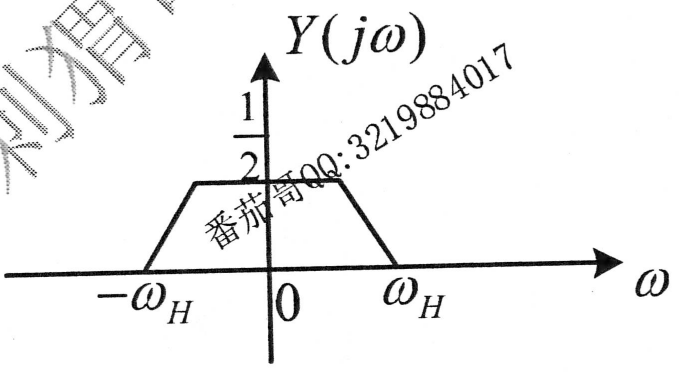

(西瓜哥 Tips: 此题难度★★★☆☆, 本题考查调制解调系统, 按框图列写式子即可, 中间涉及的运算, 需耐心仔细。)

题 16 解: (刺猬哥考研团队西瓜哥 QQ:915211156)

(1) $Y_{1}(j \omega) = \frac{1}{2} [X(j(\omega + \omega_{c})) + X(j(\omega - \omega_{c}))]$, 频谱如下图(a)所示

设 $x(t)$ 经 $H(j \omega)$ 后的频谱为 $X_{1}(j \omega)$

更多优质考研资讯，关注b站 | 公众号“刺猬哥通信电子考研”、知乎“刺猬哥通信考研”

---

24最强信号辅导班招生啦！让你节省时间，不走弯路，取得佳绩！联系西瓜哥qq915211156加Q群709502924，使用刺猬哥团队正版核心序列ORK，享受高质量全天候优质答疑指导

则 $X_{1}(j \omega) = -j X(j \omega) u(\omega) + j X(j \omega) u(-\omega)$, 则有

$$
\begin{array}{l} Y _ {2} (j \omega) = \frac {j}{2} [ X _ {1} (j (\omega + \omega_ {c})) - X _ {1} (j (\omega - \omega_ {c})) ] \\ = \frac {1}{2} \left\{\left[ X \left(j \left(\omega + \omega_ {c}\right)\right) u \left(\omega + \omega_ {c}\right) - X \left(j \left(\omega + \omega_ {c}\right)\right) u \left(- \omega - \omega_ {c}\right) \right] \right. \\ - [ X (j (\omega - \omega_ {c})) u (\omega - \omega_ {c}) - X (j (\omega - \omega_ {c})) u (- \omega + \omega_ {c}) ] \\ \end{array}
$$

频谱如下图(b)所示

$y(t)$ 频谱 $Y_{3}(j \omega)$ 如下图(c)所示

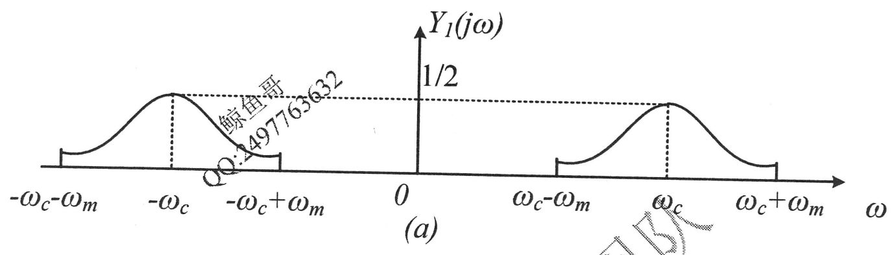

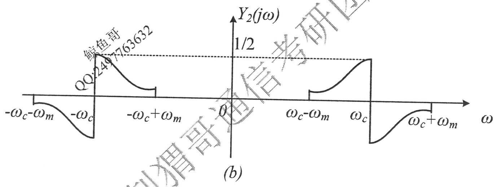

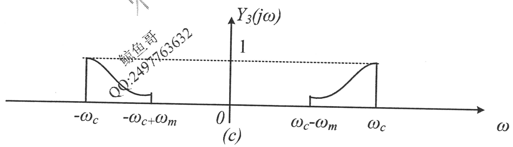

(2) 只需将 $y(t)$ 频谱经余弦调制后经过低通滤波即可恢复出输入信号 $x(t)$

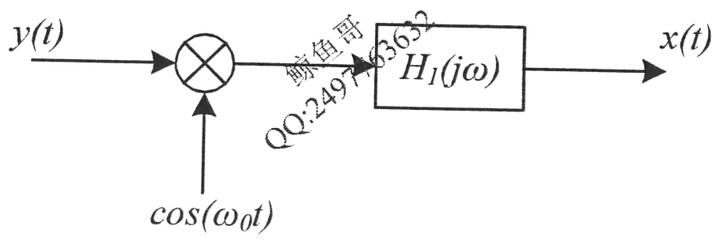

---

其中， $H_{1}(j\omega) = \left\{ \begin{array}{ll}2,\omega_{m} <   |\omega | <   2\omega_{0} - \omega_{m}\\ 0,\\ 0, \end{array} \right.$ 其他

(西瓜哥 Tips: 此题难度★★★☆☆, SSB 单边带调制应用题)

题 17 解:

由题意: 理想低通滤波器的单位冲激响应为

$$
H _ {1} (j \omega) \xleftarrow {F} h _ {1} (t) = \frac {2 \Omega}{\pi} S a 2 \Omega \left(t - t _ {0}\right)
$$

(1) $h(t) = [\delta(t)\cos(\omega_0t)] * h_1(t) = h_1(t) = \frac{2\Omega}{\pi} Sa2\Omega(t - t_0)$

(当输入为冲激函数时, 系统的输出即为冲激响应 $h(t)$ )

(2) 由题意可知: (刺猬哥考研团队西瓜哥 QQ:915211156)

设乘法器的输出为 $y(t) = e(t)\cos \omega_0 t = \left(\frac{\sin(\Omega t)}{\Omega t}\right)^2 \cos^2 (\omega_0 t) = \left(\frac{\sin(\Omega t)}{\Omega t}\right)^2 \frac{1 + \cos 2\omega_0 t}{2}$.

其中 $\frac{1}{2} \left( \frac{\sin (\Omega t)}{\Omega t} \right)^2$ 为低频分量, $\frac{\cos 2 \omega_0 t}{2} \left( \frac{\sin (\Omega t)}{\Omega t} \right)^2$ 为高频分量

$y(t)$ 经过低通滤波器后, 可得: $r(t) = \frac{1}{2} \left[\frac{\sin \Omega\left(t - t_{0}\right)}{\Omega\left(t - t_{0}\right)}\right]^{2}$

(西瓜哥 Tips: 此题难度★★★☆☆, 此题注意 $\omega_{0} >> \Omega$, 载波信号的频率往往远大于调制信号的频率, 经过调制后, 原信号频谱会被搬移到高频。)

题 18 解:

(1) 设经过平方出来的信号为 $f_{1}(t)$, 则有:

$$
f _ {1} (t) = [ g (t) + \cos \omega_ {c} t ] ^ {2} = g ^ {2} (t) + 2 g (t) \cos \omega_ {c} t + \cos^ {2} \omega_ {c} t
$$

对其进行傅里叶变换，可得：

$$
F _ {1} (\omega) = \frac {1}{2 \pi} G (\omega) ^ {*} G (\omega) + G \left(\omega + \omega_ {c}\right) + G \left(\omega - \omega_ {c}\right) + \frac {\pi}{2} \left[ \delta \left(\omega + 2 \omega_ {c}\right) + 2 \delta (\omega) + \delta \left(\omega - 2 \omega_ {c}\right) \right]
$$

由于 $g(t)$ 是频谱受限为 $\omega_{m}$ 的信号，假设为如下形式：

---

24最强信号辅导班招生啦！让你节省时间，不走弯路，取得佳绩！联系西瓜哥qq915211156 加Q群709502924，使用刺猬哥团队正版核心序列ORK，享受高质量全天候优质答疑指导

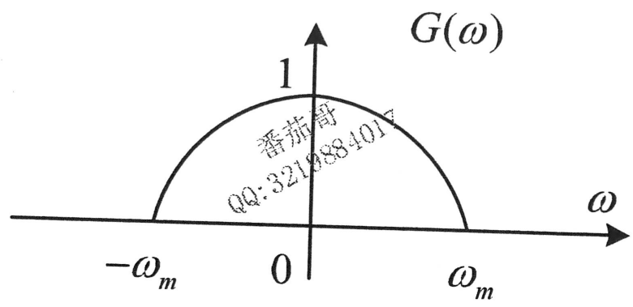

则 $f_{1}(t)$ 的频谱图为:

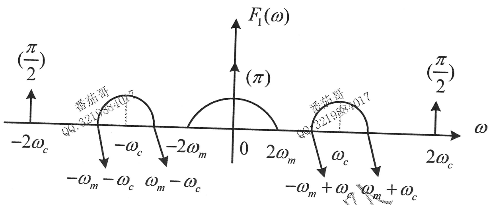

想要得到 $g(t) \cos \omega_{c} t$, 只需要保留 $G\left(\omega + \omega_{c}\right) + G\left(\omega - \omega_{c}\right)$ 部分, 即

$$
\left\{ \begin{array}{l} 2 \omega_ {m} <   \omega_ {i} <   \omega_ {c} - \omega_ {m} \\ \omega_ {c} + \omega_ {m} <   \omega_ {h} <   2 \omega_ {c} \end{array} \right.
$$

并且 $f(t) = 2 A g(t) \cos \omega_{c} t$, 所以有 $A = \frac{1}{2}$ 。

(2) 要使 $g(t) \cos \omega_{c} t$ 的频谱不发生混叠, 要求 $\left\{ \begin{array}{l} 2 \omega_{m} < \omega_{c} - \omega_{m} \\ \omega_{c} + \omega_{m} < 2 \omega_{c} \end{array} \right. \Rightarrow \omega_{c} > 3 \omega_{m}$

(注: 此题难度★★☆☆☆, 西瓜哥原创小结: 常规题, 考察信号的调制。)

题 19 解: (刺猬哥考研团队西瓜哥 QQ:915211156)

(1) 由题意:

$$
g _ {1} (t) = \left[ f _ {1} (t) \cos \omega_ {c} t + f _ {2} (t) \sin \omega_ {c} t \right] \cos \omega_ {c} t, \quad g _ {2} (t) = \left[ f _ {1} (t) \cos \omega_ {c} t + f _ {2} (t) \sin \omega_ {c} t \right] \sin \omega_ {c} t
$$

$$
\cos \omega_ {c} t \xleftarrow {F} \pi \left[ \delta \left(\omega + \omega_ {c}\right) + \delta \left(\omega - \omega_ {c}\right) \right], \quad \sin \omega_ {c} t \xleftarrow {F} j \pi \left[ \delta \left(\omega + \omega_ {c}\right) - \delta \left(\omega - \omega_ {c}\right) \right]
$$

$$
f _ {1} (t) \cos \omega_ {c} t \xleftarrow {F} \frac {1}{2 \pi} F _ {1} (j \omega) * \pi [ \delta (\omega + \omega_ {c}) + \delta (\omega - \omega_ {c}) ] = \frac {1}{2} \left\{F _ {1} [ j (\omega + \omega_ {c}) ] + F _ {1} [ j (\omega - \omega_ {c}) ] \right\}
$$

$f_{2}(t)\sin \omega_{c}t\longleftrightarrow \frac{1}{2\pi} F_{2}(j\omega)*j\pi [\delta (\omega +\omega_{c}) - \delta (\omega -\omega_{c})] = \frac{j}{2}\{F_{2}[j(\omega +\omega_{c})] - F_{2}[j(\omega -\omega_{c})]\}$

设 $Z(j\omega) = \frac{1}{2}\{F_1[j(\omega + \omega_c)] + F_1[j(\omega - \omega_c)]\} + \frac{j}{2}\{F_2[j(\omega + \omega_c)] - F_2[j(\omega - \omega_c)]\}$.

---

24最强信号辅导班招生啦！让你节省时间，不走弯路，取得佳绩！联系西瓜哥qq915211156 加Q群709502924，使用刺猬哥团队正版核心序列ORK，享受高质量全天候优质答疑指导

$$
\begin{array}{l} G _ {1} (j \omega) = \frac {1}{2 \pi} Z (j \omega) * \pi [ \delta (\omega + \omega_ {c}) + \delta (\omega - \omega_ {c}) ] = \frac {1}{2} \{Z [ j (\omega + \omega_ {c}) ] + Z [ j (\omega - \omega_ {c}) ] \} \\ = \frac {1}{4} \left\{F _ {1} \left[ j \left(\omega + 2 \omega_ {c}\right) \right] + 2 F _ {1} (j \omega) + j F _ {2} \left[ j \left(\omega + 2 \omega_ {c}\right) \right] + F _ {1} \left[ j \left(\omega - 2 \omega_ {c}\right) \right] - j F _ {2} \left[ j \left(\omega - 2 \omega_ {c}\right) \right] \right\} \\ G _ {2} (j \omega) = \frac {1}{2 \pi} Z (j \omega) * j \pi [ \delta (\omega + \omega_ {c}) - \delta (\omega - \omega_ {c}) ] = \frac {j}{2} \{Z [ j (\omega + \omega_ {c}) ] - Z [ j (\omega - \omega_ {c}) ] \} \\ = \frac {j}{4} \left\{F _ {1} [ j (\omega + 2 \omega_ {c}) ] - 2 j F _ {2} (j \omega) + j F _ {2} [ j (\omega + 2 \omega_ {c}) ] - F _ {1} [ j (\omega - 2 \omega_ {c}) ] + j F _ {2} [ j (\omega - 2 \omega_ {c}) ] \right\} \\ \end{array}
$$

(2) $E_{1}(j\omega) = \frac{1}{2} F_{1}(j\omega)\xleftarrow{F}e_{1}(t) = \frac{1}{2} f_{1}(t)$

$$
E _ {2} (j \omega) = \frac {1}{2} F _ {2} (j \omega) \xleftarrow {F} e _ {2} (t) = \frac {1}{2} f _ {2} (t)
$$

(注: 此题难度★★☆☆☆, 西瓜哥原创小结: 常规题, 考察通信系统的调制解调;需熟记常见载波信号、调制信号的傅里叶变换, 本题计算量偏大, 需耐心计算。另外此题也可在时域中求解。)

题 20 解: (刺猬哥考研团队西瓜哥 QQ:915211156)

(1) 已知 $e(t) = \frac{\sin t}{\pi t} \xleftarrow{F} E(j\omega) = G_{2}(\omega)$,

$$
\begin{array}{l} s (t) \xleftarrow {F} S (j \omega) = \pi [ \delta (\omega - 1 0 0 0) + \delta (\omega + 1 0 0 0) ] \\ f _ {A} (t) = e (t) s (t) \xleftarrow {F} F _ {A} (j \omega) = \frac {1}{2 \pi} E (j \omega) * S (j \omega) = \frac {1}{2} G _ {2} (\omega - 1 0 0 0) + \frac {1}{2} G _ {2} (\omega + 1 0 0 0) \\ f _ {B} (t) = f _ {A} (t) s (t) \xleftarrow {F} F _ {B} (j \omega) = \frac {1}{2 \pi} F _ {A} (j \omega) * S (j \omega) \\ = \frac {1}{4} \left[ G _ {2} (\omega - 2 0 0 0) + 2 G _ {2} (\omega) + G _ {2} (\omega + 2 0 0 0) \right] \\ F _ {C} (j \omega) = F _ {B} (j \omega) H (j \omega) = \frac {1}{2} H (j \omega) \\ \end{array}
$$

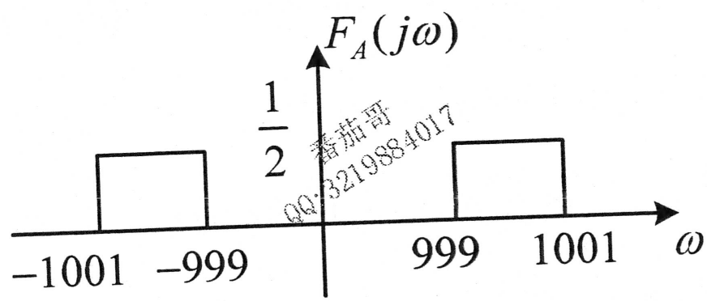

更多优质考研资讯, 关注b站 | 公众号“刺猬哥通信电子考研”、知乎“刺猬哥通信考研”

---

24最强信号辅导班招生啦！让你节省时间，不走弯路，取得佳绩！联系西瓜哥qq915211156 加Q群709502924，使用刺猬哥团队正版核心序列ORK，享受高质量全天候优质答疑指导

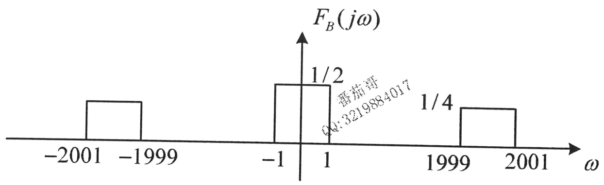

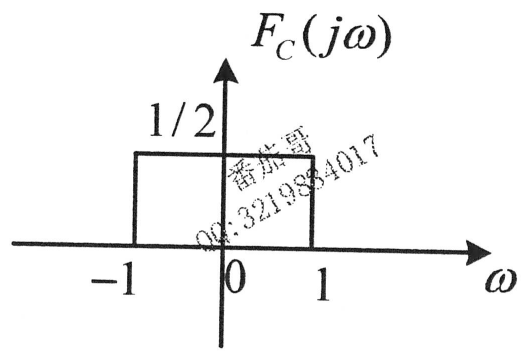

(2) $R(j \omega) = F_{C}(j \omega) = \frac{1}{2} H(j \omega) \xleftarrow{F} r(t) = \frac{\sin t}{2 \pi t}$

(注: 此题难度★★☆☆☆, 西瓜哥原创小结: 常规题, 考察通信系统的调制; 需熟记常见载波信号、调制信号的傅里叶变换)

题 21 解: (刺猬哥考研团队西瓜哥 QQ:915211156)

(1) 由题意:

$$
\begin{array}{l} x _ {1} (t) = [ x (t) + A + \cos (1 0 0 0 t + \frac {\pi}{4}) ] ^ {2} = [ x (t) + A ] ^ {2} + 2 [ x (t) + A ] \cos (1 0 0 0 t + \frac {\pi}{4}) + \cos^ {2} (1 0 0 0 t + \frac {\pi}{4}) ] \\ x _ {2} (t) = 2 [ x (t) + A ] \cos (1 0 0 0 t + \frac {\pi}{4}) (\text {其 余 两 项 被 滤 波 器 滤 除}) \end{array}
$$

(2) $x_{3}(t) = [x_{2}(t)\cos (1000t)]*h_{3}(t) = \{2[x(t) + A]\cos (1000t + \frac{\pi}{4})\cos (1000t)\} *h_{3}(t)$

$$
= \left\{\left[ x (t) + A \right] \left[ \cos \left(2 0 0 0 t + \frac {\pi}{4}\right) + \cos \left(\frac {\pi}{4}\right) \right] \right\} * h _ {3} (t)
$$

得出 $x_{3}(t) = \frac{\sqrt{2}}{2} [x(t) + A]$ （刺猬哥考研团队西瓜哥QQ:915211156）

(3) $x_{4}(t) = \{x_{2}(t)[\cos (1000t)*h_{2}(t)]\} *h_{3}(t)$

$$
\cos (1 0 0 0 t) * h _ {2} (t) \xleftarrow {F} - j \pi \delta (\omega + 1 0 0 0) + j \pi \delta (\omega - 1 0 0 0)
$$

$$
\cos (1 0 0 0 t) * h _ {2} (t) = - \sin (1 0 0 0 t)
$$

$$
x _ {4} (t) = \{- 2 [ x (t) + A ] \cos (1 0 0 0 t + \frac {\pi}{4}) \sin (1 0 0 0 t) \} * h _ {3} (t)
$$

---

$$
= \left\{\left[ x (t) + A \right] \left[ - \sin \left(2 0 0 0 t + \frac {\pi}{4}\right) + \sin \left(\frac {\pi}{4}\right) \right] \right\} * h _ {3} (t)
$$

得出 $x_{4}(t) = \frac{\sqrt{2}}{2} [x(t) + A]$

(4) $x_{5}(t) = \sqrt{x_{3}^{2}(t) + x_{4}^{2}(t)} = x(t) + A$

(注: 此题难度★★☆☆☆, 西瓜哥原创小结: 纸老虎, 题目看似很复杂, 实际上按顺序就班列写式子, 思路清晰, 轻松解决。)

题 22 解: (刺猬哥考研团队西瓜哥 QQ:915211156)

(1) $y(t) = x_{1}(t)\cos (200 t) + x_{2}(t)\cos (400 t)$

$$
Y (j \omega) = \frac {1}{2} \left\{X _ {1} [ j (\omega + 2 0 0) ] + X _ {1} [ j (\omega - 2 0 0) ] \right\} + \frac {1}{2} \left\{X _ {2} [ j (\omega + 4 0 0) ] + X _ {2} [ j (\omega - 4 0 0) ] \right\}
$$

(2) 可设 $g(t) = 2 \left[u\left(t + \frac{T_{1}}{4}\right) - u\left(t - \frac{T_{1}}{4}\right)\right] * \sum_{k=-\infty}^{+\infty} \delta\left(t-k T_{1}\right)$

$$
g (t) \xleftarrow {F} G (j \omega) = 4 \frac {\sin \frac {T _ {1}}{4} \omega}{\omega} \cdot \frac {2 \pi}{T _ {1}} \sum_ {k = - \infty} ^ {+ \infty} \delta (\omega - \frac {2 \pi}{T _ {1}} k) = 4 \sum_ {k = - \infty} ^ {+ \infty} \frac {\sin \frac {\pi k}{2}}{k} \delta (\omega - 2 0 0 k)
$$

$$
g _ {1} (t) = g (t) - 1 \xleftarrow {F} G _ {1} (j \omega) = 4 \sum_ {k = - \infty} ^ {+ \infty} \frac {\sin \frac {\pi k}{2}}{k} \delta (\omega - 2 0 0 k) - 2 \pi \delta (\omega)
$$

(3) 设 $Y(j \omega)$ 经过带通滤波器的 $Y_{1}(j \omega) = Y(j \omega) H_{1}(j \omega)$

$ = \frac{2}{\pi} \sum_{k=-\infty}^{+\infty} \frac{\sin \frac{\pi k}{2}}{k} Y_{1}[j(\omega - 200k)] - Y_{1}(j\omega) $ （刺猬哥考研团队西瓜哥QQ:915211156）

$$
\begin{array}{l} y _ {B} (t) = y _ {1} (t) g _ {1} (t) \xleftarrow {F} Y _ {B} (j \omega) = \frac {1}{2 \pi} Y _ {1} (j \omega) * G _ {1} (j \omega) \\ = \frac {1}{2 \pi} Y _ {1} (j \omega) * [ 4 \sum_ {k = - \infty} ^ {+ \infty} \frac {\sin \frac {\pi k}{2}}{k} \delta (\omega - 2 0 0 k) - 2 \pi \delta (\omega) ] \\ \end{array}
$$

(4) 要使 $Y_{B}(j\omega)H_{3}(j\omega) = X_{1}(j\omega)$, 则有 $H_{3}(j\omega) = \begin{cases} \frac{\pi}{2}, & |\omega| \leq 50 \\ 0, & \text{else} \end{cases}$

---

同理要使 $Y_{C}(j\omega)H_{4}(j\omega) = X_{2}(j\omega)$, 则有 $H_{4}(j\omega) = \left\{ \begin{array}{l} \frac{\pi}{2}, |\omega| \leq 100 \\ 0, \text{else} \end{array} \right.$

(注: 此题难度★★★★☆, 西瓜哥原创小结: 第二问交替矩形脉冲信号的傅里叶变换是个难点, 第四问设计滤波器时, 需适当画出 $Y_{B}(j \omega)$ 的频谱图分析, 只要关注我们所关心的频率范围内的图形即可。)

题 23 解:

(1) 由题意: $e_{1}(t) = x(t) h(t) \xrightarrow{F} E_{1}(j \omega) = \frac{1}{2 \pi} X(j \omega) * H(j \omega) = X[j(\omega + 15)]$

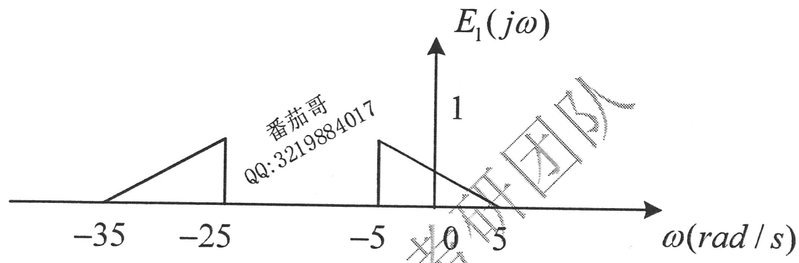

(2) $E_{2}(j \omega) = E_{1}(j \omega) H_{1}(j \omega)$

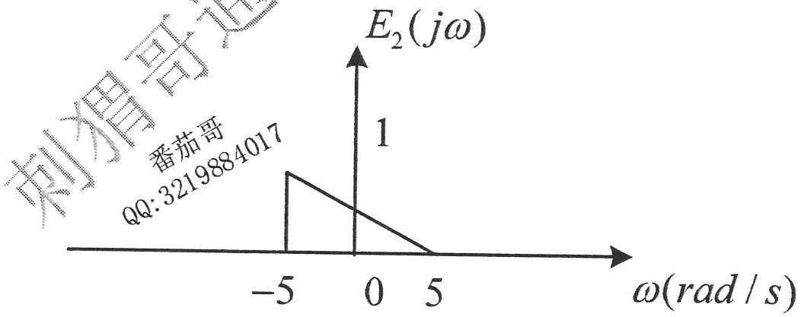

(3) $x_{p}(t) = e_{2}(t)p(t)\xleftarrow{F} X_{p}(j\omega) = \frac{1}{2\pi} E_{2}(j\omega)*P(j\omega)$

$$
p (t) = \sum_ {n = - \infty} ^ {+ \infty} \delta (t - n T) \xleftarrow {F} P (j \omega) = \frac {2 \pi}{T} \sum_ {n = - \infty} ^ {+ \infty} \delta (\omega - \frac {2 \pi}{T} n)
$$

$$
X _ {p} (j \omega) = \frac {1}{T} \sum_ {n = - \infty} ^ {+ \infty} E _ {2} [ j (\omega - \frac {2 \pi}{T} n) ]
$$

(4) 若要 $x_{p}(t)$ 可无失真恢复出 $e_{2}(t)$, 则 $\frac{2 \pi}{T} \geq 10 \Rightarrow T \leq \frac{\pi}{5}$, 故 $T_{\max} = \frac{\pi}{5}$.

(5) 设计恢复系统如下:

---

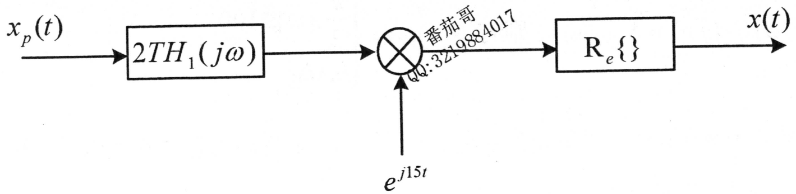

(注: 此题难度★★★☆☆, 西瓜哥原创小结: 第五问恢复 $x(t)$ 最后一步采用了时域取实部的操作, 对于实信号对应在频域里是取偶操作。

$$
\operatorname {R e} \{x (t) \} = \frac {x (t) + x ^ {*} (t)}{2} \leftarrow_ {F} \rightarrow \frac {X (j \omega) + X ^ {*} (- j \omega)}{2} = \frac {X (j \omega) + X (- j \omega)}{2})
$$

题 24 解:

(1) $\cos \left(\Omega_{L} t\right)$ 经 $-\frac{\pi}{2}$ 的相移, 可得

$$
f _ {A} = \cos (\Omega_ {0} t - \frac {\pi}{2}) = \sin (\Omega_ {0} t) \leftrightarrow j \pi [ \delta (\Omega + \Omega_ {0}) - \delta (\Omega - \Omega_ {0}) ]
$$

故 $F_{A} = j \pi \left[ \delta \left(\Omega + \Omega_{0}\right) - \delta \left(\Omega - \Omega_{0}\right) \right]$, 其中 $\Omega_{0} = \frac{\Omega_{L} + \Omega_{H}}{2}$

(2) 令 $x_{1}(t) = x(t)\cos(\Omega_{0}t), x_{2}(t) = x(t)\sin(\Omega_{0}t)$

$$
\begin{array}{l} X _ {1} (j \Omega) = \frac {1}{2 \pi} X (j \Omega) * \pi [ \delta (\Omega + \Omega_ {0}) + \delta (\Omega - \Omega_ {0}) ] = \frac {1}{2} \{X [ j (\Omega + \Omega_ {0}) ] + X [ j (\Omega - \Omega_ {0}) ] \} \\ X _ {2} (j \Omega) = \frac {1}{2 \pi} X (j \Omega) * j \pi [ \delta (\Omega + \Omega_ {0}) - \delta (\Omega - \Omega_ {0}) ] = \frac {j}{2} \{X [ j (\Omega + \Omega_ {0}) ] - X [ j (\Omega - \Omega_ {0}) ] \} \\ \end{array}
$$

其中 $\Omega_{0} = \frac{\Omega_{L} + \Omega_{H}}{2}$ （刺猬哥考研团队，西瓜哥QQ:915211156）

$$
Y _ {B} (j \Omega) = X _ {1} (j \Omega) H (j \Omega), Y _ {C} (j \Omega) = X _ {2} (j \Omega) H (j \Omega)
$$

---

24最强信号辅导班招生啦！让你节省时间，不走弯路，取得佳绩！联系西瓜哥qq915211156 加Q群709502924，使用刺猬哥团队正版核心序列ORK，享受高质量全天候优质答疑指导

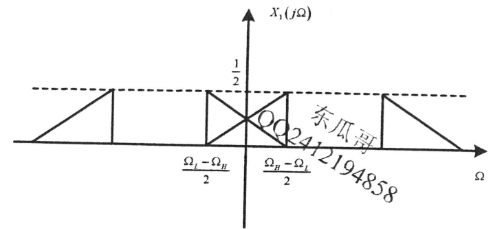

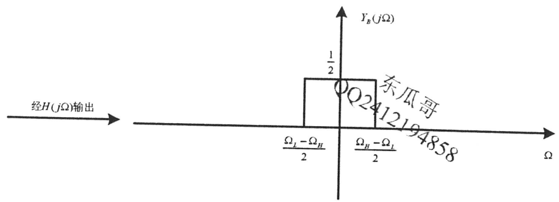

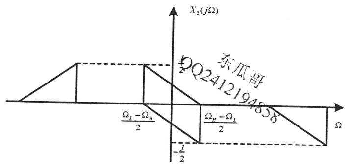

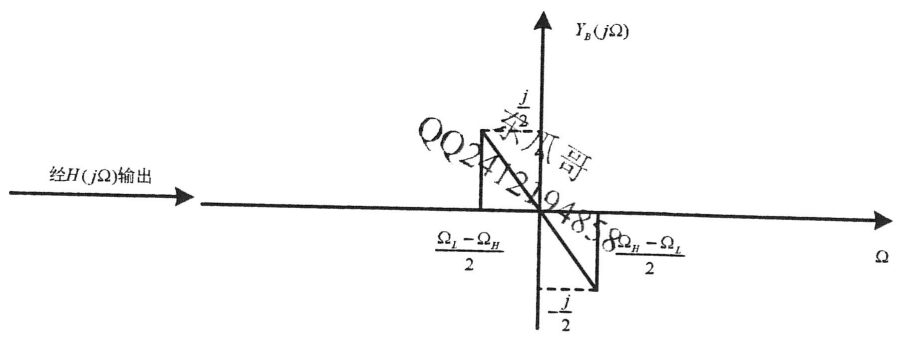

(3) 令 $y_{1}(t) = y_{B}(t) \cos \left(\Omega_{0} t\right)$, $y_{2}(t) = y_{C}(t) \sin \left(\Omega_{0} t\right)$

所以 $Y_{1}(j \Omega) = \frac{1}{2 \pi} Y_{B}(j \Omega)* = \frac{1}{2} Y_{B}(j \Omega)*\cos (\Omega_{0} t)$

$Y_{1}(j\Omega) = \frac{1}{2\pi} Y_{B}(j\Omega)*\pi [\delta (\Omega +\Omega_{0}) + \delta (\Omega -\Omega_{0})] = \frac{1}{2}\{Y_{B}[j(\Omega +\Omega_{0})] + Y_{B}[j(\Omega -\Omega_{0})]\}$

$Y_{2}(j\Omega) = \frac{1}{2\pi} Y_{C}(j\Omega)*j\pi [\delta (\Omega +\Omega_{0}) - \delta (\Omega -\Omega_{0})] = \frac{j}{2}\{Y_{C}[j(\Omega +\Omega_{0})] - Y_{C}[j(\Omega -\Omega_{0})]\}$

其中 $\Omega_0 = \frac{\Omega_L + \Omega_H}{2}, Y(j\Omega) = Y_1(j\Omega) + Y_2(j\Omega)$

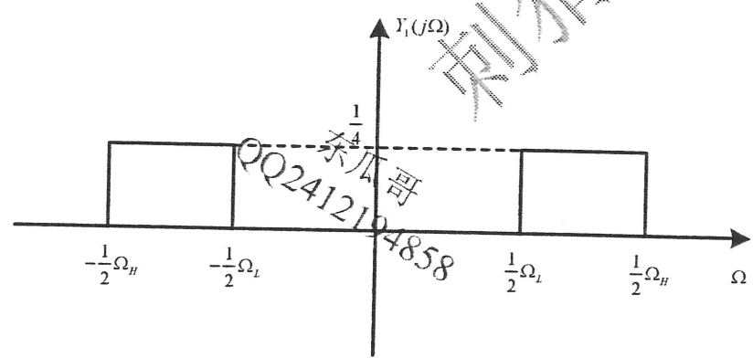

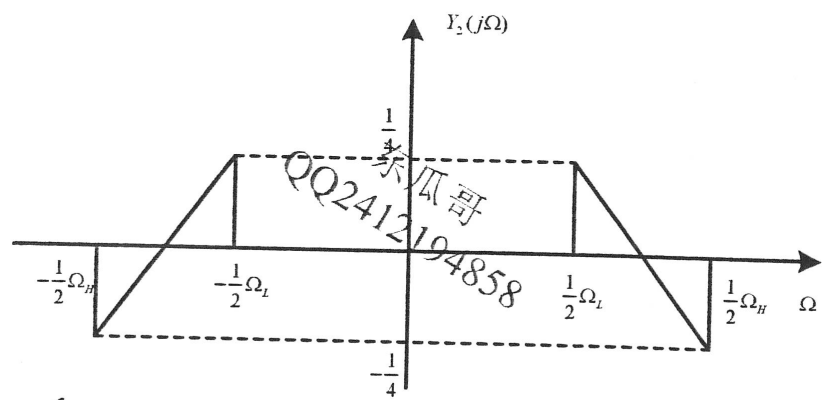

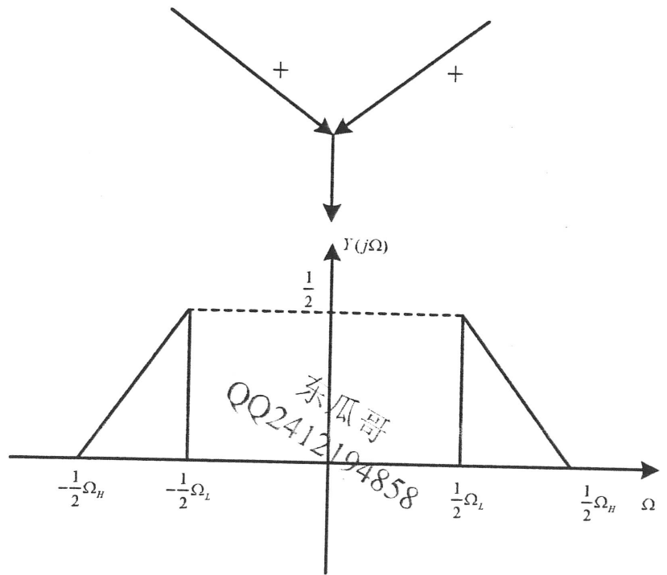

---

(西瓜哥原创小结: 此题难度★★★☆☆, 一道十分经典的频谱搬移问题, 此题防止大家在做多了抽样问题, 而忘记了对这一题型的考察。此题步骤繁琐, 有一定的难度, 很好了的考察了大家对这一类问题的解题, 大家遵循一步一步的原则, 做出来的难度并不是很大, 此题一定要注意计算。(刺猬哥考研团队, 西瓜哥QQ:915211156)

西瓜哥原创编写

---

# 南昌考研信号与系统核心序列 O

# 序列六—离散时间系统的时域分析

# 西瓜哥原创作答

1. $h[n]$ 为离散 LTI 系统的单位序列响应, 以下 $h[n]$ 中不是恒等系统 $(h[n] = \delta [n])$ 的是 ( )。

A. $h[n] = \cos (n)\left(\sum_{k = -\infty}^{n}\delta [k] - u[n - 1]\right)$

B. $h[n] = 2^{n} u[n] * \{\delta[n] - 2\delta[n - 1]\}$

C. $h(n) = \sum_{k=1}^{\infty} \delta[n - k] - u[n - 2]$

D. $h[n] = u[-n] - u[-n - 1]$

2. 离散序列 $x_{1}(n)$ 和 $x_{2}(n)$ 分别如下图所示。设 $y(n) = x_{1}(n)*x_{2}(n)$, 则 $y(2)$ 等于

A. -1

B. 0

C. 1

D. 3

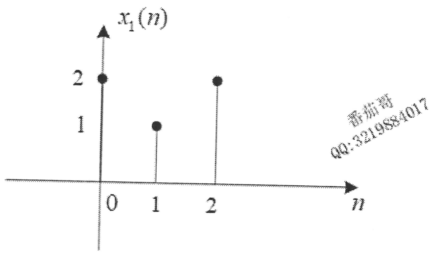

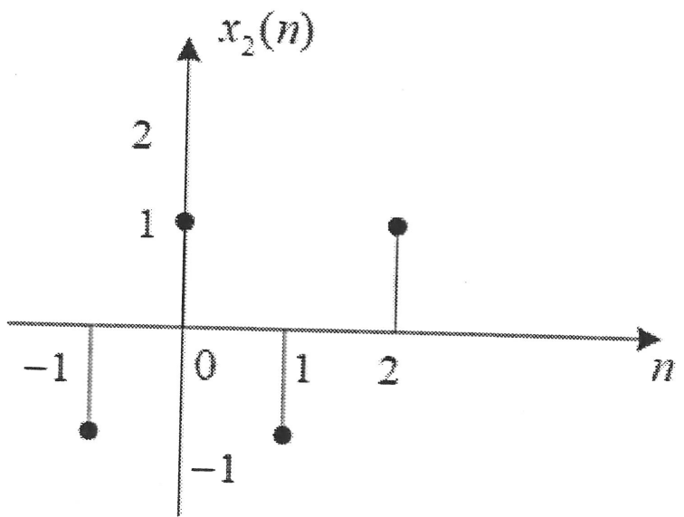

---

3. 已知 $x[n] = \delta [n + 1] + \delta [n] + 3\delta [n - 1]$, $h[n] = 3\delta [n - 1] + \delta [n - 3]$, 则 $x[n]*h[n] =$

A. $\{3, 3, 10, 1, 3\}$, $n = -1, 0, 1, 2, 3$

B. $\{3, 3, 10, 1, 3\}$, $n = 1, 2, 3, 4, 5$

C. $\{3, 3, 10, 1, 3\}$, $n = 0, 1, 2, 3, 4$

D. $\{3, 3, 10, 1, 2\}, n = 0, 1, 2, 3, 4$

(刺猬哥考研团队西瓜哥 QQ:915211156)

4. 离散时间 LTI 系统, 其单位样本响应为 $h[n] = 2^{n-1}\left(u[n-1] - u[n-3]\right)$, 输入信号为 $x[n] = 2\delta[n+1] - \delta[n-1]$ 时, 对应的系统响应是 ( )。

A. $2 \delta [n] + 4 \delta [n - 1] + 7 \delta [n - 2] - 2 \delta [n - 3] - 4 \delta [n - 4]$

B. $2 \delta [n] + 3 \delta [n - 1] - 2 \delta [n - 2]$

C. $2 \delta [n] + 7 \delta [n - 2] - 4 \delta [n - 4]$

D. $2 \delta [n] + 4 \delta [n - 1] - \delta [n - 2] - 2 \delta [n - 3]$

5. 差分方程 $ y(n + 2) + 5y(n + 1) + 6y(n) = x(n + 1) + 4x(n) $ 描述的离散系统是: 1) 线性的 2) 因果的 3) 一阶的 4) 时不变的。这些说法中有几个是正确的? ________。

A. 1 个

B. 2 个

C. 3 个

D. 4 个

6. 信号 $f(n) = \cos \left(\frac{n}{2}\right) + \cos \left(\frac{\pi n}{3}\right)$ 是______。（刺猬哥考研团队西瓜哥QQ:915211156）

A. 周期信号、功率信号

B. 非周期信号、能量信号

C. 非周期信号、功率信号

D. 周期信号、能量信号

---

7. 序列和 $\sum_{k = -\infty}^{+\infty}\delta (k - 1) = \underline{\quad};$

8. 信号 $x[n] = \cos \left(\frac{\pi}{3} n^{2}\right)$ 的最小周期为 ; (刺猬哥考研团队西瓜哥 QQ:915211156)

9. 已知 $x(n) = \left\{ \begin{array}{l} 1, 0 \leq n \leq 3 \\ 0, \text{else} \end{array} \right.$, $h(n) = \left\{ \begin{array}{l} \beta^{n}, 0 \leq n \leq 5, \text{且} \beta > 1 \\ 0, \text{else} \end{array} \right.$, 计算卷积 $y(n) = x(n) * h(n)$ 。

10. 计算下列卷积和:

(a) $y(n) = u(n) * u(n - 3)$

(b) $y(n) = \left(\frac{1}{2}\right)^n u(n - 2)*u(n)$

(c) $y(n) = u(n - 2)*h(n)$, 其中 $h(n) = \begin{cases} \gamma^n, & n < 0, \\ \eta^n, & n \geq 0, \end{cases} |\gamma| > 1$

11. 如图所示系统, 各子系统的冲激响应分别为 $h_{1}(n) = u(n), \quad h_{2}(n) = \delta (n - 3)$, $h_{3}(n) = -\delta (n + 1)$, 求: (刺猬哥考研团队西瓜哥 QQ:915211156)

(1) 总的系统的冲激响应 $h(n)$;

(2) 当 $f(n) = n \cdot [u(n) - u(n - 3)]$ 时, 求系统对该信号的响应 $y(n)$ 。

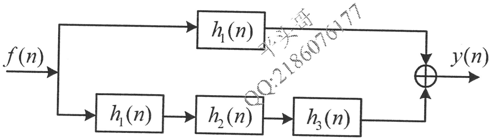

---

12. 某 LTI 离散系统差分方程 $y(k) - \frac{5}{6} y(k - 1) + \frac{1}{6} y(k - 2) = f(k)$, 输入为阶跃序列, 边界值为 $k = 1$.

$y(-1) = 5, y(-2) = 1$ ，利用时域求解：

(1)零输入响应 
(2)零状态响应 
(3)全响应

---

# 序列 O 序列六详解—西瓜哥原创作答

题1解：C。

恒等系统 $h[n] = \delta[n]$

A 选项, $h[n] = \cos n \cdot \delta[n] = \delta[n]$

B 选项, $h[n] = 2^{n} u[n] - 2^{n} u[n - 1] = 2^{n} \delta[n] = \delta[n]$

C 选项, $h[n] = u[n - 1] - u[n - 2] = \delta [n - 1]$

D 选项, $h[n] = \delta[n]$

(QQ915211156 西瓜哥 Tips: 此题难度★★☆☆☆, 可通过画图辅助分析)

题 2 解: D (刺猬哥考研团队西瓜哥 QQ:915211156)

$$
y (n) = x _ {1} (n) * x _ {2} (n)
$$

其中 $2\delta (n)*\delta (n - 2) + \delta (n - 1)*[-\delta (n - 1)] + 2\delta (n - 2)*\delta (n) = 3\delta (n - 2)$

故 $y(2) = 3$

（注：此题难度★☆☆☆☆，西瓜哥原创小结：y(2)值即冲激 $\delta (n - 2)$ 项前面的系数值。）

题3解：C

$$
\begin{array}{l} x [ n ] ^ {*} h [ n ] = (\delta [ n + 1 ] + \delta [ n ] + 3 \delta [ n - 1 ]) * (3 \delta [ n - 1 ] + \delta [ n - 3 ]) \\ = 3 (\delta [ n ] + \delta [ n - 1 ] + 3 \delta [ n - 2 ]) + \delta [ n - 2 ] + \delta [ n - 3 ] + 3 \delta [ n - 4 ] \\ = 3 \delta [ n ] + 3 \delta [ n - 1 ] + 1 0 \delta [ n - 2 ] + \delta [ n - 3 ] + 3 \delta [ n - 4 ] \\ \end{array}
$$

(注: 此题难度★☆☆☆☆, 西瓜哥原创小结: 此题可以直接卷积和计算, 也可以利用对位相乘, 这里直接算。)

题 4 解: D

分析: 已知离散时间系统的 $x[n], h[n]$, 求响应, 即求两者卷积。$x[n], h[n]$ 均为有更多优质考研资讯, 关注 $\mathrm{b}$ 站 | 公众号“刺猬哥通信电子考研”、知乎“刺猬哥通信考研”

---

$$
\begin{array}{c c c c c} x [ n ]: & 2 & 0 & - 1 \\ h [ n ]: & 1 & 2 \\ \hline & 4 & 0 & - 2 \\ \hline 2 & 0 & - 1 \\ \hline y [ n ]: & 2 & 4 & - 1 & - 2 \end{array}
$$

即 $y[n] = 2 \delta[n] + 4 \delta[n - 1] - \delta[n - 2] - 2 \delta[n - 3]$

(QQ915211156 西瓜哥 Tips: 此题难度★☆☆☆☆, 对位相乘法典型运用。拔高考生建议掌握已知卷积和 与其中一个被卷积项, 求另一个被卷积项的方法, 详见高水平课程。)

题 5 解: C

(1)线性性判断:

已知 $ y(n + 2) + 5y(n + 1) + 6y(n) = x(n + 1) + 4x(n) $

设有 $x_{1}(n) \rightarrow y_{1}(n)$, $y_{1}(n+2)+5 y_{1}(n+1)+6 y_{1}(n)=x_{1}(n+1)+4 x_{1}(n)$.

$$
x _ {2} (n) \rightarrow y _ {2} (n), \quad y _ {2} (n + 2) + 5 y _ {2} (n + 1) + 6 y _ {2} (n) = x _ {2} (n + 1) + 4 x _ {2} (n)
$$

令 $x_{3}(n) = ax_{1}(n) + bx_{2}(n)$

$$
x _ {3} (n) \rightarrow y _ {3} (n), \quad y _ {3} (n + 2) + 5 y _ {3} (n + 1) + 6 y _ {3} (n) = x _ {3} (n + 1) + 4 x _ {3} (n)
$$

$$
y _ {3} (n + 2) + 5 y _ {3} (n + 1) + 6 y _ {3} (n) = a x _ {1} (n + 1) + b x _ {2} (n + 1) + 4 a x _ {1} (n) + 4 b x _ {2} (n)
$$

其中 $a x_{1}(n + 1) + 4 a x_{1}(n) = a y_{1}(n + 2) + 5 a y_{1}(n + 1) + 6 a y_{1}(n)$

$$
b x _ {2} (n + 1) + 4 b x _ {2} (n) = b y _ {2} (n + 2) + 5 b y _ {2} (n + 1) + 6 b y _ {2} (n)
$$

对比可得: $y_{3}(n) = a y_{1}(n) + b y_{2}(n)$, 故系统线性;

(2)因果性判断：（刺猬哥考研团队西瓜哥QQ:915211156）

比较差分方程最高阶: $y(n + 2)$ 与 $x(n + 1)$, 可见任何时刻系统的输出都只与过去的输入有关, 故系统因果;

(3)根据系统极点的个数, 可知系统为二阶系统;

---

(4)时变性判断:

已知 $y(n + 2) + 5y(n + 1) + 6y(n) = x(n + 1) + 4x(n)$

设有 $x_{1}(n) \rightarrow y_{1}(n)$, $y_{1}(n+2) + 5y_{1}(n+1) + 6y_{1}(n) = x_{1}(n+1) + 4x_{1}(n)$.

令 $x_{2}(n) = x_{1}(n - n_{0})$

$x_{2}(n) \rightarrow y_{2}(n)$ （刺猬哥考研团队西瓜哥 QQ:915211156），

$$
y _ {2} (n + 2) + 5 y _ {2} (n + 1) + 6 y _ {2} (n) = x _ {2} (n + 1) + 4 x _ {2} (n) = x _ {1} (n + 1 - n _ {0}) + 4 x _ {1} (n - n _ {0})
$$

其中 $x_{1}(n + 1 - n_{0}) + 4x_{1}(n - n_{0}) = y_{1}(n + 2 - n_{0}) + 5y_{1}(n + 1 - n_{0}) + 6y_{1}(n - n_{0})$

对比可得: $y_{2}(n) = y_{1}\left(n - n_{0}\right)$, 故系统时不变;

因此有 3 个说法正确。（刺猬哥考研团队西瓜哥 QQ:915211156）

(QQ915211156 西瓜哥 Tips: 此题难度★★☆☆☆, 牢牢抓住定义判断即可。)

题6解：C

$\cos \left(\frac{n}{2}\right): \frac{2 \pi}{\frac{1}{2}} = 4 \pi$ 为无理数, 故非周期, $\cos \left(\frac{\pi n}{3}\right): \frac{2 \pi}{\frac{\pi}{3}} = 6$ 为整数, 故周期;

故 $f(n) = \cos \left(\frac{n}{2}\right) + \cos \left(\frac{\pi n}{3}\right)$ 为非周期信号

$ E_{\infty} = \sum_{n = -\infty}^{+\infty}|f(n)|^{2} = \infty, \quad P_{\infty} = \lim_{N\to \infty}\frac{1}{2N + 1}\sum_{n = -N}^{N}|f(n)|^{2} = 1 $ （拆开计算，利用到二倍角公式）

故 $f(n) = \cos \left(\frac{n}{2}\right) + \cos \left(\frac{\pi n}{3}\right)$ 属于功率信号。

（QQ915211156 西瓜哥 Tips: 此题难度★★☆☆☆, 考查周期、能量以及功率的判断和计算。）

题7解：1

$$
\sum_ {k = - \infty} ^ {+ \infty} \delta (k - 1) = 1, \text {其 中} \delta (k - 1) \text {只 有 在} k = 1 \text {处 才 有 值}
$$

(西瓜哥原创小结: 此题难度 $\star \star \star \star \star$, 若无法直接看出结果, 不妨多写几项。)

---

题 8 解: 6 (刺猬哥考研团队西瓜哥 QQ:915211156)

根据周期定义: $x(n + N) = x(n)$

$$
\cos \left[ \frac {\pi}{3} (n + N) ^ {2} \right] = \cos \left(\frac {\pi}{3} n ^ {2}\right)
$$

$$
\cos \left(\frac {\pi}{3} n ^ {2} + \frac {2 \pi}{3} n N + \frac {\pi}{3} N ^ {2}\right) = \cos \left(\frac {\pi}{3} n ^ {2}\right)
$$

$\Rightarrow \frac{2 \pi}{3} n N + \frac{\pi}{3} N^{2}$ 为 $2 \pi$ 的整数倍

$\frac{2 \pi}{3} n N + \frac{\pi}{3} N^{2} = 2 \pi m$ （$m$ 为整数）可得 $N$ 最小取 6。

(西瓜哥原创小结: 此题难度 $\bigstar \bigstar \bigstar \bigstar \bigstar$, 分析: N 的取值要将分母的 3 约掉; N 最小取 3 时, 有 $2 \pi n + 3 \pi$ 不满足为 $2 \pi$ 的整数倍; N 取 6 时, 有 $4 \pi n + 12 \pi$ 满足为 $2 \pi$ 的整数倍。)

题 9 解:

由题意: $x(n) = \delta (n) + \delta (n - 1) + \delta (n - 2) + \delta (n - 3)$

$$
h (n) = \beta^ {n} [ u (n) - u (n - 6) ]
$$

$$
\begin{array}{l} v (n) = x (n) * h (n) = \beta^ {n} [ u (n) - u (n - 6) ] + \beta^ {n - 1} [ u (n - 1) - u (n - 7) ] + \beta^ {n - 2} [ u (n - 2) - u (n - 8) ] \\ + \beta^ {n - 3} [ u (n - 3) - u (n - 9) ] \\ \end{array}
$$

(西瓜哥原创小结: 此题难度★☆☆☆☆, 将 $x(n)$ 表示成冲激序列, 再进行卷积。)

题 10 解: (刺猬哥考研团队西瓜哥 QQ:915211156)

由题意:

(a) $ y(n) = u(n)*u(n - 3) = \sum_{k = -\infty}^{+\infty}u(k)u(n - k - 3) = \sum_{k = 0}^{n - 3}1 = (n - 2)u(n - 3) $

(注意求和上限大于求和下限, 即 $n \geq 3$)

(b) $ y(n) = \left(\frac{1}{2}\right)^n u(n - 2)*u(n) = \sum_{k = -\infty}^{+\infty}\left(\frac{1}{2}\right)^k u(k - 2)u(n - k) = \sum_{k = 2}^n\left(\frac{1}{2}\right)^k = \left[\frac{1}{2} -\left(\frac{1}{2}\right)^n\right]u(n - 2) $

(注意求和上限大于求和下限, 即 $n \geq 2$)

更多优质考研资讯，关注b站 | 公众号“刺猬哥通信电子考研”、知乎“刺猬哥通信考研”

---

(c) $y(n) = u(n - 2)*\gamma^n u(-n - 1) + u(n - 2)*\eta^n u(n)$

$$
u (n - 2) * \gamma^ {n} u (- n - 1) = \sum_ {k = - \infty} ^ {+ \infty} u (k - 2) \gamma^ {n - k} u (- (n - k) - 1) = \frac {\gamma^ {n - 1}}{\gamma - 1} u (- n + 1) + \frac {1}{\gamma - 1} u (n - 2)
$$

西瓜哥分析：（刺猬哥考研团队西瓜哥QQ:915211156）

$$
u (k - 2) = \left\{ \begin{array}{l} 1, k \geq 2 \\ 0, e l s e \end{array} \right., u (- n + k - 1) = \left\{ \begin{array}{l} 1, k \geq n + 1 \\ 0, e l s e \end{array} \right.
$$

$n \leq 1$ 时, 原式 $= \sum_{k = 2}^{+\infty} \gamma^{n - k} = \gamma^n \sum_{k = 2}^{+\infty} \gamma^{-k} = \frac{\gamma^{n - 1}}{\gamma - 1}$

$n \geq 2$ 时, 原式 $= \sum_{k=n+1}^{+\infty} \gamma^{n-k} = \gamma^n \sum_{k=n+1}^{+\infty} \gamma^{-k} = \frac{1}{\gamma - 1}$

同理可得: $u(n - 2) * \eta^{n} u(n) = \frac{1 - \eta^{n - 1}}{1 - \eta} u(n - 2)$

故 $y(n) = \frac{\gamma^{n - 1}}{\gamma - 1} u(-n + 1) + (\frac{1}{\gamma - 1} +\frac{1 - \eta^{n - 1}}{1 - \eta})u(n - 2)$

（注：此题难度★★★☆☆，西瓜哥原创小结：本题考查卷积和计算，难点主要在于（c）需要分类讨论，并结合数学里的等比数列求和，非常考验计算功底，不可多得的好题，值得写个三遍以上。由（a）可得出一个结论，务必记住$u(n - M)*u(n - N) = (n - M - N + 1)u(n - M - N)$。）

题11解：

(1) $h(n) = h_{1}(n)^{*}h_{2}(n)^{*}h_{3}(n) + h_{1}(n) = u(n) - u(n - 2)$

(2) $y(n) = f(n)^{*} h(n) = n [u(n) - u(n - 3)]^{*} [u(n) - u(n - 2)]$

$$
\begin{array}{l} = [ \delta (n - 1) + 2 \delta (n - 2) ] ^ {*} [ \delta (n) + \delta (n - 1) ] \\ = \delta (n - 1) + 3 \delta (n - 2) + 2 \delta (n - 3) \\ \end{array}
$$

(注: 此题难度★★☆☆☆, 平头哥原创小结: 基础题, 考察系统级联运算及有限长卷积运算。) (刺猬哥考研团队西瓜哥 QQ:915211156)

---

题12解：

(1)由差分方程可得系统的特征方程为 $\lambda^2 -\frac{5}{6}\lambda +\frac{1}{6} = 0$ ，解得两个特征根为： $\lambda_{1} = \frac{1}{2},$ $\lambda_{1} = \frac{1}{3}$ ，由此设方程的零输入解为： $y_{zi}(n) = a(\frac{1}{2})^{n} + b(\frac{1}{3})^{n}$ ，代入 $y(-1) = 5$ 、 $y(-2) = 1$ 算得系数为 $\left\{ \begin{array}{l}a = 7\\ b = -3 \end{array} \right.$

由此 $y_{zi}(n) = 7(\frac{1}{2})^n -3(\frac{1}{3})^n$

(2)由差分方程知系统单位序列响应为: $h(n) = 3 \left(\frac{1}{2}\right)^{n} u(n) - 2 \left(\frac{1}{3}\right)^{n} u(n)$

零状态响应 $y_{zs}(n) = h(n)^{*} u(n) = 3 u(n) - 3 \left(\frac{1}{2}\right)^{n} u(n) + \left(\frac{1}{3}\right)^{n} u(n)$

(3)全响应为 $y(n) = y_{zs}(n) + y_{zi}(n) = 3u(n) + 4\left(\frac{1}{2}\right)^{n} u(n) - 2\left(\frac{1}{3}\right)^{n} u(n)$

(注: 此题难度★★☆☆☆, 西瓜哥原创小结: 常考题, 考查差分方程与系统函数之间的转换关系, 以及零输入、零状态和全响应的求解, 所以平时相关时域公式还是得记熟, 本题如果在考试中遇到忘记时域公式了, 可以把步骤写出来再用熟悉的频域求解逆变换也是可以的。)

西瓜哥原创编写

---

# 南昌考研信号与系统核心序列 O

# 序列七—Z变换、离散时间系统的Z域分析

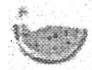

# 西瓜哥原创作答

1. 已知 $X(z) = e^{\frac{2}{z}}, |z| > 0$, 则 $x[n] = (\quad)$

A $2^{n}$

B $\left(\frac{1}{2}\right)^n$

C $\frac{2^{n}}{n !} u [ n ]$

D $2^{n} u[n]$

2.序列 $f(n) = \sum_{i=0}^{n}(-1)^{i}$ 单边 $\mathbf{z}$ 变换为（）。（刺猬哥考研团队西瓜哥QQ:915211156）

A. $\frac{z}{z^2 - 1}$

B. $\frac{z}{(z - 1)^2}$

C. $\frac{z^{2}}{z^{2} - 1}$

D. $\frac{z^2}{(z - 1)^2}$

3. 给定系统差分方程为 $ y(n) + 5y(n - 1) + 6y(n - 2) = 2f(n) $，当输入 $ f(n) = 2^{n}u(n) $ 时，系统的全响应为 $ y(n) = \left[\frac{2}{5} 2^{n} + 18(-2)^{n} - 32.4(-3)^{n}\right]u(n) $，则零输入响应为（）。

A. $\left[\frac{2}{5} 2^{n} + 18(-2)^{n}\right]u(n)$

B. $\left[18(-2)^{n} - 32.4(-3)^{n}\right]u(n)$

C. $\left[-2(-2)^{n} + 3.6(-3)^{n}\right]u(n)$

D. $\left[20(-2)^{n} - 36(-3)^{n}\right]u(n)$

4. 一个因果稳定的离散时间系统函数 $H(z)$ 的极点必定在 ( )。

A. Z 平面虚轴上

B. Z 平面实轴上

---

C. Z平面单位圆内

D. Z平面单位圆外（刺猬哥考研团队西瓜哥QQ:915211156）

5. 已知 $X(z) = \frac{z^2}{z^2 - 1.5z + 0.5} (|z| > 1)$, 则 $x(n) = (\quad)$。

A. $(2 - 0.5^{n})$

B. $(2 - 0.5^{n})u(n)$

C. $0.5^{n}$

D. $0.5^{n} u(n)$

6. 关于因果系统下列说法不正确的是（ ）。

A. 系统函数 $H(z)$ 在单位圆内的极点, 所对应的时域响应 $h(k)$ 为衰减的, 即当 $k \to \infty$ 时, 响应均趋于 0

B. 系统函数 $H(z)$ 在单位圆内的一阶极点, 所对应的时域响应 $h(k)$ 为稳态响应

C. 系统函数 $H(z)$ 在单位圆上的高阶极点或单位圆外的极点, 其所对应的时域响应 $h(k)$ 都是递增的, 即当 $k \to \infty$ 时, 响应均趋于 $\infty$

D. 系统函数 $H(z)$ 的零点在单位圆内, 所对应的时域响应 $h(k)$ 为衰减的, 即当 $k \to \infty$ 时, 响应均趋于 0 (刺猬哥考研团队西瓜哥 QQ:915211156)

7. $z = e^{sT}$ 建立了 $s$ 平面与 $z$ 平面之间的映射关系。因此, $s$ 左半平面对应于 $z$ 平面的 $\_ \_ \_ \_ \_ \_$, $z$ 平面的单位圆对应于 $s$ 平面的 $\_$。

8. 序列 $2^{k} \sum_{l=0}^{k-1} \left[(-1)^{l} u[l]\right]$ 的单边 $Z$ 变换为

---

24最强信号辅导班招生啦！让你节省时间，不走弯路，取得佳绩！联系西瓜哥qq915211156 加Q群709502924，使用刺猬哥团队正版核心序列ORK，享受高质量全天候优质答疑指导

9. $x[n] = \cos \left[\frac{\pi}{2}\left(n^{2} + 1 - 2 n\right)\right]^{2} \delta [n - 1]$ 的简化形式为 , 其 Z 变换为 , 收敛域为 。(刺猬哥考研团队西瓜哥 QQ:915211156)

10. 离散线性时不变系统的 $H(z) = \frac{z}{z - 0.5}, |z| > 0.5$, 输入 $x(n) = 3$ 时输出 $y(n) =$ ________; (刺猬哥考研团队西瓜哥 QQ:915211156)

11. 因果序列的 $Z$ 变换为 $\frac{z^{2} + z + 1}{(z - 1)(z + \frac{1}{2})}$, 则 $f(0) =$ ____________;

12. 序列 $k \sin \left(\frac{k \pi}{2}\right) \varepsilon(k)$ 的 $z$ 变换为 $\_ \_ \_ \_ \_ \_ \_ \_ \_ \_ \_ \_ \_ \_ \_ \_ \_ \_ \_ \_ \_ \_ \_ \_ \_ \_ \_ \_ \_ \_ \_ \_ \_ \_ \_ \_ \_ \_ \_ \_ \_ \_ \_ \_ \_ \_ \_ \_ \_ \_ \_ | z| > 1$.

13. 计算下列各信号的 $z$ 变换 $X(z)$, 写出零极点并标明收敛域。

(1) $x(n) = \left(\frac{1}{2}\right)^n u(n) + 3^n u(n)$

(2) $x(n) = \left(\frac{1}{3}\right)^n u(n) - 2^n u(-n - 1)$

(3) $x(n) = 3^{n}u(-n - 1) + 4^{n}u(-n - 1)$

(4) $x(n) = u(n + 2) - u(n - 3)$

(5) $x(n) = \delta (n - 3)$ （刺猬哥考研团队西瓜哥QQ:915211156）

14. 利用性质计算下列各信号的（单边） $z$ 变换 $X(z)$ 。

(1) $x(n) = (n - 3)2^{n}u(n - 2)$

(2) $x(n) = \left(\frac{1}{2}\right)^{n + 2}u(n - 2)$

(3) $x(n) = (-1)^{n}[u(n) - u(n - 6)]$

(4) $x(n) = \sin [\Omega_0(n - 3)] u(n - 3)$

(5) $x(n) = \delta (2n)$

(6) $x(n) = \left(\frac{1}{3}\right)^{3n - 1} \delta (n - 1)$

---

(7) $x(n) = e^{n} \cos \left(\frac{\pi}{4} n\right) u(n)$

(8) $x(n) = \sum_{k=0}^{n}[u(k) - u(k-4)]$

(9) $x(n) = \sum_{k=0}^{n} k\left(\frac{1}{3}\right)^{k}$

(10) $x(n) = \left\{ \begin{array}{l} \left(\frac{1}{2}\right)^{n / 2}, n = 0, 2, 4, 6 \dots \\ 0, \text{else} \end{array} \right.$

(11) $x(n) = (-1)^{n} n(-2)^{n} u(n)$

(12) $x(n) = \left(\frac{1}{2}\right)^{n + 2}u(n + 2)$

15. 利用初值和终值定理计算下列信号的初值 $x(0)$ 和终值 $\lim_{n \to \infty} x(n)$, 若没有终值, 说明为什么? (刺猬哥考研团队西瓜哥 QQ:915211156)

(1) $X(z) = \frac{2z^2}{(z - 1)(z - \frac{1}{2})}$

(2) $X(z) = \frac{z}{z^2 + z + 1}$

(3) $X(z) = \frac{3z^2(z - 2)}{(z - \frac{1}{5})(z - 1)^2}$

(4) $X(z) = \frac{z}{(z - \frac{1}{2})^2}$

(5) $X(z) = \frac{z^3 + z^2 + 2z}{z^3 - 1}$

(6) $X(z) = \frac{z^2 - z}{z^2 - \frac{1}{2}z + \frac{1}{4}}$

16. 求下列函数 $X(z)$ 的（单边）$z$ 逆变换 $x(n)$。

(1) $X(z) = \frac{z\left(z + \frac{1}{2}\right)}{z^2 - \frac{3}{2}z + \frac{1}{2}}$

(2) $X(z) = \frac{z^2 - 2z}{z^2 - z + 1}$

(3) $X(z) = \frac{z^2 - \frac{\sqrt{2}}{4}z}{z^2 - \frac{\sqrt{2}}{2}z + \frac{1}{4}}$

(4) $X(z) = \frac{2z^3}{(z + \frac{1}{2})(z - \frac{2}{5})^2}$

---

(5) $X(z) = \frac{1}{z - \frac{1}{2}}$

(6) $X(z) = \frac{(z - 1)^2}{z^3}$

(7) $X(z) = \frac{z}{z^2 - z + \frac{1}{2}}$

(8) $X(z) = \frac{z^{2}}{z^{2} - 1}$

(9) $X(z) = \ln \left(1 - \frac{1}{4} z^{-1}\right)$

(10) $X(z) = \frac{1}{1 - 2^{-5}z^{-4}}$

(11) $X(z) = \frac{1 - 3z^{-1}}{1 - z^{-2}}$

(12) $X(z) = \frac{1 - 3z^{-1}}{1 + z^{-2}}$

17. 某因果系统系统函数 $H(z) = \frac{z^{-1} - 2z^{-2}}{1 - 0.5z^{-1}}, |z| > 0.5$ ，要求：

1）画出零、极点分布图；（刺猬哥考研团队西瓜哥QQ:915211156）

(2) 通过其频率响应, 证明该系统是全通系统;

3）求 $h[n]$ 的表达式；

4）当输入 $x[n] = 1 + \sin \left(\frac{\pi}{2} n\right) + \cos \left(\frac{\pi}{2} n\right)$，求 $y[n]$。

18. 一个因果离散 LTI 系统如下图所示，要求：

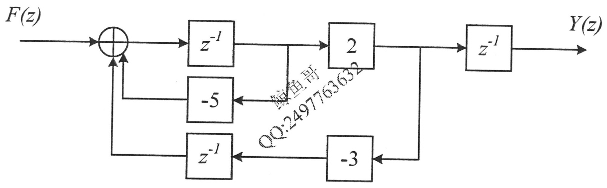

(1) 求系统转移函数 $H(z)$;

(2) 求系统单位脉冲响应 $h[n]$;

(3) 若 $x[n] = (-1)^{n} u[n]$ 时系统输出全响应 $y[n] = [(-1)^{n} - (-2)^{n}] \cdot u[n]$, 求其零状态响应分量

---

$\mathcal{V}_{zs}[n]$ ，零输入响应分量 $y_{zi}[n]$ 和初始值，并指出其中的自然响应分量 $y_{h}[n]$ 和受迫响应分量$y_{p}[n]$ ；

4）求当输入 $x[n] = 4^n$ 时的输出 $y[n]$ 。

19. 已知离散系统框图如下所示，求出：

(1)系统函数 $H(z)$

(2)差分方程

(3)求出极点并判断稳定性

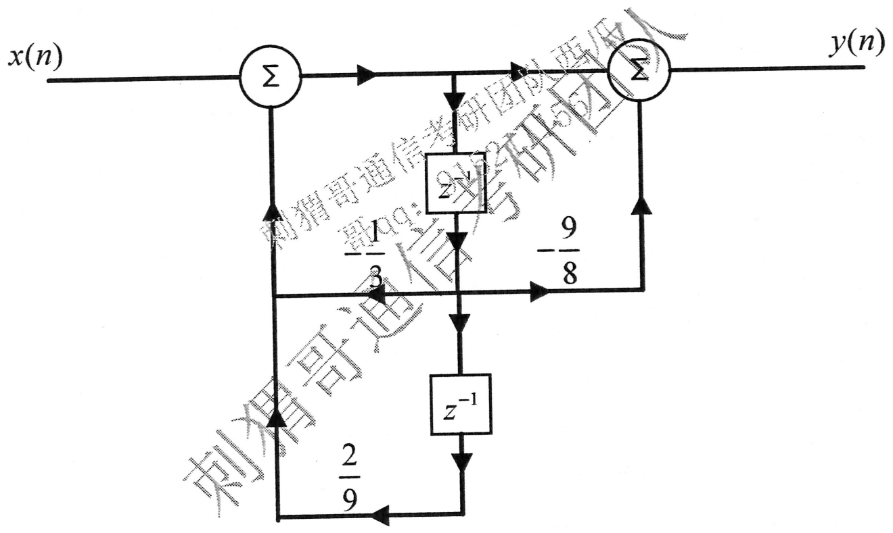

20. 已知某离散时间系统的框图如图所示:

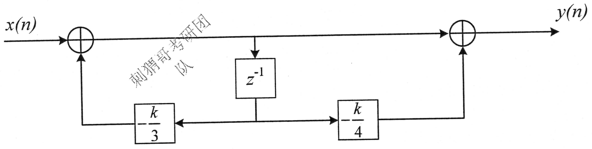

(1) 求系统函数 $H(z)$;

(2) $k$ 取何值时, 系统 $H(z)$ 稳定;

---

(3) $k = 1$ 时, 画出 $H(z)$ 的零极点图, 并求 $H(z)$ 的收敛域;

(4) $k = 1$ 时, 求系统的差分方程;

(5) 设 $x[n] = \left(\frac{2}{3}\right)^n$, 求 $y[n]$

21. 已知 $H(z)$ 满足下列条件: (刺猬哥考研团队西瓜哥 QQ:915211156)

(1) $h[n]$ 为实右边序列；（2）$H(z)$ 有且仅有一个二阶零点；（3）$H(z)$ 有一个极点为 $\frac{3}{4} e^{j\frac{\pi}{2}}$

(4) $H(1) = \frac{4}{5}$, 且 $0 < \lim_{z \to \infty} H(z) < \infty$; (5) 输入为 $x[n] = \left(\frac{1}{2}\right)^n$ 时, $y[n] = 0$ 。求:

(1) 判断系统的因果性;

(2) 判断系统的稳定性;

（3）求 $H(z)$ 及其收敛域；

22. 考查如图所示的离散时间 LTI 稳定系统; 求解下列问题:

（1）确定该系统的系统函数 $H(z)$ 及收敛域；

（2）求联系 $y(n)$ 和 $x(n)$ 的差分方程；

(3) 求系统单位脉冲响应 $h(n)$;

(4) 当系统响应 $y(n) = \left[\left(\frac{1}{3}\right)^n + \left(-\frac{2}{3}\right)^n\right] u(n)$, 求系统的输入信号 $x(n)$ 。

---

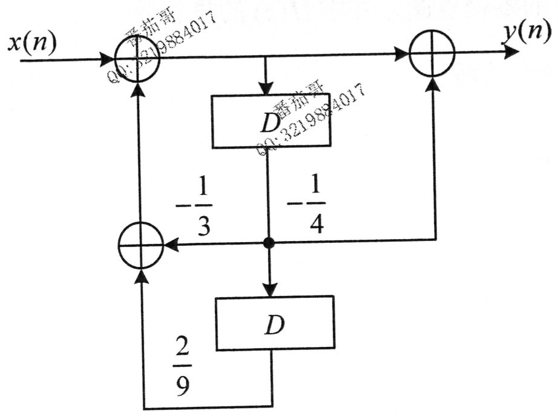

23. 已知一因果 LTI 离散时间系统的系统函数 $H(z) = \frac{6z^2}{6z^2 - z - 1}$, 输入信号 $f(n) = 4u(n)$, 初始状态 $y(-1) = 0, y(-2) = 12$, 试求以下问题:

(1) 判断系统的稳定性并说明理由;

(2) 求关联该系统输入输出的差分方程;

(3) 求系统的零输入响应、零状态响应、全响应;

(4) 求系统的自由响应、强迫响应。（刺猬哥考研团队西瓜哥QQ:915211156）

24. 已知 $X(z) = \frac{z^{-1}}{(1 - \frac{1}{2} z^{-1})(1 - 2z^{-1})}$, 求下列每种条件下的双边 $z$ 逆变换 $x(n)$ 。

（1）若 $\sum_{n = -\infty}^{+\infty}|x(n)| < +\infty$

(2) 若 $x(n)$ 是一个因果信号;

(3) 若 $x(n)$ 是一个反因果信号。

---

25. 已知一有理系统函数 $H(z)$ 的零极点如下图所示, 讨论该系统的因果性和稳定性。

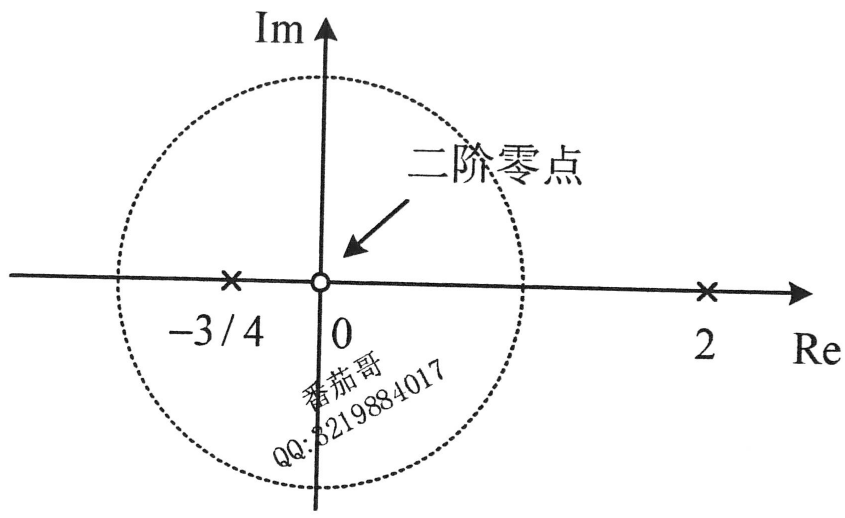

26. 已知一离散时间 LTI 系统的差分方程为 $y(n) - y(n - 1) - y(n - 2) = x(n - 1)$ 。

(1) 求该系统的系统函数 $H(z)$, 画出零极点图。

(2) 对于下列每种情况求该系统的单位序列响应 $h(n)$ 。

(1)系统是稳定的; 
(2)系统是因果的。

27. 某离散系统的差分方程为 $y[n] - \frac{1}{2} y[n - 1] + \frac{1}{4} y[n - 2] - \frac{1}{8} y[n - 3] = 2x[n] - 2x[n - 2]$, 求其级联形式的信号流图。

28. 某离散因果系统的系统函数为 $H(z) = \frac{z^2 + 2z + 3}{z^2 + z + k}$, 求当 $\mathrm{k}$ 满足什么条件时, 系统是稳定的? (刺猬哥考研团队西瓜哥 QQ:915211156)

---

29. 假设一个二阶因果线性时不变系统已经设计或具有实值单位脉冲响应 $h_{1}[n]$ 和一个有理系统函数 $H_{1}(z)$, $H_{1}(z)$ 的零-极点图如图 (a) 所示。现在要考虑另一个二阶因果系统, 其单位脉冲响应为 $h_{2}[n]$, 有理系统函数为 $H_{2}(z)$, $H_{2}(z)$ 的零-极点图如图 (b) 所示。

(1)求一个序列 $g[n]$, 使下面三个条件都得到满足: (1) $h_{2}[n] = g[n] h_{1}[n]$ (2) $g[n] = 0, n < 0$;

(3) $\sum_{k=0}^{\infty} |g[k]| = 3$;

(2) $g[n]$ 的作用是?

(3) $H_{1}(z) 、 H_{2}(z)$ 分别是什么滤波器?

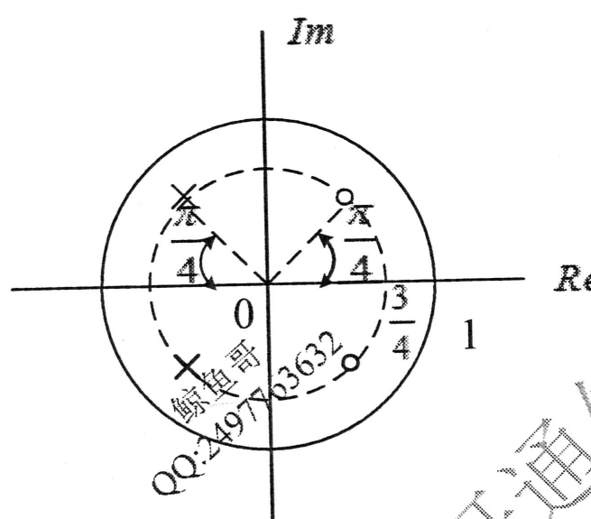

_(a)_

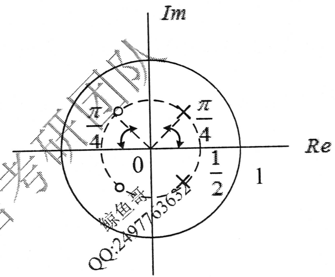

_(b)_

30. 已知因果二阶离散线性时不变系统的框图如图所示。

其中系统函数满足 $H(z)\big|_{z = 0.5} = \infty$ ，试求：

(1) 系统函数 $H(z)$ 和单位脉冲响应 $h(n)$;

(2) 输入 $x_{1}(n) = (-1)^{n} u(n)$ 时全响应为 $y(n) = 8 \left(\frac{1}{2}\right)^{n} u(n) - 6 \left(\frac{3}{4}\right)^{n} u(n)$, 求系统的零状态响应和初始条件 $y(-1), y(-2)$ 。

(刺猬哥考研团队, 西瓜哥 QQ:915211156)

---

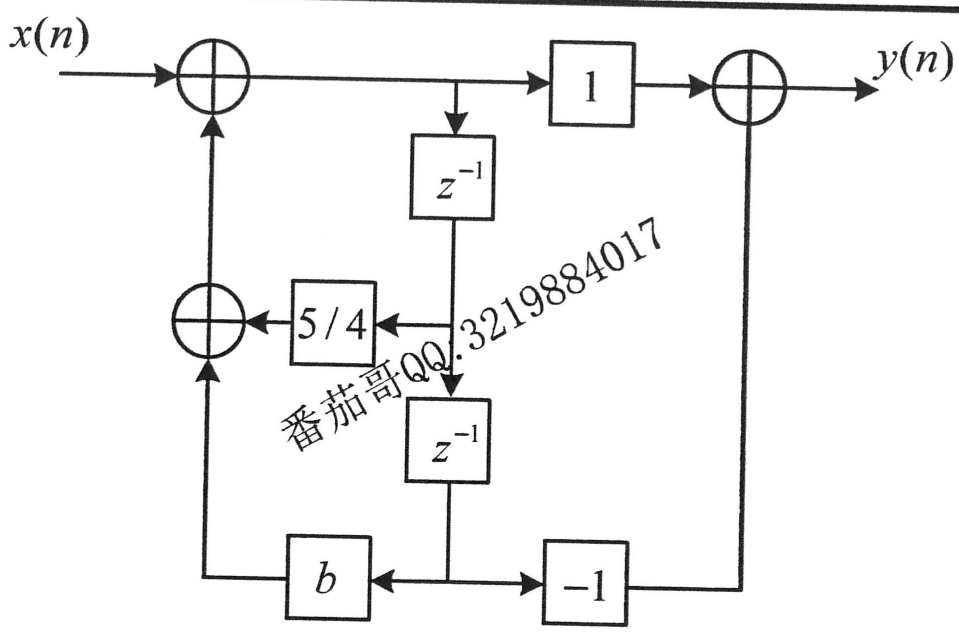

31. 已知偶序列 $x[n]$ 的 $Z$ 变换是有理函数 $X(z)$, 且 $\lim_{z \to \infty} X(z) = 1, X(z)$ 的零极点情况为: 共有两个有限极点, 其中一个为 $z = 0.5$; 一个零点为 $z = 1$, 试确定 $x[n]$ 。

32. 一因果离散线性时不变系统在某初始条件下，输入 $x(n) = (-1)^n u(n)$ 时，系统全响应为 $y(n) = 2^n u(n) + \frac{3}{5} (-3)^n u(n)$；初始条件不变，输入 $x(n) = (-1)^n u(n - 2)$，系统全响应为 $y(n) = \frac{4}{5} 2^n u(n) - \frac{1}{5} (-3)^n u(n)$。

求：（刺猬哥考研团队西瓜哥QQ:915211156）

(1) 系统单位样值响应 $h(n)$;

(2) 用加法器、延迟器和乘法器画出系统框图;

(3) 初始条件不变时的零输入响应和输入 $x(n) = (-1)^{n} u(n)$ 时的零状态响应。

---

33. 已知一个离散因果 LTI 系统由如下线性常系数差分方程来确定:

$$
y (n) - y (n - 1) - 2 y (n - 2) = x (n) + 2 x (n - 2)
$$

系统初始状态 $y(-1) = 2, y(-2) = -\frac{1}{2}$, 求: (20 分) (刺猬哥考研团队西瓜哥 QQ:915211156)

(1) 该系统的系统函数 $H(z)$, 并画出对应的零极点图;

(2) 求单位脉冲响应 $h(n)$, 并判断该系统是否稳定;

(3) 当输入 $f(n) = u(n)$ 时, 求系统的零状态响应和零输入响应;

(4) 画出该系统的直接型模拟框图。（刺猬哥考研团队，西瓜哥QQ:915211156）

---

# 序列 O 序列七详解—西瓜哥原创作答

题 1 解: C

由 $e^{x}$ 的泰勒公式展开式

$$
e ^ {x} = 1 + x + \frac {x ^ {2}}{2} + \frac {x ^ {3}}{3 !} + \dots + \frac {x ^ {n}}{n !} \text {, 又} X (z) = \sum_ {n = - \infty} ^ {\infty} x [ n ] z ^ {- n}
$$

$$
X (z) = e ^ {\frac {2}{z}} = \sum_ {n = 0} ^ {\infty} \frac {(2 z ^ {- 1}) ^ {n}}{n !} = \sum_ {n = - \infty} ^ {\infty} \frac {2 ^ {n}}{n !} u [ n ] \cdot z ^ {- n}
$$

对比可得 $x[n] = \frac{2^{n}}{n!} u[n]$ 故选 C。

(QQ915211156 西瓜哥 Tips: 此题难度★★★★☆, 须结合泰勒级数, 该类考题有点秀, 不必多练, 但有必要见过)

题2解：C

卷积和定义式为:

$$
f (n) = \sum_ {i = 0} ^ {n} (- 1) ^ {i} = \sum_ {i = - \infty} ^ {\infty} u (i) u (n - i) (- 1) ^ {i} = (- 1) ^ {n} u (n) * u (n)
$$

对其 $\mathbf{z}$ 变换有 $F(z) = \frac{z^2}{(z - 1)(z + 1)} = \frac{z^2}{z^2 - 1},|z| > 1$

(注: 此题难度★☆☆☆☆, 西瓜哥原创小结: 通过卷积定义式可知各信号, 最后在 z 变换求解) (刺猬哥考研团队西瓜哥 QQ:915211156)

题3解：D

系统函数 $H(z) = \frac{2}{1 + 5z^{-1} + 6z^{-2}} = \frac{2z^2}{z^2 + 5z + 6}$

输入信号 $F(z) = \frac{z}{z - 2}$

零状态响应 $Y_{zs}(z) = F(z)H(z) = \frac{2z^2}{z^2 + 5z + 6}\frac{z}{z - 2} = \frac{\frac{2}{5}z}{z - 2} +\frac{-2z}{z + 2} +\frac{\frac{18}{5}z}{z + 3}$

更多优质考研资讯，关注b站 | 公众号“刺猬哥通信电子考研”、知乎“刺猬哥通信考研”

---

所以 $y_{zs}(n) = \frac{2}{5} (2)^n - 2(-2)^n + \frac{18}{5} (-3)^n, n \geqslant 0$

零输入响应 $y_{zi}(n) = y(n) - y_{zs}(n) = [20(-2)^{n} - 36(-3)^{n}]u(n)$

(此题难度★☆☆☆☆, 西瓜哥原创小结: 基础题, 零输入、零状态响应求解)

题 4 解: C

(注: 此题难度★★☆☆☆, 平头哥原创小结: 基础题, 考察系统函数极点和稳定性的关系, 系统稳定则收敛域包含单位圆, 此题有前提条件因果, 因此收敛域位于最外侧极点所在圆的外侧, 极点需在单位圆内。)

题 5 解: B (刺猬哥考研团队西瓜哥 QQ:915211156)

$ X(z) = \frac{z^2}{z^2 - 1.5z + 0.5} = \frac{1}{1 - 1.5z^{-1} + 0.5z^{-2}} = \frac{1}{(1 - 0.5z^{-1})(1 - z^{-1})} = \frac{2}{1 - z^{-1}} - \frac{1}{1 - 0.5z^{-1}} $

敛域 $|z| > 1$, 可得 $x(n) = (2 - 0.5^{n})u(n)$

(此题难度★☆☆☆☆, 西瓜哥原创小结: 基础题, 此题只需将 $X(z)$ 化简再根据收敛域进行变换即可。)

题 6 解: D

ABC 说法均正确; D 选项错误。

通过零点的位置, 无法判断所对应的响应序列为衰减的, 例如 $H(z) = \frac{z}{z - 2}$

(注: 此题难度★★☆☆☆, 西瓜哥原创小结: 基础题, 错误的说法, 举出反例即可) (说明。)(刺猬哥考研团队西瓜哥 QQ:915211156)

题 7 解: 单位圆内部, 虚轴 (西瓜哥 QQ915211156)

已知复变量 $s$ 与 $z$ 的关系是

(1) $\left\{ \begin{array}{l} z = e^{sT} \\ s = \frac{1}{T} \ln z \end{array} \right.$, 其中 $T$ 为取样周期。

更多优质考研资讯，关注b站 | 公众号“刺猬哥通信电子考研”、知乎“刺猬哥通信考研”

---

将 $s$ 表示为直角坐标系形式, 有 $s = \sigma + j\omega$, 将 $z$ 表示为极坐标形式 $z = \rho e^{j\theta}$

代入（1）中可得 $\rho = e^{\sigma T}, \theta = \omega T$

可以看出: $s$ 平面的左半平面 $(\sigma < 0)$ 映射到 $z$ 平面的单位圆内部 $(|z| = \rho < 1)$;

$s$ 平面的右半平面 $(\sigma > 0)$ 映射到 $z$ 平面的单位圆外部 $\left|z\right| = \rho >1$;

$s$ 平面 $j \omega$ 轴 $(\sigma = 0)$ 映射到 $z$ 平面的单位圆 $\left|z\right| = \rho = 1$

(注: 此题难度★☆☆☆☆, 西瓜哥原创小结: 基础题, 考查 S 平面和 z 平面的对应关系。)

题 8 解: $\frac{2 z^{-1}}{1 - 4 z^{-2}}$

$$
x [ n ] = \sum_ {l = 0} ^ {n - 1} (- 1) ^ {l} u [ l ]
$$

则 $x[n + 1] - x[n] = (-1)^{n} u[n]$, 两边 $Z$ 变换, 得

$$
(z - 1) X (z) = \frac {1}{1 + z ^ {- 1}} \Rightarrow X (z) = \frac {z ^ {- 1}}{1 - z ^ {- 2}}
$$

$$
a ^ {n} x [ n ] \xleftarrow {z} X (\frac {z}{a}) = \frac {2 z ^ {- 1}}{1 - 4 z ^ {- 2}}
$$

题 9 解: $\delta [n - 1], z ^{-1}, | z | > 0$ (刺猬哥考研团队西瓜哥 QQ:915211156)

1) 冲激序列的抽样性, 原式 $= \cos \left[\frac{\pi}{2}\left(n^{2} - 2 n + 1\right)\right]^{2} \Bigg|_{n = 1} \cdot \delta [n - 1] = \cos 0 \delta [n - 1] = \delta [n - 1]$

2）由 $Z$ 变换的性质 $f[n \pm m] \xleftarrow{z} z^{\pm m} F(z)$ 即可得到.

3) $\delta [n - 1] \xleftarrow{z} \sum_{n = -\infty}^{\infty} \delta [n - 1] z^{-n}$ 级数收敛的充分条件是

$\sum_{n = -\infty}^{\infty}|\delta [n - 1]z^{-n}| = \frac{1}{z}\delta [n - 1]$ 收敛，故 $z\neq 0$ ，即 $|z| > 0$ ：

---

（西瓜哥 Tips: 此题难度 $\star \star \star \star \star \star$, 送分题）

题 10 解: 6

由特征函数法: $x(n) = 3 = 3(1)^{n} \longrightarrow y(n) = 3(1)^{n} H(1) = 6$

（QQ915211156 西瓜哥 Tips: 此题难度★★☆☆☆, 关于连续以及离散的特征函数法 R 序列均有详细总结。）（刺猬哥考研团队西瓜哥 QQ:915211156）

题11解：1

根据初值定理 $ f(0) = \lim_{z\to +\infty}\frac{z^2 + z + 1}{(z - 1)(z + \frac{1}{2})} = 1 $

(QQ915211156 西瓜哥 Tips: 此题难度★☆☆☆☆, 考查初值定理。)

题12解： $\frac{z(z^2 - 1)}{(z^2 + 1)^2}$

$$
\begin{array}{l} \sin \left(\frac {k \pi}{2}\right) u (k) = \frac {1}{2 j} \left(e ^ {j \frac {k \pi}{2}} - e ^ {- j \frac {k \pi}{2}}\right) u (k) = \frac {1}{2 j} \left[ (j) ^ {k} - (- j) ^ {k} \right] u (k) \quad (\text {也 可 直 接 记 公 式}) \\ \leftarrow \frac {z}{2 j} \left(\frac {z}{z - j} - \frac {z}{z + j}\right) = \frac {z}{z ^ {2} + 1}, | z | > | j | = 1 \\ \end{array}
$$

根据 $z$ 域微分特性得: $k \sin \left(\frac{k \pi}{2}\right) \varepsilon(k) \leftrightarrow -z \frac{\mathrm{d}}{\mathrm{d} z} \left(\frac{z}{z^{2} + 1}\right) = \frac{z(z^{2} - 1)}{(z^{2} + 1)^{2}}, |z| > 1$

(QQ915211156 西瓜哥 Tips: 此题难度★★☆☆☆, 起步就是欧拉公式。小技巧: $e^{j \frac{k \pi}{2}} = (e^{j \frac{\pi}{2}})^{k} = (j)^{k}$, 课程中有专题讲解) (刺猬哥考研团队西瓜哥 QQ:915211156)

题 13 解:

由 $z$ 变换定义可知:

(1) $x(n) = \left(\frac{1}{2}\right)^n u(n) + 3^n u(n)$

更多优质考研资讯，关注b站 | 公众号“刺猬哥通信电子考研”、知乎“刺猬哥通信考研”

---

$$
X (z) = \sum_ {n = - \infty} ^ {+ \infty} x (n) z ^ {- n} = \sum_ {n = 0} ^ {+ \infty} (\frac {1}{2}) ^ {n} z ^ {- n} + \sum_ {n = 0} ^ {+ \infty} 3 ^ {n} z ^ {- n} = \sum_ {n = 0} ^ {+ \infty} (\frac {1}{2 z}) ^ {n} + \sum_ {n = 0} ^ {+ \infty} (\frac {3}{z}) ^ {n}
$$

只有当 $\left\{ \begin{array}{l} \frac{1}{2z} < 1 \\ \frac{3}{z} < 1 \end{array} \right. \Rightarrow |z| > 3$ 时，$X(z)$ 才存在，且为

$$
X (z) = \frac {z}{z - \frac {1}{2}} + \frac {z}{z - 3} = \frac {z \left(2 z - \frac {7}{2}\right)}{\left(z - \frac {1}{2}\right) (z - 3)}, | z | > 3
$$

其中零点为 $0, \frac{7}{4}$, 极点为 $\frac{1}{2}, 3$ (刺猬哥考研团队西瓜哥 QQ:915211156)

(2) $x(n) = \left(\frac{1}{3}\right)^n u(n) - 2^n u(-n - 1)$

$$
X (z) = \sum_ {n = - \infty} ^ {+ \infty} x (n) z ^ {- n} = \sum_ {n = 0} ^ {+ \infty} (\frac {1}{3}) ^ {n} z ^ {- n} - \sum_ {n = - \infty} ^ {- 1} 2 ^ {n} z ^ {- n} = \sum_ {n = 0} ^ {+ \infty} (\frac {1}{3 z}) ^ {n} - \sum_ {n = - \infty} ^ {- 1} (\frac {2}{z}) ^ {n} = \sum_ {n = 0} ^ {+ \infty} (\frac {1}{3 z}) ^ {n} - \sum_ {n = 1} ^ {+ \infty} (\frac {z}{2}) ^ {n}
$$

只有当 $\left\{ \begin{array}{l} \frac{1}{3z} < 1 \\ \left| \frac{z}{2} \right| < 1 \end{array} \Rightarrow \frac{1}{3} < |z| < 2 \right.$ 时，$X(z)$ 才存在，且为

$$
X (z) = \frac {z}{z - \frac {1}{3}} + \frac {z}{z - 2} = \frac {z (2 z - \frac {7}{3})}{(z - \frac {1}{3}) (z - 2)}, \frac {1}{3} <   | z | <   2
$$

其中零点为 $0, \frac{7}{6}$, 极点为 $\frac{1}{3}, 2$ (刺猬哥考研团队西瓜哥 QQ:915211156)

(3) $x(n) = 3^{n} u(-n - 1) + 4^{n} u(-n - 1)$

$$
X (z) = \sum_ {n = - \infty} ^ {+ \infty} x (n) z ^ {- n} = \sum_ {n = - \infty} ^ {- 1} 3 ^ {n} z ^ {- n} + \sum_ {n = - \infty} ^ {- 1} 4 ^ {n} z ^ {- n} = \sum_ {n = 1} ^ {+ \infty} (\frac {z}{3}) ^ {n} + \sum_ {n = 1} ^ {+ \infty} (\frac {z}{4}) ^ {n}
$$

只有当 $\left\{ \begin{array}{l} \frac{z}{3} < 1 \\ \frac{z}{4} < 1 \end{array} \right. \Rightarrow |z| < 3$ 时，$X(z)$ 才存在，且为

---

$$
X (z) = - \frac {z}{z - 3} - \frac {z}{z - 4} = \frac {z (7 - 2 z)}{(z - 3) (z - 4)}, | z | <   3
$$

其中零点为 $0, \frac{7}{2}$, 极点为 3, 4 (刺猬哥考研团队西瓜哥 QQ:915211156)

(4) $x(n) = u(n + 2) - u(n - 3)$

$$
X (z) = \sum_ {n = - \infty} ^ {+ \infty} x (n) z ^ {- n} = \sum_ {n = - 2} ^ {2} z ^ {- n} = z ^ {2} + z + 1 + z ^ {- 1} + z ^ {- 2}
$$

只有当 $0 < |z| < +\infty$ 时，$X(z)$ 才存在，且为

$$
X (z) = \frac {z ^ {2} \left(1 - z ^ {- 5}\right)}{1 - z ^ {- 1}} = \frac {z ^ {5} - 1}{z ^ {2} (z - 1)}, 0 <   | z | <   + \infty
$$

令 $z^5 - 1 = 0 \Rightarrow z^5 = 1 = e^{j2\pi k}$; 可得零点 $z = e^{j\frac{2\pi}{5}k}, k = 0,1,2,3,4$ (蒋刚毅 P262 页, 例 7-7)

令 $z^2 (z - 1) = 0$ ；可得极点 $z = 0$ ，（二阶极点）； $z = 1$

其中在 $z = 1$ 处的零极点会抵消。

(5) $x(n) = \delta (n - 3)$

$$
X (z) = \sum_ {n = - \infty} ^ {+ \infty} x (n) z ^ {- n} = \sum_ {n = - \infty} ^ {+ \infty} \delta (n - 3) z ^ {- n} = z ^ {- 3} \sum_ {n = - \infty} ^ {+ \infty} \delta (n - 3)
$$

只有当 $|z| > 0$ 时, $X(z)$ 才存在, 且为

$$
X (z) = z ^ {- 3}, | z | > 0
$$

其中没有零点，极点为 $z = 0$（三阶极点）

(注: 此题难度★☆☆☆☆, 西瓜哥原创小结: 基础题, 此题建议都使用 $z$ 变换定义,加深对定义的理解; 对于连续的时间有限信号, 其拉氏变换的收敛域是整个 $s$ 平面;对于离散的时间有限信号, 其 $z$ 变换的收敛域是整个 $z$ 平面 (可能除去 $z = 0, z = +\infty$,注意和连续情况的区别)。) (刺猬哥考研团队西瓜哥 QQ:915211156)

题 14 解:

由题意: (刺猬哥考研团队西瓜哥 QQ:915211156)

更多优质考研资讯，关注b站 | 公众号“刺猬哥通信电子考研”、知乎“刺猬哥通信考研”

---

(1) $x(n) = (n - 3)2^{n}u(n - 2) = 4 \cdot (n - 2)2^{n - 2}u(n - 2) - 4 \cdot 2^{n - 2}u(n - 2)$

已知 $2^{n} u(n) \xleftarrow{z} \frac{z}{z-2}$

根据时移性质: $2^{n - 2} u(n - 2) \xleftarrow{z} \frac{z}{z - 2} \cdot z^{-2} = \frac{z^{-1}}{z - 2}$

根据频域微分性质: $n \cdot 2^{n} u(n) \xleftarrow{z} \frac{2 z}{(z - 2)^{2}}$

再根据时移性质: $(n - 2) 2^{n - 2} u(n - 2) \xleftarrow{z} \frac{2 z}{(z - 2)^{2}} \cdot z^{-2} = \frac{2 z^{-1}}{(z - 2)^{2}}$

故 $X(z) = \frac{8z^{-1}}{(z - 2)^2} -\frac{4z^{-1}}{z - 2} = \frac{16 - 4z}{z(z - 2)^2},|z| > 2$

(2) $x(n) = \left(\frac{1}{2}\right)^{n + 2} u(n - 2) = \frac{1}{16} \left(\frac{1}{2}\right)^{n - 2} u(n - 2)$

已知 $\left(\frac{1}{2}\right)^n u(n) \xleftarrow{z} \frac{z}{z - \frac{1}{2}}$

根据时移性质: $\left(\frac{1}{2}\right)^{n - 2} u(n - 2) \xleftarrow{z} \frac{z}{z - \frac{1}{2}} \cdot z^{-2} = \frac{z^{-1}}{z - \frac{1}{2}}$

故 $X(z) = \frac{1}{16}\frac{z^{-1}}{z - \frac{1}{2}} = \frac{1}{16z\left(z - \frac{1}{2}\right)}$ ， $|z| > \frac{1}{2}$

(3) $x(n) = (-1)^{n}[u(n) - u(n - 6)]$

已知 $u(n) \xleftarrow{z} \frac{z}{z - 1}$ （刺猬哥考研团队西瓜哥QQ:915211156）

根据尺度变换性质: $(-1)^{n} u(n) \xleftarrow{z} \frac{-z}{-z - 1} = \frac{z}{z + 1}$

根据时移性质: $u(n - 6) \xleftarrow{z} \frac{z}{z - 1} \cdot z^{-6} = \frac{z^{-5}}{z - 1}$

根据尺度变换性质: $(-1)^{n} u(n - 6) \xleftarrow{z} \frac{-z^{-5}}{-z - 1} = \frac{z^{-5}}{z + 1}$

---

故 $X(z) = \frac{z}{z + 1} -\frac{z^{-5}}{z + 1} = \frac{z^6 - 1}{z^5(z + 1)},|z| > 0$

(4) $x(n) = \sin [\Omega_0(n - 3)]u(n - 3)$

已知 $\sin (\Omega_0n)u(n)\xleftarrow{z}\frac{z\sin\Omega_0}{z^2-2z\cos\Omega_0+1}$

根据时移性质: $X(z) = \frac{\sin \Omega_0}{z^2 (z^2 - 2z \cos \Omega_0 + 1)}$, $|z| > 1$

(5) $x(n) = \delta (2n)$ （刺猬哥考研团队西瓜哥QQ:915211156）

$x(n) = \delta (2n) = \delta (n)\longleftrightarrow X(z) = 1$ ，收敛域是整个 $z$ 平面

(离散的冲激序列没有尺度变换性质: $\delta (2 n) \neq \frac{1}{2} \delta (n)$)

(6) $x(n) = \left(\frac{1}{3}\right)^{3n - 1} \delta (n - 1)$

$$
x (n) = \left(\frac {1}{3}\right) ^ {3 n - 1} \delta (n - 1) = \frac {1}{9} \delta (n - 1) \xleftrightarrow {z} X (z) = \frac {1}{9} z ^ {- 1}, | z | > 0
$$

(7) $x(n) = e^{n} \cos \left(\frac{\pi}{4} n\right) u(n)$ （刺猬哥考研团队西瓜哥QQ:915211156）

$$
x (n) = e ^ {n} \cos (\frac {\pi}{4} n) u (n) \xleftarrow {z} X (z) = \frac {z ^ {2} - e \cos (\frac {\pi}{4}) z}{z ^ {2} - 2 e \cos (\frac {\pi}{4}) z + e ^ {2}} = \frac {z ^ {2} - \frac {\sqrt {2}}{2} e z}{z ^ {2} - \sqrt {2} e z + e ^ {2}}, | z | > e
$$

(8) $x(n) = \sum_{k=0}^{n}[u(k) - u(k-4)]$

$$
x (n) = \sum_ {k = 0} ^ {n} [ u (k) - u (k - 4) ] = \sum_ {k = - \infty} ^ {+ \infty} [ u (k) - u (k - 4) ] u (n - k) = [ u (n) - u (n - 4) ] * u (n)
$$

其中 $u(n) - u(n - 4) = \frac{z}{z - 1} -\frac{z^{-3}}{z - 1} = \frac{z - z^{-3}}{z - 1} = \frac{z^4 - 1}{z^3(z - 1)}$ ， $u(n)\xleftarrow{z}\frac{z}{z - 1}$

故 $x(n)\xleftarrow{z} X(z) = \frac{z^4 - 1}{z^3(z - 1)}\cdot \frac{z}{z - 1} = \frac{z^4 - 1}{z^2(z - 1)^2},|z| > 1$

(9) $x(n) = \sum_{k=0}^{n} k\left(\frac{1}{3}\right)^{k}$ （刺猬哥考研团队西瓜哥QQ:915211156）

更多优质考研资讯，关注b站 | 公众号“刺猬哥通信电子考研”、知乎“刺猬哥通信考研”

---

$$
x (n) = \sum_ {k = 0} ^ {n} k (\frac {1}{3}) ^ {k} = \sum_ {k = - \infty} ^ {+ \infty} k (\frac {1}{3}) ^ {k} u (k) u (n - k) = n (\frac {1}{3}) ^ {n} u (n) * u (n)
$$

已知 $\left(\frac{1}{3}\right)^n u(n) \xleftarrow{z} \frac{z}{z - \frac{1}{3}}$

根据频域微分性质: $n\left(\frac{1}{3}\right)^{n} u(n) \xleftarrow{z} \frac{1}{3} \frac{z}{\left(z - \frac{1}{3}\right)^{2}}$

故 $x(n)\xleftarrow{z} X(z) = \frac{1}{3}\frac{z}{(z - \frac{1}{3})^2}\cdot \frac{z}{z - 1} = \frac{1}{3}\frac{z^2}{(z - \frac{1}{3})^2(z - 1)}$ ， $|z| > 1$

(10) $x(n) = \left\{ \begin{array}{l} \left(\frac{1}{2}\right)^{n / 2}, n = 0, 2, 4, 6 \dots \\ 0, \text{else} \end{array} \right.$

已知 $\left(\frac{1}{2}\right)^n u(n) \xleftarrow{z} \frac{z}{z - \frac{1}{2}}$

根据时域扩展性质:

$x_{(2)}(n) = \left\{ \begin{array}{l} (\frac{1}{2})^{n / 2}, n = 2r \\ 0, n \neq 2r \end{array} \right.$, 可得 $X(z) = \frac{z^2}{z^2 - \frac{1}{2}}$, $|z| > \frac{\sqrt{2}}{2}$.

(11) $x(n) = (-1)^{n} n(-2)^{n} u(\bar{n})$ (刺猬哥考研团队西瓜哥 QQ:915211156)

已知 $(-2)^{n} u(n) \xleftarrow{z} \frac{z}{z + 2}$

根据频域微分性质: $n(-2)^{n} u(n) \xleftarrow{z} \frac{-2 z}{(z + 2)^{2}}$

根据尺度变换性质: $x(n) = (-1)^{n} n(-2)^{n} u(n) \xleftarrow{z} X(z) = \frac{2 z}{(-z + 2)^{2}} = \frac{2 z}{(z - 2)^{2}}, |z| > 2$

(12) $x(n) = \left(\frac{1}{2}\right)^{n + 2} u(n + 2)$ （刺猬哥考研团队西瓜哥QQ:915211156）

错误解法示范：（未注意题目求单边 $z$ 变换）

已知 $\left(\frac{1}{2}\right)^n u(n) \xleftarrow{z} \frac{z}{z - \frac{1}{2}}$

---

根据时移性质： $x(n) = (\frac{1}{2})^{n + 2}u(n + 2)\xleftarrow{z}\rightarrow X(z) = \frac{z^3}{z - \frac{1}{2}},\mid z\mid >\frac{1}{2}$

正确解法：（最后结果可利用定义验证）

$x(n) = \left(\frac{1}{2}\right)^{n + 2} u(n + 2)$ 与 $\left(\frac{1}{2}\right)^{n + 2} u(n)$ 单边 $z$ 结果一样

已知 $\left(\frac{1}{2}\right)^n u(n) \xleftarrow{z} \frac{z}{z - \frac{1}{2}}$

故 $x(n) = \left(\frac{1}{2}\right)^{n + 2}u(n + 2)\longleftrightarrow X(z) = \frac{1}{4}\frac{z}{z - \frac{1}{2}},\mid z\mid >\frac{1}{2}$

(注: 此题难度★★☆☆☆, 西瓜哥原创小结: 基础题, 考查常见 $z$ 变换对及其性质。)

题 15 解:

由题意：（刺猬哥考研团队西瓜哥QQ:915211156）

(1) $X(z) = \frac{2z^2}{(z - 1)(z - \frac{1}{2})}$

$$
x (0) = \lim  _ {z \rightarrow \infty} X (z) = 2
$$

$$
\lim  _ {n \rightarrow + \infty} x (n) = \lim  _ {z \rightarrow 1} (z - 1) X (z) = 4
$$

(2) $X(z) = \frac{z}{z^2 + z + 1}$

$$
x (0) = \lim  _ {z \rightarrow \infty} X (z) = 0
$$

由于 $X(z)$ 在单位圆有共轭极点 $\frac{-1 \pm \sqrt{3} j}{2}$, 故没有终值;

(3) $X(z) = \frac{3z^2(z - 2)}{(z - \frac{1}{5})(z - 1)^2}$

$$
x (0) = \lim  _ {z \rightarrow \infty} X (z) = 3
$$

更多优质考研资讯，关注b站 | 公众号“刺猬哥通信电子考研”、知乎“刺猬哥通信考研”

---

由于 $X(z)$ 在 $z = 1$ 有二阶极点，故没有终值；

(4) $X(z) = \frac{z}{\left(z - \frac{1}{2}\right)^{2}}$

$$
x (0) = \lim  _ {z \rightarrow \infty} X (z) = 0
$$

$\lim_{n \to +\infty} x(n) = \lim_{z \to 1} (z - 1) X(z) = 0$ （刺猬哥考研团队西瓜哥QQ:915211156）

(5) $X(z) = \frac{z^{3} + z^{2} + 2z}{z^{3} - 1}$

$$
x (0) = \lim  _ {z \rightarrow \infty} X (z) = 1
$$

令 $z^3 - 1 = 0 \Rightarrow z^3 = e^{j2\pi k} \Rightarrow z = e^{j\frac{2\pi}{3} k}, k = 0,1,2$

由于 $X(z)$ 在单位圆有共轭极点 $\frac{-1 \pm \sqrt{3} j}{2}$, 故没有终值;

(6) $X(z) = \frac{z^2 - z}{z^2 - \frac{1}{2}z + \frac{1}{4}}$

$$
x (0) = \lim  _ {z \rightarrow \infty} X (z) = 1
$$

$\lim_{n \to +\infty} x(n) = \lim_{z \to 1} (z - 1) X(z) = 0$ （刺猬哥考研团队西瓜哥QQ:915211156）

(注: 此题难度★☆☆☆★, 西瓜哥原创小结: 基础题, 考查离散信号的初值和终值定理; 前提信号是因果信号, 初值定理使用方法: ①不需要判断式子是否为真分式 (区别于连续的情况); ②直接对 $X(z)$ 套用公式 $x(0) = \lim_{z \to \infty} X(z)$; 终值定理使用方法: ①判断式子的极点位置; ②若式子极点均在单位圆内以及在 $z = 1$ 处有一阶极点, 则可使用终值定理 $\lim_{n \to +\infty} x(n) = \lim_{z \to 1} (z - 1) X(z)$ 公式求解, 反之则没有终值。)

题 16 解:

由题意:

(1) $X(z) = \frac{z\left(z + \frac{1}{2}\right)}{z^{2} - \frac{3}{2}z + \frac{1}{2}}$

---

$$
X (z) = \frac {z \left(z + \frac {1}{2}\right)}{z ^ {2} - \frac {3}{2} z + \frac {1}{2}} = \frac {z \left(z + \frac {1}{2}\right)}{\left(z - \frac {1}{2}\right) (z - 1)} = \frac {3 z}{z - 1} - \frac {2 z}{z - \frac {1}{2}}
$$

$ X(z) \xleftarrow{z} x(n) = 3u(n) - 2\left(\frac{1}{2}\right)^n u(n) $ （刺猬哥考研团队西瓜哥QQ:915211156）

(2) $X(z) = \frac{z^2 - 2z}{z^2 - z + 1}$

$$
X (z) = \frac {z ^ {2} - 2 z}{z ^ {2} - z + 1} = \frac {z ^ {2} - z \cos (\frac {\pi}{3}) - \sqrt {3} z \sin (\frac {\pi}{3})}{z ^ {2} - 2 z \cos (\frac {\pi}{3}) + 1}
$$

$$
X (z) \xleftarrow {z} x (n) = [ \cos (\frac {\pi}{3} n) - \sqrt {3} \sin (\frac {\pi}{3} n) ] u (n)
$$

(3) $X(z) = \frac{z^2 - \frac{\sqrt{2}}{4}z}{z^2 - \frac{\sqrt{2}}{2}z + \frac{1}{4}}$

$$
X (z) = \frac {z ^ {2} - \frac {\sqrt {2}}{4} z}{z ^ {2} - \frac {\sqrt {2}}{2} z + \frac {1}{4}} = \frac {z ^ {2} - \frac {1}{2} z \cos (\frac {\pi}{4})}{z ^ {2} - 2 \cdot \frac {1}{2} \cos (\frac {\pi}{4}) z + \frac {1}{4}}
$$

$
X(z) \xleftarrow{z} x(n) = \left(\frac{1}{2}\right)^n \cos \left(\frac{\pi}{3} n\right) u(n) \quad (\text{刺猬哥考研团队西瓜哥QQ:915211156})
$

(4) $X(z) = \frac{2z^3}{(z + \frac{1}{2})(z - \frac{2}{5})^2}$

$$
X (z) = \frac {2 z ^ {3}}{(z + \frac {1}{2}) (z - \frac {2}{5}) ^ {2}} = \frac {5 0}{8 1} \frac {z}{z + \frac {1}{2}} + \frac {1 1 2}{8 1} \frac {z}{z - \frac {2}{5}} + \frac {1 6}{4 5} \frac {z}{(z - \frac {2}{5}) ^ {2}}
$$

$$
X (z) \xleftarrow {z} x (n) = \frac {5 0}{8 1} (- \frac {1}{2}) ^ {n} u (n) + \frac {1 1 2}{8 1} (\frac {2}{5}) ^ {n} u (n) + \frac {8}{9} n (\frac {2}{5}) ^ {n} u (n)
$$

(5) $X(z) = \frac{1}{z - \frac{1}{2}}$

---

$ X(z) \xleftarrow{z} x(n) = \left(\frac{1}{2}\right)^{n-1} u(n-1) $ （刺猬哥考研团队西瓜哥QQ:915211156）

(6) $X(z) = \frac{(z - 1)^{2}}{z^{3}}$

$$
X (z) = \frac {(z - 1) ^ {2}}{z ^ {3}} = \frac {1}{z} - 2 \frac {1}{z ^ {2}} + \frac {1}{z ^ {3}}
$$

$$
X (z) \xleftarrow {z} x (n) = \delta (n - 1) - 2 \delta (n - 2) + \delta (n - 3)
$$

(7) $X(z) = \frac{z}{z^2 - z + \frac{1}{2}}$

$$
X (z) = \frac {z}{z ^ {2} - z + \frac {1}{2}} = 2 \cdot \frac {\frac {\sqrt {2}}{2} z \sin (\frac {\pi}{4})}{z ^ {2} - 2 \cdot \frac {\sqrt {2}}{2} z \cos (\frac {\pi}{4}) + (\frac {\sqrt {2}}{2}) ^ {2}}
$$

$ X(z) \xleftarrow{z} x(n) = 2\left(\frac{\sqrt{2}}{2}\right)^n \sin \left(\frac{\pi}{4} n\right) u(n) $ （刺猬哥考研团队西瓜哥QQ:915211156）

(8) $X(z) = \frac{z^2}{z^2 - 1}$

$$
X (z) = \frac {z ^ {2}}{z ^ {2} - 1} = \frac {1}{2} \frac {z}{z - 1} + \frac {1}{2} \frac {z}{z + 1}
$$

$$
X (z) \xleftarrow {z} x (n) = \frac {1}{2} u (n) + \frac {1}{2} (- 1) ^ {n} u (n)
$$

(9) $X(z) = \ln \left(1 - \frac{1}{4} z^{-1}\right)$

法一：

已知泰勒级数 $\ln (1 + x) = \sum_{n=1}^{+\infty} \frac{(-1)^{n-1} x^n}{n}$

则 $\ln (1 - \frac{1}{4} z^{-1}) = \sum_{n=1}^{+\infty} \frac{(-1)^{n-1} (-\frac{1}{4} z^{-1})^n}{n} = -\sum_{n=1}^{+\infty} \frac{(\frac{1}{4})^n (z)^{-n}}{n} = -\sum_{n=-\infty}^{+\infty} \frac{(\frac{1}{4})^n u(n-1) (z)^{-n}}{n}$

---

由根据 $Z$ 变换定义式 $X(z) = \sum_{n = -\infty}^{+\infty}x(n)z^{-n}$

故 $x(n) = -\frac{1}{n}\left(\frac{1}{4}\right)^n u(n - 1)$

法二：（刺猬哥考研团队西瓜哥QQ:915211156）

$$
x (n) \xleftarrow {z} X (z) = \ln \left(1 - \frac {1}{4} z ^ {- 1}\right)
$$

$$
n x (n) \xleftarrow {z} - z \frac {d X (z)}{d z} = \frac {1}{1 - 4 z}
$$

$$
\frac {1}{1 - 4 z} = - \frac {1}{4} \frac {1}{z - \frac {1}{4}} \xleftarrow {z} - \frac {1}{4} \left(\frac {1}{4}\right) ^ {n - 1} u (- n - 1)
$$

故 $x(n) = -\frac{1}{n} \left(\frac{1}{4}\right)^n u(n - 1)$

(10) $X(z) = \frac{1}{1 - 2^{-5} z^{-4}}$ (刺猬哥考研团队西瓜哥 QQ:915211156)

已知 $\frac{1}{1 - z^{-4}} = 1 + z^{-4} + z^{-8} + \ldots \xleftarrow{z} \sum_{k=0}^{+\infty} \delta(n - 4k)$

根据尺度变换性质： $(2^{\frac{5}{4}})^n\sum_{k = 0}^{+\infty}\delta (n - 4k)\xleftarrow{z}\frac{1}{1 - (\frac{z}{\frac{5}{4}})^{-4}} = \frac{1}{1 - 2^{-5}z^{-4}}$

因此 $X(z) = (2^{-\frac{5}{4}})^n \sum_{k=0}^{+\infty} \delta(n - 4k) = \sum_{k=0}^{+\infty} (2^{-\frac{5}{4}})^{4k} \delta(n - 4k) = \sum_{k=0}^{+\infty} 2^{-5k} \delta(n - 4k)$

(11) $X(z) = \frac{1 - 3z^{-1}}{1 - z^{-2}}$

$$
X (z) = \frac {1 - 3 z ^ {- 1}}{1 - z ^ {- 2}} = \frac {z ^ {2} - 3 z}{(z - 1) (z + 1)} = \frac {2 z}{z + 1} - \frac {z}{z - 1}
$$

$X(z) \xleftarrow{z} x(n) = 2(-1)^{n} u(n) - u(n)$ （刺猬哥考研团队西瓜哥QQ:915211156）

(12) $X(z) = \frac{1 - 3z^{-1}}{1 + z^{-2}}$

更多优质考研资讯，关注b站 | 公众号“刺猬哥通信电子考研”、知乎“刺猬哥通信考研”

---

$$
X (z) = \frac {1 - 3 z ^ {- 1}}{1 + z ^ {- 2}} = \frac {z ^ {2} - 3 z}{z ^ {2} + 1} = \frac {z ^ {2}}{z ^ {2} + 1} - 3 \frac {z}{z ^ {2} + 1}
$$

$$
X (z) \xleftarrow {z} x (n) = \cos (\frac {\pi}{2} n) u (n) - 3 \sin (\frac {\pi}{2} n) u (n)
$$

(注: 此题难度★★☆☆☆, 西瓜哥原创小结: 基础题, 考查 $z$ 逆变换, 大家要熟记常见的 $z$ 变换对以及其性质, 掌握用待定系数法将分式展开, 方便作逆变换。)

题 17 解:

1) $H(z) = \frac{z^{-1} - 2z^{-2}}{1 - 0.5z^{-1}} = \frac{z - 2}{z(z - 0.5)}$, 零点: $z_{1} = 2$, 极点: $z_{2} = 0, z_{3} = 0.5$, 零极点分布图如下: (刺猬哥考研团队西瓜哥 QQ:915211156)

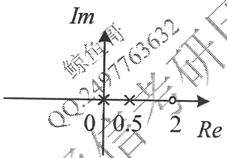

(2) 由收敛域为 $|z| > 0.5$ ，包含单位圆，故系统稳定。

存在傅里叶变换 $H(e^{j\omega}) = \frac{e^{j\omega} - 2}{e^{j2\omega} - 0.5e^{j\omega}} = \frac{\cos\omega - 2 + j\sin\omega}{\cos 2\omega - 0.5\cos\omega + j(\sin 2\omega - 0.5\sin\omega)}$

辐频响应为

$$
\begin{array}{l} | H (e ^ {j \omega}) | = \frac {\sqrt {(\cos \omega - 2) ^ {2} + \sin^ {2} \omega}}{\sqrt {(\cos 2 \omega - 0 . 5 \cos \omega) ^ {2} + (\sin 2 \omega - 0 . 5 \sin \omega) ^ {2}}} \\ = \frac {\sqrt {5 - 4 \cos \omega}}{\sqrt {\frac {5}{4} - \cos \omega}} \\ = 2 \\ \end{array}
$$

幅频响应为常数，故系统是全通系统。

(3) 利用长除法, $H(z) = \frac{z^{-1} - 2z^{-2}}{1 - 0.5z^{-1}} = 4z^{-1} + 6 - \frac{6}{1 - 0.5z^{-1}}, |z| > 0.5$.

逆变换得 $h[n] = 6 \delta[n] + 4 \delta[n - 1] - 6 \left(\frac{1}{2}\right)^n u[n]$

---

4）（刺猬哥考研团队西瓜哥QQ:915211156）

法一：输入 $x[n] = 1 + \sin \frac{\pi}{2} n + \cos \frac{\pi}{2} n = 1^{n} + \frac{1}{2j} (e^{j\frac{\pi}{2} n} - e^{-j\frac{\pi}{2} n}) + \frac{1}{2} (e^{j\frac{\pi}{2} n} + e^{-j\frac{\pi}{2} n})$

由特征函数的性质, 输入为 $z_{0}^{n}$ 时, 输出为 $H\left(z_{0}\right) z_{0}^{n}$,

$$
\begin{array}{l} H (1) = - 2, \quad H \left(e ^ {j \frac {\pi}{2}}\right) = H (j) = \frac {2 - j}{1 + 0 . 5 j} = \frac {6}{5} - \frac {8}{5} j \\ H \left(e ^ {- j \frac {\pi}{2}}\right) = H (- j) = \frac {2 + j}{1 - 0 . 5 j} = \frac {6}{5} + \frac {8}{5} j \\ \end{array}
$$

则输出为

$$
\begin{array}{l} y [ n ] = H (1) \cdot 1 ^ {n} + \frac {1}{2 j} \left[ H (j) \cdot e ^ {j \frac {\pi}{2} n} - H (- j) \cdot e ^ {- j \frac {\pi}{2} n} \right] + \frac {1}{2} \left[ H (j) e ^ {j \frac {\pi}{2} n} + H (- j) \cdot e ^ {- j \frac {\pi}{2} n} \right] \\ = - 2 + \frac {1}{2 j} \left[ \left(\frac {6}{5} - \frac {8}{5} j\right) e ^ {j \frac {\pi}{2} n} - \left(\frac {6}{5} + \frac {8}{5} j\right) e ^ {- j \frac {\pi}{2} n} \right] + \frac {1}{2} \left[ \left(\frac {6}{5} - \frac {8}{5} j\right) e ^ {j \frac {\pi}{2} n} + \left(\frac {6}{5} + \frac {8}{5} j\right) e ^ {- j \frac {\pi}{2} n} \right] \\ = - 2 + \frac {6}{5} \sin (\frac {\pi}{2} n) - \frac {8}{5} \cos (\frac {\pi}{2} n) + \frac {6}{5} \cos (\frac {\pi}{2} n) + \frac {8}{5} \sin (\frac {\pi}{2} n) \\ = - 2 + \frac {1 4}{5} \sin (\frac {\pi}{2} n) - \frac {2}{5} \cos (\frac {\pi}{2} n) \\ \end{array}
$$

法二: $x[n] = 1 + \sqrt{2} \sin \left(\frac{\pi}{2} n + \frac{\pi}{4}\right)$ （刺猬哥考研团队西瓜哥QQ:915211156）

对于 $1 = e^{j0}$, 可知其频响为 $H_{1}(e^{j\omega}) = \frac{e^{j\omega} - 2}{e^{j2\omega} - 0.5e^{j\omega}}\bigg|_{\omega = 0} = -2$, 对应响应 $y_{1}[n] = -2$

对于 $\sqrt{2} \sin \left( \frac{\pi}{2} n + \frac{\pi}{4} \right)$, 频响 $H_{2}\left(e^{j \omega}\right)=\frac{e^{j \omega}-2}{e^{j 2 \omega}-0.5 e^{j \omega}} \Bigg|_{\omega=\frac{\pi}{2}}=\frac{j-2}{-1-0.5 j}$

幅频响应 $\left|H_{2}\left(e^{j \omega}\right)\right| = 2$

相频响应 $\phi_{H_{2}} = -2 \arctan \frac{1}{2}$

对应响应 $y_{2}[n] = 2\sqrt{2}\sin \left(\frac{\pi}{2} n + \frac{\pi}{4} - 2\arctan \frac{1}{2}\right)$

故响应 $y[n] = -2 + 2\sqrt{2}\sin \left(\frac{\pi}{2} n + \frac{\pi}{4} - 2\arctan \frac{1}{2}\right)$

更多优质考研资讯，关注b站 | 公众号“刺猬哥通信电子考研”、知乎“刺猬哥通信考研”

---

(西瓜哥 Tips: 此题难度★★★☆☆, 此题也可利用 $y[n] = \left|H(e^{j\omega})\right|\cos \left(\frac{\pi}{2} n + \varphi_{H}\right) + \dots$

的方法来进行计算，因幅频响应始终为 2，故采用该方法解题更为迅速；注意全通系统的定义是增益为常数，而不是 1。)

题 18 解: (刺猬哥考研团队西瓜哥 QQ:915211156)

(1) 由梅森公式知 $H(z) = \frac{2 z^{-2}}{1 - \left(-5 z^{-1} - 6 z^{-2}\right)} = \frac{2}{z^{2} + 5 z + 6}$.

系统因果，则ROC： $|z| > 3$

2） $H(z) = \frac{1}{3} -\frac{1}{1 + 2z^{-1}} +\frac{2}{3}\frac{1}{1 + 3z^{-1}},|z| > 3$

则单位冲激响应 $h[n] = \frac{1}{3} \delta[n] - (-2)^n u[n] + \frac{2}{3} (-3)^n u[n]$

3) $Y_{\mathrm{zs}}(z) = X(z)\cdot H(z) = \frac{z}{z + 1}\cdot \frac{2}{(z + 2)(z + 3)} = \frac{z}{z + 1} -\frac{2z}{z + 2} +\frac{z}{z + 3},|z| > 3$

逆变换得 $y_{zs}[n] = [(-1)^n -2(-2)^n +(-3)^n ]u[n]$

则 $y_{zi}[n] = y[n] - y_{zs}[n] = [(-2)^n - (-3)^n]u[n]$

代入可得初始值 $ y[-1] = -\frac{1}{6}, y[-2] = \frac{5}{36} $

自然响应为 $y_{h}[n] = -(-2)^{n}u[n]$

受迫响应为 $y_{p}[n] = (-1)^{n} u[n]$

(4) 输入为特征函数形式, 输出 $y[n] = 4^{n} H(z)\big|_{z=4} = \frac{1}{21} 4^{n}$.

(西瓜哥 Tips: 此题难度★★★☆☆, 补充三点: 1) 根据系统框图求系统函数时可由回路建立方程组, 写出输入输出的关系, 若熟悉梅森公式, 则更为直接和迅速;

(2) 本题考法非常常见, 注意第 4 小问问通常只能通过特征函数的方法求输出, 因输入并非单边序列, 其 Z 变换形式不存在; 3) 自然响应的形式由系统方程, 或者说由系统函数的极点决定, 而受迫响应的形式受到输入信号的影响, 但零状态响应可视为系统属性和输入信号共同影响的结果)

---

题 19 解:

(刺猬哥通信考研团队, 答疑交流群 709502924)

(1) 系统函数 $H(z) = \frac{1 - \frac{9}{8}z^{-1}}{1 + \frac{1}{3}z^{-1} - \frac{2}{9}z^{-2}}$

(2) $y(n) + \frac{1}{3} y(n - 1) - \frac{2}{9} y(n - 2) = x(n) - \frac{9}{8} x(n - 1)$

(3) 极点 $z = \frac{1}{3}, z = -\frac{2}{3}$, 由于极点均在单位圆内, 故系统是稳定的。

(注: 此题难度★★☆☆☆, 西瓜哥原创小结: 此题主要考察常见离散系统框图相关综合知识点, 简单题。)

题 20 解: (刺猬哥考研团队西瓜哥 QQ:915211156)

(1) 根据梅森公式: $H(z) = \frac{1 - \frac{k}{4}z^{-1}}{1 + \frac{k}{3}z^{-1}}$.

(2) $H(z) = \frac{1 - \frac{k}{4}z^{-1}}{1 + \frac{k}{3}z^{-1}} = \frac{z - \frac{k}{4}}{z + \frac{k}{3}}$, 系统的极点为 $-\frac{k}{3}$, 收敛域为 $ROC:|z| > \left|\frac{k}{3}\right|$.

所以当 $|k| < 3$ 时系统稳定。

(3) $k = 1$ 时, $H(z) = \frac{z - \frac{1}{4}}{z + \frac{1}{3}}$, 零极点图略, 收敛域为 $ROC: |z| > \frac{1}{3}$.

(4) $H(z) = \frac{1 - \frac{1}{4}z^{-1}}{1 + \frac{1}{3}z^{-1}}$, 对应的差分方程为: $y[n] + \frac{1}{3} y[n - 1] = x[n] - \frac{1}{4} x[n - 1]$.

(5) $x[n] = \left(\frac{2}{3}\right)^n, y[n] = H\left(\frac{2}{3}\right)\left(\frac{2}{3}\right)^n = \frac{\frac{2}{3} - \frac{k}{4}}{\frac{2}{3} + \frac{k}{3}}\left(\frac{2}{3}\right)^n$

(注: 此题难度★★★☆☆, 西瓜哥原创小结: 本题主要考察梅森公式, 应用梅森公式更多优质考研资讯, 关注b站 | 公众号“刺猬哥通信电子考研”、知乎“刺猬哥通信考研”)

---

式求解系统函数基本每年必有, 是必须掌握的内容。此外, 遇到 $x[n] = (a)^{n}$ 形式的输入时, 一定第一时间联想到特征函数法, 应用 Z 变换求解还是特征函数求解,关键就在于 $x[n] = (a)^{n}$ 还是 $x[n] = (a)^{n} u[n]$ 。)

题 21 解: (刺猬哥考研团队西瓜哥 QQ:915211156)

设 $H(z) = k \frac{A(z)}{B(z)}$, 实函数的零/极点出现, 必定共轭对称出现.

有极点 $p_{1} = \frac{3}{4} e^{j \frac{\pi}{2}}$, 则必存在极点 $p_{2} = \frac{3}{4} e^{-j \frac{\pi}{2}}$

又有输入为 $x[n] = \left(\frac{1}{2}\right)^n$ 时, $y[n] = 0$, 由特征函数法, 说明 $H\left(\frac{1}{2}\right) = 0$

$z = \frac{1}{2}$ 为 $H(z)$ 零点, 又因实函数零点共轭对称出现, 则存在二阶零点 $z_{1} = z_{2} = \frac{1}{2}$

又有 $H(z)$ 有且仅有一个二阶零点, 所以可以确定 $A(z) = \left(z - \frac{1}{2}\right)^{2}$.

又有 $0 < \lim_{z \to \infty} H(z) < \infty$, 所以分子分母同阶, 所以 $B(z) = (z - \frac{3}{4} e^{j\frac{\pi}{2}})(z - \frac{3}{4} e^{-j\frac{\pi}{2}})$.

H(z）=k（z-）² 4 H(1)=5推得k=5

所以 $H(z) = \frac{5\left(z - \frac{1}{2}\right)^{2}}{\left(z - \frac{3}{4} e^{j\frac{\pi}{2}}\right)\left(z - \frac{3}{4} e^{-j\frac{\pi}{2}}\right)}$ 化简得：$H(z) = \frac{5\left(z - \frac{1}{2}\right)^{2}}{\left(z - \frac{3}{4} j\right)\left(z + \frac{3}{4} j\right)}$

(1) $H(z) = \sum_{n = -\infty}^{\infty} x[n] z^{-n}$

又有 $0 < \lim_{z\to \infty}H(z) < \infty$

假设当 $x[n]$ 在 $n < 0$ 处有取值时, $z \rightarrow \infty$ 时, $z^{-n}$ 在 $n < 0$ 为无穷大, 不可能收敛. 所以 $x[n]$ 在 $n < 0$ 处为 0 , 系统因果

---

(2) $H(z) = \frac{5\left(z - \frac{1}{2}\right)^{2}}{\left(z - \frac{3}{4}j\right)\left(z + \frac{3}{4}j\right)}$ 系统因果，收敛域为 $\left|z\right| > \frac{3}{4}$

收敛域包含单位圆，系统稳定

(3) $H(z) = \frac{5\left(z - \frac{1}{2}\right)^{2}}{\left(z - \frac{3}{4} j\right)\left(z + \frac{3}{4} j\right)}$, 系统因果, 收敛域为 $\left|z\right| > \frac{3}{4}$.

(注: 此题难度★☆☆☆☆, 西瓜哥原创小结: Z 变换基础知识考察, 注意实函数的共轭对称性, 极点共轭对称出现, 零点也是共轭对称出现。)

题 22 解: (刺猬哥考研团队西瓜哥 QQ:915211156)

(1) 设左上角第一个加法器输出为 $\omega(n)$, 则可对上面两个加法器列方程:

$$
\begin{array}{l} \left\{ \begin{array}{l} X (z) - \frac {1}{3} z ^ {- 1} W (z) + \frac {2}{9} z ^ {- 2} W (z) = W (z) \\ W (z) - \frac {1}{4} z ^ {- 1} W (z) = Y (z) \end{array} \right. \\ \Rightarrow H (z) = \frac {Y (z)}{X (z)} = \frac {1 - \frac {1}{4} z ^ {- 1}}{1 + \frac {1}{3} z ^ {- 1} - \frac {2}{9} z ^ {- 2}} = \frac {z (z - \frac {1}{4})}{(z + \frac {2}{3}) (z - \frac {1}{3})} \\ \end{array}
$$

由于系统稳定, 因此收敛域 $|z| > \frac{2}{3}$ 。(可见系统因果且稳定)

(2) $\frac{Y(z)}{X(z)} = H(z) = \frac{1 - \frac{1}{4}z^{-1}}{1 + \frac{1}{3}z^{-1} - \frac{2}{9}z^{-2}}\Rightarrow Y(z) + \frac{1}{3} z^{-1}Y(z) - \frac{2}{9} z^{-2}Y(z) = X(z) - \frac{1}{4} z^{-1}X(z)$

$$
y (n) + \frac {1}{3} y (n - 1) - \frac {2}{9} y (n - 2) = x (n) - \frac {1}{4} x (n - 1)
$$

(3) $H(z) = \frac{z\left(z - \frac{1}{4}\right)}{\left(z + \frac{2}{3}\right)\left(z - \frac{1}{3}\right)} = \frac{1}{12} \frac{z}{z - \frac{1}{3}} + \frac{11}{12} \frac{z}{z + \frac{2}{3}}$

$$
H (z) \xleftarrow {z} h (n) = \frac {1}{1 2} (\frac {1}{3}) ^ {n} u (n) + \frac {1 1}{1 2} (- \frac {2}{3}) ^ {n} u (n)
$$

更多优质考研资讯，关注b站 | 公众号“刺猬哥通信电子考研”、知乎“刺猬哥通信考研”

---

(4) $y(n) = \left[\left(\frac{1}{3}\right)^n + \left(-\frac{2}{3}\right)^n\right] u(n) \xrightarrow{z} Y(z) = \frac{z}{z - \frac{1}{3}} + \frac{z}{z + \frac{2}{3}} = \frac{2z^2 + \frac{1}{3}z}{(z - \frac{1}{3})(z + \frac{2}{3})}$

$$
X (z) = \frac {Y (z)}{H (z)} = \frac {2 z ^ {2} + \frac {1}{3} z}{z (z - \frac {1}{4})} = - \frac {4}{3} + \frac {1 0}{3} \frac {z}{z - \frac {1}{4}} \xleftarrow {z} x (n) = - \frac {4}{3} \delta (n) + \frac {1 0}{3} (\frac {1}{4}) ^ {n} u (n)
$$

(注: 此题难度★☆☆☆☆, 西瓜哥原创小结: 基础题, 考察系统框图并求解系统函数; 本题既可以用中间变量法做, 也可以用梅森公式, 个人建议: 对梅森公式容易记错的同学, 考试时务必设中间变量法验证结果。对于这种系统, 如没有特别说明,则默认系统是因果系统。) (刺猬哥考研团队西瓜哥 QQ:915211156)

题23解：

(1) $H(z) = \frac{6z^{2}}{6z^{2} - z - 1} = \frac{6z^{2}}{(3z + 1)(2z - 1)}$, 因为系统因果, 所以收敛域为 $|z| > \frac{1}{2}$, 包含单位圆, 故系统稳定。

(2) $H(z) = \frac{6z^2}{6z^2 - z - 1} = \frac{6}{6 - z^{-1} - z^{-2}} = \frac{Y(z)}{F(z)} \Rightarrow 6Y(z) - z^{-1}Y(z) - z^{-2}Y(z) = 6F(z)$

$$
6 y (n) - y (n - 1) - y (n - 2) = 6 f (n) \Rightarrow y (n) - \frac {1}{6} y (n - 1) - \frac {1}{6} y (n - 2) = f (n)
$$

(3) 对差分方程做单边 $Z$ 变换可得:

$Y(z) - \frac{1}{6} z^{-1}\{Y(z) + y(-1)z\} -\frac{1}{6} z^{-2}\{Y(z) + y(-2)z^2 +y(-1)z\} = F(z)$ 整理可得

$$
Y (z) = \frac {F (z)}{1 - \frac {1}{6} z ^ {- 1} - \frac {1}{6} z ^ {- 2}} + \frac {\frac {1}{6} y (- 1) + \frac {1}{6} y (- 2) + \frac {1}{6} y (- 1) z ^ {- 1}}{1 - \frac {1}{6} z ^ {- 1} - \frac {1}{6} z ^ {- 2}}
$$

$$
Y _ {z i} (z) = \frac {\frac {1}{6} y (- 1) + \frac {1}{6} y (- 2) + \frac {1}{6} y (- 1) z ^ {- 1}}{1 - \frac {1}{6} z ^ {- 1} - \frac {1}{6} z ^ {- 2}} = \frac {2}{1 - \frac {1}{6} z ^ {- 1} - \frac {1}{6} z ^ {- 2}} = \frac {4}{5} \frac {z}{z + \frac {1}{3}} + \frac {6}{5} \frac {z}{z - \frac {1}{2}}
$$

$$
Y _ {z i} (z) \xleftarrow {Z} y _ {z i} (n) = \frac {4}{5} (- \frac {1}{3}) ^ {n} u (n) + \frac {6}{5} (\frac {1}{2}) ^ {n} u (n)
$$

---

$$
\begin{array}{l} Y _ {z s} (z) = \frac {F (z)}{1 - \frac {1}{6} z ^ {- 1} - \frac {1}{6} z ^ {- 2}} = \frac {4}{(1 + \frac {1}{3} z ^ {- 1}) (1 - \frac {1}{2} z ^ {- 1}) (1 - z ^ {- 1})} = \frac {2}{5} \frac {z}{z + \frac {1}{3}} - \frac {1 2}{5} \frac {z}{z - \frac {1}{2}} + 6 \frac {z}{z - 1} \\ Y _ {z s} (z) \xleftarrow {z} y _ {z s} (n) = \frac {2}{5} (- \frac {1}{3}) ^ {n} u (n) - \frac {1 2}{5} (\frac {1}{2}) ^ {n} u (n) + 6 u (n) \\ y (n) = y _ {z i} (n) + y _ {z s} (n) = \frac {6}{5} (- \frac {1}{3}) ^ {n} u (n) - \frac {6}{5} (\frac {1}{2}) ^ {n} u (n) + 6 u (n) \\ \end{array}
$$

(4) 自由响应: $\frac{6}{5} \left(-\frac{1}{3}\right)^{n} u(n) - \frac{6}{5} \left(\frac{1}{2}\right)^{n} u(n)$; 强迫响应: $6 u(n)$

(注: 此题难度★★☆☆☆, 西瓜哥原创小结: 常规题, 考察差分方程的 Z 域求解。)

题 24 解: (刺猬哥考研团队西瓜哥 QQ:915211156)

由题意:

已知 $X(z) = \frac{z^{-1}}{(1 - \frac{1}{2}z^{-1})(1 - 2z^{-1})} = \frac{z}{(z - \frac{1}{2})(z - 2)}$

(1) 若 $\sum_{n=-\infty}^{+\infty}\left|x(n)\right|<+\infty$, 则以 $x(n)$ 为冲激响应的系统稳定; $X(z)$ 的收敛域为

$$
\begin{array}{l} \frac {1}{2} \triangleleft z \mid <   2 \\ X (z) = \frac {z}{(z - \frac {1}{2}) (z - 2)} = - \frac {2}{3} \frac {z}{z - \frac {1}{2}} + \frac {2}{3} \frac {z}{z - 2} \\ X (z) \xleftarrow {z} x (n) = - \frac {2}{3} (\frac {1}{2}) ^ {n} u (n) - \frac {2}{3} (2) ^ {n} u (- n - 1) \\ \end{array}
$$

(2) 若 $x(n)$ 是一个因果信号, 则 $X(z)$ 的收敛域为 $|z| > 2$

$$
X (z) \xleftarrow {z} x (n) = - \frac {2}{3} (\frac {1}{2}) ^ {n} u (n) + \frac {2}{3} (2) ^ {n} u (n)
$$

(3) 若 $x(n)$ 是一个反因果信号, 则 $X(z)$ 的收敛域为 $|z|<\frac{1}{2}$

更多优质考研资讯，关注b站 | 公众号“刺猬哥通信电子考研”、知乎“刺猬哥通信考研”

---

$$
X (z) \xleftarrow {z} x (n) = \frac {2}{3} (\frac {1}{2}) ^ {n} u (- n - 1) - \frac {2}{3} (2) ^ {n} u (- n - 1)
$$

(注: 此题难度★☆☆☆☆, 西瓜哥原创小结: 基础题, 此题关键是根据不同情况,划分收敛域, 进而求其逆变换。) (刺猬哥考研团队西瓜哥 QQ:915211156)

题25解：

由题意:

根据极点可划分收敛域:

(1)当 $|z| < \frac{3}{4}$ 时, 系统非因果不稳定;

(2)当 $\frac{3}{4} < |z| < 2$ 时, 系统非因果稳定;

(3)当 $|z| > 2$ 时，系统因果不稳定；

（注：此题难度★☆☆☆☆，西瓜哥原创小结：基础题，考查系统因果稳定的判断；因果系统 $\xrightarrow{H(z)\text{有理}} H(z)$ 收敛域位于最外边极点的外部且 $H(z)$ 分子的阶次不能高于分母的阶次；当且仅当系统函数 $H(z)$ 的收敛域包括 $\left|z\right| = 1$ 单位圆时，LTI系统是稳定的。）（刺猬哥考研团队西瓜哥QQ:915211156）

题 26 解:

由题意:

已知 $ y(n) - y(n - 1) - y(n - 2) = x(n - 1) $

(1) 对方程两边作双边 $z$ 变换, 可得:

$$
Y (z) - z ^ {- 1} Y (z) - z ^ {- 2} Y (z) = z ^ {- 1} X (z)
$$

$$
H (z) = \frac {Y (z)}{X (z)} = \frac {z ^ {- 1}}{1 - z ^ {- 1} - z ^ {- 2}} = \frac {z}{z ^ {2} - z - 1}
$$

零点: 0 ; 极点: $\frac{1 \pm \sqrt{5}}{2}$

---

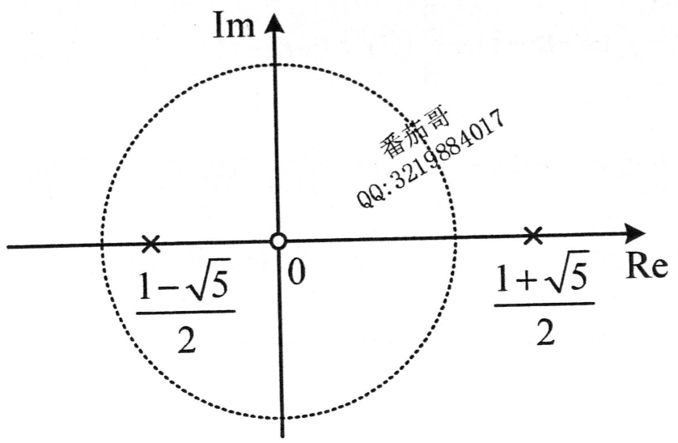

(2) ①系统稳定时, 收敛域为 $\frac{\sqrt{5} - 1}{2} < |z| < \frac{\sqrt{5} + 1}{2}$

$$
\begin{array}{l} H (z) = \frac {z}{z ^ {2} - z - 1} = \frac {\sqrt {5}}{5} \frac {z}{z - \frac {\sqrt {5} + 1}{2}} - \frac {\sqrt {5}}{5} \frac {z}{z - \frac {1 - \sqrt {5}}{2}} \\ H (z) \xleftarrow {z} h (n) = - \frac {\sqrt {5}}{5} (\frac {1 + \sqrt {5}}{2}) ^ {n} u (- n - 1) - \frac {\sqrt {5}}{5} (\frac {1 - \sqrt {5}}{2}) ^ {n} u (n) \\ \end{array}
$$

(2) 系统因果时, 收敛域为 $|z| > \frac{\sqrt{5} + 1}{2}$

$$
H (z) \xleftarrow {z} h (n) = \frac {\sqrt {5}}{5} (\frac {1 + \sqrt {5}}{2}) ^ {n} u (n) - \frac {\sqrt {5}}{5} (\frac {1 - \sqrt {5}}{2}) ^ {n} u (n)
$$

(注: 此题难度★☆☆☆☆, 西瓜哥原创小结: 基础题, 此题关键是根据不同情况,划分收敛域, 进而求其逆变换。) (刺猬哥考研团队西瓜哥 QQ:915211156)

题 27 解:

方程作 $ z $ 变换 $ Y(z) - \frac{1}{2} Y(z)z^{-1} + \frac{1}{4} Y(z)z^{-2} - \frac{1}{8} Y(z)z^{-3} = 2X(z) - 2X(z)z^{-2} $.

则有 $H(z) = \frac{Y(z)}{X(z)} = \frac{2(1 - z^{-2})}{(1 - \frac{1}{2}z^{-1})(1 + \frac{1}{4}z^{-2})}$ 可画级联信号图：

$$
H (z) = H _ {1} (z) H _ {2} (z), \text {其 中} H _ {1} (z) = \frac {2}{\left(1 - \frac {1}{2} z ^ {- 1}\right)}, H _ {2} (z) = \frac {1 - z ^ {- 2}}{1 + \frac {1}{4} z ^ {- 2}}
$$

更多优质考研资讯，关注b站 | 公众号“刺猬哥通信电子考研”、知乎“刺猬哥通信考研”

---

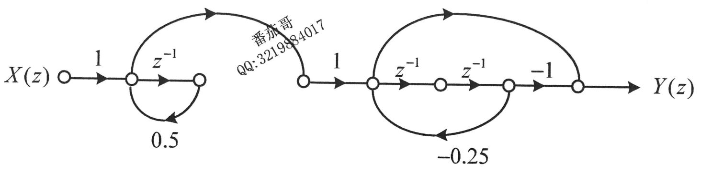

_(注: 此题难度★☆☆☆☆, 西瓜哥原创小结: 基础题, 关于直接型、级联型以及并联型的详细画法见序列 R 总结。)_

题 28 解: (刺猬哥考研团队西瓜哥 QQ:915211156)

系统函数的极点为 $\frac{-1 \pm \sqrt{1 - 4k}}{2}$

当 $1 - 4 k \geq 0$ 时, $k \leq \frac{1}{4}$

$\left\{ \begin{array}{l} - 1 < \frac{-1 - \sqrt{1 - 4k}}{2} < 0 \\ \frac{-1 + \sqrt{1 - 4k}}{2} < 1 \end{array} \right.$ 即 $\left\{ \begin{array}{ll} k > 0 \\ k > -2 \end{array} \Rightarrow 0 < k \leq \frac{1}{4} \right.$ 系统稳定

当 $1 - 4 k < 0$ 时, $k > \frac{1}{4}$

极点有 $\frac{-1 \pm j\sqrt{4k - 1}}{2}$

$(- \frac{1}{2})^{2} + (\frac{\sqrt{4k - 1}}{2})^{2} < 1 \Rightarrow \frac{1}{4} < k < 1 \Leftrightarrow$ 系统稳定

综上：$0 < k < 1$时，系统是稳定的。

(注: 此题难度★☆☆☆☆, 西瓜哥原创小结: 基础题, 小题可直接利用“朱里准则”快速得出结果, 对于大题建议通过求根的方式, 使得极点都落在单位圆内。)

题 29 解: (刺猬哥考研团队西瓜哥 QQ:915211156)

(1)由零-极点图可写出系统函数 $H_{1}(z) = A\frac{\left(z - \frac{3}{4}e^{j\pi / 4}\right)\left(z - \frac{3}{4}e^{-j\pi /4}\right)}{\left(z - \frac{3}{4}e^{j3\pi /4}\right)\left(z - \frac{3}{4}e^{-j3\pi /4}\right)}$

---

$
H_{2}(z) = B\frac{\left(z - \frac{1}{2}e^{j3\pi j4}\right)\left(z - \frac{1}{2}e^{-j3\pi /4}\right)}{\left(z - \frac{1}{2}e^{j\pi /4}\right)\left(z - \frac{1}{2}e^{-j\pi /4}\right)};
$ A，B都为常数，则有

H _ {2} (z) = \frac {B}{A} H _ {1} \left(\frac {3}{2} z e ^ {j \pi}\right) = \frac {B}{A} H _ {1} \left(- \frac {3}{2} z\right); 由 z 变换性质可得:

$h_{2}[n] = \frac{B}{A}\left(-\frac{2}{3}\right)^{n} h_{1}[n]$ 。即 $h_{2}[n] = g[n] h_{1}[n]$;

其中 $n < 0$ 时, $g[n] = 0$, 则有 $g[n] = \frac{B}{A}\left(-\frac{2}{3}\right)^n u[n]$;

由条件（3）可得 $\sum_{k=0}^{\infty}\left|g[k]\right|=3$，因此 $\sum_{k=0}^{\infty}\left|\frac{B}{A}\right|\left(\frac{2}{3}\right)^{k}=3$ 或 $\left|\frac{B}{A}\right| \frac{1}{1-2/3}=3 \Rightarrow \left|\frac{B}{A}\right|=1$。

因此 $g[n] = \pm \left(-\frac{2}{3}\right)^n u[n]$

(2) $g[n] = \pm \left(-\frac{2}{3}\right)^n u[n] = g[n] = \pm \left(\frac{2}{3}\right)^n (-1)^n u[n] = \pm \left(\frac{2}{3}\right)^n e^{jn\pi}u[n]$

反映到频域就是频谱搬移 $\pi$, 可实现低通、高通滤波器之间的相互转换。

(3)利用几何向量法结合零极点图定性分析可知: $H_{1}(z)$ 是高通滤波器, 与之相反, $H_{2}(z)$ 是低通滤波器。

(注: 此题难度★★★★☆, 西瓜哥原创小结: 此题每年都有高校当作为压轴题出现。第一问的思路很重要, 关键在于观察 $H_{1}(z) 、 H_{2}(z)$ 的关系, 不要上来直接逆变换求解, 难度很大。) (刺猬哥考研团队西瓜哥 QQ:915211156)

题 30 解: (刺猬哥考研团队西瓜哥 QQ:915211156)

(1) 设左上角第一个加法器输出为 $\omega(n)$, 则可对上面两个加法器列方程:

$$
\left\{ \begin{array}{l} X (z) + \frac {5}{4} z ^ {- 1} W (z) + b z ^ {- 2} W (z) = W (z) \\ W (z) - z ^ {- 2} W (z) = Y (z) \end{array} \Rightarrow H (z) = \frac {Y (z)}{X (z)} = \frac {1 - z ^ {- 2}}{1 - \frac {5}{4} z ^ {- 1} - b z ^ {- 2}} \right.
$$

更多优质考研资讯，关注b站 | 公众号“刺猬哥通信电子考研”、知乎“刺猬哥通信考研”

---

由于 $H(z)\big|_{z = 0.5} = \infty \Rightarrow b = -\frac{3}{8},$ $H(z) = \frac{1 - z^{-2}}{1 - \frac{5}{4}z^{-1} + \frac{3}{8}z^{-2}} = \frac{z^2 - 1}{(z - \frac{3}{4})(z - \frac{1}{2})}, |z| > \frac{3}{4}$

$$
\begin{array}{l} H (z) = \frac {z ^ {2} - 1}{(z - \frac {3}{4}) (z - \frac {1}{2})} = - 2 \frac {z}{z - \frac {1}{2}} + 3 \frac {z}{z - \frac {3}{4}} + 2 z ^ {- 2} \frac {z}{z - \frac {1}{2}} - 3 z ^ {- 2} \frac {z}{z - \frac {3}{4}} \\ h (n) = - 2 (\frac {1}{2}) ^ {n} u (n) + 3 (\frac {3}{4}) ^ {n} u (n) + 2 (\frac {1}{2}) ^ {n - 2} u (n - 2) - 3 (\frac {3}{4}) ^ {n - 2} u (n - 2) \\ \end{array}
$$

(2) 输入 $x_{1}(n) = (-1)^{n} u(n)$ 时, 零状态响应

$$
y _ {z s} (n) = x _ {1} (n) * h (n) \xleftarrow {F} Y _ {z s} (z) = X _ {1} (z) H (z)
$$

$$
Y _ {z s} (z) = \frac {z}{z + 1} \cdot \frac {z ^ {2} - 1}{(z - \frac {3}{4}) (z - \frac {1}{2})} = \frac {z ^ {2} - z}{(z - \frac {3}{4}) (z - \frac {1}{2})} = - \frac {z}{z - \frac {3}{4}} + 2 \frac {z}{z - \frac {1}{2}}
$$

$$
Y _ {z s} (z) \xleftarrow {Z} y _ {z s} (n) = - (\frac {3}{4}) ^ {n} u (n) + 2 (\frac {1}{2}) ^ {n} u (n)
$$

零输入响应: $y_{zi}(n) = y(n) - y_{zs}(n) = 6\left(\frac{1}{2}\right)^{n} u(n) - 5\left(\frac{3}{4}\right)^{n} u(n)$

$$
y (- 1) = \frac {1 6}{3}, y (- 2) = \frac {1 3 6}{9}
$$

(注: 此题难度★★☆☆☆, 西瓜哥原创小结: 常规题。)

题31解：

由 $X(z)$ 是有理函数，且只有 2 个有限极点，则可设其分母应为 $m(z - a)(z - b)$ 由 $\lim_{z \to \infty} X(z) = 1$ ，得分子分母同阶，故可设其分子为 $n(z - c)(z - d)$，且 $m / n = 1$ 代入已知的极点和零点，则有 $X(z) = \frac{(z - 1)(z - d)}{(z - 0.5)(z - b)}$。

$\begin{array}{l}x[n]\text{是偶序列，即} x[n] = x[-n]\text{，由} Z\text{变换的时域反转性有} X(z) = X(z^{-1})\text{，即}\\ \frac{(z - 1)(z - d)}{(z - 0.5)(z - b)} = \frac{(z^{-1} - 1)(z^{-1} - d)}{(z^{-1} - 0.5)(z^{-1} - b)} = \frac{(1 - z)(1 - dz)}{(1 - 0.5z)(1 - bz)}\end{array}$ 得 $b = 2,d = 1$

---

故 $X(z) = \frac{(z - 1)^2}{(z - 0.5)(z - 2)} = 1 + \frac{1}{3}\frac{z}{z - 2} -\frac{1}{3}\frac{z}{z - \frac{1}{2}}$

由 $x[n]$ 为偶序列, 可知 $x[n]$ 是双边序列, 故 $X(z)$ 收敛域为 $R O C: \frac{1}{2} < |z| < 2$,

则 $x[n] = \delta [n] - \frac{1}{3} 2^{n} u[-n - 1] - \frac{1}{3} \left(\frac{1}{2}\right)^{n} u[n]$

(QQ915211156 西瓜哥 Tips: 此题难度★★★☆☆, 注意单边序列可用 $u[n]$ 或 $u[-n]$ 表示, 不可能是偶序列。另外, 解此题需用到 Z 变换的奇偶性质、初值定理以及系统函数与零极点的关系, 做题一定要清楚每一个已知条件存在的意义)

题 32 解: (刺猬哥考研团队西瓜哥 QQ:915211156)

(1) 输入 $x(n) = (-1)^{n} u(n)$ 时, $y(n) = y_{zs1}(n) + y_{zi}(n) = 2^{n} u(n) + \frac{3}{5} (-3)^{n} u(n)$

输入 $x(n) = (-1)^n u(n - 2)$ 时，$y(n) = y_{zs2}(n) + y_{si}(n) = \frac{4}{5} 2^n u(n) - \frac{1}{5} (-3)^n u(n)$

设 $x_{3}(n) = (-1)^{n}[u(n) - u(n - 2)]$

$$
y _ {3} (n) = x _ {3} (n) * h (n) = \frac {1}{5} 2 ^ {n} u (n) + \frac {4}{5} (- 3) ^ {n} u (n)
$$

$$
H (z) = \frac {Y _ {3} (z)}{X _ {3} (z)} = \frac {z ^ {2}}{(z - 2) (z + 3)} = \frac {2}{5} \frac {z}{z - 2} + \frac {3}{5} \frac {z}{z + 3} \xleftarrow {z} h (n) = \frac {2}{5} (2) ^ {n} u (n) + \frac {3}{5} (- 3) ^ {n} u (n)
$$

(2) $H(z) = \frac{z^2}{(z - 2)(z + 3)} = \frac{1}{(1 - 2z^{-1})(1 + 3z^{-1})} = \frac{1}{1 + z^{-1} - 6z^{-2}}$

$$
y (n) + y (n - 1) - 6 y (n - 2) = x (n)
$$

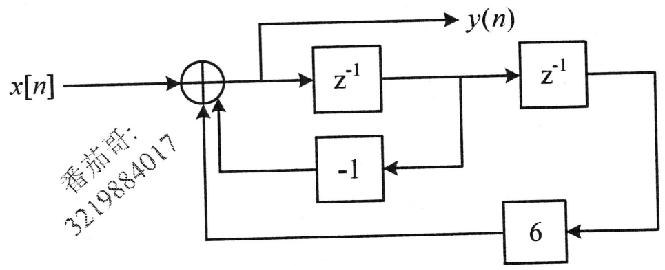

(3) $y_{zs}(n) = x(n)*h(n)\xleftarrow{z}Y_{zs}(z) = X(z)H(z) = \frac{z^3}{(z + 1)(z - 2)(z + 3)}$

更多优质考研资讯, 关注b站 | 公众号“刺猬哥通信电子考研”、知乎“刺猬哥通信考研”

---

$$
\begin{array}{l} Y _ {z s} (z) = - \frac {1}{6} \frac {z}{z + 1} + \frac {4}{1 5} \frac {z}{z - 2} + \frac {9}{1 0} \frac {z}{z + 3} \xleftarrow {z} y _ {z s} (n) = - \frac {1}{6} (- 1) ^ {n} u (n) + \frac {4}{1 5} (2) ^ {n} u (n) + \frac {9}{1 0} (- 3) ^ {n} u (n) \\ y _ {z i} (n) = y (n) - y _ {z s} (n) = \frac {1 1}{1 5} (2) ^ {n} u (n) - \frac {3}{1 0} (- 3) ^ {n} u (n) + \frac {1}{6} (- 1) ^ {n} u (n) \\ \end{array}
$$

(注: 此题难度★★☆☆☆, 西瓜哥原创小结: 常规题, 初始条件不变的意思就是零输入响应不变。) (刺猬哥考研团队西瓜哥 QQ:915211156)

题 33 解:

(1) 对差分方程两边进行双边 $z$ 变换: $Y(z) - z^{-1} Y(z) - 2 z^{-2} Y(z) = X(z) + 2 z^{-2} X(z)$

则系统函数为: $H(z) = \frac{Y(z)}{X(z)} = \frac{z^2 + 2}{z^2 - z - 2} = \frac{(z + \sqrt{2}j)(z - \sqrt{2}j)}{(z + 1)(z - 2)}, |z| > 2$

由于系统因果，则收敛域为 $|z| > 2$，零极点图如下图所示：

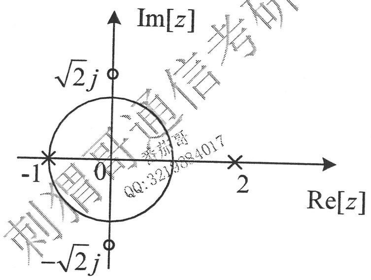

(2) 根据收敛域 (ROC) 不包含单位圆, 则系统不稳定

(3) 零状态响应为: $Y_{zs}(z) = F(z) H(z) = \frac{z}{z - 1} \cdot \frac{z^2 + 2}{(z + 1)(z - 2)}$

进行部分分式展开: $Y_{zs}(z) = -\frac{3}{2} \frac{z}{z - 1} + \frac{1}{2} \frac{z}{z + 1} + 2 \frac{z}{z - 2}$

则零状态响应: $y_{zs}(n) = \left(-\frac{3}{2} + \frac{1}{2} (-1)^n + 2^{n+1}\right) u(n)$

根据系统极点，设系统零输入响应为：$y_{zi}(n) = A(-1)^{n} + B2^{n}$

根据初始状态关系, 有 $y_{zi}(-1) = y(-1) = 2, y_{zi}(-2) = y(-2) = -\frac{1}{2}$,

---

直接代入零输入里面： $\left\{ \begin{array}{l} - A + \frac{1}{2} B = 2 \\ A + \frac{1}{4} B = -\frac{1}{2} \end{array} \right. \Rightarrow \left\{ \begin{array}{l} A = -1 \\ B = 2 \end{array} \right.$

则零输入响应为: $y_{zi}(n) = [(-1)^{n+1} + 2^{n+1}] u(n)$ (零输入响应习惯性只取 0 时刻之后的值) (刺猬哥考研团队西瓜哥 QQ:915211156)

(4) $H(z) = \frac{1 + 2z^{-2}}{1 - z^{-1} - 2z^{-2}} = \frac{1}{1 - z^{-1} - 2z^{-2}}\cdot (1 + 2z^{-2})$

$$
H _ {1} (z) = \frac {1}{1 - z ^ {- 1} - 2 z ^ {- 2}}
$$

设中间变量为 $z[n]$

$\Rightarrow z[n] - z[n - 1] - 2z[n - 2] = f[n]$, 画出 $H_{1}(z)$ 框图:

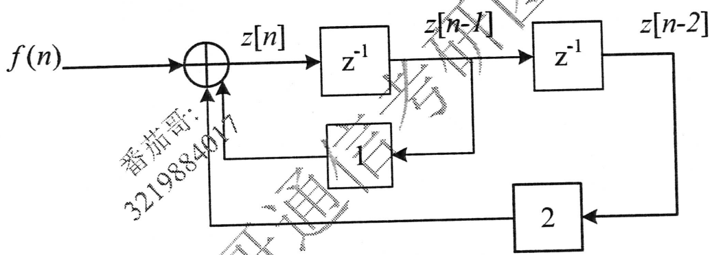

$ H_{2}(z) = 1 + 2z^{-2}, \Rightarrow y[n] = z[n] + 2z[n - 2] $ （西瓜哥QQ:915211156）

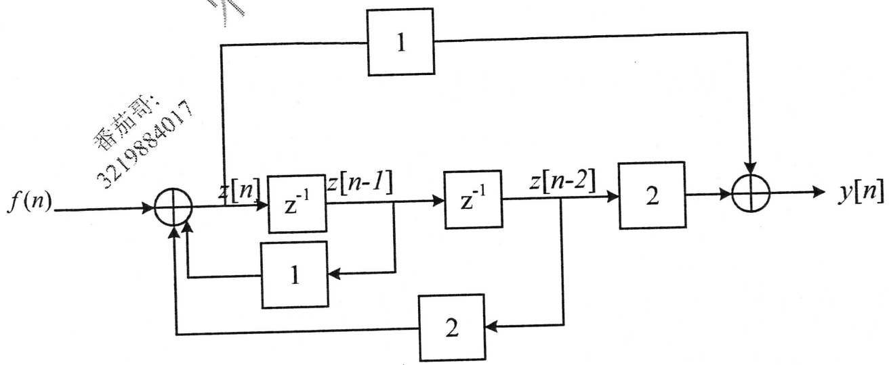

(注: 此题难度★★☆☆☆, 西瓜哥原创小结: 基础题, 考察求解离散系统函数以及响应。) (刺猬哥考研团队西瓜哥 QQ:915211156)

更多优质考研资讯, 关注b站 | 公众号“刺猬哥通信电子考研”、知乎“刺猬哥通信考研”

---

# 南昌考研信号与系统核心序列 O

# 序列入—离散时间傅里叶变换

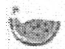

# 西瓜哥原创作答

注：本章考察概率很小，历年来就20年考过一道十分大题，思索良久还是准备了一些题目，帮助大家了解该知识点。

1. 序列 $x[n] = \left\{ \begin{array}{ll} 2^n, & n \leq 0, \text{且} n \text{ even} \\ 0, & n \text{ odd} \end{array} \right.$ 的傅里叶变换为（）

(A) $\frac{1}{1 - 2 e^{j\omega / 2}}$

(B) $\frac{1}{1 - 0.5 e^{j2\omega}}$

(1) $\frac{1}{1 - 0.5 e^{-j 2 \omega}}$

(D) $\frac{1}{1 - 0.25e^{j2\omega}}$

(刺猬哥考研团队西瓜哥 QQ:915211156)

2. 周期序列 $x[n] = \sum_{m = -\infty}^{\infty}\{4\delta [n - 4m] + 8\delta [n - 1 - 4m]\}$ 的傅里叶级数系数 $a_{107} =$ ( )。

A. -1

B. 3

C. $1 + 2 j$

D. $1 - 2 j$

3. 已知 $X(e^{j\omega}) = \sum_{k = -\infty}^{+\infty}\left\{2\pi \delta (\omega - 2\pi k) + \pi \delta \left(\omega - \frac{\pi}{2} - 2\pi k\right) + \pi \delta \left(\omega + \frac{\pi}{2} - 2\pi k\right)\right\}$, 求 $X(e^{j\omega})$ 的反变换 ( )。(刺猬哥考研团队西瓜哥 QQ:915211156)

A. $1 + \cos \left(\frac{\pi}{2} n\right)$

B. $1 - \cos \left(\frac{\pi}{2} n\right)$

C. $1 + \sin \left(\frac{\pi}{2} n\right)$

D. $1 - \sin \left(\frac{\pi}{2} n\right)$

4. 设 $x[n] \leftrightarrow X(e^{j\omega})$ ，$X(e^{j\omega}) = X(e^{j(\omega - 2)})$ ，则 $x[n] = 0$ ，$|n| > 0$ 。（）(T/F)

---

5. 非周期信号的离散时间傅里叶变换也是非周期的。（）（T/F）

6. 离散信号的傅里叶变换为 $X(e^{j\omega}) = 4 \cos^2(3\omega)$, 则 $x(n) =$

7. 离散信号 $x(n) = (-1)^{n}$ ________（是或不是）高频信号，其傅里叶变换为________。

8. 计算 $y(n) = \frac{\sin (n - 1)}{\pi (n - 1)} * \frac{\sin (2 n)}{\pi n}$ （刺猬哥考研团队西瓜哥 QQ:915211156）

9. 计算 $\sum_{n=-\infty}^{+\infty} \frac{\sin \left(\frac{\pi}{3} n\right)}{n} =$

10. 离散时间信号 $x[n] = 1 + \cos \left(\frac{\pi}{4} n\right)$ 的傅里叶变换 $X(e^{j\omega}) =$

11. 已知基本周期 $N = 8$ 的周期信号 $x(n)$, 满足 $\sum_{n=0}^{7} x(n) = 4$ 和 $\sum_{n=0}^{7} (-1)^{n} x(n) = 2$, 则使 $x(n)$ 平均功率最小时的 $x(n) =$ ________。（刺猬哥考研团队西瓜哥 QQ:915211156）

12. 周期序列 $x[n] = \sum_{k = -\infty}^{+\infty}\left\{u[n + 3 - 10k] - u[n - 4 - 10k]\right\}$ 的傅里叶系数 $a_{10} =$

---

13. 离散时间信号 $x[n]$ 的傅里叶变换 $X(e^{j\omega}) = \frac{e^{-j\omega} - 0.2}{1 - 0.2e^{-j\omega}}$ ，则 $x[n] =$ ________，且 $\sum_{n=-\infty}^{\infty}(-1)^{n}x[n] =$ ________。（刺猬哥考研团队西瓜哥QQ:915211156）

14. 离散时间信号 $x(n) = j^{n} \cos \pi n$ 的傅里叶变换 $X(e^{j\omega}) =$ ________；

15. $x[n]$ 是周期为 5 的实奇信号 $F_{16} = 2 j, F_{17} = j$, 则 $x[n]$ 的平均功率 $\mathrm{P}$ 为

16. 已知因果实序列 $\{x[n]\}$, 其离散傅里叶变换 $X(e^{j\omega})$ 的实部为 $\cos \omega + 1$, 求序列 $\{x[n]\}$ 及离散傅里叶变换 $X(e^{j\omega})$。（刺猬哥考研团队西瓜哥 QQ:915211156）

17. 已知两序列 $x[n], y[n]$ 的傅立叶变换 $X(j\omega), Y(j\omega)$，满足关系式 $Y(e^{j2\omega}) = X(e^{j\omega})e^{-2j\omega} + 2X(e^{-j\omega})$

(1) 若 $x[n] = \delta[n]$, 求 $y[n]$ 并画出图形;

2）若 $X(e^{j\omega}) = \frac{\pi}{2}\sum_{k = -\infty}^{\infty}\delta (\omega -k\frac{\pi}{2})$ ，求 $y[n]$ 并画出图形。

18. 两个离散的线性非时变因果系统的频率响应分别为 $H_{1}\left(e^{j \omega}\right)=\frac{1}{1-\frac{1}{2} e^{-j \omega}}$, $H_{2}\left(e^{j \omega}\right)=\frac{1}{1-\frac{1}{4} e^{-j \omega}}$, 由它们构成一个离散系统如下图所示, 其中 $x[n]$ 是系统的输入, $y[n]$是系统的输出. (刺猬哥考研团队西瓜哥 QQ:915211156)

(1) 求两个子系统的单位脉冲响应;

(2) 求该系统的系统函数 $H(z)$, 画出系统的零极点图;

(3) 确定描述该系统输出 $y[n]$ 与输入 $x[n]$ 之间关系的差分方程;

---

(4) 画出系统直接形式的模拟框图, 要求尽可能地少用单位延时器.

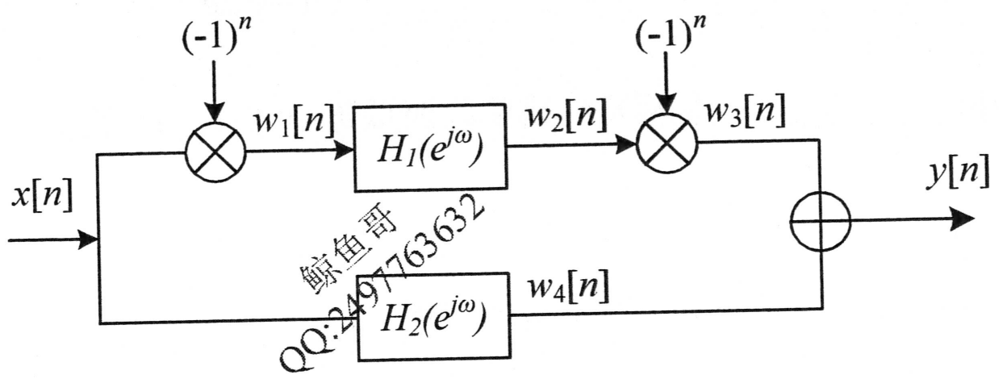

19. 设信号 $x[n] = \left\{ \begin{array}{l} \left(\frac{1}{2}\right)^{|n - 1|}, 0 \leq n \leq 2 \\ 0, n \text{为其他} \end{array} \right.$ 。请完成下列计算：

(1) 求 $X(e^{j\pi})$；2) 求 $X(e^{j\omega})$；3) 画出傅里叶变换为 $j \operatorname{Im}\{X(e^{j\omega})\}$ 的信号的波形；

4）求 $\int_{-\pi}^{\pi}\left|\frac{dX(e^{j\omega})}{d\omega}\right|^2 d\omega$。

20. (1) 设计一个具有可调节参数 $a$ 的离散时间系统, 当 $0.5 < a < 1$ 时, 该系统近似为低通滤波器; 当 $-1 < a < -0.5$ 时, 该系统近似为高通滤波器。

(2) 分别画出当 $a = 0.6$ 和 $a = 0.96$ 时, 该系统的幅频特性图。

(3) 写出该系统的逆系统的数学模型。（刺猬哥考研团队西瓜哥QQ:915211156）

---

# 序列 O 序列入详解—西瓜哥原创作答

题 1 解: 选 D。

由题可知 $x[n] = 2^{0} + 2^{-2} + 2^{-4} + \dots$

由离散时间傅里叶变换公式:

$$
H (e ^ {j \omega}) = \sum_ {n = - \infty} ^ {\infty} x [ n ] e ^ {- j n \omega} = \sum_ {n = - \infty} ^ {0} x [ n ] e ^ {- j n \omega} = 1 + (2 e ^ {- j \omega}) ^ {- 2} + (2 e ^ {- j \omega}) ^ {- 4} + \dots = \frac {1}{1 - 0 . 2 5 e ^ {j 2 \omega}}
$$

(QQ2497763632 西瓜哥 Tips: 此题难度★★★☆☆, 求离散傅里叶变换, 通常将变换式展开, 找出规律后求取。另一种方法是类比 Z 变换, 详见高质量课程)

题 2 解: 选 C。

离散傅里叶级数对公式:

$$
x [ n ] = \sum_ {k = <   N >} a _ {k} e ^ {j k \omega_ {0} n}
$$

$$
a _ {k} = \frac {1}{N} \sum_ {n = <   N >} x [ n ] e ^ {- j k \omega_ {0} n}
$$

由已知, 有周期 $N = 4, \omega_{0} = \frac{\pi}{2}$, 取 $m = 0$ 时

$$
a _ {k} = \frac {1}{4} \sum_ {n = 0, 1, 2, 3} x [ n ] \cdot e ^ {- j k \frac {\pi}{2} n} = \frac {1}{4} \sum_ {n = 0, 1, 2, 3} \left\{4 \delta [ n ] + 8 \delta [ n - 1 ] \right\} \cdot e ^ {- j k \frac {\pi}{2} n} = 1 + 2 e ^ {- j k \frac {\pi}{2}}
$$

周期 $N = 4$, $a_{107} = a_{-1} = 1 + 2j$, 故选 C。

(QQ2497763632 西瓜哥 Tips: 此题难度★★☆☆☆, 离散傅里叶级数的典型考法,注意, 离散周期序列的傅里叶级数呈相同周期)

题 3 解: 选 A。(刺猬哥考研团队西瓜哥 QQ:915211156)

由于 $e^{j\omega_0n}\xleftarrow{F}\sum_{k = -\infty}^{+\infty}2\pi \delta (\omega -\omega_0 - 2\pi k)$ ，可得：

$$
X \left(e ^ {j \omega}\right) \xleftarrow {F} x (n) = 1 + \frac {1}{2} e ^ {j \frac {\pi}{2} n} + \frac {1}{2} e ^ {- j \frac {\pi}{2} n} = 1 + \cos (\frac {\pi}{2} n)
$$

更多优质考研资讯，关注b站 | 公众号“刺猬哥通信电子考研”、知乎“刺猬哥通信考研”

---

题 4 解: T

$
\begin{aligned}
X(e^{j\omega}) &= X(e^{j(\omega - 2)}) \Rightarrow x[n] = e^{j2n}x[n], \text{则} x[n] \text{形式为: } x[n] = K\delta[n], \text{满足 } x[n] = 0, \\
|n| &> 0.
\end{aligned}
$

(QQ2497763632 西瓜哥 Tips: 此题难度★★☆☆☆。)

题 5 解: F

(QQ915211156 西瓜哥 Tips: 此题难度★★☆☆☆, 陷阱题, 离散信号的傅里叶变换都是以 $2 \pi$ 为周期的信号。)

题 6 解: $2 \delta (n) + \delta (n + 6) + \delta (n - 6)$

$$
\begin{array}{l} X \left(e ^ {j \omega}\right) = 4 \cos^ {2} (3 \omega) = 2 [ 1 + \cos (6 \omega) ] = 2 + e ^ {j 6 \omega} + e ^ {- j 6 \omega} \\ X \left(e ^ {j \omega}\right) \xleftarrow {F} x (n) = 2 \delta (n) + \delta (n + 6) + \delta (n - 6) \\ \end{array}
$$

（QQ915211156 西瓜哥 Tips: 此题难度★★☆☆☆, 考查常见离散时间傅里叶变换对。）

题7解：是； $\sum_{k = -\infty}^{+\infty}2\pi \delta (\omega -\pi -2\pi k)$

$x(n) = (-1)^{n} = e^{j\pi n}$ 可知其为高频信号；（高频信号在 $\pm \pi, \pm 3\pi, \pm 5\pi$ …处）

$$
x (n) = (- 1) ^ {n} = e ^ {j \pi n} \xleftarrow {F} X \left(e ^ {j \omega}\right) = \sum_ {k = - \infty} ^ {+ \infty} 2 \pi \delta (\omega - \pi - 2 \pi k)
$$

(QQ915211156 西瓜哥 Tips: 此题难度★☆☆☆☆, 考查周期信号的 DTFT。)

题8解： $\frac{\sin(n - 1)}{\pi(n - 1)}$

更多优质考研资讯，关注b站 | 公众号“刺猬哥通信电子考研”、知乎“刺猬哥通信考研”

---

由已知 $\frac{\sin(n - 1)}{\pi(n - 1)} \xleftarrow{F} [u(\omega + 1) - u(\omega - 1)]e^{-j\omega}, \omega \in (-\pi, \pi)$

$$
\frac {\sin (2 n)}{\pi n} \xleftarrow {F} u (\omega + 2) - u (\omega - 2), \omega \in (- \pi , \pi)
$$

$$
y (n) = \frac {\sin (n - 1)}{\pi (n - 1)} * \frac {\sin (2 n)}{\pi n} \xleftarrow {F} Y \left(e ^ {j \omega}\right) = [ u (\omega + 1) - u (\omega - 1) ] e ^ {- j \omega}, \omega \in (- \pi , \pi)
$$

$$
Y \left(e ^ {j \omega}\right) \xleftarrow {F} y (n) = \frac {\sin (n - 1)}{\pi (n - 1)}
$$

(QQ915211156 西瓜哥 Tips: 此题难度★★☆☆☆, 离散信号的傅里叶变换都是以 $2 \pi$ 为周期的信号。)

题9解： $\pi$

已知离散时间傅里叶变换: $X(e^{j\omega}) = \sum_{n = -\infty}^{+\infty}x(n)e^{-j\omega n}$

设 $x(n) = \frac{\sin(\frac{\pi}{3}n)}{n}$，则 $\sum_{n=-\infty}^{+\infty} \frac{\sin(\frac{\pi}{3}n)}{n} = X(e^{j0}) = X(0) = \pi$

其中 $x(n) = \frac{\sin(\frac{\pi}{3}n)}{n}\xleftarrow{F}X(e^{j\omega}) = \pi [u(\omega +\frac{\pi}{3}) - u(\omega -\frac{\pi}{3})],\quad \omega \in (-\pi ,\pi)$

(QQ915211156 西瓜哥 Tips: 此题难度★☆☆☆☆, 考查离散时间傅里叶变换定义。)

题 10 解: $\sum_{l=-\infty}^{\infty}[2 \pi \delta (\omega - 2 \pi l) + \pi \delta (\omega + \frac{\pi}{4} - 2 \pi l) + \pi \delta (\omega - \frac{\pi}{4} - 2 \pi l)]$

$$
1 \leftrightarrow 2 \pi \sum_ {l = - \infty} ^ {\infty} \delta (\omega - 2 \pi l)
$$

$$
\cos \left(\frac {\pi}{4} n\right) = \frac {1}{2} e ^ {j \frac {\pi}{4} n} + \frac {1}{2} e ^ {- j \frac {\pi}{4} n} \leftrightarrow \pi \sum_ {l = - \infty} ^ {\infty} \delta \left(\omega - \frac {\pi}{4} - 2 \pi l\right) + \pi \sum_ {l = - \infty} ^ {\infty} \delta \left(\omega + \frac {\pi}{4} - 2 \pi l\right)
$$

上述两式相加即得结果。

(QQ2497763632 西瓜哥 Tips: 此题难度★★☆☆☆, 题目本身不难, 但对不熟悉更多优质考研资讯, 关注b站 | 公众号“刺猬哥通信电子考研”、知乎“刺猬哥通信考研”

---

离散傅里叶变换的考生来说非常难，懂我意思吧？

题11解： $\frac{1}{2} + (-1)^n\frac{1}{4}$

由题意: $x(n) = \sum_{k = < 8 >} a_{k} e^{j \frac{\pi}{4} k n}, a_{k} = \frac{1}{8} \sum_{n = < 8 >} x(n) e^{-j \frac{\pi}{4} k n}$

$$
\sum_ {n = 0} ^ {7} x (n) = 4 \Rightarrow a _ {0} = \frac {1}{2}, \quad \sum_ {n = 0} ^ {7} (- 1) ^ {n} x (n) = 2 \Rightarrow a _ {4} = \frac {1}{4}
$$

由 Parseval 定理: $\frac{1}{N} \sum_{n=N>} |x(n)|^{2}=\sum_{k=N>} \left|a_{k}\right|^{2}$

故使 $x(n)$ 平均功率最小, 则一个周期内的傅里叶级数系数除了 $a_{0} 、 a_{4}$, 其余均使其为零即可, $x(n) = a_{0} + a_{4} e^{j \pi n} = \frac{1}{2} + (-1)^{n} \frac{1}{4}$

(QQ2497763632 西瓜哥 Tips: 此题难度★★☆☆☆, 关键在于理解使 $x(n)$ 平均功率最小的含义。)

题 12 解: $\frac{7}{10}$

由题可知 $x[n]$ 的周期为 10 , 由离散信号傅里叶级数系数的周期性有 $a_{10} = a_{0}$, 又 $a_{k} = \frac{1}{N} \sum_{n=N>}$ $x[n] e^{-jk \omega_{0} n}$, 得 $a_{0} = \frac{1}{10} \sum_{n=<10>} x[n] = \frac{7}{10}$, 故 $a_{10} = \frac{7}{10}$.

(QQ2497763632 西瓜哥 Tips: 此题难度★★★☆☆, 算离散信号的傅里叶级数自然要联想到 $a_{k}$ 的周期性; 另外, 值得注意的是 $a_{k} = \frac{1}{N} \sum_{n=N>}$ $x[n] e^{-jk\omega_{0}n}$ 中既有 $n$ 又有 $k$, 可得记准了)

题 13 解: $-5 \delta [n] + 4.8 (0.2)^{n} u[n], -1$

$$
X \left(e ^ {j \omega}\right) = - 5 + \frac {4 . 8}{1 - 0 . 2 e ^ {- j \omega}} \xleftarrow {F} x [ n ] = - 5 \delta [ n ] + 4. 8 (0. 2) ^ {n} u [ n ]
$$

更多优质考研资讯, 关注b站 | 公众号“刺猬哥通信电子考研”、知乎“刺猬哥通信考研”

---

$$
\begin{array}{l} \sum_ {n = - \infty} ^ {\infty} (- 1) ^ {n} x [ n ] = \sum_ {n = - \infty} ^ {\infty} (- 1) ^ {n} \{- 5 \delta [ n ] \} + \sum_ {n = - \infty} ^ {\infty} (- 1) ^ {n} \{4. 8 (0. 2) ^ {n} u [ n ] \} \\ = \sum_ {n = - \infty} ^ {\infty} - 5 \delta [ n ] + \sum_ {n = 0} ^ {\infty} 4. 8 (- 0. 2) ^ {n} = - 5 + 4 = - 1 \\ \end{array}
$$

(QQ2497763632 西瓜哥 Tips: 此题难度★★★☆☆)

题 14 解: $X(e^{j\omega}) = 2\pi \sum_{k = -\infty}^{\infty}\delta [\omega -(2k + 1)\pi -\frac{\pi}{2} ]$ 或 $X(e^{j\omega}) = 2\pi \delta (\omega -\frac{3\pi}{2}),0\leq \omega \leq 2\pi$

法一: $x[n] = j^{n} \cos \pi n = e^{j \frac{\pi}{2} n} e^{j \pi n} = e^{j \frac{3\pi}{2} n} \xleftarrow{F} 2\pi \sum_{k=-\infty}^{\infty} \delta\left(\omega - \frac{3\pi}{2} - 2\pi k\right)$ （见奥本P249）

法二: $x[n] = e^{j\frac{3\pi}{2} n}, N = 4, \omega_0 = \frac{\pi}{2}, a_k$ 周期也为 4 , 则有

$ x[n] = \sum_{k=0,1,2,3} a_k e^{j\frac{\pi}{2} k}, \quad a_3 = 1, a_0 = a_1 = a_2 = 0 $，即 $a_k = 1, k = 4l - 1$（$l$ 为整数）

则 $X(e^{j\omega}) = 2\pi \sum_{k = -\infty}^{\infty}\delta (\omega -(4k - 1)\frac{\pi}{2}) = 2\pi \sum_{k = -\infty}^{\infty}\delta (\omega -\frac{3\pi}{2} -2k\pi)$

题 15 解: 10 (刺猬哥考研团队西瓜哥 QQ:915211156)

由于 $x[n]$ 是实奇信号, 因此 $F_{n} = -F_{-n} \Rightarrow F_{0} = 0$.

$$
F _ {1} = F _ {1 6} = 2 j = - F _ {1}, F _ {2} = F _ {1 7} = j = - F _ {2}
$$

$$
P = \sum_ {n = - \infty} ^ {\infty} \left| F _ {n} \right| ^ {2} = 1 0
$$

(QQ2497763632 西瓜哥 Tips: 此题难度★★★☆☆, 注意利用傅里叶级数系数求功率, 公式中无 $\frac{1}{N}$ )

题16解：

由时域反褶性 $x[-n] \xleftarrow{FT} X(e^{-j\omega})$ ，有

---

$\frac{x[n] + x[-n]}{2} \xrightarrow{FT} \frac{X(e^{j\omega}) + X(e^{-j\omega})}{2} = \cos \omega + 1 = \frac{1}{2} e^{j\omega} + \frac{1}{2} e^{-j\omega} + 1$，求逆变换得

$\frac{x[n] + x[-n]}{2} = \frac{1}{2}\delta [n + 1] + \frac{1}{2}\delta [n - 1] + \delta [n]$, 由 $x[n]$ 因果, 则 $n < 0$ 时, $x[n] = 0$, 故有

$x[n] = \left\{ \begin{array}{ll}0 & ,n <   0\\ 1 & ,n = 0\\ 1 & ,n = 1\\ 0 & ,n > 1 \end{array} \right.$ 即 $x[n] = \delta [n - 1] + \delta [n]$

再对 $x[n]$ 求傅里叶变换得 $X(e^{j\omega}) = 1 + e^{-j\omega}$.

（QQ2497763632 西瓜哥 Tips: 此题难度★★★☆☆, 注意 $n = 0$ 这一点, $x[-n]$ 不可能视为 0 )

题 17 解:

(1) $x[n] = \delta[n]$, 则 $X(e^{j\omega}) = 1, X(e^{-j\omega}) = 1,$

即 $Y(e^{j2\omega}) = e^{-j2\omega} + 2$ ，得 $Y(e^{j\omega}) = 2 + e^{-j\omega}$

逆变换得 $y[n] = 2 \delta[n] + \delta[n - 1]$, 则 $y[n]$ 图形如下:

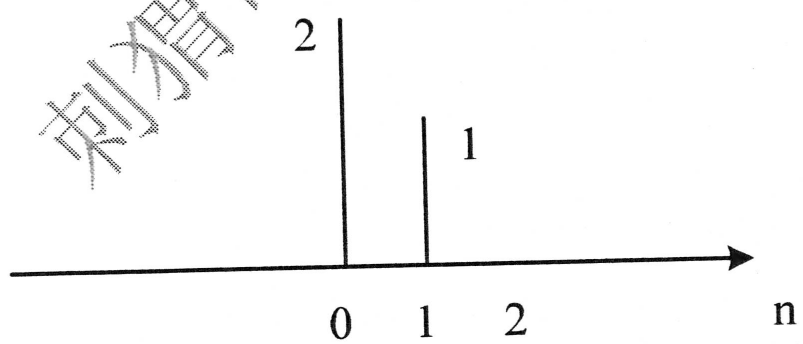

(2) (刺猬哥考研团队西瓜哥 QQ:915211156)

$$
\begin{array}{l} Y \left(e ^ {j 2 \omega}\right) = \frac {\pi}{2} \cdot e ^ {- j 2 \omega} \cdot \sum_ {k = - \infty} ^ {\infty} \delta \left(\omega - \frac {k \pi}{2}\right) + 2 \cdot \frac {\pi}{2} \cdot \sum_ {k = - \infty} ^ {\infty} \delta \left(- \omega - \frac {k \pi}{2}\right) \\ = \frac {\pi}{2} \sum_ {k = - \infty} ^ {\infty} e ^ {- j 2 \omega} \delta \left(\omega - \frac {k \pi}{2}\right) + \pi \cdot \sum_ {k = - \infty} ^ {\infty} \delta \left(\omega + \frac {k \pi}{2}\right) \\ \end{array}
$$

$$
\begin{array}{l} Y \left(e ^ {j \omega}\right) = \frac {\pi}{2} \cdot \sum_ {k = - \infty} ^ {\infty} (- 1) ^ {k} \delta \left(\frac {\omega}{2} - \frac {k \pi}{2}\right) + \pi \cdot \sum_ {k = - \infty} ^ {\infty} \delta \left(\frac {\omega}{2} + \frac {k \pi}{2}\right) \\ = \pi \sum_ {k = - \infty} ^ {\infty} (- 1) ^ {k} \delta (\omega - k \pi) + 2 \pi \cdot \sum_ {k = - \infty} ^ {\infty} \delta (\omega + k \pi) \\ \end{array}
$$

更多优质考研资讯，关注b站 | 公众号“刺猬哥通信电子考研”、知乎“刺猬哥通信考研”

---

假设 $ y[n] = y_{1}[n] + y_{2}[n] $，由 $\pi \sum_{k=-\infty}^{\infty} (-1)^{k} \delta(\omega - k\pi)$ 知 $\omega_{0} = \frac{2\pi}{N} = \pi$，得 $ N = 2 $，

由周期离散信号的傅里叶变换, 知 $2 \pi a_{k} = \pi (-1)^{k}$, 即 $a_{k} = \frac{(-1)^{k}}{2}$,

则 $y_{1}[n] = \sum_{k=N} a_{k} \cdot e^{jk\omega_{0}n} = \sum_{k=0}^{1}\frac{(-1)^{k}}{2}e^{jk\pi n} = \frac{1}{2} - \frac{1}{2}e^{j\pi n} = \frac{1 - (-1)^{n}}{2}, n = 0, \pm 1, \pm 2, \ldots$

由 $2 \pi \cdot \sum_{k = -\infty}^{\infty} \delta (\omega - k \pi)$, 知 $2 \pi a_{k} = 2 \pi$, 得 $a_{k} = 1, \omega_{1} = \pi, N = 2$ 逆变换得

$$
y _ {2} [ n ] = \sum_ {k = N} a _ {k} \cdot e ^ {j k \pi n} = 1 + e ^ {j \pi n} = 1 + (- 1) ^ {n}, n = 0, \pm 1, \pm 2, \dots
$$

则由 $ y[n] = y_{1}[n] + y_{2}[n] $ 得

$y[n] = \left\{ \begin{array}{ll}2, & n\text{为偶数}\\ 1, & n\text{为奇数} \end{array} \right.$ ，图形如下：

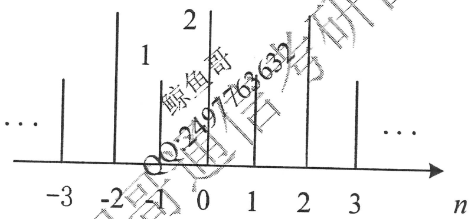

（QQ2497763632 西瓜哥 Tips: 此题难度★★★★☆, 冲激序列及离散傅里叶变换公式的运用, 离散基本功扎实的考生三星, 不扎实的五星）

题 18 解: (刺猬哥考研团队西瓜哥 QQ:915211156)

(1) $h_{1}[n] = \left(\frac{1}{2}\right)^{n} u[n]$, $h_{2}[n] = \left(\frac{1}{4}\right)^{n} u[n]$

(2) $w_{1}[n] = (-1)^{n} x[n] = e^{j \pi n} x[n] \leftrightarrow W_{1}\left(e^{j \omega}\right) = X\left(e^{j(\omega - \pi)}\right)$

$$
W _ {2} \left(e ^ {j \omega}\right) = H _ {1} \left(e ^ {j \omega}\right) W _ {1} \left(e ^ {j \omega}\right) = H _ {1} \left(e ^ {j \omega}\right) X \left(e ^ {j (\omega - \pi)}\right)
$$

$$
w _ {3} [ n ] = (- 1) ^ {n} w _ {2} [ n ] = e ^ {j \pi n} w _ {2} [ n ] \leftrightarrow W _ {3} (e ^ {j \omega}) = W _ {2} (e ^ {j (\omega - \pi)})
$$

$$
W _ {3} (e ^ {j \omega}) = H _ {1} (e ^ {j (\omega - \pi)}) X (e ^ {j (\omega - 2 \pi)}) = H _ {1} (e ^ {j (\omega - \pi)}) X (e ^ {j \omega})
$$

---

$$
W _ {4} \left(e ^ {j \omega}\right) = H _ {2} \left(e ^ {j \omega}\right) X \left(e ^ {j \omega}\right)
$$

$$
Y \left(e ^ {j \omega}\right) = W _ {3} \left(e ^ {j \omega}\right) + W _ {4} \left(e ^ {j \omega}\right) = \left[ H _ {1} \left(e ^ {j (\omega - \pi)}\right) + H _ {2} \left(e ^ {j \omega}\right) \right] X \left(e ^ {j \omega}\right)
$$

$$
H (e ^ {j \omega}) = H _ {1} (e ^ {j (\omega - \pi)}) + H _ {2} (e ^ {j \omega}) = \frac {1}{1 - \frac {1}{2} e ^ {- j (\omega - \pi)}} + \frac {1}{1 - \frac {1}{4} e ^ {- j \omega}}
$$

$$
\begin{array}{l} H \left(e ^ {j \omega}\right) = \frac {1}{1 - \frac {1}{2} e ^ {- j (\omega - \pi)}} + \frac {1}{1 - \frac {1}{4} e ^ {- j \omega}} = \frac {2 + \frac {1}{4} e ^ {- j \omega}}{1 + \frac {1}{4} e ^ {- j \omega} - \frac {1}{8} e ^ {- j 2 \omega}} \\ H (z) = \frac {2 + \frac {1}{4} z ^ {- 1}}{1 + \frac {1}{4} z ^ {- 1} - \frac {1}{8} z ^ {- 2}} \\ \end{array}
$$

极点: $p_{1} = -\frac{1}{2}, p_{2} = \frac{1}{4}$ 零点: $z_{1} = -\frac{1}{8}, z_{2} = 0$

零极点图:

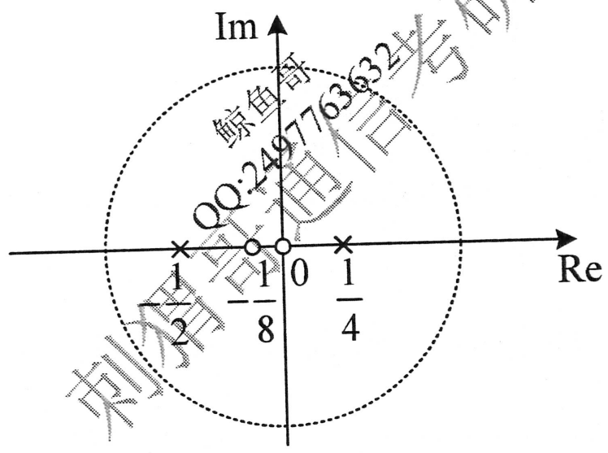

(3) 系统输出 $y[n]$ 与输入 $x[n]$ 之间关系的差分方程为:

$$
y [ n ] + \frac {1}{4} y [ n - 1 ] - \frac {1}{8} y [ n - 2 ] = 2 x [ n ] + \frac {1}{4} x [ n - 1 ]
$$

(4) 系统直接形式的模拟框图: (刺猬哥考研团队西瓜哥 QQ:915211156)

更多优质考研资讯, 关注b站 | 公众号“刺猬哥通信电子考研”、知乎“刺猬哥通信考研”

---

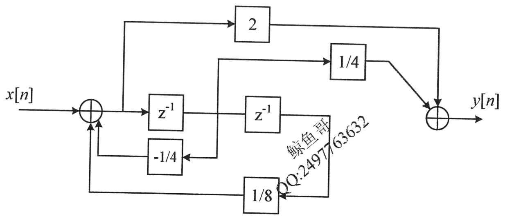

题 19 解:

(1) $x[n] = \frac{1}{2} \delta[n] + \delta[n - 1] + \frac{1}{2} \delta[n - 2]$

$$
X \left(e ^ {j \omega}\right) = \frac {1}{2} + e ^ {- j \omega} + \frac {1}{2} e ^ {- j 2 \omega}, X \left(e ^ {j \pi}\right) = \frac {1}{2} + e ^ {- j \pi} + \frac {1}{2} e ^ {- j 2 \pi} = 0
$$

(2) $x[n + 1] = \frac{1}{2} \delta[n + 1] + \delta[n] + \frac{1}{2} \delta[n - 1]$ 为实偶函数

$\Rightarrow X(e^{j\omega})e^{j\omega}$ 为实偶函数， $\Rightarrow \square X(e^{j\omega}) = \frac{1}{2}\omega$

(3) $x[n]$ 为实信号, $X^{*}\left(e^{j\omega}\right)=X\left(e^{-j \omega}\right)$

$$
j \operatorname {I m} X \left(e ^ {j \omega}\right) = \frac {1}{2} \left(X \left(e ^ {j \omega}\right) - X ^ {*} \left(e ^ {j \omega}\right)\right) = \frac {1}{2} \left(X \left(e ^ {j \omega}\right) - X \left(e ^ {- j \omega}\right)\right)
$$

$$
j \operatorname {I m} X \left(e ^ {j \omega}\right) \xleftarrow {F T} \frac {1}{2} (x [ n ] - x [ - n ])
$$

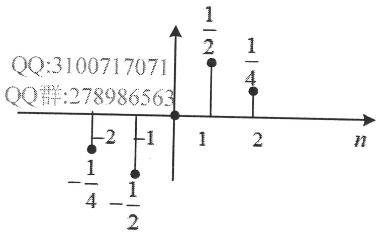

(4) $\frac{dX(e^{j\omega})}{d\omega} \xleftarrow{FT} - jnx[n]$

$$
\int_ {2 \pi} \left| \frac {d X \left(e ^ {j \omega}\right)}{d \omega} \right| ^ {2} d \omega = 2 \pi \sum_ {n = - \infty} ^ {\infty} | n x [ n ] | ^ {2} = 4 \pi
$$

---

(注: 此题难度★★★☆☆, 西瓜哥原创小结: 本题主要考察离散傅里叶变换实变的偶、虚奇性相关内容) (刺猬哥考研团队西瓜哥 QQ:915211156)

题 20 解:

(1) 参考奥本书 P156 页一阶递归离散时间滤波器内容

$$
y [ n ] - a y [ n - 1 ] = x [ n ]
$$

(2) $H(e^{j\omega}) = \frac{1}{1 - ae^{-j\omega}}$, 当 $0 < a < 1$ 时, 为低通滤波器, 大致画出 $a = 0.6$,

$a = 0.96$ 的幅频特性如下图所示:

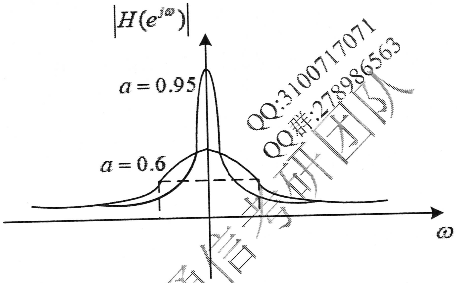

(3) 原系统函数: $H(e^{j\omega}) = \frac{1}{1 - ae^{-j\omega}}$

则逆系统为 $G(e^{j\omega}) = 1 - ae^{-j\omega}$

(注: 此题难度★★★☆☆, 西瓜哥原创小结: 不管是对离散还是连续时间系统, 原系统函数 $H(e^{j\omega})$ 与逆系统函数 $G(e^{j\omega})$ 必定满足 $H(e^{j\omega}) G(e^{j\omega}) = 1$, 画个框图很容易理解。)

刺猬哥考研团队

西瓜哥原创编写

更多优质考研资讯，关注b站 | 公众号“刺猬哥通信电子考研”、知乎“刺猬哥通信考研”

---

# 南昌考研信号与系统核心序列 O

# 序列九—系统的状态变量分析

# 西瓜哥原创作答

1. 两输入- 两输出的二阶连续因果 LTI 系统如图所示, 其中 $v_{1}(t)$ 和 $v_{2}(t)$ 是系统的两个输入, $y_{1}(t)$ 和 $y_{2}(t)$ 是系统的两个输出, 若定义状态变量为 $x_{1}(t) = y_{1}(t), x_{2}(t) = y_{2}(t)$ 。

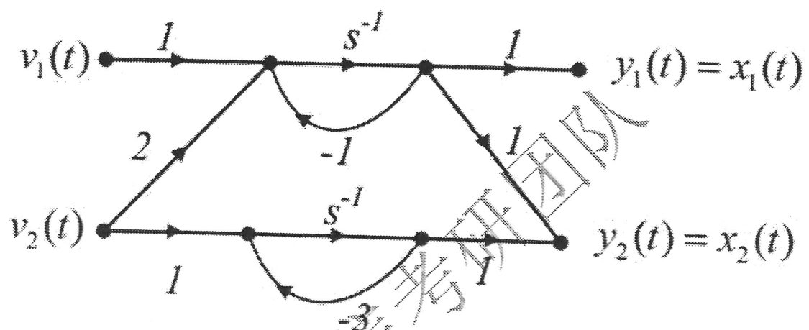

列写矩阵形式的状态方程和输出方程

2. 已知电路图如下图所示, 电阻值图中给出, 电容和电容的值都为 1 , 设 $I_{i} = X_{1} 、 U_{c} = X_{2}$

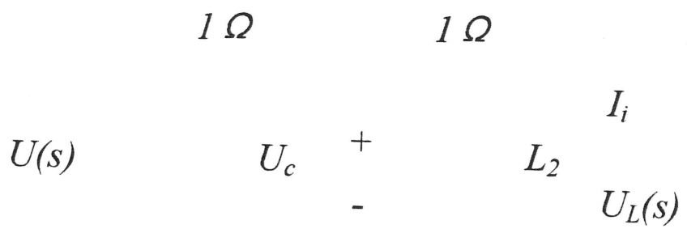

(1)求系统输入输出状态方程

(2) 求系统函数 $H(s)$

(3) 判断系统是否稳定，并说明原因。

---

3. 系统框图如下，试写出状态方程和输出方程。

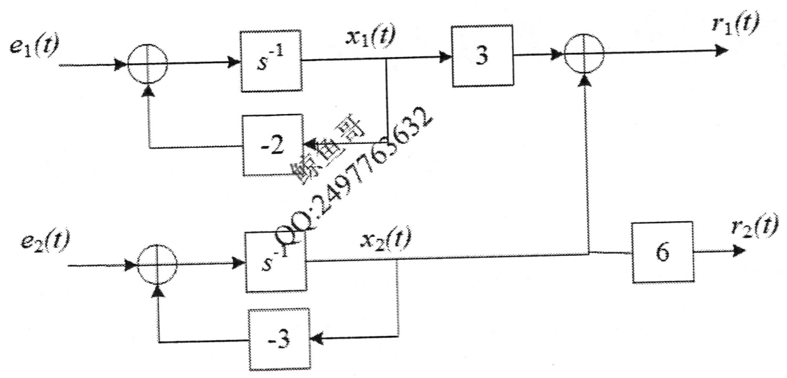

4. 已知某连续系统框图如下, 试以此写出该系统的状态方程和输出方程。

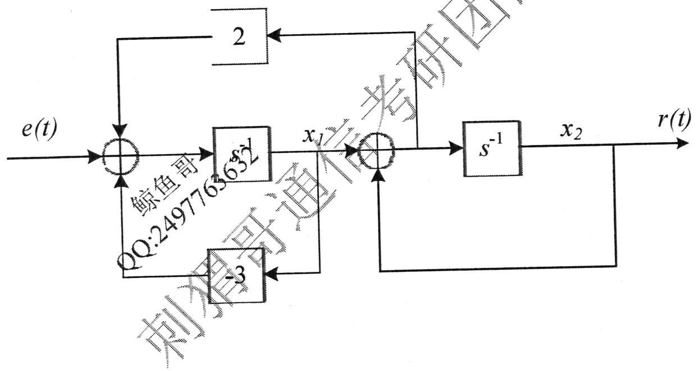

5. 图示电路, 已知 $x_{1}\left(0^{-}\right) = 1 V$, $x_{2}\left(0^{-}\right) = 1 A$ 。

以 $x_{1}(t) 、 x_{2}(t)$ 为状态变量，以 $x_{1}(t) 、 x_{2}(t)$ 为响应变量，列写状态方程和输出方程。

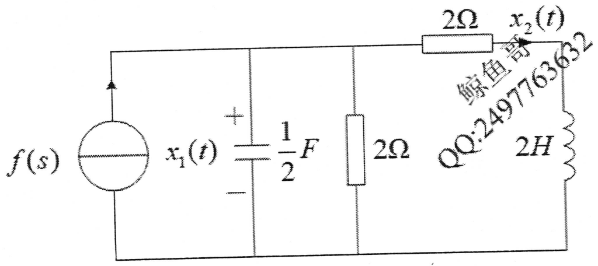

---

6. 已知某离散时间系统的框图如下：求状态方程与输出方程；

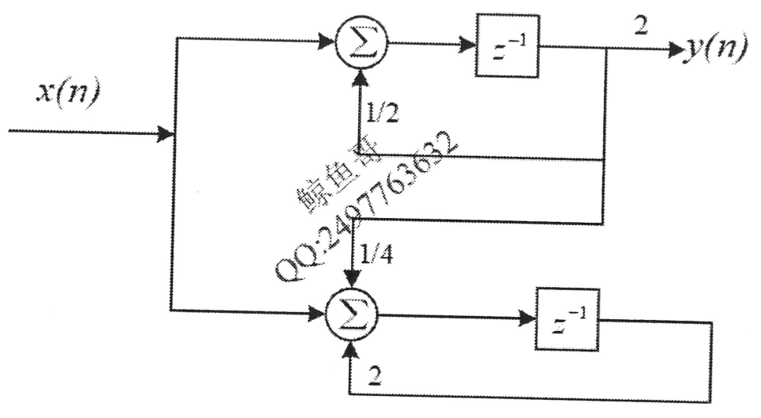

7. 如下图所示模拟系统, 取积分器输出为状态变量, 并分别设为 $x_{1}(t)$ 和 $x_{2}(t)$ 。

求系统的状态方程和输出方程;

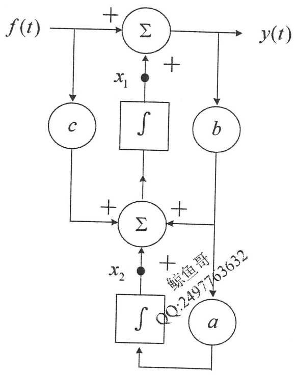

---

8. 下图所示为某连续系统的模拟框图。

(1) 写出 $x_{1}(t) 、 x_{2}(t)$ 为状态变量的状态方程和输出方程;

(2)为使系统稳定，常数 $a, b$ 应当满足什么条件？

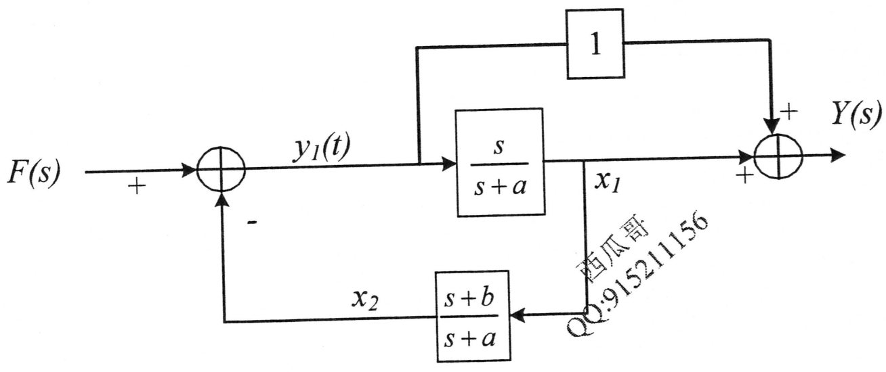

9. 根据下图给出的电路图写出状态方程。

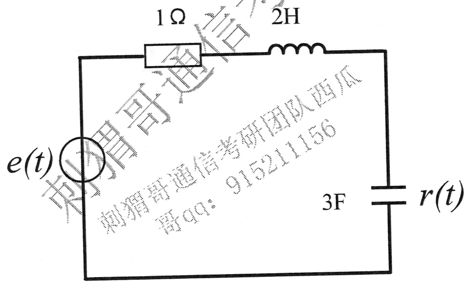

---

# 序列 O 序列九详解—西瓜哥原创作答

题 1 解:

因 $x_{2}(t)$ 中包含 $x_{1}(t)$, 且不是积分器的输出, 可先增设下方积分器的输出为 $x_{3}(t)$.

则 $x_{2}(t) = x_{1}(t) + x_{3}(t)$

由流图可列出方程组:

$\left\{ \begin{array}{l} x_{1}^{\prime}(t) = -x_{1}(t) + v_{1}(t) + 2v_{2}(t) \\ x_{3}^{\prime}(t) = -3x_{3}(t) + v_{2}(t) \end{array} \right.$, 替换为 $x_{2}(t)$, 则

$$
\left\{ \begin{array}{l} x _ {1} ^ {\prime} (t) = - x _ {1} (t) + v _ {1} (t) + 2 v _ {2} (t) \\ x _ {2} ^ {\prime} (t) = 2 x _ {1} (t) - 3 x _ {2} (t) + v _ {1} (t) + 3 v _ {2} (t) \end{array} \right.
$$

写成矩阵形式如下: $\left[ \begin{array}{l}x_{1}^{\prime}(t)\\ x_{2}^{\prime}(t) \end{array} \right] = \left[ \begin{array}{ll} - 1 & 0\\ 2 & -3 \end{array} \right]\left[ \begin{array}{l}x_{1}(t)\\ x_{2}(t) \end{array} \right] + \left[ \begin{array}{ll}1 & 2\\ 1 & 3 \end{array} \right]\left[ \begin{array}{l}v_{1}(t)\\ v_{2}(t) \end{array} \right]$

输出方程如下： $\left[ \begin{array}{l}y_{1}(t)\\ y_{2}(t) \end{array} \right] = \left[ \begin{array}{ll}1 & 0\\ 0 & 1 \end{array} \right]\left[ \begin{array}{l}x_{1}(t)\\ x_{2}(t) \end{array} \right]$

(注: 此题难度★★☆☆☆, 西瓜哥原创小结: 对于题设状态变量不是积分器输出的情况, 通过再增设一变量, 即与之相关联的某积分器的输出。)

题 2 解: (刺猬哥考研团队西瓜哥 QQ:915211156)

(1)本题已经提供好了状态量，那么只要依据给出的状态量进行电路分析即可，简单分析以下状态量存在的关系：①电容两端电压等于电容右端电阻和电感电压之和；②电压源等于电容两端电压和电容左侧电阻电压之和；依据此列出关系式如下：

$$
\left\{ \begin{array}{l} U _ {c} (t) = I _ {i} (t) \cdot R + L \cdot \frac {d I _ {i} (t)}{d t} \\ U (t) = \left(I _ {i} (t) + c \cdot \frac {d U _ {c} (t)}{d t}\right) \cdot R + U _ {c} (t) \\ U _ {L} (t) = L \cdot \frac {d I _ {i} (t)}{d t} \end{array} \right.
$$

代入电阻、电容、电感值以及替换题设中给定的状态量可以得到:

$$
\left\{ \begin{array}{l} X _ {2} = X _ {1} + \dot {X} _ {1} \\ U (t) = X _ {1} + \dot {X} _ {2} + X _ {2} \Rightarrow \\ U _ {L} (t) = \dot {X} _ {1} \end{array} \right. \Rightarrow \left\{ \begin{array}{l} \dot {X} _ {1} = X _ {2} - X _ {1} \\ \dot {X} _ {2} = U (t) - X _ {1} - X _ {2} \\ U _ {L} (t) = \dot {X} _ {1} = X _ {2} - X _ {1} \end{array} \right.
$$

---

写成矩阵形式为:

$$
\left[ \begin{array}{l} \dot {X} _ {1} \\ \dot {X} _ {2} \end{array} \right] = \left[ \begin{array}{l l} - 1 & 1 \\ - 1 & - 1 \end{array} \right] \left[ \begin{array}{l} X _ {1} \\ X _ {2} \end{array} \right] + \left[ \begin{array}{l} 0 \\ 1 \end{array} \right] U (t) 、 U _ {L} (t) = \left[ \begin{array}{l l} - 1 & 1 \end{array} \right] \left[ \begin{array}{l} X _ {1} \\ X _ {2} \end{array} \right]
$$

(2)根据系统分压关系亦或是用网孔电压法，可以得到系统输入输出对应为：

$$
U (s) \cdot \frac {s}{s ^ {2} + 2 s + 2} = U _ {L} (s) \Rightarrow H (s) = \frac {s}{s ^ {2} + 2 s + 2}
$$

(3)从第二问的系统函数可知两个极点分别对应的是 $X_{1} = -1 + i$ 、 $X_{2} = -1 - i$ ，可知极点全在 $j w$ 轴左侧，从系统函数还原成微分方程可轻易判断该系统是因果的，从而因果系统，极点全在 $j w$ 轴左侧，则该系统稳定。

(注: 此题难度★★★☆☆, 西瓜哥原创小结: 本题状态变量方程的建立, 以及和电路相结合的综合题, 平时需要多练习多做。)

题 3 解:

根据系统框图，可列出状态方程与输出方程：

$$
\begin{array}{l} \left[ \begin{array}{l} x _ {1} (t) \\ x _ {2} (t) \end{array} \right] = \left[ \begin{array}{c c} - 2 & 0 \\ 0 & - 3 \end{array} \right] \left[ \begin{array}{l} x _ {1} (t) \\ x _ {2} (t) \end{array} \right] + \left[ \begin{array}{c c} 1 & 0 \\ 0 & 1 \end{array} \right] \left[ \begin{array}{l} e _ {1} (t) \\ e _ {2} (t) \end{array} \right] \\ \left[ \begin{array}{l} r _ {1} (t) \\ r _ {2} (t) \end{array} \right] = \left[ \begin{array}{l l} 3 & 1 \\ 0 & 6 \end{array} \right] \left[ \begin{array}{l} x _ {1} (t) \\ x _ {2} (t) \end{array} \right] \\ \end{array}
$$

(注: 此题难度★★☆☆☆, 西瓜哥原创小结: 加法器的各个输出都相等, 都等于两个输入之和。) (刺猬哥考研团队西瓜哥 QQ:915211156)

题4解:

从模拟框图有:

$$
\left\{ \begin{array}{l} x _ {1} ^ {\prime} (t) = 2 x _ {2} ^ {\prime} (t) - 3 x _ {1} (t) + e (t) \\ x _ {2} ^ {\prime} (t) = x _ {2} (t) + x _ {1} (t) \end{array} \right.
$$

化简可得:

$$
\left\{ \begin{array}{l} x _ {1} ^ {\prime} (t) = 2 x _ {2} (t) - x _ {1} (t) + e (t) \\ x _ {2} ^ {\prime} (t) = x _ {2} (t) + x _ {1} (t) \end{array} \right.
$$

更多优质考研资讯，关注b站 | 公众号“刺猬哥通信电子考研”、知乎“刺猬哥通信考研”

---

输出 $r(t) = x_{2}(t)$

写成矩阵形式如下:

$$
\binom {x _ {1} ^ {\prime} (t)} {x _ {2} ^ {\prime} (t)} = \binom {- 1} {1} \binom {x _ {1} (t)} {x _ {2} (t)} + \binom {1} {0} e (t)
$$

$ r(t) = (0, 1)\left( \begin{array}{l} x_{1}(t) \\ x_{2}(t) \end{array} \right) $ （刺猬哥考研团队西瓜哥QQ:915211156）

(注: 此题难度★☆☆☆☆, 西瓜哥原创小结: 基础题, 送分题。)

题5解：

1）由电路的KCL、KVL方程得

$$
\begin{array}{r l} & \frac {1}{2} \dot {x} _ {1} (t) = - \frac {1}{2} x _ {1} (t) - x _ {2} (t) + f (t) \\ & 2 \dot {x} _ {2} (t) = x _ {1} (t) - 2 x _ {2} (t) \end{array} \Rightarrow \left\{ \begin{array}{l} \dot {x} _ {1} (t) = - x _ {1} (t) - 2 x _ {2} (t) + 2 f (t) \\ \dot {x} _ {2} (t) = \frac {1}{2} x _ {1} (t) - x _ {2} (t) \end{array} \right.
$$

故状态方程为 $\left[ \begin{array}{l} \dot{x}_1(t) \\ \dot{x}_2(t) \end{array} \right] = \left[ \begin{array}{ll} -1 & -2 \\ \frac{1}{2} & -1 \end{array} \right] \left[ \begin{array}{l} x_1(t) \\ x_2(t) \end{array} \right] + \left[ \begin{array}{l} 2 \\ 0 \end{array} \right] [f(t)]$

输出方程为 $\left[ \begin{array}{l}y_{1}(t)\\ y_{2}(t) \end{array} \right] = \left[ \begin{array}{ll}1 & 0\\ 0 & 1 \end{array} \right]\left[ \begin{array}{l}x_{1}(t)\\ x_{2}(t) \end{array} \right] + \left[ \begin{array}{l}0\\ 0 \end{array} \right][f(t)]$

2） $\phi (s) = (sI - A)^{-1} = \left[ \begin{array}{cc}s + 1 & 2\\ -\frac{1}{2} & s + 1 \end{array} \right]^{-1} = \frac{1}{s^2\pm 2s + 2}\left[ \begin{array}{cc}s + 1 & -2\\ \frac{1}{2} & s + 1 \end{array} \right],$ 则

$$
H (s) = C \phi (s) B + D = \left[ \begin{array}{l l} 1 & 0 \\ 0 & 1 \end{array} \right] \frac {1}{s ^ {2} + 2 s + 2} \left[ \begin{array}{l l} s + 1 & - 2 \\ \frac {1}{2} & s + 1 \end{array} \right] \left[ \begin{array}{l} 2 \\ 0 \end{array} \right] + \left[ \begin{array}{l} 0 \\ 0 \end{array} \right] = \left[ \begin{array}{l} \frac {2 (s + 1)}{(s + 1) ^ {2} + 1} \\ \frac {1}{(s + 1) ^ {2} + 1} \end{array} \right]
$$

故单位冲激响应 $h(t) = \left[ \begin{array}{c} 2e^{-t}\cos t \\ e^{-t}\sin t \end{array} \right]U(t)$

(QQ2497763632 西瓜哥 Tips: 此题难度★★☆☆☆, 由电路建立状态方程, 由 $i_{C} = C \frac{d u_{C}}{d t}, u_{L} = L \frac{d i_{L}}{d t}$, 通常取电容电流和电感电压为状态变量。见过该类题则是

更多优质考研资讯，关注b站 | 公众号“刺猬哥通信电子考研”、知乎“刺猬哥通信考研”

---

题 6 解: (刺猬哥考研团队西瓜哥 QQ:915211156)

设上方延时器输出为 $\lambda_{1}[n]$, 下方为 $\lambda_{2}[n]$

状态方程： $\left\{ \begin{array}{ll}\lambda_{1}(n + 1) = x(n) + \frac{1}{2}\lambda_{1}(n)\\ \lambda_{2}(n + 1) = x(n) + 2\lambda_{2}(n) + \frac{1}{4}\lambda_{1}(n) \end{array} \right.$ 输出方程： $y(n) = 2\lambda_1(n)$

矩阵形式： $\left[ \begin{array}{l}\lambda_{1}(n + 1)\\ \lambda_{2}(n + 1) \end{array} \right] = \left[ \begin{array}{ll} \frac{1}{2} & 0\\ \frac{1}{4} & 2 \end{array} \right]\left[ \begin{array}{l}\lambda_{1}(n)\\ \lambda_{2}(n) \end{array} \right] + \left[ \begin{array}{l}1\\ 1 \end{array} \right]x(n),y(n) = [2\quad 0]\left[ \begin{array}{l}\lambda_{1}(n)\\ \lambda_{2}(n) \end{array} \right]$

题 7 解:

由图可得状态方程:

$$
\begin{array}{l} \dot {x} _ {1} (t) = x _ {2} (t) + c f (t) + b y (t) \\ = x _ {2} (t) + c f (t) + b \left[ x _ {1} (t) + f (t) \right] \\ = b x _ {1} (t) + x _ {2} (t) + (b + c) f (t) \\ \dot {x} _ {2} (t) = a b y (t) = a b x _ {1} (t) + a b f (t) \\ \end{array}
$$

输出方程: $y(t) = x_{1}(t) + f(t)$

表示为矩阵形式: (刺猬哥考研团队西瓜哥 QQ:915211156)

$$
\left[ \begin{array}{l} \dot {x} _ {1} \\ \dot {x} _ {2} \end{array} \right] = \left[ \begin{array}{l l} b & 1 \\ a b & 0 \end{array} \right] \left[ \begin{array}{l} x _ {1} \\ x _ {2} \end{array} \right] + \left[ \begin{array}{l} b + c \\ a b \end{array} \right] f
$$

$$
y = \left[ \begin{array}{l l} 1 & 0 \end{array} \right] \left[ \begin{array}{l} x _ {1} \\ x _ {2} \end{array} \right] + f
$$

题 8 解:

(1) 将系统分为上下两个子系统模块:

(1) 对于框图下方系统有:

更多优质考研资讯, 关注b站 | 公众号“刺猬哥通信电子考研”、知乎“刺猬哥通信考研”

---

$$
H _ {2} (s) = \frac {X _ {2} (s)}{X _ {1} (s)} = \frac {s + b}{s + a}
$$

对角相乘有 $(s + a)X_{2}(s) = (s + b)X_{1}(s)$, 其对应微分方程为:

$$
\dot {x} _ {2} (t) + a x _ {2} (t) = \dot {x} _ {1} (t) + b x _ {1} (t) \tag {1}
$$

(2) 对于框图上方系统有: (刺猬哥考研团队西瓜哥 QQ:915211156)

$$
H _ {1} (s) = \frac {X _ {1} (s)}{Y _ {1} (s)} = \frac {s}{s + a}
$$

对角相乘有 $(s + a)X_{1}(s) = sY_{1}(s)$, 其对应微分方程为:

$$
\dot {x} _ {1} (t) + a x _ {1} (t) = \dot {y} _ {1} (t) \tag {2}
$$

从框图中我们还能看到以下两个关系式：（答疑交流群 920652553）

$$
\left\{ \begin{array}{l} y _ {1} (t) = f (t) - x _ {2} (t) \\ x _ {1} (t) + y _ {1} (t) = y (t) \end{array} \right. \tag {3}
$$

对(3)两边求导再代入(2)可以得到:

$$
\dot {x} _ {2} (t) = - \dot {x} _ {1} (t) - a x _ {2} (t) + \dot {f} (t) \tag {5}
$$

将(5)代入(1)可以得到:

$$
\dot {x} _ {1} (t) = - \frac {a + b}{2} x _ {1} (t) + \frac {a}{2} x _ {2} (t) + \frac {1}{2} \dot {f} (t) \tag {6}
$$

继续将(6)代入(1)可以得到:

$$
\dot {x} _ {2} (t) = - \frac {a - b}{2} x _ {1} (t) - \frac {a}{2} x _ {2} (t) + \frac {1}{2} \dot {f} (t) \tag {7}
$$

联立(3)和(4)可以得到：（刺猬哥考研团队西瓜哥QQ:915211156）

$$
y (t) = x _ {1} (t) - x _ {2} (t) + f (t) \tag {8}
$$

以上(7)和(8)为状态方程，(9)为输出方程，写成矩阵形式为：

$$
\left( \begin{array}{l} \dot {x} _ {1} (t) \\ \dot {x} _ {2} (t) \end{array} \right) = \left( \begin{array}{c c} - \frac {a + b}{2} & \frac {a}{2} \\ - \frac {a - b}{2} & - \frac {a}{2} \end{array} \right) \left( \begin{array}{l} x _ {1} (t) \\ x _ {2} (t) \end{array} \right) + \left( \begin{array}{l} \frac {1}{2} \\ \frac {1}{2} \end{array} \right) \dot {f} (t)
$$

$$
y (t) = (1 - 1) \binom {x _ {1} (t)} {x _ {2} (t)} + f (t)
$$

(2) 对系统框图使用梅森公式得到: (刺猬哥考研团队西瓜哥 QQ:915211156) 更多优质考研资讯, 关注b站 | 公众号“刺猬哥通信电子考研”、知乎“刺猬哥通信考研”

---

$$
H (s) = \frac {Y (s)}{X (s)} = \frac {1 + \frac {s}{s + a}}{1 + \frac {s (s + b)}{(s + a) ^ {2}}} = \frac {(s + a) ^ {2} + s (s + a)}{(s + a) ^ {2} + s (s + b)} = \frac {2 s ^ {2} + 3 a s + a ^ {2}}{2 s ^ {2} + (2 a + b) s + a ^ {2}}
$$

要使得系统稳定，那么极点要全部位于左半平面

我们对分母做观察有: $2 s^{2} + (2 a + b) s + a^{2}$

分情况:

(1) 分母的根为实数, 那么只要满足二次函数的对称轴小于 0 , 且在 0 点的值大于 0 即可有:

$$
\left\{ \begin{array}{l} a \neq 0 \\ 2 a + b > 0 \end{array} \Rightarrow b > - 2 a \right.
$$

(2) 分母的根为共轭复数, 那么只要满足复数的实部小于 0 即可:

$$
- (2 a + b) <   0 \Rightarrow b > - 2 a
$$

综上所述要使系统稳定只要 $b > -2a$ 且 $a \neq 0$ 即可满足。

题 9 解: (刺猬哥考研团队西瓜哥 QQ:915211156)

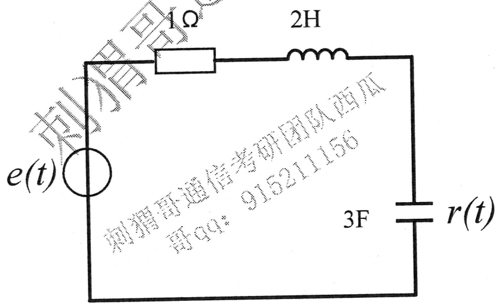

设电容电压为 $\lambda_{1}(t)$, 电感电流为 $\lambda_{2}(t)$, 则由电路图有

$$
\lambda_ {1} ^ {\prime} (t) = \frac {1}{3} \lambda_ {2} (t)
$$

$$
\lambda_ {2} ^ {\prime} (t) = \frac {1}{2} u _ {L} (t) = \frac {1}{2} \left(e (t) - \lambda_ {1} (t) - \lambda_ {2} (t)\right)
$$

$$
y (t) = \lambda_ {1} (t)
$$

更多优质考研资讯, 关注b站 | 公众号“刺猬哥通信电子考研”、知乎“刺猬哥通信考研”
