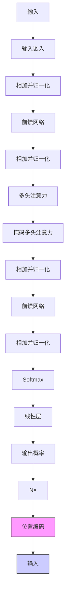
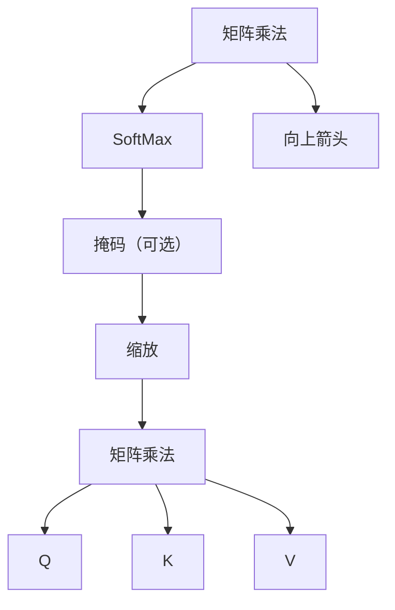
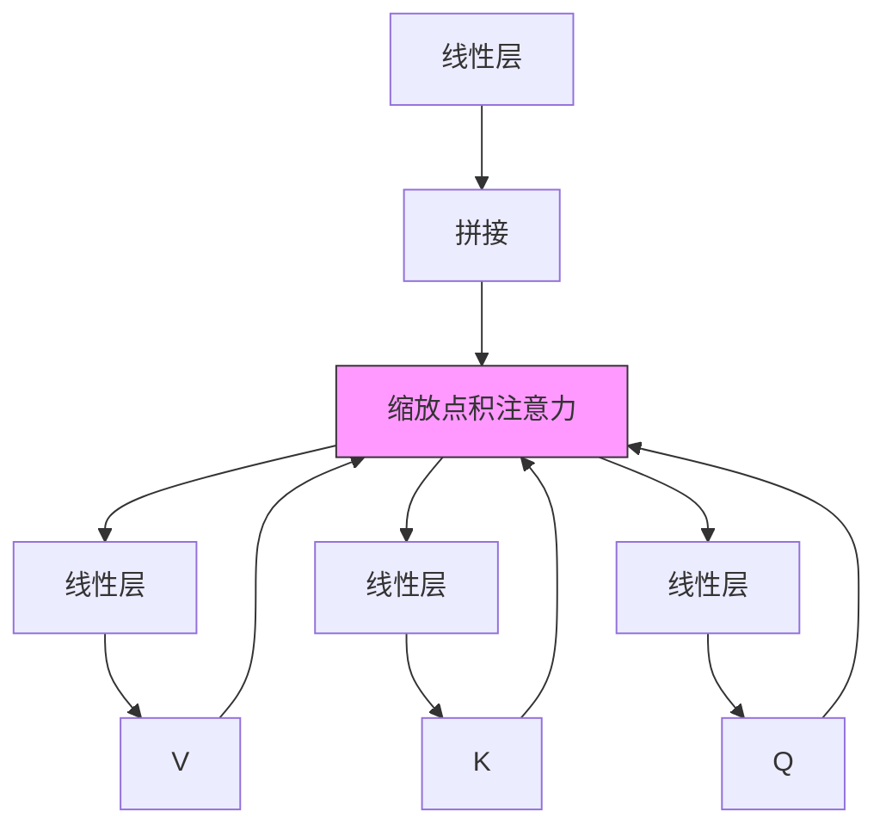
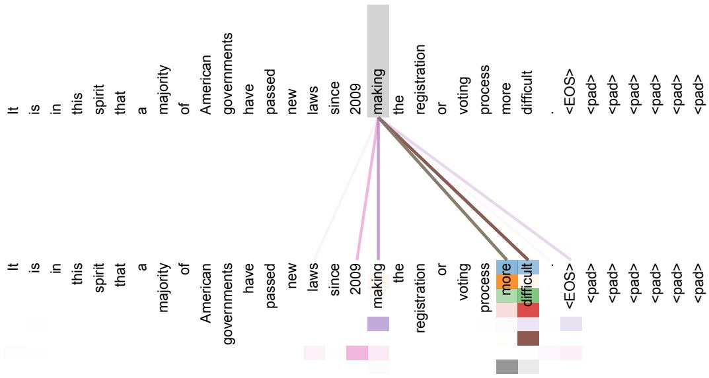
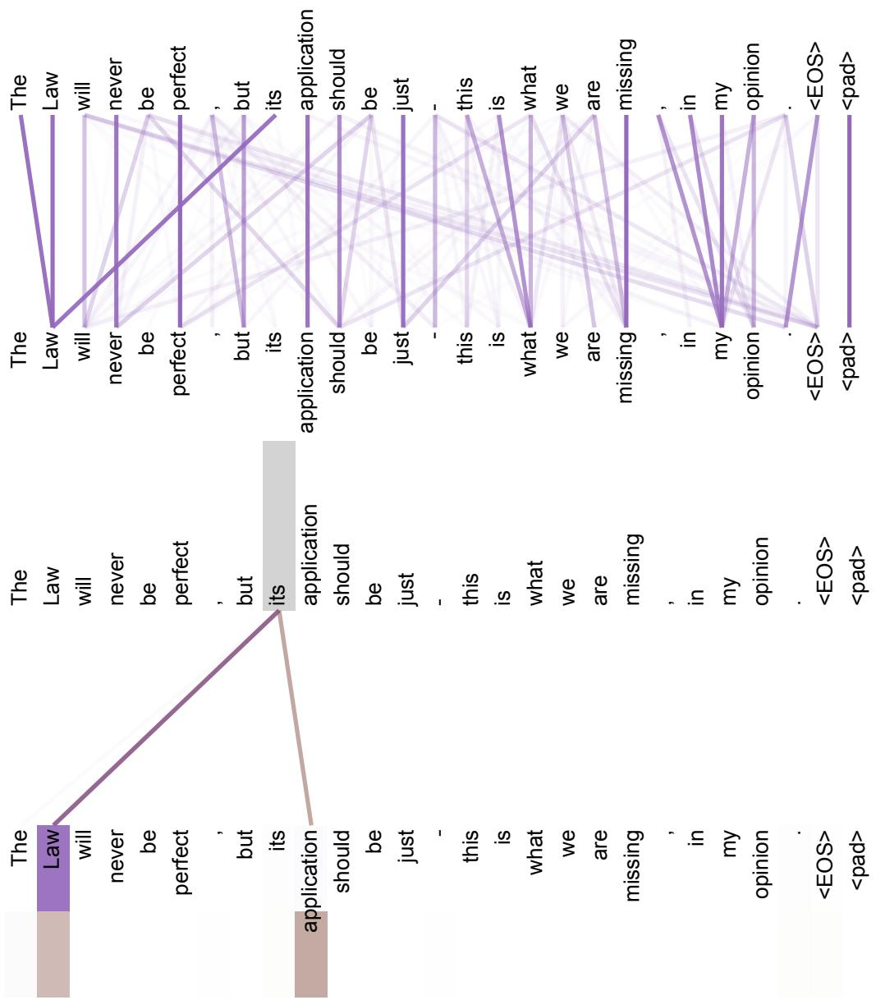
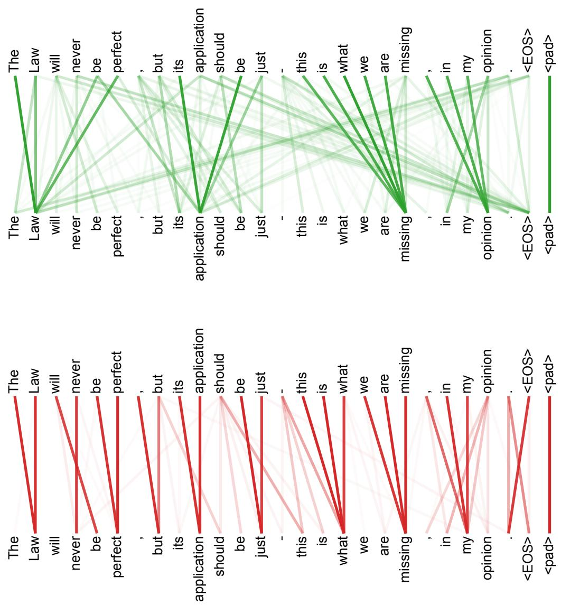

# 注意力就是你所需要的一切

Ashish Vaswani\*

Google Brain

avaswani@google.com

Noam Shazeer\*

Google Brain

noam@google.com

Niki Parmar\*

Google Research

nikip@google.com

Jakob Uszkoreit\*

Google Research

usz@google.com

Llion Jones\*

Google Research

llion@google.com

Aidan N. Gomez $^{*}$ $^{\dagger}$

多伦多大学

aidan@cs.toronto.edu

Łukasz Kaiser\*

Google Brain

lukaszkaiser@google.com

Illia Polosukhin\* ‡

illia.polosukhin@gmail.com

## 摘要

主流的序列转导模型基于复杂的循环神经网络或卷积神经网络，这些网络包含一个编码器和一个解码器。表现最好的模型还通过注意力机制连接编码器和解码器。我们提出一种新的简单网络架构 Transformer，它完全基于注意力机制，彻底摒弃循环和卷积。在两个机器翻译任务上的实验表明，这些模型在质量上更优，同时更易并行化，并且训练所需时间显著更少。我们的模型在 WMT 2014 英译德翻译任务上达到 28.4 BLEU，比包括集成模型在内的已有最佳结果高出 2 个 BLEU 以上。在 WMT 2014 英译法翻译任务上，我们的模型在 8 块 GPU 上训练 3.5 天后，取得了 41.8 的 BLEU 分数，建立了新的单模型最先进水平，而训练成本仅为文献中最佳模型的一小部分。我们还将 Transformer 成功应用于英语成分句法分析，在大规模和有限训练数据条件下均表现良好，从而表明 Transformer 能很好地泛化到其他任务。

## 1 引言

循环神经网络，尤其是长短期记忆网络 $[13]$ 和门控循环神经网络 $[7]$，已经在语言建模和机器翻译等序列建模与转导问题中成为公认的最先进方法 $[35, 2, 5]$。此后，许多工作持续推动循环语言模型和编码器—解码器架构的边界 $[38, 24, 15]$。

循环模型通常沿输入和输出序列中的符号位置来分解计算。将这些位置与计算时间步对齐后，模型会生成一系列隐藏状态 $h_{t}$，其中每个隐藏状态都是前一个隐藏状态 $h_{t-1}$ 与位置 t 的输入的函数。这种固有的顺序特性阻碍了训练样本内部的并行化；当序列长度较长时，这一点尤为关键，因为内存限制会限制跨样本的批处理能力。近期工作通过因式分解技巧 [21] 和条件计算 [32] 在计算效率方面取得了显著提升，后者同时还改进了模型性能。然而，顺序计算这一根本约束依然存在。

注意力机制已经成为多种任务中有吸引力的序列建模与转导模型的重要组成部分，它能够在不考虑输入或输出序列中距离的情况下建模依赖关系 $[2, 19]$。不过，除少数情况 $[27]$ 外，这类注意力机制都与循环网络结合使用。

在本文中，我们提出 Transformer，这是一种避开循环结构、完全依赖注意力机制来捕捉输入与输出之间全局依赖关系的模型架构。Transformer 允许显著更高程度的并行化，并且在 8 块 P100 GPU 上仅训练 12 小时即可达到新的翻译质量最先进水平。

## 2 背景

减少顺序计算这一目标也是 Extended Neural GPU $[16]$、ByteNet $[18]$ 和 ConvS2S $[9]$ 的基础。这些模型都以卷积神经网络作为基本构建块，并为所有输入和输出位置并行计算隐藏表示。在这些模型中，将两个任意输入或输出位置的信号关联起来所需的操作数会随位置之间的距离而增长：ConvS2S 中为线性增长，ByteNet 中为对数增长。这使得学习远距离位置之间的依赖关系更加困难 $[12]$。在 Transformer 中，这一操作数被减少为常数；代价是由于对注意力加权位置进行平均，有效分辨率有所降低。我们通过第 3.2 节描述的多头注意力来抵消这一影响。

自注意力（self-attention），有时也称为内部注意力（intra-attention），是一种将单个序列中的不同位置相互关联以计算该序列表示的注意力机制。自注意力已成功用于多种任务，包括阅读理解、抽象式摘要、文本蕴含，以及学习与任务无关的句子表示 $[4, 27, 28, 22]$。

端到端记忆网络基于循环注意力机制，而不是与序列对齐的循环结构；已有研究表明它在简单语言问答和语言建模任务上表现良好 $[34]$。

据我们所知，Transformer 是第一个完全依赖自注意力来计算输入和输出表示的转导模型，它不使用与序列对齐的 RNN 或卷积。在接下来的章节中，我们将描述 Transformer，阐明采用自注意力的动机，并讨论它相对于 $[17, 18]$ 和 $[9]$ 等模型的优势。

## 3 模型架构

大多数有竞争力的神经序列转导模型都采用编码器—解码器结构 $[5, 2, 35]$。在这种结构中，编码器将符号表示的输入序列 $(x_{1}, ..., x_{n})$ 映射为连续表示序列 $\mathbf{z} = (z_{1}, ..., z_{n})$。给定 z 后，解码器逐个元素生成符号输出序列 $(y_{1}, ..., y_{m})$。在每一步，模型都是自回归的 $[10]$，即在生成下一个符号时，会把先前生成的符号作为额外输入。

流程图

图 1：Transformer——模型架构。

Transformer 遵循这一总体架构，在编码器和解码器中都使用堆叠的自注意力层以及逐位置的全连接层，如图 1 左右两半部分所示。

### 3.1 编码器和解码器堆栈

编码器：编码器由 N = 6 个相同层堆叠而成。每一层都有两个子层。第一个是多头自注意力机制，第二个是简单的逐位置全连接前馈网络。我们在每个子层周围使用残差连接 [11]，随后进行层归一化 [1]。也就是说，每个子层的输出为 $\text{LayerNorm}(x + \text{Sublayer}(x))$，其中 $\text{Sublayer}(x)$ 是该子层自身实现的函数。为了便于这些残差连接，模型中的所有子层以及嵌入层都输出维度为 $d_{model} = 512$ 的向量。

解码器：解码器同样由 N = 6 个相同层堆叠而成。除了每个编码器层中的两个子层之外，解码器还插入第三个子层，该子层对编码器堆栈的输出执行多头注意力。与编码器类似，我们在每个子层周围使用残差连接，随后进行层归一化。我们还修改了解码器堆栈中的自注意力子层，以防止当前位置关注后续位置。这种掩码与输出嵌入整体右移一个位置相结合，确保位置 i 的预测只能依赖于小于 i 的已知输出位置。

### 3.2 注意力

注意力函数可以描述为：将一个查询以及一组键—值对映射到一个输出，其中查询、键、值和输出都是向量。输出被计算为这些值的加权和，其中分配给每个值的权重由查询与相应键之间的兼容性函数计算得到。

缩放点积注意力   

流程图

多头注意力   

流程图

图 2：（左）缩放点积注意力。（右）多头注意力由多个并行运行的注意力层组成。

#### 3.2.1 缩放点积注意力

我们将我们特定的注意力称为“缩放点积注意力”（图 2）。其输入包含维度为 $d_k$ 的查询和键，以及维度为 $d_v$ 的值。我们计算查询与所有键的点积，将每个点积除以 $\sqrt{d_k}$，并应用 softmax 函数以得到值上的权重。

在实践中，我们同时对一组查询计算注意力函数，并将它们打包成矩阵 $Q$。键和值也分别打包成矩阵 $K$ 和 $V$。我们按如下方式计算输出矩阵：

$$
\text{Attention}(Q, K, V) = \text{softmax}\left(\frac{QK^{T}}{\sqrt{d_{k}}}\right)V \tag{1}
$$

最常用的两种注意力函数是加性注意力 [2] 和点积（乘性）注意力。除了缩放因子 $\frac{1}{\sqrt{d_{k}}}$ 之外，点积注意力与我们的算法完全相同。加性注意力使用一个带有单隐藏层的前馈网络来计算兼容性函数。虽然二者理论复杂度相似，但点积注意力在实践中速度更快且空间效率更高，因为它可以使用高度优化的矩阵乘法代码实现。

当 $d_{k}$ 较小时，两种机制表现相近；但对于较大的 $d_{k}$，没有缩放的点积注意力不如加性注意力 [3]。我们推测，当 $d_{k}$ 较大时，点积的数值幅度会变大，将 softmax 函数推入梯度极小的区域 $^{4}$。为抵消这一影响，我们将点积按 $\frac{1}{\sqrt{d_{k}}}$ 进行缩放。

#### 3.2.2 多头注意力

与其使用 $d_{model}$ 维的键、值和查询来执行一次注意力函数，我们发现更有益的做法是：用不同的、学习得到的线性投影将查询、键和值分别线性投影 h 次，投影到 $d_{k}$、$d_{k}$ 和 $d_{v}$ 维。然后，我们在每一组投影后的查询、键和值上并行执行注意力函数，得到 $d_{v}$ 维的输出值。这些输出被拼接起来并再次投影，得到最终值，如图 2 所示。

多头注意力允许模型在不同位置共同关注来自不同表示子空间的信息。如果只有一个注意力头，平均操作会抑制这种能力。

$$
\operatorname{MultiHead}(Q, K, V) = \operatorname{Concat}(\operatorname{head}_1,...,\operatorname{head}_{\mathrm{h}})W^{O}
$$

$$
\text{where } \mathrm{head}_i = \text{Attention}(QW_i^{Q}, KW_i^{K}, VW_i^{V})
$$

其中，投影为参数矩阵 $(W_{i}^{Q} \in R^{d_{model} \times d_{k}})$、$W_{i}^{K} \in R^{d_{model} \times d_{k}}$、$W_{i}^{V} \in R^{d_{model} \times d_{v}}$，以及 $W^{O} \in R^{hd_{v} \times d_{model}}$。

在本文中，我们采用 h = 8 个并行注意力层，即 8 个头。对每个头，我们使用 $d_{k} = d_{v} = d_{model}/h = 64$。由于每个头的维度降低，总计算成本与使用完整维度的单头注意力相近。

#### 3.2.3 我们模型中注意力的应用

Transformer 以三种不同方式使用多头注意力：

- 在“编码器—解码器注意力”层中，查询来自前一解码器层，而记忆键和值来自编码器的输出。这使解码器中的每个位置都能关注输入序列中的所有位置。这模拟了典型序列到序列模型中的编码器—解码器注意力机制，例如 [38, 2, 9]。   
- 编码器包含自注意力层。在自注意力层中，所有键、值和查询都来自同一位置集合，在这里就是编码器前一层的输出。编码器中的每个位置都可以关注编码器前一层中的所有位置。   
- 类似地，解码器中的自注意力层允许解码器中的每个位置关注到该位置及其之前的所有位置。为了保持自回归属性，我们需要阻止解码器中的向左信息流。我们在缩放点积注意力内部通过掩蔽 softmax 输入中所有对应非法连接的值（将其设为 $-\infty$）来实现这一点。见图 2。

### 3.3 逐位置前馈网络

除了注意力子层之外，我们的编码器和解码器的每一层都包含一个全连接前馈网络，该网络以相同方式分别应用于每个位置。它由两个线性变换组成，中间带有 ReLU 激活。

$$
\operatorname{FFN}(x) = \max(0, xW_1 + b_1)W_2 + b_2 \tag{2}
$$

虽然不同位置上的线性变换相同，但不同层之间使用不同参数。另一种描述方式是：它相当于两个核大小为 1 的卷积。输入和输出的维度都是 $d_{model} = 512$，内层维度为 $d_{ff} = 2048$。

### 3.4 嵌入与 Softmax

与其他序列转导模型类似，我们使用学习得到的嵌入将输入 token 和输出 token 转换为维度为 $d_{model}$ 的向量。我们还使用常规的学习线性变换和 softmax 函数，将解码器输出转换为预测下一个 token 的概率。在我们的模型中，我们在两个嵌入层和 pre-softmax 线性变换之间共享同一个权重矩阵，类似于 [30]。在嵌入层中，我们将这些权重乘以 $\sqrt{d_{model}}$。

表 1：不同层类型的最大路径长度、每层复杂度和最少顺序操作数。n 为序列长度，d 为表示维度，k 为卷积核大小，r 为受限自注意力中的邻域大小。

<table><tr><td>层类型</td><td>每层复杂度</td><td>顺序操作数</td><td>最大路径长度</td></tr><tr><td>自注意力</td><td> \(O(n^{2} \cdot d)\) </td><td>O(1)</td><td>O(1)</td></tr><tr><td>循环层</td><td> \(O(n \cdot d^{2})\) </td><td>O(n)</td><td>O(n)</td></tr><tr><td>卷积层</td><td> \(O(k \cdot n \cdot d^{2})\) </td><td>O(1)</td><td> \(O(log_{k}(n))\) </td></tr><tr><td>自注意力（受限）</td><td> \(O(r \cdot n \cdot d)\) </td><td>O(1)</td><td>O(n/r)</td></tr></table>

### 3.5 位置编码

由于我们的模型不包含循环也不包含卷积，为了让模型能够利用序列顺序，我们必须向模型注入某种关于 token 在序列中相对位置或绝对位置的信息。因此，我们在编码器和解码器堆栈底部，将“位置编码”加入输入嵌入。位置编码与嵌入具有相同维度 $d_{model}$，因此二者可以相加。位置编码有许多可选形式，包括学习得到的和固定的 [9]。

在本文中，我们使用不同频率的正弦和余弦函数：

$$
PE_{(pos,2i)} = \sin\left(pos / 10000^{2i / d_{\mathrm{model}}}\right)
$$
$$
PE_{(pos,2i+1)} = \cos\left(pos / 10000^{2i / d_{\mathrm{model}}}\right)
$$

其中 $pos$ 是位置，$i$ 是维度。也就是说，位置编码的每个维度对应一个正弦波。波长形成从 $2\pi$ 到 $10000 \cdot 2\pi$ 的几何级数。我们选择这个函数，是因为我们假设它能让模型容易地学习按相对位置进行关注：对于任意固定偏移 $k$，$PE_{pos+k}$ 都可以表示为 $PE_{pos}$ 的线性函数。

我们也实验了使用学习得到的位置嵌入 $[9]$，并发现两个版本产生的结果几乎相同（见表 3 的 (E) 行）。我们选择正弦版本，是因为它可能允许模型外推到比训练过程中遇到的序列更长的序列长度。

## 4 为什么使用自注意力

在本节中，我们将自注意力层与常用于把一个可变长度符号表示序列 $(x_{1},...,x_{n})$ 映射为另一个等长序列 $(z_{1},...,z_{n})$ 的循环层和卷积层进行比较，其中 $x_{i},z_{i}\in R^{d}$。这类层例如典型序列转导编码器或解码器中的隐藏层。为说明采用自注意力的动机，我们考虑三个期望性质。

第一个是每层的总计算复杂度。第二个是可并行化的计算量，用所需最少顺序操作数衡量。

第三个是网络中长距离依赖之间的路径长度。学习长距离依赖是许多序列转导任务中的关键挑战。影响学习这类依赖能力的一个关键因素，是前向和反向信号在网络中必须穿过的路径长度。输入和输出序列任意位置组合之间的路径越短，学习长距离依赖就越容易 $[12]$。因此，我们还比较由不同层类型组成的网络中任意两个输入和输出位置之间的最大路径长度。

如表 1 所示，自注意力层用常数数量的顺序执行操作连接所有位置，而循环层需要 $O(n)$ 个顺序操作。在计算复杂度方面，当序列长度 n 小于表示维度 d 时，自注意力层比循环层更快；在最先进机器翻译模型使用的句子表示（如 word-piece [38] 和 byte-pair [31] 表示）中，这种情况最为常见。为了改善涉及超长序列任务的计算性能，可以将自注意力限制为只考虑输入序列中以相应输出位置为中心、大小为 r 的邻域。这会将最大路径长度增加到 $O(n/r)$。我们计划在未来工作中进一步研究这一方法。

当卷积核宽度 k < n 时，单个卷积层无法连接所有输入和输出位置对。要做到这一点，在连续卷积核的情况下需要堆叠 $O(n/k)$ 个卷积层；在空洞卷积 [18] 的情况下则需要 $O(\log_{k}(n))$ 个卷积层，这会增加网络中任意两个位置之间最长路径的长度。卷积层通常比循环层更昂贵，成本约为 k 倍。不过，可分离卷积 [6] 能显著降低复杂度，降为 $O(k \cdot n \cdot d + n \cdot d^{2})$。然而，即使 k = n，可分离卷积的复杂度也等于一个自注意力层与一个逐位置前馈层的组合，而这正是我们模型采用的方法。

作为附带优势，自注意力可能产生更具可解释性的模型。我们检查模型中的注意力分布，并在附录中展示和讨论若干例子。不仅单个注意力头会清楚地学习执行不同任务，许多注意力头似乎还表现出与句子的句法和语义结构相关的行为。

## 5 训练

本节描述我们模型的训练方案。

### 5.1 训练数据与批处理

我们使用标准 WMT 2014 英德数据集进行训练，该数据集包含约 450 万个句子对。句子使用字节对编码 [3] 进行编码，源端和目标端共享约 37000 个 token 的词表。对于英法任务，我们使用规模显著更大的 WMT 2014 英法数据集，其中包含 3600 万个句子，并将 token 切分为 32000 个 word-piece 词表 [38]。句子对按近似序列长度组成批次。每个训练批次包含一组句子对，其中约有 25000 个源 token 和 25000 个目标 token。

### 5.2 硬件与训练计划

我们在一台配备 8 块 NVIDIA P100 GPU 的机器上训练模型。对于使用本文所述超参数的基础模型，每个训练步骤大约耗时 0.4 秒。我们将基础模型总共训练 100,000 步，即 12 小时。对于大模型（见表 3 底行），每步耗时 1.0 秒。大模型训练 300,000 步（3.5 天）。

### 5.3 优化器

我们使用 Adam 优化器 [20]，其中 $\beta_{1}=0.9$、$\beta_{2}=0.98$、$\epsilon=10^{-9}$。我们在训练过程中按如下公式改变学习率：

\[
\text{lrate} = d_{\text{model}}^{-0.5} \cdot \min(step\_num^{-0.5}, step\_num \cdot warmup\_steps^{-1.5}) \tag{3}
\]

这对应于在前 warmup\_steps 个训练步骤中线性增加学习率，随后按步数的平方根倒数成比例下降。我们使用 warmup\_steps = 4000。

### 5.4 正则化

我们在训练期间采用三种正则化方式：

表 2：Transformer 在英译德和英译法 newstest2014 测试集上以一小部分训练成本取得了优于先前最先进模型的 BLEU 分数。

<table><tr><td rowspan="2">模型</td><td colspan="2">BLEU</td><td colspan="2">训练成本（FLOPs）</td></tr><tr><td>EN-DE</td><td>EN-FR</td><td>EN-DE</td><td>EN-FR</td></tr><tr><td>ByteNet [18]</td><td>23.75</td><td></td><td></td><td></td></tr><tr><td>Deep-Att + PosUnk [39]</td><td></td><td>39.2</td><td></td><td> $1.0 \cdot 10^{20}$ </td></tr><tr><td>GNMT + RL [38]</td><td>24.6</td><td>39.92</td><td> $2.3 \cdot 10^{19}$ </td><td> $1.4 \cdot 10^{20}$ </td></tr><tr><td>ConvS2S [9]</td><td>25.16</td><td>40.46</td><td> $9.6 \cdot 10^{18}$ </td><td> $1.5 \cdot 10^{20}$ </td></tr><tr><td>MoE [32]</td><td>26.03</td><td>40.56</td><td> $2.0 \cdot 10^{19}$ </td><td> $1.2 \cdot 10^{20}$ </td></tr><tr><td>Deep-Att + PosUnk 集成 [39]</td><td></td><td>40.4</td><td></td><td> $8.0 \cdot 10^{20}$ </td></tr><tr><td>GNMT + RL 集成 [38]</td><td>26.30</td><td>41.16</td><td> $1.8 \cdot 10^{20}$ </td><td> $1.1 \cdot 10^{21}$ </td></tr><tr><td>ConvS2S 集成 [9]</td><td>26.36</td><td>41.29</td><td> $7.7 \cdot 10^{19}$ </td><td> $1.2 \cdot 10^{21}$ </td></tr><tr><td>Transformer（基础模型）</td><td>27.3</td><td>38.1</td><td colspan="2"> $3.3 \cdot 10^{18}$ </td></tr><tr><td>Transformer（大模型）</td><td>28.4</td><td>41.8</td><td colspan="2"> $2.3 \cdot 10^{19}$ </td></tr></table>

残差 Dropout：我们将 dropout [33] 应用于每个子层的输出，然后再将其与子层输入相加并归一化。此外，我们还在编码器和解码器堆栈中，对嵌入与位置编码之和应用 dropout。对于基础模型，我们使用 $P_{drop} = 0.1$ 的比例。

标签平滑：训练期间，我们使用值为 $\epsilon_{ls} = 0.1$ 的标签平滑 [36]。这会损害困惑度，因为模型会学得更不确定，但它能提高准确率和 BLEU 分数。

## 6 结果

### 6.1 机器翻译

在 WMT 2014 英译德翻译任务上，大型 Transformer 模型（表 2 中的 Transformer（大模型））比先前报告的最佳模型（包括集成模型）高出 2.0 BLEU 以上，建立了 28.4 BLEU 的新最先进成绩。该模型配置列在表 3 底行。训练在 8 块 P100 GPU 上耗时 3.5 天。即使是我们的基础模型，也以任何竞争模型训练成本的一小部分，超过了所有先前发表的模型和集成模型。

在 WMT 2014 英译法翻译任务上，我们的大模型达到 41.0 的 BLEU 分数，超过所有先前发表的单模型，而训练成本不到先前最先进模型的 1/4。用于英译法的 Transformer（大模型）使用 $P_{drop} = 0.1$ 的 dropout 比例，而不是 0.3。

对于基础模型，我们使用一个由最后 5 个检查点平均得到的单模型，这些检查点每隔 10 分钟写入一次。对于大模型，我们平均最后 20 个检查点。我们使用束搜索，束大小为 4，长度惩罚 $\alpha = 0.6$ [38]。这些超参数是在开发集上实验后选择的。推理时，我们将最大输出长度设为输入长度 + 50，但会在可能时提前终止 [38]。

表 2 总结了我们的结果，并将我们的翻译质量和训练成本与文献中的其他模型架构进行比较。我们通过训练时间、GPU 数量以及每块 GPU 持续单精度浮点能力估计值的乘积，估算训练一个模型所使用的浮点运算次数 $^{5}$。

### 6.2 模型变体

为评估 Transformer 不同组件的重要性，我们以不同方式改变基础模型，并在英译德翻译的开发集 newstest2013 上测量性能变化。我们使用上一节所述的束搜索，但不进行检查点平均。结果见表 3。

表 3：Transformer 架构的变体。未列出的值与基础模型相同。所有指标均在英译德翻译开发集 newstest2013 上测得。所列困惑度按我们的字节对编码以每个 wordpiece 为单位，不应与按词计算的困惑度比较。

<table><tr><td></td><td>N</td><td> \(d_{model}\) </td><td> \(d_{ff}\) </td><td>h</td><td> \(d_k\) </td><td> \(d_v\) </td><td> \(P_{drop}\) </td><td> \(\epsilon_{ls}\) </td><td>训练步数</td><td>PPL（开发集）</td><td>BLEU（开发集）</td><td>参数量 \(\times 10^6\)</td></tr><tr><td>基础</td><td>6</td><td>512</td><td>2048</td><td>8</td><td>64</td><td>64</td><td>0.1</td><td>0.1</td><td>100K</td><td>4.92</td><td>25.8</td><td>65</td></tr><tr><td rowspan="4">(A)</td><td></td><td></td><td></td><td>1</td><td>512</td><td>512</td><td></td><td></td><td></td><td>5.29</td><td>24.9</td><td></td></tr><tr><td></td><td></td><td></td><td>4</td><td>128</td><td>128</td><td></td><td></td><td></td><td>5.00</td><td>25.5</td><td></td></tr><tr><td></td><td></td><td></td><td>16</td><td>32</td><td>32</td><td></td><td></td><td></td><td>4.91</td><td>25.8</td><td></td></tr><tr><td></td><td></td><td></td><td>32</td><td>16</td><td>16</td><td></td><td></td><td></td><td>5.01</td><td>25.4</td><td></td></tr><tr><td rowspan="2">(B)</td><td></td><td></td><td></td><td></td><td>16</td><td></td><td></td><td></td><td></td><td>5.16</td><td>25.1</td><td>58</td></tr><tr><td></td><td></td><td></td><td></td><td>32</td><td></td><td></td><td></td><td></td><td>5.01</td><td>25.4</td><td>60</td></tr><tr><td rowspan="7">(C)</td><td>2</td><td></td><td></td><td></td><td></td><td></td><td></td><td></td><td></td><td>6.11</td><td>23.7</td><td>36</td></tr><tr><td>4</td><td></td><td></td><td></td><td></td><td></td><td></td><td></td><td></td><td>5.19</td><td>25.3</td><td>50</td></tr><tr><td>8</td><td></td><td></td><td></td><td></td><td></td><td></td><td></td><td></td><td>4.88</td><td>25.5</td><td>80</td></tr><tr><td></td><td>256</td><td></td><td></td><td>32</td><td>32</td><td></td><td></td><td></td><td>5.75</td><td>24.5</td><td>28</td></tr><tr><td></td><td>1024</td><td></td><td></td><td>128</td><td>128</td><td></td><td></td><td></td><td>4.66</td><td>26.0</td><td>168</td></tr><tr><td></td><td></td><td>1024</td><td></td><td></td><td></td><td></td><td></td><td></td><td>5.12</td><td>25.4</td><td>53</td></tr><tr><td></td><td></td><td>4096</td><td></td><td></td><td></td><td></td><td></td><td></td><td>4.75</td><td>26.2</td><td>90</td></tr><tr><td rowspan="4">(D)</td><td></td><td></td><td></td><td></td><td></td><td></td><td>0.0</td><td></td><td></td><td>5.77</td><td>24.6</td><td></td></tr><tr><td></td><td></td><td></td><td></td><td></td><td></td><td>0.2</td><td></td><td></td><td>4.95</td><td>25.5</td><td></td></tr><tr><td></td><td></td><td></td><td></td><td></td><td></td><td></td><td>0.0</td><td></td><td>4.67</td><td>25.3</td><td></td></tr><tr><td></td><td></td><td></td><td></td><td></td><td></td><td></td><td>0.2</td><td></td><td>5.47</td><td>25.7</td><td></td></tr><tr><td>(E)</td><td colspan="9">使用位置嵌入替代正弦函数</td><td>4.92</td><td>25.7</td><td></td></tr><tr><td>大模型</td><td>6</td><td>1024</td><td>4096</td><td>16</td><td></td><td></td><td>0.3</td><td></td><td>300K</td><td>4.33</td><td>26.4</td><td>213</td></tr></table>

在表 3 的 (A) 行中，我们改变注意力头的数量以及注意力键和值的维度，同时保持计算量不变，如第 3.2.2 节所述。虽然单头注意力比最佳设置低 0.9 BLEU，但头数过多时质量也会下降。

在表 3 的 (B) 行中，我们观察到减少注意力键大小 $d_{k}$ 会损害模型质量。这表明确定兼容性并不容易，使用比点积更复杂的兼容性函数可能是有益的。我们还在 (C) 和 (D) 行观察到，正如预期，更大的模型表现更好，而 dropout 对避免过拟合非常有帮助。在 (E) 行中，我们用学习得到的位置嵌入 [9] 替换正弦位置编码，并观察到与基础模型几乎相同的结果。

### 6.3 英语成分句法分析

为评估 Transformer 是否能泛化到其他任务，我们在英语成分句法分析上进行了实验。该任务具有一些特定挑战：输出受到强结构约束，并且显著长于输入。此外，RNN 序列到序列模型在小数据场景中尚未达到最先进结果 $[37]$。

我们在 Penn Treebank [25] 的 Wall Street Journal（WSJ）部分上训练了一个 4 层 Transformer，$d_{model} = 1024$，其中约有 40K 个训练句子。我们还在半监督设置中训练它，使用来自高置信度语料和 BerkeleyParser 语料的更大数据集，其中约有 1700 万个句子 [37]。在仅使用 WSJ 的设置中，我们使用 16K token 词表；在半监督设置中，我们使用 32K token 词表。

我们只进行了少量实验，用于在 Section 22 开发集上选择 dropout、注意力与残差 dropout（第 5.4 节）、学习率和束大小；所有其他参数都保持与英译德基础翻译模型相同。在推理期间，我们将最大输出长度增加到输入长度 + 300。对于仅 WSJ 和半监督两种设置，我们都使用束大小 21 和 $\alpha = 0.3$。

表 4：Transformer 能很好地泛化到英语成分句法分析（结果在 WSJ 的 Section 23 上获得）。

<table><tr><td>解析器</td><td>训练方式</td><td>WSJ 23 F1</td></tr><tr><td>Vinyals &amp; Kaiser 等（2014）[37]</td><td>仅 WSJ，判别式</td><td>88.3</td></tr><tr><td>Petrov 等（2006）[29]</td><td>仅 WSJ，判别式</td><td>90.4</td></tr><tr><td>Zhu 等（2013）[40]</td><td>仅 WSJ，判别式</td><td>90.4</td></tr><tr><td>Dyer 等（2016）[8]</td><td>仅 WSJ，判别式</td><td>91.7</td></tr><tr><td>Transformer（4 层）</td><td>仅 WSJ，判别式</td><td>91.3</td></tr><tr><td>Zhu 等（2013）[40]</td><td>半监督</td><td>91.3</td></tr><tr><td>Huang &amp; Harper（2009）[14]</td><td>半监督</td><td>91.3</td></tr><tr><td>McClosky 等（2006）[26]</td><td>半监督</td><td>92.1</td></tr><tr><td>Vinyals &amp; Kaiser 等（2014）[37]</td><td>半监督</td><td>92.1</td></tr><tr><td>Transformer（4 层）</td><td>半监督</td><td>92.7</td></tr><tr><td>Luong 等（2015）[23]</td><td>多任务</td><td>93.0</td></tr><tr><td>Dyer 等（2016）[8]</td><td>生成式</td><td>93.3</td></tr></table>

表 4 中的结果表明，尽管缺乏任务特定调优，我们的模型仍表现出惊人的效果，除循环神经网络语法模型 [8] 外，优于所有先前报告的模型。

与 RNN 序列到序列模型 [37] 不同，即使只在 WSJ 的 40K 句训练集上训练，Transformer 也超过了 Berkeley-Parser [29]。

## 7 结论

在本文中，我们介绍了 Transformer，这是第一个完全基于注意力的序列转导模型；它用多头自注意力替代了编码器—解码器架构中最常用的循环层。

对于翻译任务，Transformer 的训练速度显著快于基于循环层或卷积层的架构。在 WMT 2014 英译德和 WMT 2014 英译法两个翻译任务上，我们都取得了新的最先进水平。在前一个任务中，我们的最佳模型甚至超过了所有先前报告的集成模型。

我们对基于注意力模型的未来感到兴奋，并计划将其应用到其他任务。我们计划将 Transformer 扩展到输入和输出模态不只是文本的问题，并研究局部的、受限的注意力机制，以高效处理图像、音频和视频等大规模输入和输出。让生成过程减少顺序性也是我们的另一个研究目标。

我们用于训练和评估模型的代码可在 https://github.com/tensorflow/tensor2tensor 获得。

致谢：我们感谢 Nal Kalchbrenner 和 Stephan Gouws 富有成效的评论、修正和启发。

## 参考文献

[1] Jimmy Lei Ba, Jamie Ryan Kiros, and Geoffrey E Hinton. 层归一化。arXiv preprint arXiv:1607.06450, 2016.   
[2] Dzmitry Bahdanau, Kyunghyun Cho, and Yoshua Bengio. 通过联合学习对齐与翻译进行神经机器翻译。CoRR, abs/1409.0473, 2014.   
[3] Denny Britz, Anna Goldie, Minh-Thang Luong, and Quoc V. Le. 神经机器翻译架构的大规模探索。CoRR, abs/1703.03906, 2017.   
[4] Jianpeng Cheng, Li Dong, and Mirella Lapata. 用于机器阅读的长短期记忆网络。arXiv preprint arXiv:1601.06733, 2016.

[5] Kyunghyun Cho, Bart van Merrienboer, Caglar Gulcehre, Fethi Bougares, Holger Schwenk, and Yoshua Bengio. 使用 RNN 编码器—解码器为统计机器翻译学习短语表示。CoRR, abs/1406.1078, 2014.   
[6] Francois Chollet. Xception：使用深度可分离卷积的深度学习。arXiv preprint arXiv:1610.02357, 2016.   
[7] Junyoung Chung, Çaglar Gülçehre, Kyunghyun Cho, and Yoshua Bengio. 门控循环神经网络在序列建模上的经验评估。CoRR, abs/1412.3555, 2014.   
[8] Chris Dyer, Adhiguna Kuncoro, Miguel Ballesteros, and Noah A. Smith. 循环神经网络语法。In Proc. of NAACL, 2016.   
[9] Jonas Gehring, Michael Auli, David Grangier, Denis Yarats, and Yann N. Dauphin. 卷积序列到序列学习。arXiv preprint arXiv:1705.03122v2, 2017.   
[10] Alex Graves. 使用循环神经网络生成序列。arXiv preprint arXiv:1308.0850, 2013.   
[11] Kaiming He, Xiangyu Zhang, Shaoqing Ren, and Jian Sun. 用于图像识别的深度残差学习。In Proceedings of the IEEE Conference on Computer Vision and Pattern Recognition, pages 770–778, 2016.   
[12] Sepp Hochreiter, Yoshua Bengio, Paolo Frasconi, and Jürgen Schmidhuber. 循环网络中的梯度流：学习长期依赖的困难，2001.   
[13] Sepp Hochreiter and Jürgen Schmidhuber. 长短期记忆。Neural computation, 9(8):1735–1780, 1997.   
[14] Zhongqiang Huang and Mary Harper. 跨语言的带潜在标注 PCFG 语法自训练。In Proceedings of the 2009 Conference on Empirical Methods in Natural Language Processing, pages 832–841. ACL, August 2009.   
[15] Rafal Jozefowicz, Oriol Vinyals, Mike Schuster, Noam Shazeer, and Yonghui Wu. 探索语言建模的极限。arXiv preprint arXiv:1602.02410, 2016.   
[16] Łukasz Kaiser and Samy Bengio. 主动记忆能否替代注意力？In Advances in Neural Information Processing Systems, (NIPS), 2016.   
[17] Łukasz Kaiser and Ilya Sutskever. 神经 GPU 学习算法。In International Conference on Learning Representations (ICLR), 2016.   
[18] Nal Kalchbrenner, Lasse Espeholt, Karen Simonyan, Aaron van den Oord, Alex Graves, and Koray Kavukcuoglu. 线性时间的神经机器翻译。arXiv preprint arXiv:1610.10099v2, 2017.   
[19] Yoon Kim, Carl Denton, Luong Hoang, and Alexander M. Rush. 结构化注意力网络。In International Conference on Learning Representations, 2017.   
[20] Diederik Kingma and Jimmy Ba. Adam：一种随机优化方法。In ICLR, 2015.   
[21] Oleksii Kuchaiev and Boris Ginsburg. LSTM 网络的因式分解技巧。arXiv preprint arXiv:1703.10722, 2017.   
[22] Zhouhan Lin, Minwei Feng, Cicero Nogueira dos Santos, Mo Yu, Bing Xiang, Bowen Zhou, and Yoshua Bengio. 结构化自注意力句子嵌入。arXiv preprint arXiv:1703.03130, 2017.   
[23] Minh-Thang Luong, Quoc V. Le, Ilya Sutskever, Oriol Vinyals, and Lukasz Kaiser. 多任务序列到序列学习。arXiv preprint arXiv:1511.06114, 2015.   
[24] Minh-Thang Luong, Hieu Pham, and Christopher D Manning. 基于注意力的神经机器翻译的有效方法。arXiv preprint arXiv:1508.04025, 2015.

[25] Mitchell P Marcus, Mary Ann Marcinkiewicz, and Beatrice Santorini. 构建大型英文标注语料库：Penn Treebank。Computational linguistics, 19(2):313–330, 1993.   
[26] David McClosky, Eugene Charniak, and Mark Johnson. 用于句法分析的有效自训练。In Proceedings of the Human Language Technology Conference of the NAACL, Main Conference, pages 152–159. ACL, June 2006.   
[27] Ankur Parikh, Oscar Täckström, Dipanjan Das, and Jakob Uszkoreit. 可分解注意力模型。In Empirical Methods in Natural Language Processing, 2016.   
[28] Romain Paulus, Caiming Xiong, and Richard Socher. 用于抽象式摘要的深度强化模型。arXiv preprint arXiv:1705.04304, 2017.   
[29] Slav Petrov, Leon Barrett, Romain Thibaux, and Dan Klein. 学习准确、紧凑且可解释的树标注。In Proceedings of the 21st International Conference on Computational Linguistics and 44th Annual Meeting of the ACL, pages 433–440. ACL, July 2006.   
[30] Ofir Press and Lior Wolf. 使用输出嵌入改进语言模型。arXiv preprint arXiv:1608.05859, 2016.   
[31] Rico Sennrich, Barry Haddow, and Alexandra Birch. 使用子词单元进行罕见词神经机器翻译。arXiv preprint arXiv:1508.07909, 2015.   
[32] Noam Shazeer, Azalia Mirhoseini, Krzysztof Maziarz, Andy Davis, Quoc Le, Geoffrey Hinton, and Jeff Dean. 极大规模神经网络：稀疏门控混合专家层。arXiv preprint arXiv:1701.06538, 2017.   
[33] Nitish Srivastava, Geoffrey E Hinton, Alex Krizhevsky, Ilya Sutskever, and Ruslan Salakhutdinov. Dropout：一种防止神经网络过拟合的简单方法。Journal of Machine Learning Research, 15(1):1929–1958, 2014.   
[34] Sainbayar Sukhbaatar, Arthur Szlam, Jason Weston, and Rob Fergus. 端到端记忆网络。In C. Cortes, N. D. Lawrence, D. D. Lee, M. Sugiyama, and R. Garnett, editors, Advances in Neural Information Processing Systems 28, pages 2440–2448. Curran Associates, Inc., 2015.   
[35] Ilya Sutskever, Oriol Vinyals, and Quoc VV Le. 使用神经网络进行序列到序列学习。In Advances in Neural Information Processing Systems, pages 3104–3112, 2014.   
[36] Christian Szegedy, Vincent Vanhoucke, Sergey Ioffe, Jonathon Shlens, and Zbigniew Wojna. 重新思考计算机视觉中的 Inception 架构。CoRR, abs/1512.00567, 2015.   
[37] Vinyals & Kaiser, Koo, Petrov, Sutskever, and Hinton. 把语法当作外语。In Advances in Neural Information Processing Systems, 2015.   
[38] Yonghui Wu, Mike Schuster, Zhifeng Chen, Quoc V Le, Mohammad Norouzi, Wolfgang Macherey, Maxim Krikun, Yuan Cao, Qin Gao, Klaus Macherey, et al. Google 神经机器翻译系统：弥合人类翻译与机器翻译之间的差距。arXiv preprint arXiv:1609.08144, 2016.   
[39] Jie Zhou, Ying Cao, Xuguang Wang, Peng Li, and Wei Xu. 用于神经机器翻译的带快速前向连接的深度循环模型。CoRR, abs/1606.04199, 2016.   
[40] Muhua Zhu, Yue Zhang, Wenliang Chen, Min Zhang, and Jingbo Zhu. 快速而准确的移进—归约成分句法分析。In Proceedings of the 51st Annual Meeting of the ACL (Volume 1: Long Papers), pages 434–443. ACL, August 2013.

注意力可视化   

树

| 词项 | 子文本 |
| :--- | :--- |
| It | is |
| is | in |
| this | this |
| spirit | spirit |
| that | that |
| a | a |
| majority of | majority of |
| American governments | American governments |
| have passed | passed |
| new laws since 2009 | new laws since 2009 |
| making the registration | making the registration or voting process more difficult <EOS> <pad> <pad> <pad> <pad> <pad> <pad> <pad> <pad> <pad> <pad> <pad> <pad> <pad> <pad> <pad> <pad> <pad> <pad> <pad> <pad> <pad> <pad> <pad> <pad> <pad> <pad> <pad> <pad> <pad> <pad> <pad> <pad> <pad> <pad> <pad > <pad> <pad> <pad> <pad> <pad> <pad> <pad> <pad> <pad> <pad> <pad> <pad> <pad> <pad> <pad> <pad> <pad> <pad> <pad> <pad> <pad> <pad> <pad> <pad> <pad> <pad> <pad> <pad> <pad> <pad> <pad> <pad> 

正是在这种精神下，多数美国政府自 2009 年以来通过了新的法律，使登记或投票过程更加困难 <EOS> <pad> <pad> <pad> <pad> <pad> <pad> <pad> <pad> <pad> <pad> <pad> <pad> <pad> <pad> <pad> <pad> <pad> <pad> <pad> <pad> <pad> <pad> <pad> <pad> <pad> <pad> <pad> <pad> <pad> 

图 3：编码器第 5 层（共 6 层）自注意力中，注意力机制跟踪长距离依赖的一个例子。许多注意力头关注动词 “making” 的远距离依赖，从而补全短语 “making...more difficult”。此处只显示单词 “making” 的注意力。不同颜色表示不同的头。彩色查看效果最佳。

树

| 单词 | 英语语言 | 子词 | 链接值 |
|-----------|------------------|----------------|------------|
| Law | The | will | 1 |
| law | The | be | 1 |
| law | The | perfect | 1 |
| law | the | but | 1 |
| law | the | its | 1 |
| law | application | should | 1 |
| law | application | be | 1 |
| law | application | just | 1 |
| law | application | - | 1 |
| law | application | this | 1 |
| law | application | is | 1 |
| law | application | what | 1 |
| law | application | we | 1 |
| law | application | are | 1 |
| law | application | missing | 1 |
| law | application | , | 1 |
| law | application | in | 1 |
| law | application | my | 1 |
| law | application | opinion | 1 |
| law | application | . | 1 |
| law | application | <EOS> | 1 |
| law | application | <pad> | 1 |
| will | The | will | 1 |
| will | The | never | 1 |
| will | The | be | 1 |
| will | The | perfect | 1 |
| will | the | , | 1 |
| will | the | but | 1 |
| will | the | its | 1 |
| will | the | application | 1 |
| will | the | should | 1 |
| will | the | be | 1 |
| will | the | just | 1 |
| will | the | - | 1 |
| will | the | this | 1 |
| will | the | is | 1 |
| will | the | what | 1 |
| will | the | we | 1 |
| will | the | are | 1 |
| will | the | missing | 1 |
| will | the | , | 1 |
| will | the | in | 1 |
| will | the | my | 1 |
| will | the | opinion | 1 |
| will | the | . | 1 |
| will | the | <EOS> | 1 |
| will | the | <pad> | 1 |
| never | The | must | 1 |
| never | The | be | 1 |
| never | The | perfect | 1 |
| never | The | , | 1 |
| never | the | but | 1 |
| never | the | its | 1 |
| never | the | application | 1 |
| never | the | should | 1 |
| never | the | be | 1 |
| never | the | just | 1 |
| never | the | - | 1 |
| never | the | this | 1 |
| never | the | is | 1 |
| never | the | what | 1 |
| never | the | we | 1 |
| never | the | are | 1 |
| never | the | missing | 1 |
| never | the | , | 1 |
| never | the | in | 1 |
| never | the | my | 1 |
| never | the | opinion | 1 |
| never | the | . | 1 |
| best | The | must | 1 |
| best | The | be | 1 |
| best | The | perfect | 1 |
| best | The | , | 1 |
| best | the | but | 1 |
| best | the | its | 1 |
| best | the | application | 1 |
| best | the | should | 1 |
| best | the | be | 1 |
| best | the | just | 1 |
| best | the | - | 1 |
| best | the | this | 1 |
| best | the | is | 1 |
| best | the | what | 1 |
| best | the | we | 1 |
| best | the | are | 1 |
| best | the | missing | 1 |
| best | the | , | 1 |
| best | the | in | 1 |
| best | the | my | 1 |
| best | the | opinion | 1 |
| best | the | . | 1 |
| best（application）/ should / be / just / - / this / is / what / we / are / missing / my opinion / <EOS> / <pad> / <EOS> / <pad> / <EOS> / <pad> / <EOS> / <EOS> / <EOS> / <EOS> / <EOS> / <EOS> / <EOS> / <EOS> / <EOS> / <EOS> / <EOS> / <EOS> / <EOS> / <EOS> / <EOS> / <EOS> / <EOS> / <EOS> / <EOS> / <EOS> / <EOS> / <EOS> / <EOS> / <EOS> / <EOS> / <EOS> / <EOS> / <EOS> / <EOS> / <EOS> / <EOS> / <EOS> / <EOS> / <EOS> / <EOS> / <EOS> / <EOS> / <EOS> / <EOS> / <EOS> / <EOS> / <EOS> / <EOS> / <EOS> / <EOS> / <EOS> / <EOS> / <EOS> / <EOS> / <EOS> / <EOS> / <EOs > / <EOS> / <EOS> / <EOS> / <EOS> / <EOS> / <EOS> / <EOS> / <EOS> / <EOS> / <EOS> / <EOS> / <EOS> / <EOS> / <EOS> / <EOS> / <EOS> / <EOS> / <EOS> / <EOS> / <EOS> / <EOS> / <EOS> / <EOS> / <EOS> / <EOS> / <EOS> / <EOS> / <EOS> / <EOS> / <EOS> / <EOS> / <EOS> / <EOS> / <EOS> / <EOS> /<EOs>e,<EOs>e,<EOs>e,<EOs>e,<EOs>e,<EOs>e,<EOs>e,<EOs>e,<EOs>e,<EOs>e,<EOs>e,<EOs>e,*<EOs>e,<EOs>e,<EOs>e,<EOs>e,<EOs>e,<EOs>e,<EOs>e,<EOs>e,<EOs>e,<EOs>e,<EOs>e,<nl> |

图 4：第 5 层（共 6 层）中的两个注意力头显然参与了照应消解。上图：头 5 的完整注意力。下图：仅从单词 “its” 出发，对注意力头 5 和 6 分离出的注意力。请注意，这个词的注意力非常尖锐。

  
图 5：许多注意力头表现出似乎与句子结构相关的行为。上面给出了两个这样的例子，来自编码器第 5 层（共 6 层）自注意力中的两个不同头。这些头显然学会了执行不同的任务。
