# 从自然语言监督中学习可迁移的视觉模型


Alec Radford *1 Jong Wook Kim *1 Chris Hallacy 1 Aditya Ramesh 1 Gabriel Goh 1 Sandhini Agarwal 1 Girish Sastry 1 Amanda Askell 1 Pamela Mishkin 1 Jack Clark 1 Gretchen Krueger 1 Ilya Sutskever 1


# 摘要


最先进的计算机视觉系统被训练用来预测一组固定的预定对象类别。这种受限的监督形式限制了它们的通用性和可用性，因为需要额外的标注数据来指定任何其他视觉概念。直接从关于图像的原始文本中学习是一种有前景的替代方案，它利用了更广泛的监督来源。我们证明，预测哪个标题对应哪张图像这一简单的预训练任务，是一种在从互联网收集的 4 亿（图像，文本）对数据集上从头学习最先进（SOTA）图像表示的高效且可扩展的方法。预训练后，自然语言被用来引用已学习的视觉概念（或描述新概念），从而实现模型向下游任务的零样本迁移。我们通过在超过 30 个不同的现有计算机视觉数据集上进行基准测试来研究这种方法的性能，涵盖的任务包括 OCR、视频中的动作识别、地理定位以及多种类型的细粒度对象分类。该模型在大多数任务上都表现出了显著的迁移能力，并且通常能与完全监督的基线相媲美，而无需任何特定于数据集的训练。例如，我们在 ImageNet 上零样本匹配了原始 ResNet-50 的准确率，而无需使用其训练所用的 128 万个训练样本。我们在 https://github.com/OpenAI/CLIP 发布了我们的代码和预训练模型权重。


# 1. 引言与启发性工作


在过去几年中，直接从原始文本中学习的预训练方法彻底改变了自然语言处理（NLP）领域 (Dai & Le, 2015; Peters et al., 2018; Howard & Ruder, 2018; Radford et al., 2018; Devlin et al., 2018; Raffel et al., 2019)。


*贡献相等 $ {}^{1} $ OpenAI, San Francisco, CA 94110, USA. 通讯信箱: <\{alec,jongwook\}@openai.com>.


诸如自回归和掩码语言建模等任务无关的目标，在计算量、模型容量和数据方面跨越了多个数量级的扩展，能力稳步提升。“文本到文本”作为一种标准化输入-输出接口的发展 (McCann et al., 2018; Radford et al., 2019; Raffel et al., 2019)，使得任务无关的架构能够零样本迁移到下游数据集，不再需要专用的输出头或特定于数据集的定制。像 GPT-3 (Brown et al., 2020) 这样的旗舰系统现在在许多任务上都能与定制模型相竞争，同时几乎不需要特定于数据集的训练数据。


这些结果表明，现代预训练方法在网络级文本集合中可获得的聚合监督，超过了高质量的众包标注 NLP 数据集。然而，在其他领域，如计算机视觉，在众包标注数据集（如 ImageNet (Deng et al., 2009)）上预训练模型仍然是标准做法。能否通过直接从网络文本中学习的可扩展预训练方法在计算机视觉领域实现类似的突破？先前的工作是令人鼓舞的。


20 多年前，Mori 等人 (1999) 探索了通过训练模型来预测与图像配对的文本文档中的名词和形容词，从而改进基于内容的图像检索。Quattoni 等人 (2007) 证明了可以通过在针对图像相关标题中单词进行预测的分类器的权重空间中进行流形学习，从而学习数据效率更高的图像表示。Srivastava & Salakhutdinov (2012) 通过在低级图像和文本标签特征之上训练多模态深度玻尔兹曼机，探索了深度表示学习。Joulin 等人 (2016) 现代化了这一系列工作，并证明训练用于预测图像标题中单词的 CNN 可以学习有用的图像表示。他们将 YFCC100M 数据集 (Thomee et al., 2016) 中图像的标题、描述和标签元数据转换为词袋多标签分类任务，并表明预训练 AlexNet (Krizhevsky et al., 2012) 来预测这些标签所学到的表示，在迁移任务上的表现类似于基于 ImageNet 的预训练。Li 等人 (2017) 随后将这种方法扩展到预测短语 n-gram 以及单个单词，并展示了他们的系统零样本迁移到其他图像的能力

---

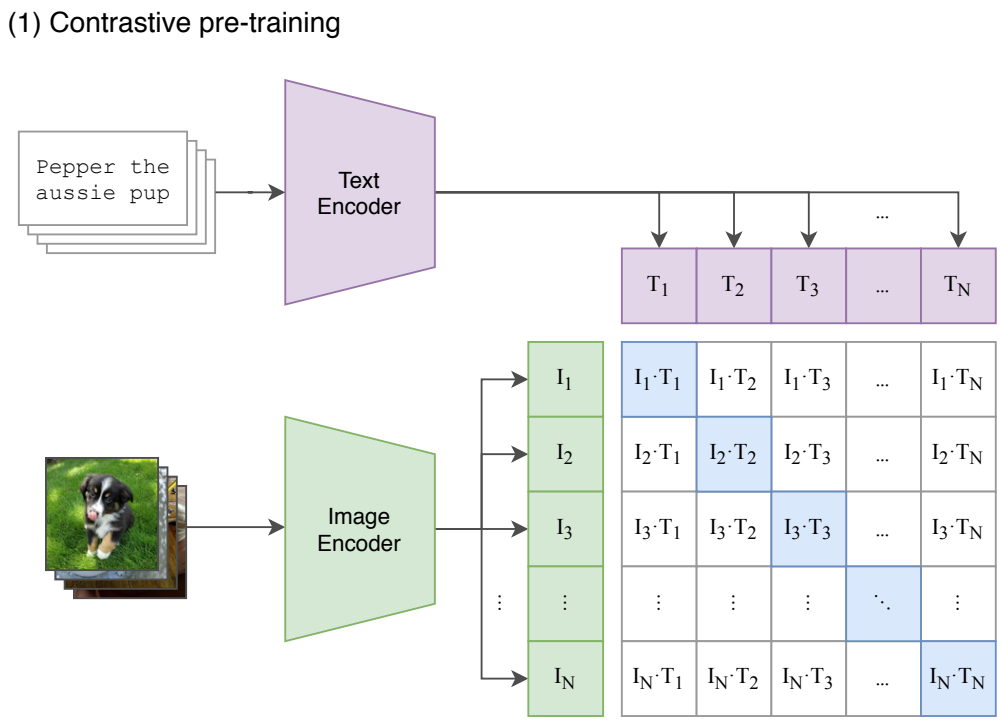


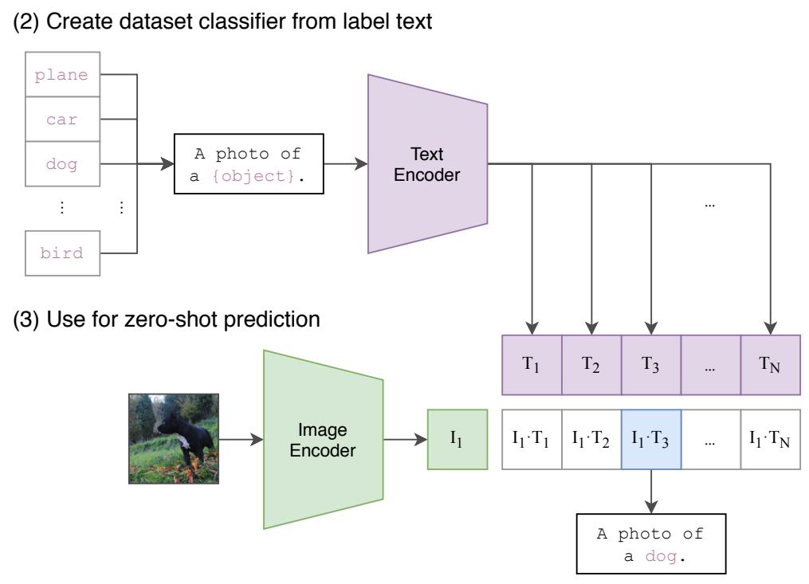


_图 1. 我们的方法概述。虽然标准图像模型联合训练图像特征提取器和线性分类器来预测某些标签，但 CLIP 联合训练图像编码器和文本编码器来预测一批（图像，文本）训练样本的正确配对。在测试时，学习到的文本编码器通过嵌入目标数据集类别的名称或描述来合成零样本线性分类器。_


分类数据集，方法是基于其学习到的视觉 n-gram 字典对目标类别进行评分，并预测得分最高的那个。采用更先进的架构和预训练方法，VirTex (Desai & Johnson, 2020)、ICMLM (Bulent Sariyildiz et al., 2020) 和 ConvIRT (Zhang et al., 2020) 最近证明了基于 Transformer 的语言建模、掩码语言建模和对比目标在从文本学习图像表示方面的潜力。

尽管作为概念验证令人兴奋，但利用自然语言监督进行图像表示学习仍然很少见。这可能是因为在通用基准上表现出的性能远低于替代方法。例如，Li et al. (2017) 在零样本设置下在 ImageNet 上仅达到 $11.5\%$ 的准确率。这远低于当前最先进技术 $88.4\%$ 的准确率 (Xie et al., 2020)。它甚至低于经典计算机视觉方法 $50\%$ 的准确率 (Deng et al., 2012)。相反，范围更窄但针对性更强的弱监督使用提高了性能。Mahajan et al. (2018) 表明，在 Instagram 图像上预测与 ImageNet 相关的标签是一种有效的预训练任务。当针对 ImageNet 进行微调时，这些预训练模型将准确率提高了 $5\%$ 以上，并提高了当时的整体最先进水平。Kolesnikov et al. (2019) 和 Dosovitskiy et al. (2020) 还通过预训练模型来预测带有噪声标签的 JFT-300M 数据集的类别，在更广泛的迁移基准上展示了巨大的收益。

这一系列工作代表了从有限数量的监督“黄金标签”学习和从几乎无限量的原始文本学习之间的当前务实折中方案。然而，它并非没有承

诺。这两项工作都精心设计并在此过程中限制了其监督范围，分别为 1000 个和 18291 个类别。自然语言能够通过其通用性表达，因此能够监督更广泛的视觉概念集。这两种方法还使用静态 softmax 分类器来执行预测，并且缺乏动态输出的机制。这严重削弱了它们的灵活性并限制了它们的“零样本”能力。

这些弱监督模型与最近直接从自然语言学习图像表示的探索之间的一个关键区别在于规模。虽然 Mahajan et al. (2018) 和 Kolesnikov et al. (2019) 在数百万到数十亿张图像上训练了他们的模型长达加速器年（accelerator years），但 VirTex、ICMLM 和 ConVIRT 在一到二十万张图像上仅训练了加速器天（accelerator days）。在这项工作中，我们弥合了这一差距，并研究了在大规模下使用自然语言监督训练的图像分类器的行为。得益于互联网上大量公开可用的此类数据，我们创建了一个包含 4 亿个（图像，文本）对的新数据集，并证明了从头开始训练的 ConVIRT 简化版（我们称之为 CLIP，即对比语言-图像预训练）是一种从自然语言监督进行学习的有效方法。我们通过训练一系列跨越近 2 个数量级计算量的八个模型来研究 CLIP 的可扩展性，并观察到迁移性能是计算量的平滑可预测函数 (Hestness et al., 2017; Kaplan et al., 2020)。我们发现 CLIP 与 GPT 系列类似，在预训练期间学会了执行广泛的任务，包括 OCR、地理定位、动作识别等许多其他任务。我们通过在 30 多个现有数据集上对 CLIP 的零样本迁移性能进行基准测试来衡量这一点，并发现

---

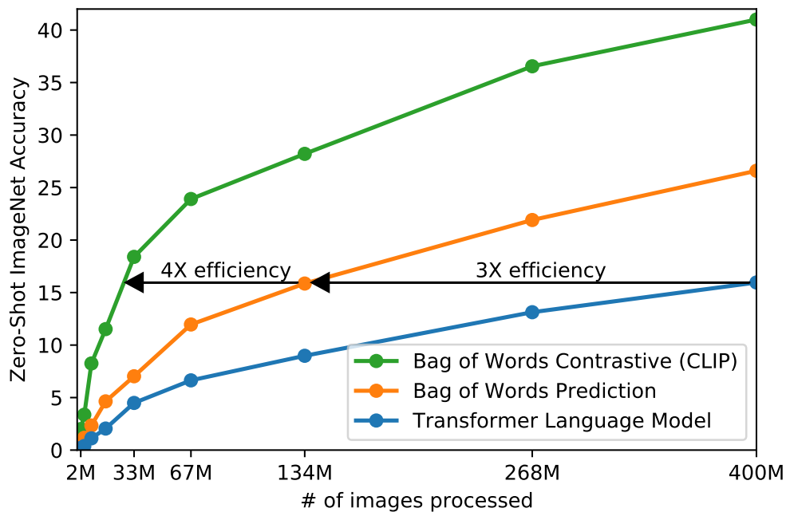


_图 2. 与我们的图像描述基线相比，CLIP 在零样本迁移方面的效率要高得多。尽管表达能力很强，但我们发现基于 Transformer 的语言模型在零样本 ImageNet 分类上相对较弱。在这里，我们可以看到它的学习速度比预测文本词袋（BoW）编码的基线（Joulin 等人，2016）慢 3 倍。将预测目标替换为 CLIP 的对比目标后，效率又提高了 4 倍。_


它可以与先前的特定任务监督模型相竞争。我们还通过线性探针表示学习分析证实了这些发现，并表明 CLIP 优于最好的公开可用的 ImageNet 模型，同时具有更高的计算效率。此外，我们发现零样本 CLIP 模型比同等精度的监督 ImageNet 模型具有更强的鲁棒性，这表明对任务无关模型的零样本评估更能代表模型的能力。这些结果具有重要的政策和伦理影响，我们将在第 7 节中对此进行讨论。


# 2. 方法


# 2.1. 自然语言监督


我们方法的核心思想是从自然语言中包含的监督信息中学习感知。正如引言中所讨论的，这并不是一个全新的想法，然而，用于描述该领域工作的术语各不相同，甚至看似矛盾，且所述动机也多种多样。Zhang 等人（2020）、Gomez 等人（2017）、Joulin 等人（2016）以及 Desai & Johnson（2020）都介绍了从与图像配对的文本中学习视觉表示的方法，但分别将其方法描述为无监督、自监督、弱监督和监督学习。


我们要强调的是，这一系列工作的共同点不在于所用方法的具体细节，而在于将自然语言视为一种训练信号。所有这些方法都在从自然语言监督中学习。尽管早期工作在使用主题模型和 N-gram 表示时受困于自然语言的复杂性，但深度上下文表示学习的进展表明，我们现在拥有了有效利用这种丰富监督来源的工具（McCann 等人，2017）。


与其他训练方法相比，从自然语言学习具有几个潜在优势。与标准的众包图像分类标注相比，扩展自然语言监督要容易得多，因为它不需要标注采用经典的“机器学习兼容格式”，例如标准的 N 选 1 多数投票“黄金标签”。相反，处理自然语言的方法可以从互联网上大量文本中包含的监督信息中被动学习。与大多数无监督或自监督学习方法相比，从自然语言学习还有一个重要优势，即它不仅“只是”学习一种表示，还将该表示与语言联系起来，从而实现灵活的零样本迁移。在接下来的小节中，我们将详细介绍我们确定的特定方法。


# 2.2. 创建足够大的数据集


现有的工作主要使用了三个数据集：MS-COCO（Lin 等人，2014）、Visual Genome（Krishna 等人，2017）和 YFCC100M（Thomee 等人，2016）。虽然 MS-COCO 和 Visual Genome 是高质量的众包标注数据集，但按照现代标准来看它们很小，各自大约只有 10 万张训练照片。相比之下，其他计算机视觉系统是在多达 35 亿张 Instagram 照片上训练的（Mahajan 等人，2018）。YFCC100M 拥有 1 亿张照片，是一个可能的替代方案，但每张图像的元数据稀疏且质量参差不齐。许多图像使用自动生成的文件名（如 20160716_113957.JPG）作为“标题”，或者包含相机曝光设置的“描述”。在过滤后仅保留带有自然语言标题和/或英文描述的图像后，数据集缩小了 6 倍，只剩下 1500 万张照片。这大约与 ImageNet 的大小相同。


自然语言监督的一个主要动机是互联网上公开存在的大量此类形式的数据。由于现有数据集不能充分反映这种可能性，仅考虑它们上的结果会低估这一研究方向的潜力。为了解决这个问题，我们构建了一个新的数据集，包含从互联网上各种公开来源收集的 4 亿个（图像，文本）对。为了尝试覆盖尽可能广泛的视觉概念，我们在构建过程中搜索（图像，文本）对，其文本包含一组 500,000 个查询中的一个。<sup>1</sup> 我们大约对类别进行了


<sup>1</sup>基础查询列表是英文维基百科中所有出现至少 100 次的单词。在此基础上增加了二元语法

---

---

我们通过包含每个查询最多 20,000 个（图像，文本）对来平衡结果。生成的数据集的总词数与用于训练 GPT-2 的 WebText 数据集相似。我们将该数据集称为 WIT，即 WebImageText。

# 2.3. 选择一种高效的预训练方法

最先进的计算机视觉系统使用了大量的计算资源。Mahajan 等人（2018）训练 ResNeXt101-32x48d 需要 19 GPU 年，Xie 等人（2020）训练 Noisy Student EfficientNet-L2 需要 33 TPUv3 核年。考虑到这两个系统都仅用于预测 1000 个 ImageNet 类别，从自然语言中学习开放式视觉概念的任务似乎令人望而生畏。在我们努力的过程中，我们发现训练效率是成功扩展自然语言监督的关键，我们根据这一指标选择了最终的预训练方法。

我们最初的方法类似于 VirTex，从头开始联合训练图像 CNN 和文本 Transformer 以预测图像的标题。然而，我们在高效扩展此方法时遇到了困难。在图 2 中，我们展示了一个拥有 6300 万参数的 Transformer 语言模型（其计算量已经是 ResNet-50 图像编码器的两倍）学习识别 ImageNet 类别的速度，比预测相同文本的词袋编码的简单基线慢了三倍。

这两种方法都有一个关键的相似之处。它们试图预测每张图像伴随的文本的确切单词。由于与图像共现的描述、评论和相关文本种类繁多，这是一项艰巨的任务。近期在图像对比表示学习方面的工作发现，对比目标可以学习比其等效预测目标更好的表示（Tian 等人，2019）。其他工作发现，尽管生成模型可以学习高质量的图像表示，但它们需要的计算量比具有相同性能的对比模型多一个数量级以上（Chen 等人，2020a）。注意到这些发现，我们探索训练一个系统来解决可能更容易的代理任务，即仅预测哪些文本作为一个整体与哪些图像配对，而不是预测该文本的确切单词。从相同的词袋编码基线开始，我们在图 2 中将预测目标替换为对比目标，观察到在向 ImageNet 零样本迁移的效率上进一步提高了 $4\mathrm{x}$。

给定一批 $ N $ 个（图像，文本）对，CLIP 被训练来预测一批中 $ N \times N $ 种可能的（图像，文本）配对中哪一种实际发生了。为此，CLIP 学习了一个

具有高点态互信息以及所有超过特定搜索量的维基百科文章的名称。最后，所有尚未在查询列表中的 WordNet 同义词集都被添加进去。

多模态嵌入空间，通过联合训练图像编码器和文本编码器，以最大化批次中 $N$ 个真实对的图像和文本嵌入的余弦相似度，同时最小化 $N^2 - N$ 个错误配对的嵌入的余弦相似度。我们针对这些相似度分数优化了一个对称交叉熵损失。在图 3 中，我们包含了 CLIP 实现核心的伪代码。据我们所知，这种批次构建技术和目标首先在深度度量学习领域被 Sohn (2016) 作为多类 $N$-pair 损失引入，随后被 Oord 等人（2018）作为 InfoNCE 损失在对比表示学习中普及，最近被 Zhang 等人（2020）改编用于医学影像领域的对比（文本，图像）表示学习。

由于我们的预训练数据集规模很大，过拟合不是一个主要问题，与 Zhang 等人（2020）的实现相比，训练 CLIP 的细节得到了简化。我们从零开始训练 CLIP，不使用 ImageNet 权重初始化图像编码器，也不使用预训练权重初始化文本编码器。我们不使用表示和对比嵌入空间之间的非线性投影，这一变化是由 Bachman 等人（2019）引入并由 Chen 等人（2020b）推广的。相反，我们仅使用线性投影将每个编码器的表示映射到多模态嵌入空间。我们没有注意到这两个版本在训练效率上的差异，并推测非线性投影可能仅在自监督表示学习方法中与当前图像的细节协同适应。我们还删除了 Zhang 等人（2020）中的文本转换函数 $ t_{u} $，该函数从文本中均匀采样单个句子，因为 CLIP 预训练数据集中的许多（图像，文本）对只有一个句子。我们还简化了图像转换函数 $ t_{v} $。来自调整大小后图像的随机方形裁剪是训练期间使用的唯一数据增强。最后，控制 softmax 中 logits 范围的温度参数 $ \tau $，在训练期间作为对数参数化的乘法标量直接进行优化，以避免将其作为超参数进行调整。

# 2.4. 选择并扩展模型

我们为图像编码器考虑了两种不同的架构。对于第一种，我们使用 ResNet-50 (He et al., 2016a) 作为图像编码器的基础架构，因为它的广泛采用和经过验证的性能。我们对原始版本进行了一些修改，使用了 He 等人（2019）的 ResNet-D 改进和 Zhang（2019）的抗锯齿 rect-2 模糊池化。我们还用注意力池化机制替换了全局平均池化层。注意力池化被实现为单层“Transformer 风格”的多头 QKV 注意力，其中查询以全局平均池化结果为条件

---

---

```markdown
# 图像编码器 - ResNet 或 Vision Transformer
# 文本编码器 - CBOW 或 Text Transformer
# I[n, h, w, c] - 对齐图像的小批量
# T[n, l] - 对齐文本的小批量
# W_i[d_i, d_e] - 图像到嵌入的习得投影
# W_t[d_t, d_e] - 文本到嵌入的习得投影
# t - 习得的温度参数
```

```python
提取每个模态的特征表示 I_f = imageEncoder(I) #[n, d_i] T_f = textEncoder(T) #[n, d_t]
```

```cpp
# 联合多模态嵌入 [n, d_e]
I_e = l2_normalize(np.dot(I_f, W_i), axis=1)
T_e = l2_normalize(np.dot(T_f, W_t), axis=1)
```

```python
缩放的成对余弦相似度 [n, n]  
logits = np.dot(I_e, T_e.T) * np.exp(t)
```

```python
对称损失函数   
labels = np.arange(n)
loss_i = cross_entropy_loss(logits, labels, axis = 0)
loss_t = cross_entropy_loss(logits, labels, axis = 1)
loss = (loss_i + loss_t)/2
```

_图 3. CLIP 实现核心部分的类 Numpy 伪代码。_

图像的表示。对于第二种架构，我们实验了最近提出的 Vision Transformer (ViT) (Dosovitskiy et al., 2020)。我们紧密遵循了他们的实现，仅做了微小的修改：在 Transformer 之前对组合的 patch 和位置嵌入增加了一个额外的层归一化，并使用了稍有不同的初始化方案。

文本编码器是一个 Transformer (Vaswani et al., 2017)，其架构修改描述于 Radford et al. (2019)。作为基础尺寸，我们使用了一个 6300 万参数的 12 层、宽度为 512 的模型，具有 8 个注意力头。Transformer 处理文本的小写字节对编码（BPE）表示，词汇表大小为 49,152 (Sennrich et al., 2015)。为了计算效率，最大序列长度被限制为 76。文本序列用 [SOS] 和 [EOS] 标记括起来，Transformer 在 [EOS] 标记处的最高层的激活被视为文本的特征表示，该表示经过层归一化，然后线性投影到多模态嵌入空间中。在文本编码器中使用了掩码自注意力，以保留使用预训练语言模型进行初始化的能力或将语言建模作为辅助目标添加，尽管对此的探索留作未来的工作。

虽然以前的计算机视觉研究通常通过单独增加宽度 (Mahajan et al., 2018) 或深度 (He et al., 2016a) 来扩展模型，但对于 ResNet 图像编码器，我们采用了 Tan & Le (2019) 的方法，他们发现将额外的计算分配给宽度、深度和分辨率的所有方面，其性能优于仅将其分配给

模型的一个维度。虽然 Tan & Le (2019) 为他们的 EfficientNet 架构调整了分配给每个维度的计算比例，但我们使用了一个简单的基线，即平均分配额外的计算来增加模型的宽度、深度和分辨率。对于文本编码器，我们仅按比例扩展模型的宽度，使其与 ResNet 计算出的宽度增加成正比，而根本不扩展深度，因为我们发现 CLIP 的性能对文本编码器的容量不太敏感。

# 2.5. 训练

我们训练了一系列 5 个 ResNet 和 3 个 Vision Transformer。对于 ResNet，我们训练了一个 ResNet-50，一个 ResNet-101，然后还有 3 个遵循 EfficientNet 风格模型缩放的模型，分别使用了大约 ResNet-50 4 倍、16 倍和 64 倍的计算量。它们分别表示为 RN50x4、RN50x16 和 RN50x64。对于 Vision Transformer，我们训练了一个 ViT-B/32、一个 ViT-B/16 和一个 ViT-L/14。我们训练所有模型 32 个轮次。我们使用 Adam 优化器 (Kingma & Ba, 2014)，对除增益和偏置之外的所有权重应用解耦的权重衰减正则化 (Loshchilov & Hutter, 2017)，并使用余弦计划 (Loshchilov & Hutter, 2016) 衰减学习率。初始超参数是通过网格搜索、随机搜索和在基线 ResNet-50 模型上训练 1 个轮次时的手动调整相结合来设置的。由于计算限制，超参数随后针对更大的模型进行了启发式调整。可学习的温度参数 $\tau$ 初始化为相当于 (Wu et al., 2018) 中的 0.07，并被裁剪以防止 logits 缩放超过 100，我们发现这对于防止训练不稳定是必要的。我们使用了非常大的小批量大小 32,768。使用混合精度 (Micikevicius et al., 2017) 来加速训练并节省内存。为了节省额外的内存，使用了梯度检查点 (Griewank & Walther, 2000; Chen et al., 2016)、半精度 Adam 统计数据 (Dhariwal et al., 2020) 和半精度随机舍入的文本编码器权重。嵌入相似度的计算也被分片，单个 GPU 仅计算其本地嵌入批次所需的成对相似度的子集。最大的 ResNet 模型 RN50x64 在 592 个 V100 GPU 上训练了 18 天，而最大的 Vision Transformer 在 256 个 V100 GPU 上训练了 12 天。对于 ViT-L/14，我们还在更高的 336 像素分辨率下预训练了一个额外的轮次，以类似于 FixRes (Touvron et al., 2019) 的方式提升性能。我们将此模型表示为 ViT-L/14@336px。除非另有说明，本文报告的所有“CLIP”结果都使用这个我们发现性能最好的模型。
```

---

# 3. 实验

# 3.1. 零样本迁移

# 3.1.1. 动机

在计算机视觉领域，零样本学习通常指的是在图像分类中泛化到未见过的物体类别的研究（Lampert et al., 2009）。而我们是在更广泛的意义上使用这个术语，研究向未见过的数据集的泛化能力。我们将此作为执行未见任务的一种代理，正如 Larochelle et al. (2008) 在零数据学习论文中所期望的那样。虽然无监督学习领域的许多研究主要集中在机器学习系统的表征学习能力上，但我们主张研究零样本迁移，将其作为衡量机器学习系统任务学习能力的一种方式。在这种观点下，数据集评估的是特定分布下的任务性能。然而，许多流行的计算机视觉数据集是由研究界创建的，主要作为指导通用图像分类方法发展的基准，而不是衡量特定任务上的性能。虽然可以说 SVHN 数据集衡量的是 Google 街景照片分布下的街道号码转录任务，但尚不清楚 CIFAR-10 数据集衡量的是什么“真实”任务。然而，很清楚的是 CIFAR-10 是从什么分布中提取的——TinyImages（Torralba et al., 2008）。对于这类数据集，零样本迁移更多是对 CLIP 针对分布偏移的鲁棒性和领域泛化能力的评估，而不是任务泛化能力。请参阅第 3.3 节中针对此点的分析。

据我们所知，Visual N-Grams（Li et al., 2017）首先以上述方式研究了向现有图像分类数据集的零样本迁移。这也是我们所知的唯一另一项使用通用预训练模型研究向标准图像分类数据集进行零样本迁移的工作，并且是作为为 CLIP 提供背景信息的最佳参考点。他们的方法学习了一个包含 142,806 个视觉 n-gram（涵盖 1 到 5-gram）的字典的参数，并使用 Jelinek-Mercer 平滑的微分版本优化这些 n-gram，以最大化给定图像的所有文本 n-gram 的概率。为了执行零样本迁移，他们首先将数据集每个类别的名称文本转换为其 n-gram 表示，然后根据其模型计算其概率，预测得分最高的那个。

我们专注于研究零样本迁移作为任务学习评估的动机，源于 NLP 领域展示任务学习的工作。据我们所知，Liu et al. (2018) 首次将任务学习识别为一种“意想不到的副作用”，即一个接受训练以生成维基百科文章的语言模型学会了可靠地在语言之间进行音译。虽然 GPT-1（Radford et al., 2018）主要关注将预训练作为一种改进有监督微调的迁移学习方法，但它也包括了一项消融研究，证明了四种启发式零样本迁移方法的性能在预训练过程中稳步提高，而无需任何有监督的适应。这项分析构成了 GPT-2（Radford et al., 2019）的基础，后者专门通过零样本迁移研究语言模型的任务学习能力。

# 3.1.2. 使用 CLIP 进行零样本迁移

CLIP 经过预训练以预测图像和文本片段是否在其数据集中配对。为了执行零样本分类，我们复用了这一能力。对于每个数据集，我们使用数据集中所有类别的名称作为潜在文本配对集，并根据 CLIP 预测最可能的（图像，文本）对。更详细地说，我们首先通过各自的编码器计算图像的特征嵌入和一组可能文本的特征嵌入。然后计算这些嵌入的余弦相似度，通过温度参数 $\tau$ 进行缩放，并通过 softmax 归一化为概率分布。请注意，这个预测层是一个多项逻辑回归分类器，具有 L2 归一化输入、L2 归一化权重、无偏置和温度缩放。这样解释的话，图像编码器是计算机视觉骨干网络，用于计算图像的特征表示，而文本编码器是一个超网络（Ha et al., 2016），它根据指定类别所代表的视觉概念的文本生成线性分类器的权重。Lei Ba et al. (2015) 首先引入了这种形式的零样本图像分类器，而从自然语言生成分类器的想法至少可以追溯到 Elhoseiny et al. (2013）。继续这种解释，CLIP 预训练的每一步都可以被视为优化针对计算机视觉数据集的随机创建的代理的性能，该数据集每个类有 1 个示例，总共 32,768 个通过自然语言描述定义的类别。对于零样本评估，我们缓存由文本编码器计算出的零样本分类器，并在所有后续预测中复用它。这使得生成它的成本可以分摊到数据集中的所有预测上。

# 3.1.3. 与 Visual N-Grams 的初步比较

在表 1 中，我们将 Visual N-Grams 与 CLIP 进行了比较。最好的 CLIP 模型将 ImageNet 的准确率从概念验证的 $11.5\%$ 提高到了 $76.2\%$，并且尽管没有使用该数据集可用的 128 万个人工标注的训练样本，却匹配了原始 ResNet-50 的性能。此外，CLIP 模型的 top-5 准确率明显高于其 top-1 准确率，该模型的 top-5 准确率达到 $95\%$，匹配了 Inception-V4（Szegedy et al., 2016）。在零样本设置下匹配强大的全监督基线性能的能力表明

---

<table><tr><td></td><td>aYahoo</td><td>ImageNet</td><td>SUN</td></tr><tr><td>Visual N-Grams</td><td>72.4</td><td>11.5</td><td>23.0</td></tr><tr><td>CLIP</td><td>98.4</td><td>76.2</td><td>58.5</td></tr></table>


_表 1. 将 CLIP 与先前的零样本迁移图像分类结果进行比较。CLIP 在所有三个数据集上的性能都有大幅提升。这种改进反映了自 Visual N-Grams (Li et al., 2017) 开发以来的 4 年中存在的许多差异。_


CLIP 是迈向灵活且实用的零样本计算机视觉分类器的重要一步。如上所述，与 Visual N-Grams 的比较旨在为 CLIP 的性能提供背景参考，不应被解读为 CLIP 和 Visual N-Grams 之间的直接方法比较，因为这两个系统之间许多与性能相关的差异并未受到控制。例如，我们在一个规模大 $10\mathrm{x}$ 的数据集上进行训练，使用的视觉模型每次预测所需的计算量几乎多 $100\mathrm{x}$，使用的训练计算量可能超过其 $1000\mathrm{x}$，并且使用了基于 Transformer 的模型，而这种模型在 Visual N-Grams 发表时还不存在。作为更接近的对比，我们在 Visual N-Grams 训练所用的同一 YFCC100M 数据集上训练了一个 CLIP ResNet-50，结果发现在一张 V100 GPU 天内就能达到其报告的 ImageNet 性能。该基线也是从头开始训练的，而不是像 Visual N-Grams 那样从预训练的 ImageNet 权重初始化。


CLIP 在其他 2 个报告的数据集上也优于 Visual N-Grams。在 aYahoo 上，CLIP 将错误数量减少了 $95\%$；在 SUN 上，CLIP 的准确率是 Visual N-Grams 的两倍多。为了进行更全面的分析和压力测试，我们实施了一个更大的评估套件，详见附录 A。总的来说，我们从 Visual N-Grams 中报告的 3 个数据集扩展到包含 30 多个数据集，并与 50 多个现有的计算机视觉系统进行比较，以提供结果背景。


# 3.1.4. 提示工程与集成


大多数标准的图像分类数据集将命名或描述类别的信息视为次要内容，这使得基于自然语言的零样本迁移变得困难。绝大多数数据集仅用标签的数字 ID 对图像进行标注，并包含一个将这些 ID 映射回其英文名称的文件。一些数据集，如 Flowers102 和 GTSRB，在其发布的版本中似乎根本不包含此映射，从而完全阻碍了零样本迁移。对于许多数据集，我们观察到这些标签可能是


2Alec 在这个项目过程中学到了比他最初预期的多得多的花卉品种和德国交通标志知识。


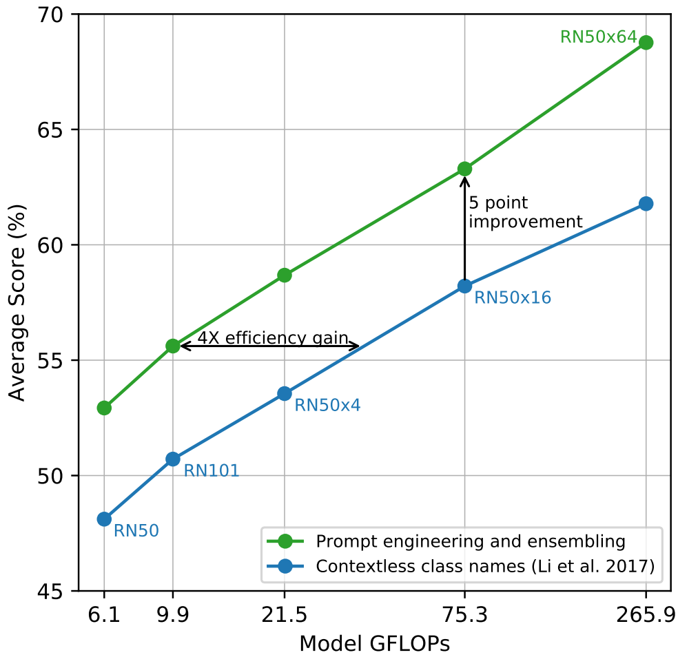


_图 4. 提示工程和集成提高了零样本性能。与使用无上下文类别名称的基线相比，提示工程和集成在 36 个数据集上将零样本分类性能平均提高了近 5 个百分点。这种改进类似于使用 4 倍计算量的基线零样本方法所带来的增益，但在分摊到多次预测时是“免费”的。_


选择得有些随意，并且没有预料到与零样本迁移相关的问题，而零样本迁移依赖于任务描述才能成功迁移。


一个常见的问题是一词多义。当类别的名称是提供给 CLIP 文本编码器的唯一信息时，由于缺乏上下文，它无法区分该词指的是哪种含义。在某些情况下，同一个词的多种含义可能作为不同的类别包含在同一个数据集中！这种情况发生在 ImageNet 中，它既包含建筑起重机，也包含会飞的鹤。另一个例子是在 Oxford-IIIT Pet 数据集的类别中发现的，其中单词 boxer（拳师犬）从上下文看显然是指一种狗的品种，但对于缺乏上下文的文本编码器来说，它同样可能指一种运动员。


我们遇到的另一个问题是，在我们的预训练数据集中，与图像配对的文本仅仅是一个单词的情况相对罕见。通常，文本是一个以某种方式描述图像的完整句子。为了帮助弥合这种分布差距，我们发现使用提示模板 "A photo of a {label}." 是一个很好的默认设置，有助于指定文本是关于图像内容的。这通常比仅使用标签文本的基线能提高性能。例如，仅使用此提示就将 ImageNet 的准确率提高了 $1.3\%$。

---

---

与围绕 GPT-3 展开的“提示工程”讨论（Brown et al., 2020; Gao et al., 2020）类似，我们也观察到，通过针对每项任务定制提示文本，可以显著提升零样本性能。以下是一些非详尽的示例。在多个细粒度图像分类数据集上，我们发现指明类别很有帮助。例如，在 Oxford-IIIT Pets 数据集上，使用“一张 {label}，一种宠物的照片”来提供上下文效果很好。同样地，在 Food101 上指明食物类型，在 FGVC Aircraft 上指明飞机类型也有帮助。对于 OCR 数据集，我们发现将待识别的文本或数字用引号括起来可以提高性能。最后，我们发现对于卫星图像分类数据集，指明图像属于这种形式会有所帮助，我们使用了“一张 {label} 的卫星照片”的变体。

我们还尝试了组合多个零样本分类器作为另一种提升性能的方法。这些分类器是通过使用不同的上下文提示（例如“一张大 {label} 的照片”和“一张小 {label} 的照片”）计算得出的。我们在嵌入空间而不是概率空间上构建集成。这允许我们缓存一组平均后的文本嵌入，使得在分摊到大量预测时，集成的计算成本与使用单个分类器相同。我们观察到，组合许多生成的零样本分类器能可靠地提高性能，并将其用于大多数数据集。在 ImageNet 上，我们集成了 80 种不同的上下文提示，这使得性能比上述单个默认提示额外提高了 $3.5\%$。综合考虑，提示工程和集成将 ImageNet 的准确率提高了近 $5\%$。在图 4 中，我们可视化了提示工程和集成如何改变一组 CLIP 模型的性能，并与 Li et al. (2017) 中直接嵌入类名的无上下文基线方法进行比较。

# 3.1.5. 零样本 CLIP 性能分析

由于针对计算机视觉的任务无关零样本分类器此前研究较少，CLIP 为更好地理解这类模型提供了一个良机。在本节中，我们对 CLIP 零样本分类器的各种特性进行了研究。作为首要问题，我们仅考察零样本分类器的表现如何。为了对此进行背景化分析，我们将性能与一个简单的现成基线进行比较：在标准 ResNet-50 的特征上拟合一个完全监督的、正则化的逻辑回归分类器。在图 5 中，我们展示了跨越 27 个数据集的这种比较。有关数据集和设置的详细信息，请参阅附录 A。

零样本 CLIP 的性能略优于该基线的情况


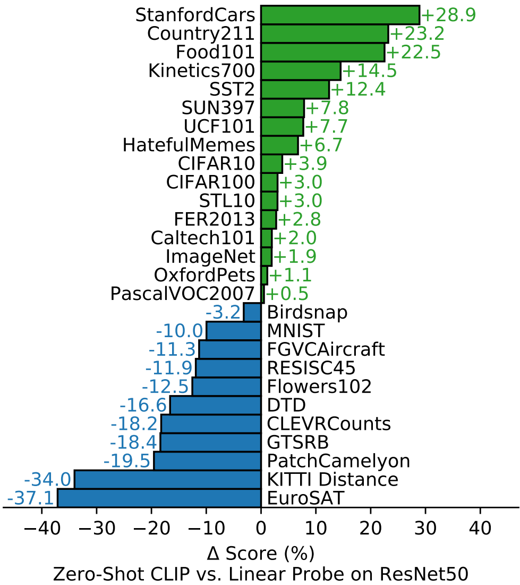


_图 5. 零样本 CLIP 可与完全监督的基线相媲美。在一个包含 27 个数据集的评估套件中，零样本 CLIP 分类器在 16 个数据集（包括 ImageNet）上的表现优于基于 ResNet-50 特征拟合的完全监督线性分类器。_

多于相反的情况，并在 27 个数据集中的 16 个上获胜。观察各个数据集揭示了一些有趣的行为。在细粒度分类任务上，我们观察到性能差异很大。在其中两个数据集 Stanford Cars 和 Food101 上，零样本 CLIP 的性能比 ResNet-50 特征上的逻辑回归高出 $20\%$ 以上；而在另外两个数据集 Flowers102 和 FGVCAircraft 上，零样本 CLIP 则落后超过 $10\%$。在 OxfordPets 和 Birdsnap 上，性能则非常接近。我们怀疑这些差异主要是由于 WIT 和 ImageNet 之间针对特定任务的监督量不同。在 ImageNet、CIFAR10/100、STL10 和 PascalVOC2007 等“通用”物体分类数据集上，性能相对相似，在所有情况下零样本 CLIP 都略有优势。在 STL10 上，CLIP 达到了 $99.3\%$ 的总体准确率，尽管没有使用任何训练样本，这似乎达到了新的最先进水平。零样本 CLIP 在两个测量视频动作识别的数据集上显著优于 ResNet-50。在 Kinetics700 上，CLIP 以 $14.5\%$ 的优势优于 ResNet-50。零样本 CLIP 在 UCF101 上也以 $7.7\%$ 的优势优于 ResNet-50 的特征。我们推测这是由于自然语言为涉及动词的视觉概念提供了更广泛的监督，相比之下 ImageNet 主要是以名词为中心的物体监督。

观察零样本 CLIP 表现明显不佳的地方，

---

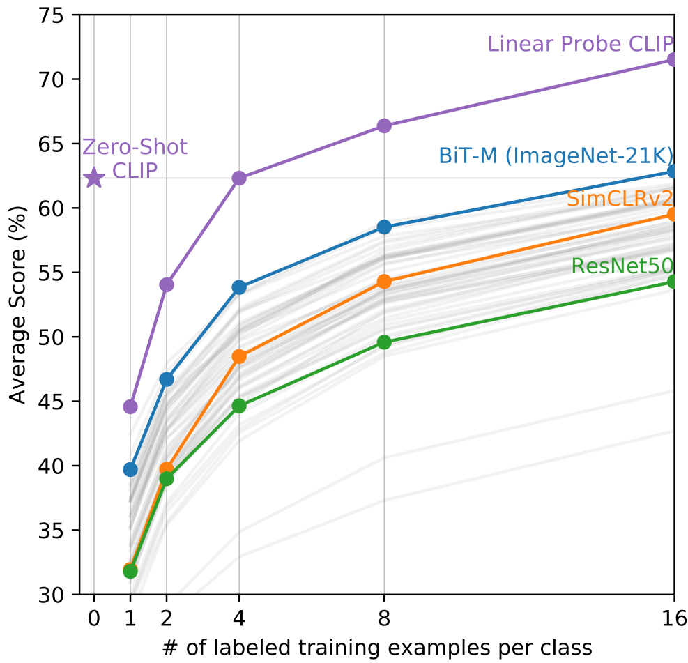


_图 6：零样本 CLIP 优于少样本线性探针。零样本 CLIP 匹配了在相同特征空间上训练的 4 样本线性分类器的平均性能，并且在公开可用模型中几乎匹配了 16 样本线性分类器的最佳结果。对于 BiT-M 和 SimCLRv2，最佳模型已被高亮显示。浅灰色线条表示评估套件中的其他模型。该分析使用了每个类别至少有 16 个样本的 20 个数据集。_


我们发现，零样本 CLIP 在几项专门的、复杂的或抽象的任务上表现相当弱，例如卫星图像分类（EuroSAT 和 RESISC45）、淋巴结肿瘤检测（PatchCamelyon）、合成场景中的物体计数（CLEVRCounts）、自动驾驶相关任务如德国交通标志识别（GTSRB）、识别到最近车辆的距离（KITTI Distance）。这些结果凸显了零样本 CLIP 在更复杂任务上的能力不足。相比之下，非专业人类可以稳健地完成其中的几项任务，如计数、卫星图像分类和交通标志识别，这表明仍有很大的改进空间。然而，我们要提醒的是，对于学习者（如几乎所有人类，可能也包括 CLIP）没有先验经验的困难任务（如淋巴结肿瘤分类），衡量零样本迁移（相对于少样本迁移）是否是一种有意义的评估，目前尚不清楚。


虽然将零样本性能与完全监督模型进行比较可以定位 CLIP 的任务学习能力，但与少样本方法进行比较更为直接，因为零样本是其极限。在图 6 中，我们可视化了零样本 CLIP 与许多图像模型（包括最佳公开可用的 ImageNet 模型、自监督学习方法和 CLIP 本身）特征上的少样本逻辑回归的比较结果。虽然直觉上预期零样本的表现会劣于单样本，但我们却发现，零样本 CLIP 匹配了相同特征空间上 4 样本逻辑回归的性能。这可能是由于零样本和少样本方法之间存在一个重要差异。首先，CLIP 的零样本分类器是通过自然语言生成的，允许直接指定（“传达”）视觉概念。相比之下，“普通”监督学习必须从训练样本中间接推断概念。缺乏上下文的基于示例的学习有一个缺点，即许多不同的假设可能与数据一致，特别是在单样本的情况下。单张图像通常包含许多不同的视觉概念。尽管有能力的学习者能够利用视觉线索和启发式方法（例如假设所演示的概念是图像中的主要物体），但这并不能保证。


解决零样本和少样本性能之间这种差异的一个潜在方法，是将 CLIP 的零样本分类器作为少样本分类器权重的先验。虽然对生成的权重添加 L2 惩罚是实现这一想法的简单方法，但我们发现，超参数优化往往会选择非常大的正则化值，导致生成的少样本分类器“仅仅”是零样本分类器。研究更好地结合零样本迁移的优势与少样本学习的灵活性的方法，是未来工作有希望的方向。


当在其他模型特征上将零样本 CLIP 与少样本逻辑回归进行比较时，零样本 CLIP 大致匹配了我们评估套件中表现最佳的 16 样本分类器的性能，该分类器使用了在 ImageNet-21K 上训练的 BiT-M ResNet-152x2 的特征。我们确信，在 JFT-300M 上训练的 BiT-L 模型会表现得更好，但这些模型尚未公开发布。BiT-M ResNet-152x2 在 16 样本设置下表现最佳有些令人惊讶，因为正如第 3.2 节所分析的，在完全监督设置下，Noisy Student EfficientNet-L2 在 27 个数据集上的平均性能比它高出近 $5\%$。


除了研究零样本 CLIP 和少样本逻辑回归的平均性能外，我们还检查了单个数据集上的性能。在图 7 中，我们展示了估计值，即相同特征空间上的逻辑回归分类器每类需要多少个标记样本才能匹配零样本 CLIP 的性能。由于零样本 CLIP 也是一个线性分类器，这估计了该设置下零样本迁移的有效数据效率。为了避免训练数千个线性分类器，我们基于 1、2、4、8、16 样本（如果可能）和在每个数据集上训练的完全监督线性分类器的性能的对数线性插值，来估计有效数据效率。我们发现零样本迁移可以

---

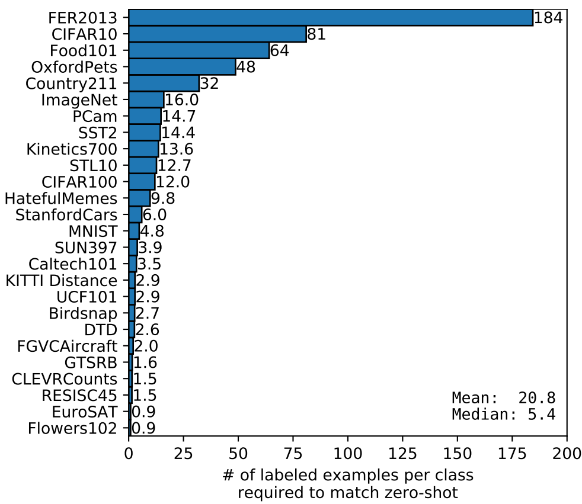


_图 7. 零样本迁移的数据效率差异很大。计算在相同的 CLIP 特征空间上训练的线性分类器达到零样本分类器性能所需的每类标注样本数量，可以直观地展示零样本迁移的有效性。数值是基于 1、2、4、8、16 样本和完全监督结果的对数线性插值估算的。性能差异很大，从在两个数据集上仍不及单样本分类器，到相当于每类 184 个标注样本不等。_


每个数据集的效率差异很大，从每类不到 1 个标注样本到 184 个不等。Flowers102 和 EuroSAT 两个数据集的表现不及单样本模型。一半的数据集每类需要少于 5 个样本，中位数为 5.4。然而，估算的平均数据效率为每类 20.8 个样本。这是因为在 $20\%$ 的数据集中，监督分类器需要许多每类标注样本才能匹配性能。在 ImageNet 上，零样本 CLIP 匹配了在相同特征空间上训练的 16 样本线性分类器的性能。

如果我们假设评估数据集足够大，以至于在其上训练的线性分类器的参数能够得到很好的估计，那么，由于 CLIP 的零样本分类器也是一个线性分类器，完全监督分类器的性能大致设定了零样本迁移所能达到的上限。在图 8 中，我们比较了 CLIP 在各个数据集上的零样本性能与完全监督线性分类器的性能。虚线 $ y = x $ 代表了与其完全监督等效模型性能相匹配的“最优”零样本分类器。对于大多数数据集，零样本分类器的性能仍然比完全监督分类器低 $ 10\% $ 到 $ 25\%$，这表明在改进 CLIP 的任务学习和零样本迁移能力方面仍有很大的提升空间。


零样本性能与完全监督性能之间存在 0.82 的正相关关系（p 值 $< 10^{-6}$），这表明 CLIP 在连接底层表示和任务学习以实现零样本迁移方面相对一致。然而，零样本 CLIP 仅在 5 个数据集上接近完全监督性能：STL10、CIFAR10、Food101、OxfordPets 和 Caltech101。在这所有 5 个数据集上，零样本准确率和完全监督准确率都超过 $90\%$。这表明，对于 CLIP 底层表示质量较高的任务，其在零样本迁移上可能更有效。预测零样本性能作为完全监督性能函数的线性回归模型的斜率估计，完全监督性能每提高 $1\%$，零样本性能提高 $1.28\%$。然而，95% 置信区间仍包含小于 1 的值（0.93-1.79）。


在过去的几年中，深度学习系统的实证研究已经记录了性能作为训练计算量和数据集大小等重要变量的函数是可预测的（Hestness et al., 2017; Kaplan et al., 2020）。GPT 系列模型迄今为止在训练计算量增加 $1000\mathrm{x}$ 的情况下，始终显示出零样本性能的提升。在图 9 中，我们检查了 CLIP 的零样本性能是否遵循类似的缩放模式。我们绘制了 5 个 ResNet CLIP 模型在 36 个不同数据集上的 39 次评估的平均错误率，发现 CLIP 在模型计算量增加 $44\mathrm{x}$ 的范围内也存在类似的对数-线性缩放趋势。虽然总体趋势是平滑的，但我们发现个别评估的性能可能要嘈杂得多。我们不确定是否

---

---

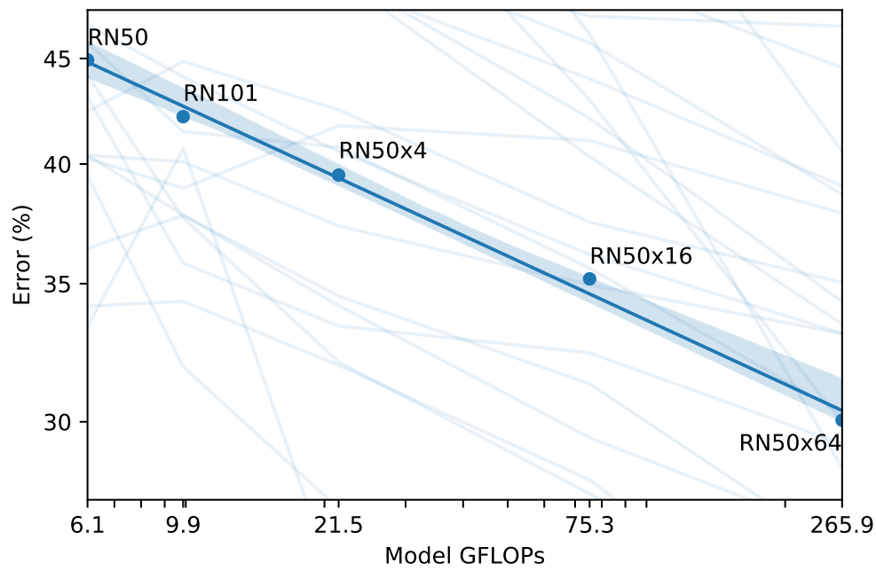


_图 9. 零样本 CLIP 性能随模型算力平滑扩展。在 36 个不同数据集上的 39 项评估中，平均零样本错误率在跨越 5 个不同 CLIP 模型、$44\mathrm{x}$ 倍算力范围内，呈现出良好的对数线性趋势。浅色阴影线表示各项单独评估的性能，表明尽管整体趋势平滑，但性能表现仍然存在较大差异。_


这是由于子任务上各个训练运行之间的高方差（如 D'Amour 等人 (2020) 所记录）掩盖了稳步改进的趋势，还是因为在某些任务上性能随算力的变化实际上是非单调的。

# 3.2. 表征学习


虽然我们在上一节中通过零样本迁移广泛分析了 CLIP 的任务学习能力，但研究模型的表征学习能力更为常见。评估表征质量的方法有很多，而且对于“理想”表征应具备哪些属性也存在分歧（Locatello 等人，2020）。一种常见的方法是在从模型中提取的表征上拟合一个线性分类器，并测量其在各种数据集上的性能。另一种方法是测量模型端到端微调的性能。这增加了灵活性，先前的研究已经令人信服地证明，在大多数图像分类数据集上，微调优于线性分类（Kornblith 等人，2019；Zhai 等人，2019）。虽然微调的高性能出于实际原因推动了对其的研究，但我们出于几个原因仍然选择基于线性分类器的评估。我们的工作重点是开发一种高性能的、与任务和数据集无关的预训练方法。微调因为在微调阶段使表征适应每个数据集，可以补偿并可能掩盖预训练阶段未能学习通用和稳健表征的缺陷。相反，线性分类器由于其灵活性有限，会凸显这些缺陷，并在开发过程中提供清晰的反馈。对于 CLIP，训练监督线性


分类器还有一个额外的好处，即与其零样本分类器使用的方法非常相似，这使得我们能够在第 3.1 节中进行广泛的比较和分析。最后，我们的目标是在许多任务上将 CLIP 与现有的综合模型集进行比较。在 27 个不同的数据集上研究 66 个不同的模型需要调整 1782 个不同的评估。微调开启了一个更大的设计和超参数空间，这使得正如其他大规模实证研究（Lucic 等人，2018；Choi 等人，2019）中所讨论的那样，难以公平评估且计算成本高昂以比较一组多样化的技术。相比之下，线性分类器只需要最少的超参数调整，并且具有标准化的实现和评估程序。有关评估的更多详细信息，请参阅附录 A。


图 10 总结了我们的发现。为了最小化可能引起确认或报告偏差担忧的选择效应，我们首先在 Kornblith 等人 (2019) 的 12 个数据集评估套件上研究性能。虽然像 ResNet-50 和 ResNet-101 这样的小型 CLIP 模型优于在 ImageNet-1K 上训练的其他 ResNet（BiT-S 和原始模型），但它们的表现不如在 ImageNet-21K 上训练的 ResNet（BiTM）。这些小型 CLIP 模型的表现也低于具有相似算力要求的 EfficientNet 系列模型。然而，使用 CLIP 训练的模型扩展性非常好，我们训练的最大的模型（ResNet-50x64）在整体得分和算力效率方面均略优于表现最佳的现有模型（Noisy Student EfficientNet-L2）。我们还发现，CLIP 视觉 Transformer 的算力效率比 CLIP ResNet 高出约 3 倍，这使我们要能够在我们的算力预算内达到更高的整体性能。这些结果定性地复现了 Dosovitskiy 等人 (2020) 的发现，该报告称视觉 Transformer 在足够大的数据集上训练时比卷积网络具有更高的算力效率。我们要整体最佳的模型是一个 ViT-L/14，它在我们的数据集上以更高的 336 像素分辨率进行了 1 个额外轮次的微调。该模型在该评估套件上的表现平均优于最佳现有模型 $2.6\%$。


正如图 21 定性展示的那样，CLIP 模型学习的任务集比以前在从随机初始化开始端到端训练的单个计算机视觉模型中展示的任务集更广泛。这些任务包括地理定位、光学字符识别、面部情绪识别和动作识别。这些任务均未在 Kornblith 等人 (2019) 的评估套件中测量。这可以被认为是 Kornblith 等人 (2019) 的研究中存在一种偏向于与 ImageNet 重叠任务的选择偏差。为了解决这个问题，我们还测量了更广泛的 27 个数据集评估套件上的性能。该评估套件详见附录 A，其中包括代表上述任务的数据集、德国交通标志识别基准（Stallkamp 等人，2011）以及从 VTAB 改编的几个其他数据集（Zhai 等人，2019）。

---

---

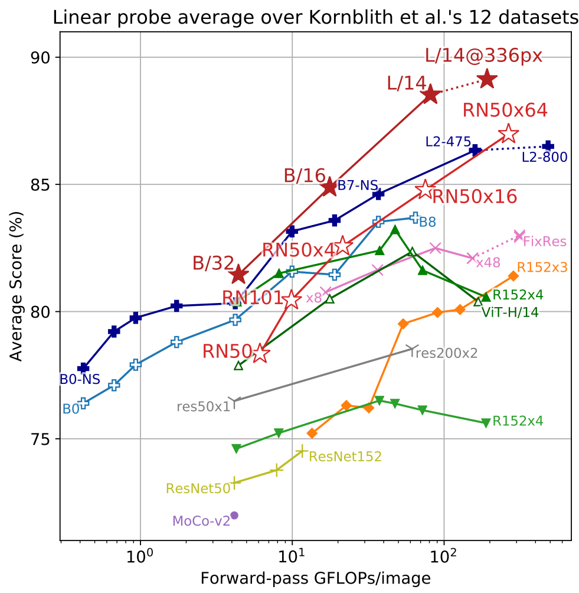


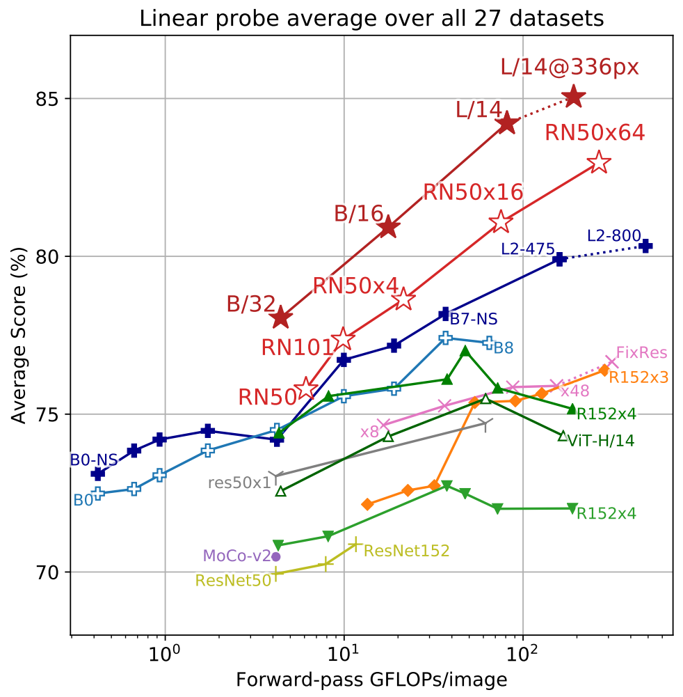


_CLIP-ViT_


_CLIP-ResNet_


_EfficientNet-NoisyStudent_


_EfficientNet_


_- Instagram预训练_


_SimCLRv2_


_BYOL_


_MoCo_


_ViT (ImageNet-21k)_


_BiT-M_


_BiT-S_


_ResNet_


_图 10. CLIP 模型与最先进的计算机视觉模型（包括 EfficientNet (Tan & Le, 2019; Xie et al., 2020)、MoCo (Chen et al., 2020d)、Instagram 预训练的 ResNeXt 模型 (Mahajan et al., 2018; Touvron et al., 2019)、BiT (Kolesnikov et al., 2019)、ViT (Dosovitskiy et al., 2020)、SimCLRv2 (Chen et al., 2020c)、BYOL (Grill et al., 2020) 以及原始的 ResNet 模型 (He et al., 2016b)）的线性探测性能对比。（左）分数是 Kornblith et al. (2019) 研究的 12 个数据集的平均值。（右）分数是包含更多样分布的 27 个数据集的平均值。虚线表示在高于预训练分辨率的图像上进行微调或评估的模型。具体分数见表 10，每个数据集的图表见图 20。_


在这个更广泛的评估套件中，CLIP 的优势更加明显。所有 CLIP 模型，无论规模大小，在计算效率方面都优于所有评估的系统。最佳模型相比以往系统的平均分数提升从 $2.6\%$ 增加到了 $5\%$。我们还发现，自监督系统在我们更广泛的评估套件上表现明显更好。例如，虽然 SimCLRv2 在 Kornblith et al. (2019) 的 12 个数据集上的平均表现仍然不如 BiT-M，但在我们的 27 个数据集评估套件上，SimCLRv2 优于 BiT-M。这些发现表明，为了更好地理解系统的“通用”性能，应继续扩大任务的多样性和覆盖范围。我们认为沿着 VTAB 方向进行的额外评估工作将是有价值的。


除了上述汇总分析外，我们还在图 11 中展示了最佳 CLIP 模型与我们评估套件中的最佳模型在所有 27 个数据集上的性能差异的可视化。CLIP 在 27 个数据集中的 21 个上优于 Noisy Student EfficientNet-L2。CLIP 在需要 OCR（SST2


和 Hateful Memes）、地理定位和场景识别（Country211、SUN397）以及视频活动识别（Kinetics700 和 UCF101）的任务上提升最大。此外，CLIP 在细粒度的汽车和交通标志识别（Stanford Cars 和 GTSRB）上也表现好得多。这可能反映了 ImageNet 中监督过于狭窄的问题。例如在 GTSRB 上 $14.7\%$ 的提升可能表明 ImageNet-1K 存在问题，该数据集对所有交通和街道标志只有一个标签。这可能会鼓励监督表示忽略类内细节，从而损害细粒度下游任务的准确性。如前所述，CLIP 在几个数据集上的表现仍然不如 EfficientNet。不出所料，EfficientNet 相对于 CLIP 表现最好的数据集正是其训练所用的数据集：ImageNet。EfficientNet 在 CIFAR10 和 CIFAR100 等低分辨率数据集上也略优于 CLIP。我们怀疑这至少部分是由于 CLIP 缺乏基于规模的数据增强。EfficientNet 在 PatchCamelyon 和 CLEVRCounts 上也略好一些，这些数据集的整体性能仍然

---

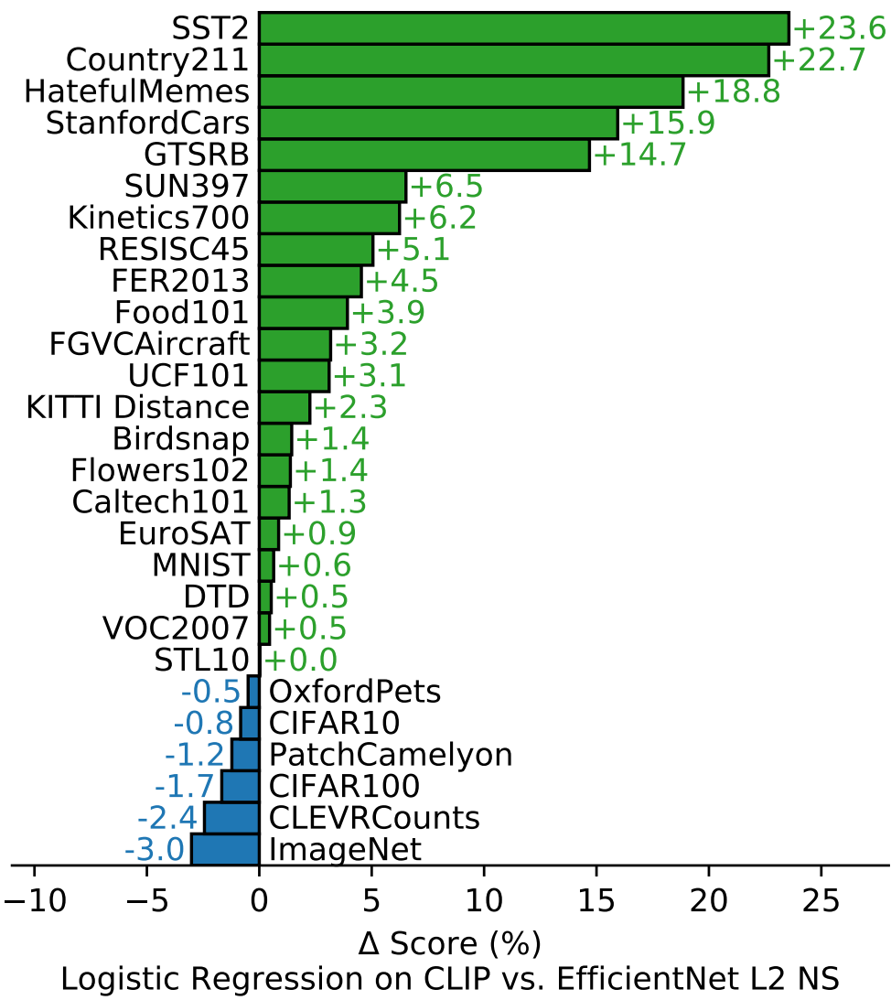


_图 11. 在多种数据集上，CLIP 的特征优于最佳的 ImageNet 模型的特征。在 27 个数据集中的 21 个上，基于 CLIP 特征拟合的线性分类器优于使用 Noisy Student EfficientNet-L2。_


对于这两种方法来说，（错误率）都很低。

# 3.3. 对自然分布偏移的鲁棒性


2015 年，有研究宣布深度学习模型在 ImageNet 测试集上的表现超过了人类 (He et al., 2015)。然而，随后几年的研究反复发现，这些模型仍会犯许多简单的错误 (Dodge & Karam, 2017; Geirhos et al., 2018; Alcorn et al., 2019)，并且测试这些系统的新基准通常发现其性能远低于其 ImageNet 准确率和人类准确率 (Recht et al., 2019; Barbu et al., 2019)。是什么解释了这种差异？各种想法已被提出和研究 (Ilyas et al., 2019; Geirhos et al., 2020)。所提出的解释的一个共同主题是，深度学习模型非常擅长发现在其训练数据集上成立的关联和模式，从而提高了分布内（in-distribution）的性能。然而，其中许多关联和模式实际上是虚假的，并不适用于其他分布，导致在其他数据集上的性能大幅下降。


我们要提醒的是，迄今为止，大多数这些研究将其评估限制在 ImageNet 上训练的模型。回顾讨论的主题，从这些初步发现中过度概括可能是一个错误。这些失败在多大程度上归因于深度学习、ImageNet，或两者的某种结合？CLIP 模型通过在非常大的数据集上进行自然语言监督训练，并且能够实现高零样本性能，为从不同角度研究这个问题提供了一个机会。


Taori et al. (2020) 是最近的一项综合研究，旨在量化和理解 ImageNet 模型的这些行为。Taori et al. (2020) 研究了在自然分布偏移上评估时，ImageNet 模型的性能如何变化。他们测量了一组 7 种分布偏移的性能：ImageNetV2 (Recht et al., 2019)、ImageNet Sketch (Wang et al., 2019)、Youtube-BB 和 ImageNet-Vid (Shankar et al., 2019)、ObjectNet (Barbu et al., 2019)、ImageNet Adversarial (Hendrycks et al., 2019) 和 ImageNet Rendition (Hendrycks et al., 2020a)。他们将这些由从各种来源收集的新图像组成的数据集，与合成分布偏移（如 ImageNet-C (Hendrycks & Dietterich, 2019)、Stylized ImageNet (Geirhos et al., 2018) 或对抗性攻击 (Goodfellow et al., 2014)）区分开来，后者是通过以各种方式扰动现有图像创建的。他们提出这种区分的部分原因是，他们发现虽然几种技术已被证明可以提高合成分布偏移的性能，但它们往往无法在自然分布上产生一致的改进。$^3$


在这些收集的数据集中，ImageNet 模型的准确率远低于 ImageNet 验证集设定的预期。在下面的总结讨论中，除非另有说明，我们报告所有 7 个自然分布偏移数据集的平均准确率以及 ImageNet 相应类子集的平均准确率。此外，对于具有两种不同评估设置的 Youtube-BB 和 ImageNet-Vid，我们使用 pm-0 和 pm-10 准确率的平均值。


与在 ImageNet 验证集上评估相比，ResNet-101 在这些自然分布偏移上评估时犯的错误要多 5 倍。然而令人鼓舞的是，Taori et al. (2020) 发现分布偏移下的准确率随着 ImageNet 准确率的增加而可预测地增加，并且可以很好地建模为 logit 转换准确率的线性函数。Taori et al. (2020) 利用这一发现提出，鲁棒性分析应该区分有效鲁棒性和相对鲁棒性。有效鲁棒性测量的是分布偏移下的准确率改进，其超出了分布内和分布外准确率之间记录关系所预测的改进。相对鲁棒性捕获分布外准确率的任何改进。Taori et al. (2020) 认为，鲁棒性技术应旨在同时提高有效鲁棒性和相对鲁棒性。


Taori et al. (2020) 中研究的几乎所有模型都受过训练


<sup>3</sup>关于该主张的额外实验和讨论，我们请读者参阅 Hendrycks et al. (2020a)。

---

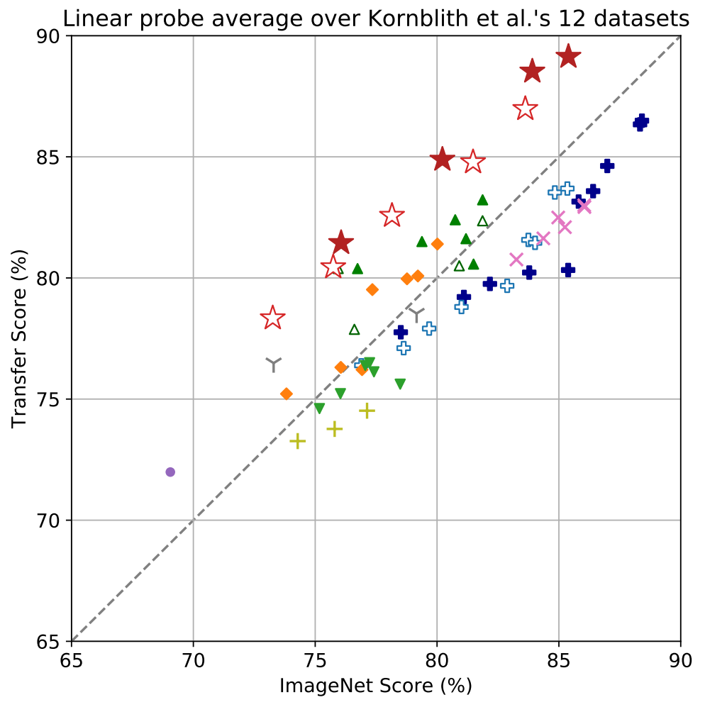


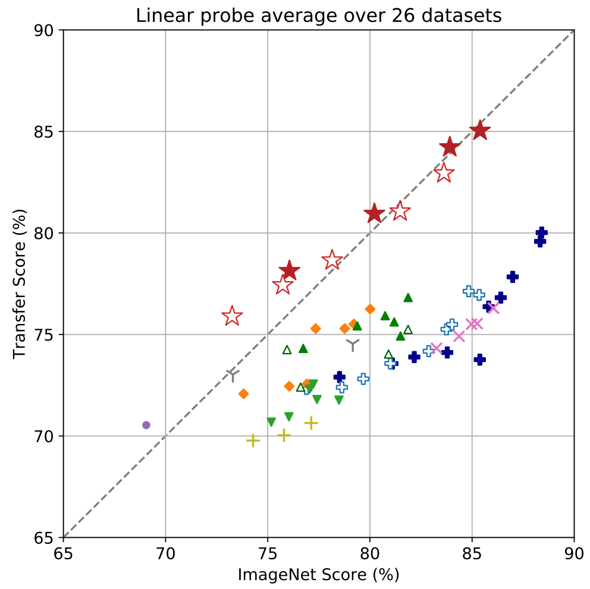


<table><tr><td>★</td><td>CLIP-ViT</td><td>×</td><td>Instagram</td><td>△</td><td>ViT (ImageNet-21k)</td></tr><tr><td>☆</td><td>CLIP-ResNet</td><td>◇</td><td>SimCLRv2</td><td>▲</td><td>BiT-M</td></tr><tr><td>+</td><td>EfficientNet-NoisyStudent</td><td>丫</td><td>BYOL</td><td>▼</td><td>BiT-S</td></tr><tr><td>+</td><td>EfficientNet</td><td>●</td><td>MoCo</td><td>+</td><td>ResNet</td></tr></table>


_图 12. 与在 ImageNet 上预训练的模型相比，CLIP 的特征对任务转移具有更强的鲁棒性。对于这两种数据集划分，在 CLIP 模型表示上训练的线性探针的迁移得分高于具有类似 ImageNet 性能的其他模型。这表明在 ImageNet 上训练的模型的表示在一定程度上对其任务过拟合了。_


或在 ImageNet 数据集上进行了微调。回到本节引言中的讨论——针对 ImageNet 数据集分布进行训练或适应是否是导致观察到的鲁棒性差距的原因？直观地看，零样本模型不应该能够利用仅在特定分布上成立的虚假相关性或模式，因为它并没有在该分布上进行训练。$ {}^{4} $ 因此，有理由预期零样本模型具有高得多的有效鲁棒性。在图 13 中，我们比较了零样本 CLIP 与现有 ImageNet 模型在自然分布转移下的性能。所有零样本 CLIP 模型都大幅提高了有效鲁棒性，并将 ImageNet 准确率与分布转移下准确率之间的差距缩小了高达 75%。


虽然这些结果表明零样本模型可以更加鲁棒，但这并不一定意味着在 ImageNet 上的监督学习导致了鲁棒性差距。CLIP 的其他细节，例如其大规模且多样化的预训练数据集或自然语言监督的使用，也可能导致


<sup>4</sup>我们要提醒的是，零样本模型仍然可能利用预训练分布和评估分布之间共有的虚假相关性。

模型更加鲁棒，而无论它们是零样本还是微调模型。作为一个初步实验，为了可能开始缩小这一问题的范围，我们还测量了 CLIP 模型在适应 ImageNet 分布后的性能变化，具体方法是在 ImageNet 训练集上针对 CLIP 特征拟合一个 L2 正则化逻辑回归分类器。我们在图 14 中展示了相对于零样本分类器的性能变化。虽然使 CLIP 适应 ImageNet 分布使其整体 ImageNet 准确率提高了 $9.2\%$ 达到 $85.4\%$，并追平了 Mahajan et al. (2018) 的 2018 年 SOTA 准确率，但在分布转移下的平均准确率却略有下降。


看到准确率提高了 $9.2\%$（这相当于 SOTA 大约 3 年的进步）却未能转化为分布转移下平均性能的任何改善，这是令人惊讶的。我们还在图 14 中按数据集细分了零样本准确率和线性分类器准确率之间的差异，发现在一个数据集 ImageNetV2 上性能仍然显著提高。ImageNetV2 紧密遵循了原始 ImageNet 数据集的创建过程，这表明监督适应带来的准确率提升高度集中在 ImageNet 分布周围。在……上的性能下降了 $4.7\%$

---

---

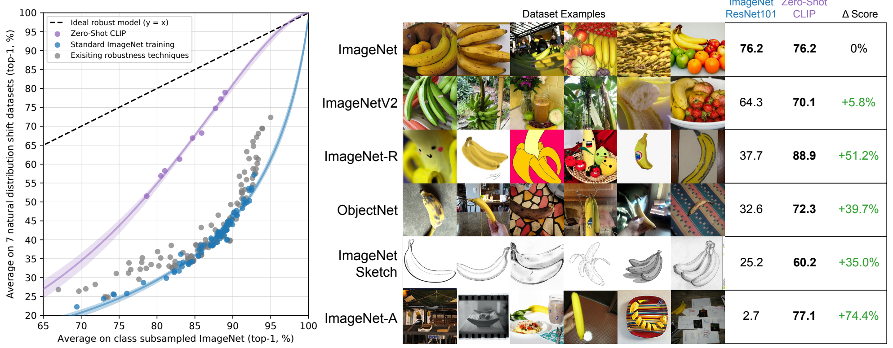


_**图 13.** 零样本 CLIP 比标准 ImageNet 模型对分布偏移具有更强的鲁棒性。（左图）一个理想的鲁棒模型（虚线）在 ImageNet 分布和其他自然图像分布上表现同样出色。零样本 CLIP 模型将这种“鲁棒性差距”缩小了高达 $75\%$。图中显示了在 logit 转换值上的线性拟合，以及通过 bootstrap 估计的 $95\%$ 置信区间。（右图）可视化香蕉类别的分布偏移情况，香蕉是 7 个自然分布偏移数据集中 5 个数据集共有的类别。表现最好的零样本 CLIP 模型 ViT-L/14@336px 与在 ImageNet 验证集上具有相同性能的 ResNet-101 模型进行了对比。_


在 ImageNet-R 上提升了 $3.8\%$，在 ObjectNet 上提升了 $2.8\%$，在 ImageNet Sketch 上提升了 $2.8\%$，在 ImageNet-A 上提升了 $1.9\%$。在另外两个数据集 Youtube-BB 和 ImageNet Vid 上的准确率变化则不显著。

为什么在 ImageNet 数据集上准确率提高了 $9.2\%$，而在分布偏移情况下的准确率却几乎没有增加？这种提升主要是源于“利用虚假相关性”吗？这种行为是 CLIP、ImageNet 数据集和所研究的分布偏移的特定组合所独有的，还是一种更普遍的现象？这对于端到端微调和线性分类器都成立吗？目前我们还没有确切的答案。先前的工作也在 ImageNet 以外的分布上预训练过模型，但通常只在模型针对 ImageNet 进行微调后才对其进行研究和发布。为了理解预训练的零样本模型是否始终比微调模型具有更高的有效鲁棒性，我们鼓励 Mahajan et al. (2018)、Kolesnikov et al. (2019) 和 Dosovitskiy et al. (2020) 的作者，如果可能的话，也在他们的模型上研究这些问题。

我们还研究了另一种由灵活的零样本自然语言图像分类器实现的鲁棒性干预措施。这 7 个迁移数据集的目标类别并不总是与 ImageNet 的目标类别完美对齐。其中两个数据集，Youtube-BB 和 ImageNet-Vid，由 ImageNet 的超类组成。当试图使用 ImageNet 模型固定的 1000 类分类器进行预测时，这就带来了一个问题。Taori et al. (2020) 通过根据 ImageNet 类别层次结构对所有子类别的预测进行最大值池化来处理这个问题。有时这种映射远非完美。对于 Youtube-BB 中的“人”这一类别，预测是通过合并棒球运动员、新郎和水肺潜水员的 ImageNet 类别来做出的。使用 CLIP，我们可以直接根据数据集的类别名称为每个数据集生成定制的零样本分类器。在图 14 中，我们看到这将平均有效鲁棒性提高了 $5\%$，但这种提升主要集中在少数几个数据集的大幅改进上。奇怪的是，ObjectNet 上的准确率也增加了 $2.3\%$。尽管该数据集的设计初衷是与 ImageNet 类别紧密重叠，但与使用 ImageNet 类别名称并在必要时合并预测相比，使用 ObjectNet 创建者为每个类别提供的名称仍然有一点点帮助。

虽然零样本 CLIP 提高了有效鲁棒性，但图 14 显示，在全监督设置下，这种好处几乎完全消失。为了更好地理解这种差异，我们研究了有效鲁棒性在从零样本到全监督的连续过程中是如何变化的。在图 15 中，我们可视化了在最佳 CLIP 模型特征上训练的 0 样本、1 样本、2 样本、4 样本……128 样本以及全监督逻辑回归分类器的性能。我们看到，虽然少样本模型也比现有模型显示出更高的有效鲁棒性，但随着训练数据的增加，分布内性能提高，这种好处逐渐消退，并且对于全监督模型来说，这种好处虽然不是完全消失，但大部分已经消失。此外，零样本 CLIP 明显比具有同等 ImageNet 性能的少样本模型更具鲁棒性。

---

---

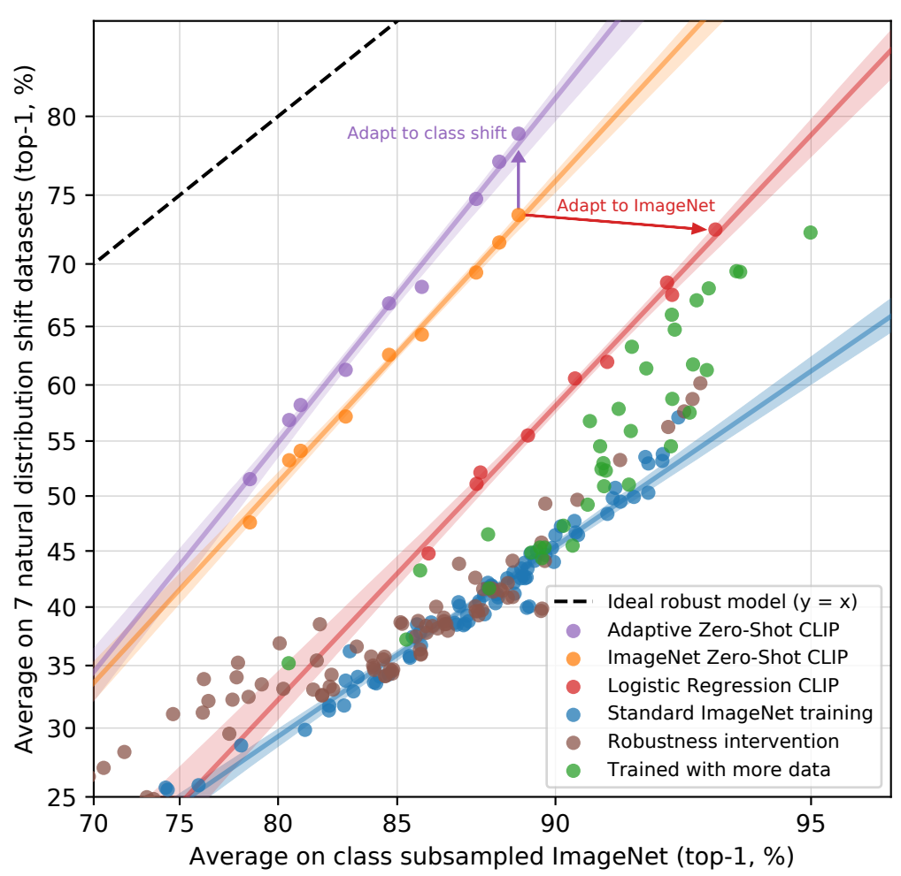


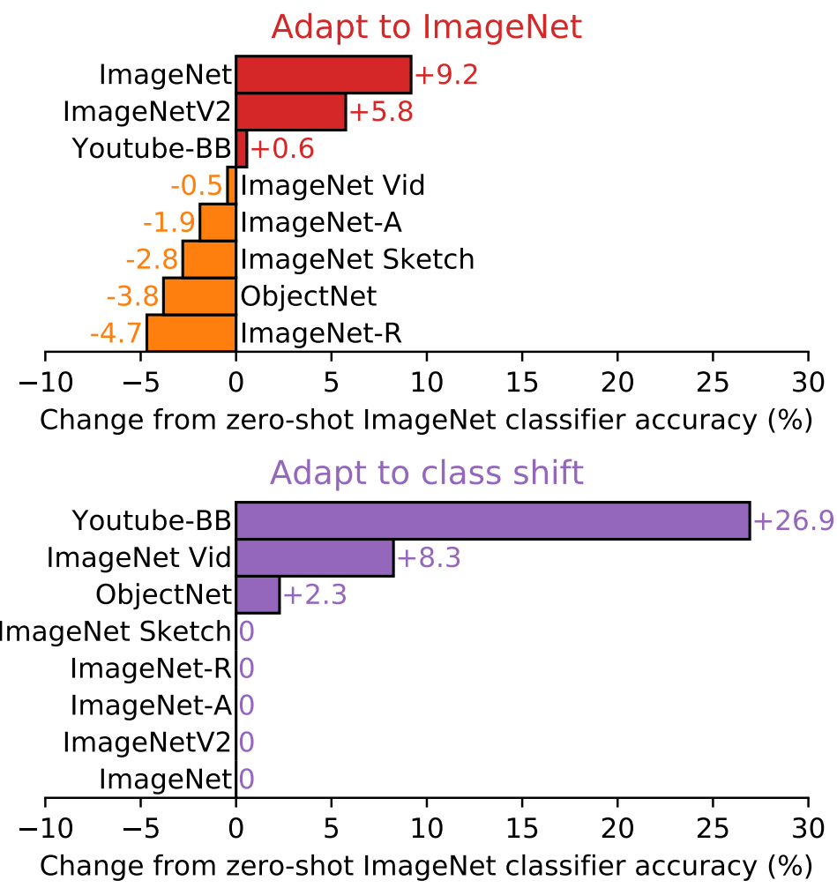


_图 14. 虽然针对 ImageNet 的有监督适配将 ImageNet 的准确率提高了 $9.2\%$，但它略微降低了平均鲁棒性。（左图）与使用单一静态的零样本 ImageNet 分类器并像 Taori et al. (2020) 那样在相似类别间合并预测相比，针对每个数据集定制零样本 CLIP 提高了鲁棒性。适配到 ImageNet 的 CLIP 模型具有与以往最佳 ImageNet 模型相似的有效鲁棒性。（右图）两种鲁棒性干预措施下各数据集准确率变化的细节。适配到 ImageNet 显著提高了 ImageNetV2 上的准确率，但牺牲了在其他几个分布上的准确率。针对特定数据集的零样本分类器可以大幅提高准确率，但仅限于少数几个包含与 ImageNet 类别不完全对齐的类别的数据集。_


在我们的所有实验中，较高的有效鲁棒性似乎源于最小化模型可访问的分布特定训练数据的数量，但这以降低特定数据集的性能为代价。


综上所述，这些结果表明，近期转向大规模任务和数据集无关的预训练，并结合在广泛评估套件上重新定位零样本和小样本基准测试（如 Yogatama et al. (2019) 和 Linzen (2020) 所倡导的），促进了更鲁棒系统的开发，并提供了更准确的性能评估。我们很好奇同样的结果是否适用于 NLP 领域的零样本模型，如 GPT 系列。虽然 Hendrycks et al. (2020b) 报告称预训练提高了情感分析上的相对鲁棒性，但 Miller et al. (2020) 对自然分布偏移下问答模型鲁棒性的研究发现，与 Taori et al. (2020) 类似，迄今为止几乎没有证据表明有效鲁棒性有所改善。


# 4. 与人类性能的比较


CLIP 与人类表现和人类学习相比如何？为了更好地理解人类在与 CLIP 类似的评估设置中的表现，我们评估了


人类在其中一项任务中的表现。我们想了解人类在这些任务上的零样本表现有多强，以及如果向他们展示一两个图像样本，人类的表现能提高多少。这可以帮助我们比较人类和 CLIP 的任务难度，并识别它们之间的相关性和差异。


我们让五个不同的人查看 Oxford IIT Pets 数据集 (Parkhi et al., 2012) 测试集中的 3669 张图像，并选择 37 个猫或狗品种中哪一个最匹配该图像（如果完全不确定，则选择“我不知道”）。在零样本情况下，人类没有获得任何品种的示例，并被要求在不进行互联网搜索的情况下尽力标记它们。在单样本实验中，人类获得了每个品种的一张样本图像，在双样本实验中，他们获得了每个品种的两张样本图像。[5]


一个可能的担忧是，人类工作者在零样本任务中缺乏足够的动力。人类在 STL-10 数据集 (Coates et al., 2011) 上高达 $94\%$ 的准确率


人类的小样本任务与模型的小样本性能之间没有完美的对应关系，因为模型无法像人类那样参考样本图像。

---

---

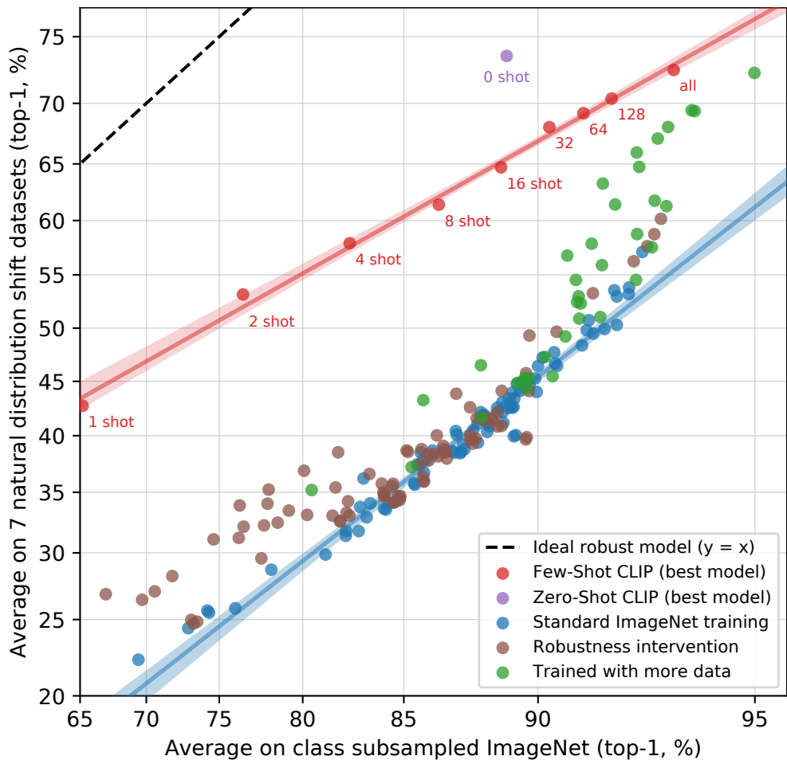


_图 15. 与现有的 ImageNet 模型相比，少样本 CLIP 也提高了有效鲁棒性，但不如零样本 CLIP 鲁棒。在适应过程中最小化使用的 ImageNet 训练数据量可以提高有效鲁棒性，但代价是降低相对鲁棒性。正如前文图 7 所报告的，16 样本逻辑回归 CLIP 在 ImageNet 上与零样本 CLIP 相当，但其鲁棒性较差。_


以及在注意力检查图像子集上达到 $97 - 100\%$ 的准确率，增加了我们对人类工作者的信任。

有趣的是，人类在每类仅有一个训练样本的情况下，性能平均值就从 $54\%$ 上升到了 $76\%$，而增加一个训练样本带来的边际增益微乎其微。从零样本到一个样本的准确率提升几乎完全体现在人类原本不确定的图像上。这表明人类“知道自己不知道什么”，并且能够基于单个样本更新他们对那些最不确定图像的先验知识。鉴于此，虽然 CLIP 对于零样本性能来说是一种很有前景的训练策略（图 5），并且在自然分布偏移的测试中表现良好（图 13），但人类从少量样本中学习的方式与本文中的少样本方法之间存在巨大差异。

这表明，正如 Lake 等人（2016）及其他人所指出的，在缩小机器和人类样本效率差距方面，仍有待进行算法改进。因为对 CLIP 的这些少样本评估并没有有效利用先验知识，而人类做到了，我们推测，找到一种将先验知识正确整合到少样本学习中的方法，是 CLIP 算法改进的重要一步。据我们所知，在高质量预训练模型的特征之上使用线性分类器已经接近少样本学习的最先进水平（Tian et al., 2020），这表明最好的少样本机器学习方法与人类少样本学习之间存在差距。

如果我们绘制人类准确率与 CLIP 零样本准确率的对比图（图 16），我们会发现 CLIP 最难解决的问题对人类来说也很难。就错误的一致性而言，我们的假设是，这至少由两个因素造成：数据集中的噪声（包括标记错误的图像）以及分布外图像对人类和模型来说都很难处理。

# 5. 数据重叠分析


在非常大的互联网数据集上进行预训练的一个令人担忧的问题是，会与下游评估数据集发生意外的重叠。这一点很重要，需要加以调查，因为在最坏的情况下，评估数据集的完整副本可能会泄露到预训练数据集中，从而使评估失去作为泛化能力有意义测试的有效性。防止这种情况的一种选择是在训练模型之前识别并删除所有重复数据。虽然这保证了报告的是真实的保留性能，但它要求提前知道模型可能被评估的所有可能数据。这有一个缺点，即限制了基准测试和分析的范围。添加一个新的评估将需要昂贵的重新训练，或者冒着由于重叠而报告未量化收益的风险。

相反，我们记录了多少重叠发生，以及由于这些重叠性能如何变化。为此，我们使用以下程序：


1) 对于每个评估数据集，我们对其样本运行重复检测器（见附录 C）。然后我们人工检查发现的最近邻，并设置每个数据集的阈值，以在保持高精度的同时最大化召回率。使用该阈值，我们随后创建两个新的子集，重叠集，包含所有与训练样本相似度高于阈值的样本，以及纯净集，它

---

---

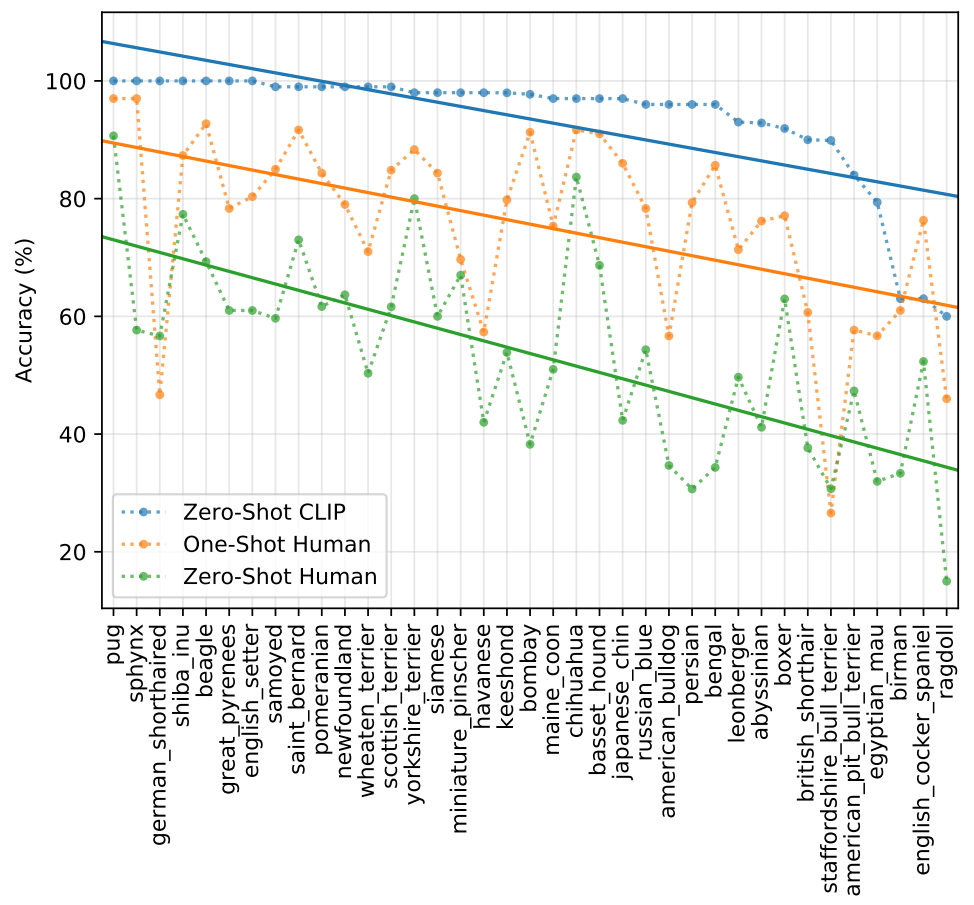


_图 16. 对 CLIP 而言最难的问题往往也是人类最难的问题。此处我们根据 CLIP 的正确标签概率对图像类别按难度进行了排名。_


包含所有低于此阈值的样本。我们将未改变的完整数据集记为 A11 以供参考。基于此，我们首先记录数据污染的程度，即 Overlap 中的样本数量与 A11 大小之间的比率。

2) 然后我们计算 CLIP RN50x64 在这三个划分上的零样本准确率，并将 All - Clean 作为我们的主要指标。这是由污染导致的准确率差异。当该值为正时，它是对整体报告的准确率因过度拟合重叠数据而被高估程度的估计。

3) 由于重叠量通常很小，我们还运行了二项式显著性检验，其中我们使用 Clean 上的准确率作为零假设，并计算 Overlap 子集的单尾（大于）p 值。我们还计算了 Dirty 上的 $99.5\%$ Clopper-Pearson 置信区间作为另一项检查。

图 17 总结了这一分析。在研究的 35 个数据集中，有 9 个数据集未检测到任何重叠。这些数据集大多是合成数据或专业数据，这使得它们不太可能作为普通图像发布在互联网上（例如 MNIST、CLEVR 和 GTSRB），或者由于包含我们数据集创建之后的新数据而保证没有重叠（ObjectNet 和 Hateful Memes）。这表明我们的检测器具有较低的误报率，这一点很重要，因为误报会低估污染在我们分析中的影响。重叠率的中位数为 $2.2\%$，平均重叠率为 $3.2\%$。由于重叠量很小，整体准确率的变化很少超过 $0.1\%$，只有 7 个数据集高于此阈值。其中，在经过 Bonferroni 校正后，只有 2 个数据集具有统计显著性。检测到的最大提升幅度仅为 Birdsnap 上的 $0.6\%$，该数据集的重叠率位居第二，为 $12.1\%$。重叠率最高的是 Country211，达到 $21.5\%$。这是因为它是由 YFCC100M 构建而成的，而我们的预训练数据集包含了 YFCC100M 的一个过滤子集。尽管存在如此大的重叠，但 Country211 上的准确率仅增加了 $0.2\%$。这可能是因为样本伴随的训练文本通常与下游评估所测量的特定任务无关。Country211 测量的是地理定位能力，但检查这些重复样本的训练文本显示，它们通常没有提及图像的位置。

我们意识到我们的分析存在两个潜在的问题。首先，我们的检测器并不完美。虽然它在代理训练任务上达到了接近 $100\%$ 的准确率，并且人工检查 + 阈值调整在发现的最近邻中实现了很高的精度和良好的召回率，但我们无法在 4 亿个样本中可行地检查其召回率。我们分析的另一个潜在干扰因素是，Overlap 和 Clean 子集之间的底层数据分布可能会发生变化。例如，在 Kinetics-700 上，许多“重叠”实际上是全黑的过渡帧。这解释了为什么 Kinetics-700 在 Overlap 上的准确率出现了明显的 $20\%$ 下降。我们怀疑可能存在更微妙的分布偏移。我们在 CIFAR-100 上注意到的一种可能性是，由于其图像分辨率非常低，许多重复样本是鸟类或飞机等小物体的误报。准确率的变化可能是由于重复样本的类别分布或难度变化造成的。不幸的是，这些分布和难度的变化也可能掩盖过度拟合的影响。

然而，这些结果与先前关于大规模预训练的工作中类似的重复分析结果非常吻合。Mahajan 等人（2018）和 Kolesnikov 等人（2019）检测到了类似的重叠率，并发现整体性能的变化微乎其微。重要的是，Kolesnikov 等人（2019）还比较了本节引言中讨论的替代去重策略与我们最终采用的方法，并观察到这两种方法之间几乎没有差异。

# 6. 局限性

CLIP 仍有许多局限性。虽然其中一些局限性已在各个部分的分析中进行了讨论，但我们在本文中对其进行总结和汇总。

在带有训练划分的数据集上，零样本 CLIP 的性能平均而言与简单的 su

---

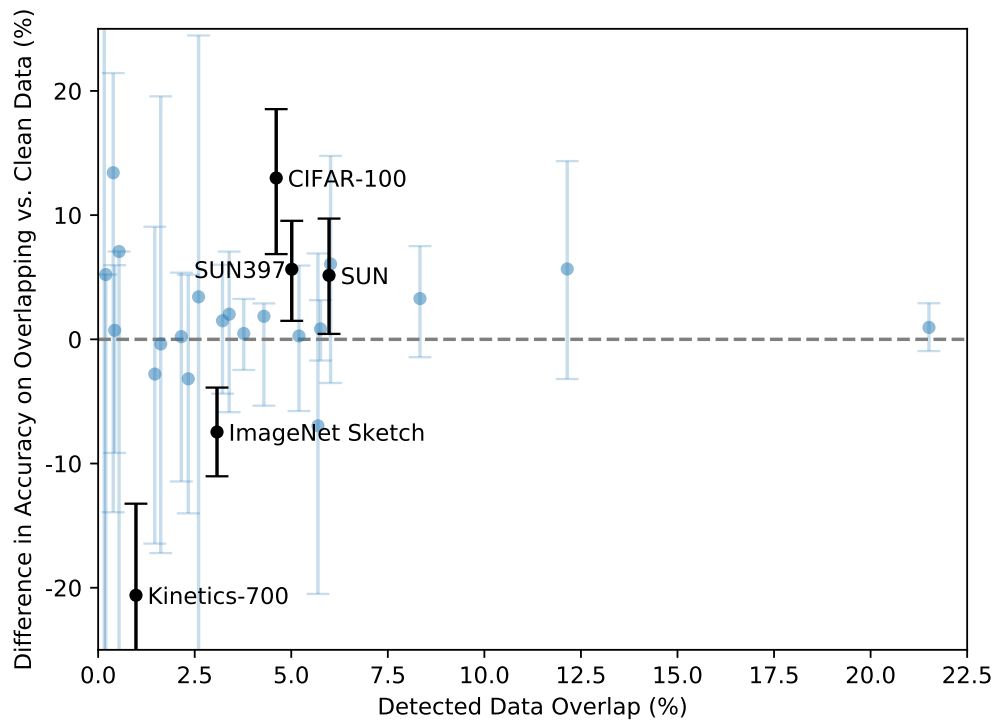


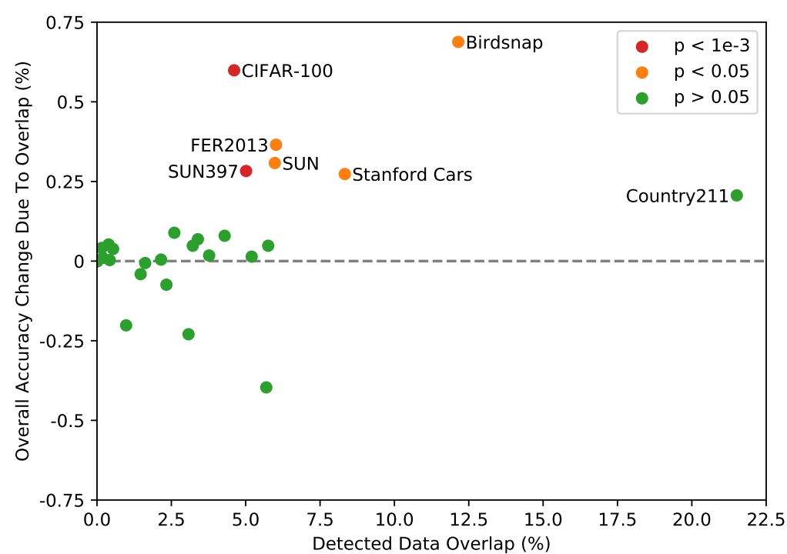


_图 17. 由于检测到的数据重叠，准确率在统计上显著提升的情况很少。（左图）虽然有几个数据集在检测到的重叠样本与仅包含干净样本的零样本准确率上存在高达 $\pm 20\%$ 的明显差异，但在总共 35 个数据集中，只有 5 个数据集的 99.5% Clopper-Pearson 置信区间排除了 0% 的准确率差异。其中 2 个数据集在重叠数据上的表现反而更差。（右图）由于检测到的重叠样本的百分比几乎总是个位数，因此由重叠带来的整体测试准确率增益要小得多，最大的估计增幅仅在 Birdsnap 数据集上达到了 0.6%。同样，当使用单侧二项式检验计算时，仅有 6 个数据集的准确率提升具有统计显著性。_


...（此处省略了被截断的单词 "pervised"，根据上下文应为 "unsupervised" 或 "supervised"）... 基于 ResNet-50 特征的线性分类器的监督基线。在大多数这些数据集上，该基线的性能现已远低于整体的最先进水平。仍需大量工作来提高 CLIP 的任务学习和迁移能力。虽然迄今为止，扩大规模稳步提高了性能，并指明了持续改进的途径，但我们估计，零样本 CLIP 要达到整体的最先进性能，大约需要增加 1000 倍的计算量。这对于目前的硬件来说是不可能训练的。因此，有必要进一步研究如何提高 CLIP 的计算效率和数据效率。


第 3.1 节的分析发现，CLIP 的零样本性能在几种类型的任务上仍然相当弱。与特定任务模型相比，CLIP 在几种类型的细粒度分类任务上表现不佳，例如区分汽车型号、花卉物种和飞机变体。CLIP 在更抽象和系统性的任务上也表现挣扎，例如计算图像中物体的数量。最后，对于不太可能包含在 CLIP 预训练数据集中的新颖任务，例如分类照片中最近汽车的距离，CLIP 的性能可能接近随机水平。我们确信，仍有非常多的任务，CLIP 在其上的零样本性能接近随机猜测水平。


虽然正如第 3.3 节所调查的那样，零样本 CLIP 对许多自然图像分布具有良好的泛化能力，但我们观察到，零样本 CLIP 对真正超出其分布的数据的泛化能力仍然很差。一个说明性的例子是附录 E 中报告的 OCR 任务。


CLIP 学习了一种高质量的语义 OCR 表示，它在数字渲染的文本上表现良好，这在其预训练数据集中很常见，Rendered SST2 上的性能证明了这一点。然而，CLIP 在 MNIST 的手写数字上仅达到了 88% 的准确率。一个基于原始像素的逻辑回归的令人尴尬的简单基线优于零样本 CLIP。语义和近似重复的最近邻检索都证实，在我们的预训练数据集中几乎没有类似于 MNIST 数字的图像。这表明 CLIP 几乎没有解决深度学习模型脆弱泛化的根本问题。相反，CLIP 试图绕过这个问题，并希望通过在如此庞大且多样的数据集上进行训练，使所有数据都有效地处于分布内。这是一个天真的假设，正如 MNIST 所证明的那样，这种假设很容易被违反。


虽然 CLIP 可以为各种各样的任务和数据集灵活地生成零样本分类器，但 CLIP 仍然仅限于从给定的零样本分类器中的那些概念中进行选择。与图像字幕这样真正灵活的方法相比，这是一个重大的限制，后者可以生成新颖的输出。不幸的是，如第 2.3 节所述，我们发现我们尝试的图像字幕基线的计算效率远低于 CLIP。一个值得尝试的简单想法是联合训练对比和生成目标，希望能结合 CLIP 的效率和字幕模型的灵活性。作为另一种选择，可以在推理时对给定图像的许多自然语言解释进行搜索，类似于 Andreas et al. (2017) 在 Learning with Latent Language 中提出的方法。

---

---

CLIP 也未能解决深度学习数据效率低下的问题。相反，CLIP 通过使用一种可扩展至数亿个训练示例的监督源来进行补偿。如果以每秒一张的速度呈现 CLIP 模型训练期间看到的每张图像，遍历 32 个训练轮次中看到的 128 亿张图像将需要 405 年。鉴于自监督（Henaff, 2020; Chen et al., 2020c）和自训练（Lee; Xie et al., 2020）方法已证明能提高相对于标准监督学习的数据效率，将其与 CLIP 结合是一个有前景的方向。

我们的方法存在几个显著的局限性。尽管我们专注于零样本迁移，但我们反复查询完整验证集的性能以指导 CLIP 的开发。这些验证集通常有数千个示例，这对于真正的零样本场景来说是不现实的。类似的问题在半监督学习领域（Oliver et al., 2018）也已被提出。另一个潜在问题是我们对评估数据集的选择。虽然我们报告了 Kornblith et al. (2019) 的 12 个数据集评估套件的结果作为标准化集合，但我们的主要结果使用了一个有些随意拼凑的 27 个数据集的集合，这无疑与 CLIP 的开发和能力产生了共同适应。创建一个新的基准，旨在明确评估广泛的零样本迁移能力，而不是复用现有的监督数据集，将有助于解决这些问题。

CLIP 是在互联网上与文本配对的图像上训练的。这些图像-文本对未经过滤和策划，导致 CLIP 模型学习到了许多社会偏见。此前已在图像字幕模型（Bhargava & Forsyth, 2019）中证明了这一点。我们请读者参阅第 7 节，以获取有关 CLIP 这些行为的详细分析和量化，以及潜在缓解策略的讨论。

尽管我们在整篇工作中强调，通过自然语言指定图像分类器是一种灵活且通用的接口，但它也有其自身的局限性。许多复杂的任务和视觉概念可能很难仅通过文本来指定。实际的训练示例无疑是有用的，但 CLIP 并不直接针对少样本性能进行优化。在我们的工作中，我们退而求其次，在 CLIP 的特征之上拟合线性分类器。这导致从零样本设置过渡到少样本设置时，性能出现了反直觉的下降。正如第 4 节所讨论的，这与人类性能显著不同，人类性能在从零样本到单样本设置时显示出大幅提升。未来的工作需要开发出能够结合 CLIP 强大零样本性能与高效少样本学习的方法。

# 7. 更广泛的影响

由于能够执行任意的图像分类任务，CLIP 拥有广泛的能力。人们可以给它猫和狗的图像并要求它对猫进行分类，或者给它在百货商店拍摄的图像并要求它对商店扒手进行分类——这是一项具有重大社会影响的任务，而 AI 可能并不适合。像任何图像分类系统一样，CLIP 的性能和适用性需要经过评估，并结合具体情况分析其更广泛的影响。CLIP 还引入了一种将放大和改变此类问题的能力：CLIP 使得无需重新训练即可轻松创建自己的分类类别（即“定制分类器”）成为可能。这种能力带来了类似于表征其他大规模生成模型（如 GPT-3 (Brown et al., 2020)）时的挑战；表现出不可忽视的零样本（或少样本）泛化能力的模型可能具有广泛的能力，其中许多能力只有在对其进行测试后才会显现出来。

我们在零样本设置下对 CLIP 的研究表明，该模型在图像检索或搜索等广泛适用的任务上显示出巨大的前景。例如，它可以根据文本在数据库中查找相关图像，或者根据图像查找相关文本。此外，相对容易地将 CLIP 引向定制应用，而无需或仅需极少量的额外数据或训练，可能会开启各种新颖的应用程序，就像过去几年大型语言模型所经历的那样。

除了本文前面章节研究的 30 多个数据集外，我们还在 FairFace 基准上评估了 CLIP 的性能，并进行了探索性的偏差探测。然后，我们描述了该模型在下游任务（监控）中的性能，并讨论了与其他可用系统相比其实用性。CLIP 的许多能力本质上是通用的（例如，OCR 可用于使扫描文档可搜索、为屏幕阅读技术提供动力或读取车牌）。从动作识别、对象分类和地理定位到面部情绪识别，测量的几项能力均可用于监控。鉴于其社会影响，我们将在“监控”一节中专门讨论这一使用领域。

我们还试图表征模型固有的社会偏见。我们的偏差测试代表了我们在不同场景下探测模型响应方面的初步努力，其范围本质上是有限的。需要结合 CLIP 及其类似模型的具体部署进行分析，以了解偏见如何表现并确定潜在的干预措施。还需要社区进一步探索，以开发更广泛、更具上下文性和更稳健的测试方案，以便 AI 开发人员能够更好地表征通用计算机视觉模型中的偏见。

---

---

<table><tr><td>模型</td><td>种族</td><td>性别</td><td>年龄</td></tr><tr><td>FairFace 模型</td><td>93.7</td><td>94.2</td><td>59.7</td></tr><tr><td>线性探针 CLIP</td><td>93.4</td><td>96.5</td><td>63.8</td></tr><tr><td>零样本 CLIP</td><td>58.3</td><td>95.9</td><td>57.1</td></tr><tr><td>线性探针 Instagram</td><td>90.8</td><td>93.2</td><td>54.2</td></tr></table>


_表 3. FairFace 类别“白人”中图像的种族、性别和年龄分类准确率（百分比）_


<table><tr><td>模型</td><td>种族</td><td>性别</td><td>年龄</td></tr><tr><td>FairFace 模型</td><td>75.4</td><td>94.4</td><td>60.7</td></tr><tr><td>线性探针 CLIP</td><td>92.8</td><td>97.7</td><td>63.1</td></tr><tr><td>零样本 CLIP</td><td>91.3</td><td>97.2</td><td>54.3</td></tr><tr><td>线性探针 Instagram</td><td>87.2</td><td>93.9</td><td>54.1</td></tr></table>


_表 4. FairFace 类别“黑人”、“印度人”、“东亚人”、“东南亚人”、“中东人”和“拉丁裔”（在 FairFace 类别中统称为“非白人”）中图像的种族、性别和年龄分类准确率（百分比）_


<table><tr><td>模型</td><td>性别</td><td>黑人</td><td>白人</td><td>印度人</td><td>拉丁裔</td><td>中东人</td><td>东南亚人</td><td>东亚人</td><td>平均</td></tr><tr><td rowspan="3">线性探针 CLIP</td><td>男性</td><td>96.9</td><td>96.4</td><td>98.7</td><td>96.5</td><td>98.9</td><td>96.2</td><td>96.9</td><td>97.2</td></tr><tr><td>女性</td><td>97.9</td><td>96.7</td><td>97.9</td><td>99.2</td><td>97.2</td><td>98.5</td><td>97.3</td><td>97.8</td></tr><tr><td></td><td>97.4</td><td>96.5</td><td>98.3</td><td>97.8</td><td>98.4</td><td>97.3</td><td>97.1</td><td>97.5</td></tr><tr><tr rowspan="3">零样本 CLIP</td><td>男性</td><td>96.3</td><td>96.4</td><td>97.7</td><td>97.2</td><td>98.3</td><td>95.5</td><td>96.8</td><td>96.9</td></tr><tr><td>女性</td><td>97.1</td><td>95.3</td><td>98.3</td><td>97.8</td><td>97.5</td><td>97.2</td><td>96.4</td><td>97.0</td></tr><tr><td></td><td>96.7</td><td>95.9</td><td>98.0</td><td>97.5</td><td>98.0</td><td>96.3</td><td>96.6</td><td></td></tr><tr><tr rowspan="3">线性探针 Instagram</td><td>男性</td><td>92.5</td><td>94.8</td><td>96.2</td><td>93.1</td><td>96.0</td><td>92.7</td><td>93.4</td><td>94.1</td></tr><tr><td>女性</td><td>90.1</td><td>91.4</td><td>95.0</td><td>94.8</td><td>95.0</td><td>94.1</td><td>94.3</td><td>93.4</td></tr><tr><td></td><td>91.3</td><td>93.2</td><td>95.6</td><td>94.0</td><td>95.6</td><td>93.4</td><td>93.9</td><td></td></tr></table>


_表 5. FairFace 种族类别下图像的性别分类准确率（百分比）_


# 7.1. 偏差


算法决策、训练数据，以及关于如何定义和分类类别的选择（我们非正式地称之为“类别设计”），都可能导致并放大因使用 AI 系统而产生的社会偏见和不平等（Noble, 2018; Bechmann & Bowker, 2019; Bowker & Star, 2000）。类别设计与 CLIP 等模型尤为相关，因为任何开发者都可以定义一个类别，而模型会提供某种结果。


在本节中，我们使用受 Buolamwini & Gebru (2018) 和 Kärkkäinen & Joo (2019) 中概述的偏差探针启发的偏差探针，对 CLIP 中的一些偏差进行了初步分析。我们还进行了探索性偏差研究，旨在发现模型中偏差的具体示例，这与 Solaiman et al. (2019) 进行的研究类似。


我们首先分析了零样本 CLIP 在人脸图像数据集 FairFace (Kärkkäinen & Joo, 2019)<sup>6</sup> 上的性能


$^{6}$FairFace 是一个人脸图像数据集，旨在平衡年龄、性别和种族，以减少先前人脸数据集中常见的不对称性。它将性别分为 2 组：女性和男性；将种族分为 7 组：白人、黑人、印度人、东亚人、东南亚人、中东人和拉丁裔。种族和性别分类存在固有的问题，正如 Bowker & Star (2000)


作为初始偏差探针，然后进一步探查模型以揭示额外的偏差和偏差来源，包括类别设计。


我们在 FairFace 数据集上评估了两个版本的 CLIP：一个零样本 CLIP 模型（“ZS CLIP”），和一个在 CLIP 特征之上针对 FairFace 数据集拟合的逻辑回归分类器（“LR CLIP”）。我们发现，在我们运行的大多数分类测试中，LR CLIP 在 FairFace 数据集上的准确率高于 ResNext-101 32x48d Instagram 模型（“线性探针 Instagram”）（Mahajan et al., 2018）和 FairFace 自有的模型<sup>7</sup>。ZS CLIP 的性能因类别而异，在某些类别上比 FairFace 的模型差，而在其他类别上则更好。（见表 3 和表 4）。


和 Keyes (2018) 所展示的那样。虽然 FairFace 的数据集减少了白人面孔的比例，但它仍然缺乏整个大型人口群体的代表性，有效地抹去了这些类别。我们在许多实验中使用了 FairFace 数据集中定义的 2 个性别类别和 7 个种族类别，并不是为了强化或认可使用这些简化类别，而是为了使我们能够与先前的工作进行比较。


这种比较的一个挑战是，FairFace 模型使用的是种族的二元类别（“白人”和“非白人”），而不是将种族细分为更细粒度的子群体。

---

---

<table><tr><td>类别</td><td>黑人</td><td>白人</td><td>印第安人</td><td>拉丁裔</td><td>中东人</td><td>东南亚人</td><td>东亚人</td></tr><tr><td>犯罪相关类别</td><td>16.4</td><td>24.9</td><td>24.4</td><td>10.8</td><td>19.7</td><td>4.4</td><td>1.3</td></tr><tr><td>非人类类别</td><td>14.4</td><td>5.5</td><td>7.6</td><td>3.7</td><td>2.0</td><td>1.9</td><td>0.0</td></tr></table>


_表 6. 按 FairFace 种族类别分类到犯罪相关和非人类类别的图像百分比。标签集包括 7 个 FairFace 种族类别（男性和女性各 7 个，共 14 个），以及 3 个犯罪相关类别和 4 个非人类类别。_


<table><tr><td>类别标签集</td><td>0-2</td><td>3-9</td><td>10-19</td><td>20-29</td><td>30-39</td><td>40-49</td><td>50-59</td><td>60-69</td><td>70 岁以上</td></tr><tr><td>默认标签集</td><td>30.3</td><td>35.0</td><td>29.5</td><td>16.3</td><td>13.9</td><td>18.5</td><td>19.1</td><td>16.2</td><td>10.4</td></tr><tr><td>默认标签集 + ‘儿童’ 类别</td><td>2.3</td><td>4.3</td><td>14.7</td><td>15.0</td><td>13.4</td><td>18.2</td><td>18.6</td><td>15.5</td><td>9.4</td></tr></table>


_表 7. 按 FairFace 年龄类别分类到犯罪相关和非人类类别的图像百分比，展示了使用默认标签集与添加了‘儿童’标签的标签集所得结果的比较。默认标签集包括 7 个 FairFace 种族类别（男性和女性各 7 个，共 14 个），3 个犯罪相关类别和 4 个非人类类别。_


此外，我们测试了 LR CLIP 和 ZS CLIP 模型在 FairFace 数据集中定义的交叉种族和性别类别上的表现。我们发现，对于所有种族类别，模型在性别分类上的表现均超过 $95\%$。表 5 总结了这些结果。


虽然 LR CLIP 在 FairFace 基准数据集上，针对交叉类别的图像性别、种族和年龄分类，比 Linear Probe Instagram 模型实现了更高的准确率，但正如 Raji 等人（2020）所指出的，基准测试上的准确率仅能近似反映算法的公平性，在现实世界语境中，它往往无法作为衡量公平性的有效指标。即使模型在不同子群体上具有更高的准确率和更低的性能差异，这也不意味着其影响差异会更低（Scheuerman 等人，2019）。例如，针对代表性不足群体的较高性能可能会被公司用来证明其使用人脸识别技术的合理性，进而以对某些群体产生不成比例影响的方式部署该技术。我们使用人脸分类基准来探测偏见，并不意味着我们认为人脸分类是一项毫无争议的任务，也不代表我们支持在部署环境中使用种族、年龄或性别分类。


我们还使用具有高度造成表征性危害风险的分类术语对模型进行了探测，特别关注贬低危害（Crawford, 2017）。我们进行了一项实验，要求 ZS CLIP 模型对 FairFace 数据集中的 10,000 张图像进行分类。除了 FairFace 类别外，我们还添加了以下类别：‘animal’（动物）、‘gorilla’（大猩猩）、‘chimpanzee’（黑猩猩）、‘orangutan’（红毛猩猩）、‘thief’（小偷）、‘criminal’（罪犯）和‘suspicious person’（可疑人员）。本实验旨在检查贬低危害是否不成比例地影响特定的人口统计亚群。


我们发现，有 $4.9\%$（置信区间在 $4.6\%$ 到 $5.4\%$ 之间）的图像被错误分类到我们在探测中使用的非人类类别之一（‘animal’、‘chimpanzee’、‘gorilla’、‘orangutan’）。其中，‘Black’（黑人）图像的错误分类率最高（约 $14\%$；置信区间在 $[12.6\%$ 和 $16.4\%]$ 之间），而所有其他种族的错误分类率均在 $8\%$ 以下。0-20 岁的人群被归类为这一类别的比例最高，达到 $14\%$。


我们还发现，有 $16.5\%$ 的男性图像被错误分类到与犯罪相关的类别（‘thief’、‘suspicious person’ 和 ‘criminal’），而女性图像的这一比例为 $9.8\%$。有趣的是，我们发现 0-20 岁的人群比其他年龄段的人群更有可能被归入这些与犯罪相关的类别（0-20 岁人群约为 $18\%$，20-60 岁人群约为 $12\%$，70 岁以上人群为 $0\%$）。我们发现与犯罪相关的术语在不同种族的分类结果上存在显著差异，表 6 捕捉了这一情况。


鉴于我们观察到 20 岁以下的人群最有可能被归类为犯罪相关和非人类动物类别，我们使用相同的类别对图像进行了分类，但在类别中增加了一个额外的‘child’（儿童）类别。我们的目标是观察这一类别是否会显著改变模型的行为，并改变贬低危害在年龄上的分布。我们发现，这极大地减少了被归类为犯罪相关类别或非人类动物类别的 20 岁以下人群的图像数量（表 7）。这指出了类别设计如何成为决定模型性能以及模型可能表现出的不良偏见或行为的关键因素，同时也提出了关于使用人脸技术的更广泛问题。

---

---

……图像以自动沿此类线索对人员进行分类（y Arcas 等人，2017）。

这些探测的结果可能会根据选择包含的类别以及用于描述每个类别的具体语言而发生变化。糟糕的类别设计会导致糟糕的现实世界表现；考虑到开发人员可以如此轻松地设计自己的类别，这种担忧对于像 CLIP 这样的模型尤为相关。

我们还进行了类似于 Schwemmer 等人（2020）概述的实验，以使用国会议员的图像测试 CLIP 如何区别对待男性和女性的图像。作为这些实验的一部分，我们研究了某些额外的设计决策（例如决定标签的阈值）如何影响 CLIP 输出的标签以及偏见如何显现。

我们进行了三项实验——我们测试了性别分类的准确性，并测试了标签在两个不同的标签集中如何差异化分布。对于我们的第一个标签集，我们使用了包含 300 个职业的标签集；对于我们的第二个标签集，我们使用了 Google Cloud Vision、Amazon Rekognition 和 Microsoft Azure Computer Vision 对所有图像返回的标签组合集。

我们首先简单地研究了模型在国会议员图像上的性别预测性能，以检查在给定看起来处于官方环境/权力职位的人的图像的情况下，模型是否正确地将男性识别为男性，将女性识别为女性。我们发现该模型在这些图像上达到了 $100\%$ 的准确率。这略优于该模型在 FairFace 数据集上的表现。我们假设其原因之一是国会议员数据集中的所有图像都是高质量且清晰的，人物居中明显，这与 FairFace 数据集中的图像不同。

为了研究返回标签中的偏见如何依赖于为标签概率设置的阈值，我们进行了一项实验，将阈值设置为 $0.5\%$ 和 $4.0\%$。我们发现较低的阈值导致标签质量较低。然而，即使在该阈值下标签分布的差异也能包含偏见的信号。例如，我们发现，在 $0.5\%$ 的阈值下，诸如“保姆”和“管家”之类的标签开始出现在女性身上，而诸如“囚犯”和“暴徒”之类的标签开始出现在男性身上。这指向了以前针对职业发现的性别关联（Schwemmer 等人，2020）（Nosek 等人，2002）（Bolukbasi 等人，2016）。

在较高的 $4\%$ 阈值下，两种性别中概率最高的标签包括“立法者”、“议员”和“国会议员”。然而，在较低概率标签中存在这些偏见，仍然引发了关于部署此类系统时“足够”安全的行为可能是什么样的更大问题。

当给定 Google Cloud Vision (GCV)、Amazon Rekognition 和 Microsoft 对所有图像返回的标签组合集时，类似于 Schwemmer 等人（2020）在 GCV 系统中发现的偏见，我们发现我们的系统也更多地给女性附加与头发和外表有关的标签，而不是男性。例如，诸如“褐发”、“金发”和“ blond ”之类的标签在女性身上出现的频率明显更高。此外，CLIP 给男性更多地附加了一些描述高地位职业的标签，例如“高管”和“医生”。在它更多地附加给女性的仅有的四个职业中，三个是“新闻播音员”、“电视主持人”和“新闻播报员”，第四个是“法官”。这再次类似于在 GCV 中发现的偏见，并指向历史上的性别差异（Schwemmer 等人，2020）。

有趣的是，当我们针对这组标签将阈值降低到 $0.5\%$ 时，我们发现不成比例地描述男性的标签也转移到了以外观为导向的词汇，例如“西装”、“领带”和“ necktie ”（图 18）。许多以职业为导向的词汇，例如“军人”和“高管”——在较高的 $4\%$ 阈值下未用于描述女性的图像——在较低的 $0.5\%$ 阈值下被用于描述男性和女性，这可能导致男性标签的变化。反之则不然。用于描述女性的描述性词汇在男性中仍然很少见。

在构建模型的每个阶段做出的设计决策都会影响偏见的显现方式，考虑到 CLIP 提供的灵活性，尤其如此。除了关于训练数据和模型架构的选择之外，关于类别设计和阈值设定等事项的决定可能会改变模型输出的标签，从而加剧或降低某些类型的伤害，例如 Crawford (2017) 描述的那些。设计和开发模型及 AI 系统的人拥有相当大的权力。关于类别设计等事项的决定不仅是模型性能的关键决定因素，也是模型偏见如何以及在何种情境下显现的关键决定因素。

这些实验并不全面。它们说明了源于类别设计和其他偏见来源的潜在问题，旨在引发探究。

# 7.2. 监控

接下来，我们试图表征模型在与下游任务相关的性能，该任务具有显著的社会敏感性：监控。我们的分析旨在更好地体现上述表征方法，并帮助研究社区了解日益通用的计算机视觉模型的潜在未来影响，从而有助于规范和检查机制的制定

---

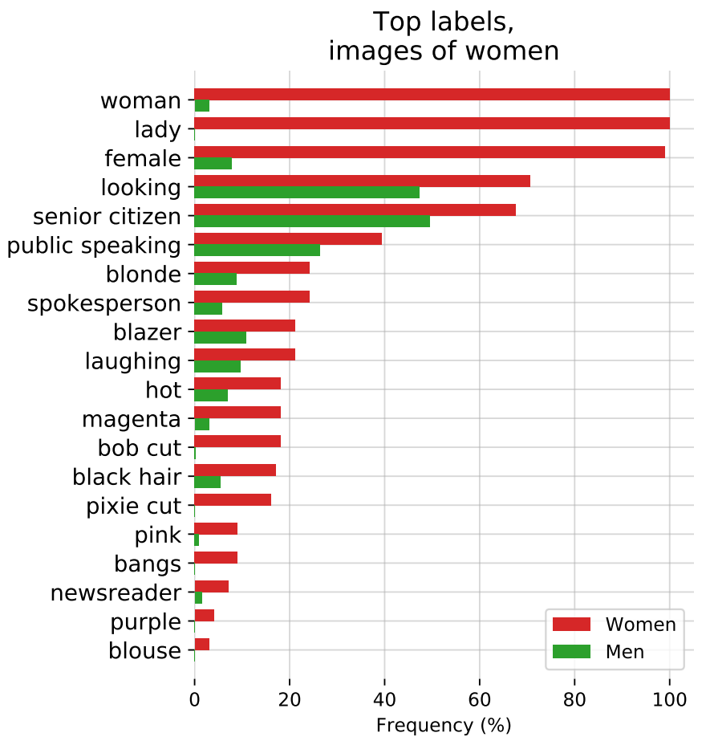


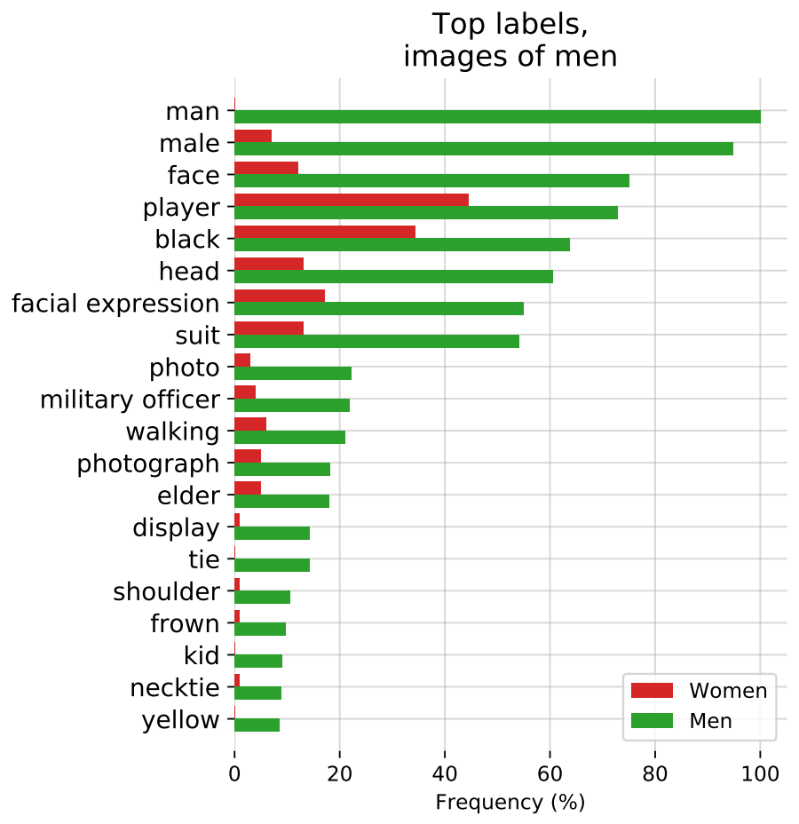


_图 18. 在给定 Google Cloud Vision、Amazon Rekognition 和 Microsoft Azure Computer Vision 返回的图像标签组合集的情况下，CLIP 在国会议员图像上的表现。通过 $\chi^2$ 检验（阈值设为 $0.5\%$）确定了男性和女性最具性别区分度的 20 个标签。标签按绝对频率排序。条形表示按性别划分的特定标签图像的百分比。_


围绕此类系统展开。我们纳入监控领域并非意在表达对该领域的热情——相反，鉴于其社会影响，我们认为监控是一个值得尝试进行预测的重要领域 (Zuboff, 2015; Browne, 2015)。


我们测量了该模型在闭路电视（CCTV）摄像头图像分类和零样本名人识别方面的性能。我们首先在监控摄像头（例如 CCTV 摄像头）拍摄的低分辨率图像上测试了模型性能。我们使用了 VIRAT 数据集 (Oh et al., 2011) 以及 Varadarajan & Odobez (2009) 收集的数据，这两个数据集均包含现实世界的户外场景且由非演员出演。


鉴于 CLIP 灵活的类别构建能力，我们在自建的通用类别上测试了从 12 个不同视频序列中捕获的 515 张监控图像，以进行粗粒度和细粒度分类。粗粒度分类要求模型正确识别图像的主要主体（即确定图像是空停车场、校园等的图片）。对于细粒度分类，模型必须在两个选项之间做出选择，旨在确定模型能否识别图像中较小特征的存在/不存在，例如站在角落的人。


对于粗粒度分类，我们通过手动为图像添加描述图像内容的字幕来构建类别，并且模型总是至少有 6 个选项可供选择。此外，我们进行了一项“压力测试”，其中类别集至少包含一个与图像内容“相近”的额外字幕（例如，“有白色汽车的停车场”与“有红色汽车的停车场”）。我们发现模型在初始评估中对 CCTV 图像的 Top-1 准确率为 $91.8\%$。在第二次评估中，准确率显著下降至 $51.1\%$，模型有 $40.7\%$ 的时间错误地选择了“相近”的答案。


对于细粒度检测，零样本模型表现不佳，结果接近随机水平。请注意，该实验仅针对检测图像序列中小物体的存在或缺失。


我们还使用 CelebA 数据集<sup>8</sup>测试了 CLIP 在“自然环境下”身份识别方面的零样本性能。我们这样做是为了评估模型仅利用其预训练所用的公开数据进行身份识别的性能。虽然我们是在互联网上图像数量较多的名人数据集上进行测试的，但我们假设，随着模型变得越来越强大，模型将面孔与姓名联系起来所需的预训练数据中的图像数量将不断减少（见表 8），这将产生重大的社会影响 (Garvie, 2019)。这


注：CelebA 数据集更能代表肤色较浅的面部。由于数据集的性质，我们无法控制种族、性别、年龄等因素。

---

<table><tr><td>模型</td><td>100 类</td><td>1k 类</td><td>2k 类</td></tr><tr><td>CLIP L/14</td><td>59.2</td><td>43.3</td><td>42.2</td></tr><tr><td>CLIP RN50x64</td><td>56.4</td><td>39.5</td><td>38.4</td></tr><tr><td>CLIP RN50x16</td><td>52.7</td><td>37.4</td><td>36.3</td></tr><tr><td>CLIP RN50x4</td><td>52.8</td><td>38.1</td><td>37.3</td></tr></table>


_表 8. CelebA 零样本 Top-1 身份识别准确率_


反映了自然语言处理领域的最新进展，近期在互联网数据上训练的大型语言模型通常表现出提供与相对次要公众人物相关信息的能力（Brown et al., 2020）。


我们发现，对于 8000 张“自然环境下”的名人图像，该模型在 100 个可能的类别中达到了 $59.2\%$ 的 Top-1 准确率。然而，当我们把类别规模增加到 1000 个名人名字时，性能下降到了 $43.3\%$。与 Google 的名人识别等生产级模型相比，这种性能并不具备竞争力。然而，这些结果值得注意的地方在于，该分析仅使用了基于预训练数据推断出的名字的零样本识别能力——我们没有使用任何额外的特定任务数据集，因此这种（相对）强劲的结果进一步表明，在部署多模态模型之前，人们需要仔细研究它们在特定语境和领域中的行为。


鉴于其零样本能力，CLIP 为数据相对较少的任务提供了显著优势。然而，对于许多高需求的监控任务（如人脸识别），已经存在大规模数据集和高性能的监督模型。因此，CLIP 在此类用途中的相对吸引力较低。此外，CLIP 并非为常见的与监控相关的任务（如目标检测和语义分割）而设计。这意味着，在考虑到这些用途而设计的模型（如 Detector2 (Wu et al., 2019)）广泛可用的情况下，CLIP 在某些监控任务中的用途有限。


然而，鉴于 CLIP 消除了对训练数据的需求，它确实解锁了可用性的某些方面。因此，CLIP 和类似的模型可能会促成那些不存在量身定制的模型或数据集的定制化、小众的监控用例，并可能降低构建此类应用程序的技能要求。正如我们的实验所示，目前的 ZS CLIP 在一些与监控相关的任务上表现出了非同寻常但并非卓越的性能。


# 7.3. 未来工作


这项初步分析旨在说明通用计算机视觉模型带来的一些挑战，并让人们一窥它们的偏见和影响。


我们希望这项工作能激发未来关于此类模型的能力、缺陷和偏见特征的研究，我们很高兴能与研究界就这些问题进行交流。


我们认为向前迈出的良好一步是社区进行探索，以进一步表征像 CLIP 这样的模型的能力——至关重要的是——确定它们具有良好性能的应用领域以及性能可能较差的领域<sup>9</sup>。这种表征过程可以通过以下方式帮助研究人员增加模型被有益使用的可能性：


在研究过程的早期识别模型潜在的益处下游用途，使其他研究人员能够思考应用程序。


- 提出具有重大敏感性和大量社会利益相关者的任务，这可能需要决策者的干预。


- 更好地表征模型中的偏见，提醒其他研究人员关注关注领域和干预领域。


- 创建测试套件来评估像 CLIP 这样的系统，以便我们能够在开发周期的早期更好地表征模型能力。


识别潜在的故障模式和需要进一步工作的领域。


我们计划为这项工作做出贡献，并希望这项分析为后续研究提供一些具有启发性的例子。


# 8. 相关工作


任何利用书面、口语、手语或任何其他形式的人类语言作为其训练信号的一部分的模型，可以说都在使用自然语言作为监督来源。这无疑是一个极其广泛的领域，涵盖了分布语义学领域的大部分工作，包括主题模型（Blei et al., 2003）、词/句子/段落向量（Mikolov et al., 2013; Kiros et al., 2015; Le & Mikolov, 2014）和语言模型（Bengio et al., 2003）。它还包括更广泛的 NLP 领域的大部分内容，这些领域涉及以某种方式预测或建模自然语言序列。NLP 中有意利用自然语言监督（以解释、反馈、指令和建议的形式）用于分类等任务（与常用的将监督表示为一组任意编码的离散类别标签的表示相反）的工作已经


$ {}^{9} $ 模型可能因性能不足或因 AI 在应用领域本身的使用不当而不适合使用。

---

许多创造性和先进的方法已经对此进行了探索。基于对话的学习（Weston, 2016; Li et al., 2016; Hancock et al., 2019）发展了从对话中的交互式自然语言反馈中进行学习的技术。多篇论文利用语义解析将自然语言解释转化为特征（Srivastava et al., 2017）或额外的训练标签（Hancock et al., 2018）。最近，ExpBERT（Murty et al., 2020）利用基于自然语言解释和关系描述生成的深度上下文语言模型特征表示，提升了关系抽取任务的性能。

CLIP 是将自然语言作为学习语言以外领域知识的训练信号的一个典型例子。在此背景下，据我们所知，最早使用“自然语言监督”这一术语的是 Ramanathan et al. (2013) 的工作，该研究表明自然语言描述可以与其他监督源结合使用，以提高视频事件理解任务的性能。然而，正如引言和方法部分所提到的，利用自然语言描述的计算机视觉方法远早于该特定术语的使用，特别是在图像检索（Mori et al., 1999）和目标分类（Wang et al., 2009）方面。其他早期工作利用与图像关联的标签（而非自然语言）来进行语义分割任务（Barnard et al., 2003）。最近，He & Peng (2017) 和 Liang et al. (2020) 证明了利用自然语言描述和解释可以改善对鸟类的细粒度视觉分类。其他人研究了如何在 ShapeWorld 数据集上使用基础语言来改进视觉表示和分类器（Kuhnle & Copestake, 2017; Andreas et al., 2017; Mu et al., 2019）。最后，将自然语言与强化学习环境相结合的技术（Narasimhan et al., 2015）展示了令人兴奋的涌现行为，例如系统地完成零样本任务（Hill et al., 2019）。

CLIP 的预训练任务针对文本-图像检索进行优化。这一研究领域可以追溯到 90 年代中期，前述的 Mori et al. (1999) 是早期工作的代表。虽然最初的工作主要集中在预测目标上，但随着时间的推移，研究转向学习联合多模态嵌入空间，采用了核典型相关分析和各种排序目标等技术（Weston et al., 2010; Socher & Fei-Fei, 2010; Hodosh et al., 2013）。随着时间的推移，相关工作探索了训练目标、迁移学习以及更具表现力的模型的多种组合，并稳步提高了性能（Frome et al., 2013; Socher et al., 2014; Karpathy et al., 2014; Kiros et al., 2014; Faghri et al., 2017）。

其他工作也利用了针对图像以外领域的自然语言监督。Stroud et al. (2020) 探索了

大规模表示学习，通过训练系统将描述性文本与视频而不是图像进行配对。一些工作探索了使用密集的口语自然语言监督来处理视频（Miech et al., 2019; 2020b）。结合 CLIP 综合来看，这些工作表明大规模自然语言监督是学习许多领域高质量感知系统的一种有前途的方法。Alayrac et al. (2020) 通过添加原始音频作为额外的监督源，将这一系列工作扩展到了另一种模态，并证明了结合所有三种监督源的好处。

作为 CLIP 工作的一部分，我们还构建了一个新的图像-文本对数据集。现代关于图像-文本检索的工作依赖于一系列众包的句子级图像描述评估数据集，如 Pascal1K（Rashtchian et al., 2010）、Flickr8K（Hodosh et al., 2013）和 Flickr30K（Young et al., 2014）。然而，这些数据集仍然相对较小，限制了可达到的性能。人们提出了几种自动创建更大数据集的方法，Ordonez et al. (2011) 是一个著名的早期例子。在深度学习时代，Mithun et al. (2018) 证明从互联网收集的额外（图像，文本）对可以提高检索性能，并且创建了几个新的自动构建的数据集，如 Conceptual Captions（Sharma et al., 2018）、LAIT（Qi et al., 2020）和 OCR-CC（Yang et al., 2020）。然而，这些数据集仍然使用了更激进的过滤，或者是为特定任务（如 OCR）设计的，因此其规模仍远小于 WIT（包含 100 万到 1000 万个训练样本）。

与 CLIP 相关的一个概念是网络监督学习。这一系列工作通过查询术语来查询图像搜索引擎以构建图像数据集，并使用查询作为返回图像的标签（Fergus et al., 2005）。在这些庞大但带有噪声标签的数据集上训练的分类器，可以与在较小的精心标记数据集上训练的分类器相媲美。这些图像-查询对也经常作为额外的训练数据，用于提高标准数据集上的性能（Chen & Gupta, 2015）。CLIP 在其数据集创建过程中也使用了搜索查询。然而，CLIP 仅使用与图像共现的完整文本序列作为监督，而不仅仅是查询（通常只是单个单词或短 n-gram）。我们还将 CLIP 中的这一步骤限制为仅查询子字符串匹配的文本，而大多数网络监督工作使用标准的图像搜索引擎，它们拥有自己复杂的检索和过滤管道，通常涉及计算机视觉系统。在这一系列工作中，《Learning Everything about Anything: Webly-Supervised Visual Concept Learning》（Divvala et al., 2014）具有与 CLIP 明显相似的雄心和目标。

最后，CLIP 与近期关于学习视觉和语言联合模型的研究热潮有关（Lu et al., 2019; Tan

---

---

& Bansal, 2019; Chen et al., 2019; Li et al., 2020b; Yu et al., 2020)。这一系列工作侧重于将视觉和语言紧密联系起来，以解决复杂的下游任务，例如视觉问答、视觉常识推理或多模态蕴涵。这些方法利用了令人印象深刻的工程模型，这些模型结合了 3 个（或更多）预训练子系统，通常是图像特征模型、区域建议/目标检测模型，以及像 BERT 这样的预训练掩码语言模型。然后，这些系统通过图像-文本对上的各种训练目标进行联合微调，并应用于上述任务，取得了令人印象深刻的结果。相比之下，CLIP 专注于通过自然语言监督从零开始学习视觉模型，并且不使用联合注意力模型将两个领域密集地连接起来。CLIP 模型中图像和文本域之间唯一的交互是在学习的联合嵌入空间中的单个点积。我们很高兴看到 CLIP 与这一系列工作相结合。

# 9. 结论

我们研究了是否可以将 NLP 中任务无关的网络规模预训练的成功经验转移到另一个领域。我们发现，采用这种模式会导致计算机视觉领域出现类似的行为，并讨论了这一研究方向的社会影响。为了优化其训练目标，CLIP 模型在预训练期间学会了执行各种各样的任务。然后，可以通过自然语言提示利用这种任务学习，从而实现对许多现有数据集的零样本迁移。在足够的规模下，这种方法的性能可以与特定任务的监督模型相竞争，尽管仍有很大的改进空间。

# 致谢

我们要感谢数百万参与创建 CLIP 训练数据的人。我们还要感谢 Susan Zhang 在 OpenAI 期间关于图像条件语言模型的工作，感谢 Ishaan Gulrajani 发现了伪代码中的错误，感谢 Irene Solaiman、Miles Brundage 和 Gillian Hadfield 对论文更广泛影响部分提供的深思熟虑的反馈。我们也感谢 OpenAI 的加速和超级计算团队，他们在本项目所使用的软件和硬件基础设施方面所做的关键工作。最后，我们还要感谢本项目使用的许多软件包的开发者，包括但不限于 Numpy (Harris et al., 2020)、SciPy (Virtanen et al., 2020)、ftfy (Speer, 2019)、TensorFlow (Abadi et al., 2016)、PyTorch (Paszke et al., 2019)、pandas (pandas development team, 2020) 和 scikit-learn (Pedregosa et al., 2011)。

# 参考文献

Abadi, M., Barham, P., Chen, J., Chen, Z., Davis, A., Dean, J., Devin, M., Ghemawat, S., Irving, G., Isard, M., et al. Tensorflow: A system for large-scale machine learning. In 12th {USENIX} symposium on operating systems design and implementation (\{OSDI\} 16), pp. 265-283, 2016.
（Tensorflow：一个大规模机器学习系统。见第 12 届 {USENIX} 操作系统设计与实现研讨会 (\{OSDI\} 16)，第 265-283 页，2016 年。）

Alayrac, J.-B., Recasens, A., Schneider, R., Arandjelović, R., Ramapuram, J., De Fauw, J., Smaira, L., Dieleman, S., and Zisserman, A. Self-supervised multimodal versatile networks. arXiv preprint arXiv:2006.16228, 2020.
（自监督多模态多功能网络。arXiv 预印本 arXiv:2006.16228，2020 年。）

Alcorn, M. A., Li, Q., Gong, Z., Wang, C., Mai, L., Ku, W.-S., and Nguyen, A. Strike (with) a pose: Neural networks are easily fooled by strange poses of familiar objects. In Proceedings of the IEEE Conference on Computer Vision and Pattern Recognition, pp. 4845-4854, 2019.
（摆个姿势：神经网络很容易被熟悉物体的奇怪姿势所愚弄。见 IEEE 计算机视觉与模式识别会议论文集，第 4845-4854 页，2019 年。）

Andreas, J., Klein, D., and Levine, S. Learning with latent language. arXiv preprint arXiv:1711.00482, 2017.
（使用潜在语言进行学习。arXiv 预印本 arXiv:1711.00482，2017 年。）

Assiri, Y. Stochastic optimization of plain convolutional neural networks with simple methods. arXiv preprint arXiv:2001.08856, 2020.
（使用简单方法对普通卷积神经网络进行随机优化。arXiv 预印本 arXiv:2001.08856，2020 年。）

Bachman, P., Hjelm, R. D., and Buchwalter, W. Learning representations by maximizing mutual information across views. In Advances in Neural Information Processing Systems, pp. 15535-15545, 2019.
（通过最大化视图间的互信息来学习表示。见神经信息处理系统进展，第 15535-15545 页，2019 年。）

Barbu, A., Mayo, D., Alverio, J., Luo, W., Wang, C., Gutfreund, D., Tenenbaum, J., and Katz, B. Objectnet: A large-scale bias-controlled dataset for pushing the limits of object recognition models. In Advances in Neural Information Processing Systems, pp. 9453-9463, 2019.
（Objectnet：一个用于突破目标识别模型极限的大规模偏差控制数据集。见神经信息处理系统进展，第 9453-9463 页，2019 年。）

Barnard, K., Duygulu, P., Forsyth, D., Freitas, N. d., Blei, D. M., and Jordan, M. I. Matching words and pictures. Journal of machine learning research, 3(Feb):1107-1135, 2003.
（匹配单词和图片。机器学习研究杂志，3(2月):1107-1135，2003 年。）

Bechmann, A. and Bowker, G. C. Unsupervised by any other name: Hidden layers of knowledge production in artificial intelligence on social media. *Big Data & Society*, 6(1):205395171881956, January 2019. doi: 10.1177/2053951718819569. URL https://doi.org/10.1177/2053951718819569.
（换个名字的无监督学习：社交媒体人工智能中知识生产的隐藏层。《大数据与社会》，6(1):205395171881956，2019 年 1 月。）

Bengio, Y., Ducharme, R., Vincent, P., and Jauvin, C. A neural probabilistic language model. Journal of machine learning research, 3(Feb):1137-1155, 2003.
（神经概率语言模型。机器学习研究杂志，3(2月):1137-1155，2003 年。）

Bhargava, S. and Forsyth, D. Exposing and correcting the gender bias in image captioning datasets and models. arXiv preprint arXiv:1912.00578, 2019.
（揭露并纠正图像描述数据集和模型中的性别偏见。arXiv 预印本 arXiv:1912.00578，2019 年。）

---

Blei, D. M., Ng, A. Y., and Jordan, M. I. 潜在狄利克雷分配. Journal of machine Learning research, 3(Jan): 993-1022, 2003.


Bolukbasi, T., Chang, K.-W., Zou, J. Y., Saligrama, V., and Kalai, A. T. 男人之于计算机程序员，犹如女人之于家庭主妇？去除词嵌入的偏见. Advances in neural information processing systems, 29:4349-4357, 2016.


Bowker, G. C. and Star, S. L. 分类整理：分类及其后果. MIT press, 2000.


Brown, T. B., Mann, B., Ryder, N., Subbiah, M., Kaplan, J., Dhariwal, P., Neelakantan, A., Shyam, P., Sastry, G., Askell, A., et al. 语言模型是少样本学习者. arXiv preprint arXiv:2005.14165, 2020.


Browne, S. 黑暗物质：对黑人的监视. Duke University Press, 2015.


Bulent Sariyildiz, M., Perez, J., and Larlus, D. 利用字幕标注学习视觉表征. arXiv e-prints, pp. arXiv-2008, 2020.


Buolamwini, J. and Gebru, T. 性别阴影：商业性别分类中的交叉准确性差异. In Conference on fairness, accountability and transparency, pp. 77-91, 2018.


Carreira, J., Noland, E., Hillier, C., and Zisserman, A. 关于 Kinetics-700 人类动作数据集的简短说明. arXiv preprint arXiv:1907.06987, 2019.


Chen, M., Radford, A., Child, R., Wu, J., Jun, H., Luan, D., and Sutskever, I. 从像素进行生成式预训练. In International Conference on Machine Learning, pp. 1691-1703. PMLR, 2020a.


Chen, T., Xu, B., Zhang, C., and Guestrin, C. 以亚线性内存成本训练深度网络. arXiv preprint arXiv:1604.06174, 2016.


Chen, T., Kornblith, S., Norouzi, M., and Hinton, G. 视觉表征对比学习的简单框架. arXiv preprint arXiv:2002.05709, 2020b.


Chen, T., Kornblith, S., Swersky, K., Norouzi, M., and Hinton, G. 大型自监督模型是强大的半监督学习者. arXiv preprint arXiv:2006.10029, 2020c.


Chen, X. and Gupta, A. 卷积网络的网络监督学习. In Proceedings of the IEEE International Conference on Computer Vision, pp. 1431-1439, 2015.


Chen, X., Fan, H., Girshick, R., and He, K. 动量对比学习改进基线. arXiv preprint arXiv:2003.04297, 2020d.


Chen, Y.-C., Li, L., Yu, L., Kholy, A. E., Ahmed, F., Gan, Z., Cheng, Y., and Liu, J. UNITER: 学习通用图像-文本表征. arXiv preprint arXiv:1909.11740, 2019.


Cheng, G., Han, J., and Lu, X. 遥感图像场景分类：基准与最先进技术. Proceedings of the IEEE, 105(10):1865-1883, 2017.


Choi, D., Shallue, C. J., Nado, Z., Lee, J., Maddison, C. J., and Dahl, G. E. 关于深度学习优化器的实证比较. arXiv preprint arXiv:1910.05446, 2019.


Coates, A., Ng, A., and Lee, H. 无监督特征学习中单层网络的分析. In Proceedings of the fourteenth international conference on artificial intelligence and statistics, pp. 215-223, 2011.


Crawford, K. 偏见的麻烦. NIPS 2017 Keynote, 2017. URL https://www.youtube.com/watch?v=fMym_BKWQzk.


Dai, A. M. and Le, Q. V. 半监督序列学习. In Advances in neural information processing systems, pp. 3079-3087, 2015.


D’Amour, A., Heller, K., Moldovan, D., Adlam, B., Alipanahi, B., Beutel, A., Chen, C., Deaton, J., Eisenstein, J., Hoffman, M. D., et al. 规范不足给现代机器学习的可信度带来挑战. arXiv preprint arXiv:2011.03395, 2020.


Deng, J., Dong, W., Socher, R., Li, L.-J., Li, K., and Fei-Fei, L. ImageNet: 大规模分层图像数据库. In CVPR09, 2009.


Deng, J., Berg, A. C., Satheesh, S., Su, H., Khosla, A., and Fei-Fei, L. ILSVRC 2012, 2012. URL http://www(image-net.org/challenges/LSVRC/2012/.


Desai, K. and Johnson, J. Virtex: 从文本标注中学习视觉表征. arXiv preprint arXiv:2006.06666, 2020.


Devlin, J., Chang, M.-W., Lee, K., and Toutanova, K. BERT: 用于语言理解的深度双向Transformer预训练. arXiv preprint arXiv:1810.04805, 2018.


Dhariwal, P., Jun, H., Payne, C., Kim, J. W., Radford, A., and Sutskever, I. Jukebox: 音乐生成模型. arXiv preprint arXiv:2005.00341, 2020.

---

---

Divvala, S. K., Farhadi, A., 和 Guestrin, C. 学习关于任何事物的所有知识：网络监督的视觉概念学习. 见 IEEE 计算机视觉与模式识别会议论文集, 3270-3277 页, 2014.


Dodge, S. 和 Karam, L. 视觉扭曲下人类识别与深度学习性能的比较研究. 见 2017 26th international conference on computer communication and networks (ICCCN), 1-7 页. IEEE, 2017.


Dosovitskiy, A., Beyer, L., Kolesnikov, A., Weissenborn, D., Zhai, X., Unterthiner, T., Dehghani, M., Minderer, M., Heigold, G., Gelly, S., 等. 一张图片值 16x16 个词：大规模图像识别的 Transformer. arXiv preprint arXiv:2010.11929, 2020.


Elhoseiny, M., Saleh, B., 和 Elgammal, A. 编写分类器：利用纯文本描述进行零样本学习. 见 IEEE 国际计算机视觉会议论文集, 2584-2591 页, 2013.


Faghri, F., Fleet, D. J., Kiros, J. R., 和 Fidler, S. Vse++: 利用困难负样本改进视觉-语义嵌入. arXiv preprint arXiv:1707.05612, 2017.


Fergus, R., Fei-Fei, L., Perona, P., 和 Zisserman, A. 从谷歌图像搜索中学习物体类别. 见 Tenth IEEE International Conference on Computer Vision (ICCV'05) Volume 1, 卷 2, 1816-1823 页. IEEE, 2005.


Frome, A., Corrado, G. S., Shlens, J., Bengio, S., Dean, J., Ranzato, M., 和 Mikolov, T. Devise: 一种深度视觉-语义嵌入模型. 见 Advances in neural information processing systems, 2121-2129 页, 2013.


Gan, Z., Chen, Y.-C., Li, L., Zhu, C., Cheng, Y., 和 Liu, J. 视觉与语言表示学习的大规模对抗训练. arXiv preprint arXiv:2006.06195, 2020.


Gao, T., Fisch, A., 和 Chen, D. 使预训练语言模型成为更好的少样本学习者. arXiv preprint arXiv:2012.15723, 2020.


Garvie, C., 2019年5月. URL https://www.flawedfacedata.com/.


Geiger, A., Lenz, P., 和 Urtasun, R. 我们准备好迎接自动驾驶了吗？KITTI 视觉基准套件. 见 Conference on Computer Vision and Pattern Recognition (CVPR), 2012.


Geirhos, R., Rubisch, P., Michaelis, C., Bethge, M., Wichmann, F. A., 和 Brendel, W. ImageNet 训练的 CNN 倾向于


纹理；增加形状偏置可提高准确性和鲁棒性. arXiv preprint arXiv:1811.12231, 2018.


Geirhos, R., Jacobsen, J.-H., Michaelis, C., Zemel, R., Brendel, W., Bethge, M., 和 Wichmann, F. A. 深度神经网络中的捷径学习. arXiv preprint arXiv:2004.07780, 2020.


Gomez, L., Patel, Y., Rusinol, M., Karatzas, D., 和 Jawahar, C. 通过将图像嵌入文本主题空间进行视觉特征的自监督学习. 见 IEEE 计算机视觉与模式识别会议论文集, 4230-4239 页, 2017.


Goodfellow, I. J., Shlens, J., 和 Szegedy, C. 解释并利用对抗样本. arXiv preprint arXiv:1412.6572, 2014.


Goodfellow, I. J., Erhan, D., Carrier, P. L., Courville, A., Mirza, M., Hamner, B., Cukierski, W., Tang, Y., Thaler, D., Lee, D.-H., 等. 表征学习的挑战：三场机器学习竞赛的报告. *Neural Networks*, 64:59–63, 2015.


Google. Google cloud api: Celebrity recognition. URL https://cloud.google.com/vision/docs/ celebrity-recognition.


Griewank, A. 和 Walther, A. 算法 799: revolve: 计算微分反向或伴随模式的检查点实现. ACM Transactions on Mathematical Software (TOMS), 26(1):19-45, 2000.


Grill, J.-B., Strub, F., Altché, F., Tallec, C., Richemond, P. H., Buchatskaya, E., Doersch, C., Pires, B. A., Guo, Z. D., Azar, M. G., 等. Bootstrap your own latent: 一种自监督学习的新方法. arXiv preprint arXiv:2006.07733, 2020.


Ha, D., Dai, A., 和 Le, Q. V. 超网络. arXiv preprint arXiv:1609.09106, 2016.


Hancock, B., Bringmann, M., Varma, P., Liang, P., Wang, S., 和 Ré, C. 使用自然语言解释训练分类器. 见 Proceedings of the conference. Association for Computational Linguistics. Meeting, 卷 2018, 1884 页. NIH Public Access, 2018.


Hancock, B., Bordes, A., Mazare, P.-E., 和 Weston, J. 部署后从对话中学习：喂饱你自己，聊天机器人！ arXiv preprint arXiv:1901.05415, 2019.


Harris, C. R., Millman, K. J., van der Walt, S. J., Gommers, R., Virtanen, P., Cournapeau, D., Wieser, E., Taylor, J., Berg, S., Smith, N. J., Kern, R., Picus, M., Hoyer, S., van Kerkwijk, M. H., Brett, M., Haldane, A., Fernandez del

---

Río, J., Wiebe, M., Peterson, P., Gérard-Marchant, P., Sheppard, K., Reddy, T., Weckesser, W., Abbasi, H., Gohlke, C., and Oliphant, T. E. Array programming with NumPy. Nature, 585:357-362, 2020. doi: 10.1038/s41586-020-2649-2.


Hays, J. and Efros, A. A. Im2gps: estimating geographic information from a single image. In 2008 *ieee conference on computer vision and pattern recognition*, pp. 1-8. IEEE, 2008.


He, K., Zhang, X., Ren, S., and Sun, J. Delving deep into rectifiers: Surpassing human-level performance on imagenet classification. In Proceedings of the IEEE international conference on computer vision, pp. 1026-1034, 2015.


He, K., Zhang, X., Ren, S., and Sun, J. Deep residual learning for image recognition. In Proceedings of the IEEE conference on computer vision and pattern recognition, pp. 770-778, 2016a.


He, K., Zhang, X., Ren, S., and Sun, J. Deep residual learning for image recognition. In Proceedings of the IEEE conference on computer vision and pattern recognition, pp. 770-778, 2016b.


He, K., Fan, H., Wu, Y., Xie, S., and Girshick, R. Momentum contrast for unsupervised visual representation learning. In Proceedings of the IEEE/CVF Conference on Computer Vision and Pattern Recognition, pp. 9729-9738, 2020.


He, T., Zhang, Z., Zhang, H., Zhang, Z., Xie, J., and Li, M. Bag of tricks for image classification with convolutional neural networks. In Proceedings of the IEEE Conference on Computer Vision and Pattern Recognition, pp. 558-567, 2019.


He, X. and Peng, Y. Fine-grained image classification via combining vision and language. In Proceedings of the IEEE Conference on Computer Vision and Pattern Recognition, pp. 5994-6002, 2017.


Helber, P., Bischke, B., Dengel, A., and Borth, D. Eurosat: A novel dataset and deep learning benchmark for land use and land cover classification. IEEE Journal of Selected Topics in Applied Earth Observations and Remote Sensing, 12(7):2217-2226, 2019.


Henaff, O. Data-efficient image recognition with contrastive predictive coding. In International Conference on Machine Learning, pp. 4182-4192. PMLR, 2020.


Hendrycks, D. and Dietterich, T. Benchmarking neural network robustness to common corruptions and perturbations. arXiv preprint arXiv:1903.12261, 2019.


Hendrycks, D. and Gimpel, K. Gaussian error linear units (gelus). arXiv preprint arXiv:1606.08415, 2016.


Hendrycks, D., Zhao, K., Basart, S., Steinhardt, J., and Song, D. Natural adversarial examples. arXiv preprint arXiv:1907.07174, 2019.


Hendrycks, D., Basart, S., Mu, N., Kadavath, S., Wang, F., Dorundo, E., Desai, R., Zhu, T., Parajuli, S., Guo, M., et al. The many faces of robustness: A critical analysis of out-of-distribution generalization. arXiv preprint arXiv:2006.16241, 2020a.


Hendrycks, D., Liu, X., Wallace, E., Dziedzic, A., Krishnan, R., and Song, D. Pretrained transformers improve out-of-distribution robustness. arXiv preprint arXiv:2004.06100, 2020b.


Hestness, J., Narang, S., Ardalani, N., Diamos, G., Jun, H., Kianinejad, H., Patwary, M., Ali, M., Yang, Y., and Zhou, Y. Deep learning scaling is predictable, empirically. arXiv preprint arXiv:1712.00409, 2017.


Hill, F., Lampinen, A., Schneider, R., Clark, S., Botvinick, M., McClelland, J. L., and Santoro, A. Environmental drivers of systematicity and generalization in a situated agent. In International Conference on Learning Representations, 2019.


Hodosh, M., Young, P., and Hockenmaier, J. Framing image description as a ranking task: Data, models and evaluation metrics. Journal of Artificial Intelligence Research, 47: 853-899, 2013.


Hongsuck Seo, P., Weyand, T., Sim, J., and Han, B. Cplanet: Enhancing image geolocation by combinatorial partitioning of maps. In Proceedings of the European Conference on Computer Vision (ECCV), pp. 536-551, 2018.


Howard, J. and Ruder, S. Universal language model fine-tuning for text classification. arXiv preprint arXiv:1801.06146, 2018.


Ilyas, A., Santurkar, S., Tsipras, D., Engstrom, L., Tran, B., and Madry, A. Adversarial examples are not bugs, they are features. In Advances in Neural Information Processing Systems, pp. 125-136, 2019.


Ioffe, S. and Szegedy, C. Batch normalization: Accelerating deep network training by reducing internal covariate shift. arXiv preprint arXiv:1502.03167, 2015.


Jaderberg, M., Simonyan, K., Vedaldi, A., and Zisserman, A. Deep structured output learning for unconstrained text recognition. arXiv preprint arXiv:1412.5903, 2014.


Jaderberg, M., Simonyan, K., Zisserman, A., et al. Spatial transformer networks. Advances in neural information processing systems, 28:2017-2025, 2015.

---

---

Johnson, J., Hariharan, B., van der Maaten, L., Fei-Fei, L., Lawrence Zitnick, C., and Girshick, R. Clevr: A diagnostic dataset for compositional language and elementary visual reasoning. In Proceedings of the IEEE Conference on Computer Vision and Pattern Recognition, pp. 2901-2910, 2017.

Johnson, J., Hariharan, B., van der Maaten, L., Fei-Fei, L., Lawrence Zitnick, C., 和 Girshick, R. Clevr：一个用于组合语言和基础视觉推理的诊断数据集。见 IEEE 计算机视觉与模式识别会议论文集，页 2901-2910，2017。

Joulin, A., Van Der Maaten, L., Jabri, A., and Vasilache, N. Learning visual features from large weakly supervised data. In European Conference on Computer Vision, pp. 67-84. Springer, 2016.

Joulin, A., Van Der Maaten, L., Jabri, A., 和 Vasilache, N. 从大规模弱监督数据中学习视觉特征。见欧洲计算机视觉国际会议，页 67-84。Springer, 2016。

Kalfaoglu, M., Kalkan, S., and Alatan, A. A. Late temporal modeling in 3d cnn architectures with bert for action recognition. arXiv preprint arXiv:2008.01232, 2020.

Kalfaoglu, M., Kalkan, S., 和 Alatan, A. A. 结合 BERT 的 3D CNN 架构中的后期时序建模用于动作识别。arXiv 预印本 arXiv:2008.01232, 2020。

Kaplan, J., McCandlish, S., Henighan, T., Brown, T. B., Chess, B., Child, R., Gray, S., Radford, A., Wu, J., and Amodei, D. Scaling laws for neural language models. arXiv preprint arXiv:2001.08361, 2020.

Kaplan, J., McCandlish, S., Henighan, T., Brown, T. B., Chess, B., Child, R., Gray, S., Radford, A., Wu, J., 和 Amodei, D. 神经语言模型的缩放定律。arXiv 预印本 arXiv:2001.08361, 2020。

Karpathy, A., Joulin, A., and Fei-Fei, L. F. Deep fragment embeddings for bidirectional image sentence mapping. In Advances in neural information processing systems, pp. 1889–1897, 2014.

Karpathy, A., Joulin, A., 和 Fei-Fei, L. F. 用于双向图像-句子映射的深度片段嵌入。见神经信息处理系统进展，页 1889–1897，2014。

Keyes, O. The misgendering machines: Trans/hci implications of automatic gender recognition. Proceedings of the ACM on Human-Computer Interaction, 2(CSCW):1-22, 2018.

Keyes, O. 错误性别的机器：自动性别识别的跨性别/人机交互启示。ACM 人机交互论文集，2(CSCW):1-22, 2018。

Kiela, D., Firooz, H., Mohan, A., Goswami, V., Singh, A., Ringshia, P., and Testuggine, D. The hateful memes challenge: Detecting hate speech in multimodal memes. arXiv preprint arXiv:2005.04790, 2020.

Kiela, D., Firooz, H., Mohan, A., Goswami, V., Singh, A., Ringshia, P., 和 Testuggine, D. 仇恨表情包挑战：检测多模态表情包中的仇恨言论。arXiv 预印本 arXiv:2005.04790, 2020。

Kingma, D. P. and Ba, J. Adam: A method for stochastic optimization. arXiv preprint arXiv:1412.6980, 2014.

Kingma, D. P. 和 Ba, J. Adam：一种随机优化方法。arXiv 预印本 arXiv:1412.6980, 2014。

Kiros, R., Salakhutdinov, R., and Zemel, R. S. Unifying visual-semantic embeddings with multimodal neural language models. arXiv preprint arXiv:1411.2539, 2014.

Kiros, R., Salakhutdinov, R., 和 Zemel, R. S. 利用多模态神经语言模型统一视觉-语义嵌入。arXiv 预印本 arXiv:1411.2539, 2014。

Kiros, R., Zhu, Y., Salakhutdinov, R. R., Zemel, R., Urtasun, R., Torralba, A., and Fidler, S. Skip-thought vectors. Advances in neural information processing systems, 28: 3294-3302, 2015.

Kiros, R., Zhu, Y., Salakhutdinov, R. R., Zemel, R., Urtasun, R., Torralba, A., 和 Fidler, S. 跳跃思想向量。神经信息处理系统进展，28: 3294-3302, 2015。

Kolesnikov, A., Beyer, L., Zhai, X., Puigcerver, J., Yung, J., Gelly, S., and Houlsby, N. Large scale learning of general visual representations for transfer. arXiv preprint arXiv:1912.11370, 2019.

Kolesnikov, A., Beyer, L., Zhai, X., Puigcerver, J., Yung, J., Gelly, S., 和 Houlsby, N. 用于迁移学习的通用视觉表征的大规模学习。arXiv 预印本 arXiv:1912.11370, 2019。

Kornblith, S., Shlens, J., and Le, Q. V. Do better imagenet models transfer better? In Proceedings of the IEEE conference on computer vision and pattern recognition, pp. 2661-2671, 2019.

Kornblith, S., Shlens, J., 和 Le, Q. V. 更好的 ImageNet 模型迁移效果更好吗？见 IEEE 计算机视觉与模式识别会议论文集，页 2661-2671，2019。

Krishna, R., Zhu, Y., Groth, O., Johnson, J., Hata, K., Kravitz, J., Chen, S., Kalantidis, Y., Li, L.-J., Shamma, D. A., et al. Visual genome: Connecting language and vision using crowdsourced dense image annotations. International journal of computer vision, 123(1):32-73, 2017.

Krishna, R., Zhu, Y., Groth, O., Johnson, J., Hata, K., Kravitz, J., Chen, S., Kalantidis, Y., Li, L.-J., Shamma, D. A., 等. Visual Genome：利用众包密集图像标注连接语言与视觉。国际计算机视觉杂志，123(1):32-73, 2017。

Krizhevsky, A., Sutskever, I., and Hinton, G. E. Imagenet classification with deep convolutional neural networks. In Advances in neural information processing systems, pp. 1097-1105, 2012.

Krizhevsky, A., Sutskever, I., 和 Hinton, G. E. 基于深度卷积神经网络的 ImageNet 分类。见神经信息处理系统进展，页 1097-1105，2012。

Kuhnle, A. and Copestake, A. Shapeworld-a new test methodology for multimodal language understanding. arXiv preprint arXiv:1704.04517, 2017.

Kuhnle, A. 和 Copestake, A. ShapeWorld——一种多模态语言理解的新测试方法。arXiv 预印本 arXiv:1704.04517, 2017。

Kärkkäinen, K. and Joo, J. Fairface: Face attribute dataset for balanced race, gender, and age, 2019.

Kärkkäinen, K. 和 Joo, J. FairFace：用于平衡种族、性别和年龄的人脸属性数据集，2019。

Lake, B. M., Ullman, T. D., Tenenbaum, J. B., and Gershman, S. J. Building machines that learn and think like people, 2016.

Lake, B. M., Ullman, T. D., Tenenbaum, J. B., 和 Gershman, S. J. 构建像人一样学习和思考的机器，2016。

Lampert, C. H., Nickisch, H., and Harmeling, S. Learning to detect unseen object classes by between-class attribute transfer. In 2009 IEEE Conference on Computer Vision and Pattern Recognition, pp. 951-958. IEEE, 2009.

Lampert, C. H., Nickisch, H., 和 Harmeling, S. 通过类间属性迁移学习检测未见过的物体类别。见 2009 年 IEEE 计算机视觉与模式识别会议，页 951-958。IEEE, 2009。

Larochelle, H., Erhan, D., and Bengio, Y. Zero-data learning of new tasks. 2008.

Larochelle, H., Erhan, D., 和 Bengio, Y. 新任务的零数据学习。2008。

Le, Q. and Mikolov, T. Distributed representations of sentences and documents. In International conference on machine learning, pp. 1188-1196, 2014.

Le, Q. 和 Mikolov, T. 句子和文档的分布式表示。见国际机器学习会议，页 1188-1196，2014。

LeCun, Y. The mnist database of handwritten digits. http://yann.lecun.com/exdb/mnist/.

LeCun, Y. MNIST 手写数字数据库。http://yann.lecun.com/exdb/mnist/。

Lee, D.-H. Pseudo-label: The simple and efficient semi-supervised learning method for deep neural networks.

Lee, D.-H. 伪标签：用于深度神经网络的简单高效的半监督学习方法。

Lei Ba, J., Swersky, K., Fidler, S., et al. Predicting deep zero-shot convolutional neural networks using textual descriptions. In Proceedings of the IEEE International Conference on Computer Vision, pp. 4247-4255, 2015.

Lei Ba, J., Swersky, K., Fidler, S., 等. 使用文本描述预测深度零样本卷积神经网络。见 IEEE 国际计算机视觉会议论文集，页 4247-4255，2015。

Li, A., Jabri, A., Joulin, A., and van der Maaten, L. Learning visual n-grams from web data. In Proceedings of the IEEE International Conference on Computer Vision, pp. 4183-4192, 2017.

Li, A., Jabri, A., Joulin, A., 和 van der Maaten, L. 从网络数据中学习视觉 N-gram。见 IEEE 国际计算机视觉会议论文集，页 4183-4192，2017。

Li, G., Duan, N., Fang, Y., Gong, M., and Jiang, D. Unicoder-vl: A universal encoder for vision and language by cross-modal pre-training. 2020a.

Li, G., Duan, N., Fang, Y., Gong, M., 和 Jiang, D. Unicoder-VL：通过跨模态预训练实现的视觉与语言通用编码器。2020a。

Li, J., Miller, A. H., Chopra, S., Ranzato, M., and Weston, J. Learning through dialogue interactions by asking questions. arXiv preprint arXiv:1612.04936, 2016.

Li, J., Miller, A. H., Chopra, S., Ranzato, M., 和 Weston, J. 通过提问进行对话交互学习。arXiv 预印本 arXiv:1612.04936, 2016。

---

Li, X., Yin, X., Li, C., Hu, X., Zhang, P., Zhang, L., Wang, L., Hu, H., Dong, L., Wei, F., et al. Oscar: Object-semantics aligned pre-training for vision-language tasks. arXiv preprint arXiv:2004.06165, 2020b.


Liang, W., Zou, J., and Yu, Z. Alice: Active learning with contrastive natural language explanations. arXiv preprint arXiv:2009.10259, 2020.


Lin, T.-Y., Maire, M., Belongie, S., Hays, J., Perona, P., Ramanan, D., Dollar, P., and Zitnick, C. L. Microsoft coco: Common objects in context. In European conference on computer vision, pp. 740-755. Springer, 2014.


Linzen, T. How can we accelerate progress towards human-like linguistic generalization? arXiv preprint arXiv:2005.00955, 2020.


Lippe, P., Holla, N., Chandra, S., Rajamanickam, S., Antoniou, G., Shutova, E., and Yannakoudakis, H. A multimodal framework for the detection of hateful memes. arXiv preprint arXiv:2012.12871, 2020.


Liu, P. J., Saleh, M., Pot, E., Goodrich, B., Sepassi, R., Kaiser, L., and Shazeer, N. Generating wikipedia by summarizing long sequences. arXiv preprint arXiv:1801.10198, 2018.


Locatello, F., Bauer, S., Lucic, M., Ratsch, G., Gelly, S., Schölkopf, B., and Bachem, O. A sober look at the unsupervised learning of disentangled representations and their evaluation. arXiv preprint arXiv:2010.14766, 2020.


Loshchilov, I. and Hutter, F. Sgdr: Stochastic gradient descent with warm restarts. arXiv preprint arXiv:1608.03983, 2016.


Loshchilov, I. and Hutter, F. Decoupled weight decay regularization. arXiv preprint arXiv:1711.05101, 2017.


Lu, J., Batra, D., Parikh, D., and Lee, S. Vilbert: Pretraining task-agnostic visiolinguistic representations for vision- and language tasks. In Advances in Neural Information Processing Systems, pp. 13-23, 2019.


Lu, Z., Xiong, X., Li, Y., Stroud, J., and Ross, D. Leveraging weakly supervised data and pose representation for action recognition, 2020. URL https://www.youtube.com/watch?v=KOQFxbPPLOE&t=1390s.


Lucic, M., Kurach, K., Michalski, M., Gelly, S., and Bousquet, O. Are gans created equal? a large-scale study. Advances in neural information processing systems, 31: 700-709, 2018.


Mahajan, D., Girshick, R., Ramanathan, V., He, K., Paluri, M., Li, Y., Bharambe, A., and van der Maaten, L. Exploring the limits of weakly supervised pretraining. In


Proceedings of the European Conference on Computer Vision (ECCV), pp. 181-196, 2018.


McCann, B., Bradbury, J., Xiong, C., and Socher, R. Learned in translation: Contextualized word vectors. In Advances in neural information processing systems, pp. 6294-6305, 2017.


McCann, B., Keskar, N. S., Xiong, C., and Socher, R. The natural language decathlon: Multitask learning as question answering. arXiv preprint arXiv:1806.08730, 2018.


Micikevicius, P., Narang, S., Alben, J., Diamos, G., Elsen, E., Garcia, D., Ginsburg, B., Houston, M., Kuchaiev, O., Venkatesh, G., et al. Mixed precision training. arXiv preprint arXiv:1710.03740, 2017.


Miech, A., Zhukov, D., Alayrac, J.-B., Tapaswi, M., Laptev, I., and Sivic, J. Howto100m: Learning a text-video embedding by watching hundred million narrated video clips. In Proceedings of the IEEE international conference on computer vision, pp. 2630-2640, 2019.


Miech, A., Alayrac, J.-B., Laptev, I., Sivic, J., and Zisserman, A. Rareact: A video dataset of unusual interactions. arXiv preprint arXiv:2008.01018, 2020a.


Miech, A., Alayrac, J.-B., Smaira, L., Laptev, I., Sivic, J., and Zisserman, A. End-to-end learning of visual representations from uncurated instructional videos. In Proceedings of the IEEE/CVF Conference on Computer Vision and Pattern Recognition, pp. 9879-9889, 2020b.


Mikolov, T., Sutskever, I., Chen, K., Corrado, G. S., and Dean, J. Distributed representations of words and phrases and their compositionality. Advances in neural information processing systems, 26:3111-3119, 2013.


Miller, J., Krauth, K., Recht, B., and Schmidt, L. The effect of natural distribution shift on question answering models. arXiv preprint arXiv:2004.14444, 2020.


Mishra, A., Alahari, K., and Jawahar, C. Scene text recognition using higher order language priors. 2012.


Mithun, N. C., Panda, R., Papalexakis, E. E., and Roy-Chowdhury, A. K. Webly supervised joint embedding for cross-modal image-text retrieval. In Proceedings of the 26th ACM international conference on Multimedia, pp. 1856-1864, 2018.


Mori, Y., Takahashi, H., and Oka, R. Image-to-word transformation based on dividing and vector quantizing images with words. CiteSeer, 1999.


Mu, J., Liang, P., and Goodman, N. Shaping visual representations with language for few-shot classification. arXiv preprint arXiv:1911.02683, 2019.

---

Muller-Budack, E., Pustu-Iren, K., and Ewerth, R. 使用分层模型和场景分类进行照片的地理位置估计。见 *欧洲计算机视觉国际会议论文集 (ECCV)*，第 563-579 页，2018 年。


Murty, S., Koh, P. W., and Liang, P. Expert：利用自然语言解释进行表示工程。arXiv 预印本 arXiv:2005.01932, 2020。


Narasimhan, K., Kulkarni, T., and Barzilay, R. 使用深度强化学习理解基于文本的游戏语言。arXiv 预印本 arXiv:1506.08941, 2015。


Netzer, Y., Wang, T., Coates, A., Bissacco, A., Wu, B., and Ng, A. Y. 利用无监督特征学习读取自然图像中的数字。2011。


Noble, S. U. 压迫的算法：搜索引擎如何强化种族主义。2018。


Nosek, B. A., Banaji, M. R., and Greenwald, A. G. 从演示网站收集隐式群体态度和信念。*群体动力学：理论、研究与实践*，6(1):101, 2002。


Oh, S., Hoogs, A., Perera, A., Cunteor, N., Chen, C.-C., Lee, J. T., Mukherjee, S., Aggarwal, J., Lee, H., Davis, L., et al. 用于监控视频事件识别的大规模基准数据集。见 *CVPR 2011*，第 3153-3160 页。IEEE, 2011。


Oliver, A., Odena, A., Raffel, C. A., Cubuk, E. D., and Goodfellow, I. 深度半监督学习算法的逼真评估。*神经信息处理系统进展*，31:3235-3246, 2018。


Oord, A. v. d., Li, Y., and Vinyals, O. 使用对比预测编码进行表示学习。arXiv 预印本 arXiv:1807.03748, 2018。


Ordonez, V., Kulkarni, G., and Berg, T. Im2text：使用 100 万张带标题的图像描述图像。*神经信息处理系统进展*，24:1143-1151, 2011。


pandas development team, T. pandas-dev/pandas: Pandas, 2020 年 2 月。URL https://doi.org/10.5281/zenodo.3509134。


Parkhi, O. M., Vedaldi, A., Zisserman, A., and Jawahar, C. V. 猫和狗。见 *IEEE 计算机视觉与模式识别会议*，2012 年。


Paszke, A., Gross, S., Massa, F., Lerer, A., Bradbury, J., Chanan, G., Killeen, T., Lin, Z., Gimelshein, N., Antiga, L., Desmaison, A., Kopf, A., Yang, E., DeVito, Z., Raison, M., Tejani, A., Chilamkurthy, S., Steiner, B., Fang, L.,


Bai, J., and Chintala, S. PyTorch：一种命令式风格的高性能深度学习库。见 *神经信息处理系统进展 32*，第 8024-8035 页，2019 年。


Pedregosa, F., Varoquaux, G., Gramfort, A., Michel, V., Thirion, B., Grisel, O., Blondel, M., Prettenhofer, P., Weiss, R., Dubourg, V., Vanderplas, J., Passos, A., Cournaepau, D., Brucher, M., Perrot, M., and Duchesnay, E. Scikit-learn：Python 中的机器学习。*机器学习研究杂志*，12:2825-2830, 2011。


Pennington, J., Socher, R., and Manning, C. D. GloVe：词语表示的全局向量。见 *2014 年自然语言处理经验方法会议论文集 (EMNLP)*，第 1532-1543 页，2014 年。


Peters, M. E., Neumann, M., Iyyer, M., Gardner, M., Clark, C., Lee, K., and Zettlemoyer, L. 深度上下文词语表示。arXiv 预印本 arXiv:1802.05365, 2018。


Qi, D., Su, L., Song, J., Cui, E., Bharti, T., and Sacheti, A. ImageBERT：使用大规模弱监督图像-文本数据进行跨模态预训练。arXiv 预印本 arXiv:2001.07966, 2020。


Quattoni, A., Collins, M., and Darrell, T. 使用带标题的图像学习视觉表示。见 *2007 IEEE 计算机视觉与模式识别会议*，第 1-8 页。IEEE, 2007 年。


Radford, A., Narasimhan, K., Salimans, T., and Sutskever, I. 通过生成式预训练提高语言理解能力，2018 年。


Radford, A., Wu, J., Child, R., Luan, D., Amodei, D., and Sutskever, I. 语言模型是无监督的多任务学习者。2019 年。


Raffel, C., Shazeer, N., Roberts, A., Lee, K., Narang, S., Matena, M., Zhou, Y., Li, W., and Liu, P. J. 用统一的文本到文本 Transformer 探索迁移学习的极限。arXiv 预印本 arXiv:1910.10683, 2019 年。


Raji, I. D., Gebru, T., Mitchell, M., Buolamwini, J., Lee, J., and Denton, E. 挽回颜面：调查人脸识别审计中的伦理问题，2020 年。


Ramanathan, V., Liang, P., and Fei-Fei, L. 使用自然语言描述理解视频事件。见 *IEEE 国际计算机视觉会议论文集*，第 905–912 页，2013 年。


Rashtchian, C., Young, P., Hodosh, M., and Hockenmaier, J. 使用亚马逊 Mechanical Turk 收集图像标注。见 *NAACL HLT 2010 使用亚马逊 Mechanical Turk 创建语音和语言数据研讨会论文集*，第 139-147 页，2010 年。

---

Recht, B., Roelofs, R., Schmidt, L., and Shankar, V. Do imagelet classifiers generalize to imagelet? arXiv preprint arXiv:1902.10811, 2019.


Salimans, T. and Kingma, D. P. Weight normalization: A simple reparameterization to accelerate training of deep neural networks. In Advances in neural information processing systems, pp. 901-909, 2016.


Scheuerman, M. K., Paul, J. M., and Brubaker, J. R. How computers see gender: An evaluation of gender classification in commercial facial analysis services. Proceedings of the ACM on Human-Computer Interaction, 3(CSCW): 1-33, 2019.


Schwemmer, C., Knight, C., Bello-Pardo, E. D., Oklobdzija, S., Schoonvelde, M., and Lockhart, J. W. Diagnosing gender bias in image recognition systems. *Socius*, 6: 2378023120967171, 2020.


Sennrich, R., Haddow, B., and Birch, A. Neural machine translation of rare words with subword units. arXiv preprint arXiv:1508.07909, 2015.


Shankar, V., Dave, A., Roelofs, R., Ramanan, D., Recht, B., and Schmidt, L. Do image classifiers generalize across time? arXiv preprint arXiv:1906.02168, 2019.


Sharma, P., Ding, N., Goodman, S., and Soricut, R. Conceptual captions: A cleaned, hypernymed, image alt-text dataset for automatic image captioning. In Proceedings of the 56th Annual Meeting of the Association for Computational Linguistics (Volume 1: Long Papers), pp. 2556-2565, 2018.


Singh, A., Natarajan, V., Shah, M., Jiang, Y., Chen, X., Batra, D., Parikh, D., and Rohrbach, M. Towards vqa models that can read. In Proceedings of the IEEE Conference on Computer Vision and Pattern Recognition, pp. 8317-8326, 2019.


Socher, R. and Fei-Fei, L. Connecting modalities: Semi-supervised segmentation and annotation of images using unaligned text corpora. In 2010 IEEE Computer Society Conference on Computer Vision and Pattern Recognition, pp. 966–973. IEEE, 2010.


Socher, R., Perelygin, A., Wu, J., Chuang, J., Manning, C. D., Ng, A. Y., and Potts, C. Recursive deep models for semantic compositionality over a sentiment treebank. In Proceedings of the 2013 conference on empirical methods in natural language processing, pp. 1631-1642, 2013.


Socher, R., Karpathy, A., Le, Q. V., Manning, C. D., and Ng, A. Y. Grounded compositional semantics for finding and describing images with sentences. Transactions of the Association for Computational Linguistics, 2:207-218, 2014.


Sohn, K. Improved deep metric learning with multi-class n-pair loss objective. In Advances in neural information processing systems, pp. 1857-1865, 2016.


Solaiman, I., Brundage, M., Clark, J., Askell, A., Herbert-Voss, A., Wu, J., Radford, A., Krueger, G., Kim, J. W., Kreps, S., McCain, M., Newhouse, A., Blazakis, J., McGuffie, K., and Wang, J. Release strategies and the social impacts of language models, 2019.


Soomro, K., Zamir, A. R., and Shah, M. Ucf101: A dataset of 101 human actions classes from videos in the wild. arXiv preprint arXiv:1212.0402, 2012.


Speer, R. ftfy. Zenodo, 2019. URL https://doi.org/10.5281/zenodo.2591652. Version 5.5.


Srivastava, N. and Salakhutdinov, R. Multimodal learning with deep boltzmann machines. In NIPS, 2012.


Srivastava, S., Labutov, I., and Mitchell, T. Joint concept learning and semantic parsing from natural language explanations. In Proceedings of the 2017 conference on empirical methods in natural language processing, pp. 1527-1536, 2017.


Stallkamp, J., Schlipsing, M., Salmen, J., and Igel, C. The German Traffic Sign Recognition Benchmark: A multiclass classification competition. In IEEE International Joint Conference on Neural Networks, pp. 1453-1460, 2011.


Stroud, J. C., Ross, D. A., Sun, C., Deng, J., Sukthankar, R., and Schmid, C. Learning video representations from textual web supervision. arXiv preprint arXiv:2007.14937, 2020.


Szegedy, C., Ioffe, S., Vanhoucke, V., and Alemi, A. Inception-v4, inception-resnet and the impact of residual connections on learning. arXiv preprint arXiv:1602.07261, 2016.


Tan, H. and Bansal, M. Lxmert: Learning cross-modality encoder representations from transformers. arXiv preprint arXiv:1908.07490, 2019.


Tan, M. and Le, Q. V. Efficientnet: Rethinking model scaling for convolutional neural networks. arXiv preprint arXiv:1905.11946, 2019.


Taori, R., Dave, A., Shankar, V., Carlini, N., Recht, B., and Schmidt, L. Measuring robustness to natural distribution shifts in image classification. arXiv preprint arXiv:2007.00644, 2020.


Thomee, B., Shamma, D. A., Friedland, G., Elizalde, B., Ni, K., Poland, D., Borth, D., and Li, L.-J. Yfcc100m: The new data in multimedia research. Communications of the ACM, 59(2):64-73, 2016.

---

Tian, Y., Krishnan, D., and Isola, P. 对比多视图编码. arXiv 预印本 arXiv:1906.05849, 2019.


Tian, Y., Wang, Y., Krishnan, D., Tenenbaum, J. B., and Isola, P. 重新思考少样本图像分类：一个好的嵌入就足够了吗？ arXiv 预印本 arXiv:2003.11539, 2020.


Torralba, A., Fergus, R., and Freeman, W. T. 8000万张微小图像：用于非参数对象和场景识别的大型数据集. IEEE 模式分析与机器智能汇刊, 30(11):1958-1970, 2008.


Touvron, H., Vedaldi, A., Douze, M., and Jégou, H. 修复训练-测试分辨率差异. In 神经信息处理系统进展, pp. 8252-8262, 2019.


Varadarajan, J. and Odobez, J.-M. 用于场景分析和异常检测的主题模型. In 2009 IEEE 第12届计算机视觉国际会议研讨会, ICCV 研讨会, pp. 1338-1345. IEEE, 2009.


Vaswani, A., Shazeer, N., Parmar, N., Uszkoreit, J., Jones, L., Gomez, A. N., Kaiser, L., and Polosukhin, I. 注意力是你所需要的全部. In 神经信息处理系统进展, pp. 5998-6008, 2017.


Veeling, B. S., Linmans, J., Winkens, J., Cohen, T., and Welling, M. 用于数字病理学的旋转等变 CNN. 2018年6月.


Virtanen, P., Gommers, R., Oliphant, T. E., Haberland, M., Reddy, T., Cournapeau, D., Burovski, E., Peterson, P., Weckesser, W., Bright, J., van der Walt, S. J., Brett, M., Wilson, J., Millman, K. J., Mayorov, N., Nelson, A. R. J., Jones, E., Kern, R., Larson, E., Carey, C. J., Polat, I., Feng, Y., Moore, E. W., VanderPlas, J., Laxalde, D., Perktold, J., Cimrman, R., Henriksen, I., Quintero, E. A., Harris, C. R., Archibald, A. M., Ribeiro, A. H., Pedregosa, F., van Mulbregt, P., and SciPy 1.0 Contributors. SciPy 1.0：Python 科学计算的基础算法. 自然方法, 17:261-272, 2020. doi: 10.1038/s41592-019-0686-2.


Vo, N., Jacobs, N., and Hays, J. 在深度学习时代重新审视 im2gps. In IEEE 计算机视觉国际会议论文集, pp. 2621-2630, 2017.


Wang, A., Singh, A., Michael, J., Hill, F., Levy, O., and Bowman, S. R. Glue：用于自然语言理解的多任务基准和分析平台. arXiv 预印本 arXiv:1804.07461, 2018.


Wang, H., Ge, S., Lipton, Z., and Xing, E. P. 通过惩罚局部预测能力来学习鲁棒的全局表示. In 神经信息处理系统进展, pp. 10506-10518, 2019.


Wang, H., Lu, P., Zhang, H., Yang, M., Bai, X., Xu, Y., He, M., Wang, Y., and Liu, W. 你只需要边界：迈向任意形状的文本检测. In AAAI 人工智能会议论文集, volume 34, pp. 12160-12167, 2020.


Wang, J., Markert, K., and Everingham, M. 从自然语言描述中学习对象识别模型. In BMVC, volume 1, pp. 2, 2009.


Weston, J., Bengio, S., and Usunier, N. 大规模图像标注：通过联合词-图像嵌入学习排序. 机器学习, 81(1):21-35, 2010.


Weston, J. E. 基于对话的语言学习. In 神经信息处理系统进展, pp. 829-837, 2016.


Weyand, T., Kostrikov, I., and Philbin, J. 使用卷积神经网络进行行星照片地理定位. In 欧洲计算机视觉会议, pp. 37-55. Springer, 2016.


Wu, Y., Kirillov, A., Massa, F., Lo, W.-Y., and Girshick, R. Detector2. https://github.com/facebookresearch/detectron2, 2019.


Wu, Z., Xiong, Y., Yu, S., and Lin, D. 通过非参数实例级判别进行无监督特征学习. arXiv 预印本 arXiv:1805.01978, 2018.


Xie, Q., Luong, M.-T., Hovy, E., and Le, Q. V. 使用噪声学生进行自训练可改善 ImageNet 分类. In IEEE/CVF 计算机视觉与模式识别会议论文集, pp. 10687-10698, 2020.


y Arcas, B. A., Mitchell, M., and Todorov, A. 骨相学的新衣. 2017. URL https://medium.com/@blaisea/physiognomys-new-clothes-f2d4b59fdd6a.


Yang, Z., Lu, Y., Wang, J., Yin, X., Florencio, D., Wang, L., Zhang, C., Zhang, L., and Luo, J. Tap：用于文本 VQA 和文本字幕的文本感知预训练. arXiv 预印本 arXiv:2012.04638, 2020.


Yogatama, D., d'Autume, C. d. M., Connor, J., Kocisky, T., Chrzanowski, M., Kong, L., Lazaridou, A., Ling, W., Yu, L., Dyer, C., et al. 学习和评估通用语言智能. arXiv 预印本 arXiv:1901.11373, 2019.


Young, P., Lai, A., Hodosh, M., and Hockenmaier, J. 从图像描述到视觉指称：用于事件描述语义推理的新相似度度量. 计算语言学协会汇刊, 2:67-78, 2014.

---

Yu, F., Tang, J., Yin, W., Sun, Y., Tian, H., Wu, H., and Wang, H. Ernie-vil: Knowledge enhanced vision-language representations through scene graph. arXiv preprint arXiv:2006.16934, 2020.


Zeiler, M. D. and Fergus, R. Visualizing and understanding convolutional networks. In European conference on computer vision, pp. 818-833. Springer, 2014.


Zhai, X., Puigcerver, J., Kolesnikov, A., Ruyssen, P., Riquelme, C., Lucic, M., Djolonga, J., Pinto, A. S., Neumann, M., Dosovitskiy, A., et al. A large-scale study of representation learning with the visual task adaptation benchmark. arXiv preprint arXiv:1910.04867, 2019.


Zhang, R. Making convolutional networks shift-invariant again. arXiv preprint arXiv:1904.11486, 2019.


Zhang, Y., Jiang, H., Miura, Y., Manning, C. D., and Langlotz, C. P. Contrastive learning of medical visual representations from paired images and text. arXiv preprint arXiv:2010.00747, 2020.


Zuboff, S. Big other: surveillance capitalism and the prospects of an information civilization. Journal of Information Technology, 30(1):75-89, 2015.

---

---

# A. 线性探测评估

我们提供了本文中呈现的线性探测实验的更多细节，包括用于评估的数据集和模型列表。

# A.1. 数据集

我们使用了 (Kornblith et al., 2019) 引入的知名评估套件中的 12 个数据集，并添加了 15 个额外的数据集，以评估模型在更广泛的分布和任务上的性能。这些数据集包括 MNIST、面部表情识别 2013 数据集 (Facial Expression Recognition 2013, Goodfellow et al., 2015)、STL-10 (Coates et al., 2011)、EuroSAT (Helber et al., 2019)、NWPU-RESISC45 数据集 (Cheng et al., 2017)、德国交通标志识别基准数据集 (GTSRB, Stallkamp et al., 2011)、KITTI 数据集 (Geiger et al., 2012)、PatchCamelyon (Veeling et al., 2018)、UCF101 动作识别数据集 (Soomro et al., 2012)、Kinetics 700 (Carreira et al., 2019)、CLEVR 数据集的 2,500 个随机样本 (Johnson et al., 2017)、仇恨表情包数据集 (Hateful Memes, Kiela et al., 2020) 以及 ImageNet-1k 数据集 (Deng et al., 2012)。对于两个视频数据集（UCF101 和 Kinetics700），我们使用每个视频片段的中间帧作为输入图像。STL-10 和 UCF101 有多个预定义的训练/验证/测试划分，分别为 10 个和 3 个，我们报告所有划分的平均结果。每个数据集的详细信息及相应的评估指标在表 9 中提供。

此外，我们创建了两个名为 Country211 和 Rendered SST2 的数据集。Country211 数据集旨在评估视觉表征的地理定位能力。我们筛选了 YFCC100m 数据集 (Thomee et al., 2016)，找出了 211 个拥有至少 300 张带有 GPS 坐标照片的国家（定义为拥有 ISO-3166 国家代码），并通过为每个国家采样 200 张照片用于训练和 100 张照片用于测试，构建了一个包含 211 个类别的平衡数据集。

Rendered SST2 数据集旨在测量视觉表征的光学字符识别能力。为此，我们使用了斯坦福情感树库 数据集 (Socher et al., 2013) 中的句子，并将其渲染为图像，背景为白色，文字为黑色，分辨率为 $448 \times 448$。图 19 展示了该数据集的两张示例图像。

# A.2. 模型

结合上述列出的数据集，我们使用线性探测评估了以下系列的模型。

**LM RN50** 这是一个多模态模型，它使用自回归损失而不是对比损失，同时使用与最小对比模型相同的 ResNet-50 架构。为此，来自 CNN 的输出被投影为四个 token，这些 token 作为前缀输入到语言模型中，以自回归方式预测文本 token。除了训练目标外，该模型在与其他 CLIP 模型相同的数据集上训练了相同的轮数。

**CLIP-RN** 包含了五个基于 ResNet 的对比 CLIP 模型。正如论文中所讨论的，前两个模型遵循 ResNet-50 和 ResNet-101 架构，接下来的三个模型我们使用 EfficientNet 风格 (Tan & Le, 2019) 的缩放，同时缩放模型宽度、层数和输入分辨率，以获得计算量分别约为 4 倍、16 倍和 64 倍的模型。

**CLIP-ViT** 我们包含了四个使用视觉 Transformer (Vision Transformer, Dosovitskiy et al., 2020) 架构作为图像编码器的 CLIP 模型。我们包含了三个在 224x224 像素图像上训练的模型：ViT-B/32、ViT-B/16、ViT-L/14，以及在 336x336 像素输入图像上微调的 ViT-L/14 模型。

**EfficietNet** 我们使用了原始 EfficientNet 论文 (Tan & Le, 2019) 中的九个模型 (B0-B8)，以及 noisy-student 变体 (B0-B7, L2-475 和 L2-800) (Tan & Le, 2019)。最大的模型（L2-475 和 L2-800）分别接受 $475 \times 475$ 和 $800 \times 800$ 像素的输入分辨率。

**Instagram 预训练 ResNeXt** 我们使用了 (Mahajan et al., 2018) 发布的四个模型 (32x8d, 32x16d, 32x32d, 32x48d)，以及它们的两个 FixRes 变体，这些变体使用了更高的输入分辨率 (Touvron et al., 2019)。

**Big Transfer (BiT)** 我们使用了在 ImageNet-1k 和 ImageNet-21k 数据集上训练的 BiT-S 和 BiT-M 模型 (Kolesnikov et al., 2019)。BiT-L 的模型权重未公开。

**Vision Transformer (ViT)** 我们还包含了四个在 ImageNet-21k 数据集上预训练的 ViT (Dosovitskiy et al., 2020) 检查点，即 ViT-B/32、ViT-B/16、ViT-L/16 和 ViT-H/14。我们注意到，它们在 JFT-300M 数据集上训练的性能最好的模型并未公开。

**SimCLRv2** SimCLRv2 (Chen et al., 2020c) 项目发布了在各种设置下预训练和微调的模型。我们使用了七个带有选择性核 的仅预训练检查点。

**BYOL** 我们使用了 BYOL (Grill et al., 2020) 最近发布的模型权重，特别是它们的 $50 \times 1$ 和 $200 \times 2$ 模型。

---


_图 19. Rendered SST2 数据集中的两张示例图片_


检查点。

动量对比 我们包含了 MoCo-v1 (He et al., 2020) 和 MoCo-v2 (Chen et al., 2020d) 的检查点。

VirTex 我们使用了 VirTex (Desai & Johnson, 2020) 的预训练模型。我们注意到 VirTex 的模型设计与 CLIP-AR 相似，但是在一个规模小 $1000\mathrm{x}$ 的高质量说明数据集（来自 MSCOCO）上进行训练的。

ResNet 我们添加了 (He et al., 2016b) 发布的原始 ResNet 检查点，即 ResNet-50、ResNet-101 和 ResNet152。

# A.3. 评估


我们使用从每个模型的倒数第二层提取的图像特征，忽略任何提供的分类层。对于 CLIP-ViT 模型，我们使用线性投影到嵌入空间之前的特征，这对应于图 3 中的 $ I_{-}f $。我们使用 scikit-learn 的 L-BFGS 实现训练逻辑回归分类器，最大迭代次数为 1,000 次，并报告每个数据集的相应指标。我们通过在验证集上进行超参数扫描来确定 L2 正则化强度 $ \lambda $，扫描范围在 $ 10^{-6} $ 到 $ 10^{6} $ 之间，包含 96 个对数间隔的步长。为了节省扫描所需的计算量，我们执行了一种参数化的二分搜索，从 $ \lambda = [10^{-6}, 10^{-4}, 10^{-2}, 1, 10^{2}, 10^{4}, 10^{6}] $ 开始，并围绕峰值迭代地将区间减半，直到达到每十倍频程 8 步的分辨率。超参数扫描在每个数据集的验证拆分上执行。对于除了测试拆分外还包含验证拆分的数据集，我们使用提供的验证集进行超参数搜索；对于未提供验证拆分或未发布测试数据标签的数据集，我们拆分训练数据集以进行超参数搜索。对于最终结果，我们将验证拆分与训练拆分合并，并报告在未使用拆分上的性能。

# A.4. 结果


单独的线性探针得分见表 10，图 20 中绘制了相关曲线。表现最佳的 CLIP 模型（使用 ViT-L/14 架构和 336x336 像素图像）在 27 个数据集中的 21 个上取得了最先进的结果，即包含在每个数据集最高得分的 Clopper-Pearson $99.5\%$ 置信区间内。对于许多数据集，CLIP 的表现明显优于其他模型，展示了自然语言监督相对于基于图像分类的传统预训练方法的优势。有关线性探针结果的更多讨论，请参见第 3.2 节。

---

---

<table><tr><td>数据集</td><td>类别数</td><td>训练集大小</td><td>测试集大小</td><td>评估指标</td></tr><tr><td>Food-101</td><td>102</td><td>75,750</td><td>25,250</td><td>准确率</td></tr><tr><td>CIFAR-10</td><td>10</td><td>50,000</td><td>10,000</td><td>准确率</td></tr><tr><td>CIFAR-100</td><td>100</td><td>50,000</td><td>10,000</td><td>准确率</td></tr><tr><td>Birdsnap</td><td>500</td><td>42,283</td><td>2,149</td><td>准确率</td></tr><tr><td>SUN397</td><td>397</td><td>19,850</td><td>19,850</td><td>准确率</td></tr><tr><td>Stanford Cars</td><td>196</td><td>8,144</td><td>8,041</td><td>准确率</td></tr><tr><td>FGVC Aircraft</td><td>100</td><td>6,667</td><td>3,333</td><td>平均每类准确率</td></tr><tr><td>Pascal VOC 2007 Classification</td><td>20</td><td>5,011</td><td>4,952</td><td>11点 mAP</td></tr><tr><td>Describable Textures</td><td>47</td><td>3,760</td><td>1,880</td><td>准确率</td></tr><tr><td>Oxford-IIIT Pets</td><td>37</td><td>3,680</td><td>3,669</td><td>平均每类准确率</td></tr><tr><td>Caltech-101</td><td>102</td><td>3,060</td><td>6,085</td><td>平均每类准确率</td></tr><tr><td>Oxford Flowers 102</td><td>102</td><td>2,040</td><td>6,149</td><td>平均每类准确率</td></tr><tr><td>MNIST</td><td>10</td><td>60,000</td><td>10,000</td><td>准确率</td></tr><tr><td>Facial Emotion Recognition 2013</td><td>8</td><td>32,140</td><td>3,574</td><td>准确率</td></tr><tr><td>STL-10</td><td>10</td><td>1000</td><td>8000</td><td>准确率</td></tr><tr><td>EuroSAT</td><td>10</td><td>10,000</td><td>5,000</td><td>准确率</td></tr><tr><td>RESISC45</td><td>45</td><td>3,150</td><td>25,200</td><td>准确率</td></tr><tr><td>GTSRB</td><td>43</td><td>26,640</td><td>12,630</td><td>准确率</td></tr><tr><td>KITTI</td><td>4</td><td>6,770</td><td>711</td><td>准确率</td></tr><tr><td>Country211</td><td>211</td><td>43,200</td><td>21,100</td><td>准确率</td></tr><tr><td>PatchCamelyon</td><td>2</td><td>294,912</td><td>32,768</td><td>准确率</td></tr><tr><td>UCF101</td><td>101</td><td>9,537</td><td>1,794</td><td>准确率</td></tr><tr><td>Kinetics700</td><td>700</td><td>494,801</td><td>31,669</td><td>mean(top1, top5)</td></tr><tr><td>CLEVR Counts</td><td>8</td><td>2,000</td><td>500</td><td>准确率</td></tr><tr><td>Hateful Memes</td><td>2</td><td>8,500</td><td>500</td><td>ROC AUC</td></tr><tr><td>Rendered SST2</td><td>2</td><td>7,792</td><td>1,821</td><td>准确率</td></tr><tr><td>ImageNet</td><td>1000</td><td>1,281,167</td><td>50,000</td><td>准确率</td></tr></table>


_表 9. 用于线性探测评估的数据集。需要注意的是，对于 Birdsnap 和 Kinetics700 数据集，我们使用的是撰写本文时可在线获取的资源。_

---

---

<table><tr><td rowspan="56">ResNet</td><td rowspan="56">VMx</td><td rowspan="56">MoCo</td><td rowspan="56">SimCLRv2</td><td rowspan="56">ViT</td><td rowspan="56">BiT-M</td><td rowspan="56">BiT-S</td><td rowspan="8">Instagram</td><td rowspan="8">EfficientNet Noisy Student</td><td rowspan="8">EfficientNet</td><td rowspan="8">CLIP-VIT</td><td rowspan="8">CLIP-RN</td><td rowspan="8">CLIP-RN</td></tr><tr></tr><tr></tr><tr></tr><tr></tr><tr></tr><tr></tr><tr></tr><tr><td>3x80</td><td>B17</td><td>75.92</td><td>74.76</td><td>73.67</td><td>72.63</td></tr><tr><td>3x24</td><td>B17</td><td>84.95</td><td>83.99</td><td>82.99</td><td></td></tr><tr><td>3x24</td><td>B17</td><td>84.95</td><td>83.99</td><td>82.99</td><td></td></tr><tr><td>FtxRes-v2</td><td>B17</td><td>84.95</td><td>83.99</td><td>82.99</td><td></td></tr><tr><td>R50x1</td><td>84.95</td><td>79.27</td><td>78.61</td><td>76.53</td><td></td></tr><tr><td>R50x2</td><td>84.95</td><td>79.27</td><td>78.61</td><td>76.53</td><td></td></tr><tr><td>R101x1</td><td>84.95</td><td>79.27</td><td>78.61</td><td>76.53</td><td></td></tr><tr><td>R101x2</td><td>84.95</td><td>79.27</td><td>78.61</td><td>76.53</td><td></td></tr><tr><td>R15x2</td><td>84.95</td><td>79.27</td><td>78.61</td><td>76.53</td><td></td></tr><tr><td>R15x3</td><td>84.95</td><td>79.27</td><td>78.61</td><td>76.53</td><td></td></tr><tr><td>R15x3</td><td>84.95</td><td>79.27</td><td>78.61</td><td>76.53</td><td></td></tr><tr><td>R15x3</td><td>84.95</td><td>79.27</td><td>78.61</td><td>76</td><td></td></tr><tr><td>R15x3</td><td>84.95</td><td>79.27</td><td>78.61</td><td>76</td><td></td></tr><tr><td>R15x3</td><td>84.95</td><td>79.27</td><td>78.61</td><td>76</td><td></td></tr><tr><td>R15x3</td><td>84.95</td><td>79.27 78.61</td><td>76.53 76.53 76.53 76.53 76.53 76.53 76.53 76.53 76.53 76.53 76.53 76.53 76.53 76.53 76.53 76.53 76.53 76.00</td><td>72.9</td><td>72.9</td></tr><tr><td>R15x3</td><td>84.95</td><td>79.27 78.61</td><td>76.53 76.53 76.53 76.53 76.53 76.53 76.53 76.53 76.53 76.53 76.53</td><td>72.9</td><td></td></tr><tr><td>R15x3</td><td>84.95</td><td>79.27 78.61</td><td>76.53 76.53 76.53 76.53 76.53 76.53 76.53 76.53 76.53 76.53 100</td><td>72.9</td><td></td></tr><tr><td>R15x3</td><td>84.95</td><td>79.27 78.61</td><td>76.53 76.53 76.53 76.53 76.53 76.53 76.53 76.53 76.53 76.53 0.00</td><td>72.9</td><td></td></tr><tr><td>R15x3</td><td>84.95</td><td>79.27 78.61</td><td>76.53 76.53 76.53 76.53 76.53 76.53 76.53 76.53 76.53 76.50</td><td>72.9</td><td></td></tr><tr><td>R15x3</td><td>84.95</td><td>79.27 78.61</td><td>76.53 76.53 76.53 76.53 76.53 76.53 76.53 76.53 76.53 76.53</td><td>72.9</td><td></td></tr><tr><td>R15x3</td><td>84.95</td><td>79.27 78.61</td><td>75.92 76.00</td><td>74.00</td><td></td></tr><tr><td>R15x3</td><td>84.95</td><td>79.27 78.61</td><td>75.92 76.00</td><td>74.00</td><td></td></tr><tr><td>R15x3</td><td>84.95</td><td>79.27 78.61</td><td>75.92 76.00</td><td>74,00</td><td></td></tr><tr><td>R15x3</td><td>84.95</td><td>79.27 78.61</td><td>75.92 76.00</td><td>74,00</td><td></td></tr><tr><td>R15x3</td><td>84.95</td><td>79.27 78.61</td><td>75.92 76.00</td><td>100</td><td></td></tr><tr><td>R15x3</td><td>84.95</td><td>79.27 78.61</td><td>75.92 76.00</td><td>100</td><td></td></tr><tr><td>R15x3</td><td>84.95</td><td>79.27 78.61</td><td>75.92 76.00</td><td>10</td><td></td></tr><tr><td>R15x3</td><td>84.95</td><td>79.27 78.61</td><td>75.92 76.00</td><td>100</td><td></td></tr><tr><td>R15x3</td><td>84.95</td><td>79.27 78.61</td><td>75.92 76.00</td><td>100;</td><td></td></tr><tr><td>R15x3</td><td>84.95</td><td>79.27 78.61</td><td>75.92 76.00</td><td>100;</td><td></td></tr><tr><td>R15x3</td><td>84.95</td><td>79.27 78.61</td><td>75.92 76.00</td><td>100</td><td></td></tr><tr><td>R15x3</td><td>84.95</td><td>79.27 78.61</td><td>75.92 76.00</td><td>100;1</td><td></td></tr><tr><td>R15x3</td><td>84.95</td><td>79.27 78.61</td><td>75.92 76.00</td><td>100;1</td><td></td></tr><tr><td>R15x3</td><td>84.95</td><td>79.27 78.61</td><td>75.92 76.00</td><td>10</td><td></td></tr><tr><td>R15x3</td><td>84.95</td><td>79.27 78.61</td><td>75.92 76.00</td><td>100;1</td><td></td></tr><tr><td>R15x3</td><td>84.95</td><td>79.27 78.61</td><td>75.92 76.00</td><td>1</td><td></td></tr><tr><td>R15x3</td><td>84.95</td><td>79.27 78.61</td><td>75.92 76.00</td><td>100;1</td><td></td></tr><tr><td>R15x3</td><td>84.95</td><td>79.27 78.61</td><td>75.92 76.00</td><td>1</td><td></td></tr><tr><td></td><td></td><td></td><td></td><td></td><td></td></tr><tr><td>R15x3</td><td>84.95</td><td>79.27 78.61</td><td>75.92 76.00</td><td>100;1</td><td></td></tr><tr><td>R15x3</td><td>84.95</td><td>79.27 78.61</td><td>75.92 76.00</td><td>101</td><td></td></tr><tr><td>R15x3</td><td>84.95</td><td>79.27 78.61</td><td>75.92 76.00</td><td>101</td><td></td></tr><tr><td>R15x3</td><td>84.95</td><td>79.27 78.61</td><td>75.92 76.00</td><td>101;1</td><td></td></tr><tr><td>R15x3</td><td>84.95</td><td>79.27 78.61</td><td>75.92 76.00</td><td>101;1</td><td></td></tr><tr><td>R15x3</td><td>84.95</td><td>79.27 78.61</td><td>75.92 76.00</td><td>1</td><td></td></tr><tr><td>R15x3</td><td>84.95</td><td>79.27 78.61</td><td>75.92 76.00</td><td>101;1</td><td></td></tr><tr><td>R15x3</td><td>84.95</td><td>79.27 78.61</td><td>75.92 76.00</td><td>11</td><td></td></tr><tr><td>R15x3</td><td>84.95</td><td>79.27 78.61</td><td>75.92 76.00</td><td>11</td><td></td></tr></table>


_表 10. 各种预训练模型在 27 个数据集上的线性探测性能。在每个数据集最高分的 $99.5\%$ Clopper-Pearson 置信区间内的分数以粗体显示。_


* 在修复了一个与 CUDA 相关的错误后，我们更新了本文前一版本中的 STL10 分数。

---

---

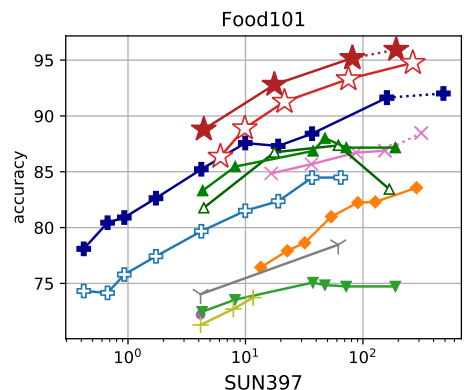


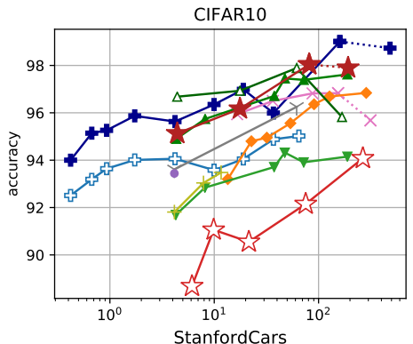


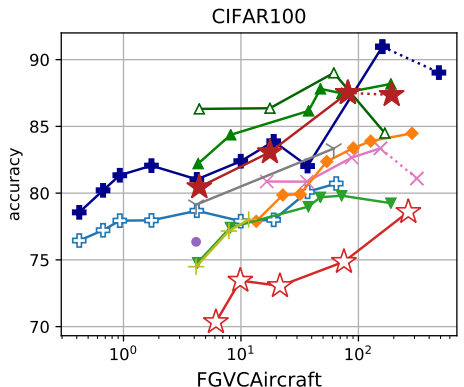


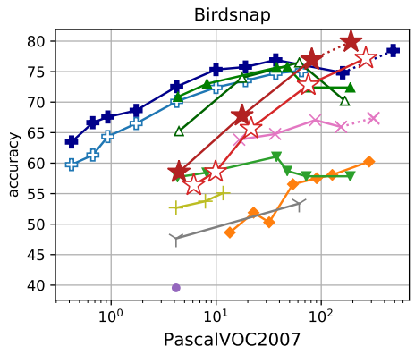


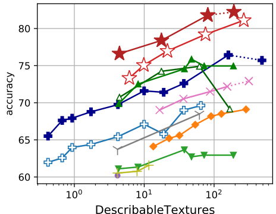


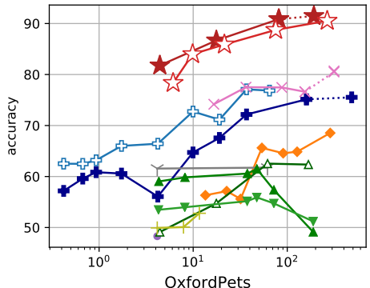


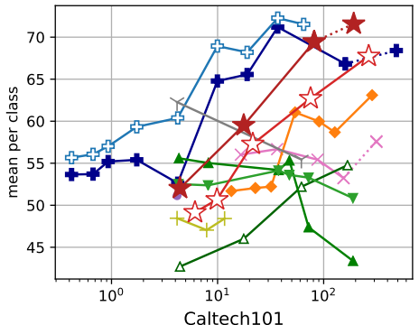


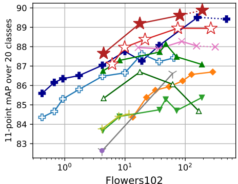


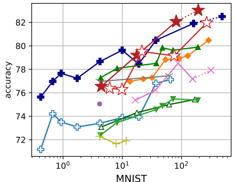


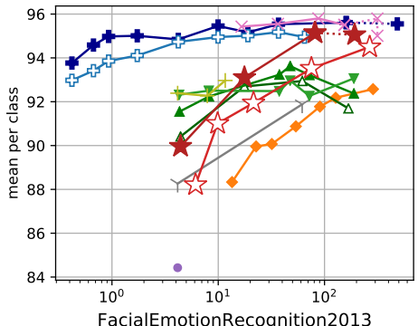


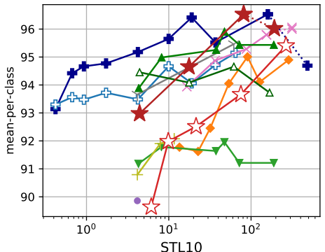


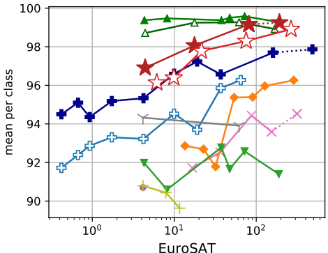


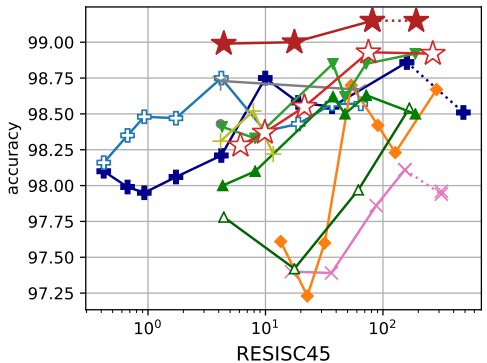


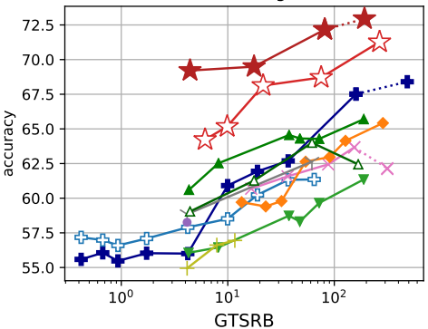


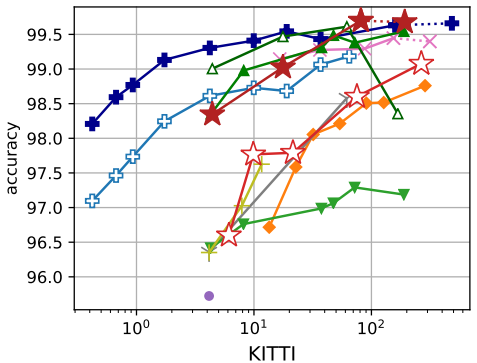


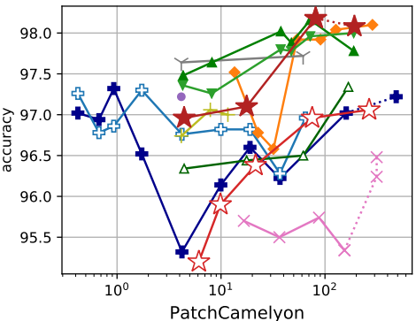


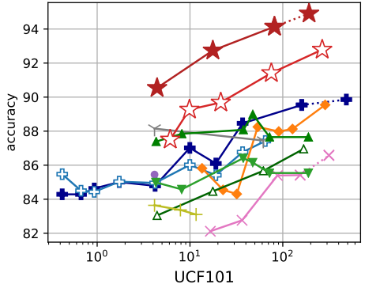


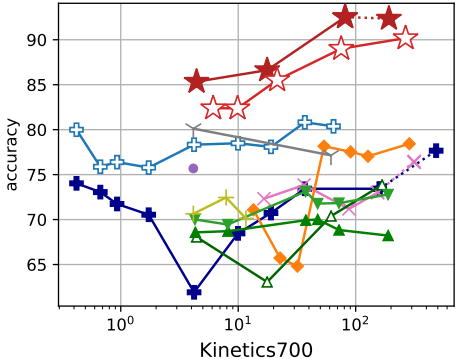


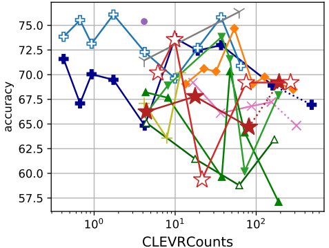


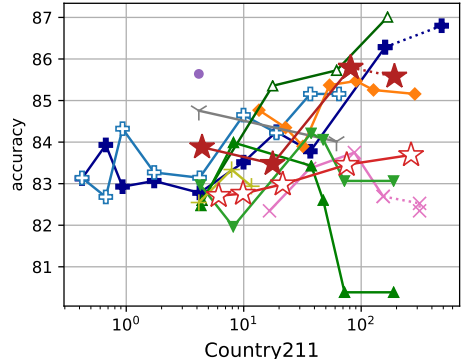


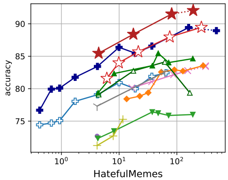


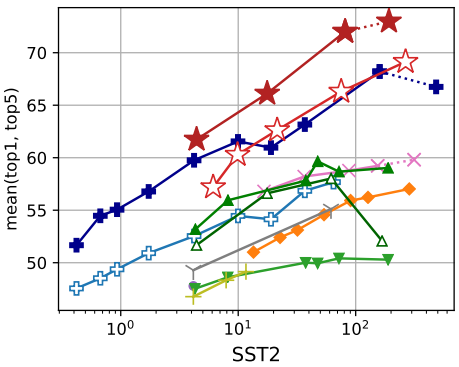


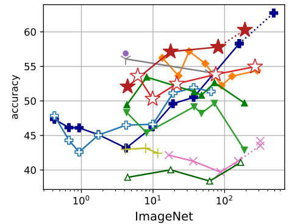


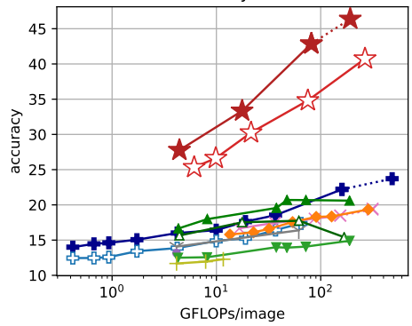


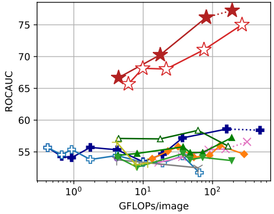


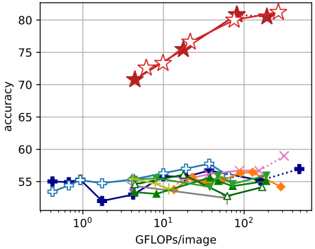


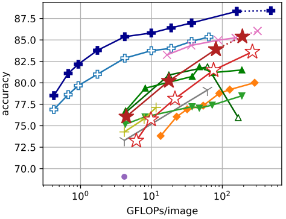


_CLIP-ViT_


_CLIP-ResNet_


_EfficientNet-NoisyStudent_


_EfficientNet_


_- Instagram 预训练_


_SimCLRv2_


_BYOL_


_MoCo_


_ViT (ImageNet-21k)_


_BiT-M_


_BiT-S_


_+ ResNet_


_图 20. 利用表 10 中的数据绘制的 27 个数据集各自的线性探测性能。_

---

---

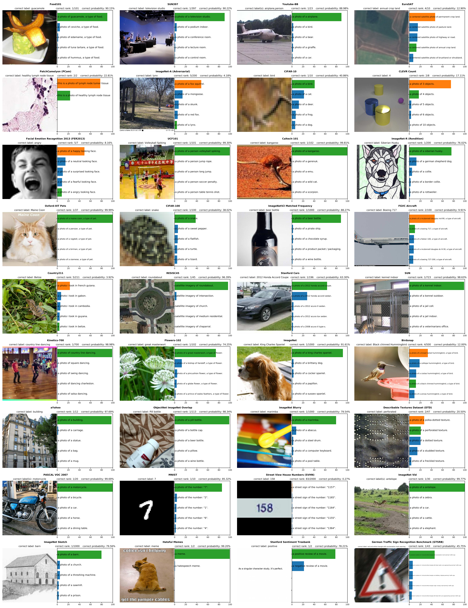


_图 21. 36 个 CLIP 零样本分类器预测结果的可视化。除了为了避免冒犯性内容而重新选择的 Hateful Memes 之外，所有示例均为随机选择。图中显示了前 5 个类别的预测概率以及用于表示该类别的文本。当使用多个模板时，显示的是第一个模板。真实标签显示为绿色，而错误的预测显示为橙色。_

---

---

<table><tr><td colspan="2"></td><td>Food101</td><td>CIFAR10</td><td>CIFAR100</td><td>Birdsnap</td><td>SUN397</td><td>Stanford Cars</td><td>FGVC Aircraft</td><td>VOC2007</td><td>DTD</td><td>Oxford Pets</td><td>Caltech101</td><td>Flowers102</td><td>MNIST</td><td>FER2013</td><td>EuroSAT</td><td>RESISC45</td><td>GTSRB</td><td>KITTI</td><td>Country211</td><td>PCam</td><td>UCF101</td><td>Kinetics700</td><td>CLEVR</td><td>HatefulMemes</td><td>Rendered SST2</td><td>ImageNet</td><td></td></tr><tr><td rowspan="5">CLIP-ResNet</td><td>RN50</td><td>81.1</td><td>75.6</td><td>41.6</td><td>32.6</td><td>59.6</td><td>55.8</td><td>19.3</td><td>82.1</td><td>41.7</td><td>85.4</td><td>82.1</td><td>65.9</td><td>66.6</td><td>42.2</td><td>94.3</td><td>41.1</td><td>54.2</td><td>35.2</td><td>42.2</td><td>16.1</td><td>57.6</td><td>63.6</td><td>43.5</td><td>20.3</td><td>59.7</td><td>56.9</td><td>59.6</td></tr><tr><td>RN101</td><td>83.9</td><td>81.0</td><td>49.0</td><td>37.2</td><td>59.9</td><td>62.3</td><td>19.5</td><td>82.4</td><td>43.9</td><td>86.2</td><td>85.1</td><td>65.7</td><td>59.3</td><td>45.6</td><td>96.7</td><td>33.1</td><td>58.5</td><td>38.3</td><td>33.3</td><td>16.9</td><td>55.2</td><td>62.2</td><td>46.7</td><td>28.1</td><td>61.1</td><td>64.2</td><td>62.2</td></tr><tr><td>RN50x4</td><td>86.8</td><td>79.2</td><td>48.9</td><td>41.6</td><td>62.7</td><td>67.9</td><td>24.6</td><td>83.0</td><td>49.3</td><td>88.1</td><td>86.0</td><td>68.0</td><td>75.2</td><td>51.1</td><td>96.4</td><td>35.0</td><td>59.2</td><td>35.7</td><td>26.0</td><td>20.2</td><td>57.5</td><td>65.5</td><td>49.0</td><td>17.0</td><td>58.3</td><td>66.6</td><td>65.8</td></tr><tr><td>RN50x16</td><td>90.5</td><td>82.2</td><td>54.2</td><td>45.9</td><td>65.0</td><td>72.3</td><td>30.3</td><td>82.9</td><td>52.8</td><td>89.7</td><td>87.6</td><td>71.9</td><td>80.0</td><td>56.0</td><td>97.8</td><td>40.3</td><td>64.4</td><td>39.6</td><td>33.9</td><td>24.0</td><td>62.5</td><td>68.7</td><td>53.4</td><td>17.6</td><td>58.9</td><td>67.6</td><td>70.5</td></tr><tr><td>RN50x64</td><td>91.8</td><td>86.8</td><td>61.3</td><td>48.9</td><td>66.9</td><td>76.0</td><td>35.6</td><td>83.8</td><td>53.4</td><td>93.4</td><td>90.6</td><td>77.3</td><td>90.8</td><td>61.0</td><td>98.3</td><td>59.4</td><td>69.7</td><td>47.9</td><td>33.2</td><td>29.6</td><td>65.0</td><td>74.1</td><td>56.8</td><td>27.5</td><td>62.1</td><td>70.7</td><td>73.6</td></tr><tr><td rowspan="4">CLIP-VIT</td><td>B/32</td><td>84.4</td><td>91.3</td><td>65.1</td><td>37.8</td><td>63.2</td><td>59.4</td><td>21.2</td><td>83.1</td><td>44.5</td><td>87.0</td><td>87.9</td><td>66.7</td><td>51.9</td><td>47.3</td><td>97.2</td><td>49.4</td><td>60.3</td><td>32.2</td><td>39.4</td><td>17.8</td><td>58.4</td><td>64.5</td><td>47.8</td><td>24.8</td><td>57.6</td><td>59.6</td><td>63.2</td></tr><tr><td>B/16</td><td>89.2</td><td>91.6</td><td>68.7</td><td>39.1</td><td>65.2</td><td>65.6</td><td>27.1</td><td>83.9</td><td>46.0</td><td>88.9</td><td>89.3</td><td>70.4</td><td>56.0</td><td>52.7</td><td>98.2</td><td>54.1</td><td>65.5</td><td>43.3</td><td>44.0</td><td>23.3</td><td>48.1</td><td>69.8</td><td>52.4</td><td>23.4</td><td>61.7</td><td>59.8</td><td>68.6</td></tr><tr><td>L/14</td><td>92.9</td><td>96.2</td><td>77.9</td><td>48.3</td><td>67.7</td><td>77.3</td><td>36.1</td><td>84.1</td><td>55.3</td><td>93.5</td><td>92.6</td><td>78.7</td><td>87.2</td><td>57.5</td><td>99.3</td><td>59.9</td><td>71.6</td><td>50.3</td><td>23.1</td><td>32.7</td><td>58.8</td><td>76.2</td><td>60.3</td><td>24.3</td><td>63.3</td><td>64.0</td><td>75.3</td></tr><tr><td>L/14-336px</td><td>93.8</td><td>95.7</td><td>77.5</td><td>49.5</td><td>68.4</td><td>78.8</td><td>37.2</td><td>84.3</td><td>55.7</td><td>93.5</td><td>92.8</td><td>78.3</td><td>88.3</td><td>57.7</td><td>99.4</td><td>59.6</td><td>71.7</td><td>52.3</td><td>21.9</td><td>34.9</td><td>63.0</td><td>76.9</td><td>61.3</td><td>24.8</td><td>63.3</td><td>67.9</td><td>76.2</td></tr></table>


_表 11. CLIP 模型在 27 个数据集上的零样本性能。_


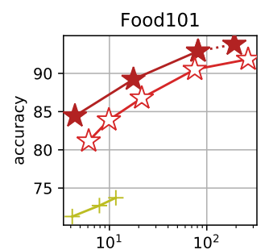


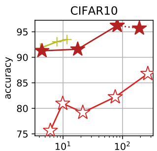


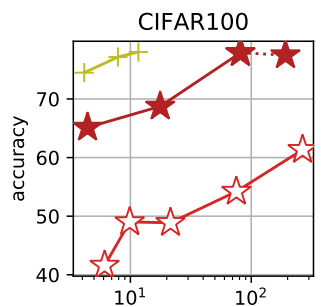


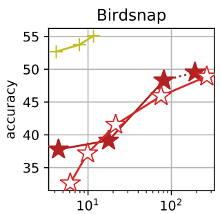


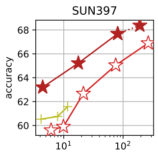


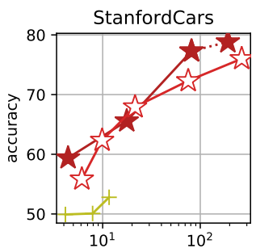


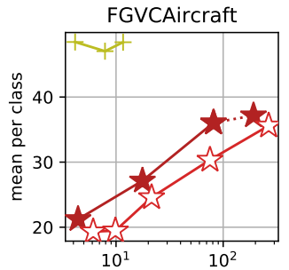


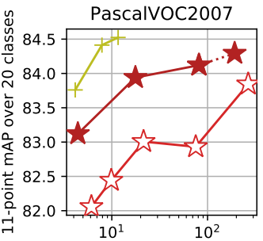


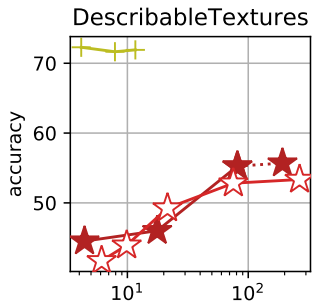


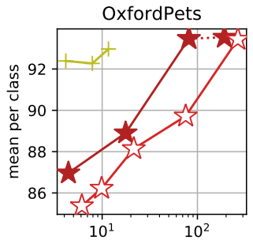


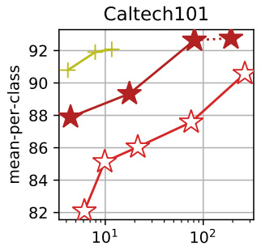


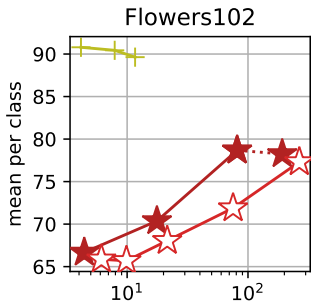


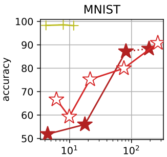


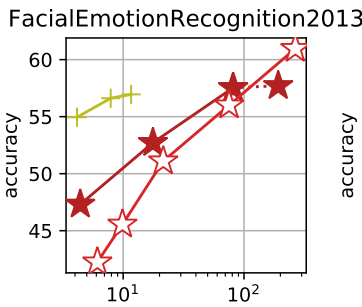


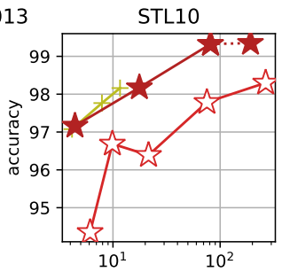


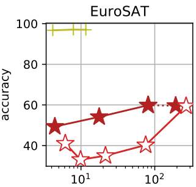


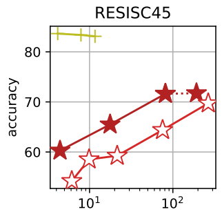


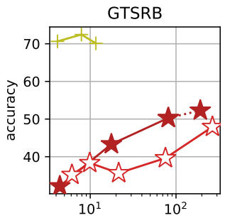


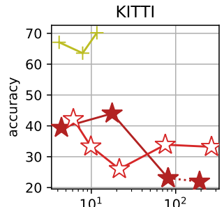


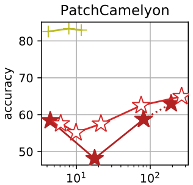


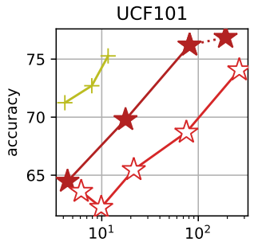


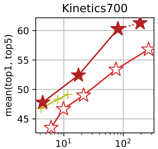


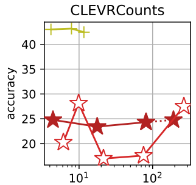


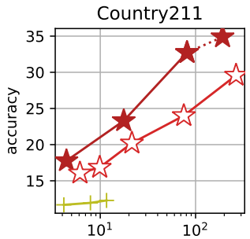


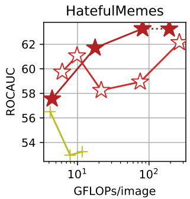


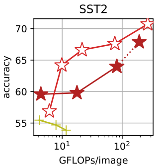


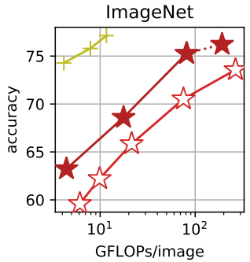


_CLIP-ResNet_


_ResNet_


_图 22. CLIP 的零样本性能与线性探测 ResNet 性能的对比_

---

---

# B. 零样本预测

为了提供 CLIP 零样本性能的定性总结/概览，我们在图 21 中可视化了 36 个不同的零样本 CLIP 分类器的随机预测结果。此外，表 11 和图 22 展示了每个数据集的独立零样本性能得分。

# C. 重复检测器

我们早期尝试的重复检测和分析使用的是模型学习到的嵌入空间中的最近邻方法。虽然使用模型自身的相似性概念很直观，但我们遇到了一些问题。我们发现模型的特征空间严重偏向于语义相似性。由于许多不同的物体（如足球、同种花卉等）的描述相似，会产生几乎完美的相似性，从而导致了许多假阳性。我们还观察到，该模型在为某些类型的近似重复图像分配高相似度分数方面表现相当差。我们反复注意到，经过不同调整大小算法（最近邻 vs 双线性）预处理的高频纹理图像（如皮毛或条纹图案）可能具有惊人的低相似度。这导致了大量的假阴性。

为了解决这个问题，我们构建了自己的近似重复检测器。我们创建了一个合成数据增强管道，结合了多种常见的图像处理操作。该增强管道结合了随机裁剪和缩放、纵横比失真、缩小和放大到不同分辨率、轻微旋转、JPEG 压缩和 HSV 颜色抖动。该管道还在所有相关步骤中随机选择不同的插值算法。然后，我们训练了一个模型，在最大化图像与其变换变体之间相似度的同时，最小化其与训练批次中所有其他图像的相似度。我们使用了与 CLIP 相同的 n-pair / InfoNCE 损失，但温度固定为 0.07。

我们选择 ResNet-50 作为模型架构。我们参考 (Zhang, 2019) 的抗锯齿改进对基础 ResNet-50 进行了修改，并使用权重归一化（Salimans & Kingma, 2016）代替批归一化（Ioffe & Szegedy, 2015），以避免通过批次统计信息泄露关于重复项的信息——这是 (Henaff, 2020) 之前指出的一个问题。我们还发现 GELU 激活函数（Hendrycks & Gimpel, 2016）在此任务上表现更好。我们使用总共 1,712 的批次大小，在从我们的预训练数据集中采样的大约 3000 万张图像上训练了该模型。在训练结束时，它在代理训练任务上实现了接近 $100\%$ 的准确率。

<table><tr><td rowspan="2">数据集</td><td colspan="3">线性分类器</td><td colspan="3">零样本</td></tr><tr><td>YFCC</td><td>WIT</td><td>Δ</td><td>YFCC</td><td>WIT</td><td>Δ</td></tr><tr><td>Birdsnap</td><td>47.4</td><td>35.3</td><td>+12.1</td><td>19.9</td><td>4.5</td><td>+15.4</td></tr><tr><td>Country211</td><td>23.1</td><td>17.3</td><td>+5.8</td><td>5.2</td><td>5.3</td><td>+0.1</td></tr><tr><td>Flowers102</td><td>94.4</td><td>89.8</td><td>+4.6</td><td>48.6</td><td>21.7</td><td>+26.9</td></tr><tr><td>GTSRB</td><td>66.8</td><td>72.5</td><td>-5.7</td><td>6.9</td><td>7.0</td><td>-0.1</td></tr><tr><td>UCF101</td><td>69.2</td><td>74.9</td><td>-5.7</td><td>22.9</td><td>32.0</td><td>-9.1</td></tr><tr><td>Stanford Cars</td><td>31.4</td><td>50.3</td><td>-18.9</td><td>3.8</td><td>10.9</td><td>-7.1</td></tr><tr><td>ImageNet</td><td>62.0</td><td>60.8</td><td>+1.2</td><td>31.3</td><td>27.6</td><td>+3.7</td></tr><tr><td>数据集平均</td><td>65.5</td><td>66.6</td><td>-1.1</td><td>29.6</td><td>30.0</td><td>-0.4</td></tr><tr><td>数据集“胜出”数</td><td>10</td><td>15</td><td>-5</td><td>19</td><td>18</td><td>+1</td></tr></table>

_表 12. 仅在 YFCC100M 上训练时，CLIP 的表现相似。比较仅在 YFCC100M 上训练的 ResNet-50 与在同等大小的 WIT 子集上训练的模型，结果显示在零样本和线性分类器评估中的平均性能和胜出次数相似。然而，特定数据集的性能存在很大差异。为了突出这一点，我们根据线性探针的结果，列出了 YFCC 相比 WIT 表现最好和最差的 3 个数据集的性能，以及所有线性和零样本评估的聚合性能和标准的 ImageNet 数据集。_

# D. YFCC100M 上的数据集消融实验

为了研究我们的自定义数据集对 CLIP 的性能是否至关重要，我们在 YFCC100M 数据集的一个过滤子集上训练了一个模型（详情见第 2.2 节），并将其性能与在同等大小的 WIT 子集上训练的相同模型进行了比较。我们将每个模型训练了 32 个轮次，此时由于过拟合，迁移性能开始趋于平稳。结果如表 12 所示。在我们整个评估套件中，YFCC 和 WIT 在零样本和线性探针设置下的平均表现相似。然而，在特定的细粒度分类数据集上的性能可能会有很大差异——有时超过 $10\%$。我们推测这些性能差异反映了每个预训练数据集中相关数据的相对密度。例如，在 YFCC100M 上进行预训练（可能包含许多鸟类和花卉的照片，这是摄影师常见的拍摄主题）使得在 Birdsnap 和 Flowers102 上的性能更好，而在 WIT 上进行预训练则在汽车和宠物分类器上表现更好（这些在我们的数据集中很常见）。

总的来说，这些结果是令人鼓舞的，因为它们表明我们的方法可以使用任何经过合理过滤的配对（文本，图像）数据集合。这与最近的工作相呼应，后者报告了在相对不同的医学影像领域使用相同的对比预训练目标取得了积极结果（Zhang et al., 2020）。这也与 Noisy Student 自训练的发现相似，该研究报告称使用他们的 JFT300M 数据集相比 YFCC100M 仅略有改善（Xie et al., 2020）。我们怀疑我们的数据集相比现有的 YFCC100M 的主要优势在于其规模大得多。

---

最后，我们需要提醒的是，WIT 包含了经过过滤的 YFCC100M 子集。这可能会导致我们的消融实验低估 YFCC100M 与 WIT 其余部分之间的性能差异。但我们认为这种情况不太可能发生，因为 YFCC100M 仅占整个 WIT 数据混合的 $3.7\%$，且在构建 WIT 时将其添加到现有数据混合中后，并未明显改变模型的性能。

# E. 选定任务和数据集的结果

由于本文涉及的数据集和实验种类繁多，正文主要侧重于总结和分析整体结果。在以下小节中，我们将报告特定任务组、数据集和评估设置的性能细节。

# E.1. 图像和文本检索

CLIP 在我们构建的噪声级网络规模数据集上，针对图像-文本检索任务进行预训练。虽然本文的重点是表示学习和任务学习，目的是迁移到各种各样的下游数据集，但验证 CLIP 能够在其预训练的特定任务上实现高迁移性能，仍然是一个重要的合理性检查/概念验证。在表 13 中，我们检查了 CLIP 在 Flickr30k 和 MSCOCO 数据集上进行文本和图像检索的零样本迁移性能。零样本 CLIP 匹配或优于这两个数据集上所有先前的零样本结果。在 Flickr30k 的文本检索任务上，零样本 CLIP 也可与当前的整体 SOTA（最先进技术）相媲美。在图像检索方面，CLIP 相对于整体最先进水平的性能明显较低。然而，零样本 CLIP 仍然可以与经过微调的 Unicoder-VL 相竞争。在更大的 MS-COCO 数据集上，微调显著提高了性能，零样本 CLIP 无法与最新的工作相竞争。对于这两个数据集，我们在每张图像的描述前添加了提示词“a photo o f”，我们发现这使 CLIP 的零样本 R@1 性能提高了 1 到 2 个点。

# E.2. 光学字符识别

尽管可视化研究表明 ImageNet 模型包含对图像中出现的文本有反应的特征（Zeiler & Fergus, 2014），但这些表示不够精细，无法用于光学字符识别（OCR）任务。为了弥补这一点，模型通常结合了自定义 OCR 引擎的输出和特征，以提升需要此能力的任务性能（Singh et al., 2019; Yang et al., 2020）。在 CLIP 开发的早期，我们注意到 CLIP 开始学习原始的 OCR 能力，并且这种能力在项目进展过程中似乎稳步提升。为了评估这种定性的观察结果，我们测量了性能。

我们在 5 个需要直接和间接使用 OCR 的数据集上进行了测量。其中三个数据集——MNIST (LeCun)、SVHN (Netzer et al., 2011) 和 IIIT5K (Mishra et al., 2012)——直接检查模型执行低级字符和单词识别的能力，而 Hateful Memes (Kiela et al., 2020) 和 SST-2 (Socher et al., 2013) 则检查模型利用 OCR 执行语义任务的能力。结果报告在表 14 中。

CLIP 的性能仍然差异很大，并且似乎受到域（渲染图像或自然图像）和待识别文本类型（数字或单词）的某种组合的影响。CLIP 的 OCR 性能在 Hateful Memes 和 SST-2 上最强——这些数据集的文本是数字渲染的，且主要由单词组成。在 IIIT5K（包含单独裁剪的单词的自然图像）上，零样本 CLIP 的表现稍好一些，其性能与 Jaderberg et al. (2014) 的早期工作相似，该工作结合了深度学习和结构化预测来执行开放词汇表的 OCR。然而，在涉及手写数字和街景数字识别的两个数据集上，性能明显较低。CLIP 在完整数字 SVHN 上的 $51\%$ 准确率远低于任何已发布的结果。检查表明，CLIP 在处理重复字符以及 SVHN 的低分辨率和模糊图像方面存在困难。CLIP 的零样本 MNIST 性能也较差，甚至被基于原始像素的有监督逻辑回归（最简单的机器学习基线之一）所超越。

SST-2 是一个句子级别的 NLP 数据集，我们将其渲染成图像。我们纳入 SST-2 是为了检查 CLIP 是否能够将低级的 OCR 能力转化为更高级的表示。在 CLIP 对渲染句子的表示上拟合线性分类器实现了 $80.5\%$ 的准确率。这与使用在 8400 亿个词元上预训练的 GloVe 词向量的连续词袋基线的 $80\%$ 准确率相当（Pennington et al., 2014）。虽然按今天的标准来看，这是一个简单的 NLP 基线，且远低于当前 SOTA 的 $97.5\%$，但令人鼓舞的是，CLIP 能够将渲染文本的图像转化为非平凡的句子级表示。完全监督的 CLIP 在 Hateful Memes 检测上也表现出惊人的强劲性能，CLIP 仅比当前的单模型 SOTA 落后 0.7 分，并比原始论文中的最佳基线高出数分。与 SST-2 类似，Hateful Memes 上的这些其他结果使用了 CLIP 无法访问的真实文本。最后，我们指出，零样本 CLIP 的表现优于我们评估套件中包含的所有其他 56 个模型上使用完全监督线性探针的最佳结果。这表明与现有的自监督和有监督表示学习工作相比，CLIP 的 OCR 能力至少具有一定的独特性。

---

<table><tr><td rowspan="3" colspan="2"></td><td colspan="7">文本检索</td><td colspan="6">图像检索</td></tr><tr><td colspan="3">Flickr30k</td><td colspan="3">MSCOCO</td><td colspan="3">Flickr30k</td><td colspan="3">MSCOCO</td><td></td></tr><tr><td>R@1</td><td>R@5</td><td>R@10</td><td>R@1</td><td>R@5</td><td>R@10</td><td>R@1</td><td>R@5</td><td>R@10</td><td>R@1</td><td>R@5</td><td>R@10</td><td></td></tr><tr><td rowspan="5">微调</td><td>Unicoder-VLa</td><td>86.2</td><td>96.3</td><td>99.0</td><td>62.3</td><td>87.1</td><td>92.8</td><td>71.5</td><td>90.9</td><td>94.9</td><td>46.7</td><td>76.0</td><td>85.3</td><td></td></tr><tr><td>Uniterb</td><td>87.3</td><td>98.0</td><td>99.2</td><td>65.7</td><td>88.6</td><td>93.8</td><td>75.6</td><td>94.1</td><td>96.8</td><td>52.9</td><td>79.9</td><td>88.0</td><td></td></tr><tr><td>VILLAc</td><td>87.9</td><td>97.5</td><td>98.8</td><td>-</td><td>-</td><td>-</td><td>76.3</td><td>94.2</td><td>96.8</td><td>-</td><td>-</td><td>-</td><td></td></tr><tr><td>Oscard</td><td>-</td><td>-</td><td>-</td><td>73.5</td><td>92.2</td><td>96.0</td><td>-</td><td>-</td><td>-</td><td>57.5</td><td>82.8</td><td>89.8</td><td></td></tr><tr><td>ERNIE-VILe</td><td>88.7</td><td>98.0</td><td>99.2</td><td>-</td><td>-</td><td>-</td><td>76.7</td><td>93.6</td><td>96.4</td><td>-</td><td>-</td><td>-</td><td></td></tr><tr><td rowspan="5">零样本</td><td>Visual N-Gramsf</td><td>15.4</td><td>35.7</td><td>45.1</td><td>8.7</td><td>23.1</td><td>33.3</td><td>8.8</td><td>21.2</td><td>29.9</td><td>5.0</td><td>14.5</td><td>21.9</td><td></td></tr><tr><td>ImageBERTg</td><td>-</td><td>-</td><td>-</td><td>44.0</td><td>71.2</td><td>80.4</td><td>-</td><td>-</td><td>-</td><td>32.3</td><td>59.0</td><td>70.2</td><td></td></tr><tr><td>Unicoder-VLa</td><td>64.3</td><td>86.8</td><td>92.3</td><td>-</td><td>-</td><td>-</td><td>48.4</td><td>76.0</td><td>85.2</td><td>-</td><td>-</td><td>-</td><td></td></tr><tr><td>Uniterb</td><td>83.6</td><td>95.7</td><td>97.7</td><td>-</td><td>-</td><td>-</td><td>68.7</td><td>89.2</td><td>93.9</td><td>-</td><td>-</td><td>-</td><td></td></tr><tr><td>CLIP</td><td>88.0</td><td>98.7</td><td>99.4</td><td>58.4</td><td>81.5</td><td>88.1</td><td>68.7</td><td>90.6</td><td>95.2</td><td>37.8</td><td>62.4</td><td>72.2</td><td></td></tr></table>


_表 13. CLIP 提升了零样本检索的性能，并且在 Flickr30k 文本检索任务上与最佳微调结果具有竞争力。粗体表示整体最佳性能，下划线表示类别内（零样本或微调）最佳性能。对于所有其他模型，报告的是论文中无论模型大小/变体如何的最佳结果。MSCOCO 的性能报告在 5k 测试集上。 $ {}^{a} $ (Li et al.,2020a) $ {}^{b} $ (Chen et al.,2019) $ {}^{c} $ (Gan et al.,2020) $ {}^{d} $ (Li et al.,2020b) $ {}^{e} $ (Yu et al.,2020) $ {}^{f} $ (Li et al.,2017) $ {}^{g} $ (Qi et al.,2020)_


<table><tr><td></td><td></td><td>MNIST</td><td>SVHN</td><td>IIIT5K 1k</td><td>Hateful Memes</td><td>SST-2</td></tr><tr><td rowspan="3">微调</td><td>SOTA</td><td>99.8a</td><td>96.4b</td><td>98.9c</td><td>78.0d</td><td>97.5e</td></tr><tr><td>JOINTf</td><td>-</td><td>-</td><td>89.6</td><td>-</td><td>-</td></tr><tr><td>CBoWg</td><td>-</td><td>-</td><td>-</td><td>-</td><td>80.0</td></tr><tr><td rowspan="3">线性</td><td>Raw Pixels</td><td>92.5</td><td>-</td><td>-</td><td>-</td><td>-</td></tr><tr><td>ES Best</td><td>98.9h</td><td>-</td><td>-</td><td>58.6h</td><td>59.0i</td></tr><tr><td>CLIP</td><td>99.2</td><td>-</td><td>-</td><td>77.3</td><td>80.5</td></tr><tr><td>ZS</td><td>CLIP</td><td>88.4</td><td>51.0</td><td>90.0</td><td>63.3</td><td>67.9</td></tr></table>


_表 14. 5 个数据集上的 OCR 性能。除 Hateful Memes 报告开发集上的 ROC AUC 外，所有指标均为测试集上的准确率。据我们所知，报告的是单模型 SOTA。ES Best 报告了我们评估套件中 56 个非 CLIP 模型中的最佳性能。 $ {}^{a} $ (Assiri,2020) $ {}^{b} $ (Jaderberg et al., 2015) $ {}^{c} $ (Wang et al.,2020) $ {}^{d} $ (Lippe et al.,2020) $ {}^{f} $ (Jaderberg et al., 2014) $ {}^{g} $ (Wang et al.,2018) $ {}^{h} $ (Xie et al.,2020) $ {}^{i} $ (Mahajan et al., 2018)_


# E.3. 视频中的动作识别


出于学习目的，自然语言的一个潜在重要方面是它能够表达（并因此监督）极其广泛的概念集合。由于 CLIP 模型受过训练以将半任意的文本与图像配对，因此它很可能接收到涉及普通名词、专有名词、动词和形容词的广泛视觉概念的监督。相比之下，ImageNet-1K 仅标注普通名词。ImageNet 缺乏更广泛的监督是否会导致 ImageNet 模型在涉及识别非名词视觉概念的任务上的迁移能力变弱？


为了研究这一点，我们在几个视频动作分类数据集上测量并比较了 CLIP 和 ImageNet 模型的性能，这些数据集衡量模型识别动词的能力。在表 15 中，我们报告了 UCF-101 (Soomro et al., 2012) 和 Kinetics-700 (Carreira et al., 2019) 的结果，这是该任务的两个常用数据集。不幸的是，由于训练帧的数量非常大，我们基于 CPU 的线性分类器在视频数据集上进行评估所需的时间非常长。为了解决这个问题，我们对每个视频进行激进的下采样，仅保留单个中心帧，有效地将其转化为图像分类数据集。因此，我们在线性评估设置下报告的性能可能会在一定程度上低估实际性能。


<table><tr><td></td><td></td><td rowspan="2">UCF101 Top-1</td><td rowspan="2">K700 AVG</td><td colspan="2">RareAct</td></tr><tr><td></td><td></td><td>mWAP</td><td>mWSAP</td></tr><tr><td rowspan="4">微调</td><td>R(2+1)D-BERTa</td><td>98.7</td><td>-</td><td>-</td><td>-</td></tr><tr><td>NS ENet-L2b</td><td>-</td><td>84.8</td><td>-</td><td>-</td></tr><tr><td>HT100M S3Dd</td><td>91.3</td><td>-</td><td>-</td><td>-</td></tr><tr><td>Baseline I3De</td><td>-</td><td>70.2</td><td>-</td><td>-</td></tr><tr><td rowspan="3">线性</td><td>MMV FACf</td><td>91.8</td><td>-</td><td>-</td><td>-</td></tr><tr><td>NS ENet-L2c</td><td>89.4c</td><td>68.2c</td><td>-</td><td>-</td></tr><tr><td>CLIP</td><td>92.0</td><td>73.0</td><td>-</td><td>-</td></tr><tr><td rowspan="2">ZS</td><td>HT100M S3Dd</td><td>-</td><td>-</td><td>30.5</td><td>34.8</td></tr><tr><td>CLIP</td><td>80.3</td><td>69.6</td><td>40.7</td><td>44.8</td></tr></table>


_表 15. 3 个视频数据集上的动作识别性能。据我们所知，报告的是单模型 SOTA。请注意，线性 CLIP 和线性 NS ENet-L2 是在每个数据集的单帧下采样版本上进行训练和评估的，因此与之前的工作不具有直接可比性。在 Kinetics-700 上，我们报告的是 ActivityNet 竞赛指标，即 top-1 和 top-5 性能的平均值。 $ {}^{a} $ (Kalfaoglu et al.,2020) $ {}^{b} $ (Lu et al.,2020) $ {}^{c} $ (Xie et al., 2020) $ {}^{d} $ (Miech et al.,2020b) $ {}^{e} $ (Carreira et al.,2019) $ {}^{f} $ (Alayrac et al.,2020)_

---

---

<table><tr><td rowspan="2"></td><td rowspan="2">IN Top-1</td><td rowspan="2">IN-V2 Top-1</td><td rowspan="2">IN-A Top-1</td><td rowspan="2">IN-R Top-1</td><td rowspan="2">ObjectNet Top-1</td><td rowspan="2">IN-Sketch Top-1</td><td colspan="2">IN-Vid</td><td colspan="2">YTBB</td></tr><tr><td>PM0</td><td>PM10</td><td>PM0</td><td>PM10</td></tr><tr><td>NS EfficientNet-L2a</td><td>88.3</td><td>80.2</td><td>84.9</td><td>74.7</td><td>68.5</td><td>47.6</td><td>88.0</td><td>82.1</td><td>67.7</td><td>63.5</td></tr><tr><td>FixResNeXt101-32x48d V2b</td><td>86.4</td><td>78.0</td><td>68.4</td><td>80.0</td><td>57.8</td><td>59.1</td><td>85.8</td><td>72.2</td><td>68.9</td><td>57.7</td></tr><tr><td>Linear Probe CLIP</td><td>85.4</td><td>75.9</td><td>75.3</td><td>84.2</td><td>66.2</td><td>57.4</td><td>89.1</td><td>77.2</td><td>68.7</td><td>63.1</td></tr><tr><td>Zero-Shot CLIP</td><td>76.2</td><td>70.1</td><td>77.2</td><td>88.9</td><td>72.3</td><td>60.2</td><td>95.3</td><td>89.2</td><td>95.2</td><td>88.5</td></tr></table>


_表 16. 详细的 ImageNet 鲁棒性性能。IN 是 ImageNet 的缩写。 $ {}^{a} $ (Xie et al.,2020) $ {}^{b} $ (Touvron et al.,2019)_


尽管存在这一劣势，CLIP 的特征在此任务上的迁移效果却出奇地好。在线性探针评估设置下，CLIP 匹配了 UCF-101 上的最佳先前结果，并且在我们评估套件中的所有其他模型中表现最优。在 Kinetics-700 上，CLIP 也优于原始论文中微调后的 I3D 基线。由于它不需要训练阶段，我们在对所有帧的预测进行平均时报告 CLIP 的零样本性能。CLIP 在这种设置下也表现良好，在 Kinetics-700 上，其性能与在 545,000 个标记视频上训练的全监督 I3D 基线相差不到 $1\%$。受这些结果的鼓舞，我们还测量了 CLIP 在最近推出的 RareAct 数据集（Miech et al., 2020a）上的性能，该数据集旨在衡量对“用锤子砸手机”和“钻鸡蛋”等不寻常动作的零样本识别。与之前的最先进水平相比，CLIP 提高了 10 个百分点，之前的最佳模型是在从 1 亿个教学视频中自动提取的字幕上训练的 S3D 模型。


虽然 CLIP 在动作识别任务上表现出了令人鼓舞的强劲性能，但我们注意到，除了监督形式之外，被比较的模型之间在模型架构、训练数据分布、数据集大小和计算资源使用等方面存在许多差异。需要进一步的工作来更精确地确定哪些具体的设计决策有助于在该任务上实现高性能。


<table><tr><td></td><td>1km</td><td>25km</td><td>200km</td><td>750km</td><td>2500km</td></tr><tr><td>ISNa</td><td>16.9</td><td>43.0</td><td>51.9</td><td>66.7</td><td>80.2</td></tr><tr><td>CPlaNetb</td><td>16.5</td><td>37.1</td><td>46.4</td><td>62.0</td><td>78.5</td></tr><tr><td>CLIP</td><td>13.9</td><td>32.9</td><td>43.0</td><td>62.0</td><td>79.3</td></tr><tr><td>Deep-Ret+c</td><td>14.4</td><td>33.3</td><td>47.7</td><td>61.6</td><td>73.4</td></tr><tr><td>PlaNetd</td><td>8.4</td><td>24.5</td><td>37.6</td><td>53.6</td><td>71.3</td></tr></table>


_表 17. IM2GPS 测试集上的地理定位性能。指标为定位在给定半径内的图像百分比。模型按平均性能排序。 $ {}^{a} $ (Muller-Budack et al.,2018) $ {}^{b} $ (Hongsuck Seo et al.,2018) $ {}^{c} $ (Vo et al.,2017) $ {}^{c} $ (Weyand et al., 2016)_


# E.4. 地理定位


在开发 CLIP 期间，我们注意到的另一个行为是它识别许多地点和位置的能力。为了量化这一点，我们创建了 Country211 数据集（如附录 A 所述），并在整篇论文中报告了其结果。然而，这是一个新的基准测试，为了与之前关于地理定位的工作进行比较，我们还在表 17 中报告了 Hays & Efros (2008) 的 IM2GPS 测试集上的结果。由于 IM2GPS 是一个回归基准测试，我们使用 CLIP 的嵌入空间猜测一组参考图像中最近似图像的 GPS 坐标。这不是一个零样本结果，因为它使用了最近邻回归。尽管仅查询了 100 万张图像（远少于之前的工作），CLIP 的表现与几个特定任务的模型相似。然而，它与当前的最先进水平相比缺乏竞争力。


# E.5. 对分布偏移的鲁棒性


第 3.3 节提供了 ImageNet 相关鲁棒性结果的高级总结和分析。我们在此附录中简要提供一些额外的数值细节。每个数据集的性能结果在表 16 中提供，并与 Taori et al. (2020) 评估套件中报告的当前最先进结果进行了比较。零样本 CLIP 在 7 个数据集中的 5 个上提高了最先进水平，即 ImageNet-R、ObjectNet、ImageNet-Sketch、ImageNet-Vid 和 Youtube-BB。由于 CLIP 灵活的零样本能力，其在 ImageNet-Vid 和 Youtube-BB 上的改进最大，而在 ImageNet-R 上的改进可能反映了 CLIP 的预训练分布包含大量的创意内容。正如 Taori et al. (2020) 中所讨论的，对于在 Instagram 上预训练的 ResNeXt 模型，也记录了类似的行为。

---

---

# F. 模型超参数


<table><tr><td>超参数</td><td>数值</td></tr><tr><td>批大小</td><td>32768</td></tr><tr><td>词表大小</td><td>49408</td></tr><tr><td>训练轮数</td><td>32</td></tr><tr><td>最高温度</td><td>100.0</td></tr><tr><td>权重衰减</td><td>0.2</td></tr><tr><td>预热迭代次数</td><td>2000</td></tr><tr><td>Adam β1</td><td>0.9</td></tr><tr><td>Adam β2</td><td>0.999 (ResNet), 0.98 (ViT)</td></tr><tr><td>Adam ε</td><td>10-8 (ResNet), 10-6 (ViT)</td></tr></table>


_表 18. 通用 CLIP 超参数_


<table><tr><td>模型</td><td>学习率</td><td>嵌入维度</td><td>输入分辨率</td><td>ResNet 模块</td><td>宽度</td><td>文本 Transformer 层数</td><td>宽度</td><td>头数</td></tr><tr><td>RN50</td><td>$5 \times 10^{-4}$</td><td>1024</td><td>224</td><td>(3, 4, 6, 3)</td><td>2048</td><td>12</td><td>512</td><td>8</td></tr><tr><td>RN101</td><td>$5 \times 10^{-4}$</td><td>512</td><td>224</td><td>(3, 4, 23, 3)</td><td>2048</td><td>12</td><td>512</td><td>8</td></tr><tr><td>RN50x4</td><td>$5 \times 10^{-4}$</td><td>640</td><td>288</td><td>(4, 6, 10, 6)</td><td>2560</td><td>12</td><td>640</td><td>10</td></tr><tr><td>RN50x16</td><td>$4 \times 10^{-4}$</td><td>768</td><td>384</td><td>(6, 8, 18, 8)</td><td>3072</td><td>12</td><td>768</td><td>12</td></tr><tr><td>RN50x64</td><td>$3.6 \times 10^{-4}$</td><td>1024</td><td>448</td><td>(3, 15, 36, 10)</td><td>4096</td><td>12</td><td>1024</td><td>16</td></tr></table>


_表 19. CLIP-ResNet 超参数_


<table><tr><td>模型</td><td>学习率</td><td>嵌入维度</td><td>输入分辨率</td><td>Vision Transformer 层数</td><td>宽度</td><td>头数</td><td>文本 Transformer 层数</td><td>宽度</td><td>头数</td></tr><tr><td>ViT-B/32</td><td>5 × 10-4</td><td>512</td><td>224</td><td>12</td><td>768</td><td>12</td><td>12</td><td>512</td><td>8</td></tr><tr><td>ViT-B/16</td><td>5 × 10-4</td><td>512</td><td>224</td><td>12</td><td>768</td><td>12</td><td>12</td><td>512</td><td>8</td></tr><tr><td>ViT-L/14</td><td>4 × 10-4</td><td>768</td><td>224</td><td>24</td><td>1024</td><td>16</td><td>12</td><td>768</td><td>12</td></tr><tr><td>ViT-L/14-336px</td><td>2 × 10-5</td><td>768</td><td>336</td><td>24</td><td>1024</td><td>16</td><td>12</td><td>768</td><td>12</td></tr></table>


_表 20. CLIP-ViT 超参数_

---