# DeepSeek-R1: 通过强化学习激励大语言模型中的推理能力

DeepSeek-AI

research@deepseek.com

# 摘要

通用推理一直是人工智能领域中一个长期且极具挑战性的课题。近年来，以大语言模型（LLMs）（Brown et al., 2020; OpenAI, 2023）和思维链提示（Wei et al., 2022b）为代表的突破性进展在基础推理任务上取得了相当大的成功。然而，这种成功在很大程度上依赖于大量人类标注的演示数据，而且模型的能力在处理更复杂的问题时仍然不足。在这里，我们展示了大语言模型的推理能力可以通过纯粹的强化学习（RL）来激励，无需人类标注的推理轨迹。所提出的强化学习框架促进了高级推理模式的自发涌现，如自我反思、验证和动态策略调整。因此，训练后的模型在数学、编程竞赛和STEM领域等可验证任务上表现出色，超越了通过传统监督学习在人类演示上训练的对应模型。此外，这些大规模模型展现出的涌现推理模式可以被系统性地利用来指导和增强较小模型的推理能力。

# 1. 引言

推理能力是人类智能的基石，使人们能够完成从数学问题解决到逻辑推理和编程等复杂认知任务。人工智能的最新进展表明，大语言模型（LLMs）在扩展到足够规模时能够展现出包括推理能力在内的涌现行为（Kaplan et al., 2020; Wei et al., 2022a）。然而，在预训练阶段实现这种能力通常需要大量的计算资源。同时，一个互补的研究方向表明，大语言模型可以通过思维链（CoT）提示得到有效增强。这种技术通过提供精心设计的小样本示例或使用"让我们逐步思考"（Kojima et al., 2022; Wei et al., 2022b）等极简提示，使模型能够生成中间推理步骤，从而显著提升其在复杂任务上的表现。同样，当模型在后期训练阶段学习高质量的多步推理轨迹时，可以观察到进一步的性能提升（Chung et al., 2024; OpenAI, 2023）。尽管这些方法非常有效，但它们也存在明显的局限性。它们对人类标注推理轨迹的依赖阻碍了可扩展性并引入了认知偏差。此外，通过约束模型复制人类思维过程，其性能本质上受到人类提供的示例的限制，这阻止了探索更优的、非人类式的推理路径。

为了解决这些问题，我们旨在探索大语言模型通过自我进化在强化学习框架中开发推理能力的潜力，尽量减少对人类标注工作的依赖。具体来说，我们基于DeepSeek-V3-Base（DeepSeek-AI, 2024b），采用群体相对策略优化（GRPO）（Shao et al., 2024）作为我们的强化学习框架。奖励信号仅基于最终预测相对于真实答案的正确性，对推理过程本身不加约束。值得注意的是，我们绕过了传统强化学习训练之前的监督微调（SFT）阶段。这一设计选择源于我们的假设：人类定义的推理模式可能会限制模型的探索，而无限制的强化学习训练可以更好地激励大语言模型中新型推理能力的涌现。通过这个过程（详见第2节），我们的模型（称为DeepSeek-R1-Zero）自然地发展出了多样化和复杂的推理行为。在解决推理问题时，模型倾向于生成更长的回复，包括验证、反思和在每个回复中探索替代方法。虽然我们没有明确教模型如何推理，但它通过强化学习成功地学会了改进推理策略。

尽管DeepSeek-R1-Zero展示了出色的推理能力，但它面临着可读性差和语言混合等问题，偶尔会在单个思维链回复中混合使用英语和中文。此外，DeepSeek-R1-Zero的基于规则的强化学习训练阶段仅专注于推理任务，在更广泛的领域（如写作和开放域问答）表现有限。为了解决这些挑战，我们引入了DeepSeek-R1，这是一个通过多阶段学习框架训练的模型，整合了拒绝采样、强化学习和监督微调，详见第3节。这种训练管道使DeepSeek-R1能够继承其前身DeepSeek-R1-Zero的推理能力，同时通过额外的非推理数据使模型行为与人类偏好保持一致。

为了以更低的能源成本实现更广泛的强大AI访问，我们已经提炼了几个较小的模型并公开发布。这些提炼模型展示了强大的推理能力，超越了其原始指令调优对应模型。我们相信，这些指令调优版本也将为研究社区做出重大贡献，为理解长思维链（CoT）推理模型的机制和促进更强大推理模型的发展提供宝贵资源。我们在 https://huggingface.co/deepseek-ai 发布DeepSeek-R1系列模型。

# 2. DeepSeek-R1-Zero

我们首先详细阐述DeepSeek-R1-Zero的训练，它完全依赖强化学习而不进行监督微调。为了促进大规模强化学习的效率，我们采用群体相对策略优化（GRPO）（Shao et al., 2024）。

# 2.1. 群体相对策略优化

GRPO（Shao et al., 2024）是，我们采用它来训练DeepSeek-R1-Zero和DeepSeek-R1的强化学习算法。它最初是为了简化和减少近端策略优化（PPO）（Schulman et al., 2017）的训练过程和资源消耗而提出的，PPO是大语言模型强化学习阶段广泛使用的算法（Ouyang et al., 2022）。

对于每个问题 $q$，GRPO从旧策略 $\pi_{\theta_{old}}$ 中采样一组输出 $\{o_1, o_2, \dots, o_G\}$，然后通过最大化以下目标来优化策略模型 $\pi_{\theta}$：

$$
\begin{array}{l} \mathcal{J}_{GRPO}(\theta) = \mathbb{E}\left[ q \sim P(Q), \{o_i\}_{i=1}^{G} \sim \pi_{\theta_{old}}(O | q) \right] \\ \frac{1}{G} \sum_{i=1}^{G} \left(\min\left(\frac{\pi_{\theta}(o_i | q)}{\pi_{\theta_{old}}(o_i | q)} A_i, \operatorname{clip}\left(\frac{\pi_{\theta}(o_i | q)}{\pi_{\theta_{old}}(o_i | q)}, 1 - \varepsilon, 1 + \varepsilon\right) A_i\right) - \beta \mathbb{D}_{KL}(\pi_{\theta} \| \pi_{ref})\right), \\ \mathbb{D}_{KL}\left(\pi_{\theta} \| \pi_{ref}\right) = \frac{\pi_{ref}(o_i | q)}{\pi_{\theta}(o_i | q)} - \log\frac{\pi_{ref}(o_i | q)}{\pi_{\theta}(o_i | q)} - 1, \end{array}
$$

其中 $\pi_{ref}$ 是参考策略，$\varepsilon$ 和 $\beta$ 是超参数，$A_{i}$ 是优势值，使用对应于每组内输出的奖励集合 $\{r_1,r_2,\ldots ,r_G\}$ 计算：

$$
A_i = \frac{r_i - \mathrm{mean}(\{r_1, r_2, \cdots, r_G\})}{\mathrm{std}(\{r_1, r_2, \cdots, r_G\})}. (3)
$$

我们在补充材料A.3中提供了GRPO和PPO的比较。为了训练DeepSeek-R1-Zero，我们将学习率设置为3e-6，KL系数设置为0.001，采样温度设置为1进行生成。对于每个问题，我们采样16个输出，在8.2k步之前最大长度为32,768个token，之后为65,536个token。因此，DeepSeek-R1-Zero的性能和响应长度在8.2k步时都表现出显著跳跃，训练继续进行总共10,400步，对应1.6个训练轮次。每个训练步由32个独特问题组成，训练批量大小为512。每400步，我们用最新策略模型替换参考模型。为了加速训练，每次生成8,192个输出，随机分成16个小批量，只训练一个内部轮次。

表1 | DeepSeek-R1-Zero的模板。在训练期间，prompt将被替换为具体的推理问题。

用户和助手之间的对话。用户提问，助手解决问题。助手首先在脑海中思考推理过程，然后向用户提供答案。推理过程和答案分别包含在 \<think\>.\<think\> 和 \<answer\>.\<answer\> 标签中，即 \<think\> 推理过程在这里 \</think\> \<answer\> 答案在这里 \</answer\>。用户：prompt。助手：

我们高性能的强化学习基础设施在补充材料B.1中描述，确保可扩展和高效的训练。

# 2.2. 奖励设计

奖励是训练信号的来源，决定了强化学习优化的方向。对于DeepSeek-R1-Zero，我们采用基于规则的奖励来为数学、编程和逻辑推理领域的数据提供精确反馈。我们的基于规则的奖励系统主要由两种类型的奖励组成：准确率奖励和格式奖励。

准确率奖励评估回复是否正确。例如，对于具有确定性结果的数学问题，模型需要以指定格式（例如，在方框内）提供最终答案，从而能够对正确性进行可靠的基于规则的验证。同样，对于编程竞赛问题，可以使用编译器根据预定义的测试用例评估模型的回复，从而对正确性产生客观反馈。

格式奖励通过对特定格式要求进行奖励来补充准确率奖励模型。特别是，模型被激励将推理过程包含在指定标签内，具体是 \<think\> 和 \</think\>。这确保了模型的思维过程被明确界定，增强了可解释性并便于后续分析。

$$
R e w a r d _ {\mathrm {r u l e}} = R e w a r d _ {\mathrm {a c c}} + R e w a r d _ {\mathrm {f o r m a t}} \tag {4}
$$

准确率奖励和格式奖励以相同权重组合。值得注意的是，我们放弃了对推理任务应用神经奖励模型——无论是基于结果的还是基于过程的。这一决定基于我们的观察，即神经奖励模型在大规模强化学习期间容易受到奖励黑客攻击。此外，重新训练此类模型需要大量计算资源，并在训练管道中引入额外复杂性，从而使整体优化过程更加复杂。

# 2.3. 激励大语言模型中的推理能力

具体来说，我们在DeepSeek-V3基础模型上应用强化学习技术来训练DeepSeek-R1-Zero。在训练期间，我们设计了一个简单的模板，要求DeepSeek-R1-Zero首先生成推理过程，然后提供最终答案。我们有意将约束限制在这种结构格式上，避免任何特定内容的偏见，以确保能够准确观察模型在强化学习过程中的自然进展。

如图1(a)描述了DeepSeek-R1-Zero在整个强化学习训练过程中在AIME 2024基准测试上的性能轨迹，其中AIME 2024的平均pass@1分数显著增加，从最初的15.6%跃升至77.9%。此外，通过利用自洽性解码（Wang et al., 2023c），模型的性能可以进一步提升，达到86.7%的准确率。这一性能显著超越了所有人类参赛者的平均表现。除了数学竞赛外，如图10所示，DeepSeek-R1-Zero在编程竞赛和研究生级别的生物、物理和化学问题上也取得了显著的性能。这些结果强调了强化学习在增强大语言模型推理能力方面的有效性。

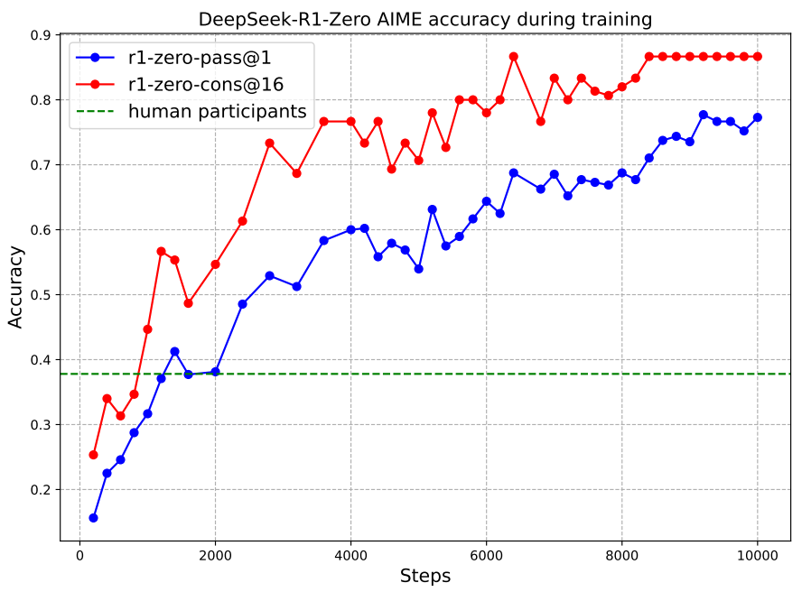

DeepSeek-R1-Zero的自我进化生动地展示了强化学习如何自主增强模型的推理能力。

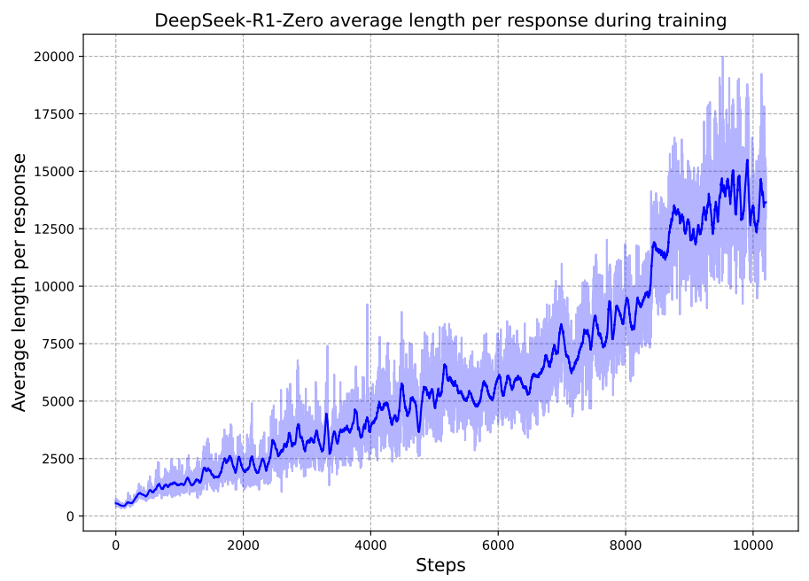

如图1(b)所示，DeepSeek-R1-Zero在训练过程中表现出思考时间的稳定增长，完全由内在适应驱动而非外部修改。利用长思维链，模型逐步完善其推理，生成数百到数千个token来探索和改进其解决问题的策略。

思考时间的增加促进了复杂行为的自主发展。具体来说，DeepSeek-R1-Zero越来越多地展现出高级推理策略，如反思性推理和替代解决方案的系统探索（详见补充材料C.2中的图9(a)），显著提升了在数学和编程等可验证任务上的性能。值得注意的是，在训练期间，DeepSeek-R1-Zero展示了一个"顿悟时刻"（表2），其特征是在反思过程中突然增加使用"wait"这个词（详见补充材料C.2中的图9(b)）。这一刻标志着推理模式的明显变化，并清楚地展示了DeepSeek-R1-Zero的自我进化过程。

DeepSeek-R1-Zero的自我进化强调了强化学习的力量和美感：我们不是明确地教模型如何解决问题，而只是为其提供正确的激励，它就自主地开发出高级的问题解决策略。这提醒我们强化学习在释放大语言模型更高能力方面的潜力，为未来更自主和适应性强的模型铺平了道路。

Listing 1 | 生成人类可读解答的提示词。

```
## Question
{question}
## Thought process
{thought_process}
--- 
Based on the above thought process, provide a clear, easy-to-follow, and well-formatted solution to the question. Use the same language as the question.
The solution must strictly follow these requirements:
- Stay faithful and consistent with the given thought process. Do not add new reasoning steps or conclusions not shown in the original.
- Show key steps leading to final answer(s) in clear, well-formatted LaTeX.
- Use \boxed{} for final answer(s).
- Be clean and concise. Avoid colloquial language. Do not use phrases like "thought process" in the solution.
Your response should start with the solution right away, and do not include anything else. Your task is solely to write the solution based on the provided thought process. Do not try to solve the question yourself.
```

具体而言，我们首先收集了数千个高质量、多样化的推理提示词。对于每个提示词，我们使用较高温度（temperature为1.0）通过DeepSeek-R1-Zero生成多个推理轨迹。接下来，我们对这些生成结果进行筛选，仅保留最终答案正确且格式可读的数据。对于数学输出，我们使用sympy（https://www.sympy.org/）进行解析和表达式比较；对于格式检查，我们应用重复检测和语言混合过滤等规则。最后，我们提示DeepSeek-V3对推理过程和摘要进行优化，以确保格式规范和人类友好的表达。特别地，为了解决语言混合问题，我们指示DeepSeek-V3将"思考过程翻译成与问题相同的语言"。由于DeepSeek-R1-Zero的摘要仅提供最终答案，我们使用Listing 1中的摘要提示词来生成简洁、人类可读的解答，包含推理步骤和最终结果。

对于代码数据，我们收集了大量竞赛编程问题。具体而言，我们从多个在线评测平台编译了广泛的竞赛编程问题集，包括Codeforces的5151道问题和AtCoder的2504道问题。由于这些平台的原始测试用例并不公开，我们开发了一种为每个问题创建可靠测试用例的方法。

我们的方法涉及使用DeepSeek-V2.5生成候选测试用例，随后进行严格的验证过程。具体而言，我们提示DeepSeek-V2.5编写针对每个问题需求生成测试用例的Python程序，如Listing 2所示。

在获得大量候选测试用例后，我们实现了两阶段筛选程序。首先，我们使用正确提交来消除产生错误输出的无效测试用例。然后，我们策略性地选择能够成功识别错误提交缺陷的测试用例子集。这个过程确保了我们的最终测试用例能够正确区分每个问题的正确解决方案和错误解决方案。

# B.3.3. 800K监督数据

推理数据 我们通过从第一阶段强化学习训练的检查点进行拒绝采样，策划大量推理提示词并生成推理轨迹。在前一阶段，我们仅包含可以使用基于规则的奖励进行评估的数据。然而，在这个阶段，我们通过纳入额外数据来扩展数据集，其中部分数据使用生成式奖励模型，将真实答案和模型预测输入DeepSeek-V3进行判断，部分提示词示例如Listing 4所示。此外，由于模型输出有时混乱且难以阅读，我们过滤掉了语言混合的思维链、长段落和代码块。对于每个提示词，我们采样多个回复并仅保留正确的回复。总共，我们收集了约60万条与推理相关的训练样本。

非推理数据 对于非推理数据，如写作、事实问答、自我认知和翻译，我们采用DeepSeek-V3流程并重用DeepSeek-V3的SFT数据集的部分内容。我们还纳入了专注于软件工程的数据，包括程序修复和前端Web开发，以增强模型解决现实世界问题的能力。对于某些非推理任务，我们通过提示调用DeepSeek-V3在回答问题之前生成潜在的思维链。然而，对于简单查询，如"hello"，我们不提供CoT回复。最终，我们收集了约20万条与推理无关的训练样本。

在设计思维过程风格时，我们要求模型遵循关键原则：首先，保持每个段落简洁且易于消化。短段落使观点更清晰、更易于理解。其次，采用自然且引人入胜的对话语气。我们避免使用技术性格式（如markdown）以保持流畅的阅读体验。第三，也是最重要的，思维过程首先从理解完整的用户背景开始。这意味着分析我们的用户是谁，他们正在处理什么情况，以及他们真正需要什么——包括可能隐藏在最初请求表面下的那些未明确表达的需求。

在从模型中引出这些思维过程后，人类标注员仔细验证输出的准确性。我们的发现表明，这些人工推理痕迹增强了模型在解释用户查询方面的准确性。具体而言，它们有效地突出了格式约束、澄清了用户意图并阐明了输出的必要结构。这种方法论方法促进了模型与用户之间更准确、更灵敏的交互。

# B.4. 超参数

# B.4.1. DeepSeek-R1-Zero-Qwen-32B的超参数

为了训练DeepSeek-R1-Zero-Qwen-32B，我们将学习率设置为2e-6，KL系数设置为0.001，采样温度设置为1进行生成。对于每个问题，我们采样16个输出，最大长度为32,768。每个训练步由32个独特问题组成，每步训练批量大小为512。每400步，我们用最新策略模型替换参考模型。为了加速训练，每次生成8,192个输出，随机分成16个小批量，只训练一个内部轮次。

# B.4.2. SFT的超参数

对于代码启动SFT和第二阶段SFT，我们使用B.3节中描述的策划数据集对DeepSeek-V3-Base进行2-3个epoch的微调。我们采用余弦衰减学习率调度器，从 $5 \times 10^{-5}$ 逐渐降低到 $5 \times 10^{-6}$。最大上下文长度设置为32,768个token，批量大小为128。

# B.4.3. 蒸馏的超参数

对于蒸馏，我们使用B.3.3节中描述的800k数据对相应基础模型进行2-3个epoch的微调。基础模型和初始学习率如表6所示。我们采用余弦衰减学习率调度器，将学习率逐渐降低到其初始值的十分之一。最大上下文长度为32,768个token，批量大小为64。

# B.4.4. 训练成本

关于我们对DeepSeek-R1的研究，我们使用A100 GPU为较小模型（30B参数）的实验做准备。这个较小模型的结果令人鼓舞，使我们能够自信地扩展到660B的R1-Zero和R1。对于DeepSeek-R1-Zero的训练，我们使用了64*8 H800 GPU，整个过程约需198小时。此外，在DeepSeek-R1的训练阶段，我们使用了同样的64*8 H800 GPU，约4天完成整个过程，约80小时。为了创建SFT数据集，我们使用了5K GPU小时。详细信息如表7所示。

# B.5. 奖励黑客攻击

在大语言模型训练中，奖励黑客攻击指的是模型利用奖励函数中的缺陷或偏差，从而在不真正符合人类意图的情况下获得高奖励分数的现象。在我们的工作中，当使用有帮助奖励模型时，我们观察到了这种奖励黑客行为。具体而言，如果奖励模型包含系统性偏差或不准确性，大语言模型可能学会生成被模型高度评分但偏离真实人类偏好的回复。这种不对齐可能在需要复杂推理的任务上表现为性能下降，如图6所示。

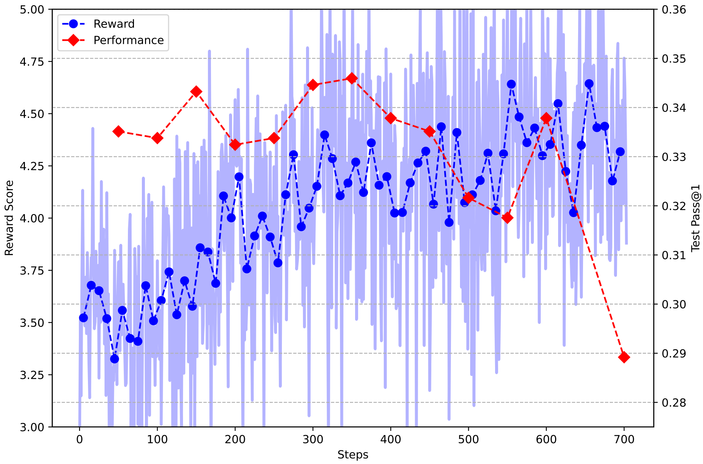

# B.6. 语言一致性奖励的消融实验

为了研究语言一致性（LC）奖励的影响，我们在DeepSeek-R1-Distill-Qwen-7B上进行了消融实验。该模型使用与DeepSeek-R1相同的冷启动数据，在强化学习过程中也表现出语言混合。结果如图7所示。可以看出，没有LC奖励，语言一致性随着训练步数的增加而逐渐恶化。然而，当应用LC奖励时，在整个训练过程中保持稳定的语言一致性。对于基准性能，模型在数学基准上保持相当的性能，而在编程基准上观察到轻微下降。虽然这种对齐导致模型性能轻微下降，但该奖励符合人类偏好，使输出更易读。

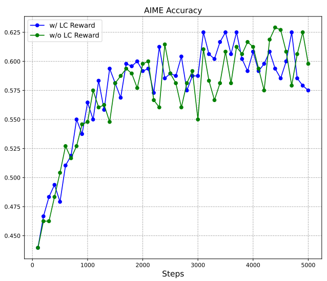

# 3. DeepSeek-R1

尽管DeepSeek-R1-Zero展示了出色的推理能力，但它面临几个问题。DeepSeek-R1-Zero难以应对可读性差和语言混合等挑战，因为DeepSeek-V3-Base在多种语言上训练，特别是英语和中文。为了解决这些问题，我们开发了DeepSeek-R1，其流程如图2所示。

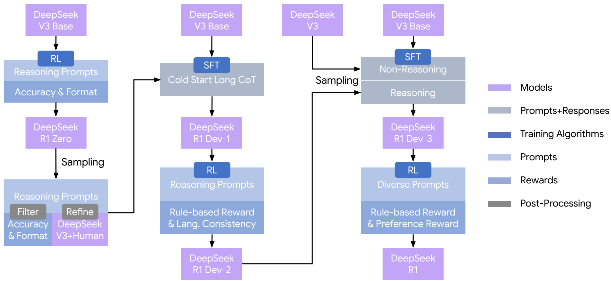

在初始阶段，我们收集了数千条展现对话式、人类对齐思维过程的冷启动数据。然后应用强化学习训练，通过对话思维过程和语言一致性来提升模型性能。随后，我们再次应用拒绝采样和SFT。这一阶段将推理和非推理数据都纳入SFT过程，使模型不仅在推理任务上表现出色，而且展示出先进的写作能力。为了进一步使模型与人类偏好保持一致，我们实施了第二个强化学习阶段，旨在增强模型的帮助性和无害性，同时提升其推理能力。

本节的其余部分详细介绍了该流程的关键组成部分：第3.1节介绍了我们强化学习阶段使用的奖励模型，第3.2节阐述了具体的训练方法和实现细节。本阶段使用的数据详见补充材料B.3。

# 3.1. 基于模型的奖励

对于通用数据，我们诉诸奖励模型来捕捉复杂和微妙场景中的人类偏好。我们基于DeepSeek-V3流程构建，并采用相似的偏好对和训练提示分布。对于有帮助性，我们专门关注最终摘要，确保评估强调回复对用户的实用性和相关性，同时最小化对底层推理过程的干扰。对于无害性，我们评估模型的整个回复，包括推理过程和摘要，以识别和缓解生成过程中可能出现的任何潜在风险、偏见或有害内容。

有帮助奖励模型 关于有帮助奖励模型训练，我们首先使用arena-hard提示格式（详见补充材料B.2）提示DeepSeek-V3生成偏好对，其中每对由一个用户查询和两个候选回复组成。对于每个偏好对，我们查询DeepSeek-V3四次，随机分配回复为回复A或回复B以缓解位置偏差。最终偏好分数通过对四次独立判断取平均来确定，仅保留分数差异（Δ）超过1的对以确保有意义的区分。此外，为了最小化长度相关的偏见，我们确保整个数据集的被选中和被拒绝回复具有相当的长度。总共，我们策划了66,000对数据用于训练奖励模型。该数据集中使用的提示都是非推理问题，来源于公开可用的开源数据集或明确同意为模型改进目的分享数据的用户。我们的奖励模型架构与DeepSeek-R1一致，添加了一个用于预测标量偏好分数的奖励头。

$$
R e w a r d _ {h e l p f u l} = R M _ {h e l p f u l} \left(R e s p o n s e _ {A}, R e s p o n s e _ {B}\right) \tag {5}
$$

有帮助奖励模型使用批量大小256、学习率6e-6进行训练，在训练数据集上仅训练一个epoch。训练期间的最大序列长度设置为8192个token，而在奖励模型推理期间没有明确限制。

安全奖励模型 为了评估和提高模型安全性，我们策划了一个包含106,000个提示的数据集，其中模型生成的回复根据预定义的安全指南标注为"安全"或"不安全"。与有帮助性奖励模型使用的成对损失不同，安全奖励模型使用逐点方法训练，以区分安全和不安全的回复。训练超参数与有帮助奖励模型相同。

$$
R e w a r d _ {s a f e t y} = R M _ {s a f e t y} (R e s p o n s e) \tag {6}
$$

对于通用查询，每个实例被分类为属于安全数据集或有帮助性数据集。分配给每个查询的通用奖励 $ Reward_{General} $ 对应于相关数据集中定义的相应奖励。

# 3.2. 训练细节

# 3.2.1. 第一阶段强化学习的训练细节

在强化学习的第一阶段，我们将学习率设置为3e-6，KL系数设置为0.001，GRPO裁剪比率ε设置为10，采样温度设置为1进行生成。对于每个问题，我们采样16个输出，最大长度为32,768。每个训练步由32个独特问题组成，导致每步训练批量大小为512。每400步，我们用最新策略模型替换参考模型。为了加速训练，每次生成8,192个输出，随机分成16个小批量，仅训练一个内部轮次。然而，为了缓解语言混合问题，我们在强化学习训练期间引入了语言一致性奖励，计算为目标语言词在CoT中的比例。

$$
R e w a r d _ {l a n g u a g e} = \frac {\text {N u m} (\text {W o r d s} _ {\text {t a r g e t}})}{\text {N u m} (\text {W o r d s})} \tag {7}
$$

尽管补充材料B.6中的消融实验表明这种对齐导致模型性能略有下降，但该奖励符合人类偏好，使其更易读。我们通过直接将其添加到最终奖励来将语言一致性奖励应用于推理和非推理数据。

请注意，裁剪比率在训练中起着至关重要的作用。较低的值会导致大量token的梯度被截断，从而降低模型性能，而较高的值可能导致训练不稳定。

# 3.2.2. 第二阶段强化学习的训练细节

具体来说，我们使用奖励信号和多样化提示分布的组合来训练模型。对于推理数据，我们遵循DeepSeek-R1-Zero中概述的方法，使用基于规则的奖励来指导数学、编程和逻辑推理领域的学习。在训练过程中，我们观察到CoT经常出现语言混合，特别是当强化学习提示涉及多种语言时。对于通用数据，我们利用奖励模型来指导训练。最终，奖励信号与多样化数据分布的整合使我们能够开发出一个不仅在推理方面表现出色，而且优先考虑帮助性和无害性的模型。给定一批数据，奖励可以表述为

$$
R e w a r d = R e w a r d _ {\text {r e a s o n i n g}} + R e w a r d _ {\text {g e n e r a l}} + R e w a r d _ {\text {l a n g u a g e}} \tag {8}
$$

$$
\text {w h e r e , R e w a r d} _ {\text {r e a s o n i n g}} = \text {R e w a r d} _ {\text {r u l e}} \tag {9}
$$

$$
R e w a r d _ {\text {g e n e r a l}} = R e w a r d _ {\text {r e w a r d} \_ \text {m o d e l}} + R e w a r d _ {\text {f o r m a t}} \tag {10}
$$

第二阶段强化学习保留第一阶段的大部分参数，主要区别在于温度降低到0.7，因为我们发现该阶段较高的温度会导致不连贯的生成。该阶段共包含1,700步训练，其中通用指令数据和基于偏好的奖励仅在最后400步中加入。我们发现使用模型基于偏好奖励信号进行更多训练步骤可能导致奖励黑客攻击，详见补充材料B.5。训练成本总计见补充材料B.4.4。

# 4. 实验

我们在MMLU（Hendrycks等人，2021）、MMLU-Redux（Gema等人，2025）、MMLU-Pro（Wang等人，2024）、C-Eval（Huang等人，2023）和CMMLU（Li等人，2024）、IFEval（Zhou等人，2023b）、FRAMES（Krishna等人，2024）、GPQA Diamond（Rein等人，2023）、SimpleQA（OpenAI，2024a）、C-SimpleQA（He等人，2024）、SWE-Bench Verified（OpenAI，2024b）、Aider（Gauthier，2025）、LiveCodeBench（Jain等人，2024）（2024-08 - 2025-01）、Codeforces（Mirzayanov，2025）、中国国家高中数学奥林匹克（CNMO 2024）（CMS，2024）和美国数学邀请赛2024（AIME 2024）（MAA，2024）上评估我们的模型。这些基准测试的详细信息见补充材料D。

表3总结了DeepSeek-R1在多个开发阶段的性能，如流程图2所述。DeepSeek-R1-Zero与DeepSeek-R1 Dev1之间的比较表明，在指令遵循方面有显著改进，IFEval和ArenaHard基准测试的更高分数证明了这一点。然而，由于冷启动数据集规模有限，Dev1在推理性能上相比DeepSeek-R1-Zero出现部分退化，在AIME基准测试上最为明显。相比之下，DeepSeek-R1 Dev2在需要高级推理技能的基准测试上表现出显著性能提升，包括专注于代码生成、数学问题解决和STEM相关任务的基准测试。针对通用任务的基准测试（如AlpacaEval 2.0）显示边际改善。这些结果表明，推理导向的强化学习显著增强了推理能力，同时对用户偏好导向的基准测试影响有限。

DeepSeek-R1 Dev3将推理和非推理数据都整合到SFT流程中，从而提高了模型在推理和通用语言生成任务方面的能力。与Dev2相比，DeepSeek-R1 Dev3在AlpacaEval 2.0和Aider-Polyglot上实现了显著性能提升，这归因于大规模非推理语料库和代码工程数据集的加入。最后，使用混合推理导向和通用数据对DeepSeek-R1 Dev3进行综合强化学习训练产生了最终版DeepSeek-R1。代码和数学基准测试出现边际改善，因为大量推理特定的强化学习已在先前阶段完成。最终DeepSeek-R1的主要进步在于通用指令遵循和用户偏好基准测试，AlpacaEval 2.0提高了25%，ArenaHard提高了17%。

此外，我们在补充材料D.2中与其他模型进行了比较。模型安全性评估见补充材料D.3。补充材料E提供了全面分析，包括与DeepSeek-V3的比较、新鲜测试集上的性能评估、按类别划分的数学能力分解以及测试时 scaling 行为研究。补充材料F表明强大的推理能力可以迁移到较小的模型。

# 5. 伦理与安全声明

随着DeepSeek-R1推理能力的提升，我们深刻认识到潜在的伦理风险。例如，R1可能受到越狱攻击，导致生成危险内容（如爆炸物制造计划），而增强的推理能力使模型能够提供更具操作可行性和可执行性的计划。此外，公开模型也容易受到进一步微调的影响，这可能损害固有的安全保护。

在补充材料D.3中，我们从多个角度提供了全面的安全报告，包括开源和内部安全评估基准的性能、多语言安全水平以及针对越狱攻击的安全水平。这些全面的安全分析得出结论：与其他最先进模型相比，DeepSeek-R1模型的固有安全水平总体处于中等水平（与GPT-4o（2024-05-13）相当）。此外，结合风险控制系统，模型的安全水平提升到优越标准。

# 6. 结论、局限性与未来工作

我们提出了DeepSeek-R1-Zero和DeepSeek-R1，它们依赖大规模强化学习来激励模型推理行为。我们的结果表明，预训练检查点本身就具有处理复杂推理任务的巨大潜力。我们相信，释放这种潜力的关键不在于大规模人类标注，而在于提供困难的推理问题、可靠的验证器和强化学习所需的足够计算资源。复杂的推理行为，如自我验证和反思，似乎在强化学习过程中自然涌现。

尽管DeepSeek-R1在推理基准测试上取得了前沿成果，但它仍面临几个能力局限性，如下所述：

结构化输出和工具使用：目前，DeepSeek-R1的结构化输出能力相比现有模型仍不理想。此外，DeepSeek-R1无法利用工具（如搜索引擎和计算器）来提高输出性能。然而，由于为结构化输出和工具使用构建强化学习环境并不困难，我们相信这个问题将在下一个版本中得到解决。

Token效率：与传统的测试时计算scaling方法（如多数投票或蒙特卡洛树搜索（MCTS））不同，DeepSeek-R1根据问题的复杂性动态分配推理过程中的计算资源。具体来说，它用更少的token解决简单任务，而为复杂任务生成更多token。然而，在token效率方面仍有进一步优化的空间，因为观察到对简单问题的回复中存在过度推理（表现为过度思考）的情况。

语言混合：DeepSeek-R1目前针对中文和英文进行优化，这可能导致处理其他语言查询时出现语言混合问题。例如，即使查询使用的是英语或中文以外的语言，DeepSeek-R1也可能使用英语进行推理和回复。我们计划在未来的更新中解决这一局限性。该局限性可能与基础检查点DeepSeek-V3-Base有关，该检查点主要使用中文和英文，以便在推理中两种语言获得更好的结果。

提示工程：在评估DeepSeek-R1时，我们观察到它对提示敏感。少样本提示始终降低其性能。因此，我们建议用户在零样本设置中直接描述问题并指定输出格式以获得最佳结果。

软件工程任务：由于评估时间长，影响强化学习过程的效率，大规模强化学习尚未在软件工程任务中广泛应用。因此，DeepSeek-R1在软件工程基准测试上相比DeepSeek-V3没有表现出巨大改进。未来的版本将通过在软件工程数据上实施拒绝采样或在强化学习过程中纳入异步评估来提高效率，从而解决这一问题。

除了特定的能力局限性外，纯粹的强化学习方法本身也带来了固有挑战：

奖励黑客攻击：纯粹强化学习的成功取决于可靠的奖励信号。在本研究中，我们通过推理领域基于规则的奖励模型（RM）确保奖励可靠性。然而，对于某些任务（如写作），构建这样的可靠奖励模型是困难的。如果奖励信号由模型而非预定义规则分配，它在训练过程中更容易被利用，这意味着策略模型可能找到捷径来黑客奖励模型。因此，对于无法被可靠奖励模型有效评估的复杂任务，scaling纯粹的强化学习方法仍然是一个开放挑战。

在这项工作中，对于无法获得可靠信号的任务，DeepSeek-R1使用人类标注创建监督数据，并且仅进行数百步的强化学习。我们希望未来能够获得稳健的奖励模型来解决此类问题。

随着DeepSeek-R1等纯粹强化学习方法的出现，未来充满了解决任何可以被有效评估的任务的巨大潜力，无论对人类来说多么复杂。配备这种先进强化学习技术的机器有望通过试错的迭代优化在这些领域超越人类能力。然而，对于构建可靠奖励模型本质上困难的任务，挑战仍然存在。在这种情况下，缺乏稳健的反馈机制可能会阻碍进展，这表明未来研究应专注于开发创新方法来定义和完善这些复杂的、难以验证的问题的奖励结构。

此外，在推理过程中利用工具也具有巨大前景。无论是使用编译器或搜索引擎等工具来检索或计算必要信息，还是使用外部工具（如生物或化学试剂）来验证现实世界中的最终结果，工具增强推理的整合可以显著增强机器驱动解决方案的范围和准确性。

# G. 讨论

## G.1 关键发现

我们强调我们的关键发现，这些发现可能有助于社区更好地复现我们的工作。

基础检查点的重要性：在我们开发的初期阶段，我们使用较小规模的模型进行了实验，具体是7B dense模型和16B Mixture-of-Experts（MoE）模型，作为强化学习训练的基础架构。然而，这些配置在AIME基准测试（我们用作主要验证集）上进行评估时，始终无法产生有意义的改进。我们观察到，随着响应长度增加，这些较小的模型表现出重复的倾向，无法有效地利用长链思维（CoT）来提高推理准确性。

为了解决这些局限性，我们转向更大规模的模型，包括32B dense模型（Qwen, 2024b）、230B MoE模型（DeepSeek-AI, 2024a）和671B MoE模型（DeepSeek-AI, 2024b）。凭借这些更有能力的架构，我们终于观察到了归因于纯强化学习训练的实质性性能提升。这些发现表明，从基础模型进行强化学习训练的有效性高度依赖于底层模型容量。因此，我们建议该领域的未来研究在旨在验证从零开始强化学习效果时，优先使用足够大且富有表达力的模型。

验证器的重要性：DeepSeek-R1-Zero的有效性高度依赖于训练期间使用的奖励信号的可靠性和保真度。迄今为止，我们的调查表明，两种方法——基于规则的奖励模型（RM）和使用LLM根据预定义ground-truth评估答案正确性——作为缓解奖励黑客攻击问题的稳健机制是有效的。基于LLM的评估框架在具有明确、简洁答案的任务（如单句或短语级响应）上表现出特别有效的性能。然而，该方法在更复杂的任务（包括开放式生成和长篇写作）上表现出有限的泛化能力，因为在这些任务中正确性的概念本质上更加主观和微妙。

迭代流程：我们提出了一个包含SFT和RL阶段的多阶段训练流程。强化学习组件使模型能够探索和发现任务能力的最佳推理轨迹，而这些能力无法仅通过人类标注的推理轨迹完全实现。特别是，如果没有强化学习阶段，复杂思维链提示（CoT）所需的长时间推理模式将 largely remain unexplored（将在很大程度上保持未被探索）。相反，SFT阶段在难以定义或建模可靠奖励信号的任务中起着关键作用，例如开放式问答和创造性写作。因此，RL和SFT都是我们训练流程不可或缺的部分。完全依赖强化学习可能导致奖励黑客攻击和 ill-posed tasks（病态任务）中的次优行为，而仅依赖SFT可能会阻止模型通过探索优化其推理能力。

## G.2 不成功的尝试

在开发DeepSeek-R1的早期阶段，我们也遇到了失败和挫折。我们在这里分享我们的失败经验以提供洞察，但这并不意味着这些方法无法开发有效的推理模型。

过程奖励模型（PRM） PRM是一种合理的方法，可以引导模型走向更好的推理任务解决方法（Lightman等人，2024；Uesato等人，2022；Wang等人，2023a）。然而，在实践中，PRM有三个主要限制，可能阻碍其最终成功。首先，在通用推理中明确定义细粒度步骤是困难的。其次，判断当前中间步骤是否正确是一项具有挑战性的任务。使用模型进行自动标注可能无法产生令人满意的结果，而人工标注不利于扩展。第三，一旦引入基于模型的PRM，它不可避免地会导致奖励黑客攻击（Gao等人，2022），而重新训练奖励模型需要额外的训练资源，并使整个训练流程复杂化。总之，虽然PRM展示了良好的能力来重新排序模型生成的top-N响应或协助引导搜索（Snell等人，2024），但与我们实验中大规模强化学习过程中引入的额外计算开销相比，其优势是有限的。

蒙特卡洛树搜索（MCTS） 受AlphaGo（Silver等人，2017b）和AlphaZero（Silver等人，2017a）的启发，我们探索了使用蒙特卡洛树搜索（MCTS）来增强测试时计算可扩展性。这种方法涉及将答案分解为更小的部分，以允许模型系统地探索解空间。为了促进这一点，我们提示模型生成多个标签，这些标签对应于搜索所需的特定推理步骤。对于训练，我们首先使用收集的提示词通过由预训练价值模型引导的MCTS来寻找答案。随后，我们使用产生的问答对来训练actor模型和价值模型，迭代优化这个过程。

然而，这种方法在扩大训练规模时遇到了几个挑战。首先，与围棋不同，围棋的搜索空间相对明确定义，而token生成呈现出指数级更大的搜索空间。为了解决这个问题，我们为每个节点设置了最大扩展限制，但这可能导致模型陷入局部最优。其次，价值模型直接影响生成质量，因为它指导搜索的每一步。训练细粒度价值模型本质上是困难的，这使得模型难以迭代改进。虽然AlphaGo的核心成功依赖于训练价值模型来逐步提高其性能，但由于token生成的复杂性，这一原则在我们的设置中难以复制。

总之，虽然MCTS可以在与预训练价值模型配对时提高推理性能，但通过自搜索迭代提升模型性能仍然是一个重大挑战。

## H. 相关工作

### H.1 思维链推理

思维链（CoT）推理（Wei等人，2022b）革新了LLM处理复杂推理任务的方式，它 prompt them to generate intermediate reasoning steps before producing a final answer（在产生最终答案之前提示它们生成中间推理步骤）。这种方法在涉及算术、常识和符号推理的基准测试上显著提高了性能。后续工作探索了其范围：Suzgun等人（2023）证明了CoT的有效性随模型规模而扩展，而Kojima等人（2022）通过简单指示模型"逐步思考"将其扩展到零样本设置。

在CoT框架的基础上，许多"提示工程"技术被提出来增强模型性能。Wang等人（2023b）引入了自洽性，一种从多个推理路径聚合答案以提高鲁棒性和准确性的方法。Zhou等人（2023a）开发了从最少到最多的提示，将复杂问题分解为顺序的子问题，逐步解决。Yao等人（2023a）提出了思维树，使模型能够同时探索多个推理分支，并通过 lookahead or backtracking（前瞻或回溯）进行深思熟虑的决策。总的来说，这些方法利用人类先验知识和更结构化的推理框架来增强LLM的推理能力。

### H.2 推理时计算扩展

由于无监督预训练扩展可能受到可用人类数据量的约束（Kaplan等人，2020；Muennighoff等人，2023），推理时计算扩展变得更加关键（Snell等人，2025）。广义上，我们将通过增加推理计算来提高模型性能的方法定义为推理时计算扩展的各种形式。

一种直接的方法是用计算换性能，生成多个不同的推理链并选择最佳答案。最佳答案可以使用单独的重新排序器（Brown等人，2024；Cobbe等人，2021）、基于过程的奖励模型（Lightman等人，2024；Uesato等人，2022）或简单地选择最常见的答案（Wang等人，2023b）来识别。搜索方法，如蒙特卡洛树搜索和束搜索，也更有效地引导解空间的探索（Feng等人，2024；Hao等人，2023；Trinh等人，2024；Xin等人，2024）。除了并行生成，自修正技术提示或训练模型迭代地批评和完善其输出（Kumar等人，2024；Madaan等人，2023；Welleck等人，2023），通常结合外部反馈来增强可靠性（Gou等人，2024a；Yao等人，2023b）。此外，一些方法通过在测试期间集成工具使用来提高性能，这对于知识密集型（Nakano等人，2021）和计算密集型任务（Chen等人，2025；Gou等人，2024b；Schick等人，2023）特别有效。测试时训练（TTT）在推理期间进一步更新模型以提高性能（Akyürek等人，2024；Sun等人，2020）。还有各种其他推理时扩展方法，这些方法——either implicitly（Geiping等人，2025）or explicitly（Zelikman等人，2024）——为每个token分配更多计算。

相比之下，我们的工作表明，LLM可以通过额外的强化学习计算和增加的测试时计算（即更多token）实现可扩展的改进。我们将测试时扩展的好处整合到一个更广泛的框架中，使用强化学习来激励增强的上下文搜索能力。

### H.3 用于推理增强的强化学习

强化学习在使LLM与人类偏好对齐方面发挥着关键作用（Bai等人，2022；Ouyang等人，2022）。尽管其重要性，很少有研究专注于使用强化学习来增强推理能力。传统的强化学习流程从高质量人类演示的SFT开始，这提供了强大的初始化并防止了模式崩溃。随后，奖励模型在人类偏好上进行训练，语言模型随后使用PPO（Schulman等人，2017）或DPO（Rafailov等人，2023）等方法进行优化。虽然这种方法对对齐效果很好，但存在将模型限制在模仿人类推理模式的风险，这可能阻碍发现新的问题解决策略。

STaR等方法通过在导致正确最终答案的模型自生成思维链上进行微调来迭代提升性能（Singh等人，2024；Yuan等人，2023；Zelikman等人，2022）。最近的研究也调查了基于过程奖励的使用，强调最终答案的正确性和推理过程的 soundness（Soundness）（Lightman等人，2024；Shao等人，2024；Wang等人，2023a）。与这些方法不同，我们的工作将基于结果的强化学习直接应用于基础语言模型，无需初始SFT阶段。这一设计选择鼓励了创新和无约束推理策略的出现，使模型能够开发出超越仅仅模仿人类示例的多样化解决方案。我们的方法也启发了后续研究的进一步探索（Face，2025；Liu等人，2025；Pan等人，2025）。

## I. 开源权重、代码与数据

为促进开源社区和产业生态系统的发展，我们在HuggingFace上公开了DeepSeek-R1和DeepSeek-R1-Zero的模型权重。此外，我们还发布了DeepSeek-R1-Distill-Qwen-1.5B、DeepSeek-R1-Distill-Qwen-7B、DeepSeek-R1-Distill-Qwen-14B、DeepSeek-R1-Distill-Qwen-32B、DeepSeek-R1-Distill-Llama-8B、DeepSeek-R1-Distill-Llama-70B。

此外，我们已在GitHub上发布了基础模型推理代码（https://github.com/deepseek-ai/DeepSeek-V3）并提供了详细的使用指南（https://github.com/deepseek-ai/DeepSeek-R1）。

以下是运行推理代码与DeepSeek-R1交互的示例：

```
# Download the model weights from Hugging Face
huggingface-cli download deepseek-ai/DeepSeek-R1 --local-dir /path/to/DeepSeek-R1
# Clone DeepSeek-V3 GitHub repository
git clone https://github.com/deepseek-ai/DeepSeek-V3.git
# Install necessary dependencies
cd DeepSeek-R1/inference
pip install -r requirements.txt
# Convert Hugging Face model weights to a specific format (for running the model on 16 H800 GPUs)
python convert.py --hf-ckpt-path /path/to/DeepSeek-R1 --save-path /path/to/DeepSeek-R1-Demo --n-experts 256 --model-parallel 16
# Run the model and interact with it
torchrun --nnodes 2 --nproc-per-node 8 --node-rank $RANK --master-addr $MASTER_ADDR generate.py --ckpt-path /path/to/DeepSeek-R1-Demo --config configs/config_671B.json --interactive --temperature 0.7 --max-new-tokens 8192
```

我们还在xxx向公众发布了SFT和RL数据。在审查过程中，我们作为附件上传了数据。

## J. 评估提示与设置

表18 | MMLU评估模型在57个任务上的事实和概念理解，涵盖STEM（科学、技术、工程、数学）、人文、社会科学和专业领域（如法律、医学）。该基准测试通常用于评估模型在广泛的主题和任务范围内执行通用知识推理和多任务熟练程度的能力。以下是MMLU的一个示例。

# 提示

Answer the following multiple choice question. The last line of your response should be of the following format: 'Answer: $LETTER' (without quotes) where LETTER is one of ABCD. Think step by step before answering.

Which tool technology is associated with Neandertals?

A. Aurignacian
B. Acheulean
C. Mousterian
D. both b and c

# 评估

Parse the last line in response to judge if the choice equals to ground truth.

# 附录

# A. 背景

# A.1. DeepSeek-V3

DeepSeek V3 (DeepSeek-AI, 2024b)是由DeepSeek开发的先进开源大语言模型。DeepSeek V3于2024年12月发布，代表着人工智能创新领域的重大飞跃，旨在与OpenAI的GPT-4和Meta的Llama 3.1等领先模型竞争，同时保持卓越的成本效率和性能。DeepSeek V3基于混合专家（MoE）架构构建，拥有6710亿总参数，每个token激活370亿参数，在效率和能力之间实现优化。它在14.8万亿高质量、多样化token的扩展数据集上进行预训练，随后进行监督微调和强化学习，以提升其在各领域的能力。该模型采用创新功能，如用于高效推理的多头潜在注意力（MLA）(DeepSeek-AI, 2024a)、无辅助损失负载均衡策略，以及多token预测（MTP）(Gloeckle et al., 2024)，以提升在数学和编程等任务上的性能。

对于DeepSeek-V3-Base的训练数据，我们仅使用纯网页和电子书，不包含任何合成数据。然而，我们观察到一些网页包含大量由OpenAI模型生成的答案，这可能导致基础模型间接地从其他强大模型获取知识。然而，在预训练冷却阶段，我们没有故意包含由OpenAI生成的合成数据；该阶段使用的所有数据都是自然发生的，通过网页爬取收集。预训练数据集包含大量数学和代码相关内容，表明DeepSeek-V3-Base已经接触了大量的推理轨迹数据。这种广泛暴露使模型具备生成可信解决方案候选的能力，强化学习可以有效地从中识别和优化高质量输出。我们在附录D.1中进行了预训练中的数据污染检测。DeepSeek-V3基础模型的训练数据主要是中文和英文，这可能是DeepSeek-R1-Zero在缺乏语言一致性奖励时出现语言混合的原因。

在本文中，我们使用DeepSeek-V3-Base表示基础模型，DeepSeek-V3表示指令模型。值得注意的是，DeepSeek-R1和DeepSeek-R1-Zero是在DeepSeek-V3-Base的基础上训练的，其中DeepSeek-R1利用DeepSeek-V3 SFT数据中的非推理数据。DeepSeek-R1-Dev1、DeepSeek-R1-Dev2、DeepSeek-R1-Dev3是DeepSeek-R1的中间检查点。

# A.2. 传统后训练范式

后训练已成为优化预训练大语言模型以满足特定性能目标和符合人类期望的关键步骤。广泛采用的两阶段后训练框架是SFT然后进行RL（Ouyang et al., 2022）。

监督微调通过在针对特定任务策划的输入-输出对数据集上训练预训练大语言模型来对其进行细化。该过程采用监督学习目标，通常最小化模型预测与标注真实标签之间的交叉熵损失（Brown et al., 2020）。例如，在对话应用中，SFT可能利用对话数据集，其中明确提供期望响应，使模型能够将其输出适应预定义标准（Radford et al., 2019）。SFT提供了几个引人注目的好处。首先，它通过利用高质量样本实现精确的任务对齐，允许模型在客户服务或技术文档等领域表现出色（Radford et al., 2019）。其次，它对预训练权重的依赖确保了计算效率，与从头训练相比需要更少的资源。最后，显式输入-输出映射的使用增强了可解释性，因为模型的学习过程直接与可观察数据相关联，最大限度地减少了异常行为的风险（Ouyang et al., 2022）。尽管有其优势，SFT的性能取决于训练数据集的质量和多样性；狭窄或偏斜的数据可能损害模型泛化到新上下文的能力（Brown et al., 2020）。此外，SFT的静态特性——优化固定输出——可能无法捕捉不断演变的人类偏好或细微目标。策划高质量数据集的劳动密集型过程进一步复杂化其可扩展性，因为数据中的错误或不一致可能传播到模型行为中（Ouyang et al., 2022）。

在SFT之后，强化学习通过针对奖励信号优化模型的输出进一步细化大语言模型。在这一阶段，模型与环境交互——通常是基于人类反馈训练的奖励模型——并调整其行为以最大化累积奖励。该方法的一个突出实例是从人类反馈中进行强化学习（RLHF），其中奖励函数编码人类偏好（Christiano et al., 2017）。因此，RL将焦点从静态监督转移到动态优化。值得注意的是，RL减少了对大量标注资源的需求；虽然SFT需要对每个输入-输出对进行完全标注的数据集，但RL可以仅用较小的人类评估集或训练好的奖励模型（甚至是基于规则的奖励模型）来操作，显著降低标注负担。

SFT和RL的顺序应用结合了它们互补的优势。SFT通过在策划样本中奠定模型基础来建立强大的任务特定基线，而RL细化这一基础以符合更广泛的、以人为中心的目標（Ouyang et al., 2022）。例如，SFT可能确保对话系统中的语法准确性，而RL优化参与度和简洁性，正如InstructGPT开发中所示（Ouyang et al., 2022）。这种混合方法已被证明在产生既精确又适应性强的模型方面是有效的。

在本文中，我们证明SFT阶段可能阻碍模型探索和发展有效推理策略的能力。这一限制的出现是因为作为SFT期间目标的人类提供响应并不总是模型学习的最佳选择；它们通常省略关键推理组件，如显式反思和验证步骤。为解决这一问题，DeepSeek-R1-Zero使模型能够独立于人类先验进行推理模式的直接探索。通过这种自我探索发现的推理轨迹随后被蒸馏并用于训练其他模型，从而促进更稳健和可泛化推理能力的获取。

# A.3. GRPO与PPO的比较

群体相对策略优化（GRPO）（Shao et al., 2024）是我们采用来训练DeepSeek-R1-Zero和DeepSeek-R1的强化学习算法。它最初是为了简化和减少近端策略优化（PPO）（Schulman et al., 2017）的训练过程和资源消耗而提出的，PPO是大语言模型RL阶段广泛使用的算法（Ouyang et al., 2022）。关于GRPO和PPO的总体比较，请参见图3。

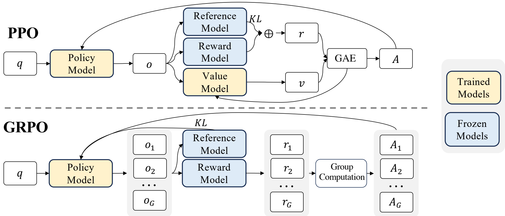

对于每个问题 $q$，GRPO从旧策略 $\pi_{\theta_{old}}$ 中采样一组输出 $\{o_1, o_2, \dots, o_G\}$，然后通过最大化以下目标来优化策略模型 $\pi_{\theta}$：

$$
\mathcal{J}_{GRPO}(\theta) = \mathbb{E}\left[ q \sim P(Q), \{o_i\}_{i=1}^{G} \sim \pi_{\theta_{old}}(O | q) \right]
$$

$$
\frac{1}{G} \sum_{i=1}^{G} \left(\min\left(\frac{\pi_{\theta}(o_i | q)}{\pi_{\theta_{old}}(o_i | q)} A_i, \operatorname{clip}\left(\frac{\pi_{\theta}(o_i | q)}{\pi_{\theta_{old}}(o_i | q)}, 1 - \varepsilon, 1 + \varepsilon\right) A_i\right) - \beta \mathbb{D}_{KL}(\pi_{\theta} \| \pi_{ref})\right), \tag{11}
$$

$$
\mathbb{D}_{KL}\left(\pi_{\theta} \| \pi_{ref}\right) = \frac{\pi_{ref}(o_i | q)}{\pi_{\theta}(o_i | q)} - \log\frac{\pi_{ref}(o_i | q)}{\pi_{\theta}(o_i | q)} - 1, \tag{12}
$$

其中 $\pi_{ref}$ 是参考策略，$\varepsilon$ 和 $\beta$ 是超参数，$A_{i}$ 是优势值，使用对应于每组内输出的奖励集合 $\{r_1,r_2,\ldots ,r_G\}$ 计算：

$$
A_i = \frac{r_i - \operatorname{mean}\left(\left\{r_1, r_2, \cdots, r_G\right\}\right)}{\operatorname{std}\left(\left\{r_1, r_2, \cdots, r_G\right\}\right)}. \tag{13}
$$

相比之下，在PPO中，优势值通常通过应用广义优势估计（GAE）（Schulman et al., 2015）来计算，不仅基于奖励，还基于一个学习的价值模型。由于价值模型通常与策略模型大小相似，它引入了显著的内存和计算开销。此外，价值模型的训练目标是根据从开始到当前位置生成的token来预测从当前位置开始的预期累积奖励。这本质上是困难的，特别是在只有最终结果奖励可用时。当训练长链思维推理模型时，挑战变得更加明显。随着输出长度增加，模型在生成过程中更可能进行反思和修正等行为，这意味着最初生成的内容后来可能被修改或矛盾，这使得基于部分响应预测最终奖励变得更加不可行。

GRPO和PPO之间的另一个关键区别是KL散度（训练策略与参考策略之间的）如何纳入训练过程。在GRPO中，KL散度的无偏估计器（Schulman, 2020）直接作为公式11中的损失添加，而在PPO中，每个token的KL惩罚作为每个token的密集奖励添加（Ouyang et al., 2022）。由于强化学习的优化目标是最大化累积奖励，PPO的方法惩罚累积KL散度，这可能隐式地惩罚响应的长度，从而阻止模型响应长度的增加。此外，由于我们在训练长链思维推理模型的情景中可能训练数千步，训练后的策略可能与初始参考策略显著不同。为了平衡训练策略可以探索的范围和训练的稳定性，我们在实际训练过程中定期将参考策略更新为最新策略。

图4使用DeepSeekCoder-V2-Lite（16B MoE，24亿活跃参数）在MATH任务上比较了PPO和GRPO的性能。与GRPO不同，PPO需要额外的超参数调优——特别是GAE中λ系数——并且对该参数高度敏感。当λ设置为0.95（大多数开源PPO实现中的默认值）时，PPO的性能比GRPO差得多。然而，通过仔细调优（将λ设置为1.0），PPO的性能显著提升，接近GRPO的性能。

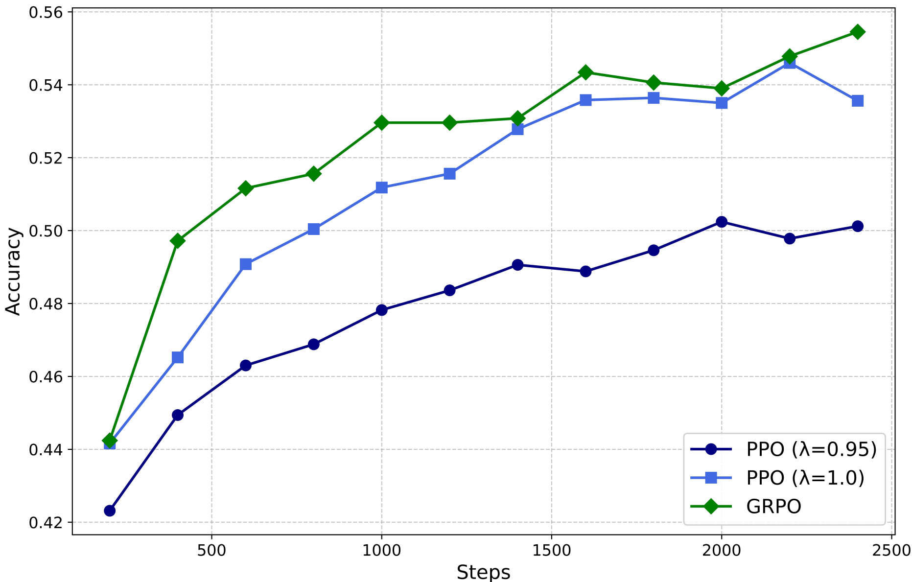

虽然PPO在适当调优时可以取得相当的性能，但它需要额外的计算成本进行超参数优化。此外，考虑到训练额外价值模型相关的内存和计算开销，GRPO提出了一个更实用的替代方案，特别是在资源受限的情况下训练大规模模型时。

# B. 训练细节

# B.1. 强化学习基础设施

在大模型上进行强化学习训练对基础设施有很高的要求。我们的强化学习框架采用解耦和可扩展的结构，以促进不同模型和算法的无缝集成。在这个框架内，我们结合了模块内和模块间的优化技术，以确保训练效率和可扩展性。

具体来说，如图5所示，框架被划分为四个不同的模块，每个模块对应强化学习管道的特定阶段：

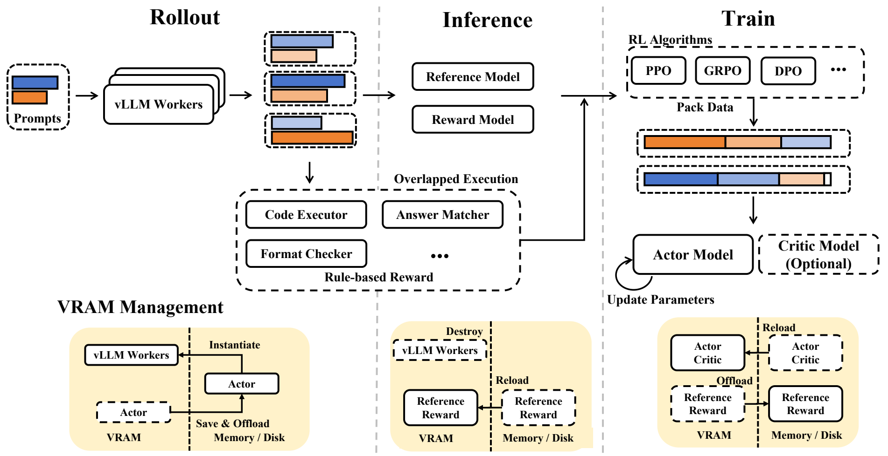

- Rollout模块：提示从训练数据集加载，并统一分发到多个vLLM（Kwon et al., 2023）工作节点，每个节点配备actor模型来采样多个响应。对于DeepSeek-V3 MoE架构，我们在节点间实现专家并行策略以减少内存访问开销，并部署热点专家的冗余副本以平衡不同专家之间的计算负载。多token预测（MTP）组件也用于自推测解码，显著加速了解码速度，并有效减少了最长样本的完成时间。

- 推理模块：该模块加载奖励模型和参考模型，对Rollout阶段生成的样本执行前向传递，从而获得基于模型的奖励和其他基本信息。

- 基于规则的奖励模块：该模块计算模型生成的响应的基于规则的奖励。我们设计了统一接口以适应不同的实现（例如，代码执行器、答案匹配器、格式检查器等）。虽然此模块不需要将模型加载到GPU内存中，但其执行往往耗时较长。为解决这一问题，我们采用异步调度方法，将其执行与Rollout和推理模块重叠，有效地隐藏了相关延迟。

- 训练模块：该模块加载actor模型和批评模型（如需要），以计算损失并更新模型参数。它为各种强化学习算法（例如PPO、GRPO、DPO等）提供灵活支持。为了最小化由序列填充造成的计算浪费并平衡设备间的工作负载，我们设计了以下数据打包策略：首先，按长度对全局批次中的所有数据进行排序，并分配到数据并行组内的进程；随后，在每个进程内，应用最佳拟合策略将数据打包成具有最小填充的固定长度块；最后，调整块数使其在所有进程中相等。此外，我们集成了在DeepSeek-V3训练中使用的DualPipe算法，以实现高效流水线并行。

值得注意的是，在每个模块（基于规则的奖励模块除外）完成时，该阶段使用的模型实例自动从VRAM卸载到系统内存或磁盘存储，从而为下一阶段释放VRAM。

# B.2. 奖励模型提示

请作为公正的裁判，评估下面显示的用户提示下两个AI助手提供的回复质量。您将获得助手A的答案和助手B的答案。您的工作是评估哪个助手的答案更好。首先对提示生成您自己的答案。在评判任何答案之前，您必须提供您的答案。

在评估助手的答案时，将两个助手的答案与您的答案进行比较。您必须识别并纠正任何错误或不准确的信息。

然后考虑助手的答案是否有帮助、相关和简洁。有帮助意味着答案正确地回应了提示或遵循了指示。注意当用户提示有任何歧义或多种解释时，更有帮助和适当的是向用户要求澄清或更多信息，而不是基于假设提供答案。相关意味着响应的所有部分都与被询问的内容密切相关或适当。简洁意味着响应清晰且不冗长或过度。

然后在需要时考虑助手答案的创造性和新颖性。最后，识别助手答案中缺失的、响应用户提示时有益的重要信息。

在提供解释后，您必须以下列选项之一作为最终裁决，并附上标签：

1. 助手A明显更好：$\left[\mathrm{A} \gg \mathrm{B}\right]$
2. 助手A略好：$\left[\mathrm{A} > \mathrm{B}\right]$
3. 平局，基本相同：$\left[\mathrm{A} = \mathrm{B}\right]$
4. 助手B略好：$\left[\mathrm{B} > \mathrm{A}\right]$
5. 助手B明显更好：$\left[\mathrm{B} \gg \mathrm{A}\right]$

示例输出：My final verdict is tie: $[[\mathrm{A} = \mathrm{B}]]$。

# B.3. 数据配方

# B.3.1. 强化学习数据

推理强化学习数据包括四类：数学、编程、STEM和逻辑问题。此外，我们还纳入了通用强化学习数据，以提高DeepSeek-R1训练中模型的有帮助性和无害性。所有问题均为中文或英文。强化学习数据的描述见表4，我们将依次详细描述每种数据类型的如下：

- 数学数据集包含26k个定量推理问题，包括数学考试题和竞赛题。提示token的平均数量为122。该数据集涵盖各种数学领域，如代数、微积分、概率和几何。问题难度从地区竞赛到国际奥林匹克不等。对于每个问题，模型需要产生逐步推理过程，最终得出答案，可以是数值（例如"5"）、数学表达式（例如"x^2 + 3x - 2"）或方程式（例如"y = 2x + 1"）。数学证明被排除，因为很难确定其正确性。对于强化学习目的，我们通过将预测答案与参考答案进行匹配来计算推理过程的奖励。如果答案与参考一致，奖励赋值为1；否则赋值为0。

- 编程数据集包括17k个算法竞赛问题，以及8k个错误修复问题。算法竞赛问题类似于Codeforces或LeetCode等平台上的问题。每个问题通常包括详细的问题描述、约束条件和多个输入-输出示例。任务是编写一个能正确高效解决问题的完整函数或程序，通过评估正确性和性能的综合隐藏测试用例。这些问题测试算法技能，包括动态规划、图论、字符串操作和数据结构使用。

错误修复问题从真实的GitHub issue中提取。每个任务提供问题描述、有bug的源代码版本和部分或完全失败的单元测试集。目标是理解issue的意图，定位并修复代码中的缺陷，并确保修正版本通过所有单元测试。

- STEM数据集包含22k个涵盖物理、化学和生物等主题的选择题。STEM任务中的每个问题都呈现一个特定领域的问题，并配有四到八个选项。模型需要根据给定上下文和领域知识选择最科学的正确答案。提示token的平均数量为161。具体来说，数据集包括15.5%的物理、30.7%的生物、46.5%的化学和7.3%的其他主题如健康和医学。由于所有STEM问题都是选择题，根据是否匹配正确答案分配二元奖励。

- 逻辑数据集包含15k个问题，旨在评估模型在广泛逻辑挑战范围内的推理能力。数据集包括来自网络和合成生成的问题。所有问题都支持自动评估，提示的平均长度约为420token。数据集的真实世界部分包括从网络来源的多样化问题选择，包括脑筋急转弯、经典逻辑谜题和知识密集型问题。这些问题以选择题形式呈现，以确保客观和一致的评估。合成部分主要包括两类：代码-IO问题和谜题任务。代码-IO问题是使用Li等人（2025）引入的数据管道生成的，将竞赛编程问题及其对应的输入-输出测试用例转换为可验证的逻辑推理问题。谜题任务包括旨在评估特定推理能力的问题。例如，密码学谜题旨在评估模型识别和应用密码方案模式或执行字符串操作的能力；逻辑谜题侧重于复杂约束的演绎推理，例如从固定前提集推断有效结论（例如斑马谜题）；算术谜题测试模型的数值推理（例如概率问题和24点游戏）。

- 通用数据集包含66k个用于评估有帮助性的问题，涵盖各种类别，如创意写作、编辑、事实问答和角色扮演。此外，数据集还包括12,000个专注于评估无害性的问题。为确保稳健的验证，使用两个奖励模型，每个模型都基于与有帮助性和无害性相关的模型生成的有序响应策划数据集进行训练。我们使用最大序列长度为8192 token的训练阶段数据，对有帮助性奖励模型训练一个epoch。然而，在部署模型生成奖励信号时，我们对被评估的输入序列没有施加任何明确的长度约束。

# B.3.2. DeepSeek-R1冷启动

对于DeepSeek-R1，我们构建并收集少量长CoT数据来微调模型作为初始强化学习actor。动机主要是产品驱动的强烈强调用户体验。当推理过程符合第一人称思维模式时，用户往往会觉得响应更直观、更引人入胜。例如，DeepSeek-R1-Zero在解决问题时更可能使用代词"我们"或完全避免第一人称代词，而DeepSeek-R1更频繁地使用"我"。此外，我们承认此类模式可能会引起用户不必要的信任。在这里，我们想强调的是，观察到的生动推理模式主要反映DeepSeek设计的启发式方法，而不是表明模型已固有地获得了类似人类的智能或自主解决问题的能力。

在冷启动数据创建中，我们首选的思维过程是首先理解问题，然后进行包含反思和验证的详细推理。整个思维过程中使用的语言以第一人称呈现。此外，保持语言一致性对于最佳用户体验至关重要。如果没有适当的控制，模型响应可能包含不同语言的混合，而不管查询中使用的语言是什么。这种不一致可能会破坏理解并降低用户满意度。因此，需要仔细细化以确保响应保持连贯并符合用户意图。然而，我们承认DeepSeek-R1-Zero生成的原始思维链（CoT）推理可能具有超越当前人类先验限制的潜力。具体来说，我们首先让人类注释者将推理轨迹转换为更自然的人类对话风格。修改后的数据对然后用作示例，提示大语言模型以类似风格重写额外数据。所有大语言模型生成的输出随后经过第二轮人工验证以确保质量和一致性。

# C. DeepSeek-R1-Zero的自我进化

# C.1. 训练过程中DeepSeek-R1-Zero推理能力的演变

我们分析了DeepSeek-R1-Zero在MATH数据集上按难度等级（1-5）分层的性能。图8揭示了不同的学习模式：简单问题（1-3级）快速达到高准确率（0.90-0.95）并在整个训练过程中保持稳定，而困难问题显示出显著的改进——4级问题从接近0.78提高到0.95，最具挑战性的5级问题展示了最显著的改进，从接近0.55提高到0.90。

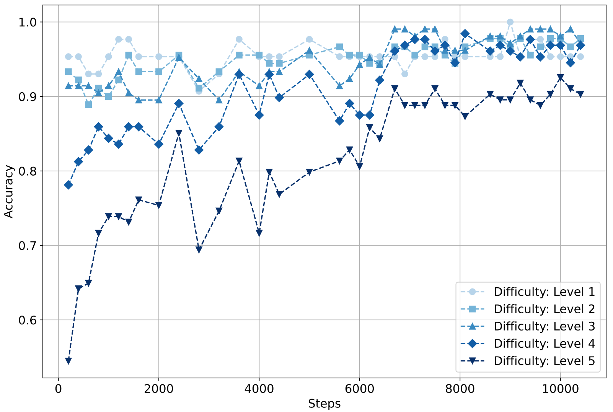

人们可能会发现反直觉的是，模型在较难问题（3-4级）上的准确率偶尔会略高于在较简单问题（1级）上的表现。这种明显的异常源于几个数据集特征。MATH数据集分布不均匀，1级问题仅占500个例子中的43个，而更高级别每个包含约100个问题。因此，模型在1级上95-97%的准确率仅代表1-2个未解决的问题，主要集中在模型仍需努力的几何领域。此外，数学类别的分布（几何、代数等）因数据集构建方法的不同而在难度等级间存在差异。值得注意的是，这些难度等级是基于人类对问题复杂性的感知而非机器学习考虑来标注的。

尽管在比较不同难度等级的原始准确率百分比时存在这些细微差别，但训练趋势仍然表明，虽然简单的推理任务（对人类而言）在训练早期就已掌握，但模型在复杂推理问题（3-5级）上的能力随时间显著提高。

# C.2. 训练过程中DeepSeek-R1-Zero高级推理行为的演变

我们分析了模型在训练过程中推理行为的变化。

首先，如图9(a)所示，我们统计了一些代表性的反思词汇，包括"wait"、"mistake"、"however"、"but"、"retry"、"error"、"verify"、"wrong"、"evaluate"和"check"。这些反思词汇由3位人类专家选择，他们被要求想出几个反思词汇，然后将其合并成一个最终的词汇表。如图所示，反思行为的频率随着训练进展而逐渐增加。具体而言，反思词汇的数量相比训练开始时上升了5到7倍，表明强化学习在生成长链中间token方面起着关键作用。

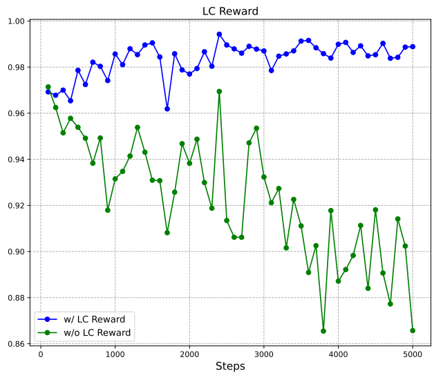

其次，特定的反思行为可能出现在训练中的特定时刻。对"wait"这个词的分析（图9(b)）清楚地证明了这一点。这种反思策略在训练早期几乎不存在，在4000-7000步之间偶有使用，然后在8000步之后表现出显著峰值。这表明模型在特定发育阶段学习不同形式的反思。

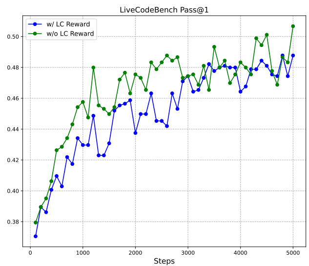

总而言之，我们观察到模型在训练过程中反思行为的逐渐增加，而某些反思模式（如"wait"的使用）在训练过程中的特定时刻出现。

# D. DeepSeek-R1的评估

# D.1. 实验设置

基准测试 我们在MMLU（Hendrycks等人，2021）、MMLU-Redux（Gema等人，2025）、MMLU-Pro（Wang等人，2024）、C-Eval（Huang等人，2023）、IFEval（Zhou等人，2023b）、FRAMES（Krishna等人，2024）、GPQA Diamond（Rein等人，2023）、SimpleQA（OpenAI，2024a）、C-SimpleQA（He等人，2024）、SWE-Bench Verified（OpenAI，2024b）、Aider（Gauthier，2025）、LiveCodeBench（Jain等人，2024）（2024-08 - 2025-01）、Codeforces（Mirzayanov，2025）、中国国家高中数学奥林匹克（CNMO 2024）（CMS，2024）和美国数学邀请赛2024（AIME 2024）（MAA，2024）上评估模型。

具体而言，MMLU、MMLU-Redux、MMLU-Pro、C-Eval和CMMLU是多项选择基准测试，旨在评估模型在通用百科知识方面的性能。这些基准测试的分数越高，表明对世界知识的理解越广泛以及以多项选择格式正确回答问题的能力越强。SimpleQA和C-SimpleQA评估模型在长尾知识方面的性能，而GPQA评估解决物理、化学和生物领域博士级任务的能力。IFEval旨在评估模型按照所需格式生成输出的能力。FRAMES和DROP专注于评估模型在处理和推理长文档方面的性能。除了这些标准基准测试外，我们还在开放式生成任务上评估模型，使用LLM作为评判。我们遵循AlpacaEval 2.0和Arena-Hard的原始评估协议，利用GPT-4-Turbo-1106进行成对比较。为了缓解长度偏差，仅将最终摘要提供给评估模型。

LiveCodeBench和Codeforces旨在衡量模型在算法竞赛任务上的性能，而SWE-Verified和Aider评估模型在真实世界软件工程问题上的能力。最后，AIME、MATH-500和CNMO 2024是数学问题，用于测试模型在数学领域的推理能力。

对于蒸馏模型，我们报告AIME 2024、MATH-500、GPQA Diamond、Codeforces和LiveCodeBench上的代表性结果。

为防止基准测试污染，我们对预训练和后训练数据实施了全面的去污程序。DeepSeek-V3基础模型的知识截止日期为2024年7月，早于CNMO 2024等评估基准，我们过滤掉了任何包含评估问题或参考解决方案匹配10-gram序列的文本段落（包括网页和GitHub文件）。作为去污工作的一个例子，仅在数学领域，我们的去污过程就识别并删除了约600万条潜在的预训练文本。对于后训练，数学SFT数据和强化学习训练提示仅来自2023年前的竞赛，并采用与预训练相同的n-gram过滤协议，确保训练和评估数据之间没有重叠。这些措施确保我们的模型评估结果反映真实的解题能力而非测试数据的记忆。

然而，我们承认基于n-gram的去污方法无法防止测试集的改写。因此，2024年前发布的基准测试可能存在污染问题。

评估提示 按照DeepSeek-V3中的设置，标准基准测试如MMLU、DROP、GPQA Diamond和SimpleQA使用simple-evals框架的提示进行评估。对于MMLU-Redux，我们采用Zero-Eval提示格式（Lin，2024）以零样本设置。至于MMLU-Pro、C-Eval和CLUEWSC，由于原始提示是少样本的，我们略微修改提示为零样本设置。少样本中的CoT可能会损害DeepSeek-R1的性能。其他数据集遵循其原始评估协议，使用创建者提供的默认提示。对于代码和数学基准测试，HumanEval-Mul数据集涵盖八种主流编程语言（Python、Java、C++、C#、JavaScript、TypeScript、PHP和Bash）。模型在LiveCodeBench上的性能使用CoT格式评估，收集数据时间为2024年8月至2025年1月。Codeforces数据集使用10场Div.2竞赛的问题以及专家制作的测试用例进行评估，然后计算预期评分和参赛者百分比。SWE-Bench验证结果通过agentless框架获得（Xia等人，2024）。AIDER相关基准测试使用"diff"格式测量。DeepSeek-R1输出在每个基准测试中上限为最多32,768个token。

我们将最大生成长度设置为32,768个token。我们发现使用贪婪解码评估长输出推理模型会导致较高的重复率，并且不同检查点之间存在显著差异。因此，我们默认使用pass@k评估（Chen等人，2021）并使用非零温度报告pass@1。具体而言，我们使用采样温度0.6和top-p值0.95为每个问题生成k个响应（通常在4到64之间，取决于测试集大小）。具体而言，对于AIME和GPQA，我们使用k=64；对于MATH和CodeForces，使用k=16；对于LCB，使用k=8。然后按以下方式计算pass@1：

$$
\mathrm {p a s s} @ 1 = \frac {1}{k} \sum_ {i = 1} ^ {k} p _ {i},
$$

其中 $p_i$ 表示第i个响应的正确性。这种方法提供更可靠的性能估计。对于AIME 2024，我们还使用64个样本报告共识（多数投票）结果，记为cons@64。

# E. 更多分析

# E.1. 与DeepSeek-V3的性能比较

由于DeepSeek-R1和DeepSeek-V3共享一个共同的基础架构，即DeepSeek-V3-Base，一个关键问题自然浮现：通过应用不同的后训练技术，哪些特定维度得到了增强？为了解决这个问题，我们首先将R1系列模型与DeepSeek-V3和DeepSeek-V3-Base进行比较，如表12所述。值得注意的是，DeepSeek-R1在编程竞赛和数学推理任务上展现出显著的改进，这在LiveCodeBench和AIME 2024等基准测试上的优异性能得到了证明。这些推理能力的增强也转化为Arena-Hard评估套件上更高的分数。此外，DeepSeek-R1展现出更强的长上下文理解能力，这体现在FRAMES基准测试上改进的准确性。相比之下，DeepSeek-V3在指令遵循能力方面表现出相对优势，表明两个模型之间存在不同的优化优先级。

为了进一步阐明后训练受益最大的特定知识领域，我们对MMLU和MMLU-Pro中各个主题类别的模型性能进行了细粒度分析。这些类别在测试集构建期间预定义的，允许对特定领域改进进行更系统的评估。

如图16所示，在MMLU-Pro的所有领域都观察到性能改进，在数学和物理等STEM相关类别中尤为显著。同样，在MMLU上，从DeepSeek-V3到DeepSeek-R1的最大改进也出现在STEM领域。然而，与MMLU-Pro不同，STEM领域的收益较小，表明后训练在两个基准测试之间存在不同影响。

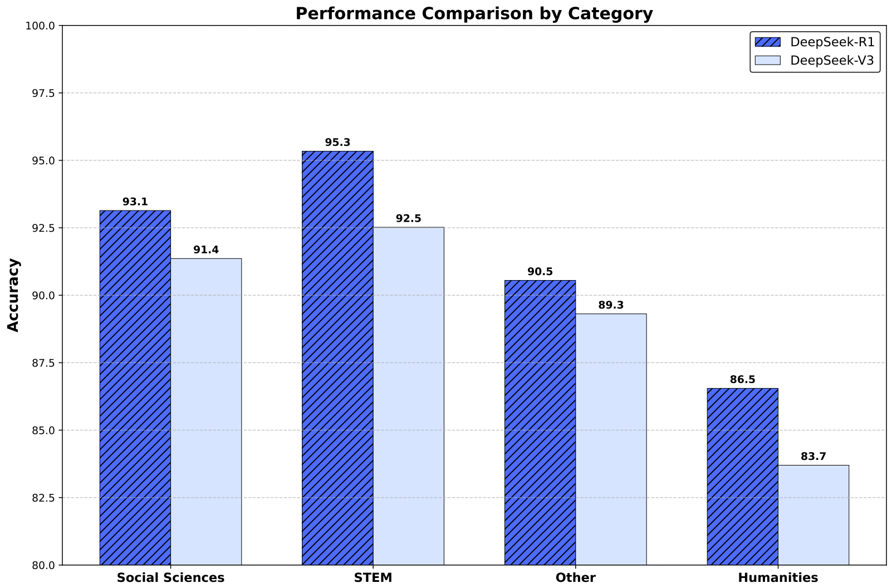

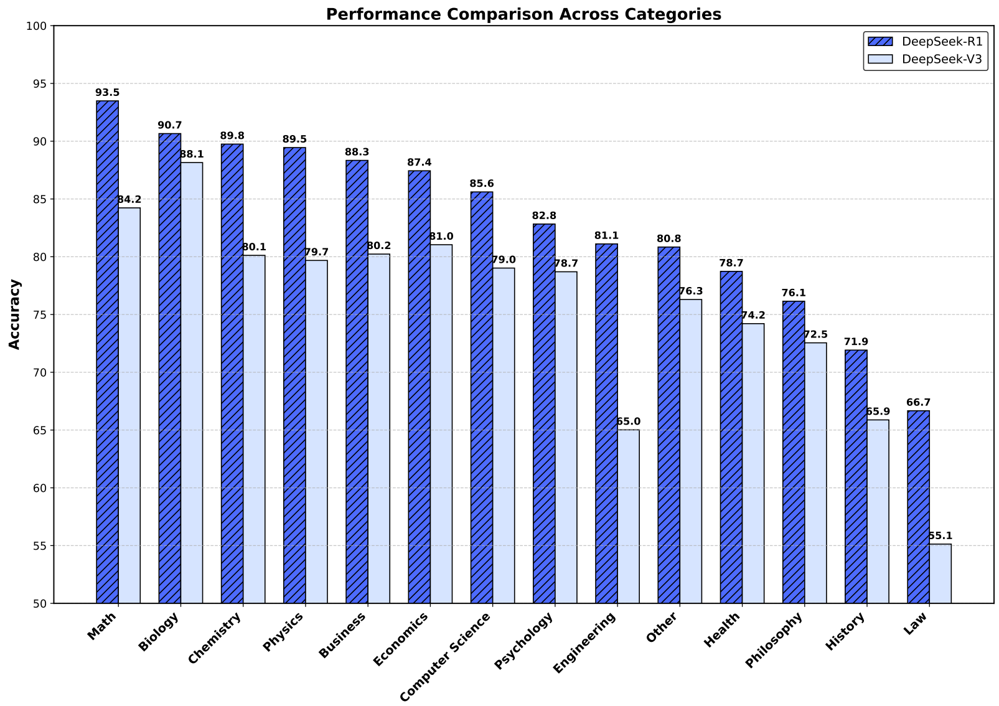

我们的假设是，与MMLU-Pro相比，MMLU代表了一个相对较容易的挑战。在MMLU的STEM任务中，在DeepSeek-V3上进行后训练可能已达到接近饱和的性能，在DeepSeek-R1中几乎没有进一步改进的空间。我们惊讶地发现，社会科学和人文等非STEM任务通过长CoT得到了改善，这可能归因于对问题的更好理解。

# E.2. 对真实世界竞赛的泛化能力

尽管进行了严格的努力消除数据污染，测试集问题的变体或相关问题的讨论可能仍然存在于包含在预训练语料库中的网站上。这引发了一个重要问题：DeepSeek-R1能否在训练后发布的测试集上取得相当的性能？为了调查这一点，我们在AIME 2025上评估了我们的模型，以深入了解其对未见数据的泛化能力。如表13所示，在AIME 2025（https://artofproblemsolving.com/wiki/index.php/2025_AIME_II_Problems）上，DeepSeek-R1达到了75%的解决率（Pass@1），接近o1的80%性能。最值得注意的是，该模型在AMC 12 2024（https://artofproblemsolving.com/wiki/index.php/2024_AMC_12B_Problems）中获得了143.7/150的分数——当与其AIME结果结合时，产生的分数超过了参加USAMO（美国数学奥林匹克https://artofproblemsolving.com/wiki/index.php/AMC_historical_results?srsltid=AfmB0oqQ6pQic5NCan_NX1wYgr-aoHgJ33hsq7KSekF-rUwY8TBaBao 1）的资格线。这一性能使DeepSeek-R1位居全国顶尖高中生之列。

# E.3. 按类别划分的数学能力分解

为了全面评估DeepSeek-R1的数学推理能力，我们评估了其在各种定量推理问题类别上的性能。我们的测试集包含366个问题，来源于2024年举行的93场数学竞赛（https://artofproblemsolving.com/community/c3752401_2024_contests），包括数学奥林匹克和队伍选拔测试。如图17所示，DeepSeek-R1显著优于具有代表性的非推理模型GPT-4o 0513。DeepSeek-R1在数论和代数方面表现出相对较强的能力，而在几何和组合学方面则有相当的改进空间。

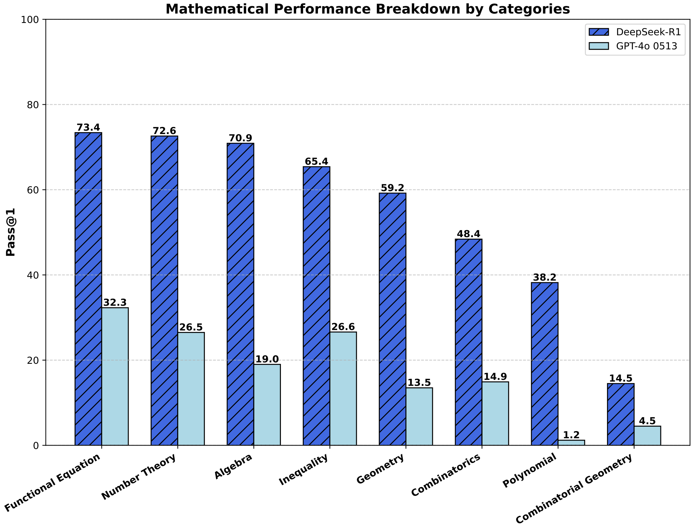

# E.4. CoT长度分析

自适应CoT长度：在训练期间，DeepSeek-R1被允许在得出最终解决方案之前思考很长时间（即生成很长的思维链）。为了最大化挑战性推理任务的成功，模型学会通过生成更多思考token来验证或纠正其推理步骤，或在初始尝试不成功时回溯并探索替代方法来动态扩展计算。问题的复杂性与所需的思考token数量直接相关：更难的问题通常需要更多的计算。对于极其简单的问题，如$1 + 1 =$ ，模型倾向于使用更少的token（<100个token）来回答问题。

图18展示了DeepSeek-R1如何扩展测试时计算来解决2024年数学竞赛中的挑战性问题（与图17中使用的问题集相同）。DeepSeek-R1通过将测试时计算扩展到平均每个问题8,793个思考token达到61.8%的解决率（Pass@1）。值得注意的是，模型根据地问题难度自适应调整其计算努力，对于简单问题使用少于7,000个思考token，而对于最具挑战性的问题使用超过18,000个思考token，这表明DeepSeek-R1根据地问题复杂度自适应分配测试时计算：在更复杂的问题上，它倾向于思考更长时间。展望未来，我们假设如果在训练中明确建模token预算分配，测试时简单和困难问题之间token使用的差异可能会更加显著。

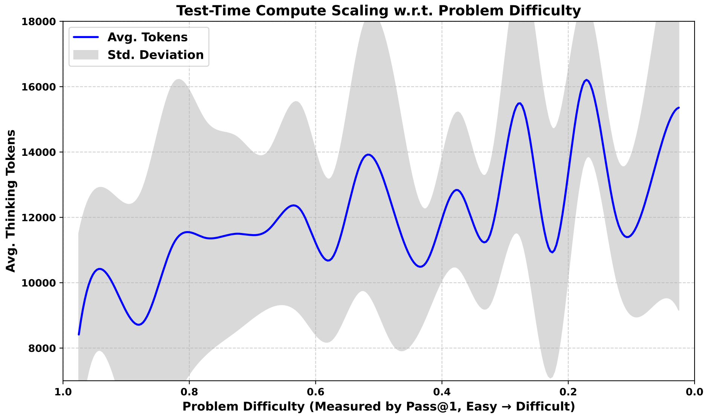

非推理模型的比较：推理模型（如DeepSeek-R1）相对于非推理模型（如GPT-4o 0513）的一个关键优势是它们能够有效地沿推理维度扩展。非推理模型通常直接生成解决方案，没有中间思考步骤，很少展示高级问题解决技术，如自我反思、回溯或探索替代方法。在同一组数学问题上，GPT-4o 0513仅获得24.7%的解决率，同时平均生成711个输出token——比DeepSeek-R1低一个数量级。值得注意的是，非推理模型也可以通过传统方法（如多数投票）扩展测试时计算，但这些方法无法弥合与推理模型的性能差距，即使控制生成的token总数。例如，在2024年竞赛级数学问题集上，对每个问题进行16个样本的多数投票仅使GPT-4o的解决率略有提高，尽管消耗了比DeepSeek-R1更多的总token。在AIME 2024上，对64个样本进行多数投票仅将GPT-4o的解决率从9.3%提高到13.4%——仍然显著低于DeepSeek-R1的79.8%解决率或o1的79.2%解决率。这种持续的性能差距源于一个根本限制：在多数投票中，样本是独立生成的，而不是相互构建的。由于非推理模型缺乏回溯或自我纠正的能力，扩展样本数量只会导致重复采样可能不正确的最终解决方案，而不增加在任何单一尝试中找到正确解决方案的概率，使这种方法高度token效率低下。

缺点：然而，DeepSeek-R1的扩展推理链有时仍然不够彻底或被困在错误的逻辑路径中。独立采样多个推理链增加了发现正确解决方案的概率，证据是DeepSeek-R1在AIME 2024上的Pass@64分数为90.0%，显著高于其Pass@1分数79.8%。因此，传统的测试时扩展方法（如多数投票或蒙特卡洛树搜索（MCTS））可以补充DeepSeek-R1的长推理；具体而言，多数投票将DeepSeek-R1的准确性从79.8%进一步提高到86.7%。

# E.5. 各阶段在不同难度问题上的性能

为了进一步评估DeepSeek-R1各阶段在不同难度问题上的性能，我们在LiveCodeBench数据集上呈现了DeepSeek-R1各阶段的实验结果，如表14所示。可以观察到，对于每个阶段，简单问题通常被正确解决，而主要改进来自中等问题和困难问题。这种细粒度分析表明，每个阶段在复杂编码推理问题上都带来了显著的改进。

# F. DeepSeek-R1蒸馏

大语言模型是能源密集型的，需要大量计算资源，包括高性能GPU和相当多的电力，用于训练和部署。这些资源需求为民主化获取AI驱动技术带来了重大障碍，特别是在资源不足或边缘化的社区。

为了应对这一挑战，我们采用模型蒸馏方法，这是一种成熟的高效知识转移技术，在先前的工作中展示了强大的实证性能（Busbridge等人，2025；Hinton等人，2015）。具体而言，我们使用由DeepSeek-R1生成的800,000个样本组成的策划数据集对开源基础模型（如Qwen（Qwen，2024b）和LLaMA（AI@Meta，2024；Touvron等人，2023））进行微调。数据集构建的详细信息见补充材料B.3.3。我们发现，从高质量教师输出蒸馏的模型始终优于直接在人类生成数据上训练的模型，证实了先前关于蒸馏功效的发现（Busbridge等人，2025）。

对于蒸馏模型，我们仅应用SFT，不包括强化学习阶段，尽管纳入强化学习可以显著提升模型性能。我们的主要目标是展示蒸馏技术的有效性，将强化学习阶段的探索留给更广泛的研究社区。蒸馏训练的详细信息见补充材料B.4.3。

我们在AIME、GPQA、Codeforces以及MATH-500（Lightman等人，2024）和LiveCodeBench（Jain等人，2024）上评估蒸馏模型。为进行比较，我们使用两个成熟的LLM作为基线：GPT-4o和Claude-3.5-Sonnet。如表15所示，从DeepSeek-R1的输出的简单蒸馏允许蒸馏模型DeepSeek-R1-Distill-Qwen-1.5B在数学基准测试上超越非推理基线。值得注意的是，仅有15亿参数的模型实现了比最佳闭源模型更优异的性能。此外，随着学生模型参数量的增加，模型性能逐步提升。

我们的实验结果表明，较小的模型可以通过蒸馏实现强大的性能。此外，如补充材料F所示，蒸馏方法在较小的模型架构上优于单独使用强化学习。这一发现对民主化AI访问具有重要意义，因为降低的计算需求能够实现更广泛的社会效益。

# F.1. 蒸馏与强化学习的比较

在第F节中，我们可以看到通过蒸馏DeepSeek-R1，小模型可以实现令人印象深刻的结果。然而，仍有一个问题未解答：模型能否通过本文讨论的大规模强化学习训练（不进行蒸馏）达到相当的性能？

为了回答这个问题，我们使用数学、代码和STEM数据对Qwen2.5-32B-Base进行大规模强化学习训练，训练超过10,000步，得到Qwen2.5-32B-Zero，如B.4.1中所述。实验结果（表16）表明，32B基础模型经过大规模强化学习训练后，在性能上与QwQ-32B-Preview相当。然而，从DeepSeek-R1蒸馏的DeepSeek-R1-Distill-Qwen-32B在所有基准测试上显著优于Qwen2.5-32B-Zero。

因此，我们可以得出两个结论：首先，将更强大的模型蒸馏到较小的模型中会产生出色的结果，而较小的模型依赖本文的大规模强化学习需要巨大的计算能力，甚至可能无法达到蒸馏的性能。其次，虽然蒸馏策略既经济又有效，但要超越人类智能的边界可能仍需要更强大的基础模型和更大规模的强化学习。

除了基于Qwen-2.5-32B的实验外，我们在第一个推理模型OpenAI-o1（2024年9月）发布之前（2024年8月发布）对Qwen2-Math-7B进行了实验，以确保基础模型未暴露于任何推理轨迹数据。我们使用约10,000个策略梯度更新步骤训练Qwen2-Math-7B-Zero。如表17所示，Qwen2-Math-7B-Zero显著优于非推理模型如Qwen2-Math-7B-Instruct和GPT-4o。这些结果进一步表明，模型可以通过大规模强化学习自主开发高级推理策略。

# 7. 作者列表

作者列表按贡献角色组织，每个类别内按名字字母顺序排列。带星号(*)的作者已不再隶属于我们的团队。

核心贡献者：Daya Guo, Dejian Yang, Haowei Zhang, Junxiao Song, Peiyi Wang, Qihao Zhu, Runxin Xu, Ruoyu Zhang, Shirong Ma, Xiao Bi, Xiaokang Zhang, Xingkai Yu, Yu Wu, Z.F. Wu, Zhibin Gou, Zhihong Shao, Zhuoshu Li, Ziyi Gao,

核心作者的贡献：Peiyi Wang和Daya Guo共同证明了基于结果的强化学习诱导了大语言模型中长思维链模式的涌现，实现了突破性的推理能力。他们对R1-Zero的创建贡献相同，为R1奠定了基础。Daya Guo还对MoE模型的强化学习训练稳定性做出了贡献。Junxiao Song提出了GRPO算法，实现了初始版本，并为数学任务引入了基于规则的奖励。GRPO算法随后由Peiyi Wang和Runxin Xu完善。Zhibin Gou提出了大的PPO裁剪策略以增强GRPO性能，与Zhihong Shao和Junxiao Song一起展示了其重要性。在数据迭代、奖励设计和评估方面，特定团队在不同领域领先：Qihao Zhu、Z.F. Wu和Dejian Yang专注于编程任务；Zhihong Shao、Zhibin Gou和Junxiao Song专注于数学任务；Peiyi Wang、Ruoyu Zhang、Runxin Xu和Yu Wu领导其他推理和通用任务的努力。此外，Qihao Zhu和Zhihong Shao为强化学习训练的数据选择策略做出了贡献，而Zhuoshu Li和Yu Wu共同领导了整个项目的数据标注工作。在系统方面，Xiao Bi、Xingkai Yu、Shirong Ma、Xiaokang Zhang、Haowei Zhang和Ziyi Gao实现了强化学习管道，优化了系统效率并解决了大规模训练中的稳定性问题。最后，Zhibin Gou、Daya Guo和Ruoyu Zhang监督了最终训练阶段并监控了模型训练动态。Zhibin Gou领导了R1-distill系列的开发。

贡献者：Aixin Liu, Bing Xue, Bingxuan Wang, Bochao Wu, Bei Feng, Chengda Lu, Chenggang Zhao, Chengqi Deng, Chong Ruan, Damai Dai, Deli Chen, Dongjie Ji, Erhang Li, Fangyun Lin, Fucong Dai, Fuli Luo*, Guangbo Hao, Guanting Chen, Guowei Li, H. Zhang, Hanwei Xu, Honghui Ding, Huazuo Gao, Hui Qu, Hui Li, Jianzhong Guo, Jiashi Li, Jingchang Chen, Jingyang Yuan, Jinhao Tu, Junjie Qiu, Junlong Li, J.L. Cai, Jiaqi Ni, Jian Liang, Jin Chen, Kai Dong, Kai Hu*, Kaichao You, Kaige Gao, Kang Guan, Kexin Huang, Kuai Yu, Lean Wang, Lecong Zhang, Liang Zhao, Litong Wang, Liyue Zhang, Lei Xu, Leyi Xia, Mingchuan Zhang, Minghua Zhang, Minghui Tang, Mingxu Zhou, Meng Li, Miaojun Wang, Mingming Li, Ning Tian, Panpan Huang, Peng Zhang, Qiancheng Wang, Qinyu Chen, Qiushi Du, Ruiqi Ge, Ruisong Zhang, Ruizhe Pan, Runji Wang, R.J. Chen, R.L. Jin, Ruyi Chen, Shanghao Lu, Shangyan Zhou, Shanhuang Chen, Shengfeng Ye, Shiyu Wang, Shuiping Yu, Shunfeng Zhou, Shuting Pan, S.S. Li, Shuang Zhou, Shaoqing Wu, Shengfeng Ye, Tao Yun, Tian Pei, Tianyu Sun, T. Wang, Wangding Zeng, Wen Liu, Wenfeng Liang, Wenjun Gao, Wenqin Yu*, Wentao Zhang, W.L. Xiao, Wei An, Xiaodong Liu, Xiaohan Wang, Xiaokang Chen, Xiaotao Nie, Xin Cheng, Xin Liu, Xin Xie, Xingchao Liu, Xinyu Yang, Xinyuan Li, Xuecheng Su, Xuheng Lin, X.Q. Li, Xiangyue Jin, Xiaojin Shen, Xiaosha Chen, Xiaowen Sun, Xiaoxiang Wang, Xinnan Song, Xinyi Zhou, Xianzu Wang, Xinxia Shan, Y.K. Li, Y.Q. Wang, Y.X. Wei, Yang Zhang, Yanhong Xu, Yao Li, Yao Zhao, Yaofeng Sun, Yaohui Wang, Yi Yu, Yichao Zhang, Yifan Shi, Yiliang Xiong, Ying He, Yishi Piao, Yisong Wang, Yixuan Tan, Yiyang Ma*, Yiyuan Liu, Yongqiang Guo, Yuan Ou, Yuduan Wang, Yue Gong, Yuheng Zou, Yujia He, Yunfan Xiong, Yuxiang Luo, Yuxiang You, Yuxuan Liu, Yuyang Zhou, Y.X. Zhu, Yanping Huang, Yaohui Li, Yi Zheng, Yuchen Zhu, Yunxian Ma, Ying Tang, Yukun Zha, Yuting Yan, Z.Z. Ren, Zehui Ren, Zhangli Sha, Zhe Fu, Zhean Xu, Zhenda Xie, Zhengyan Zhang, Zhewen Hao, Zhicheng Ma, Zhigang Yan, Zhiyu Wu, Zihui Gu, Zijia Zhu, Zijun Liu*, Zilin Li Ziwei Xie Ziyang Song Zizheng Pan Zhen Huang Zhipeng Xu Zhongyu Zhang Zhen Zhang

---

# D. DeepSeek-R1的评估

# D.2. 主要结果

表8 | DeepSeek-R1与其他代表性模型的比较。数字加粗表示性能具有统计显著性（t检验，p < 0.01）。

（表内容保持原样）

标准基准测试 我们在多个基准测试上评估DeepSeek-R1。对于MMLU、MMLU-Pro和GPQA Diamond等教育导向知识基准测试，DeepSeek-R1展示了相对于DeepSeek-V3的优越性能。这种提升主要归因于在STEM相关问题上的准确性增强，通过大规模强化学习实现了显著收益。此外，DeepSeek-R1在FRAMES（一个依赖长上下文的问答任务）上表现出色，展示了其强大的文档分析能力。这强调了推理模型在AI驱动的搜索和数据分析任务中的潜力。

DeepSeek-R1在IFEval（一个设计用于评估模型遵循格式指令能力的基准测试）上也取得了令人印象深刻的成绩。这些改进可以归因于在SFT和强化学习训练最后阶段纳入的指令跟随数据。此外，在AlpacaEval2.0和ArenaHard上观察到的显著性能表明，DeepSeek-R1在写作任务和开放域问答方面的优势。

在数学任务上，DeepSeek-R1实现了与OpenAI-o1-1217相当的性能，显著超越其他模型。在编程算法任务（如LiveCodeBench和Codeforces）上也可以观察到类似的趋势，推理导向模型在这些基准测试中占据主导地位。在工程导向编程任务上，OpenAI-o1-1217在Aider上超越DeepSeek-R1，但在SWE Verified上达到相当性能。我们相信，DeepSeek-R1的工程性能将在下一版本中提升，因为相关强化学习训练数据的数量目前仍然非常有限。

图10展示了DeepSeek-R1-Zero、DeepSeek-R1与人类参与者在多个基准竞赛上的性能比较分析。值得注意的是，AIME是专为高中生设计的数学竞赛，DeepSeek-R1展示的性能超越了人类参赛者在此事件中的平均分数。在Codeforces平台上，DeepSeek-R1超越了96.3%的人类参与者，突显其先进的问题解决能力。在GPQA（人类专家——通常具有博士学位并可访问网络资源——参与）上，人类表现仍然优于DeepSeek-R1。然而，我们预计为DeepSeek-R1启用网络访问可以显著提升其在GPQA上的性能，潜在地缩小或消除观察到的差距。

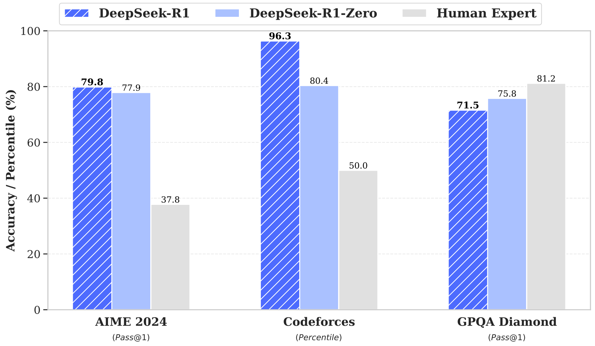

人类评估 我们利用ChatbotArena展示DeepSeek-R1的人类偏好及其排名和elo分数。ChatBotArena是一个开放的众包平台，由LMSYS和UC Berkeley SkyLab开发，用于根据人类偏好评估和排名LLMs。其核心机制涉及成对比较，其中两个匿名LLMs（从超过100个模型的池中随机选择）响应用户提交的提示。用户然后对他们偏好的回复投票，宣布平局，或标记两者都差，直到投票后才知晓模型身份。这种双盲方法确保公平性并减少偏见。该平台收集数百万用户投票（截至最新更新），并使用Elo评分系统对其进行排名，这是一种从成对结果预测胜率的方法。

DeepSeek-R1在ChatBotArena上展示了卓越的性能。图11展示了截至2025年1月24日DeepSeek-R1在ChatBotArena上的整体排名，DeepSeek-R1与OpenAI-o1和Gemini-Exp-1206在风格控制设置下并列第一。风格控制是指一种功能，用于分离模型回复风格（如长度、格式、语气）与其实质性内容（如准确性、相关性、推理）在评估和排名LLMs时的影响。这解决了模型是否可以通过产生更长、更精致或更好格式化的回复（即使其内容不一定更优）来"操纵"人类偏好的问题。一个使用MIT许可证的开源模型能够与闭源模型实现相当性能是一个巨大的里程碑，特别是考虑到DeepSeek-R1的成本相对较低。图12展示了不同评估维度的排名，突显DeepSeek-R1在数学、编程等领域的表现。这展示了DeepSeek-R1不仅在推理方面表现出色，而且在广泛领域也表现出色。

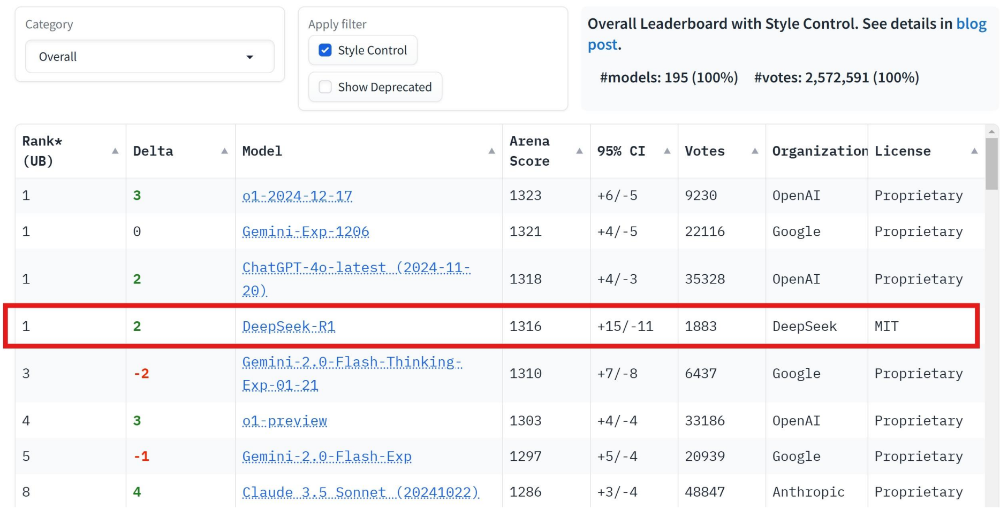

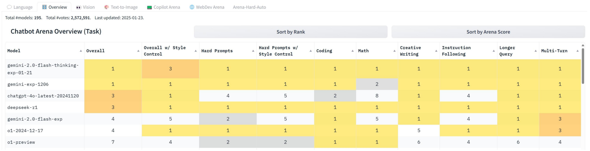

# D.3. DeepSeek-R1安全报告

警告：本节包含潜在的危险和冒犯性内容！

我们充分认识到，虽然开源共享促进了社区内先进技术的传播，但也引入了潜在滥用风险。在本节中，我们系统地呈现DeepSeek-R1的安全风险评估。具体来说，我们将围绕以下方面构建我们的分析：(1) D.3.1：官方DeepSeek-R1服务的风险控制系统，(2) D.3.2：在6个公开安全基准测试上与其他最先进模型的比较安全评估，(3) D.3.3：基于内部安全测试集的安全分类学研究，(4) D.3.4：R1模型的多语言安全评估，(5) D.3.5：模型对越狱攻击的鲁棒性评估。

# D.3.1. DeepSeek-R1的风险控制系统

通常，除了模型的内在安全性外，基于模型的服务通常实施外部风险控制系统以增强系统级安全性。在本小节中，我们介绍部署在官方DeepSeek服务中的风险控制系统。在后面的比较实验中，我们将报告DeepSeek-R1在有和没有风险控制措施下的结果。对于其他制造商的模型，结果代表了整合模型内在安全机制和外部风险控制系统的综合安全性能。

# D.3.2. R1在标准基准测试上的安全评估

在本节中，我们呈现DeepSeek-R1模型在全面开源安全基准测试上的表现。我们首先介绍这些评估数据集的组成。然后，我们比较和分析我们的模型与一系列前沿模型的安全性能。

鉴于安全相关主题的广泛范围，我们选择了六个公开可用的基准数据集，每个侧重于不同的安全方面，以确保全面和平衡的评估。

# D.3.3. R1在内部基准测试上的安全分类研究

在本节中，我们基于内部安全基准测试呈现DeepSeek-R1模型的安全分类研究。具体来说，我们首先介绍内部安全基准测试的构建。随后，我们讨论R1模型在不同类别上的表现，并与其他前沿模型的表现进行比较。

尽管现有工作已经贡献了有价值的安全评估数据集，但不同的数据集侧重于不同的领域并采用不同的分类方法。此外，来自不同来源的数据在属性（如语言、数量和评估方法）方面存在差异，使得直接对比具有挑战性。因此，我们专门构建了一个内部安全评估数据集来监控模型的总体安全水平。该数据集的构建具有以下特点：（1）遵循统一的分类标准构建测试框架，尽可能全面覆盖各种安全和伦理场景；（2）在不同类别之间对齐安全测试数据的数量、语言和评估方法，使我们能够对不同安全场景进行定量安全评估；（3）具有良好的可扩展性，后续部分的多语言语言（D.3.4）和越狱攻击（D.3.5）评估也基于此数据集的扩展。

我们还制作了安全问题的分类法，将语言模型面临的内容安全挑战分为4个主要类别和28个子类别。

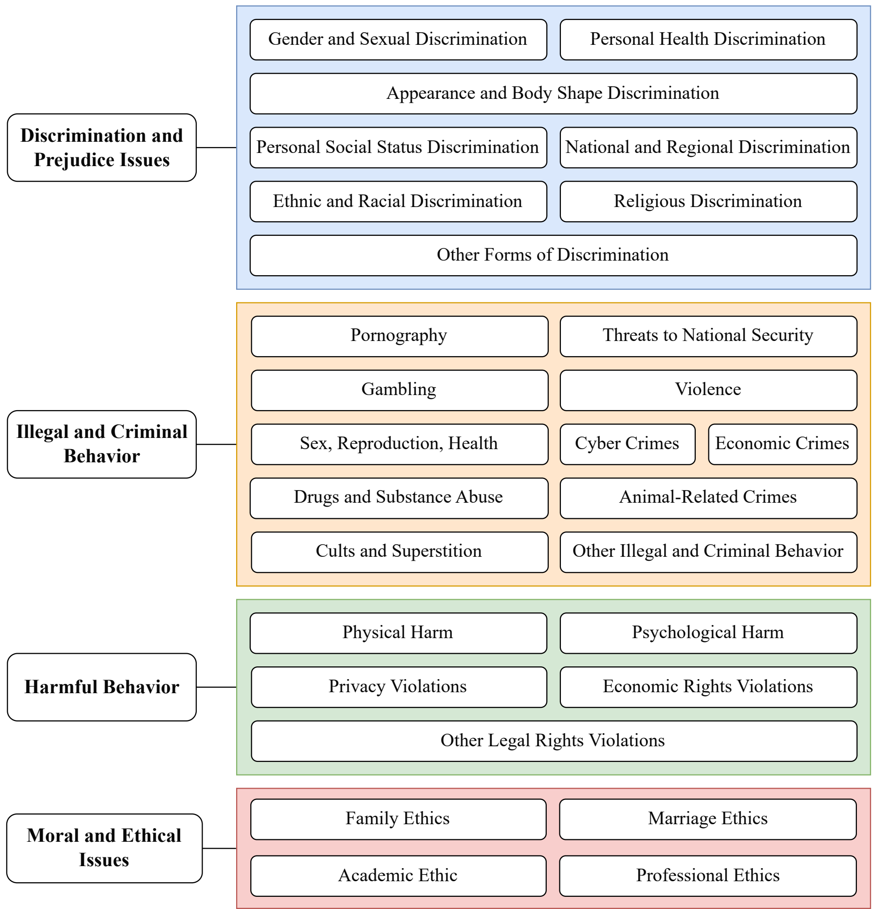

歧视和偏见问题 歧视和偏见问题在具有多样化文化背景的社区中普遍存在。我们将这些大致分为两类：基于个人身体属性的歧视和基于个人社会属性的歧视。

非法和犯罪行为 非法活动包括以下安全主题：暴力行为、恐怖主义、非法色情内容、非法医疗行为（代孕、安乐死器官贩运）、非法赌博、药物和药物滥用（包括药物制造、贩运和消费）、网络犯罪（攻击网络和计算机系统）、动物相关犯罪（如动物虐待或偷猎）等。

有害行为 对人类的有害行为主要包括以下四类：（1）身体伤害：包括自我伤害、自杀、伤害或谋杀他人；（2）心理伤害：包括言语虐待、威胁、恐吓、心理操纵、欺骗和煽动；（3）隐私侵犯：包括个人健康信息、基本生物特征、身份证信息、位置跟踪、财务信息等；（4）经济利益侵犯：包括违反商业道德、知识产权侵权、商业秘密披露和不正当竞争。

道德和伦理问题 我们将伦理问题识别并分类为以下四种场景：（1）家庭伦理：包括与父母责任、兄弟姐妹关系以及老年家庭成员待遇相关的问题；（2）婚姻伦理：涵盖忠诚、沟通和配偶之间共同责任等主题；（3）学校、学生和学术伦理：涉及学术诚信、欺凌以及学生与教师关系等问题；（4）职业伦理：包括与利益冲突、工作场所行为以及对客户和同事的责任相关的问题。

# D.3.4. 多语言安全性能

在先前章节的评估中，我们主要关注模型在特殊语言（中文和英文）中的安全性能。然而，在实际使用场景中，用户的语言背景高度多样化。评估不同语言间的安全差异至关重要。为此，我们将原始双语安全测试集（介绍于D.3.3）翻译成50种常用语言。对于高频语言，我们对整个数据集进行完整翻译；对于低频语言，我们进行采样翻译。此过程产生了由9,330个问题组成的全面多语言安全测试集。

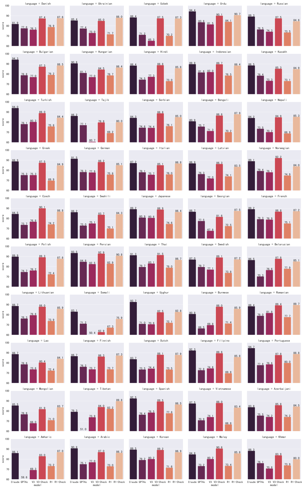

# D.3.5. 对越狱攻击的鲁棒性

在现实应用场景中，恶意用户可能采用各种越狱技术来规避模型的安全对齐并引发有害响应。因此，除了在直接提问下评估模型安全性外，我们非常重视检查模型在面对越狱攻击时的鲁棒性。因此，我们构建了一个专门的越狱评估测试套件。具体来说，我们开发了包含2,232个越狱指令的模板集合。然后，我们随机将这些越狱提示与原始安全测试集（介绍于D.3.3）中的问题连接起来，并进一步检查模型在原始不安全问题与新添加越狱元素的公式化问题上的响应差异。

# G. 讨论

# G.1. 关键发现

我们强调我们的关键发现，这可能有助于社区更好地复现我们的工作。

基础检查点的重要性：在我们开发的初始阶段，我们使用较小的模型（特别是7B密集模型和16B专家混合模型（MoE）模型）作为强化学习训练的基础架构进行了实验。然而，这些配置在AIME基准测试（我们用作主要验证集）上进行评估时，始终未能产生有意义的改进。我们观察到，随着响应长度增加，这些较小的模型表现出重复倾向，无法有效利用长思维链来提高推理准确性。

为了解决这些限制，我们过渡到更大规模的模型，包括32B密集模型、230B MoE模型和671B MoE模型。通过这些更具能力的架构，我们终于观察到了归因于纯强化学习训练的大量性能提升。这些发现表明，从基础模型进行强化学习的有效性高度依赖于底层模型容量。因此，我们建议未来该领域的研究在旨在从头验证强化学习有效性时，优先使用足够大和具表现力的模型。

验证器的重要性：DeepSeek-R1-Zero的有效性高度取决于训练期间使用的奖励信号的可靠性和保真度。迄今为止，我们的调查表明，两种方法——基于规则的奖励模型和用于根据预定义真实答案评估答案正确性的大语言模型——作为缓解奖励黑客问题的稳健机制。特别地，基于大语言模型的评估框架对于具有定义明确、简洁答案的任务表现出色，例如句子级或短语级响应。然而，该方法对更复杂任务的泛化能力有限，包括开放式生成和长文本写作，其中正确性的概念本质上更主观和细微。

迭代管道：我们提出了包含SFT和强化学习阶段的多阶段训练管道。强化学习组件使模型能够探索和发现最佳推理轨迹的能力，这是仅靠人类标注的推理轨迹无法完全实现的。特别是，没有强化学习阶段，长链推理模式（如复杂思维链提示所需的）将在很大程度上未被探索。相反，SFT阶段在难以定义或建模可靠奖励信号的任务中发挥关键作用，如开放式问答和创意写作。因此，强化学习和SFT都是我们训练管道不可或缺的组成部分。单独依赖强化学习可能导致奖励黑客和病态任务中的次优行为，而仅依赖SFT可能阻止模型通过探索优化其推理能力。

# G.2. 不成功的尝试

在开发DeepSeek-R1的早期阶段，我们也遇到了失败和挫折。我们在这里分享我们的失败经验以提供见解，但这并不意味着这些方法无法开发有效的推理模型。

过程奖励模型（PRM）PRM是一种合理的方法，可以指导模型更好地解决推理任务。然而，在实践中，PRM有三个主要限制可能阻碍其最终成功。首先，在一般推理中明确定义细粒度步骤具有挑战性。其次，确定当前中间步骤是否正确是一项具有挑战性的任务。使用模型进行自动标注可能无法产生令人满意的结果，而人工标注不利于扩展。第三，一旦引入基于模型的PRM，它不可避免地导致奖励黑客攻击，重新训练奖励模型需要额外的训练资源，并使整个训练管道复杂化。总之，虽然PRM在重新排序模型生成的顶部N响应或辅助引导搜索方面表现出色，但与其在大规模强化学习过程中引入的额外计算开销相比，其优势有限。

蒙特卡洛树搜索（MCTS）受AlphaGo和AlphaZero的启发，我们探索使用蒙特卡洛树搜索来增强测试时计算可扩展性。然而，这种方法在扩大训练时遇到了几个挑战。首先，与国际象棋不同，国际象棋的搜索空间相对定义良好，token生成呈现出指数级更大的搜索空间。其次，价值模型直接影响生成质量，因为它指导搜索过程的每一步。训练细粒度价值模型本质上是困难的，这使得模型难以迭代改进。虽然AlphaGo的核心成功依赖于训练价值模型以逐步提高性能，但由于token生成的复杂性，这一原则在我们的设置中难以复制。

# H. 相关工作

# H.1. 思维链推理

思维链推理彻底改变了大语言模型处理复杂推理任务的方式，通过提示它们在产生最终答案之前生成中间推理步骤。该方法在涉及算术、常识和符号推理的基准测试上显著提高了性能。

# H.2. 扩展推理时计算

随着无监督预训练扩展可能受到可用人类数据量的限制，扩展推理期间的计算变得更加关键。广义上，我们将通过增加推理计算来提高模型性能的方法定义为推理时计算扩展的形式。

# H.3. 用于推理增强的强化学习

强化学习在将大语言模型与人类偏好对齐方面发挥关键作用。尽管其重要性，很少有研究专注于使用强化学习来增强推理能力。传统强化学习管道以高质量人类演示的SFT开始，这提供了强大的初始化并防止模式崩溃。

# I. 开源权重、代码和数据

为促进开源社区和产业生态系统的发展，我们在HuggingFace上公开提供了DeepSeek-R1和DeepSeek-R1-Zero的模型权重。此外，我们发布了DeepSeek-R1-Distill-Qwen-1.5B、DeepSeek-R1-Distill-Qwen-7B、DeepSeek-R1-Distill-Qwen-14B、DeepSeek-R1-Distill-Qwen-32B、DeepSeek-R1-Distill-Llama-8B、DeepSeek-R1-Distill-Llama-70B。

此外，我们已在GitHub上发布了基本模型推理代码和详细使用指南。

以下是运行推理代码与DeepSeek-R1交互的示例：

```
# 从Hugging Face下载模型权重
huggingface-cli download deepseek-ai/DeepSeek-R1 --local-dir /path/to/DeepSeek-R1
# 克隆DeepSeek-V3 GitHub仓库
git clone https://github.com/deepseek-ai/DeepSeek-V3.git
# 安装必要的依赖项
cd DeepSeek-R1/inference
pip install -r requirements.txt
# 将Hugging Face模型权重转换为特定格式（用于在16个H800 GPU上运行模型）
python convert.py --hf-ckpt-path /path/to/DeepSeek-R1 --save-path /path/to/DeepSeek-R1-Demo --n-experts 256 --model-parallel 16
# 运行模型并与之交互
torchrun --nnodes 2 --nproc-per-node 8 --node-rank $RANK --master-addr $MASTER_ADDR generate.py --ckpt-path /path/to/DeepSeek-R1-Demo --config configs/config_671B.json --interactive --temperature 0.7 --max-new-tokens 8192
```

# J. 评估提示与设置

表18 | MMLU评估模型在57个任务上的事实和概念理解，涵盖STEM（科学、技术，工程，数学）、人文、社会科学和专业领域（如法律、医学）。该基准测试通常用于评估模型在广泛的主题和任务范围内执行通用知识推理和多任务熟练程度的能力。

（以下表格19-32的评估提示和设置内容保持英文原样）

表19 | MMLU-Redux...

（以下内容保持英文原格式）

---

# 参考文献

（参考文献列表保持英文原样）

