# DeepSeek-V4:


# 迈向高效的百万Token上下文智能


DeepSeek-AI research@deepseek.com


# 摘要


我们发布了 DeepSeek-V4 系列的预览版本，包括两个强大的混合专家语言模型——拥有 1.6T 参数（49B 激活）的 DeepSeek-V4-Pro 和拥有 284B 参数（13B 激活）的 DeepSeek-V4-Flash——两者均支持一百万 Token 的上下文长度。DeepSeek-V4 系列在架构和优化方面引入了多项关键升级：(1) 一种结合了压缩稀疏注意力 (CSA) 和重度压缩注意力 (HCA) 的混合注意力架构，以提升长上下文效率；(2) 流形约束超连接，增强了传统的残差连接；(3) 以及 Muon 优化器，用于实现更快的收敛速度和更高的训练稳定性。我们在超过 32T 多样且高质量的 Token 上对这两个模型进行了预训练，随后通过全面的后训练流程解锁并进一步增强其能力。DeepSeek-V4-ProMax 是 DeepSeek-V4-Pro 的最大推理强度模式，它重新定义了开源模型的最先进水平，在核心任务上超越了其前身。同时，DeepSeek-V4 系列在长上下文场景中表现出极高的效率。在百万 Token 上下文设置下，与 DeepSeek-V3.2 相比，DeepSeek-V4-Pro 仅需 27% 的单 Token 推理算力和 10% 的 KV Cache。这使我们能够常规性地支持百万 Token 的上下文，从而使长周期任务和进一步的测试时扩展变得更加可行。模型检查点可在 https://huggingface.cocollections/deepseek-ai/deepseek-v4 获取。


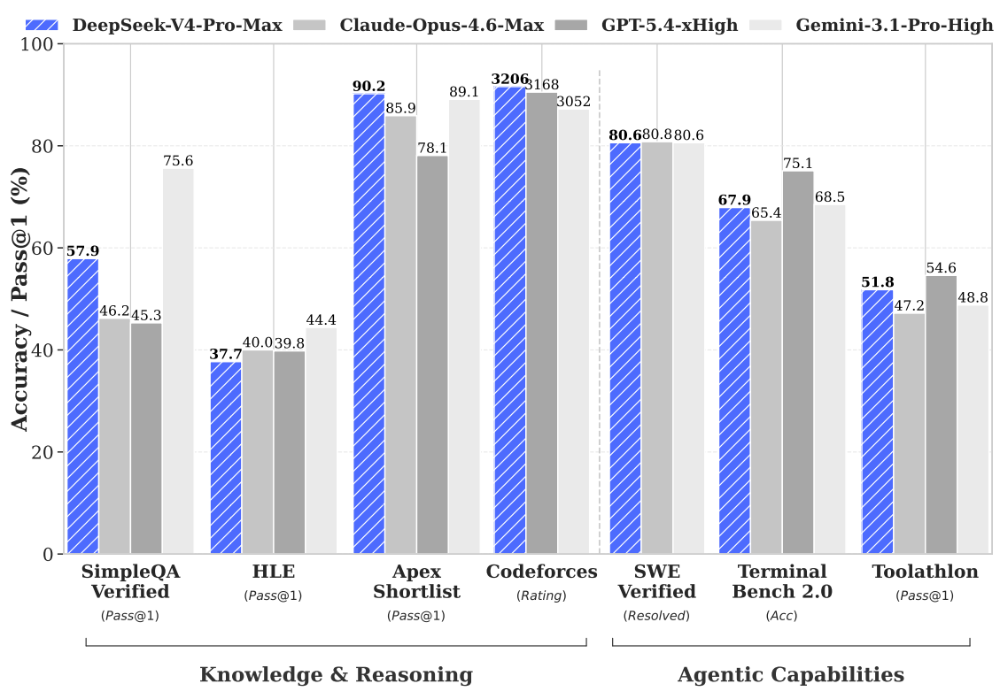


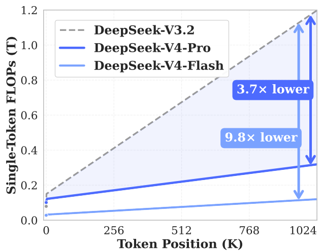


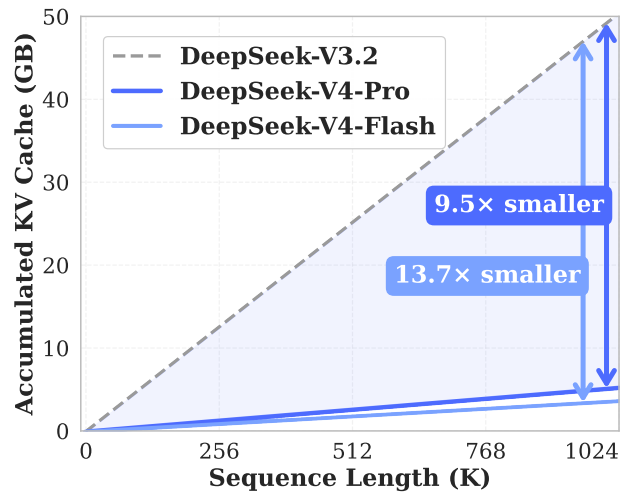


_图 1 | 左图：DeepSeek-V4-Pro-Max 及其同类模型的基准测试性能。右图：DeepSeek-V4 系列与 DeepSeek-V3.2 的推理算力和 KV Cache 大小。_

---

---

# 目录


# 1 引言 4


# 2 架构 6


2.1 继承自 DeepSeek-V3 的设计 7


2.2 流形约束超连接 7


2.3 混合注意力机制：CSA 与 HCA 9


2.3.1 压缩稀疏注意力 9


2.3.2 重度压缩注意力 11


2.3.3 其他细节 12


2.3.4 效率讨论 13


# 2.4 Muon 优化器 14


# 3 通用基础设施 15


3.1 专家并行中的细粒度通信计算重叠 15


3.2 基于 TileLang 的灵活高效算子开发 16


3.3 高性能批处理不变与确定性算子库 18


3.4 FP4 量化感知训练 19


3.5 训练框架 20


3.5.1 Muon 的高效实现 20


3.5.2 mHC 的成本效益与内存高效实现 21


3.5.3 长上下文注意力的上下文并行 21


3.5.4 用于灵活激活检查点的扩展自动微分 21


3.6 推理框架 22


3.6.1 KV Cache 结构与管理 22


3.6.2 磁盘 KV Cache 存储 23


# 4 预训练 24


4.1 数据构建 24


4.2 预训练设置 25


4.2.1 模型设置 25


4.2.2 训练设置 25


4.2.3 缓解训练不稳定性 26


4.3 评估 27


4.3.1 评估基准 27


4.3.2 评估结果 28

---

---

# 5 训练后处理 29


5.1 训练后处理流程 29


5.1.1 专家训练 29


5.1.2 在线策略蒸馏 32


5.2 强化学习和在线策略蒸馏基础设施 34


5.2.1 FP4 量化集成 34


5.2.2 全词汇量在线策略蒸馏的高效教师调度 34


5.2.3 可抢占且容错的回放服务 34


5.2.4 面向百万词元上下文的强化学习框架扩展 35


5.2.5 面向智能体 AI 的沙箱基础设施 35


5.3 标准基准评估 36


5.3.1 评估设置 36


5.3.2 评估结果 38


5.4 真实任务上的性能 41


5.4.1 中文写作 41


5.4.2 搜索 42


5.4.3 白领任务 42


5.4.4 代码智能体 44


# 6 结论、局限性与未来方向 44


# A 作者列表与致谢 54


A.1 作者列表 54


A.2 致谢 55


# B 评估详情 55

---

---

# 1. 引言

推理模型（DeepSeek-AI, 2025; OpenAI, 2024c）的出现确立了测试时扩展（test-time scaling）的新范式，推动了大型语言模型（LLM）性能的显著提升。然而，这种扩展范式从根本上受限于标准注意力机制（Vaswani et al., 2017）的二次计算复杂度，这为超长上下文和推理过程造成了难以逾越的瓶颈。与此同时，长周期场景和任务——从复杂的智能体工作流到大规模跨文档分析——的出现，也使得对超长上下文的高效支持成为未来发展的关键。尽管近期的开源工作（Bai et al., 2025a; DeepSeek-AI, 2024; MiniMax, 2025; Qwen, 2025）在通用能力上取得了进展，但在处理超长序列时，这种核心架构的低效性仍然是主要障碍，限制了测试时扩展带来的进一步收益，并阻碍了对长周期场景和任务的深入探索。

为了打破超长上下文中的效率壁垒，我们开发了 DeepSeek-V4 系列，包括拥有 1.6T 参数（激活 49B）的 DeepSeek-V4-Pro 预览版和拥有 284B 参数（激活 13B）的 DeepSeek-V4-Flash 预览版。通过架构创新，DeepSeek-V4 系列在处理超长序列的计算效率上实现了巨大的飞跃。这一突破使得高效支持一百万 token 的上下文长度成为可能，为下一代 LLM 开启了百万级长度上下文的新纪元。我们相信，我们高效处理超长序列的能力开启了测试时扩展的新前沿，为深入研究长周期任务铺平了道路，并为探索在线学习等未来范式奠定了必要的基础。

与 DeepSeek-V3 架构（DeepSeek-AI, 2024）相比，DeepSeek-V4 系列保留了 DeepSeekMoE 框架（Dai et al., 2024）和多 Token 预测（MTP）策略，同时在架构和优化方面引入了几项关键创新。为了增强长上下文效率，我们设计了一种结合压缩稀疏注意力（CSA）和重度压缩注意力（HCA）的混合注意力机制。CSA 沿序列维度压缩 KV 缓存，然后执行 DeepSeek 稀疏注意力（DSA）（DeepSeek-AI, 2025），而 HCA 对 KV 缓存应用更激进的压缩，但保持密集注意力。为了增强建模能力，我们引入了流形约束超连接（mHC）（Xie et al., 2026），升级了传统的残差连接。此外，我们将 Muon 优化器（Jordan et al., 2024; Liu et al., 2025）引入到 DeepSeek-V4 系列的训练中，从而实现了更快的收敛速度和更高的训练稳定性。

为了实现 DeepSeek-V4 系列的高效训练与推理以及高效开发，我们引入了几项基础设施优化。首先，我们为 MoE 模块设计并实现了一个单一的融合内核，完全重叠了计算、通信和内存访问。其次，我们采用了 TileLang（Wang et al., 2026），这是一种用于平衡开发生产力和运行效率的领域特定语言（DSL）。第三，我们提供了高效的批处理无关和确定性内核库，以确保训练和推理过程中的位级可复现性。第四，我们将 FP4 量化感知训练应用于 MoE 专家权重和索引器 QK 路径，以减少内存和计算开销。第五，在训练框架方面，我们扩展了 autograd 框架，引入了张量级检查点（checkpointing）以实现细粒度的重计算控制；我们还通过针对 Muon 优化器的混合 ZeRO 策略、通过重计算和融合内核实现的高性价比 mHC，以及用于管理压缩注意力的两阶段上下文并行，增强了训练效率。最后，在推理框架方面，我们设计了一种具有磁盘存储策略的异构 KV 缓存结构，以实现高效的前缀共享复用。

---

通过采用混合 CSA（计算存储分离）和 HCA（混合计算架构），并结合对计算和存储的精度优化，DeepSeek-V4 系列相比 DeepSeek-V3.2 实现了显著更低的推理 FLOPs（浮点运算次数）和大幅缩减的 KV Cache（键值缓存）大小，特别是在长上下文场景中。图 1 的右侧展示了 DeepSeek-V3.2 和 DeepSeek-V4 系列预估的单 Token 推理 FLOPs 和累积 KV Cache 大小。在 100 万 Token 上下文的场景下，尽管 DeepSeek-V4-Pro 的激活参数数量更多，但其单 Token FLOPs（以等效 FP8 FLOPs 计量）仅为 DeepSeek-V3.2 的 \(27\%\)，KV Cache 大小仅为 \(10\%\)。此外，激活参数数量更少的 DeepSeek-V4-Flash 进一步提升了效率：在 100 万 Token 上下文设置下，其单 Token FLOPs 和 KV Cache 大小分别仅为 DeepSeek-V3.2 的 \(10\%\) 和 \(7\%\)。此外，对于 DeepSeek-V4 系列，路由专家参数采用了 FP4 精度。虽然目前在现有硬件上 FP4 \(\times\) FP8 运算的峰值 FLOPs 与 FP8 \(\times\) FP8 相同，但在未来硬件上理论上可以实现高出 1/3 的效率，这将进一步提升 DeepSeek-V4 系列的效率。

在预训练阶段，我们分别在 32T（万亿）Token 和 33T Token 的数据上训练了 DeepSeek-V4-Flash 和 DeepSeek-V4-Pro。预训练完成后，这两个模型均能原生且高效地支持 100 万长度的上下文。在我们的内部评估中，凭借其参数效率更高的设计，DeepSeek-V4-Flash-Base 已在大多数基准测试中超越了 DeepSeek-V3.2-Base。DeepSeek-V4-Pro-Base 进一步扩大了这一优势，在 DeepSeek 基础模型中树立了新的性能标杆，在推理、代码、长上下文和世界知识任务上实现了全面领先。

DeepSeek-V4 系列的后训练流程采用了两阶段范式：首先独立培养特定领域的专家，然后通过在线策略蒸馏（on-policy distillation，Lu and Lab, 2025）进行统一模型整合。最初，针对每个目标领域——例如数学、代码、智能体和指令遵循——会独立训练一个单独的专家模型。基础模型首先在高质量的特定领域数据上进行监督微调，以建立基础能力。随后，应用使用群体相对策略优化（Group Relative Policy Optimization，GRPO）(DeepSeek-AI, 2025) 的强化学习（RL），在针对特定成功标准定制的奖励模型引导下，进一步优化模型以实现领域对齐的行为。这一阶段产生了一组多样化的专业专家，每个专家都在其各自领域表现出色。最后，为了整合这些不同的能力，通过在线策略蒸馏训练一个单一的统一模型，其中统一模型作为学生，学习优化与教师模型之间的反向 KL 散度损失。

# 核心评估结果摘要


- **知识：** 在广泛的世界知识评估中，DeepSeek-V4-Pro-Max（DeepSeek-V4-Pro 的最大推理投入模式）在 SimpleQA (OpenAI, 2024d) 和 Chinese-SimpleQA (He et al., 2024) 基准测试上显著优于领先的开源模型。在教育知识方面——通过 MMLU-Pro (Wang et al., 2024b)、HLE (Phan et al., 2025) 和 GPQA (Rein et al., 2023) 进行评估——DeepSeek-V4-Pro-Max 相比开源对手显示出微弱优势。尽管在这些基于知识的评估中仍略有落后，但 DeepSeek-V4-Pro-Max 已显著缩小了与领先专有模型 Gemini-3.1-Pro 的差距。


- **推理：** 通过扩展推理 Token，DeepSeek-V4-Pro-Max 在标准推理基准上展现出优于 GPT-5.2 和 Gemini-3.0-Pro 的性能。尽管如此，其性能仍略逊于 GPT-5.4 和 Gemini-3.1-Pro，这表明其发展轨迹比最前沿的模型落后约 3 到 6 个月。此外，DeepSeek-V4-Flash-Max 取得了相当的性能

---

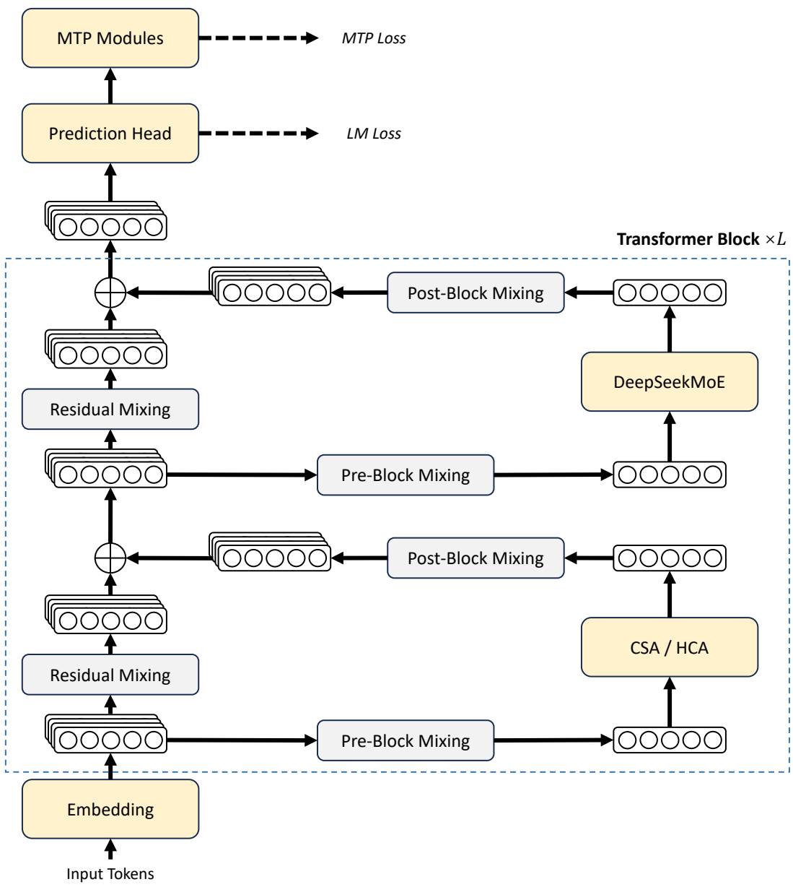


_图 2 | DeepSeek-V4 系列的整体架构。我们在注意力层中使用了混合 CSA（压缩稀疏注意力）和 HCA（重度压缩注意力），在前馈层中使用了 DeepSeekMoE，并通过 mHC 增强了传统的残差连接。_


性能与 GPT-5.2 和 Gemini-3.0-Pro 相当，确立了其作为复杂推理任务高性价比架构的地位。

- **Agent（智能体）**：在公开基准测试中，DeepSeek-V4-Pro-Max 与领先的开源模型（如 Kimi-K2.6 和 GLM-5.1）持平，但略逊于前沿的闭源模型。在我们的内部评估中，DeepSeek-V4-Pro-Max 的表现优于 Claude Sonnet 4.5，并接近 Opus 4.5 的水平。

- **Long-Context（长上下文）**：DeepSeek-V4-Pro-Max 在拥有 100 万 token 上下文窗口的情况下，在合成和实际用例中均表现出色，甚至在学术基准测试中超越了 Gemini-3.1-Pro。

- **DeepSeek-V4-Pro v.s. DeepSeek-V4-Flash**：由于参数规模较小，DeepSeek-V4-Flash-Max 在知识评估中的表现较低。然而，当分配更大的思考预算时，它在推理任务上取得了相当的结果。在智能体评估中，虽然 DeepSeek-V4-Flash-Max 在多个基准测试中与 DeepSeek-V4-Pro-Max 的表现相当，但在更复杂、高难度的任务上仍落后于其更大的同类模型。

# 2. 架构

总体而言，DeepSeek-V4 系列保留了 Transformer (Vaswani et al., 2017) 架构和多令牌预测 (MTP) 模块 (DeepSeek-AI, 2024; Gloeckle et al., 2024)，同时相比 DeepSeek-V3 引入了几个关键升级：(1) 首先，我们引入了流形约束超连接 (mHC) (Xie et al., 2026) 以增强传统的残差连接；

---

(2) 其次，我们设计了一种混合注意力架构，通过压缩稀疏注意力和重度压缩注意力极大地提升了长上下文处理效率。(3) 第三，我们采用 Muon (Jordan et al., 2024; Liu et al., 2025) 作为优化器。对于混合专家（Mixture-of-Experts, MoE）组件，我们仍然采用 DeepSeekMoE (Dai et al., 2024) 架构，仅对 DeepSeek-V3 进行了微调。多令牌预测（Multi-Token Prediction, MTP）(DeepSeek-AI, 2024; Gloeckle et al., 2024; Li et al., 2024; Qi et al., 2020) 的配置与 DeepSeek-V3 保持一致。所有其他未详述的细节均遵循 DeepSeek-V3 (DeepSeek-AI, 2024) 中确立的设置。图 2 展示了 DeepSeek-V4 的整体架构，详情如下所述。


# 2.1. 继承自 DeepSeek-V3 的设计


混合专家。与以往的 DeepSeek 系列模型 (DeepSeek-AI, 2024; DeepSeek-AI, 2024) 一样，DeepSeek-V4 系列也在前馈网络中采用了 DeepSeekMoE 范式 (Dai et al., 2024)，该范式设置了细粒度的路由专家和共享专家。与 DeepSeek-V3 不同，我们将计算亲和得分的激活函数从 Sigmoid(\(\cdot\)) 更改为 Squrt(Softplus(\(\cdot\)))。为了实现负载均衡，我们还采用了无辅助损失策略 (DeepSeek-AI, 2024; Wang et al., 2024a)，并辅以少量的序列级平衡损失，以防止单个序列内出现极端不平衡。对于 DeepSeek-V4，我们移除了对路由目标节点数量的约束，并精心重新设计了并行策略以保持训练效率。此外，与 DeepSeek-V3 相比，我们将初始几个 Transformer 块中的密集 FFN 层替换为采用哈希路由 (Roller et al., 2021) 的 MoE 层。哈希路由策略根据与输入令牌 ID 相关的预定义哈希函数来确定每个令牌的目标专家。


多令牌预测。与 DeepSeek-V3 一样，DeepSeek-V4 系列也设置了 MTP 模块和目标。鉴于 MTP 策略已在 DeepSeek-V3 中得到验证，我们在 DeepSeek-V4 系列中采用了相同的策略而未作修改。


# 2.2. 流形约束超连接


如图 2 所示，DeepSeek-V4 系列引入了流形约束超连接 (Manifold-Constrained Hyper-Connections, mHC) (Xie et al., 2026)，以增强相邻 Transformer 块之间传统的残差连接。与朴素超连接 (Hyper-Connections, HC) (Zhu et al., 2025) 相比，mHC 的核心思想是将残差映射约束到特定的流形上，从而在保持模型表达能力的同时，增强信号跨层传播的稳定性。本小节简要介绍标准 HC，并描述我们如何设计 mHC 以实现稳定训练。


标准超连接。标准 HC 将残差流的宽度扩大了 \( n_{\mathrm{hc}} \) 倍。具体而言，残差流的形状从 \( \mathbb{R}^d \) 扩展到 \( \mathbb{R}^{n_{\mathrm{hc}} \times d} \)，其中 \( d \) 是实际层输入的隐藏层大小。设 \( X_l = [\mathbf{x}_{l,1}; \ldots; \mathbf{x}_{l,n_{\mathrm{hc}}}]^T \in \mathbb{R}^{n_{\mathrm{hc}} \times d} \) 为第 \( l \) 层之前的残差状态。HC 引入了三个线性映射：一个输入映射 \( A_l \in \mathbb{R}^{1 \times n_{\mathrm{hc}}} \)，一个残差变换 \( B_l \in \mathbb{R}^{n_{\mathrm{hc}} \times n_{\mathrm{hc}}} \)，以及一个输出映射 \( C_l \in \mathbb{R}^{n_{\mathrm{hc}} \times 1} \)。残差状态的更新公式为：


$$
X _ {l + 1} = B _ {l} X _ {l} + C _ {l} \mathcal {F} _ {l} (A _ {l} X _ {l}), \tag {1}
$$


其中 \(\mathcal{F}_l\) 表示第 \(l\) 层（例如 MoE 层），其输入和输出形状均为 \(\mathbb{R}^d\)。请注意，实际的层输入 \(A_lX_l \in \mathbb{R}^d\) 也是 \(d\) 维的，因此扩展后的残差

---

---

宽度不会影响内部层的设计。HC 将残差宽度与实际隐藏大小解耦，提供了一条计算开销极小的互补扩展轴，因为 \( n_{\mathrm{hc}} \) 通常远小于隐藏大小 \( d \)。然而，尽管 HC 在提升模型性能方面表现出了潜力，我们发现当堆叠多层时，训练过程经常会出现数值不稳定，这阻碍了 HC 的扩展。

流形约束残差映射。mHC 的核心创新在于将残差映射矩阵 \(B_{l}\) 约束在双随机矩阵流形（Birkhoff 多面体）\(\mathcal{M}\) 上，从而增强信号跨层传播的稳定性：

$$
B _ {l} \in \mathcal {M} := \{M \in \mathbb {R} ^ {n \times n} \mid M \mathbf {1} _ {n} = \mathbf {1} _ {n}, \mathbf {1} _ {n} ^ {T} M = \mathbf {1} _ {n} ^ {T}, M \geqslant 0 \}. \tag {2}
$$

该约束确保映射矩阵的谱范数 \(\| B_l\| _2\) 有界于 1，因此残差变换是非扩展的，这增加了前向传播和反向传播期间的数值稳定性。此外，集合 \(\mathcal{M}\) 在乘法运算下是封闭的，这保证了在深层 mHC 堆叠场景下的稳定性。另外，输入变换 \(A_{l}\) 和输出变换 \(C_l\) 也通过 Sigmoid 函数被约束为非负且有界的，以避免信号抵消的风险。

动态参数化。三个线性映射的参数是动态生成的，它们被分解为一个动态（输入依赖）分量和一个静态（输入无关）分量。给定输入 \( X_{l} \in \mathbb{R}^{n_{\mathrm{hc}} \times d} \)，首先将其展平并归一化：\( \hat{X}_{l} = \mathrm{RMSNorm}(\mathrm{vec}(X_{l})) \in \mathbb{R}^{1 \times n_{\mathrm{hc}}d} \)。然后，我们遵循常规 HC 的方法生成无约束的原始参数 \( \tilde{A}_{l} \in \mathbb{R}^{1 \times n_{\mathrm{hc}}}, \tilde{B}_{l} \in \mathbb{R}^{n_{\mathrm{hc}} \times n_{\mathrm{hc}}} \) 和 \( \tilde{C}_{l} \in \mathbb{R}^{n_{\mathrm{hc}} \times 1} \)：

$$
\tilde {A} _ {l} = \alpha_ {l} ^ {\mathrm {p r e}} \cdot (\hat {X} _ {l} W _ {l} ^ {\mathrm {p r e}}) + S _ {l} ^ {\mathrm {p r e}}, \tag {3}
$$

$$
\tilde {B} _ {l} = \alpha_ {l} ^ {\mathrm {r e s}} \cdot \operatorname {M a t} \left(\hat {X} _ {l} W _ {l} ^ {\mathrm {r e s}}\right) + S _ {l} ^ {\mathrm {r e s}}, \tag {4}
$$

$$
\tilde {C} _ {l} = \alpha_ {l} ^ {\mathrm {p o s t}} \cdot (\hat {X} _ {l} W _ {l} ^ {\mathrm {p o s t}}) ^ {T} + S _ {l} ^ {\mathrm {p o s t}}, \tag {5}
$$

其中 \(W_{l}^{\mathrm{pre}}, W_{l}^{\mathrm{post}} \in \mathbb{R}^{n_{\mathrm{hc}}d \times n_{\mathrm{hc}}}\) 和 \(W_{l}^{\mathrm{res}} \in \mathbb{R}^{n_{\mathrm{hc}}d \times n_{\mathrm{hc}}^{2}}\) 是用于生成动态分量的可学习参数；\(\operatorname{Mat}(\cdot)\) 将大小为 \(1 \times n_{\mathrm{hc}}^{2}\) 的向量重塑为大小为 \(n_{\mathrm{hc}} \times n_{\mathrm{hc}}\) 的矩阵；\(S_{l}^{\mathrm{pre}} \in \mathbb{R}^{1 \times n_{\mathrm{hc}}}, S_{l}^{\mathrm{post}} \in \mathbb{R}^{n_{\mathrm{hc}} \times 1}\) 和 \(S_{l}^{\mathrm{res}} \in \mathbb{R}^{n_{\mathrm{hc}} \times n_{\mathrm{hc}}}\) 是可学习的静态偏置；\(\alpha_{l}^{\mathrm{pre}}, \alpha_{l}^{\mathrm{res}}, \alpha_{l}^{\mathrm{post}} \in \mathbb{R}\) 是初始化为小值的可学习门控因子。

应用参数约束。在获得无约束的原始参数 \(\tilde{A}_l, \tilde{B}_l, \tilde{C}_l\) 后，我们对其应用前述约束以增强数值稳定性。具体而言，对于输入和输出映射，我们采用 Sigmoid 函数 \(\sigma(\cdot)\) 来确保其非负性和有界性：

$$
A _ {l} = \sigma (\tilde {A} _ {l}), \tag {6}
$$

$$
C _ {l} = 2 \sigma (\tilde {C} _ {l}). \tag {7}
$$

对于残差映射 \(\tilde{B}_l\)，我们将其投影到双随机矩阵流形 \(\mathcal{M}\) 上。这是通过 Sinkhorn-Knopp 算法实现的，该算法首先对 \(\tilde{B}_l\) 施加指数函数以确保正定性，得到 \(M^{(0)} = \exp (\tilde{B}_l)\)，然后迭代执行列归一化和行归一化：

$$
M ^ {(t)} = \mathcal {T} _ {r} \left(\mathcal {T} _ {c} \left(M ^ {(t - 1)}\right)\right), \tag {8}
$$

其中 \(\mathcal{T}_r\) 和 \(\mathcal{T}_c\) 分别表示行归一化和列归一化。该迭代收敛于一个受约束的双随机矩阵 \(B_l = M^{(t_{\max})}\)。我们选择 \(t_{\max} = 20\) 作为一个实用值。

---

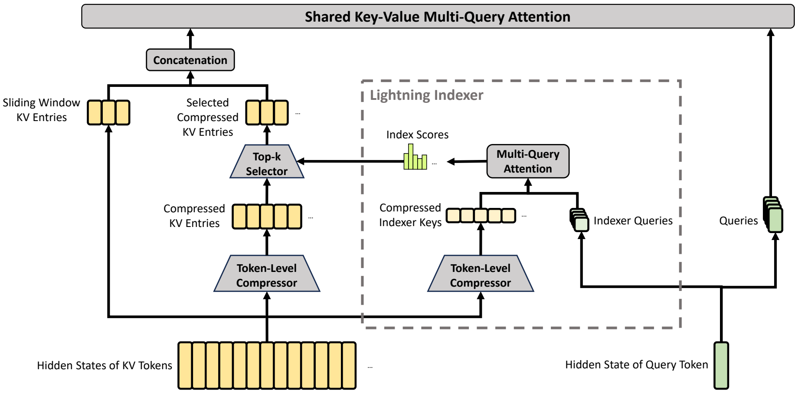


_图 3 | CSA 的核心架构。它将 KV 条目的数量压缩为原来的 \(\frac{1}{m}\)，然后应用 DeepSeek 稀疏注意力以进一步加速。此外，一小部分滑动窗口 KV 条目与选定的压缩 KV 条目相结合，以增强局部的细粒度依赖关系。_


# 2.3. CSA 与 HCA 的混合注意力


随着上下文长度达到极端规模，注意力机制成为模型中主要的计算瓶颈。对于 DeepSeek-V4，我们设计了两种高效的注意力架构——压缩稀疏注意力（CSA）和重度压缩注意力（HCA）——并采用了它们的交错混合配置，这显著降低了长文本场景下注意力的计算成本。CSA 结合了压缩和稀疏注意力策略：它首先将每 \( m \) 个 Token 的键值（KV）缓存压缩为一个条目，然后应用 DeepSeek 稀疏注意力（DSA）（DeepSeek-AI, 2025），其中每个查询 Token 仅关注 \( k \) 个压缩后的 KV 条目。HCA 旨在通过将每 \( m' \) (\( \gg m \)) 个 Token 的 KV 缓存合并为一个条目来实现极致压缩。CSA 和 HCA 的混合架构显著提升了 DeepSeek-V4 系列的长上下文效率，使得百万级 Token 的上下文在实践中成为可能。本小节介绍了我们混合注意力架构的核心技术，我们还提供了开源实现<sup>1</sup>以明确说明更多细节。


# 2.3.1. 压缩稀疏注意力


CSA 的核心架构如图 3 所示，它首先将每 \( m \) 个 Token 的 KV 缓存压缩为一个条目，然后应用 DeepSeek 稀疏注意力进行进一步加速。


压缩键值条目。设 \( H \in \mathbb{R}^{n \times d} \) 为输入隐藏状态序列，其中 \( n \) 为序列长度，\( d \) 为隐藏层大小。CSA 首先计算两个系列的 KV 条目 \( C^a, C^b \in \mathbb{R}^{n \times c} \) 及其对应的压缩权重 \( Z^a, Z^b \in \mathbb{R}^{n \times c} \)，其中 \( c \) 为注意力头维度


<https://huggingface.co/deepseek-ai/DeepSeek-V4-Pro/tree/main/inference>

---

---

维度：

$$
C ^ {a} = H \cdot W ^ {a K V}, \quad C ^ {b} = H \cdot W ^ {b K V}, \tag {9}
$$

$$
Z ^ {a} = H \cdot W ^ {a Z}, \qquad Z ^ {b} = H \cdot W ^ {b Z}, \tag {10}
$$

其中 \( W^{aKV}, W^{bKV}, W^{aZ}, W^{bZ} \in \mathbb{R}^{d \times c} \) 是可训练参数。接下来，\( C^a \) 和 \( C^b \) 中的每 \( m \) 个 KV 条目将根据其压缩权重和可学习的位置偏置 \( B^a, B^b \in \mathbb{R}^{m \times c} \) 压缩为一个条目，生成 \( C^{\mathrm{Comp}} \in \mathbb{R}_{\frac{n}{m}}^{\times c} \)。每个压缩条目 \( C_i^{\mathrm{Comp}} \in \mathbb{R}^c \) 的计算方式如下：

$$
\left[ S _ {m i: m (i + 1) - 1} ^ {a}; S _ {m (i - 1): m i - 1} ^ {b} \right] = \operatorname {S o f t m a x} _ {\mathrm {r o w}} \big ([ Z _ {m i: m (i + 1) - 1} ^ {a} + B ^ {a}; Z _ {m (i - 1): m i - 1} ^ {b} + B ^ {b} ] \big), \tag {11}
$$

$$
C _ {i} ^ {\mathrm {C o m p}} = \sum_ {j = m i} ^ {m (i + 1) - 1} S _ {j} ^ {a} \odot C _ {j} ^ {a} + \sum_ {j = m (i - 1)} ^ {m i - 1} S _ {j} ^ {b} \odot C _ {j} ^ {b}, \tag {12}
$$

其中 \(\odot\) 表示哈达玛积；\(\mathrm{Softmax}_{\mathrm{row}}(\cdot)\) 表示沿行维度的 softmax 操作，即对来自 \( Z^a \) 和 \( Z^b \) 的总共 \( 2m \) 个元素进行归一化。当 \( i = 0 \) 时，\( Z_{m(i - 1):mi - 1}^b \) 用负无穷大填充，\( C_{m(i - 1):mi - 1}^b \) 用零填充。请注意，每个 \( C_i^{\mathrm{Comp}} \) 都源自 \( 2m \) 个 KV 条目，但用于计算 \( C_i^{\mathrm{Comp}} \) 的 \( C^b \) 索引与用于计算 \( C_{i - 1}^{\mathrm{Comp}} \) 的 \( C^a \) 索引是重叠的。因此，CSA 实际上将序列长度压缩到了原来的 \( \frac{1}{m} \)。

**用于稀疏选择的闪电索引器。** 在获得压缩后的 KV 条目 \( C^{\mathrm{Comp}} \) 后，CSA 应用 DSA 策略来选择 top-k 个压缩 KV 条目用于核心注意力。首先，CSA 执行与用于 \( C^{\mathrm{Comp}} \) 相同的压缩操作，以获得压缩的索引器键 \( K^{\mathrm{IComp}} \in \mathbb{R}_{m}^{\frac{n}{2} \times c^{I}} \)，其中 \( c^{I} \) 是索引器头维度。然后，对于查询 token \( t \)，我们以低秩方式生成索引器查询 \( \{\mathbf{q}_{t,1}^{I}; \mathbf{q}_{t,2}^{I}; \dots; \mathbf{q}_{t,n_{h}^{I}}^{I}\} \)：

$$
\mathbf {c} _ {t} ^ {Q} = \mathbf {h} _ {t} \cdot W ^ {D Q}, \tag {13}
$$

$$
[ \mathbf {q} _ {t, 1} ^ {I}; \mathbf {q} _ {t, 2} ^ {I}; \dots ; \mathbf {q} _ {t, n _ {h} ^ {I}} ^ {I} ] = \mathbf {q} _ {t} ^ {I} = \mathbf {c} _ {t} ^ {Q} \cdot W ^ {I U Q}, \tag {14}
$$

其中 \(\mathbf{h}_t \in \mathbb{R}^d\) 是查询 token \( t \) 的输入隐藏状态；\(\mathbf{c}_t^Q \in \mathbb{R}^{d_c}\) 是查询的压缩潜在向量；\( d_c \) 表示查询压缩维度；\( n_h^I \) 表示索引器查询头的数量；\( W^{DQ} \in \mathbb{R}^{d \times d_c} \) 和 \( W^{IUQ} \in \mathbb{R}^{d_c \times c^IN_h^I} \) 分别是索引器查询的下投影和上投影矩阵。接下来，查询 token \( t \) 与先前的压缩块 \( s \) （\( s < \text{Floor}(\frac{t}{m}) \)）之间的索引分数 \( I_{t,s} \in \mathbb{R} \) 计算如下：

$$
\left[ w _ {t, 1} ^ {I}; w _ {t, 2} ^ {I}; \dots ; w _ {t, n _ {h} ^ {I}} ^ {I} \right] = \mathbf {w} _ {t} ^ {I} = \mathbf {h} _ {t} \cdot W ^ {\omega}, \tag {15}
$$

$$
I _ {t, s} = \sum_ {h = 1} ^ {n _ {h} ^ {I}} w _ {t, h} ^ {I} \cdot \operatorname {R e L U} \left(\mathbf {q} _ {t, h} ^ {I} \cdot K _ {s} ^ {\mathrm {I C o m p}}\right), \tag {16}
$$

其中 \( W^{w} \in \mathbb{R}^{d \times n_{h}^{I}} \) 是可学习矩阵；\( w_{t,h}^{I} \in \mathbb{R} \) 是第 \( h \) 个索引器头的权重。对于查询 token \( t \)，给定其索引分数 \( I_{t,:} \)，我们采用 top-k 选择器来选择性地保留压缩 KV 条目的一个子集 \( C_{t}^{\mathrm{SprsComp}} \) 用于后续的核心注意力：

$$
C _ {t} ^ {\mathrm {S p r s C o m p}} = \left\{C _ {s} ^ {\mathrm {C o m p}} \Bigg | I _ {t, s} \in \operatorname {T o p -k} (I _ {t,:}) \right\}. \tag {17}
$$

---

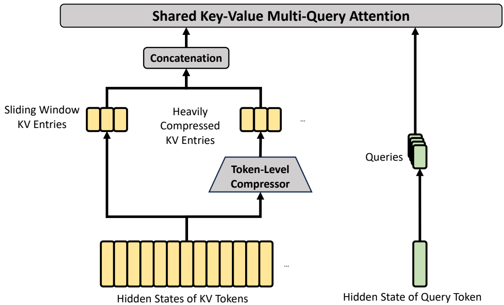


_图 4 | HCA 的核心架构。它执行更重的压缩，其中 \( m' \) (\( \gg m \)) 个 Token 的 KV 条目将被合并为一个。此外，我们还额外引入了一小组滑动窗口 KV 条目以增强局部细粒度的依赖关系。_


共享键值多头查询注意力。在选择稀疏 KV 条目后，CSA 以多头查询注意力（MQA）(Shazeer, 2019) 的方式执行核心注意力，其中 \( C_t^{\text{SprsComp}} \) 中的每个压缩 KV 条目同时作为注意力的键和值。具体而言，对于查询 Token \( t \)，我们首先从压缩潜在向量 \( \mathbf{c}_t^Q \) 生成注意力查询 \(\{\mathbf{q}_{t,1};\mathbf{q}_{t,2};\dots;\mathbf{q}_{t,n_h}\}\)：


$$
\left[ \mathbf {q} _ {t, 1}; \mathbf {q} _ {t, 2}; \dots ; \mathbf {q} _ {t, n _ {h}} \right] = \mathbf {q} _ {t} = \mathbf {c} _ {t} ^ {Q} \cdot W ^ {U Q}, \tag {18}
$$


其中 \(n_h\) 表示查询头的数量；\(W^{UQ} \in \mathbb{R}^{d_c \times cn_h}\) 是查询的上投影矩阵。请注意，潜在查询向量 \(\mathbf{c}_t^Q\) 与用于索引器查询的向量共享。接下来，我们在 \(\{\mathbf{q}_{t,i}\}\) 和 \(C_t^{\mathrm{SprsComp}}\) 上执行 MQA：


$$
\mathbf {o} _ {t, i} = \operatorname {C o r e A t t n} \left(\text {q u e r y} = \mathbf {q} _ {t, i}, \text {k e y} = C _ {t} ^ {\text {S p r s C o m p}}, \text {v a l u e} = C _ {t} ^ {\text {S p r s C o m p}}\right), \tag {19}
$$


其中 \(\mathbf{o}_{t,i} \in \mathbb{R}^c\) 是第 \(t\) 个 Token 在第 \(i\) 个头上的核心注意力输出；CoreAttn(\(\cdot\)) 表示核心注意力操作。


分组输出投影。在 DeepSeek-V4 的配置中，\(cn_h\) 相当大。因此，将核心注意力操作 \([\mathbf{o}_{t,1};\mathbf{o}_{t,2};\dots;\mathbf{o}_{t,n_h}] = \mathbf{o}_t\in \mathbb{R}^{cn_h}\) 的输出直接投影到 \(d\) 维隐藏状态将带来巨大的计算负担。为了缓解这一开销，我们设计了一种分组输出投影策略。具体而言，我们首先将 \(n_h\) 个输出分为 \(g\) 组，然后对于每一组输出 \(\mathbf{o}_{t,i}^{G}\in \mathbb{R}^{c\frac{n_{h}}{g}}\)，我们将其投影到一个 \(d_g\) 维的中间输出 \(\mathbf{o}_{t,i}^{G^{\prime}}\in \mathbb{R}^{d_g}\)，其中 \(d_g < c\frac{n_h}{g}\)。最后，我们将中间输出 \([\mathbf{o}_{t,1}^{G^{\prime}};\mathbf{o}_{t,2}^{G^{\prime}};\dots;\mathbf{o}_{t,g}^{G^{\prime}}]\in \mathbb{R}^{d_{g}g}\) 投影为最终的注意力输出 \(\hat{\mathbf{o}}_t\in \mathbb{R}^d\)。


# 2.3.2. 重度压缩注意力


HCA 的核心架构如图 4 所示，它以更重的方式压缩 KV 缓存，但不采用稀疏注意力。


压缩键值条目。总的来说，HCA 的压缩策略与 CSA 类似，但采用了更大的压缩率 \( m' \) (\( \gg m \)) 并且不执行重叠

---

压缩。设 \( H \in \mathbb{R}^{n \times d} \) 为输入隐藏状态序列，HCA 首先计算原始 KV 条目 \( C \in \mathbb{R}^{n \times c} \) 及其对应的压缩权重 \( Z \in \mathbb{R}^{n \times c} \)：


$$
C = H \cdot W ^ {K V}, \tag {20}
$$


$$
Z = H \cdot W ^ {Z}, \tag {21}
$$


其中 \( W^{KV}, W^{Z} \in \mathbb{R}^{d \times c} \) 是可训练参数。接下来，\( C \) 中的每 \( m' \) 个 KV 条目将根据压缩权重和可学习的位置偏置 \( B \in \mathbb{R}^{m' \times c} \) 被压缩为一个，生成 \( C^{\mathrm{Comp}} \in \mathbb{R}^{\frac{n}{m'} \times c} \)。每个压缩条目 \( C_i^{\mathrm{Comp}} \in \mathbb{R}^c \) 的计算方式为


$$
S _ {m ^ {\prime} i: m ^ {\prime} (i + 1) - 1} = \operatorname {S o f t m a x} _ {\text {r o w}} \left(Z _ {m ^ {\prime} i: m ^ {\prime} (i + 1) - 1} + B\right), \tag {22}
$$


$$
C _ {i} ^ {\text {C o m p}} = \sum_ {j = m ^ {\prime} i} ^ {m ^ {\prime} (i + 1) - 1} S _ {j} \odot C _ {j}. \tag {23}
$$


通过这种压缩操作，HCA 将序列长度压缩为原来的 \(\frac{1}{m^{\prime}}\)。


共享键值 MQA 与分组输出投影。与 CSA 类似，HCA 也采用了共享 KV MQA 和分组输出投影策略。在 KV 压缩之后，对于查询 token \( t \)，HCA 首先以低秩方式生成注意力查询 \(\{\mathbf{q}_{t,1};\mathbf{q}_{t,2};\dots ;\mathbf{q}_{t,n_h}\}\)：


$$
\mathbf {c} _ {t} ^ {Q} = \mathbf {h} _ {t} \cdot W ^ {D Q}, \tag {24}
$$


$$
\left[ \mathbf {q} _ {t, 1}; \mathbf {q} _ {t, 2}; \dots ; \mathbf {q} _ {t, n _ {h}} \right] = \mathbf {q} _ {t} = \mathbf {c} _ {t} ^ {Q} \cdot W ^ {U Q}, \tag {25}
$$


其中 \(\mathbf{h}_t \in \mathbb{R}^d\) 是查询 token \(t\) 的输入隐藏状态；\(n_h\) 表示查询头的数量；\(W^{DQ} \in \mathbb{R}^{d \times d_c}\) 和 \(W^{UQ} \in \mathbb{R}^{d_c \times cn_h}\) 分别是查询的下投影和上投影矩阵。接下来，我们在 \(\{\mathbf{q}_{t,i}\}\) 和 \(C^{\mathrm{Comp}}\) 上执行 MQA：


$$
\mathbf {o} _ {t, i} = \operatorname {C o r e A t t n} \left(\text {q u e r y} = \mathbf {q} _ {t, i}, \text {k e y} = C ^ {\text {C o m p}}, \text {v a l u e} = C ^ {\text {C o m p}}\right), \tag {26}
$$


其中 \(\mathbf{o}_{t,i} \in \mathbb{R}^c\) 是第 \(t\) 个 token 处第 \(i\) 个头的核心注意力输出。接下来，与 CSA 类似，HCA 将 \(n_h\) 个输出分为 \(g\) 组，对于每组输出 \(\mathbf{o}_{t,i}^G \in \mathbb{R}^{c\frac{n_h}{g}}\)，HCA 将其投影为一个 \(d_g\) 维的中间输出 \(\mathbf{o}_{t,i}^{G'} \in \mathbb{R}^{d_g}\)，其中 \(d_g < c\frac{n_h}{g}\)。最后，HCA 将中间输出 \([\mathbf{o}_{t,1}^{G'}, \mathbf{o}_{t,2}', \dots; \mathbf{o}_{t,g}^{G'}] \in \mathbb{R}^{d_{g}g}\) 投影为最终的注意力输出 \(\hat{\mathbf{o}}_t \in \mathbb{R}^d\)。


# 2.3.3. 其他细节

除了上述 CSA 和 HCA 的核心架构外，我们的混合注意力机制还结合了其他几种技术。为了行文清晰，我们在上述介绍中省略了这些附加技术，并将在本小节中简要描述它们。此外，本小节仅关注它们的核心思想，为简洁起见可能会省略一些细微细节。我们鼓励读者参考我们的开源实现以获取确切的细节。


查询与键值条目归一化。对于 CSA 和 HCA，我们都在核心注意力操作之前，对每个查询头和压缩后的 KV 条头执行了一次额外的 RMSNorm 操作。这种归一化操作可以避免注意力 logits 的爆炸，并可能提高训练的稳定性。

---

部分旋转位置编码。对于 CSA 和 HCA，我们在注意力查询、KV 条目以及核心注意力输出上部分应用旋转位置编码（RoPE）(Su et al., 2024)。具体而言，对于 CSA 和 HCA 中使用的每个查询向量和 KV 条目向量，我们对其最后 64 个维度应用 RoPE。由于 KV 条目同时充当注意力键和值，朴素的核心注意力输出 \(\{\mathbf{o}_{t,i}\}\) 将携带绝对位置编码，这是由 KV 条目的加权和导出的。作为对策，我们还在每个 \(\mathbf{o}_{t,i}\) 的最后 64 个维度上应用位置为 \(-i\) 的 RoPE。通过这种方式，核心注意力的输出也将携带相对位置编码——即每个 KV 条目对核心注意力输出的贡献也将与查询和该 KV 条目之间的距离相关。


滑动窗口注意力的附加分支。为了在 CSA 和 HCA 中严格保持因果性，每个查询仅关注先前的压缩 KV 块。因此，查询无法访问其自身压缩块内其他标记的信息。同时，在语言建模中，最近的标记通常与查询标记具有更高的相关性。出于这些原因，我们以滑动窗口的方式为 CSA 和 HCA 引入了一个辅助注意力分支，以更好地对局部依赖关系进行建模。具体而言，对于每个查询标记，我们额外生成对应于最近 \( n_{\mathrm{win}} \) 个标记的 \( n_{\mathrm{win}} \) 个未压缩 KV 条目。在 CSA 和 HCA 的核心注意力中，这些滑动窗口中的 KV 条目将与压缩后的 KV 条目一起使用。


注意力汇。在 CSA 和 HCA 的核心注意力中，我们采用了注意力汇（Attention Sink）的技巧 (OpenAI, 2025; Xiao et al., 2024)。具体而言，我们设置了一系列可学习的汇 Logits \(\{z_{1}^{\prime}, z_{2}^{\prime}, \dots, z_{n_{h}}^{\prime}\}\)。对于第 \(h\) 个注意力头，\(\mathrm{Exp}(z_{h}^{\prime})\) 将被加到注意力分数的分母上：


$$
s _ {h, i, j} = \frac {\operatorname {E x p} (z _ {h , i , j})}{\sum_ {k} \operatorname {E x p} (z _ {h , i , k}) + \operatorname {E x p} (z _ {h} ^ {\prime})}, \tag {27}
$$


其中 \( s_{h,i,j}, z_{h,i,j} \in \mathbb{R} \) 表示第 \( i \) 个查询标记与第 \( j \) 个先前标记或压缩块之间第 \( h \) 个注意力头的注意力分数和注意力 Logit。该技术允许每个查询头将其总注意力分数调整为不等于 1，甚至接近于 0。


# 2.3.4. 效率讨论


由于采用了混合 CSA 和 HCA，并结合了低精度计算和存储，DeepSeek-V4 系列的注意力模块在注意力 FLOPs 和 KV 缓存大小方面实现了显著的效率，特别是在长上下文场景中。首先，我们采用混合存储格式来存储 KV 条目：旋转位置编码（RoPE）维度使用 BF16 精度，而其余维度应用 FP8 精度。与纯 BF16 存储相比，这种混合表示将 KV 缓存大小减少了近一半。其次，闪电索引器（Lightning Inker）内部的注意力计算以 FP4 精度执行，这加速了超长上下文下的注意力操作。第三，相对于 DeepSeek-V3.2，DeepSeek-V4 系列选择了更小的注意力 top-k 值，从而提高了模型在短文本和中长度文本上的效率。最后，也是最重要的一点，压缩注意力和混合注意力技术大幅减少了 KV 缓存大小和计算 FLOPs。


以 BF16 GQA8 (Ainslie et al., 2023)（头维度为 128）作为基线——这是 LLM 注意力的常见配置之一——在 1M 上下文设置下，DeepSeek-V4 系列的 KV 缓存大小可以大幅降低至该基线的约 \(2\%\)。

---

---

**算法 1 DeepSeek-V4 的 Muon 优化器**


```
要求: 学习率 \(\eta\), 动量 \(\mu\), 权重衰减 \(\lambda\), 更新重缩放因子 \(\gamma\)  
1: for each training step \(t\) do  
2: for each logically independent weight \(W \in \mathbb{R}^{n \times m}\) do  
3: \(G_{t} = \nabla_{W} \mathcal{L}_{t}(W_{t-1})\)  
4: \(M_{t} = \mu M_{t-1} + G_{t}\)  
5: \(O_{t}' = \text{Hybrid NewtonSchulz}(\mu M_{t} + G_{t})\)  
6: \(O_{t} = O_{t}' \cdot \sqrt{\max(n, m)} \cdot \gamma\)  
7: \(W_{t} = W_{t-1} \cdot (1 - \eta \lambda) - \eta O_{t}\)  
8: end for  
9: end for
```


此外，即使与 DeepSeek-V3.2 (DeepSeek-AI, 2025) —— 已经是一个高效的基线 —— 相比，DeepSeek-V4 系列在效率方面仍然表现出显著优势。图 1 的右侧部分提供了它们推理 FLOPs 和 KV 缓存大小的比较。


# 2.4. Muon 优化器


我们在 DeepSeek-V4 系列的大多数模块中采用 Muon (Jordan et al., 2024; Liu et al., 2025) 优化器，因为它具有更快的收敛速度和更好的训练稳定性。我们 Muon 优化的完整算法总结在算法 1 中。


基础配置。我们为嵌入模块、预测头模块、mHC 模块的静态偏置和门控因子以及所有 RMSNorm 模块的权重保留 AdamW (Loshchilov and Hutter, 2017) 优化器。所有其他模块使用 Muon 进行更新。遵循 Liu et al. (2025)，我们也对 Muon 参数应用权重衰减，使用 Nesterov (Jordan et al., 2024; Nesterov, 1983) 技巧，并重缩放更新矩阵的均方根 (RMS) 以复用我们的 AdamW 超参数。与他们不同的是，我们使用混合 Newton-Schulz 迭代进行正交化。


混合 Newton-Schulz 迭代。对于给定的矩阵 \(M\))，设其奇异值分解 (SVD) 为 \(M = U\Sigma V^T\)。Newton-Schulz 迭代旨在将 \(M\) 近似正交化为 \(UV^T\)。通常，\(M\) 会首先被归一化为 \(M_0 = M / ||M||_F\)，以确保其最大奇异值不超过 1。然后，每次 Newton-Schulz 迭代执行以下操作：


$$
M _ {k} = a M _ {k - 1} + b (M _ {k - 1} M _ {k - 1} ^ {T}) M _ {k - 1} + c (M _ {k - 1} M _ {k - 1} ^ {T}) ^ {2} M _ {k - 1}. \tag {28}
$$


我们的混合 Newton-Schulz 在两个不同的阶段执行 10 次迭代。在前 8 步中，我们使用系数 \((a,b,c) = (3.4445, -4.7750, 2.0315)\) 来驱动快速收敛，使奇异值接近 1。在最后 2 步中，我们切换到系数 \((a,b,c) = (2, -1.5, 0.5)\)，这将奇异值精确地稳定在 1。


避免注意力 Logits 爆炸。DeepSeek-V4 系列的注意力架构允许我们直接在注意力查询和 KV 条目上应用 RMSNorm，这有效地防止了注意力 logits 爆炸。因此，我们没有在 Muon 优化器中采用 QK-Clip 技术 (Liu et al., 2025)。

---

---

# 3. 通用基础设施

# 3.1. 专家并行中的细粒度通信与计算重叠

混合专家模型可以通过专家并行来加速。然而，EP 需要复杂的节点间通信，并对互连带宽和延迟提出了极高的要求。为了缓解 EP 中的通信瓶颈，并在更低的互连带宽需求下实现更高的端到端性能，我们提出了一种细粒度的 EP 方案，该方案将通信和计算融合到单个流水线核中，以实现通信与计算的重叠。

通信延迟可以被隐藏。我们 EP 方案的核心洞察在于，通信延迟可以有效地隐藏在 MoE 层的计算之下。如图 5 所示，在 DeepSeek-V4 系列中，每个 MoE 层主要可以分解为四个阶段：两个通信密集型阶段 Dispatch 和 Combine，以及两个计算密集型阶段 Linear-1 和 Linear-2。我们的性能分析表明，在单个 MoE 层内，通信的总时间少于计算的总时间。因此，在将通信和计算融合到统一的流水线后，计算仍然是主要的瓶颈，这意味着系统可以在不降低端到端性能的情况下容忍更低的互连带宽。

_(a) 朴素方案_


_(b) Comet_


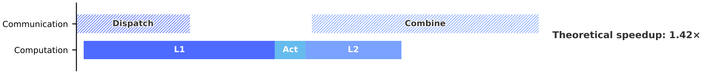


_(c) 本方案_


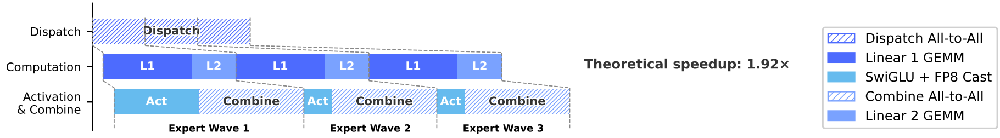


_图 5 | 我们的 EP 方案与相关工作的对比示意图。Comet (Zhang et al., 2025b) 分别将 Dispatch 与 Linear-1 重叠，以及 Linear-2 与 Combine 重叠。我们的 EP 方案通过将专家拆分并调度为波次，实现了更细粒度的重叠。理论加速比是在 DeepSeek-V4-Flash 架构配置下评估的。_


细粒度 EP 方案。为了进一步降低互连带宽需求并放大重叠带来的收益，我们引入了一种更细粒度的专家划分方案。受许多相关工作的启发 (Aimuyo et al., 2025; Zhang et al., 2025b)，我们将专家拆分并调度为波次。每个波次由一小部分专家组成。一旦波次内的所有专家完成了通信，计算就可以立即开始，而无需等待其他专家。在稳态下，当前波次的计算、下一波次的 Token 传输以及已完成专家的结果发送均并发进行，如图 5 所示。这在专家之间形成了一条细粒度的流水线，使得计算和通信在整个波次期间保持连续。这种基于波次的调度加速了

---

在强化学习（RL）交互等极端情况下的性能表现，这类场景通常会遇到长尾小批次问题。


**性能与开源 Mega-Kernel。** 我们在 NVIDIA GPU 和华为 Ascend NPU 平台上验证了细粒度的 EP 方案。与强大的非融合基线相比，它在通用推理工作负载中实现了 \(1.50 \sim 1.73 \times\) 的加速，而在 RL 交互和高速智能体服务等延迟敏感场景中加速比最高可达 \(1.96 \times\)。我们已经开源了基于 CUDA 的 mega-kernel 实现，并将其命名为 MegaMoE²，作为 DeepGEMM 的一个组件。


**观察与建议。** 我们分享了内核开发过程中的观察与经验教训，并向硬件厂商提出了一些建议，以期辅助高效的硬件设计并实现更好的软硬协同设计：


- **计算通信比。** 完全的通信与计算重叠取决于计算通信比，而不仅仅取决于带宽。记峰值计算吞吐量为 \(C\)，互连带宽为 \(B\)，当满足 \(C / B \leqslant V_{\mathrm{comp}} / V_{\mathrm{comm}}\) 时，通信可以被完全隐藏，其中 \(V_{\mathrm{comp}}\) 表示计算量，\(V_{\mathrm{comm}}\) 表示通信量。对于 DeepSeek-V4-Pro，每个 token-expert 对需要 6hd FLOPs（SwiGLU gate、up 和 down 投影），但仅需 3h 字节的通信（FP8 Dispatch + BF16 Combine），这简化为：


$$
\frac {C}{B} \leqslant 2 d = 6 1 4 4 \mathrm {F L O P s / B y t e}.
$$


也就是说，每 1 GBps 的互连带宽足以隐藏 6.1 TFLOP/s 计算量的通信开销。一旦带宽达到这个阈值，它就不再是瓶颈，继续投入额外的硅面积来增加带宽只会带来收益递减。我们鼓励未来的硬件设计以这种平衡点为目标，而不是无条件地扩展带宽。


- **功耗预算。** 极致的内核融合会同时驱动计算、内存和网络达到高负载，使得功耗节流成为限制性能的关键因素。我们建议未来的硬件设计为这种完全并发的工作负载提供充足的功率余量。


- **通信原语。** 我们采用基于拉取的方法，即每个 GPU 主动从远程 GPU 读取数据，从而避免了细粒度推送所带来的高通知延迟。如果未来的硬件具备更低延迟的跨 GPU 信令机制，将使推送模式变得可行，并能够实现更自然的通信模式。


- **激活函数。** 我们建议用低成本逐元素激活函数替换 SwiGLU，该函数不涉及指数或除法运算。这直接减轻了 GEMM 后处理的负担，并且在相同的参数预算下，移除门控投影可以增大中间维度 \(d\)，从而进一步放宽带宽要求。


# 3.2. 使用 TileLang 进行灵活且高效的内核开发


在实践中，我们精心设计的模型架构原本会产生数百个细粒度的 Torch ATen 算子。我们采用 TileLang (Wang et al., 2026) 开发了一套融合内核来替代其中的绝大多数，从而以最小的代价实现了最优的性能。它


\(^{2}\)https://github.com/deepseek-ai/DeepGEMM/pull/304

---

---

还使我们能够在验证期间快速构建算子原型，例如注意力机制的变体。这些内核在模型架构开发、大规模训练以及最终的推理服务生产部署中发挥着关键作用。作为一种领域特定语言（DSL），TileLang 在开发生产力与运行时效率之间取得了平衡，既支持快速开发，又能在同一代码库内支持深度的迭代优化。此外，我们与 TileLang 社区紧密合作，致力于打造更加敏捷、高效且稳定的内核开发工作流。

利用宿主代码生成降低调用开销。随着加速器性能的持续提升，CPU 侧的编排开销变得日益显著。对于小型且高度优化的内核而言，这种固定的宿主开销很容易限制利用率和吞吐量。这种开销的一个常见来源是，宿主侧逻辑（例如运行时契约检查）通常为了灵活性而使用 Python 编写，因此会产生固定的每次调用成本。

我们利用宿主代码生成来缓解这种开销，将大部分宿主侧逻辑移入生成的宿主代码中。具体而言，我们首先在 IR（中间表示）级别协同生成设备内核和一个轻量级的宿主启动器，并嵌入从语言前端解析出的必要元数据——例如数据类型、秩/形状约束以及步长/布局假设。随后，该启动器被降级为构建在 TVM-FFI (Chen et al., 2018) 框架之上的宿主源代码，其紧凑的调用约定和零拷贝张量互操作性共同最小化了宿主侧开销。在运行时，这段生成的宿主代码执行验证和参数编组，将所有每次调用的检查移出 Python 执行路径。我们的测量结果表明，CPU 侧的验证开销从每次调用数十或数百微秒降至不到一微秒。

SMT 求解器辅助的形式化整数分析。TileLang 内核涉及复杂的张量索引算术，这需要强大的形式化整数分析能力。在布局推断、内存冒险检测和边界分析等编译过程中，编译器必须验证整数表达式是否满足特定属性，以启用相应的优化。因此，更强的形式化分析能力可以解锁更高级、更复杂的优化机会。

为此，我们将 Z3 SMT 求解器 (De Moura and Bjørner, 2008) 集成到 TileLang 的代数系统中，为张量程序中的大多数整数表达式提供形式化分析能力。通过将 TileLang 的整数表达式转换为 Z3 的无量词非线性整数算术（QF_NIA），我们在计算开销和形式化表达能力之间取得了平衡。基于整数线性规划（ILP）求解器，QF_NIA 能够无缝解析内核中常见的标准线性整数表达式。此外，其固有的非线性推理能力有效解决了诸如可变张量形状向量化等高级挑战。在合理的资源限制下，Z3 在将编译时间开销限制在仅几秒内的同时，提升了整体优化性能。这在向量化、屏障插入和代码简化等多个编译过程中产生了显著影响。

数值精度与位级可复现性。在生产环境中，数值正确性和可复现性与原始吞吐量同样关键。因此，我们默认优先考虑准确性：编译器级别禁用了快速数学优化，且影响精度的近似计算仅作为显式的、可选的前端算子提供（例如 T. __exp, T. __log 和 T. __sin）。相反，当需要严格的 IEEE-754 语义时，TileLang 提供了

---

---

符合 IEEE 标准的内置函数，支持显式舍入模式（例如 `T.ieee_fsqrt`、`T.ieee_fdiv` 和 `T.ieee_add`），使开发者能够精确指定数值行为。

我们还致力于实现位级可重现性，以便针对手写的 CUDA 基准验证内核。我们将 TileLang 的代数简化和规约规则与主流 CUDA 工具链（例如 NVCC）保持一致，以避免引入意外位级差异的转换。布局注解（例如 `T.annotate.layout`）进一步允许用户固定依赖于布局的规约决策，保持计算和累加顺序与参考 CUDA 实现一致，从而在需要时实现位级一致的输出。

我们的评估表明，这些以精度和可重现性为导向的设计选择并未牺牲性能：在保守的默认设置下，TileLang 内核仍具有竞争力，同时提供了可选择性放宽数值约束以提高速度的调节选项。

# 3.3. 高性能批次不变性与确定性内核库

为了实现高效的训练和推理，我们开发了一套全面的高性能计算内核。除了基本功能和最大化硬件利用率外，另一个关键的设计目标是确保训练的可重现性，以及预训练、后训练和推理流程之间的位级一致性。因此，我们实现了端到端的、位级批次不变且确定性的内核，且性能开销极小。这些内核有助于调试、稳定性分析以及保持一致的后训练行为。

**批次不变性**。批次不变性确保任何给定 Token 的输出保持位级一致，无论其在批次中的位置如何。为了实现批次不变性，主要挑战列举如下：

- **Attention（注意力机制）**。为了实现批次不变性，我们不能使用 split-KV 方法 (Dao et al., 2023)，该方法将单个序列的注意力计算分配到多个流多处理器 以平衡 SM 的负载。然而，放弃该技术将导致严重的波量化问题<sup>3</sup>，这可能会对 GPU 利用率产生不利影响。为了解决这个问题，我们针对批次不变性解码开发了一种双内核策略。第一个内核在单个 SM 内计算整个序列的注意力输出，确保在波完全占用的情况下实现高吞吐量。第二个内核旨在最小化最后一个部分填充波的延迟，从而缓解波量化问题，它使用多个 SM 来处理单个序列。为了确保这两个内核的位级一致性，我们精心设计了第二个内核的计算路径，确保其累加顺序与第一个内核相同。此外，第二个内核利用线程块簇内的分布式共享内存<sup>4</sup>，实现跨 SM 的高速数据交换。这种双内核方法有效地将批次不变性解码的开销降至可忽略的程度。

- **Matrix Multiplication（矩阵乘法）**。传统的 cuBLAS 库 (NVIDIA Corporation, 2024) 无法实现批次不变性。因此，我们端到端地使用 DeepGEMM (Zhao et al., 2025) 替换了它。此外，对于非常小的批次大小，传统实现通常采用 split-k (Osama et al., 2023) 技术来提高性能。遗憾的是，split-k 技术无法保证批次不变性，而这正是 DeepSeek-V4 中的一个关键特性。

<sup>3</sup>https://docs.nvidia.com/deeplearning/performance/dl-performance-matrix-multiplication/index.html#wave-quant

<sup>4</sup>https://docs.nvidia.com/cuda/cuda-programming-guide/02-basics/writing-cuda-kernels.html#distributed-shared-memory

---

因此，在大多数场景下我们放弃了 split-k 策略，但这可能会导致性能下降。为了解决这个问题，我们引入了一系列优化措施，使得我们的矩阵乘法实现在大多数主要场景下能够匹配甚至超越标准 split-k 的性能。

**确定性**。确定性训练对于调试硬件或软件问题非常有益。此外，当训练出现异常（如 Loss 尖峰）时，确定性使研究人员能够更容易地定位数值原因，进而改进模型设计。训练中的非确定性通常源于非确定性的累加顺序，这往往是由于使用了原子加法指令。这个问题主要发生在反向传播期间，特别是以下部分：

*   **Attention 反向传播**。在稀疏注意力反向传播的常规实现中，我们使用 `atomicAdd` 来累加 KV token 的梯度。由于浮点加法缺乏结合律，这引入了非确定性。为了解决这个问题，我们为每个 SM 分配独立的累加缓冲区，随后对所有缓冲区进行全局确定性求和。

*   **MoE 反向传播**。当来自不同 Rank 的多个 SM 并发向接收 Rank 上的同一缓冲区写入数据时，协商写入位置也会引入非确定性。为了解决这个问题，我们在单个 Rank 内部设计了一种 token 预排序机制，并结合多 Rank 间的缓冲区隔离策略。该策略确保了专家并行的发送结果和 MoE 反向传播中的累加顺序都具有确定性。

*   **mHC 中的矩阵乘法**。mHC 涉及到一个输出维度仅为 24 的矩阵乘法。对于极小的 Batch Size，我们被迫使用 split-k (Osama et al., 2023) 算法，其朴素实现会导致非确定性。为了克服这一点，我们分别输出每个 split 部分，并在后续的 Kernel 中执行确定性归约，从而同时兼顾了性能和确定性。

# 3.4. FP4 量化感知训练

为了在部署阶段实现推理加速和内存节省，我们在训练后阶段引入了量化感知训练（QAT）(Jacob et al., 2018)，使模型能够适应因量化带来的精度下降。我们将 FP4 (MXFP4) 量化应用于两个组件：(1) MoE 专家权重，这是 GPU 内存占用的主要来源 (OpenAI, 2025)；(2) CSA 索引器中的 Query-Key (QK) 路径，其中 QK 激活值完全以 FP4 格式进行缓存、加载和计算，从而加速长上下文场景下的注意力分数计算。此外，在此 QAT 过程中，我们进一步将索引分数 \( I_{\cdot \cdot} \) 从 FP32 量化为 BF16。该优化在将 top-k 选择器速度提升 2 倍的同时，仍保持了 99.7% 的 KV 条目召回率。

对于 MoE 专家权重，遵循 QAT 的常规做法，优化器维护的 FP32 主权重首先被量化为 FP4，然后反量化回 FP8 以进行计算。值得注意的是，我们的 FP4 转 FP8 反量化是无损的。这是因为 FP8 (E4M3) 与 FP4 (E2M1) 相比多出 2 个指数位，提供了更大的动态范围。因此，只要每个 FP8 量化块（\(128 \times 128\) tiles）内 FP4 子块（\(1 \times 32\) tiles）的最大与最小缩放因子之比不超过特定阈值，细粒度的缩放信息就可以完全被 FP8 扩展的动态范围所吸收。我们通过实验验证了当前权重满足这一条件。这使得整个 QAT 流程能够完全复用现有的 FP8 训练框架，而无需……

---

任何修改。在反向传播过程中，梯度是相对于前向传播中相同的 FP8 权重计算的，并直接传播回 FP32 主权重，这相当于在量化操作上应用了直通估计器。这也避免了重新量化转置权重的需要。

在 RL 训练的推理和展开阶段，由于不涉及反向传播，我们直接使用真实的 FP4 量化权重，而不是模拟量化。这确保了采样过程中的模型行为与在线部署完全一致，同时也减少了内核的内存加载以实现实际加速，并显著降低了内存消耗。我们以类似的方式处理 CSA 索引器中的 QK 路径。

# 3.5. 训练框架

我们的训练框架建立在为 DeepSeek-V3 (DeepSeek-AI, 2024) 开发的可扩展且高效的基础设施之上。在训练 DeepSeek-V4 时，我们继承了这一坚实的基础，同时引入了几项关键创新以适应其新颖的架构组件——特别是 Muon 优化器、mHC 和混合注意力机制——同时保持了高训练效率和稳定性。

# 3.5.1. Muon 的高效实现

Muon 优化器需要完整的梯度矩阵来计算参数更新，当与零冗余优化器 结合使用时，这带来了挑战。传统的 ZeRO 是为像 AdamW 这样的逐元素优化器设计的，其中单个参数矩阵可以被分割并在多个 rank 上更新。为了解决这一冲突，我们为 Muon 设计了一种 ZeRO bucket 分配的混合策略。

对于密集参数，我们限制 ZeRO 并行的最大规模，并采用背包算法将参数矩阵分配给这些 rank，确保每个 rank 管理的负载大致平衡。每个 rank 上的 bucket 都会进行填充，以匹配所有 rank 中最大 bucket 的大小，从而便于高效的 reduce-scatter 操作。在我们的设置中，这种填充通常会产生少于 \(10\%\) 的内存开销，其中每个 rank 管理的参数矩阵不超过五个。当数据并行的总规模超过 ZeRO 的限制时，我们在额外的数据并行组中冗余计算 Muon 更新，以计算换取总 bucket 内存的减少。

对于 MoE 参数，我们独立优化每个专家。我们首先展平所有层中所有专家的 SwiGLU (Shazeer, 2020) 中的所有下投影矩阵，然后是展平的上投影矩阵和门控矩阵。然后，我们对展平后的向量进行填充，以确保我们可以将该向量均匀地分配给所有 rank，而不会拆分任何逻辑上独立的矩阵。鉴于专家数量众多，我们不对 MoE 参数的 ZeRO 并行度施加限制，填充开销也可以忽略不计。

此外，在每个 rank 上，形状相同的连续参数将自动合并，从而能够批量执行 Newton-Schulz 迭代，以提高硬件利用率。此外，我们观察到 Muon 中的 Newton-Schulz 迭代在使用 BF16 矩阵乘法计算时保持稳定。利用这一点，我们以随机舍入的方式，在数据并行 rank 之间同步的 MoE 梯度进一步量化为 BF16 精度，将通信量减半。为了避免低精度加法器引入的累积误差，我们用两阶段方法取代了传统的基于树或环的 reduce-scatter 集合通信。首先，all-to-all 操作在 rank 之间交换本地梯度，然后每个 rank 在 FP32 中执行本地求和。这种设计保持了数值鲁棒性。

---

# 3.5.2. mHC 的成本高效与内存高效实现


与传统的残差连接相比，引入 mHC 会增加激活内存消耗和流水线阶段间的通信量。为了缓解这些开销，我们实施了多种优化策略。


首先，我们针对训练和推理阶段，精心设计并实现了 mHC 的融合内核。其次，我们引入了一种重计算策略，有选择地对中间张量设置检查点。具体而言，我们重计算层间的大部分隐藏状态以及所有归一化层的输入，同时避免重计算计算密集型操作。这在节省内存和计算开销之间取得了平衡。第三，我们调整了 DualPipe 的 1F1B 重叠方案，以适应增加的流水线通信，并实现 mHC 中部分操作的并发执行。


总体而言，这些优化将 mHC 的实际运行时间开销限制在重叠 1F1B 流水线阶段的仅 \(6.7\%\)。关于工程优化的更多细节，可以在专门的 mHC 论文 (Xie et al., 2026) 中找到。


# 3.5.3. 面向长上下文注意力的上下文并行


传统的上下文并行对序列维度进行划分，每个 Rank 维护连续的 \(s\) 个 Token。这给我们的压缩注意力机制（即 CSA 和 HCA）带来了两个挑战。一方面，训练样本由多个序列打包而成，每个序列独立地按因子 \(m\)（或 \(m'\)）进行压缩，任何不足 \(m\) 个的尾部 Token 会被丢弃。因此，压缩后的 KV 长度通常小于 \(\frac{s}{m}\) 且在不同 Rank 之间存在差异。另一方面，压缩操作需要 \(m\) 个连续的 KV 条目，这些条目可能会跨越两个相邻 CP Rank 的边界。


为了解决这些挑战，我们设计了一种两阶段通信方法。在第一阶段，每个 Rank \( i \) 将其最后 \( m \) 个未压缩的 KV 条目发送给 Rank \( i + 1 \)。然后，Rank \( i + 1 \) 将部分接收到的条目与其本地的 \( s \) 个未压缩 KV 条目一起进行压缩，产生固定长度为 \( \frac{s}{m} + 1 \) 的压缩条目，其中包含一些填充条目。在第二阶段，在所有 CP Rank 上执行的 All-Gather 操作收集本地压缩的 KV 条目。随后，一个融合的选择与填充算子将它们重新组织为完整的压缩 KV 条目集，总长度为 cp_size \(\cdot \frac{s}{m}\)。所有填充条目被放置在末尾。对于 HCA 和 CSA 中的索引器，每个查询 Token 的压缩 KV 条目可见范围可以通过规则预先计算。对于 CSA 中的稀疏注意力，Top-\( k \) 选择器显式指定了每个查询的可见压缩 KV 条目的索引。


# 3.5.4. 面向灵活激活检查点的扩展自动微分


传统的激活检查点实现以整个模块为粒度进行操作，决定在反向传播期间是保留还是重计算其输出激活。这种粗粒度往往导致重计算成本与激活内存占用之间的权衡次优。另一种方法是手动实现整个层的前向和反向逻辑，显式管理张量检查点状态。虽然这种方法能够实现细粒度控制，但它失去了自动微分框架的便利性，大大增加了开发复杂性。


为了在不牺牲编程效率的情况下实现细粒度控制，我们实现了一种支持自动微分的张量级激活检查点机制。通过这种机制，开发者只需实现前向传播并有选择地标注

---

针对自动检查点和重计算的独立张量。我们的框架利用 TorchFX (Reed et al., 2022) 来追踪完整的计算图。对于每个被标注的张量，框架会执行反向遍历，以识别重计算该张量所需的最小子图。我们将这些最小子图定义为重计算图，并将它们插入到对应的梯度计算之前的反向逻辑中。

与手动实现相比，这种设计在训练过程中不会引入任何额外开销。该框架中的重计算通过直接释放被标注张量的 GPU 内存并复用重计算张量的存储指针来实现，无需任何 GPU 内存拷贝。此外，由于图追踪会具体执行模型，我们可以追踪每个张量的底层存储指针，这使得对于共享存储的张量（例如，reshape 操作的输入和输出），能够自动去重重计算。这减轻了开发者在标注重计算时对底层内存细节进行推理的负担。

# 3.6. 推理框架

我们的推理框架主要继承自 DeepSeek-V3，但在 KV Cache 管理方面存在一些差异。

# 3.6.1. KV Cache 结构与管理

为了高效管理 DeepSeek-V4 中混合注意力机制产生的异构 KV 缓存，我们设计了一种定制的 KV 缓存布局。该布局如图 6 所示，我们将对此进行详细阐述。

DeepSeek-V4 中的异构 KV 条目。DeepSeek-V4 系列中的混合注意力机制引入了多种类型的 KV 条目，它们具有不同的键值（KV）缓存大小和更新规则。用于稀疏选择的闪电索引器在 KV 缓存中引入了额外的维度，其嵌入大小与主注意力中的不同。CSA 和 HCA 中采用的压缩技术分别将序列长度缩减了 \(\frac{1}{m}\) 和 \(\frac{1}{m'}\)，从而降低了整体 KV 缓存大小。因此，不同层的 KV 缓存大小各不相同。此外，滑动窗口注意力（SWA）层也使用不同的 KV 缓存大小，以及独立的缓存命中和驱逐策略。在压缩分支中，每 \(m\) 个 Token 生成一个 KV 条目。当剩余 Token 的数量不足以进行压缩时，所有待处理的 Token 及其关联的隐藏状态必须保留在缓冲区中，直到可以执行压缩操作。这些缓冲的 Token 代表由位置上下文确定的序列状态，也在 KV 缓存框架内进行管理。

管理混合注意力 KV 缓存的挑战。混合注意力机制违反了 PagedAttention 及其变体背后的基本假设。尽管最近的混合 KV 缓存管理算法（例如 Jenga (Zhang et al., 2025a), Hymba (Dong et al., 2025)）针对通用的混合注意力模型或特定结构，但两个主要障碍阻碍了在 PagedAttention 框架下整合所有层的 KV 缓存：

- 多样化的缓存策略，例如滑动窗口注意力中使用的策略。

- 高性能注意力核施加的约束，包括对齐要求。

---

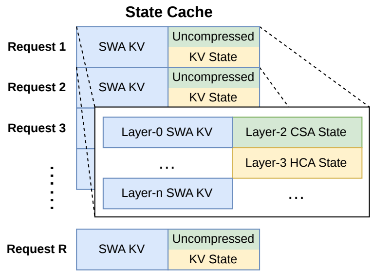


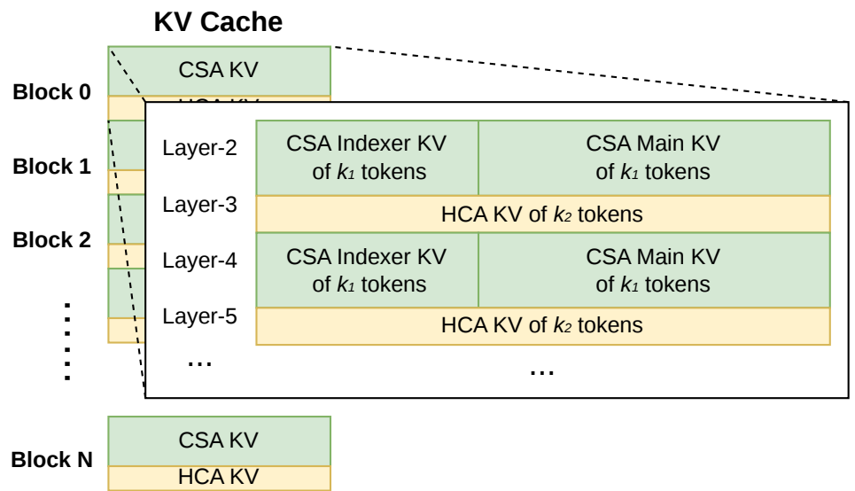


_图 6 | DeepSeek-V4 的 KV 布局示意图。KV 缓存组织为两个主要部分：用于 CSA/HCA 的经典 KV 缓存，以及用于 SWA 和 CSA/HCA 中未准备好压缩的 Token 的状态缓存。在状态缓存中，每个请求被分配一个固定大小的缓存块。在该块内，SWA 段存储对应于最近 \( n_{\mathrm{win}} \) 个 Token 的 KV 条目，而 CSA/HCA 段存储尚未准备好压缩的未压缩尾部状态。在经典 KV 缓存中，我们为每个请求分配多个块。每个缓存块覆盖 \( \operatorname{lcm}(m,m') \) 个原始 Token，产生 \( k_{1} = \frac{\operatorname{lcm}(m,m')}{m} \) 个 CSA 压缩 Token 和 \( k_{2} = \frac{\operatorname{lcm}(m,m')}{m'} \) 个 HCA 压缩 Token。_


为了高效管理 DeepSeek-V4 的 KV 缓存，我们设计了相应的策略来克服这两个挑战。


用于 SWA 和未压缩尾部 Token 的状态缓存。为了解决第一个障碍，我们采用了一种替代的缓存管理机制。由于 SWA 旨在有限的 KV 缓存大小下提升性能，因此将其与压缩分支的未压缩尾部 Token 一起视为状态空间模型是合理的。相应的 KV 缓存因此可以被视为仅取决于当前位置的序列特定状态。据此，我们预分配了一个固定且有限大小的状态缓存池，并将其动态分配给每个序列。


稀疏注意力内核协同设计。关于第二个障碍，传统的高性能注意力内核通常假设每个块有固定数量 \( B \) 的 Token 以优化性能，这对应于 CSA 中的 \( B \cdot m \) 个原始 Token 和 HCA 中的 \( B \cdot m' \) 个原始 Token。通过采用高性能稀疏注意力内核，不同的层可以适应每个块可变的 Token 数量而不会导致性能下降。实现这一点需要协同设计 KV 缓存布局和稀疏注意力内核。例如，对块进行填充以对齐缓存行可以提高性能。因此，对于压缩比为 \( m \) 的 CSA 和压缩比为 \( m' \) 的 HCA，每个块的原始 Token 数量可以是这两个压缩比的最小公倍数 \( \operatorname{lcm}(m, m') \) 的任意倍数。


# 3.6.2. 磁盘 KV 缓存存储


在部署 DeepSeek-V4 时，我们利用磁盘 KV 缓存存储机制来消除共享前缀请求的重复预填充。对于 CSA/HCA 中的压缩 KV 条目和滑动窗口注意力（SWA）中的未压缩 KV 条目，我们分别为存储管理设计了不同的方案。

---

---

对于 CSA 和 HCA，我们简单地将所有压缩后的 KV 条目存储到磁盘中。当请求命中存储的前缀时，我们读取并复用与该前缀对应的压缩 KV 条目，直到最后一个完整的压缩块。特别地，对于尾部不完整块中的前缀 Token，我们仍需重新计算它们以恢复未压缩的 KV 条目，因为 CSA 和 HCA 中的未压缩 KV 条目未被存储。

对于 SWA KV 条目，由于它们未被压缩且存在于每一层中，其数据量大约是压缩后的 CSA 和 HCA KV 条目的 8 倍。为了高效处理这些庞大的 SWA KV 条目，我们提出并实施了三种不同的策略来管理磁盘上的 SWA KV 条目，每种策略在存储开销和计算冗余之间提供了不同的权衡：

- **全量 SWA 缓存**。该策略存储所有 Token 的完整 SWA KV 条目，确保计算零冗余。在此策略下，只需读取该前缀内最后 \( n_{\mathrm{win}} \) 个 Token 的磁盘缓存，即可重建命中前缀的 SWA KV 条目。尽管实现了计算零冗余，但该策略对于基于现代 SSD 的存储系统效率低下——每次命中请求仅访问存储的 SWA KV 缓存中的一小部分，这导致了不平衡的写密集型访问模式。

- **周期性检查点**。该策略每隔 \( p \) 个 Token 对最后 \( n_{\mathrm{win}} \) 个 Token 的 SWA KV 条目进行一次检查点存储，其中 \( p \) 是一个可调参数。对于命中的前缀，我们加载最近一次的检查点状态，然后重新计算剩余的尾部 Token。通过调整 \( p \)，该策略实现了存储与计算之间的按需权衡。

- **零 SWA 缓存**。该策略不存储任何 SWA KV 条目。对于命中的前缀，我们需要执行更多的重新计算以恢复 SWA KV 条目。具体而言，在每个注意力层中，每个 Token 的 SWA KV 条目仅依赖于上一层中最近 \( n_{\mathrm{win}} \) 个 Token 的 SWA KV 条目。因此，利用缓存的 CSA 和 HCA KV 条目，重新计算最后 \( n_{\mathrm{win}} \cdot L \) 个 Token 就足以恢复 \( L \) 层模型的最后 \( n_{\mathrm{win}} \) 个 SWA KV 条目。

根据具体的部署场景，我们选择最合适的策略以实现存储与计算之间所需的权衡。

# 4. 预训练

# 4.1. 数据构建

在 DeepSeek-V3 预训练数据的基础上，我们致力于构建更多样化、更高质量且具有更长有效上下文的训练语料库。我们不断优化数据构建流程。对于网络来源的数据，我们实施了过滤策略以移除批量自动生成和模板化内容，从而缓解模型崩溃的风险（Zhu et al., 2024）。数学和编程语料库仍然是我们训练数据的核心组成部分，我们通过在中期训练阶段引入智能体数据，进一步增强了 DeepSeek-V4 系列的代码能力。对于多语言数据，我们为 DeepSeek-V4 构建了更大的语料库，提升了其捕捉不同文化长尾知识的能力。对于 DeepSeek-V4，我们特别强调长文档数据的策展，优先选取反映独特学术价值的科学论文、技术报告及其他材料。综上所述，我们的预训练语料库包含超过 32T 个 Token，涵盖数学内容、代码、网页、长文档及其他高质量类别。

对于预训练数据，我们在很大程度上遵循了与 DeepSeek-

---

V3. 在分词方面，我们在 DeepSeek-V3 分词器的基础上引入了几个用于上下文构建的特殊标记，并将词表大小保持在 128K。我们还沿用了 DeepSeek-V3 的分词分割和中间填充策略。受 Ding 等人 (2024) 的启发，我们将来自不同来源的文档打包到合适的序列中，以最大限度地减少样本截断。与 DeepSeek-V3 不同的是，我们在预训练过程中采用了样本级的注意力掩码。

# 4.2. 预训练设置

# 4.2.1. 模型设置

DeepSeek-V4-Flash。我们将 Transformer 层数设置为 43，隐藏维度 \(d\) 设置为 4096。对于前两层，我们使用纯滑动窗口注意力。在后续层中，CSA 和 HCA 交替使用。对于 CSA，我们将压缩率 \(m\) 设置为 4，索引器查询头数量 \(n_h^I\) 设置为 64，索引器头维度 \(c^I\) 设置为 128，稀疏注意力选择的 KV 条目数量（即 attention top-k）设置为 512。对于 HCA，我们将压缩率 \(m'\) 设置为 128。对于 CSA 和 HCA，我们将查询头数量 \(n_h\) 设置为 64，头维度 \(c\) 设置为 512，查询压缩维度 \(d_c\) 设置为 1024。输出投影组数 \(g\) 设置为 8，每个中间注意力输出的维度 \(d_g\) 设置为 1024。对于滑动窗口注意力的附加分支，窗口大小 \(n_{\mathrm{win}}\) 设置为 128。我们在所有 Transformer 块中采用了 MoE 层，但在前 3 个 MoE 层使用 Hash 路由策略。每个 MoE 层由 1 个共享专家和 256 个路由专家组成，其中每个专家的中间隐藏维度为 2048。在路由专家中，每个 token 将激活 6 个专家。多 token 预测深度设置为 1。至于 mHC，扩展因子 \(n_{\mathrm{hc}}\) 设置为 4，Sinkhorn-Knopp 迭代次数 \(t_{\mathrm{max}}\) 设置为 20。在此配置下，DeepSeek-V4-Flash 包含 284B（2840 亿）的总参数，其中每个 token 激活 13B（130 亿）参数。

DeepSeek-V4-Pro。我们将 Transformer 层数设置为 61，隐藏维度 \(d\) 设置为 7168。对于前两层，我们使用 HCA。在后续层中，CSA 和 HCA 交替使用。对于 CSA，我们将压缩率 \(m\) 设置为 4，索引器查询头数量 \(n_h^I\) 设置为 64，索引器头维度 \(c^I\) 设置为 128，稀疏注意力选择的 KV 条目数量（即 attention top-k）设置为 1024。对于 HCA，我们将压缩率 \(m'\) 设置为 128。对于 CSA 和 HCA，我们将查询头数量 \(n_h\) 设置为 128，头维度 \(c\) 设置为 512，查询压缩维度 \(d_c\) 设置为 1536。输出投影组数 \(g\) 设置为 16，每个中间注意力输出的维度 \(d_g\) 设置为 1024。对于滑动窗口注意力的附加分支，窗口大小 \(n_{\mathrm{win}}\) 设置为 128。我们在所有 Transformer 块中采用了 MoE 层，但在前 3 个 MoE 层使用 Hash 路由策略。每个 MoE 层由 1 个共享专家和 384 个路由专家组成，其中每个专家的中间隐藏维度为 3072。在路由专家中，每个 token 将激活 6 个专家。多 token 预测深度设置为 1。至于 mHC，扩展因子 \(n_{\mathrm{hc}}\) 设置为 4，Sinkhorn-Knopp 迭代次数 \(t_{\mathrm{max}}\) 设置为 20。在此配置下，DeepSeek-V4-Flash 包含 1.6T（1.6 万亿）的总参数，其中每个 token 激活 49B（490 亿）参数。

# 4.2.2. 训练设置

DeepSeek-V4-Flash。我们对大部分参数采用 Muon 优化器 (Jordan et al., 2024; Liu et al., 2025)，但对

---

嵌入模块、预测头模块以及所有 RMSNorm 模块的权重。对于 AdamW，我们将其超参数设置为 \(\beta_{1} = 0.9\)，\(\beta_{2} = 0.95\)，\(\varepsilon = 10^{-20}\)，权重衰减为 0.1。对于 Muon，我们将动量设置为 0.95，权重衰减设置为 0.1，并将每次更新矩阵的均方根（RMS）重新缩放为 0.18，以便复用 AdamW 的学习率。我们在 32T 个 token 上训练 DeepSeek-V4-Flash，与 DeepSeek-V3 类似，我们采用批量大小调度策略，将批量大小（以 token 计）从小规模逐渐增加到 75.5M，并在训练的大部分时间内保持在 75.5M。学习率在前 2000 步内线性预热，在训练的大部分时间内保持在 \(2.7 \times 10^{-4}\)。在训练接近尾声时，我们最终按照余弦调度将学习率衰减至 \(2.7 \times 10^{-5}\)。训练以 4K 的序列长度开始，我们逐渐将训练序列长度扩展至 16K、64K 和 1M。关于稀疏注意力的设置，我们首先在前 1T 个 token 使用密集注意力对模型进行预热，然后在序列长度达到 64K 时引入稀疏注意力，并在剩余的训练过程中保持稀疏注意力。在引入注意力稀疏性时，我们首先设置一个简短的阶段来预热 CSA 中的闪电索引器，然后在训练的大部分时间内使用稀疏注意力训练模型。对于无辅助损失的负载均衡，我们将偏置更新速度设置为 0.001。对于均衡损失，我们将其损失权重设置为 0.0001，以避免单个序列内出现极端不平衡。MTP 损失权重在训练的大部分时间内设置为 0.3，并在学习率衰减开始时调整为 0.1。


DeepSeek-V4-Pro。除了超参数的具体数值外，DeepSeek-V4-Pro 的训练设置与 DeepSeek-V4-Flash 基本一致。我们对大多数参数采用 Muon 优化器，但对嵌入模块、预测头模块以及所有 RMSNorm 模块的权重使用 AdamW 优化器。AdamW 和 Muon 的超参数与 DeepSeek-V4-Flash 相同。我们在 33T 个 token 上训练 DeepSeek-V4-Pro，同样采用批量大小调度策略，最大批量大小为 94.4M 个 token。学习率调度策略与 DeepSeek-V4-Flash 基本相同，但峰值学习率设置为 \(2.0 \times 10^{-4}\)，最终学习率设置为 \(2.0 \times 10^{-5}\)。训练同样以 4K 的序列长度开始，并逐渐扩展至 16K、64K 和 1M。与 DeepSeek-V4-Flash 相比，DeepSeek-V4-Pro 以更长的密集注意力阶段开始，引入稀疏注意力的策略与 DeepSeek-V4-Flash 相同，遵循两阶段训练方法。对于无辅助损失的负载均衡，我们将偏置更新速度设置为 0.001。对于均衡损失，我们将其损失权重设置为 0.0001，以避免单个序列内出现极端不平衡。MTP 损失权重在训练的大部分时间内设置为 0.3，并在学习率衰减开始时调整为 0.1。


# 4.2.3. 缓解训练不稳定性


训练万亿参数的 MoE 模型带来了巨大的稳定性挑战，DeepSeek-V4 系列也不例外。我们在训练过程中遇到了显著的不稳定性挑战。虽然简单的回滚可以暂时恢复训练状态，但这被证明不是长久之计，因为它们无法防止损失尖峰的再次发生。根据经验，我们发现尖峰的出现始终与 MoE 层中的异常值有关，而路由机制本身似乎加剧了这些异常值的产生。因此，我们试图从两个维度来解决这个问题：打破由路由引起的恶性循环，并直接抑制异常值。幸运的是，我们发现了两种实用的技术，可以有效地维持训练稳定性。尽管目前对其潜在机制的全面理论理解仍是一个悬而未决的问题，但我们公开分享这些技术，以促进社区的进一步探索。

---

**前瞻路由**。我们发现，将骨干网络和路由网络的同步更新解耦，可以显著提高训练稳定性。因此，在步骤 \( t \)，我们使用当前网络参数 \( \theta_t \) 进行特征计算，但路由索引的计算和应用则使用历史网络参数 \( \theta_{t - \Delta t} \)。在实践中，为了避免两次加载模型参数的开销，我们在步骤 \( t - \Delta t \) 提前获取步骤 \( t \) 的数据。我们“预先”计算并缓存路由索引以供后续步骤 \( t \) 使用，这也是我们将这种方法命名为“前瞻路由”的原因。我们还在基础设施层面对此进行了大量优化。首先，鉴于预先计算路由索引只需要对数据进行一次前向传播，我们精心编排了流水线执行以及与专家并行通信的重叠，成功将前瞻路由带来的额外实际时间开销控制在 20% 左右。其次，我们引入了一种自动检测机制，仅在发生损失尖峰时触发短暂的回滚并激活前瞻路由；在该模式下运行一段时间后，系统会恢复到标准训练。最终，这种动态应用机制使我们能够在不牺牲模型性能的前提下，以可忽略不计的整体额外训练开销来避免损失尖峰。

**SwiGLU 截断**。在以往的文献（Bello et al., 2017; Riviere et al., 2024）中，截断已被明确用于约束数值范围，从而增强训练稳定性。在我们的实际训练运行中，我们根据经验发现，应用 SwiGLU 截断（OpenAI, 2025）可以有效消除异常值，并在不牺牲性能的前提下显著帮助稳定训练过程。在 DeepSeek-V4-Flash 和 DeepSeek-V4-Pro 的整个训练过程中，我们将 SwiGLU 的线性分量截断在 \([-10, 10]\) 范围内，同时将门控分量的上界限制为 10。


# 4.3. 评估


# 4.3.1. 评估基准


对于基础模型的评估，我们考虑了涵盖四个关键维度的基准：世界知识、语言理解与推理、编程与数学以及长上下文处理。

世界知识基准包括 AGIEval (Zhong et al., 2023)、C-Eval (Huang et al., 2023)、CMMLU (Li et al., 2023)、MMLU (Hendrycks et al., 2020)、MMLU-Redux (Gema et al., 2024)、MMLU-Pro (Wang et al., 2024b)、MMMLU (OpenAI, 2024a)、MultiLoKo (Hupkes and Bogoychev, 2025)、Simple-QA verified (Haas et al., 2025)、SuperGPQA (Du et al., 2025)、FACTS Parametric (Cheng et al., 2025) 和 TriviaQA (Joshi et al., 2017)。

语言理解与推理基准包括 BigBench Hard (BBH) (Suzgun et al., 2022)、DROP (Dua et al., 2019)、HellaSwag (Zellers et al., 2019)、CLUEWSC (Xu et al., 2020) 和 WinoGrande (Sakaguchi et al., 2019)。

编程与数学基准包括 BigCodeBench (Zhuo et al., 2025)、HumanEval (Chen et al., 2021)、GSM8K (Cobbe et al., 2021)、MATH (Hendrycks et al., 2021)、MGSM (Shi et al., 2023) 和 CMath (Wei et al., 2023)。

长上下文基准包括 LongBench-V2 (Bai et al., 2025b)。

---

---

_表 1 | DeepSeek-V3.2-Base、DeepSeek-V4-Flash-Base 和 DeepSeek-V4-Pro-Base 之间的对比。所有模型均在我们内部框架下进行评估，并采用相同的评估设置。分数差距不超过 0.3 被视为处于同一水平。每行的最高分以**粗体**显示，次高分<u>加下划线</u>。_


<table><tr><td></td><td>基准测试 (指标)</td><td>样本数</td><td>DeepSeek-V3.2 Base</td><td>DeepSeek-V4-Flash Base</td><td>DeepSeek-V4-Pro Base</td></tr><tr><td></td><td>架构</td><td>-</td><td>MoE</td><td>MoE</td><td>MoE</td></tr><tr><td></td><td>激活参数量</td><td>-</td><td>37B</td><td>13B</td><td>49B</td></tr><tr><td></td><td>总参数量</td><td>-</td><td>671B</td><td>284B</td><td>1.6T</td></tr><tr><td rowspan="12">世界知识</td><td>AGIEval (EM)</td><td>0-shot</td><td>80.1</td><td>82.6</td><td>83.1</td></tr><tr><td>MMLU (EM)</td><td>5-shot</td><td>87.8</td><td>88.7</td><td>90.1</td></tr><tr><td>MMLU-Redux (EM)</td><td>5-shot</td><td>87.5</td><td>89.4</td><td>90.8</td></tr><tr><td>MMLU-Pro (EM)</td><td>5-shot</td><td>65.5</td><td>68.3</td><td>73.5</td></tr><tr><td>MMMLU (EM)</td><td>5-shot</td><td>87.9</td><td>88.8</td><td>90.3</td></tr><tr><td>C-Eval (EM)</td><td>5-shot</td><td>90.4</td><td>92.1</td><td>93.1</td></tr><tr><td>CMMLU (EM)</td><td>5-shot</td><td>88.9</td><td>90.4</td><td>90.8</td></tr><tr><td>MultiLoKo (EM)</td><td>5-shot</td><td>38.7</td><td>42.2</td><td>51.1</td></tr><tr><td>Simple-QA verified (EM)</td><td>25-shot</td><td>28.3</td><td>30.1</td><td>55.2</td></tr><tr><td>SuperGPQA (EM)</td><td>5-shot</td><td>45.0</td><td>46.5</td><td>53.9</td></tr><tr><td>FACTS Parametric (EM)</td><td>25-shot</td><td>27.1</td><td>33.9</td><td>62.6</td></tr><tr><td>TriviaQA (EM)</td><td>5-shot</td><td>83.3</td><td>82.8</td><td>85.6</td></tr><tr><td rowspan="5">语言与推理</td><td>BBH (EM)</td><td>3-shot</td><td>87.6</td><td>86.9</td><td>87.5</td></tr><tr><td>DROP (F1)</td><td>1-shot</td><td>88.2</td><td>88.6</td><td>88.7</td></tr><tr><td>HellaSwag (EM)</td><td>0-shot</td><td>86.4</td><td>85.7</td><td>88.0</td></tr><tr><td>WinoGrande (EM)</td><td>0-shot</td><td>78.9</td><td>79.5</td><td>81.5</td></tr><tr><td>CLUEWSC (EM)</td><td>5-shot</td><td>83.5</td><td>82.2</td><td>85.2</td></tr><tr><td rowspan="6">代码与数学</td><td>BigIntCodeBench (Pass@1)</td><td>3-shot</td><td>63.9</td><td>56.8</td><td>59.2</td></tr><tr><td>HumanEval (Pass@1)</td><td>0-shot</td><td>62.8</td><td>69.5</td><td>76.8</td></tr><tr><td>GSM8K (EM)</td><td>8-shot</td><td>91.1</td><td>90.8</td><td>92.6</td></tr><tr><td>MATH (EM)</td><td>4-shot</td><td>60.5</td><td>57.4</td><td>64.5</td></tr><tr><td>MGSM (EM)</td><td>8-shot</td><td>81.3</td><td>85.7</td><td>84.4</td></tr><tr><td>CMath (EM)</td><td>3-shot</td><td>92.6</td><td>93.6</td><td>90.9</td></tr><tr><td>长上下文</td><td>LongBench-V2 (EM)</td><td>1-shot</td><td>40.2</td><td>44.7</td><td>51.5</td></tr></table>


# 4.3.2. 评估结果


在表 1 中，我们详细对比了 DeepSeek-V3.2、DeepSeek-V4-Flash 和 DeepSeek-V4-Pro 的基础模型，所有模型均在统一的内部框架下进行评估，并严格保持设置一致。


将 DeepSeek-V4-Flash-Base 与 DeepSeek-V3.2-Base 进行比较，揭示了一个引人注目的效率故事。尽管使用的激活参数量和总参数量都明显更少，但 DeepSeek-V4-Flash-Base 在广泛的基准测试中超越了 DeepSeek-V3.2-Base。这种优势在世界知识任务和具有挑战性的长上下文场景中尤为明显。这些结果强调，DeepSeek-V4-Flash-Base 在架构改进、数据质量优化和训练优化方面的努力，即使在更紧凑的参数预算下也能带来卓越的性能，从而在大多数评估中有效地超越了规模更大的 DeepSeek-V3.2-Base。


此外，DeepSeek-V4-Pro-Base 展示了能力的进一步、决定性飞跃，确立了相对于 DeepSeek-V3.2-Base 和 DeepSeek-V4-Flash-Base 的近乎全面的领先地位。随着在几乎所有类别上的改进，DeepSeek-V4-Pro-Base 达到了新的

---

---

在最具挑战性的基准测试中，DeepSeek 基础模型取得了最高的性能表现。在知识密集型评估中，它带来了显著的收益，同时也大幅推进了长上下文理解能力。在大多数推理和代码基准测试中，DeepSeek-V4-Pro-Base 也超越了所有之前的模型。这种全面的提升证实了 DeepSeek-V4-Pro-Base 是 DeepSeek 系列中最强大的基础模型，在知识、推理、编码和长上下文能力等各个方面均优于其前身。

# 5. 后训练

# 5.1. 后训练流程

在预训练之后，我们进行了后训练阶段以产出 DeepSeek-V4 系列的最终模型。虽然训练流程在很大程度上反映了 DeepSeek-V3.2 的做法，但我们在方法论上做了一个关键的替换：混合强化学习（RL）阶段被完全替换为策略内蒸馏。

# 5.1.1. 专家训练

领域专家模型的开发是通过调整 DeepSeek-V3.2 训练流程来进行的。具体而言，每个模型都通过初始微调阶段和随后的强化学习（RL）阶段进行了顺序优化，其中 RL 由特定领域的提示和奖励信号引导。在 RL 阶段，我们实施了组相对策略优化（GRPO）算法，并保持了与我们之前的研究（DeepSeek-AI, 2025; DeepSeek-AI, 2025）紧密一致的超参数。

推理投入。众所周知，模型在推理任务上的表现从根本上取决于所投入的计算量。因此，我们在不同的 RL 配置下训练了不同的专家模型，以促进针对不同推理能力优化的模型的发展。如表 2 所述，DeepSeek-V4-Pro 和 DeepSeek-V4-Flash 都支持三种特定的推理投入模式。对于每种模式，我们在 RL 训练期间应用不同的长度惩罚和上下文窗口，这导致推理的输出 token 长度不同。为了整合这些不同的推理模式，我们使用由 </think> 和 </think> token 分隔的特殊响应格式。此外，对于“Think Max”模式，我们在系统提示的开头添加了一条特定指令，以引导模型的推理过程，如表 3 所示。

生成式奖励模型。通常，易于验证的任务可以使用简单的基于规则的验证器或测试用例进行有效优化。相比之下，难以验证的任务传统上依赖于人类反馈强化学习（RLHF），这需要大量的人工标注来训练标量奖励模型。然而，在 DeepSeek-V4 系列的后训练阶段，我们摒弃了这些传统的基于标量的奖励模型。相反，为了解决难以验证的任务，我们策划了标准引导的 RL 数据，并采用生成式奖励模型（GRM）来评估策略轨迹。至关重要的是，我们直接对 GRM 本身应用 RL 优化。在此范式下，Actor 网络原生地充当 GRM，使得模型的评估（评判）能力能够与其标准生成能力进行联合优化。通过统一这些角色，模型的内部推理能力本质上融合到了其评估过程中，从而产生了高度稳健的评分。此外，这种方法仅需少量多样化的人工标注即可实现卓越的性能，因为

---

_表 2 | 三种推理模式的对比_


<table><tr><td>推理模式</td><td>特征</td><td>典型用例</td><td>响应格式</td></tr><tr><td>非思考模式 (Non-think)</td><td>快速、基于习惯或简单规则的直观响应。</td><td>日常例行任务、紧急反应、低风险决策。</td><td>&lt;/think&gt; 摘要</td></tr><tr><td>高思考模式 (Think High)</td><td>有意识的逻辑分析，速度较慢但准确性更高。</td><td>复杂问题解决、规划、中等风险决策。</td><td>&lt;think&gt; 思考令牌 &lt;/think&gt; 摘要</td></tr><tr><td>最大思考模式 (Think Max)</td><td>将推理推向极致。速度缓慢但功能强大。</td><td>探索模型推理能力的边界。</td><td>1. 开头的特殊系统提示词。
2. &lt;think&gt; 思考令牌 &lt;/think&gt; 摘要</td></tr></table>


_表 3 | 注入到“最大思考”模式系统提示词中的指令。_


# 注入的指令


推理强度：绝对最大值，不允许走捷径。


你必须在思考过程中非常详尽，全面分解问题以解决根本原因，针对所有潜在路径、边缘情况和对抗性场景严格进行逻辑压力测试。


明确写出你的整个审议过程，记录每一个中间步骤、考虑过的替代方案和被拒绝的假设，以确保绝对没有任何假设未被检查。


模型利用其自身的逻辑在复杂任务中进行泛化。


工具调用架构与特殊令牌。与我们之前的版本一致，我们使用一个专用的 `` 标签来界定推理路径。在 DeepSeek-V4 系列中，我们引入了一种新的工具调用架构，它采用特殊的 " | DSML | " 令牌，并利用基于 XML 的格式进行工具调用，如表 4 所示。我们的实验表明，XML 格式有效地缓解了转义失败并减少了工具调用错误，为模型-工具交互提供了一个更稳健的接口。


交错思考。DeepSeek-V3.2 引入了一种上下文管理策略，该策略在工具结果轮次之间保留推理痕迹，但在接收到新用户消息时将其丢弃。虽然有效，但这在复杂的代理工作流中仍然导致了不必要的令牌浪费——每一次新的用户轮次都会清除所有累积的推理内容，迫使模型从头开始重建其问题解决状态。利用扩展的 100 万令牌上下文

---

---

_表 4 | DeepSeek-V4 系列的工具调用模式。_


# 工具调用模式


```
```java
## 工具
您可以使用一组工具来帮助回答用户的问题。您可以通过编写一个 "<|DSML|tool Calls>" 块来调用工具，如下所示：
<|DSML|tool Calls>
<|DSML|invoke name="$TOOL_NAME">
<|DSML|parameter name="$PARAMETER_NAME" string="true|false">$PARAMETER_VALUE </|DSML|parameter>
...
</|DSML|invoke>
<|DSML|invoke name="$TOOL_NAME2">
...
</|DSML|invoke>
</|DSML|tool Calls>
字符串参数应按原样指定，并设置 'string="true"'。对于所有其他类型（数字、布尔值、数组、对象），以 JSON 格式传递值并设置 'string="false"'。
如果启用了 thinking_mode（由 </think> 触发），您必须在任何工具调用或最终响应之前的 </think>...</think> 内部输出完整的推理过程。
否则，在 </think> 之后直接输出工具调用或最终响应。
## 可用工具模式
{Tool Definition...}
您必须严格遵循上述定义的工具名称和参数模式来调用工具。
```


针对 DeepSeek-V4 系列的上下文窗口，我们进一步优化了这一机制，以最大化交错思维在智能体环境中的有效性：


- 工具调用场景。如图 7(a) 所示，所有推理内容在整个对话过程中均被完整保留。与 DeepSeek-V3.2 在每次新的用户轮次时丢弃思维轨迹不同，DeepSeek-V4 系列在所有轮次中保留完整的推理历史，包括跨越用户消息边界。这使得模型能够在长期的智能体任务中保持连贯且累积的思维链。


- 通用对话场景。如图 7(b) 所示，保留了原始策略：当新的用户消息到达时，丢弃先前轮次的推理内容，从而使上下文在持久推理轨迹收益有限的设置中保持简洁。


与 DeepSeek-V3.2 一样，通过用户消息模拟工具交互的智能体框架（例如 Terminus）可能不会触发工具调用上下文路径，因此可能无法从增强的推理持久性中受益。我们继续建议针对此类架构使用非思维模型。

---

---

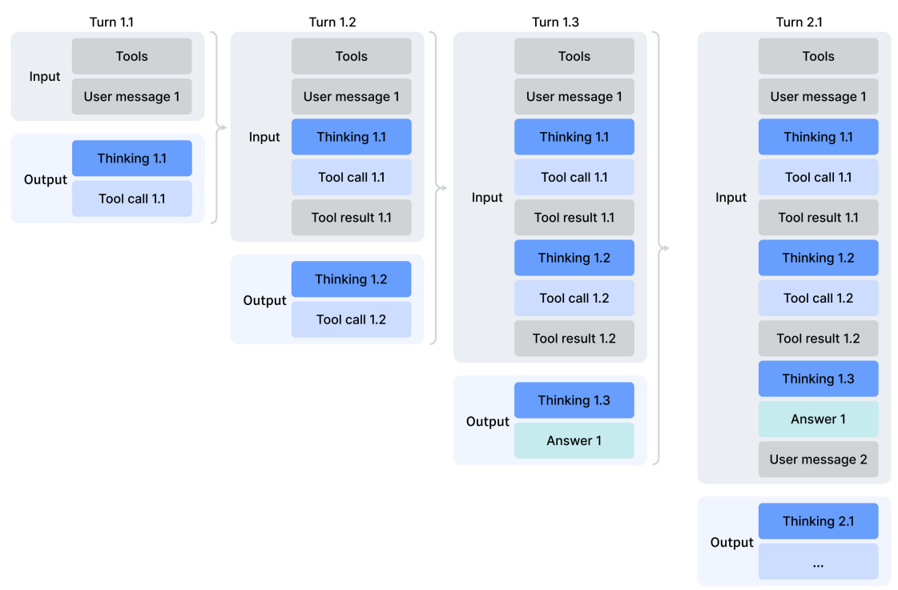


_a) 使用工具思考_


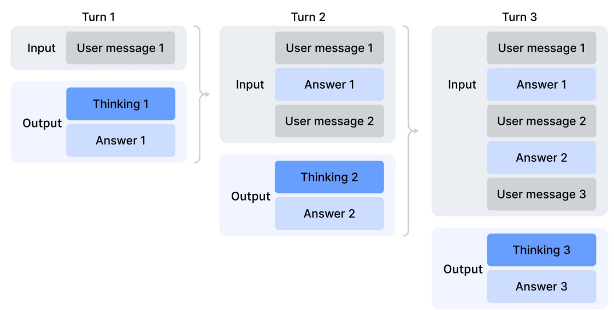


_b) 不使用工具思考_


_图 7 | DeepSeek-V4 系列的思考管理。_


快速指令。在聊天机器人场景中，在生成回复之前必须执行许多辅助任务（例如，确定是否触发网络搜索、意图识别等）。传统上，这些任务由一个独立的小模型处理，由于无法复用现有的 KV 缓存，因此需要冗余的预填充。为了克服这一限制，我们引入了快速指令。我们直接在输入序列后附加一组专用的特殊 Token，其中每个 Token 对应一个特定的辅助任务。通过直接复用已计算的 KV 缓存，该机制完全避免了冗余的预填充，并允许某些任务（例如生成搜索查询以及确定权限和域）并行执行。因此，这种方法显著降低了用户感知的首字延迟（TTFT），并消除了维护和迭代额外小模型的工程开销。支持快速指令的 Token 汇总于表 5 中。


# 5.1.2. 在线策略蒸馏


通过专门的微调和强化学习训练了多个特定领域的专家后，我们采用多教师在线策略蒸馏（OPD）作为将专家能力合并到最终模型中的主要技术。OPD 已成为一种有效的训练后范式，用于将领域专家的知识和能力高效地转移到单一的统一模型中。这是通过让学生模型在其自身生成的轨迹上从教师模型的输出分布中学习来实现的。形式上，给定一组 \(N\) 个专家模型

---

---

_表 5 | 用于辅助任务的快速指令特殊标记。_


<table><tr><td>特殊标记</td><td>描述</td><td>格式</td></tr><tr><td>&lt;|action|&gt;</td><td>判断用户提示词是需要进行网络搜索还是可以直接回答。</td><td>...&lt;|User|&gt;{prompt}&lt;|Assistant|&gt;&lt;think&gt;&lt;|action|&gt;</td></tr><tr><td>&lt;|title|&gt;</td><td>在首次助手回复后生成简洁的对话标题。</td><td>...&lt;|Assistant|&gt;{response}&lt;|end_ofsentence|&gt;&lt;|title|&gt;</td></tr><tr><td>&lt;|query|&gt;</td><td>根据用户提示词生成搜索查询。</td><td>...&lt;|User|&gt;{prompt}&lt;|query|&gt;</td></tr><tr><td>&lt;|authority|&gt;</td><td>对用户提示词对来源权威性的需求进行分类。</td><td>...&lt;|User|&gt;{prompt}&lt;|authority|&gt;</td></tr><tr><td>&lt;|domain|&gt;</td><td>识别用户提示词所属的领域。</td><td>...&lt;|User|&gt;{prompt}&lt;|domain|&gt;</td></tr><tr><td>&lt;|extracted_url|&gt;</td><td>判断用户提示词中的每个 URL 是否应被抓取和阅读。</td><td>...&lt;|User|&gt;{prompt}&lt;|extracted_url|&gt;{url}&lt;|read_url|&gt;</td></tr></table>


\(\{\pi_{E_1}, \pi_{E_2}, \ldots, \pi_{E_N}\}\)，OPD 目标函数定义为：


$$
\mathcal {L} _ {\mathrm {O P D}} (\theta) = \sum_ {i = 1} ^ {N} w _ {i} \cdot \mathrm {D} _ {\mathrm {K L}} \left(\pi_ {\theta} \| \pi_ {E _ {i}}\right). \tag {29}
$$


在该公式中，\(w_{i}\) 代表分配给每个专家的权重，通常由专家的相对重要性决定。计算反向 KL 损失 \(\mathrm{D}_{\mathrm{KL}}\left(\pi_{\theta} \parallel \pi_{E_i}\right)\) 需要从学生模型 \(\pi_{\theta}\) 采样训练轨迹以维持在线策略学习。其底层逻辑确保统一策略 \(\pi_{\theta}\) 能够有选择地向与当前任务上下文相关的特定专家学习（例如，在数学推理任务中与数学专家对齐，在编程任务中与代码专家对齐）。通过这种机制，来自物理上分离的专家权重的知识通过 Logit 层级对齐被整合到一个统一的参数空间中，从而在实际应用中规避了传统权重合并或混合 RL 技术中常见的性能下降问题。在此阶段，我们采用了十多个涵盖不同领域的教师模型来蒸馏单个学生模型。


在处理上述 OPD 目标时，先前的工作通常将全词表 KL 损失简化为每个 Token 位置上的 Token 级 KL 估计，并复用 RL 框架，将 \(\mathsf{sg}\big[\log \frac{\pi_{E_i}(y_t|x,y_{< t})}{\pi_\theta(y_t|x,y_{< t})}\big]\)（sg 代表停止梯度操作）替换为策略损失计算中每个 Token 的优势估计。虽然这种方法资源效率较高，但会导致梯度估计的高方差，并经常引起训练不稳定。因此，我们在 OPD 中采用了全词表 Logit 蒸馏。在计算反向 KL 损失时保留完整的 Logit 分布可以产生更稳定的梯度估计，并确保教师模型知识的忠实蒸馏。在下一小节中，我们将描述使大规模全词表 OPD 得以实现的工程工作。

---

---

# 5.2. RL 和 OPD 基础设施

我们的后训练基础设施建立在为 DeepSeek-V3 开发的可扩展框架之上。具体而言，我们集成了第 3.5 节中描述的相同的分布式训练栈，以及前文介绍的用于高效自回归采样的 rollout 引擎。在此基础上，我们在本工作中引入了以下主要增强功能。这些设计使得涉及十多个不同教师模型的超长上下文 RL 和 OPD 合并任务能够高效执行，从而大幅加速了模型发布的迭代周期。

# 5.2.1. FP4 量化集成

我们应用 FP4 (MXFP4) 量化来加速 rollout 以及所有仅推理的前向传播，包括教师模型和参考模型的前向传播，从而减少内存流量和采样延迟。正如第 3.4 节详述的那样，我们在 rollout 和推理阶段直接使用原生 FP4 权重。对于训练步骤，通过无损的 FP4 转 FP8 反量化步骤来模拟 FP4 量化，从而允许无缝复用现有的 FP8 混合精度框架（采用 FP32 主权重），且无需修改反向传播流程。

# 5.2.2. 全词表 OPD 的高效教师调度

我们的框架支持全词表在线策略蒸馏（On-Policy Distillation, OPD），其教师模型数量实际上是无限的，且每个教师模型可能包含数万亿参数。为了实现这一点，所有教师权重被卸载到集中式分布式存储中，并在教师前向传播期间按需加载，同时采用类似 ZeRO 的参数分片技术来缓解 I/O 和 DRAM 压力。此外，即使将结果暂存到磁盘，在所有教师模型上朴素地实现词表大小 \( |V| > 100k \) 的 logits 也是不可行的。我们通过在前向传播期间仅将最后一层教师隐藏状态缓存在集中式缓冲区中来解决这个问题。在训练时，检索这些缓存的状态并通过相应的预测头模块，以即时重建完整的 logits。这种设计产生的重计算开销可以忽略不计，同时完全避免了与显式 logits 实现相关的内存负担。为了减轻教师预测头的 GPU 内存占用，我们在数据分发期间按教师索引对训练样本进行排序。这种安排确保每个不同的教师头在每个 mini-batch 中仅加载一次，并且设备内存中任何时候最多驻留一个教师头。所有参数和隐藏状态的加载/卸载操作均在后台异步进行，不会阻塞关键路径上的计算。最后，使用专门的 TileLang 内核计算教师和学生 logits 之间的精确 KL 散度，这加速了计算并限制了动态内存分配。

# 5.2.3. 可抢占且容错的 Rollout 服务

为了最大化 GPU 资源利用率，同时能够为高优先级任务快速提供硬件资源，我们的 GPU 集群采用了集群级的可抢占任务调度器，其中任何正在运行的任务都可能随时被抢占。此外，硬件故障在大规模 GPU 集群中很常见。为此，我们实现了一个可抢占且容错的 LLM 生成服务，用于 RL/OPD rollout。

具体而言，我们为每个生成请求实现了一个 token 粒度的预写式日志。每当为某个请求生成新 token 时，我们会立即将其追加到该请求的 WAL 中。在发生抢占时，我们暂停推理引擎并保存 KV 缓存……

---

未完成的请求。恢复时，我们利用持久化的 WAL 和保存的 KV Cache 继续解码。即使发生致命的硬件错误，我们也可以利用 WAL 中持久化的 Token 重新运行预取阶段，从而重建 KV Cache。

重要的是，从头开始重新生成未完成的请求在数学上是不正确的，因为这会引入长度偏差。由于较短的响应更有可能在中断中幸存下来，从头重新生成会使模型在发生中断时更容易产生较短的序列。如果推理栈是批次不变且确定性的，通过为采样器中使用的伪随机数生成器设置一致的种子来重新生成，也可以解决这一正确性问题。然而，这种方法仍然会产生重新运行解码阶段的额外开销，使其效率远低于我们基于 Token 粒度的 WAL 方法。

# 5.2.4. 面向百万 Token 上下文的 RL 框架扩展

我们引入了针对性的优化，以便在百万 Token 序列上高效地进行 RL 和 OPD。在 rollout 阶段，我们采用了可抢占且具有容错能力的 rollout 服务，详见第 5.2.3 节。在推理和训练阶段，我们将 rollout 数据格式分解为轻量级元数据和繁重的按 Token 字段。在数据分发期间，可以加载整个 rollout 数据的元数据以执行全局打乱和打包布局计算。繁重的按 Token 字段通过共享内存数据加载器加载，以消除节点内的数据冗余，并在以 mini-batch 为粒度消费后立即释放，从而大幅降低了 CPU 和 GPU 的内存压力。设备上的 mini-batch 数量是根据工作负载动态确定的，从而在计算吞吐量和 I/O 重叠之间实现了高效的权衡。

# 5.2.5. 面向 Agentic AI 的沙箱基础设施

为了满足 Agentic AI 在后训练和评估期间多样化的执行需求，我们构建了一个生产级沙箱平台 DeepSeek Elastic Compute (DSec)。DSec 包含三个 Rust 组件——API 网关、单机代理和集群监视器——它们通过自定义 RPC 协议互连，并基于 3FS 分布式文件系统进行水平扩展。在生产环境中，单个 DSec 集群管理着数十万个并发沙箱实例。

DSec 的设计源于四个观察结果：(1) Agentic 工作负载具有高度异构性，涵盖了从轻量级函数调用到具有不同操作系统和安全要求的完整软件工程流水线；(2) 环境镜像数量众多且体积庞大，但必须能够快速加载并支持迭代定制；(3) 高密度部署要求高效的 CPU 和内存利用率；(4) 沙箱的生命周期必须与 GPU 训练计划相协调，包括抢占和基于检查点的恢复。基于这些观察结果，下文我们将分别详细阐述 DSec 的四个核心设计。

统一接口背后的四种执行基底。DSec 提供了一个单一的 Python SDK (1ibdsec)，它抽象了四种执行基底。函数调用将无状态调用分发给预热容器池，从而消除了冷启动开销。容器完全兼容 Docker，并利用 EROFS (Gao et al., 2019) 按需加载机制来实现高效的镜像组装。微虚拟机基于 Firecracker (Agache et al., 2020) 构建，为对安全敏感的高密度部署增加了虚拟机级别的隔离。全虚拟机基于 QEMU (Bellard, 2005) 构建，支持任意的客户机操作系统。这四种方式共享一个通用的 API 表面——命令执行，

---

文件传输以及 TTY 访问 —— 在它们之间切换只需要更改一个参数。

**通过分层存储实现快速镜像加载。** DSec 通过分层、按需加载，在快速启动与庞大且不断增长的环境镜像库之间取得了平衡。对于容器，基础镜像和文件系统提交以 3FS 支持的 EROFS 层形式存储，直接挂载到 overlay 的 lowerdirs 中。我们在挂载时将文件元数据保留在本地磁盘上以便快速访问；同时，数据块在需要时从 3FS 获取。对于微虚拟机，DSec 使用 overlaybd (Li et al., 2020) 磁盘格式：只读基础层驻留在 3FS 上以实现跨实例共享，而写入操作则转到本地写时复制层。此类快照是可链接的，从而实现了高效的版本管理和毫秒级的恢复。

**海量并发下的密度优化。** 为了适应每个集群数十万个沙箱，DSec 解决了两个资源瓶颈。首先，它减轻了虚拟化环境中重复的页缓存占用，并应用内存回收技术以实现安全的超售。其次，它缓解了容器运行时中的自旋锁竞争，从而减少了每个沙箱的 CPU 开销，显著增加了每台主机的打包密度。

**轨迹记录与抢占安全恢复。** DSec 为每个沙箱维护一个全局有序的轨迹日志，持久化记录每个命令调用及其结果。该轨迹服务于三个目的：(1) 客户端快进 —— 当训练任务被抢占时，沙箱资源仍然被保留；恢复时，DSec 重放先前完成命令的缓存结果，在加速任务恢复的同时，也防止了因重新执行非幂等操作而产生的错误；(2) 细粒度溯源 —— 每个状态变化的起源及相应结果都是可追踪的；(3) 确定性重放 —— 任何历史会话都可以从其轨迹中忠实地重现。

# 5.3. 标准基准评估

# 5.3.1. 评估设置

**知识与推理。** 知识与推理数据集包括 MMLU-Pro (Wang et al., 2024b)、GPQA (Rein et al., 2023)、Human Last Exam (Phan et al., 2025)、Simple-QA Verified (Haas et al., 2025)、Chinese-SimpleQA (He et al., 2024)、LiveCodeBench-v6 (Jain et al., 2024)、CodeForces (内部基准)、HMMT 2026 Feb、Apex (Balunović et al., 2025)、Apex Short-list (Balunović et al., 2025)、IMOAnswerBench (Luong et al., 2025) 和 PutnamBench (Tsoukalas et al., 2024)。

对于代码，我们在 LiveCodeBench-v6 和一个内部 Codeforces 基准上评估 DeepSeek-V4 系列。对于 Codeforces，我们收集了 14 场 Codeforces Division 1 比赛，包含 114 道题目（2025 年 5 月 - 2025 年 11 月）。Elo 等级分计算如下。对于每场比赛，我们为每道题目生成 32 个候选解。对于每道题目，我们独立地从中无放回地抽取 10 个解，并按随机顺序排列以形成提交序列。每个提交都由领域专家构建的测试套件进行评判。已解出题目的得分遵循 OpenAI (2025) 的惩罚方案：模型获得的是解决了同一题目且具有相同先前失败尝试次数的人类参与者的中位数得分。这为每个采样的提交序列产生了总比赛得分，然后将其转换为比赛排名，随后通过标准 Codeforces 等级分系统转换为估计的等级分。比赛级别的期望等级分定义为

---

该评分是基于每个问题的 10 篇提交在所有可能的随机选择和排序下的期望值。模型的整体评分是所有 14 场比赛中这些比赛级期望评分的平均值。

对于推理和知识任务，我们将 Non-think、High 和 Max 模式的温度分别设置为 1.0，上下文窗口分别设置为 8K、128K 和 384K tokens。对于数学任务（例如 HMMT、IMOAnswerBench、Apex 和 HLE），我们使用以下模板进行评估：`{"question}\nPlease reason step by step, and put your final answer within boxed{}."`。对于数学任务上的 DeepSeek-V4-Pro-Max，我们使用以下模板以激发更深层的推理：`"Solve the following problem. The problem may ask you to prove a statement, or ask for an answer. If finding an answer is required, you should come up with the answer, and your final solution should also be a rigorous proof of that answer being valid.\n\n`


对于形式化数学任务，我们在 Lean v4.28.0-rc1 (Moura and Ullrich, 2021) 的智能体设置中进行评估，可以访问 Lean 编译器和语义策略搜索引擎，在最大推理强度下运行最多 500 次工具调用。此外，我们评估了一个计算量更大的流程，其中首先生成候选自然语言解决方案并通过自验证 (Shao et al., 2025) 进行筛选，然后保留的解决方案作为指导提供给形式化智能体，以证明相应的 Lean 陈述。这种设计利用非形式化推理来改进探索，同时通过形式化验证保持严格正确性。只有在严格验证器 Comparator 接受两种设置下的提交时，该提交才被计为正确。

我们为 K2.6 和 GLM-5.1 保留了一些空白条目，因为它们的 API 过于繁忙，无法返回对我们的查询的响应。

1M-Token 上下文。由于 DeepSeek-V4 系列支持 1M-token 上下文，我们通过选择 OpenAI MRCR (OpenAI, 2024b) 和 CorpusQA (Lu et al., 2026) 作为基准来评估模型在长上下文场景下的性能。我们在这些任务上重新评估了 Claude Opus 4.6 和 Gemini 3.1 Pro，目标是在所有模型之间标准化配置。我们没有评估 GPT-5.4，因为其 API 未能响应我们的大部分查询。

智能体。智能体数据集包括 Terminal Bench 2.0 (Merrill et al., 2026)、SWE-Verified (OpenAI, 2024e)、SWE Multilingual (Yang et al., 2025)、SWE-Pro (Deng et al., 2025)、BrowseComp (Wei et al., 2025)、MCPAtlas 的公共评估集 (Bandi et al., 2026)、GDPval-AA (AA, 2025; Patwardhan et al., 2025) 和 Tool-Decathlon (Li et al., 2025)。

对于代码智能体任务（SWE-Verified、Terminal-Bench、SWE-Pro、SWE Multilingual），我们使用内部开发的评估框架来评估 DeepSeek-V4 系列。该框架提供了一组最小的工具——一个 bash 工具和一个文件编辑工具。最大交互步数设置为 500，最大上下文长度设置为 512K tokens。关于 Terminal-Bench 2.0，我们知悉 GLM-5.1 指出的环境相关问题。尽管如此，为了保持一致性，我们报告了在原始 Terminal-Bench 2.0 数据集上的性能。在 Terminal-Bench 2.0 Verified 子集上，DeepSeek-V4-Pro 取得了约 72.0 的分数。

对于搜索智能体任务（BrowseComp、HLE w/ tool），我们还使用带有网络搜索和 Python 工具的内部测试工具，并将最大交互步数设置为 500，最大上下文长度设置为 512K tokens。对于 BrowseComp，我们使用与 DeepSeek-V3.2 (DeepSeek-AI, 2025) 相同的“丢弃所有”上下文管理策略。

---

---

# 5.3.2. 评估结果


_表 6 | DeepSeek-V4-Pro-Max 与闭源/开源模型的对比。“Max”、“xHigh” 和 “High” 表示推理强度。最佳结果以粗体显示；次佳结果带有下划线。_


<table><tr><td colspan="2">基准测试 (指标)</td><td>Opus-4.6 Max</td><td>GPT-5.4 xHigh</td><td>Gemini-3.1-Pro High</td><td>K2.6 Thinking</td><td>GLM-5.1 Thinking</td><td>DS-V4-Pro Max</td></tr><tr><td rowspan="11">知识与推理</td><td>MMLU-Pro (EM)</td><td>89.1</td><td>87.5</td><td>91.0</td><td>87.1</td><td>86.0</td><td>87.5</td></tr><tr><td>SimpleQA-Verified (Pass@1)</td><td>46.2</td><td>45.3</td><td>75.6</td><td>36.9</td><td>38.1</td><td>57.9</td></tr><tr><td>Chinese-SimpleQA (Pass@1)</td><td>76.4</td><td>76.8</td><td>85.9</td><td>75.9</td><td>75.0</td><td>84.4</td></tr><tr><td>GPQA Diamond (Pass@1)</td><td>91.3</td><td>93.0</td><td>94.3</td><td>90.5</td><td>86.2</td><td>90.1</td></tr><tr><td>HLE (Pass@1)</td><td>40.0</td><td>39.8</td><td>44.4</td><td>36.4</td><td>34.7</td><td>37.7</td></tr><tr><td>LiveCodeBench (Pass@1)</td><td>88.8</td><td>-</td><td>91.7</td><td>89.6</td><td>-</td><td>93.5</td></tr><tr><td>Codeforces (Rating)</td><td>-</td><td>3168</td><td>3052</td><td>-</td><td>-</td><td>3206</td></tr><tr><td>HMMT 2026 Feb (Pass@1)</td><td>96.2</td><td>97.7</td><td>94.7</td><td>92.7</td><td>89.4</td><td>95.2</td></tr><tr><td>IMOAnswerBench (Pass@1)</td><td>75.3</td><td>91.4</td><td>81.0</td><td>86.0</td><td>83.8</td><td>89.8</td></tr><tr><td>Apex (Pass@1)</td><td>34.5</td><td>54.1</td><td>60.9</td><td>24.0</td><td>11.5</td><td>38.3</td></tr><tr><td>Apex Shortlist (Pass@1)</td><td>85.9</td><td>78.1</td><td>89.1</td><td>75.5</td><td>72.4</td><td>90.2</td></tr><tr><td rowspan="2">长文本</td><td>MRCR 1M (MMR)</td><td>92.9</td><td>-</td><td>76.3</td><td>-</td><td>-</td><td>83.5</td></tr><tr><td>CorpusQA 1M (ACC)</td><td>71.7</td><td>-</td><td>53.8</td><td>-</td><td>-</td><td>62.0</td></tr><tr><td rowspan="9">智能体</td><td>Terminal Bench 2.0 (Acc)</td><td>65.4</td><td>75.1</td><td>68.5</td><td>66.7</td><td>63.5</td><td>67.9</td></tr><tr><td>SWE Verified (Resolved)</td><td>80.8</td><td>-</td><td>80.6</td><td>80.2</td><td>-</td><td>80.6</td></tr><tr><td>SWE Pro (Resolved)</td><td>57.3</td><td>57.7</td><td>54.2</td><td>58.6</td><td>58.4</td><td>55.4</td></tr><tr><td>SWE Multilingual (Resolved)</td><td>77.5</td><td>-</td><td>-</td><td>76.7</td><td>73.3</td><td>76.2</td></tr><tr><td>BrowseComp (Pass@1)</td><td>83.7</td><td>82.7</td><td>85.9</td><td>83.2</td><td>79.3</td><td>83.4</td></tr><tr><td>HLE w/ tools (Pass@1)</td><td>53.1</td><td>52.0</td><td>51.6</td><td>54.0</td><td>50.4</td><td>48.2</td></tr><tr><td>GDPval-AA (Elo)</td><td>1619</td><td>1674</td><td>1314</td><td>1482</td><td>1535</td><td>1554</td></tr><tr><td>MCPAtlas Public(Pass@1)</td><td>73.8</td><td>67.2</td><td>69.2</td><td>66.6</td><td>71.8</td><td>73.6</td></tr><tr><td>Toolathlon (Pass@1)</td><td>47.2</td><td>54.6</td><td>48.8</td><td>50.0</td><td>40.7</td><td>51.8</td></tr></table>


DeepSeek-V4-Pro-Max 与其他闭源及开源模型的对比情况如表 6 所示。此外，我们还评估了 DeepSeek-V4-Flash 和 DeepSeek-V4-Pro 的不同模式，并在表 7 中展示了结果。


知识。在通用世界知识的评估中，作为 DeepSeek-V4-Pro 的最大推理强度模式，DeepSeek-V4-Pro-Max 在开源大语言模型中树立了新的最先进水平。正如 SimpleQA-Verified 基准测试所示，DeepSeek-V4-Pro-Max 以 20 个百分点的显著优势大幅超越了所有现有的开源基线模型。尽管取得了这些进展，但目前它仍落后于领先的专有模型 Gemini-3.1-Pro。在教育知识和推理领域，DeepSeek-V4-Pro-Max 在 MMLU-Pro、GPQA 和 HLE 基准测试上略微优于 Kimi 和 GLM，尽管它仍落后于领先的专有模型。总体而言，DeepSeek-V4-Pro-Max 标志着增强开源模型世界知识能力的一个重要里程碑。


此外，DeepSeek-V4-Flash 和 DeepSeek-V4-Pro 在基于知识的任务上存在显著的性能差距；这是预料之中的，因为更大的参数量有利于在预训练期间保留更多的知识。值得注意的是，当分配更高的推理强度时，这两个模型在知识基准测试上都展现出了更好的结果。

---

_表 7 | DeepSeek-V4 系列不同尺寸和模式之间的比较。“Non-Think”、“High”和“Max”表示推理强度。_


<table><tr><td rowspan="2"></td><td rowspan="2">基准测试 (指标)</td><td colspan="3">DeepSeek-V4-Flash</td><td colspan="3">DeepSeek-V4-Pro</td></tr><tr><td>Non-Think</td><td>High</td><td>Max</td><td>Non-Think</td><td>High</td><td>Max</td></tr><tr><td rowspan="11">知识与推理</td><td>MMLU-Pro (EM)</td><td>83.0</td><td>86.4</td><td>86.2</td><td>82.9</td><td>87.1</td><td>87.5</td></tr><tr><td>SimpleQA-Verified (Pass@1)</td><td>23.1</td><td>28.9</td><td>34.1</td><td>45.0</td><td>46.2</td><td>57.9</td></tr><tr><td>Chinese-SimpleQA (Pass@1)</td><td>71.5</td><td>73.2</td><td>78.9</td><td>75.8</td><td>77.7</td><td>84.4</td></tr><tr><td>GPQA Diamond (Pass@1)</td><td>71.2</td><td>87.4</td><td>88.1</td><td>72.9</td><td>89.1</td><td>90.1</td></tr><tr><td>HLE (Pass@1)</td><td>8.1</td><td>29.4</td><td>34.8</td><td>7.7</td><td>34.5</td><td>37.7</td></tr><tr><td>LiveCodeBench (Pass@1-COT)</td><td>55.2</td><td>88.4</td><td>91.6</td><td>56.8</td><td>89.8</td><td>93.5</td></tr><tr><td>Codeforces (Rating)</td><td>-</td><td>2816</td><td>3052</td><td>-</td><td>2919</td><td>3206</td></tr><tr><td>HMMT 2026 Feb (Pass@1)</td><td>40.8</td><td>91.9</td><td>94.8</td><td>31.7</td><td>94.0</td><td>95.2</td></tr><tr><td>IMOAnswerBench (Pass@1)</td><td>41.9</td><td>85.1</td><td>88.4</td><td>35.3</td><td>88.0</td><td>89.8</td></tr><tr><td>Apex (Pass@1)</td><td>1.0</td><td>19.1</td><td>33.0</td><td>0.4</td><td>27.4</td><td>38.3</td></tr><tr><td>Apex Shortlist (Pass@1)</td><td>9.3</td><td>72.1</td><td>85.7</td><td>9.2</td><td>85.5</td><td>90.2</td></tr><tr><td rowspan="2">长文本</td><td>MRCR 1M(MMR)</td><td>37.5</td><td>76.9</td><td>78.7</td><td>44.7</td><td>83.3</td><td>83.5</td></tr><tr><td>CorpusQA 1M(ACC)</td><td>15.5</td><td>59.3</td><td>60.5</td><td>35.6</td><td>56.5</td><td>62.0</td></tr><tr><td rowspan="9">智能体</td><td>Terminal Bench 2.0 (Acc)</td><td>49.1</td><td>56.6</td><td>56.9</td><td>59.1</td><td>63.3</td><td>67.9</td></tr><tr><td>SWE Verified (Resolved)</td><td>73.7</td><td>78.6</td><td>79.0</td><td>73.6</td><td>79.4</td><td>80.6</td></tr><tr><td>SWE Pro (Resolved)</td><td>49.1</td><td>52.3</td><td>52.6</td><td>52.1</td><td>54.4</td><td>55.4</td></tr><tr><td>SWE Multilingual (Resolved)</td><td>69.7</td><td>70.2</td><td>73.3</td><td>69.8</td><td>74.1</td><td>76.2</td></tr><tr><td>BrowseComp (Pass@1)</td><td>-</td><td>53.5</td><td>73.2</td><td>-</td><td>80.4</td><td>83.4</td></tr><tr><td>HLE w/ tools (Pass@1)</td><td>-</td><td>40.3</td><td>45.1</td><td>-</td><td>44.7</td><td>48.2</td></tr><tr><td>MCPAtlas Public (Pass@1)</td><td>64.0</td><td>67.4</td><td>69.0</td><td>69.4</td><td>74.2</td><td>73.6</td></tr><tr><td>GDPval-AA (Elo)</td><td>-</td><td>-</td><td>1395</td><td>-</td><td>-</td><td>1554</td></tr><tr><td>Toolathlon (Pass@1)</td><td>40.7</td><td>43.5</td><td>47.8</td><td>46.3</td><td>49.0</td><td>51.8</td></tr></table>


**推理能力。** DeepSeek-V4-Pro-Max 在所有推理基准测试中均优于此前的所有开源模型，并在许多指标上与最先进的闭源模型相媲美，而较小的 DeepSeek-V4-Flash-Max 在代码和数学推理任务上也超越了此前最佳的开源模型 K2.6-Thinking。同时，DeepSeek-V4-Pro 和 DeepSeek-V4-Flash 在编程竞赛中表现出色。根据我们的评估，它们的性能与 GPT-5.4 相当，这是开源模型首次在该任务上与闭源模型持平。在 Codeforces 排行榜上，DeepSeek-V4-Pro-Max 目前在人类选手中排名第 23 位。DeepSeek-V4 在形式化数学任务上也表现出强大的性能，无论是在智能体设置还是计算密集型设置下。在智能体设置下，它取得了最先进的结果（如图 8 所示），优于 Seed Prover (Chen et al., 2025) 等此前的模型。随着计算密集型流程的增加，性能进一步提升，超越了包括 Aristotle (Achim et al., 2025) 在内的系统，并匹配了该设置下的已知最佳结果。


**智能体。** DeepSeek-V4 系列在评估中展现了强大的智能体性能。在代码智能体任务中，DeepSeek-V4-Pro 取得了与 K2.6 和 GLM-5.1 相当的结果，尽管所有这些开源模型仍落后于其闭源同类产品。DeepSeek-V4-Flash 在编码任务上的表现不及 DeepSeek-V4-Pro，特别是在 Terminal Bench 2.0 上。在其他智能体评估中也观察到了类似的趋势。值得注意的是，DeepSeek-V4-Pro 在 MCPAtlas 和 Toolathlon 上表现良好——这两个评估测试集包含广泛的工具和 MCP 服务——这表明我们的模型具有出色的泛化能力，而不仅仅是在内部框架上表现良好。

---

---

_实用型范式 Putnam-200 Pass@8：使用极简工具与有界采样。_


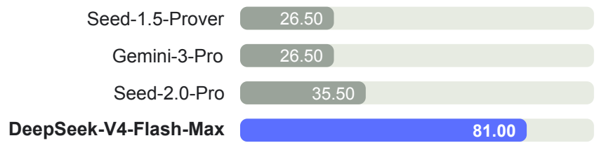


_前沿范式
Putnam-2025：结合混合形式-非形式推理与大规模算力扩展。_


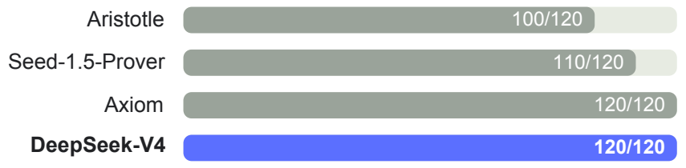


_图 8 | 实用型与前沿范式下的形式推理。左图：Putnam-200 Pass@8 沿用 Seed-Prover 引入的设置，对 PutnamBench (Tsoukalas et al., 2024) 的一个固定随机子集进行评估；所有模型均在相同的问题集上测试。我们遵循 Seed-Prover 协议，但用开源的 LeanExplore (Asher, 2025) 替换了专有的搜索工具，从而构建了一个使用极简智能体工具和有界采样的轻量级设置。右图：Putnam-2025 在扩展的混合形式-非形式范式下探索数学推理的前沿，其中非形式推理与形式验证相结合以发现漏洞并提高严谨性；DeepSeek-V4 达到了 120/120 的完美证明成绩。_


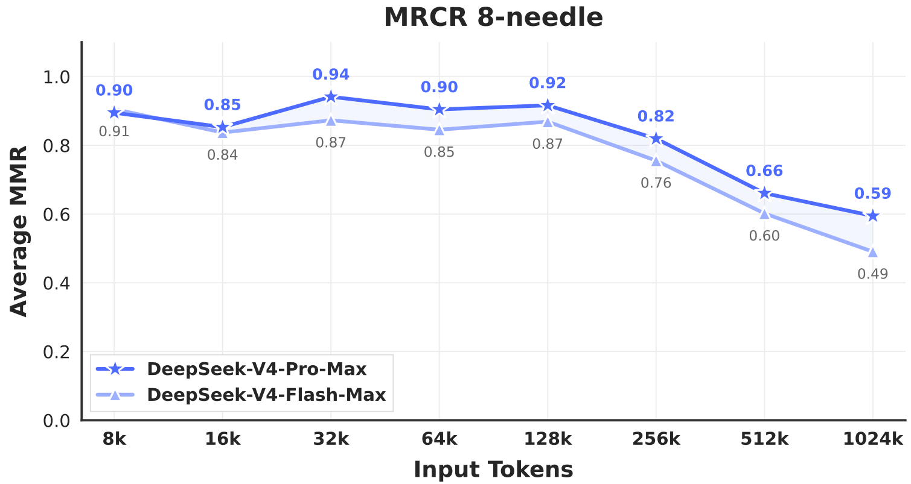


_图 9 | DeepSeek-V4 系列在 MRCR 任务上的表现。_


1M-Token 上下文。DeepSeek-V4-Pro 在衡量上下文检索能力的 MRCR 任务上优于 Gemini-3.1-Pro，但仍落后于 Claude Opus 4.6。如图 9 所示，在 128K 上下文窗口内，检索性能保持高度稳定。虽然在超过 128K 标记后性能下降变得明显，但在 1M token 时，该模型的检索能力与专有及开源同类模型相比仍然表现出色。与 MRCR 不同，CorpusQA 更接近真实场景。评估结果也表明 DeepSeek-V4-Pro 优于 Gemini-3.1-Pro。

推理投入。如表 7 所示，在最具挑战性的任务上，使用更长上下文并在强化学习中减少长度惩罚的 Max 模式优于 High 模式。图 10 展示了 DeepSeek-V4-Pro、DeepSeek-V4-Flash 和 DeepSeek-V3.2 在代表性推理和智能体任务上的性能与成本对比。通过扩展测试时算力，DeepSeek-V4 系列相比前代实现了显著提升。此外，在 HLE 等推理任务上，DeepSeek-V4-Pro 展现出比……更高的 token 效率

---

---

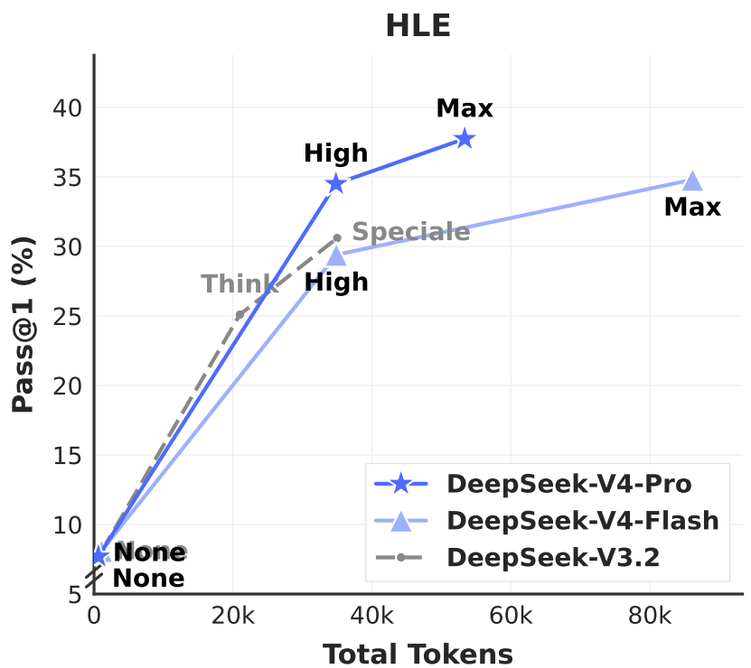


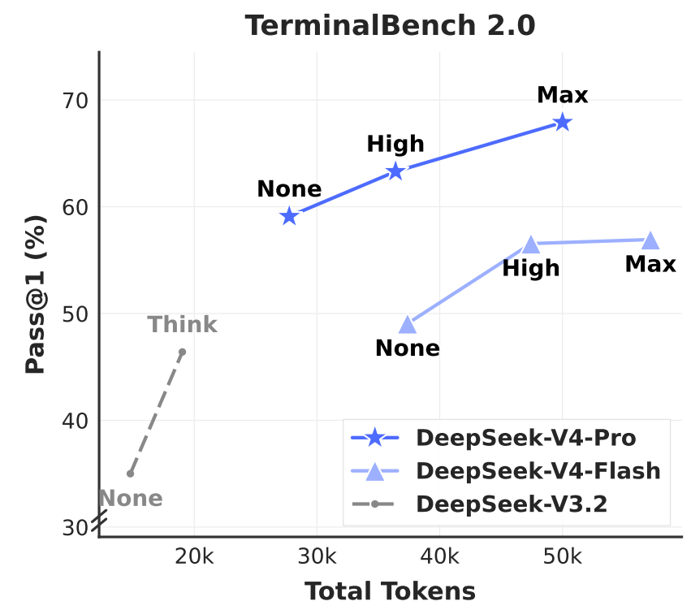


_图 10 | 不同推理强度下的 HLE 和 Terminal Bench 2.0 性能。“None” 表示非思考模式，“Speciale” 表示 DeepSeek-V3.2-Speciale 模型。_


DeepSeek-V3.2.


# 5.4. 真实任务上的性能


标准化基准测试往往难以捕捉多样化、真实世界任务的复杂性，导致测试结果与实际用户体验之间存在差距。为了弥合这一差距，我们开发了专有的内部指标，优先考虑真实世界的使用模式，而非传统的基准测试。这种方法确保我们的优化能够转化为切实的效益。我们的评估框架专门针对 DeepSeek API 和聊天机器人的主要用例，使模型性能与实际需求保持一致。


# 5.4.1. 中文写作


DeepSeek 的主要用例之一是中文写作。我们在功能性写作和创意写作方面进行了严格的评估。表 12 展示了 DeepSeek-V4-Pro 与 Gemini-3.1-Pro 在功能性写作任务上的成对比较。这些任务由常见的日常写作查询组成，其中的提示通常简洁明了。选择 Gemini-3.1-Pro 作为基线，是因为在我们的评估中，它是中文写作方面表现最佳的外部模型。结果表明，DeepSeek-V4-Pro 的整体胜率为 \(62.7\%\)，而基线为 \(34.1\%\)，优于基线；这主要是因为 Gemini 在中文写作场景中，偶尔会允许其固有的风格偏好覆盖用户的明确要求。


表 13 展示了创意写作的比较，该比较从指令遵循和写作质量两个维度进行评估。与 Gemini-3.1-Pro 相比，DeepSeek-V4-Pro 在指令遵循方面的胜率为 \(60.0\%\)，在写作质量方面的胜率为 \(77.5\%\)，表明在指令遵循方面略有改善，在写作质量方面有显著提升。尽管 DeepSeek-V4-Pro 在整体用户案例分析中取得了更优的结果，但仅针对最具挑战性的提示——特别是涉及高复杂性约束或多轮对话的场景——进行的评估显示，Claude Opus 4.5 相比 DeepSeek-V4-Pro 仍保持性能优势。如表 14 所示，Claude Opus 4.5 的胜率为 \(52.0\%\)，而 DeepSeek-V4-Pro 为 \(45.9\%\)。

---

---

# 5.4.2. 搜索

搜索增强问答是 DeepSeek 聊天机器人的核心能力。在 DeepSeek 网页版和 App 上，“非思考”模式采用检索增强搜索（RAG），而“思考”模式则采用智能体搜索。

检索增强搜索。我们进行了一项成对评估，在客观和主观问答类别上比较了 DeepSeek-V4-Pro 和 DeepSeek-V3.2。如表 11 所示，DeepSeek-V4-Pro 以显著优势超越了 DeepSeek-V3.2，在两个类别中都表现出了一致的优势。最显著的提升体现在单值搜索和规划与策略任务中，这表明 DeepSeek-V4-Pro 在定位精确的事实性答案以及从检索的上下文中综合结构化计划方面表现出色。然而，DeepSeek-V3.2 在比较和推荐任务上仍然具有相对竞争力，这表明 DeepSeek-V4-Pro 在需要对搜索结果进行平衡、多视角推理的场景中仍有潜在的改进空间。

智能体搜索。与标准 RAG 不同，智能体搜索赋予模型根据查询迭代调用搜索和获取工具的能力，从而显著提升了整体搜索性能。针对 DeepSeek-Chat 中的思考模式，我们优化了智能体搜索功能，以在预定义的“思考预算”内最大化响应准确性。如表 9 所示，智能体搜索始终优于 RAG，特别是在复杂任务上。此外，其成本保持高效，智能体搜索仅比标准 RAG 略贵（见表 10）。

# 5.4.3. 白领任务

为了严格评估模型在复杂的企业生产力场景中的实用性，我们构建了一套包含 30 个高级中文专业任务的综合测试集。这些工作流程特意涵盖了高层次的认知需求，包括深度信息分析、综合文档生成和精细的文档编辑，涉及 13 个关键行业（如金融、教育、法律和技术）的广泛领域。评估是在配备有 Bash 和网络搜索等基本工具的内部智能体测试平台中进行的。

鉴于这些任务的开放性，自动化指标通常难以捕捉高质量响应的细微差别。因此，我们进行了人工评估，以比较 DeepSeek-V4-Pro-Max 与 Opus-4.6-Max 的性能。标注员在四个维度上对模型输出进行了盲测评估：

- **任务完成度**：核心问题是否已成功解决。
- **指令遵循**：对特定约束和指令的遵守情况。
- **内容质量**：事实准确性、逻辑连贯性和专业语气。
- **格式美观度**：布局可读性和视觉呈现。

如图 11 所示，DeepSeek-V4-Pro-Max 在各种中文白领任务上均优于 Opus-4.6-Max，达到了令人印象深刻的 63% 的无负胜率，并在分析、生成和编辑任务中表现出一致的优势。图 12 所示的详细维度分数突显了该模型在任务完成度和……方面的主要优势

---

**内容质量**。具体而言，DeepSeek-V4-Pro-Max 能够通过频繁提供补充性见解和自我验证步骤，主动预判用户的隐含意图。它在长文本生成方面也表现出色，能够提供深入、连贯的叙述，而不是像 Opus-4.6-Max 那样经常依赖过于简化的要点列表。此外，该模型严格遵守正式的专业规范，例如标准化的中文层级编号。然而，在**指令遵循**方面，它偶尔会忽略特定的格式约束，并略逊于 Opus。此外，该模型在将大量文本输入浓缩为简明摘要方面表现稍弱。最后，在**格式美观度**方面，关于演示文稿的整体视觉设计，仍有很大的提升空间。图 13、14 和 15 展示了几个测试用例；由于某些输出篇幅较长，此处仅显示部分页面。


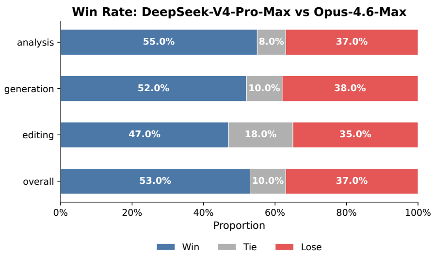


_图 11 | 分析、生成、编辑任务及整体表现的胜率对比。_


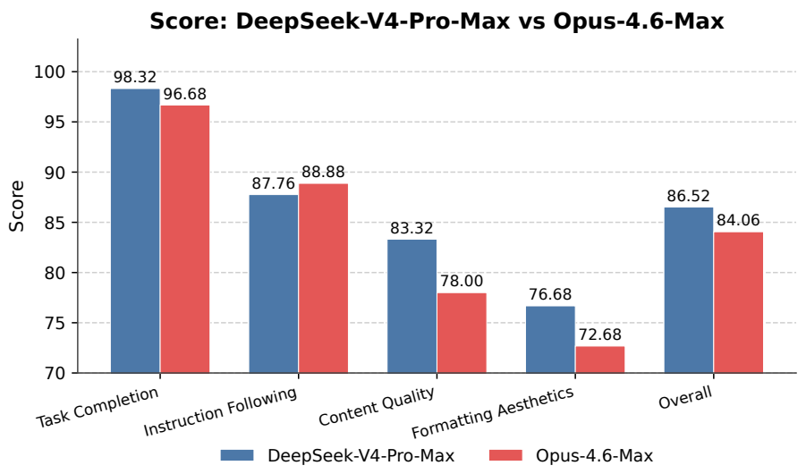


_图 12 | 包含任务完成度、内容质量、格式美观度和指令遵循的详细维度评分。_


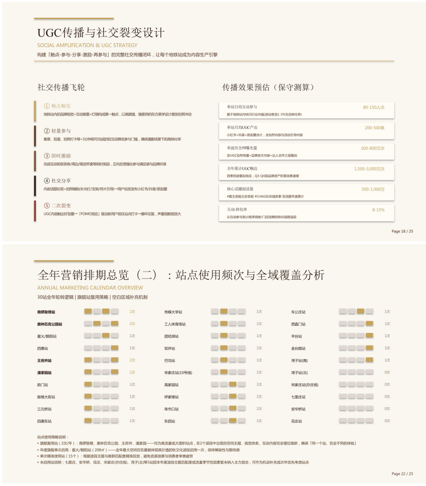


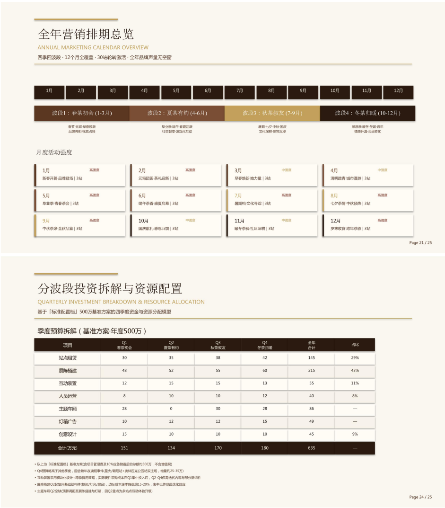


_图 13 | 一项任务示例输出，该任务要求为某热门珍珠奶茶品牌与北京地铁起草联合营销提案。_

---

---

# 5.4.4. 代码代理


为了评估我们代码代理的能力，我们从真实的内部研发工作流中精选了任务。我们从 50 多名内部工程师那里收集了约 200 项具有挑战性的任务，涵盖功能开发、错误修复、重构和诊断，涉及 PyTorch、CUDA、Rust 和 C++ 等多种技术栈。每项任务都附有其原始仓库、相应的执行环境以及人工标注的评分标准；经过严格的质量筛选，最终保留了 30 项任务作为评估集。如表 8 所示，DeepSeek-V4-Pro 显著优于 Claude Sonnet 4.5，并接近 Claude Opus 4.5 的水平。


_表 8 | 研发编码基准测试对比（外部模型仅用于评估目的）。_


<table><tr><td>模型</td><td>Haiku 4.5</td><td>Sonnet 4.5</td><td>DeepSeek-V4-Pro-Max</td><td>Opus 4.5</td><td>Opus 4.5 Thinking</td><td>Opus 4.6 Thinking</td></tr><tr><td>通过率 (%)</td><td>13</td><td>47</td><td>67</td><td>70</td><td>73</td><td>80</td></tr></table>


在一项针对 DeepSeek 开发人员和研究人员（\(N = 85\)）的调查中——所有人都有在日常工作中使用 DeepSeek-V4-Pro 进行代理编码的经验——当被问及与其他前沿模型相比，DeepSeek-V4-Pro 是否已准备好作为其默认和主要的编码模型时，52% 的人回答是，39% 的人倾向于肯定，只有不到 9% 的人回答否。受访者认为 DeepSeek-V4-Pro 在大多数任务中都能交付令人满意的结果，但也指出存在一些细微错误、对模糊提示词的误解以及偶尔的“过度思考”问题。


# 6. 结论、局限性与未来方向


在这项工作中，我们展示了 DeepSeek-V4 系列的预览版本，旨在打造突破超长上下文处理效率瓶颈的下一代大型语言模型。通过结合 CSA 和 HCA 的混合注意力架构，DeepSeek-V4 系列在长序列效率上实现了巨大的飞跃。架构创新与广泛的基础设施优化相结合，使得对百万级 Token 上下文的高效原生支持成为可能，并为未来的测试时扩展、长跨度任务以及在线学习等新兴范式奠定了必要的基础。评估结果表明，DeepSeek-V4-Pro 的最大推理努力模式 DeepSeek-V4-Pro-Max 重新定义了开放模型的最先进水平。它在知识基准测试中大幅超越此前的开源模型，实现了接近前沿专有模型的卓越推理性能，并交付了具有竞争力的代理能力。同时，DeepSeek-V4-Flash-Max 在保持高性价比架构的同时，达到了与领先闭源模型相当的推理性能。我们相信 DeepSeek-V4 系列为开放模型开启了百万级长度上下文的新时代，并铺平了通往更高效率、更大规模和更强智能的道路。


为了追求极致的长上下文效率，DeepSeek-V4 系列采用了大胆的架构设计。为了最小化风险，我们保留了许多经过初步验证的组件和技巧，虽然这些做法行之有效，但也使得架构相对复杂。在未来的迭代中，我们将进行更全面、更具原则性的探索，将架构精简至最核心的设计，使其在不牺牲性能的前提下更加优雅。同时，尽管“预期路由”和“SwiGLU 钳位”已被证明能有效缓解训练不稳定性，但其背后的原理仍未被充分理解。我们将积极研究关于训练稳定性的基础问题，并加强内部指标监控，旨在探索一种更具原则性和可预测性的大规模稳定训练方法。

---

---

此外，除了混合专家和稀疏注意力架构之外，我们还将积极探索沿新维度的模型稀疏性——例如更稀疏的嵌入模块（Cheng et al., 2026）——以便在不牺牲能力的前提下进一步提高计算和内存效率。我们将持续研究低延迟架构和系统技术，使长上下文的部署和交互更加灵敏。此外，我们认识到长周期、多轮智能体任务的重要性和实用价值，并将继续在该方向上进行迭代和探索。我们也在致力于为模型整合多模态能力。最后，我们承诺开发更好的数据筛选和合成策略，以便在日益广泛的场景和任务中持续提升模型的智能性、鲁棒性和实用性。

# 参考文献


AA. Gdpval-AA 排行榜, 2025. URL https://artificialanalysis.ai/methodology/intelligence-benchmarking#gdpval-AA.


T. Achim, A. Best, A. Bietti, K. Der, M. Fédérico, S. Gukov, D. Halpern-Leistner, K. Henningsgard, Y. Kudryashov, A. Meiburg, 等. Aristotle: 国际奥数级自动定理证明. arXiv 预印本 arXiv:2510.01346, 2025.


A. Agache, M. Brooker, A. Florescu, A. Iordache, A. Liguori, R. Neugebauer, P. Piwonka, 和 D.-M. Popa. Firecracker: 用于无服务器应用程序的轻量级虚拟化. 见 17th Usenix Conference on Networked Systems Design and Implementation 论文集, NSDI'20, 页 419-434, USA, 2020. USENIX Association. ISBN 9781939133137.


O. J. Aimuyo, B. Oh, 和 R. Singh. Flashmoe: 单内核中的快速分布式混合专家. 神经信息处理系统进展, 2025. URL https://neurips.cc/virtual/2025/poster/119124.


J. Ainslie, J. Lee-Thorp, M. de Jong, Y. Zemlyanskiy, F. Lebrón, 和 S. Sanghai. Gqa: 从多头检查点训练广义多查询 Transformer 模型. arXiv 预印本 arXiv:2305.13245, 2023.


J. Asher. LeanExplore: Lean 4 声明的搜索引擎, 2025. URL https://arxiv.org/abs/2506.11085.


Y. Bai, Y. Bao, G. Chen, J. Chen, N. Chen, R. Chen, Y. Chen, Y. Chen, Y. Chen, Z. Chen, J. Cui, H. Ding, M. Dong, A. Du, C. Du, D. Du, Y. Du, Y. Fan, Y. Feng, K. Fu, B. Gao, H. Gao, P. Gao, T. Gao, X. Gu, L. Guan, H. Guo, J. Guo, H. Hu, X. Hao, T. He, W. He, W. He, C. Hong, Y. Hu, Z. Hu, W. Huang, Z. Huang, Z. Huang, T. Jiang, Z. Jiang, X. Jin, Y. Kang, G. Lai, C. Li, F. Li, H. Li, M. Li, W. Li, Y. Li, Y. Li, Z. Li, H. Lin, X. Lin, Z. Lin, C. Liu, C. Liu, H. Liu, J. Liu, J. Liu, L. Liu, S. Liu, T. Y. Liu, T. Liu, W. Liu, Y. Liu, Y. Liu, Y. Liu, Z. Liu, E. Lu, L. Lu, S. Ma, X. Ma, Y. Ma, S. Mao, J. Mei, X. Men, Y. Miao, S. Pan, Y. Peng, R. Qin, B. Qu, Z. Shang, L. Shi, S. Shi, F. Song, J. Su, Z. Su, X. Sun, F. Sung, H. Tang, J. Tao, Q. Teng, C. Wang, D. Wang, F. Wang, 和 H. Wang. Kimi K2: 开放式智能体智能. CoRR, abs/2507.20534, 2025a. URL https://doi.org/10.48550/arXiv.2507.20534.


Y. Bai, S. Tu, J. Zhang, H. Peng, X. Wang, X. Lv, S. Cao, J. Xu, L. Hou, Y. Dong, 等. Longbench v2: 迈向对现实世界长上下文多任务更深入的理解与推理. 见 计算语言学协会第 63 届年会论文集 (第 1 卷: 长论文), 页 3639-3664, 2025b.

---

M. Balunović, J. Dekoninck, I. Petrov, N. Jovanović, and M. Vechev. Matharena: Evaluating llms on uncontaminated math competitions. Proceedings of the Neural Information Processing Systems Track on Datasets and Benchmark, 2025.

M. Balunović, J. Dekoninck, I. Petrov, N. Jovanović 和 M. Vechev. Matharena: 在无污染数学竞赛上评估大语言模型. 神经信息处理系统数据集与基准研讨会论文集, 2025.

C. Bandi, B. Hertzberg, G. Boo, T. Polakam, J. Da, S. Hassaan, M. Sharma, A. Park, E. Hernandez, D. Rambado, et al. MCP-atlas: A large-scale benchmark for tool-use competency with real mcp servers. arXiv preprint arXiv:2602.00933, 2026.

C. Bandi, B. Hertzberg, G. Boo, T. Polakam, J. Da, S. Hassaan, M. Sharma, A. Park, E. Hernandez, D. Rambado 等. MCP-atlas: 基于真实 MCP 服务器的工具使用能力大规模基准测试. arXiv 预印本 arXiv:2602.00933, 2026.

F. Bellard. Qemu, a fast and portable dynamic translator. In Proceedings of the Annual Conference on USENIX Annual Technical Conference, ATEC '05, page 41, USA, 2005. USENIX Association.

F. Bellard. Qemu，一种快速且可移植的动态翻译器. 见 USENIX 年度技术会议论文集, ATEC '05, 第 41 页, 美国, 2005. USENIX 协会.

I. Bello, H. Pham, Q. V. Le, M. Norouzi, and S. Bengio. Neural combinatorial optimization with reinforcement learning, 2017. URL https://openreview.net/forum?id=rJY3vK9eg.

I. Bello, H. Pham, Q. V. Le, M. Norouzi 和 S. Bengio. 基于强化学习的神经组合优化, 2017. URL https://openreview.net/forum?id=rJY3vK9eg.

J. Chen, W. Chen, J. Du, J. Hu, Z. Jiang, A. Jie, X. Jin, X. Jin, C. Li, W. Shi, Z. Wang, M. Wang, C. Wei, S. Wei, H. Xin, F. Yang, W. Gao, Z. Yuan, T. Zhan, Z. Zheng, T. Zhou, and T. H. Zhu. Seed-prover 1.5: Mastering undergraduate-level theorem proving via learning from experience, 2025. URL https://arxiv.org/abs/2512.17260.

J. Chen, W. Chen, J. Du, J. Hu, Z. Jiang, A. Jie, X. Jin, X. Jin, C. Li, W. Shi, Z. Wang, M. Wang, C. Wei, S. Wei, H. Xin, F. Yang, W. Gao, Z. Yuan, T. Zhan, Z. Zheng, T. Zhou 和 T. H. Zhu. Seed-prover 1.5: 通过经验学习掌握本科水平的定理证明, 2025. URL https://arxiv.org/abs/2512.17260.

M. Chen, J. Tworek, H. Jun, Q. Yuan, H. P. de Oliveira Pinto, J. Kaplan, H. Edwards, Y. Burda, N. Joseph, G. Brockman, A. Ray, R. Puri, G. Krueger, M. Petrov, H. Khlaaf, G. Sastry, P. Mishkin, B. Chan, S. Gray, N. Ryder, M. Pavlov, A. Power, L. Kaiser, M. Bavarian, C. Winter, P. Tillet, F. P. Such, D. Cummings, M. Plappert, F. Chantzis, E. Barnes, A. Herbert-Voss, W. H. Guss, A. Nichol, A. Paino, N. Tezak, J. Tang, I. Babuschkin, S. Balaji, S. Jain, W. Saunders, C. Hesse, A. N. Carr, J. Leike, J. Achiam, V. Misra, E. Morikawa, A. Radford, M. Knight, M. Brundage, M. Murati, K. Mayer, P. Welinder, B. McGrew, D. Amodei, S. McCandlish, I. Sutskever, and W. Zaremba. Evaluating large language models trained on code. CoRR, abs/2107.03374, 2021. URL https://arxiv.org/abs/2107.03374.

M. Chen, J. Tworek, H. Jun, Q. Yuan, H. P. de Oliveira Pinto, J. Kaplan, H. Edwards, Y. Burda, N. Joseph, G. Brockman, A. Ray, R. Puri, G. Krueger, M. Petrov, H. Khlaaf, G. Sastry, P. Mishkin, B. Chan, S. Gray, N. Ryder, M. Pavlov, A. Power, L. Kaiser, M. Bavarian, C. Winter, P. Tillet, F. P. Such, D. Cummings, M. Plappert, F. Chantzis, E. Barnes, A. Herbert-Voss, W. H. Guss, A. Nichol, A. Paino, N. Tezak, J. Tang, I. Babuschkin, S. Balaji, S. Jain, W. Saunders, C. Hesse, A. N. Carr, J. Leike, J. Achiam, V. Misra, E. Morikawa, A. Radford, M. Knight, M. Brundage, M. Murati, K. Mayer, P. Welinder, B. McGrew, D. Amodei, S. McCandlish, I. Sutskever 和 W. Zaremba. 评估基于代码训练的大语言模型. CoRR, abs/2107.03374, 2021. URL https://arxiv.org/abs/2107.03374.

T. Chen, T. Moreau, Z. Jiang, L. Zheng, E. Yan, H. Shen, M. Cowan, L. Wang, Y. Hu, L. Ceze, C. Guestrin, and A. Krishnamurthy. TVM: An automated End-to-End optimizing compiler for deep learning. In 13th USENIX Symposium on Operating Systems Design and Implementation (OSDI 18), pages 578-594, Carlsbad, CA, Oct. 2018. USENIX Association. ISBN 978-1-939133-08-3. URL https://www.usenix.org/conference/osdi18/presentation/chen.

T. Chen, T. Moreau, Z. Jiang, L. Zheng, E. Yan, H. Shen, M. Cowan, L. Wang, Y. Hu, L. Ceze, C. Guestrin 和 A. Krishnamurthy. TVM: 一种用于深度学习的端到端自动化优化编译器. 见第 13 届 USENIX 操作系统设计与实现研讨会 (OSDI 18), 第 578-594 页, 加利福尼亚州卡尔斯巴德, 2018 年 10 月. USENIX 协会. ISBN 978-1-939133-08-3. URL https://www.usenix.org/conference/osdi18/presentation/chen.

A. Cheng, A. Jacovi, A. Globerson, B. Golan, C. Kwong, C. Alberti, C. Tao, E. Ben-David, G. S. Tomar, L. Haas, et al. The facts leaderboard: A comprehensive benchmark for large language model factuality. arXiv preprint arXiv:2512.10791, 2025.

A. Cheng, A. Jacovi, A. Globerson, B. Golan, C. Kwong, C. Alberti, C. Tao, E. Ben-David, G. S. Tomar, L. Haas 等. 事实排行榜: 大语言模型事实性的综合基准测试. arXiv 预印本 arXiv:2512.10791, 2025.

X. Cheng, W. Zeng, D. Dai, Q. Chen, B. Wang, Z. Xie, K. Huang, X. Yu, Z. Hao, Y. Li, H. Zhang, H. Zhang, D. Zhao, and W. Liang. Conditional memory via scalable lookup: A new axis of sparsity for large language models. CoRR, abs/2601.07372, 2026. doi: 10.48550/ARXIV.2601.07372. URL https://doi.org/10.48550/arXiv.2601.07372.

X. Cheng, W. Zeng, D. Dai, Q. Chen, B. Wang, Z. Xie, K. Huang, X. Yu, Z. Hao, Y. Li, H. Zhang, H. Zhang, D. Zhao 和 W. Liang. 基于可扩展查找的条件记忆: 大语言模型稀疏性的新维度. CoRR, abs/2601.07372, 2026. doi: 10.48550/ARXIV.2601.07372. URL https://doi.org/10.48550/arXiv.2601.07372.

K. Cobbe, V. Kosaraju, M. Bavarian, M. Chen, H. Jun, L. Kaiser, M. Plappert, J. Tworek, J. Hilton, R. Nakano, et al. Training verifiers to solve math word problems. arXiv preprint arXiv:2110.14168, 2021.

K. Cobbe, V. Kosaraju, M. Bavarian, M. Chen, H. Jun, L. Kaiser, M. Plappert, J. Tworek, J. Hilton, R. Nakano 等. 训练验证器解决数学应用题. arXiv 预印本 arXiv:2110.14168, 2021.

D. Dai, C. Deng, C. Zhao, R. X. Xu, H. Gao, D. Chen, J. Li, W. Zeng, X. Yu, Y. Wu, Z. Xie, Y. K. Li, P. Huang, F. Luo, C. Ruan, Z. Sui, and W. Liang. Deepseekmoe: Towards ultimate expert specialization in mixture-of-experts language models. CoRR, abs/2401.06066, 2024. URL https://doi.org/10.48550/arXiv.2401.06066.

D. Dai, C. Deng, C. Zhao, R. X. Xu, H. Gao, D. Chen, J. Li, W. Zeng, X. Yu, Y. Wu, Z. Xie, Y. K. Li, P. Huang, F. Luo, C. Ruan, Z. Sui 和 W. Liang. Deepseekmoe: 迈向混合专家语言模型的极致专家专业化. CoRR, abs/2401.06066, 2024. URL https://doi.org/10.48550/arXiv.2401.06066.

---

T. Dao, D. Haziza, F. Massa, and G. Sizov. Flash-decoding for long-context inference, 2023. URL https://pytorch.org/blog/flash-decoding/.


L. De Moura and N. Bjørner. Z3: an efficient smt solver. In Proceedings of the Theory and Practice of Software, 14th International Conference on Tools and Algorithms for the Construction and Analysis of Systems, TACAS'08/ETAPS'08, page 337-340, Berlin, Heidelberg, 2008. Springer-Verlag. ISBN 3540787992.


DeepSeek-AI. Deepseek-coder-v2: Breaking the barrier of closed-source models in code intelligence. CoRR, abs/2406.11931, 2024. URL https://doi.org/10.48550/arXiv.2406.11931.


DeepSeek-AI. Deepseek-v3 technical report. CoRR, abs/2412.19437, 2024. URL https://doi.org/10.48550/arXiv.2412.19437.


DeepSeek-AI. Deepseek-v2: A strong, economical, and efficient mixture-of-experts language model. CoRR, abs/2405.04434, 2024. URL https://doi.org/10.48550/arXiv.2405.04434.


DeepSeek-AI. Fire-flyer file system, 2025. URL https://github.com/deepseek-ai/3FS.


DeepSeek-AI. Deepseek-r1 incentivizes reasoning in llms through reinforcement learning. Nat., 645(8081):633-638, 2025. URL https://doi.org/10.1038/s41586-025-09422-z.


DeepSeek-AI. Deepseek-v3.2: Pushing the frontier of open large language models, 2025. URL https://arxiv.org/abs/2512.02556.


X. Deng, J. Da, E. Pan, Y. Y. He, C. Ide, K. Garg, N. Lauffer, A. Park, N. Pasari, C. Rane, K. Sampath, M. Krishnan, S. Kundurthy, S. Hendryx, Z. Wang, V. Bharadwaj, J. Holm, R. Aluri, C. B. C. Zhang, N. Jacobson, B. Liu, and B. Kenstler. Swe-bench pro: Can ai agents solve long-horizon software engineering tasks?, 2025. URL https://arxiv.org/abs/2509.16941.


H. Ding, Z. Wang, G. Paolini, V. Kumar, A. Deoras, D. Roth, and S. Soatto. Fewer truncations improve language modeling. arXiv preprint arXiv:2404.10830, 2024.


X. Dong, Y. Fu, S. Diao, W. Byeon, Z. CHEN, A. S. Mahabaleshwarkar, S.-Y. Liu, M. V. keirsbilck, M.-H. Chen, Y. Suhara, Y. C. Lin, J. Kautz, and P. Molchanov. Hymba: A hybrid-head architecture for small language models. In The Thirteenth International Conference on Learning Representations, 2025. URL https://openreview.net/forum?id=A1ztozypga.


X. Du, Y. Yao, K. Ma, B. Wang, T. Zheng, K. Zhu, M. Liu, Y. Liang, X. Jin, Z. Wei, et al. Supergpqa: Scaling llm evaluation across 285 graduate disciplines. arXiv preprint arXiv:2502.14739, 2025.


D. Dua, Y. Wang, P. Dasigi, G. Stanovsky, S. Singh, and M. Gardner. DROP: A reading comprehension benchmark requiring discrete reasoning over paragraphs. In J. Burstein, C. Doran, and T. Solorio, editors, Proceedings of the 2019 Conference of the North American Chapter of the Association for Computational Linguistics: Human Language Technologies, NAACL-HLT 2019, Minneapolis, MN, USA, June 2-7, 2019, Volume 1 (Long and Short Papers), pages 2368-2378. Association for Computational Linguistics, 2019. doi: 10.18653/V1/N19-1246. URL https://doi.org/10.18653/v1/n19-1246.


X. Gao, M. Dong, X. Miao, W. Du, C. Yu, and H. Chen. Erofs: a compression-friendly readily file system for resource-scarce devices. In Proceedings of the 2019 USENIX Conference on Usenix Annual Technical Conference, USENIX ATC '19, page 149-162, USA, 2019. USENIX Association. ISBN 9781939133038.

---

---

A. P. Gema, J. O. J. Leang, G. Hong, A. Devoto, A. C. M. Mancino, R. Saxena, X. He, Y. Zhao, X. Du, M. R. G. Madani, C. Barale, R. McHardy, J. Harris, J. Kaddour, E. van Krieken, and P. Minervini. Are we done with mmlu? CoRR, abs/2406.04127, 2024. URL https://doi.org/10.48550/arXiv.2406.04127.


F. Gloeckle, B. Y. Idrissi, B. Rozière, D. Lopez-Paz, and G. Synnaeve. Better & faster large language models via multi-token prediction. In _Forty-first International Conference on Machine Learning_, ICML 2024, Vienna, Austria, July 21-27, 2024. OpenReview.net, 2024. URL https://openreview.net/forum?id=pEWAcejiU2.


L. Haas, G. Yona, G. D'Antonio, S. Goldshtein, and D. Das. Simpleqa verified: A reliable factuality benchmark to measure parametric knowledge. arXiv preprint arXiv:2509.07968, 2025.


Y. He, S. Li, J. Liu, Y. Tan, W. Wang, H. Huang, X. Bu, H. Guo, C. Hu, B. Zheng, et al. Chinese simpleqa: A chinese factuality evaluation for large language models. arXiv preprint arXiv:2411.07140, 2024.


D. Hendrycks, C. Burns, S. Basart, A. Zou, M. Mazeika, D. Song, and J. Steinhardt. Measuring massive multitask language understanding. arXiv preprint arXiv:2009.03300, 2020.


D. Hendrycks, C. Burns, S. Kadavath, A. Arora, S. Basart, E. Tang, D. Song, and J. Steinhardt. Measuring mathematical problem solving with the math dataset. arXiv preprint arXiv:2103.03874, 2021.


Y. Huang, Y. Bai, Z. Zhu, J. Zhang, J. Zhang, T. Su, J. Liu, C. Lv, Y. Zhang, J. Lei, et al. C-Eval: A multi-level multi-discipline chinese evaluation suite for foundation models. arXiv preprint arXiv:2305.08322, 2023.


D. Hupkes and N. Bogoychev. Multiloko: a multilingual local knowledge benchmark for llms spanning 31 languages. CoRR, abs/2504.10356, 2025. doi: 10.48550/ARXIV.2504.10356. URL https://doi.org/10.48550/arXiv.2504.10356.


B. Jacob, S. Kligys, B. Chen, M. Zhu, M. Tang, A. Howard, H. Adam, and D. Kalenichenko. Quantization and training of neural networks for efficient integer-arithmetic-only inference. In Proceedings of the IEEE Conference on Computer Vision and Pattern Recognition (CVPR), June 2018.


N. Jain, K. Han, A. Gu, W.-D. Li, F. Yan, T. Zhang, S. Wang, A. Solar-Lezama, K. Sen, and I. Stoica. Livecodebench: Holistic and contamination free evaluation of large language models for code. arXiv preprint arXiv:2403.07974, 2024.


K. Jordan, Y. Jin, V. Boza, J. You, F. Cesista, L. Newhouse, and J. Bernstein. Muon: An optimizer for hidden layers in neural networks. Cited on, page 10, 2024.


M. Joshi, E. Choi, D. Weld, and L. Zettlemoyer. TriviaQA: A large scale distantly supervised challenge dataset for reading comprehension. In R. Barzilay and M.-Y. Kan, editors, Proceedings of the 55th Annual Meeting of the Association for Computational Linguistics (Volume 1: Long Papers), pages 1601-1611, Vancouver, Canada, July 2017. Association for Computational Linguistics. doi: 10.18653/v1/P17-1147. URL https://aclanthology.org/P17-1147.


H. Li, Y. Yuan, R. Du, K. Ma, L. Liu, and W. Hsu. DADI: Block-Level image service for agile and elastic application deployment. In 2020 USENIX Annual Technical Conference (USENIX ATC 20), pages 727-740. USENIX Association, July 2020. ISBN 978-1-939133-14-4. URL https://www.usenix.org/conference/atc20/presentation/li-huiba.

---

---

H. Li, Y. Zhang, F. Koto, Y. Yang, H. Zhao, Y. Gong, N. Duan, and T. Baldwin. CMMLU: Measuring massive multitask language understanding in Chinese. arXiv preprint arXiv:2306.09212, 2023.


J. Li, W. Zhao, J. Zhao, W. Zeng, H. Wu, X. Wang, R. Ge, Y. Cao, Y. Huang, W. Liu, et al. The tool decathlon: Benchmarking language agents for diverse, realistic, and long-horizon task execution. arXiv preprint arXiv:2510.25726, 2025.


Y. Li, F. Wei, C. Zhang, and H. Zhang. EAGLE: speculative sampling requires rethinking feature uncertainty. In _Forty-first International Conference on Machine Learning_, ICML 2024, Vienna, Austria, July 21-27, 2024. OpenReview.net, 2024. URL https://openreview.net/forum?id=1NdN7eXyb4.


J. Liu, J. Su, X. Yao, Z. Jiang, G. Lai, Y. Du, Y. Qin, W. Xu, E. Lu, J. Yan, Y. Chen, H. Zheng, Y. Liu, S. Liu, B. Yin, W. He, H. Zhu, Y. Wang, J. Wang, M. Dong, Z. Zhang, Y. Kang, H. Zhang, X. Xu, Y. Zhang, Y. Wu, X. Zhou, and Z. Yang. Muon is scalable for LLM training. CoRR, abs/2502.16982, 2025. URL https://doi.org/10.48550/arXiv.2502.16982.


I. Loshchilov and F. Hutter. Decoupled weight decay regularization. arXiv preprint arXiv:1711.05101, 2017.


K. Lu and T. M. Lab. On-policy distillation. Thinking Machines Lab: Connectionism, 2025. doi: 10.64434/tml.20251026. https://thinkingmachines.ai/blog/on-policy-distillation.


Z. Lu, C. Li, Y. Shi, W. Shen, M. Yan, and F. Huang. CorpusQA: A 10 million token benchmark for corpus-level analysis and reasoning. arXiv preprint arXiv:2601.14952, 2026.


T. Luong, D. Hwang, H. H. Nguyen, G. Ghiasi, Y. Chervonyi, I. Seo, J. Kim, G. Bingham, J. Lee, S. Mishra, A. Zhai, C. H. Hu, H. Michalewski, J. Kim, J. Ahn, J. Bae, X. Song, T. H. Trinh, Q. V. Le, and J. Jung. Towards robust mathematical reasoning. In Proceedings of the 2025 Conference on Empirical Methods in Natural Language Processing, 2025. URL https://aclanthology.org/2025.emnlp-main.1794/.


M. A. Merrill, A. G. Shaw, N. Carlini, B. Li, H. Raj, I. Bercovich, L. Shi, J. Y. Shin, T. Walshe, E. K. Buchanan, et al. Terminal-bench: Benchmarking agents on hard, realistic tasks in command line interfaces. arXiv preprint arXiv:2601.11868, 2026.


MiniMax. Meet minimax-m2, 2025. URL https://github.com/MiniMax-AI/MiniMax-M2.


L. d. Moura and S. Ullrich. The lean 4 theorem prover and programming language. In International Conference on Automated Deduction, pages 625-635. Springer, 2021.


Y. Nesterov. A method of solving a convex programming problem with convergence rate \( O(1 / k^2) \). Soviet Mathematics Doklady, 27:372-376, 1983.


NVIDIA Corporation. cublas documentation, 2024. URL https://docs.nvidia.com/cuda /cublas/. Version 12.4. Accessed: 2024-09-16.


OpenAI. Multilingual massive multitask language understanding (mmmlu), 2024a. URL https://huggingface.co/datasets/openai/MMMLU.


OpenAI. Openai mrcr: Long context multiple needle in a haystack benchmark, 2024b. URL https://huggingface.co/datasets/openai/mrcr.

---

---

OpenAI. Learning to reason with llms, 2024c. URL https://openai.com/index/learning-to-reason-with-llms.


OpenAI. Introducing SimpleQA, 2024d. URL https://openai.com/index/introducing-simpleqa/.


OpenAI. Introducing SWE-bench verified we're releasing a human-validated subset of swe-bench that more, 2024e. URL https://openai.com/index/introducing-swe-bench-v-verified/.


OpenAI. gpt-oss-120b & gpt-oss-20b model card. CoRR, abs/2508.10925, 2025. doi: 10.48550/A RXIV.2508.10925. URL https://doi.org/10.48550/arXiv.2508.10925.


M. Osama, D. Merrill, C. Cecka, M. Garland, and J. D. Owens. Stream-k: Work-centric parallel decomposition for dense matrix-matrix multiplication on thegpu. In Proceedings of the 28th ACM SIGPLAN Annual Symposium on Principles and Practice of Parallel Programming, pages 429-431, 2023.


T. Patwardhan, R. Dias, E. Proehl, G. Kim, M. Wang, O. Watkins, S. P. Fishman, M. Aljubeh, P. Thacker, L. Fauconnet, et al. Gdpval: Evaluating ai model performance on real-world economically valuable tasks. arXiv preprint arXiv:2510.04374, 2025.


L. Phan, A. Gatti, Z. Han, N. Li, J. Hu, H. Zhang, C. B. C. Zhang, M. Shaaban, J. Ling, S. Shi, et al. Humanity's last exam. arXiv preprint arXiv:2501.14249, 2025.


W. Qi, Y. Yan, Y. Gong, D. Liu, N. Duan, J. Chen, R. Zhang, and M. Zhou. Prophetnet: Predicting future n-gram for sequence-to-sequence pre-training. In T. Cohn, Y. He, and Y. Liu, editors, Findings of the Association for Computational Linguistics: EMNLP 2020, Online Event, 16-20 November 2020, volume EMNLP 2020 of Findings of ACL, pages 2401-2410. Association for Computational Linguistics, 2020. URL https://doi.org/10.18653/v1/2020.f findings-emnlp.217.


Qwen. Qwen3 technical report. CoRR, abs/2505.09388, 2025. doi: 10.48550/ARXIV.2505.09388. URL https://doi.org/10.48550/arXiv.2505.09388.


S. Rajbhandari, J. Rasley, O. Ruwase, and Y. He. Zero: Memory optimizations toward training trillion parameter models. In SC20: International Conference for High Performance Computing, Networking, Storage and Analysis, pages 1-16. IEEE, 2020.


J. K. Reed, Z. DeVito, H. He, A. Ussery, and J. Ansel. Torch.fx: Practical program capture and transformation for deep learning in python, 2022. URL https://arxiv.org/abs/2112.08429.


D. Rein, B. L. Hou, A. C. Stickland, J. Petty, R. Y. Pang, J. Dirani, J. Michael, and S. R. Bowman. GPQA: A graduate-level google-proof q&a benchmark. arXiv preprint arXiv:2311.12022, 2023.


G. T. M. Riviere, S. Pathak, P. G. Sessa, C. Hardin, S. Bhupatiraju, L. Hussenot, T. Mesnard, B. Shahriari, A. Ram'e, J. Ferret, P. Liu, P. D. Tafti, A. Friesen, M. Casbon, S. Ramos, R. Kumar, C. L. Lan, S. Jerome, A. Tsitsulin, N. Vieillard, P. Stańczyk, S. Girgin, N. Momchev, M. Hoffman, S. Thakoor, J.-B. Grill, B. Neyshabur, A. Walton, A. Severyn, A. Parrish, A. Ahmad, A. Hutchison, A. Abdagic, A. Carl, A. Shen, A. Brock, A. Coenen, A. Laforge, A. Paterson, B. Bastian, B. Piot, B. Wu, B. Royal, C. Chen, C. Kumar, C. Perry, C. A. Welty, C. A. Choquette-Choo, D. Sinopalnikov, D. Weinberger, D. Vijaykumar, D. Rogozi'nska, D. Herbison, E. Bandy, E. Wang, E. Noland, E. Moreira, E. Senter, E. Eltyshev, F. Visin, G. Rasskin, G. Wei, G. Cameron

---

---

G. Martins, H. Hashemi, H. Klimczak-Pluci'nska, H. Batra, H. Dhand, I. Nardini, J. Mein, J. Zhou, J. Svensson, J. Stanway, J. Chan, J. Zhou, J. Carrasqueira, J. Iljazi, J. Becker, J. Fernandez, J. R. van Amersfoort, J. Gordon, J. Lipschultz, J. Newlan, J. Ji, K. Mohamed, K. Badola, K. Black, K. Millican, K. McDonell, K. Nguyen, K. Sodhia, K. Greene, L. L. Sjoesund, L. Usui, L. Sifre, L. Heuermann, L. cia Lago, L. McNealus, L. B. Soares, L. Kilpatrick, L. Dixon, L. L. B. Martins, M. Reid, M. Singh, M. Iverson, M. Gorner, M. Velloso, M. Wirth, M. Davidow, M. Miller, M. Rahtz, M. Watson, M. Risdal, M. Kazemi, M. Moynihan, M. Zhang, M. Kahng, M. Park, M. Rahman, M. Khatwani, N. Dao, N. shad Bardoliwalla, N. Devanathan, N. Dumai, N. Chauhan, O. Wahltinez, P. Botarda, P. Barnes, P. Barham, P. Michel, P. chong Jin, P. Georgiev, P. Culliton, P. Kuppala, R. Comanescu, R. Merhej, R. Jana, R. A. Rokni, R. Agarwal, R. Mullins, S. Saadat, S. M. M. Carthy, S. Perrin, S. M. R. Arnold, S. bastian Krause, S. Dai, S. Garg, S. Sheth, S. Ronstrom, S. Chan, T. Jordan, T. Yu, T. Eccles, T. Hennigan, T. Kocisky, T. Doshi, V. Jain, V. Yadav, V. Meshram, V. Dharmadhikari, W. Barkley, W. Wei, W. Ye, W. Han, W. Kwon X.Xu Z.ShenZ.GongZ.WeiV.CotrutaP.KirkA.RaoM.GiangL.PeranT.Warkentin E.CollinsJ.BarralZ.GhahramaniR.HadsellD.SculleyJ.BanksA.DraganS.Petrov O.VinyalsJ.DeanD.HassabisK.KavukcuogluC.FarabetE.Buchatskaya,S.Borgeaud N.Fiedel,A.Joulin,K.Kenealy,R.Dadashi,and A.Andreev.Gemma 2: Improving open language models at a practical size.arXiv preprint arXiv:2408.00118,2024


S. Roller, S. Sukhbaatar, A. Szlam, and J. Weston. Hash layers for large sparse models. In M. Ranzato, A. Beygelzimer, Y. N. Dauphin, P. Liang, and J. W. Vaughan, editors, Advances in Neural Information Processing Systems 34: Annual Conference on Neural Information Processing Systems 2021, NeurIPS 2021, December 6-14, 2021, virtual, pages 17555-17566, 2021. URL https://proceedings.neurips.cc/paper/2021/hash/92bf5e6240737 e0326ea59846a83e076-AAbstract.html.


B. D. Rouhani, R. Zhao, A. More, M. Hall, A. Khodamoradi, S. Deng, D. Choudhary, M. Cornea, E. Dellinger, K. Denolf, S. Dusan, V. Elango, M. Golub, A. Heinecke, P. James-Roxby, D. Jani, G. Kolhe, M. Langhammer, A. Li, L. Melnick, M. Mesmakhosroshahi, A. Rodriguez, M. Schulte, R. Shafipour, L. Shao, M. Siu, P. Dubey, P. Micikevicius, M. Naumov, C. Verrilli, R. Wittig, D. Burger, and E. Chung. Microscaling data formats for deep learning, 2023.


K. Sakaguchi, R. L. Bras, C. Bhagavatula, and Y. Choi. Winogrande: An adversarial winograd schema challenge at scale, 2019.


Z. Shao, Y. Luo, C. Lu, Z. Z. Ren, J. Hu, T. Ye, Z. Gou, S. Ma, and X. Zhang. Deepseekmath-v2: Towards self-verifiable mathematical reasoning, 2025. URL https://arxiv.org/abs/25.11.22570.


N. Shazeer. Fast transformer decoding: One write-head is all you need. CoRR, abs/1911.02150, 2019. URL http://arxiv.org/abs/1911.02150.


N. Shazeer. Glu variants improve transformer. arXiv preprint arXiv:2002.05202, 2020.


F. Shi, M. Suzgun, M. Freitag, X. Wang, S. Srivats, S. Vosoughi, H. W. Chung, Y. Tay, S. Ruder, D. Zhou, D. Das, and J. Wei. Language models are multilingual chain-of-thought reasoners. In The Eleventh International Conference on Learning Representations, ICLR 2023, Kigali, Rwanda, May 1-5, 2023. OpenReview.net, 2023. URL https://openreview.net/forum?i d=fR3wGCK-XXp.


J. Su, M. Ahmed, Y. Lu, S. Pan, W. Bo, and Y. Liu. Roformer: Enhanced transformer with rotary position embedding. Neurocomputing, 568:127063, 2024.

---

---

M. Suzgun, N. Scales, N. Scharli, S. Gehrmann, Y. Tay, H. W. Chung, A. Chowdhery, Q. V. Le, E. H. Chi, D. Zhou, 等. 具有挑战性的 BIG-Bench 任务及思维链是否能解决它们. arXiv 预印本 arXiv:2210.09261, 2022.


G. Tsoukalas, J. Lee, J. Jennings, J. Xin, M. Ding, M. Jennings, A. Thakur, 和 S. Chaudhuri. Putnambench: 在普特南数学竞赛上评估神经定理证明器, 2024. URL https://arxiv.org/abs/2407.11214.


A. Vaswani, N. Shazeer, N. Parmar, J. Uszkoreit, L. Jones, A. N. Gomez, L. Kaiser, 和 I. Polosukhin. Attention is all you need. 神经信息处理系统进展, 30, 2017.


L. Wang, H. Gao, C. Zhao, X. Sun, 和 D. Dai. 混合专家模型的无辅助损失负载均衡策略. CoRR, abs/2408.15664, 2024a. URL https://doi.org/10.48550/arXiv.2408.15664.


L. Wang, Y. Cheng, Y. Shi, Z. Mo, Z. Tang, W. Xie, T. Wu, L. Ma, Y. Xia, J. Xue, 等. Tilelang: 在现代神经网络算子中连接可编程性与性能. 见 第十四届国际学习表征会议, 2026.


Y. Wang, X. Ma, G. Zhang, Y. Ni, A. Chandra, S. Guo, W. Ren, A. Arulraj, X. He, Z. Jiang, T. Li, M. Ku, K. Wang, A. Zhuang, R. Fan, X. Yue, 和 W. Chen. MMLU-Pro: 一个更稳健且更具挑战性的多任务语言理解基准. CoRR, abs/2406.01574, 2024b. URL https://doi.org/10.48550/arXiv.2406.01574.


J. Wei, Z. Sun, S. Papay, S. McKinney, J. Han, I. Fulford, H. W. Chung, A. T. Passos, W. Fedus, 和 A. Glaese. BrowseComp: 一个针对浏览代理的简单但具有挑战性的基准. arXiv 预印本 arXiv:2504.12516, 2025.


T. Wei, J. Luan, W. Liu, S. Dong, 和 B. Wang. CMATH: 您的语言模型能通过中国小学数学测试吗？, 2023.


G. Xiao, Y. Tian, B. Chen, S. Han, 和 M. Lewis. 利用注意力汇的高效流式语言模型. 见 第十二届国际学习表征会议, ICLR 2024, 奥地利维也纳, 5月7-11日, 2024. OpenReview.net, 2024. URL https://openreview .net/forum?id=NG7sS51zVF.


Z. Xie, Y. Wei, H. Cao, C. Zhao, C. Deng, J. Li, D. Dai, H. Gao, J. Chang, K. Yu, L. Zhao, S. Zhou, Z. Xu, Z. Zhang, W. Zeng, S. Hu, Y. Wang, J. Yuan, L. Wang, 和 W. Liang. MHC: 流形约束超连接, 2026. URL https://arxiv.org/abs/2512.24880.


L. Xu, H. Hu, X. Zhang, L. Li, C. Cao, Y. Li, Y. Xu, K. Sun, D. Yu, C. Yu, Y. Tian, Q. Dong, W. Liu, B. Shi, Y. Cui, J. Li, J. Zeng, R. Wang, W. Xie, Y. Li, Y. Patterson, Z. Tian, Y. Zhang, H. Zhou, S. Liu, Z. Zhao, Q. Zhao, C. Yue, X. Zhang, Z. Yang, K. Richardson, 和 Z. Lan. CLUE: 中文语言理解评估基准. 见 D. Scott, N. Bel, 和 C. Zong 编, 第28届国际计算语言学会议论文集, COLING 2020, 西班牙巴塞罗那 (在线), 12月8-13日, 2020, 页码 4762-4772. International Committee on Computational Linguistics, 2020. doi: 10.18653/V1/2020.COLING-MAIN.419. URL https://doi.org/10.18653/v1/2020.coling-main.419.


J. Yang, K. Lieret, C. E. Jimenez, A. Wettig, K. Khandpur, Y. Zhang, B. Hui, O. Press, L. Schmidt, 和 D. Yang. SWE-Smith: 扩展软件工程代理的数据规模, 2025. URL https://arxiv.org/abs/2504.21798.

---

---

R. Zellers, A. Holtzman, Y. Bisk, A. Farhadi, and Y. Choi. HellaSwag: Can a machine really finish your sentence? In A. Korhonen, D. R. Traum, and L. Márquez, editors, *Proceedings of the 57th Conference of the Association for Computational Linguistics, ACL 2019, Florence, Italy, July 28-August 2, 2019, Volume 1: Long Papers*, pages 4791-4800. Association for Computational Linguistics, 2019. doi: 10.18653/v1/p19-1472. URL https://doi.org/10.18653/v1/p19-1472.


C. Zhang, K. Du, S. Liu, W. Kwon, X. Mo, Y. Wang, X. Liu, K. You, Z. Li, M. Long, J. Zhai, J. Gonzalez, and I. Stoica. Jenga: Effective memory management for serving llm with heterogeneity. In *Proceedings of the ACM SIGOPS 31st Symposium on Operating Systems Principles, SOSP '25*, page 446-461, New York, NY, USA, 2025a. Association for Computing Machinery. ISBN 9798400718700. doi: 10.1145/3731569.3764823. URL https://doi.org/10.1145/3731569.3764823.


S. Zhang, N. Zheng, H. Lin, Z. Jiang, W. Bao, C. Jiang, Q. Hou, W. Cui, S. Zheng, L.-W. Chang, Q. Chen, and X. Liu. Comet: Fine-grained computation-communication overlapping for mixture-of-experts. 2025b. URL https://arxiv.org/abs/2502.19811.


C. Zhao, L. Zhao, J. Li, Z. Xu, and C. Xu. Deepgemm: clean and efficient fp8 gemm kernels with fine-grained scaling. https://github.com/deepseek-ai/DeepGEMM, 2025.


W. Zhong, R. Cui, Y. Guo, Y. Liang, S. Lu, Y. Wang, A. Saied, W. Chen, and N. Duan. AGIEval: A human-centric benchmark for evaluating foundation models. CoRR, abs/2304.06364, 2023. doi: 10.48550/arXiv.2304.06364. URL https://doi.org/10.48550/arXiv.2304.06364.


D. Zhu, H. Huang, Z. Huang, Y. Zeng, Y. Mao, B. Wu, Q. Min, and X. Zhou. Hyperconnections. In *The Thirteenth International Conference on Learning Representations, ICLR 2025, Singapore, April 24-28, 2025*. OpenReview.net, 2025. URL https://openreview.net /forum?id=9FqARW7dwB.


X. Zhu, D. Cheng, H. Li, K. Zhang, E. Hua, X. Lv, N. Ding, Z. Lin, Z. Zheng, and B. Zhou. How to synthesize text data without model collapse? arXiv preprint arXiv:2412.14689, 2024.


T. Y. Zhuo, M. C. Vu, J. Chim, H. Hu, W. Yu, R. Widyasari, I. N. B. Yusuf, H. Zhan, J. He, I. Paul, S. Brunner, C. Gong, J. Hoang, A. R. Zebaze, X. Hong, W. Li, J. Kaddour, M. Xu, Z. Zhang, P. Yadav, and et al. Bigcodebench: Benchmarking code generation with diverse function calls and complex instructions. In *The Thirteenth International Conference on Learning Representations, ICLR 2025, Singapore, April 24-28, 2025*. OpenReview.net, 2025. URL http://openreview.net/forum?id=YrycTj11L0.

---

---

# 附录


# A. 作者列表与致谢


# A.1. 作者列表


作者按名字首字母顺序排列。标有 * 的姓名表示已离开我们团队的成员。


研究与工程：Anyi Xu, Bangcai Lin, Bing Xue, Bingxuan Wang*, Bingzheng Xu, Bochao Wu, Bowei Zhang, Chaofan Lin, Chen Dong, Chengda Lu, Chenggang Zhao, Chengqi Deng, Chenhao Xu, Chenze Shao, Chong Ruan*, Conner Sun, Damai Dai, Daya Guo*, Dejian Yang, Deli Chen, Donghao Li, Erhang Li, Fangyun Lin, Fangzhou Yuan, Feiyu Xia, Fucong Dai, Guangbo Hao, Guanting Chen, Guoai Cao, Guolai Meng, Guowei Li, Han Yu, Han Zhang, Hanwei Xu, Hao Li, Haofen Liang, Haoling Zhang, Haoming Luo, Haoran Wei*, Haotian Yuan, Haowei Zhang*, Haowen Luo, Haoyu Chen, Haozhe Ji, Honghui Ding, Hongxuan Tang, Huanqi Cao, Huazuo Gao, Hui Qu, Hui Zeng, J. Yang, J.Q. Zhu, Jia Yu, Jialiang Huang, Jiasheng Ye, Jiashi Li, Jiaxin Xu, Jiewen Hu, Jin Yan, Jingchang Chen, Jingli Zhou, Jingting Xiang, Jingyang Yuan, Jingyuan Cheng, Jinhua Zhu, Jiping Yu, Joseph Sun, Jun Ran*, Junguang Jiang, Junjie Qiu, Junlong Li*, Junxiao Song, Kai Dong, Kaige Gao, Kang Guan, Kexing Zhou, Kezhao Huang*, Kuai Yu, Lean Wang, Lecong Zhang, Lei Wang, Li Zhang, Liang Zhao, Lihua Guo, Lingxiao Luo, Linwang Ma, Litong Wang, Liyu Cai, Liyue Zhang, Longhao Chen, M.S. Di, M.Y Xu, Max Mei, Mingchuan Zhang, Minghua Zhang, Minghui Tang, Mingxu Zhou, Panpan Huang, Peixin Cong, Peiyi Wang, Qiancheng Wang, Qihao Zhu, Qingyang Li, Qinyu Chen, Qiushi Du, Qiwei Jiang, Rui Tian, Ruifan Xu, Ruijie Lu, Ruiling Xu, Ruiqi Ge, Ruisong Zhang, Ruizhe Pan, Runji Wang, Runqian Chen, Runqiu Yin, Runxin Xu, Ruomeng Shen, Ruoyu Zhang, S.H. Liu, Shanghao Lu, Shangyan Zhou, Shanhuang Chen, Shaofei Cai, Shaoheng Nie, Shaoyuan Chen, Shengding Hu, Shengyu Liu, Shiqiang Hu, Shirong Ma, Shiyu Wang, Shuiping Yu, Shunfeng Zhou, Shuting Pan, Shuying Yu, Songyang Zhou, Tao Ni, Tao Yun, Tian Jin, Tian Pei, Tian Ye, Tianle Lin, Tianran Ji, Tianyi Cui, Tianyuan Yue Tingting Yu Tun Wang W. Zhang Wangding Zeng Weilin Zhao Wen Liu Wenfeng Liang Wenjie Pang Wenjing Luo Wenjing Yao Wenjun Gao Wenkai Yang Wenlve Huang Wentao Zhang Wenting Ma Xi Gao Xiang He Xiangwen Wang Xiao Bi Xiaodong Liu Xiaohan Wang Xiaokang Chen Xiaokang Zhang Xiaotao Nie Xin ChengXin LiuXin Xie Xingchao Liu Xingchen Liu Xingkai Yu Xingyou Li Xinyu Yang Xu Chen Xuanyu Wang Xuecheng Su Xuheng Lin Xuwei Fu Y.C. Yan Y.Q.Wang*, Y.W.Ma Yanfeng Luo Yang Zhang Yanhong Xu Yanru Ma Yanwen Huang Yao Li Yao Zhao Yaofeng Sun Yaohui Wang Yi Qian Yi Yu Yichao Zhang Yifan Ding Yifan Shi Yijia Wu Yiliang Xiong Ying He Ying Zhou Yingjia Luo Yinmin Zhong Yishi Piao Yisong Wang Yixiang Zhang Yixiao Chen Yixuan Tan Yixuan Wei Yiyang Ma Yiyuan Liu Yonglun Yang Yongqiang Guo Yongtong Wu Yu Wu Yuan Cheng Yuan Ou Yuanfan Xu Yuanhao Li Yuduan Wang Yuhan Wu Yuhao Meng Yuheng Zou YuKun Li Yunfan Xiong Yupeng Chen Yuqian Cao Yuqian WangYushun ZhangYutong LinYuxian GuYuxiang LuoYuxiang YouYuxuan LiuYuxuan ZhouYuyang Zhou Yuzhen HuangZ.F. Wu Zehao Wang Zehua Zhao Zehui Ren Zhangli Sha Zhe Fu Zhean Xu Zhenda Xie Zhengyan Zhang Zhenen Hao Zhibin Gou Zhicheng Ma Zhigang Yan Zhihong Shao Zhixian Huang Zhixuan Chen Zhiyu Wu Zhizhou Ren Zhuoshu Li Zhuping Zhang Zian Xu Zihao Wang Zihui Gu Zijia Zhu Zilin Li Zipeng Zhang\* Ziwei Xie Ziyi Gao Zizheng Pan Zongqing Yao.


业务与合规：Chenchen Ling, Chengyu Hou, Dongjie Ji, Fang Wei, Hengqing Zhang, Jia Luo, Jia Song, Jialu Cai, Jian Liang, Jiangting Zhou, Jieyu Yang, Jin Chen, Jingzi Zhou, Junmin Zheng, Leyi Xia, Linyan Zhu, Miaojun Wang, Mingming Li, Minmin Han, Ning Wang, Panpan

---

---

Wang, Peng Zhang, Ruyi Chen, Shangmian Sun, Shaoqing Wu, W.L. Xiao, Wei An, Wenqing Hou, Xianzu Wang, Xiaowen Sun, Xiaoxiang Wang, Xinyu Zhang, Xueyin Chen, Yao Xu, Yi Shao, Yiling Ma, Ying Tang, Yuehan Yang, Yuer Xu, Yukun Zha, Yuping Lin, Yuting Yan, Zekai Zhang, Zhe Ju, Zheren Gao, Zhongyu Wu, Zihua Qu, Ziyi Wan.


# A.2. 致谢


我们要感谢 Dolly Deng 和其他测试人员，感谢他们针对 DeepSeek-V4 系列模型的能力提出的宝贵建议和反馈。


# B. 评估详情


_表 9 | DeepSeek-V4-Pro 的智能体搜索与检索增强搜索对比。_


<table><tr><td>难度</td><td>类别</td><td>#</td><td>智能体胜</td><td>RAG 胜</td><td>平局</td><td>智能体%</td><td>RAG%</td><td>平局%</td></tr><tr><td rowspan="2">简单</td><td>Objective Q&amp;A (客观问答)</td><td>196</td><td>110</td><td>43</td><td>43</td><td>56.1</td><td>21.9</td><td>21.9</td></tr><tr><td>Subjective Q&amp;A (主观问答)</td><td>321</td><td>198</td><td>56</td><td>67</td><td>61.7</td><td>17.4</td><td>20.9</td></tr><tr><td rowspan="2">困难</td><td>Objective Q&amp;A (客观问答)</td><td>168</td><td>102</td><td>33</td><td>33</td><td>60.7</td><td>19.6</td><td>19.6</td></tr><tr><td>Subjective Q&amp;A (主观问答)</td><td>184</td><td>126</td><td>27</td><td>31</td><td>68.5</td><td>14.7</td><td>16.8</td></tr><tr><td></td><td>Total (总计)</td><td>869</td><td>536</td><td>159</td><td>174</td><td>61.7</td><td>18.3</td><td>20.0</td></tr></table>


_表 10 | DeepSeek-V4-Pro 的成本对比：智能体搜索与检索增强搜索（平均值）。智能体搜索的大部分工具调用是并行的。_


<table><tr><td>版本</td><td>工具调用次数</td><td>预填充 (tokens)</td><td>输出 (tokens)</td></tr><tr><td>V4 智能体搜索</td><td>16.2</td><td>13649</td><td>1526</td></tr><tr><td>V4 检索增强搜索</td><td>—</td><td>10453</td><td>1308</td></tr></table>


_表 11 | DeepSeek-V4-Pro 和 DeepSeek-V3.2 在搜索问答任务上的对比评估。_


<table><tr><td rowspan="2">类别</td><td rowspan="2">子类别</td><td colspan="7">Internal Evaluation (内部综合评估)</td></tr><tr><td>#</td><td>V4 胜</td><td>V3.2 胜</td><td>平局</td><td>V4%</td><td>V3.2%</td><td>平局%</td></tr><tr><td rowspan="4">Objective Q&amp;A (客观问答)</td><td>Single-value Search (单值信息查找)</td><td>95</td><td>36</td><td>10</td><td>49</td><td>37.9</td><td>10.5</td><td>51.6</td></tr><tr><td>Entity Search (实体信息查找)</td><td>99</td><td>24</td><td>7</td><td>68</td><td>24.2</td><td>7.1</td><td>68.7</td></tr><tr><td>Enumerative Search (枚举型信息查找)</td><td>95</td><td>19</td><td>8</td><td>68</td><td>20.0</td><td>8.4</td><td>71.6</td></tr><tr><td>Subtotal (小计)</td><td>289</td><td>79</td><td>25</td><td>185</td><td>27.3</td><td>8.7</td><td>64.0</td></tr><tr><td rowspan="8">Subjective Q&amp;A (主观问答)</td><td>Causal Analysis (原因分析)</td><td>100</td><td>28</td><td>5</td><td>67</td><td>28.0</td><td>5.0</td><td>67.0</td></tr><tr><td>Comparison (对比)</td><td>96</td><td>28</td><td>20</td><td>48</td><td>29.2</td><td>20.8</td><td>50.0</td></tr><tr><td>Advice Seeking (寻求建议)</td><td>92</td><td>23</td><td>8</td><td>61</td><td>25.0</td><td>8.7</td><td>66.3</td></tr><tr><td>Recommendation (推荐)</td><td>95</td><td>26</td><td>19</td><td>50</td><td>27.4</td><td>20.0</td><td>52.6</td></tr><tr><td>Planning &amp; Strategy (攻略计划)</td><td>92</td><td>32</td><td>11</td><td>49</td><td>34.8</td><td>12.0</td><td>53.3</td></tr><tr><td>Opinion &amp; Evaluation (评价看法)</td><td>96</td><td>30</td><td>8</td><td>58</td><td>31.2</td><td>8.3</td><td>60.4</td></tr><tr><td>Trend Analysis (趋势分析)</td><td>96</td><td>23</td><td>3</td><td>70</td><td>24.0</td><td>3.1</td><td>72.9</td></tr><tr><td>Subtotal (小计)</td><td>667</td><td>190</td><td>74</td><td>403</td><td>28.5</td><td>11.1</td><td>60.4</td></tr><tr><td colspan="2">TOTAL (总计)</td><td>956</td><td>269</td><td>99</td><td>588</td><td>28.1</td><td>10.4</td><td>61.5</td></tr></table>

---

---

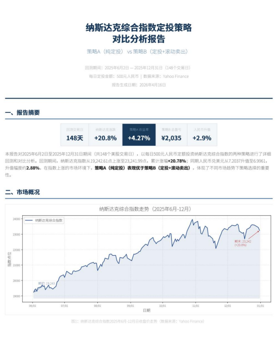


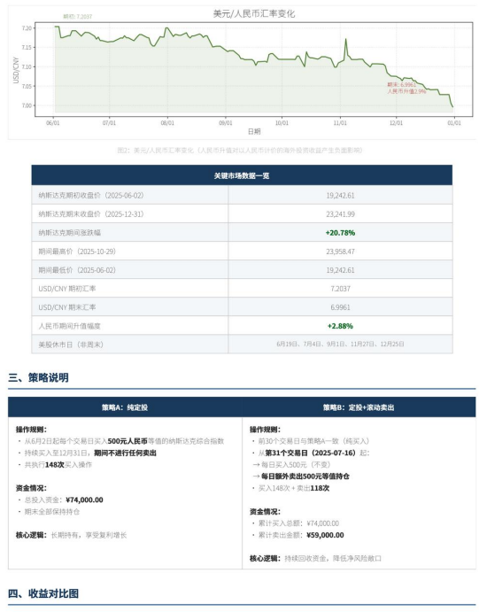


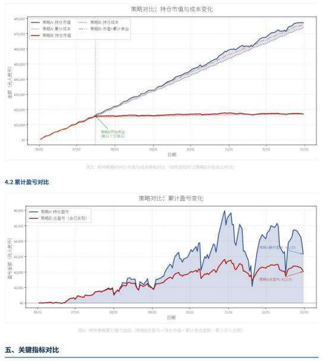


_图 14 | 要求比较两种纳斯达克（NASDAQ）常规投资策略的任务输出示例。_


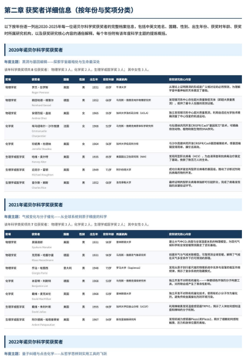


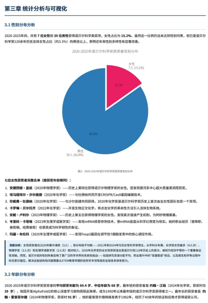


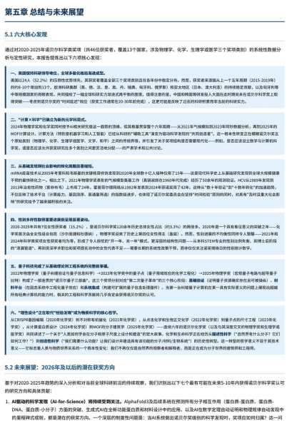


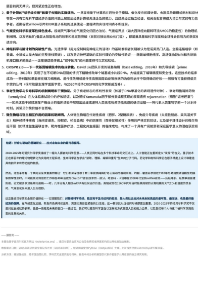


_图 15 | 要求调研 2020-2025 年诺贝尔科学奖并生成分析性 PDF 报告的任务输出示例。_

---

---

_表 12 | DeepSeek-V4-Pro 与 Gemini-3.1-Pro 在中文功能性写作中的对比分析。_


<table><tr><td rowspan="2">类别</td><td rowspan="2">子类别</td><td rowspan="2">#</td><td colspan="6">内部评估 (内部综合评估)</td></tr><tr><td>DS 胜</td><td>Gem 胜</td><td>平局</td><td>DS%</td><td>Gem%</td><td>平局%</td></tr><tr><td rowspan="10">商务写作 (办公文本)</td><td>报告 (报告)</td><td>527</td><td>350</td><td>162</td><td>15</td><td>66.41</td><td>30.74</td><td>2.85</td></tr><tr><td>方案策划 (方案策划)</td><td>291</td><td>181</td><td>103</td><td>7</td><td>62.20</td><td>35.40</td><td>2.41</td></tr><tr><td>教育培训 (教育培训)</td><td>159</td><td>100</td><td>56</td><td>3</td><td>62.89</td><td>35.22</td><td>1.89</td></tr><tr><td>邮件与书信 (邮件书信)</td><td>146</td><td>107</td><td>37</td><td>2</td><td>73.29</td><td>25.34</td><td>1.37</td></tr><tr><td>通知公告 (通知公告)</td><td>72</td><td>43</td><td>24</td><td>5</td><td>59.72</td><td>33.33</td><td>6.94</td></tr><tr><td>专业文本 (专业文本)</td><td>63</td><td>34</td><td>27</td><td>2</td><td>53.97</td><td>42.86</td><td>3.17</td></tr><tr><td>招聘求职 (招聘求职)</td><td>42</td><td>27</td><td>15</td><td>0</td><td>64.29</td><td>35.71</td><td>0.00</td></tr><tr><td>技术文本 (技术文本)</td><td>29</td><td>22</td><td>7</td><td>0</td><td>75.86</td><td>24.14</td><td>0.00</td></tr><tr><td>介绍评价 (介绍评价)</td><td>20</td><td>15</td><td>5</td><td>0</td><td>75.00</td><td>25.00</td><td>0.00</td></tr><tr><td>小计 (小计)</td><td>1349</td><td>879</td><td>436</td><td>34</td><td>65.16</td><td>32.32</td><td>2.52</td></tr><tr><td rowspan="9">媒体写作 (媒体文本)</td><td>社交媒体文案 (社交媒体文案)</td><td>267</td><td>156</td><td>101</td><td>10</td><td>58.43</td><td>37.83</td><td>3.75</td></tr><tr><td>广告商品文案 (广告商品文案)</td><td>214</td><td>109</td><td>98</td><td>7</td><td>50.93</td><td>45.79</td><td>3.27</td></tr><tr><td>内容平台长文 (内容平台长文)</td><td>99</td><td>71</td><td>25</td><td>3</td><td>71.72</td><td>25.25</td><td>3.03</td></tr><tr><td>新闻报道 (新闻报道)</td><td>51</td><td>27</td><td>22</td><td>2</td><td>52.94</td><td>43.14</td><td>3.92</td></tr><tr><td>营销软文 (营销软文)</td><td>17</td><td>12</td><td>4</td><td>1</td><td>70.59</td><td>23.53</td><td>5.88</td></tr><tr><td>标题 (标题)</td><td>11</td><td>7</td><td>4</td><td>0</td><td>63.64</td><td>36.36</td><td>0.00</td></tr><tr><td>口播文案 (口播文案)</td><td>4</td><td>2</td><td>1</td><td>1</td><td>50.00</td><td>25.00</td><td>25.00</td></tr><tr><td>评论 (评论)</td><td>3</td><td>2</td><td>1</td><td>0</td><td>66.67</td><td>33.33</td><td>0.00</td></tr><tr><td>小计 (小计)</td><td>666</td><td>386</td><td>256</td><td>24</td><td>57.96</td><td>38.44</td><td>3.60</td></tr><tr><td rowspan="6">日常写作 (生活文本)</td><td>祝贺文本 (祝贺文本)</td><td>101</td><td>54</td><td>41</td><td>6</td><td>53.47</td><td>40.59</td><td>5.94</td></tr><tr><td>沟通回复 (沟通回复)</td><td>100</td><td>71</td><td>26</td><td>3</td><td>71.00</td><td>26.00</td><td>3.00</td></tr><tr><td>心得感想 (心得感想)</td><td>90</td><td>68</td><td>17</td><td>5</td><td>75.56</td><td>18.89</td><td>5.56</td></tr><tr><td>介绍评价 (介绍评价)</td><td>55</td><td>44</td><td>9</td><td>2</td><td>80.00</td><td>16.36</td><td>3.64</td></tr><tr><td>评论 (评论)</td><td>44</td><td>34</td><td>8</td><td>2</td><td>77.27</td><td>18.18</td><td>4.55</td></tr><tr><td>小计 (小计)</td><td>390</td><td>271</td><td>101</td><td>18</td><td>69.49</td><td>25.90</td><td>4.62</td></tr><tr><td rowspan="6">口头写作 (口头文本)</td><td>发言稿 (发言稿)</td><td>226</td><td>135</td><td>85</td><td>6</td><td>59.73</td><td>37.61</td><td>2.65</td></tr><tr><td>口播文案 (口播文案)</td><td>51</td><td>25</td><td>23</td><td>3</td><td>49.02</td><td>45.10</td><td>5.88</td></tr><tr><td>话术 (话术)</td><td>31</td><td>22</td><td>6</td><td>3</td><td>70.97</td><td>19.35</td><td>9.68</td></tr><tr><td>对话文本 (对话文本)</td><td>10</td><td>4</td><td>6</td><td>0</td><td>40.00</td><td>60.00</td><td>0.00</td></tr><tr><td>祝贺文本 (祝贺文本)</td><td>1</td><td>1</td><td>0</td><td>0</td><td>100.00</td><td>0.00</td><td>0.00</td></tr><tr><td>小计 (小计)</td><td>319</td><td>187</td><td>120</td><td>12</td><td>58.62</td><td>37.62</td><td>3.76</td></tr><tr><td rowspan="6">公文写作 (公文文本)</td><td>事务文书 (事务文书)</td><td>117</td><td>60</td><td>53</td><td>4</td><td>51.28</td><td>45.30</td><td>3.42</td></tr><tr><td>个人文书 (个人文书)</td><td>73</td><td>45</td><td>27</td><td>1</td><td>61.64</td><td>36.99</td><td>1.37</td></tr><tr><td>行政公文 (行政公文)</td><td>34</td><td>19</td><td>14</td><td>1</td><td>55.88</td><td>41.18</td><td>2.94</td></tr><tr><td>发言稿 (发言稿)</td><td>3</td><td>1</td><td>2</td><td>0</td><td>33.33</td><td>66.67</td><td>0.00</td></tr><tr><td>申论写作 (申论写作)</td><td>3</td><td>1</td><td>1</td><td>1</td><td>33.33</td><td>33.33</td><td>33.33</td></tr><tr><td>小计 (小计)</td><td>230</td><td>126</td><td>97</td><td>7</td><td>54.78</td><td>42.17</td><td>3.04</td></tr><tr><td rowspan="5">学术写作 (学术文本)</td><td>学术论文 (学术论文)</td><td>104</td><td>67</td><td>32</td><td>5</td><td>64.42</td><td>30.77</td><td>4.81</td></tr><tr><td>课程作业 (课程作业)</td><td>90</td><td>53</td><td>35</td><td>2</td><td>58.89</td><td>38.89</td><td>2.22</td></tr><tr><td>学术辅助 (学术辅助)</td><td>15</td><td>11</td><td>3</td><td>1</td><td>73.33</td><td>20.00</td><td>6.67</td></tr><tr><td>专业科普 (专业科普)</td><td>7</td><td>6</td><td>1</td><td>0</td><td>85.71</td><td>14.29</td><td>0.00</td></tr><tr><td>小计 (小计)</td><td>216</td><td>137</td><td>71</td><td>8</td><td>63.43</td><td>32.87</td><td>3.70</td></tr><tr><td>总计 (总计)</td><td></td><td>3170</td><td>1986</td><td>1081</td><td>103</td><td>62.65</td><td>34.10</td><td>3.25</td></tr></table>

---

---

_表 13 | DeepSeek-V4-Pro 与 Gemini-3.1-Pro 在中文创意写作中的对比分析。_


<table><tr><td rowspan="2">子类别 (文体)</td><td rowspan="2">#</td><td colspan="6">指令遵循</td><td colspan="6">写作质量</td></tr><tr><td>DS</td><td>Gem</td><td>平局</td><td>DS%</td><td>Gem%</td><td>平局%</td><td>DS</td><td>Gem</td><td>平局</td><td>DS%</td><td>Gem%</td><td>平局%</td></tr><tr><td>小说故事</td><td>836</td><td>504</td><td>323</td><td>5</td><td>60.58</td><td>38.82</td><td>0.60</td><td>672</td><td>157</td><td>3</td><td>80.77</td><td>18.87</td><td>0.36</td></tr><tr><td>泛小说故事</td><td>662</td><td>368</td><td>290</td><td>3</td><td>55.67</td><td>43.87</td><td>0.45</td><td>467</td><td>194</td><td>0</td><td>70.65</td><td>29.35</td><td>0.00</td></tr><tr><td>同人文</td><td>410</td><td>253</td><td>150</td><td>3</td><td>62.32</td><td>36.95</td><td>0.74</td><td>338</td><td>67</td><td>1</td><td>83.25</td><td>16.50</td><td>0.25</td></tr><tr><td>泛同人文</td><td>202</td><td>111</td><td>90</td><td>1</td><td>54.95</td><td>44.55</td><td>0.50</td><td>161</td><td>40</td><td>1</td><td>79.70</td><td>19.80</td><td>0.50</td></tr><tr><td>记叙文</td><td>171</td><td>115</td><td>54</td><td>2</td><td>67.25</td><td>31.58</td><td>1.17</td><td>141</td><td>30</td><td>0</td><td>82.46</td><td>17.54</td><td>0.00</td></tr><tr><td>泛散文</td><td>124</td><td>83</td><td>40</td><td>1</td><td>66.94</td><td>32.26</td><td>0.81</td><td>88</td><td>36</td><td>0</td><td>70.97</td><td>29.03</td><td>0.00</td></tr><tr><td>散文</td><td>112</td><td>74</td><td>38</td><td>0</td><td>66.07</td><td>33.93</td><td>0.00</td><td>92</td><td>20</td><td>0</td><td>82.14</td><td>17.86</td><td>0.00</td></tr><tr><td>文笔</td><td>112</td><td>81</td><td>31</td><td>0</td><td>72.32</td><td>27.68</td><td>0.00</td><td>86</td><td>26</td><td>0</td><td>76.79</td><td>23.21</td><td>0.00</td></tr><tr><td>古诗文</td><td>48</td><td>24</td><td>24</td><td>0</td><td>50.00</td><td>50.00</td><td>0.00</td><td>39</td><td>9</td><td>0</td><td>81.25</td><td>18.75</td><td>0.00</td></tr><tr><td>现代诗</td><td>43</td><td>23</td><td>20</td><td>0</td><td>53.49</td><td>46.51</td><td>0.00</td><td>32</td><td>11</td><td>0</td><td>74.42</td><td>25.58</td><td>0.00</td></tr><tr><td>歌词</td><td>30</td><td>8</td><td>22</td><td>0</td><td>26.67</td><td>73.33</td><td>0.00</td><td>16</td><td>14</td><td>0</td><td>53.33</td><td>46.67</td><td>0.00</td></tr><tr><td>赏析</td><td>27</td><td>20</td><td>7</td><td>0</td><td>74.07</td><td>25.93</td><td>0.00</td><td>18</td><td>9</td><td>0</td><td>66.67</td><td>33.33</td><td>0.00</td></tr><tr><td>泛议论文</td><td>24</td><td>15</td><td>9</td><td>0</td><td>62.50</td><td>37.50</td><td>0.00</td><td>17</td><td>7</td><td>0</td><td>70.83</td><td>29.17</td><td>0.00</td></tr><tr><td>泛记叙文</td><td>23</td><td>11</td><td>12</td><td>0</td><td>47.83</td><td>52.17</td><td>0.00</td><td>15</td><td>8</td><td>0</td><td>65.22</td><td>34.78</td><td>0.00</td></tr><tr><td>泛古文诗歌</td><td>9</td><td>5</td><td>4</td><td>0</td><td>55.56</td><td>44.44</td><td>0.00</td><td>5</td><td>4</td><td>0</td><td>55.56</td><td>44.44</td><td>0.00</td></tr><tr><td>创意写作</td><td>6</td><td>2</td><td>4</td><td>0</td><td>33.33</td><td>66.67</td><td>0.00</td><td>4</td><td>2</td><td>0</td><td>66.67</td><td>33.33</td><td>0.00</td></tr><tr><td>议论文</td><td>5</td><td>5</td><td>0</td><td>0</td><td>100.00</td><td>0.00</td><td>0.00</td><td>5</td><td>0</td><td>0</td><td>100.00</td><td>0.00</td><td>0.00</td></tr><tr><td>泛现代诗</td><td>2</td><td>1</td><td>1</td><td>0</td><td>50.00</td><td>50.00</td><td>0.00</td><td>2</td><td>0</td><td>0</td><td>100.00</td><td>0.00</td><td>0.00</td></tr><tr><td>总计</td><td>2837</td><td>1703</td><td>1119</td><td>15</td><td>60.03</td><td>39.44</td><td>0.53</td><td>2198</td><td>634</td><td>5</td><td>77.48</td><td>22.35</td><td>0.18</td></tr></table>


_表 14 | DeepSeek-V4-Pro 与 Claude-Opus-4.5 在复杂指令遵循和多轮写作上的对比。_


<table><tr><td rowspan="2">类别</td><td colspan="7">内部综合评估</td></tr><tr><td>#</td><td>DS</td><td>Opus</td><td>平局</td><td>DS%</td><td>Opus%</td><td>平局%</td></tr><tr><td>复杂指令跟随</td><td>49</td><td>23</td><td>26</td><td>0</td><td>46.9%</td><td>53.1%</td><td>0.0%</td></tr><tr><td>多轮写作</td><td>147</td><td>67</td><td>76</td><td>4</td><td>45.6%</td><td>51.7%</td><td>2.7%</td></tr><tr><td>总计</td><td>196</td><td>90</td><td>102</td><td>4</td><td>45.9%</td><td>52.0%</td><td>2.0%</td></tr></table>

---