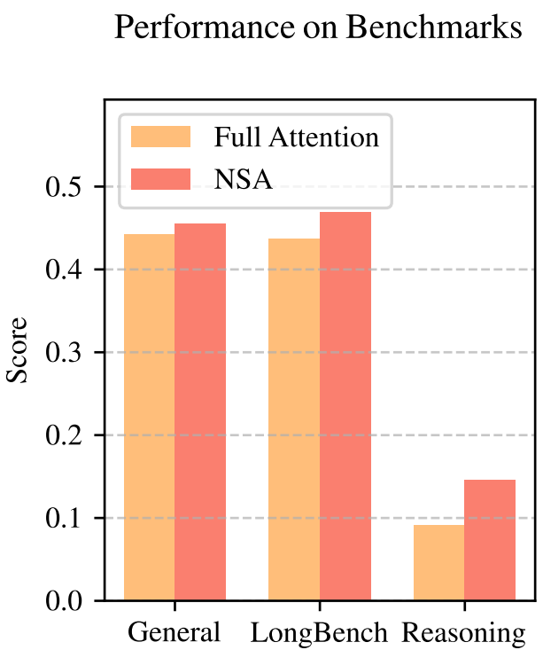
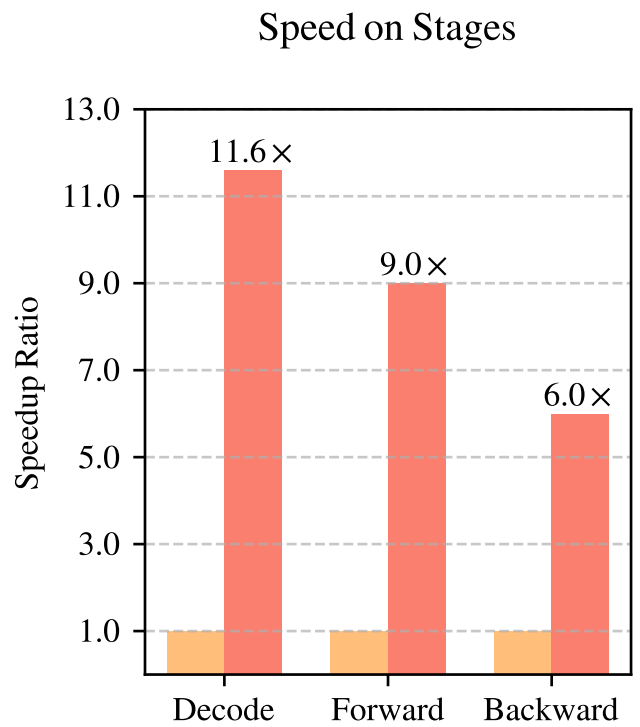
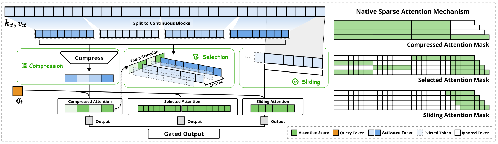
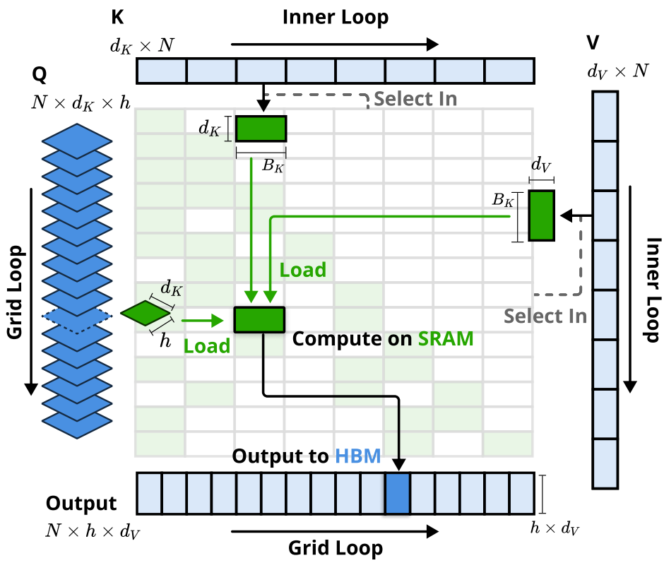
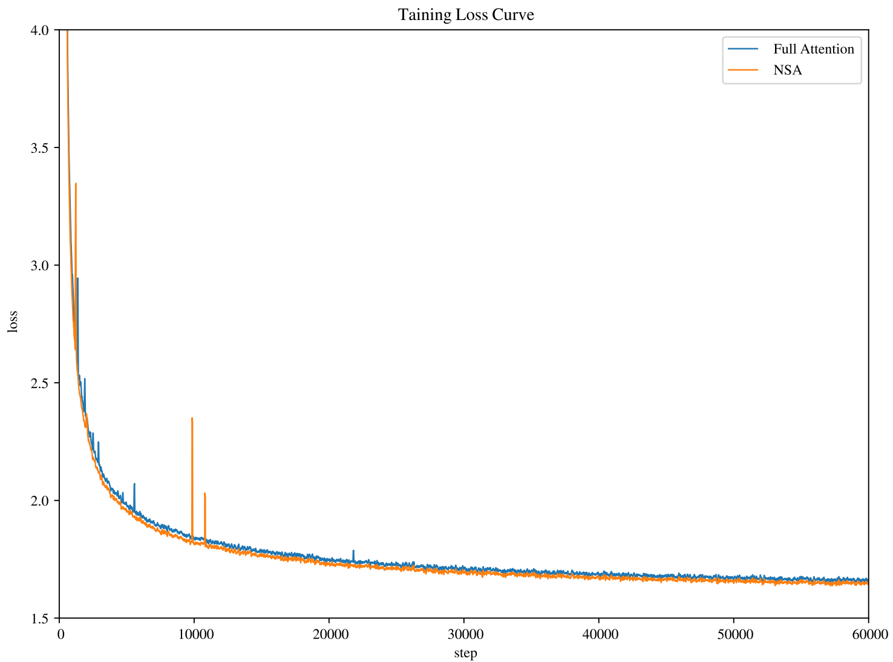
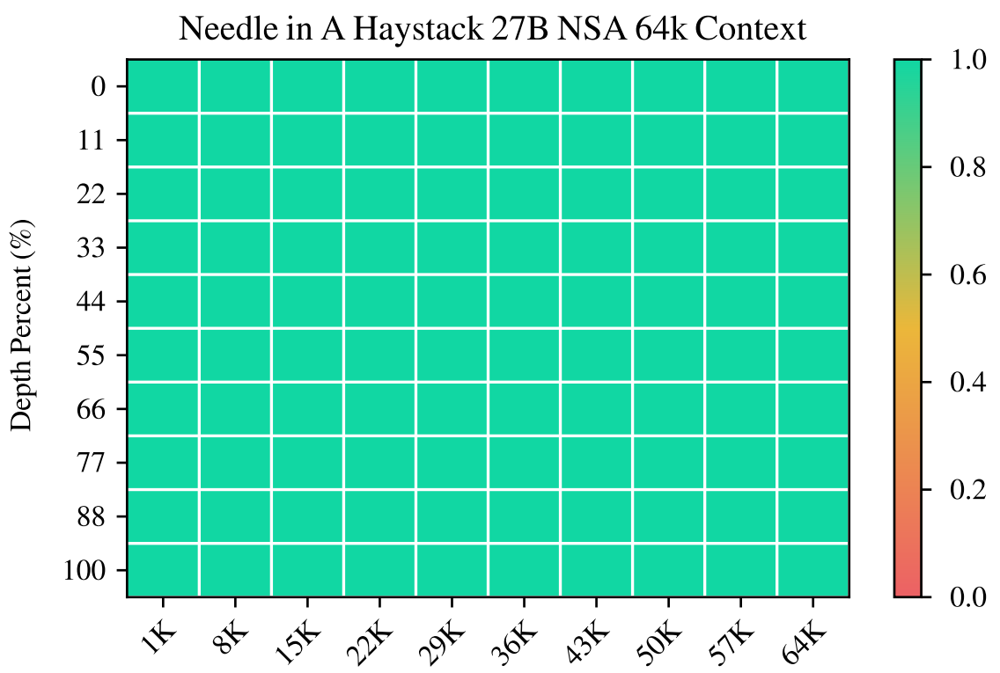
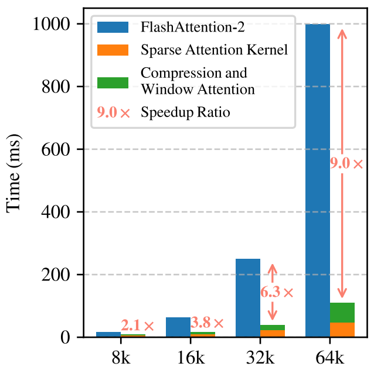
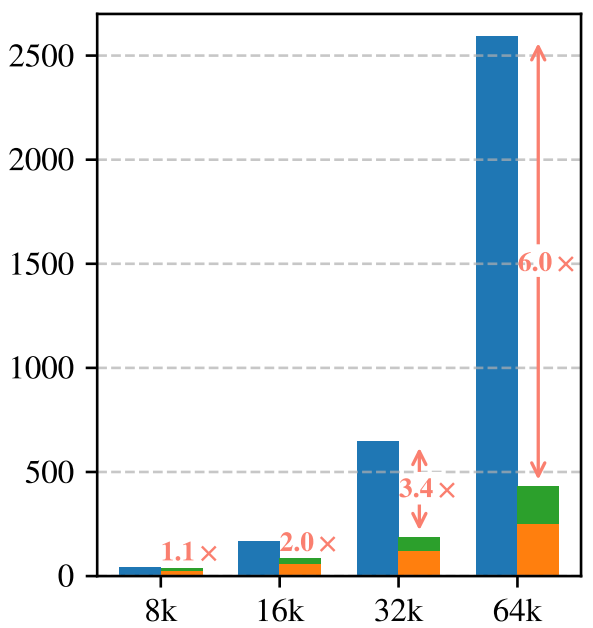
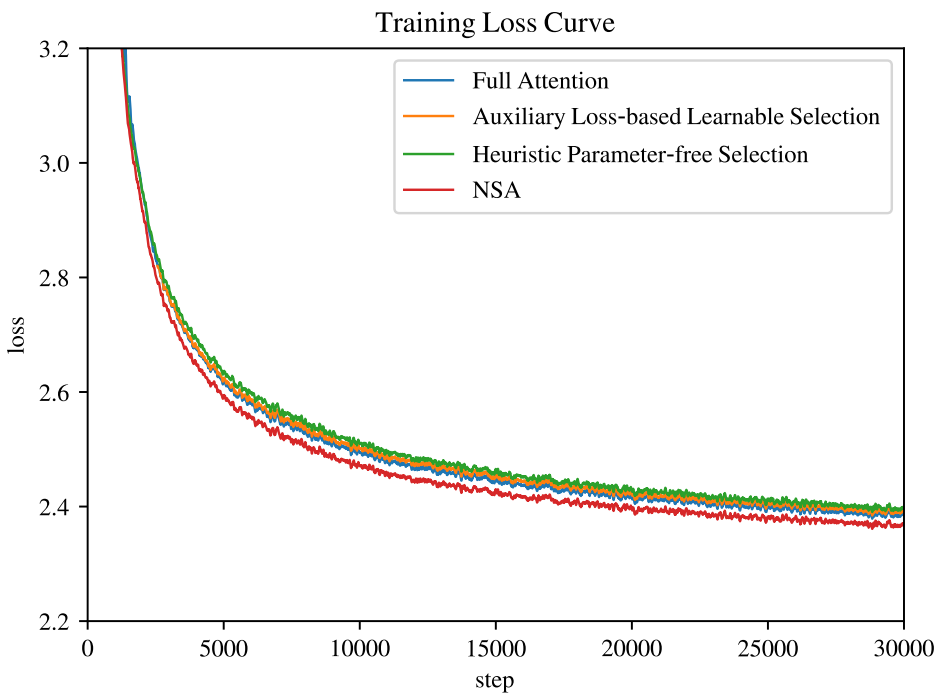
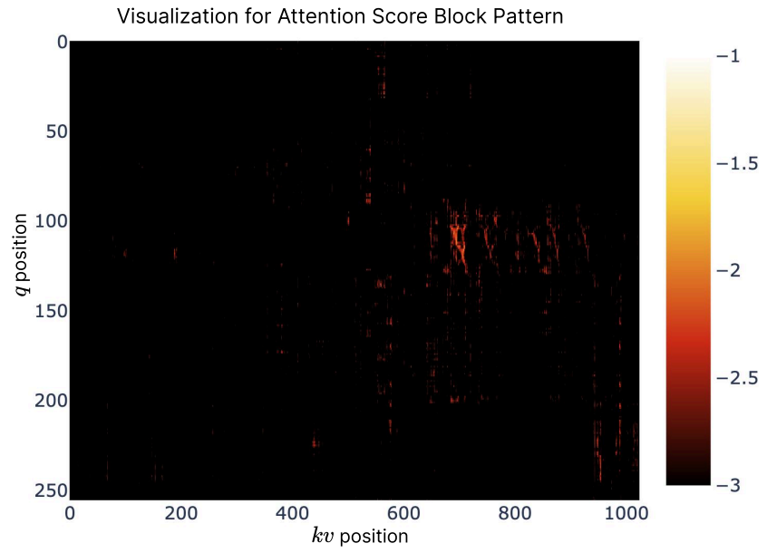

# 原生稀疏注意力：硬件对齐且原生可训练的稀疏注意力

Jingyang Yuan\*1,2, Huazuo Gao$^{1}$, Damai Dai$^{1}$, Junyu Luo$^{2}$, Liang Zhao$^{1}$, Zhengyan Zhang$^{1}$, Zhenda Xie$^{1}$, Y. X. Wei$^{1}$, Lean Wang$^{1}$, Zhiping Xiao$^{3}$, Yuqing Wang$^{1}$, Chong Ruan$^{1}$, Ming Zhang$^{2}$, Wenfeng Liang$^{1}$, Wangding Zeng$^{1}$

$^{1}$DeepSeek-AI  
$^{2}$北京大学 计算机学院 多媒体信息处理重点实验室, PKU-Anker LLM Lab  
$^{3}$华盛顿大学

{yuanjy, mzhang_cs}@pku.edu.cn, {zengwangding, wenfeng.liang}@deepseek.com

# 摘要

长上下文建模对于下一代语言模型至关重要，然而标准注意力机制的高计算成本带来了巨大的计算挑战。稀疏注意力为在保持模型能力的同时提高效率提供了一个有前景的方向。我们提出了 NSA（Native Sparse Attention），一种原生可训练的稀疏注意力机制，它将算法创新与硬件对齐优化相结合，以实现高效的长上下文建模。NSA 采用了一种动态分层稀疏策略，结合了粗粒度的 Token 压缩和细粒度的 Token 选择，从而同时保留全局上下文感知能力和局部精度。我们的方法通过两个关键创新推进了稀疏注意力的设计：(1) 我们通过算术强度平衡的算法设计，结合针对现代硬件的实现优化，实现了显著的加速。(2) 我们实现了端到端的训练，在不牺牲模型性能的情况下减少了预训练的计算量。如图 1 所示，实验表明，使用 NSA 预训练的模型在通用基准、长上下文任务和基于指令的推理方面，保持或超过了全注意力模型。同时，在 64k 长度的序列上，NSA 在解码、前向传播和反向传播方面均比全注意力模型实现了显著的加速，验证了其在模型全生命周期中的效率。

# 1. 引言

研究界日益认识到长上下文建模是下一代大型语言模型的关键能力，这源于多样化的现实世界应用，从深度推理（DeepSeek-AI, 2025; Zelikman et al., 2022）、仓库级代码生成（Zhang et al., 2023a; Zhang et al.）到多轮自主智能体系统（Park et al., 2023）。最近的突破性进展，包括 OpenAI 的 o 系列模型、DeepSeek-R1（DeepSeek-AI, 2025）和 Gemini 1.5 Pro（Google et al., 2024），使得模型能够处理整个代码库、长篇文档，在数千个 Token 上保持连贯的多轮对话，并跨越长距离依赖执行复杂推理。然而，标准注意力（Vaswani et al., 2017）机制的高复杂度（Za-heer et al., 2020）已成为一个关键的瓶颈。

---

_**图 1 | 全注意力模型与我们的 NSA 之间的性能和效率比较。** 左图：尽管是稀疏的，NSA 在通用基准、长上下文任务和推理评估的平均表现上仍优于全注意力基线。右图：在处理 64k 长度序列时，NSA 在解码、前向传播和反向传播的所有阶段，相比全注意力实现了显著的计算加速。_

随着序列长度的增加，延迟瓶颈日益凸显。理论估计表明，在解码 64k 长度的上下文时，基于 Softmax 架构的注意力计算占总延迟的 $70 - 80\%$，这凸显了对更高效注意力机制的迫切需求。

一种实现高效长上下文建模的自然途径是利用 Softmax 注意力的内在稀疏性（Ge et al., 2023; Jiang et al., 2023），即通过有选择地计算关键的查询-键对，可以在保持性能的同时显著降低计算开销。最近的进展通过多种策略展示了这一潜力：KV 缓存驱逐方法（Li et al., 2024; Zhang et al., 2023b; Zhou et al., 2024）、分块 KV 缓存选择方法（Gao et al., 2024; Tang et al., 2024; Xiao et al., 2024a），以及基于采样、聚类或哈希的选择方法（Chen et al., 2024b; Desai et al., 2024; Liu et al., 2024）。尽管这些策略前景广阔，但现有的稀疏注意力方法在实际部署中往往表现不佳。许多方法未能实现与其理论收益相媲美的加速效果；此外，大多数方法缺乏有效的训练时支持，无法充分利用注意力的稀疏模式。

为了解决这些局限性，部署有效的稀疏注意力必须应对两个关键挑战：(1) **硬件对齐的推理加速**：将理论计算减少转化为实际速度提升，需要在预填充和解码阶段进行硬件友好的算法设计，以缓解内存访问和硬件调度瓶颈；(2) **训练感知的算法设计**：启用可训练算子进行端到端计算，以在保持模型性能的同时降低训练成本。这些要求对于现实世界应用实现快速的长上下文推理或训练至关重要。综合考虑这两个方面，现有方法仍存在明显差距。

为了实现更有效且高效的稀疏注意力，我们提出了 NSA，这是一种集成了分层 Token 建模的**原生可训练稀疏注意力**架构。如图 2 所示，NSA 通过将键和值组织为时间块，并通过三条注意力路径处理它们来减少每个查询的计算：压缩的粗粒度 Token、选择性保留的细粒度 Token，以及用于局部上下文信息的滑动窗口。然后

---

---

_**图 2 | NSA 架构概览。** 左图：该框架通过三个并行的注意力分支处理输入序列：对于给定的查询，先前的键和值分别被处理为用于粗粒度模式的压缩注意力、用于重要令牌块的选择注意力，以及用于局部上下文的滑动注意力。右图：每个分支产生的不同注意力模式的可视化。绿色区域表示需要计算注意力分数的区域，而白色区域代表可以跳过的区域。_

我们实现了专门的内核以最大化其实际效率。NSA 引入了对应于上述关键要求的两项核心创新：(1) 硬件对齐系统：优化分块稀疏注意力以利用 Tensor Core 并进行内存访问，确保平衡的算术强度。(2) 训练感知设计：通过高效的算法和反向算子实现稳定的端到端训练。这种优化使 NSA 能够同时支持高效部署和端到端训练。

我们通过在真实语言语料库上进行全面的实验来评估 NSA。我们在拥有 260B token 的 27B 参数 Transformer 骨干网络上进行预训练，评估了 NSA 在通用语言评估、长上下文评估和思维链推理评估中的表现。我们进一步在 A100 GPU 上将内核速度与优化的 Triton (Tillet et al., 2019) 实现进行了比较。实验结果表明，NSA 实现了与全注意力基线相当或更优越的性能，同时优于现有的稀疏注意力方法。此外，与全注意力相比，NSA 在解码、前向和反向阶段均提供了显著的加速，且加速比随着序列长度的增加而提高。这些结果验证了我们的分层稀疏注意力设计有效地平衡了模型能力和计算效率。

# 2. 重新审视稀疏注意力方法

现代稀疏注意力方法在降低 Transformer 模型的理论计算复杂度方面取得了重大进展。然而，大多数方法主要在推理期间应用稀疏性，同时保留预训练的全注意力骨干，这可能会引入架构偏差，从而限制其充分利用稀疏注意力优势的能力。在介绍我们的原生稀疏架构之前，我们通过两个关键视角系统地分析了这些局限性。

# 2.1. 高效推理的假象

尽管在注意力计算中实现了稀疏性，但许多方法未能实现推理延迟的相应降低，主要由于两个挑战：

---

**相位受限的稀疏性。** 诸如 H2O (Zhang et al., 2023b) 等方法在自回归解码期间应用稀疏性，但在预填充阶段需要计算密集型的预处理（例如注意力图计算、索引构建）。相比之下，像 MInference (Jiang et al., 2024) 这样的方法仅专注于预填充阶段的稀疏性。这些方法未能实现跨所有推理阶段的加速，因为至少有一个阶段的计算成本仍与全注意力相当。这种相位特异性降低了这些方法在预填充主导型工作负载（如书籍摘要和代码补全）或解码主导型工作负载（如长思维链 (Wei et al., 2022) 推理）中的加速能力。

**与高级注意力架构的不兼容性。** 一些稀疏注意力方法无法适应现代的高效解码架构，如多查询注意力 和分组查询注意力，这些架构通过在多个查询头之间共享 KV 显著减少了解码期间的内存访问瓶颈。例如，在 Quest (Tang et al., 2024) 等方法中，每个注意力头独立选择其 KV 缓存子集。虽然这在多头注意力模型中展示了一致的计算稀疏性和内存访问稀疏性，但在基于 GQA 等架构的模型中呈现出不同的情况，其中 KV 缓存的内存访问量对应于同一 GQA 组内所有查询头选择的并集。这种架构特性意味着，虽然这些方法可以减少计算操作，但所需的 KV 缓存内存访问仍然相对较高。这种限制迫使做出一个关键抉择：虽然某些稀疏注意力方法减少了计算，但它们分散的内存访问模式与高级架构的高效内存访问设计相冲突。

这些局限性之所以出现，是因为许多现有的稀疏注意力方法专注于 KV 缓存缩减或理论计算缩减，但难以在高级框架或后端中实现显著的延迟降低。这激励我们开发结合高级架构和硬件高效实现的算法，以充分利用稀疏性来提高模型效率。

# 2.2. 可训练稀疏性的误区

我们追求原生可训练稀疏注意力的动机源于对仅推理方法分析的两个关键见解：(1) **性能下降**：事后应用稀疏性迫使模型偏离其预训练优化轨迹。正如 Chen et al. (2024b) 所展示的，前 $20\%$ 的注意力仅能覆盖总注意力分数的 $70\%$，这使得预训练模型中的检索头等结构在推理期间容易受到剪枝的影响。(2) **训练效率需求**：高效处理长序列训练对于现代 LLM 开发至关重要。这包括在更长的文档上进行预训练以增强模型能力，以及随后的适应阶段，如长上下文微调和强化学习。然而，现有的稀疏注意力方法主要针对推理，很大程度上未解决训练中的计算挑战。这种局限性阻碍了通过高效训练开发更强大的长上下文模型。此外，使现有稀疏注意力适应训练的努力也暴露了挑战：

**不可训练组件。** 诸如 ClusterKV (Liu et al., 2024)（包含 k-means 聚类）和 MagicPIG (Chen et al., 2024b)（包含基于 SimHash 的选择）等方法中的离散操作在计算图中产生了不连续性。这些不可训练组件阻止了梯度通过 Token 选择过程流动，限制了模型学习最优稀疏模式的能力。

**低效的反向传播。** 一些理论上可训练的稀疏注意力方法遭受

---

源于实际训练中的低效问题。在 HashAttention (Desai et al., 2024) 等方法中使用的 Token 级选择策略，导致在注意力计算期间需要从 KV 缓存中加载大量独立的 Token。这种非连续的内存访问阻碍了 FlashAttention 等快速注意力技术的有效适配，因为这些技术依赖于连续内存访问和分块计算来实现高吞吐量。因此，实现方案被迫回退到低硬件利用率的状态，显著降低了训练效率。

# 2.3. 原生稀疏性势在必行

推理效率和训练可行性的这些局限性，促使我们对稀疏注意力机制进行根本性的重新设计。我们提出了 NSA（Native Sparse Attention），一种原生稀疏注意力框架，旨在同时解决计算效率和训练需求的问题。在接下来的章节中，我们将详细介绍 NSA 的算法设计和算子实现。

# 3. 方法论

我们的技术方法涵盖了算法设计和内核优化。在接下来的小节中，我们首先介绍方法论的背景。然后展示 NSA 的整体框架，随后介绍其关键算法组件。最后，我们将详细阐述我们针对硬件优化的内核设计，以最大化实际效率。

# 3.1. 背景

注意力机制广泛应用于语言建模中，其中每个查询 Token $\mathbf{q}_t$ 会计算其与所有先前键 $\mathbf{k}_{:t}$ 的相关性得分，从而生成值 $\mathbf{v}_{:t}$ 的加权和。形式上，对于长度为 $t$ 的输入序列，注意力操作定义为：

$$
\mathbf {o} _ {t} = \operatorname {A t t n} \left(\mathbf {q} _ {t}, \mathbf {k} _ {: t}, \mathbf {v} _ {: t}\right) \tag {1}
$$

其中 Attn 表示注意力函数：

$$
\mathrm {A t t n} \left(\mathbf{q} _ {t}, \mathbf {k} _ {: t}, \mathbf {v} _ {: t}\right) = \sum_ {i = 1} ^ {t} \frac {\alpha_ {t , i} \mathbf {v} _ {i}}{\sum_ {j = 1} ^ {t} \alpha_ {t , j}}, \quad \alpha_ {t, i} = e ^ {\frac {\mathbf {q} _ {t} ^ {\top} \mathbf {k} _ {i}}{\sqrt {d _ {k}}}}. (2)
$$

这里，$\alpha_{t,i}$ 表示 $\mathbf{q}_t$ 和 $\mathbf{k}_i$ 之间的注意力权重，$d_k$ 是键的特征维度。随着序列长度的增加，注意力计算在整体计算成本中的占比越来越高，这给长上下文处理带来了重大挑战。

计算强度是指计算操作与内存访问量的比率。它本质上决定了硬件上的算法优化方式。每个 GPU 都有一个由其峰值计算能力和内存带宽决定的关键计算强度，计算方法为这两个硬件极限的比值。对于计算任务而言，当计算强度高于该临界阈值时，任务受限于计算能力（受限于 GPU FLOPS）；而低于该阈值时，则受限于内存带宽（受限于内存带宽）。

具体针对因果自注意力机制，在训练和预填充阶段，批量矩阵乘法和注意力计算表现出较高的计算强度，使得这些阶段在现代加速器上属于计算密集型。相比之下，自回归解码会受到内存带宽的限制，因为它在每次前向传递中仅生成一个 Token，同时却需要加载整个键值缓存，导致计算强度较低。

---

---

这导致了不同的优化目标——在训练和预填充阶段降低计算成本，而在解码阶段减少内存访问。

# 3.2. 整体框架

为了利用具有自然稀疏模式的注意力的潜力，我们建议用一组更紧凑且信息密集的表示键值对 $\tilde{K}_t,\tilde{V}_t$ 来替换公式 (1) 中原始的键值对 $\mathbf{k}_{:t},\mathbf{v}_{:t}$，这是针对每个查询 $\mathbf{q}_t$ 给出的。具体而言，我们将优化后的注意力输出形式化定义如下：

$$
\tilde {K} _ {t} = f _ {K} (\mathbf {q} _ {t}, \mathbf {k} _ {: t}, \mathbf {v} _ {: t}), \quad \tilde {V} _ {t} = f _ {V} (\mathbf {q} _ {t}, \mathbf {k} _ {: t}, \mathbf {v} _ {: t}) \tag {3}
$$

$$
\mathbf {o} _ {t} ^ {*} = \operatorname {A t t n} \left(\mathbf{q} _ {t}, \tilde {K} _ {t}, \tilde {V} _ {t}\right) \tag {4}
$$

其中 $\tilde{K}_t, \tilde{V}_t$ 是基于当前查询 $\mathbf{q}_t$ 和上下文记忆 $\mathbf{k}_{:t}, \mathbf{v}_{:t}$ 动态构建的。我们可以设计各种映射策略来获得不同类别的 $\tilde{K}_t^c, \tilde{V}_t^c$，并将它们组合如下：

$$
\mathbf {o} _ {t} ^ {*} = \sum_ {c \in C} g _ {t} ^ {c} \cdot \operatorname {A t t n} \left(\mathbf {q} _ {t}, \tilde {K} _ {t} ^ {c}, \tilde {V} _ {t} ^ {c}\right). \tag {5}
$$

如图 2 所示，NSA 有三种映射策略 $ C = \{\mathrm{cmp}, \mathrm{slc}, \mathrm{win}\} $，分别代表键和值的压缩、选择和滑动窗口。$ g_{t}^{c} \in [0,1] $ 是对应策略 $ c $ 的门控分数，通过 MLP 和 sigmoid 激活函数从输入特征中得出。设 $ N_{t} $ 表示重映射后的键/值总数：

$$
N _ {t} = \sum_ {c \in \mathcal {C}} \operatorname {s i z e} \left[ \tilde {K} _ {t} ^ {c} \right]. \tag {6}
$$

我们通过确保 $N_{t} \ll t$ 来维持高稀疏度。

# 3.3. 算法设计

在本小节中，我们介绍重映射策略 $ f_{K} $ 和 $ f_{V} $ 的设计：Token 压缩、Token 选择和滑动窗口。

# 3.3.1. Token 压缩

通过将连续的键或值块聚合为块级表示，我们获得了能够捕获整个块信息的压缩键和值。形式上，压缩键表示定义如下：

$$
\tilde {K} _ {t} ^ {\mathrm {c m p}} = f _ {K} ^ {\mathrm {c m p}} (\mathbf {k}: t) = \left\{\varphi (\mathbf {k} _ {i d + 1: i d + l}) \Bigg | 0 \leqslant i \leqslant \left\lfloor \frac {t - l}{d} \right\rfloor \right\} \tag {7}
$$

其中 $l$ 是块长度，$d$ 是相邻块之间的滑动步长，$\varphi$ 是一个可学习的 MLP，具有块内位置编码功能，可将块内的键映射为单个压缩键。$\tilde{K}_t^{\mathrm{cmp}}\in \mathbb{R}^{d_k\times \left\lfloor \frac{t - l}{d}\right\rfloor}$ 是由压缩键组成的张量。通常，我们采用 $d < l$ 来缓解信息碎片化。压缩值表示 $\tilde{V}_t^{\mathrm{cmp}}$ 也有类似的公式。压缩表示捕获了更粗粒度的高级语义信息，并减轻了注意力的计算负担。

---

# 3.3.2. Token 选择

如果仅使用压缩后的键和值，可能会丢失重要的细粒度信息，这促使我们有选择地保留单独的键和值。下面我们将描述一种高效的 token 选择机制，该机制能够以较低的计算开销识别并保留最相关的 token。

分块选择。我们的选择策略在空间连续的块中处理键和值序列，这主要基于两个关键因素：硬件效率考虑和注意力分数的内在分布模式。分块选择对于在现代 GPU 上实现高效计算至关重要。这是因为与现代 GPU 架构在处理基于随机索引的读取相比，处理连续块访问时的吞吐量要高得多。此外，分块计算能够实现对 Tensor Cores（张量核心）的最优利用。这种架构特性确立了分块内存访问和计算作为高性能注意力实现的基本原则，FlashAttention 的基于块的设计便是典型例证。分块选择遵循注意力分数的内在分布模式。先前的研究（Jiang et al., 2024）表明，注意力分数通常表现出空间连续性，这意味着相邻的键往往具有相似的重要性水平。我们在第 6.2 节中的可视化也展示了这种空间连续模式。

为了实现分块选择，我们首先将键、值序列划分为选择块。为了确定对注意力计算最重要的块，我们需要为每个块分配重要性分数。下面我们介绍计算这些块级重要性分数的方法。

重要性分数计算。计算块重要性分数可能会带来显著的开销。幸运的是，压缩 token 的注意力计算会产生中间注意力分数，我们可以利用这些分数来推导选择块的重要性分数，公式表示为：

$$
\mathbf {p} _ {t} ^ {\mathrm {c m p}} = \operatorname {S o f t m a x} \left(\mathbf {q} _ {t} ^ {T} \tilde {K} _ {t} ^ {\mathrm {c m p}}\right), \tag {8}
$$

其中 $\mathbf{p}_t^{\mathrm{cmp}}\in \mathbb{R}^{\lfloor \frac{t - l}{d}\rfloor +1}$ 是 $q_{t}$ 与压缩键 $\tilde{K}_t^{\mathrm{cmp}}$ 之间的注意力分数。设 $l'$ 表示选择块的大小。当压缩块和选择块共享相同的分块方案，即 $l' = l = d$ 时，我们可以直接通过 $\mathbf{p}_t^{\mathrm{slc}} = \mathbf{p}_t^{\mathrm{cmp}}$ 简单地获得选择块重要性分数 $\mathbf{p}_t^{\mathrm{slc}}$。对于分块方案不同的情况，我们根据它们的空间关系推导选择块的重要性分数。给定 $l\leqslant l'$，$d\mid l$ 且 $d\mid l'$，我们有：

$$
\mathbf {p} _ {t} ^ {\mathrm {s l c}} [ j ] = \sum_ {m = 0} ^ {\frac {l ^ {\prime}}{d} - 1} \sum_ {n = 0} ^ {\frac {l}{d} - 1} \mathbf {p} _ {t} ^ {\mathrm {c m p}} \left[ \frac {l ^ {\prime}}{d} j - m - n \right], \tag {9}
$$

其中 $[\cdot]$ 表示访问向量元素的索引操作符。对于采用 GQA 或 MQA 的模型，其中键值缓存在查询头之间共享，必须确保这些头之间的一致块选择，以最大限度地减少解码期间的 KV 缓存加载。组中跨头共享的重要性分数正式定义为：

$$
\mathbf {p} _ {t} ^ {\mathrm {s l c} ^ {\prime}} = \sum_ {h = 1} ^ {H} \mathbf {p} _ {t} ^ {\mathrm {s l c}, (h)}, \tag {10}
$$

其中上标中的 $(h)$ 表示头索引，$H$ 是每组中查询头的数量。这种聚合确保了同一组内头之间的一致块选择。

---

Top-$n$ 分块选择。在获得选择分块的重要性分数后，我们保留按分块重要性分数排名的前 $n$ 个稀疏分块内的 Token，公式表示为：

$$
\mathcal {I} _ {t} = \{i \mid \operatorname {r a n k} \left(\mathbf {p} _ {t} ^ {\mathrm {s l c} ^ {\prime}} [ i ]\right) \leqslant n \} \tag {11}
$$

$$
\tilde {K} _ {t} ^ {\mathrm {s l c}} = \operatorname {C a t} \left[ \left\{\mathbf {k} _ {i l ^ {\prime} + 1: (i + 1) l ^ {\prime}} \mid i \in \mathcal {I} _ {t} \right\} \right], \tag {12}
$$

其中 $\mathrm{rank}(\cdot)$ 表示降序排列中的排名位置，$\mathrm{rank} = 1$ 对应最高分，$I_{t}$ 是所选分块的索引集合，Cat 表示拼接操作。$\tilde{K}_t^{\mathrm{slc}}\in \mathbb{R}^{d_k\times nl'}$ 是由压缩键组成的张量。细粒度值 $\tilde{V}_{t}^{\mathrm{slc}}$ 也有类似的公式。选定的键和值随后与 $\mathbf{q}_t$ 一起参与公式 (5) 中定义的注意力计算。

# 3.3.3. 滑动窗口

在注意力机制中，局部模式通常适应得更快，并且可能主导学习过程，从而可能阻碍模型有效地从压缩 Token 和选择 Token 中学习。为了解决这个问题，我们引入了一个专门的滑动窗口分支来显式处理局部上下文，允许其他分支（压缩和选择）专注于学习各自的特征，而不会被局部模式“短路”。具体而言，我们在窗口 $w$ 内保留最近的 Token $\tilde{K}_t^{\mathrm{win}} = \mathbf{k}_{t - w:t},\tilde{V}_t^{\mathrm{win}} = \mathbf{v}_{t - w:t}$，并将不同信息源（压缩 Token、选择 Token 和滑动窗口）的注意力计算隔离到独立的分支中。这些分支的输出随后通过学习的门控机制进行聚合。为了进一步以极低的计算开销防止跨注意力分支的捷径学习，我们为三个分支提供了独立的键和值。这种架构设计通过防止局部和长程模式识别之间的梯度干扰来实现稳定的学习，同时引入的开销极小。

在获得所有三类键和值 $(\tilde{K}_t^{\mathrm{cmp}},\tilde{V}_t^{\mathrm{cmp}};\tilde{K}_t^{\mathrm{slc}},\tilde{V}_t^{\mathrm{slc}};$ 和 $\tilde{K}_t^{\mathrm{win}},\tilde{V}_t^{\mathrm{win}})$ 后，我们按照公式 (5) 计算最终的注意力输出。结合上述压缩、选择和滑动窗口机制，这构成了 NSA 的完整算法框架。

# 3.4. 内核设计

为了在训练和预取期间实现 FlashAttention 级别的加速，我们在 Triton 上实现了硬件对齐的稀疏注意力内核。鉴于 MHA 是内存密集型的且在解码方面效率低下，我们遵循当前最先进的 LLM，专注于具有共享 KV 缓存的架构，如 GQA 和 MQA。虽然压缩和滑动窗口注意力计算很容易与现有的 FlashAttention-2 内核兼容，但我们为稀疏选择注意力引入了专门的内核设计。如果我们遵循 FlashAttention 将时间上连续的查询块加载到 SRAM 的策略，会导致低效的内存访问，因为一个块内的查询可能需要不连续的 KV 块。为了解决这个问题，我们的关键优化在于不同的查询分组策略：对于查询序列上的每个位置，我们将 GQA 组中的所有查询头（它们共享相同的稀疏 KV 块）加载到 SRAM 中。图 3 说明了我们的前向传播实现。提出的内核架构具有以下关键特征：

1. 以组为中心的数据加载。对于每个内层循环，加载位置 $t$ 处组内所有头的查询 $ Q \in \mathbb{R}^{[h,d_k]} $ 及其共享的稀疏键/值块索引 $ \mathcal{I}_t $。

---

---

2. 共享 KV 获取。在内层循环中，为了最小化内存加载开销，将由 $\mathcal{I}_t$ 索引的连续键/值块按顺序加载到 SRAM 中，记为 $K \in \mathbb{R}^{[B_k,d_k]}$ 和 $V \in \mathbb{R}^{[B_k,d_v]}$，其中 $B_k$ 是满足 $B_k|l'$ 的内核块大小。

3. 网格上的外层循环。由于内层循环的长度（与选定的块数量 $ n $ 成正比）对于不同的查询块几乎保持不变，我们将查询/输出循环置于 Triton 的网格调度器中，以简化和优化内核。

这种设计通过 (1) 通过分组共享消除冗余的 KV 传输，以及 (2) 在 GPU 流多处理器（SM）之间平衡计算负载，实现了近乎最优的算术强度。

_图 3 | NSA 的内核设计。内核按 GQA 组加载查询（网格循环），获取相应的稀疏 KV 块（内层循环），并在 SRAM 上执行注意力计算。绿色块表示 SRAM 上的数据，而蓝色表示 HBM 上的数据。_

# 4. 实验

我们从三个角度评估 NSA：(1) 通用基准性能，(2) 长上下文基准性能，以及 (3) 思维链推理性能，并与全注意力基线和最先进的稀疏注意力方法进行比较。我们将稀疏计算范式的效率分析推迟到第 5 节，届时我们将提供关于训练和推理速度的详细讨论。

# 4.1. 预训练设置

遵循最先进 LLM 的通用实践，我们的实验采用了结合分组查询注意力（GQA）和混合专家模型的骨干网络，具有 270 亿（27B）总参数和 30 亿（3B）激活参数。该模型由 30 层组成，隐藏维度为 2560。对于 GQA，我们将组数设置为 4，总共有 64 个注意力头。对于每个头，查询、键和值的隐藏维度分别配置为 $ d_{q} = d_{k} = 192 $ 和 $ d_{\nu} = 128 $。对于 MoE，我们利用 DeepSeekMoE (Dai et al., 2024; DeepSeek-AI, 2024) 结构，包含 72 个路由专家和 2 个共享专家，并将 top-k 专家设置为 6。为了确保训练稳定性，第一层的 MoE 被替换为 SwiGLU 形式的 MLP。

---

---

_图 4 | 全注意力机制与我们的 NSA 在 270 亿参数模型上的预训练损失对比。两个模型都表现出稳定的收敛性，且 NSA 实现了更低的损失值。_

<table><tr><td>模型</td><td>MMLU 准确率 5-shot</td><td>MMLU-PRO 准确率 5-shot</td><td>CMMLU 准确率 5-shot</td><td>BBH 准确率 3-shot</td><td>GSM8K 准确率 8-shot</td><td>MATH 准确率 4-shot</td><td>DROP F1 1-shot</td><td>MBPP Pass@1 3-shot</td><td>HumanEval Pass@1 0-shot</td><td>平均</td></tr><tr><td>全注意力</td><td>0.567</td><td>0.279</td><td>0.576</td><td>0.497</td><td>0.486</td><td>0.263</td><td>0.503</td><td>0.482</td><td>0.335</td><td>0.443</td></tr><tr><td>NSA</td><td>0.565</td><td>0.286</td><td>0.587</td><td>0.521</td><td>0.520</td><td>0.264</td><td>0.545</td><td>0.466</td><td>0.348</td><td>0.456</td></tr></table>

_表 1 | 全注意力基线与 NSA 在通用基准上的预训练性能对比，涵盖知识（MMLU, MMLU-PRO, CMMLU）、推理（BBH, GSM8K, MATH, DROP）和代码（MBPP, HumanEval）任务。尽管具有高稀疏性，NSA 在大多数基准上仍取得了更优的平均性能。_

所提出的架构在计算成本和模型性能之间实现了有效的权衡。对于 NSA，我们设置压缩块大小 $ l = 32 $，滑动步长 $ d = 16 $，选定块大小 $ l' = 64 $，选定块数量 $ n = 16 $（包括固定激活的 1 个初始块和 2 个局部块），以及滑动窗口大小 $ w = 512 $。全注意力模型和稀疏注意力模型均在 2700 亿个 8k 长度文本的 token 上进行预训练，随后使用 YaRN (Peng et al., 2024) 在 32k 长度文本上进行持续训练和有监督微调，以实现长上下文适应。两个模型都训练至完全收敛以确保公平比较。如图 4 所示，我们的 NSA 和全注意力基线的预训练损失曲线表现出稳定且平滑的下降，且 NSA 始终优于全注意力模型。

# 4.2. 基线方法

除了与全注意力机制进行比较外，我们还评估了几种最先进的推理阶段稀疏注意力方法：H2O (Zhang et al., 2023b)、infLLM (Xiao et al., 2024a)、Quest (Tang et al., 2024) 和 Exact-Top。其中 Exact-Top 首先计算全注意力分数，选择对应于每个查询的前 $n$ 个分数的键，然后在这些位置上计算注意力。这些

---

---

<table><tr><td rowspan="2">模型</td><td colspan="3">SQA</td><td colspan="4">MQA</td><td colspan="2">合成</td><td>代码</td><td rowspan="2">平均</td></tr><tr><td>MFQA-en</td><td>MFQA-zh</td><td>Qasper</td><td>HPQ</td><td>2Wiki</td><td>GovRpt</td><td>Dur</td><td>PassR-en</td><td>PassR-zh</td><td>LCC</td></tr><tr><td>H2O</td><td>0.428</td><td>0.429</td><td>0.308</td><td>0.112</td><td>0.101</td><td>0.231</td><td>0.208</td><td>0.704</td><td>0.421</td><td>0.092</td><td>0.303</td></tr><tr><td>InfLLM</td><td>0.474</td><td>0.517</td><td>0.356</td><td>0.306</td><td>0.250</td><td>0.277</td><td>0.257</td><td>0.766</td><td>0.486</td><td>0.143</td><td>0.383</td></tr><tr><td>Quest</td><td>0.495</td><td>0.561</td><td>0.365</td><td>0.295</td><td>0.245</td><td>0.293</td><td>0.257</td><td>0.792</td><td>0.478</td><td>0.135</td><td>0.392</td></tr><tr><td>Exact-Top</td><td>0.502</td><td>0.605</td><td>0.397</td><td>0.321</td><td>0.288</td><td>0.316</td><td>0.291</td><td>0.810</td><td>0.548</td><td>0.156</td><td>0.423</td></tr><tr><td>Full Attn</td><td>0.512</td><td>0.623</td><td>0.409</td><td>0.350</td><td>0.305</td><td>0.324</td><td>0.294</td><td>0.830</td><td>0.560</td><td>0.163</td><td>0.437</td></tr><tr><td>NSA</td><td>0.503</td><td>0.624</td><td>0.432</td><td>0.437</td><td>0.356</td><td>0.307</td><td>0.341</td><td>0.905</td><td>0.550</td><td>0.232</td><td>0.469</td></tr></table>

_表 2 | 我们的 NSA 与基线模型在 LongBench 上的性能对比，包括单文档问答、多文档问答、合成任务和代码任务类别的子集。NSA 的性能优于包括 Full Attention 在内的大多数基线模型。_

这些方法涵盖了不同的稀疏注意力范式，包括 KV 缓存驱逐、查询感知选择以及精确的 Top-$n$ 稀疏选择。

在通用评估中，由于大多数样本的长度都在稀疏注意力基线模型的局部上下文窗口内，这些方法实际上等同于 Full Attention。因此，在此设置下，我们仅展示 NSA 与 Full Attention 基线之间的对比结果。在长上下文评估中，我们与所有基线方法进行了对比，并将所有稀疏注意力方法的稀疏度设置为相同值以确保公平比较。对于思维链推理评估，由于需要长文本监督微调，我们将对比范围限制在 Full Attention，因为稀疏注意力基线不支持训练。

# 4.3. 性能对比

通用评估。我们在一套涵盖知识、推理和编码能力的综合基准测试上评估了预训练的 NSA 和 Full Attention 基线，包括 MMLU (Hendrycks et al., 2020)、MMLU-PRO (Wang et al., 2024)、CMMLU (Li et al., 2023)、BBH (Suzgun et al., 2022)、GSM8K (Cobbe et al., 2021)、MATH (Hendrycks et al., 2020)、DROP (Dua et al., 2019)、MBPP (Austin et al., 2021) 和 HumanEval (Chen et al., 2021)。结果如表 1 所示。尽管具有稀疏性，NSA 仍取得了优异的整体性能，在 9 个指标中有 7 个优于包括 Full Attention 在内的所有基线。这表明虽然 NSA 在较短序列上可能无法充分利用其效率优势，但它展现出了强劲的性能。值得注意的是，NSA 在推理相关的基准测试中显示出显著提升（DROP: +0.042, GSM8K: +0.034），这表明我们的预训练有助于模型发展出专门的注意力机制。这种稀疏注意力预训练机制迫使模型专注于最重要的信息，通过过滤掉无关注意力路径中的噪声来潜在地提升性能。在不同评估中的一致性表现也验证了 NSA 作为一种通用架构的鲁棒性。

长上下文评估。如图 5 所示，NSA 在 64k 上下文大海捞针 (Kamradt, 2023) 测试的所有位置上都实现了完美的检索准确率。这种性能源于我们的分层稀疏注意力设计，它结合了用于高效全局上下文扫描的压缩令牌和用于精确局部信息检索的选择令牌。粗粒度的压缩以较低的计算成本识别相关的上下文块，而选定令牌上的令牌级注意力确保了关键细粒度信息的保留。这种设计使 NSA 能够同时保持全局感知和局部精度。

我们还在 LongBench (Bai et al., 2023) 上评估了 NSA，并与最先进的稀疏注意力方法进行了对比

---

---

_图 5 | 在 64k 上下文长度下，不同上下文位置的海底捞针检索准确率。NSA 通过其分层稀疏注意力设计实现了完美的准确率。_

方法和全注意力基线。为了确保稀疏性的一致性，我们将所有稀疏注意力基线中每个查询激活的 Token 数量设定为 2560 个，这对应于 NSA 处理 32k 序列长度时激活的平均 Token 数量。遵循 Stream-LLM (Xiao et al., 2023) 的做法，该 Token 预算包括开头的 128 个 Token 和 512 个局部 Token。由于 LongBench 中的某些子集在所有模型上的得分都较低，可能无法提供有意义的比较，因此我们将其排除在外。如表 2 所示，NSA 获得了最高的平均得分 0.469，优于所有基线（比全注意力高 +0.032，比 Exact-Top 高 +0.046）。这种改进源于两个关键创新：(1) 我们的原生稀疏注意力设计，使得在预训练期间能够对稀疏模式进行端到端优化，从而促进了稀疏注意力模块与其他模型组件之间的同步适应；(2) 分层稀疏注意力机制实现了局部和全局信息处理之间的平衡。

值得注意的是，NSA 在需要长上下文复杂推理的任务中表现出了卓越的性能，在多跳问答任务（HPQ 和 2Wiki）上比全注意力分别提升了 $+0.087$ 和 $+0.051$，在代码理解方面超过了基线的性能（LCC: $+0.069$），并在段落检索方面优于其他方法（PassR-en: $+0.075$）。这些结果验证了 NSA 处理多样化长上下文挑战的能力，其原生预训练的稀疏注意力在学习任务最优模式方面提供了额外优势。

思维链推理评估。为了评估 NSA 与高级下游训练范式的兼容性，我们研究了其通过训练后获得思维链数学推理能力。鉴于强化学习在小规模模型上的有效性有限，我们采用来自 DeepSeek-R1 的知识蒸馏，使用 100 亿个长度为 $32k$ 的数学推理轨迹进行监督微调（SFT）。这产生了两个具有可比性的模型：Full Attention-R（全注意力基线）和 NSA-R（我们的稀疏变体）。我们在具有挑战性的美国邀请数学考试（AIME 24）基准上评估了这两个模型。我们使用 0.7 的采样温度和 0.95 的 top-$p$ 值为每个问题生成 16 个回答并获得平均得分。为了验证推理深度的影响，我们使用两个生成上下文限制进行了实验：8k 和 16k Token，以测量扩展的推理链是否能提高准确率。模型预测的示例比较在附录 A 中提供。

---

---

<table><tr><td>生成 Token 限制</td><td>8192</td><td>16384</td></tr><tr><td>Full Attention-R</td><td>0.046</td><td>0.092</td></tr><tr><td>NSA-R</td><td>0.121</td><td>0.146</td></tr></table>

_表 3 | 监督微调后的 AIME 指令评估。我们的 NSA-R 在 8k 和 16k 序列长度下均展现出优于 Full Attention-R 的性能_

_前向传播时间对比_

_反向传播时间对比_

_图 6 | 基于 Triton 的 NSA 内核与基于 Triton 的 FlashAttention-2 内核的对比。我们的实现在所有上下文长度下显著降低了延迟，且随着输入长度的增加，性能提升更加显著。_

如表 3 所示，在 8k 上下文设置下，NSA-R 的准确率显著高于 Full Attention-R（+0.075），且在 16k 上下文下这一优势依然存在（+0.054）。这些结果验证了原生稀疏注意力的两个关键优势：(1) 预训练的稀疏注意力模式能够高效捕捉对复杂数学推导至关重要的长程逻辑依赖关系；(2) 我们架构的硬件对齐设计保持了足够的上下文密度，以支持不断增长的推理深度，且不会发生灾难性遗忘。在不同上下文长度下持续的性能优势证实，当稀疏注意力原生集成到训练流程中时，其在高级推理任务中的可行性。

# 5. 效率分析

我们在 8 卡 A100 系统上评估了 NSA 相对于 Full Attention 的计算效率。在效率分析中，我们还将模型配置为 GQA 组数 $ g = 4 $，每组头数 $ h = 16 $，查询/键维度 $ d_k = 192 $，以及值维度 $ d_\nu = 128 $。遵循第 4 节中的相同设置，我们设定 NSA 压缩块大小 $ l = 32 $，滑动步长 $ d = 16 $，选区块大小 $ l' = 64 $，选区块数量 $ n = 16 $，以及滑动窗口大小 $ w = 512 $。

# 5.1. 训练速度

我们将基于 Triton 实现的 NSA 注意力和 Full Attention 与基于 Triton 的 FlashAttention-2 进行了对比，以确保在同一后端下进行公平的速度比较。如图 6 所示，随着上下文长度的增加，我们的 NSA 实现了越来越大的加速比，在 64k 上下文长度下达到了前向传播 $9.0 \times$ 和反向传播 $6.0 \times$ 的加速。值得注意的是，在更长的序列下，速度优势变得更加明显。这种加速源于我们的

---

---

<table><tr><td>上下文长度</td><td>8192</td><td>16384</td><td>32768</td><td>65536</td></tr><tr><td>全注意力</td><td>8192</td><td>16384</td><td>32768</td><td>65536</td></tr><tr><td>NSA</td><td>2048</td><td>2560</td><td>3584</td><td>5632</td></tr><tr><td>预期加速比</td><td>4×</td><td>6.4×</td><td>9.1×</td><td>11.6×</td></tr></table>

_表 4 | 解码过程中每次注意力操作的内存访问量（以等效 Token 数量计）。由于解码过程算术强度低且受限于内存带宽，预期加速比与内存访问量大致呈线性关系。_

与硬件对齐的算法设计，旨在最大化稀疏注意力架构的效率：(1) 分块内存访问模式通过合并加载最大化了 Tensor Core 的利用率；(2) Kernel 中精细的循环调度消除了冗余的 KV 传输。

# 5.2. 解码速度

Attention 的解码速度主要取决于内存访问瓶颈，这与 KV 缓存的加载量密切相关。在每个解码步骤中，我们的 NSA 只需加载最多 $\left\lfloor \frac{s - l}{d} \right\rfloor$ 个压缩 Token、$nl'$ 个选定 Token 以及 $w$ 个邻近 Token，其中 $s$ 为缓存的序列长度。如表 4 所示，随着解码长度的增加，我们的方法显著降低了延迟，在 64k 上下文长度下实现了高达 $11.6 \times$ 的加速比。这种内存访问效率的优势也会随着序列长度的增加而放大。

# 6. 讨论

在本节中，我们回顾了 NSA 的开发过程，并讨论了在探索不同稀疏注意力策略时获得的关键见解。尽管我们的方法展现出了令人满意的结果，但理解替代策略所面临的挑战，并分析注意力模式，能为未来的研究方向提供宝贵的背景。我们首先考察了促使我们做出设计选择的替代 Token 选择策略所面临的挑战，随后通过可视化分析深入探讨了注意力分布模式。

# 6.1. 替代 Token 选择策略的挑战

在设计 NSA 之前，我们探索了将现有的稀疏注意力方法适配到训练阶段。然而，这些尝试遇到了各种挑战，促使我们设计了一种不同的稀疏注意力架构：

基于 Key 聚类的策略。我们研究了基于聚类的策略，如 ClusterKV (Liu et al., 2024)。这些方法将来自同一聚类的 Keys 和 Values 存储在连续的内存区域中。虽然在理论上对训练和推理是可行的，但它们面临着三个重大挑战：(1) 动态聚类机制引入了不可忽视的计算开销；(2) 算子优化困难因聚类间的不平衡而加剧，特别是在混合专家系统 中，专家并行 (EP) 组执行时间的倾斜导致持续的负载不平衡；(3) 由于需要强制性的定期重聚类和分块顺序训练协议，产生了实现上的限制。这些因素共同构成了巨大的瓶颈，严重限制了它们在实际部署中的有效性。

---

---

_图 7 | 在一个 30 亿参数的模型上比较全注意力机制与不同 Token 选择策略的训练损失。我们的 NSA 实现了更好的性能。_

_图 8 | 全注意力 Transformer 中的注意力图可视化。浅色区域表示较高的注意力值。如图所示，注意力分数呈现块状聚类分布。_

其他分块选择策略。我们还考虑了与 NSA 不同的基于块的关键值选择策略，例如 Quest (Tang et al., 2024) 和 InfLLM (Xiao et al., 2024a)。这些方法依赖于计算每个 KV 块的重要性分数，并根据其与 $q_{t}$ 的相似度选择 top-$n$ 个块。然而，现有的方法面临两个关键问题：(1) 由于选择操作是不可微的，基于神经网络的重要性分数计算依赖于辅助损失，这增加了算子开销，并经常导致模型性能下降；(2) 启发式的无参数重要性分数计算策略受制于较低的召回率，导致性能次优。我们在具有相似架构的 30 亿参数模型上评估了这两种方法，并将其损失曲线与 NSA 和全注意力进行了比较。对于基于辅助损失的选择方法，我们为每个 Token 引入了额外的查询，并为每个块引入了代表性键来估计块重要性分数。我们通过对每个键块内的注意力分数进行平均池化来计算块级监督信号，并使用 KL 散度来监督块重要性预测。为了适应高效解码，我们保持了独立的查询粒度，而不是使用块平均查询。这种基于辅助损失的重要性估计与 SeerAttention (Gao et al., 2024) 在概念上具有相似性。对于启发式无参数选择方法，遵循 Quest 的策略，我们利用查询与键块坐标级最小-最大值之间的乘积来实现直接选择，而无需引入额外的参数。我们还探索了一种冷启动训练方法，即在最初的 1000 步应用全注意力，然后再过渡到启发式分块选择。如图 7 所示，这两种方法都表现出了较差的损失。

# 6.2. 可视化

为了探索 Transformer 注意力分布中的潜在模式并为我们的设计寻求灵感，我们在图 8 中可视化了来自我们预训练的 270 亿参数全注意力模型的注意力图。可视化揭示了有趣的模式，即注意力分数倾向于表现出块状聚类的特征，相邻的键通常显示出相似的注意力分数。这一观察启发了 NSA 的设计，表明基于空间连续性选择关键块可能是一种有前途的方法。块状聚类现象表明序列中相邻的 Token 可能与查询 Token 共享某些语义关系，尽管这些关系的确切性质需要进一步研究。这

---

---

这一观察促使我们探索一种作用于连续分词块而非单个分词上的稀疏注意力机制，旨在提高计算效率并保留高注意力模式。

# 7. 相关工作

我们回顾了通过稀疏注意力提高注意力计算效率的现有方法。根据核心策略，这些方法大致可分为三类：(1) 固定稀疏模式，(2) 动态分词剪枝，以及 (3) 查询感知选择。我们将介绍每类方法中的几项代表性工作。

# 7.1. 固定稀疏模式

SlidingWindow（滑动窗口）是一种常用方法，允许查询仅在固定窗口内计算注意力。StreamingLLM (Xiao et al., 2023) 将注意力汇与局部窗口结合，以处理连续的文本流。MoA (Fu et al., 2024a) 和 DuoAttention (Xiao et al., 2024b) 也采用了类似的局部信息和汇信息进行长序列建模。Longformer (Beltagy et al., 2020) 将局部窗口注意力与全局分词交织，以处理长序列。与这些方法相比，我们的 NSA 不依赖于预定义的稀疏模式，而是自动学习这些模式，从而释放利用全上下文的潜力。

# 7.2. 动态分词剪枝

一些方法旨在通过动态 KV-cache（键值缓存）剪枝来减少推理过程中的内存和计算成本。H2O (Zhang et al., 2023b)、BUZZ (Zhao et al., 2024) 和 SepLLM (Chen et al., 2024a) 实施了自适应方法，以减少解码过程中的 KV-cache 内存占用。这些方法会动态驱逐那些被认为对未来预测不太重要的分词。FastGen Ge et al. (2023) 和 HeadKV (Fu et al., 2024b) 通过为单个注意力头分配不同策略来优化计算。SnapKV (Li et al., 2024) 引入了一种分词剪枝策略，通过选择性地仅保留最关键的特征来减少 KV-cache，从而实现高效的内存利用。与这些侧重于推理的方法不同，我们的 NSA 在训练阶段原生地融入了稀疏性。

# 7.3. 查询感知选择

其他工作侧重于依赖于查询的分词选择方法，以在减少注意力计算的同时保持注意力质量。Quest (Tang et al., 2024) 采用了一种分块选择策略，其中每个块的重要性通过查询与键块的逐坐标最小-最大值（coordinate-wise min-max）之间的乘积来估计。InfLLM (Xiao et al., 2024a) 通过维护注意力汇、局部上下文和可检索块，将固定模式与检索相结合。该方法从每个块中选择代表性键来估计块的重要性。HashAttention (Desai et al., 2024) 通过使用学习函数将查询和键映射到汉明空间，将关键分词识别表述为一个推荐问题。ClusterKV (Liu et al., 2024) 通过首先对键进行聚类，然后基于查询-聚类相似性选择最相关的聚类进行注意力计算，从而实现稀疏性。MInference (Jiang et al., 2024) 和 TokenSelect (Wu et al., 2024) 基于分词级别的重要性评分来选择用于计算的 KV 对。SeerAttention (Gao et al., 2024) 将查询和键分割为空间块，并执行分块选择以实现高效计算。与这些方法相比，我们的 NSA

---

在整个模型生命周期（包括训练、预取和解码）中实现了与硬件对齐的稀疏注意力计算。

# 8. 结论

我们提出了 NSA，这是一种用于高效长上下文建模的与硬件对齐的稀疏注意力架构。通过在可训练架构中集成分层令牌压缩与分块令牌选择，我们的架构在保持全注意力性能的同时实现了训练和推理的加速。NSA 推进了最先进的技术水平，其表现为：通用基准性能与全注意力基线相匹配，在长上下文评估中超越了建模能力，并增强了推理能力，所有这些都伴随着计算延迟的可衡量减少，并实现了显著的加速。

# 参考文献

J. Ainslie, J. Lee-Thorp, M. de Jong, Y. Zemlyanskiy, F. Lebrón, and S. Sanghai. Gqa: Training generalized multi-query transformer models from multi-head checkpoints. arXiv preprint arXiv:2305.13245, 2023.

J. Austin, A. Odena, M. Nye, M. Bosma, H. Michalewski, D. Dohan, E. Jiang, C. Cai, M. Terry, Q. Le, et al. Program synthesis with large language models. arXiv preprint arXiv:2108.07732, 2021.

Y. Bai, X. Lv, J. Zhang, H. Lyu, J. Tang, Z. Huang, Z. Du, X. Liu, A. Zeng, L. Hou, et al. Longbench: A bilingual, multitask benchmark for long context understanding. arXiv preprint arXiv:2308.14508, 2023.

I. Beltagy, M. E. Peters, and A. Cohan. Longformer: The long-document transformer. arXiv preprint arXiv:2004.05150, 2020.

G. Chen, H. Shi, J. Li, Y. Gao, X. Ren, Y. Chen, X. Jiang, Z. Li, W. Liu, and C. Huang. Sepllm: Accelerate large language models by compressing one segment into one separator. arXiv preprint arXiv:2412.12094, 2024a.

M. Chen, J. Tworek, H. Jun, Q. Yuan, H. P. D. O. Pinto, J. Kaplan, H. Edwards, Y. Burda, N. Joseph, G. Brockman, et al. Evaluating large language models trained on code. arXiv preprint arXiv:2107.03374, 2021.

Z. Chen, R. Sadhukhan, Z. Ye, Y. Zhou, J. Zhang, N. Nolte, Y. Tian, M. Douze, L. Bottou, Z. Jia, et al. Magicpig: Lsh sampling for efficient lmm generation. arXiv preprint arXiv:2410.16179, 2024b.

K. Cobbe, V. Kosaraju, M. Bavarian, M. Chen, H. Jun, L. Kaiser, M. Plappert, J. Tworek, J. Hilton, R. Nakano, et al. Training verifiers to solve math word problems, 2021. URL https://arxiv.org/abs/2110.14168, 2021.

D. Dai, C. Deng, C. Zhao, R. Xu, H. Gao, D. Chen, J. Li, W. Zeng, X. Yu, Y. Wu, et al. Deepseekmoe: Towards ultimate expert specialization in mixture-of-experts language models. arXiv preprint arXiv:2401.06066, 2024.

DeepSeek-AI. Deepseek-v2: A strong, economical, and efficient mixture-of-experts language model. 2024. URL https://arxiv.org/abs/2405.04434.

---

DeepSeek-AI. Deepseek-r1: 通过强化学习激励大语言模型的推理能力, 2025. URL https://arxiv.org/abs/2501.12948.

A. Desai, S. Yang, A. Cuadron, A. Klimovic, M. Zaharia, J. E. Gonzalez, and I. Stoica. Hashattention: 用于加速推理的语义稀疏性. arXiv preprint arXiv:2412.14468, 2024.

D. Dua, Y. Wang, P. Dasigi, G. Stanovsky, S. Singh, and M. Gardner. Drop: 一个要求在段落上进行离散推理的阅读理解基准. arXiv preprint arXiv:1903.00161, 2019.

T. Fu, H. Huang, X. Ning, G. Zhang, B. Chen, T. Wu, H. Wang, Z. Huang, S. Li, S. Yan, et al. Moa: 用于自动大语言模型压缩的稀疏注意力混合. arXiv preprint arXiv:2406.14909, 2024a.

Y. Fu, Z. Cai, A. Asi, W. Xiong, Y. Dong, and W. Xiao. 并非所有的头都重要: 一种集成检索与推理的头级 KV 缓存压缩方法. arXiv preprint arXiv:2410.19258, 2024b.

Y. Gao, Z. Zeng, D. Du, S. Cao, H. K.-H. So, T. Cao, F. Yang, and M. Yang. Seerattention: 在您的大语言模型中学习内在稀疏注意力. arXiv preprint arXiv:2410.13276, 2024.

S. Ge, Y. Zhang, L. Liu, M. Zhang, J. Han, and J. Gao. 模型告诉您丢弃什么: 大语言模型的自适应 KV 缓存压缩. arXiv preprint arXiv:2310.01801, 2023.

G. T. Google, P. Georgiev, V. I. Lei, R. Burnell, L. Bai, A. Gulati, G. Tanzer, D. Vincent, Z. Pan, S. Wang, et al. Gemini 1.5: 解锁跨越数百万 Token 上下文的多模态理解. arXiv preprint arXiv:2403.05530, 2024.

D. Hendrycks, C. Burns, S. Basart, A. Zou, M. Mazeika, D. Song, and J. Steinhardt. 测量大规模多任务语言理解. arXiv preprint arXiv:2009.03300, 2020.

H. Jiang, Q. Wu, C.-Y. Lin, Y. Yang, and L. Qiu. Llmlingua: 压缩提示词以加速大语言模型推理. arXiv preprint arXiv:2310.05736, 2023.

H. Jiang, Y. Li, C. Zhang, Q. Wu, X. Luo, S. Ahn, Z. Han, A. H. Abdi, D. Li, C.-Y. Lin, et al. Minference 1.0: 通过动态稀疏注意力加速长上下文大语言模型的预填充. arXiv preprint arXiv:2407.02490, 2024.

G. Kamradt. LLMTest NeedleInAHaystack. GitHub repository, 2023. URL https://github.com/gkamradt/LLMTest_NeedleInAHaystack. Accessed: [在此处插入访问日期].

H. Li, Y. Zhang, F. Koto, Y. Yang, H. Zhao, Y. Gong, N. Duan, and T. Baldwin. Cmmlu: 测量中文大规模多任务语言理解. arXiv preprint arXiv:2306.09212, 2023.

Y. Li, Y. Huang, B. Yang, B. Venkitesh, A. Locatelli, H. Ye, T. Cai, P. Lewis, and D. Chen. Snapkv: 大语言模型在生成前就知道您在寻找什么. arXiv preprint arXiv:2404.14469, 2024.

G. Liu, C. Li, J. Zhao, C. Zhang, and M. Guo. Clusterkv: 在语义空间中操纵大语言模型 KV 缓存以实现可调用压缩. arXiv preprint arXiv:2412.03213, 2024.

J. S. Park, J. C. O'Brien, C. J. Cai, M. R. Morris, P. Liang, and M. S. Bernstein. 生成式智能体: 人类行为的交互式模拟. In S. Follmer, J. Han, J. Steimle, and N. H. Riche, editors, Proceedings of the 36th Annual ACM Symposium on User Interface Software and Technology, UIST 2023, San Francisco, CA, USA, 29 October 2023- 1 November 2023, pages 2:1-2:22. ACM, 2023.

---

---

B. Peng, J. Quesnelle, H. Fan, and E. Shippole. Yarn: Efficient context window extension of large language models. In ICLR. OpenReview.net, 2024.

N. Shazeer. Fast transformer decoding: One write-head is all you need. CoRR, abs/1911.02150, 2019.

M. Suzgun, N. Scales, N. Scharli, S. Gehrmann, Y. Tay, H. W. Chung, A. Chowdhery, Q. V. Le, E. H. Chi, D. Zhou, et al. Challenging big-bench tasks and whether chain-of-thought can solve them. arXiv preprint arXiv:2210.09261, 2022.

J. Tang, Y. Zhao, K. Zhu, G. Xiao, B. Kasikci, and S. Han. Quest: Query-aware sparsity for efficient long-context llm inference. arXiv preprint arXiv:2406.10774, 2024.

P. Tillet, H.-T. Kung, and D. Cox. Triton: an intermediate language and compiler for tiled neural network computations. In Proceedings of the 3rd ACM SIGPLAN International Workshop on Machine Learning and Programming Languages, pages 10-19, 2019.

A. Vaswani, N. Shazeer, N. Parmar, J. Uszkoreit, L. Jones, A. N. Gomez, L. u. Kaiser, and I. Polosukhin. Attention is all you need. Advances in Neural Information Processing Systems, 2017.

Y. Wang, X. Ma, G. Zhang, Y. Ni, A. Chandra, S. Guo, W. Ren, A. Arulraj, X. He, Z. Jiang, et al. Mmlu-pro: A more robust and challenging multi-task language understanding benchmark. arXiv preprint arXiv:2406.01574, 2024.

J. Wei, X. Wang, D. Schuurmans, M. Bosma, F. Xia, E. Chi, Q. V. Le, D. Zhou, et al. Chain-of-thought prompting elicits reasoning in large language models. Advances in neural information processing systems, 35:24824-24837, 2022.

W. Wu, Z. Pan, C. Wang, L. Chen, Y. Bai, K. Fu, Z. Wang, and H. Xiong. Tokenselect: Efficient long-context inference and length extrapolation for llms via dynamic token-level kv cache selection. arXiv preprint arXiv:2411.02886, 2024.

C. Xiao, P. Zhang, X. Han, G. Xiao, Y. Lin, Z. Zhang, Z. Liu, and M. Sun. Inflamm: Training-free long-context extrapolation for llms with an efficient context memory. In The Thirty-eighth Annual Conference on Neural Information Processing Systems, 2024a.

G. Xiao, Y. Tian, B. Chen, S. Han, and M. Lewis. Efficient streaming language models with attention sinks. arXiv preprint arXiv:2309.17453, 2023.

G. Xiao, J. Tang, J. Zuo, J. Guo, S. Yang, H. Tang, Y. Fu, and S. Han. Duoattention: Efficient long-context llm inference with retrieval and streaming heads. arXiv preprint arXiv:2410.10819, 2024b.

M. Zaheer, G. Guruganesh, K. A. Dubey, J. Ainslie, C. Alberti, S. Ontanon, P. Pham, A. Ravula, Q. Wang, L. Yang, et al. Big bird: Transformers for longer sequences. Advances in neural information processing systems, 33:17283-17297, 2020.

E. Zelikman, Y. Wu, J. Mu, and N. D. Goodman. Star: Bootstrapping reasoning with reasoning. In S. Koyejo, S. Mohamed, A. Agarwal, D. Belgrave, K. Cho, and A. Oh, editors, Advances in Neural Information Processing Systems 35: Annual Conference on Neural Information Processing Systems 2022, NeurIPS 2022, New Orleans, LA, USA, November 28 – December 9, 2022, 2022.

---

---

F. Zhang, B. Chen, Y. Zhang, J. Keung, J. Liu, D. Zan, Y. Mao, J. Lou, and W. Chen. Repocoder: Repository-level code completion through iterative retrieval and generation. In H. Bouamor, J. Pino, and K. Bali, editors, Proceedings of the 2023 Conference on Empirical Methods in Natural Language Processing, EMNLP 2023, Singapore, December 6-10, 2023, pages 2471-2484. Association for Computational Linguistics, 2023a.

> **译文：** F. Zhang, B. Chen, Y. Zhang, J. Keung, J. Liu, D. Zan, Y. Mao, J. Lou, 和 W. Chen. Repocoder：通过迭代检索与生成实现仓库级代码补全. 见 H. Bouamor, J. Pino, 和 K. Bali 编, 2023年自然语言处理经验方法会议论文集, EMNLP 2023, 新加坡, 2023年12月6-10日, 页 2471-2484. 计算语言学协会, 2023a.

K. Zhang, J. Li, G. Li, X. Shi, and Z. Jin. Codeagent: Enhancing code generation with tool-integrated agent systems for real-world repo-level coding challenges. In L. Ku, A. Martins, and V. Srikumar, editors, Proceedings of the 62nd Annual Meeting of the Association for Computational Linguistics (Volume 1: Long Papers), ACL 2024, Bangkok, Thailand, August 11-16, 2024, pages 13643-13658.

> **译文：** K. Zhang, J. Li, G. Li, X. Shi, 和 Z. Jin. Codeagent：利用工具集成智能体系统增强代码生成以应对现实世界仓库级编程挑战. 见 L. Ku, A. Martins, 和 V. Srikumar 编, 计算语言学协会第62届年会论文集（第1卷：长论文）, ACL 2024, 泰国曼谷, 2024年8月11-16日, 页 13643-13658.

Z. Zhang, Y. Sheng, T. Zhou, T. Chen, L. Zheng, R. Cai, Z. Song, Y. Tian, C. Ré, C. Barrett, et al. H2o: Heavy-hitter oracle for efficient generative inference of large language models. Advances in Neural Information Processing Systems, 36:34661-34710, 2023b.

> **译文：** Z. Zhang, Y. Sheng, T. Zhou, T. Chen, L. Zheng, R. Cai, Z. Song, Y. Tian, C. Ré, C. Barrett, 等. H2o：面向大语言模型高效生成推理的高频项预测器. 神经信息处理系统进展, 36:34661-34710, 2023b.

J. Zhao, Z. Fang, S. Li, S. Yang, and S. He. Buzz: Beehive-structured sparse kv cache with segmented heavy hitters for efficient llm inference. arXiv preprint arXiv:2410.23079, 2024.

> **译文：** J. Zhao, Z. Fang, S. Li, S. Yang, 和 S. He. Buzz：基于分段高频项的蜂巢结构稀疏KV缓存以实现高效LLM推理. arXiv预印本 arXiv:2410.23079, 2024.

Z. Zhou, C. Li, X. Chen, S. Wang, Y. Chao, Z. Li, H. Wang, R. An, Q. Shi, Z. Tan, et al. Llm × mapreduce: Simplified long-sequence processing using large language models. arXiv preprint arXiv:2410.09342, 2024.

> **译文：** Z. Zhou, C. Li, X. Chen, S. Wang, Y. Chao, Z. Li, H. Wang, R. An, Q. Shi, Z. Tan, 等. Llm × mapreduce：利用大语言模型简化的长序列处理. arXiv预印本 arXiv:2410.09342, 2024.

---

# A. AIME 结果示例

# 提示词:

" | 用户 | 设 $ x, y $ 和 $ z $ 为满足以下方程组的正实数：

$$
\log_ {2} \left(\frac {x}{y z}\right) = \frac {1}{2}
$$

$$
\log_ {2} \left(\frac {y}{x z}\right) = \frac {1}{3}
$$

$$
\log_ {2} \left(\frac {z}{x y}\right) = \frac {1}{4}
$$

则 $ \left| \log_2(x^4 y^3 z^2) \right| $ 的值为 $ \frac{m}{n} $，其中 $ m $ 和 $ n $ 为互质的正整数。求 $ m + n $。请逐步推理，并将最终答案放入 $ \square $ 中。 | 助手 |

# 我们的结果:

给定方程组：

1. $\log_2\left(\frac{x}{yz}\right) = \frac{1}{2}$ 2. $\log_2\left(\frac{y}{xz}\right) = \frac{1}{3}$ 3. $\log_2\left(\frac{z}{xy}\right) = \frac{1}{4}$

我们将这些对数方程转换为指数形式：

1. $\frac{x}{yz} = \sqrt{2} \cdot 2$. $\frac{y}{xz} = 2^{1/3} \cdot 3$. $\frac{z}{xy} = 2^{1/4}$

用 $ x, y $ 和 $ z $ 表示每个变量：

1. $x = \sqrt{2} \cdot y \cdot z$. 2. $y = 2^{1/3} \cdot x \cdot z$. 3. $z = 2^{1/4} \cdot x \cdot y$

将这些表达式相互代入，我们得到：

- 由 $ x = \sqrt{2} \cdot y \cdot z $ 和 $ y = 2^{1/3} \cdot x \cdot z $，我们得到 $ x = \sqrt{2} \cdot (2^{1/3} \cdot x \cdot z) \cdot z $，从而得出 $ z = 2^{-5/12} $。 - 将 $ z $ 代入 $ y $ 的方程，我们得到 $ y = 2^{-3/8} $。 - 将 $ z $ 和 $ y $ 代入 $ x $ 的方程，我们得到 $ x = 2^{-7/24} $。

接下来，我们计算 $ x^4 y^3 z^2 $：

$$
x^{4} = (2^{-7/24})^{4} = 2^{-7/6}, \quad y^{3} = (2^{-3/8})^{3} = 2^{-9/8}, \quad z^{2} = (2^{-5/12})^{2} = 2^{-5/6}
$$

将它们相乘：

$$
x^{4} y^{3} z^{2} = 2^{-7/6} \cdot 2^{-9/8} \cdot 2^{-5/6} = 2^{-75/24} = 2^{-25/8}
$$

取以 2 为底的对数：

$$
\log_{2}(x^{4}y^{3}z^{2}) = -25/8
$$

其绝对值为：

$$
| \log_{2}(x^{4}y^{3}z^{2}) | = 25/8
$$

---

因此，$ m = 25 $ 且 $ n = 8 $，得出 $ m + n = 33 $。

33

# 基线结果：

---

我们使用克莱姆法则和矩阵求逆法来解这个方程组。矩阵的行列式为 -2，解为：

$$
A = \frac{61}{48}, \quad B = \frac{13}{16}, \quad C = - \frac{1}{6}
$$

因此，我们得到：

$$
x = 2^{61/48}, \quad y = 2^{13/16}, \quad z = 2^{-1/6}
$$

我们需要求 $ \left| \log_2(x^4 y^3 z^2) \right| $ 的值：

$$
4 \log_{2} x + 3 \log_{2} y + 2 \log_{2} z = 4 \cdot \frac{61}{48} + 3 \cdot \frac{13}{16} + 2 \cdot \left(- \frac{1}{6}\right)
$$

转换为公分母（48）：

$$
4 \cdot \frac{61}{48} = \frac{244}{48}, \quad 3 \cdot \frac{13}{16} = \frac{117}{48}, \quad 2 \cdot \left(- \frac{1}{6}\right) = - \frac{16}{48}
$$

将这些数值相加：

$$
\frac{244}{48} + \frac{117}{48} - \frac{16}{48} = \frac{345}{48} = \frac{115}{16}
$$

分数 $\frac{115}{16}$ 已是最简形式，因此 $m = 115$ 且 $n = 16$。所以，$m + n = 115 + 16 = 131$。

131

# 提示：

" | 用户 | 实数 $ x $ 和 $ y $ 满足 $ x, y > 1 $ 且 $ \log_x(y^x) = \log_y(x^{4y}) = 10 $。$ xy $ 的值是多少？

请逐步推理，并将最终答案放在 $\square$ 中。 | 助手 |

# 我们的结果：

---

首先，我们利用换底公式将原方程转化为指数形式。

1. $\log_{x}(y^{x}) = 10$

2. $\log_{y}(x^{4y}) = 10$

首先对两个方程应用对数幂法则。

对于第一个方程：

$$
\log_{x}(y^{x}) = x \cdot \log_{x}(y) = 10
$$

设 $ z = \log_y(x) $。则 $ \log_x(y) = \frac{1}{z} $。将其代入方程，我们得到：

$$
x \cdot \frac{1}{z} = 10 \Longrightarrow x = 10 \cdot z
$$

对于第二个方程：

$$
\log_{y}(x^{4y}) = y \cdot \log_{y}(x^{4}) = 10
$$

利用幂法则，我们得到：

$$
y \cdot 4 \log_{y}(x) = 10 \Longrightarrow 4 y \log_{y}(x) = 10
$$

因为 $\log_y(x) = z$，该式简化为：

$$
4 y z = 10 \Longrightarrow y z = \frac{5}{2}
$$

我们现在有两个表达式：

1. $x = 10z$

2. $y = \frac{5}{2z}$

将 $ x = 10z $ 和 $ y = \frac{5}{2z} $ 代入乘积 $ xy $，我们得到：

$$
xy = (10 \cdot z) \cdot \left(\frac{5}{2z}\right) = 10 \cdot z \cdot \frac{5}{2z} = 10 \cdot \frac{5}{2} = 25
$$

因此，$ xy $ 的值为 25。

# 基准结果:

---

1. $\log_{x}(y^{x}) = 10$

$$
x \cdot \log_{x}(y) = 10
$$

利用换底公式，$\log_x(y) = \frac{\ln y}{\ln x}$。由于 $\log_yx = \frac{9}{4}$，我们有 $\log_xy = \frac{4}{9}$。因此，

$$
x \cdot \frac {4}{9} = 1 0 \Longrightarrow x = \frac{10 \cdot 9}{4} = \frac{90}{4} = \frac{45}{2}
$$

2. $\log_{y}(x^{4}y) = 10$

$$
4 \log_{y}x + 1 = 10 \Rightarrow 4 \log_{y}x = 9 \Rightarrow \log_{y}x = \frac{9}{4}
$$

同样，利用换底公式，$\log_x y = \frac{4}{9}$。

接下来，我们用彼此的项来表示 $ x $ 和 $ y $：

$$
x = \frac{45}{2} \quad \mathrm{and} \quad y = \left(\frac{45}{2}\right)^{4/9}
$$

然后我们计算乘积 $ xy $：

$$
xy = \left(\frac{45}{2}\right) \cdot \left(\frac{45}{2}\right)^{4/9} = \left(\frac{45}{2}\right)^{1 + 4/9} = \left(\frac{45}{2}\right)^{13/9}
$$

然而，经重新评估并采用另一种方法，设 $ x = 2^a $ 和 $ y = 2^b $，我们发现：

$$
\log_{x}(y^{x}) = 10 \Rightarrow \frac{x \cdot \log_{x}y}{\log_{x}y} = 10 \Rightarrow x \cdot \frac{4}{9} = 10 \Rightarrow x = \frac{45}{2}
$$

$$
\log_{y}(x^{4}y) = 10 \Rightarrow \frac{4 \log_{y}x + 1}{\log_{y}x} = 10 \Rightarrow 4 \cdot \frac{9}{4} + 1 = 10 \Rightarrow 9 + 1 = 10 \quad \mathrm{consistent}
$$

最后，我们发现乘积 $ xy $ 化简为：

$$
xy = \left(\frac{45}{2}\right)
$$

---