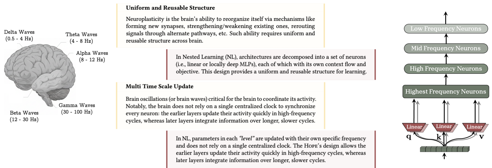
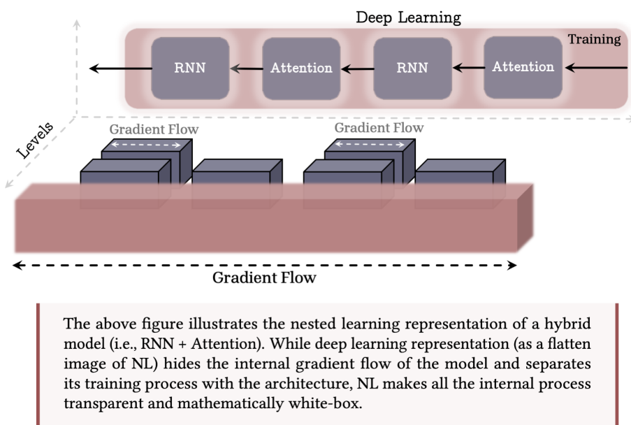
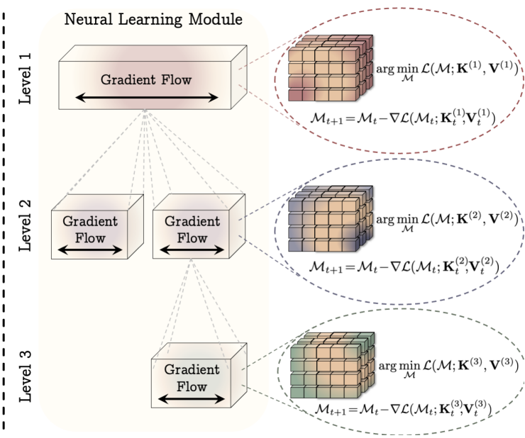
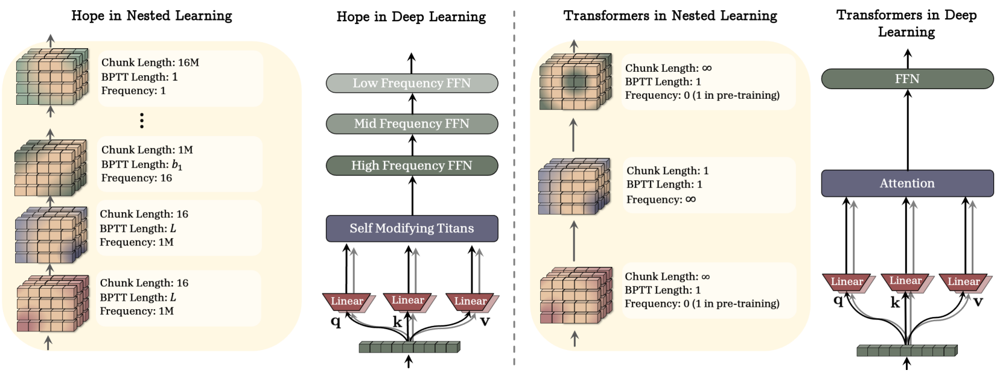

# 嵌套学习：深度学习架构的幻象

Ali Behrouz  
Google Research  
USA  
alibehrouz@google.com

Meisam Razaviyayn  
Google Research  
USA  
razaviyayn@gmail.com

Peiling Zhong Google Research USA peilinz@google.com

Vahab Mirrokni  
Google Research  
USA  
rrokni@gmail.com

# 摘要

在过去的几十年里，开发更强大的神经架构并同时设计优化算法以有效地训练它们，一直是提升机器学习模型能力的核心研究方向。尽管近期取得了进展，特别是在开发语言模型方面，关于此类模型如何持续学习/记忆、自我改进以及寻找“有效解决方案”，仍存在根本性的挑战和未解之谜。在本文中，我们提出了一种新的学习范式，称为嵌套学习，它连贯地用一个嵌套的、多层次的和/或并行的优化问题集来表示一个模型，每个优化问题都有其自己的“上下文流”。NL 揭示了现有的深度学习方法是通过压缩其自身的上下文流来从数据中学习的，并解释了上下文学习是如何在大模型中涌现的。NL 提出了一条路径（深度学习的一个新维度）来设计更具表现力的学习算法，使其具有更多的“层次”，从而产生高阶上下文学习能力。除了其神经科学合理性和数学白盒特性外，我们通过展示三个核心贡献来倡导其重要性：(1) 深度优化器：基于 NL，我们表明著名的基于梯度的优化器（例如 Adam、带动量的 SGD 等）实际上是联想记忆模块，旨在通过梯度下降来压缩梯度。基于这一见解，我们提出了一组更具表现力的优化器，它们具有深度记忆和/或更强大的学习规则；(2) 自修改泰坦：利用 NL 对学习算法的见解，我们提出了一种新颖的序列模型，它通过学习自己的更新算法来学习如何修改自身；以及 (3) 连续记忆系统：我们提出了一种记忆系统的新公式，它概括了传统的“长期/短期记忆”观点。结合我们的自修改序列模型与连续记忆系统，我们提出了一个名为 HOPE 的学习模块，在语言建模、持续学习和长上下文推理任务中显示出有希望的结果。

# 1 引言

本版本的论文已大幅压缩以符合 NeurIPS 定稿版的页数限制，部分材料、实验、讨论和方法已移至附录，这可能会使某些部分难以阅读或导致不一致。为避免此类情况，请阅读我们的 arXiv 版本 [1]（将于 11 月 13 日提供）。

---

---

_**图 1**：大脑中统一且可复用的结构以及多时间尺度的更新机制，是人类实现持续学习的关键组成部分。嵌套学习允许大脑的每个组件进行多时间尺度的更新，同时表明，众所周知的架构（如 Transformer）实际上就是具有不同更新频率的线性层。_

几十年来，人工智能研究主要集中在设计能够从数据 [2-5] 或经验 [6-8] 中学习的机器学习算法；通常是通过基于梯度的方法来优化关于参数 $\pmb{\theta} \in \Theta$ 的目标函数 $\mathcal{L}(\pmb{\theta})$。虽然传统的机器学习技术需要精心的工程设计和领域专业知识来设计特征提取器，这限制了它们直接处理自然数据并从中学习的能力 [9]，但深度表示学习提供了一种完全自动化的替代方案，以发现任务所需的表示。此后，深度学习已成为大规模计算模型不可或缺的一部分，并在化学和生物学 [10]、游戏 [11, 12]、计算机视觉 [13, 14] 以及多模态和自然语言理解 [15-17] 领域取得了开创性的成功。

像深度学习模型中那样堆叠多层结构，为模型提供了更大的容量、更强的表示复杂特征的表达能力，以及更多的内部计算（例如，#FLOPS）[18-20]，所有这些都是对于需要在先前固定的集合上进行分布内预测的静态任务而言至关重要且理想的特征。然而，这种深层设计并不是解决所有挑战的万能良药，也无法在多个方面提升模型的表达能力，例如： 深度模型的计算深度可能不会随着层数的增加而改变 [21, 22]，这使得它们实现复杂算法的能力与传统浅层方法相比保持不变 [23]； 某些类别的参数的容量可能会随着模型深度/宽度的增加而仅显示出微小的改善 [24]； 训练过程可能会收敛到次优解，主要是由于优化器或其超参数的选择不当；以及 模型快速适应新任务、持续学习和/或泛化到分布外数据的能力可能不会通过堆叠更多层而改变，而是需要更精心的设计。

为克服上述挑战并增强深度学习模型能力，其核心工作主要集中在： 开发更具表达力的参数类别（即神经架构）[13, 25-28]； 引入能更好地对任务进行建模的目标函数 [29-32]； 设计更高效/有效的优化算法，以找到更好的解或增强对遗忘的抵抗力 [33-36]；以及 在做出了架构、目标和优化算法的“正确”选择后，扩大模型规模以增强其表达能力 [24, 37, 38]。总的来说，这些进展以及关于深度模型缩放规律的新发现，奠定了构建大型语言模型的基础。

大型语言模型（LLM）的发展标志着深度学习研究的一个里程碑：从特定任务模型向具有各种涌现能力的更通用系统的范式转变，这是缩放“正确”架构的结果 [38, 39]。尽管 LLM 在各种任务中取得了成功并展现出卓越的能力 [15, 40, 41]，但它们在初始部署阶段后很大程度上是静态的，这意味着它们能够成功执行在预训练或后训练期间学到的任务，但无法超越其直接上下文持续获取新能力。LLM 唯一可适应的组件是其上下文学习能力——这是 LLM 的一种（已知具有涌现性的）特征，使其能够快速适应上下文，从而执行零样本或少样本任务 [38]。除了上下文学习之外，近期为克服 LLM 静态特性所做的努力，要么计算成本高昂，要么需要外部组件，要么缺乏泛化能力，和/或可能遭受灾难性遗忘 [42-44]，这导致研究人员开始质疑是否有必要重新审视如何设计机器学习

---

模型，以及是否需要一种超越简单层级堆叠的新学习范式，以在持续学习场景中释放 LLM 的全部潜力。

**当前模型仅经历“当下”。** 作为一个类比，为了更好地说明 LLM 的静态特性，我们使用“顺行性遗忘症”（anterograde amnesia）的例子——这是一种神经系统疾病，患者在患病后无法形成新的长期记忆，而既有的记忆则保持完好 [45]。这种状况将个人的知识和体验限制在一个狭窄的“当下”和遥远的“过去”（即患病前）的窗口内，导致患者只能持续地体验“当下”，仿佛一切都是全新的。当前 LLM 的记忆处理系统也受困于类似的模式。它们的知识仅限于：要么是能放入上下文窗口的即时上下文，要么是存储在 MLP 层中代表遥远过去的知识（即“预训练结束”之前）。这个类比促使我们从神经生理学文献中汲取灵感，探究大脑如何巩固其短期记忆：

# 1.1 人脑视角与神经生理学动机

人脑在持续学习（即有效的上下文管理）方面非常高效且有效，这通常归功于神经可塑性——大脑响应新体验、记忆、学习甚至损伤而改变自身的非凡能力 [46, 47]。最近的研究表明，长期记忆的形成涉及至少两个不同但互补的巩固过程 [48-50]：(1) 快速的“在线”巩固（也称为突触巩固）阶段，发生在学习期间或学习后不久，甚至在清醒状态下。此时，新的、最初脆弱的记忆痕迹被稳定下来，并开始从短期存储转移到长期存储；(2) “离线”巩固（也称为系统巩固）过程，通过重复最近编码的模式——在海马体的尖波涟漪（SWRs）期间，与皮层睡眠纺锤波和慢振荡相协调——来加强和重组记忆，并支持向皮层位点的转移 [51-53]。

回到顺行性遗忘症的类比，证据表明该病症会影响这两个阶段，但尤其是影响在线巩固阶段，主要是因为海马体是编码新的陈述性记忆的通道，因此它的损伤意味着新信息永远不会被存储在长期记忆中。如上所述，LLM 的设计，更具体地说是基于 Transformer 的主干网络，在预训练阶段后遭受了类似的状况。也就是说，上下文中提供的信息永远不会影响长期记忆参数（例如前馈层），因此模型无法获取新知识或技能，除非信息仍存储在短期记忆（例如注意力机制）中。就此而言，尽管第二阶段对于记忆巩固同样重要，甚至更为关键，其缺失可能会破坏该过程并可能导致记忆丧失 [54, 55]，但在本研究中，我们专注于第一阶段：将记忆巩固视为一种在线过程。我们在附录 A 中提供了关于人脑视角及其与 NL 联系的进一步讨论。

**符号说明。** 我们设 $ x \in \mathbb{R}^{N \times d_{\mathrm{in}}} $ 为输入，$ \mathcal{M}_t $ 表示时间 $ t $ 时记忆/模型 $ \mathcal{M} $ 的状态，$ \mathbf{K} $ 为键，$ \mathbf{V} $ 为值，$ \mathbf{Q} $ 为查询矩阵。我们使用带下标 $ t $ 的粗体小写字母来引用对应于输入 $ t $ 的向量（即 $ \mathbf{k}_t $，$ \mathbf{v}_t $ 和 $ \mathbf{q}_t $ )。我们进一步将任何实体 $ f $ 的分布称为 $ p(f) $。在本文中，我们使用具有 $ \mathcal{L}_{\mathcal{M}} \geq 1 $ 层和残差连接的简单 MLP 作为记忆模块 $ \mathcal{M}(\cdot) $ 的架构。在需要时，我们用 $ \theta_{\mathcal{M}} \supseteq \{W_1, W_2, \ldots, W_{\mathcal{L}_{\mathcal{M}}} \} $ 来参数化记忆模块，其中至少包括 MLP 中线性层的参数。我们使用带括号的上标来引用嵌套学习不同级别（不同更新频率）中的参数：即 $ W^{(\ell)} $。

# 2 嵌套学习

本节讨论了嵌套学习的动机、形式化定义以及一般的高层含义。我们首先从联想记忆的公式化开始，然后通过逐步示例，建立关于架构分解的直觉，以及其与将神经网络建模为优化问题集成系统之间的联系。我们旨在首先展示深度学习中现有的方法和概念如何归入 NL 范式，然后我们提出超越传统方法的新公式，和/或提供关于如何改进现有算法和设计的见解。

---

_图 2：嵌套学习范式，该范式将机器学习模型及其训练过程表示为一组嵌套的优化问题。（左图）混合架构示例。虽然深度学习视角（即 NL 的扁平化视图）无法提供关于模块内部计算深度的洞察，但 NL 透明地表示了所有内部梯度流。（右图）神经学习模块：一种学习如何压缩自身上下文流的计算模型。例如，第一层对应于模型的最外层训练循环，通常被称为“预训练”步骤。_

# 2.1 联想记忆

联想记忆——即形成和检索事件之间联系的能力——是一种基本的心理过程，也是人类学习不可或缺的组成部分 [56]。在文献中，记忆和学习的概念经常被互换使用；然而，在神经心理学文献中，这两者有着明确的区分。具体而言，遵循神经心理学文献 [57]，我们基于以下关于记忆和学习的定义来构建我们的术语体系：

# 学习与记忆：

记忆是由输入引起的神经更新，而学习是获取有效且有用记忆的过程。

在本工作中，我们的目标是首先证明计算序列模型的所有要素，包括优化器和神经网络，都是压缩其自身上下文流的联想记忆系统。广义上讲，联想记忆是一种将一组键映射到一组值的算子。我们遵循 Behrouz 等人 [58] 关于联想记忆的一般定义：

定义 1（联想记忆）。给定一组键 $\mathcal{K} \subseteq \mathbb{R}^{d_k}$ 和值 $\mathcal{V} \subseteq \mathbb{R}^{d_v}$，联想记忆是一个算子 $\mathcal{M}: \mathcal{K} \to \mathcal{V}$，它将两组键 $\mathcal{K}$ 和值 $\mathcal{V}$ 进行映射。为了从数据中学习这种映射，一个目标函数 $\tilde{\mathcal{L}}(\cdot; \cdot)$ 用于衡量映射的质量，$\mathcal{M}$ 可以定义为：

$$
\mathcal {M} ^ {*} = \arg \min  _ {\mathcal {M}} \tilde {\mathcal {L}} (\mathcal {M} (\mathcal {K}); \mathcal {V}). \tag {1}
$$

虽然算子本身就是一个记忆，且映射充当了记忆过程（即记忆上下文中事件的联系），但基于数据获取这种有效算子的过程则是一个学习过程。值得注意的是，这里的键和值可以是记忆旨在映射的任意事件，并不限于词元。在本节的后半部分，我们将讨论给定一个上下文流，键和值可能是词元、梯度、子序列等。此外，虽然联想记忆这一术语在神经科学和神经心理学文献中更为常见，但上述公式也与数据压缩和低维表示密切相关。也就是说，可以将公式 1 中的优化过程解释为网络 $\mathcal{M}(.)$ 的训练过程，该网络旨在将映射压缩到其参数中，从而在低维空间中表示它们。

在序列建模中，当键和值是输入词元（例如，分词后的文本）时，目标函数的选择以及求解公式 1 的优化过程会导致不同的序列

---

建模架构（参见 [59] 和 [58]），例如全局/局部 softmax 注意力 [27]，或其他现代循环模型 [28, 60, 61]。这种对序列模型的简单表述不仅让我们能更好地理解其内部过程，还提供了一个工具，可以基于其目标和优化过程简单地比较它们的建模能力。在下文中，我们将通过分步示例讨论如何将此表述应用于神经架构的所有组件（包括其在预训练中的优化过程），并讨论模型实际上如何作为一个多层级、嵌套和/或并行的记忆集成系统，其中每个系统都有自己的上下文流。

**MLP 训练的一个简单示例。** 我们从一个简单的示例开始，在该示例中，我们的目标是通过梯度下降优化目标函数 $ \mathcal{L}(\cdot ;\cdot) $，在数据集 $ \mathcal{D}_{\mathrm{train}} = \{x_1,\dots,x_{|\mathcal{D}_{\mathrm{train}}|}\} $ 上训练一个 1 层 MLP（参数化为 $ W $）以完成任务 $ \mathcal{T} $。在这种情况下，训练过程等价于以下优化问题：

$$
W ^ {*} = \arg \min  _ {W} \mathcal {L} (W; \mathcal {D} _ {\text {t r a i n}}), \tag {2}
$$

通过梯度下降对该问题的优化会导致等价于以下形式的权重更新规则：

$$
\begin{array}{l} W _ {t + 1} = W _ {t} - \eta_ {t + 1} \nabla_ {W _ {t}} \mathcal {L} \left(W _ {t}; x _ {t + 1}\right) (3) \\ = W _ {t} - \eta_ {t + 1} \nabla_ {y _ {t + 1}} \mathcal {L} \left(W _ {t}; x _ {t + 1}\right) \otimes x _ {t + 1}, \quad \text {w h e r e} x _ {t + 1} \sim \mathcal {D} _ {\text {t r a i n}}, (4) \\ \end{array}
$$

其中 $ y_{t+1} = Wx_{t+1} $ 是模型针对输入 $ x_{t+1} $ 的输出。鉴于这种表述，我们可以令 $ u_{t+1} = \nabla_{y_{t+1}}\mathcal{L}(W_t; x_{t+1}) $，并将反向传播过程重新表述为一个优化问题的解，该问题旨在寻找一个最优的联想记忆，用于将输入数据点 $ \mathcal{D}_{\mathrm{train}} = \{x_t\}_{t=1}^{|\mathcal{D}_{\mathrm{train}}|} $ 映射到其对应的 $ u_{t+1} = \nabla_{y_{t+1}}\mathcal{L}(W_t; x_{t+1}) $。也就是说，我们令 $ \mathcal{M}(\cdot) = W_t $ 对记忆进行参数化，并使用点积相似度来衡量 $ W_t $ 在 $ x_{t+1} $ 和 $ \nabla_{y_{t+1}}\mathcal{L}(W_t; x_{t+1}) $ 之间映射的质量：

$$
\begin{array}{l} W _ {t + 1} = \arg \min  _ {W} \left\langle W x _ {t + 1}, u _ {t + 1} \right\rangle + \frac {1}{2 \eta_ {t + 1}} \| W - W _ {t} \| _ {2} ^ {2} (5) \\ = \arg \min _ {W} \left\langle W x _ {t}, \nabla_ {y _ {t + 1}} \mathcal {L} (W _ {t}; x _ {t + 1}) \right\rangle + \frac {1}{2 \eta_ {t + 1}} \| W - W _ {t} \| _ {2} ^ {2}. (6) \\ \end{array}
$$

在上述表述中，$ u_{t + 1} = \nabla_{y_{t + 1}}\mathcal{L}(W_t;x_{t + 1}) $ 可以被解释为表征空间中的一个局部惊奇信号，它量化了当前输出与目标函数 $ \mathcal{L}(\cdot ;\cdot) $ 所强加的结构之间的不匹配程度。因此，这种表述将模型的训练阶段转化为获取有效记忆的过程，该记忆将数据样本映射到其在表征空间中的局部惊奇信号——定义为当前输出与目标函数 $ \mathcal{L}(\cdot ;\cdot) $ 所强加的结构之间的不匹配。相应地，在此示例中，我们的模型在数据样本上具有单一的梯度流，该梯度流仅在数据集 $ \mathcal{D}_{\mathrm{train}} = \{x_1,\ldots ,x_{|\mathcal{D}_{\mathrm{train}}|}\} $ 上激活，并在此后对任何其他数据样本冻结（即推理或测试时间）。

接下来，在上述示例中，我们用其增强的基于动量的变体替换梯度下降算法，从而得到如下更新规则：

$$
W _ {t + 1} = W _ {t} - \mathbf {m} _ {t + 1}, \tag {7}
$$

$$
\mathbf {m} _ {t + 1} = \mathbf {m} _ {t} - \eta_ {t + 1} \nabla_ {W _ {t}} \mathcal {L} \left(W _ {t}; x _ {t + 1}\right) = \mathbf {m} _ {t} - \eta_ {t + 1} \nabla_ {y _ {t + 1}} \mathcal {L} \left(W _ {t}; x _ {t + 1}\right) \otimes x _ {t + 1}. \tag {8}
$$

在公式 8 中，鉴于公式 7 的前一状态（在时刻 $t$），$ \nabla_{W_t}\mathcal{L}(W_t;x_{t + 1}) $ 或类似的 $ \nabla_{y_{t + 1}}\mathcal{L}(W_t;x_{t + 1}) $ 的值独立于公式 8 中的递归关系，因此可以预先计算。为此，我们令 $u_{t + 1} = \nabla_{W_t}\mathcal{L}(W_t;x_{t + 1}) $，因此公式 8 可以重新表述为：

$$
\begin{array}{l} W _ {t + 1} = W _ {t} - \mathbf {m} _ {t + 1}, (9) \\ \mathbf {m} _ {t + 1} = \arg \min  _ {\mathbf {m}} - \left\langle \mathbf {m}, \nabla_ {W _ {t}} \mathcal {L} \left(W _ {t}; x _ {t + 1}\right) \right\rangle + \eta_ {t + 1} \| \mathbf {m} - \mathbf {m} _ {t} \| _ {2} ^ {2} (10) \\ = \arg \min  _ {\mathbf {m}} - \left\langle \mathbf {m} x _ {t + 1}, \nabla_ {y _ {t + 1}} \mathcal {L} \left(W _ {t}; x _ {t + 1}\right) \right\rangle + \eta_ {t + 1} \| \mathbf {m} - \mathbf {m} _ {t} \| _ {2} ^ {2}, (11) \\ \end{array}
$$

其中公式 10 中的优化问题等价于学习率为 $\eta_{t + 1}$ 的自适应学习率梯度下降的一步。鉴于这些表述，可以将动量项解释为：（1）一种无键的联想记忆，将梯度压缩到其参数中；或（2）一种学习如何将数据点映射到其对应的 LSS 值的联想记忆。有趣的是，这种表述揭示了带有动量的梯度下降实际上是一个两层

---

优化过程，其中内存通过简单的梯度下降算法进行优化。这一过程与快速权重程序密切相关 [62]，其中权重更新过程（即公式 9）是慢速网络，其动量权重由快速网络生成（即公式 10）。

综上所述，我们观察到单层 MLP 的训练过程具有以下特点：(1) 梯度下降是一个 1 级联想记忆，它学习如何将数据点映射到其对应的 LSS 值；(2) 带动量的梯度下降是一个 2 级联想记忆（或优化过程），其中内层学习将梯度值存储到其参数中，然后外层使用内层记忆的值更新慢速权重（即 $ W_{t} $）。虽然这些是关于架构和优化器算法的最简单示例，但人们可能会问，在更复杂的设置中是否可以得出类似的结论。

架构分解示例。在下一个示例中，我们用线性注意力 [60] 替换 MLP 模块。也就是说，我们的目标是通过梯度下降优化目标 $\mathcal{L}$，在序列 $\mathcal{D}_{\mathrm{train}} = \{x_1,\ldots ,x_{|\mathcal{D}_{\mathrm{train}}|}\}$ 上训练一个用于任务 $\mathcal{T}$ 的单层线性注意力。回顾非归一化线性注意力的公式：

$$
\mathbf {k} _ {t} = x _ {t} W _ {\mathbf {k}}, \quad \mathbf {v} _ {t} = x _ {t} W _ {\mathbf {v}}, \quad \mathbf {q} _ {t} = x _ {t} W _ {\mathbf {q}}, \tag {12}
$$

$$
\mathcal {M} _ {t} = \mathcal {M} _ {t - 1} + \mathbf {v} _ {t} \mathbf {k} _ {t} ^ {\top}, \tag {13}
$$

$$
y _ {t} = \mathcal {M} _ {t} \mathbf {q} _ {t}. \tag {14}
$$

正如早期研究 [58, 59] 所讨论的，公式 13 中的递归可以重新表述为矩阵值联想记忆 $\mathcal{M}_t(\cdot)$ 的优化过程，其目的是将键和值的映射压缩到其参数中。更详细地说，在定义 1 中，如果我们设 $\tilde{\mathcal{L}} (\mathcal{M}_{t - 1};\mathbf{k}_t,\mathbf{v}_t)\coloneqq -\langle \mathcal{M}_{t - 1}\mathbf{k}_t,\mathbf{v}_t\rangle$ 并旨在通过梯度下降优化记忆，则记忆更新规则为：（注意 $\nabla \tilde{\mathcal{L}} (\mathcal{M}_{t - 1};\mathbf{k}_t,\mathbf{v}_t) = \mathbf{v}_t\mathbf{k}_t^\top$ 且我们设学习率 $\eta_t = 1$）

$$
\begin{array}{l} \mathcal {M} _ {t + 1} = \arg \min  _ {\mathcal {M}} \left\langle \mathcal {M} \mathbf {k} _ {t + 1}, \mathbf {v} _ {t + 1} \right\rangle + \| \mathcal {M} - \mathcal {M} _ {t} \| _ {2} ^ {2} \quad \text {w i t h g r a d i e n t d e s c e n t ,} (15) \\ \Rightarrow \mathcal {M} _ {t + 1} = \mathcal {M} _ {t} - \nabla \tilde {\mathcal {L}} \left(\mathcal {M} _ {t}; \mathbf {k} _ {t + 1}, \mathbf {v} _ {t + 1}\right) = \mathcal {M} _ {t} + \mathbf {v} _ {t + 1} \mathbf {k} _ {t + 1} ^ {\top}, (16) \\ \end{array}
$$

这等价于公式 13 中非归一化线性注意力的更新规则。此外，请注意，正如我们在第一个示例中观察到的，使用梯度下降训练线性层是联想记忆的 1 层优化问题（见公式 3），因此投影层（即 $ W_{\mathbf{k}} $、$ W_{\mathbf{v}} $ 和 $ W_{\mathbf{q}} $）的一般训练/更新过程本身就是一个联想记忆的优化过程。因此，这种设置，即使用梯度下降训练线性注意力，可以看作是一个两级优化过程，其中外循环（也称为训练过程）使用梯度下降优化投影层，而内循环使用梯度下降优化 $\mathcal{M}_t$ 的内部记忆。

请注意，如上所述，这里我们有两个联想记忆，因此每个记忆都有自己的优化过程和梯度流。也就是说，在 $ W_{\mathbf{k}} $、$ W_{\mathbf{v}} $ 和 $ W_{\mathbf{q}} $ 的外层参数优化中，不存在关于参数 $\mathcal{M}(\cdot)$ 的梯度，因此不存在通过它的反向传播。同样，在内层，不存在通过投影层的反向传播，它们被视为冻结状态。此外，值得注意的是，在这个示例中，上述公式也与线性注意力的 FwPs 视角密切相关 [63]，其中投影被视为慢速权重，而公式 13 中的记忆更新是快速权重更新规则。

具有更多层级的架构分解。在上述两个示例中，我们讨论了简单的情况，它们可以转化为 2 级优化过程，这也与它们的 FwPs 解释相吻合。然而，在实践中，我们需要使用更强大的优化算法来训练模型，和/或使用更强大的递归更新规则来更新记忆。作为一个简单的示例，假设我们使用带动量的梯度下降来训练线性注意力模型。在上述示例中，我们展示了线性注意力组件如何分解为两个嵌套的优化问题。类似地，这里模型可以表示为一个 2 级优化问题，其中 (1) 内层使用梯度下降优化记忆以压缩上下文（见公式 15），(2) 外层使用带动量的梯度下降优化投影层。有趣的是，从第一个示例中，我们知道“带动量的梯度下降”算法本身确实是一个 2 级优化问题，其中动量项本身就是一个将过去梯度压缩到其参数中的联想记忆。

---

# 2.2 嵌套优化问题

在上一节中，我们提供了示例来演示如何将机器学习模型分解为一组嵌套或多级优化问题。接下来，我们首先旨在为嵌套学习问题提供一个正式的表述，然后定义神经学习模块——一个从数据中学习的集成计算系统。

正如我们在上一节中观察到的，虽然我们将模型分解为一组优化过程，但目前尚不清楚我们是否可以定义这些问题之间的层次结构（或顺序），并以这种格式唯一地表示该模型。受脑电波层级结构的启发（该结构指示了每个部分的信息处理频率，在第 1 节中讨论过），我们使用每个优化问题的更新率来对多个级别的组件进行排序。为此，我们将针对单个数据点的一次更新步骤设为时间单位，并将每个组件的更新频率率定义为：

**定义 2（更新频率）。** 对于 $ A $ 的任何组件，它可以是一个参数化组件（例如，可学习的权重或动量梯度下降中的动量项）或非参数化组件（例如，注意力块），我们将其频率表示为 $ f_{A} $，定义为其每单位时间的更新次数。

给定上述更新频率，我们可以基于算子 $(\cdot \succ \cdot)$ 对机器学习算法的组件进行排序。如果满足以下条件，我们称 $A$ 比 $B$ 快，并记作 $A \succ B$：(1) $f_A > f_B$，或者 (2) $f_A = f_B$ 但计算 $B$ 在时间 $t$ 的状态需要计算 $A$ 在时间 $t$ 的状态。在这个定义中，当 $A \succ B$ 且 $B \succ A$ 时，我们记作 $A \stackrel{f}{=} B$，这表示 $A$ 和 $B$ 具有相同的频率更新，但它们的计算彼此独立（稍后，我们将在 AdamW 优化器中提供这种情况的示例）。基于上述算子，我们将组件分类到一个有序的“级别”集合中，其中 (1) 同一级别中的组件具有相同的频率更新，(2) 级别越高，其频率越低。值得注意的是，基于上述定义，每个组件都有自己的优化问题以及相应的上下文。当我们使用基于梯度的优化器优化组件的内部目标时，上述陈述等同于模型中每个组件拥有独立的梯度流。然而，在一般情况下，可以使用非参数化解决方案（正如我们稍后讨论注意力时那样）。

**神经学习模块。** 给定上述嵌套学习问题的定义，我们将神经学习模块定义为机器学习模型的一种新的表示方式，它将模型展示为一个由组件组成的互连系统，每个组件都有自己的梯度流。请注意，与深度学习正交的是，嵌套学习允许我们定义具有更多级别的神经学习模型，从而产生更具表现力的架构。

嵌套学习允许由多个（多层）级别组成的计算模型从不同的抽象级别和时间尺度学习和处理数据。

接下来，我们从嵌套学习的角度研究优化器和著名的深度学习架构，并提供示例说明 NL 如何帮助增强这些组件。

# 2.3 作为学习模块的优化器

在本节中，我们首先通过理解著名的优化器及其变体如何作为嵌套学习的特例来展开。回顾带有动量的梯度下降法，

$$
W _ {i + 1} = W _ {i} + \mathbf {m} _ {i + 1}
$$

$$
\mathbf {m} _ {i + 1} = \alpha_ {i + 1} \mathbf {m} _ {i} - \eta_ {t} \nabla \mathcal {L} \left(W _ {i}; x _ {i}\right), \tag {17}
$$

其中矩阵（或向量）$\mathbf{m}_i$ 是状态 $i$ 时的动量，$\alpha_{i}$ 和 $\eta_{i}$ 分别是自适应学习率和动量率。假设 $\alpha_{i + 1} = 1$，动量项可以看作是使用梯度下降优化以下目标的结果：

$$
\min  _ {\mathbf {m}} \langle \mathbf {m} \nabla \mathcal {L} \left(W _ {i}; x _ {i}\right) ^ {\top}, \mathbf {I} \rangle . \tag {18}
$$

这种解释表明，动量确实可以被视为一个元记忆模块，它学习如何将目标的梯度记忆到其参数中。基于这种直觉，在

---

在附录 C.4 节中，我们展示了经过小幅修改的 Adam 算法是模型梯度的最优联想记忆。接下来，我们将展示这一视角如何指导我们设计表达能力更强的优化器：

**扩展：更具表现力的关联。** 如前所述，动量是一种无值的联想记忆，因此其表达能力有限。为了解决这个问题，遵循联想记忆的原始定义（即将键映射到值），我们令值参数 $\mathbf{v}_i = \mathbf{P}_i$，于是动量旨在最小化：

$$
\min  _ {\mathbf {m}} \left\langle \mathbf {m} \nabla \mathcal {L} \left(W _ {i}; x _ {i}\right) ^ {\top}, \mathbf {P} _ {i} \right\rangle , \tag {19}
$$

使用梯度下降法，得到更新规则：

$$
W _ {i + 1} = W _ {i} + \mathbf {m} _ {i + 1}
$$

$$
\mathbf {m} _ {i + 1} = \alpha_ {i + 1} \mathbf {m} _ {i} - \eta_ {t} \mathbf {P} _ {i} \nabla \mathcal {L} (W _ {i}; x _ {i}). \tag {20}
$$

该公式等价于使用预处理的动量梯度下降。事实上，预处理意味着动量项充当了一种联想记忆，用于学习如何压缩 $\mathbf{P}_i$ 与梯度项 $\nabla \mathcal{L}(W_i; x_i)$ 之间的映射。虽然任何合理的预处理选择（例如随机特征）都能提高表达能力，但初始版本的动量 GD 本身是一种无值记忆（即将所有梯度映射到单个值），上述视角为哪种预处理更有用提供了更多直觉。也就是说，动量充当了一种旨在将梯度映射到其对应值的记忆，因此梯度的函数（例如关于 Hessian 的信息）可以为记忆提供更有意义的映射。

**扩展：更具表现力的目标。** 如 Behrouz 等人 [58] 所述，优化点积相似度的内部目标会导致类似 Hebbian 的更新规则，这可能会降低记忆的有效性。这种内部目标的一个自然扩展是使用 $\ell_2(\cdot)$ 回归损失（用于衡量相应的键值映射拟合度）并最小化损失函数 $\| \mathbf{m}\nabla \mathcal{L}(W_i;x_i)^\top -\mathbf{P}_i\| _2^2$，从而得到以下更新规则：

$$
W _ {i + 1} = W _ {i} + \mathbf {m} _ {i + 1}, \tag {21}
$$

$$
\mathbf {m} _ {i + 1} = \left(\alpha_ {i + 1} \mathbf {I} - \nabla \mathcal {L} \left(W _ {i}; x _ {i}\right) ^ {\top} \nabla \mathcal {L} \left(W _ {i}; x _ {i}\right)\right) \mathbf {m} _ {i} - \eta_ {t} \mathbf {P} _ {i} \nabla \mathcal {L} \left(W _ {i}; x _ {i}\right), \tag {22}
$$

该更新基于 Delta 规则 [64]，因此它允许记忆（动量）更好地管理其有限的容量，并更好地记忆过去的梯度序列。

**扩展：更具表现力的记忆。** 如前所述，动量可以被视为一种元记忆模型，它使用线性层（即矩阵值）来压缩过去的梯度值。由于动量的线性特性，其内部目标只能学习过去梯度的线性函数。为了增加该模块的学习能力，一种替代方案是使用其他强大的持久学习模块：即用 MLP 替换动量的线性矩阵值记忆。因此，作为过去梯度记忆的动量，拥有更大的容量来捕捉梯度的潜在动态。为此，我们将公式 17 扩展为：

$$
W _ {i + 1} = W _ {i} + \mathbf {m} _ {i + 1} (\mathbf {u} _ {i}), \quad \text {a n d} \quad \mathbf {m} _ {i + 1} = \alpha_ {i + 1} \mathbf {m} _ {i} - \eta_ {t} \nabla \mathcal {L} ^ {(2)} (\mathbf {m} _ {i}; \mathbf {u} _ {i}, \mathbf {I}), \tag {23}
$$

其中 $\mathbf{u}_i = \nabla \mathcal{L}(W_i; x_i)$，$\nabla \mathcal{L}^{(2)}(\cdot)$ 是动量的内部目标（例如点积相似度 $\langle \mathbf{m}(\mathbf{u}_i^\top), \mathbf{1} \rangle$）。我们将此变体称为深度动量梯度下降。

**扩展：非线性输出。** 基于上述将动量视为神经架构的视角，增强动量记忆模块表示能力的一种常用技术是在其输出之上使用非线性 [28, 65]。也就是说，我们将公式 23 重新表述为：

$$
W _ {i + 1} = W _ {i} + \sigma (\mathbf {m} _ {i + 1} (\mathbf {u} _ {i})), \quad \mathrm {a n d} \quad \mathbf {m} _ {i + 1} = \alpha_ {i + 1} \mathbf {m} _ {i} - \eta_ {t} \nabla \mathcal {L} ^ {(2)} (\mathbf {m} _ {i}; \mathbf {u} _ {i}, \mathbf {I}), \qquad (2 4)
$$

其中 $\sigma(\cdot)$ 是任意非线性函数。例如，我们令 $\sigma(\cdot) = \text{Newton-Schulz}(\cdot)$，其中 Newton-Schulz 是迭代的 Newton-Schulz 方法 [66]，且 $\mathbf{m}(\cdot)$ 是一个线性层；由此产生的优化器等价于 Muon 优化器 [34]。

---

---

# 超越简单的反向传播

正如第 2.1 节早先讨论的，预训练过程和反向传播是一种联想记忆的形式，其中输入数据被映射到其预测输出引起的惊讶感 $\nabla_{y_t}\mathcal{L}(W_t;x_t)$：

$$
W _ {t + 1} = W _ {t} - \eta_ {t + 1} \nabla_ {W _ {t}} \mathcal {L} \left(W _ {t}; x _ {t}\right) = W _ {t} - \eta_ {t + 1} \nabla_ {y _ {t}} \mathcal {L} \left(W _ {t}; x _ {t}\right) \otimes x _ {t}, \quad \text {w h e r e} x _ {t} \sim \mathcal {D} _ {\text {t r a i n}}, \tag {25}
$$

从联想记忆的角度来看，这等同于以下优化过程中的一步梯度下降：

$$
\min  _ {W} \langle W x _ {t}, \nabla_ {y _ {t}} \mathcal {L} (W _ {t}; x _ {t}) \rangle . \tag {26}
$$

正如我们在附录 C 中讨论的，上述公式导致忽略了像 $ x_{t} $ 这样的数据样本之间的依赖关系。为了将其扩展为一种更强大的公式，使其也考虑数据点之间的依赖关系（当我们在标记空间中使用优化器时，这一点极其重要，因为它们不是独立的），我们使用带有一步梯度下降的 $ L_{2} $ 回归目标，如下所示：

$$
\min  _ {W} \| W x _ {t} - \nabla_ {y _ {t}} \mathcal {L} \left(W _ {t}; x _ {t}\right) \| _ {2} ^ {2}. \tag {27}
$$

该公式产生了一种新的梯度下降变体，可以简化如下：

$$
\begin{array}{l} W _ {t + 1} = W _ {t} \left(\mathbf {I} - x _ {t} x _ {t} ^ {\top}\right) - \eta_ {t + 1} \nabla_ {W _ {t}} \mathcal {L} \left(W _ {t}; x _ {t}\right) (28) \\ = W _ {t} \left(\mathbf {I} - x _ {t} x _ {t} ^ {\top}\right) - \eta_ {t + 1} \nabla_ {y _ {t}} \mathcal {L} \left(W _ {t}; x _ {t}\right) \otimes x _ {t}, \quad \text {w h e r e} x _ {t} \sim \mathcal {D} _ {\text {t r a i n}}, (29) \\ \end{array}
$$

随后，我们将此优化器用作我们 HOPE 架构的内部优化器。

# 3 HOPE：具有连续记忆的自引用学习模块

现有的架构骨干由 (1) 工作记忆模块（例如注意力机制）组成，负责跨序列长度主动融合信息，以及 (2) 前馈层（例如 MLP），负责跨特征融合信息，并充当预训练阶段的持久记忆或知识存储。从神经语言学的角度来看，预训练是学习模块的最外层在其有限的上下文流上进行更新的阶段。因此，在持续学习设置中，这种预训练阶段也很少随时间更新，因此其对应的知识存储也很少随时间更新。鉴于这种直觉，我们扩展了长期/短期记忆系统的传统观点，并为每个层级（频域）提出了一个知识存储前馈层。

根据频率的定义，连续记忆系统被形式化为一系列 MLP 块 $\mathbf{MLP}^{(f_1)}(\cdot),\ldots ,\mathbf{MLP}^{(f_k)}(\cdot)$，每个块关联的块大小为 $C^{(\ell)} := \frac{\max_{\ell}C^{(\ell)}}{f_{\ell}}$，使得给定输入 $x = \{x_{1},\dots,x_{T}\}$，该链的输出计算如下（为清晰起见，我们忽略了归一化）：

$$
y _ {t} = \operatorname {M L P} ^ {\left(f _ {k}\right)} \left(\operatorname {M L P} ^ {\left(f _ {k - 1}\right)} \left(\dots \operatorname {M L P} ^ {\left(f _ {1}\right)} \left(x _ {t}\right)\right)\right), \tag {30}
$$

其中第 $\ell$ 个 MLP 块的参数，即 $\pmb{\theta}^{(f_{\ell})}$，每 $C^{(\ell)}$ 步更新一次：

$$
\boldsymbol {\theta} _ {i + 1} ^ {(f _ {\ell})} = \boldsymbol {\theta} _ {i} ^ {(f _ {\ell})} - \left\{ \begin{array}{l l} \sum_ {t = i - C ^ {(\ell)}} ^ {i} \eta_ {t} ^ {(\ell)} f \left(\boldsymbol {\theta} _ {t} ^ {(f _ {\ell})}; x _ {t}\right) & \text {i f} i \equiv 0 (\bmod C ^ {(\ell)}), \\ 0 & \text {o t h e r w i s e .} \end{array} \right. \tag {31}
$$

在附录 B.1 中，我们讨论了该公式的不同变体，包括完全嵌套的 MLP 层。这里 $\eta_t^{(\ell)}$ 是对应于 $\pmb{\theta}^{(f_{\ell})}$ 的学习率，$f(\cdot)$ 是任意优化器的误差分量（例如梯度下降中的 $\nabla \mathcal{L}(\pmb{\theta}_t^{(f_\ell)}; x_t)$）。传统的 Transformer 块 [27] 是该公式的一个特例，其中 $k = 1$。值得注意的是，公式 31 提供了一个重要的解释：参数 $\pmb{\theta}_t^{(f_\ell)}$ 负责将其自己的上下文压缩到其参数中，因此它们是其上下文的抽象知识的代表。

HOPE。我们进一步提出了一个基于 Titans [28] 和我们在附录 B.1 中的梯度下降变体的自引用学习模块。将这种自引用序列模型与连续记忆系统相结合，便产生了 HOPE 架构。

---

_图 3：Hope 架构主干与 Transformer 的对比（为了清晰起见，移除了归一化和潜在的数据依赖组件）。_

_表 1：HOPE 和基线模型在语言建模和常识推理任务上的性能。混合模型用 * 标记。_

<table><tr><td>模型</td><td>Wiki. ppl ↓</td><td>LMB. ppl ↓</td><td>LMB. acc ↑</td><td>PIQA acc ↑</td><td>Hella. acc_n ↑</td><td>Wino. acc ↑</td><td>ARC-e acc ↑</td><td>ARC-c acc_n ↑</td><td>SIQA acc ↑</td><td>BoolQ acc ↑</td><td>Avg. ↑</td></tr><tr><td>HOPE (ours)</td><td>26.05</td><td>29.38</td><td>35.40</td><td>64.62</td><td>40.11</td><td>51.19</td><td>56.92</td><td>28.49</td><td>38.33</td><td>60.12</td><td>46.90</td></tr><tr><td colspan="12">760M params / 30B tokens</td></tr><tr><td>Transformer++</td><td>25.21</td><td>27.64</td><td>35.78</td><td>66.92</td><td>42.19</td><td>51.95</td><td>60.38</td><td>32.46</td><td>39.51</td><td>60.37</td><td>48.69</td></tr><tr><td>RetNet</td><td>26.08</td><td>24.45</td><td>34.51</td><td>67.19</td><td>41.63</td><td>52.09</td><td>63.17</td><td>32.78</td><td>38.36</td><td>57.92</td><td>48.46</td></tr><tr><td>DeltaNet</td><td>24.37</td><td>24.60</td><td>37.06</td><td>66.93</td><td>41.98</td><td>50.65</td><td>64.87</td><td>31.39</td><td>39.88</td><td>59.02</td><td>48.97</td></tr><tr><td>TTT</td><td>24.17</td><td>23.51</td><td>34.74</td><td>67.25</td><td>43.92</td><td>50.99</td><td>64.53</td><td>33.81</td><td>40.16</td><td>59.58</td><td>47.32</td></tr><tr><td>Samba*</td><td>20.63</td><td>22.71</td><td>39.72</td><td>69.19</td><td>47.35</td><td>52.01</td><td>66.92</td><td>33.20</td><td>38.98</td><td>61.24</td><td>51.08</td></tr><tr><td>Titans (LMM)</td><td>20.04</td><td>21.96</td><td>37.40</td><td>69.28</td><td>48.46</td><td>52.27</td><td>66.31</td><td>35.84</td><td>40.13</td><td>62.76</td><td>51.56</td></tr><tr><td>HOPE (ours)</td><td>20.53</td><td>20.47</td><td>39.02</td><td>70.13</td><td>49.21</td><td>52.70</td><td>66.89</td><td>36.05</td><td>40.71</td><td>63.29</td><td>52.26</td></tr><tr><td colspan="12">1.3B params / 100B tokens</td></tr><tr><td>Transformer++</td><td>18.53</td><td>18.32</td><td>42.60</td><td>70.02</td><td>50.23</td><td>53.51</td><td>68.83</td><td>35.10</td><td>40.66</td><td>57.09</td><td>52.25</td></tr><tr><td>RetNet</td><td>19.08</td><td>17.27</td><td>40.52</td><td>70.07</td><td>49.16</td><td>54.14</td><td>67.34</td><td>33.78</td><td>40.78</td><td>60.39</td><td>52.02</td></tr><tr><td>DeltaNet</td><td>17.71</td><td>16.88</td><td>42.46</td><td>70.72</td><td>50.93</td><td>53.35</td><td>68.47</td><td>35.66</td><td>40.22</td><td>55.29</td><td>52.14</td></tr><tr><td>Samba*</td><td>16.13</td><td>13.29</td><td>44.94</td><td>70.94</td><td>53.42</td><td>55.56</td><td>68.81</td><td>36.17</td><td>39.96</td><td>62.11</td><td>54.00</td></tr><tr><td>Titans (LMM)</td><td>15.60</td><td>11.41</td><td>49.14</td><td>73.09</td><td>56.31</td><td>59.81</td><td>72.43</td><td>40.82</td><td>42.05</td><td>60.97</td><td>56.82</td></tr><tr><td>HOPE (ours)</td><td>15.11</td><td>11.63</td><td>50.01</td><td>73.29</td><td>56.84</td><td>60.19</td><td>72.30</td><td>41.24</td><td>42.52</td><td>61.46</td><td>57.23</td></tr></table>

# 4 实验

受篇幅所限，在正文中，我们报告了 HOPE 在语言建模和常识推理任务上的评估结果。然而，我们在附录中报告了广泛的结果集，包括关于优化器的实验、上下文学习的涌现、HOPE 的持续学习能力、消融研究、长上下文任务等。关于实验设置和其他所用数据集的详细信息见附录 G。

语言建模与常识推理。我们遵循最近的序列建模研究 [28, 67, 68]，报告了 HOPE 和基线模型在 $340\mathrm{M}$、$760\mathrm{M}$ 和 $1.3\mathrm{B}$ 规模下的语言建模以及常识推理下游任务的结果。这些结果报告在表 1 中。HOPE 在所有规模和基准任务中都表现出优异的性能，优于 Transformer 和最近的现代循环神经网络，包括 Gated DeltaNet 和 Titans。通过将 HOPE 与 Titans 和 Gated DeltaNet 进行比较，我们可以看到，根据上下文动态改变键、值和查询投影以及深度记忆模块，可以构建出具有更低困惑度和更高基准测试准确率的模型。

---

# 参考文献

[1] Ali Behrouz, Meisam Razaviyayn, Peilin Zhong, and Vahab Mirrokni. Nested learning: The illusion of deep learning architectures. arXiv preprint arXiv.

[2] Walter Pitts. The linear theory of neuron networks: The dynamic problem. The bulletin of mathematical biophysics, 5:23-31, 1943.

[3] Warren S McCulloch. The brain computing machine. Electrical Engineering, 68(6):492-497, 1949.

[4] Warren S McCulloch and Walter Pitts. The statistical organization of nervous activity. Biometrics, 4(2):91-99, 1948.

[5] Arthur L Samuel. Some studies in machine learning using the game of checkers. IBM Journal of research and development, 3(3):210-229, 1959.

[6] David Silver and Richard S Sutton. Welcome to the era of experience. Google AI, 1, 2025.

[7] Richard S Sutton, Andrew G Barto, et al. Reinforcement learning: An introduction, volume 1. 1998.

[8] Jonathan H. Connell and Sridhar Mahadevan. Robot learning. *Robotica*, 17(2):229–235, 1999. doi: 10.1017/S0263574799271172.

[9] Yann LeCun, Yoshua Bengio, and Geoffrey Hinton. Deep learning. nature, 521(7553):436-444, 2015.

[10] John Jumper, Richard Evans, Alexander Pritzel, Tim Green, Michael Figurnov, Olaf Ronneberger, Kathryn Tunyasuvunakool, Russ Bates, Augustin Žídek, Anna Potapenko, et al. Highly accurate protein structure prediction with alphafold. nature, 596(7873):583-589, 2021.

[11] David Silver, Aja Huang, Chris J Maddison, Arthur Guez, Laurent Sifre, George Van Den Driessche, Julian Schrittwieser, Ioannis Antonoglou, Veda Panneershelvam, Marc Lanctot, et al. Mastering the game of go with deep neural networks and tree search. nature, 529(7587):484-489, 2016.

[12] David Silver, Thomas Hubert, Julian Schrittwieser, Ioannis Antonoglou, Matthew Lai, Arthur Guez, Marc Lanctot, Laurent Sifre, Dharshan Kumaran, Thore Graepel, et al. A general reinforcement learning algorithm that masters chess, shogi, and go through self-play. Science, 362(6419):1140-1144, 2018.

[13] Alex Krizhevsky, Ilya Sutskever, and Geoffrey E Hinton. Imagenet classification with deep convolutional neural networks. Advances in neural information processing systems, 25, 2012.

[14] Alexey Dosovitskiy, Lucas Beyer, Alexander Kolesnikov, Dirk Weissenborn, Xiaohua Zhai, Thomas Unterthiner, Mostafa Dehghani, Matthias Minderer, Georg Heigold, Sylvain Gelly, Jakob Uszkoreit, and Neil Houlsby. An image is worth 16x16 words: Transformers for image recognition at scale. In International Conference on Learning Representations, 2021. URL https://openreview.net/forum?id=YicbFdNTTy.

[15] Gheorghe Comanici, Eric Bieber, Mike Schaekermann, Ice Pasupat, Noveen Sachdeva, Inderjit Dhillon, Marcel Blistein, Ori Ram, Dan Zhang, Evan Rosen, et al. Gemini 2.5: Pushing the frontier with advanced reasoning, multimodality, long context, and next generation agentic capabilities. arXiv preprint arXiv:2507.06261, 2025.

[16] Aixin Liu, Bei Feng, Bing Xue, Bingxuan Wang, Bochao Wu, Chengda Lu, Chenggang Zhao, Chengqi Deng, Chenyu Zhang, Chong Ruan, et al. Deepseek-v3 technical report. arXiv preprint arXiv:2412.19437, 2024.

[17] Josh Achiam, Steven Adler, Sandhini Agarwal, Lama Ahmad, Ilge Akkaya, Florencia Leoni Aleman, Diogo Almeida, Janko Altenschmidt, Sam Altman, Shyamal Anadkat, et al. Gpt-4 technical report. arXiv preprint arXiv:2303.08774, 2023.

---

[18] Guido Montúfar, Razvan Pascanu, Kyunghyun Cho, and Yoshua Bengio. On the number of linear regions of deep neural networks. *Advances in neural information processing systems*, 27, 2014.

[19] Ben Poole, Subhaneil Lahiri, Maithra Raghu, Jascha Sohl-Dickstein, and Surya Ganguli. Exponential expressivity in deep neural networks through transient chaos. *Advances in neural information processing systems*, 29, 2016.

[20] Joel Hestness, Sharan Narang, Newsha Ardalani, Gregory Diamos, Heewoo Jun, Hassan Kianinejad, Md Mostofa Ali Patwary, Yang Yang, and Yanqi Zhou. Deep learning scaling is predictable, empirically. *arXiv preprint arXiv:1712.00409*, 2017.

[21] William Merrill, Ashish Sabharwal, and Noah A Smith. Saturated transformers are constant-depth threshold circuits. *Transactions of the Association for Computational Linguistics*, 10: 843-856, 2022.

[22] Clayton Sanford, Daniel Hsu, and Matus Telgarsky. Transformers, parallel computation, and logarithmic depth. In *Forty-first International Conference on Machine Learning*, 2024. URL https://openreview.net/forum?id=QCZabhKQhB.

[23] William Merrill, Jackson Petty, and Ashish Sabharwal. The illusion of state in state-space models. In *Forty-first International Conference on Machine Learning*, 2024. URL https://openreview.net/forum?id=QZgo9JZpLq.

[24] Jared Kaplan, Sam McCandlish, Tom Henighan, Tom B Brown, Benjamin Chess, Rewon Child, Scott Gray, Alec Radford, Jeffrey Wu, and Dario Amodei. Scaling laws for neural language models. *arXiv preprint arXiv:2001.08361*, 2020.

[25] Juergen Schmidhuber and Sepp Hochreiter. Long short-term memory. *Neural Computation MIT-Press*, 1997.

[26] Kunihiko Fukushima. Neocognitron: A self-organizing neural network model for a mechanism of pattern recognition unaffected by shift in position. *Biological cybernetics*, 36(4):193–202, 1980.

[27] Ashish Vaswani, Noam Shazeer, Niki Parmar, Jakob Uszkoreit, Llion Jones, Aidan N Gomez, Łukasz Kaiser, and Illia Polosukhin. Attention is all you need. In I. Guyon, U. Von Luxburg, S. Bengio, H. Wallach, R. Fergus, S. Vishwanathan, and R. Garnett, editors, *Advances in Neural Information Processing Systems*, volume 30. Curran Associates, Inc., 2017. URL https://proceedings.neurips.cc/paper_files/paper/2017/file/3f5ee243547dee91fbd053c1c4a845aa-Paper.pdf.

[28] Ali Behrouz, Peilin Zhong, and Vahab Mirrokni. Titans: Learning to memorize at test time. *arXiv preprint arXiv:2501.00663*, 2024.

[29] David E Rumelhart, Geoffrey E Hinton, and Ronald J Williams. Learning representations by back-propagating errors. *nature*, 323(6088):533-536, 1986.

[30] Ian Goodfellow, Jean Pouget-Abadie, Mehdi Mirza, Bing Xu, David Warde-Farley, Sherjil Ozair, Aaron Courville, and Yoshua Bengio. Generative adversarial networks. *Communications of the ACM*, 63(11):139–144, 2020.

[31] Shaden Alshammari, John Hershey, Axel Feldmann, William T Freeman, and Mark Hamilton. I-con: A unifying framework for representation learning. *arXiv preprint arXiv:2504.16929*, 2025.

[32] R Devon Hjelm, Alex Fedorov, Samuel Lavoie-Marchildon, Karan Grewal, Phil Bachman, Adam Trischler, and Yoshua Bengio. Learning deep representations by mutual information estimation and maximization. In *International Conference on Learning Representations*, 2019. URL https://openreview.net/forum?id=Bklr3j0cKX.

[33] Diederik P Kingma and Jimmy Ba. Adam: A method for stochastic optimization. *arXiv preprint arXiv:1412.6980*, 2014.

---

[34] K Jordan, Y Jin, V Boza, Y Jiacheng, F Cecista, L Newhouse, and J Bernstein. Muon: An optimizer for hidden layers in neural networks, 2024b. URL https://kellerjordan.github.io/posts/muon, 2024.

[35] Vineet Gupta, Tomer Koren, and Yoram Singer. Shampoo: Preconditioned stochastic tensor optimization. In International Conference on Machine Learning, pages 1842–1850. PMLR, 2018.

[36] Nikhil Vyas, Depen Morwani, Rosie Zhao, Itai Shapira, David Brandfonbrener, Lucas Janson, and Sham M. Kakade. SOAP: Improving and stabilizing shampoo using adam for language modeling. In The Thirteenth International Conference on Learning Representations, 2025. URL https://openreview.net/forum?id=IDxZhXrpNf.

[37] Jordan Hoffmann, Sebastian Borgeaud, Arthur Mensch, Elena Buchatskaya, Trevor Cai, Eliza Rutherford, Diego de Las Casas, Lisa Anne Hendricks, Johannes Welbl, Aidan Clark, et al. Training compute-optimal large language models. arXiv preprint arXiv:2203.15556, 2022.

[38] Tom Brown, Benjamin Mann, Nick Ryder, Melanie Subbiah, Jared D Kaplan, Prafulla Dhariwal, Arvind Neelakantan, Pranav Shyam, Girish Sastry, Amanda Askell, et al. Language models are few-shot learners. Advances in neural information processing systems, 33:1877-1901, 2020.

[39] Ryan Schaeffer, Brando Miranda, and Sanmi Koyejo. Are emergent abilities of large language models a mirage? Advances in neural information processing systems, 36:55565-55581, 2023.

[40] Erik Nijkamp, Bo Pang, Hiroaki Hayashi, Lifu Tu, Huan Wang, Yingbo Zhou, Silvio Savarese, and Caiming Xiong. Codegen: An open large language model for code with multi-turn program synthesis. In The Eleventh International Conference on Learning Representations, 2023. URL https://openreview.net/forum?id=iaYcJKpY2B_.

[41] Wenhai Wang, Zhe Chen, Xiaokang Chen, Jiannan Wu, Xizhou Zhu, Gang Zeng, Ping Luo, Tong Lu, Jie Zhou, Yu Qiao, et al. Visionllm: Large language model is also an open-ended decoder for vision-centric tasks. Advances in Neural Information Processing Systems, 36: 61501-61513, 2023.

[42] Sabri Eyuboglu, Ryan Ehrlich, Simran Arora, Neel Guha, Dylan Zinsley, Emily Liu, Will Tennien, Atri Rudra, James Zou, Azalia Mirhoseini, et al. Cartridges: Lightweight and general-purpose long context representations via self-study. arXiv preprint arXiv:2506.06266, 2025.

[43] hongzhou yu, Tianhao Cheng, Yingwen Wang, Wen He, Qing Wang, Ying Cheng, Yuejie Zhang, Rui Feng, and Xiaobo Zhang. FinemedLM-o1: Enhancing medical knowledge reasoning ability of LLM from supervised fine-tuning to test-time training. In Second Conference on Language Modeling, 2025. URL https://openreview.net/forum?id=7ZwuGZCopw.

[44] Ekin Akyurek, Mehul Damani, Adam Zweiger, Linlu Qiu, Han Guo, Jyothish Pari, Yoon Kim, and Jacob Andreas. The surprising effectiveness of test-time training for few-shot learning. In Forty-second International Conference on Machine Learning, 2024.

[45] William Beecher Scoville and Brenda Milner. Loss of recent memory after bilateral hippocampal lesions. Journal of neurology, neurosurgery, and psychiatry, 20(1):11, 1957.

[46] Alvaro Pascual-Leone, Amir Amedi, Felipe Fregni, and Lotfi B Merabet. The plastic human brain cortex. Annu. Rev. Neurosci., 28(1):377-401, 2005.

[47] Michael V Johnston. Plasticity in the developing brain: implications for rehabilitation. Developmental disabilities research reviews, 15(2):94-101, 2009.

[48] Akihiro Goto, Ayaka Bota, Ken Miya, Jingbo Wang, Suzune Tsukamoto, Xinzhi Jiang, Daichi Hirai, Masanori Murayama, Tomoki Matsuda, Thomas J. McHugh, Takeharu Nagai, and Yasunori Hayashi. Stepwise synaptic plasticity events drive the early phase of memory consolidation. Science, 374(6569):857-863, 2021. doi: 10.1126/science.abj9195. URL https://www.science.org/doi/abs/10.1126/science.abj9195.

[49] Uwe Frey and Richard GM Morris. Synaptic tagging and long-term potentiation. Nature, 385 (6616):533-536, 1997.

---

[50] Wannan Yang, Chen Sun, Roman Huszár, Thomas Hainmueller, Kirill Kiselev, and György Buzsáki. 海马尖波涟漪对记忆经验的选择. Science, 383 (6690):1478–1483, 2024.

[51] Daoyun Ji and Matthew A Wilson. 睡眠期间视觉皮层和海马体的协调记忆重放. Nature neuroscience, 10(1):100-107, 2007.

[52] Adrien Peyrache, Mehdi Khamassi, Karim Benchenane, Sidney I Wiener, and Francesco P Battaglia. 睡眠期间前额叶皮层中规则学习相关神经模式的重放. Nature neuroscience, 12(7):919-926, 2009.

[53] David J Foster and Matthew A Wilson. 清醒状态下海马位置细胞行为序列的逆向重放. Nature, 440(7084):680-683, 2006.

[54] Sean PA Drummond, Gregory G Brown, J Christian Gillin, John L Stricker, Eric C Wong, and Richard B Buxton. 睡眠剥夺后言语学习的大脑反应改变. Nature, 403(6770):655-657, 2000.

[55] Seung-Schik Yoo, Peter T Hu, Ninad Gujar, Ferenc A Jolesz, and Matthew P Walker. 无睡眠状态下形成新人类记忆能力的缺失. Nature neuroscience, 10(3):385-392, 2007.

[56] W Scott Terry. 学习与记忆：基本原理、过程与程序. Routledge, 2017.

[57] Hideyuki Okano, Tomoo Hirano, and Evan Balaban. 学习与记忆. Proceedings of the National Academy of Sciences, 97(23):12403-12404, 2000.

[58] Ali Behrouz, Meisam Razaviyayn, Peilin Zhong, and Vahab Mirrokni. 万物互联：一段关于测试时记忆、注意力偏差、保持和在线优化的旅程. arXiv preprint arXiv:2504.13173, 2025.

[59] Bo Liu, Rui Wang, Lemeng Wu, Yihao Feng, Peter Stone, and Qiang Liu. Longhorn：状态空间模型是摊销的在线学习器. arXiv preprint arXiv:2407.14207, 2024.

[60] Angelos Katharopoulos, Apoorv Vyas, Nikolaos Pappas, and François Fleuret. Transformer 即 RNN：具有线性注意力的快速自回归 Transformer. In International conference on machine learning, pages 5156-5165. PMLR, 2020.

[61] Yutao Sun, Li Dong, Shaohan Huang, Shuming Ma, Yuqing Xia, Jilong Xue, Jianyong Wang, and Furu Wei. Retentive Network：大语言模型的 Transformer 继任者. arXiv preprint arXiv:2307.08621, 2023.

[62] Juergen Schmidhuber. 学习控制快速权重记忆：循环网络的替代方案. accepted for publication in. Neural Computation, 1992.

[63] Imanol Schlag, Kazuki Irie, and Juergen Schmidhuber. 线性 Transformer 秘密地是快速权重编程器. In International Conference on Machine Learning, pages 9355–9366. PMLR, 2021.

[64] DL Prados and SC Kak. 使用 Delta 规则的神经网络容量. *Electronics Letters*, 25(3): 197-199, 1989.

[65] Yu Sun, Xinhao Li, Karan Dalal, Jiarui Xu, Arjun Vikram, Genghan Zhang, Yann Dubois, Xinlei Chen, Xiaolong Wang, Sanmi Koyejo, et al. 学习（在测试时学习）：具有表达能力隐藏状态的 RNN. arXiv preprint arXiv:2407.04620, 2024.

[66] Nicholas J Higham. 矩阵函数：理论与计算. SIAM, 2008.

[67] Songlin Yang, Jan Kautz, and Ali Hatamizadeh. 门控 Delta 网络：利用 Delta 规则改进 Mamba2. arXiv preprint arXiv:2412.06464, 2024.

[68] Songlin Yang, Bailin Wang, Yu Zhang, Yikang Shen, and Yoon Kim. 利用序列长度上的 Delta 规则并行化线性 Transformer. Advances in Neural Information Processing Systems, 37:115491-115522, 2024.

---

[69] Matteo Tiezzi, Michele Casoni, Alessandro Betti, Tommaso Guidi, Marco Gori, 和 Stefano Melacci. 《关于长序列循环模型的复兴：Transformer时代的调研与研究机遇》. arXiv 预印本 arXiv:2402.08132, 2024.

[70] Bo Peng, Eric Alcaide, Quentin Gregory Anthony, Alon Albalak, Samuel Arcadinho, Stella Biderman, Huanqi Cao, Xin Cheng, Michael Nguyen Chung, Leon Derczynski, Xingjian Du, Matteo Grella, Kranthi Kiran GV, Xuzheng He, Haowen Hou, Przemyslaw Kazienko, Jan Kocon, Jiaming Kong, Bartlomiej Koptyra, Hayden Lau, Jiaju Lin, Krishna Sri Ipsit Mantri, Ferdinand Mom, Atsushi Saito, Guangyu Song, Xiangru Tang, Johan S. Wind, Stanisław Wozniak, Zhenyuan Zhang, Qinghua Zhou, Jian Zhu, 和 Rui-Jie Zhu. 《RWKV：为Transformer时代重塑RNN》. 见《2023年自然语言处理实证方法会议》, 2023. URL https://openreview.net/forum?id=7SaXczaBpG.

[71] Jimmy T.H. Smith, Andrew Warrington, 和 Scott Linderman. 《用于序列建模的简化状态空间层》. 见《第十一届学习表征国际会议》, 2023. URL https://openreview.net/forum?id=Ai8Hw3AXqks.

[72] Ramin Hasani, Mathias Lechner, Tsun-Hsuan Wang, Makram Chahine, Alexander Amini, 和 Daniela Rus. 《液体结构状态空间模型》. 见《第十一届学习表征国际会议》, 2023. URL https://openreview.net/forum?id=g40TKRfS7R.

[73] Ali Behrouz, Michele Santacatterina, 和 Ramin Zabih. 《Mambamixer：基于双重Token和通道选择的高效选择性状态空间模型》. arXiv 预印本 arXiv:2403.19888, 2024.

[74] Bo Peng, Daniel Goldstein, Quentin Anthony, Alon Albalak, Eric Alcaide, Stella Biderman, Eugene Cheah, Xingjian Du, Teddy Ferdinan, Haowen Hou, 等. 《Eagle与Finch：具有矩阵值状态和动态递归的RWKV》. arXiv 预印本 arXiv:2404.05892, 2024.

[75] Bo Peng, Ruichong Zhang, Daniel Goldstein, Eric Alcaide, Haowen Hou, Janna Lu, William Merrill, Guangyu Song, Kaifeng Tan, Saiteja Utpala, 等. 《具有表达性动态状态演化的RWKV-7 "Goose"》. arXiv 预印本 arXiv:2503.14456, 2025.

[76] Julien Siems, Timur Carstensen, Arber Zela, Frank Hutter, Massimiliano Pontil, 和 Riccardo Grazzi. 《DeltaProduct：通过Householder乘积提升DeltaNet的表达能力》. arXiv 预印本 arXiv:2502.10297, 2025.

[77] John J Hopfield. 《具有涌现集体计算能力的神经网络与物理系统》. 美国国家科学院院刊, 79(8):2554-2558, 1982.

[78] Juergen Schmidhuber. 《降低全循环网络中学习复杂度与时变变量数量的比率》. 见《ICANN'93：1993年9月13-16日荷兰阿姆斯特丹人工神经网络国际会议论文集》第3卷, 460-463页. Springer, 1993.

[79] Donald Olding Hebb. 《行为的组织：一种神经心理学理论》. Psychology press, 2005.

[80] Tsendsuren Munkhdalai 和 Hong Yu. 《神经语义编码器》. 见《会议论文集. 计算语言学协会. 会议》第1卷, 397页. NIH Public Access, 2017.

[81] Tsendsuren Munkhdalai, Alessandro Sordoni, Tong Wang, 和 Adam Trischler. 《元学习神经记忆》. 神经信息处理系统进展, 32, 2019.

[82] Kazuki Irie, Imanol Schlag, Robert Csordas, 和 Juergen Schmidhuber. 《利用循环快速权重编程超越线性Transformer》. 神经信息处理系统进展, 34:7703-7717, 2021.

[83] Ke Alexander Wang, Jiaxin Shi, 和 Emily B Fox. 《测试时回归：设计具有联想记忆的序列模型的统一框架》. arXiv 预印本 arXiv:2501.12352, 2025.

---

[84] Kazuki Irie, Robert Csordas, and Juergen Schmidhuber. The dual form of neural networks revisited: Connecting test time predictions to training patterns via spotlights of attention. In International Conference on Machine Learning, pages 9639–9659. PMLR, 2022.

[85] Kazuki Irie, Imanol Schlag, Róbert Csordás, and Juergen Schmidhuber. A modern self-referential weight matrix that learns to modify itself. In International Conference on Machine Learning, pages 9660–9677. PMLR, 2022.

[86] Jongho Park, Jaeseung Park, Zheyang Xiong, Nayoung Lee, Jaewoong Cho, Samet Oymak, Kangwook Lee, and Dimitris Papailiopoulos. Can mamba learn how to learn? a comparative study on in-context learning tasks. In *Forty-first International Conference on Machine Learning*, 2024. URL https://openreview.net/forum?id=GbFluKMmtE.

[87] Stephen Merity, Caiming Xiong, James Bradbury, and Richard Socher. Pointer sentinel mixture models. In International Conference on Learning Representations, 2017. URL https://openreview.net/forum?id=Byj72udxe.

[88] Denis Paperno, German Kruszewski, Angeliki Lazaridou, Ngoc Quan Pham, Raffaella Bernardi, Sandro Pezzelle, Marco Baroni, Gemma Boleda, and Raquel Fernandez. The LAMBADA dataset: Word prediction requiring a broad discourse context. In Katrin Erk and Noah A. Smith, editors, Proceedings of the 54th Annual Meeting of the Association for Computational Linguistics (Volume 1: Long Papers), pages 1525–1534, Berlin, Germany, August 2016. Association for Computational Linguistics. doi: 10.18653/v1/P16-1144. URL https://aclanthology.org/P16-1144/.

[89] Yonatan Bisk, Rowan Zellers, Jianfeng Gao, Yejin Choi, et al. Piqa: Reasoning about physical commonsense in natural language. In Proceedings of the AAAI conference on artificial intelligence, volume 34, pages 7432-7439, 2020.

[90] Rowan Zellers, Ari Holtzman, Yonatan Bisk, Ali Farhadi, and Yejin Choi. HellaSwag: Can a machine really finish your sentence? In Anna Korhonen, David Traum, and Lluis Marquez, editors, Proceedings of the 57th Annual Meeting of the Association for Computational Linguistics, pages 4791-4800, Florence, Italy, July 2019. Association for Computational Linguistics. doi: 10.18653/v1/P19-1472. URL https://aclanthology.org/P19-1472/.

[91] Keisuke Sakaguchi, Ronan Le Bras, Chandra Bhagavatula, and Yejin Choi. Winogrande: An adversarial winograd schema challenge at scale. Communications of the ACM, 64(9):99-106, 2021.

[92] Peter Clark, Isaac Cowhey, Oren Etzioni, Tushar Khot, Ashish Sabharwal, Carissa Schoenick, and Oyvind Tafjord. Think you have solved question answering? try arc, the ai2 reasoning challenge. arXiv preprint arXiv:1803.05457, 2018.

[93] Maarten Sap, Hannah Rashkin, Derek Chen, Ronan Le Bras, and Yejin Choi. Social IQa: Commonsense reasoning about social interactions. In Kentaro Inui, Jing Jiang, Vincent Ng, and Xiaojun Wan, editors, Proceedings of the 2019 Conference on Empirical Methods in Natural Language Processing and the 9th International Joint Conference on Natural Language Processing (EMNLP-IJCNLP), pages 4463-4473, Hong Kong, China, November 2019. Association for Computational Linguistics. doi: 10.18653/v1/D19-1454. URL https://aclanthology.org/D19-1454/.

[94] Christopher Clark, Kenton Lee, Ming-Wei Chang, Tom Kwiatkowski, Michael Collins, and Kristina Toutanova. BoolQ: Exploring the surprising difficulty of natural yes/no questions. In Jill Burstein, Christy Doran, and Thamar Solorio, editors, Proceedings of the 2019 Conference of the North American Chapter of the Association for Computational Linguistics: Human Language Technologies, Volume 1 (Long and Short Papers), pages 2924–2936, Minneapolis, Minnesota, June 2019. Association for Computational Linguistics. doi: 10.18653/v1/N19-1300. URL https://aclanthology.org/N19-1300/.

[95] Michael Poli, Armin W Thomas, Eric Nguyen, Pragaash Ponnusamy, Björn Deiseroth, Kristian Kersting, Taiji Suzuki, Brian Hie, Stefano Ermon, Christopher Ré, et al. Mechanistic design and scaling of hybrid architectures. arXiv preprint arXiv:2403.17844, 2024.