# 感知编码器：最佳视觉嵌入并非位于网络输出端

Daniel Bolya$^{1,\ast}$, Po-Yao Huang$^{1,\ast}$, Peize Sun$^{1,\ast}$, Jang Hyun Cho$^{1,2,\ast,\dagger}$, Andrea Madotto$^{1,\ast}$, Chen Wei$^{1}$, Tengyu Ma$^{1}$, Jiale Zhi$^{1}$, Jathushan Rajasegaran$^{1}$, Hanoona Rasheed$^{3,\dagger}$, Junke Wang$^{4,\dagger}$, Marco Monteiro$^{1}$, Hu Xu$^{1}$, Shiyu Dong$^{5}$, Nikhila Ravi$^{1}$, Daniel Li$^{1}$, Piotr Dolkar$^{1}$, Christoph Feichtenhofer$^{1}$

$^{1}$Meta FAIR, $^{2}$UT Austin, $^{3}$MBZUAI, $^{4}$复旦大学, $^{5}$Meta Reality Labs

*共同第一作者, †工作于在 Meta 实习期间完成

我们介绍了感知编码器（Perception Encoder，简称 PE），这是一种通过简单的视觉-语言学习训练而成的最先进的视觉编码器，用于图像和视频理解。传统上，视觉编码器依赖于多种预训练目标，每一种都针对特定的下游任务量身定制，例如分类、字幕生成或定位。令人惊讶的是，在扩展了我们精心调整的图像预训练方案并利用我们强大的视频数据引擎进行微调后，我们发现仅靠对比性的视觉-语言训练就能为所有这些下游任务产生强大且通用的嵌入。只有一个注意事项：这些嵌入隐藏在网络的中间层中。为了提取它们，我们引入了两种对齐方法：用于多模态语言建模的语言对齐，以及用于密集预测的空间对齐。总的来说，我们的 PE 系列模型在广泛的任务中实现了同类最佳的结果，包括 (1) 零样本图像和视频分类及检索，同时获得了 86.6 的平均零样本 ImageNet 鲁棒性和 76.9 的零样本 Kinetics-400 视频分类准确率；(2) 文档、图像和视频问答，在使用 80 亿参数 LLM 的情况下实现了 94.6 的 DocVQA、80.9 的 InfographicVQA 和 82.7 的 PerceptionTest 成绩；以及 (3) 检测、跟踪和深度估计等空间任务，在 COCO 数据集上创造了 66.0 box mAP 的最新水平。为了促进进一步的研究，我们发布了我们的模型、代码以及包含合成和人工标注视频的新型数据集。

代码: https://github.com/facebookresearch/perception_models

数据集: https://ai.meta.com/datasets/pe-video/

Meta

# 1 引言

在过去的十年计算机视觉领域中，预训练视觉编码器一直是大多数需要感知的应用的核心构建模块。从百万级规模的 ImageNet [26] 预训练卷积网络 [42, 61, 81, 124, 131] 到十亿级规模的网络预训练 Transformer [19, 24, 29, 33, 54, 102, 130, 152, 158]，视觉领域的主导策略始终是将大规模预训练编码器适配到下游任务。

如今存在许多预训练目标，每种都具有独特的特征，并且每种产生的表征都更适合特定任务：视觉-语言对比损失 [106, 160] 能够学习全局视觉和语言嵌入，非常适合零样本分类和检索，并为开放世界 [69, 94] 和生成任务 [108, 114] 提供视觉-语言对齐；字幕生成损失 [37, 137] 学习使用语言解码器预测图像描述，这能很好地迁移到下游多模态语言模型（MLLM）任务；以及空间自监督损失 [44, 98] 在没有语言监督的情况下学习密集的空间对应关系，使其适用于需要精确定位的任务，如目标检测。

许多工作现在正试图以不同的方式结合其中两种或多种技术 [19, 34, 35, 37, 45, 90, 110, 158]。虽然许多尝试取得了成功，但这些策略的复杂性随着用例数量的增加呈指数级增长，这可能使得扩展变得困难。目前尚未出现一种单一的、简单的且易于扩展的预训练技术，能够为所有下游任务学习最先进的特征。

在这项工作中，我们发现仅靠全局视觉-语言对比学习就可以成为这样一种方法。在构建了用于图像和视频的最先进的对比模型后，我们发现了一个令人惊讶的结果：模型内部存在与 OCR、VQA、定位、检测、深度估计和跟踪相对齐的特定特征。与采用字幕生成 [37] 和空间自监督 [98] 预训练的最先进模型相比，我们的

---

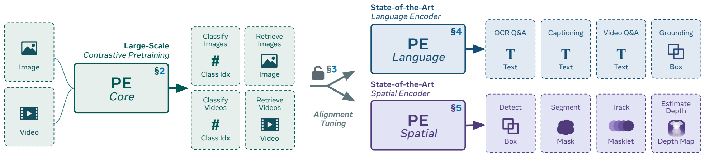

_**图 1 感知编码器** 是一系列大规模视觉编码器模型，在多种视觉任务中实现了最先进的性能。通过使用鲁棒的对比性预训练方案并在合成对齐的视频上进行微调，PE 不仅在分类和检索任务上超越了所有现有模型（§2），而且还在内部产生了强大的、可扩展的通用特征，用于下游任务（§3）。PE 释放了大规模对比性预训练的潜力，使其能够通过对齐微调迁移到下游任务，从而充分利用这些通用特征（§4, §5）。_

对比性编码器拥有特定的层，当将其作为冻结特征使用时，在其本应表现最佳的任务上，其性能能够匹配甚至超过其他两种预训练技术。唯一的问题是——对于不同的任务，这些特征存在于不同的层中。我们通过利用这一现象并进行对齐微调，证明了将这些特征对齐到网络末端是可行的，从而能够为下游 MLLM 和空间任务创建最先进的编码器——所有这些都遵循同一种易于扩展的对比性预训练方法。

我们首先构建了 $\mathrm{PE}_{\mathrm{core}}$（图 1，左侧），这是一个大规模对比性预训练模型，在图像和视频上均具有最先进的零样本性能（$\S 2$）。为此，我们首先专注于开发一种强大的纯图像对比性预训练方案，以从十亿规模的图像-文本数据中提取通用知识。在保持数据和训练算力固定的情况下，该方案在绝对性能和鲁棒性方面均显著优于原始的 CLIP（$\S 2.1$）。然后，我们使用生成的模型作为基于帧的编码器，开发了一个视频数据引擎，用于生成对齐良好的视频描述。在这种合成的视频-文本数据上进行微调，显著提升了图像和视频分类及检索任务的性能（$\S 2.2$）。受此成功的鼓舞，我们发布了用于训练该引擎的大部分数据：PE 视频数据集（PVD），包含 100 万个多样化的视频和 12 万条人工精炼的标注（$\S 2.3$）。最后，我们将鲁棒的图像预训练和良好对齐的视频微调策略扩展到 20 亿参数，生成了 $\mathrm{PE}_{\mathrm{core}}\mathrm{G}$（$\S 2.4$），这是一个统一的编码器，在零样本图像任务上超越了 SigLIP2 [138]，在大多数零样本视频任务上超越了 InternVideo2 [146]。我们进一步通过蒸馏将这种能力迁移到更小规模的模型。

拥有了最强大的图像和视频识别模型后，我们将重心转移到下游任务上。值得注意的是，尽管 $\mathrm{PE}_{\mathrm{core}}\mathrm{G}$ 是使用 CLIP 损失进行预训练的，但我们发现其中间层在语言任务上可以媲美 AIMv2-3B [37]，在空间任务上可以媲美 DINOv2-g [98]，这两者都是各自领域内最强大的预训练模型之一。经调查，我们将这种能力归功于我们的鲁棒图像预训练策略，这似乎释放了对比性预训练的潜力，使其能够有效地扩展应用于下游任务（§3）。然而，一个挑战依然存在：模型并不会自然地输出这些特征，而是将其隐藏在内部。为了解决这个问题，我们引入了两种对齐微调方法（图 1，右侧）来提取这些强大的通用特征。

首先，在 §4 中，我们研究了通过适应大型语言模型将特征对齐到网络末端的最有效技术。这种语言对齐使我们能够构建 $\mathrm{PE}_{\mathrm{lang}}\mathrm{G}$，它在 MLLM 任务中单独表现优于所有其他流行的视觉编码器。此外，当与我们的感知语言模型（PLM）[21] 配对时，该组合可以与最新的最先进 MLLM（如 InternVL3 [168]）相媲美。

其次，在 §5 中，我们发现了适用于空间任务的最佳层中存在二分法。通过可视化特征并找出这种二分法的明确原因，我们开发了一种直接的空间对齐方法：主要通过从模型自身的冻结特征中进行蒸馏来实现大部分对齐，并辅以 SAM 2 [111] 的新颖用途来进行空间对应蒸馏以完善该过程。生成的 $\mathrm{PE}_{\mathrm{spatial}}\mathrm{G}$ 不仅在深度估计、跟踪和语义分割方面优于其他流行模型，而且还在 COCO [76] 检测上凭借更简单的解码器树立了全新的绝对最先进水平。

凭借这一系列模型检查点，感知编码器释放了将一种简单的预训练方法扩展以解决许多下游视觉任务的潜力。我们正在发布我们的模型、代码和 PE 视频数据集。

---

---

# 2 感知编码器：核心

为了构建感知编码器（PE），我们首先训练一个大规模、鲁棒且高性能的视觉-语言对比模型，用于处理图像和视频。我们有两个目标：首先，增强对比训练的可扩展性和数据效率；其次，创建一个对图像和视频都有效的统一模型。

这两个目标在一定程度上是相互冲突的：图像-文本数据丰富，且图像训练效率高；而视频-文本数据稀缺，且视频训练成本高昂。因此，我们将图像和视频训练解耦为两个阶段。我们首先开发了一套强大的图像预训练方案（§2.1），并结合多种正则化技术，以创建一个鲁棒的起始点。然后，我们利用生成的图像模型作为帧编码器，开发了一个视频数据引擎（§2.2），该引擎由我们新颖的人工精炼视频-文本数据集（§2.3）支持，用于为视频片段生成对齐的描述。最后，我们在生成的对齐视频数据上微调图像编码器（§2.4）。利用我们的数据引擎设计，这个简短的微调步骤显著提升了图像和视频的性能。

# 2.1 鲁棒图像预训练

在预训练的第一阶段，我们希望从大量的图像-文本数据中学习尽可能多的视觉信息。值得注意的是，对比训练的一个独特之处在于，给定样本的损失取决于批次中的其他样本。由于每个批次都不同，即使采样之前见过的样本，每次采样都有可能学习到新信息。因此，我们发现对比学习能从长期的训练计划中受益。为了利用这一点，我们在设计预训练方案时重点考虑了高正则化、稳定性和训练效率。

设置。（图 2.1）我们以 OpenCLIP [51] ViT-L/14 模型在 224 分辨率下的设置为基线，在一个原始 CLIP 模型上追踪我们的改动。我们将训练计算量固定在约 1T GFLOPs（即 1 ZFLOP），并在使用 MetaCLIP [152] 纯文本筛选流程整理的固定 23 亿图像-文本数据集上进行训练。对于基线，我们使用 $32\mathrm{K}$ 的全局批次大小、类别标记、AdamW [83] 优化器，并训练 120 亿个样本。为了评估预训练期间所学信息的通用性，我们不仅报告零样本 ImageNet 验证集 [26] 的结果，还报告一系列鲁棒性指标的平均性能，包括 ImageNet 验证集 [26]、ImageNet v2 [112]、ObjectNet [4]、ImageNet 对抗样本 [47]、ImageNet 渲染图 [46] 和 ImageNet 素描 [143]。正如在其他纯 CLIP 模型 [33, 106, 152] 中观察到的那样，这种原始方案的平均鲁棒性指标性能远低于单独的 ImageNet 验证集性能。

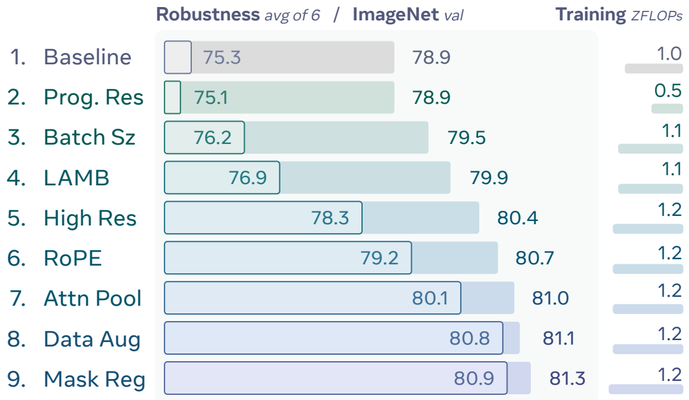

_图 2 鲁棒图像预训练。我们从 OpenCLIP [51] ViT-L/14 模型开始，调整我们的预训练方案（§2.1）以在固定数据集上最大化性能。我们报告了每次修改后的累积零样本分类结果。内部条形图显示鲁棒性评估，计算为 6 个鲁棒性基准 [4, 26, 46, 47, 112, 143] 的平均值，外部条形图显示单独的 ImageNet 验证集 [26] 结果。多项修改显著提高了鲁棒性，表明 ImageNet 验证集性能更多随数据量扩展，而鲁棒性则可随优化的训练技术扩展。_

渐进式分辨率。（图 2.2）为了实现更长时间的训练，我们首先提高了训练效率。正如许多工作 [70, 71, 79, 131, 136] 所示，视觉编码器在分辨率逐渐增加的训练计划下表现良好。因此，我们将基线 120 亿样本的运行均匀分为 98、154 和 224 分辨率阶段，每个阶段 40 亿样本，从而在保持性能的同时将训练 FLOPs 减半。

增加批次大小。（图 2.3）我们利用节省下来的计算预算将批次大小从 $32\mathrm{K}$ 翻倍至 $64\mathrm{K}$，使总样本量从 120 亿增加到 240 亿。更大的批次大小意味着存在非平凡新颖样本对（即困难负样本）的可能性更高。这类似于增加了 CLIP 的“任务难度”，使 ImageNet 验证集准确率提高了 $+0.6\%$，鲁棒性提高了两倍，即 $+1.1\%$。

LAMB 优化器。（图 2.4）我们从 AdamW 切换到 LAMB [156]，后者以稳定大批次训练而闻名。更重要的是，与 AdamW 相比，LAMB 允许我们使用更高的学习率 $2 \times 10^{-3}$ 进行稳定训练

---

---

至原来的 $5 \times 10^{-4}$。我们观察到，以较高的学习率开始对于使模型适应不同的分辨率至关重要。这些因素共同作用，在 ImageNet 验证集上提升了 $+0.4\%$，在鲁棒性上提升了 $+0.7\%$。

**提高最终分辨率。**（图 2.5）一个经典的发现是参数和分辨率应该一起缩放 [36, 131]。因此，我们在训练结束时增加了第四个 336 分辨率阶段。为了保持训练 FLOPs 不变，我们将训练时间表调整为：98 分辨率下 10B 样本，154 下 8B，224 下 4B，336 下 2B。虽然 ImageNet 验证集仅增加了 $+0.5\%$，但鲁棒性提升了三倍，增长了 $+1.4\%$。

**RoPE。**（图 2.6）我们在每个注意力层中添加了 2D RoPE [127] 以提高外推能力，同时保留原始的位置嵌入。2D RoPE 仅将 ImageNet 验证集提升了 $+0.3\%$，但将鲁棒性增强了 $+0.9\%$。

**注意力池化。**（图 2.7）我们遵循 [160] 的方法，使用注意力探测 Transformer 块来构建 CLIP 嵌入。令人惊讶的是，我们发现保留类别 token 作为该块的输入对于小模型的性能很重要。总的来说，这将 ImageNet 验证集提升了 $+0.3\%$，鲁棒性提升了 $+0.9\%$。

**调整数据增强。**（图 2.8）尽管在数十亿个样本上进行训练，我们发现数据增强仍然很重要——特别是对于迁移到不太常见的场景（如 ObjectNet [4]）。我们增加了大量的随机裁剪、亮度/饱和度抖动和水平翻转。随机裁剪鼓励使用整个标题，因为并非所有内容都在画面内。抖动有助于低光照环境和文档。水平翻转改善了自然图像，并且不会损害 OCR（见 §2.5）。这些将鲁棒性提高了 $+0.7\%$，值得注意的是，ObjectNet 提高了 $+2.4\%$。

**掩码正则化。**（图 2.9）作为正则化手段，我们希望模型在某些补丁不可见时也能产生相同的特征。然而，通过掩码图像传递 CLIP 梯度可能会对未掩码图像上的行为产生负面影响。因此，我们通过复制并掩码 1/16 的批次，将 MaskFeat [147] 转化为正则化损失。在输出端，通过最大化余弦相似度，将掩码 token 与其未掩码的对应部分对齐。我们特别注意确保 CLIP 梯度和掩码梯度是互不重叠的。

**缩放行为。**（图 3 和图 4）在图 3 中，我们展示了我们的方案（图 2.9）与原始 CLIP 方案（图 2.1）在 S/14、B/14 和 L/14 模型上的性能对比。对于每个基准，我们的方案的缩放率与原始 CLIP 方案大致相同或更好。在一些困难的数据集上，如 ObjectNet [4] 和 ImageNet 对抗 [47]，我们的方案显示出明显更好的缩放效果。这表明性能的提升并非以牺牲可扩展性为代价，这意味着我们可以通过扩大模型尺寸进一步受益。

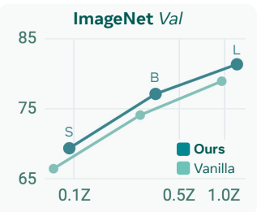

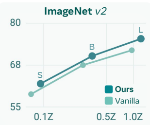

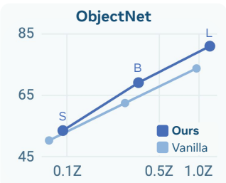

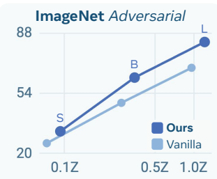

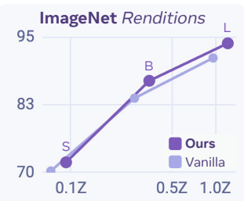

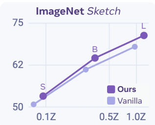

_图 3 缩放行为（模型尺寸）。S/14、B/14 和 L/14 模型在我们方案更改前后的结果（图 2）。我们的方案改善了 ObjectNet [4] 和 ImageNet 对抗 [47] 等困难指标的缩放效果。_

在图 4 中，我们还展示了我们的方案与原始 CLIP 方案在 L/14 模型上的性能对比，这些模型分别训练了 120K 步（三分之一时间表）、240K 步（三分之二时间表）和 360K 步（完整消融时间表）。所有模型都是独立的训练运行，具有完整的学习率退火和按比例调整的渐进式分辨率时间表。我们看到我们的方案在大多数数据集上呈现出近乎线性的趋势。这表明我们可以通过延长训练时间来获得更高的性能，即使在 L 规模下且已经看到了 24B 样本也是如此。

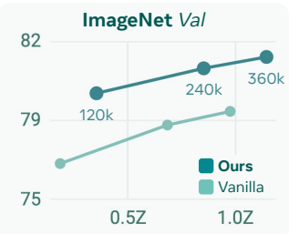

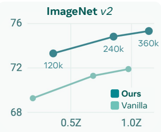

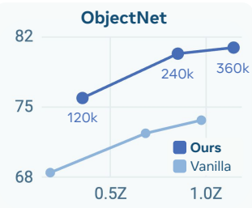

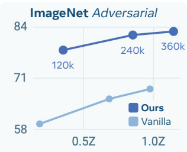

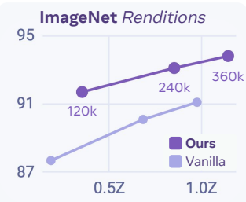

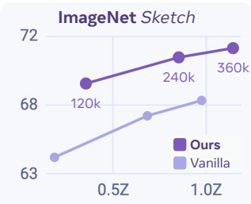

_图 4 缩放行为（训练步数）。L/14 模型在 120K、240K 和 360K 步训练下，我们方案更改前后的结果，并相应调整了学习率和渐进式分辨率时间表。尽管我们的方案比原始方案强大得多，但通过延长训练仍有进一步提升的空间。_

---

---

# 2.2 利用感知编码器构建视频数据引擎

在确定了稳健的图像预训练方案并确认了其扩展行为后，我们的下一步是扩展仅图像编码器以适应视频，并构建一个统一的图像-视频模型。与在许多情况下附带人工生成的描述性替代文本信息的网络级图像-文本数据不同，具有对齐语言标注的视频本质上就很稀缺。高质量的人工标注视频字幕更为罕见。这种稀缺性给训练能够有效处理视频输入的编码器带来了独特且重大的挑战。

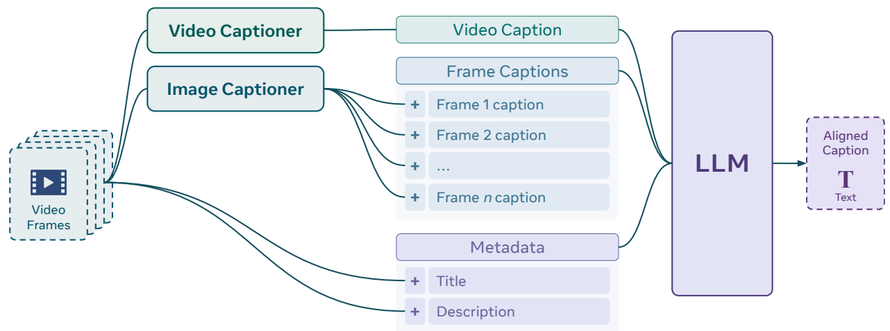

_图 5 视频数据引擎。为了创建用于对比训练的对齐视频-文本数据，我们使用基于感知的视频字幕生成器 [21] 生成整体视频字幕，并对采样帧使用图像级字幕生成器 [82]。然后，我们将这些字幕以及原始视频元数据提供给仅文本 LLM [82]，以合成单个简短、对齐的字幕，该字幕最适合对比训练。_

受图像数据引擎 [58, 64, 96, 111, 151] 近期成功的启发，我们将这一概念扩展为开发一个强大的视频数据引擎，为多样化的视频集生成良好对齐的合成字幕，从而促进视频编码器的训练。这种创新方法代表了同类方法的首次大规模探索。在接下来的章节中，我们将介绍构建视频数据引擎的过程。

为了引导我们的对比视频微调，我们专注于合成视频字幕。我们分三个阶段构建数据引擎：(1) 我们创建了一个强大的基线视频字幕生成器，我们称之为感知语言模型（PLM），详见 [21]；(2) 我们添加了带有人工优化字幕的额外高质量视频数据，以进一步提高字幕生成器的质量；(3) 我们使用 LLM 优化和总结生成的视频字幕，以构建大型视频数据集，用于我们感知编码器的对比视频微调。

阶段 1：基础视频字幕生成器（PLM）。我们基于 PLM [21] 的早期版本构建数据引擎，PLM 是一个多模态大语言模型，以 PE 作为视觉编码器，以 Llama [82] 作为语言解码器。我们在大规模开放获取的图像和视频数据集 [21] 上训练 PLM。训练数据集总共包含 6470 万张图像和视频，涵盖自然图像、图表、文档、外视角和第一视角视频。

阶段 2：PLM + 优化数据。为了进一步提高字幕生成性能，我们收集了一组 26.5 万个视频（其中 10.5 万个来自我们发布的 PVD，参见 §2.3），使用我们的基础 PLM 模型为其生成字幕，并要求人工评估人员优化这些字幕1。然后，我们使用这些数据对基础 PLM 模型进行微调，显著提高了字幕生成质量（见表 1）。

<table><tr><td rowspan="2">字幕生成器</td><td colspan="2">AuroraCap [13]</td><td colspan="2">VCG Diverse [87]</td><td rowspan="2">VCG Bench [86] 得分</td></tr><tr><td>得分</td><td>准确率</td><td>得分</td><td>准确率</td></tr><tr><td>PLM</td><td>2.2</td><td>51.9</td><td>3.1</td><td>65.1</td><td>34.3</td></tr><tr><td>PLM + 人工优化数据</td><td>3.4</td><td>71.1</td><td>3.6</td><td>79.4</td><td>35.2</td></tr></table>

_表 1 视频字幕生成。我们使用 PLM-8B [21] 的早期版本进行字幕生成，它由我们的仅图像 PE 编码器和 Llama 解码器组成。添加人工优化数据极大地提高了字幕生成性能（分数越高越好）。_

阶段 3：LLM 摘要。我们通过结合 PLM 视频字幕、Llama 3.2 [82] 的仅图像帧字幕以及现有的视频标题和描述等视频元数据（图 5），来合成最终的对齐视频字幕。与图像替代文本类似，视频元数据包含图像和视频字幕生成模型通常未涵盖的知识。因此，将两者结合可以得到更全面的字幕。我们使用 Llama 3.3 70B 模型将视频字幕、帧字幕和视频元数据一起进行总结，以提供最终字幕。用于生成摘要的提示词可在附录 A.1 中找到。

使用该引擎。最后，我们使用由此产生的数据引擎（利用 PE 的仅图像检查点引导）为多样化的 2200 万个视频生成良好对齐、信息密集的字幕，用于对比微调。

使用重新描述的视频进行训练。我们的目标是开发一个统一的图像和视频编码器。为了使用我们现有的图像编码器对视频进行编码，我们从视频片段中均匀采样 $ N = 8 $ 帧并提取帧级

1指示标注人员删除、纠正并添加字幕中的信息。

---

---

...（图像编码器）的嵌入。然后，我们对这些帧嵌入应用平均池化以获得视频嵌入，这些嵌入用于与文本编码器编码的视频字幕进行对比学习。尽管非常简单，但我们发现这种技术在产生强大的联合图像-视频编码器方面出奇地有效。我们与之前的研究 [19, 84] 分享这一发现，这些研究指出，简单的平均池化优于更复杂的池化策略，例如基于注意力的视频压缩。

消融实验。在表 2 中，我们通过在由我们的视频数据引擎重新描述的 2200 万视频中的 1700 万视频上微调一个仅包含图像的中间检查点，对视频数据引擎的组件进行了消融研究。结果表明，与仅包含图像的基线编码器（第一行）相比，视频数据引擎显著增强了图像和视频基准的零样本分类和检索性能。值得注意的是，使用视频数据引擎的视频级和帧级字幕比仅依赖视频标题和描述等元数据（第二行）提供了显著的改进，这凸显了构建强大的视频数据引擎以弥补网络视频中的噪声的重要性。

<table><tr><td rowspan="2">标题</td><td rowspan="2">描述</td><td rowspan="2">视频字幕</td><td rowspan="2">帧字幕</td><td rowspan="2">平均图像</td><td colspan="6">图像零样本</td><td colspan="6">视频零样本</td></tr><tr><td>ImageNet val [26]</td><td>ImageNet v2 [112]</td><td>ObjectNet In Classes [4]</td><td>MS-COCO txt→img [76]</td><td>MS-COCO img→txt [76]</td><td>平均视频</td><td>Kinetics 400 [55]</td><td>Kinetics 600 [55]</td><td>MSR-VTT txt→vid [153]</td><td>MSR-VTT vid→txt [153]</td><td></td><td></td></tr><tr><td></td><td></td><td></td><td></td><td>72.6</td><td>83.3</td><td>77.8</td><td>85.8</td><td>49.4</td><td>66.8</td><td>50.9</td><td>69.7</td><td>68.4</td><td>38.0</td><td>27.3</td><td></td><td></td></tr><tr><td>✓</td><td>✓</td><td></td><td></td><td>75.4</td><td>83.2</td><td>78.2</td><td>87.1</td><td>47.3</td><td>66.0</td><td>56.0</td><td>74.1</td><td>73.5</td><td>39.0</td><td>37.3</td><td></td><td></td></tr><tr><td>✓</td><td>✓</td><td>✓</td><td></td><td>78.2</td><td>83.5</td><td>78.4</td><td>86.8</td><td>56.0</td><td>74.3</td><td>60.9</td><td>73.8</td><td>73.4</td><td>47.6</td><td>48.8</td><td></td><td></td></tr><tr><td>✓</td><td>✓</td><td>✓*</td><td>✓</td><td>78.1</td><td>83.7</td><td>79.0</td><td>87.7</td><td>54.1</td><td>73.0</td><td>60.9</td><td>75.4</td><td>75.1</td><td>46.7</td><td>46.5</td><td></td><td></td></tr><tr><td>✓</td><td>✓</td><td>✓</td><td>✓</td><td>78.2</td><td>83.7</td><td>79.0</td><td>87.5</td><td>54.6</td><td>73.2</td><td>61.6</td><td>75.8</td><td>75.5</td><td>47.4</td><td>48.1</td><td></td><td></td></tr></table>

表 2 视频数据引擎消融实验。我们通过在仅包含图像的 PE 开发版本上进行微调来消融图 5 中的视频数据引擎，方法是平均帧嵌入以创建单个视频 CLIP 嵌入。视频字幕由使用或未使用 * 人工优化数据训练的 PLM 生成（参见 §2.3）。帧字幕由 Llama 3.2 视觉模型生成。每个组件都有助于不同的指标，最终总体上极大地提升了图像和视频的零样本性能。

我们的分析表明，最关键的组件是视频元数据和 PLM 的视频字幕；然而，所有组件对于在我们的视频数据引擎中实现峰值性能都是必要的。

在图 6 中，我们调查了在如图 2 所示的相同仅包含图像的模型的后续检查点上，扩展重新描述的视频数据的影响。值得注意的是，扩展合成视频数据在图像和视频基准上都显示出一致的改进。此扩展实验的完整结果可以在附录 19 中找到。

在上一行中，扩展合成视频数据持续改善图像基准上的性能，在 ObjectNet 上有 $+1.1\%$ 的单调改进，在 ImageNet 对抗样本上有 $+1.6\%$ 的改进。ImageNet val 和 ImageNet v2 的增益较小，精度提高了 $0.3\%$ 到 $0.5\%$，在约 $7\mathrm{M}$ 个样本时趋于平稳。我们还观察到零样本检索（此处为 COCO [76]）的显著提升，top-1 召回率提升了 $+3.8\%$ 到 $+4.1\%$。

下一行列出的视频任务展示了一致的情况。我们观察到在所有视频分类任务中，从 0 到 300 万视频的性能都有显著跳跃，这表明仅包含图像的模型存在领域差距，阻碍了它们在视频任务上直接表现出色。进一步扩展合成视频数据会在视频分类和检索中带来巨大的性能提升。视频分类精度持续提高 $+5.6\%$ 到 $+11.7\%$ 且没有趋于平稳，而视频检索显示出 $+7.7$ 到 $+15.3$ top-1 召回率的显著改进。

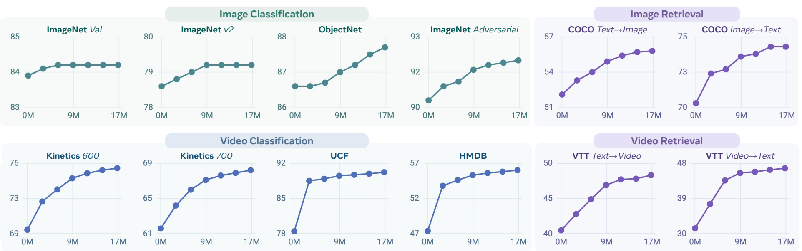

_图 6 视频数据扩展。在由 PE 视频数据引擎重新描述的视频上进行微调，从 0M（基线仅图像模型）到 17M 个样本，持续改善图像和视频性能，包括分类和检索。_

---

_类别：食物制作_

_模型生成字幕：“视频展示了一个正在制作蛋糕的人。可以看到这个人在碗里混合配料，将混合物倒入平底锅中，并加入巧克力豆。视频还展示了这个人使用打蛋器和刮刀混合配料并将混合物倒入锅中。这个人穿着蓝色衬衫，手里拿着一个玻璃碗和一个勺子。视频背景是白色大理石台面，台面上有一条条纹毛巾。”_

_人工优化字幕：“视频展示了一个正在制作巧克力蛋糕的人。这个人在玻璃碗中混合配料，然后将混合物倒入烤盘中。接着，这个人在顶部撒上巧克力豆。视频还展示了这个人使用电动打蛋器混合配料，并用刮刀将混合物刮入锅中。这个人穿着蓝色衬衫，手里拿着一个玻璃碗。视频背景是白色大理石台面，台面上有一条条纹毛巾。”_

_图 7 PE 视频数据集示例。来自我们发布的视频-文本数据集 PVD 的一个样本。初始字幕由我们的视频字幕生成模型生成，然后由人工标注员进行优化。标注员被要求添加细节并消除模型的幻觉。在此示例中，模型的幻觉“勺子”被移除了；同时添加了更多细节，如“玻璃碗”和“刮”这一动作。更多示例请参见附录图 18。_

这些实验突显了我们视频数据引擎的高质量，以及其显著提升编码器性能的能力，即使相比于预训练期间使用的数十亿图像，仅使用了相对适度的 1700 万个视频。我们的视频数据引擎是构建强大、统一的图像-视频编码器的重要组成部分。

# 2.3 PE 视频数据集 (PVD)

为了惠及社区，我们发布了一个新的视频数据集：PE 视频数据集 (PVD)。2 PVD 包含 100 万个高质量且多样化的视频，并附有相应的标签和描述。这些视频以运动为中心，涵盖了第一人称和第三人称视角，场景覆盖范围广泛。

我们另外从中挑选了 12 万个运动程度最高的视频，通过使用我们的视频字幕生成器（§2.2）生成合成字幕，并雇佣 200 名标注员进行验证和优化，从而为其标注详细字幕。我们要求人工标注员通过消除任何幻觉内容、修正不准确描述视频的词汇、删除重复或冗余词汇以使字幕更简洁，以及补充视频中缺失的动作行为来改进合成字幕。

我们为这 12 万个 PVD 子集发布了两个版本的标注：(1) 人工验证字幕：平均长度为 57.1 个单词的扩展摘要，提供每个视频的高级描述。这些字幕适用于 CLIP 风格的训练。(2) 长自动生成字幕：平均长度为 111.7 个单词的详细且细粒度的描述，捕捉空间和时间事件。这些字幕非常适合细粒度的视频理解。

<table><tr><td>视频数量</td><td>998,862</td></tr><tr><td>人工字幕数量</td><td>118,862</td></tr><tr><td>总时长</td><td>4625 小时</td></tr><tr><td>时长 (秒)</td><td>16.7±9.8</td></tr><tr><td>人工字幕长度</td><td>57.1±25.4</td></tr><tr><td>模型字幕长度</td><td>111.7±43.2</td></tr></table>

_表 3 PVD 统计数据。_

在图 7 中，我们展示了一个来自 PE 视频数据集的视频示例及其对应的模型字幕和人工字幕（更多示例见图 18）。数据集统计数据总结在表 3 中。最后，我们使用其中的 $105\mathrm{K}$ 个优化样本来改进数据引擎（$\S 2.2$ 阶段 2），并将 $15\mathrm{K}$ 个样本作为高质量视频检索基准。

PVD 基准。我们使用 1.5 万个人工优化的视频-字幕对作为保留测试集，并将其作为一个新的视频检索基准 PVD Benchmark 引入，用于评估细粒度的视频-字幕对齐。我们遵循 MSR-VTT [153] 的格式来构建该基准。我们从 10 个不同的类别中选择了视频，包括手部动作、物体交互、食物制作、工作活动、户外场景、动物、水景、物体操作、特写镜头和自然场景，整体平均字幕长度为 51.7 个单词（统计数据参见附录 A.2.3）。我们使用 PVD Benchmark 评估了 SigLIP [160]、SigLIP2 [138]、InternVL [19] 和 PE 模型，结果可以在表 7 中找到。

$^{2}$PVD 可在 https://ai.meta.com/datasets/pe-video/ 获取

---

---

# 2.4 图像与视频的统一编码器

利用稳健、可扩展的图像预训练方案以及由所提出的视频数据引擎重新描述的视频预训练数据，本节我们将介绍 $\mathsf{PE}_{\mathrm{core}}$，一个统一的图像和视频编码器。

**模型架构。** 为了充分利用 §2.1 中观察到的令人振奋的扩展特性，我们将最大的 $\mathrm{PE}_{\mathrm{core}}$ 模型扩展至 20 亿（2B）参数3（G 规模）。表 4 展示了视觉和文本 Transformer 的详细模型配置以及输出 Clip 嵌入空间的维度。

<table><tr><td>规模</td><td>塔</td><td>参数量</td><td>宽度</td><td>深度</td><td>MLP</td><td>头数</td><td>CLIP 维度</td></tr><tr><td rowspan="2">B</td><td>视觉</td><td>0.09B</td><td>768</td><td>12</td><td>3072</td><td>12</td><td rowspan="2">1024</td></tr><tr><td>文本</td><td>0.31B</td><td>1024</td><td>24</td><td>4096</td><td>16</td></tr><tr><tr rowspan="2">L</td><td>视觉</td><td>0.32B</td><td>1024</td><td>24</td><td>4096</td><td>16</td><td rowspan="2">1024</td></tr><tr><td>文本</td><td>0.31B</td><td>1024</td><td>24</td><td>4096</td><td>16</td></tr><tr><tr rowspan="2">G</td><td>视觉</td><td>1.88B</td><td>1536</td><td>50</td><td>8960</td><td>16</td><td rowspan="2">1280</td></tr><tr><td>文本</td><td>0.47B</td><td>1280</td><td>24</td><td>5120</td><td>20</td></tr></table>

_表 4 PE 模型配置。_

**小模型蒸馏。** 为了最大化较小模型（表 4 中的 B 和 L 规模）的性能，我们采用了一种蒸馏微调方法 [49]，使用 $\mathrm{PE}_{\mathrm{core}}\mathrm{G}$ 作为教师模型。该过程包含一个简短的微调阶段，其中学生模型和教师模型分别对图像和文本输入进行编码，以计算图像到文本以及文本到图像的相似度分布，这与 CLIP 的训练过程类似 [106]。随后，通过最小化 KL 散度，优化学生模型的分布以匹配教师模型的分布，从而将教师模型中的多模态关系知识蒸馏到学生模型中。

值得注意的是，我们发现为教师模型的分布使用较小的 Softmax 温度（具体为学生模型所用温度的 $0.5 \times$）能显著提升知识蒸馏的有效性。通过利用 $\mathrm{PE}_{\mathrm{core}} \mathrm{G}$ 提供的强大嵌入，我们简短的蒸馏微调阶段显著提升了 $\mathrm{PE}_{\mathrm{core}}$ 的 B 和 L 规模模型的性能（见附录 C.3）。

**模型训练。** $\mathrm{PE}_{\mathrm{core}}$ 的训练过程包含三个阶段：

1. **图像预训练。** 我们将图像预训练扩展至 54 亿（5.4B）张由 MetaCLIP [152] 策选的公开可用图像 Alt-Text 对，并总共观测 860 亿（86B）个样本以确保收敛（B 和 L 规模为 58B）。我们使用 131K 的全局批量大小，分辨率根据模型从 98 逐步增加到最高 448。

2. **图像和视频微调。** 在初始预训练之后，我们随后以最大分辨率对模型进行短周期的微调，在图像预训练数据上进行 5000 万（50M）样本的训练（作为冷却），随后在重新描述的视频上进行 2200 万（22M）样本的训练，并使用较小的学习率和批量大小。视频字幕由所提出的视频数据引擎生成（§2.2）。对于每个视频片段，我们均匀采样 8 帧，对其进行编码并取平均值以生成单一的视频嵌入，然后使用与图像训练中相同的对比目标将其与相应的视频字幕对齐。

3. **小模型蒸馏。** 我们在 B 和 L 规模模型的最终分辨率下，将 2B 模型（G 规模）蒸馏到较小的对比预训练模型中，使用覆盖约 40 亿（4B）个观测样本（约为预训练周期的 $\sim 8\%$）的短周期，并采用较低的学习率且不使用权重衰减。

详细的训练配置和设置列在附录 B.1.1 中。

# 2.5 核心结果

**零样本图像结果。** 在表 5 中，我们展示了 $\mathrm{PE}_{\mathrm{core}}$ 在分类和检索的零样本图像基准测试中的表现，并与现有的最强模型进行了对比，包括 SigLIP2 [138] 和使用 JFT-3B [29] 的专有模型（后者可能针对 ImageNet 进行了调优）。$\mathrm{PE}_{\mathrm{core}}$ 在所有零样本任务上全面优于所有其他对比模型，包括竞争非常激烈的零样本 ImageNet 鲁棒性指标平均值 [4, 26, 46, 47, 112, 143]。这是一个重要的里程碑，因为我们是三年来首个在不使用谷歌内部 JFT-3B [29] 或 WebLI [17] 数据集的情况下实现这一成就的团队。同时，$\mathrm{PE}_{\mathrm{core}}$ 在图像-文本检索上也超越了现有的最先进水平（SOTA），并显著改进了细粒度分类——这是首个同时在所有常见零样本类别中保持最先进水平的模型。

通过利用我们视频数据引擎的强大功能，仅使用相对较小的 2200 万（22M）个视频及其对应的合成字幕数据集进行训练，就能在图像基准测试中带来显著收益，平均通用图像分类性能提升了 $+0.6\%$，并在更困难的基准测试上表现更为突出（显著提升了 $+1.2\%$）。

3 我们采用了 §2.1 中描述的设置，但增加了额外的类别 Token（仅用于 L 和 B）。有趣的是，我们发现使用相同的高学习率 $ (2 \times 10^{-3}) $ 对 G 规模模型效果良好。我们也未发现扩展文本编码器能带来益处。

---

---

<table><tr><td rowspan="2">模型</td><td rowspan="2" colspan="2">编码器参数</td><td rowspan="2">分辨率</td><td rowspan="2">数据量</td><td colspan="8">零样本分类</td><td colspan="11">零样本细粒度分类</td><td colspan="5">零样本检索</td></tr><tr><td>平均分类</td><td>ImageNet val [26]</td><td>ImageNet v2 [112]</td><td>ObjectNet In Classes [4]</td><td>ImageNet Adversarial [47]</td><td>ImageNet Renditions [46]</td><td>ImageNet Sketch [143]</td><td>平均细粒度</td><td>Food 101 [9]</td><td>Flowers Oxford [97]</td><td>Pets Oxford [100]</td><td>Cars Stanford [59]</td><td>Aircrafts FGCV [88]</td><td>Countries 211 [133]</td><td>Scenes SUN397 [150]</td><td>Satellite RESVC [20]</td><td>平均检索 MS-COCO tx→img [76]</td><td>MS-COCO img→tx [76]</td><td>Flickr-30k tx→img [157]</td><td>Flickr-30k img→tx [157]</td><td></td><td></td><td></td><td></td></tr><tr><td colspan="27">专有模型</td><td></td><td></td></tr><tr><td>BASIC [102]</td><td>2.4B</td><td>224</td><td>6.6B</td><td>84.3</td><td>85.7</td><td>80.6</td><td>82.3</td><td>85.6</td><td>95.7</td><td>76.1</td><td>-</td><td>95.1</td><td>91.2</td><td>97.9</td><td>-</td><td>-</td><td>-</td><td>76.2</td><td>72.7</td><td>-</td><td>-</td><td>-</td><td>-</td><td>-</td><td>-</td><td>-</td><td></td><td></td></tr><tr><td>CoCa [158]</td><td>1.0B</td><td>576</td><td>4.8B</td><td>85.7</td><td>86.3</td><td>80.7</td><td>82.7</td><td>90.2</td><td>96.5</td><td>77.6</td><td>-</td><td>-</td><td>-</td><td>-</td><td>-</td><td>-</td><td>-</td><td>-</td><td>-</td><td>72.6</td><td>51.2</td><td>66.3</td><td>80.4</td><td>92.5</td><td></td><td></td><td></td><td></td></tr><tr><td>LiT-22B [24]</td><td>21.7B</td><td>224</td><td>15B</td><td>-</td><td>85.9</td><td>80.9</td><td>87.6</td><td>90.1</td><td>96.0</td><td>-</td><td>-</td><td>-</td><td>-</td><td>-</td><td>-</td><td>-</td><td>-</td><td>-</td><td>-</td><td>-</td><td>-</td><td>-</td><td>-</td><td>-</td><td></td><td></td><td></td><td></td></tr><tr><td colspan="26">B 规模</td><td></td><td></td><td></td></tr><tr><td>SigLIP-B/16†[160]</td><td>0.1B</td><td>224</td><td>10B</td><td>69.9</td><td>76.2</td><td>69.5</td><td>70.7</td><td>45.1</td><td>90.2</td><td>67.9</td><td>69.5</td><td>91.6</td><td>85.2</td><td>94.2</td><td>90.8</td><td>44.0</td><td>15.9</td><td>70.0</td><td>64.6</td><td>69.8</td><td>47.2</td><td>64.5</td><td>77.9</td><td>89.6</td><td></td><td></td><td></td><td></td></tr><tr><td>SigLIP2-B/16†[138]</td><td>0.1B</td><td>224</td><td>10B</td><td>73.1</td><td>78.2</td><td>71.4</td><td>73.6</td><td>55.0</td><td>91.7</td><td>68.9</td><td>73.1</td><td>92.8</td><td>85.7</td><td>95.4</td><td>93.4</td><td>54.8</td><td>19.2</td><td>72.7</td><td>71.1</td><td>73.7</td><td>52.1</td><td>68.9</td><td>80.7</td><td>93.0</td><td></td><td></td><td></td><td></td></tr><tr><td>PEcoreB</td><td>0.1B</td><td>224</td><td>5.4B</td><td>73.2</td><td>78.4</td><td>71.7</td><td>71.9</td><td>62.4</td><td>88.7</td><td>66.1</td><td>75.0</td><td>92.5</td><td>86.5</td><td>94.6</td><td>92.1</td><td>57.0</td><td>30.5</td><td>74.0</td><td>72.7</td><td>74.3</td><td>50.9</td><td>71.0</td><td>80.8</td><td>94.4</td><td></td><td></td><td></td><td></td></tr><tr><td colspan="26">L 规模</td><td></td><td></td><td></td></tr><tr><td>SigLIP-L/16†[160]</td><td>0.3B</td><td>384</td><td>10B</td><td>80.7</td><td>82.1</td><td>75.9</td><td>80.9</td><td>76.5</td><td>95.0</td><td>73.6</td><td>74.4</td><td>95.6</td><td>89.4</td><td>96.8</td><td>94.8</td><td>53.2</td><td>24.7</td><td>72.5</td><td>67.9</td><td>74.7</td><td>52.8</td><td>70.5</td><td>82.6</td><td>92.9</td><td></td><td></td><td></td><td></td></tr><tr><td>SigLIP2-L/16†[138]</td><td>0.3B</td><td>384</td><td>10B</td><td>83.3</td><td>83.1</td><td>77.4</td><td>84.4</td><td>84.3</td><td>95.7</td><td>75.5</td><td>78.4</td><td>96.1</td><td>90.0</td><td>96.4</td><td>95.8</td><td>67.0</td><td>31.6</td><td>74.8</td><td>75.5</td><td>76.7</td><td>55.3</td><td>71.4</td><td>85.0</td><td>95.2</td><td></td><td></td><td></td><td></td></tr><tr><td>PEcoreL</td><td>0.3B</td><td>336</td><td>5.4B</td><td>83.9</td><td>83.5</td><td>77.9</td><td>84.7</td><td>89.0</td><td>95.2</td><td>73.4</td><td>80.0</td><td>96.2</td><td>87.2</td><td>96.4</td><td>93.7</td><td>67.8</td><td>45.6</td><td>77.4</td><td>75.7</td><td>78.8</td><td>57.1</td><td>75.9</td><td>85.5</td><td>96.6</td><td></td><td></td><td></td><td></td></tr><tr><td colspan="26">无界规模</td><td></td><td></td><td></td></tr><tr><td>DFN-H+†[33]</td><td>0.6B</td><td>378</td><td>5B</td><td>81.6</td><td>84.3</td><td>78.3</td><td>79.6</td><td>79.6</td><td>93.6</td><td>73.3</td><td>80.5</td><td>96.2</td><td>91.6</td><td>96.8</td><td>96.0</td><td>72.5</td><td>37.9</td><td>77.4</td><td>75.9</td><td>75.8</td><td>55.6</td><td>71.8</td><td>82.1</td><td>93.6</td><td></td><td></td><td></td><td></td></tr><tr><td>InternVL-C [19]</td><td>5.5B</td><td>224</td><td>5B</td><td>82.5</td><td>83.2</td><td>77.3</td><td>80.6</td><td>83.8</td><td>95.7</td><td>74.3</td><td>76.4</td><td>95.3</td><td>85.8</td><td>96.3</td><td>94.4</td><td>53.3</td><td>35.1</td><td>76.3</td><td>74.4</td><td>78.6</td><td>58.6</td><td>74.9</td><td>85.0</td><td>95.7</td><td></td><td></td><td></td><td></td></tr><tr><td>EVA 18B [130]</td><td>17.5B</td><td>224</td><td>2B</td><td>83.6</td><td>83.8</td><td>77.9</td><td>82.2</td><td>87.3</td><td>95.7</td><td>74.7</td><td>78.8</td><td>95.8</td><td>86.0</td><td>96.1</td><td>94.9</td><td>59.7</td><td>43.1</td><td>77.7</td><td>76.9</td><td>77.5</td><td>56.2</td><td>73.6</td><td>83.3</td><td>96.7</td><td></td><td></td><td></td><td></td></tr><tr><td>EVA 18B+ [130]</td><td>17.5B</td><td>336</td><td>2B</td><td>84.1</td><td>83.9</td><td>78.2</td><td>83.6</td><td>88.9</td><td>95.6</td><td>74.3</td><td>-</td><td>-</td><td>-</td><td>-</td><td>-</td><td>-</td><td>-</td><td>-</td><td>-</td><td>-</td><td>-</td><td>-</td><td>-</td><td>-</td><td></td><td></td><td></td><td></td></tr><tr><td>SigLIP2-g-opt†[138]</td><td>1.1B</td><td>384</td><td>10B</td><td>86.2</td><td>85.0</td><td>79.8</td><td>88.0</td><td>90.5</td><td>96.6</td><td>77.4</td><td>81.0</td><td>97.0</td><td>91.5</td><td>97.8</td><td>95.9</td><td>73.6</td><td>40.1</td><td>76.3</td><td>75.9</td><td>78.0</td><td>56.1</td><td>72.8</td><td>86.0</td><td>95.4</td><td></td><td></td><td></td><td></td></tr><tr><td>PEcoreG (image only)</td><td>1.9B</td><td>448</td><td>5.4B</td><td>86.0</td><td>85.2</td><td>80.2</td><td>87.1</td><td>91.2</td><td>96.1</td><td>76.1</td><td>82.7</td><td>96.6</td><td>91.0</td><td>96.4</td><td>94.6</td><td>76.7</td><td>57.3</td><td>77.5</td><td>71.8</td><td>74.9</td><td>53.1</td><td>70.9</td><td>81.6</td><td>93.9</td><td></td><td></td><td></td><td></td></tr><tr><td>PEcoreG</td><td>1.9B</td><td>448</td><td>5.4B</td><td>86.6</td><td>85.4</td><td>80.2</td><td>88.2</td><td>92.6</td><td>96.5</td><td>76.5</td><td>83.7</td><td>96.9</td><td>91.4</td><td>96.9</td><td>94.7</td><td>78.2</td><td>57.6</td><td>78.5</td><td>75.8</td><td>78.9</td><td>58.1</td><td>75.4</td><td>85.7</td><td>96.2</td><td></td><td></td><td></td><td></td></tr></table>

_表 5 零样本图像结果。与专有模型和开源模型的最先进水平相比，$\mathrm{PE}_{\mathrm{core}}$ 的图像零样本性能。$\mathrm{PE}_{\mathrm{core}}\mathrm{G}$ 是第一个在通用分类任务中超越在专有数据集 JFT-3B [29] 和 WebLI [17] 上训练的最佳模型的视觉编码器。此外，在所有模型规模下，$\mathrm{PE}_{\mathrm{core}}$ 在通用分类、检索和细粒度分类方面均取得了最先进的结果。$\dagger$重新评估：DFN 由 [130] 评估；如果 [138] 中未报告，SigLIP 和 SigLIP2 由我们在相同的基准设置下评估（见附录 B.1.2）。_

ObjectNet 提升 $+1.4\%$，ImageNet Adversarial 提升 $+1.4\%$），细粒度分类平均提升 $+1.0\%$。此外，由于我们的合成字幕具有高度细节和良好的对齐性，零样本检索平均显著提升了 $+3.6\%$。这些结果强调，使用对齐良好的视频文本数据进行训练不仅能提高视频性能——还能为视频和图像创建一个严格更好的模型。

零样本视频结果。我们通过使用相同的模型作为基于帧的视频编码器（利用 8 个均匀采样的帧，如 §2.2 所述），评估了 $\mathrm{PE}_{\mathrm{core}}$ 在零样本视频基准上的性能。

我们在表 6 中展示了相应的视频结果。我们的基础图像编码器在零样本分类和检索方面已经优于所有其他仅图像编码器，包括 SigLIP2-g-opt。经过视频微调后，$\mathrm{PE}_{\mathrm{core}}\mathrm{G}$ 在视频分类方面显著优于甚至使用完整时间注意力的原生视频模型，并且在使用简单的帧级编码器的情况下，几乎匹配了视频检索的最先进水平。

<table><tr><td rowspan="2">模型</td><td rowspan="2" colspan="2">编码器参数</td><td rowspan="2">分辨率</td><td rowspan="2"># 帧数</td><td rowspan="2">视频数据量</td><td colspan="8">零样本分类</td><td colspan="7">零样本检索</td></tr><tr><td>平均分类</td><td>Kinetics 400 [55]</td><td>Kinetics 600 [55]</td><td>Kinetics 700 [55]</td><td>UCF 101 [126]</td><td>HMDB 51 [62]</td><td>平均检索</td><td>MSR-VTT txt→video [76]</td><td>MSR-VTT video→txt [76]</td><td>MSVD txt→video [157]</td><td>MSVD video→txt [157]</td><td>ActivityNet txt→video [157]</td><td>ActivityNet video→txt [157]</td><td></td><td></td></tr><tr><td colspan="20">B 规模</td><td></td></tr><tr><td>CLIP [106]</td><td>0.1B</td><td>224</td><td>8</td><td>n/a</td><td>54.3</td><td>58.4</td><td>55.1</td><td>46.1</td><td>68.9</td><td>43.2</td><td>29.2</td><td>30.4</td><td>24.2</td><td>40.5</td><td>57.2</td><td>9.1</td><td>13.2</td><td></td><td></td><td></td></tr><tr><td>CLIP4CLIP [84]</td><td>0.1B</td><td>224</td><td>12</td><td>n/a</td><td>-</td><td>-</td><td>-</td><td>-</td><td>-</td><td>-</td><td>-</td><td>32.0</td><td>-</td><td>38.5</td><td>-</td><td>-</td><td>-</td><td></td><td></td><td></td></tr><tr><td>SigLIP2-B/16†[138]</td><td>0.1B</td><td>224</td><td>8</td><td>n/a</td><td>57.3</td><td>58.7</td><td>55.0</td><td>48.4</td><td>82.0</td><td>42.3</td><td>39.9</td><td>38.5</td><td>30.1</td><td>49.0</td><td>67.2</td><td>28.6</td><td>25.8</td><td></td><td></td><td></td></tr><tr><td>PEcoreB</td><td>0.1B</td><td>224</td><td>8</td><td>22M</td><td>63.9</td><td>65.6</td><td>65.1</td><td>55.8</td><td>84.6</td><td>48.2</td><td>49.9</td><td>47.6</td><td>47.3</td><td>50.4</td><td>76.7</td><td>39.0</td><td>38.4</td><td></td><td></td><td></td></tr><tr><td colspan="20">L 规模</td><td></td></tr><tr><td>UMT-L [67]</td><td>0.3B</td><td>224</td><td>8</td><td>25M</td><td>-</td><td>-</td><td>-</td><td>-</td><td>-</td><td>-</td><td>47.1</td><td>40.7</td><td>37.1</td><td>49.0</td><td>74.5</td><td>41.9</td><td>39.4</td><td></td><td></td><td></td></tr><tr><td>SigLIP2-L/16†[138]</td><td>0.3B</td><td>384</td><td>8</td><td>n/a</td><td>64.1</td><td>65.3</td><td>62.5</td><td>56.8</td><td>86.7</td><td>49.3</td><td>44.7</td><td>41.5</td><td>31.4</td><td>53.7</td><td>74.2</td><td>35.9</td><td>31.5</td><td></td><td></td><td></td></tr><tr><td>PEcoreL</td><td>0.3B</td><td>336</td><td>8</td><td>22M</td><td>71.4</td><td>73.4</td><td>72.7</td><td>65.3</td><td>87.1</td><td>58.5</td><td>54.8</td><td>50.3</td><td>50.1</td><td>57.2</td><td>82.4</td><td>46.4</td><td>42.1</td><td></td><td></td><td></td></tr><tr><td colspan="20">无界规模</td><td></td></tr><tr><td>InternVL [19]</td><td>5.5B</td><td>224</td><td>8</td><td>n/a</td><td>-</td><td>69.1</td><td>68.9</td><td>60.6</td><td>-</td><td>-</td><td>-</td><td>44.7</td><td>40.2</td><td>-</td><td>-</td><td>-</td><td>-</td><td></td><td></td><td></td></tr><tr><td>InternVideo2 [146]</td><td>1.0B</td><td>224</td><td>8</td><td>102M</td><td>70.7</td><td>73.1</td><td>72.8</td><td>64.9</td><td>88.8</td><td>53.9</td><td>59.9</td><td>51.9</td><td>50.9</td><td>58.1</td><td>83.3</td><td>60.4</td><td>54.8</td><td></td><td></td><td></td></tr><tr><td>VideoPrism-g* [164]</td><td>1.1B</td><td>288</td><td>16</td><td>619M</td><td>-</td><td>76.4</td><td>-</td><td>-</td><td>-</td><td>-</td><td>-</td><td>39.7</td><td>71.0</td><td>-</td><td>-</td><td>52.7</td><td>50.3</td><td></td><td></td><td></td></tr><tr><td>SigLIP2-g-opt†[138]</td><td>1.1B</td><td>384</td><td>8</td><td>n/a</td><td>68.2</td><td>69.8</td><td>67.0</td><td>61.8</td><td>90.7</td><td>51.8</td><td>46.6</td><td>43.1</td><td>34.2</td><td>55.8</td><td>74.6</td><td>38.3</td><td>33.4</td><td></td><td></td><td></td></tr><tr><td>PEcoreG (image only)</td><td>1.9B</td><td>448</td><td>8</td><td>n/a</td><td>70.9</td><td>73.1</td><td>72.2</td><td>64.3</td><td>89.5</td><td>55.5</td><td>47.6</td><td>44.3</td><td>35.2</td><td>54.3</td><td>73.9</td><td>41.4</td><td>36.3</td><td></td><td></td><td></td></tr><tr><td>PEcoreG</td><td>1.9B</td><td>448</td><td>8</td><td>22M</td><td>74.8</td><td>76.9</td><td>76.1</td><td>69.1</td><td>90.7</td><td>61.1</td><td>58.7</td><td>51.2</td><td>49.9</td><td>59.7</td><td>85.4</td><td>54.7</td><td>51.2</td><td></td><td></td><td></td></tr></table>

_表 6 零样本视频结果。$\mathrm{PE}_{\mathrm{core}}$ 与最近的视频和图像编码器相比的视频性能。$\mathrm{PE}_{\mathrm{core}}$ 在视频分类方面取得了最先进的结果，并且仅使用 22M 视频就在检索基准上取得了具有竞争力的性能。$^\*$ 专有模型。${}^{+}\mathrm{SigLIP2}$ 由我们使用相同的零样本提示词和帧嵌入平均策略进行评估（如 [19, 84, 106] 所示）。见附录 B.1.2。_

这一结果凸显了我们视频数据引擎的重要性，使得平均零样本视频分类提升了 $+3.9\%$，检索性能大幅提升了 $+11.1\%$。此外，与 InternVideo2 [146] 和 VideoPrism [164] 等其他基于视频的方法相比，$\mathrm{PE}_{\mathrm{core}}$ 使用的视频数据要少得多，这突显了联合图像-视频编码器的优势。

---

---

<table><tr><td rowspan="2">模型</td><td rowspan="2" colspan="2">编码器参数</td><td rowspan="2">分辨率</td><td rowspan="2">数据量</td><td colspan="4">零样本分类</td><td colspan="4">零样本检索</td></tr><tr><td>ObjectNet [4]IN 重叠 [113]</td><td>ObjectNet [4]所有类别 [313]</td><td>iNaturalist2017 [140]</td><td>Dollar St58 [39, 113]</td><td>TextCapsimg→txt [122]</td><td>TextCaps 翻转img→txt [122]</td><td>PVD 基准text→vid</td><td>PVD 基准vid→txt</td></tr><tr><td>SigLIP2-B/16 [138]</td><td>0.1B</td><td>224</td><td>10B</td><td>73.6</td><td>59.1</td><td>16.9</td><td>55.9</td><td>72.0</td><td>69.8</td><td>53.9</td><td>60.1</td><td></td></tr><tr><td>PEcoreB</td><td>0.1B</td><td>224</td><td>5.4B</td><td>71.9</td><td>58.3</td><td>25.9</td><td>52.1</td><td>72.3</td><td>71.9</td><td>59.8</td><td>61.1</td><td></td></tr><tr><td>SigLIP2-L/16 [138]</td><td>0.3B</td><td>384</td><td>10B</td><td>84.4</td><td>73.2</td><td>26.7</td><td>57.6</td><td>78.0</td><td>76.2</td><td>61.9</td><td>67.1</td><td></td></tr><tr><td>PEcoreL</td><td>0.3B</td><td>336</td><td>5.4B</td><td>84.7</td><td>74.3</td><td>35.3</td><td>59.6</td><td>78.5</td><td>78.3</td><td>64.7</td><td>65.2</td><td></td></tr><tr><td>InternVL-C [19]</td><td>5.5B</td><td>224</td><td>5B</td><td>80.6</td><td>67.2</td><td>19.4</td><td>58.2</td><td>72.3</td><td>67.8</td><td>63.4</td><td>65.1</td><td></td></tr><tr><td>SigLIP2-g-opt [138]</td><td>1.1B</td><td>384</td><td>10B</td><td>88.0</td><td>78.1</td><td>31.5</td><td>59.3</td><td>78.8</td><td>76.9</td><td>62.5</td><td>67.1</td><td></td></tr><tr><td>PEcoreG</td><td>1.9B</td><td>448</td><td>5.4B</td><td>88.2</td><td>79.0</td><td>41.1</td><td>62.3</td><td>78.8</td><td>78.7</td><td>77.0</td><td>76.6</td><td></td></tr></table>

_表 7：额外的零样本结果。我们展示了来自现有数据集和我们自己的 PVD (§2.3) 的几个额外零样本基准测试，以填补标准基准留下的评估空白。_

<table><tr><td rowspan="3">模型</td><td rowspan="3">编码器参数</td><td rowspan="3">分辨率</td><td rowspan="3">数据量</td><td colspan="3">编码器探测</td></tr><tr><td>ImageNet [26]</td><td>ImageNet [26]</td><td>ImageNet [26]</td></tr><tr><td>KNN</td><td>线性</td><td>注意力</td></tr><tr><td>DINOv2-g [98]</td><td>1.1B</td><td>224</td><td>145M</td><td>83.5</td><td>86.5</td><td>87.2†</td></tr><tr><td>RADIOv2.5-g [45]</td><td>1.1B</td><td>518</td><td>-</td><td>85.3</td><td>-</td><td>-</td></tr><tr><td>AIMv2 3B [37]</td><td>2.7B</td><td>448</td><td>7.2B</td><td>-</td><td>-</td><td>89.5</td></tr><tr><td>InternVL-C [19]</td><td>5.5B</td><td>224</td><td>5B</td><td>-</td><td>88.2</td><td>-</td></tr><tr><td>EVA 18B [130]</td><td>17.5B</td><td>224</td><td>2B</td><td>-</td><td>88.9</td><td>-</td></tr><tr><td>PEcoreG</td><td>1.9B</td><td>448</td><td>5.4B</td><td>86.8</td><td>89.5</td><td>89.8</td></tr></table>

_表 8：编码器探测结果。我们使用典型的探测方法评估 $\mathrm{PE}_{\mathrm{core}}\mathrm{G}$ 的冻结特征，以与不支持零样本的模型进行比较。† 来自 [37]。_

额外的零样本基准。为了填补常见基准中的关键空白，我们进一步在表 7 中构建的一组额外的零样本分类和检索基准上评估了 $\mathrm{PE}_{\mathrm{core}}$。为了进行比较，我们还在这些基准上评估了 SigLIP2 [138] 和 InternVL-C [19]。

首先，我们注意到 ObjectNet [4] 的标准版本（例如，在表 5 中）并不是完整的数据集。ObjectNet 包含 313 个类别的物体，这些物体处于具有挑战性且不常见的方向、位置和视点。然而，用于基准测试的标准版本是 113 个类别的子集，这些类别与 ImageNet-1k [26] 重叠。自然地，这种基准测试方式奖励在 ImageNet 类别上的良好表现，而非泛化能力。为了消除这种偏差，我们构建了包含所有类别的完整 ObjectNet 数据集，并在表 7 中将其与缩减版 ObjectNet 数据集进行了比较。令人惊讶的是，我们发现虽然 $\mathrm{PE}_{\mathrm{core}}\mathrm{G}$ 在缩减版 ObjectNet 数据集上仅比 InternVL-C 高出 $+7.6\%$，仅比 SigLIP2-g-opt 高出 $+0.2\%$，但在完整类别集上，它比 InternVL-C 高出 $+11.8\%$，比 SigLIP2-g-opt 高出 $+0.9\%$，这凸显了 PE 的泛化能力。

接下来，我们将 iNaturalist [140] 作为零样本基准，因为它具有 2,101 个细粒度的长尾类别，具有很高的特异性。$\mathrm{PE}_{\mathrm{core}}\mathrm{G}$ 的表现优于次优的 SigLIP2-g-opt 模型 $+9.6\%$，强调了 PE 的长尾知识。然后，我们在 Dollar Street $[113]^4$ 上评估 PE 的文化多样性，该数据集包含代表性不足的人群的图像。在这里，我们也发现 $\mathrm{PE}_{\mathrm{core}}\mathrm{G}$ 优于现有方法，比 SigLIP2-g-opt 高出 $+3.0\%$。此外，我们通过将 TextCaps [122] 设置为检索数据集来测试 OCR 性能。值得注意的是，$\mathrm{PE}_{\mathrm{core}}$ 的表现与以良好 OCR 性能著称的 SigLIP 相当或更好。这可能会令人惊讶，因为我们在鲁棒预训练期间使用的水平翻转增强（$\S 2.1$）通常被认为会损害 OCR 性能。然而，相反，它似乎赋予了 $\mathrm{PE}_{\mathrm{core}}$ 倒着阅读的能力：我们测试了相同的 TextCaps 检索，但所有图像都进行了水平翻转。其他模型因此受到影响，但 $\mathrm{PE}_{\mathrm{core}}\mathrm{G}$ 的性能仅下降了 $0.1\%$。最后，我们在 PVD 基准（$\S 2.3$）上评估了 $\mathrm{PE}_{\mathrm{core}}\mathrm{G}$，这是一项包含 15K 个多样化且经过人工精炼的视频的具有挑战性的视频检索任务。在这里，$\mathrm{PE}_{\mathrm{core}}\mathrm{G}$ 在文本→视频方面显著优于 InternVL [19] $+13.6\%$，在视频→文本方面优于 SigLIP2 [138] $+9.5\%$。

冻结编码器探测结果。为了与无法进行零样本分类的模型进行比较，我们还在 ImageNet-1k [26] 训练集上使用 k 近邻（遵循 [98]）、线性探测（遵循 [19]）和注意力探测（遵循 [37]）对 $\mathrm{PE}_{\mathrm{core}}$ 进行了评估。我们在表 8 中展示了这些结果，并使用其报告的数据与其他编码器进行了比较。在所有情况下，$\mathrm{PE}_{\mathrm{core}}\mathrm{G}$ 的表现都优于所有现有的开放编码器，包括那些参数量明显更多的编码器。

总结。$\mathrm{PE}_{\mathrm{core}}$ 作为一个统一的图像-视频编码器，在广泛的基准测试中，在图像和视频的零样本分类和检索方面实现了最先进的性能。这种协同效应是由我们的鲁棒图像预训练方案（§2.1）和强大的视频数据引擎（§2.2）实现的，它们共同使模型能够有效地利用大规模图像和视频数据的优势。

4我们使用 [39] 提供的版本并重新评估了所有模型，以确保公平比较。

---

---

# 3 对比伪装下的通用特征

$\mathrm{PE}_{\mathrm{core}}$ 在对比编码器已知的任务（如零样本分类和检索）上取得了强劲的成果。虽然这些任务很有用，但它们只是视觉生态系统的一小部分。真正重要的是，通过我们的预训练方案学习到的特征是否对下游任务有用。

如今视觉领域的普遍共识认为，不同的预训练方法产生的特征适用于不同的任务：例如，对比学习用于分类，图像描述用于语言建模，自监督学习用于空间任务。为了了解 $\mathrm{PE}_{\mathrm{core}}$ 与使用不同预训练技术的模型相比表现如何，我们在各种下游任务上，将其冻结特征与最先进的用于图像描述（AIMv2-3B [37]）和自监督学习（DINOv2-g [98]）的大规模模型进行了比较。

逐层特征分析。我们在图 8 中总结了冻结特征分析的结果，这些结果来自 3 个类别的几个下游基准测试：分类、语言建模和空间任务。对于分类，我们使用随机初始化的交叉注意力 Transformer 块来探测每个模型。对于语言对齐，我们使用感知语言模型（PLM）[21] 的冻结编码器评估设置，学习一个投影器并微调一个仅解码器的 LLM（参见 §4）；对于空间任务，我们使用几种不同的解码器进行训练（用于检测的 ViTDet [72] 和带有 Absolute Win [7] 的 Mask-RCNN [43]，用于深度的 DPT [109]，以及用于跟踪的零样本特征对应 [52]）。对于每个实验，我们遍历模型的各层，因为最优特征不一定在最后一层 [18]。在每种情况下，我们使用等效的图像大小（检测时的窗口大小）为 $32 \times 32$ 个 token。在每个图中，我们将性能按该任务上所有模型的最大和最小性能进行归一化。

一个对齐问题。这项分析揭示了几个见解。首先，正如预期的那样，AIMv2 在分类方面表现良好，在视觉问答语言任务上表现最佳。同样，DINOv2 在检测、深度等空间任务上表现良好，甚至通过 LLM 在定位任务上表现最佳。正如其他工作已经确立的那样：DINOv2 在 OCR 任务上缺乏性能 [134]。这并不是什么秘密，但有趣的是，其性能在网络的中间层达到顶峰，然后在末尾显著下降。其他模型在其他下游任务上的性能也是如此（AIMv2：跟踪、定位、检测；DINOv2：VQ&A、定位）。

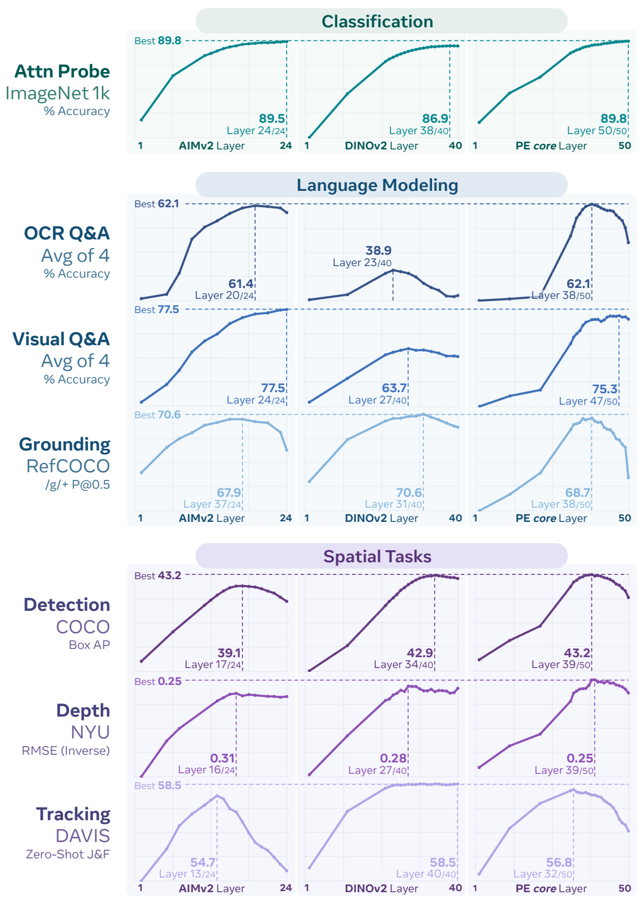

_图 8 层分析。在不同的预训练方法下，将中间层作为冻结特征在各项任务中进行评估：图像描述（AIMv2-3B [37]，左图），空间自监督（DINOv2-g [98]，中图），以及我们的对比方案 $\mathrm{(PE_{core}G,}$ 右图）。垂直线表示最佳层，水平线表示模型间的最佳性能。正如预期的那样，AIMv2 在语言任务上表现良好但在空间任务上不佳，而 DINOv2 在空间任务上表现良好但在语言任务上不佳。但令人惊讶的是，$\mathrm{PE}_{\mathrm{core}}\mathrm{G}$ 的中间层在语言建模和空间任务上都表现良好。_

---

$\mathrm{PE}_{\mathrm{core}}$ 表现出相似的行为，但带来了意想不到的结果。与其他模型不同，在网络的前几层中，$\mathrm{PE}_{\mathrm{core}}$ 在所有任务上都表现良好，通常与领先模型持平甚至更优。值得注意的是，PE 的中间层在语言任务上的表现接近或持平于 AIMv2，在空间任务上接近或持平于 DINOV2，尽管它是使用对比损失进行训练的。深度估计任务尤其值得注意，因为对比编码器通常不被认为是该领域的最先进（SOTA）模型。

然而，在几乎所有情况下，这种强劲的性能都会在网络的末端迅速下降。事实上，$\mathrm{PE}_{\mathrm{core}}$ 在最后一层对于某些任务（例如基于 LLM 的定位）的表现是非常糟糕的（其原因将在 §5 中变得显而易见）。当下游任务越接近预训练方法时，这种行为就越不明显，这表明存在对齐问题。具体来说，一个经过良好调整的大规模对比模型可以在拟合目标的过程中学习通用的嵌入，但它无法直接输出这些嵌入。因此，为了揭示这些嵌入，模型必须随后与下游任务进行对齐。

分析。纯 CLIP 模型拥有与最先进预训练方法在其各自专业领域内性能相匹配的特征，这一发现是新颖的。事实上，最近的工作 [31] 展示了相反的结果——即 CLIP 模型在下游任务上无法很好地扩展。接下来，我们将调查我们的方法是如何产生这些结果的。

首先，我们在 COCO 检测任务上执行逐层冻结特征分析。在图 8 中，$\mathrm{PE}_{\mathrm{core}}$ 在该任务上表现出明显的“峰值”，其最佳层与 DINOv2 持平，但最后一层则明显更差。我们已经使用 ViT-L/14 模型在图 2 中消融了我们对原始 CLIP 所做的每一项更改。因此，为了追溯我们的步骤，我们对那些检查点运行冻结特征分析。为了提高效率，我们在较低的分辨率下进行此实验，并且仅采样偶数层。在图 9 中，我们报告了每个累积消融实验的最后一层和最佳层的 COCO 边界框 mAP，以及最佳层的索引。此外，我们在图 10 中绘制了每一项更改的逐层性能曲线。

令人惊讶的是，我们在 §2.1 中为构建预训练方案所做的简单更改，总体上将最佳层的性能提高了

几乎 $10\ \text{mAP}$，超越了原始 CLIP！像高分辨率 (5) 和 RoPE (6) 这样改进空间特征的更改是在意料之中的，但出乎意料的是，数据增强 (8) 特别是渐进式分辨率 (2) 提供了显著的帮助。对比预训练可能会倾向于通过“全局令牌” 过度拟合任务的“全局”性质。然而，由于分辨率逐渐变化，模型无法将全局令牌保持在同一位置，因此被迫更加鲁棒。同样值得注意的是，渐进式分辨率 (2) 和注意力池化 (7) 都将 argmax 层移向了网络的更深处（图 9 的最右列）。特别是注意力池化改变了逐层性能曲线的整体形状（图 10），而其他更改通常只是将其升高或降低。

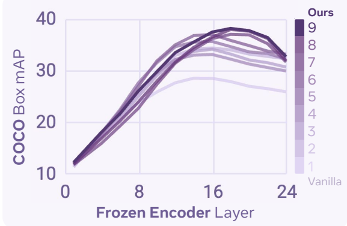

_Figure 10 图 9 所示结果对应的层级分析。_

更有趣的是那些没有提高性能的因素：具体来说，增加批大小 (3) 以及使用高学习率的 LAMB (4)。这两项更改都明确地帮助模型更好地拟合 CLIP 损失，但在超过一定限度后，这可能无法改进通用特征。此外，虽然最佳层的整体性能显著提高，但最后一层的性能在 (2) 之后停滞不前。这表明构建全局 CLIP 令牌需要一个实质性的“解码器”（在本例中，对于最终的 L/14 模型为 6 层）。虽然这个解码器的特征对某些任务（例如图 8 所示的 Visual Q&A）是有益的，但它们并不通用。尽管如此，这并不妨碍模型学习通用特征；它只是限制了这些特征在输出中的表达。

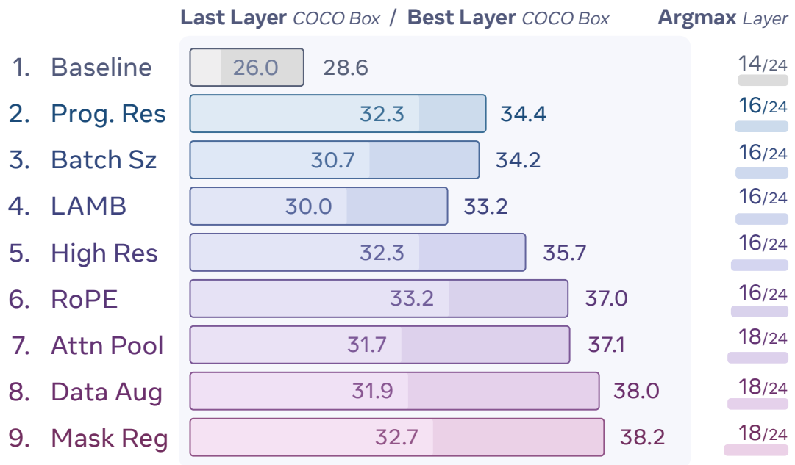

_Figure 9 鲁棒预训练的下游影响。使用 Mask R-CNN [43] 在 COCO [76] 上作为冻结特征评估的图 2 中的 ViT-L/14 检查点。我们报告了最后一层性能、最佳层性能以及最佳层的索引。_

---

---

**扩展行为**。寻找一种简单且易于扩展的视觉预训练方法以生成通用的有用特征，一直是视觉界长期以来的“圣杯”。显然，我们稳健的配方能够使对比预训练产生通用特征。这就引出了一个问题：“它能扩展吗？”

我们可以用同样的方式回答这个问题：通过对图 3 中我们的 S/14、B/14 和 L/14 扩展消融检查点进行冻结特征层分析。我们在图 11 中报告了该分析的结果。我们还使用相同的设置包含了我们最终的 $\mathrm{PE}_{\mathrm{core}}\mathrm{G}$ 模型，但请注意这是一个估计值，因为我们的消融实验和最终的时间表是不同的。

我们立即看到了原始 CLIP 配方与我们的配方在扩展行为上的鲜明对比。虽然原始配方在 L 规模（300M）时很快进入平台期，但我们稳健预训练配方的最佳层展示了扩展到 G 规模（2B）甚至更大的潜力——尽管它是使用明显非空间对齐的全局对比损失进行训练的。然而，这只是最佳层的表现。对于原始配方和我们的配方，最后一层的性能仍然停滞不前。这可能就是先前工作 [31] 发现对比预训练无法扩展到下游任务的原因——即使使用了我们的配方，CLIP 损失也会掩盖其通用特征，将它们深藏在数层网络之中。

然而，这仅针对单一的空间任务。为了验证这一趋势是否一致，我们使用与图 8 相同的冻结评估设置，在广泛的下游语言建模任务上重复了这一扩展分析，并在图 12 中报告了结果。令人惊讶的是，预训练配方的简单改变也改善了大多数语言任务的扩展性——包括输出侧的定位（RefCOCO）。请注意，在此基准测试设置中，LLM 在训练期间从未见过视频，因此 Video Q&A 的逐层结果存在噪声。尽管如此，最佳层的趋势仍然保持一致。

显然，使用我们稳健配方的对比预训练产生了可扩展的强大通用特征。然而，如果这些特征被困在网络中间，其用处将大打折扣。为了解决这个问题，在接下来的章节中，我们将讨论将这些通用特征与网络输出对齐的方法，以适用于语言建模和空间任务。

**目标检测**

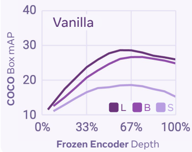

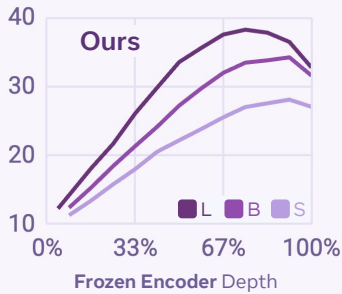

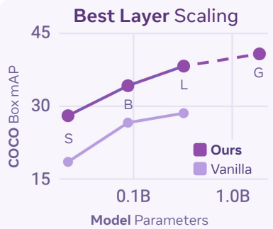

_图 11：稳健预训练的下游可扩展性。左图：使用与图 9 相同的设置，对图 3 中的 S/14、B/14 和 L/14 模型进行的冻结特征层分析。右图：每个模型最佳层的扩展行为。注意：G 是我们的最终模型，具有不同的时间表。_

**OCR 问答**

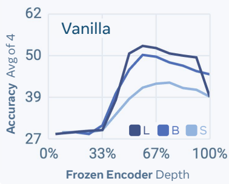

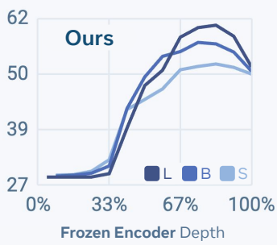

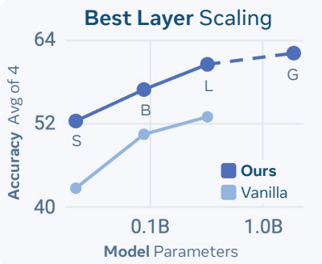

**视觉问答**

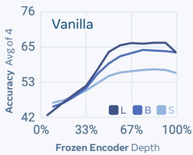

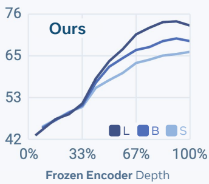

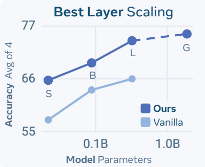

**图像描述**

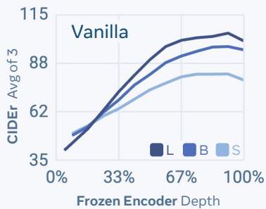

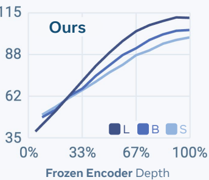

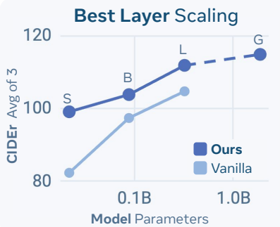

**定位**

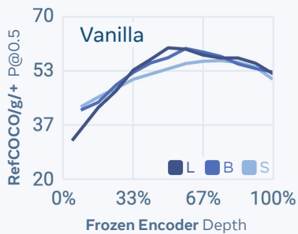

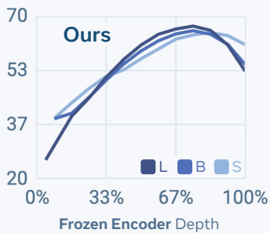

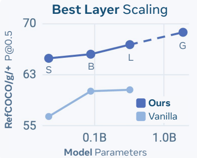

**视频问答**

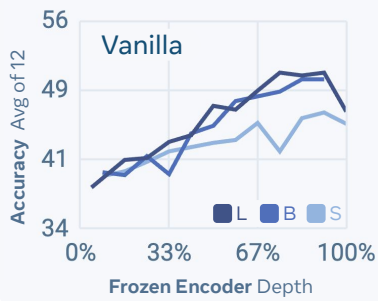

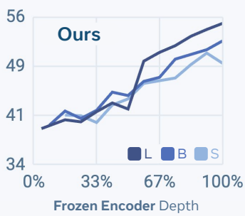

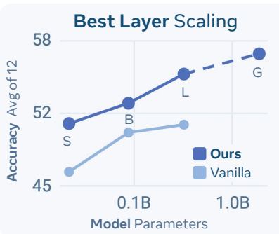

_图 12：进一步的可扩展性分析。我们通过适配语言模型，在广泛的下游任务上重复了图 11 的分析。每个类别是几个下游任务的均值（参见 §4）。_

---

---

# 4 感知编码器：语言对齐

在第 3 节中，我们已经看到 $\mathrm{PE}_{\mathrm{core}}$ 已经具备了用于视觉-语言建模的有用特征。在本节中，我们通过**对齐调优**来提升这些特征，从而构建一个新的编码器 $\mathrm{PE}_{\mathrm{lang}}$，专门用于多模态大语言模型。我们的原则是设计不仅性能最强，而且在 MLLM 开发中适用性最广的视觉编码器。为此，我们需要一个单一的语言对齐编码器，它能够跨语言模型、跨输入分辨率以及在广泛的 MLLM 任务中表现良好。

**MLLM 评估任务。** 在本节中，我们的主要测试平台是将视觉编码器适配到 MLLM 并在各种 MLLM 任务上进行测试。我们在五个任务类别上评估每个 MLLM 的下游性能：(1) OCR、图表、文档问答，基于 ChartQA [165]、DocVQA [91]、InfoVQA [92] 和 AI2D [57]；(2) 视觉问答，基于 TextVQA [125]、OK-VQA [118]、POPE [73] 和 VQAv2 [40]；(3) 图像描述，基于 Flicker [157]、COCO [76] 和 No Cap [1]；(4) 视频理解，基于 VideoMME [38]、STAR [148]、TGIF-QA [53]、EgoSchema [89]、MVBench [68] 和 PerceptionTest [105]；最后是 (5) 定位，基于 RefCOCO [56]。

# 4.1 语言对齐方法

我们首先寻找最优的语言对齐方法。我们的对齐调优设计基于感知语言模型的中期训练阶段，即将 $\mathrm{PE}_{\mathrm{core}}$ 适配到一个通过视觉投影器连接的预训练仅解码器 LLM（Llama 3 [82]）。我们从“预热”训练阶段开始，在来自预训练的 100 万个图像-文本样本上使用自回归下一词预测损失，此时除投影器外的所有部分都被冻结。然后，我们继续在 7000 万个数据样本 [21] 上微调所有参数，这些样本涵盖自然图像、文档/图表/图表和视频，使用相同的下一词预测损失。完成这种语言对齐后，我们从模型中提取视觉编码器，并将其称为 $\mathrm{PE}_{\mathrm{lang}}$。

为了得出 PLM [21] 中提出的最佳训练配置，我们首先使用数据的 2000 万个子集进行消融研究。在表 9 中，我们对 LLM 大小、训练参数、视觉投影器类型、要投影的输出层以及编码器正则化进行了消融实验。我们在 OCR 问答、图像描述、视觉问答和视频问答中进行了评估，并找到了最佳配置。

**LLM 设置。** 我们探索了不同的规模（1B 或 3B 参数）和 LLM 的权重冻结。我们观察到，从 1B 增加到 3B 参数使平均分提高了 1.6 分 $(76.5\rightarrow 78.1)$。解冻 LLM 将这一分数提升至 78.4。

**视觉投影器。** 使用 2 层 MLP 视觉投影器代替线性层将平均分从 77.2 提高到 78.1，而仅增加了少量参数（13.5M → 27M）。

**PE 输出层。** 如第 3 节所示，$\mathrm{PE}_{\mathrm{core}}\mathrm{G}$ 的中间层在作为某些任务的特征时，其表现明显优于最后一层。然而，目前尚不清楚这种

<table><thead>
<tr>
<th rowspan="3">LLM 规模</th>
<th rowspan="3">LLM 解冻</th>
<th rowspan="3">正则化?</th>
<th rowspan="3">投影器</th>
<th rowspan="3">层</th>
<th rowspan="3">平均分</th>
<th colspan="4">OCR Q&amp;A 平均分 (4)</th>
</tr>
<tr>
<th colspan="2">图像描述 平均分 (3)</th>
<th colspan="2">视觉 Q&amp;A 平均分 (4)</th>
</tr>
<tr>
<th colspan="2">视频 Q&amp;A 平均分 (6)</th>
<th colspan="2">定位 平均分 (6)</th>
</tr>
</thead>
<tbody>
<tr>
<td colspan="10"><strong>LLM 设置</strong></td>
</tr>
<tr>
<td>1B</td>
<td></td>
<td></td>
<td>MLP</td>
<td>47</td>
<td>76.5</td>
<td>60.7</td>
<td>115.1</td>
<td>76.0</td>
<td>54.0</td>
</tr>
<tr>
<td>3B</td>
<td></td>
<td></td>
<td>MLP</td>
<td>47</td>
<td>78.1</td>
<td>65.9</td>
<td>115.7</td>
<td>76.6</td>
<td>54.1</td>
</tr>
<tr>
<td>3B</td>
<td>✓</td>
<td></td>
<td>MLP</td>
<td>47</td>
<td>78.4</td>
<td>65.8</td>
<td>117.6</td>
<td>76.3</td>
<td>53.7</td>
</tr>
<tr>
<td colspan="10"><strong>视觉投影器</strong></td>
</tr>
<tr>
<td>3B</td>
<td></td>
<td></td>
<td>Linear</td>
<td>47</td>
<td>77.2</td>
<td>64.5</td>
<td>114.1</td>
<td>76.5</td>
<td>53.7</td>
</tr>
<tr>
<td>3B</td>
<td></td>
<td></td>
<td>MLP</td>
<td>47</td>
<td>78.1</td>
<td>65.9</td>
<td>115.7</td>
<td>76.6</td>
<td>54.1</td>
</tr>
<tr>
<td colspan="10"><strong>PE 输出层</strong></td>
</tr>
<tr>
<td>3B</td>
<td></td>
<td></td>
<td>MLP</td>
<td>50</td>
<td>75.9</td>
<td>56.6</td>
<td>116.7</td>
<td>76.5</td>
<td>53.7</td>
</tr>
<tr>
<td>3B</td>
<td></td>
<td></td>
<td>MLP</td>
<td>47</td>
<td>78.1</td>
<td>65.9</td>
<td>115.7</td>
<td>76.6</td>
<td>54.1</td>
</tr>
<tr>
<td>3B</td>
<td></td>
<td></td>
<td>MLP</td>
<td>41</td>
<td>76.9</td>
<td>65.5</td>
<td>112.8</td>
<td>75.4</td>
<td>53.9</td>
</tr>
<tr>
<td colspan="10"><strong>PE 正则化</strong></td>
</tr>
<tr>
<td>3B</td>
<td></td>
<td>✓</td>
<td>MLP</td>
<td>47</td>
<td>79.9</td>
<td>69.0</td>
<td>117.5</td>
<td>77.4</td>
<td>55.6</td>
</tr>
<tr>
<td>3B</td>
<td>✓</td>
<td>✓</td>
<td>MLP</td>
<td>47</td>
<td>80.1</td>
<td>68.7</td>
<td>118.3</td>
<td>77.0</td>
<td>56.3</td>
</tr>
</tbody>
</table>

*表 9 语言对齐。我们找到了使用自回归语言训练对齐 $\mathrm{PE}_{\mathrm{core}}\mathrm{G}$ 的最佳配置。*

行为是否适用于微调。我们测试了将投影器应用于第 41、47 和 50 层（最后一层），发现第 47 层效果最好。顺便提一下，这也是图 8 中冻结 VQ&A 的最佳层。

**PE 正则化。** 我们在对齐过程中对视觉编码器应用了 LayerScale [135] 和 DropPath [50]，以稳定训练。这将 78.1 的平均分提高到 79.9（+1.8 分）。解冻 LLM 将这一分数进一步提升至 80.1。我们选择此配置（最后一行）作为我们的最终对齐设置。

为了构建 $\mathrm{PE}_{\mathrm{lang}}$，我们将此方案扩展到上述提到的 7000 万个样本（更多细节见 [21]）。总之，我们使用一个预训练的 Llama3.2 3B，解冻权重，在 $\mathrm{PE}_{\mathrm{core}}\mathrm{G}$ 的第 47 层（丢弃最后 3 层）之上使用 2 层 MLP 作为视觉投影器，并使用 LayerScale 和 DropPath 对编码器进行正则化。与表 9 中 2000 万样本的消融设置相比，在总共 7000 万样本上训练的最终 $\mathrm{PE}_{\mathrm{lang}}$ 在 OCR 问答、图像描述、视觉问答和视频问答的平均分上又带来了 $+2.1$ 分的提升，达到 82.2 分。

**效果。** 对齐调优的目标是将第 3 节中描述的 $\mathrm{PE}_{\mathrm{core}}$ 中间层发现的强特征提升到网络的末端。为了查看我们是否真的做到了这一点，我们执行了相同的逐层

---

我们按照图 8 的方式，对我们的最终 $\mathrm{PE}_{\mathrm{lang}}\mathrm{G}$ 模型进行分析，并将其与其初始化来源的原始 $\mathrm{PE}_{\mathrm{core}}\mathrm{G}$ 检查点进行比较。我们在图 13 中展示了这一分析的结果，并立即看到语言对齐取得了成功：在所有类别中，无论原始检查点的性能如何，对齐模型的性能最佳层都是最后一层。值得注意的是，我们的 $\mathrm{PE}_{\mathrm{lang}}$ 训练混合数据并不包含视觉定位数据，这意味着这种显著提升的定位性能完全归功于 $\mathrm{PE}_{\mathrm{core}}$ 中强大的中间定位特征现在被对齐到了网络的末端。此外，与 $\mathrm{PE}_{\mathrm{core}}$ 的最佳层相比（即使其已经表现强劲），训练混合数据中代表的特定领域（如 OCR Q&A）的性能也获得了显著提升。因此，与预训练相比，我们使用数量级更少的样本，成功地将 $\mathrm{PE}_{\mathrm{core}}\mathrm{G}$ 进行了语言对齐，从而创建了一个用于所有视觉语言建模任务的单一且强大的编码器。继这一成功之后，我们以类似的方式对齐 $\mathrm{PE}_{\mathrm{core}}\mathrm{L}$ 以构建 $\mathrm{PE}_{\mathrm{lang}}\mathrm{L}$（参见 [21]）。

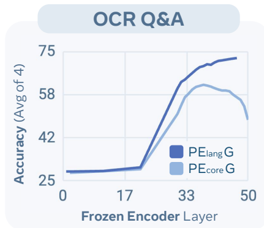

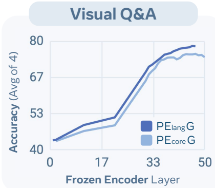

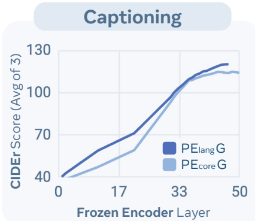

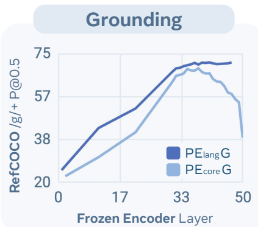

_图 13：语言对齐。我们分析了语言对齐如何改变 PE 的内部特征。类似于我们在图 12 中对 $\mathrm{PE}_{\mathrm{core}}$ 的分析，我们提取 $\mathrm{PE}_{\mathrm{lang}}$ 并将每一层适配到一个新的 LLM。_

# 4.2 与现有视觉编码器的比较

我们将 $\mathrm{PE}_{\mathrm{core}}$ 和 $\mathrm{PE}_{\mathrm{lang}}$ 与 MLLM 文献中其他流行的视觉编码器进行了比较：MetaCLIP [152]、SigLIP2 [138]、CLIP [106]、AIMv2 [37]、DINOV2 [98] 和 InternViT2.5 [18]。总体而言，这些编码器涵盖了多种不同的预训练损失（例如，对比学习、图像描述、自监督和混合监督）、编码器规模（从 300M 到 6B 参数）以及分辨率（从 224 到 512）。对于所有视觉编码器，为了进行公平比较，我们找到了最佳的中间层来训练 MLLM（更多细节见附录 B.2）。

MLLM 基准测试设置。我们将每个视觉编码器（包括 $\mathrm{PE}_{\mathrm{lang}}$）连接到一个语言解码器，并配备一个全新的 2 层 MLP 投影器。与对齐阶段类似，我们首先仅在预训练数据的一个包含 100 万对图像-文本的子集上训练投影器。然后，我们在 260 万对视觉问答对上训练投影器和 LLM，

<table><tr><td rowspan="2">模型</td><td rowspan="2">编码器参数量</td><td rowspan="2">分辨率/补丁大小</td><td colspan="5">OCR / 图表 / 文档问答</td><td colspan="5">视觉问答</td><td colspan="5">图像描述</td><td colspan="6">视频</td><td></td><td></td><td></td><td></td><td></td></tr><tr><td colspan="5">平均 OCR 问答</td><td>ChartQA 准确率 [165]</td><td>DocVQA 准确率 [91]</td><td>Info. QA 准确率 [92]</td><td>AI2D 准确率 [57]</td><td>平均 VQA</td><td>TextVQA 准确率 [125]</td><td>OK-VQA 准确率 [118]</td><td>POPE 准确率 [73]</td><td>VQAv2 准确率 [40]</td><td平均描述</td><td>Flicker CIDEr [157]</td><td>COCO CIDEr [76]</td><td>No Cap CIDEr [1]</td><td>平均定位 Re[COCO/g+/56]</td><td>平均视频</td><td>VideoMME 准确率 [38]</td><td>STAR 准确率 [148]</td><td>TGIF-QA 准确率 [53]</td><td>EgoSchema 准确率 [89]</td><td>MVBench 准确率 [68]</td><td>PerceptionTest 准确率 [105]</td></tr><tr><td colspan="25">每张图像 256 个 Token</td><td></td><td></td><td></td><td></td></tr><tr><td>MetaCLIP-L [152]</td><td>0.3B</td><td>224/14</td><td>44.9</td><td>47.9</td><td>33.0</td><td>28.7</td><td>70.2</td><td>68.4</td><td>47.6</td><td>62.5</td><td>86.9</td><td>76.5</td><td>110.5</td><td>87.5</td><td>130.0</td><td>114.1</td><td>60.6</td><td>53.9</td><td>46.1</td><td>51.0</td><td>66.4</td><td>58.6</td><td>49.4</td><td>51.9</td><td></td><td></td><td></td><td></td></tr><tr><td>MetaCLIP-G [152]</td><td>1.8B</td><td>224/14</td><td>44.8</td><td>47.6</td><td>33.1</td><td>27.9</td><td>70.6</td><td>68.8</td><td>48.2</td><td>63.5</td><td>86.5</td><td>76.9</td><td>111.1</td><td>86.5</td><td>132.1</td><td>114.8</td><td>60.5</td><td>53.1</td><td>45.0</td><td>50.7</td><td>66.4</td><td>56.0</td><td>48.7</td><td>51.9</td><td></td><td></td><td></td><td></td></tr><tr><td>PElang G†</td><td>1.7B*</td><td>224/14</td><td>53.7</td><td>61.3</td><td>47.1</td><td>32.2</td><td>74.1</td><td>71.8</td><td>55.1</td><td>65.3</td><td>86.8</td><td>79.8</td><td>116.4</td><td>91.0</td><td>136.9</td><td>121.2</td><td>65.7</td><td>55.5</td><td>47.3</td><td>55.7</td><td>68.9</td><td>59.6</td><td>48.6</td><td>52.9</td><td></td><td></td><td></td><td></td></tr><tr><td colspan="25">每张图像 576 个 Token</td><td></td><td></td><td></td><td></td></tr><tr><td>CLIP [106]</td><td>0.3B</td><td>336/14</td><td>53.5</td><td>61.7</td><td>49.5</td><td>32.8</td><td>70.1</td><td>72.7</td><td>60.7</td><td>63.9</td><td>87.3</td><td>78.9</td><td>113.3</td><td>92.0</td><td>132.9</td><td>115.0</td><td>65.0</td><td>54.2</td><td>46.3</td><td>52.1</td><td>68.6</td><td>57.4</td><td>48.5</td><td>52.3</td><td></td><td></td><td></td><td></td></tr><tr><td>AIMv2-L [37]</td><td>0.3B</td><td>336/14</td><td>53.3</td><td>61.6</td><td>48.0</td><td>32.1</td><td>71.4</td><td>73.7</td><td>62.7</td><td>64.3</td><td>87.7</td><td>80.1</td><td>115.2</td><td>90.9</td><td>135.6</td><td>119.2</td><td>63.3</td><td>52.5</td><td>44.3</td><td>50.9</td><td>67.5</td><td>54.4</td><td>44.9</td><td>53.2</td><td></td><td></td><td></td><td></td></tr><tr><td>AIMv2 L Dist. [37]</td><td>0.3B</td><td>336/14</td><td>53.7</td><td>61.1</td><td>49.4</td><td>31.5</td><td>72.7</td><td>74.1</td><td>62.8</td><td>64.8</td><td>88.3</td><td>80.3</td><td>117.8</td><td>94.7</td><td>137.5</td><td>121.2</td><td>62.6</td><td>53.8</td><td>44.3</td><td>52.4</td><td>65.0</td><td>57.4</td><td>50.0</td><td>53.6</td><td></td><td></td><td></td><td></td></tr><tr><td>SigLIP2-so [138]</td><td>0.4B</td><td>384/16</td><td>58.9</td><td>69.0</td><td>58.3</td><td>35.2</td><td>73.1</td><td>76.8</td><td>69.8</td><td>67.2</td><td>88.7</td><td>81.6</td><td>116.5</td><td>92.1</td><td>137.7</td><td>119.8</td><td>67.4</td><td>54.5</td><td>45.5</td><td>53.1</td><td>67.2</td><td>57.6</td><td>49.3</td><td>54.5</td><td></td><td></td><td></td><td></td></tr><tr><td>SigLIP2-g-opt [138]</td><td>1.1B</td><td>384/16</td><td>56.2</td><td>63.1</td><td>55.3</td><td>34.0</td><td>72.4</td><td>77.0</td><td>70.3</td><td>66.7</td><td>89.6</td><td>81.6</td><td>117.7</td><td>94.9</td><td>137.8</td><td>120.3</td><td>66.5</td><td>53.9</td><td>46.2</td><td>53.9</td><td>66.6</td><td>53.8</td><td>48.5</td><td>54.7</td><td></td><td></td><td></td><td></td></tr><tr><td>PElang G†</td><td>1.7B*</td><td>336/14</td><td>66.9</td><td>76.8</td><td>73.6</td><td>41.1</td><td>76.1</td><td>76.2</td><td>68.5</td><td>66.0</td><td>89.1</td><td>81.3</td><td>119.7</td><td>96.1</td><td>139.6</td><td>123.4</td><td>68.9</td><td>58.1</td><td>48.7</td><td>58.9</td><td>70.5</td><td>61.8</td><td>52.7</td><td>55.9</td><td></td><td></td><td></td><td></td></tr><tr><td colspan="25">每张图像 1024 个 Token</td><td></td><td></td><td></td><td></td></tr><tr><td>InternViT 2.5 L [18]</td><td>0.3B</td><td>448/14</td><td>60.6</td><td>74.1</td><td>59.2</td><td>35.9</td><td>73.1</td><td>74.2</td><td>65.4</td><td>64.4</td><td>87.6</td><td>79.6</td><td>112.3</td><td>88.4</td><td>133.7</td><td>114.9</td><td>66.9</td><td>50.6</td><td>45.2</td><td>44.8</td><td>62.7</td><td>54.2</td><td>46.0</td><td>50.5</td><td></td><td></td><td></td><td></td></tr><tr><td>SigLIP2-so [138]</td><td>0.4B</td><td>512/16</td><td>63.3</td><td>72.1</td><td>69.3</td><td>39.0</td><td>72.7</td><td>77.9</td><td>74.8</td><td>66.0</td><td>89.0</td><td>81.8</td><td>117.4</td><td>93.5</td><td>138.3</td><td>120.2</td><td>69.6</td><td>55.8</td><td>46.2</td><td>55.4</td><td>67.0</td><td>62.0</td><td>50.0</td><td>54.5</td><td></td><td></td><td></td><td></td></tr><tr><td>PEcore L</td><td>0.3B</td><td>448/14</td><td>59.4</td><td>68.7</td><td>62.5</td><td>36.6</td><td>69.7</td><td>74.7</td><td>67.7</td><td>64.3</td><td>88.3</td><td>78.7</td><td>112.7</td><td>89.6</td><td>133.4</td><td>114.9</td><td>59.7</td><td>50.9</td><td>41.7</td><td>51.2</td><td>61.6</td><td>52.6</td><td>47.4</td><td>50.6</td><td></td><td></td><td></td><td></td></tr><tr><td>PElang L</td><td>0.3B</td><td>448/14</td><td>71.1</td><td>81.0</td><td>81.9</td><td>46.4</td><td>75.0</td><td>77.1</td><td>73.0</td><td>65.5</td><td>89.3</td><td>80.8</td><td>117.3</td><td>94.3</td><td>137.3</td><td>120.1</td><td>70.5</td><td>56.5</td><td>47.0</td><td>57.2</td><td>68.0</td><td>59.8</td><td>52.3</td><td>54.7</td><td></td><td></td><td></td><td></td></tr><tr><td>DINOv2-g [98]</td><td>1.1B</td><td>448/14</td><td>30.0</td><td>19.6</td><td>14.7</td><td>24.2</td><td>61.5</td><td>61.0</td><td>19.3</td><td>60.4</td><td>88.6</td><td>75.8</td><td>109.4</td><td>86.5</td><td>131.6</td><td>110.1</td><td>64.9</td><td>49.5</td><td>39.7</td><td>52.1</td><td>60.1</td><td>46.8</td><td>47.4</td><td>50.8</td><td></td><td></td><td></td><td></td></tr><tr><td>AIMv2 3B [37]</td><td>2.7B</td><td>448/14</td><td>48.9</td><td>40.5</td><td>53.9</td><td>33.9</td><td>67.2</td><td>73.0</td><td>64.1</td><td>64.0</td><td>85.2</td><td>78.9</td><td>115.7</td><td>93.8</td><td>135.2</td><td>118.1</td><td>36.1</td><td>54.6</td><td>45.1</td><td>54.5</td><td>66.7</td><td>55.4</td><td>51.7</td><td>54.3</td><td></td><td></td><td></td><td></td></tr><tr><td>InternViT2.5-6B [18]</td><td>5.5B</td><td>448/14</td><td>59.9</td><td>72.3</td><td>59.4</td><td>35.2</td><td>72.5</td><td>75.5</td><td>68.9</td><td>64.9</td><td>88.2</td><td>80.2</td><td>115.0</td><td>92.2</td><td>136.3</td><td>116.3</td><td>68.0</td><td>49.6</td><td>44.5</td><td>47.0</td><td>62.6</td><td>45.8</td><td>48.9</td><td>48.5</td><td></td><td></td><td></td><td></td></tr><tr><td>PEcore G</td><td>1.9B</td><td>448/14</td><td>60.8</td><td>69.9</td><td>65.4</td><td>36.7</td><td>71.1</td><td>73.3</td><td>65.9</td><td>60.7</td><td>88.4</td><td>78.0</td><td>112.5</td><td>91.6</td><td>133.6</td><td>112.4</td><td>66.6</td><td>52.0</td><td>42.3</td><td>53.1</td><td>62.9</td><td>51.4</td><td>48.8</td><td>53.6</td><td></td><td></td><td></td><td></td></tr><tr><td>PElang G</td><td>1.7B*</td><td>448/14</td><td>72.4</td><td>80.5</td><td>84.4</td><td>48.3</td><td>76.4</td><td>78.1</td><td>75.2</td><td>65.4</td><td>90.1</td><td>81.8</td><td>120.1</td><td>96.6</td><td>140.0</td><td>123.6</td><td>71.3</td><td>58.0</td><td>48.0</td><td>60.1</td><td>69.4</td><td>62.0</td><td>52.4</td><td>56.0</td><td></td><td></td><td></td><td></td></tr></table>

_表 10：使用 Llama 3.1 8B 的 MLLM 结果。我们使用 Llama 3.1-instruct 8B [82] 作为语言模型，在其原始分辨率下比较了各种视觉编码器。该表在视觉 Token 数量和参数量上对相似类别的模型进行了比较。$\mathrm{PE}_{\mathrm{lang}}$ 在所有基准测试中均表现出强劲的性能，甚至击败了规模为其 3 倍的模型。${}^{*}\mathrm{PE}_{\mathrm{lang}}$ 拥有 1.7B 参数，因为我们在语言对齐期间丢弃了最后 3 层。$\dagger$ 在无额外训练的情况下进行插值。_

---

图像标题以及图像定位样本（详见附录 B.2）。我们在每个编码器的原生分辨率下进行基准测试（更高分辨率的平铺结果见附录 C.4）。最后，我们对两个语言解码器 Llama 3.1 8B [82] 和 QwenLM 2.5 7B [155] 进行了消融实验，以衡量模型在不同 LLM 间的泛化能力。

**结果。** 表 10 展示了现有编码器、$\mathrm{PE}_{\mathrm{core}}$ 和 $\mathrm{PE}_{\mathrm{lang}}$ 在原生分辨率输入下的基准测试结果。值得注意的是，AIMv2 [37]、InternViT2.5 [18]、SigLIP2 [138] 和 $\mathrm{PE}_{\mathrm{lang}}$ 均与语言解码器联合训练，使用了下一 token 预测目标，因此与基础对比学习和自监督模型相比，它们在所有指标上的整体表现更好。然而，$\mathrm{PE}_{\mathrm{lang}}$ 仅使用了少量的训练 FLOPs 进行语言对齐微调，却以显著优势超越了所有视觉编码器（G 平均提升 +3.5 分，L 平均提升 +2.0 分）。类似地，在使用 4 个平铺块和 1 个缩略图时（见附录表 30），$\mathrm{PE}_{\mathrm{lang}}\mathrm{L}$ 和 $\mathrm{PE}_{\mathrm{lang}}\mathrm{G}$ 均优于所有现有的视觉编码器，包括专门在平铺设置下并使用定位数据进行预训练的 InternViT2.5 [18]。附录 C.4 展示了 RefCOCO 结果的细分，以及更高分辨率平铺的结果。

**迁移性。** 由于 $\mathrm{PE}_{\mathrm{lang}}$ 是与 Llama 3.2-instruct 3B 对齐的，我们进行了一组单独的实验，以检查我们的模型是否能在不同的基础 LLM 上表现良好。在表 11 中，我们使用 QwenLM 2.5 7B [155] 重复了原生分辨率的比较。有趣的是，$\mathrm{PE}_{\mathrm{lang}}$ 在这种设置下不仅优于所有视觉编码器，还优于在整个中期训练过程中专门与 QwenLM 2 [154] 对齐的 InternViT2.5 [18]。事实上，在某些情况下（如 OCR 问答和视频基准测试），配合 QwenLM 的 $\mathrm{PE}_{\mathrm{lang}}\mathrm{G}$ 甚至比配合 Llama 时的性能更好，这强调了我们语言对齐的通用性。

<table><tr><td rowspan="2">模型</td><td rowspan="2">编码器参数量</td><td rowspan="2">分辨率/补丁大小</td><td colspan="6">OCR / 图表 / 文档问答</td><td colspan="6">视觉问答</td><td colspan="6">图像描述</td><td colspan="6">视频</td><td></td><td></td><td></td><td></td><td></td><td></td><td></td><td></td><td></td><td></td><td></td><td></td><td></td><td></td><td></td><td></td><td></td><td></td><td></td><td></td><td></td><td></td><td></td><td></td><td></td><td></td><td></td><td></td><td></td><td></td><td></td><td></td><td></td><td></td><td></td><td></td><td></td><td></td><td></td><td></td><td></td><td></td><td></td><td></td><td></td><td></td><td></td><td></td><td></td><td></td><td></td><td></td><td></td><td></td><td></td><td></td><td></td><td></td><td></td><td></td><td></td><td></td><td></td><td></td><td></td><td></td><td></td><td></td><td></td><td></td><td></td><td></td><td></td><td></td><td></td><td></td><td></td><td></td><td></td><td></td><td></td><td></td><td></td><td></td><td></td><td></td><td></td><td></td><td></td><td></td><td></td><td></td><td></td><td></td><td></td><td></td><td></td><td></td><td></td><td></td><td></td><td></td><td></td><td></td><td></td><td></td><td></td><td></td><td></td><td></td><td></td><td></td><td></td><td></td><td></td><td></td><td></td><td></td><td></td><td></td><td></td><td></td><td></td><td></td><td></td><td></td><td></td><td></td><td></td><td></td><td></td><td></td><td></td><td></td><td></td><td></td><td></td><td></td><td></td><td></td><td></td><td></td><td></td><td></td><td></td><td></td><td></td><td></td><td></td><td></td><td></td><td></td><td></td><td></td><td></td><td></td><td></td><td></td><td></td><td></td><td></td><td></td><td></td><td></td><td></td><td></td><td></td><td></td><td></td><td></td><td></td><td></td><td></td><td></td><td></td><td></td><td></td><td></td><td></td><td></td><td></td><td></td><td></td><td></td><td></td><td></td><td></td><td></td><td></td><td></td><td></td><td></td><td></td><td></td><td></td><td></td><td></td><td></td><td></td><td></td><td></td><td></td><td></td><td></td><td></td><td></td><td></td><td></td><td></td><td></td><td></td><td></td><td></td><td></td><td></td><td></td><td></td><td></td><td></td><td></td><td></td><td></td><td></td><td></td><td></td><td></td><td></td><td></td><td></td><td></td><td></td><td></td><td></td><td></td><td></td><td></td><td></td><td></td><td></td><td></td><td></td><td></td><td></td><td></td><td></td><td></td><td></td><td></td><td></td><td></td><td></td><td></td><td></td><td></td><td></td><td></td><td></td><td></td><td></td><td></td><td></td><td></td><td></td><td></td><td></td><td></td><td></td><td></td><td></td><td></td><td></td><td></td><td></td><td></td><td></td><td></td><td></td><td></td><td></td><td></td><td></td><td></td><td></td><td></td><td></td><td></td><td></td><td></td><td></td><td></td><td></td><td></td><td></td><td></td><td></td><td></td><td></td><td></td><td></td><td></td><td></td><td></td><td></td><td></td><td></td><td></td><td></td><td></td><td></td><td></td><td></td><td></td><td></td><td></td><td></td><td></td><td></td><td></td><td></td><td></td><td></td><td></td><td></td><td></td><td></td><td></td><td></td><td></td><td></td><td></td><td></td><td></td><td></td><td></td><td></td><td></td><td></td><td></td><td></td><td></td><td></td><td></td><td></td><td></td><td></td><td></td><td></td><td></td><td></td><td></td><td></td><td></td><td></td><td></td><td></td><td></td><td></td><td></td><td></td><td></td><td></td><td></td><td></td><td></td><td></td><td></td><td></td><td></td><td></td><td></td><td></td><td></td><td></td><td></td><td></td><td></td><td></td><td></td><td></td><td></td><td></td><td></td><td></td><td></td><td></td><td></td><td></td><td></td><td></td><td></td><td></td><td></td><td></td><td></td><td></td><td></td><td></td><td></td><td></td><td></td><td></td><td></td><td></td><td></td><td></td><td></td><td></td><td></td><td></td><td></td><td></td><td></td><td></td><td></td><td></td><td></td><td></td><td></td><td></td><td></td><td></td><td></td><td></td><td></td><td></td><td></td><td></td><td></td><td></td><td></td><td></td><td></td><td></td><td></td><td></td><td></td><td></td><td></td><td></td><td></td><td></td><td></td><td></td><td></td><td></td><td></td><td></td><td></td><td></td><td></td><td></td><td></td><td></td><td></td><td></td><td></td><td></td><td></td><td></td><td></td><td></td><td></td><td></td><td></td><td></td><td></td><td></td><td></td><td></td><td></td><td></td><td></td><td></td><td></td><td></td><td></td><td></td><td></td><td></td><td></td><td></td><td></td><td></td><td></td><td></td><td></td><td></td><td></td><td></td><td></td><td></td><td></td><td></td><td></td><td></td><td></td><td></td><td></td><td></td><td></td><td></td><td></td><td></td><td></td><td></td><td></td><td></td><td></td><td></td><td></td><td></td><td></td><td></td><td></td><td></td><td></td><td></td><td></td><td></td><td></td><td></td><td></td><td></td><td></td><td></td><td></td><td></td><td></td><td></td><td></td><td></td><td></td><td></td><td></td><td></td><td></td><td></td><td></td><td></td><td></td><td></td><td></td><td></td><td></td><td></td><td></td><td></td><td></td><td></td><td></td><td></td><td></td><td></td><td></td><td></td><td></td><td></td><td></td><td></td><td></td><td></td><td></td><td></td><td></td><td></td><td></td><td></td><td></td><td></td><td></td><td></td><td></td><td></td><td></td><td></td><td></td><td></td><td></td><td></td><td></td><td></td><td></td><td></td><td></td><td></td><td></td><td></td><td></td><td></td><td></td><td></td><td></td><td></td><td></td><td></td><td></td><td></td><td></td><td></td><td></td><td></td><td></td><td></td><td></td><td></td><td></td><td></td><td></td><td></td><td></td><td></td><td></td><td></td><td></td><td></td><td></td><td></td><td></td><td></td><td></td><td></td><td></td><td></td><td></td><td></td><td></td><td></td><td></td><td></td><td></td><td></td><td></td><td></td><td></td><td></td><td></td><td></td><td></td><td></td><td></td><td></td><td></td><td></td><td></td><td></td><td></td><td></td><td></td><td></td><td></td><td></td><td></td><td></td><td></td><td></td><td></td><td></td><td></td><td></td><td></td><td></td><td></td><td></td><td></td><td></td><td></td><td></td><td></td><td></td><td></td><td></td><td></td><td></td><td></td><td></td><td></td><td></td><td></td><td></td><td></td><td></td><td></td><td></td><td></td><td></td><td></td><td></td><td></td><td></td><td></td><td></td><td></td><td></td><td></td><td></td><td></td><td></td><td></td><td></td><td></td><td></td><td></td><td></td><td></td><td></td><td></td><td></td><td></td><td></td><td></td><td></td><td></td><td></td><td></td><td></td><td></td><td></td><td></td><td></td><td></td><td></td><td></td><td></td><td></td><td></td><td></td><td></td><td></td><td></td><td></td><td></td><td></td><td></td><td></td><td></td><td></td><td></td><td></td><td></td><td></td><td></td><td></td><td></td><td></td><td></td><td></td><td></td><td></td><td></td><td></td><td></td><td></td><td></td><td></td><td></td><td></td><td></td><td></td><td></td><td></td><td></td><td></td><td></td><td></td><td></td><td></td><td></td><td></td><td></td><td></td><td></td><td></td><td></td><td></td><td></td><td></td><td></td><td></td><td></td><td></td><td></td><td></td><td></td><td></td><td></td><td></td><td></td><td></td><td></td><td></td><td></td><td></td><td></td><td></td><td></td><td></td><td></td><td></td><td></td><td></td><td></td><td></td><td></td><td></td><td></td><td></td><td></td><td></td><td></td><td></td><td></td><td></td><td></td><td></td><td></td><td></td><td></td><td></td><td></td><td></td><td></td><td></td><td></td><td></td><td></td><td></td><td></td><td></td><td></td><td></td><td></td><td></td><td></td><td></td><td></td><td></td><td></td><td></td><td></td><td></td><td></td><td></td><td></td><td></td><td></td><td></td><td></td><td></td><td></td><td></td><td></td><td></td><td></td><td></td><td></td><td></td><td></td><td></td><td></td><td></td><td></td><td></td><td></td><td></td><td></td><td></td><td></td><td></td><td></td><td></td><td></td><td></td><td></td><td></td><td></td><td></td><td></td><td></td><td></td><td></td><td></td><td></td><td></td><td></td><td></td><td></td><td></td><td></td><td></td><td></td><td></td><td></td><td></td><td></td><td></td><td></td><td></td><td></td><td></td><td></td><td></td><td></td><td></td><td></td><td></td><td></td><td></td><td></td><td></td><td></td><td></td><td></td><td></td><td></td><td></td><td></td><td></td><td></td><td></td><td></td><td></td><td></td><td></td><td></td><td></td><td></td><td></td><td></td><td></td><td></td><td></td><td></td><td></td><td></td><td></td><td></td><td></td><td></td><td></td><td></td><td></td><td></td><td></td><td></td><td></td><td></td><td></td><td></td><td></td><td></td><td></td><td></td><td></td><td></td><td></td><td></td><td></td><td></td><td></td><td></td><td></td><td></td><td></td><td></td><td></td><td></td><td></td><td></td><td></td><td></td><td></td><td></td><td></td><td></td><td></td><td></td><td></td><td></td><td></td><td></td><td></td><td></td><td></td><td></td><td></td><td></td><td></td><td></td><td></td><td></td><td></td><td></td><td></td><td></td><td></td><td></td><td></td><td></td><td></td><td></td><td></td><td></td><td></td><td></td><td></td><td></td><td></td><td></td><td></td><td></td><td></td><td></td><td></td><td></td><td></td><td></td><td></td><td></td><td></td><td></td><td></td><td></td><td></td><td></td><td></td><td></td><td></td><td></td><td></td><td></td><td></td><td></td><td></td><td></td><td></td><td></td><td></td><td></td><td></td><td></td><td></td><td></td><td></td><td></td><td></td><td></td><td></td><td></td><td></td><td></td><td></td><td></td><td></td><td></td><td></td><td></td><td></td><td></td><td></td><td></td><td></td><td></td><td></td><td></td><td></td><td></td><td></td><td></td><td></td><td></td><td></td><td></td><td></td><td></td><td></td><td></td><td></td><td></td><td></td><td></td><td></td><td></td><td></td><td></td><td></td><td></td><td></td><td></td><td></td><td></td><td></td><td></td><td></td><td></td><td></td><td></td><td></td><td></td><td></td><td></td><td></td><td></td><td></td><td></td><td></td><td></td><td></td><td></td><td></td><td></td><td></td><td></td><td></td><td></td><td></td><td></td><td></td><td></td><td></td><td></td><td></td><td></td><td></td><td></td><td></td><td></td><td></td><td></td><td></td><td></td><td></td><td></td><td></td><td></td><td></td><td></td><td></td><td></td><td></td><td></td><td></td><td></td><td></td><td></td><td></td><td></td><td></td><td></td><td></td><td></td><td></td><td></td><td></td><td></td><td></td><td></td><td></td><td></td><td></td><td></td><td></td><td></td><td></td><td></td><td></td><td></td><td></td><td></td><td></td><td></td><td></td><td></td><td></td><td></td><td></td><td></td><td></td><td></td><td></td><td></td><td></td><td></td><td></td><td></td><td></td><td></td><td></td><td></td><td></td><td></td><td></td><td></td><td></td><td></td><td></td><td></td><td></td><td></td><td></td><td></td><td></td><td></td><td></td><td></td><td></td><td></td><td></td><td></td><td></td><td></td><td></td><td></td><td></td><td></td><td></td><td></td><td></td><td></td><td></td><td></td><td></td><td></td><td></td><td></td><td></td><td></td><td></td><td></td><td></td><td></td><td></td><td></td><td></td><td></td><td></td><td></td><td></td><td></td><td></td><td></td><td></td><td></td><td></td><td></td><td></td><td></td><td></td><td></td><td></td><td></td><td></td><td></td><td></td><td></td><td></td><td></td><td></td><td></td><td></td><td></td><td></td><td></td><td></td><td></td><td></td><td></td><td></td><td></td><td></td><td></td><td></td><td></td><td></td><td></td><td></td><td></td><td></td><td></td><td></td><td></td><td></td><td></td><td></td><td></td><td></td><td></td><td></td><td></td><td></td><td></td><td></td><td></td><td></td><td></td><td></td><td></td><td></td><td></td><td></td><td></td><td></td><td></td><td></td><td></td><td></td><td></td><td></td><td></td><td></td><td></td><td></td><td></td><td></td><td></td><td></td><td></td><td></td><td></td><td></td><td></td><td></td><td></td><td></td><td></td><td></td><td></td><td></td><td></td><td></td><td></td><td></td><td></td><td></td><td></td><td></td><td></td><td></td><td></td><td></td><td></td><td></td><td></td><td></td><td></td><td></td><td></td><td></td><td></td><td></td><td></td><td></td><td></td><td></td><td></td><td></td><td></td><td></td><td></td><td></td><td></td><td></td><td></td><td></td><td></td><td></td><td></td><td></td><td></td><td></td><td></td><td></td><td></td><td></td><td></td><td></td><td></td><td></td><td></td><td></td><td></td><td></td><td></td><td></td><td></td><td></td><td></td><td></td><td></td><td></td><td></td><td></td><td></td><td></td><td></td><td></td><td></td><td></td><td></td><td></td><td></td><td></td><td></td><td></td><td></td><td></td><td></td><td></td><td></td><td></td><td></td><td></td><td></td><td></td><td></td><td></td><td></td><td></td><td></td><td></td><td></td><td></td><td></td><td></td><td></td><td></td><td></td><td></td><td></td><td></td><td></td><td></td><td></td><td></td><td></td><td></td><td></td><td></td><td></td><td></td><td></td><td></td><td></td><td></td><td></td><td></td><td></td><td></td><td></td><td></td><td></td><td></td><td></td><td></td><td></td><td></td><td></td><td></td><td></td><td></td><td></td><td></td><td></td><td></td><td></td><td></td><td></td><td></td><td></td><td></td><td></td><td></td><td></td><td></td><td></td><td></td><td></td><td></td><td></td><td></td><td></td><td></td><td></td><td></td><td></td><td></td><td></td><td></td><td></td><td></td><td></td><td></td><td></td><td></td><td></td><td></td><td></td><td></td><td></td><td></td><td></td><td></td><td></td><td></td><td></td><td></td><td></td><td></td><td></td><td></td><td></td><td></td><td></td><td></td><td></td><td></td><td></td><td></td><td></td><td></td><td></td><td></td><td></td><td></td><td></td><td></td><td></td><td></td><td></td><td></td><td></td><td></td><td></td><td></td><td></td><td></td><td></td><td></td><td></td><td></td><td></td><td></td><td></td><td></td><td></td><td></td><td></td><td></td><td></td><td></td><td></td><td></td><td></td><td></td><td></td><td></td><td></td><td></td><td></td><td></td><td></td><td></td><td></td><td></td><td></td><td></td><td></td><td></td><td></td><td></td><td></td><td></td><td></td><td></td><td></td><td></td><td></td><td></td><td></td><td></td><td></td><td></td><td></td><td></td><td></td><td></td><td></td><td></td><td></td><td></td><td></td><td></td><td></td><td></td><td></td><td></td><td></td><td></td><td></td><td></td><td></td><td></td><td></td><td></td><td></td><td></td><td></td><td></td><td></td><td></td><td></td><td></td><td></td><td></td><td></td><td></td><td></td><td></td><td></td><td></td><td></td><td></td><td></td><td></td><td></td><td></td><td></td><td></td><td></td><td></td><td></td><td></td><td></td><td></td><td></td><td></td><td></td><td></td><td></td><td></td><td></td><td></td><td></td><td></td><td></td><td></td><td></td><td></td><td></td><td></td><td></td><td></td><td></td><td></td><td></td><td></td><td></td><td></td><td></td><td></td><td></td><td></td><td></td><td></td><td></td><td></td><td></td><td></td><td></td><td></td><td></td><td></td><td></td><td></td><td></td><td></td><td></td><td></td><td></td><td></td><td></td><td></td><td></td><td></td><td></td><td></td><td></td><td></td><td></td><td></td><td></td><td></td><td></td><td></td><td></td><td></td><td></td><td></td><td></td><td></td><td></td><td></td><td></td><td></td><td></td><td></td><td></td><td></td><td></td><td></td><td></td><td></td><td></td><td></td><td></td><td></td><td></td><td></td><td></td><td></td><td></td><td></td><td></td><td></td><td></td><td></td><td></td><td></td><td></td><td></td><td></td><td></td><td></td><td></td><td></td><td></td><td></td><td></td><td></td><td></td><td></td><td></td><td></td><td></td><td></td><td></td><td></td><td></td><td></td><td></td><td></td><td></td><td></td><td></td><td></td><td></td><td></td><td></td><td></td><td></td><td></td><td></td><td></td><td></td><td></td><td></td><td></td><td></td><td></td><td></td><td></td><td></td><td></td><td></td><td></td><td></td><td></td><td></td><td></td><td></td><td></td><td></td><td></td><td></td><td></td><td></td><td></td><td></td><td></td><td></td><td></td><td></td><td></td><td></td><td></td><td></td><td></td><td></td><td></td><td></td><td></td><td></td><td></td><td></td><td></td><td></td><td></td><td></td><td></td><td></td><td></td><td></td><td></td><td></td><td></td><td></td><td></td><td></td><td></td><td></td><td></td><td></td><td></td><td></td><td></td><td></td><td></td><td></td><td></td><td></td><td></td><td></td><td></td><td></td><td></td><td></td><td></td><td></td><td></td><td></td><td></td><td></td><td></td><td></td><td></td><td></td><td></td><td></td><td></td><td></td><td></td><td></td><td></td><td></td><td></td><td></td><td></td><td></td><td></td><td></td><td></td><td></td><td></td><td></td><td></td><td></td><td></td><td></td><td></td><td></td><td></td><td></td><td></td><td></td><td></td><td></td><td></td><td></td><td></td><td></td><td></td><td></td><td></td><td></td><td></td><td></td><td></td><td></td><td></td><td></td><td></td><td></td><td></td><td></td><td></td><td></td><td></td><td></td><td></td><td></td><td></td><td></td><td></td><td></td><td></td><td></td><td></td><td></td><td></td><td></td><td></td><td></td><td></td><td></td><td></td><td></td><td></td><td></td><td></td><td></td><td></td><td></td><td></td><td></td><td></td><td></td><td></td><td></td><td></td><td></td><td></td><td></td><td></td><td></td><td></td><td></td><td></td><td></td><td></td><td></td><td></td><td></td><td></td><td></td><td></td><td></td><td></td><td></td><td></td><td></td><td></td><td></td><td></td><td></td><td></td><td></td><td></td><td></td><td></td><td></td><td></td><td></td><td></td><td></td><td></td><td></td><td></td><td></td><td></td><td></td><td></td><td></td><td></td><td></td><td></td><td></td><td></td><td></td><td></td><td></td><td></td><td></td><td></td><td></td><td></td><td></td><td></td><td></td><td></td><td></td><td></td><td></td><td></td><td></td><td></td><td></td><td></td><td></td><td></td><td></td><td></td><td></td><td></td><td></td><td></td><td></td><td></td><td></td><td></td><td></td><td></td><td></td><td></td><td></td><td></td><td></td><td></td><td></td><td></td><td></td><td></td><td></td><td></td><td></td><td></td><td></td><td></td><td></td><td></td><td></td><td></td><td></td><td></td><td></td><td></td><td></td><td></td><td></td><td></td><td></td><td></td><td></td><td></td><td></td><td></td><td></td><td></td><td></td><td></td><td></td><td></td><td></td><td></td><td></td><td></td><td></td><td></td><td></td><td></td><td></td><td></td><td></td><td></td><td></td><td></td><td></td><td></td><td></td><td></td><td></td><td></td><td></td><td></td><td></td><td></td><td></td><td></td><td></td><td></td><td></td><td></td><td></td><td></td><td></td><td></td><td></td><td></td><td></td><td></td><td></td><td></td><td></td><td></td><td></td><td></td><td></td><td></td><td></td><td></td><td></td><td></td><td></td><td></td><td></td><td></td><td></td><td></td><td></td><td></td><td></td><td></td><td></td><td></td><td></td><td></td><td></td><td></td><td></td><td></td><td></td><td></td><td></td><td></td><td></td><td></td><td></td><td></td><td></td><td></td><td></td><td></td><td></td><td></td><td></td><td></td><td></td><td></td><td></td><td></td><td></td><td></td><td></td><td></td><td></td><td></td><td></td><td></td><td></td><td></td><td></td><td></td><td></td><td></td><td></td><td></td><td></td><td></td><td></td><td></td><td></td><td></td><td></td><td></td><td></td><td></td><td></td><td></td><td></td><td></td><td></td><td></td><td></td><td></td><td></td><td></td><td></td><td></td><td></td><td></td><td></td><td></td><td></td><td></td><td></td><td></td><td></td><td></td><td></td><td></td><td></td><td></td><td></td><td></td><td></td><td></td><td></td><td></td><td></td><td></td><td></td><td></td><td></td><td></td><td></td><td></td><td></td><td></td><td></td><td></td><td></td><td></td><td></td><td></td><td></td><td></td><td></td><td></td><td></td><td></td><td></td><td></td><td></td><td></td><td></td><td></td><td></td><td></td><td></td><td></td><td></td><td></td><td></td><td></td><td></td><td></td><td></td><td></td><td></td><td></td><td></td><td></td><td></td><td></td><td></td><td></td><td></td><td></td><td></td><td></td><td></td><td></td><td></td><td></td><td></td><td></td><td></td><td></td><td></td><td></td><td></td><td></td><td></td><td></td><td></td><td></td><td></td><td></td><td></td><td></td><td></td><td></td><td></td><td></td><td></td><td></td><td></td><td></td><td></td><td></td><td></td><td></td><td></td><td></td><td></td><td></td><td></td><td></td><td></td><td></td><td></td><td></td><td></td><td></td><td></td><td></td><td></td><td></td><td></td><td></td><td></td><td></td><td></td><td></td><td></td><td></td><td></td><td></td><td></td><td></td><td></td><td></td><td></td><td></td><td></td><td></td><td></td><td></td><td></td><td></td><td></td><td></td><td></td><td></td><td></td><td></td><td></td><td></td><td></td><td></td><td></td><td></td><td></td><td></td><td></td><td></td><td></td><td></td><td></td><td></td><td></td><td></td><td></td><td></td><td></td><td></td><td></td><td></td><td></td><td></td><td></td><td></td><td></td><td></td><td></td><td></td><td></td><td></td><td></td><td></td><td></td><td></td><td></td><td></td><td></td><td></td><td></td><td></td><td></td><td></td><td></td><td></td><td></td><td></td><td></td><td></td><td></td><td></td><td></td><td></td><td></td><td></td><td></td><td></td><td></td><td></td><td></td><td></td><td></td><td></td><td></td><td></td><td></td><td></td><td></td><td></td><td></td><td></td><td></td><td></td><td></td><td></td><td></td><td></td><td></td><td></td><td></td><td></td><td></td><td></td><td></td><td></td><td></td><td></td><td></td><td></td><td></td><td></td><td></td><td></td><td></td><td></td><td></td><td></td><td></td><td></td><td></td><td></td><td></td><td></td><td></td><td></td><td></td><td></td><td></td><td></td><td></td><td></td><td></td><td></td><td></td><td></td><td></td><td></td><td></td><td></td><td></td><td></td><td></td><td></td><td></td><td></td><td></td><td></td><td></td><td></td><td></td><td></td><td></td><td></td><td></td><td></td><td></td><td></td><td></td><td></td><td></td><td></td><td></td><td></td><td></td><td></td><td></td><td></td><td></td><td></td><td></td><td></td><td></td><td></td><td></td><td></td><td></td><td></td><td></td><td></td><td></td><td></td><td></td><td></td><td></td><td></td><td></td><td></td><td></td><td></td><td></td><td></td><td></td><td></td><td></td><td></td><td></td><td></td><td></td><td></td><td></td><td></td><td></td><td></td><td></td><td></td><td></td><td></td><td></td><td></td><td></td><td></td><td></td><td></td><td></td><td></td><td></td><td></td><td></td><td></td><td></td><td></td><td></td><td></td><td></td><td></td><td></td><td></td><td></td><td></td><td></td><td></td><td></td><td></td><td></td><td></td><td></td><td></td><td></td><td></td><td></td><td></td><td></td><td></td><td></td><td></td><td></td><td></td><td></td><td></td><td></td><td></td><td></td><td></td><td></td><td></td><td></td><td></td><td></td><td></td><td></td><td></td><td></td><td></td><td></td><td></td><td></td><td></td><td></td><td></td><td></td><td></td><td></td><td></td><td></td><td></td><td></td><td></td><td></td><td></td><td></td

---

# 5 感知编码器：空间对齐

虽然利用预训练的大语言模型（LLM）解码器进行语言对齐已经成熟，但模型空间对齐的最佳方法尚不明确。如 §3 所示，$\mathrm{PE}_{\mathrm{core}}$ 已经具备了在空间任务中表现良好的特征。然而，对于检测或深度估计等高层空间任务表现最佳的层（第 $\sim 40$ 层），与跟踪等纯空间任务表现最佳的层（第 $\sim 30$ 层）截然不同。虽然我们可以通过与一个能处理所有任务的 LLM 解码器对齐来忽略这种差异，但经典空间任务的解码器形态各异。简单地模仿语言对齐，使用所有下游解码器来对齐模型是不切实际的。因此，我们必须首先回答这个问题：这些层的特征中发生了什么，使它们对空间任务有用？

# 5.1 核心特征分析

我们首先分析 $\mathrm{PE}_{\mathrm{core}}\mathrm{G}$ 特征的空间属性，重点关注 §3 中其在零样本跟踪中表现最佳的层范围。在图 14 中，我们绘制了（1）粉色 Token 与所有其他 Token 之间的成对特征余弦相似度，（2）该 Token 的头平均注意力图，以及（3）完整的注意力矩阵 $(HW\times HW)$。

一个 18 层的解码器。值得注意的是，通过观察可视化结果，第 32 层跟踪性能峰值的原因非常清晰。

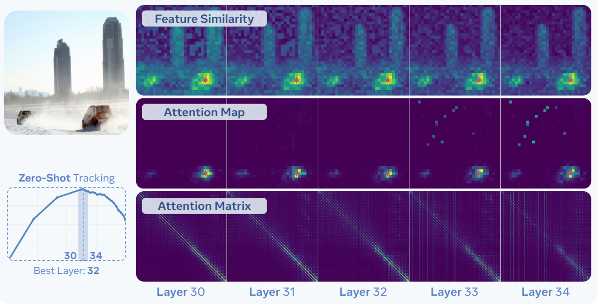

_图 14 $\mathsf{PE}_{\mathrm{core}}\mathsf{G}$ 特征分析。为了理解图 8 中观察到的空间任务最佳 $\mathsf{PE}_{\mathrm{core}}$ 特征之间的差异，我们分析了第 30 到 34 层之间特征的空间属性。_

在第 32 层之前，注意力图保持局部性。然而，这种情况在第 33 层发生了突变，此时图像背景中的几个 Token 变成了“全局” Token。正如完整注意力矩阵中的垂直线所示，从第 33 层开始，每个 Token 都关注它们。因此，第 33 层及以上的每一层都成为了全局信息解码器的一部分。

这并不是一种新现象。近期的工作 [23] 表明，这种现象发生在所有 L 规模以上的现代视觉 Transformer 中。但值得注意的是，这些“全局 Token”不一定是有害的。鉴于图 8 中大多数任务的最佳层位于全局 Token 区域内，它们聚合的信息对下游任务是有用的。然而，§3 中的跟踪是零样本的，纯粹依赖于空间对应关系，这意味着它无法利用全局 Token。这解释了为什么跟踪性能正好在全局 Token 引入之前达到峰值，而那些依赖语义理解或拥有能从中受益的大型解码器的任务，则在后面的层表现良好。

# 5.2 空间对齐方法

鉴于 §5.1 中的分析，我们在创建空间对齐方法时有两个目标：（1）我们必须保留模型在第 40 层附近达到峰值的最佳语义信息（包括全局 Token），（2）我们必须在强调局部对齐的同时，服务于具有浅层解码器的空间任务。第一个目标可以通过与模型自身的特征对齐（例如使用 MaskFeat [147]）轻松实现，但第二个目标更具挑战性。为了实现这一点，我们以一种新颖的方式使用了 Segment Anything Model (SAM) 2.1 [111]，以在 PE 中强制执行空间对应信息。

保留语义。为了保留来自 $\mathrm{PE}_{\mathrm{core}}$ 的强语义特征，我们使用自身作为教师模型来微调模型。具体来说，我们训练模型以最小化其最后一层与其初始化时冻结的第 41 层特征（即图 8 中许多任务峰值附近的层）之间的余弦相似度。单独来看这会是一种同义反复，因此我们对学生模型应用了重度正则化：类似于语言对齐的 DropPath [50] 和 LayerScale [135]，以及执行 $75\%$ 掩码的 MaskFeat [147]。我们保持教师模型

---

固定不变，这与所有其他采用 EMA 教师 [98, 138] 的最先进空间模型形成对比。这可能会有所帮助，但我们选择保持简单。

**鼓励局部性。** 虽然我们可以通过从第 32 层特征进行自蒸馏来“保留”局部性，但这可能效果较差，因为我们已经在蒸馏模型的另一层。相反，我们转向一种显式针对局部性调整的模型：SAM [58, 111]。值得注意的是，几项工作 [110, 116, 119] 表明，在从多个源进行蒸馏时，SAM 并不是一个有效的教师（尽管最近 [45] 表明通过一些技巧它会有所帮助）。然而，通过观察 SAM 2.1-L 的原始特征（图 15），主要问题可能与我们当前试图解决的问题相同：SAM 也有全局 Token！在这种情况下，

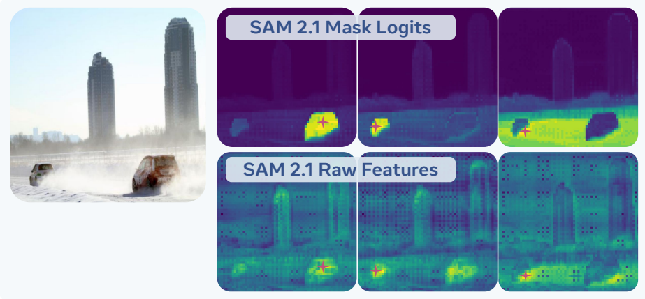

_图 15 SAM 2.1 特征相似性。SAM 2.1-L [111] 特征与我们提出的掩码 Logit 特征之间，粉色标记的 Token 与所有其他 Token 之间的余弦相似度。_

它们在图 15 的原始特征中表现为所有示例中网格状排列的暗点。

使用一个本身具有全局 Token 的模型的特征来减轻全局 Token 的影响，这充其量是值得怀疑的。但是，我们不必使用 SAM 的特征来学习局部性。从根本上说，SAM 是一个将点转换为选定对象的空间连续掩码的模型。如果我们想要的是平滑的、局部一致的特征，我们可以直接使用掩码预测本身。具体来说，我们使用排列成 $32 \times 32$ 网格的 1024 个点查询 SAM 2.1-L。对于每个点，SAM 返回一个图像大小的 $H \times W$ 掩码 Logit，通常会对它进行阈值处理和 NMS。然而，我们反而将这些 Logit 拼接成一个 $H \times W \times 1024$ 张量，并将其用作对齐的特征图。如图 15 所示，与底层特征空间相比，这显式地产生了局部性良好的对齐特征，并且没有由全局 Token 引起的空间伪影。

然后为了进行对齐，我们通过计算学生和教师的 Token 之间的成对余弦相似度（为每个 Token 创建一个 $ HW \times HW $ 矩阵）并使用 MSE 损失对齐它们，来蒸馏 Token 之间的空间对应关系。与 SAM 的底层特征空间（[45] 表明其对插值可能很脆弱）不同，掩码 Logit 特征对插值具有鲁棒性，因此我们简单地将它们下采样，并在 $ \mathrm{PE}_{\mathrm{core}} $ 模型原始的 448px 分辨率下进行训练。最后，像自蒸馏一样，我们添加了相同的掩码和正则化。对于这两个教师，我们将损失应用于所有 Token，并且除了 LayerScale 之外不添加额外参数。

**效果。** 同样，对齐的目标是提升核心模型已经学习到的强特征，如 §3 所示。因此，就像我们在 §4.1 中对语言对齐所做的那样，我们在图 16 中对空间任务进行了逐层冻结特征分析。这一次，我们评估原始的 $\mathrm{PE}_{\mathrm{core}}\mathrm{G}$ 检查点以及 $\mathrm{PE}_{\mathrm{core}}\mathrm{G}$ 对齐到其自身第 41 层、对齐到 SAM 2.1 掩码 Logit，最后是两者结合的情况。我们将对齐到两者表示为 $\mathrm{PE}_{\mathrm{spatial}}\mathrm{G}$。

纯粹基于原始模型第 41 层特征的对齐在检测、深度和语义分割上表现良好，但在零样本跟踪上表现不佳，而零样本跟踪需要精确的局部性来定义对象之间的边界。相比之下，对齐到 SAM 2.1 掩码 Logit 除了跟踪之外，降低了每个任务的最后一层性能，而在跟踪方面它显著提高了性能。可以理解，这是因为掩码 Logit 几乎没有语义（见图 17）。因此，最佳方法是结合两个教师。结果，$\mathrm{PE}_{\mathrm{spatial}}\mathrm{G}$ 不仅将所有任务的特征提升到了网络的末端，而且比单独自对齐有所改进。值得注意的是，$\mathrm{PE}_{\mathrm{spatial}}\mathrm{G}$ 的跟踪性能低于

SAM 对齐模型，但它仍然领先于其他方法，同时作为一个普遍良好的模型，参见 §5.3。

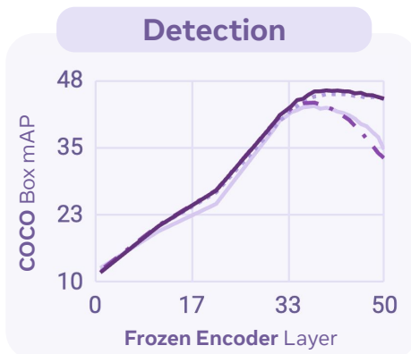

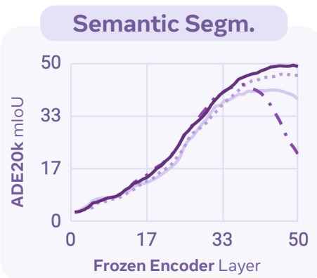

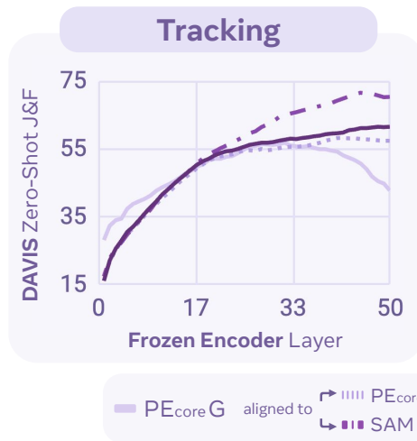

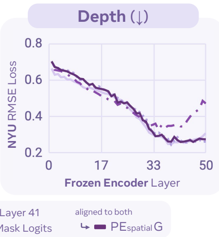

_图 16 空间对齐。我们分析了我们的两种空间对齐方法如何单独改变 $\mathrm{PE}_{\mathrm{core}}\mathrm{G}$ 的内部特征。然后我们结合这两种对齐方法来创建 $\mathrm{PE}_{\mathrm{spatial}}\mathrm{G}$（参见附录 B.3.1）。_

---

最后一层特征可视化。在图 17 中，我们展示了 $\mathrm{PE}_{\mathrm{core}}\mathrm{G}$ 和 3 个对齐模型的最后一层特征，其中相似的颜色表示相似的特征。在第一列中，我们看到了 $\mathrm{PE}_{\mathrm{core}}$ 最后一层性能如此之差的原因：虽然最后一层特征包含了关于显著对象的信息，但它们似乎失去了空间连贯性。对齐到模型自身的第 41 层特征解决了这个问题，但其空间质量仍然欠缺。相比之下，对齐到 SAM 2.1 mask logits 的模型具有局部清晰的特征，但缺乏语义（相似的对象具有不相似的特征，见第 1 行的猫和第 2 行的牛）。同时使用两个教师的 $\mathrm{PE}_{\mathrm{spatial}}$ 在产生高质量空间特征的同时，保留了 $\mathrm{PE}_{\mathrm{core}}$ 的语义。

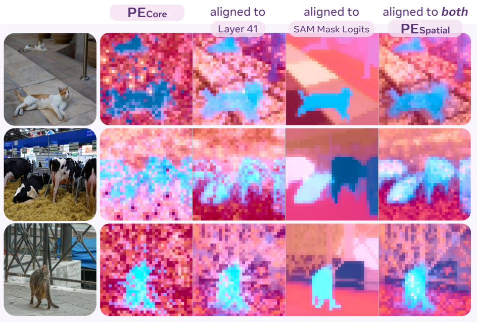

_图 17：图 16 中模型的最后一层可视化，使用 3 维 PCA 将特征映射到 LCh 颜色空间（见附录 B.3.2）。更多示例见附录 C.5。_

<table><tr><td rowspan="3">编码器</td><td rowspan="3">参数量</td><td rowspan="3">分辨率</td><td colspan="3">跟踪</td><td colspan="3">分割</td><td colspan="3">深度</td></tr><tr><td colspan="3">DAVIS (↑) [104]</td><td colspan="3">ADE20k (↑) [167]</td><td colspan="3">NYU (↓) [123]</td></tr><tr><td>最佳</td><td>最后</td><td>索引</td><td>最佳</td><td>最后</td><td>索引</td><td>最佳</td><td>最后</td><td>索引</td></tr><tr><td>OAI CLIP-L [106]</td><td>0.3B</td><td>224/14</td><td>39.4</td><td>37.1</td><td>17/24</td><td>39.4</td><td>38.3</td><td>19/24</td><td>.366</td><td>.397</td><td>19/24</td></tr><tr><td>AIMv2-3B [37]</td><td>2.7B</td><td>448/14</td><td>54.7</td><td>29.3</td><td>13/24</td><td>41.6</td><td>31.9</td><td>20/24</td><td>.311</td><td>.326</td><td>16/24</td></tr><tr><td>SigLIP-so [160]</td><td>0.4B</td><td>384/14</td><td>48.7</td><td>36.3</td><td>16/27</td><td>40.1</td><td>38.3</td><td>22/27</td><td>.339</td><td>.369</td><td>21/27</td></tr><tr><td>SigLIP2-so [138]</td><td>0.4B</td><td>512/16</td><td>51.4</td><td>45.3</td><td>15/27</td><td>44.0</td><td>42.9</td><td>24/27</td><td>.306</td><td>.329</td><td>25/27</td></tr><tr><td>SigLIP2-g-opt [138]</td><td>1.1B</td><td>384/16</td><td>43.5</td><td>38.8</td><td>32/40</td><td>42.1</td><td>41.3</td><td>34/40</td><td>.302</td><td>.324</td><td>34/40</td></tr><tr><td>DINOv2-L [98]</td><td>0.3B</td><td>448/14</td><td>58.7</td><td>58.2</td><td>23/24</td><td>47.3</td><td>47.3</td><td>24/24</td><td>.297</td><td>.308</td><td>23/24</td></tr><tr><td>DINOv2-g [98]</td><td>1.1B</td><td>448/14</td><td>58.5</td><td>58.5</td><td>40/40</td><td>48.7</td><td>48.4</td><td>37/40</td><td>.279</td><td>.290</td><td>27/40</td></tr><tr><td>PEcoreG</td><td>1.9B</td><td>448/14</td><td>56.8</td><td>42.8</td><td>32/50</td><td>41.5</td><td>38.6</td><td>44/50</td><td>.249</td><td>.309</td><td>39/50</td></tr><tr><td>PEspatialG</td><td>1.9B</td><td>448/14</td><td>61.5</td><td>61.5</td><td>50/50</td><td>49.3</td><td>48.9</td><td>49/50</td><td>.262</td><td>.275</td><td>46/50</td></tr></table>

_表 13：冻结特征密集预测，包括零样本跟踪、语义分割和深度估计。我们报告了最佳层和最后一层的性能，以及每个模型表现最佳的层。实验设置见附录 B.3.3。_

<table><tr><td rowspan="2">编码器</td><td rowspan="2">参数量</td><td rowspan="2">预训练分辨率</td><td colspan="2">LVIS [41]</td><td colspan="2">COCO [76]</td></tr><tr><td>APbox</td><td>APmask</td><td>APbox</td><td>APmask</td></tr><tr><td>OAI CLIP-L [106]</td><td>0.3B</td><td>224/14</td><td>45.0</td><td>41.9</td><td>54.0</td><td>47.5</td></tr><tr><td>MetaCLIP-G [152]</td><td>1.8B</td><td>224/14</td><td>45.1</td><td>41.9</td><td>53.2</td><td>46.7</td></tr><tr><td>SigLIP-so [160]</td><td>0.4B</td><td>224/14</td><td>45.0</td><td>41.9</td><td>54.4</td><td>47.6</td></tr><tr><td>MAE-L [44]</td><td>0.3B</td><td>224/14</td><td>46.1</td><td>43.9</td><td>55.6</td><td>49.3</td></tr><tr><td>EVA02-L [35]</td><td>0.3B</td><td>224/14</td><td>49.3</td><td>45.2</td><td>54.9</td><td>48.2</td></tr><tr><td>SigLIP2-so [138]</td><td>0.4B</td><td>512/16</td><td>49.3</td><td>45.6</td><td>56.0</td><td>49.4</td></tr><tr><td>SigLIP2-g-opt [138]</td><td>1.1B</td><td>384/16</td><td>52.9</td><td>48.5</td><td>57.1</td><td>50.2</td></tr><tr><td>DINOv2-L [98]</td><td>0.3B</td><td>518/14</td><td>46.7</td><td>43.5</td><td>55.7</td><td>49.0</td></tr><tr><td>DINOv2-g [98]</td><td>1.1B</td><td>518/14</td><td>51.5</td><td>47.3</td><td>57.2</td><td>50.0</td></tr><tr><td>PEcoreG</td><td>1.9B</td><td>448/14</td><td>51.9</td><td>47.9</td><td>57.0</td><td>49.8</td></tr><tr><td>PEspatialG</td><td>1.9B</td><td>448/14</td><td>54.2</td><td>49.3</td><td>57.8</td><td>50.3</td></tr></table>

_表 14：使用 Mask R-CNN [43] 和 VitDet [72] 在受控设置下进行端到端微调的检测与分割。详情见附录 B.3.4。_

# 5.3 与现有视觉编码器的比较

冻结特征密集预测。在表 13 中，我们比较了不同视觉编码器的冻结特征在三个密集预测任务上的表现：遵循 [52, 107] 无训练设置的 DAVIS 跟踪 [104] (J&F)、ADE20k 语义分割 [167] (mIoU) 线性探测，以及使用 DPT 头 [109] 的 NYU 深度估计 [123] (RMSE)。对于每个模型，我们报告了其最佳层和最后一层的性能。总体而言，$\mathrm{PE}_{\mathrm{spatial}}$ 的表现优于其他最先进的空间模型，其最佳特征与最后一层的对齐程度远高于其起始模型 $\mathrm{PE}_{\mathrm{core}}$。值得注意的是，SigLIP2 在预训练期间结合了空间、字幕生成和对比损失 [138]，但相比之下，其最后一层的对齐程度并不好。

端到端微调检测与分割。在表 14 中，我们以 COCO [76] 和 LVIS [41] 为基准，在标准的全量微调 ViTDet [72] Mask-RCNN [43] 设置下，将 $\mathrm{PE}_{\mathrm{core}}$ 和 $\mathrm{PE}_{\mathrm{spatial}}$ 与其他流行的视觉编码器进行了比较。在这个受控实验中，$\mathrm{PE}_{\mathrm{spatial}}$ 在各种视觉主干中达到了最先进的水平。这一点意义重大，因为对比编码器（尤其是像 MetaCLIP-G [152] 这样的大型模型）通常在检测任务上表现很差，而较小的模型往往表现更好。通常情况下，只有使用空间预训练或大量检测数据 [98] 将编码器直接与下游任务对齐时，编码器才能在检测任务上实现性能扩展。相比之下，$\mathrm{PE}_{\mathrm{spatial}}$ 在对齐过程中未使用任何检测数据，使其具有通用性。

系统级检测。在表 15 中，我们提供了与 COCO 检测任务中绝对最先进水平的系统级端到端微调比较。仅使用 Object365 [120] 作为额外的检测数据，$\mathrm{PE}_{\mathrm{spatial}}$ 就能匹配那些针对检测进行了调整的更复杂模型的性能，且仅使用了简单的 DETR 风格解码器 [12, 99]。$\mathrm{PE}_{\mathrm{spatial}}$ 标志着第一个实现这一目标的通用对比预训练模型。

<table><tr><td>编码器</td><td>参数量</td><td>检测器</td><td>COCO APbox</td></tr><tr><td>SwinV2-G [80]</td><td>3.0B</td><td>HTC++ [14]</td><td>62.5</td></tr><tr><td>Swin-L [79]</td><td>0.3B</td><td>DINO [161]</td><td>63.2</td></tr><tr><td>EVA02-L [35]</td><td>0.3B</td><td>Cascade [11]</td><td>64.1</td></tr><tr><td>InternImage-G [145]</td><td>3.0B</td><td>DINO [161]</td><td>65.3</td></tr><tr><td>EVA02-L [35]</td><td>0.3B</td><td>CoDETR [169]</td><td>65.9</td></tr><tr><td>PEspatialG</td><td>1.9B</td><td>DETA [99]</td><td>66.0</td></tr></table>

_表 15：检测任务的系统级比较。与 COCO [76] val2017 上的领先结果进行比较。训练方案见附录 B.3.5。_

---

---

# 6 相关工作

学习视觉-语义表示长期以来一直是开发感知基础模型的主流方法。通过将视觉和文本表示对齐，这些模型不仅在零样本图像分类和图像-文本检索 [51, 106, 117]、开放词汇检测 [63, 94, 95] 和分割 [22, 28] 等视觉任务中表现出色，而且还作为多模态大语言模型 的基础 [3, 5, 78, 93, 101, 134]。

**对比语言-图像预训练。** Virtex [27]、ICMLM [115] 和 ConVIRT [163] 的早期工作开发了通过视觉和语言模态之间的对比目标进行学习的技术。随后，CLIP [51, 106] 和 ALIGN [54] 等视觉编码器将这些技术扩展到了更大的数据集和模型规模，普及了视觉-语言对比学习。一系列开源权重的对比模型被开发出来，以提高 CLIP 的性能和鲁棒性 [33, 71, 117, 129, 152, 160]。例如，SigLIP [160] 在对比学习中用 sigmoid 函数替换了传统的 softmax，而 FLIP [74] 则采用掩码技术来加速训练过程。我们也投身于这一努力，构建了一个最先进的开源感知编码器 (PE) (§2.1)。其他已被证明对构建视觉编码器有用的目标还包括字幕生成损失，它学习使用语言模型解码器预测图像描述，并且能很好地迁移到下游的多模态语言建模任务 [37, 137]。许多工作现在正试图结合两个或更多的目标，通过多目标预训练 [37, 158] 或顺序训练 [19, 66] 来解决不同的下游任务。

**高效训练。** 人们已经探索了 CLIP 模型高效训练的各个方面。BASIC [102] 和 LAION [117] 探索了将批量大小扩展到 160K，并展示了大批量大小在训练过程中的益处。EVA-CLIP [130] 使用 LAMB 优化器 [156] 进行 CLIP 模型的大批量训练。旋转位置嵌入 (RoPE) [127] 已在大语言模型中成功采用。在视觉 Transformer 中，[2, 48] 采用了 2D 旋转位置嵌入。在数据引擎方面，一系列工作专注于通过高效的数据整理 [33, 39, 117, 152] 进行大规模数据获取和过滤，并探索使用 MLLM 或 VLM 重新标注训练图像 [32, 64, 96, 151]。我们将这些概念扩展到构建视频数据引擎，并将我们的模型扩展为一个能同时处理图像和视频的强大模型 ($\S 2.2$)。

**网络内部的最佳嵌入层。** 通常，大多数视觉编码器依赖于最后一层来提取其训练任务的特征。然而，当在代理任务或自监督任务上训练时，最后一层通常不是其他任务的理想选择 [8, 15, 16, 30, 85, 107, 121, 128, 142, 159, 166]。例如，当使用图像着色作为预训练目标时，[162, 166] 表明中间层在图像分类方面比最后一层更好。随后，在 iGPT [15] 中，当针对下一个 token 预测进行训练时，中间层在图像分类上表现更好。AIMv1 [30] 也展示了基于图像的下一个 token 预测在使用 patch 归一化 MSE 损失时的类似行为。Toto [107] 表明这可以扩展到视频中的下一个 token 预测，并且中间层最适合图像分类、视频分类、跟踪和机器人技术。REPA [159] 在图像生成模型中展示了这种行为，其中 SiT [85] 的中间层比更早或更晚的层具有更好的线性探测准确率。在 CLIP 模型中，CLIPer [128] 发现 CLIP 的早期层具有良好的空间理解能力。与这些工作线相反，在本文中，我们首先展示了这种行为不限于某一类编码器。具体而言，我们展示了这种行为存在于空间自监督模型 [98]、生成式字幕模型 [37] 以及我们自己的 PE 中。然后，我们深入研究了 PE 编码器的这种行为，并表明 CLIP 训练有可能在中间层产生丰富的空间和语义特征 (§3)。

**对齐微调。** 我们探索了针对语言 (§4) 和空间理解 (§5) 的对齐微调。对于语言对齐，我们专注于适应多模态大语言模型 (MLLMs)；对于空间对齐，我们结合教师模型采用模型自身特征的自蒸馏来保持局部性。在 MLLM 文献中，中期训练——即利用大规模多模态数据的中间训练阶段——已被积极研究。LLaVA-OneVision [66]、InternVL 系列 [18, 19]、QwenVL 系列 [3, 144] 和其他几个领先的 MLLM [82, 132] 采用了这种范式。我们的 $\mathrm{PE}_{\mathrm{lang}}$ 可以被视为中期训练的一种变体，但在原则上有一个关键区别：我们的目标不是构建最好的 MLLM，而是使视觉编码器最通用。在 §4 中，我们跨越不同的语言模型、输入分辨率，在图像和视频的各种任务上对我们的 $\mathrm{PE}_{\mathrm{lang}}$ 进行了基准测试，以展示这种通用性。对于空间任务，我们利用隐藏嵌入

---

在中间层。最近，几项工作展示了通过余弦相似度进行表征对齐来蒸馏教师模型的有效性。REPA [159] 蒸馏了用于图像扩散模型的 DINO 早期层特征，RADIO [110] 使用了多教师蒸馏（DINO、CLIP 和 SAM）。其核心思想是借鉴预训练视觉编码器的语义理解（例如 CLIP）和空间理解（例如 SAM、DINO）。在我们的 $\mathrm{PE}_{\mathrm{spatial}}$ 中，我们利用 $\mathrm{PE}_{\mathrm{core}}$ 的中间特征来获取语义信息，并提出了一种使用 SAM 进行空间理解的新方法。

# 7 结论

我们提出了感知编码器，这是一系列同类最佳的基础模型，包括 $\mathrm{PE}_{\mathrm{core}}$、$\mathrm{PE}_{\mathrm{lang}}$ 和 $\mathrm{PE}_{\mathrm{spatial}}$。我们表明，$\mathrm{PE}_{\mathrm{core}}$ 可以超越使用 WebLI 和 JFT-3B 训练的模型，后者曾是零样本图像识别领域无可争议的领先者，同时 $\mathrm{PE}_{\mathrm{core}}$ 在零样本视频识别方面也表现出色。我们证明了 $\mathrm{PE}_{\mathrm{lang}}$ 可用于构建多模态语言模型 [21]，该模型在性能方面处于领域前沿。我们确立了 $\mathrm{PE}_{\mathrm{spatial}}$ 可以凭借显著简化的解码器，与长期占据主导地位的最先进（SOTA）目标检测模型相媲美。综上所述，一个结论非常清晰：感知编码器释放了将简单的对比式视觉-语言预训练扩展以解决广泛下游视觉任务的潜力。

其他贡献者与致谢。我们要感谢 Abhimanyu Dubey、Adel Ahmadyan、Andrew Westbury、Arkabandhu Chowdhury、Azita Shokrpour、Babak Damavandi、Chay Ryali、Cyprien de Lichy、Didac Suris Coll-Vinent、Dong Wang、Filip Radenovic、George Orlin、Han Zou、Harry Tran、Jitendra Malik、Joelle Pineau、Joseph Greer、Kavya Srinet、Kirmani Ahmed、Laura Gustafson、Lu Zhang、Muhammad Maaz、Natalia Neverova、Nicolas Carion、Oleksandr Maksymets、Ramya Raghavendra、Romy Luo、Ronghang Hu、Sam Doud、Sasha Mitts、Sean Bell、Shane Moon、Shuming Hu、Soerian Lieve、Stephane Kasriel、Valentin Gabeur、Vanessa Stark、Vignesh Ramanathan、Vivian Lee、Xuan Hu、Yang Li 和 Ziyang Wang 对本项目的贡献与支持。同时感谢您，亲爱的读者，阅读至此。

---

# 视频数据引擎

# A.1 视频字幕

# LLM 总结提示词

# LLM 总结提示词 72 tokens

使用提供的元数据、视频字幕和帧字幕创建一个简洁的视频字幕。

任务：从字幕中提取关键信息，并将其组合成替代文本格式，使用包含所有相关细节的单个短语或一组短语。

遵循步骤：

1. 审查元数据（标题和描述）以获取总体上下文，您可以依赖它来获取实体名称，但不要将其作为字幕的主要信息来源。

2 . 将标题/描述与视频字幕和帧字幕融合，以形成主要故事线。

3. 提取最相关和简洁的信息。

4. 将提取的信息组合成替代文本格式，使用短语或一组短语，长度约为 120 tokens，将逗号等特殊字符计入 token 数量。

5. 优先包含所有关键信息，而非句子结构或语法。

6. 尽量减少特殊字符的使用，并专注于关键信息。

避免事项：

- 避免添加或推断原始元数据和字幕中未包含的信息。

- 避免使用复杂的句子结构或优先考虑句子流畅性。

根据元数据、视频字幕和帧字幕创建一个简洁的视频字幕。

# A.2 PE 视频数据集详情

PE Video 是我们从授权数据源收集并整理的数据集。这些视频是高分辨率、高质量的，侧重于运动。视频总数为 100 万（1M）。其中，12 万（120K）个视频具有人工精炼的视频字幕，我们从这 12 万个视频中选择了 1.5 万（15K）个作为基准。

# A.2.1 视频数据过滤管道

视频过滤的目标是识别包含物体运动、摄像机运动、物体间交互、人类动作、动作序列以及物体操作等运动的视频，同时拒绝静态场景（如风景）或人工合成或经过大量编辑的视频。

为了实现这一点，我们创建了一个包含以下步骤的视频过滤管道：

步骤 1：计算运动特征。对于每个视频，我们使用 OpenCV [10] 等现成工具，从视频帧中计算一系列特征，包括每秒帧数、帧数、I 帧数量、运动向量幅度和运动向量方差。

步骤 2：提取视频帧特征。对于每个视频，我们均匀采样三个帧，并使用 DINOv2 模型 [98] 和 SigLIP 模型 [160] 对其进行编码。

步骤 3：LLM 特征。对于每个视频，我们还运行多模态大语言模型（LLM），如 LlamaOnevision QwenLM 2 0.5B [66]，以提取 MLLM 特征。我们编制了包含 26 个问题的列表，并对视频执行了 MLLM 推理。问题可在 §A.2.2 中找到。

步骤 4：视频质量评分。我们将迄今为止收集的所有特征结合起来，使用随机森林模型预测 0 到 5 之间的分数。为了训练该模型，我们手动标注了约 1,000 个视频，分数范围为 0 到 5。低分表示视频几乎是静态的，几乎可以用单帧来概括，而高分表示视频中有多个时间事件，需要几帧才能准确描述。我们使用这些标注的视频作为训练数据，来拟合随机森林模型以进行视频质量评分预测。

步骤 5：我们对视频应用 k-means 聚类，并在每个聚类内对它们进行排名。通过从每个聚类中选择排名靠前的视频，我们有效地减少了最终数据集中重复视频的数量。

---

---

# A.2.2 LLM 特征提取

# LLM 特征提取问题列表

拍摄该场景的摄像机是静止的吗？请回复是或否。

拍摄该场景的摄像机在移动吗？请回复是或否。

该视频拍摄的是风景吗？请回复是或否。

该视频拍摄的是静态场景吗？请回复是或否。

该场景是远距离拍摄的吗？请回复是或否。

该视频是用无人机拍摄的吗？请回复是或否。

该视频是计算机生成的吗？请回复是或否。

该视频内容是抽象的吗？请回复是或否。

场景中是否有物体在移动？请回复是或否。

视频中是否有人在做某事？请回复是或否。

视频中有多个物体在移动吗？请回复是或否。

是否有物体正在被操作（被操控）？请回复是或否。

视频中有动物吗？请回复是或否。

场景大部分是静止的吗？请回复是或否。

在此视频中，物体之间是否存在遮挡？请回复是或否。

除了水印之外，是否有东西遮挡了视线？请回复是或否。

视频中的物体数量多吗？请回复是或否。

视频中有超过 5 个不同的物体吗？请回复是或否。

是否因为某些实体移动幅度过大而难以追踪？请回复是或否。

是否有人正在看手机、平板电脑或计算机屏幕？请回复是或否。

他们在整个视频过程中都在看手机、平板电脑或计算机屏幕吗？请回复是或否。

此视频中有多个移动的人吗？请回复是或否。

此视频中有多个移动的动物吗？请回复是或否。

此视频中有多个物体吗？请回复是或否。

视频中有多个外观相似的物体吗？请回复是或否。

它们看起来相似吗？请回复是或否。

我们使用 LLaVA-OneVision [78] 模型从视频中提取 LLM 特征。对于每个视频，我们使用 26 个不同的问题进行提示，以提取从“该视频是否为风景视频？”到“视频中是否有移动物体？”等特征。随后，随机森林模型利用这些特征来确定视频质量分数。

# A.2.3 PVD 基准分布

<table><tr><td>类别</td><td>视频数量</td><td>平均字幕长度</td></tr><tr><td>手部动作</td><td>2143</td><td>54.2</td></tr><tr><td>物体交互</td><td>1864</td><td>42.6</td></tr><tr><td>食物制作</td><td>1691</td><td>56.8</td></tr><tr><td>工作活动</td><td>1689</td><td>47.8</td></tr><tr><td>户外场景</td><td>1558</td><td>50.7</td></tr><tr><td>动物</td><td>1423</td><td>50.9</td></tr><tr><td>水域场景</td><td>1337</td><td>44.6</td></tr><tr><td>物体操作</td><td>1307</td><td>51.6</td></tr><tr><td>特写镜头</td><td>1122</td><td>45.1</td></tr><tr><td>自然场景</td><td>866</td><td>38.4</td></tr></table>

_表 16 PVD 基准统计。我们创建了一个包含 15K 视频的数据集，并附有人工验证的字幕。这些视频以运动为中心，涵盖了第一人称和第三人称视角，场景覆盖范围广泛。_

---

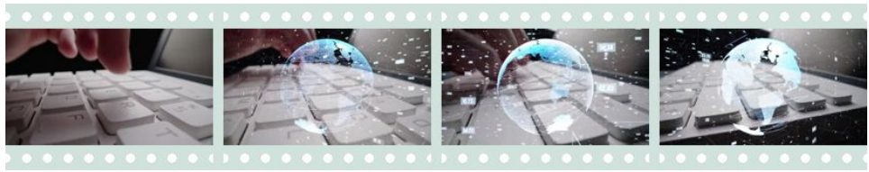

_类别：手部动作_

说明：视频捕捉了一个人在键盘上打字的特写镜头。摄像机从键盘左侧移动到右侧，画面中可以看到旋转的地球动画和一些数字，随后视频结束。

_类别：物体交互_

说明：视频显示了一个正在旋转的黑白螺旋。该螺旋由均匀间隔且对称的黑白条纹组成。

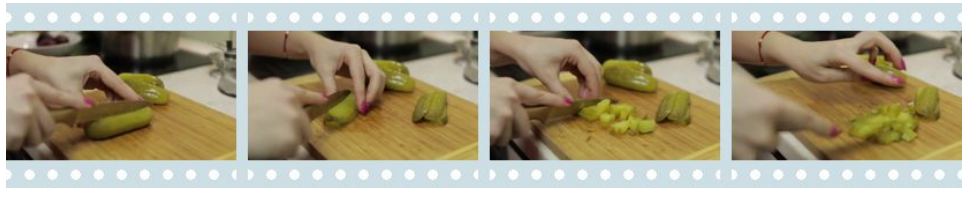

_类别：食物制备_

说明：视频显示一个人正在将一个绿色的物品切成小块。他们使用刀将腌菜切成薄片，然后将其剁成更小的丁。这个人正在木质砧板上操作，双手从画面左侧可见，指甲上涂着粉色指甲油。

_类别：工作活动_

说明：视频显示一个人正在使用铲子清理壁炉里的灰烬。他们正在铲起灰烬并将其从壁炉中移出。

_类别：户外场景_

说明：视频显示田野中间一座高耸的尖顶结构。该结构被树木和其他植被环绕。田野被划分成几个区域，有些区域覆盖着绿草，另一些区域覆盖着白色材料。视频从远处展示了该结构和田野，摄像机围绕其移动。

_类别：动物_

说明：视频显示一只灰白色的成年猫和两只小猫。成年猫正在用舌头舔舐离它最近的小猫进行梳理，小猫正在四处张望。一只手从画面左上角伸入，抚摸这两只小猫。

_类别：水域场景_

说明：视频显示一大群鱼在水体中向画面右侧游动。摄像机也稍微向右平移。

_类别：物体操作_

说明：视频显示一个人将一碗东西放入烤箱。然后这个人关上了烤箱门。背景是模糊的。

_类别：特写镜头_

说明：视频显示一个白色的台面，上面放有两个棕色桶和一个黄色桶。然后一只戴着绿色手套的右手从画面右上侧进入，将一朵黄花放在黄色喷壶附近。随后这个人将花放在桶的前方，并离开画面。背景是棕色的墙壁，整个片段中摄像机保持静止。

_类别：自然场景_

说明：视频显示田野中一堆正在燃烧的树枝和树叶。火势很旺，火焰舔舐着柴堆的边缘。火灾产生的烟雾升入空中，翻滚着涌向天空。

_图 18 更多 PE 视频数据集示例。对于十个类别中的每一个，我们随机选取一个视频并展示其视频说明。这些说明由我们的视频数据管道生成，并经人工标注员精炼。_

---

---

# B 实现细节

# B.1 PE 核心模块

我们提供了构建 $\mathrm{PE}_{\mathrm{core}}$ 的额外实现细节。我们的实现基于 OpenCLIP5。

# B.1.1 架构与训练设置

**模型架构。** 遵循 CLIP，$\mathrm{PE}_{\mathrm{core}}$ 包含一个基于 Transformer [141] 的视觉编码器和一个文本编码器。我们采用了定制的 Transformer 配置，详情见表 17。在池化方面，我们采用了一个类似 SigLIP [160] 风格的注意力池化模块，使用 8 个头从最后一层特征构建图像和视频嵌入。关于位置嵌入，我们使用 2D RoPE [127] 作为相对位置嵌入，并使用与模型输入分辨率相同大小的 2D 可学习绝对位置嵌入。我们对位置嵌入进行插值，以支持超出默认值的各种分辨率。对于 G 规模模型，文本上下文长度为 72；对于 B 和 L 规模模型，长度为 32。最初这是一个 Bug，但我们发现在使用注意力池化处理较小模型时，不禁用类别 token 是最优的。因此，B 和 L 模型使用类别 token，然后注意力池化层会一次性探测所有特征（包括类别 token）。最后，为简单起见，我们使用的输入均值和标准差为 $(0.5,0.5,0.5)$。

<table><tr><td>规模</td><td>塔</td><td>参数量</td><td>宽度</td><td>深度</td><td>MLP</td><td>头数</td><td>CLIP 维度</td><td>池化</td><td>位置嵌入</td><td>分辨率 &amp; 上下文长度</td><td>补丁大小</td><td>类别 token 寄存器</td></tr><tr><td rowspan="2">B</td><td>视觉</td><td>0.09B</td><td>768</td><td>12</td><td>3072</td><td>12</td><td rowspan="2">1024</td><td>Attn Pool</td><td>RoPE+Abs</td><td>224</td><td>16</td><td>✓</td></tr><tr><td>文本</td><td>0.31B</td><td>1024</td><td>24</td><td>4096</td><td>16</td><td>EOS Token</td><td>Abs</td><td>32</td><td>-</td><td>-</td></tr><tr><td rowspan="2">L</td><td>视觉</td><td>0.32B</td><td>1024</td><td>24</td><td>4096</td><td>16</td><td rowspan="2">1024</td><td>Attn Pool</td><td>RoPE+Abs</td><td>336</td><td>14</td><td>✓</td></tr><tr><td>文本</td><td>0.31B</td><td>1024</td><td>24</td><td>4096</td><td>16</td><td>EOS Token</td><td>Abs</td><td>32</td><td>-</td><td>-</td></tr><tr><td rowspan="2">G</td><td>视觉</td><td>1.88B</td><td>1536</td><td>50</td><td>8960</td><td>16</td><td rowspan="2">1280</td><td>Attn Pool</td><td>RoPE+Abs</td><td>448</td><td>14</td><td>X</td></tr><tr><td>文本</td><td>0.47B</td><td>1280</td><td>24</td><td>5120</td><td>20</td><td>EOS Token</td><td>Abs</td><td>72</td><td>-</td><td>-</td></tr></table>

_表 17：包含完整细节的 PE 模型配置。_

**PE 核心模块训练。** 正如 §2.4 中所讨论的，$\mathrm{PE}_{\mathrm{core}}$ 的训练涉及三个阶段：1) 图像预训练；2) 图像和视频微调；以及 3) 针对较小模型的额外模型蒸馏。这三个阶段协同工作，以开发一个鲁棒且有效的 $\mathrm{PE}_{\mathrm{core}}$ 模型。

我们首先提供 1) 表 18 中的图像预训练和 2) 表 19 中的视频微调的训练配方。

<table><tr><td>配置</td><td>数值</td></tr><tr><td>优化器</td><td>LAMB</td></tr><tr><td>β1, β2</td><td>(0.9, 0.95)</td></tr><tr><td>权重衰减</td><td>0.05</td></tr><tr><td>学习率</td><td>2e-3</td></tr><tr><td>批大小</td><td>131,072</td></tr><tr><td>预热步数</td><td>2K</td></tr><tr><td>训练步数</td><td>443K (B, L) / 656K (G)</td></tr><tr><td>数据量</td><td>5.4B</td></tr><tr><td>样本数</td><td>58B (B, L) / 86B (G)</td></tr><tr><td>最大 logit 缩放</td><td>100</td></tr><tr><td>掩码正则化比率</td><td>0.4</td></tr><tr><td>掩码正则化批次</td><td>8192</td></tr><tr><td rowspan="3">渐进式分辨率</td><td>112-160-224 (B)</td></tr><tr><td>98-154-224-336 (L)</td></tr><tr><td>98-154-224-336-448 (G)</td></tr><tr><td rowspan="4">数据增强</td><td>长宽比抖动 ar(0.75,1.33)</td></tr><tr><td>随机裁剪 s(0.08,1)</td></tr><tr><td>颜色抖动 j(0.32,0,0.32,0)</td></tr><tr><td>水平翻转 p(0.5)</td></tr></table>

<table><tr><td>配置</td><td>数值</td></tr><tr><td>优化器</td><td>LAMB</td></tr><tr><td>β1, β2</td><td>(0.9, 0.95)</td></tr><tr><td>权重衰减</td><td>0.05</td></tr><tr><td>学习率</td><td>1e-6</td></tr><tr><td>批大小</td><td>4096</td></tr><tr><td>预热步数</td><td>2K</td></tr><tr><td>训练步数</td><td>5.4K</td></tr><tr><td>数据量</td><td>22M</td></tr><tr><td>样本数</td><td>22M</td></tr><tr><td>最大 logit 缩放</td><td>100</td></tr><tr><td>帧数</td><td>8</td></tr><tr><td rowspan="4">数据增强</td><td>长宽比抖动 ar(0.75,1.33)</td></tr><tr><td>随机裁剪 s(0.08,1)</td></tr><tr><td>颜色抖动 j(0.32,0,0.32,0)</td></tr><tr><td>水平翻转 p(0.5)</td></tr></table>

<table><tr><td>配置</td><td>数值</td></tr><tr><td>优化器</td><td>LAMB</td></tr><tr><td>β1, β2</td><td>(0.9, 0.95)</td></tr><tr><td>权重衰减</td><td>0.05</td></tr><tr><td>学习率</td><td>1e-6</td></tr><tr><td>批大小</td><td>16384</td></tr><tr><td>预热步数</td><td>2K</td></tr><tr><td>训练步数</td><td>269K</td></tr><tr><td>数据量</td><td>5.4B</td></tr><tr><td>样本数</td><td>4.4B</td></tr><tr><td>最大 logit 缩放</td><td>100</td></tr><tr><td>教师 logit 缩放</td><td>200 (§C.3)</td></tr><tr><td>数据增强</td><td>无</td></tr></table>

_表 20：蒸馏。_

_表 19：视频微调。_

_表 18：图像预训练。_

在训练完最大的 G 规模模型后，我们使用图像预训练训练较小的模型，然后使用表 20 中的图像蒸馏进行蒸馏，最后在末尾应用视频微调。

5https://github.com/mlfoundations/open Clip

---

# B.1.2 零样本分类与检索

图像和视频的零样本评估。我们使用 CLIPBench6 进行零样本分类和检索基准测试。基准数据集及其划分来源于原始数据集网站或 HuggingFace。我们将 CLIPBench 的零样本评估扩展到了包括 MSR-VTT 和 Kinetics 在内的视频数据集，并将发布我们的模型检查点、评估代码和脚本以确保可复现性。

提示词设计。对于零样本图像-文本和视频-文本检索，我们仅依赖原始标题，不使用任何额外的提示词。相反，对于零样本分类，我们使用了由 InternVL [19] 作者慷慨提供的特定任务提示词。所有额外的提示词都将被发布。

例如，我们在各种 ImageNet 基准（例如 ImageNet val, ImageNet v2）上的零样本图像分类以及 Kinetics 数据集（例如 K400, K600, K700）上的视频分类中使用了特定的提示词。

# 零样本图像分类提示词 - ImageNet

一张糟糕的 $\{c\}$ 照片。一张包含许多 $\{c\}$ 的照片。一座 $\{c\}$ 的雕塑。一张难以看清的 $\{c\}$ 照片。一张低分辨率的 $\{c\}$ 照片。一张 $\{c\}$ 的渲染图。一幅 $\{c\}$ 的涂鸦。一张糟糕的 $\{c\}$ 照片。一张裁剪过的 $\{c\}$ 照片。一个 $\{c\}$ 的纹身。刺绣的 $\{c\}$。一张难以看清的 $\{c\}$ 照片。一张明亮的 $\{c\}$ 照片。一张干净的 $\{c\}$ 照片。一张脏兮兮的 $\{c\}$ 照片。一张昏暗的 $\{c\}$ 照片。一幅 $\{c\}$ 的素描。一张我的 $\{c\}$ 照片。塑料 $\{c\}$。一张很酷的 $\{c\}$ 照片。一张 $\{c\}$ 的特写照片。一张 $\{c\}$ 的黑白照片。一幅 $\{c\}$ 的画作。一幅 $\{c\}$ 的画作。一张像素化的 $\{c\}$ 照片。一座 $\{c\}$ 的雕塑。一张明亮的 $\{c\}$ 照片。一张裁剪过的 $\{c\}$ 照片。塑料 $\{c\}$。一张脏兮兮的 $\{c\}$ 照片。一张 JPEG 损坏的 $\{c\}$ 照片。一张模糊的 $\{c\}$ 照片。一张 $\{c\}$ 的照片。一张很好的 $\{c\}$ 照片。一张 $\{c\}$ 的渲染图。视频游戏中的 $\{c\}$。一张单个 $\{c\}$ 的照片。一幅 $\{c\}$ 的涂鸦。一张 $\{c\}$ 的特写照片。一张 $\{c\}$ 的照片。折纸 $\{c\}$。视频游戏中的 $\{c\}$。一幅 $\{c\}$ 的草图。一幅 $\{c\}$ 的涂鸦。折纸 $\{c\}$。一张低分辨率的 $\{c\}$ 照片。玩具 $\{c\}$。一张 $\{c\}$ 的演绎图。一张干净的 $\{c\}$ 照片。一张巨大的 $\{c\}$ 照片。一张 $\{c\}$ 的演绎图。一张漂亮的 $\{c\}$ 照片。一张怪异的 $\{c\}$ 照片。一张模糊的 $\{c\}$ 照片。卡通 $\{c\}$。$\{c\}$ 的艺术画。一幅 $\{c\}$ 的草图。刺绣的 $\{c\}$。一张像素化的 $\{c\}$ 照片。$\{c\}$ 的 itap（即时艺术摄影）。一张 JPEG 损坏的 $\{c\}$ 照片。一张很好的 $\{c\}$ 照片。毛绒玩具 $\{c\}$。一张漂亮的 $\{c\}$ 照片。一张微小的 $\{c\}$ 照片。一张怪异的 $\{c\}$ 照片。卡通 $\{c\}$。$\{c\}$ 的艺术画。一幅 $\{c\}$ 的素描。一张巨大的 $\{c\}$ 照片。一张 $\{c\}$ 的黑白照片。毛绒玩具 $\{c\}$。一张昏暗的 $\{c\}$ 照片。$\{c\}$ 的 itap。$\{c\}$ 的涂鸦。玩具 $\{c\}$。我的 $\{c\}$ 的 itap。一张很酷的 $\{c\}$ 照片。一张微小的 $\{c\}$ 照片。一个 $\{c\}$ 的纹身。

# 零样本视频分类提示词 - Kinetics

一张 {c} 的照片。一张正在 {c} 的人的照片。一张正在使用 {c} 的人的照片。一张正在做 {c} 的人的照片。一张在 {c} 期间的人的照片。一张正在表演 {c} 的人的照片。一张正在练习 {c} 的人的照片。一段 {c} 的视频。一段在 {c} 期间的人的视频。一段正在表演 {c} 的人的视频。一段正在练习 {c} 的人的视频。一个 {c} 的示例。一个正在 {c} 的人的示例。一个正在使用 {c} 的人的示例。一个正在做 {c} 的人的示例。一个在 {c} 期间的人的示例。一个正在表演 {c} 的人的示例。一个正在练习 {c} 的人的示例。一个 {c} 的演示。一个正在 {c} 的人的演示。一个正在使用 {c} 的人的演示。一个正在做 {c} 的人的演示。一个正在练习 {c} 的人的演示。

评估方法。在评估零样本性能时，一些工作针对不同的数据集使用了不同的输入变换（例如 [33, 130, 138, 160]）。为了尽可能公平，我们遵循 [130] 的方法，使用两种变换——中心裁剪和非保留纵横比的重置大小（“压扁”）——进行评估，并报告我们评估的所有模型和所有数据集在这两者之间的最大值。此外，ObjectNet 的每张图像周围都有一个红色边框以便于去重，我们在评估前将其移除。最后，我们遵循 [19] 的方法，使用检索重加权（DSL），将 softmax 分数分布应用于用于检索的相似度：

$$
\text {s c o r e s} = \text {s c o r e s} * \text {s o f t m a x} (\text {s c o r e s}, \dim = 0) \tag {1}
$$

这略微改善了大多数模型的检索效果，因此为了公平起见，我们对评估的所有模型都执行此操作。值得注意的是，使用这些技术我们能够复现大多数论文报告的数值，但对于无法复现的情况，我们默认采用报告的数值。

# B.2 PE：语言对齐

我们在 $\S 4$ 中提供了 MLLM 实验设置的详细信息。我们将分别描述数据、模型和训练。

数据。我们的 MLLM 训练包含预热数据和监督微调（SFT）数据。我们的预热数据是我们 $\mathrm{PE}_{\mathrm{core}}$ 预训练数据集的 100 万子集图像-文本对。对于 SFT 数据，我们使用了多样化的数据

$^{6}$https://github.com/LAION-AI/CLIP_benchmark

---

---

由 260 万个独特样本组成的数据混合。该数据集包含来自 Cauldron [65] 的 170 万个视觉问答样本，来自 Visual Genome [60]、Flickr-Entities [103] 和 Densely Captioned Images [139] 的 50 万个定位问答对，来自 COCO [76] 的 10 万个图像描述对，以及 30 万个纯文本样本。这种全面的数据混合使我们能够彻底评估模型在各种多模态大语言模型（MLLM）任务中的能力。

模型。如 § 4.1 所述，我们使用了一种简单的视觉-语言模型架构，其中视觉编码器和预训练的仅解码器 LLM 通过视觉投影器连接。对于所有表格，我们使用 Llama3.1-instruct 8B 或 QwenLM 2.5-instruct 7B 作为语言模型，使用 2 层 MLP 作为视觉投影器。为了进行公平比较，我们对图像输入使用原始分辨率。在推理过程中，我们以零样本方式评估模型在视频任务上的表现：我们将所有视频帧拼接成一个序列并输入给语言模型，而在 SFT（监督微调）期间未见过视频样本。对于所有视频任务，我们使用 8 帧，其高度和宽度均采用相同的原始分辨率。对于 $\mathrm{PE}_{\mathrm{core}}$ 和 $\mathrm{PE}_{\mathrm{lang}}$，这产生了 $448 \times 448 \times 8$ 的输入和 $32 \times 32 \times 8$ 的视觉 Token。

训练。MLLM 的训练包括预热和监督微调（SFT）阶段。在这两个阶段中，我们冻结视觉编码器并训练视觉投影器和 LLM。在预热阶段，我们使用的全局批大小为 128，学习率为 $1 \times 10^{-4}$。我们在 120 步内将学习率从 $1 \times 10^{-6}$ 逐渐增加到 $1 \times 10^{-4}$，并遵循余弦学习率衰减计划训练总共 8,000 步。在 SFT 阶段，我们使用的全局批大小为 256，学习率为 $1 \times 10^{-5}$。与预热类似，我们在 300 步内将学习率从 $1 \times 10^{-7}$ 逐渐增加到 $1 \times 10^{-5}$，并遵循余弦学习率衰减计划训练总共 12.5K 步。我们会截断视觉 Token 之外长度超过 2,048 个 Token 的文本序列。这使得最大序列长度为（视觉 Token 数量）+ 2,048。由于输入分辨率为 $448 \times 448$，补丁大小为 14，我们将最大序列长度设置为 1,024 + 2,048 = 3,072。为了在输出端表示用于图像定位任务的边界框，我们简单地使用文本 Token 来表示每个边界框：每个坐标在 000 到 999 之间归一化，采用左上角和右下角的“[x, y, x, y]”框格式（例如，[012, 122, 633, 782]）。

对于所有基线，我们搜索最佳的中间层特征以适应 LLM。我们在 $\{-1, -2, -4, -6, -8, -10, -12, -14, -16, -18, -20, -40\}$ 层（从最后一层开始计数）中进行搜索，并报告在 OCR/图表/文档问答、视觉问答、图像描述和视频理解上的平均最佳结果。

# B.3 PE：空间对齐

# B.3.1 训练细节

损失函数。为了与冻结的 $\mathrm{PE}_{\mathrm{core}}\mathrm{G}$ 第 41 层特征（$L_{\mathrm{core}}$）进行自对齐，我们最小化余弦相似度：

$$
L _ {\mathrm {c o r e}} = \frac {1}{n _ {\mathrm {t o k}}} \sum \left(\frac {(S _ {5 0}) (T _ {4 1}) ^ {T}}{| | S _ {5 0} | | \cdot | | T _ {4 1} | |}\right) \tag {2}
$$

其中 $ S_{50} $ 表示学生的最后一层特征，$ T_{41} $ 表示来自 $\mathrm{PE}_{\mathrm{core}}\mathrm{G}$ 的冻结的第 41 层特征，$ n_{\mathrm{tok}} $ 表示 Token 的数量。请注意，我们选择 41 层是相当随意的（如果从 0 开始索引，它是第 40 层）。根据图 8 判断，40 左右的任何层都应该有效（并且 39 层可能稍好一些）。

对于鼓励局部性的损失 $(L_{\mathrm{loc}})$，我们计算模型自身的 Token 与其自身之间的成对余弦相似度。这形成了一个“空间对应图”，用于确定哪些 Token 应被视为相似。然后我们对学生计算相同的指标，并使用 MSE 损失最小化两者之间的差异：

$$
L _ {\mathrm {l o c}} = \frac {1}{n _ {\mathrm {t o k}} ^ {2}} \sum \left(\frac {(S _ {5 0}) (S _ {5 0}) ^ {T}}{| | S _ {5 0} | | ^ {2}} - \frac {(T _ {\mathrm {S A M}}) (T _ {\mathrm {S A M}}) ^ {T}}{| | T _ {\mathrm {S A M}} | | ^ {2}}\right) ^ {2} \tag {3}
$$

其中 $ T_{\mathrm{SAM}} $ 表示在 § 5.2 中构建的“SAM Mask Logits”。我们还发现在 SAM 教师的成对余弦相似度项 $(x)$ 上使用温度 $ (t) $ 很有用：$ e^{t(x - 1)} $。总损失为 $ L_{\mathrm{spatial}} = L_{\mathrm{core}} + L_{\mathrm{loc}} $。

超参数。在表 21 中，我们展示了空间对齐的训练超参数，这是在初始 $\mathrm{PE}_{\mathrm{core}}\mathrm{G}$ 检查点之上进行微调的。然后在表 22 和表 23 中，我们展示了两个教师和损失的设置。请注意，当运行教师模型时，我们在与学生完全相同的图像上运行它们（相同的数据

7我们排除了多图像样本。

---

---

aug 和 all）。此外，由于 SAM 2.1 教师模型在 1024 分辨率下运行，我们需要对图像进行上采样，生成掩码 logits，然后对结果进行下采样。两个教师模型均被冻结。

<table><tr><td>配置项</td><td>数值</td></tr><tr><td>优化器</td><td>LAMB</td></tr><tr><td>β1, β2</td><td>(0.9, 0.95)</td></tr><tr><td>权重衰减</td><td>0.05</td></tr><tr><td>学习率</td><td>5e-4</td></tr><tr><td>批大小</td><td>12,288</td></tr><tr><td>预热步数</td><td>0</td></tr><tr><td>训练步数</td><td>24K</td></tr><tr><td>数据量</td><td>5.4B (PEcore PT Data)</td></tr><tr><td>样本数</td><td>300M</td></tr><tr><td>分辨率</td><td>448</td></tr><tr><td>掩码比例</td><td>0.75</td></tr><tr><td>掩码大小</td><td>2×2 tokens</td></tr><tr><td>DropPath</td><td>0.4</td></tr><tr><td>LayerScale</td><td>0.1</td></tr><tr><td rowspan="3">数据增强</td><td>长宽比抖动 ar(0.75,1.33)</td></tr><tr><td>颜色抖动 j(0.32,0,0.32,0)</td></tr><tr><td>水平翻转 p(0.5)</td></tr></table>

<table><tr><td>配置项</td><td>数值</td></tr><tr><td>模型</td><td>SAM 2.1-L</td></tr><tr><td>层</td><td>mask logits</td></tr><tr><td>分辨率</td><td>1024 (interp→448)</td></tr><tr><td>损失</td><td>Eq. 3</td></tr><tr><td>损失权重</td><td>1</td></tr><tr><td>温度</td><td>20</td></tr><tr><td>采样点</td><td>32×32 (1024)</td></tr><tr><td>预测 IoU 阈值</td><td>0</td></tr><tr><td>稳定性分数阈值</td><td>0</td></tr><tr><td>掩码阈值</td><td>0</td></tr></table>

_表 22 SAM 2.1 教师。_

<table><tr><td>配置项</td><td>数值</td></tr><tr><td>模型</td><td>PEcoreG</td></tr><tr><td>层</td><td>41</td></tr><tr><td>分辨率</td><td>448</td></tr><tr><td>损失</td><td>Eq. 2</td></tr><tr><td>损失权重</td><td>1</td></tr></table>

_表 23 PEcoreG 教师。_

_表 21 空间对齐。_

# B.3.2 可视化方法

为了可视化图 17 和图 20 中的特征，我们的目标是将 1536 维的空间映射到 3 维，以查看模型如何对每个 token 及其相互关系进行编码。一种简单的方法是对图像中的所有 token 应用 3 维 PCA。然而，我们发现仅这样做可能会产生误导。

具体来说，如果模型具有丰富的语义，这 1536 个特征中的大部分应该都包含一些有用的信息。其中一些信息可能在空间上是连续的，另一些则不是。我们希望 PCA 只选择空间上连续的信息，因为我们试图评估特征的空间质量。然而，简单地应用 PCA 不一定能做到这一点，特别是对于信息聚合在“全局 token”（§5.1）中的模型。尽管这些 token 携带了重要信息，但它们在空间上并不连续。因此，如果 PCA 将其 3 维中的很大一部分用于全局 token，特征看起来就会像空间质量很差，尽管这些特征实际上包含良好的空间信息。

那么，我们如何只选择空间上连续的信息进行可视化呢？答案很简单：根据定义，空间上连续的信息将是……空间上连续的。为了保留空间上连续的信息，同时降低全局 token 的影响，我们可以简单地对特征应用低通滤波器（具体来说，是核大小为 3 且 $\sigma$ 为 1 的高斯模糊）。为了保留原始特征的细节，我们可以将两者平均。因此，为了可视化特征，我们对以下内容使用 3D PCA。$x$ 表示模型的输出特征，$g(x)$ 表示高斯模糊。

$$
0. 5 x + 0. 5 g (x, k = 3, \sigma = 1) \tag {4}
$$

我们在图 19 中展示了这一点的影响。模糊特征使它们看起来更详细！实际上，这些信息一直都在那里，只是 PCA 没有显示出来。因此，在可视化高维特征空间时必须非常小心。如果它们很容易映射到 3 维——你就不需要 1536 维了！

_图 19 特征可视化消融实验。对于原始特征（顶行），PCA 错过了特征空间中空间连续的部分，而是专注于全局 token（它们携带信息但在空间上不连贯）。通过应用简单的低通滤波器（底行），我们可以揭示 PCA 最初错过的空间信息（见第 2 列：使用原始特征时，背景看起来一团糟；使用低通滤波器后，瓷砖变得可见）。_

---

接着，为了将 PCA 维度映射到 RGB 像素值，我们将每个 PCA 分量映射到 LCh 色彩空间中对应的通道，然后将这些 LCh 颜色转换为 RGB 以获得最终图像。请注意，我们直接使用 LCh 而非 RGB 是出于美学原因，此外还因为 LCh 是一种柱状色彩空间——其数值的平滑变化在人类看来对应着颜色的平滑变化——因此更容易分辨。

# B.3.3 冻结特征的密集预测

我们讨论了表 13 中使用冻结特征进行密集预测结果的详细设置。每个模型均以其原生分辨率进行评估，最高可达 448 或 448（取最优者）。

零样本跟踪。我们使用 [52, 107] 中的协议在 DAVIS 数据集 [104] 上评估了我们预训练模型的标签传播任务。该评估不需要任何微调或探测，因此保留了模型中的空间特征。遵循 Toto [107] 的方法，我们使用最后 $ n = 7 $ 帧的特征在当前帧中寻找最近邻补丁，然后将前一帧的掩码传播到当前帧。请注意，这种评估方法不需要任何训练。

语义分割。对于语义分割，我们在 ADE20K [167] 语义分割任务上评估了我们的预训练模型。我们遵循 [98]，使用一个线性层和卷积层将中间空间特征映射为分割掩码。模型经过评估，然后将特征调整为 $518 \times 518$ 的大小。我们仅使用来自单层的特征。探测层使用 AdamW [83] 进行微调，学习率为 0.001。

深度估计。对于 NYUv2 [123] 上的深度估计，我们遵循 [75, 98]。我们在冻结的预训练模型之上使用 DPT-head [109]，并且仅使用单层特征。我们根据每种架构的隐藏大小（hidden size）调整每个模型的 DPT-head 尺寸。由于 NYU 是一个小型数据集，而我们评估的模型很大，我们观察到大多数模型的结果都很嘈杂且容易过拟合。因此，为了公平比较，我们训练所有模型 20 个轮次（epochs），并记录所有模型在所有轮次中的最低验证损失。

冻结检测。对于 §3 中呈现的冻结特征检测结果，我们使用 Mask R-CNN [43] 作为探测器进行评估。对于图 8 我们使用 1024 的分辨率，对于 §3 中的其余实验我们使用 768 的分辨率。由于主干网络被冻结，我们没有添加任何全局注意力，而是简单地使用窗口大小为 32（针对 1024px 实验）和 24（针对 768px 实验）对输入图像进行平铺。所有模型都被插值到 patch 16。最后，主干网络被冻结，仅训练 FPN 和 R-CNN 头部，在 COCO 上训练 15 个轮次，使用阶梯式衰减学习率（LR）且不使用 drop path。

# B.3.4 检测和分割的端到端微调

我们提供了表 14 中呈现的检测和分割端到端微调设置的详细讨论。超参数可以在表 24 中找到。我们发现 ViTDet [72, 149] 中默认的 100 轮次协议会导致 COCO 实验中的过拟合问题，特别是对于十亿级参数的视觉编码器，因此我们相应地调整了训练轮次、学习率、drop path 和学习率衰减。

LVIS 实验设置与 COCO 相同，除了所有 L-size 模型使用 2e-4 的学习率，所有 g-size 和 G-size 模型使用 75 个轮次。

<table><tr><td>配置</td><td>数值</td><td>模型</td><td>学习率</td><td>轮次</td><td>Drop path</td><td>学习率衰减</td><td>层数</td><td>全局窗口索引</td><td>窗口大小</td></tr><tr><td>优化器</td><td>AdamW</td><td>OpenAI CLIP-L</td><td>1e-4</td><td>100</td><td>0.4</td><td>0.8</td><td>24</td><td>(5, 11, 17, 23)</td><td>14</td></tr><tr><td>优化器动量</td><td>(0.9, 0.999)</td><td>MetaCLIP-L</td><td>1e-4</td><td>100</td><td>0.4</td><td>0.8</td><td>24</td><td>(5, 11, 17, 23)</td><td>14</td></tr><tr><td>权重衰减</td><td>0.1</td><td>MetaCLIP-G</td><td>5e-5</td><td>75</td><td>0.5</td><td>0.9</td><td>48</td><td>(11, 23, 35, 47)</td><td>14</td></tr><tr><td>学习率</td><td>→</td><td>SigLIP-so</td><td>1e-4</td><td>100</td><td>0.4</td><td>0.8</td><td>27</td><td>(2, 10, 18, 26)</td><td>14</td></tr><tr><td>学习率调度</td><td>阶梯式衰减</td><td>EVA02-L</td><td>1e-4</td><td>100</td><td>0.4</td><td>0.8</td><td>24</td><td>(5, 11, 17, 23)</td><td>14</td></tr><tr><td>学习率衰减</td><td>→</td><td>MAE-L</td><td>1e-4</td><td>100</td><td>0.4</td><td>0.8</td><td>24</td><td>(5, 11, 17, 23)</td><td>14</td></tr><tr><td>批大小</td><td>64</td><td>SigLIP2-so</td><td>1e-4</td><td>100</td><td>0.4</td><td>0.8</td><td>27</td><td>(2, 10, 18, 26)</td><td>14</td></tr><tr><td>图像尺寸</td><td>1024×1024</td><td>SigLIP2-g</td><td>5e-5</td><td>75</td><td>0.5</td><td>0.9</td><td>40</td><td>(9, 19, 29, 39)</td><td>14</td></tr><tr><td>数据增强</td><td>LSJ [0.1, 2.0]</td><td>DINOv2-L</td><td>1e-4</td><td>100</td><td>0.4</td><td>0.8</td><td>24</td><td>(5, 11, 17, 23)</td><td>32</td></tr><tr><td>轮次</td><td>→</td><td>DINOv2-g</td><td>5e-5</td><td>36</td><td>0.5</td><td>0.9</td><td>40</td><td>(9, 19, 29, 39)</td><td>32</td></tr><tr><td>Drop path</td><td>→</td><td>PEcoreG</td><td>5e-5</td><td>75</td><td>0.5</td><td>0.9</td><td>50</td><td>(12, 24, 36, 49)</td><td>32</td></tr><tr><td>位置编码</td><td>abswin [7]</td><td>PEspatialG</td><td>5e-5</td><td>36</td><td>0.5</td><td>0.9</td><td>50</td><td>(12, 24, 36, 49)</td><td>32</td></tr><tr><td>补丁大小</td><td>16</td><td></td><td></td><td></td><td></td><td></td><td></td><td></td><td></td></tr><tr><td>窗口大小</td><td>→</td><td></td><td></td><td></td><td></td><td></td><td></td><td></td><td></td></tr><tr><td>全局窗口索引</td><td>→</td><td></td><td></td><td></td><td></td><td></td><td></td><td></td><td></td></tr></table>

_表 24 检测和分割端到端微调的设置。_

---

---

# B.3.5 检测任务上的系统级对比

我们在表 15 中描述了为了与 COCO 目标检测上的最先进方法（SOTA）进行系统级对比而实现的细节。我们的实现基于 DETA 代码库8。我们用我们的 $\mathrm{PE}_{\mathrm{spatial}}$ 替换了视觉编码器，并保持与端到端微调设置相同的超参数，同时保持检测器不变。训练过程包含三个阶段：

<table><tr><td>测试时增强</td><td>APbox</td></tr><tr><td>无 TTA</td><td>65.2</td></tr><tr><td>+ 更多查询</td><td>65.3</td></tr><tr><td>+ SoftNMS [6]</td><td>65.8</td></tr><tr><td>+ 翻转增强</td><td>65.8</td></tr><tr><td>+ 多尺度增强</td><td>66.0</td></tr></table>

_表 25 表 15 中 COCO 系统级对比的测试时增强。_

1. **初始训练**：在 Objects365 上训练 12 个 epoch，图像分辨率为 $1024 \times 1024$，总批次大小为 256，学习率为 2e-4，并在第 10 个 epoch 除以 10。

2. **提高分辨率**：继续在 Objects365 上训练 6 个 epoch，分辨率为 $1536 \times 1536$，总批次大小为 128，学习率为 5e-5，并在第 5 个 epoch 除以 10。

3. **微调**：在 COCO 数据集上微调 12 个 epoch，图像分辨率为 $1728 \times 1728$，总批次大小为 64，学习率为 5e-5，并在第 8 个 epoch 除以 10。

4. **进一步提高分辨率**：在 COCO 数据集上进一步微调 3 个 epoch，分辨率为 $1824 \times 1824$，总批次大小为 64。为了节省 GPU 显存，我们使用 SGD 优化器代替 Adam，学习率为 5e-3，并在第 2 个 epoch 除以 10。

我们应用了一系列测试时增强技术来进一步提升性能，详情见表 25。

# C 附加结果

# C.1 PEcore：鲁棒的图像预训练

在表 26 中，我们展示了图 2 中鲁棒性指标的原始数据。总体而言，每一次改进几乎都提升了所有指标（除了渐进式分辨率略微拉低了平均水平，以及掩码正则化略微降低了 ImageNet 对抗性能）。这些改进没有权衡取舍的事实表明，它们对特征的提升是通用的。这也可能就是为什么大多数这些改进也提升了下游任务性能的原因。

请注意，在 §2.1 中，我们只讨论了已知有效的改进。我们尝试过几种无效的改进（即未能提升性能或导致性能下降）。例如：使用平均池化代替类别 token，增大文本塔规模，使用色调或对比度抖动，以及在整个训练过程中保持相同分辨率但通过丢弃 token 代替渐进式分辨率（FLIP 风格）。

我们还发现，对于 L 规模的模型，增加批次大小和增加训练迭代次数具有等效的效果。这与 [160] 观察到的批次大小缩放规律相反，但这种差异可能归因于超参数问题。

<table><tr><td rowspan="2" colspan="2">步骤</td><td colspan="7">零样本分类</td></tr><tr><td>平均类别</td><td>ImageNet 验证集 [26]</td><td>ImageNet v2 [112]</td><td>ObjectNet IN 类别 [4]</td><td>ImageNet 对抗样本 [47]</td><td>ImageNet 渲染图 [46]</td><td>ImageNet 素描 [143]</td></tr><tr><td>1</td><td>基线</td><td>75.3</td><td>78.9</td><td>71.9</td><td>73.7</td><td>68.3</td><td>91.1</td><td>67.8</td></tr><tr><td>2</td><td>渐进式分辨率</td><td>75.1</td><td>78.9</td><td>71.8</td><td>72.4</td><td>69.9</td><td>90.5</td><td>67.0</td></tr><tr><td>3</td><td>高批次大小</td><td>76.2</td><td>79.5</td><td>72.8</td><td>74.1</td><td>71.8</td><td>91.0</td><td>68.1</td></tr><tr><td>4</td><td>LAMB 和高学习率</td><td>76.9</td><td>79.9</td><td>73.3</td><td>74.3</td><td>73.5</td><td>91.5</td><td>68.6</td></tr><tr><td>5</td><td>高分辨率 (336)</td><td>78.3</td><td>80.4</td><td>73.8</td><td>75.6</td><td>79.2</td><td>92.0</td><td>68.8</td></tr><tr><td>6</td><td>2D RoPE</td><td>79.2</td><td>80.7</td><td>74.1</td><td>77.4</td><td>80.9</td><td>92.7</td><td>69.4</td></tr><tr><td>7</td><td>注意力池化</td><td>80.1</td><td>81.0</td><td>74.8</td><td>78.4</td><td>82.9</td><td>93.4</td><td>69.9</td></tr><tr><td>8</td><td>数据增强</td><td>80.8</td><td>81.1</td><td>75.2</td><td>80.8</td><td>83.1</td><td>93.5</td><td>71.2</td></tr><tr><td>9</td><td>掩码正则化</td><td>80.9</td><td>81.3</td><td>75.3</td><td>80.9</td><td>82.8</td><td>93.8</td><td>71.2</td></tr></table>

_表 26 鲁棒图像预训练完整结果。图 2 中鲁棒性指标的原始结果。几乎每一次改进都提升了各项指标，但某些指标的提升幅度大于其他指标（例如 ObjectNet 和 ImageNet-A）。_

8https://github.com/jozhang97/DETA

---

# C.2 PEcore: 视频数据扩展

<table><tr><td rowspan="2">视频数据量</td><td rowspan="2">平均图像</td><td colspan="7">图像零样本</td><td rowspan="2">平均视频</td><td colspan="8">视频零样本</td></tr><tr><td>ImageNet val [26]</td><td>ImageNet v2 [112]</td><td>ObjectNet IN Classes [4]</td><td>ImageNet Adversarial [47]</td><td>MS-COCO txt→img [76]</td><td>MS-COCO img→txt [76]</td><td></td><td>Kinetics 400 [55]</td><td>Kinetics 600 [55]</td><td>Kinetics 700 [55]</td><td>UCF 101 [126]</td><td>HMDB 51 [62]</td><td>MSR-VTT txt→vid [153]</td><td>MSR-VTT vid→txt [153]</td><td></td></tr><tr><td>0M</td><td>77.0</td><td>83.9</td><td>78.6</td><td>86.6</td><td>90.3</td><td>52.1</td><td>70.3</td><td>57.0</td><td>70.3</td><td>69.4</td><td>61.6</td><td>78.5</td><td>47.4</td><td>40.5</td><td>31.4</td><td></td><td></td></tr><tr><td>3M</td><td>77.7</td><td>84.1</td><td>78.8</td><td>86.6</td><td>90.9</td><td>53.3</td><td>74.2</td><td>61.6</td><td>72.4</td><td>72.2</td><td>64.2</td><td>88.5</td><td>53.8</td><td>42.8</td><td>37.6</td><td></td><td></td></tr><tr><td>6M</td><td>78.0</td><td>84.2</td><td>79.0</td><td>86.7</td><td>91.1</td><td>54.0</td><td>72.7</td><td>63.6</td><td>73.5</td><td>73.4</td><td>66.0</td><td>88.9</td><td>54.6</td><td>44.9</td><td>43.6</td><td></td><td></td></tr><tr><td>8M</td><td>78.4</td><td>84.2</td><td>79.2</td><td>87.0</td><td>91.6</td><td>54.9</td><td>73.6</td><td>64.8</td><td>74.5</td><td>74.5</td><td>67.7</td><td>89.5</td><td>55.3</td><td>46.9</td><td>45.5</td><td></td><td></td></tr><tr><td>11M</td><td>78.6</td><td>84.2</td><td>79.2</td><td>87.2</td><td>91.8</td><td>55.4</td><td>73.8</td><td>65.2</td><td>75.1</td><td>75.0</td><td>67.6</td><td>89.7</td><td>55.6</td><td>47.7</td><td>45.8</td><td></td><td></td></tr><tr><td>14M</td><td>78.8</td><td>84.2</td><td>79.2</td><td>87.5</td><td>91.9</td><td>55.7</td><td>74.3</td><td>65.5</td><td>75.4</td><td>75.3</td><td>67.9</td><td>89.9</td><td>55.8</td><td>47.8</td><td>46.3</td><td></td><td></td></tr><tr><td>17M</td><td>78.9</td><td>84.2</td><td>79.2</td><td>87.7</td><td>92.0</td><td>55.8</td><td>74.3</td><td>65.8</td><td>75.7</td><td>75.5</td><td>68.2</td><td>90.2</td><td>56.0</td><td>48.3</td><td>46.7</td><td></td><td></td></tr></table>

_表 27 视频数据扩展。增加由我们提出的视频数据引擎生成的合成视频数据数量，持续提升了图像和视频分类及检索任务的性能。_

详细的视频数据扩展结果展示在表 27 中。我们的实验表明，增加由提出的视频数据引擎生成的合成视频数据数量，提升了图像和视频基准测试上分类和检索的性能。在图像基准测试上，虽然 ImageNet val 和 v2 上的提升相比 ObjectNet 和 ImageNet Adversarial 较早进入平台期，但 MS-COCO 检索性能持续显示出增益。在视频基准测试上，扩展合成视频数据始终为分类和检索任务带来更好的性能。我们预计，通过我们的视频数据引擎进一步扩展视频数据将继续推动性能的提升。

# C.3 $\mathsf{PE}_{\mathrm{core}}$: 更小的模型

<table><tr><td rowspan="2">模型</td><td rowspan="2">教师温度</td><td rowspan="2">模型规模</td><td colspan="7">零样本分类</td></tr><tr><td>平均分类</td><td>ImageNet val [26]</td><td>ImageNet v2 [112]</td><td>ObjectNet IN Classes [4]</td><td>ImageNet Adversarial [47]</td><td>ImageNet Renditions [46]</td><td>ImageNet Sketch [143]</td></tr><tr><td>vanilla pretrained model</td><td>-</td><td>B</td><td>66.2</td><td>74.2</td><td>67.4</td><td>62.5</td><td>50.2</td><td>83.0</td><td>59.8</td></tr><tr><td rowspan="4">distillation</td><td>×2</td><td>B</td><td>65.2</td><td>71.8</td><td>65.5</td><td>61.4</td><td>50.2</td><td>83.6</td><td>58.6</td></tr><tr><td>×1</td><td>B</td><td>68.0</td><td>74.9</td><td>68.1</td><td>64.7</td><td>54.1</td><td>85.3</td><td>61.1</td></tr><tr><td>×0.7</td><td>B</td><td>68.2</td><td>75.1</td><td>68.2</td><td>65.3</td><td>54.4</td><td>85.1</td><td>61.3</td></tr><tr><td>×0.5</td><td>B</td><td>68.3</td><td>75.2</td><td>68.2</td><td>65.3</td><td>54.2</td><td>85.2</td><td>61.4</td></tr></table>

_表 28 教师分布温度的消融研究。我们评估了不同温度对教师分布的影响，使用预训练的 vanilla CLIP 模型（ViT-B/14，分辨率 224）作为基线（详见 §2.1）。模型通过蒸馏进行微调，采用了 50K 步的短时程调度。_

消融：蒸馏温度。为了优化更小模型（表 4 中的 B 和 L 规模）的性能，我们利用了一种蒸馏微调方法，该方法以 $\mathrm{PE}_{\mathrm{core}}\mathrm{G}$ 作为教师模型。在此过程中，学生模型和教师模型都对图像和文本输入进行编码，以计算图像到文本和文本到图像的相似度分布，这与 CLIP 训练类似 [106]。然后，通过最小化图像到文本和文本到图像相似度分布上的 KL 散度损失，优化学生模型的分布以匹配教师模型的分布。

我们发现，使用一个固定的且较小的温度（即更高的 logit 尺度），能够控制 softmax 中 logits 的范围，从而显著增强蒸馏的有效性。这使得教师模型的分布更加尖锐。相比之下，学生模型的温度保持可学习，这与我们的预训练过程和 CLIP 训练保持一致。

在表 28 中，我们展示了一项消融研究，考察了温度对教师分布的影响。在此分析中，我们使用了一个预训练的 vanilla CLIP 模型（ViT-B/14，分辨率 224）作为对比基线（详见 §2.1）。这些模型使用蒸馏进行了微调，采用了简短的 50K 步调度。值得注意的是，我们的结果显示，为教师分布采用较小的温度可以在零样本 ImageNet 基准测试上产生更好的性能。

构建强大的小模型。在表 29 中，我们展示了在 L 规模下构建强大的小模型的分步训练策略，如 §2.4 所述。具体而言，我们概述了图像预训练、图像蒸馏、视频微调和蒸馏的方法。利用由我们

---

---

<table><tr><td rowspan="2">模型</td><td rowspan="2">阶段</td><td colspan="8">图像零样本</td><td rowspan="2">平均视频</td><td colspan="8">视频零样本</td></tr><tr><td>平均图像</td><td>ImageNetval [26]</td><td>ImageNetv2 [112]</td><td>ObjectNetIN Classes [4]</td><td>ImageNetAdversarial [47]</td><td>MS-COCOtxt→img [76]</td><td>MS-COCOimg→txt [76]</td><td></td><td>Keritics400 [55]</td><td>Kinetics600 [55]</td><td>Kinetics700 [55]</td><td>UCF101[126]</td><td>HMDB 51[62]</td><td>MSR-VTTtxt→vid [153]</td><td>MSR-VTTvid→txt [153]</td><td></td></tr><tr><td>SigLIP2-L/16 [138]</td><td>-</td><td>76.0</td><td>83.1</td><td>77.4</td><td>84.4</td><td>84.3</td><td>55.3</td><td>71.4</td><td>56.2</td><td>65.3</td><td>62.5</td><td>56.8</td><td>86.7</td><td>49.3</td><td>41.5</td><td>31.4</td><td></td><td></td></tr><tr><td>PEcoreL</td><td>图像预训练</td><td>75.1</td><td>82.9</td><td>76.8</td><td>81.8</td><td>85.6</td><td>53.0</td><td>70.4</td><td>59.0</td><td>68.0</td><td>67.7</td><td>58.5</td><td>85.5</td><td>57.7</td><td>42.0</td><td>33.4</td><td></td><td></td></tr><tr><td>PEcoreL</td><td>+来自 PEcoreG 的图像蒸馏</td><td>77.6</td><td>83.6</td><td>78.1</td><td>84.4</td><td>88.9</td><td>56.0</td><td>74.7</td><td>64.5</td><td>73.0</td><td>72.6</td><td>64.8</td><td>86.5</td><td>58.0</td><td>47.9</td><td>48.4</td><td></td><td></td></tr><tr><td>PEcoreL</td><td>+视频微调</td><td>78.0</td><td>83.5</td><td>77.9</td><td>84.7</td><td>89.0</td><td>57.1</td><td>75.9</td><td>65.3</td><td>73.4</td><td>72.7</td><td>65.3</td><td>87.1</td><td>58.5</td><td>50.3</td><td>50.1</td><td></td><td></td></tr></table>

_表 29 构建强大的小模型。本表展示了开发 $\mathrm{PE}_{\mathrm{core}}\mathrm{L}$ 336px 模型的逐步过程，如 §2.4 所述。从预训练的 $\mathrm{PE}_{\mathrm{core}}\mathrm{L}$ 开始，图像蒸馏和视频微调都提升了图像和视频基准测试的性能，从而产生了一个统一的 L 规模模型。_

预训练技术（§2.1），我们表明，从我们最强大的统一感知编码器 $\mathrm{PE}_{\mathrm{core}}\mathrm{G}$ 进行蒸馏，可以在图像和视频基准测试上带来改进。此外，短周期的视频微调在两个基准测试上都进一步提升了性能。

# C.4 PElang：附加结果

与表 10 类似，在表 30 中，我们在动态分辨率设置 [77, 82] 下比较了 $\mathrm{PE}_{\mathrm{core}}$ 和 $\mathrm{PE}_{\mathrm{lang}}$。更具体地说，我们最多使用 4 个图块，跟在缩略图之后，缩略图是整张图像调整大小为 $448 \times 448$。在最大图块数为 4 的情况下，模型可以覆盖 $\{1 \times 1, 1 \times 2, 1 \times 3, 1 \times 4, 2 \times 1, 2 \times 2, 3 \times 1, 4 \times 1\}$ 的图块比例。与正文中的表 10、11、12 类似，我们表明 $\mathrm{PE}_{\mathrm{lang}}$ 在所有类别的 MLLM 任务上都以显著优势优于基线视觉编码器。请注意，$\mathrm{PE}_{\mathrm{lang}}$ 是使用原生分辨率输入进行对齐微调的，而例如 InternViT 2.5 则是使用动态图块进行中期训练的，这显示了 $\mathrm{PE}_{\mathrm{lang}}$ 对不同输入格式的强大泛化能力。

接下来，在表 31、32、33 中，我们分别展示了使用 Llama 3.1-instruct 8B 作为语言模型、Qwen2.5 LM 7B 作为语言模型，以及使用 Llama 3.1-instruct 8B 和动态图块 $(4 + 1)$ 时的 RefCOCO/+/g [56] 细分结果。在我们的 SFT 数据中，我们有 VisualGenome [60]、DCI [139] 和 Flickr30K [103] 作为定位数据集，而 RefCOCO/+/g 是未见过的。因此，我们报告 MLLM 的零样本性能以评估视觉编码器的空间理解能力。总体而言，除了搭配 Qwen2.5 LM 外，$\mathrm{PE}_{\mathrm{lang}}$ L 或 G 在所有 RefCOCO 划分上都表现出最佳性能。这是因为 (1) InternViT 2.5 6B 是使用 Qwen2 LM 进行中期训练的，并且 (2) 在预训练/中期训练期间看到了 RefCOCO/+/g 的训练数据。

<table><tr><td rowspan="3">模型</td><td rowspan="3">编码器参数量</td><td rowspan="3">分辨率/补丁大小</td><td colspan="6">OCR / 图表 / 文档问答</td><td colspan="5">视觉问答</td><td colspan="5">描述生成</td><td colspan="6">视频</td><td></td><td></td><td></td><td></td></tr><tr><td colspan="6">平均 OCR 问答</td><td colspan="5">平均 VQA</td><td colspan="5">平均描述</td><td colspan="6">平均定位, RefCOCO/g+ [56]</td><td></td><td></td><td></td><td></td></tr><tr><td colspan="3">ChartQA 准确率 [165]</td><td colspan="3">DocVQA 准确率 [91]</td><td colspan="3">TextVQA 准确率 [125]</td><td>OK-VQA 准确率 [118]</td><td>POPE 准确率 [73]</td><td>VQAv2 准确率 [40]</td><td colspan="2">Flickr CIDEr [157]</td><td>COCO CIDEr [76]</td><td>No Cap CIDEr [1]</td><td colspan="2">平均定位, RefCOCO/g+ [56]</td><td colspan="2">平均视频</td><td>VideoMME 准确率 [38]</td><td>STAR 准确率 [148]</td><td>TGIF-QA 准确率 [53]</td><td>EgoSchema 准确率 [89]</td><td>MVBench 准确率 [68]</td><td>PerceptionTest 准确率 [105]</td></tr><tr><td colspan="26">每个图块 256 Tokens</td><td></td><td></td><td></td></tr><tr><td>MetaCLIP-L [152]</td><td>0.3B</td><td>224/14</td><td>61.8</td><td>71.1</td><td>62.5</td><td>40.2</td><td>73.3</td><td>74.6</td><td>65.3</td><td>64.9</td><td>88.5</td><td>79.8</td><td>113.4</td><td>90.4</td><td>133.5</td><td>116.2</td><td>67.1</td><td>48.0</td><td>44.8</td><td>47.1</td><td>62.7</td><td>39.0</td><td>46.0</td><td>48.3</td><td></td><td></td><td></td><td></td></tr><tr><td>MetaCLIP-G [152]</td><td>1.8B</td><td>224/14</td><td>60.3</td><td>68.1</td><td>61.3</td><td>39.1</td><td>72.8</td><td>74.9</td><td>65.4</td><td>65.9</td><td>88.2</td><td>80.1</td><td>114.2</td><td>91.8</td><td>134.4</td><td>116.5</td><td>66.0</td><td>49.0</td><td>46.5</td><td>46.5</td><td>62.5</td><td>45.0</td><td>44.7</td><td>48.9</td><td></td><td></td><td></td><td></td></tr><tr><td>PElang G†</td><td>1.7B*</td><td>224/14</td><td>70.2</td><td>79.8</td><td>79.1</td><td>47.5</td><td>74.6</td><td>76.0</td><td>70.6</td><td>64.3</td><td>88.3</td><td>80.6</td><td>116.3</td><td>92.0</td><td>136.4</td><td>120.5</td><td>69.5</td><td>56.6</td><td>49.0</td><td>55.9</td><td>69.9</td><td>61.2</td><td>50.0</td><td>53.6</td><td></td><td></td><td></td><td></td></tr><tr><td colspan="26">每个图块 576 Tokens</td><td></td><td></td><td></td></tr><tr><td>CLIP [106]</td><td>0.3B</td><td>336/14</td><td>69.6</td><td>76.8</td><td>78.2</td><td>50.3</td><td>72.9</td><td>76.3</td><td>71.8</td><td>64.9</td><td>88.0</td><td>80.4</td><td>114.0</td><td>90.9</td><td>134.4</td><td>116.6</td><td>68.5</td><td>50.8</td><td>46.6</td><td>52.2</td><td>65.0</td><td>44.6</td><td>46.3</td><td>49.9</td><td></td><td></td><td></td><td></td></tr><tr><td>AIMv2-L [37]</td><td>0.3B</td><td>336/14</td><td>66.7</td><td>74.1</td><td>74.9</td><td>45.2</td><td>72.4</td><td>77.4</td><td>73.5</td><td>65.6</td><td>89.0</td><td>81.7</td><td>116.4</td><td>92.5</td><td>137.1</td><td>119.5</td><td>66.6</td><td>54.1</td><td>43.4</td><td>54.3</td><td>70.6</td><td>56.0</td><td>47.3</td><td>52.7</td><td></td><td></td><td></td><td></td></tr><tr><td>SigLIP2-so [138]</td><td>0.4B</td><td>384/16</td><td>55.5</td><td>61.4</td><td>54.9</td><td>33.3</td><td>72.3</td><td>76.5</td><td>70.1</td><td>66.0</td><td>88.6</td><td>81.2</td><td>118.0</td><td>95.8</td><td>138.3</td><td>119.8</td><td>66.5</td><td>54.3</td><td>44.9</td><td>52.8</td><td>66.8</td><td>58.6</td><td>49.6</td><td>53.3</td><td></td><td></td><td></td><td></td></tr><tr><td>SigLIP2-g-opt [138]</td><td>1.1B</td><td>384/16</td><td>56.2</td><td>63.1</td><td>55.3</td><td>34.0</td><td>72.4</td><td>77.0</td><td>70.3</td><td>66.7</td><td>89.6</td><td>81.6</td><td>117.7</td><td>94.9</td><td>137.8</td><td>120.3</td><td>66.5</td><td>53.9</td><td>46.2</td><td>53.9</td><td>66.6</td><td>53.8</td><td>48.5</td><td>54.7</td><td></td><td></td><td></td><td></td></tr><tr><td>PElang G†</td><td>1.7B*</td><td>336/14</td><td>77.5</td><td>82.1</td><td>88.5</td><td>61.8</td><td>77.4</td><td>79.7</td><td>80.2</td><td>66.4</td><td>89.8</td><td>82.5</td><td>120.3</td><td>97.4</td><td>140.2</td><td>123.2</td><td>71.9</td><td>59.8</td><td>49.4</td><td>62.7</td><td>74.1</td><td>64.0</td><td>53.1</td><td>55.6</td><td></td><td></td><td></td><td></td></tr><tr><td colspan="26">每个图块 1024 Tokens</td><td></td><td></td><td></td></tr><tr><td>SigLIP2-so [138]</td><td>0.4B</td><td>512/16</td><td>56.9</td><td>66.0</td><td>56.5</td><td>34.3</td><td>70.9</td><td>76.4</td><td>69.9</td><td>66.2</td><td>88.4</td><td>81.2</td><td>117.8</td><td>94.7</td><td>137.8</td><td>120.9</td><td>67.8</td><td>46.2</td><td>47.0</td><td>44.9</td><td>66.7</td><td>39.2</td><td>34.5</td><td>45.1</td><td></td><td></td><td></td><td></td></tr><tr><td>PEcoreL</td><td>0.3B</td><td>448/14</td><td>67.1</td><td>72.4</td><td>78.3</td><td>46.4</td><td>71.2</td><td>76.4</td><td>74.0</td><td>63.7</td><td>88.8</td><td>79.0</td><td>113.9</td><td>91.5</td><td>134.5</td><td>115.7</td><td>62.9</td><td>51.4</td><td>47.0</td><td>51.2</td><td>62.7</td><td>49.6</td><td>47.8</td><td>50.1</td><td></td><td></td><td></td><td></td></tr><tr><td>PElang L</td><td>0.3B</td><td>448/14</td><td>78.3</td><td>82.8</td><td>89.3</td><td>65.2</td><td>75.9</td><td>78.5</td><td>78.8</td><td>64.4</td><td>89.6</td><td>81.3</td><td>117.8</td><td>94.7</td><td>138.1</td><td>120.7</td><td>71.6</td><td>56.5</td><td>47.0</td><td>57.2</td><td>68.0</td><td>59.8</td><td>52.3</td><td>54.7</td><td></td><td></td><td></td><td></td></tr><tr><td>AIMv2 3B [37]</td><td>2.7B</td><td>448/14</td><td>67.5</td><td>73.0</td><td>78.2</td><td>46.5</td><td>72.2</td><td>78.8</td><td>79.2</td><td>66.2</td><td>88.3</td><td>81.7</td><td>119.0</td><td>95.8</td><td>139.7</td><td>121.5</td><td>65.1</td><td>54.0</td><td>49.6</td><td>55.4</td><td>67.3</td><td>49.6</td><td>49.9</td><td>52.5</td><td></td><td></td><td></td><td></td></tr><tr><td>InternViT2.5 6B [18]</td><td>5.5B</td><td>448/14</td><td>67.4</td><td>74.6</td><td>74.3</td><td>47.6</td><td>72.9</td><td>75.9</td><td>71.3</td><td>64.8</td><td>87.7</td><td>79.7</td><td>110.4</td><td>85.3</td><td>132.5</td><td>113.5</td><td>56.8</td><td>52.0</td><td>46.0</td><td>49.6</td><td>65.0</td><td>50.6</td><td>49.6</td><td>51.3</td><td></td><td></td><td></td><td></td></tr><tr><td>PEcoreG</td><td>1.9B</td><td>448/14</td><td>68.0</td><td>73.4</td><td>81.2</td><td>47.6</td><td>69.7</td><td>76.4</td><td>74.3</td><td>62.5</td><td>89.1</td><td>79.6</td><td>113.0</td><td>91.6</td><td>134.5</td><td>112.9</td><td>67.6</td><td>53.2</td><td>46.0</td><td>54.3</td><td>67.0</td><td>51.2</td><td>48.7</td><td>52.0</td><td></td><td></td><td></td><td></td></tr><tr><td>PElang G</td><td>1.7B*</td><td>448/14</td><td>78.6</td><td>81.8</td><td>89.8</td><td>67.8</td><td>75.0</td><td>80.3</td><td>82.3</td><td>66.7</td><td>89.6</td><td>82.8</td><td>119.6</td><td>95.2</td><td>140.3</td><td>123.4</td><td>71.8</td><td>59.0</td><td>49.6</td><td>61.8</td><td>73.9</td><td>60.0</td><td>52.6</td><td>56.3</td><td></td><td></td><td></td><td></td></tr></table>

_表 30 4+1 图块 Llama 8B MLLM 结果。使用 Llama 3.1-instruct 8B [82] 作为语言模型。${}^{*}\mathrm{PE}_{\mathrm{lang}}$ 拥有 1.7B 参数，因为我们在语言对齐期间丢弃了最后 3 层。所有 MLLM 均针对不同的图像尺寸和纵横比使用动态图块进行训练。我们最多使用 4 个 $448\times 448$ 的图像图块（或每个编码器对应的分辨率）。图像图块跟在缩略图输入之后，类似于先前的工作 [77]。在未经额外训练（即零样本分辨率）的情况下对插值后的模型进行评估。_

---

---

<table><tr><td rowspan="2">模型</td><td rowspan="2">编码器参数量</td><td rowspan="2">分辨率/补丁大小</td><td colspan="9">定位</td></tr><tr><td>平均定位</td><td>RefCOCO val [56]</td><td>RefCOCO testA [56]</td><td>RefCOCO testB [56]</td><td>RefCOCO+ val [56]</td><td>RefCOCO+ testA [56]</td><td>RefCOCO+ testB [56]</td><td>RefCOCOg val [56]</td><td>RefCOCOg test [56]</td></tr><tr><td colspan="12">每张图像 256 个 Token</td></tr><tr><td>MetaCLIP-L [152]</td><td>0.3B</td><td>224/14</td><td>60.6</td><td>63.6</td><td>56.7</td><td>67.5</td><td>54.1</td><td>58.9</td><td>48.8</td><td>67.2</td><td>67.8</td></tr><tr><td>MetaCLIP-G [152]</td><td>1.8B</td><td>224/14</td><td>60.5</td><td>62.0</td><td>56.5</td><td>67.8</td><td>53.5</td><td>58.7</td><td>49.2</td><td>68.2</td><td>68.3</td></tr><tr><td>PElang G†</td><td>1.7B*</td><td>224/14</td><td>65.7</td><td>67.7</td><td>64.4</td><td>70.9</td><td>58.3</td><td>62.0</td><td>56.6</td><td>73.2</td><td>74.4</td></tr><tr><td colspan="12">每张图像 576 个 Token</td></tr><tr><td>CLIP [106]</td><td>0.3B</td><td>336/14</td><td>65.0</td><td>66.7</td><td>61.4</td><td>71.6</td><td>57.6</td><td>62.5</td><td>54.5</td><td>73.2</td><td>72.8</td></tr><tr><td>AIMv2-L [37]</td><td>0.3B</td><td>336/14</td><td>63.3</td><td>65.4</td><td>61.6</td><td>69.6</td><td>55.0</td><td>60.0</td><td>52.0</td><td>71.1</td><td>71.5</td></tr><tr><td>AIMv2-L Dist. [37]</td><td>0.3B</td><td>336/14</td><td>62.6</td><td>64.8</td><td>61.0</td><td>69.4</td><td>54.4</td><td>59.0</td><td>51.3</td><td>70.8</td><td>70.0</td></tr><tr><td>SigLIP2-so [138]</td><td>0.4B</td><td>384/16</td><td>67.4</td><td>68.8</td><td>66.5</td><td>71.0</td><td>60.3</td><td>61.8</td><td>58.5</td><td>76.2</td><td>76.0</td></tr><tr><td>SigLIP2-g-opt [138]</td><td>1.1B</td><td>384/16</td><td>66.5</td><td>67.9</td><td>66.1</td><td>70.1</td><td>58.8</td><td>61.7</td><td>57.1</td><td>75.5</td><td>75.0</td></tr><tr><td>PElang G†</td><td>1.7B*</td><td>336/14</td><td>68.9</td><td>69.8</td><td>67.5</td><td>73.2</td><td>61.5</td><td>64.0</td><td>60.8</td><td>77.3</td><td>77.7</td></tr><tr><td colspan="12">每张图像 1024 个 Token</td></tr><tr><td>InternViT2.5 L [18]</td><td>0.3B</td><td>448/14</td><td>66.9</td><td>69.3</td><td>66.7</td><td>72.6</td><td>58.3</td><td>63.1</td><td>57.2</td><td>74.2</td><td>74.0</td></tr><tr><td>SigLIP2-so [138]</td><td>0.4B</td><td>512/16</td><td>69.6</td><td>71.4</td><td>69.2</td><td>74.4</td><td>61.3</td><td>64.8</td><td>60.3</td><td>77.9</td><td>77.2</td></tr><tr><td>PEcore L</td><td>0.3B</td><td>448/14</td><td>59.7</td><td>61.7</td><td>55.3</td><td>66.9</td><td>53.1</td><td>58.8</td><td>48.0</td><td>68.5</td><td>67.5</td></tr><tr><td>PElang L</td><td>0.3B</td><td>448/14</td><td>70.5</td><td>71.8</td><td>70.2</td><td>73.0</td><td>63.7</td><td>66.1</td><td>62.7</td><td>78.8</td><td>78.9</td></tr><tr><td>DINOv2 [98]</td><td>1.1B</td><td>448/14</td><td>64.9</td><td>67.2</td><td>62.5</td><td>70.5</td><td>57.0</td><td>61.0</td><td>54.5</td><td>73.1</td><td>73.1</td></tr><tr><td>AIMv2 3B [37]</td><td>2.7B</td><td>448/14</td><td>36.1</td><td>37.6</td><td>34.1</td><td>40.7</td><td>32.7</td><td>36.2</td><td>32.0</td><td>36.9</td><td>38.6</td></tr><tr><td>InternViT2.5 6B [18]</td><td>5.5B</td><td>448/14</td><td>68.0</td><td>70.2</td><td>67.6</td><td>72.2</td><td>60.6</td><td>64.0</td><td>58.7</td><td>75.3</td><td>75.2</td></tr><tr><td>PEcore G</td><td>1.9B</td><td>448/14</td><td>66.6</td><td>68.3</td><td>64.4</td><td>72.3</td><td>58.7</td><td>62.7</td><td>56.0</td><td>75.1</td><td>75.0</td></tr><tr><td>PElang G</td><td>1.7B*</td><td>448/14</td><td>71.3</td><td>71.9</td><td>69.9</td><td>75.1</td><td>64.2</td><td>67.3</td><td>63.0</td><td>79.4</td><td>79.2</td></tr></table>

_表 31：基于 Llama MLLM 的零样本 RefCOCO 结果。使用 Llama 3.1-instruct 8B [82] 进行零样本 RefCOCO/+/g 定位。_

<table><tr><td rowspan="2">模型</td><td rowspan="2">编码器参数量</td><td rowspan="2">分辨率/补丁大小</td><td colspan="2">平均定位</td><td colspan="8">定位</td></tr><tr><td colspan="2">平均定位</td><td>RefCOCO val [56]</td><td>RefCOCO testA [56]</td><td>RefCOCO testB [56]</td><td>RefCOCO+ val [56]</td><td>RefCOCO+ testA [56]</td><td>RefCOCO+ testB [56]</td><td>RefCOCOg val [56]</td><td>RefCOCOg testA [56]</td></tr><tr><td colspan="13">每张图像 576 个 Token</td></tr><tr><td>SigLIP2-so [138]</td><td>0.4B</td><td>384/16</td><td>70.0</td><td>73.6</td><td>73.0</td><td>74.3</td><td>60.9</td><td>62.7</td><td>59.9</td><td>78.4</td><td>77.2</td><td></td></tr><tr><td>SigLIP2-g-opt [138]</td><td>1.1B</td><td>384/16</td><td>69.9</td><td>73.3</td><td>72.4</td><td>73.6</td><td>60.5</td><td>62.3</td><td>60.7</td><td>78.4</td><td>78.2</td><td></td></tr><tr><td>PElang G†</td><td>1.7B*</td><td>336/14</td><td>70.1</td><td>73.4</td><td>72.0</td><td>75.3</td><td>62.0</td><td>64.2</td><td>61.2</td><td>78.4</td><td>77.7</td><td></td></tr><tr><td colspan="13">每张图像 1024 个 Token</td></tr><tr><td>InternViT2.5 L [18]</td><td>0.3B</td><td>448/14</td><td>68.1</td><td>72.4</td><td>69.1</td><td>74.1</td><td>59.3</td><td>62.4</td><td>56.6</td><td>75.2</td><td>75.5</td><td></td></tr><tr><td>SigLIP2-so [138]</td><td>0.4B</td><td>512/16</td><td>70.5</td><td>74.1</td><td>73.7</td><td>74.4</td><td>61.7</td><td>62.9</td><td>61.0</td><td>78.6</td><td>77.9</td><td></td></tr><tr><td>PEcoreL</td><td>0.3B</td><td>448/14</td><td>66.5</td><td>70.4</td><td>67.8</td><td>71.5</td><td>57.7</td><td>61.1</td><td>56.2</td><td>75.8</td><td>75.3</td><td></td></tr><tr><td>PElang L</td><td>0.3B</td><td>448/14</td><td>70.4</td><td>74.4</td><td>72.6</td><td>74.6</td><td>62.2</td><td>64.0</td><td>62.0</td><td>79.0</td><td>78.7</td><td></td></tr><tr><td>DINOv2 [98]</td><td>1.1B</td><td>448/14</td><td>69.3</td><td>73.4</td><td>71.1</td><td>73.9</td><td>60.0</td><td>63.9</td><td>59.0</td><td>76.4</td><td>76.7</td><td></td></tr><tr><td>AIMv2 3B [37]</td><td>2.7B</td><td>448/14</td><td>67.6</td><td>71.4</td><td>67.7</td><td>72.3</td><td>59.2</td><td>61.2</td><td>56.3</td><td>76.4</td><td>76.4</td><td></td></tr><tr><td>InternViT2.5 6B‡ [18]</td><td>5.5B</td><td>448/14</td><td>72.8</td><td>77.7</td><td>76.5</td><td>77.1</td><td>63.6</td><td>66.0</td><td>62.2</td><td>80.0</td><td>79.5</td><td></td></tr><tr><td>PEcoreG</td><td>1.9B</td><td>448/14</td><td>70.5</td><td>74.0</td><td>71.8</td><td>75.8</td><td>61.5</td><td>64.8</td><td>60.1</td><td>78.5</td><td>77.3</td><td></td></tr><tr><td>PElang G</td><td>1.7B*</td><td>448/14</td><td>72.1</td><td>75.4</td><td>72.9</td><td>76.3</td><td>64.2</td><td>65.9</td><td>62.9</td><td>79.7</td><td>79.7</td><td></td></tr></table>

_表 32：基于 Qwen MLLM 的零样本 RefCOCO 结果。使用 QwenLM 2.5 7B [155] 作为语言模型。所有 MLLM 均报告在 RefCOCO/+/g 数据集上的零样本结果。$ {}^{ \ddagger  } $ 事先使用 RefCOCO/+/g 进行训练。_

<table><tr><td rowspan="2">模型</td><td rowspan="2">编码器参数量</td><td rowspan="2">分辨率/补丁大小</td><td rowspan="2">平均定位</td><td colspan="8">定位</td></tr><tr><td>RefCOCO val [56]</td><td>RefCOCO testA [56]</td><td>RefCOCO testB [56]</td><td>RefCOCO+ val [56]</td><td>RefCOCO+ testA [56]</td><td>RefCOCO+ testB [56]</td><td>RefCOCOg val [56]</td><td>RefCOCOg testB [56]</td></tr><tr><td colspan="12">每个图块 256 个 Token</td></tr><tr><td>MetaCLIP-L [152]</td><td>0.3B</td><td>224/14</td><td>67.1</td><td>69.3</td><td>65.0</td><td>73.2</td><td>60.5</td><td>64.9</td><td>56.5</td><td>74.3</td><td>73.4</td></tr><tr><td>MetaCLIP-G [152]</td><td>1.8B</td><td>224/14</td><td>66.0</td><td>67.9</td><td>63.2</td><td>71.9</td><td>59.2</td><td>62.9</td><td>55.8</td><td>73.8</td><td>73.1</td></tr><tr><td>PElang G†</td><td>1.7B*</td><td>224/14</td><td>70.3</td><td>71.6</td><td>69.6</td><td>73.7</td><td>63.3</td><td>66.2</td><td>62.6</td><td>78.6</td><td>78.2</td></tr><tr><td colspan="12">每个图块 576 个 Token</td></tr><tr><td>CLIP [106]</td><td>0.3B</td><td>336/14</td><td>68.5</td><td>70.7</td><td>66.6</td><td>74.1</td><td>61.1</td><td>65.9</td><td>58.1</td><td>76.0</td><td>75.1</td></tr><tr><td>AIMv2-L [37]</td><td>0.3B</td><td>336/14</td><td>66.6</td><td>68.4</td><td>65.5</td><td>71.4</td><td>59.3</td><td>63.4</td><td>56.5</td><td>74.2</td><td>74.2</td></tr><tr><td>SigLIP2-so [138]</td><td>0.4B</td><td>384/16</td><td>66.5</td><td>67.9</td><td>66.1</td><td>70.1</td><td>58.8</td><td>61.7</td><td>57.1</td><td>75.5</td><td>75.0</td></tr><tr><td>SigLIP2-g-opt [138]</td><td>1.1B</td><td>384/16</td><td>66.5</td><td>68.2</td><td>65.6</td><td>70.1</td><td>59.0</td><td>62.3</td><td>58.0</td><td>74.8</td><td>74.0</td></tr><tr><td>PElang G†</td><td>1.7B*</td><td>336/14</td><td>71.9</td><td>73.6</td><td>71.5</td><td>74.9</td><td>64.8</td><td>67.3</td><td>63.9</td><td>80.4</td><td>80.6</td></tr><tr><td colspan="12">每个图块 1024 个 Token</td></tr><tr><td>SigLIP2-so [138]</td><td>0.4B</td><td>512/16</td><td>67.8</td><td>69.2</td><td>67.8</td><td>71.2</td><td>59.9</td><td>62.5</td><td>59.0</td><td>76.9</td><td>76.0</td></tr><tr><td>PEcoreL</td><td>0.3B</td><td>448/14</td><td>62.9</td><td>65.3</td><td>59.9</td><td>69.2</td><td>56.6</td><td>62.2</td><td>52.0</td><td>70.1</td><td>70.0</td></tr><tr><td>PElang L</td><td>0.3B</td><td>448/14</td><td>71.6</td><td>73.0</td><td>70.8</td><td>74.3</td><td>65.2</td><td>67.2</td><td>62.9</td><td>79.7</td><td>79.7</td></tr><tr><td>AIMv2 3B [37]</td><td>2.7B</td><td>448/14</td><td>65.1</td><td>66.9</td><td>62.9</td><td>71.1</td><td>58.1</td><td>62.4</td><td>55.6</td><td>71.8</td><td>72.2</td></tr><tr><td>InternViT2.5 6B‡ [18]</td><td>5.5B</td><td>448/14</td><td>56.8</td><td>61.0</td><td>56.4</td><td>65.8</td><td>51.0</td><td>57.0</td><td>46.1</td><td>58.0</td><td>58.9</td></tr><tr><td>PEcoreG</td><td>1.9B</td><td>448/14</td><td>67.6</td><td>69.2</td><td>65.8</td><td>72.4</td><td>59.9</td><td>64.1</td><td>58.3</td><td>75.1</td><td>75.6</td></tr><tr><td>PElang G</td><td>1.7B*</td><td>448/14</td><td>71.8</td><td>72.6</td><td>70.7</td><td>74.6</td><td>64.8</td><td>66.6</td><td>64.6</td><td>80.4</td><td>80.3</td></tr></table>

_表 33：基于 4+1 图块 Llama 8B MLLM 的零样本 RefCOCO 结果。使用 Llama 3.1-instruct 8B [82] 作为语言模型。所有模型均针对不同的图像尺寸和长宽比进行了动态图块训练。我们最多使用 4 张编码器原生分辨率的图像图块，并在前面放置一张缩略图，类似于先前的工作 [77]。 $\ddagger$ 事先使用 RefCOCO/+/g 进行训练。_

---

---

# C.5 $\mathsf{PE}_{\mathrm{spatial}}$: 更多定性结果

_图 20 继图 17 之后特征空间的更多可视化展示。在图像本身之后，第 1 列是 $\mathrm{PE}_{\mathrm{core}}\mathrm{G}$ 最后一层的特征，第 2 列是 $\mathrm{PE}_{\mathrm{core}}\mathrm{G}$ 对齐到其自身第 41 层的结果，第 3 列是 $\mathrm{PE}_{\mathrm{core}}\mathrm{G}$ 对齐到 SAM 2.1-L [111] 掩码 logits 的结果，第 4 列是 $\mathrm{PE}_{\mathrm{core}}\mathrm{G}$ 同时对齐到两者的结果，记为 $\mathrm{PE}_{\mathrm{spatial}}\mathrm{G}$。可视化方法参见 §B.3.2。_

---

---

# 参考文献

[1] Harsh Agrawal, Karan Desai, Yufei Wang, Xinlei Chen, Rishabh Jain, Mark Johnson, Dhruv Batra, Devi Parikh, Stefan Lee, and Peter Anderson. Nocaps: Novel object captioning at scale. In ICCV, 2019. 14, 15, 16, 32

[2] Pravesh Agrawal, Szymon Antoniak, Emma Bou Hanna, Baptiste Bout, Devendra Chaplot, Jessica Chudnovsky, Diogo Costa, Baudouin De Monicault, Saurabh Garg, Theophile Gervet, Soham Ghosh, Amélie Héliou, Paul Jacob, Albert Q. Jiang, Kartik Khandelwal, Timothée Lacroix, Guillaume Lample, Diego Las Casas, Thibaut Lavril, Teven Le Scao, Andy Lo, William Marshall, Louis Martin, Arthur Mensch, Pavankumar Muddireddy, Valera Nemychnikova, Marie Pellat, Patrick Von Platen, Nikhil Raghuraman, Baptiste Rozière, Alexandre Sablayrolles, Lucile Saulnier, Romain Sauvestre, Wendy Shang, Roman Soletskyi, Lawrence Stewart, Pierre Stock, Joachim Studnia, Sandeep Subramanian, Sagar Vaze, Thomas Wang, and Sophia Yang. Pixtral 12b. arXiv:2410.07073, 2024. 20

[3] Jinze Bai, Shuai Bai, Shusheng Yang, Shijie Wang, Sinan Tan, Peng Wang, Junyang Lin, Chang Zhou, and Jingren Zhou. Qwen-VL: A versatile vision-language model for understanding, localization, text reading, and beyond. arXiv:2308.12966, 2023. 20

[4] Andrei Barbu, David Mayo, Julian Alverio, William Luo, Christopher Wang, Dan Gutfreund, Josh Tenenbaum, and Boris Katz. ObjectNet: A large-scale bias-controlled dataset for pushing the limits of object recognition models. In NeurIPS, 2019. 3, 4, 6, 8, 9, 10, 30, 31, 32

[5] Lucas Beyer, Andreas Steiner, André Susano Pinto, Alexander Kolesnikov, Xiao Wang, Daniel Salz, Maxim Neumann, Ibrahim Alabdulmohsin, Michael Tschannen, Emanuele Bugliarello, Thomas Unterthiner, Daniel Keysers, Skanda Koppula, Fangyu Liu, Adam Grycner, Alexey A. Gritsenko, Neil Houlsby, Manoj Kumar, Keran Rong, Julian Eisenschlos, Rishabh Kabra, Matthias Bauer, Matko Bosnjak, Xi Chen, Matthias Minderer, Paul Voigtlaender, Ioana Bica, Ivana Balazevic, Joan Puigcerver, Pinelopi Papalampidi, Olivier J. Henaff, Xi Xiong, Radu Soricut, Jeremiah Harmsen, and Xiaohua Zhai. Pali Gemma: A versatile 3b VLM for transfer. arXiv:2407.07726, 2024. 20

[6] Navaneeth Bodla, Bharat Singh, Rama Chellappa, and Larry S Davis. Soft-NMS-Improving object detection with one line of code. In ICCV, 2017. 30

[7] Daniel Bolya, Chaitanya Ryali, Judy Hoffman, and Christoph Feichtenhofer. Window attention is bugged: how not to interpolate position embeddings. In ICLR, 2023. 11, 29

[8] Florian Bordes, Randall Balestriero, Quentin Garrido, Adrien Bardes, and Pascal Vincent. Guillotine regularization: Why removing layers is needed to improve generalization in self-supervised learning. arXiv:2206.13378, 2022. 20

[9] Lukas Bossard, Matthieu Guillaumin, and Luc Van Gool. Food-101 - Mining discriminative components with random forests. In ECCV, 2014. 9

[10] Gary Bradski. The OpenCV library. Dr. Dobb's Journal: Software Tools for the Professional Programmer, 2000. 22

[11] Zhaowei Cai and Nuno Vasconcelos. Cascade R-CNN: Delving into high quality object detection. In CVPR, 2018. 19

[12] Nicolas Carion, Francisco Massa, Gabriel Synnaeve, Nicolas Usunier, Alexander Kirillov, and Sergey Zagoruyko. End-to-end object detection with transformers. In ECCV, 2020. 19

[13] Wenhao Chai, Enxin Song, Yilun Du, Chenlin Meng, Vashisht Madhavan, Omer Bar-Tal, Jeng-Neng Hwang, Saining Xie, and Christopher D. Manning. AuroraCap: Efficient, performant video detailed captioning and a new benchmark. In ICLR, 2025. 5

[14] Kai Chen, Jiangmiao Pang, Jiaqi Wang, Yu Xiong, Xiaoxiao Li, Shuyang Sun, Wansen Feng, Ziwei Liu, Jianping Shi, Wanli Ouyang, Chen Change Loy, and Dahua Lin. Hybrid task cascade for instance segmentation. In CVPR, 2019. 19

[15] Mark Chen, Alec Radford, Rewon Child, Jeffrey Wu, Heewoo Jun, David Luan, and Ilya Sutskever. Generative pretraining from pixels. In ICML, 2020. 20

[16] Ting Chen, Simon Kornblith, Mohammad Norouzi, and Geoffrey Hinton. A simple framework for contrastive learning of visual representations. In ICML, 2020. 20

---

[17] Xi Chen, Xiao Wang, Soravit Changpinyo, AJ Piergiovanni, Piotr Padlewski, Daniel Salz, Sebastian Goodman, Adam Grycner, Basil Mustafa, Lucas Beyer, Alexander Kolesnikov, Joan Puigcerver, Nan Ding, Keran Rong, Hassan Akbari, Gaurav Mishra, Linting Xue, Ashish Thapliyal, James Bradbury, Weicheng Kuo, Mojtaba Seyedhosseini, Chao Jia, Burcu Karagol Ayan, Carlos Riquelme, Andreas Steiner, Anelia Angelova, Xiaohua Zhai, Neil Houlsby, and Radu Soricut. Pali: A jointly-scaled multilingual language-image model. In ICLR, 2023. 8, 9

[17] Xi Chen, Xiao Wang, Soravit Changpinyo, AJ Piergiovanni, Piotr Padlewski, Daniel Salz, Sebastian Goodman, Adam Grycner, Basil Mustafa, Lucas Beyer, Alexander Kolesnikov, Joan Puigcerver, Nan Ding, Keran Rong, Hassan Akbari, Gaurav Mishra, Linting Xue, Ashish Thapliyal, James Bradbury, Weicheng Kuo, Mojtaba Seyedhosseini, Chao Jia, Burcu Karagol Ayan, Carlos Riquelme, Andreas Steiner, Anelia Angelova, Xiaohua Zhai, Neil Houlsby, and Radu Soricut. Pali：联合扩展的多语言语言-图像模型. In ICLR, 2023. 8, 9

[18] Zhe Chen, Weiyun Wang, Yue Cao, Yangzhou Liu, Zhangwei Gao, Erfei Cui, Jinguo Zhu, Shenglong Ye, Hao Tian, Zhaoyang Liu, Lixin Gu, Xuehui Wang, Qingyun Li, Yimin Ren, Zixuan Chen, Jiapeng Luo, Jiahao Wang, Tan Jiang, Bo Wang, Conghui He, Botian Shi, Xingcheng Zhang, Han Lv, Yi Wang, Wenqi Shao, Pei Chu, Zhongying Tu, Tong He, Zhiyong Wu, Huipeng Deng, Jiaye Ge, Kai Chen, Kaipeng Zhang, Limin Wang, Min Dou, Lewei Lu, Xizhou Zhu, Tong Lu, Dahua Lin, Yu Qiao, Jifeng Dai, and Wenhai Wang. Expanding performance boundaries of open-source multimodal models with model, data, and test-time scaling. arXiv:2412.05271, 2024. 11, 15, 16, 20, 32, 33

[18] Zhe Chen, Weiyun Wang, Yue Cao, Yangzhou Liu, Zhangwei Gao, Erfei Cui, Jinguo Zhu, Shenglong Ye, Hao Tian, Zhaoyang Liu, Lixin Gu, Xuehui Wang, Qingyun Li, Yimin Ren, Zixuan Chen, Jiapeng Luo, Jiahao Wang, Tan Jiang, Bo Wang, Conghui He, Botian Shi, Xingcheng Zhang, Han Lv, Yi Wang, Wenqi Shao, Pei Chu, Zhongying Tu, Tong He, Zhiyong Wu, Huipeng Deng, Jiaye Ge, Kai Chen, Kaipeng Zhang, Limin Wang, Min Dou, Lewei Lu, Xizhou Zhu, Tong Lu, Dahua Lin, Yu Qiao, Jifeng Dai, and Wenhai Wang. 通过模型、数据和测试时扩展提升开源多模态模型的性能边界. arXiv:2412.05271, 2024. 11, 15, 16, 20, 32, 33

[19] Zhe Chen, Jiannan Wu, Wenhai Wang, Weijie Su, Guo Chen, Sen Xing, Muyan Zhong, Qinglong Zhang, Xizhou Zhu, Lewei Lu, Bin Li, Ping Luo, Tong Lu, Yu Qiao, and Jifeng Dai. InternVL: Scaling up vision foundation models and aligning for generic visual-linguistic tasks. In CVPR, 2024. 1, 6, 7, 9, 10, 20, 26

[19] Zhe Chen, Jiannan Wu, Wenhai Wang, Weijie Su, Guo Chen, Sen Xing, Muyan Zhong, Qinglong Zhang, Xizhou Zhu, Lewei Lu, Bin Li, Ping Luo, Tong Lu, Yu Qiao, and Jifeng Dai. InternVL：扩展视觉基础模型并针对通用视觉-语言任务进行对齐. In CVPR, 2024. 1, 6, 7, 9, 10, 20, 26

[20] Gong Cheng, Junwei Han, and Xiaoqiang Lu. Remote sensing image scene classification: Benchmark and state of the art. Proceedings of the IEEE, 2017. 9

[20] Gong Cheng, Junwei Han, and Xiaoqiang Lu. 遥感图像场景分类：基准与最新进展. Proceedings of the IEEE, 2017. 9

[21] Jang Hyun Cho, Andrea Madotto, Effrosyni Mavroudi, Triantafyllos Afouras, Tushar Nagarajan, Muhammad Maaz, Yale Song, Tengyu Ma, Shuming Hu, Hanoona Rasheed, Peize Sun, Po-Yao Huang, Daniel Bolya, Suyog Jain, Miguel Martin, Huiyu Wang, Nikhila Ravi, Shashank Jain, Temmy Stark, Shane Moon, Babak Damavandi, Vivian Lee, Andrew Westbury, Salman Khan, Philipp Krahenbuhl, Piotr Dolkar, Lorenzo Torresani, Kristen Grauman, and Christoph Feichtenhofer. Perceptionlm: Open-access data and models for detailed visual understanding. arXiv:2504.13180, 2025. 2, 5, 11, 14, 15, 16, 21

[21] Jang Hyun Cho, Andrea Madotto, Effrosyni Mavroudi, Triantafyllos Afouras, Tushar Nagarajan, Muhammad Maaz, Yale Song, Tengyu Ma, Shuming Hu, Hanoona Rasheed, Peize Sun, Po-Yao Huang, Daniel Bolya, Suyog Jain, Miguel Martin, Huiyu Wang, Nikhila Ravi, Shashank Jain, Temmy Stark, Shane Moon, Babak Damavandi, Vivian Lee, Andrew Westbury, Salman Khan, Philipp Krahenbuhl, Piotr Dolkar, Lorenzo Torresani, Kristen Grauman, and Christoph Feichtenhofer. Perceptionlm：用于细粒度视觉理解的开放数据和模型. arXiv:2504.13180, 2025. 2, 5, 11, 14, 15, 16, 21

[22] Seokju Cho, Heeseong Shin, Sunghwan Hong, Anurag Arnab, Paul Hongsuck Seo, and Seungryong Kim. CAT-Seg: Cost aggregation for open-vocabulary semantic segmentation. In CVPR, 2024. 20

[22] Seokju Cho, Heeseong Shin, Sunghwan Hong, Anurag Arnab, Paul Hongsuck Seo, and Seungryong Kim. CAT-Seg：用于开放词汇语义分割的代价聚合. In CVPR, 2024. 20

[23] Timothee Darcet, Maxime Oquab, Julien Mairal, and Piotr Bojanowski. Vision transformers need registers. In ICLR, 2024. 12, 17

[23] Timothee Darcet, Maxime Oquab, Julien Mairal, and Piotr Bojanowski. 视觉Transformer需要寄存器. In ICLR, 2024. 12, 17

[24] Mostafa Dehghani, Josip Djolonga, Basil Mustafa, Piotr Padlewski, Jonathan Heek, Justin Gilmer, Andreas Steiner, Mathilde Caron, Robert Geirhos, Ibrahim Alabdulmohsin, Rodolphe Jenatton, Lucas Beyer, Michael Tschannen, Anurag Arnab, Xiao Wang, Carlos Riquelme, Matthias Minderer, Joan Puigcerver, Utku Evci, Manoj Kumar, Sjoerd van Steenkiste, Gamaleldin F. Elsayed, Aravindh Mahendran, Fisher Yu, Avital Oliver, Fantine Huot, Jasmijn Bastings, Mark Patrick Collier, Alexey Gritsenko, Vighnesh Birodkar, Cristina Vasconcelos, Yi Tay, Thomas Mensink, Alexander Kolesnikov, Filip Pavetic, Dustin Tran, Thomas Kipf, Mario Lučić, Xiaohua Zhai, Daniel Keysers, Jeremiah Harmsen, and Neil Houlsby. Scaling vision transformers to 22 billion parameters. In ICML, 2023. 1, 9

[24] Mostafa Dehghani, Josip Djolonga, Basil Mustafa, Piotr Padlewski, Jonathan Heek, Justin Gilmer, Andreas Steiner, Mathilde Caron, Robert Geirhos, Ibrahim Alabdulmohsin, Rodolphe Jenatton, Lucas Beyer, Michael Tschannen, Anurag Arnab, Xiao Wang, Carlos Riquelme, Matthias Minderer, Joan Puigcerver, Utku Evci, Manoj Kumar, Sjoerd van Steenkiste, Gamaleldin F. Elsayed, Aravindh Mahendran, Fisher Yu, Avital Oliver, Fantine Huot, Jasmijn Bastings, Mark Patrick Collier, Alexey Gritsenko, Vighnesh Birodkar, Cristina Vasconcelos, Yi Tay, Thomas Mensink, Alexander Kolesnikov, Filip Pavetic, Dustin Tran, Thomas Kipf, Mario Lučić, Xiaohua Zhai, Daniel Keysers, Jeremiah Harmsen, and Neil Houlsby. 将视觉Transformer扩展至220亿参数. In ICML, 2023. 1, 9

[25] Matt Deitke, Christopher Clark, Sangho Lee, Rohun Tripathi, Yue Yang, Jae Sung Park, Mohammadreza Salehi, Niklas Muennighoff, Kyle Lo, Luca Soldaini, Jiasen Lu, Taira Anderson, Erin Bransom, Kiana Ehsani, Huong Ngo, YenSung Chen, Ajay Patel, Mark Yatskar, Chris Callison-Burch, Andrew Head, Rose Hendrix, Favyen Bastani, Eli VanderBilt, Nathan Lambert, Yvonne Chou, Arnavi Chheda, Jenna Sparks, Sam Skjonsberg, Michael Schmitz, Aaron Sarnat, Byron Bischoff, Pete Walsh, Chris Newell, Piper Wolters, Tanmay Gupta, Kuo-Hao Zeng, Jon Borchardt, Dirk Groeneveld, Crystal Nam, Sophie Lebrecht, Caitlin Wittlif, Carissa Schoenick, Oscar Michel, Ranjay Krishna, Luca Weihs, Noah A. Smith, Hannaneh Hajishirzi, Ross Girshick, Ali Farhadi, and Aniruddha Kembhavi. Molmo and pixmo: Open weights and open data for state-of-the-art multimodal models. arXiv:2409.17146, 2024. 16

[25] Matt Deitke, Christopher Clark, Sangho Lee, Rohun Tripathi, Yue Yang, Jae Sung Park, Mohammadreza Salehi, Niklas Muennighoff, Kyle Lo, Luca Soldaini, Jiasen Lu, Taira Anderson, Erin Bransom, Kiana Ehsani, Huong Ngo, YenSung Chen, Ajay Patel, Mark Yatskar, Chris Callison-Burch, Andrew Head, Rose Hendrix, Favyen Bastani, Eli VanderBilt, Nathan Lambert, Yvonne Chou, Arnavi Chheda, Jenna Sparks, Sam Skjonsberg, Michael Schmitz, Aaron Sarnat, Byron Bischoff, Pete Walsh, Chris Newell, Piper Wolters, Tanmay Gupta, Kuo-Hao Zeng, Jon Borchardt, Dirk Groeneveld, Crystal Nam, Sophie Lebrecht, Caitlin Wittlif, Carissa Schoenick, Oscar Michel, Ranjay Krishna, Luca Weihs, Noah A. Smith, Hannaneh Hajishirzi, Ross Girshick, Ali Farhadi, and Aniruddha Kembhavi. Molmo和Pixmo：最先进多模态模型的开放权重与开放数据. arXiv:2409.17146, 2024. 16

[26] Jia Deng, Wei Dong, Richard Socher, Li-Jia Li, Kai Li, and Li Fei-Fei. ImageNet: A large-scale hierarchical image database. In CVPR, 2009. 1, 3, 6, 8, 9, 10, 30, 31, 32

[26] Jia Deng, Wei Dong, Richard Socher, Li-Jia Li, Kai Li, and Li Fei-Fei. ImageNet：大规模分层图像数据库. In CVPR, 2009. 1, 3, 6, 8, 9, 10, 30, 31, 32

[27] Karan Desai and Justin Johnson. VirTex: Learning visual representations from textual annotations. In CVPR, 2021. 20

[27] Karan Desai and Justin Johnson. VirTex：从文本标注中学习视觉表示. In CVPR, 2021. 20

[28] Jian Ding, Nan Xue, Gui-Song Xia, and Dengxin Dai. Decoupling zero-shot semantic segmentation. In CVPR, 2022. 20

[28] Jian Ding, Nan Xue, Gui-Song Xia, and Dengxin Dai. 解耦零样本语义分割. In CVPR, 2022. 20

[29] Alexey Dosovitskiy, Lucas Beyer, Alexander Kolesnikov, Dirk Weissenborn, Xiaohua Zhai, Thomas Unterthiner, Mostafa Dehghani, Matthias Minderer, Georg Heigold, Sylvain Gelly, Jakob Uszkoreit, and Neil Houlsby. An image is worth 16x16 words: Transformers for image recognition at scale. In ICLR, 2020. 1, 8, 9

[29] Alexey Dosovitskiy, Lucas Beyer, Alexander Kolesnikov, Dirk Weissenborn, Xiaohua Zhai, Thomas Unterthiner, Mostafa Dehghani, Matthias Minderer, Georg Heigold, Sylvain Gelly, Jakob Uszkoreit, and Neil Houlsby. 一张图片值16x16个词：大规模图像识别的Transformer. In ICLR, 2020. 1, 8, 9

---

[30] Alaaeldin El-Nouby, Michal Klein, Shuangfei Zhai, Miguel Angel Bautista, Alexander Toshev, Vaishaal Shankar, Joshua M Susskind, and Armand Joulin. 大型自回归图像模型的可扩展预训练. In ICML, 2024. 20

[31] David Fan, Shengbang Tong, Jiachen Zhu, Koustuv Sinha, Zhuang Liu, Xinlei Chen, Michael Rabbat, Nicolas Ballas, Yann LeCun, Amir Bar, and Saining Xie. 扩展无语言视觉表征学习. arXiv:2504.01017, 2025. 12, 13

[32] Lijie Fan, Dilip Krishnan, Phillip Isola, Dina Katabi, and Yonglong Tian. 利用语言重写改进 CLIP 训练. In NeurIPS, 2023. 20

[33] Alex Fang, Albin Madappally Jose, Amit Jain, Ludwig Schmidt, Alexander Toshev, and Vaishaal Shankar. 数据过滤网络. In ICLR, 2024. 1, 3, 9, 16, 20, 26

[34] Yuxin Fang, Wen Wang, Binhui Xie, Quan Sun, Ledell Wu, Xinggang Wang, Tiejun Huang, Xinlong Wang, and Yue Cao. EVA: 探索大规模掩码视觉表征学习的极限. In CVPR, 2023. 1

[35] Yuxin Fang, Quan Sun, Xinggang Wang, Tiejun Huang, Xinlong Wang, and Yue Cao. EVA-02: 新世纪纪元的视觉表征. Image and Vision Computing, 2024. 1, 19

[36] Christoph Feichtenhofer. X3D: 扩展架构以实现高效视频识别. In CVPR, 2020. 4

[37] Enrico Fini, Mustafa Shukor, Xiujun Li, Philipp Duffer, Michal Klein, David Haldimann, Sai Aitharaju, Victor Guilherme Turrisi da Costa, Louis Béthane, Zhe Gan, Alexander T. Toshev, Marcin Eichner, Moin Nabi, Yinfei Yang, Joshua M. Susskind, and Alaaeldin El-Nouby. 大型视觉编码器的多模态自回归预训练. In CVPR, 2025. 1, 2, 10, 11, 15, 16, 19, 20, 32, 33

[38] Chaoyou Fu, Yuhan Dai, Yongdong Luo, Lei Li, Shuhuai Ren, Renrui Zhang, Zihan Wang, Chenyu Zhou, Yunhang Shen, Mengdan Zhang, Peixian Chen, Yanwei Li, Shaohui Lin, Sirui Zhao, Ke Li, Tong Xu, Xiawu Zheng, Enhong Chen, Rongrong Ji, and Xing Sun. Video-MME: 首个针对视频分析多模态大语言模型的综合评估基准. arXiv:2405.21075, 2024. 14, 15, 16, 32

[39] Samir Yitzhak Gadre, Gabriel Ilharco, Alex Fang, Jonathan Hayase, Georgios Smyrnis, Thao Nguyen, Ryan Marten, Mitchell Wortsman, Dhruba Ghosh, Jieyu Zhang, Eyal Orgad, Rahim Entezari, Giannis Daras, Sarah Pratt, Vivek Ramanujan, Yonatan Bitton, Kalyani Marathe, Stephen Mussmann, Richard Vencu, Mehdi Cherti, Ranjay Krishna, Pang Wei Koh, Olga Saukh, Alexander Ratner, Shuran Song, Hannaneh Hajishirzi, Ali Farhadi, Romain Beaumont, Sewoong Oh, Alex Dimakis, Jenia Jitsev, Yair Carmon, Vaishaal Shankar, and Ludwig Schmidt. DataComp: 寻找下一代多模态数据集. In NeurIPS, 2023. 10, 20

[40] Yash Goyal, Tejas Khot, Douglas Summers-Stay, Dhruv Batra, and Devi Parikh. 让 VQA 中的 V 发挥作用：提升图像理解在视觉问答中的作用. In CVPR, 2017. 14, 15, 16, 32

[41] Agrim Gupta, Piotr Dollar, and Ross Girshick. LVIS: 一个用于大词汇量实例分割的数据集. In CVPR, 2019. 19

[42] Kaiming He, Xiangyu Zhang, Shaoqing Ren, and Jian Sun. 用于图像识别的深度残差学习. In CVPR, 2016. 1

[43] Kaiming He, Georgia Gkioxari, Piotr Dolkar, and Ross Girshick. Mask R-CNN. In ICCV, 2017. 11, 12, 19, 29

[44] Kaiming He, Xinlei Chen, Saining Xie, Yanghao Li, Piotr Dolkar, and Ross Girshick. 掩码自编码器是可扩展的视觉学习器. In CVPR, 2022. 1, 19

[45] Greg Heinrich, Mike Ranzinger, Hongxu, Yin, Yao Lu, Jan Kautz, Andrew Tao, Bryan Catanzaro, and Pavlo Molchanov. RADIOv2.5: 改进的聚合视觉基础模型基线. In CVPR, 2025. 1, 10, 18

[46] Dan Hendrycks, Steven Basart, Norman Mu, Saurav Kadavath, Frank Wang, Evan Dorundo, Rahul Desai, Tyler Zhu, Samyak Parajuli, Mike Guo, Dawn Song, Jacob Steinhardt, and Justin Gilmer. 鲁棒性的多面性：分布外泛化的批判性分析. In ICCV, 2021. 3, 8, 9, 30, 31

[47] Dan Hendrycks, Kevin Zhao, Steven Basart, Jacob Steinhardt, and Dawn Song. 自然对抗样本. In CVPR, 2021. 3, 4, 8, 9, 30, 31, 32

[48] Byeongho Heo, Song Park, Dongyoon Han, and Sangdoo Yun. 视觉 Transformer 的旋转位置嵌入. In ECCV, 2024. 20

---

[49] Geoffrey Hinton, Oriol Vinyals, 和 Jeff Dean. 蒸馏神经网络中的知识. In NeurIPS Deep Learning Workshop, 2015. 8

[50] Gao Huang, Yu Sun, Zhuang Liu, Daniel Sedra, 和 Kilian Q Weinberger. 具有随机深度的深度网络. In ECCV, 2016. 14, 17

[51] Gabriel Ilharco, Mitchell Wortsman, Ross Wightman, Cade Gordon, Nicholas Carlini, Rohan Taori, Achal Dave, Vaishaal Shankar, Hongseok Namkoong, John Miller, Hannaneh Hajishirzi, Ali Farhadi, 和 Ludwig Schmidt. OpenCLIP, 2021. 3, 20

[52] Allan Jabri, Andrew Owens, 和 Alexei Efros. 时空对应作为对比随机游走. In NeurIPS, 2020. 11, 19, 29

[53] Yunseok Jang, Yale Song, Youngjae Yu, Youngjin Kim, 和 Gunhee Kim. TGIF-QA: 迈向视觉问答中的时空推理. In CVPR, 2017. 14, 15, 16, 32

[54] Chao Jia, Yinfei Yang, Ye Xia, Yi-Ting Chen, Zarana Parekh, Hieu Pham, Quoc Le, Yun-Hsuan Sung, Zhen Li, 和 Tom Duerig. 利用噪声文本监督扩展视觉和视觉-语言表示学习. In ICML, 2021. 1, 20

[55] Will Kay, Joao Carreira, Karen Simonyan, Brian Zhang, Chloe Hillier, Sudheendra Vijayanarasimhan, Fabio Viola, Tim Green, Trevor Back, Paul Natsev, Mustafa Suleyman, 和 Andrew Zisserman. Kinetics 人类动作视频数据集. arXiv:1705.06950, 2017. 6, 9, 31, 32

[56] Sahar Kazemzadeh, Vicente Ordonez, Mark Matten, 和 Tamara Berg. ReferitGame: 指代自然场景照片中的物体. In EMNLP, 2014. 14, 15, 16, 32, 33

[57] Aniruddha Kembhavi, Mike Salvato, Eric Kolve, Minjoon Seo, Hannaneh Hajishirzi, 和 Ali Farhadi. 一图胜千言：图表在视觉推理中的应用. In ECCV, 2016. 14, 15, 16, 32

[58] Alexander Kirillov, Eric Mintun, Nikhila Ravi, Hanzi Mao, Chloe Rolland, Laura Gustafson, Tete Xiao, Spencer Whitehead, Alexander C. Berg, Wan-Yen Lo, Piotr Dólar, 和 Ross Girshick. 分割任何物体. In ICCV, 2023. 5, 18

[59] Jonathan Krause, Michael Stark, Jia Deng, 和 Li Fei-Fei. 用于细粒度分类的 3D 物体表示. In ICCV Workshop, 2013. 9

[60] Ranjay Krishna, Yuke Zhu, Oliver Groth, Justin Johnson, Kenji Hata, Joshua Kravitz, Stephanie Chen, Yannis Kalantidis, Li-Jia Li, David A. Shamma, Michael S. Bernstein, 和 Fei-Fei Li. Visual Genome: 利用众包密集图像标注连接语言与视觉. IJCV, 2017. 27, 32

[61] Alex Krizhevsky, Ilya Sutskever, 和 Geoffrey E Hinton. 使用深度卷积神经网络进行 ImageNet 分类. In NeurIPS, 2012. 1

[62] Hildegard Kuehne, Hueihan Jhuang, Estíbaliz Garrote, Tomaso Poggio, 和 Thomas Serre. HMDB: 一个用于人类动作识别的大型视频数据库. In ICCV, 2011. 9, 31, 32

[63] Weicheng Kuo, Yin Cui, Xiuye Gu, A. J. Piergiovanni, 和 Anelia Angelova. F-VLM: 基于冻结视觉和语言模型的开放词汇物体检测. In ICLR, 2023. 20

[64] Zhengfeng Lai, Haotian Zhang, Bowen Zhang, Wentao Wu, Haoping Bai, Aleksei Timofeev, Xianzhi Du, Zhe Gan, Jiulong Shan, Chen-Nee Chuah, Yinfei Yang, 和 Meng Cao. VeCLIP: 通过视觉增强描述改进 CLIP 训练. In ECCV, 2024. 5, 20

[65] Hugo Laurençon, Léo Tronchon, Matthieu Cord, 和 Victor Sanh. 构建视觉-语言模型时什么最重要？ In NeurIPS, 2024. 27

[66] Bo Li, Yuanhan Zhang, Dong Guo, Renrui Zhang, Feng Li, Hao Zhang, Kaichen Zhang, Yanwei Li, Ziwei Liu, 和 Chunyuan Li. LLaVA-OneVision: 轻松实现视觉任务迁移. TMLR, 2025. 16, 20, 22

[67] Kunchang Li, Yali Wang, Yizhuo Li, Yi Wang, Yinan He, Limin Wang, 和 Yu Qiao. Unmasked Teacher: 迈向训练高效的视频基础模型. In ICCV, 2023. 9

[68] Kunchang Li, Yali Wang, Yinan He, Yizhuo Li, Yi Wang, Yi Liu, Zun Wang, Jilan Xu, Guo Chen, Ping Luo, Limin Wang, 和 Yu Qiao. MVBench: 一个综合性的多模态视频理解基准. In CVPR, 2024. 14, 15, 16, 32

---

[69] Liunian Harold Li, Pengchuan Zhang, Haotian Zhang, Jianwei Yang, Chunyuan Li, Yiwu Zhong, Lijuan Wang, Lu Yuan, Lei Zhang, Jenq-Neng Hwang, Kai-Wei Chang, and Jianfeng Gao. 基于定位的语言-图像预训练. In CVPR, 2022. 1

[70] Xianhang Li, Zeyu Wang, and Cihang Xie. CLIP训练的逆向缩放定律. In NeurIPS, 2023. 3

[71] Xianhang Li, Zeyu Wang, and Cihang Xie. CLIPA-v2：在10,000美元预算内将CLIP训练扩展至81.1%的零样本ImageNet准确率；额外投入4,000美元可解锁81.8%的准确率. arXiv:2306.15658, 2023. 3, 20

[72] Yanghao Li, Hanzi Mao, Ross Girshick, and Kaiming He. 探索用于目标检测的纯视觉Transformer骨干网络. In ECCV, 2022. 11, 19, 29

[73] Yifan Li, Yifan Du, Kun Zhou, Jinpeng Wang, Wayne Xin Zhao, and Ji-Rong Wen. 评估大型视觉-语言模型中的物体幻觉. In EMNLP, 2023. 14, 15, 16, 32

[74] Yanghao Li, Haoqi Fan, Ronghang Hu, Christoph Feichtenhofer, and Kaiming He. 通过掩码扩展语言-图像预训练. In CVPR, 2023. 20

[75] Zhenyu Li, Xuyang Wang, Xianming Liu, and Junjun Jiang. Binsformer：重访用于单目深度估计的自适应分箱. TIP, 2024. 29

[76] Tsung-Yi Lin, Michael Maire, Serge Belongie, James Hays, Pietro Perona, Deva Ramanan, Piotr Dóllár, and C Lawrence Zitnick. Microsoft COCO：常见物体在上下文中. In ECCV, 2014. 2, 6, 9, 12, 14, 15, 16, 19, 27, 31, 32

[77] Haotian Liu, Chunyuan Li, Yuheng Li, Bo Li, Yuanhan Zhang, Sheng Shen, and Yong Jae Lee. LLaVA-NeXT：改进的推理、OCR和世界知识, 2024. 32, 33

[78] Haotian Liu, Chunyuan Li, Qingyang Wu, and Yong Jae Lee. 视觉指令微调. NeurIPS, 2024. 20, 23

[79] Ze Liu, Yutong Lin, Yue Cao, Han Hu, Yixuan Wei, Zheng Zhang, Stephen Lin, and Baining Guo. Swin transformer：使用移位窗口的分层视觉Transformer. In ICCV, 2021. 3, 19

[80] Ze Liu, Han Hu, Yutong Lin, Zhuliang Yao, Zhenda Xie, Yixuan Wei, Jia Ning, Yue Cao, Zheng Zhang, Li Dong, Furu Wei, and Baining Guo. Swin transformer v2：扩展容量和分辨率. In CVPR, 2022. 19

[81] Zhuang Liu, Hanzi Mao, Chao-Yuan Wu, Christoph Feichtenhofer, Trevor Darrell, and Saining Xie. 面向2020年代的ConvNet. In CVPR, 2022. 1

[82] AI @ Meta Llama Team. Llama 3模型族群. arXiv:2407.21783, 2024. 5, 14, 15, 16, 20, 32, 33

[83] Ilya Loshchilov and Frank Hutter. 解耦权重衰减正则化. *ICLR*, 2019. 3, 29

[84] Huaishao Luo, Lei Ji, Ming Zhong, Yang Chen, Wen Lei, Nan Duan, and Tianrui Li. CLIP4Clip：CLIP用于端到端视频片段检索的实证研究. Neurocomputing, 2021. 6, 9

[85] Nanye Ma, Mark Goldstein, Michael S Albergo, Nicholas M Boffi, Eric Vanden-Eijnden, and Saining Xie. SiT：利用可扩展插值Transformer探索基于流和扩散的生成模型. In ECCV, 2024. 20

[86] Muhammad Maaz, Hanoona Rasheed, Salman Khan, and Fahad Shahbaz Khan. Video-ChatGPT：通过大型视觉和语言模型实现详细的视频理解. In ACL, 2024. 5

[87] Muhammad Maaz, Hanoona Rasheed, Salman Khan, and Fahad Shahbaz Khan. VideoGPT+：整合图像和视频编码器以增强视频理解. arXiv:2406.09418, 2024. 5

[88] Subhransu Maji, Esa Rahtu, Juho Kannala, Matthew Blaschko, and Andrea Vedaldi. 飞机的细粒度视觉分类. arxiv:1306.5151, 2013. 9

[89] Karttikeya Mangalam, Raiymbek Akshulakov, and Jitendra Malik. Egoschema：一个用于超长视频语言理解的诊断基准. NeurIPS, 2024. 14, 15, 16, 32

[90] Kevis-Kokitsi Maninis, Kaifeng Chen, Soham Ghosh, Arjun Karpur, Koert Chen, Ye Xia, Bingyi Cao, Daniel Salz, Guangxing Han, Jan Dlabal, et al. Tips：具有空间感知的文本-图像预训练. arXiv:2410.16512, 2024. 1

[91] Minesh Mathew, Dimosthenis Karatzas, and CV Jawahar. DocVQA：一个用于文档图像VQA的数据集. In WACV, 2021. 14, 15, 16, 32

[92] Minesh Mathew, Viraj Bagal, Ruben Tito, Dimosthenis Karatzas, Ernest Valveny, and CV Jawahar. Infographicvqa. In WACV, 2022. 14, 15, 16, 32

---

[93] Brandon McKinzie, Zhe Gan, Jean-Philippe Fauconnier, Sam Dodge, Bowen Zhang, Philipp Dufter, Dhruti Shah, Xianzhi Du, Futang Peng, Floris Weers, Anton Belyi, Haotian Zhang, Karanjeet Singh, Doug Kang, Ankur Jain, Hongyu He, Max Schwarzer, Tom Gunter, Xiang Kong, Aonan Zhang, Jianyu Wang, Chong Wang, Nan Du, Tao Lei, Sam Wiseman, Guoli Yin, Mark Lee, Zirui Wang, Ruoming Pang, Peter Grasch, Alexander Toshev, and Yinfei Yang. MM1: methods, analysis and insights from multimodal LLM pre-training. In ECCV, 2024. 20

[94] Matthias Minderer, Alexey A. Gritsenko, Austin Stone, Maxim Neumann, Dirk Weissenborn, Alexey Dosovitskiy, Aravindh Mahendran, Anurag Arnab, Mostafa Dehghani, Zhuoran Shen, Xiao Wang, Xiaohua Zhai, Thomas Kipf, and Neil Houlsby. Simple open-vocabulary object detection with vision transformers. In ECCV, 2022. 1, 20

[95] Matthias Minderer, Alexey Gritsenko, and Neil Houlsby. Scaling open-vocabulary object detection. In NeurIPS, 2023. 20

[96] Thao Nguyen, Samir Yitzhak Gadre, Gabriel Ilharco, Sewoong Oh, and Ludwig Schmidt. Improving multimodal datasets with image captioning. In NeurIPS, 2023. 5, 20

[97] Maria-Elena Nilsback and Andrew Zisserman. Automated flower classification over a large number of classes. In ICVGIP, 2008. 9

[98] Maxime Oquab, Timothee Darcet, Théo Moutakanni, Huy V. Vo, Marc Szafraniec, Vasil Khalidov, Pierre Fernandez, Daniel Haziza, Francisco Massa, Alaaeldin El-Nouby, Mido Assran, Nicolas Ballas, Wojciech Galuba, Russell Howes, Po-Yao Huang, Shang-Wen Li, Ishan Misra, Michael Rabbat, Vasu Sharma, Gabriel Synnaeve, Hu Xu, Hervé Jégou, Julien Mairal, Patrick Labatut, Armand Joulin, and Piotr Bojanowski. DINOv2: Learning robust visual features without supervision. TMLR, 2024. 1, 2, 10, 11, 15, 16, 18, 19, 20, 22, 29, 33

[99] Jeffrey Ouyang-Zhang, Jang Hyun Cho, Xingyi Zhou, and Philipp Krahenbuhl. NMSstrikes back. arXiv:2212.06137, 2022. 19

[100] Omkar M. Parkhi, Andrea Vedaldi, Andrew Zisserman, and C. V. Jawahar. Cats and dogs. In CVPR, 2012. 9

[101] Zhiliang Peng, Wenhui Wang, Li Dong, Yaru Hao, Shaohan Huang, Shuming Ma, and Furu Wei. Kosmos-2: Grounding multimodal large language models to the world. arXiv:2306.14824, 2023. 20

[102] Hieu Pham, Zihang Dai, Golnaz Ghiasi, Kenji Kawaguchi, Hanxiao Liu, Adams Wei Yu, Jiahui Yu, Yi-Ting Chen, Minh-Thang Luong, Yonghui Wu, Mingxing Tan, and Quoc V. Le. Combined scaling for zero-shot transfer learning. Neurocomputing, 2023. 1, 9, 20

[103] Bryan A Plummer, Liwei Wang, Chris M Cervantes, Juan C Caicedo, Julia Hockenmaier, and Svetlana Lazebnik. Flickr30k entities: Collecting region-to-phrase correspondences for richer image-to-sentence models. In ICCV, 2015. 27, 32

[104] Jordi Pont-Tuset, Federico Perazzi, Sergi Caelles, Pablo Arbeláez, Alex Sorkine-Hornung, and Luc Van Gool. The 2017 DAVIS challenge on video object segmentation. arXiv:1704.00675, 2017. 19, 29

[105] Viorica Pătrăucean, Lucas Smaira, Ankush Gupta, Adrià Recasens Continente, Larisa Markeeva, Dylan Banarse, Skanda Koppula, Joseph Heyward, Mateusz Malinowski, Yi Yang, Carl Doersch, Tatiana Matejovicova, Yury Sulsky, Antoine Miech, Alex Frechette, Hanna Klimczak, Raphael Koster, Junlin Zhang, Stephanie Winkler, Yusuf Aytar, Simon Osindero, Dima Damen, Andrew Zisserman, and João Carreira. Perception test: A diagnostic benchmark for multimodal video models. In NeurIPS, 2024. 14, 15, 16, 32

[106] Alec Radford, Jong Wook Kim, Chris Hallacy, Aditya Ramesh, Gabriel Goh, Sandhini Agarwal, Girish Sastry, Amanda Askell, Pamela Mishkin, Jack Clark, Gretchen Krueger, and Ilya Sutskever. Learning transferable visual models from natural language supervision. In ICML, 2021. 1, 3, 8, 9, 15, 16, 19, 20, 31, 32, 33

[107] Jathushan Rajasegaran, Iija Radosavovic, Rahul Ravishankar, Yossi Gandelsman, Christoph Feichtenhofer, and Jitendra Malik. An empirical study of autoregressive pre-training from videos. arXiv:2501.05453, 2025. 19, 20, 29

[108] Aditya Ramesh, Prafulla Dhariwal, Alex Nichol, Casey Chu, and Mark Chen. Hierarchical text-conditional image generation with CLIP latents. arXiv:2204.06125, 2022. 1

[109] René Ranftl, Alexey Bochkovskiy, and Vladlen Koltun. Vision transformers for dense prediction. In ICCV, 2021. 11, 19, 29

[110] Mike Ranzinger, Greg Heinrich, Jan Kautz, and Pavlo Molchanov. AM-RADIO: Agglomerative vision foundation model—reduce all domains into one. In CVPR, 2024. 1, 18, 21

---

[111] Nikhila Ravi, Valentin Gabeur, Yuan-Ting Hu, Ronghang Hu, Chaitanya Ryali, Tengyu Ma, Haitham Khedr, Roman Rädle, Chloe Rolland, Laura Gustafson, Eric Mintun, Junting Pan, Kalyan Vasudev Alwala, Nicolas Carion, Chao-Yuan Wu, Ross Girshick, Piotr Dólar, and Christoph Feichtenhofer. SAM 2: Segment anything in images and videos. In ICLR, 2024. 2, 5, 17, 18, 34

[112] Benjamin Recht, Rebecca Roelofs, Ludwig Schmidt, and Vaishaal Shankar. DoImageNet classifiers generalize toImageNet? In ICML, 2019. 3, 6, 8, 9, 30, 31, 32

[113] William A. Gaviria Rojas, Sudnya Diamos, Keertan Ranjan Kini, David Kanter, Vijay Janapa Reddi, and Cody Coleman. The dollar street dataset: images representing the geographic and socioeconomic diversity of the world. In NeurIPS Datasets and Benchmarks, 2022. 10

[114] Robin Rombach, Andreas Blattmann, Dominik Lorenz, Patrick Esser, and Björn Ommer. High-resolution image synthesis with latent diffusion models. In CVPR, 2022. 1

[115] Mert Bulent Sariyildiz, Julien Perez, and Diane Larlus. Learning visual representations with caption annotations. In ECCV, 2020. 20

[116] Mert Bulent Sariyildiz, Philippe Weinzaepfel, Thomas Lucas, Diane Larlus, and Yannis Kalantidis. UNIC: Universal classification models via multi-teacher distillation. In ECCV, 2024. 18

[117] Christoph Schuhmann, Romain Beaumont, Richard Vencu, Cade W Gordon, Ross Wightman, Mehdi Cherti, Theo Coombes, Aarush Katta, Clayton Mullis, Mitchell Wortsman, Patrick Schramowski, Srivatsa R Kundurthy, Katherine Crowson, Ludwig Schmidt, Robert Kaczmarczyk, and Jenia Jitsev. LAION-5b: An open large-scale dataset for training next generation image-text models. In NeurIPS Datasets and Benchmarks, 2022. 20

[118] Dustin Schwenk, Apoorv Khandelwal, Christopher Clark, Kenneth Marino, and Roozbeh Mottaghi. A-OKVQA: A benchmark for visual question answering using world knowledge. In ECCV, 2022. 14, 15, 16, 32

[119] Jinghuan Shang, Karl Schmeckpeper, Brandon B May, Maria Vittoria Minniti, Tarik Kelestemur, David Watkins, and Laura Herlant. Theia: Distilling diverse vision foundation models for robot learning. In CoRL, 2024. 18

[120] Shuai Shao, Zeming Li, Tianyuan Zhang, Chao Peng, Gang Yu, Xiangyu Zhang, Jing Li, and Jian Sun. Objects365: A large-scale, high-quality dataset for object detection. In ICCV, 2019. 19

[121] Shashank Shekhar, Florian Bordes, Pascal Vincent, and Ari Morcos. Objectives matter: Understanding the impact of self-supervised objectives on vision transformer representations. arXiv:2304.13089, 2023. 20

[122] Oleksii Sidorov, Ronghang Hu, Marcus Rohrbach, and Amanpreet Singh. TextCaps: a dataset for image captioning with reading comprehension. In ECCV, 2020. 10

[123] Nathan Silberman, Derek Hoiem, Pushmeet Kohli, and Rob Fergus. Indoor segmentation and support inference from RGB-D images. In ECCV, 2012. 19, 29

[124] Karen Simonyan and Andrew Zisserman. Very deep convolutional networks for large-scale image recognition. In ICLR, 2015. 1

[125] Amanpreet Singh, Vivek Natarjan, Meet Shah, Yu Jiang, Xinlei Chen, Devi Parikh, and Marcus Rohrbach. Towards VQA models that can read. In CVPR, 2019. 14, 15, 16, 32

[126] Khurram Soomro, Amir Roshan Zamir, and Mubarak Shah. UCF101: A dataset of 101 human actions classes from videos in the wild. arXiv:1212.0402, 2012. 9, 31, 32

[127] Jianlin Su, Yu Lu, Shengfeng Pan, Bo Wen, and Yunfeng Liu. RoFormer: Enhanced transformer with rotary position embedding. Neurocomputing, 2024. 4, 20, 25

[128] Lin Sun, Jiale Cao, Jin Xie, Xiaoheng Jiang, and Yanwei Pang. CLIPer: Hierarchically improving spatial representation of CLIP for open-vocabulary semantic segmentation. arXiv:2411.13836, 2024. 20

[129] Quan Sun, Yuxin Fang, Ledell Wu, Xinlong Wang, and Yue Cao. EVA-CLIP: Improved training techniques for CLIP at scale. arXiv:2303.15389, 2023. 20

[130] Quan Sun, Jinsheng Wang, Qiying Yu, Yufeng Cui, Fan Zhang, Xiaosong Zhang, and Xinlong Wang. EVA-CLIP-18B: Scaling CLIP to 18 billion parameters. arXiv:2402.04252, 2024. 1, 9, 10, 20, 26

[131] Mingxing Tan and Quoc Le. EfficientNet: Rethinking model scaling for convolutional neural networks. In ICML, 2019. 1, 3, 4

[132] Gemma Team. Gemma 3 technical report. arXiv:2503.19786, 2025. 16, 20

---

[133] Bart Thomee, David A. Shamma, Gerald Friedland, Benjamin Elizalde, Karl Ni, Douglas Poland, Damian Borth, and Li-Jia Li. YFCC100M: The new data in multimedia research. *Communications of the ACM*, 2016. 9

[134] Shengbang Tong, Ellis Brown, Penghao Wu, Sanghyun Woo, Manoj Middepogu, Sai Charitha Akula, Jihan Yang, Shusheng Yang, Adithya Iyer, Xichen Pan, Ziteng Wang, Rob Fergus, Yann LeCun, and Saining Xie. Cambrian-1: A fully open, vision-centric exploration of multimodal llms. In *NeurIPS*, 2024. 11, 20

[135] Hugo Touvron, Matthieu Cord, Alexandre Sablayrolles, Gabriel Synnaeve, and Hervé Jégou. Going deeper with image transformers. In *ICCV*, 2021. 14, 17

[136] Hugo Touvron, Matthieu Cord, and Hervé Jégou. DeiT III: Revenge of the ViT. In *ECCV*, 2022. 3

[137] Michael Tschannen, Manoj Kumar, Andreas Steiner, Xiaohua Zhai, Neil Houlsby, and Lucas Beyer. Image captioners are scalable vision learners too. In *NeurIPS*, 2023. 1, 20

[138] Michael Tschannen, Alexey Gritsenko, Xiao Wang, Muhammad Ferjad Naeem, Ibrahim Alabdulmohsin, Nikhil Parthasarathy, Talfan Evans, Lucas Beyer, Ye Xia, Basil Mustafa, Olivier Henaff, Jeremiah Harmsen, Andreas Steiner, and Xiaohua Zhai. SigLIP 2: Multilingual vision-language encoders with improved semantic understanding, localization, and dense features. *arXiv:2502.14786*, 2025. 2, 7, 8, 9, 10, 15, 16, 18, 19, 26, 32, 33

[139] Jack Urbanek, Florian Bordes, Pietro Astolfi, Mary Williamson, Vasu Sharma, and Adriana Romero-Soriano. A picture is worth more than 77 text tokens: Evaluating CLIP-style models on dense captions. In *CVPR*, 2024. 27, 32

[140] Grant Van Horn, Oisin Mac Aodha, Yang Song, Yin Cui, Chen Sun, Alex Shepard, Hartwig Adam, Pietro Perona, and Serge Belongie. The inaturalist species classification and detection dataset. In *CVPR*, 2018. 10

[141] Ashish Vaswani, Noam Shazeer, Niki Parmar, Jakob Uszkoreit, Llion Jones, Aidan N. Gomez, Lukasz Kaiser, and Illia Polosukhin. Attention is all you need. In *NeurIPS*, 2017. 25

[142] Matthew Walmer, Saksham Suri, Kamal Gupta, and Abhinav Shrivastava. Teaching matters: Investigating the role of supervision in vision transformers. In *CVPR*, 2023. 20

[143] Haohan Wang, Songwei Ge, Zachary Lipton, and Eric P Xing. Learning robust global representations by penalizing local predictive power. In *NeurIPS*, 2019. 3, 8, 9, 30, 31

[144] Peng Wang, Shuai Bai, Sinan Tan, Shijie Wang, Zhihao Fan, Jinze Bai, Keqin Chen, Xuejing Liu, Jialin Wang, Wenbin Ge, Yang Fan, Kai Dang, Mengfei Du, Xuancheng Ren, Rui Men, Dayiheng Liu, Chang Zhou, Jingren Zhou, and Junyang Lin. Qwen2-VL: Enhancing vision-language model's perception of the world at any resolution. *arXiv:2409.12191*, 2024. 16, 20

[145] Wenhai Wang, Jifeng Dai, Zhe Chen, Zhenhang Huang, Zhiqi Li, Xizhou Zhu, Xiaowei Hu, Tong Lu, Lewei Lu, Hongsheng Li, Xiaogang Wang, and Yu Qiao. InternImage: Exploring large-scale vision foundation models with deformable convolutions. In *CVPR*, 2023. 19

[146] Yi Wang, Kunchang Li, Xinhao Li, Jiashuo Yu, Yinan He, Guo Chen, Baoqi Pei, Rongkun Zheng, Zun Wang, Yansong Shi, Tianxiang Jiang, Songze Li, Jilan Xu, Hongjie Zhang, Yifei Huang, Yu Qiao, Yali Wang, and Limin Wang. InternVideo2: Scaling foundation models for multimodal video understanding. In *ECCV*, 2024. 2, 9

[147] Chen Wei, Haoqi Fan, Saining Xie, Chao-Yuan Wu, Alan L. Yuille, and Christoph Feichtenhofer. Masked feature prediction for self-supervised visual pre-training. In *CVPR*, 2022. 4, 17

[148] Bo Wu, Shoubin Yu, Zhenfang Chen, Joshua B Tenenbaum, and Chuang Gan. STAR: A benchmark for situated reasoning in real-world videos. In *NeurIPS*, 2021. 14, 15, 16, 32

[149] Yuxin Wu, Alexander Kirillov, Francisco Massa, Wan-Yen Lo, and Ross Girshick. Detector2, 2019. 29

[150] Jianxiong Xiao, Krista A. Ehinger, James Hays, Antonio Torralba, and Aude Oliva. SUN database: Exploring a large collection of scene categories. *IJCV*, 2014. 9

[151] Hu Xu, Po-Yao Huang, Xiaqing Ellen Tan, Ching-Feng Yeh, Jacob Kahn, Christine Jou, Gargi Ghosh, Omer Levy, Luke Zettlemoyer, Wen tau Yih, Shang-Wen Li, Saining Xie, and Christoph Feichtenhofer. Altogether: Image captioning via re-aligning alt-text. In *EMNLP*, 2024. 5, 20

[152] Hu Xu, Saining Xie, Xiaqing Ellen Tan, Po-Yao Huang, Russell Howes, Vasu Sharma, Shang-Wen Li, Gargi Ghosh, Luke Zettlemoyer, and Christoph Feichtenhofer. Demystifying clip data. In *ICLR*, 2024. 1, 3, 8, 15, 19, 20, 32, 33

---

[153] Jun Xu, Tao Mei, Ting Yao, and Yong Rui. MSR-VTT: A large video description dataset for bridging video and language. In CVPR, 2016. 6, 7, 31, 32

[154] An Yang, Baosong Yang, Binyuan Hui, Bo Zheng, Bowen Yu, Chang Zhou, Chengpeng Li, Chengyuan Li, Dayiheng Liu, Fei Huang, Guanting Dong, Haoran Wei, Huan Lin, Jialong Tang, Jialin Wang, Jian Yang, Jianhong Tu, Jianwei Zhang, Jianxin Ma, Jin Xu, Jingren Zhou, Jinze Bai, Jinzheng He, Junyang Lin, Kai Dang, Keming Lu, Keqin Chen, Kexin Yang, Mei Li, Mingfeng Xue, Na Ni, Pei Zhang, Peng Wang, Ru Peng, Rui Men, Ruize Gao, Runji Lin, Shijie Wang, Shuai Bai, Sinan Tan, Tianhang Zhu, Tianhao Li, Tianyu Liu, Wenbin Ge, Xiaodong Deng, Xiaohuan Zhou, Xingzhang Ren, Xinyu Zhang, Xipin Wei, Xuancheng Ren, Yang Fan, Yang Yao, Yichang Zhang, Yu Wan, Yunfei Chu, Yuqiong Liu, Zeyu Cui, Zhenru Zhang, and Zhihao Fan. Qwen2 technical report. arxiv:2407.10671, 2024. 16

[155] An Yang, Baosong Yang, Beichen Zhang, Binyuan Hui, Bo Zheng, Bowen Yu, Chengyuan Li, Dayiheng Liu, Fei Huang, Haoran Wei, Huan Lin, Jian Yang, Jianhong Tu, Jianwei Zhang, Jianxin Yang, Jiaxi Yang, Jingren Zhou, Junyang Lin, Kai Dang, Keming Lu, Keqin Bao, Kexin Yang, Le Yu, Mei Li, Mingfeng Xue, Pei Zhang, Qin Zhu, Rui Men, Runji Lin, Tianhao Li, Tingyu Xia, Xingzhang Ren, Xuancheng Ren, Yang Fan, Yang Su, Yichang Zhang, Yu Wan, Yuqiong Liu, Zeyu Cui, Zhenru Zhang, and Zihan Qiu. Qwen2.5 technical report. arXiv:2412.15115, 2024. 16, 33

[156] Yang You, Jing Li, Sashank J. Reddi, Jonathan Hseu, Sanjiv Kumar, Srinadh Bhojanapalli, Xiaodan Song, James Demmel, Kurt Keutzer, and Cho-Jui Hsieh. Large batch optimization for deep learning: Training BERT in 76 minutes. In ICLR, 2020. 3, 20

[157] Peter Young, Alice Lai, Micah Hodosh, and Julia Hockenmaier. From image descriptions to visual denotations: New similarity metrics for semantic inference over event descriptions. TACL, 2014. 9, 14, 15, 16, 32

[158] Jiahui Yu, Zirui Wang, Vijay Vasudevan, Legg Yeung, Mojtaba Seyedhosseini, and Yonghui Wu. CoCa: Contrastive captioners are image-text foundation models. TMLR, 2022. 1, 9, 20

[159] Sihyun Yu, Sangkyung Kwak, Huiwon Jang, Jongheon Jeong, Jonathan Huang, Jinwoo Shin, and Saining Xie. Representation alignment for generation: Training diffusion transformers is easier than you think. In ICLR, 2025. 20, 21

[160] Xiaohua Zhai, Basil Mustafa, Alexander Kolesnikov, and Lucas Beyer. Sigmoid loss for language image pre-training. In ICCV, 2023. 1, 4, 7, 9, 16, 19, 20, 22, 25, 26, 30

[161] Hao Zhang, Feng Li, Shilong Liu, Lei Zhang, Hang Su, Jun Zhu, Lionel M Ni, and Heung-Yeung Shum. DINO: DETR with improved denoising anchor boxes for end-to-end object detection. In ICLR, 2023. 19

[162] Richard Zhang, Phillip Isola, and Alexei A Efros. Colorful image colorization. In ECCV, 2016. 20

[163] Yuhao Zhang, Hang Jiang, Yasuhide Miura, Christopher D. Manning, and Curtis P. Langlotz. Contrastive learning of medical visual representations from paired images and text. In MLHC, 2022. 20

[164] Long Zhao, Nitesh Bharadwaj Gundavarapu, Liangzhe Yuan, Hao Zhou, Shen Yan, Jennifer J. Sun, Luke Friedman, Rui Qian, Tobias Weyand, Yue Zhao, Rachel Hornung, Florian Schroff, Ming Yang, David A. Ross, Huisheng Wang, Hartwig Adam, Mikhail Sirotenko, Ting Liu, and Boqing Gong. VideoPrism: A foundational visual encoder for video understanding. In ICML, 2024. 9

[165] Hanwen Zheng, Sijia Wang, Chris Thomas, and Lifu Huang. Advancing chart question answering with robust chart component recognition. In WACV, 2025. 14, 15, 16, 32

[166] Liang Zheng, Yali Zhao, Shengjin Wang, Jingdong Wang, and Qi Tian. Good practice in cnn feature transfer. arXiv:1604.00133, 2016. 20

[167] Bolei Zhou, Hang Zhao, Xavier Puig, Sanja Fidler, Adela Barriuso, and Antonio Torralba. Scene parsing through ADE20K dataset. In CVPR, 2017. 19, 29

[168] Jinguo Zhu, Weiyun Wang, Zhe Chen, Zhaoyang Liu, Shenglong Ye, Lixin Gu, Yuchen Duan, Hao Tian, Weijie Su, Jie Shao, Zhangwei Gao, Erfei Cui, Yue Cao, Yangzhou Liu, Weiye Xu, Hao Li, Jiahao Wang, Han Lv, Dengnian Chen, Songze Li, Yinan He, Tan Jiang, Jiapeng Luo, Yi Wang, Conghui He, Botian Shi, Xingcheng Zhang, Wenqi Shao, Junjun He, Yingtong Xiong, Wenwen Qu, Peng Sun, Penglong Jiao, Lijun Wu, Kaipeng Zhang, Huipeng Deng, Jiaye Ge, Kai Chen, Limin Wang, Min Dou, Lewei Lu, Xizhou Zhu, Tong Lu, Dahua Lin, Yu Qiao, Jifeng Dai, and Wenhai Wang. InternVL3: Exploring advanced training and test-time recipes for open-source multimodal models. arxiv:2504.10479, 2025. 2, 16

---

[169] Zhuofan Zong, Guanglu Song, and Yu Liu. DETRs with collaborative hybrid assignments training. In ICCV, 2023. 19