# 分割一切（Segment Anything）

Alexander Kirillov\(^{1,2,4}\) Eric Mintun\(^{2}\) Nikhila Ravi\(^{1,2}\) Hanzi Mao\(^{2}\) Chloe Rolland\(^{3}\) Laura Gustafson\(^{3}\) Tete Xiao\(^{3}\) Spencer Whitehead Alexander C. Berg Wan-Yen Lo Piotr Dolkar\(^{4}\) Ross Girshick\(^{4}\)
\(^{1}\)项目负责人 \(^{2}\)共同第一作者 \(^{3}\)同等贡献 \(^{4}\)方向负责人 Meta AI Research, FAIR

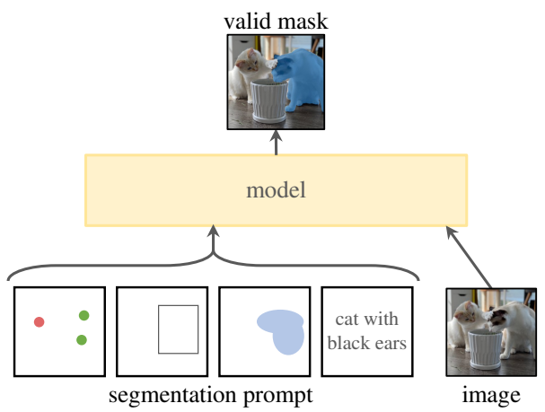

_(a) 任务：可提示的分割任务_

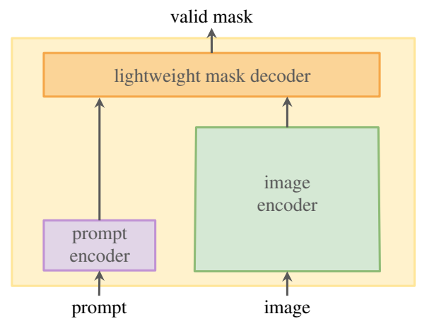

_(b) 模型：分割一切模型（SAM）_

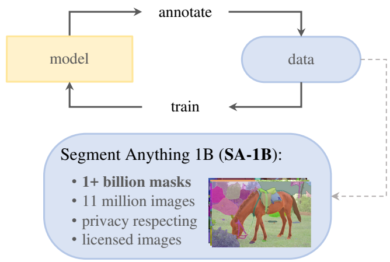

_(c) 数据：数据引擎（顶部）与数据集（底部）_

**图1：我们旨在通过引入三个相互关联的组件来构建分割任务的基础模型：一个可提示的分割任务、一个分割模型（SAM）——该模型为数据标注提供动力并通过提示工程实现对一系列任务的零样本迁移、以及一个用于收集SA-1B（我们包含超过10亿个掩码的数据集）的数据引擎。**

# 摘要

我们提出了分割一切（SA）项目：一个用于图像分割的新任务、新模型和数据集。通过在数据收集循环中使用我们的高效模型，我们构建了迄今为止最大的分割数据集（远超其他），包含1100万张经过授权且尊重隐私的图像上的超过10亿个掩码。该模型被设计和训练为可提示的，因此能够零样本迁移到新的图像分布和任务。我们在一系列任务上评估了其能力，发现其零样本性能令人印象深刻——通常与之前的全监督结果相当甚至更优。我们发布了分割一切模型（SAM）以及相应的包含10亿掩码和1100万图像的SA-1B数据集，地址为 https://segment-anything.com，以促进计算机视觉基础模型的研究。

# 1. 引言

在网络规模数据集上预训练的大型语言模型正在以其强大的零样本和小样本泛化能力革新自然语言处理领域[10]。这些"基础模型"[8]能够泛化到训练期间未见过的任务和数据分布。这种能力通常通过提示工程来实现，即使用人工设计的文本来提示语言模型为当前任务生成有效的文本响应。当使用来自网络的丰富文本语料库进行规模化训练时，这些模型的零样本和小样本性能表现出人意料的好——在某些情况下甚至可以与微调模型相媲美[10, 21]。经验趋势表明，这种表现随着模型规模、数据集大小和总训练计算量的增加而提升[56, 10, 21, 51]。

基础模型在计算机视觉领域也有探索，尽管程度较低。最突出的例子可能是利用来自网络的配对文本和图像。例如，CLIP[82]和ALIGN[55]使用对比学习来训练对齐两种模态的文本和图像编码器。训练完成后，工程化的文本提示使得对新的视觉概念和数据分布的零样本泛化成为可能。这类编码器还能有效地与其他模块组合，以实现下游任务，如图像生成（例如DALL·E[83]）。虽然在视觉和语言编码器方面已取得很大进展，但计算机视觉包含的范围远不止于此，而且对于许多问题，充足的训练数据并不存在。

在这项工作中，我们的目标是构建一个用于图像分割的基础模型。也就是说，我们寻求开发一个可提示的模型，并使用一个能够实现强大泛化能力的任务在广泛的数据集上对其进行预训练。有了这个模型，我们的目标是使用提示工程在新数据分布上解决一系列下游分割问题。

这一计划的成功取决于三个组件：任务、模型和数据。为了开发它们，我们解决关于图像分割的以下问题：

1. 什么样的任务能够实现零样本泛化？

2. 对应的模型架构是什么？

3. 什么样的数据能够为这个任务和模型提供动力？

---

# 中文翻译

---

这些问题相互关联，需要一个综合性的解决方案。我们首先定义了一个可提示分割任务（promptable segmentation task），该任务足够通用，可以提供一个强大的预训练目标，并支持广泛的下游应用。该任务要求模型支持灵活的提示，并能实时输出分割掩码，以支持交互式使用。为了训练我们的模型，我们需要一个多样化的大规模数据源。然而，目前尚不存在网络规模的分割数据源；为解决这一问题，我们构建了一个"数据引擎"，即在高效模型辅助数据收集和新收集数据改进模型之间迭代进行。接下来我们依次介绍每个相互关联的组件，然后介绍我们创建的数据集以及证明我们方法有效性的实验。

## 任务（第2节）

在自然语言处理领域，以及近期的计算机视觉领域，基础模型（foundation model）是一个有前景的发展方向，它可以通过"提示"（prompting）技术对新数据集和新任务执行零样本和少样本学习。受到这一研究方向的启发，我们提出了可提示分割任务，其目标是给定任意分割提示时返回一个有效的分割掩码（见图1a）。提示只是指定要在图像中分割什么，例如，提示可以包含标识对象的空间或文本信息。有效输出掩码的要求意味着，即使提示是模糊的，可能指向多个对象（例如，衬衫上的一个点可能表示衬衫本身或穿着它的人），输出也应该至少为其中一个对象提供合理的掩码。我们将可提示分割任务既用作预训练目标，也用于通过提示工程解决通用下游分割任务。

## 模型（第3节）

可提示分割任务和实际应用的目标对模型架构施加了约束。具体而言，模型必须支持灵活提示，需要在摊销实时（amortized real-time）内计算掩码以支持交互式使用，并且必须具有歧义感知能力。出乎意料的是，我们发现一个简单的设计即可满足所有三个约束：一个强大的图像编码器计算图像嵌入，一个提示编码器嵌入提示，然后这两个信息源在一个轻量级掩码解码器中结合，预测分割掩码。我们将这个模型称为Segment Anything Model，或SAM（见图1b）。通过将SAM分离为图像编码器和快速提示编码器/掩码解码器，相同的图像嵌入可以与不同提示重复使用（并摊销其计算成本）。给定图像嵌入后，提示编码器和掩码解码器在Web浏览器中根据提示预测掩码约需50毫秒。我们专注于点、框和掩码提示，并展示了自由形式文本提示的初步结果。为了使SAM具有歧义感知能力，我们设计它为单个提示预测多个掩码，使SAM能够自然地处理歧义，例如衬衫与人的例子。

## 数据引擎（第4节）

为了对新的数据分布实现强泛化，我们发现有必要在大量多样化的掩码上训练SAM，超出任何已存在的分割数据集。虽然基础模型的典型方法是在线获取数据[82]，但掩码并非自然丰富，因此我们需要替代策略。我们的解决方案是构建一个"数据引擎"，即我们与模型循环数据集标注共同开发（见图1c）。我们的数据引擎有三个阶段：辅助人工标注、半自动标注和全自动标注。在第一阶段，SAM辅助标注者为掩码添加注释，类似于经典的交互式分割设置。在第二阶段，SAM可以通过在可能的对象位置进行提示来自动生成部分对象的掩码，标注者专注于标注剩余对象，有助于增加掩码的多样性。在最后阶段，我们使用前景点的规则网格提示SAM，平均每张图像产生约100个高质量掩码。

## 数据集（第5节）

我们的最终数据集SA-1B包含来自1100万张授权和隐私保护图像的超过10亿个掩码（见图2）。SA-1B完全使用数据引擎最后阶段自动收集，比任何现有的分割数据集[66, 44, 117, 60]多出400倍的掩码，并且正如我们广泛验证的那样，这些掩码具有高质量和多样性。除了用于训练SAM以实现稳健性和通用性之外，我们希望SA-1B成为一个有价值的资源，帮助研究工作构建新的基础模型。

## 负责任的人工智能（第6节）

我们研究并报告使用SA-1B和SAM时潜在的公平性问题和对偏见的影响。SA-1B中的图像涵盖了地理和经济上多样化的国家群体，我们发现SAM在不同人群群体上的表现相似。总的来说，我们希望这能使我们的工作对实际应用场景更加公平。我们在附录中提供了模型和数据表。

## 实验（第7节）

我们对SAM进行了广泛评估。首先，使用一套多样化的新分割数据集（包含23个数据集），我们发现SAM从单个前景点产生高质量掩码，通常仅略低于手动标注的真实值。其次，我们发现在使用提示工程进行零样本迁移协议的多种下游任务上（包括边缘检测、目标候选生成、实例分割以及文本到掩码预测的初步探索）都取得了持续强劲的定性和定量结果。这些结果表明，SAM可以通过提示工程开箱即用地解决涉及超出SAM训练数据的对象和图像分布的各种任务。然而，仍有改进空间，我们将在第8节中讨论。

## 发布

我们发布SA-1B数据集供研究使用，并根据宽松的开源许可证（Apache 2.0）在 https://segment-anything.com 提供SAM。我们还通过在线演示展示SAM的能力。

---

_图2：来自我们新引入的数据集SA-1B的示例图像及其叠加掩码。SA-1B包含1100万张多样化、高分辨率、已获授权且保护隐私的图像，以及11亿个高质量分割掩码。这些掩码由SAM完全自动标注，通过人工评分和大量实验验证，具有高质量和多样性。为便于可视化，我们按每张图像的掩码数量对图像进行分组（平均每张图像约100个掩码）。_

---

---

# 2. 任意分割任务

我们从自然语言处理（NLP）中获得启发，在该领域，下一个词元预测任务被用于基础模型的预训练，并通过提示工程解决各种下游任务 [10]。为了构建用于分割的基础模型，我们的目标是定义一个具有类似能力分割任务。

**任务。** 我们首先将提示的概念从NLP转化到分割领域，其中提示可以是前景/背景点集、粗糙的边界框或掩码、自由形式的文本，或者更一般地说，任何指示图像中需要分割什么的信息。可提示分割任务则是，给定任何提示，返回一个有效的分割掩码。"有效"掩码的要求仅仅意味着，即使提示是歧义的，可能指向多个对象（例如，回忆衬衫与人的例子，参见图3），输出也应该至少为其中一个对象提供合理的掩码。这一要求类似于期望语言模型对歧义提示输出一致的响应。我们选择这个任务是因为它能够产生一种自然的预训练算法，以及一种通用的方法，通过提示将模型零样本迁移到下游分割任务。

**预训练。** 可提示分割任务启发了一种自然的预训练算法，该算法模拟每个训练样本的一系列提示（例如点、框、掩码），并比较模型的掩码预测与真值。尽管我们的方法借鉴自交互式分割 [109, 70]，但与交互式分割不同的是，交互式分割的目标是在获得足够用户输入后最终预测一个有效掩码，而我们的目标是始终为任何提示预测一个有效掩码，即使提示是歧义的。这确保了预训练模型在涉及歧义的使用场景中有效，包括我们数据引擎 §4 所需的自动标注。我们注意到，在该任务上表现出色具有挑战性，需要专门的建模和训练损失选择，这将在 §3 中讨论。

**零样本迁移。** 直观上，我们的预训练任务赋予模型在推理时对任何提示做出适当响应的能力，因此下游任务可以通过设计适当的提示来解决。例如，如果有一个用于猫的边界框检测器，猫的实例分割可以通过将检测器的框输出作为提示提供给我们的模型来解决。一般来说，大量实际分割任务都可以转化为提示的形式。除了自动数据集标注外，我们还在 §7 的实验中探索了五个不同的示例任务。

**相关任务。** 分割是一个广泛的领域：包括交互式分割 [57, 109]、边缘检测 [3]、超像素化 [85]、目标提议生成 [2]、前景分割 [94]、语义分割 [90]、实例分割 [66]、全景分割 [59] 等。我们的可提示分割任务的目标是产生一个具有广泛能力的模型，该模型能够通过提示工程适应许多（尽管不是全部）现有和新的分割任务。这种能力是任务泛化 [26] 的一种形式。注意，这与之前关于多任务分割系统的工作不同。在多任务系统中，单个模型执行一组固定的任务，例如联合语义、实例和全景分割 [114, 19, 54]，但训练和测试任务是相同的。我们工作中的重要区别在于，用于可提示分割的模型可以通过作为更大系统的组件，在推理时执行新的、不同的任务，例如，为了执行实例分割，可提示分割模型与现有的目标检测器相结合。

**讨论。** 提示和组合是强大的工具，使单个模型能够以可扩展的方式使用，有可能完成在模型设计时未知晓的任务。这种方法类似于其他基础模型的使用方式，例如CLIP [82] 如何成为DALL-E [83] 图像生成系统的文本-图像对齐组件。我们预计，由提示工程等技术驱动的可组合系统设计，将能够实现比针对固定任务集专门训练的系统更多样化的应用。通过组合的视角来比较可提示分割和交互式分割也很有趣：虽然交互式分割模型的设计考虑的是人类用户，但用于可提示分割的模型也可以组合成更大的算法系统，正如我们将展示的那样。

---

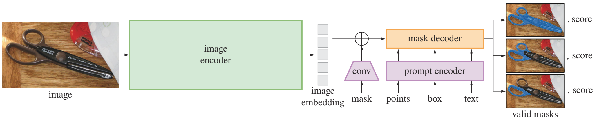

_图4: Segment Anything Model (SAM)概述。一个重量级图像编码器输出图像嵌入向量，可以被各种输入提示高效查询，以摊销后的实时速度生成目标掩码。对于对应多个目标的模糊提示，SAM可以输出多个有效掩码及相关的置信度分数。_

# 3. Segment Anything Model

接下来我们描述用于提示分割的Segment Anything Model (SAM)。SAM由三个组件构成，如图4所示：图像编码器、灵活的提示编码器和快速掩码解码器。我们基于Transformer视觉模型[14, 33, 20, 62]构建，针对（摊销）实时性能进行了特定权衡。在此我们先进行高层概述，具体细节见§A。

**图像编码器**。受可扩展性和强大预训练方法的驱动，我们使用了MAE[47]预训练的Vision Transformer (ViT)[33]，并对其进行了最小化改造以处理高分辨率输入[62]。图像编码器每张图像仅运行一次，可以在模型提示之前提前执行。

**提示编码器**。我们考虑两类提示：稀疏提示（点、框、文本）和密集提示（掩码）。我们将点和框表示为位置编码[95]与每种提示类型的可学习嵌入之和，自由形式文本使用CLIP[82]的现成文本编码器。密集提示（即掩码）使用卷积嵌入，并与图像嵌入进行逐元素相加。

**掩码解码器**。掩码解码器高效地将图像嵌入、提示嵌入和输出token映射为掩码。该设计受[14, 20]启发，采用修改后的Transformer解码器块[103]后接动态掩码预测头。我们修改的解码器块在两个方向上使用提示自注意力和交叉注意力（从提示到图像嵌入，反之亦然）来更新所有嵌入。运行两个块后，我们对图像嵌入进行上采样，并用一个MLP将输出token映射到动态线性分类器，然后计算每个图像位置的前景掩码概率。

**消歧**。如果给定模糊提示，单一输出时模型会对多个有效掩码取平均。为解决这一问题，我们修改模型以对单一提示预测多个输出掩码（见图3）。我们发现3个掩码输出足以应对大多数常见情况（嵌套掩码深度通常最多三层：整体、部分和子部分）。训练时，我们仅对掩码的最小损失[15, 45, 64]进行反向传播。为对掩码进行排序，模型预测每个掩码的置信度分数（即估计IoU）。

**高效性**。整体模型设计在很大程度上受效率驱动。给定预计算的图像嵌入，提示编码器和掩码解码器在Web浏览器中、CPU上运行约50毫秒。这种运行时性能使我们的模型能够实现无缝、实时的交互式提示。

**损失函数与训练**。我们使用[14]中使用的焦点损失[65]和Dice损失[73]的线性组合来监督掩码预测。我们使用几何提示的混合（文本提示见§7.5）训练提示分割任务。参照[92, 37]的方法，我们通过每轮掩码随机采样11轮提示来模拟交互式设置，使SAM能够无缝集成到我们的数据引擎中。

# 4. Segment Anything Data Engine

由于互联网上的分割掩码资源并不丰富，我们构建了一个数据引擎来收集11亿掩码的数据集SA-1B。数据引擎包含三个阶段：（1）模型辅助的人工标注阶段，（2）自动预测掩码与模型辅助标注相结合的半自动阶段，（3）模型在无标注员输入的情况下完全自动生成掩码的阶段。接下来我们详细介绍每个阶段。

**辅助人工标注阶段**。在第一阶段，类似于经典的交互式分割，一群专业标注员使用由SAM驱动的基于浏览器的交互式分割工具，通过点击前景/背景目标点来标注掩码。掩码可以使用像素级精度的"画笔"和"橡皮擦"工具进行细化。我们的模型辅助标注在浏览器内实时运行（使用预计算的图像嵌入），提供真正的交互式体验。我们对标注对象没有施加语义约束，标注员可以自由标注"物质"和"物体"[1]。我们建议标注员标注他们能够命名或描述的对象，但未收集这些名称或描述。标注员被要求按显著程度顺序标注对象，并被鼓励一旦掩码标注时间超过30秒就转到下一张图像。

---

---

在这个阶段的开始，SAM 使用常见的公开分割数据集进行训练。在获得足够的标注数据后，SAM 仅使用新标注的掩码进行再训练。随着收集到的掩码数量增加，图像编码器从 ViT-B 扩展到 ViT-H，其他架构细节也经历了演进；总共我们进行了 6 次模型再训练。随着模型的改进，每个掩码的平均标注时间从 34 秒减少到 14 秒。我们注意到，14 秒比 COCO [66] 的掩码标注快 6.5 倍，仅比使用极点的边界框标注慢 2 倍 [76, 71]。随着 SAM 的改进，每张图像的平均掩码数量从 20 增加到 44 个。总体而言，我们在这个阶段从 12 万张图像中收集了 430 万个掩码。

**半自动阶段。** 在这个阶段，我们的目标是增加掩码的多样性，以提高模型分割任何物体的能力。为了让标注者专注于不太显著的目标，我们首先自动检测高置信度的掩码。然后，我们向标注者展示预先填充了这些掩码的图像，并要求他们标注任何额外的未标注目标。为了检测高置信度掩码，我们使用通用的"物体"类别在所有第一阶段的掩码上训练了一个边界框检测器 [84]。在这个阶段，我们额外收集了来自 18 万张图像的 590 万个掩码（总计 1020 万个掩码）。与第一阶段一样，我们定期在新收集的数据上再训练模型（5 次）。每个掩码的平均标注时间回升至 34 秒（不包括自动掩码），因为这些目标更难标注。每张图像的平均掩码数量从 44 增加到 72 个（包括自动掩码）。

**全自动阶段。** 在最后阶段，标注完全自动化。这之所以可行，是因为我们模型的两个主要改进。首先，在这个阶段的开始，我们已经收集了足够多的掩码来大幅改进模型，包括前一个阶段的多样化掩码。其次，到这个阶段我们已经开发了歧义感知模型，它允许我们即使在歧义情况下也能预测有效的掩码。具体来说，我们用 32×32 的规则点网格提示模型，并为每个点预测一组可能对应于有效物体的掩码。使用歧义感知模型，如果一个点位于某个部分或子部分上，我们的模型将返回子部分、部分和整个物体。我们模型的 IoU 预测模块用于选择高置信度掩码；此外，我们仅识别并选择稳定的掩码（我们将一个掩码视为稳定的，如果将概率图阈值设为 0.5 - δ 和 0.5 + δ 会得到相似的掩码）。最后，在选择高置信度和稳定的掩码后，我们应用非极大值抑制（NMS）来过滤重复的掩码。为了进一步提高较小掩码的质量，我们还处理了多个重叠的放大图像裁剪区域。关于这个阶段的更多细节，请参见 §B。我们将全自动掩码生成应用于我们数据集中的全部 1100 万张图像，产生了总计 11 亿个高质量掩码。接下来我们描述并分析由此产生的数据集 SA-1B。

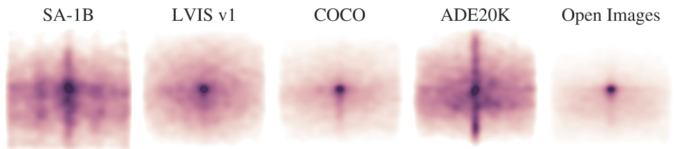

_图 5：归一化到图像尺寸的掩码中心分布。_

# 5. Segment Anything 数据集

我们的数据集 SA-1B 由 1100 万张多样化的高分辨率、经授权且保护隐私的图像，以及通过我们的数据引擎收集的 11 亿个高质量分割掩码组成。我们将 SA-1B 与现有数据集进行比较，并分析掩码的质量和属性。我们发布 SA-1B 是为了促进计算机视觉基础模型的未来发展。我们注意到，SA-1B 将以有利于某些研究用途的许可协议发布，并为研究人员提供保护。

**图像。** 我们从一个直接与摄影师合作的提供商处授权了一组新的 1100 万张图像。这些图像是高分辨率的（平均 3300×4950 像素），其数据量可能带来可访问性和存储方面的挑战。因此，我们发布的是下采样后的图像，将其最短边设置为 1500 像素。即使在下采样后，我们的图像仍然比许多现有的视觉数据集分辨率高得多（例如，COCO [66] 图像约为 480×640 像素）。请注意，当今大多数模型在低得多的分辨率输入上运行。已发布的图像中的人脸和车辆牌照已做模糊处理。

**掩码。** 我们的数据引擎产生了 11 亿个掩码，其中 99.1% 是完全自动生成的。因此，自动掩码的质量至关重要。我们将它们与专业标注进行比较，并查看各种掩码属性与主要分割数据集的比较情况。我们的主要结论，正如下面的分析和第 7 节的实验所证实的那样，是我们的自动掩码质量高且对训练模型有效。基于这些发现，SA-1B 仅包含自动生成的掩码。

**掩码质量。** 为了估计掩码质量，我们随机采样了 500 张图像（约 5 万个掩码），并请我们的专业标注员改进这些图像中所有掩码的质量。标注员使用我们的模型和像素精确的"画笔"和"橡皮擦"编辑工具来完成此操作。此过程产生了自动预测和专业校正的掩码对。我们计算每对掩码之间的 IoU，发现 94% 的配对具有大于 90% 的 IoU（97% 的配对具有大于 75% 的 IoU）。作为比较，先前的工作估计标注者间的一致性为 85-91% IoU [44, 60]。我们在第 7 节的实验通过人类评分确认，相对于各种数据集，掩码质量很高，并且在自动掩码上训练我们的模型几乎与使用数据引擎生成的全部掩码一样好。

---

---

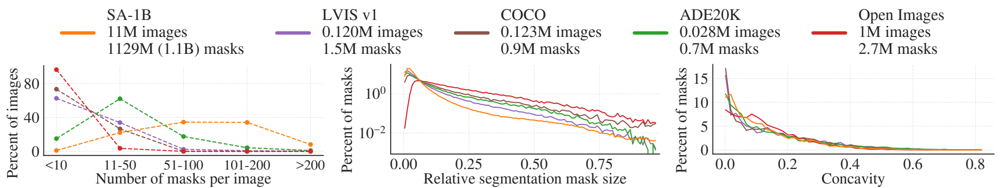

_图6：数据集掩码属性。图例标注了每个数据集中的图像和掩码数量。请注意，SA-1B的图像数量是最大现有分割数据集Open Images [60]的11倍，掩码数量是其400倍。_

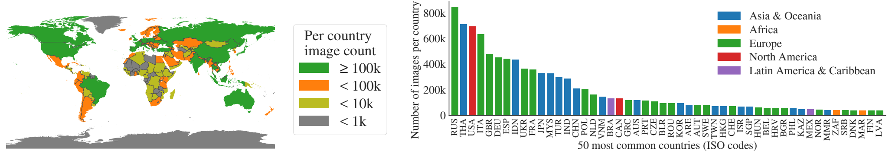

_图7：SA-1B图像的估计地理分布。世界上大多数国家在SA-1B中都有超过1000张图像，且图像数量最多的三个国家来自世界的不同地区。_

**掩码属性。** 在图5中，我们绘制了SA-1B中物体中心的空间分布，并与现有最大的分割数据集进行比较。所有数据集中都存在常见的摄影师偏差。我们观察到，与分布最为相似的LVIS v1 [44]和ADE20K [117]相比，SA-1B在图像边角的覆盖范围更广，而COCO [66]和Open Images V5 [60]的中心偏差更为突出。在图6（图例）中，我们按规模对这些数据集进行了比较。SA-1B的图像数量是第二大数据集Open Images的11倍，掩码数量是其400倍。平均而言，SA-1B每张图像的掩码数量是Open Images的36倍。在这方面最接近的数据集ADE20K，其每张图像的掩码数量仍然少3.5倍。图6（左）绘制了每张图像的掩码数量分布。接下来，我们在图6（中）中查看图像相对掩码大小（掩码面积平方根除以图像面积）。正如预期，由于我们的数据集每张图像有更多掩码，它也更倾向于包含更大比例的小型和中等相对尺寸的掩码。最后，为了分析形状复杂度，我们在图6（右）中查看掩码凹度（1减去掩码面积除以掩码凸包面积）。由于形状复杂度与掩码大小相关，我们通过从分箱掩码大小中进行分层采样来控制数据集的掩码大小分布。我们观察到，我们掩码的凹度分布与其他数据集总体相似。

# 6. Segment Anything 负责任AI分析

接下来，我们通过调查使用SA-1B和SAM时潜在的公平性问题和偏差，对本工作进行负责任AI（RAI）分析。我们关注SA-1B的地理和收入分布，以及SAM在人的受保护属性上的公平性。我们还在§F中提供了数据集、数据标注和模型卡片。

| rowspan="2" colspan="2" | colspan="2">SA-1B | colspan="3">% 图像 |  |  |  |
| --- | --- | --- | --- | --- | --- | --- |
| #图像 | #掩码 | SA-1B | COCO | O.I. |  |  |
| 非洲 | 54 | 300k | 28M | 2.8% | 3.0% | 1.7% |
| 亚洲和大洋洲 | 70 | 3.9M | 423M | 36.2% | 11.4% | 14.3% |
| 欧洲 | 47 | 5.4M | 540M | 49.8% | 34.2% | 36.2% |
| 拉丁美洲和加勒比 | 42 | 380k | 36M | 3.5% | 3.1% | 5.0% |
| 北美 | 4 | 830k | 80M | 7.7% | 48.3% | 42.8% |
| 高收入国家 | 81 | 5.8M | 598M | 54.0% | 89.1% | 87.5% |
| 中等收入国家 | 108 | 4.9M | 499M | 45.0% | 10.5% | 12.0% |
| 低收入国家 | 28 | 100k | 9.4M | 0.9% | 0.4% | 0.5% |

_表1：地理和收入代表性的比较。SA-1B在欧洲、亚洲和大洋洲以及中等收入国家中有较高的代表性。在所有数据集中，非洲、拉丁美洲和加勒比地区以及低收入国家的图像代表性不足。_

**地理和收入代表性。** 我们使用标准方法推断图像拍摄的国家（见§C）。在图7中，我们可视化了SA-1B中每个国家的图像数量（左）以及图像数量最多的50个国家（右）。我们注意到，前三名国家来自世界的不同地区。接下来，在表1中，我们比较了SA-1B、COCO [66]和Open Images [60]的地理和收入代表性。SA-1B在欧洲和亚洲及大洋洲以及中等收入国家的图像百分比明显更高。所有数据集对非洲和低收入国家的代表性都不足。我们注意到，在SA-1B中，所有地区，包括非洲，都有至少2800万个掩码，比任何先前数据集的掩码总数多10倍。最后，我们观察到（未显示）每张图像的平均掩码数量在各地区和收入水平之间相当一致（每张图像94-108个）。

---

<table><tr><td></td><td colspan="2">mIoU at</td><td colspan="2">mIoU at</td></tr><tr><td></td><td>1 point</td><td>3 points</td><td>1 point</td><td>3 points</td></tr><tr><td colspan="3">perceived gender presentation</td><td colspan="2">perceived skin tone</td></tr><tr><td>feminine</td><td>54.4 ± 1.7</td><td>90.4 ± 0.6</td><td>1</td><td>52.9 ± 2.2</td></tr><tr><td>masculine</td><td>55.7 ± 1.7</td><td>90.1 ± 0.6</td><td>2</td><td>51.5 ± 1.4</td></tr><tr><td colspan="3">perceived age group</td><td>3</td><td>52.2 ± 1.9</td></tr><tr><td>older</td><td>62.9 ± 6.7</td><td>92.6 ± 1.3</td><td>4</td><td>51.5 ± 2.7</td></tr><tr><td>middle</td><td>54.5 ± 1.3</td><td>90.2 ± 0.5</td><td>5</td><td>52.4 ± 4.2</td></tr><tr><td>young</td><td>54.2 ± 2.2</td><td>91.2 ± 0.7</td><td>6</td><td>56.7 ± 6.3</td></tr></table>

_表2：SAM在不同感知性别表达、年龄组和肤色下对人物进行分割的性能。显示95%置信区间。在每个分组中，除年长与中年之间的比较外，所有置信区间均存在重叠。_

**人物分割的公平性。** 我们通过测量SAM在不同群体之间的性能差异，调查其在感知性别表达、感知年龄组和感知肤色方面的潜在公平性问题。我们使用People包容性标注（MIAP）[87]数据集进行性别表达和年龄分析，并使用专有数据集进行肤色分析（见§C）。我们的评估使用模拟交互式分割，随机采样1个和3个点（见§D）。表2（左上）展示了感知性别表达的结果。我们注意到，女性已被证明在检测和分割数据集中代表性不足[115]，但观察到SAM在各群体上的表现相似。我们在表2（左下）中对感知年龄重复分析，注意到年轻人和老年人已被证明在大规模数据集中代表性不足[110]。SAM在感知为老年人的群体上表现最佳（尽管置信区间较大）。最后，我们在表2（右）对感知肤色重复分析，注意到较浅的肤色已被证明过度代表，而较深的肤色代表性不足[110]。由于MIAP不包含感知肤色标注，我们使用包含感知Fitzpatrick皮肤类型[36]标注的专有数据集，该类型范围从1（最浅肤色）到6（最深肤色）。虽然均值有所不同，但我们未发现各组之间存在显著差异。我们相信这一发现源于任务的本质，并承认当SAM用作更大系统的组件时可能出现偏差。最后，在§C中我们将分析扩展到衣物分割，在那里我们发现感知性别表达方面存在偏差的迹象。

# 7. 零样本迁移实验

在本节中，我们展示SAM（Segment Anything Model）的零样本迁移实验。我们考虑五个任务，其中四个与用于训练SAM的可提示分割任务显著不同。这些实验在训练期间未见过的数据集和任务上评估SAM（我们对"零样本迁移"的使用遵循CLIP [82]中的用法）。数据集可能包含新的图像分布，如水下或自我中心图像（例如图8），据我们所知，这些图像未出现在SA-1B中。

我们的实验首先测试可提示分割的核心目标：从任何提示生成有效掩码。我们强调单个前景点提示这一具有挑战性的场景，因为它比其他更具体的提示更容易产生歧义。接下来，我们呈现一系列穿越低、中、高层图像理解的实验，大致平行于该领域的历史发展。具体而言，我们提示SAM：（1）执行边缘检测，（2）分割一切，即目标提议生成，（3）分割检测到的对象，即实例分割，以及（4）作为一个概念验证，从自由形式文本分割对象。这四个任务与SAM训练的可提示分割任务显著不同，并通过提示工程实现。我们的实验以消融研究结束。

**实现。** 除非另有说明：（1）SAM使用MAE [47]预训练的ViT-H [33]图像编码器，（2）SAM在SA-1B上训练，注意到该数据集仅包含我们数据引擎最后阶段自动生成的掩码。关于其他模型和训练细节（如超参数），请参阅§A。

# 7.1 零样本单点有效掩码评估

**任务。** 我们评估从单个前景点分割对象。这个任务是不适定的，因为一个点可以指代多个对象。大多数数据集中的真实掩码不会枚举所有可能的掩码，这使得自动度量不可靠。因此，我们用人工研究补充标准mIoU度量（即预测掩码和真实掩码之间所有IoU的平均值），其中标注者将掩码质量从1（无意义）评定到10（像素级完美）。详见§D.1、§E和§G。

默认情况下，我们从真实掩码的"中心"采样点（位于掩码内部距离变换的最大值处），遵循交互式分割[92]的标准评估协议。由于SAM能够预测多个掩码，默认情况下我们仅评估模型最具置信度的掩码。基线是所有单掩码方法。我们主要与RITM [92]进行比较，这是一款强大的交互式分割器，在我们的基准测试中表现优于其他强基线[67, 18]。

**数据集。** 我们使用新编译的23个数据集套件，这些数据集具有多样的图像分布。图8列出了数据集并展示了每个数据集的样本（更多详情见附录表7）。我们使用全部23个数据集进行mIoU评估。对于人工研究，我们使用图9b中列出的子集（由于此类研究的资源需求）。该子集包含SAM根据自动度量表现优于和低于RITM的数据集。

---

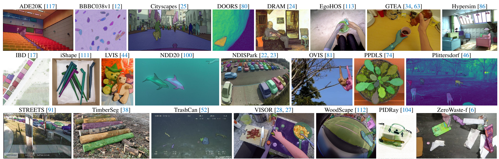

_Figure 8: Samples from the 23 diverse segmentation datasets used to evaluate SAM's zero-shot transfer capabilities._

**图8：用于评估SAM零样本迁移能力的23个多样化分割数据集的样本。**

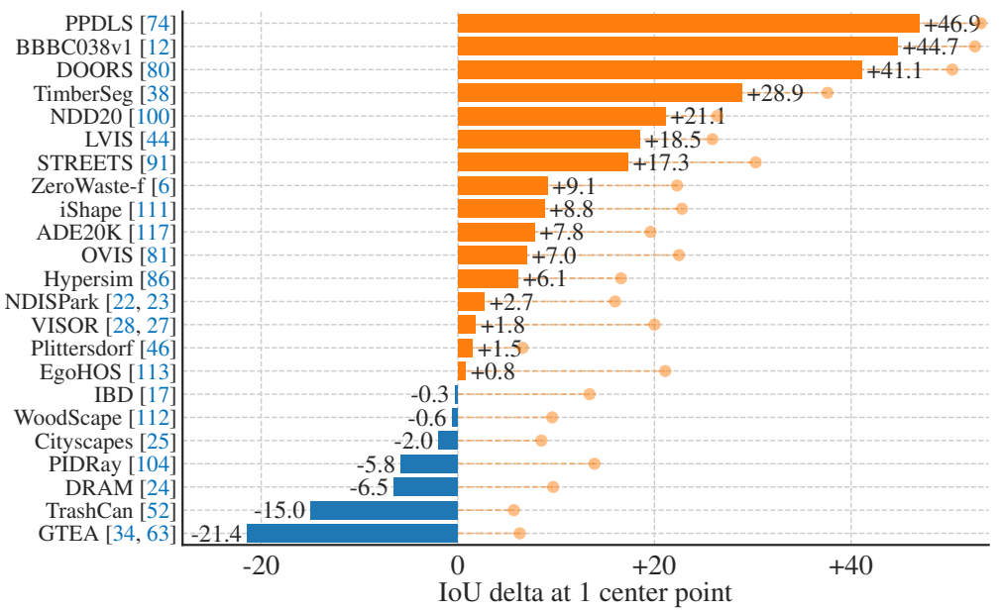

_(a) SAM vs. RITM [92] on 23 datasets_

**(a) SAM与RITM [92]在23个数据集上的对比**

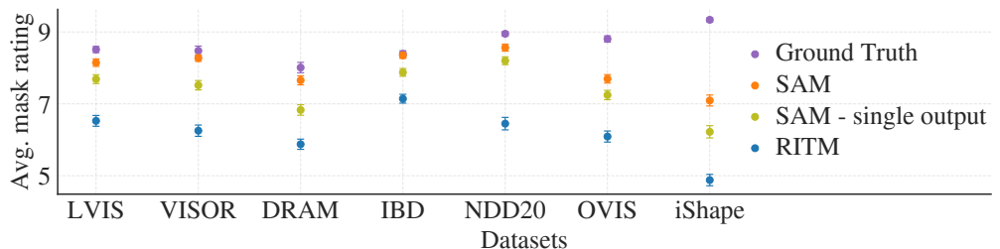

_(b) Mask quality ratings by human annotators_

**(b) 人工标注者对掩码质量的评分**

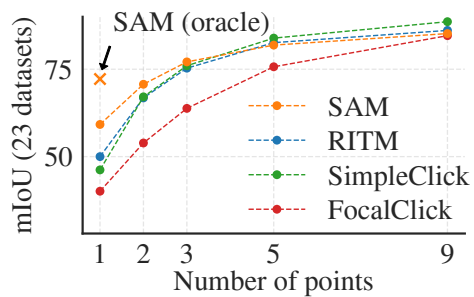

_(c) Center points (default)_

**(c) 中心点（默认设置）**

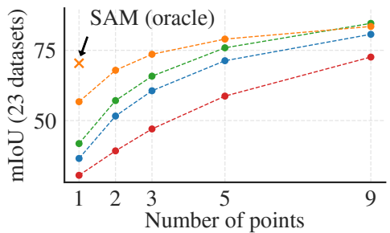

_(d) Random points_

**(d) 随机点**

_Figure 9: Point to mask evaluation on 23 datasets. (a) Mean IoU of SAM and the strongest single point segmenter, RITM [92]. Due to ambiguity, a single mask may not match ground truth; circles show "oracle" results of the most relevant of SAM's 3 predictions. (b) Per-dataset comparison of mask quality ratings by annotators from 1 (worst) to 10 (best). All methods use the ground truth mask center as the prompt. (c, d) mIoU with varying number of points. SAM significantly outperforms prior interactive segmenters with 1 point and is on par with more points. Low absolute mIoU at 1 point is the result of ambiguity._

**图9：23个数据集上的点到掩码评估。(a) SAM与最强单点分割器RITM [92]的平均IoU。由于存在歧义，单个掩码可能与真值不匹配；圆圈显示了SAM的3个预测中最相关的"神谕"结果。(b) 各数据集上标注者对掩码质量从1（最差）到10（最好）的评分对比。所有方法均使用真值掩码中心作为提示。(c, d) 不同点数量的mIoU。SAM在使用1个点时显著优于之前的交互式分割器，在点数更多时表现相当。1个点时mIoU绝对值较低是歧义造成的。**

**Results.** First, we look at automatic evaluation on the full suite of 23 datasets using mIoU. We compare per-dataset results in Fig. 9a against RITM. SAM yields higher results on 16 of the 23 datasets, by as much as \(\sim 47\) IoU. We also present an "oracle" result, in which the most relevant of SAM's 3 masks is selected by comparing them to the ground truth, rather than selecting the most confident mask. This reveals the impact of ambiguity on automatic evaluation. In particular, with the oracle to perform ambiguity resolution, SAM outperforms RITM on all datasets.

**结果。** 首先，我们使用mIoU对全部23个数据集进行自动评估。在图9a中，我们将其与RITM进行各数据集对比。SAM在其中16个数据集上取得了更高的结果，提升幅度高达约47个IoU。我们还给出了"神谕"结果，即通过与真值比较来选择SAM的3个掩码中最相关的一个，而非选择置信度最高的掩码。这揭示了歧义对自动评估的影响。具体而言，使用神谕进行歧义消解后，SAM在所有数据集上均优于RITM。

**Results of the human study are presented in Fig. 9b. Error bars are \(95\%\) confidence intervals for mean mask ratings (all differences are significant; see \(\S E\) for details). We observe that the annotators consistently rate the quality of SAM's masks substantially higher than the strongest baseline, RITM. An ablated, "ambiguity-unaware" version of SAM with a single output mask has consistently lower ratings, though still higher than RITM. SAM's mean ratings**

**人类研究的结果如图9b所示。误差棒为平均掩码评分的95%置信区间（所有差异均显著；详见§E）。我们观察到标注者始终给SAM掩码的质量评分显著高于最强基线RITM。SAM的去歧义版本（"歧义未知"版本）仅输出单个掩码，评分始终较低，但仍然高于RITM。SAM的平均评分**

fall between 7 and 9, which corresponds to the qualitative rating guideline: "A high score (7-9): The object is identifiable and errors are small and rare (e.g., missing a small, heavily obscured disconnected component, ...)." These results indicate that SAM has learned to segment valid masks from a single point. Note that for datasets like DRAM and IBD, where SAM is worse on automatic metrics, it receives consistently higher ratings in the human study.

**介于7到9之间，这符合定性评分指南："高分(7-9)：目标可识别，错误小且罕见（例如，遗漏一个小的、严重遮挡的断开连接的组件，...）。"这些结果表明SAM已学会从单个点分割出有效的掩码。注意，对于DRAM和IBD等数据集，尽管SAM在自动评估指标上表现较差，但在人类研究中始终获得更高的评分。**

Fig. 9c shows additional baselines, SimpleClick [67] and FocalClick [18], which obtain lower single point performance than RITM and SAM. As the number of points increases from 1 to 9, we observe that the gap between methods decreases. This is expected as the task becomes easier; also, SAM is not optimized for the very high IoU regime. Finally, in Fig. 9d we replace the default center point sampling with random point sampling. We observe that the gap between SAM and the baselines grows and SAM is able to achieve comparable results under either sampling method.

图9c展示了更多基线方法SimpleClick [67]和FocalClick [18]，它们的单点性能均低于RITM和SAM。随着点数从1增加到9，我们观察到方法之间的差距在减小。这是可以预期的，因为任务变得更容易了；此外，SAM并未针对极高IoU场景进行优化。最后，在图9d中，我们用随机点采样替代默认的中心点采样。我们观察到SAM与基线之间的差距扩大了，而SAM在两种采样方式下都能取得相当的结果。

---

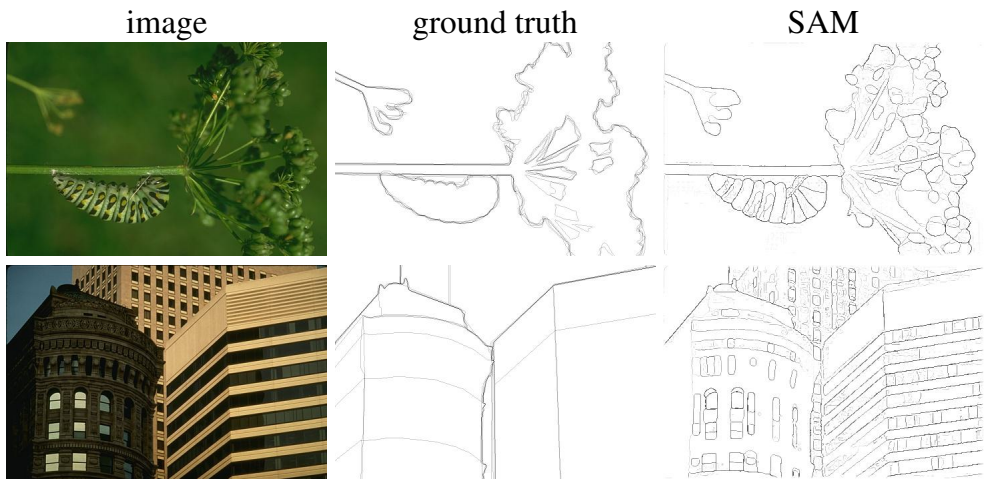

_图10：BSDS500上的零样本边缘预测。SAM未经过边缘图预测训练，在训练过程中也无法访问BSDS图像或标注。_

<table><tr><td>方法</td><td>年份</td><td>ODS</td><td>OIS</td><td>AP</td><td>R50</td></tr><tr><td>HED [108]</td><td>2015</td><td>.788</td><td>.808</td><td>.840</td><td>.923</td></tr><tr><td>EDETR [79]</td><td>2022</td><td>.840</td><td>.858</td><td>.896</td><td>.930</td></tr><tr><td colspan="6">零样本迁移方法：</td></tr><tr><td>Sobel滤波器</td><td>1968</td><td>.539</td><td>-</td><td>-</td><td>-</td></tr><tr><td>Canny [13]</td><td>1986</td><td>.600</td><td>.640</td><td>.580</td><td>-</td></tr><tr><td>Felz-Hutt [35]</td><td>2004</td><td>.610</td><td>.640</td><td>.560</td><td>-</td></tr><tr><td>SAM</td><td>2023</td><td>.768</td><td>.786</td><td>.794</td><td>.928</td></tr></table>

_表3：BSDS500边缘检测的零样本迁移。_

## 7.2 零样本边缘检测

**方法。** 我们使用BSDS500 [72, 3]在经典的低层任务——边缘检测上评估SAM。我们采用简化的自动掩码生成流程。具体来说，用$16 \times 16$规则前景点网格提示SAM，产生768个预测掩码（每个点3个）。通过NMS去除冗余掩码。然后利用Sobel算子对未阈值化的掩码概率图进行边缘检测，并结合标准的轻量级后处理，包括边缘NMS（详见§D.2）。

**结果。** 我们在图10中可视化了具有代表性的边缘图（更多结果见 图15）。从定性角度观察，尽管SAM未经边缘检测训练，它仍能生成合理的边缘图。与真值相比，SAM预测了更多的边缘，包括BSDS500中未标注但合理的边缘。这种偏差在表3中得到了定量的反映：在50%精确率下的召回率（R50）较高，但以牺牲精确率为代价。SAM自然落后于学习BSDS500偏差的最先进方法，即学习应抑制哪些边缘。然而，与开创性的深度学习方法如HED [108]（同样在BSDS500上训练）相比，SAM表现良好，并且显著优于之前的零样本迁移方法（虽然确实是过时的方法）。

## 7.3 零样本目标提议

**方法。** 接下来，我们在中层任务——目标提议生成 [2, 102]上评估SAM。该任务在目标检测研究中扮演了重要角色，作为开创性系统中的中间步骤（例如[102, 41, 84]）。为了生成目标提议，我们运行一个略微修改版的自动掩码生成流程，并将掩码输出作为提议（详见§D.3）。

<table><tr><td rowspan="2">方法</td><td rowspan="2">全部</td><td colspan="6">mask AR@1000</td></tr><tr><td>小</td><td>中</td><td>大</td><td>频繁</td><td>常见</td><td>稀有</td></tr><tr><td>ViTDet-H [62]</td><td>63.0</td><td>51.7</td><td>80.8</td><td>87.0</td><td>63.1</td><td>63.3</td><td>58.3</td></tr><tr><td colspan="8">零样本迁移方法：</td></tr><tr><td>SAM – 单点输出</td><td>54.9</td><td>42.8</td><td>76.7</td><td>74.4</td><td>54.7</td><td>59.8</td><td>62.0</td></tr><tr><td>SAM</td><td>59.3</td><td>45.5</td><td>81.6</td><td>86.9</td><td>59.1</td><td>63.9</td><td>65.8</td></tr></table>

_表4：LVIS v1上的目标提议生成。SAM采用零样本应用，即未经目标提议生成训练，也未访问LVIS图像或标注。_

我们在LVIS v1 [44]上计算标准的平均召回率（AR）指标。我们专注于LVIS是因为其大量类别构成了具有挑战性的测试。我们与一个强基线进行比较，该基线以ViTDet [62]检测器实现（采用级联Mask R-CNN [48, 11] ViT-H）。我们注意到这个"基线"对应于"伪装成提议生成器的检测器"（DMP）方法 [16]，该方法被证明会操纵AR，使得这成为一个真正具有挑战性的比较。

**结果。** 在表4中，我们看到将ViTDet-H的检测结果用作目标提议（即操纵AR的DMP方法 [16]）整体表现最佳，这并不令人意外。然而，SAM在多个指标上表现相当出色。值得注意的是，它在中型和大型物体上优于ViTDet-H，同样在稀有物体和常见物体上也是如此。事实上，SAM仅在小物体和频繁出现的物体上不如ViTDet-H，这是因为ViTDet-H在LVIS上训练过，可以轻松学习LVIS特有的标注偏差，而SAM则无法做到。我们还与SAM的消融模糊感知版本（"单点输出"）进行了比较，后者在所有AR指标上都显著差于SAM。

## 7.4 零样本实例分割

**方法。** 转向更高层的视觉任务，我们将SAM用作实例分割器的分割模块。实现很简单：运行一个目标检测器（之前使用的ViTDet），然后用其输出边界框提示SAM。这展示了如何将SAM整合到更大的系统中。

**结果。** 我们在表5中比较了SAM和ViTDet在COCO和LVIS上预测的掩码。从mask AP指标来看，两个数据集上都存在差距，SAM虽然接近但确实落后于ViTDet。通过可视化输出，我们观察到SAM的掩码在质量上往往优于ViTDet，边界更加清晰（见§D.4和图16）。为了进一步验证这一观察，我们进行了额外的人工评估，请标注员按照之前使用的1到10分质量评分标准对ViTDet掩码和SAM掩码进行打分。在图11中我们观察到，SAM在人工评估中始终优于ViTDet。

---

<table><tr><td rowspan="2">方法</td><td colspan="4">COCO [66]</td><td colspan="4">LVIS v1 [44]</td></tr><tr><td>AP</td><td>AP_S</td><td>AP_M</td><td>AP_L</td><td>AP</td><td>AP_S</td><td>AP_M</td><td>AP_L</td></tr><tr><td>ViTDet-H [62]</td><td>51.0</td><td>32.0</td><td>54.3</td><td>68.9</td><td>46.6</td><td>35.0</td><td>58.0</td><td>66.3</td></tr><tr><td colspan="9">零样本迁移方法（仅分割模块）：</td></tr><tr><td>SAM</td><td>46.5</td><td>30.8</td><td>51.0</td><td>61.7</td><td>44.7</td><td>32.5</td><td>57.6</td><td>65.5</td></tr></table>

_表5：实例分割结果。SAM以ViTDet检测框作为提示进行零样本分割。全监督的ViTDet性能优于SAM，但在高质量的LVIS掩码上差距缩小。有趣的是，根据人工评分，SAM优于ViTDet（见图11）。_

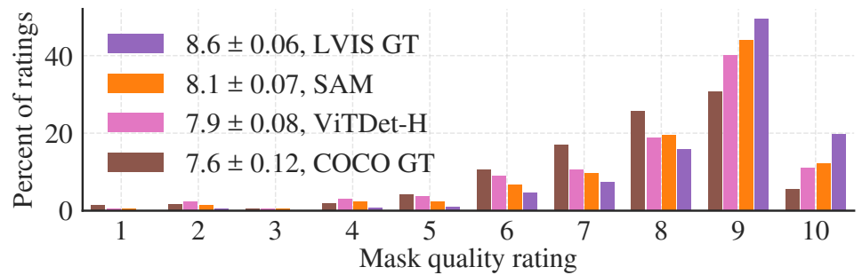

_图11：ViTDet和SAM在LVIS真实标注框上应用时的人工掩码质量评分分布。我们还报告了LVIS和COCO真实标注的质量。图例中显示了评分均值和95%置信区间。尽管SAM的AP较低（见表5），但其评分高于ViTDet，这表明ViTDet利用了COCO和LVIS训练数据中的偏差。_

我们假设在COCO数据集上，掩码AP差距较大且真实标注质量相对较低（如人工研究所证实），ViTDet学习了COCO掩码的特定偏差。SAM作为一种零样本方法，无法利用这些（通常是不可取的）偏差。LVIS数据集具有更高的真实标注质量，但仍然存在特定的特性（如掩码不包含孔洞，它们在构造上是简单的多边形）以及模态掩码与非模态掩码之间的偏差。同样，SAM没有经过训练来学习这些偏差，而ViTDet可以加以利用。

# 7.5. 零样本文本到掩码

方法。最后，我们考虑一个更高级的任务：从自由形式文本中分割物体。这个实验是一个概念验证，展示了SAM处理文本提示的能力。虽然在前面的所有实验中我们使用的是完全相同的SAM，但对于这个实验，SAM的训练过程被修改为具有文本感知能力，但以一种不需要新的文本标注的方式。具体而言，对于每个手动收集的面积大于$100^2$的掩码，我们提取其CLIP图像嵌入。然后，在训练过程中，我们用提取的CLIP图像嵌入作为第一次交互来提示SAM。这里的关键观察是，由于CLIP的图像嵌入被训练为与其文本嵌入对齐，我们可以用图像嵌入进行训练，但用文本嵌入进行推理。也就是说，在推理时，我们将文本通过CLIP的文本编码器运行，然后将产生的文本嵌入作为提示输入SAM（详见§D.5）。

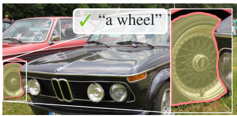

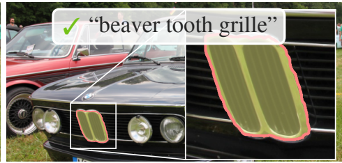

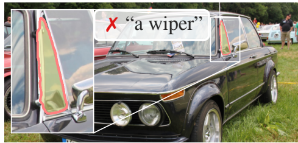

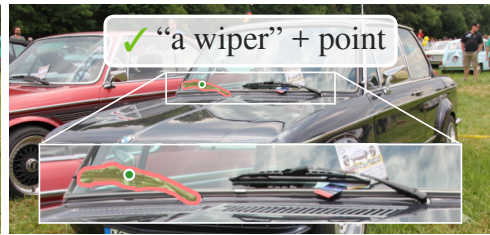

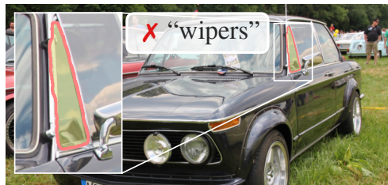

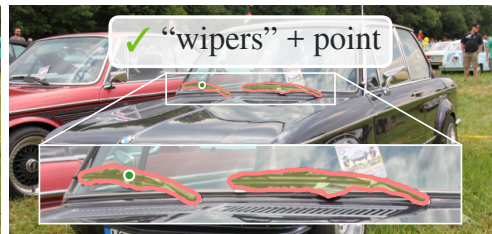

_图12：零样本文本到掩码。SAM可以处理简单和细微的文本提示。当SAM未能做出正确预测时，额外的点提示可以提供帮助。_

结果。我们在图12中展示定性结果。SAM能够基于简单的文本提示（如"一个轮子"）以及短语（如"海狸牙格栅"）来分割物体。当SAM仅凭文本提示未能从文本提示中选择正确的物体时，额外的点通常可以修正预测，这与[31]中的情况类似。

# 7.6. 消融实验

我们使用单一中心点提示协议在23个数据集套件上进行了多项消融实验。请注意，单个点可能具有歧义，而这种歧义可能未在真实标注中体现，因为真实标注中每个点只包含一个掩码。由于SAM在零样本迁移设置下运行，SAM排名最高的掩码与数据标注指南产生的掩码之间可能存在系统性偏差。因此，我们额外报告了相对于真实标注的最佳掩码（"神谕"）。

图13（左）绘制了SAM在数据引擎各阶段累积数据上训练时的性能。我们观察到每个阶段都提高了mIoU。当使用所有三个阶段进行训练时，自动掩码的数量远远超过手动和半自动掩码。为了解决这一问题，我们发现在训练过程中将手动和半自动掩码过采样10倍可获得最佳结果。这种设置使训练变得复杂。因此，我们测试了第四种设置，仅使用自动生成的掩码。使用这些数据，SAM的性能仅比使用全部数据略低（约0.5 mIoU）。因此，默认情况下我们仅使用自动生成的掩码来简化训练设置。

在图13（中）中，我们考察了数据量的影响。完整的SA-1B包含1100万张图像，我们均匀降采样到100万张和10万张用于此消融实验。在10万张图像时，我们观察到在所有设置下mIoU都大幅下降。然而，使用100万张图像（约占完整数据集的10%），我们观察到与使用完整数据集相当的结果。这个数据规模仍然包含约1亿个掩码，对于许多使用场景来说可能是一个实用的设置。

---

---

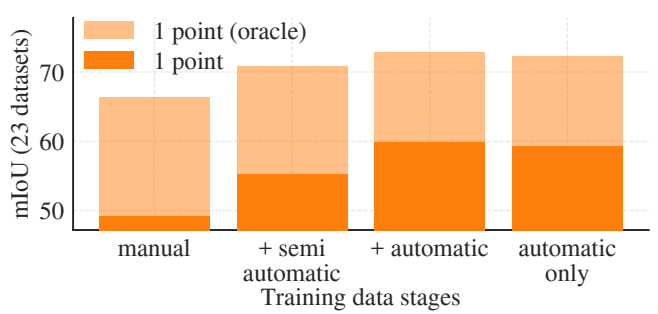

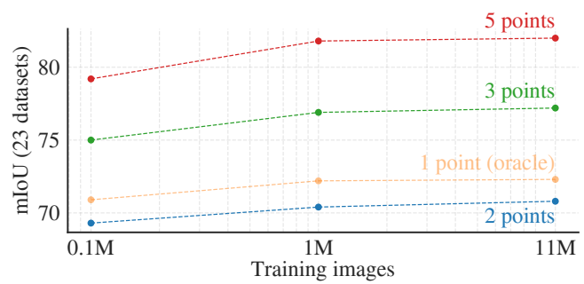

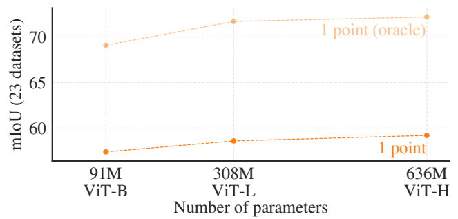

**图13：数据引擎阶段、图像编码器规模和训练数据规模的消融研究。**（左）每个数据引擎阶段都在我们的23个数据集套件上带来改进，仅使用自动数据训练（我们的默认设置）与使用三个阶段的数据训练效果相近。（中）使用约10%的SA-1B和完整的SA-1B训练的SAM表现相当。我们默认使用全部1100万张图像进行训练，但使用100万张图像也是一个合理的实用设置。（右）扩大SAM的图像编码器显示出有意义但趋于饱和的改进。然而，在某些场景下，较小的图像编码器可能是更好的选择。

最后，图13（右）展示了使用ViT-B、ViT-L和ViT-H图像编码器的结果。ViT-H相比ViT-B有显著提升，但相比ViT-L仅有边际增益。在目前阶段，进一步扩大图像编码器似乎没有太大意义。

# 8. 讨论

**基础模型。** 自机器学习早期以来，预训练模型已被应用于下游任务[99]。近年来，随着对规模的日益重视，这一范式变得越来越重要，这类模型最近被（重新）命名为"基础模型"：即"在大规模广泛数据上训练并可适应各种下游任务的模型"[8]。我们的工作与这一定义高度吻合，尽管我们注意到，用于图像分割的基础模型在范围上存在固有的局限性，因为它代表了计算机视觉中一个重要但有限的子集。我们还就[8]强调自监督学习在基础模型中的作用这一方面与我们的方法进行对比。虽然我们的模型使用自监督技术（MAE[47]）进行初始化，但其绝大多数能力来自于大规模监督训练。在数据引擎能够扩展可用标注数据的场景中（如本文），监督训练提供了一种有效的解决方案。

**组合性。** 预训练模型可以赋予超出训练时所设想的新能力。一个突出的例子是CLIP[82]如何被用作更大系统的组件，如DALL·E[83]。我们的目标是使这类组合使用变得简单直接。为此，我们要求SAM对各种分割提示都能预测出有效的掩码。其效果是在SAM与其他组件之间创建一个可靠的接口。例如，MCC[106]可以轻松使用SAM来分割感兴趣的对象，并在仅从单张RGB-D图像进行3D重建的任务中实现对未见对象的强泛化。另一个例子是，SAM可以接受可穿戴设备检测到的注视点作为提示，从而实现新的应用。得益于SAM能够泛化到新的领域（如以自我为中心的图像），这类系统无需额外训练即可工作。

**局限性。** 尽管SAM整体表现良好，但它并非完美。它可能会遗漏细小的结构，有时会产生小的断连组件的幻觉，且边界不如那些通过"放大"处理的计算密集型方法（如[18]）那样清晰。通常，在提供大量点的情况下，我们预期专门的交互式分割方法会优于SAM（如[67]）。与这些方法不同，SAM的设计目标是通用性和广泛适用性，而非高IoU的交互式分割。此外，SAM可以实时处理提示，但使用重型图像编码器时，SAM的整体性能并非实时的。我们对文本到掩码任务的探索是初步的，并非完全稳健，尽管我们相信通过更多努力可以加以改进。虽然SAM可以执行许多任务，但尚不清楚如何设计简单的提示来实现语义分割和全景分割。最后，对于特定领域的工具（如[7]），我们预期它们在各自领域内会优于SAM。

**结论。** Segment Anything项目是一次将图像分割带入基础模型时代的尝试。我们的主要贡献是使这一飞跃成为可能的新任务（提示分割）、新模型（SAM）和新数据集（SA-1B）。SAM是否能获得基础模型的地位，还有待社区如何使用的检验，但无论如何，我们预期这项工作的视角、超过10亿个掩码的发布以及我们的提示分割模型将有助于铺平前进的道路。

**致谢。** 我们感谢Aaron Adcock和Jitendra Malik的有益讨论。感谢Vaibhav Aggarwal和Yanghao Li在模型扩展方面的帮助。感谢Cheng-Yang Fu、Jiabo Hu和Robert Kuo在数据标注平台方面的帮助。感谢Allen Goodman和Bram Wasti在优化模型网页版方面的帮助。最后，感谢Morteza Behrooz、Ashley Gabriel、Ahuva Goldstand、Sumanth Gurram、Somya Jain、Devansh Kukreja、Joshua Lane、Lilian Luong、Mallika Malhotra、William Ngan、Omkar Parkhi、Nikhil Raina、Dirk Rowe、Neil Sejoor、Vanessa Stark、Bala Varadarajan和Zachary Winstrom在演示、数据集查看器以及其他资产和工具开发方面提供的帮助。

---

---

# 参考文献

[1] Edward H Adelson. 论视觉感知：人类和机器对材质的感知. 人类视觉与电子成像 VI, 2001. 5

[2] Bogdan Alexe, Thomas Deselaers, and Vittorio Ferrari. 什么是物体？CVPR, 2010. 4, 10

[3] Pablo Arbeláez, Michael Maire, Charless Fowlkes, and Jitendra Malik. 轮廓检测与层次化图像分割. TPAMI, 2010. 4, 10, 21, 28

[4] Jimmy Lei Ba, Jamie Ryan Kiros, and Geoffrey E Hinton. 层归一化. arXiv:1607.06450, 2016. 16

[5] Hangbo Bao, Li Dong, and Furu Wei. BEiT：图像Transformer的BERT式预训练. arXiv:2106.08254, 2021. 17

[6] Dina Bashkirova, Mohamed Abdelfattah, Ziliang Zhu, James Akl, Fadi Alladkani, Ping Hu, Vitaly Ablavsky, Berk Calli, Sarah Adel Bargal, and Kate Saenko. ZeroWaste数据集：面向杂乱场景中可变形物体分割的研究. CVPR, 2022. 9, 20

[7] Stuart Berg, Dominik Kutra, Thorben Kroeger, Christoph N. Straehle, Bernhard X. Kausler, Carsten Haubold, Martin Schiegg, Janez Ales, Thorsten Beier, Markus Rudy, Kemal Eren, Jaime I. Cervantes, Buote Xu, Fynn Beuttenmueller, Adrian Wolny, Chong Zhang, Ullrich Koethe, Fred A. Hamprecht, and Anna Kreshuk. ilastik：面向（生物）图像分析的交互式机器学习工具. Nature Methods, 2019. 12

[8] Rishi Bommasani, Drew A Hudson, Ehsan Adeli, Russ Altman, Simran Arora, Sydney von Arx, Michael S Bernstein, Jeannette Bohg, Antoine Bosselut, Emma Brunskill, et al. 基础模型的机会与风险. arXiv:2108.07258, 2021. 1, 12

[9] Gustav Bredell, Christine Tanner, and Ender Konukoglu. 面向分割编辑网络的迭代交互训练方法. MICCAI, 2018. 17

[10] Tom Brown, Benjamin Mann, Nick Ryder, Melanie Subbiah, Jared D Kaplan, Prafulla Dhariwal, Arvind Neelakantan, Pranav Shyam, Girish Sastry, Amanda Askell, Sandhini Agarwal, Ariel Herbert-Voss, Gretchen Krueger, Tom Henighan, Rewon Child, Aditya Ramesh, Daniel Ziegler, Jeffrey Wu, Clemens Winter, Chris Hesse, Mark Chen, Eric Sigler, Mateusz Litwin, Scott Gray, Benjamin Chess, Jack Clark, Christopher Berner, Sam McCandlish, Alec Radford, Ilya Sutskever, and Dario Amodei. 语言模型是小样本学习器. *NeurIPS*, 2020. 1, 4

[11] Zhaowei Cai and Nuno Vasconcelos. 级联R-CNN：深入探索高质量目标检测. CVPR, 2018. 10

[12] Juan C. Caicedo, Allen Goodman, Kyle W. Karhohs, Beth A. Ciminini, Jeanelle Ackerman, Marzieh Haghighi, CherKeng Heng, Tim Becker, Minh Doan, Claire McQuin, Mohammad Rohban, Shantanu Singh, and Anne E. Carpenter. 跨成像实验的细胞核分割：2018数据科学挑战赛. Nature Methods, 2019. 9, 19, 20

[13] John Canny. 边缘检测的计算方法. TPAMI, 1986. 10, 21

[14] Nicolas Carion, Francisco Massa, Gabriel Synnaeve, Nicolas Usunier, Alexander Kirillov, and Sergey Zagoruyko. 基于Transformer的端到端目标检测. ECCV, 2020. 5, 16, 17

[15] Guillaume Charpiat, Matthias Hofmann, and Bernhard Schölkopf. 基于多模态预测的自动图像着色. ECCV, 2008. 5, 17

[16] Neelima Chavali, Harsh Agrawal, Aroma Mahendru, and Dhruv Batra. 目标提议评估协议是“可博弈的”. CVPR, 2016. 10, 21

[17] Jiazhou Chen, Yanghui Xu, Shufang Lu, Ronghua Liang, and Liangliang Nan. 基于多视角立体视觉的建筑物三维实例分割. IEEE地球科学与遥感汇刊, 2022. 9, 19, 20, 23, 24

[18] Xi Chen, Zhiyan Zhao, Yilei Zhang, Manni Duan, Donglian Qi, and Hengshuang Zhao. FocalClick：面向实用交互式图像分割的方法. CVPR, 2022. 8, 9, 12, 19

[19] Bowen Cheng, Ishan Misra, Alexander G Schwing, Alexander Kirillov, and Rohit Girdhar. 用于通用图像分割的掩码注意力掩码Transformer. CVPR, 2022. 4

[20] Bowen Cheng, Alex Schwing, and Alexander Kirillov. 像素级分类并非语义分割的全部所需. NeurIPS, 2021. 5, 16, 17

[21] Aakanksha Chowdhery, Sharan Narang, Jacob Devlin, Maarten Bosma, Gaurav Mishra, Adam Roberts, Paul Barham, Hyung Won Chung, Charles Sutton, Sebastian Gehrmann, et al. PaLM：基于Pathways的大语言模型缩放. arXiv:2204.02311, 2022. 1

[22] Luca Ciampi, Carlos Santiago, Joao Costeira, Claudio Gennaro, and Giuseppe Amato. 面向交通密度估计的领域适应方法. 国际计算机视觉、成像与计算机图形学理论与应用联合会议, 2021. 9, 20

[23] Luca Ciampi, Carlos Santiago, Joao Costeira, Claudio Gennaro, and Giuseppe Amato. 昼夜实例分割停车场数据集：白天和夜间拍摄的用于停车场车辆检测、分割和计数的图像集. Zenodo, 2022. 9, 20

[24] Nadav Cohen, Yael Newman, and Ariel Shamir. 艺术画作中的语义分割. 计算机图形学论坛, 2022. 9, 19, 20, 23, 24

[25] Marius Cordts, Mohamed Omran, Sebastian Ramos, Timo Rehfeld, Markus Enzweiler, Rodrigo Benenson, Uwe Franke, Stefan Roth, and Bernt Schiele. 用于语义城市街景理解的城市景观数据集. CVPR, 2016. 9, 19, 20

[26] Bruno da Silva, George Konidaris, and Andrew Barto. 学习参数化技能. ICML, 2012. 4

[27] Dima Damen, Hazel Doughty, Giovanni Maria Farinella, Antonio Furnari, Jian Ma, Evangelos Kazakos, Davide Moltisanti, Jonathan Munro, Toby Perrett, Will Price, and Michael Wray. 重缩放自我中心视觉：收集、流程及EPIC-KITCHENS-100的挑战. IJCV, 2022. 9, 20, 23, 24

[28] Ahmad Darkhalil, Dandan Shan, Bin Zhu, Jian Ma, Amlan Kar, Richard Higgins, Sanja Fidler, David Fouhey, and Dima Damen. EPIC-KITCHENS VISOR基准：视频分割与物体关系. NeurIPS, 2022. 9, 19, 20, 23, 24

[29] Terrance De Vries, Ishan Misra, Changhan Wang, and Laurens Van der Maaten. 目标识别对每个人都有效吗？CVPR研讨会, 2019. 18

[30] Mark Díaz, Ian Kivlichan, Rachel Rosen, Dylan Baker, Razvan Amironesei, Vinodkumar Prabhakaran, and Emily Denton. CrowdWorkSheets：众包数据集标注中个体与集体身份的考量. ACM公平性、问责制和透明度会议, 2022. 25

[31] Henghui Ding, Scott Cohen, Brian Price, and Xudong Jiang. PhraseClick：通过短语和点击实现灵活的交互式分割. ECCV, 2020. 11

[32] Piotr Dólár and C Lawrence Zitnick. 基于结构化森林的快速边缘检测. TPAMI, 2014. 21

[33] Alexey Dosovitskiy, Lucas Beyer, Alexander Kolesnikov, Dirk Weissenborn, Xiaohua Zhai, Thomas Unterthiner, Mostafa Dehghani, Matthias Minderer, Georg Heigold, Sylvain Gelly, Jakob Uszkoreit, and Neil Houlsby. 一张图像值得16×16个词：用于大规模图像识别的Transformer. ICLR, 2021. 5, 8, 16

[34] Alireza Fathi, Xiaofeng Ren, and James M. Rehg. 学习识别自我中心活动中的物体. CVPR, 2011. 9, 19, 20

[35] Pedro F Felzenszwalb and Daniel P Huttenlocher. 基于图的图像分割的高效算法. *IJCV*, 2004. 10

[36] Thomas B. Fitzpatrick. 太阳反应性皮肤分型I至VI的有效性和实用性. 皮肤科档案, 1988. 8

[37] Marco Forte, Brian Price, Scott Cohen, Ning Xu, and François Pitie. 交互式分割达到99%准确率的方法. arXiv:2003.07932, 2020. 5, 17

[38] Jean-Michel Fortin, Olivier Gamache, Vincent Grondin, François Pomerleau, and Philippe Giguère. 林业作业中自主原木抓取的实例分割. IROS, 2022. 9, 20

---

[39] Timnit Gebru, Jamie Morgenstern, Briana Vecchione, Jennifer Wortman Vaughan, Hanna Wallach, Hal Daumé Iii 和 Kate Crawford. 数据集的数据表. ACM 通讯, 2021. 25

[40] Golnaz Ghiasi, Yin Cui, Aravind Srinivas, Rui Qian, Tsung-Yi Lin, Ekin D Cubuk, Quoc V Le 和 Barret Zoph. 简单的复制粘贴是实例分割的强数据增强方法. CVPR, 2021. 16, 18, 22

[41] Ross Girshick, Jeff Donahue, Trevor Darrell 和 Jitendra Malik. 用于精确目标检测和语义分割的丰富特征层次结构. CVPR, 2014. 10

[42] Priya Goyal, Piotr Dólar, Ross Girshick, Pieter Noordhuis, Lukasz Wesolowski, Aapo Kyrola, Andrew Tulloch, Yangqing Jia 和 Kaiming He. 准确的大批量 SGD: 一小时内训练完 ImageNet. arXiv:1706.02677, 2017. 17

[43] Kristen Grauman, Andrew Westbury, Eugene Byrne, Zachary Chavis, Antonino Furnari, Rohit Girdhar, Jackson Hamburger, Hao Jiang, Miao Liu, Xingyu Liu, Miguel Martin, Tushar Nagarajan, Iija Radosavovic, Santhosh Kumar Ramakrishnan, Fiona Ryan, Jayant Sharma, Michael Wray, Mengmeng Xu, Eric Zhong-cong Xu, Chen Zhao, Siddhant Bansal, Dhruv Batra, Vincent Cartillier, Sean Crane, Tien Do, Morrie Doulaty, Akshay Erapalli, Christoph Feichtenhofer, Adriano Fragomeni, Qichen Fu, Christian Fuegen, Abrham Gebreselasie, Cristina Gonzalez, James Hillis, Xuhua Huang, Yifei Huang, Wenqi Jia, Weslie Khoo, Jachym Kolar, Satwik Kottur, Anurag Kumar, Federico Landini, Chao Li, Yanghao Li, Zhenqiang Li, Karttikeya Mangalam, Raghava Modhugu, Jonathan Munro, Tullie Murrell, Takumi Nishiyasu, Will Price, Paola Ruiz Puentes, Merey Ramazanova, Leda Sari, Kiran Somasundaram, Audrey Southerland, Yusuke Sugano, Ruijie Tao, Minh Vo, Yuchen Wang, Xindi Wu, Takuma Yagi, Yunyi Zhu, Pablo Arbelaez, David Crandall, Dima Damen, Giovanni Maria Farinella, Bernard Ghanem, Vamsi Krishna Ithapu, C. V. Jawahar, Hanbyul Joo, Kris Kitani, Haizhou Li, Richard Newcombe, Aude Oliva, Hyun Soo Park, James M. Rehg, Yoichi Sato, Jianbo Shi, Mike Zheng Shou, Antonio Torralba, Lorenzo Torresani, Mingfei Yan 和 Jitendra Malik. Ego4D: 用 3,000 小时自我中心视频环游世界. CVPR, 2022. 20

[44] Agrim Gupta, Piotr Dollar 和 Ross Girshick. LVIS: 大词汇量实例分割数据集. CVPR, 2019. 2, 6, 7, 9, 10, 11, 19, 20, 21, 24

[45] Abner Guzman-Rivera, Dhruv Batra 和 Pushmeet Kohli. 多选学习: 学习产生多个结构化输出. NeurIPS, 2012. 5, 17

[46] Timm Haucke, Hjalmar S. Kuhl 和 Volker Steinhage. SOCRATES: 在视觉野生动物监测中使用立体视觉引入深度信息. Sensors, 2022. 9, 20

[47] Kaiming He, Xinlei Chen, Saining Xie, Yanghao Li, Piotr Dólar 和 Ross Girshick. 掩码自编码器是可扩展的视觉学习器. CVPR, 2022. 5, 8, 12, 16, 17

[48] Kaiming He, Georgia Gkioxari, Piotr Dolkar 和 Ross Girshick. Mask R-CNN. ICCV, 2017. 10

[49] Kaiming He, Xiangyu Zhang, Shaoqing Ren 和 Jian Sun. 用于图像识别的深度残差学习. CVPR, 2016. 16

[50] Dan Hendrycks 和 Kevin Gimpel. 高斯误差线性单元 (GELU). arXiv:1606.08415, 2016. 16

[51] Jordan Hoffmann, Sebastian Borgeaud, Arthur Mensch, Elena Buchatskaya, Trevor Cai, Eliza Rutherford, Diego de Las Casas, Lisa Anne Hendricks, Johannes Welbl, Aidan Clark 等. 训练计算最优的大型语言模型. arXiv:2203.15556, 2022. 1

[52] Jungseok Hong, Michael Fulton 和 Junaed Sattar. *TrashCan: 一个用于海洋碎片视觉检测的语义分割数据集*. arXiv:2007.08097, 2020. 9, 19, 20

[53] Gao Huang, Yu Sun, Zhuang Liu, Daniel Sedra 和 Kilian Q Weinberger. 随机深度的深度网络. ECCV, 2016. 17

[54] Jitesh Jain, Jiachen Li, MangTik Chiu, Ali Hassani, Nikita Orlov 和 Humphrey Shi. OneFormer: 一个 transformer 规则通用图像分割. arXiv:2211.06220, 2022. 4

[55] Chao Jia, Yinfei Yang, Ye Xia, Yi-Ting Chen, Zarana Parekh, Hieu Pham, Quoc Le, Yun-Hsuan Sung, Zhen Li 和 Tom Duerig. 通过噪声文本监督扩大视觉和视觉-语言表示学习. ICML, 2021. 1

[56] Jared Kaplan, Sam McCandlish, Tom Henighan, Tom B Brown, Benjamin Chess, Rewon Child, Scott Gray, Alec Radford, Jeffrey Wu 和 Dario Amodei. 神经语言模型的缩放定律. arXiv:2001.08361, 2020. 1

[57] Michael Kass, Andrew Witkin 和 Demetri Terzopoulos. 蛇: 主动轮廓模型. IJCV, 1988. 4

[58] Dahun Kim, Tsung-Yi Lin, Anelia Angelova, In So Kweon 和 Weicheng Kuo. 在不学习分类的情况下学习开放世界物体提议. IEEE 机器人与自动化快报, 2022. 21

[59] Alexander Kirillov, Kaiming He, Ross Girshick, Carsten Rother 和 Piotr Dólar. 全景分割. CVPR, 2019. 4

[60] Alina Kuznetsova, Hassan Rom, Neil Alldrin, Jasper Uijlings, Ivan Krasin, Jordi Pont-Tuset, Shahab Kamali, Stefan Popov, Matteo Malloci, Alexander Kolesnikov, Tom Duerig 和 Vittorio Ferrari. Open Images 数据集 V4: 大规模统一图像分类、目标检测和视觉关系检测. IJCV, 2020. 2, 6, 7, 18, 19

[61] Alexandre Lacoste, Alexandra Luccioni, Victor Schmidt 和 Thomas Dandres. 量化机器学习的碳排放. arXiv:1910.09700, 2019. 28

[62] Yanghao Li, Hanzi Mao, Ross Girshick 和 Kaiming He. 探索用于目标检测的普通视觉 transformer 主干网络. ECCV, 2022. 5, 10, 11, 16, 21, 23, 24

[63] Yin Li, Zhefan Ye 和 James M. Rehg. 深入研究自我中心动作. CVPR, 2015. 9, 20

[64] Zhuwen Li, Qifeng Chen 和 Vladlen Koltun. 具有潜在多样性的交互式图像分割. CVPR, 2018. 5, 17, 19

[65] Tsung-Yi Lin, Priya Goyal, Ross Girshick, Kaiming He 和 Piotr Dollar. 密集目标检测的焦点损失. ICCV, 2017. 5, 17

[66] Tsung-Yi Lin, Michael Maire, Serge Belongie, James Hays, Pietro Perona, Deva Ramanan, Piotr Dólar 和 C Lawrence Zitnick. Microsoft COCO: 上下文中的常见物体. ECCV, 2014. 2, 4, 6, 7, 11, 18, 19, 20

[67] Qin Liu, Zhenlin Xu, Gedas Bertasius 和 Marc Niethammer. SimpleClick: 使用简单视觉 transformer 进行交互式图像分割. arXiv:2210.11006, 2022. 8, 9, 12, 19

[68] Ilya Loshchilov 和 Frank Hutter. 解耦权重衰减正则化. *ICLR*, 2019. 17

[69] Cathy H Lucas, Daniel OB Jones, Catherine J Hollyhead, Robert H Condon, Carlos M Duarte, William M Graham, Kelly L Robinson, Kylie A Pitt, Mark Schildhauer 和 Jim Regetz. 全球海洋中胶状浮游生物生物量的地理变异和环境驱动因素. 全球生态学与生物地理学, 2014. 20

[70] Sabarinath Mahadevan, Paul Voigtlaender 和 Bastian Leibe. 迭代训练的交互式分割. BMVC, 2018. 4, 17

[71] Kevis-Kokitsi Maninis, Sergi Caelles, Jordi Pont-Tuset 和 Luc Van Gool. 深度极端切割: 从极值点到目标分割. CVPR, 2018. 6

[72] David Martin, Charless Fowlkes, Doron Tal 和 Jitendra Malik. 人类分割自然图像数据库及其在评估分割算法和测量生态统计中的应用. ICCV, 2001. 10, 21, 28

[73] Fausto Milletari, Nassir Navab 和 Seyed-Ahmad Ahmadi. V-Net: 用于体积医学图像分割的全卷积神经网络. 3DV, 2016. 5, 17

[74] Massimo Minervini, Andreas Fischbach, Hanno Scharr 和 Sotirios A. Tsaftaris. 用于基于图像的植物表型分析的细粒度标注数据集. 模式识别快报, 2016. 9, 20

[75] Margaret Mitchell, Simone Wu, Andrew Zaldivar, Parker Barnes, Lucy Vasserman, Ben Hutchinson, Elena Spitzer, Inioluwa Deborah Raji 和 Timnit Gebru. 模型卡片: 模型报告. 公平、问责和透明度会议论文集, 2019. 25, 28

---

[76] Dim P Papadopoulos, Jasper RR Uijlings, Frank Keller和Vittorio Ferrari。极简点击实现高效目标标注。ICCV, 2017. 6

[77] David Patterson, Joseph Gonzalez, Quoc Le, Chen Liang, Lluis-Miquel Munguia, Daniel Rothchild, David So, Maud Texier和Jeff Dean。碳排放与大规模神经网络训练。arXiv:2104.10350, 2021. 28

[78] Matthew E Peters, Waleed Ammar, Chandra Bhagavatula和Russell Power。基于双向语言模型的半监督序列标注。第55届计算语言学协会年会论文集, 2017. 18

[79] Mengyang Pu, Yaping Huang, Yuming Liu, Qingji Guan和Haibin Ling。EDTER：基于Transformer的边缘检测。CVPR, 2022. 10

[80] Mattia Pugliatti和Francesco Topputo。DOORS：岩石分割数据集。Zenodo, 2022. 9, 20

[81] Jiyang Qi, Yan Gao, Yao Hu, Xinggang Wang, Xiaoyu Liu, Xiang Bai, Serge Belongie, Alan Yuille, Philip Torr和Song Bai。遮挡视频实例分割：一个基准数据集。ICCV, 2022. 9, 20, 23, 24

[82] Alec Radford, Jong Wook Kim, Chris Hallacy, Aditya Ramesh, Gabriel Goh, Sandhini Agarwal, Girish Sastry, Amanda Askell, Pamela Mishkin, Jack Clark等。从自然语言监督中学习可迁移的视觉模型。ICML, 2021. 1, 2, 4, 5, 8, 12, 16, 22

[83] Aditya Ramesh, Mikhail Pavlov, Gabriel Goh, Scott Gray, Chelsea Voss, Alec Radford, Mark Chen和Ilya Sutskever。零样本文本到图像生成。ICML, 2021. 1, 4, 12

[84] Shaoqing Ren, Kaiming He, Ross Girshick和Jian Sun。Faster R-CNN：基于区域提议网络实现实时目标检测。NeurIPS, 2015. 6, 10

[85] Xiaofeng Ren和Jitendra Malik。学习用于分割的分类模型。ICCV, 2003. 4

[86] Mike Roberts, Jason Ramapuram, Anurag Ranjan, Atulit Kumar, Miguel Angel Bautista, Nathan Paczan, Russ Webb和Joshua M. Susskind。Hypersim：用于整体室内场景理解的照片级真实感合成数据集。ICCV, 2021. 9, 19, 20

[87] Candice Schumann, Susanna Ricco, Utsav Prabhu, Vittorio Ferrari和Caroline Pantofaru。迈向更具包容性的人群标注：公平性方面的一步。2021年AAAI/ACM人工智能、伦理与社会会议论文集, 2021. 8, 19

[88] Sefik Ilkin Serengil和Alper Ozpinar。LightFace：混合深度人脸识别框架。ASYU, 2020. 26

[89] Sefik Ilkin Serengil和Alper Ozpinar。超扩展LightFace：面部属性分析框架。ICEET, 2021. 26

[90] Jamie Shotton, John Winn, Carsten Rother和Antonio Criminisi。TextonBoost：多类目标识别与分割的联合外观、形状和上下文建模。ECCV, 2006. 4

[91] Corey Snyder和Minh Do。STREETS：一种新型交通流摄像头网络数据集。NeurIPS, 2019. 9, 20

[92] Konstantin Sofiuk, Ilya A Petrov和Anton Konushin。利用掩码引导复活交互式分割的迭代训练。ICIP, 2022. 5, 8, 9, 17, 19, 23, 24, 28

[93] Nitish Srivastava, Geoffrey Hinton, Alex Krizhevsky, Ilya Sutskever和Ruslan Salakhutdinov。Dropout：防止神经网络过拟合的简单方法。《机器学习研究期刊》, 2014. 16

[94] Chris Stauffer和W Eric L Grimson。用于实时跟踪的自适应背景混合模型。CVPR, 1999. 4

[95] Matthew Tancik, Pratul Srinivasan, Ben Mildenhall, Sara Fridovich-Keil, Nithin Raghavan, Utkarsh Singhal, Ravi Ramamoorthi, Jonathan Barron和Ren Ng。傅里叶特征让网络能够在低维域中学习高频函数。NeurIPS, 2020. 5, 16

[96] Yansong Tang, Yi Tian, Jiwen Lu, Jianjiang Feng和Jie Zhou。RGB-D自我中心视频中的动作识别。ICIP, 2017. 20

[97] Yansong Tang, Zian Wang, Jiwen Lu, Jianjiang Feng和Jie Zhou。RGB-D自我中心动作识别的多流深度神经网络。《IEEE视频技术电路与系统交易》, 2019. 20

[98] 世界银行。2022年按收入和地区划分的世界。https://datatopics.worldbank.org/world-development-indicators/the-world-by-income-and-region.html. 18

[99] Sebastian Thrun。学习第N件事是否比学习第一件事更容易？NeurIPS, 1995. 12

[100] Cameron Trotter, Georgia Atkinson, Matt Sharpe, Kirsten Richardson, A. Stephen McGough, Nick Wright, Ben Burville和Per Berggren。NDD20：一个用于粗细粒度分类的大规模小样本海豚数据集。arXiv:2005.13359, 2020. 9, 19, 20, 23, 24

[101] 美国环境保护署。温室气体等效计算器。https://www.epa.gov/energy/greenhouse-gas-equivalencies-calculator, 2022. 28

[102] Koen EA van de Sande, Jasper RR Uijlings, Theo Gevers和Arnold WM Smeulders。分割作为目标识别的选择性搜索。ICCV, 2011. 10

[103] Ashish Vaswani, Noam Shazeer, Niki Parmar, Jakob Uszkoreit, Llion Jones, Aidan N Gomez, Lukasz Kaiser和Illia Polosukhin。注意力就是你全部所需。NeurIPS, 2017. 5, 16

[104] Boying Wang, Libo Zhang, Longyin Wen, Xianglong Liu和Yanjun Wu。面向真实世界的违禁物品检测：一个大规模X射线基准。CVPR, 2021. 9, 19, 20

[105] Weiyao Wang, Matt Feiszli, Heng Wang, Jitendra Malik和Du Tran。开放世界实例分割：利用学习的成对亲和性挖掘伪真实值。CVPR, 2022. 21

[106] Chao-Yuan Wu, Justin Johnson, Jitendra Malik, Christoph Feichtenhofer和Georgia Gkioxari。多视图压缩编码用于3D重建。CVPR, 2023. 12

[107] Jianxiong Xiao, James Hays, Krista Ehinger, Aude Oliva和Antonio Torralba。SUN数据库：从修道院到动物园的大规模场景识别。CVPR, 2010. 20

[108] Saining Xie和Zhuowen Tu。整体嵌套边缘检测。ICCV, 2015. 10

[109] Ning Xu, Brian Price, Scott Cohen, Jimei Yang和Thomas S Huang。深度交互式对象选择。CVPR, 2016. 4, 19

[110] Kaiyu Yang, Clint Qinami, Li Fei-Fei, Jia Deng和Olga Russakovsky。迈向更公平的数据集：过滤和平衡ImageNet层级中人群子树的分布。2020年公平性、问责性和透明度会议论文集, 2020. 8

[111] Lei Yang, Yan Zi Wei, Yisheng HE, Wei Sun, Zhenhang Huang, Haibin Huang和Haoqiang Fan。iShape：向不规则形状实例分割迈出的第一步。arXiv:2109.15068, 2021. 9, 20, 23, 24

[112] Senthil Yogamani, Ciarán Hughes, Jonathan Horgan, Ganesh Sistu, Padraig Varley, Derek O'Dea, Michal Uricár, Stefan Milz, Martin Simon, Karl Amende等。WoodScape：用于自动驾驶的多任务多摄像头鱼眼数据集。ICCV, 2019. 9, 20

[113] Lingzhi Zhang, Shenghao Zhou, Simon Stent和Jianbo Shi。细粒度自我中心手-物分割：数据集、模型与应用。ECCV, 2022. 9, 19, 20

[114] Wenwei Zhang, Jiangmiao Pang, Kai Chen和Chen Change Loy。K-Net：迈向统一图像分割。NeurIPS, 2021. 4

[115] Jieyu Zhao, Tianlu Wang, Mark Yatskar, Vicente Ordonez和Kai-Wei Chang。男性也喜欢购物：使用语料库级约束减少性别偏见放大。arXiv:1707.09457, 2017. 8

[116] Bolei Zhou, Agata Lapedriza, Aditya Khosla, Aude Oliva和Antonio Torralba。Places：用于场景识别的1000万图像数据库。TPAMI, 2017. 20

[117] Bolei Zhou, Hang Zhao, Xavier Puig, Tete Xiao, Sanja Fidler, Adela Barriuso和Antonio Torralba。通过ADE20K数据集理解场景语义。《国际计算机视觉期刊》, 2019. 2, 7, 9, 20

---

# 附录

# 目录：

$\S A$：任意分割模型及其任务详解

$\cdot \S B$：自动掩码生成详解

$\S C$：RAI补充详情

§D：实验实现细节

§E：人类研究实验设计

$\S \mathrm{F}$：数据集、标注与模型卡片

$\S G$：标注指南

# A. 任意分割模型及其任务详解

## 图像编码器

一般来说，图像编码器可以是任何能够输出 $C \times H \times W$ 图像嵌入的网络。受可扩展性和强预训练可获取性的驱动，我们使用经过 MAE [47] 预训练的视觉Transformer（ViT）[33]，并对其进行最小化适配以处理高分辨率输入，具体采用 ViT-H/16 模型，配置 $14 \times 14$ 窗口注意力机制和四个等间距的全局注意力块，参考 [62]。图像编码器的输出是输入图像下采样 16 倍的嵌入表示。由于我们的运行时目标是实时处理每个提示，我们可以承受较高的图像编码器浮点运算次数，因为它们是针对每张图像计算一次，而非每个提示计算一次。

遵循标准实践（例如 [40]），我们使用 $1024 \times 1024$ 的输入分辨率，通过对图像进行缩放并对较短边进行填充来实现。因此图像嵌入的尺寸为 $64 \times 64$。为了降低通道维度，参考 [62]，我们使用 $1 \times 1$ 卷积将通道数降至 256，随后再接一个 $3 \times 3$ 卷积，同样为 256 个通道。每个卷积层后都接层归一化 [4]。

## 提示编码器

稀疏提示被映射为 256 维向量嵌入，具体方式如下：一个点由该点位置的位置编码 [95] 与两个学习嵌入之一相加表示，这两个学习嵌入分别指示该点是前景还是背景。一个边界框由一对嵌入表示：（1）左上角的位置编码与表示"左上角"的学习嵌入相加；（2）相同的结构，但使用表示"右下角"的学习嵌入。最后，为了表示自由形式的文本，我们使用 CLIP [82] 的文本编码器（通常任何文本编码器都可以）。我们在本节剩余部分聚焦于几何提示，并在 §D.5 中深入讨论文本提示。

密集提示（即掩码）与图像具有空间对应关系。我们以比输入图像低 4 倍的分辨率输入掩码，然后使用两个 $2 \times 2$、步长为 2 的卷积进一步下采样 4 倍，输出通道数分别为 4 和 16。最后一个 $1 \times 1$ 卷积将通道维度映射到 256。每层之间用 GELU 激活函数 [50] 和层归一化分隔。掩码

_图 14：轻量级掩码解码器的详细信息。两层解码器通过交叉注意力同时更新图像嵌入和提示令牌。然后对图像嵌入进行上采样，从中利用更新后的输出令牌动态预测掩码。（为清晰起见，图中未展示：在每个注意力层中，位置编码被添加到图像嵌入，且整个原始提示令牌（包括位置编码）在令牌查询和键参与计算时会被重新添加。）_

和图像嵌入通过元素级方式相加。如果没有掩码提示，则向每个图像嵌入位置添加一个表示“无掩码”的学习嵌入。

## 轻量级掩码解码器

该模块高效地将图像嵌入和一组提示嵌入映射到输出掩码。为了组合这些输入，我们借鉴了 Transformer 分割模型 [14, 20] 并修改了标准 Transformer 解码器 [103]。在应用解码器之前，我们首先在提示嵌入集合中插入一个学习到的输出令牌嵌入，该嵌入将在解码器输出时使用，类似于 [33] 中的 [class] 令牌。为简洁起见，我们将这些嵌入（不包括图像嵌入）统称为“令牌”。

我们的解码器设计如图 14 所示。每个解码器层执行 4 个步骤：（1）对令牌进行自注意力操作；（2）令牌（作为查询）到图像嵌入的交叉注意力；（3）逐点 MLP 更新每个令牌；（4）图像嵌入（作为查询）到令牌的交叉注意力。最后一步用提示信息更新图像嵌入。在交叉注意力中，图像嵌入被视作 $64^2$ 个 256 维向量的集合。每个自/交叉注意力和 MLP 都带有残差连接 [49]、层归一化，以及训练时 0.1 的 dropout [93]。下一个解码器层使用上一层的更新令牌和更新后的图像嵌入。我们使用两层解码器。

为确保解码器能够访问关键的几何信息，位置编码在参与注意力层计算时会被添加到图像嵌入中。此外，整个原始提示令牌（包括其位置编码）在参与注意力层计算时会重新添加到更新后的令牌中。这使得模型能够强依赖于提示令牌的几何位置和类型。

运行解码器后，我们使用两个转置卷积将更新后的图像嵌入上采样 4 倍，

---

层（相对于输入图像下采样了4倍）。然后，令牌再次关注图像嵌入，我们将更新后的输出令牌嵌入传递给一个小型3层MLP，该MLP输出一个与上采样图像嵌入通道维度匹配的向量。最后，我们通过上采样图像嵌入与MLP输出的空间逐点乘积来预测掩膜。

Transformer使用256的嵌入维度。Transformer MLP块具有2048的大内部维度，但MLP仅应用于提示令牌，因为提示令牌数量相对较少（很少超过20个）。然而，在交叉注意力层中，我们有64×64的图像嵌入，为了计算效率，我们将查询、键和值的通道维度减少2倍至128。所有注意力层使用8个头。

用于上采样输出图像嵌入的转置卷积为2×2、步长2，输出通道维度分别为64和32，并带有GELU激活函数。它们之间用层归一化分隔。

**使模型具有歧义感知能力。** 如前所述，单个输入提示可能存在歧义，即它对应多个有效掩膜，模型将学习对这些掩膜取平均。我们用一个简单的修改来消除这个问题：不预测单个掩膜，而是使用少量输出令牌同时预测多个掩膜。默认情况下我们预测三个掩膜，因为我们观察到三层（整体、部分和子部分）通常足以描述嵌套掩膜。在训练期间，我们计算每个预测掩膜与真实标签之间的损失，但仅反向传播损失最小的那个。这是一种用于多输出模型的常用技术[15, 45, 64]。对于应用，我们希望对预测掩膜进行排序，因此我们添加一个小型预测头（基于一个额外的输出令牌）来估计每个预测掩膜与其覆盖对象之间的IoU。

多个提示时的歧义要少得多，三个输出掩膜通常会变得相似。为最小化训练时退化损失的计算并确保单个无歧义掩膜获得常规梯度信号，当给定多个提示时我们只预测一个掩膜。这是通过添加第四个输出令牌来实现的，用于额外的掩膜预测。这个第四个掩膜在单个提示时不返回，而在多个提示时是唯一返回的掩膜。

**损失函数。** 我们使用焦点损失[65]和Dice损失[73]的线性组合来监督掩膜预测，焦点损失与Dice损失的比率为20:1，遵循[20, 14]的做法。与[20, 14]不同，我们观察到在每个解码器层后添加辅助深度监督并无帮助。IoU预测头使用IoU预测与预测掩膜和真实掩膜之间IoU的均方误差损失进行训练。它以1.0的常数缩放因子与掩膜损失相加。

**训练算法。** 遵循最近的方法[92, 37]，我们在训练中模拟交互式分割设置。首先，以相等概率为目标掩膜随机选择前景点或边界框。点从真实掩膜中均匀采样。框取为真实掩膜的边界框，并在每个坐标上添加随机噪声，标准差等于框边长的10%，最大20像素。这种噪声分布在与实例分割等应用（产生目标对象的紧密边界框）和交互式分割（用户可能绘制宽松边界框）之间提供了合理的平衡。

根据第一个提示做出预测后，后续点从先前掩膜预测与真实掩膜之间的误差区域均匀选取。如果误差区域是假阴性，则新点为前景；如果是假阳性，则为背景。我们还将上一次迭代的掩膜预测作为额外提示提供给模型。为给下一次迭代提供最大信息量，我们提供未阈值化的掩膜logits而非二值化掩膜。当返回多个掩膜时，传递给下一次迭代并用于采样下一个点的掩膜是预测IoU最高的那个。

我们发现经过8个迭代采样点后收益递减（我们已测试最多16个）。此外，为鼓励模型从提供的掩膜中受益，我们还使用两个额外的不采样新点的迭代。其中一个迭代被随机插入到8个迭代采样点中，另一个始终在末尾。这给出总共11次迭代：一次采样的初始输入提示、8个迭代采样点，以及两次不向模型提供新外部信息的迭代，以便它可以学习改进自己的掩膜预测。我们注意到，使用相对较多的迭代是可行的，因为我们的轻量级掩膜解码器只需要图像编码器计算量的不到1%，因此每次迭代只增加很小的开销。这与之前的交互式方法不同，那些方法在每次优化器更新时只执行一次或几次交互步骤[70, 9, 37, 92]。

**训练配方。** 我们使用AdamW[68]优化器（β₁ = 0.9, β₂ = 0.999）和250次迭代的线性学习率预热[42]，以及阶梯式学习率衰减 schedule。预热后的初始学习率（lr）为8e⁻⁴。我们训练90k次迭代（约为SA-1B的2个epoch），并在60k迭代时和86666迭代时将lr降低10倍。批量大小为256张图像。为正则化SAM，我们设置权重衰减（wd）为0.1，并应用0.4比率的DropPath[53]。我们使用0.8的逐层学习率衰减[5]（ld）。未应用数据增强。我们从MAE[47]预训练的ViT-H初始化SAM。由于图像编码器较大且输入尺寸为1024×1024，我们将训练分布到256个GPU上以限制GPU内存。

---

# B. 自动掩码生成详情

本节讨论用于生成已发布 SA-1B 的数据引擎全自动阶段的细节。

**裁剪。** 掩码从全图上 $32 \times 32$ 的规则点阵生成，并从 $2 \times 2$ 和 $4 \times 4$ 部分重叠窗口中额外生成 20 个放大后的图像裁剪区域，分别使用 $16 \times 16$ 和 $8 \times 8$ 的规则点阵。裁剪时使用原始高分辨率图像（这是我们唯一使用它们的地方）。我们移除了接触裁剪区域内部边界的掩码。我们采用标准贪婪基于框的非极大值抑制（NMS，分框用于提高效率），分两个阶段执行：首先在每个裁剪区域内进行，然后在各裁剪区域之间进行。在裁剪区域内应用 NMS 时，我们使用模型预测的 IoU 对掩码进行排序。在各裁剪区域之间应用 NMS 时，我们根据掩码来源裁剪区域的放大程度，从放大最多的（即 $4 \times 4$ 裁剪）到放大最少的（即原始图像）进行排序。在两种情况下，NMS 阈值均设为 0.7。

**过滤。** 我们使用三个过滤器来提高掩码质量。首先，为了只保留高置信度掩码，我们根据模型预测的 IoU 分数进行过滤，阈值为 88.0。其次，为了只保留稳定掩码，我们比较了通过在不同阈值下对同一底层软掩码进行二值化处理产生的两个二值掩码。只有当其 -1 和 +1 阈值化掩码对之间的 IoU 大于或等于 95.0 时，我们才保留预测结果（即通过对 logits 在 0 处进行阈值化产生的二值掩码）。第三，我们注意到偶尔会有自动掩码覆盖整个图像。这些掩码通常缺乏信息量，我们通过移除覆盖图像 95% 或以上的掩码来过滤它们。所有过滤阈值的选择都是为了实现掩码数量大且掩码质量高的双重目标，由专业标注人员根据第 5 节所述方法进行判断。

**后处理。** 我们观察到两类可以轻松缓解的错误。首先，估计约 4% 的掩码包含小的虚假成分。为解决这些问题，我们移除了面积小于 100 像素的连通域（包括如果最大连通域低于此阈值则移除整个掩码）。其次，另外估计约 4% 的掩码包含小的虚假空洞。为解决这些问题，我们填充了面积小于 100 像素的空洞。空洞被识别为反转掩码的连通域。

**自动掩码生成模型。** 我们为全自动掩码生成训练了一个特殊版本的 SAM，它牺牲了一些推理速度以换取更好的掩码生成特性。我们注意到此处用于数据生成的标准 SAM 与我们的默认 SAM 之间的差异：它仅在手动和半自动数据上训练，训练时间更长（177656 次迭代，而非 90k 次），并采用大规模抖动数据增强 [40]，模拟交互训练仅使用点和掩码提示（不使用框），且训练时每个掩码仅采样 4 个点（从默认的 9 个减少到 4 个加快了训练迭代速度，且对单点性能没有影响，虽然如果用更多点评估会损害 mIoU），最后掩码解码器使用 3 层而非 2 层。

**SA-1B 示例。** 我们在图 2 中展示 SA-1B 样本。更多示例请参阅我们的数据集探索工具。

# C. RAI 补充详情

**推断 SA-1B 的地理信息。** 虽然 SA-1B 中的图像没有地理标签，但每张图像都有一段描述其内容和拍摄地点的标题。我们使用基于 Elmo 的命名实体识别模型 [78] 从这些标题中推断出大致的图像地理位置。每个提取的位置实体被映射到所有匹配的国家、省份和城市。标题通过首先考虑匹配的国家，然后是省份，最后是城市映射到单一国家。我们注意到这种方法存在模糊性和潜在偏差（例如，"Georgia" 可能指国家或美国州）。因此，我们使用提取的位置来对数据集进行整体分析，但不发布推断出的位置。标题将不会按图像提供商的要求公开发布。

**推断 COCO 和 Open Images 的地理信息。** COCO [66] 和 Open Images [60] 数据集不提供地理位置。按照 [29] 的做法，我们使用 Flickr API 检索地理元数据。我们为 COCO 训练集的 24%（19562 张图像）和 Open Images 训练集的 18%（493517 张图像，仅考虑有掩码的图像后）检索到了位置。我们注意到地理信息是近似值，拥有此信息的图像样本可能无法完全匹配完整数据集的分布。

**推断收入信息。** 我们使用每张图像推断出的国家，参照世界银行 [98] 定义的等级查询其收入水平。我们将中上收入和中下收入等级合并为单一的中等收入等级。

---

# D. 实验实现细节

# D.1 零样本单点有效掩码评估

**数据集**。我们构建了一个新的分割基准来评估模型的零样本迁移能力，该基准由先前工作中的23个多样化分割数据集组成。每个数据集的描述见表7。示例见正文图8。该基准涵盖了多个领域，包括第一人称视角[34, 28, 113]、显微镜[12]、X光[104]、水下[52, 100]、航拍[17]、仿真[86]、驾驶[25]和绘画[24]图像。为提高评估效率，我们对包含超过15k个掩码的数据集进行了下采样。具体而言，我们随机选取图像，使采样图像中的掩码总数约为10k。我们对所有数据集中的人脸进行了模糊处理。

**点采样**。我们的默认点采样遵循交互式分割的标准实践[109, 64, 92]。第一个点被确定性地选择为距离物体边界最远的点。每个后续点都是距离前一次预测与真实掩码之间误差区域边界最远的点。某些实验（如有指定）采用更具挑战性的采样策略，即第一个点为随机点，而非确定性选择的"中心"点。每个后续点的选择方式如上所述。此设置更好地反映了首个点无法可靠地靠近掩码中心的使用场景，例如根据视线进行提示。

**评估**。我们测量在N个点提示后预测掩码与真实掩码之间的IoU，其中N = {1, 2, 3, 5, 9}，点通过上述任一策略迭代采样。数据集级别的mIoU是数据集中所有物体掩码IoU的平均值。最终指标通过对所有23个数据集的数据集级别mIoU取平均来计算。我们的评估不同于标准的交互式分割评估协议——后者测量达到X% IoU所需的平均点数，最多20个点。我们专注于仅使用一个或可能几个点后的预测，因为我们的许多使用场景涉及单个或非常少的提示。鉴于我们的应用重点需要实时提示处理，我们预期最佳交互式分割模型在使用大量点时会优于SAM。

**基线**。我们使用三个最近的强交互式基线：RITM[92]、FocalClick[18]和SimpleClick[67]。对于每个基线，我们使用作者公开发布的针对最广泛数据集训练的最大的模型。对于RITM，我们使用HRNet32 IT-M，该模型在作者引入的COCO[66]和LVIS[44]组合上训练。对于FocalClick，我们使用SegFormerB3-S2，该模型在包含8个不同分割数据集的"组合数据集"上训练[18]。对于SimpleClick，我们使用ViT-H448，该模型在COCO和LVIS的组合上训练。我们遵循建议的默认数据预处理策略（即数据增强或图像缩放），不更改或调整评估的任何参数。在我们的实验中，我们观察到RITM在我们的23个数据集基准上使用1点评估时优于其他基线。因此，我们使用RITM作为默认基线。当使用更多点进行评估时，我们报告所有基线的结果。

**单点歧义与Oracle评估**。除了N个点提示后的IoU，我们还通过评估SAM的三个预测中与真实掩码最佳匹配的那个预测（而非默认使用SAM自己排序为首位的预测）来报告SAM在1点时的"oracle"性能。此协议通过放宽在多个有效物体中猜测正确掩码的要求来解决可能的单点提示歧义问题。

---

<table><tr><td></td><td colspan="2">mIoU at</td><td colspan="3">mIoU at</td></tr><tr><td></td><td>1 point</td><td>3 points</td><td>1 point</td><td>3 points</td><td></td></tr><tr><td colspan="3">perceived gender presentation</td><td colspan="3">perceived age group</td></tr><tr><td>feminine</td><td>76.3 ±1.1</td><td>90.7 ±0.5</td><td>older</td><td>81.9 ±3.8</td><td>92.8 ±1.6</td></tr><tr><td>masculine</td><td>81.0 ±1.2</td><td>92.3 ±0.4</td><td>middle</td><td>78.2 ±0.8</td><td>91.3 ±0.3</td></tr><tr><td></td><td></td><td></td><td>young</td><td>77.3 ±2.7</td><td>91.5 ±0.9</td></tr></table>

**表6：SAM在不同感知性别表达和感知年龄群体下的服装分割性能。性别表达的置信区间不重叠，男性（masculine）的mIoU更高。年龄群体的置信区间存在重叠。**

**人物分割的公平性**。为调查SAM在人物分割方面的公平性，我们使用More Inclusive Annotations for People（MIAP）[87]测试集对Open Images[60]的标注，这使我们能够比较SAM在不同感知性别表达和感知年龄群体上的表现。MIAP提供边界框标注，而我们需要此分析的地面真实掩码。为获得地面真实掩码，我们从Open Images中选择每个人物类别掩码，前提是其对应的边界框在MIAP标注边界框的1%范围内（基于相对边界框边长），最终得到3.9k个掩码。

**服装分割的公平性**。我们将§6的分析扩展到服装分割。我们关注SAM在服装分割上的表现与穿着服装者属性之间的关系。我们使用Open Images中属于服装超类且位于MIAP人物边界框内的全部6.5k个地面真实掩码。在表6中，我们比较了不同感知性别表达和年龄群体的表现。我们发现SAM在分割呈现偏男性化（masculine）的穿着者的服装时表现更好，95%置信区间不重叠。当从1点到3点评估时，差距缩小。感知年龄群体的差异不显著。我们的结果表明，在使用1点提示进行服装分割时存在跨感知性别表达的偏差，我们鼓励SAM的用户注意这一局限性。

---

| 数据集 | 缩写和链接 | 图像类型 | 描述 | 掩膜类型 | 来源划分 | 采样图像数 | 采样掩膜数 |
|------|----------|---------|------|--------|---------|-----------|-----------|
| 植物表型数据集叶片分割 [74] | PPDLS | 植物 | 烟草和拟南芥植物图像的叶片分割。 | 实例 | N/A | 182 | 2347 |
| 来自Broad Bioimage基准集 [12] 的BBBC038v1 | BBBC038v1 | 显微图像 | 各种设置下的细胞生物图像，用于测试核分割的鲁棒性。 | 实例 | 训练 | 227 | 10506 |
| 用于石块分割的数据集 [80] | DOORS | 石块 | 在球面网格表面上的单个石块分割掩膜。 | 实例 | DS1 | 10000 | 10000 |
| TimberSeg 1.0 [38] | TimberSeg | 原木 | 各种环境和条件下木材堆中单个原木的分割掩膜。图像从操作员视角拍摄。 | 实例 | N/A | 220 | 2487 |
| 诺森伯兰海豚数据集2020 [100] | NDD20 | 水下 | 在水上和水下拍摄的两个不同海豚物种图像的分割掩膜。 | 实例 | N/A | 4402 | 6100 |
| 大词汇量实例分割 [44] | LVIS | 场景 | COCO [66] 数据集的额外标注，用于长尾目标检测和分割研究。 | 实例 | 验证（v0.5） | 945 | 9642 |
| STREETS [91] | STREETS | 交通摄像头 | 交通摄像头画面中汽车的分割掩膜。 | 实例 | N/A | 819 | 9854 |
| ZeroWaste-f [6] | ZeroWaste-f | 回收 | 变形回收废品的杂乱场景中的分割掩膜。 | 实例 | 训练 | 2947 | 6155 |
| iShape [111] | iShape | 不规则形状 | 天线、原木、栅栏和衣架等不规则形状的分割掩膜。 | 实例 | 验证 | 754 | 9742 |
| ADE20K [117] | ADE20K | 场景 | 来自SUN [107] 和Places [116] 数据集的图像的目标和部件分割掩膜。 | 实例 | 验证 | 302 | 10128 |
| 遮挡视频实例分割 [81] | OVIS | 遮挡 | 视频中的实例分割掩膜，聚焦于被遮挡的物体。 | 实例 | 训练 | 2044 | 10011 |
| Hypersim [86] | Hypersim | 仿真 | 具有实例掩膜的逼真室内场景合成数据集。 | 实例 | Evermotion archinteriors volumes 1-55（排除20,25,40,49） | 338 | 9445 |
| 昼夜实例分割停车场 [22, 23] | NDISPark | 停车场 | 不同天气条件和摄像头角度下昼夜从视频中拍摄的停车场图像，用于车辆分割。 | 实例 | 训练 | 111 | 2577 |
| EPIC-KITCHENS VISOR [28, 27] | VISOR | 第一人称 | 来自烹饪数据集EPIC-KITCHENS [27] 的第一人称视频中手部和主动物体的分割掩膜。 | 实例 | 验证 | 1864 | 10141 |
| Plittersdorf数据集 [46] | Plittersdorf | 立体图像 | 使用SOCRATES立体相机陷阱拍摄的图像中野生动物的分割掩膜。 | 实例 | 训练、验证、测试 | 187 | 546 |
| 第一人称手物分割 [113] | EgoHOS | 第一人称 | 细粒度第一人称手物分割数据集。数据集包含现有数据集的掩膜标注。 | 实例 | 训练（仅包含Ego4D [43] 和THU-READ [97, 96]） | 2940 | 9961 |
| 实例建筑2D [17] | IBD | 无人机 | 用屋顶实例分割掩膜标注的高分辨率无人机UAV图像。 | 实例 | 训练（2D标注） | 467 | 11953 |
| WoodScape [112] | WoodScape | 鱼眼驾驶 | 具有分割掩膜的鱼眼驾驶数据集。图像来自四个环绕摄像头。 | 实例 | Set 1 | 107 | 10266 |
| Cityscapes [25] | Cityscapes | 驾驶 | 带分割掩膜的街景立体视频。 | 全景 | 验证 | 293 | 9973 |
| PIDray [104] | PIDRay | X射线 | 行李X射线图像中违禁品的分割掩膜。 | 实例 | 测试（困难） | 3733 | 8892 |
| 艺术运动中的多样现实主义 [24] | DRAM | 绘画 | 用于艺术绘画语义分割的领域适应数据集。 | 语义 | 测试 | 718 | 1179 |
| TrashCan [52] | TrashCan | 水下 | 水下ROV拍摄的图像中垃圾的分割掩膜。图像来自J-EDI [69] 数据集。 | 实例 | 训练（实例任务） | 5936 | 9540 |
| 佐治亚理工第一人称活动数据集 [34, 63] | GTEA | 第一人称 | 由四个不同受试者执行七种日常活动的视频，手部分割掩膜。 | 实例 | 训练（分割手部任务） | 652 | 1208 |

**表7：用于评估点提示零样本分割的分割数据集。** 23个数据集覆盖了广泛领域；见"图像类型"列。为提高评估效率，我们对超过 \(15\mathrm{k}\) 个掩膜的数据集进行了子采样。具体而言，我们随机采样图像，使图像中的掩膜总数约为 \(\sim 10\mathrm{k}\)。

---

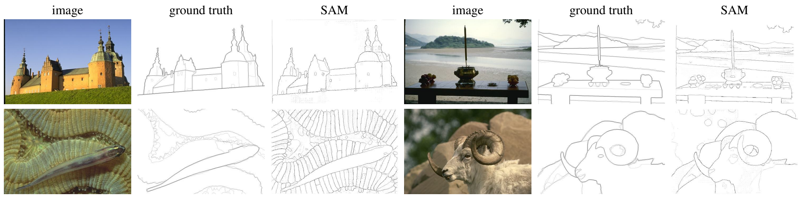

_图15：零样本边缘预测的补充可视化结果。请注意，SAM并未经过边缘图的预测训练，且在训练过程中没有接触BSDS图像及其标注。_

# D.2. 零样本边缘检测

**数据集与评估指标。** 我们在BSDS500 [72, 3] 上进行零样本边缘检测实验。每张图像的真值由五位不同标注者的人工标注组成。我们采用边缘检测的标准四项指标 [3, 32] 在包含200张图像的测试集上报告结果：最优数据集尺度（ODS）、最优图像尺度（OIS）、平均精度（AP）以及50%精度下的召回率（R50）。

**方法。** 对于零样本迁移，我们使用自动掩码生成流水线的简化版本。我们用 $16 \times 16$ 的前景点规则网格对SAM进行提示，由此产生768个预测掩码（每个点产生三个）。我们不按预测IoU或稳定性进行过滤。通过NMS去除冗余掩码。然后我们对剩余掩码的未阈值化概率图应用Sobel滤波器，若边缘像素与掩码外边界不相交则将其值设为零。最后，我们对所有预测取逐像素最大值，将结果线性归一化至[0,1]范围，并应用边缘NMS [13] 对边缘进行细化。

**可视化结果。** 在图15中，我们展示了SAM零样本边缘预测的更多示例。这些定性示例进一步说明，尽管SAM并未针对边缘检测进行训练，但其倾向于输出合理的边缘图。我们可以看到边缘能够与人工标注良好对齐。然而，正如前文所述，由于SAM未经边缘检测训练，它没有学习到BSDS500数据集的偏差，因此通常输出的边缘数量多于真值标注中存在的边缘。

# D.3. 零样本目标候选框生成

**数据集与评估指标。** 我们在LVIS v1验证集 [44] 上报告1000个候选框对应的掩码平均召回率（AR）这一标准指标。由于LVIS包含1203个物体类别的高质量掩码，这为目标候选框生成提供了具有挑战性的测试场景。我们专注于AR@1000，这是因为我们模型的开放世界特性，可能会在LVIS的1203个类别之外产生许多有效的掩码。为测量频繁、常见和稀有类别的性能，我们使用AR@1000，但针对仅包含相应LVIS类别的真值集合进行测量。

**基线方法。** 我们使用级联ViTDet-H作为基线，这是文献[62]中在LVIS上AP表现最强的模型。如正文所述，在域内训练的目标检测器可以"操控"AR [16]，因此预计它是一个比专注于开放世界候选框或分割的其他模型更强的基线 [58, 105]。为生成1000个候选框，我们禁用三个级联阶段的分数阈值，并将每个阶段的最大预测数提升至1000。

**方法。** 我们使用SAM自动掩码生成流水线的改进版本进行零样本迁移。首先，为使推理时间与ViTDet相当，我们不处理图像裁剪。其次，我们移除按预测IoU和稳定性进行的过滤。这留下了两个可调参数来获得每张图像约1000个掩码：输入点网格和NMS阈值（重复掩码抑制）。我们选择 $64 \times 64$ 的点网格和0.9的NMS阈值，平均每张图像产生约900个掩码。在评估时，如果图像中提出的掩码超过1000个，则按其置信度和稳定性分数的平均值排序，然后截断至前1000个候选框。

我们假设SAM输出多个掩码的能力对于此任务特别有价值，因为召回率应该受益于从单个输入点生成多尺度的候选框。为验证这一点，我们与SAM的消融版本（仅输出单个掩码而非三个，标记为SAM - 单输出）进行比较。由于该模型产生的掩码较少，我们进一步将采样点数和NMS阈值分别增加至 $128 \times 128$ 和0.95，平均每张图像获得约950个掩码。此外，单输出SAM不产生用于自动掩码生成流水线中NMS掩码排序的IoU分数，因此掩码按随机排序。测试表明这与更复杂的掩码排序方法（如使用掩码的最大logit值作为模型置信度的代理）具有相似的性能。

---

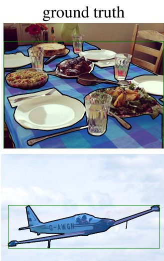

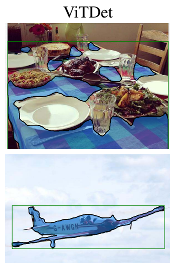

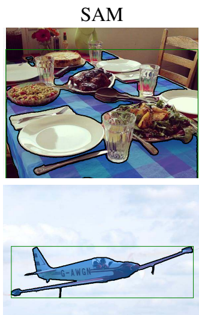

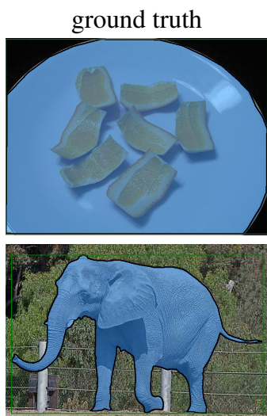

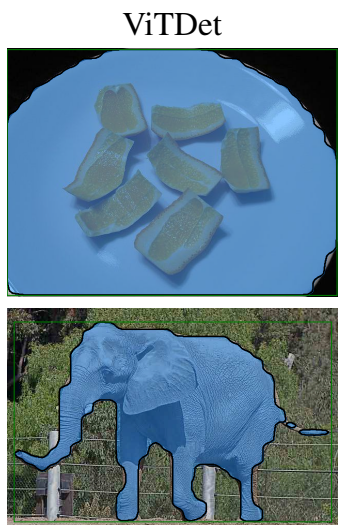

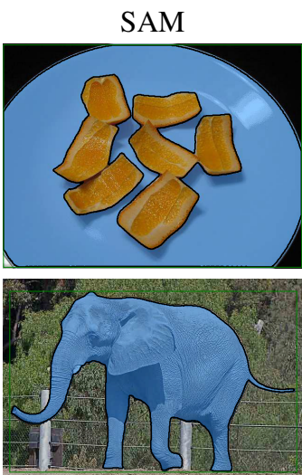

**图16：LVIS v1上的零样本实例分割。** SAM生成的掩码质量高于ViTDet。作为零样本模型，SAM没有机会学习特定训练数据的偏差；请参见右上角示例，SAM做出了模态预测，而LVIS的真值是非模态的，因为LVIS中的掩码标注本身不允许包含孔洞。

## D.4 零样本实例分割

**方法。** 对于零样本实例分割，我们使用全监督ViTDet-H在COCO和LVIS v1验证集上输出的边界框来提示SAM。我们通过额外的掩码 refinement 迭代来优化结果：将置信度最高的预测掩码与边界框提示一起反馈给掩码解码器，以生成最终预测。我们在图16中展示了在LVIS上预测的零样本实例分割。与ViTDet相比，SAM倾向于生成边界更清晰的高质量掩码。我们在§7.4中通过人类研究验证了这一观察结果。注意，作为零样本模型，SAM无法学习数据集中的标注偏差。例如，我们观察到SAM对盘子做出了有效的模态预测，而LVIS掩码按设计不能包含孔洞，因此盘子被标注为非模态。

## D.5 零样本文本到掩码

**模型与训练。** 我们使用最大的公开可用CLIP模型[82]（ViT-L/14@336px）来计算文本和图像嵌入，并在使用前对其进行ℓ²归一化。为了训练SAM，我们使用数据引擎前两个阶段的掩码。此外，我们丢弃所有面积小于100²像素的掩码。我们使用大规模抖动[40]对该模型进行120k次迭代训练，批量大小为128。所有其他训练参数遵循我们的默认设置。

**生成训练提示。** 为了提取输入提示，我们首先将每个掩码的边界框随机扩展1×到2×倍，然后对方形扩展框进行裁剪以保持其宽高比，并将其调整大小为336×336像素。在将裁剪区域输入CLIP图像编码器之前，我们以50%的概率将掩码外部的像素置零。为了确保嵌入专注于目标，我们使用最后一层中的掩码注意力，将输出token对图像位置的注意力限制在掩码内部。最终，我们的提示是输出token嵌入。训练时，我们首先提供基于CLIP的提示，然后添加额外的迭代点提示以 refine 预测。

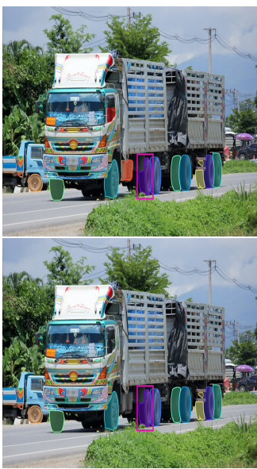

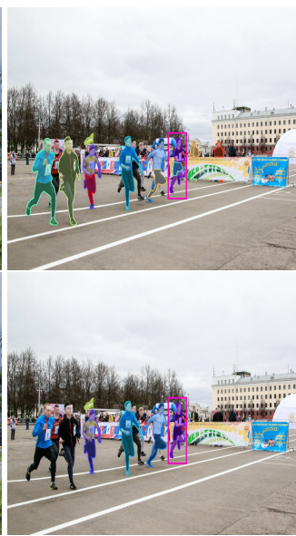

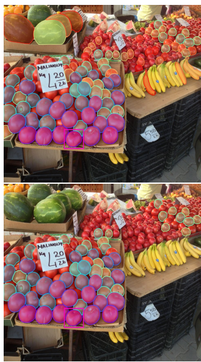

**图17：可视化对SAM潜在空间中掩码嵌入相似度的阈值处理。** 查询由品红色框指示；顶行显示低阈值下的匹配结果，底行显示高阈值下的匹配结果。同一图像中最相似的掩码嵌入通常在语义上与查询掩码嵌入相似，尽管SAM并未通过显式语义监督进行训练。

**推理。** 在推理过程中，我们使用CLIP文本编码器不做任何修改来为SAM创建提示。我们依赖于CLIP对齐文本和图像嵌入这一事实，这使得我们能够在训练时不使用任何显式文本监督，而在推理时使用基于文本的提示。

## D.6 探测SAM的潜在空间

最后，我们进行了初步研究，以定性探测SAM学习到的潜在空间。具体而言，我们感兴趣的是SAM是否能够在其表示中捕获任何语义信息，尽管它没有经过显式语义监督的训练。为此，我们通过从掩码周围的图像裁剪区域及其水平翻转版本中提取SAM的图像嵌入，将图像嵌入与二值掩码相乘，并在空间位置上取平均来计算掩码嵌入。在图17中，我们展示了同一图像中一个查询掩码和相似掩码（在潜在空间中）的3个示例。我们观察到

---

每个查询的最近邻展现出一定程度的形状和语义相似性，虽然并不完美。尽管这些结果仍是初步的，但它们表明来自 SAM 的表征可能对多种用途有用，例如进一步的数据标注、理解数据集内容，或作为下游任务的特征。

# E. 人类研究实验设计

在此我们详述用于评估第 7.1 节和第 7.4 节中掩码质量的人类研究细节。人类研究的目的是解决使用与真值的交并比（IoU）作为预测掩码质量指标的两个局限性。第一个局限性是，对于歧义输入（如单个点），模型可能因返回与真值不同的有效物体掩码而被严重惩罚。第二个局限性是，真值掩码可能包含各种偏差，例如边缘质量的系统性误差，或决定对遮挡物体进行模态或反模态分割的决策。域内训练的模型可以学习这些偏差，并在不产生更好掩码的情况下获得更高的 IoU。人工审查可以获取独立于底层真值掩码的掩码质量度量，以缓解这些问题。

**模型。** 对于单点评估，我们使用 RITM [92]、单输出 SAM 和 SAM 来测试两个假设。首先，我们假设 SAM 在给定单个点时产生比基线交互式分割模型视觉质量更高的掩码，即使 IoU 等指标与真值比较无法揭示这一点。其次，我们假设 SAM 的掩码消歧能力改善了单点输入的掩码质量，因为单输出 SAM 可能返回在歧义掩码上平均化的掩码。

对于实例分割实验，我们评估级联 ViTDet-H [62] 和 SAM，以测试以下假设：SAM 产生视觉质量更高的掩码，即使由于无法学习验证数据集的特定标注偏差而获得较低的 AP。

**数据集。** 对于单点实验，我们从 23 个数据集中选择 7 个，因为完整测试套件对于人工审查来说规模过大。我们选择 LVIS v0.5 [17]、VISOR [28, 27]、DRAM [24]、IBD [17]、NDD20 [100]、OVIS [81] 和 iShape [111]，它们提供了多样化的图像集合，包括场景级、第一人称视角、手绘、俯视、水下和合成图像。此外，该集合包含 SAM 在 IoU 指标上优于 RITM 和相反情况的数据集。对于实例分割实验，我们使用 LVIS v1 验证集，允许与在 LVIS 上训练的 ViTDet 进行直接比较。

**方法论。** 我们将模型生成的掩码展示给专业标注人员，并要求他们根据提供的指南对每个掩码进行评分（完整指南见 §G）。标注人员来自为数据引擎收集手动标注掩码的同一家公司。标注人员可以访问图像、单个模型的预测掩码以及模型输入（单个点或单个边界框），并被要求根据三个标准判断掩码：掩码是否对应一个有效物体？掩码是否有清晰的边界？掩码是否与输入对应？然后他们提交 1-10 的评分，表示整体掩码质量。

1 分表示完全不对应任何物体的掩码；低分（2-4）表示掩码存在巨大错误，例如包含其他物体的大面积区域或具有大面积无意义边界；中等分数（5-6）表示大部分合理但仍存在显著语义或边界错误的掩码；高分（7-9）表示仅存在轻微边界错误的掩码；10 分表示没有可见错误的掩码。标注人员获得五个不同的视图，每个视图旨在帮助识别不同类型的错误。

对于单点实验，从用于基准测试零样本交互式分割的相同子集中随机选择每个数据集 1000 个掩码（有关这些子集的详细信息见 §D.1）。模型输入是距离掩码边缘的距离变换最大值计算出的最中心点。对于实例分割实验，从 LVIS v1 验证集中选择 1000 个掩码，模型输入是 LVIS 真值边界框。在所有实验中，尺寸小于 $24^2$ 像素的掩码被排除在采样之外，以防止向评分者展示太小而无法准确判断的掩码。出于内存和显示原因，较大的图像在预测掩码前被缩放至最大边长为 2000。在所有实验中，相同的输入被馈送到每个模型以生成预测掩码。

作为比较，来自每个数据集的真值掩码也被提交评分。对于单点实验，每个数据集共产生 4000 个评分任务（RITM、单输出 SAM、SAM 和真值各 1000 个掩码）；对于实例分割实验，共产生 3000 个任务（ViTDet、SAM 和真值）。

对于每个数据集，这些任务以随机顺序插入到一个队列中，30 名标注人员从队列中获取任务。在审查研究的初步测试中，我们将每个任务分配给五名不同的标注人员，发现评分一致性合理：五名标注人员的评分标准差平均为 0.83。此外，标注公司部署了质量保证测试人员，对部分结果进行抽查，以确保极端偏离指南的情况。因此，对于我们的实验，每个任务（即在一张图像中对一个掩码进行评分）仅由一名标注人员完成。每位标注人员每个任务平均花费 90 秒，比初始目标的 30 秒更长，但仍足够快速地收集 7 个选定数据集中每个数据集的大量评分。

---

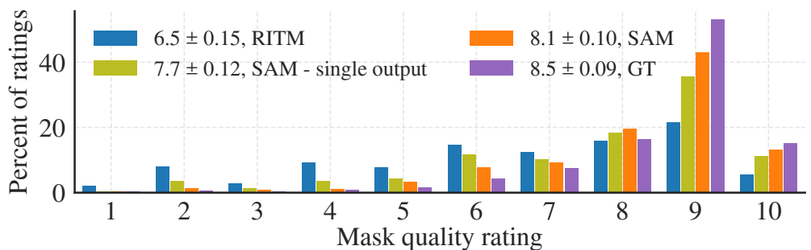

_(a) LVIS v0.5 [17]_

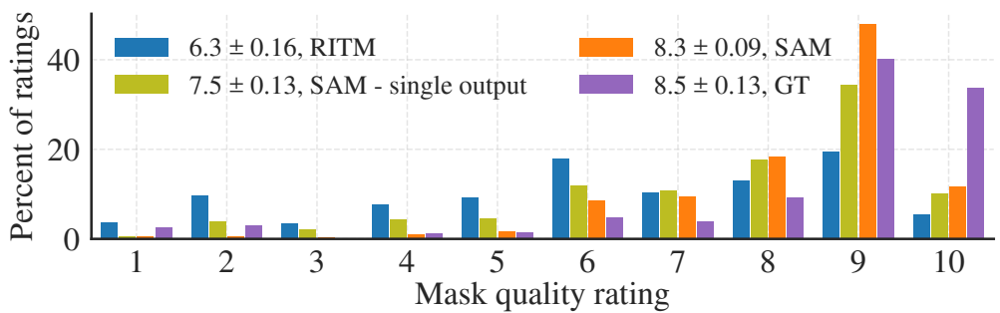

_(b) VISOR [28, 27]_

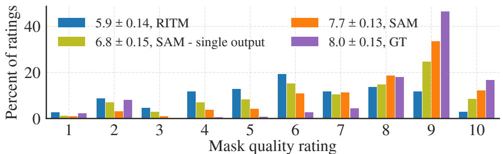

_(c) DRAM [24]_

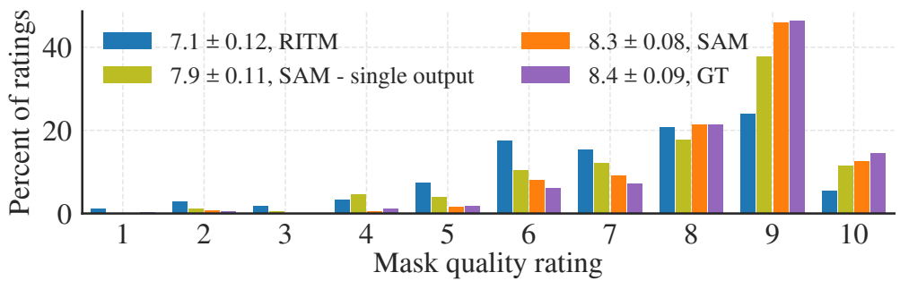

_(d) IBD [17]_

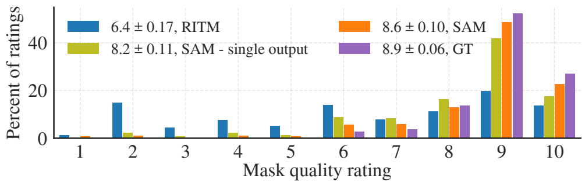

_(e) NDD20 [100]_

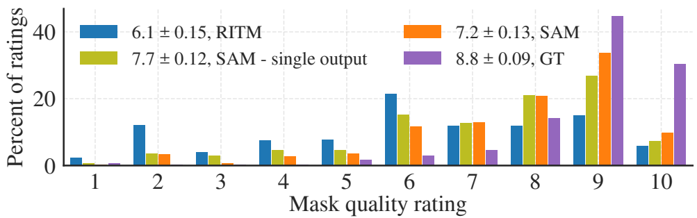

_(f) OVIS [81]_

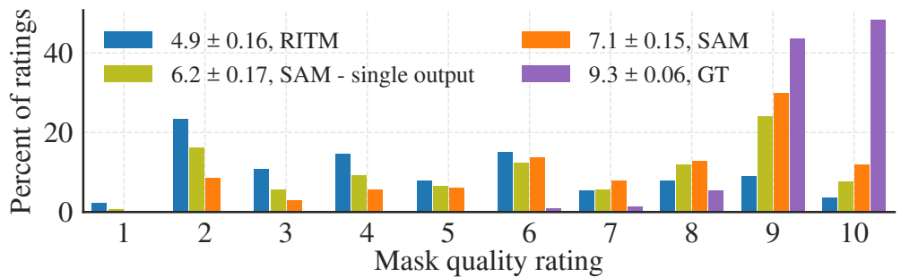

_(g) iShape [111]_

**图 18：人类评估研究中各数据集的掩码质量评分分布。**

| 数据集 | SAM > 基线 | | SAM > SAM 单输出 | |
|--------|---------|---------|------------------|---------|---------|
| | p值 | CI99(Δμ) | p值 | CI99(Δμ) |
| **点输入（RITM [92] 基线）：** |
| LVIS v0.5 [44] | 4e-69 | (1.40, 1.84) | 2e-11 | (0.29, 0.64) |
| VISOR [28, 27] | 7e-98 | (1.81, 2.24) | 7e-26 | (0.58, 0.94) |
| DRAM [24] | 1e-76 | (1.54, 2.00) | 2e-24 | (0.62, 1.03) |
| IBD [17] | 2e-57 | (1.03, 1.39) | 1e-15 | (0.32, 0.62) |
| NDD20 [100] | 2e-86 | (1.88, 2.37) | 5e-08 | (0.19, 0.55) |
| OVIS [81] | 2e-64 | (1.38, 1.84) | 3e-10 | (0.27, 0.63) |
| iShape [111] | 2e-88 | (1.97, 2.47) | 7e-23 | (0.65, 1.10) |
| **框输入（ViTDet-H [62] 基线）：** |
| LVIS v1 [44] | 2e-05 | (0.11, 0.42) | N/A | N/A |

**表 8：统计检验表明 SAM 的掩码质量评分显著高于基线和单输出 SAM。p值通过配对t检验计算，均值差异的置信区间通过10k样本的配对自举法计算。所有p值均显著，所有置信区间均不含零。**

**结果。** 图18展示了单点实验中各数据集评分的直方图。我们针对两个假设进行了统计检验：(1) SAM的得分高于基线模型（RITM或ViTDet）；(2) SAM的得分高于单输出SAM。p值通过模型得分均值的配对t检验计算，我们辅以10k样本的配对自举检验来确定均值差异的99%置信区间。表8展示了这些检验的p值和置信区间。所有统计检验均高度显著，且所有置信区间均不含零。

对于实例分割，图11展示了评分直方图。为了与COCO真值进行比较，我们额外纳入了794个在人类审查过程测试中收集的COCO真值掩码评分。这些掩码以与LVIS结果相同的设置呈现给标注员。为保证公平比较，图11中LVIS的结果被下采样至与每个模型和真值相同的794个输入。对于表8，使用全部1000个评分进行统计检验，结果表明SAM相对于ViTDet的掩码质量提升具有统计显著性。

---

# F. 数据集、标注与模型卡片

在 §F.1 中，我们以问答形式为 SA-1B 提供数据集卡片，参考了 [39]。接下来，在 §F.2 中，我们为第 4 节中描述的数据引擎的前两个阶段提供数据标注卡片，同样采用 CrowdWorkSheets [30] 的问答形式，参考了 [30]。我们在表 9 中提供了模型卡片，遵循 [75] 的格式。

# F.1 SA-1B 数据集卡片

# 动机

1. **创建该数据集的目的是什么？是否有特定的任务考量？是否有需要填补的特定空白？请提供描述。** 我们数据集对视觉社区的贡献有四个方面：(1) 我们发布了一个包含 1100 万张图像和 11 亿个掩膜的数据集，这是迄今为止最大的分割数据集。(2) 我们发布的数据集具有隐私保护功能：我们已对所有图像中的人脸和车牌进行了模糊处理。(3) 该数据集采用了一套广泛的使用条款授权，可访问 https://ai.facebook.com/datasets/segment-anything 查看详情。(4) 数据在地理多样性方面优于其前身，我们希望它能使社区在创建更公平、更公正的模型方面更进一步。

2. **谁创建了该数据集（例如，哪个团队、研究小组），代表哪个实体（例如，公司、机构、组织）？** 该数据集由 Meta AI 的 FAIR 团队创建。底层图像从第三方图片公司收集并授权获得。

3. **谁资助了该数据集的创建？如果有相关资助，请提供资助方名称、资助项目名称和编号。** Meta AI 资助了该数据集的创建。

4. **其他评论？** 无。

# 组成

1. **构成该数据集的实例代表什么（例如，文档、照片、人、国家）？是否存在多种类型的实例（例如，电影、用户和评分；人与人之间的互动；节点和边）？请提供描述。** 数据集中所有实例都是照片。照片的主题内容各不相同；常见主题包括：地点、物体、场景。所有照片都是独特的，但存在一些在同一主题下拍摄的照片集。

2. **总共有多少个实例（如果适当，按类型分别列出）？** 共有 1100 万张图像。

3. **该数据集是否包含所有可能的实例，还是从更大集合中的抽样（不一定是随机抽样）？如果是抽样，那么更大的集合是什么？该抽样是否代表更大的集合（例如，地理覆盖范围）？如果是，请描述如何验证这种代表性。如果不代表更大的集合，请描述原因（例如，为了覆盖更多样化的实例范围，因为某些实例被保留或不可用）。** 该数据集由从图片提供商授权的图像组成。该数据集包含所有已授权的实例。图像是照片，即不是艺术作品，但有一些例外。数据集包括数据集中每张图像生成的所有掩膜。我们保留了约 2000 张随机选择的图像用于测试目的。

4. **每个实例包含哪些数据？是"原始"数据（例如，未处理的文本或图像）还是特征？无论哪种情况，请提供描述。** 数据集中的每个实例都是一张图像。这些图像经过处理，对人脸和车牌进行了模糊处理，以保护图像中人物的 identity。

5. **每个实例是否有标签或目标？如果有，请提供描述。** 每张图像都用掩膜进行标注。掩膜没有关联的类别或文本。平均每张图像约有 100 个掩膜，总计约有 11 亿个掩膜。

6. **是否有任何信息从单个实例中缺失？如果有，请提供描述，解释为什么这些信息缺失（例如，因为不可用）。这不包括故意删除的信息，但可能包括，例如，被编辑的文本。** 是的。每张图像都附有一个简短的标题，以自由文本形式描述照片的内容和拍摄地点。根据我们与图片提供商的协议，我们不能发布这些标题。然而，我们在论文中用它们来分析数据集的地理分布。

7. **实例之间的关系是否被明确化（例如，用户的电影评分、社交网络链接）？如果是，请描述这些关系是如何明确的。** 否，数据集中实例之间没有已知的关联关系。

8. **数据集中是否有任何错误、噪声来源或冗余？如果有，请提供描述。** 错误：掩膜由分割模型生成，因此掩膜中可能存在错误或不一致。冗余：虽然没有任何两张图像是完全相同的，但存在在同一主题下短时间内拍摄的多张图像。

9. **数据集是自包含的，还是链接到或依赖外部资源（例如，网站、推文、其他数据集）？如果链接到或依赖外部资源，a) 是否有保证这些资源会随时间存在并保持不变；b) 是否有完整的归档版本（即，包括数据集创建时存在的外部资源）；c) 是否有与任何外部资源相关的任何限制（例如，许可证、费用）可能适用于数据集使用者？请提供所有外部资源的描述及其相关限制，以及适当的链接或其他访问点的信息。** 数据集是自包含的。

10. **数据集是否包含可能被认为保密的数据（例如，受法律特权保护的数据，或医患保密的数据，包含个人非公开通信内容的数据）？如果有，请提供描述。** 否。

11. **数据集是否包含直接查看可能被认为是冒犯、侮辱、威胁或可能引起焦虑的数据？如果有，请描述原因。** 我们有两项安全措施来防止不当内容：(1) 照片从图片提供商授权，必须符合图片提供商的服务条款。我们要求对授权图像中的所有不当内容进行过滤。(2) 如果用户发现数据集中的不当图像，我们邀请他们通过 segment anything@meta.com 报告图像，以便移除。尽管采取了这些措施，我们观察到少量图像包含抗议或其他集会的场景，这些场景聚焦于可能具有冒犯性的宗教信仰或政治观点的多样化光谱。我们无法制定出能移除所有此类图像的过滤策略，因此依靠用户报告此类内容。

12. **数据集是否识别任何子群体（例如，按年龄、性别）？如果有，请描述这些子群体是如何识别的，并提供它们在数据集中各自分布的描述。** 数据集不识别照片中任何人的子群体。

13. **是否可能从数据集中直接或间接（即，与其他数据结合）识别个人（即，一个或多个自然人）？如果可以，请描述如何识别。** 不可能。图像经过人脸模糊模型处理以移除任何个人身份信息。如果用户发现任何匿名化问题，我们邀请他们通过 segment-anything@meta.com 报告问题和图像 ID。

14. **数据集是否包含可能被认为在任何方面敏感的数据（例如，揭示种族或民族来源、性取向、宗教信仰、政治观点或工会成员身份或位置的数据；财务或健康数据；生物识别或基因数据；政府身份证明形式，如社会安全号码；犯罪记录）？如果有，请提供描述。** 数据集包含抗议或可能暗示宗教信仰、政治观点或工会成员身份的其他集会场景。然而，数据集中所有人的面孔都通过面部模糊进行了匿名化处理，因此不可能识别数据集中的任何人。

15. **其他评论？** 无。

# 收集过程

1. **如何获取与每个实例关联的数据？数据是直接可观察的（例如，原始文本、电影评分）、由受试者报告的（例如，调查回复），还是从其他数据中间接推断/派生的（例如，词性标签、基于模型的年龄或语言猜测）？如果数据是由受试者报告的或从其他数据中间接推断/派生的，数据是否经过验证/确认？如果是，请描述如何验证。** 与每张图像关联发布的掩膜由我们的分割模型 SAM 自动推断。使用模型辅助手动标注收集的掩膜将不会发布。质量验证如 §5 所述。

2. **使用什么机制或程序来收集数据（例如，硬件设备或传感器、人工人工策划、软件程序、软件 API）？这些机制或程序是如何验证的？** 数据集中的图像从图片提供商授权获得。它们都是摄影师使用不同相机拍摄的照片。

---

3. 如果数据集是从更大的集合中采样的，采样策略是什么（例如，确定性采样、具有特定采样概率的概率性采样）？我们预留了约 2k 张随机选取的图像用于测试目的。其余已授权的图像均包含在数据集中。

4. 谁参与了数据收集过程（例如，学生、众包工作者、承包商），他们如何获得补偿（例如，众包工作者的报酬是多少）？发布的掩膜由 SAM 自动推理得出。关于模型辅助人工标注过程的详细信息，请参阅 §F.2 中的数据标注卡。请注意，这些掩膜将不会发布。

5. 数据是在什么时间段收集的？这个时间段是否与数据相关实例的创建时间段相匹配（例如，近期抓取的旧新闻文章）？如果不匹配，请描述数据相关实例的创建时间段。授权照片的拍摄日期跨度较大，最早可追溯到 2022 年。

6. 是否进行了任何伦理审查程序（例如，由机构审查委员会进行）？如果进行了，请提供这些审查程序的描述，包括结果，以及任何支持文档的链接或访问方式。如果数据集与个人无关，您可以跳过本节中的其余问题。我们进行了内部隐私审查，以评估和确定如何降低与照片中个人隐私相关的潜在风险。对面部和车牌进行模糊处理可保护照片中个人的隐私。

7. 您是直接从相关个人收集数据，还是通过第三方或其他来源（例如网站）获取数据？我们从第三方图片提供商处获得数据授权。

8. 相关个人是否被告知数据收集情况？如果是，请描述（或通过截图或其他信息展示）通知是如何提供的，并提供通知本身的确切语言链接或访问点，或以其他方式复制。图像已从第三方获得授权，该第三方就个人通知和同意的收集提供了适当的声明。此外，所有可识别信息（例如面部、车牌）均已模糊处理。根据数据集许可条款，禁止尝试识别或关联特定个人的图像。

9. 相关个人是否同意收集和使用其数据？如果是，请描述（或通过截图或其他信息展示）同意是如何请求和提供的，并提供同意语言的链接或访问点，或以其他方式复制。图像已从第三方获得授权，该第三方就个人通知和同意的收集提供了适当的声明。此外，所有可识别信息（例如面部、车牌）均已从所有图像中模糊处理。为避免疑问，根据数据集许可条款，禁止尝试识别或关联特定个人的图像。

10. 如果获得了同意，是否为同意的个人提供了在未来或针对某些用途撤销同意的机制？如果有，请提供描述，以及该机制的链接或访问点（如果适用）。我们邀请用户通过 segment-anything@meta.com 报告图像移除请求。

11. 是否已对数据集及其使用对数据主体（例如数据保护影响分析）的潜在影响进行了分析？如果进行了，请提供此分析的描述，包括结果，以及任何支持文档的链接或访问点。为消除包含在数据集中的照片中人物的潜在影响，可识别信息（面部、车牌）已被模糊处理。

12. 其他评论？没有。

# 预处理 / 清洗 / 标注

1. 是否对数据进行了任何预处理 / 清洗 / 标注（例如，分箱或分桶、分词、词性标注、SIFT 特征提取、实例删除、缺失值处理）？如果进行了，请提供描述。如果未进行，您可以跳过本节中的其余问题。我们将高分辨率授权图像调整为较短边为 1500 像素，并仅对图像进行处理以移除照片中的任何可识别和个人信息（面部、车牌）。

2. 除了预处理 / 清洗 / 标注后的数据外，是否还保存了"原始"数据（例如，以支持意外的将来用途）？如果是，请提供"原始"数据的链接或访问点。没有，由于我们出于安全原因和尊重隐私而移除了数据，因此我们不发布未更改的照片。

3. 用于预处理 / 清洗 / 标注数据的软件是否可用？如果可用，请提供链接或访问点。我们使用了 RetinaFace [88, 89] 模型（https://github.com/serengil/retinaface）来检测面部。用于模糊车牌的模型尚未公开。

# 用途

1. 数据集是否已被用于任何任务？如果是，请提供描述。数据集已用于训练我们的分割模型 SAM。

2. 是否有存储库链接到使用该数据集的所有论文或系统？如果有，请提供链接或访问点。没有。但是，所有数据集用户必须引用它，因此其使用可通过引用浏览器进行追踪。

3. 数据集还可用于哪些（其他）任务？我们打算将数据集作为一个大规模分割数据集使用。然而，我们邀请研究社区为数据集收集额外的标注。

4. 数据集的组成或其收集和预处理 / 清洗 / 标注方式是否有可能影响将来用途？例如，数据集使用者是否需要了解某些信息以避免可能导致个人或群体不公平对待的用途（例如，刻板印象、服务质量问题）或其他风险或伤害（例如，法律风险、财务损失）？如果是，请提供描述。数据集使用者可以采取什么措施来降低这些风险或伤害？我们在 §6 中对数据集的大致地理和收入水平覆盖范围进行了分析。虽然我们认为我们的数据集比目前大多数公开可用的数据集更具代表性，但我们承认我们并未在所有群体之间实现均等，我们鼓励用户注意其使用该数据集训练的模型可能存在的潜在偏见。

5. 是否有数据集不应使用的任务？如果有，请提供描述。数据集的完整使用条款（包括禁止的使用案例）可在 https://ai.facebook.com/datasets/segment-anything 查看。

6. 其他评论？没有。

# 分布

1. 数据集是否会分发给创建数据集所代表的实体（例如，公司、机构、组织）以外第三方？如果会，请提供描述。数据集将向研究社区开放。

2. 数据集将如何分发（例如，网站上的 tarball、API、GitHub）？数据集是否有数字对象标识符（DOI）？数据集可在 https://ai.facebook.com/datasets/segment-anything 获取。

3. 数据集何时分发？数据集将于 2023 年发布。

4. 数据集是否将在版权或其他知识产权（IP）许可下分发，和/或适用使用条款（ToU）？如果是，请描述此许可和/或 ToU，并提供相关许可条款或 ToU 的链接或访问点，或以其他方式复制，以及与这些限制相关的任何费用。数据集的许可协议和使用条款可在 https://ai.facebook.com/datasets/segment-anything 查看。用户必须在下载或使用数据集之前同意使用条款。

5. 是否有任何第三方对与实例相关的数据施加了基于 IP 的或其他限制？如果有，请描述这些限制，并提供相关许可条款的链接或访问点，或以其他方式复制，以及与这些限制相关的任何费用。SA-1B 数据集的完整使用条款和限制可在 https://ai.facebook.com/datasets/segment-anything 查看。

6. 是否有任何出口管制或其他监管限制适用于数据集或单个实例？如果有，请描述这些限制，并提供支持文档的链接或访问点，或以其他方式复制。SA-1B 数据集的许可和使用限制可在 https://ai.facebook.com/datasets/segment-anything 查看。

7. 其他评论？没有。

# 维护

1. 谁将支持 / 托管 / 维护数据集？数据集将托管于 https://ai.facebook.com/datasets/segment-anything，由 Meta AI 维护。

2. 如何联系数据集的所有者 / 策展人 / 管理者（例如，电子邮件地址）？请发送邮件至 segment-anything@meta.com。

3. 是否有勘误表？如果有，请提供链接或访问点。没有。

4. 数据集是否会更新（例如，纠正标注错误、添加新实例、删除实例）？如果是，请描述更新频率、更新者和更新将如何传达给数据集使用者（例如，邮件列表、---

---

5. 如果数据集涉及人物，是否对与这些实例相关的数据保留有适用的限制（例如，相关个人是否被告知其数据将被保留固定期限然后删除）？如果是，请描述这些限制及其执行方式。数据保留没有时间限制。我们采取了措施从任何人物图像中删除个人身份信息。用户可以通过以下方式报告潜在删除的内容：segment-anything@meta.com。

6. 是否会继续支持/托管/维护旧版本的 dataset？如果是，请描述如何维护。如果不是，请描述如何向数据集使用者传达其过时的信息。不会，因为唯一的更新将是删除潜在有害内容，我们不会保留包含该内容的旧版本。

7. 如果其他人想要扩展/增强/构建/贡献数据集，是否有相应的机制？如果有，请提供描述。这些贡献是否会被验证/确认？如果是，请描述如何。如果没有，为什么没有？是否有向数据集使用者传达/分发这些贡献的流程？如果有，请提供描述。我们鼓励用户为 SA-1B 收集进一步的标注。任何生成标注的用户将负责托管和分发其标注。

8. 任何其他评论？没有。

# F.2. 数据标注卡片

## 任务 formulation

1. 在高层面上，你的任务有哪些主观方面？分割图像中存在的对象本质上是一项主观任务。例如，一位标注员可能将两只靴子分割为一个掩码，而另一位可能分别分割每只靴子。根据标注员的技能，掩码的质量和每张图像的掩码数量在不同标注员之间存在差异。尽管任务存在这些主观方面，我们相信高效标注是可行的，因为数据是以每个掩码的方式进行标注的，主要关注数据的多样性而非完整性。

2. 你对标注员有什么假设？我们的标注员全职从事标注任务，人员流失率非常低。这使得我们能够定期培训标注员、提供反馈并回答他们的问题。具体来说：（1）通过清晰地阐明这项工作的目标并提供明确的指南（包括视觉示例和任务视频录制），标注员有足够的背景来理解和合理地执行任务。（2）分享目标和关键成果并每周与标注员开会，增加了标注员随时间提高标注质量和数量的可能性。

3. 你如何选择任务说明的具体措辞？为验证标注员任务说明和措辞的清晰性采取了哪些步骤（如有）？由于我们的任务是标注图像，标注指南包含视觉示例。我们的研究团队完成了 30 个标注任务，以识别使用标注工具时的明显挑战，共同决定如何处理复杂情况，并完善指南。研究团队每周与标注员举行反馈会议。研究团队执行任务的视频会现场与标注员分享，随后进行问答环节。标注员能够在反馈会议期间和异步地就模糊方面提供反馈。

4. 你的任务对标注员构成哪些风险（如有），他们是否在参与任务之前被告知这些风险？未发现风险。图像在标注阶段之前已过滤了令人反感的内容。

5. 向标注员提供的精确指令是什么？我们只提供高层指令：给定一张图像，我们的目标是分割每个可能的物体。标注员为他们能识别的每个潜在物体生成一个掩码。物体可以使用我们的交互式分割工具进行分割，既可以通过更正性前景/背景点击来添加/删除掩码的部分，也可以通过在物体周围绘制边界框。掩码可以使用像素精确工具进行细化。

## 选择标注

1. 是否有某些观点应该被优选？如果是，你如何寻求这些观点？我们选择与之前从事过其他视觉标注任务的标注员合作。

2. 是否有某些观点会具有有害性？如果是，你如何筛选出这些观点？没有。

3. 是否使用社会人口统计学特征来选择任务的标注员？如果是，请详细说明流程。没有。

4. 如果你对标注员池有任何汇总的社会人口统计数据，请描述。你是否有理由相信标注员的社会人口统计学特征可能影响了他们如何标注数据？为什么或为什么不？我们与 130 名标注员合作。标注员全部位于肯尼亚。我们不相信标注员的社会人口统计学特征对标注数据产生了有意义的影响。

5. 考虑数据集的预期使用情境以及可能受到在此数据集上训练的模型影响的个人和社区。这些社区是否在你的标注员池中得到代表？分割万物 1B（SA-1B）数据集仅用于研究目的。如 §6 中所讨论的，SA-1B 数据集是地理多样性最高的分割数据集。此外，我们在 §6 中分析了在该数据集上训练的模型的负责任 AI 维度。

## 平台和基础设施选择

1. 你使用了什么标注平台？高层面上，是什么考虑因素影响了选择该平台的决定？所选平台是否充分满足你为标注员池设定的要求？是否有未覆盖的方面？我们使用了专有标注平台。

2. 你选择的平台提供哪些沟通渠道（如有）来促进与标注员的沟通？这种沟通渠道如何影响标注过程和/或最终标注？我们手动审查标注并每周与标注员分享反馈。我们传达常见错误或不一致之处以及相应的更正。此外，标注员每天通过标注质量保证团队获得改进反馈。在每周反馈会议之外，标注员可以访问电子表格和聊天群，以便与研究团队进行沟通。这个过程大大提高了标注的平均速度和质量。

3. 标注员的报酬是多少？确定报酬时你是否考虑了特定的薪酬标准？如果是，请描述。标注员按供应商设定的时薪获得报酬。该供应商是一家经过认证的 B 型公司。

## 数据集分析和评估

1. 你如何在你的情境中定义标注质量，你如何评估你所构建的数据集的质量？标注员首先进入培训阶段。他们遵循由供应商领导的一天培训课程，然后被要求从训练队列中标注大量示例。标注员在供应商质量保证团队与研究团队合作手动抽查标注员的掩码以确保质量后，从培训阶段毕业进入生产阶段。平均而言，标注员在毕业前花一周时间进行培训。生产质量评估遵循类似流程：供应商质量保证团队和研究团队每周手动审查标注，每周分享反馈。

2. 你是否进行了任何关于分歧模式的分析？如果是，你使用了哪些分析，主要发现是什么？你是否分析了潜在的分歧来源？我们在与标注员的每周会议上指出常见错误。

3. 个体标注员响应与数据集中发布的最终标签之间是什么关系？标注仅用于训练 SAM 的早期版本，我们目前不计划发布它们。

## 数据集发布和维护

1. 你是否有理由相信数据集中的标注可能随时间变化？你是否计划更新你的数据集？不会，除删除令人反感的图像外。

2. 是否有任何条件或定义（如有变化）可能影响你数据集的效用？我们不相信有。

3. 你是否尝试追踪、施加限制或以其他方式影响你的数据集的使用方式？如果是，如何？SA-1B 数据集将根据许可协议发布，允许用于某些研究目的并为研究人员提供保护。研究人员必须同意许可协议的条款才能访问数据集。

4. 标注员是否被告知数据如何被外部化？如果数据集发生更改，他们是否会被通知？不会，我们目前不计划发布手动标注。

5. 标注员是否有后续程序可以选择从数据集中撤回其数据？如果有，请详细说明。没有。

---

## 模型概述

<table><tr><td>名称</td><td>SAM（Segment Anything Model，万物分割模型）</td></tr><tr><td>版本</td><td>1.0</td></tr><tr><td>发布日期</td><td>2023</td></tr><tr><td>发布机构</td><td>Meta AI 的 FAIR 团队</td></tr><tr><td>模式类型</td><td>可提示分割模型</td></tr><tr><td>架构</td><td>见 §3</td></tr><tr><td>代码仓库</td><td>https://github.com/facebookresearch/segment-anything</td></tr><tr><td>引用</td><td>https://research.facebook.com/publications/segment-anything</td></tr><tr><td>许可证</td><td>Apache 2.0</td></tr><tr><td colspan="2">预期用途</td></tr><tr><td>主要预期用途</td><td>SAM 旨在用于任何基于提示的分割任务。我们探索了其在以下方面的应用：从点提示分割物体（§7.1）、边缘检测（§7.2）、分割所有物体（§7.3）以及分割检测到的物体（§7.4）。我们还探索了 SAM 如何与其他视觉模型集成，以实现基于文本的物体分割（§7.5）。</td></tr><tr><td>主要预期用户</td><td>SAM 主要为研究目的而开发。SAM 的许可证见 https://github.com/facebookresearch/segment-anything。请参阅 https://github.com/facebookresearch/segment-anything 上 SAM 的使用条款。详见伦理考量部分的使用案例。</td></tr><tr><td>超出范围的使用案例</td><td>SAM 在广泛的任务中展现出令人印象深刻的零样本性能。然而，我们注意到，在零样本设置下，给定输入可能存在多个有效的真值掩码。我们建议用户在将 SAM 用于零样本分割时考虑这一点。SAM 可能会遗漏精细结构，并可能产生小的断开的组件的幻觉。详见 §8 中关于局限性的讨论。</td></tr><tr><td>注意事项与建议</td><td>SAM 旨在分割任何物体，包括"物质（stuff）"和"物体（things）"。我们在多样化的数据集上对 SAM 进行了基准测试，发现它可以处理各种视觉数据，包括仿真图像、绘画、水下图像、显微镜图像、驾驶数据、立体图像、鱼眼图像。详见 §D.1 和表 7，了解所用基准测试的信息。</td></tr><tr><td colspan="2">相关因素</td></tr><tr><td>群体</td><td>SAM 旨在分割任何物体，包括"物质（stuff）"和"物体（things）"。</td></tr><tr><td>仪器与环境</td><td>我们在多样化的数据集上对 SAM 进行了基准测试，发现它可以处理各种视觉数据，包括仿真图像、绘画、水下图像、显微镜图像、驾驶数据、立体图像、鱼眼图像。详见 §D.1 和表 7，了解所用基准测试的信息。</td></tr><tr><td colspan="2">指标</td></tr><tr><td>模型性能度量</td><td>我们根据实验中下游任务的不同，使用多种指标对 SAM 进行了评估。</td></tr><tr><td></td><td>• mIoU：我们在给定数量的提示后使用平均交并比来评估点提示时掩码的分割质量。</td></tr><tr><td></td><td>• 人工评估：我们进行了一项人工研究（详见 §E），以评估 SAM 在真实世界中的性能。我们将 SAM 生成的掩码与基线先进交互式分割模型 RITM [92] 生成的掩码进行比较，采用 1 到 10 的感知质量量表。</td></tr><tr><td></td><td>• AP：我们使用平均精度来评估给定边界框的实例分割和边缘检测。</td></tr><tr><td></td><td>• AR@1000：我们使用平均召回率来评估目标提议生成。</td></tr><tr><td></td><td>• ODS、OIS、AP、R50：我们使用 BSDS500 [72, 3] 的标准边缘检测评估指标。</td></tr><tr><td colspan="2">评估数据</td></tr><tr><td>数据来源</td><td>见 §D.1。</td></tr><tr><td colspan="2">训练数据</td></tr><tr><td>数据来源</td><td>见 §F.1 中的数据卡片。</td></tr><tr><td colspan="2">伦理考量</td></tr><tr><td>数据</td><td>我们使用已获得许可的图像对 SAM 进行了训练。图像提供商已对不良内容进行了过滤，但我们承认可能存在漏检的情况。我们对 SA-1B 数据集进行了地理分析（见 §6）。虽然 SA-1B 比其前代数据集具有更高的地理多样性，但我们承认某些地区和经济群体在数据集中代表性不足。</td></tr><tr><td>计算成本与影响</td><td>SAM 在 256 块 A100 GPU 上训练了 68 小时。我们认识到训练大规模模型对环境的影响和成本。训练发布的 SAM 模型对环境的影响约为 6963 千瓦时，根据所用特定数据中心，产生约 2.8 公吨二氧化碳（使用 [77] 中描述的计算方法和 ML CO2 Impact 计算器 [61]）。这相当于美国普通汽油动力乘用车行驶约 7000 英里 [101]。我们发布 SAM 模型是为了减少重复训练的需求，并降低大规模视觉研究的准入门槛。</td></tr><tr><td>风险与危害</td><td>我们在 §6 中对 SAM 进行了公平性评估。SAM 的下游应用将产生各自的潜在偏见和公平性问题。因此，我们建议用户在将 SAM 用于特定案例时运行自己的公平性评估。</td></tr><tr><td>使用案例</td><td>我们恳请用户在模型的下游应用中运用最佳判断。</td></tr></table>

**表 9：SAM 的模型卡片，遵循 [75] 中详述的程序。**

---

# G. 标注指南

我们提供了图19和图20中供人工审核mask质量评分的完整指南。

---

我们有几个模型，当提供点击或框作为输入时，输出一个mask。我们希望通过在大量样本上对mask质量进行评分来比较这些模型的质量。界面将与常规mask标注不同。

每个任务审查一张图像中的一个mask。

右侧将有两行共五张图像缩略图。每个缩略图可以鼠标悬停以较大尺寸显示图像。点击缩略图将使其全屏显示，再次点击将返回原始屏幕。

- 图像显示同一mask的五种不同视图。顶行：（左）不带mask的图像，（中）mask叠加在图像上，（右）单独的mask。底行：（左）物体的放大视图（无mask），（右）mask叠加在图像上的放大视图。提供这些视图是为了便于查看不同类型的mask错误。

当mask叠加在图像上时将显示为红色。

- 当单独显示时，mask为黄色，背景为紫色。

每张图像将包含一个蓝点或一个蓝白相间的框。这是模型的输入，就好像您在该位置点击或绘制了这个框。

左侧有标记为1-10的按钮。这用于对显示的mask质量进行评分。

## 客观设置

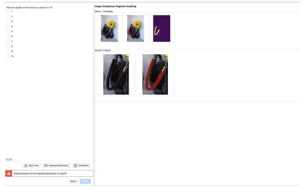

_示例界面页面。右侧有五张图像，左侧有问答框。_

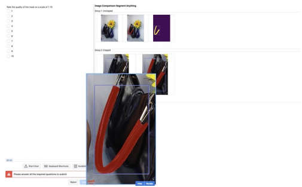

_鼠标悬停在图像上可显示完整图像。_

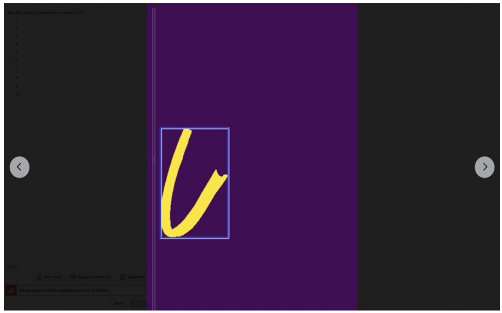

_点击图像可使其全屏显示。箭头可在图像间循环切换。再次点击返回之前的视图。_

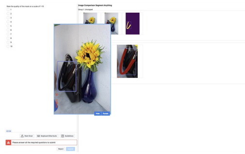

_顶行第一张图像显示不带mask的图像。蓝点将在目标物体上，或蓝白框将围绕它。_

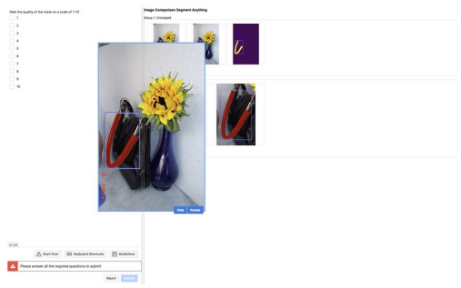

_顶行第二张图像显示物体的红色mask。_

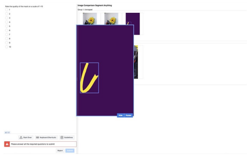

_顶行第三张图像仅显示mask。mask为黄色，背景为紫色。_

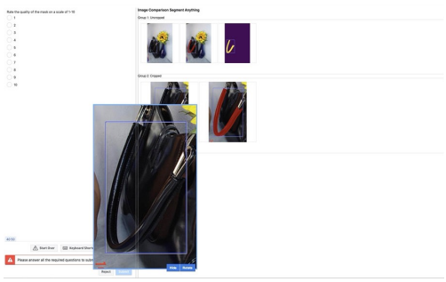

_底行第一张图像显示物体不带mask的放大视图。_

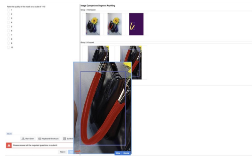

_底行第二张图像显示物体带mask的放大视图。mask为红色。_

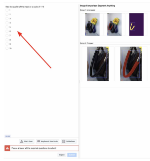

_左侧是用于评价mask质量的按钮，选择范围为1-10。_

## 我们希望您对每个任务做的操作：

请每个任务花费不超过30秒。

- 鼠标悬停或点击右侧的三张mask图像，以了解mask的质量。缩略图太小无法评判mask，不要仅根据缩略图评判。每张图像可以提供关于可能mask错误的不同信号：

未放大的图像可以提供mask的上下文：这个mask是否对应一个真实的物体？

- 仅显示mask的图像可以显示mask是否有小孔或孤立的错误像素。
- 放大的图像可以显示mask边界是否合理。

- 根据三个标准评判mask的质量。示例如下。

- mask是否对应一个真实的物体？

mask边界质量好吗？

- mask是否与提供的点或框对应？

使用左侧的下拉框对mask质量进行1-10的评分。

- 接下来是关于根据三个标准评判mask质量的详细信息和示例。这些只是示例，可能会出现其他情况，请在判断某物是否为好的mask时使用最佳判断。

## 任务

### mask是否对应一个真实的物体？

有效的物体可以包括：

完整的单个物体（如人、衬衫或树）

物体的逻辑部分（椅子腿、汽车车门、桌面）

- 物体的集合（一摞书、一群人）

示例错误。mask可能具有这些错误的严重程度可能为轻微或严重：

- 包含另一个物体的一部分（一个人的mask包含了旁边人的手臂）。

- 遗漏了物体的一部分（mask仅覆盖了被前景树木遮挡的建筑的一部分）。

- 合并两个无关物体（单个mask覆盖了桌上的一个杯子和一支笔）。

- 对于点输入，包含集合中任意数量的一部分（点在堆叠的多个苹果中的一个苹果上，但mask覆盖了三个苹果）。如果框围绕集合的任意部分，mask应覆盖相同的部分。

- 如果您不确定，一个好的经验法则是：您能说出所讨论的物体是什么吗？然而，一些难以命名的物体可能仍然是好的物体（机器的不同寻常的部件、图像边缘难以确定是什么的东西）。

## 评判Mask质量（1/3）

### mask是否有好的边界？

边界错误可能包括：

- mask中不正确的孔洞

- 与mask主体分离的错误像素

- 边缘质量差，即mask不能完全匹配物体的边缘

- 处理遮挡前景物体时的不一致（一个mask覆盖了一些遮挡物体但没有覆盖其他遮挡物体是一种错误，但只覆盖两者之一则不是错误）

- 小的mask的像素化不是错误，只要mask仍然匹配物体的边缘。

## 评判Mask质量（2/3）

### mask是否与提供的点或框对应？

对于点：

- 点必须在mask上

- 物体相对于点的大小或位置无关紧要（点在某人戴手套的手上，可以对应手套或整个人，两者都是有效的mask）。

对于框：

- 物体必须是与框大小相匹配的最佳物体（如果框围绕某人的整个头部，但mask是他们的头发，这是错误的；头发在框中但不是三个元素之一，不是正确的物体）。

- 如果框明确对应某个物体但略小于它，mask稍微超出框是可以的（如果框围绕一个人但遗漏了他们伸出的手，mask仍然可以包含他们的手，即使mask超出了框）。

## 评判Mask质量（3/3）

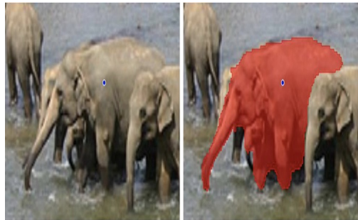

_“包含另一个物体的一部分”的错误示例：大象mask包含了另一只附近大象的一部分。_

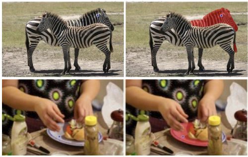

_“遗漏物体的一部分”的错误示例：mask遗漏了物体的一个断开部分：斑马的後半身和盘子的右侧部分。_

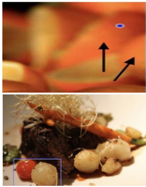

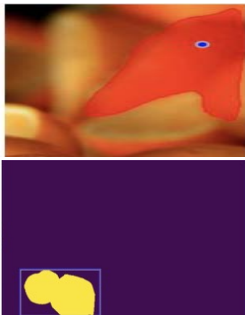

_“包含集合中任意数量的一部分”的错误示例：在上图中，点在一个橙子皮上，但mask覆盖了两个橙子皮。这是一个mask错误：mask覆盖了集合中任意数量的物体，应该覆盖一个橙子皮或全部橙子皮。在下图中，框围绕两个蔬菜。由于这是与框的最佳匹配，这不是mask错误。_

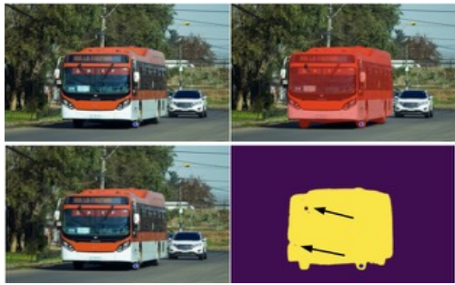

_“mask中有不正确的孔洞”的错误示例：这个mask在左上角和左侧有孔洞（黑色箭头）。这些孔洞在“仅mask”图像上更容易看到。_

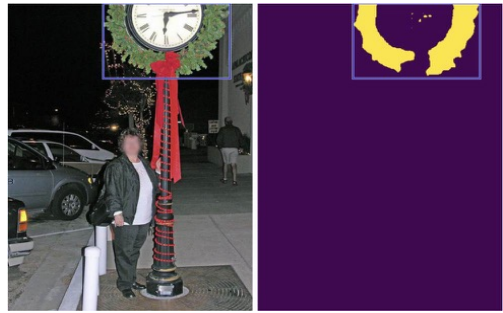

_“包含与mask主体分离的错误像素”的错误示例：“仅mask”视图显示钟面上有一些孤立的错误像素。_

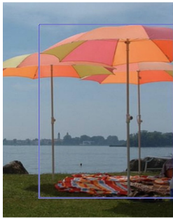

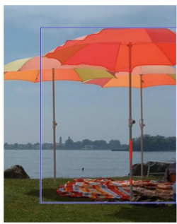

_“边缘质量差”的错误示例：mask边缘质量差，既沿着伞的边缘，也沿着细伞柄。_

_Figure 19：这里我们提供了供标注人员进行mask质量人工审核的完整指南。一些图像略有编辑，面部已模糊处理以便于发布。最佳观看方式为放大（1/2）。_

---

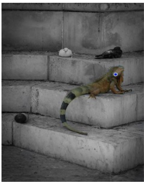

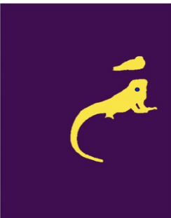

_「组合两个无关事物」的示例：点指示蜥蜴，但遮罩覆盖了蜥蜴和一只鸟。这是遮罩错误。_

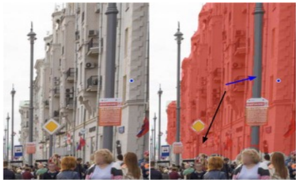

_「未能一致处理遮挡前景物体」的示例错误：右侧的杆子（蓝色箭头）被排除在遮罩之外，而左侧的杆子被包含在物体中（黑色箭头）。遮罩应该要么同时包含两者，要么同时排除两者。_

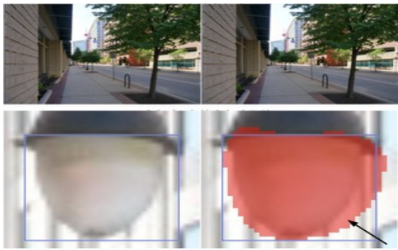

_「小遮罩的像素化」示例：这个遮罩的边界不完美，因为它超出了物体（黑色箭头处）。然而，遮罩的「块状」图案不是错误，因为当放大到这种程度时，图像本身也是同样块状的。_

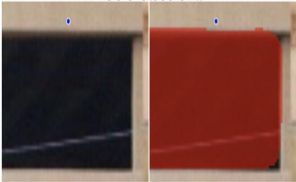

_「与给定标注点不一致」的示例错误：遮罩与蓝色点不一致，所以这是遮罩错误。_

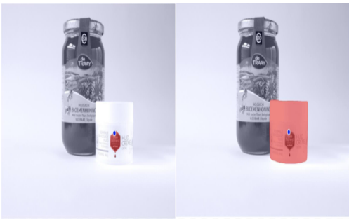

_「与给定标注点一致」的示例：对于这个输入点，标识（左侧）和容器（右侧）都是有效的物体，因为蓝色点位于两者之上。两个遮罩都没有遮罩错误。_

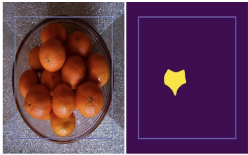

_「与边界框一致」的示例：边界框包围了整碗橙子，但遮罩只包含一个橙子。这是遮罩错误。_

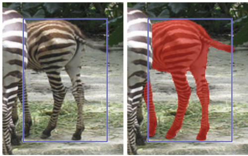

_「与边界框一致」的示例：边界框的形状与斑马吻合。尽管遮罩略微延伸到边界框之外以包含斑马的左腿，但这不是错误。_

_总体遮罩质量是主观的，上述每种错误对遮罩质量的影响可能很小也可能很大，取决于错误的大小。在选择遮罩分数时，请运用您的最佳判断，并尽量保持不同遮罩之间评分的一致性。以下是不同分数对应的通用指导原则：_

_- 分数为1：无法判断该遮罩对应的是什么物体。这包括完全没有可见遮罩的情况。_

_- 低分（2-4）：物体基本可识别，但遮罩质量极差（例如：遮罩覆盖了其他物体的大面积区域；物体的大面积区域缺失；边界极其斑驳且切割了物体的中部）。_

_- 中等分数（5-6）：物体可识别，边界基本正确，但存在重大错误（遗漏了物体的一个重要断开部分；包含了另一个物体的大部分；物体某一区域的边界质量很差但不是整个物体）。_

_- 高分（7-9）：物体可识别，错误小且少见（遗漏了一个被严重遮挡的断开小部分；遮罩边界与物体边界不完全匹配的小区域）。_

_- 分数为10：遮罩是像素级完美的；完全没有可识别的错误。_

_遮罩评分_

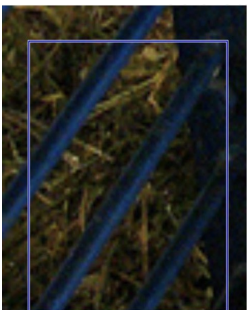

_分数为1的遮罩示例：无法清楚判断这个遮罩对应什么物体。_

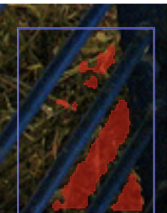

_分数为1的遮罩示例：无法清楚判断这是什么物体。_

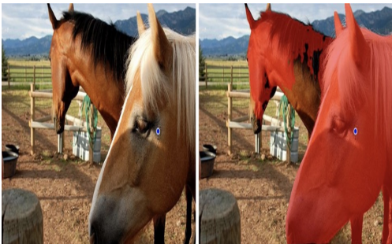

_低分（2-4）的遮罩示例：主要物体可识别，但遮罩包含了另一个物体的大面积错误部分。_

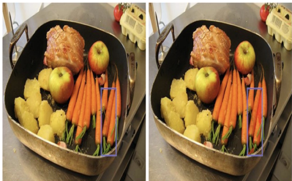

_低分（2-4）的遮罩示例：主要物体可识别，但物体的一个大面积随机部分缺失。_

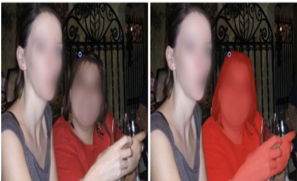

_中低分（4-5）的遮罩示例：物体可识别，边缘都正确，但遮罩错误地包含了左侧人物的手。_

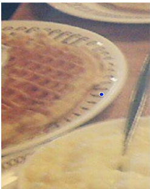

_中等分数（5-6）的遮罩示例：遮罩明显对应盘子，但与华夫饼的边界质量很差。_

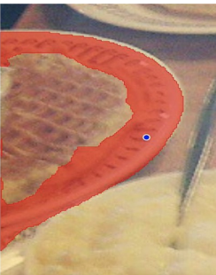

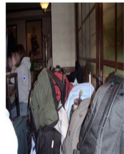

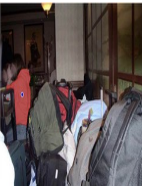

_中等分数（5-6）的遮罩示例：物体容易识别，大部分边缘合理。然而，帧内人物的手臂这一重要断开部分大部分缺失，该区域还有斑驳的像素。_

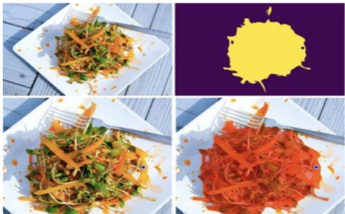

_中高分（6-8）的遮罩示例：遮罩在顶部和右下角有两个中等大小的边界质量较差的区域。_

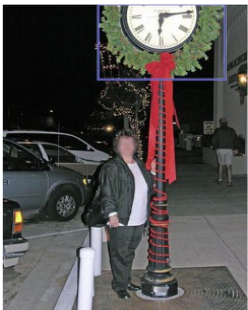

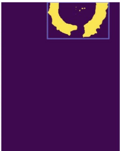

_中高分（6-8）的遮罩示例：花环是一个有效的物体，大小与边界框一致（整个花环+时钟也可以是一个有效的物体）。然而，时钟上有错误的散落遮罩像素。_

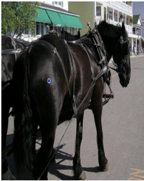

_高分（7-9）的遮罩示例：马的边界几乎完全正确，除了后腿的右侧。遮罩一致地包含了马所佩戴的所有装备，边界合乎逻辑。_

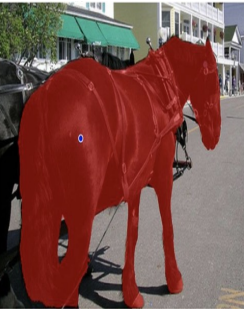

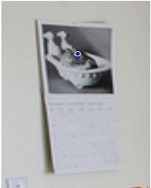

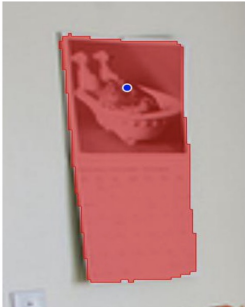

_非常高分（≈9）的遮罩示例：遮罩边缘只有微小错误。块状「像素化」不是错误，因为在这个尺度下图像也是块状的。_

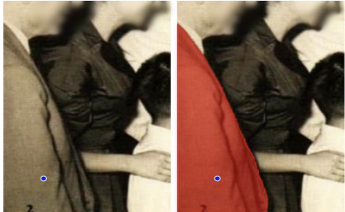

_非常高分（9-10）的遮罩示例：遮罩在右下角边缘只有非常微小的错误。_

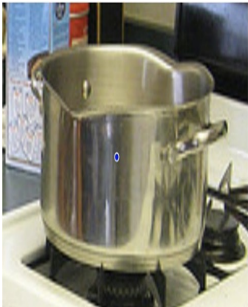

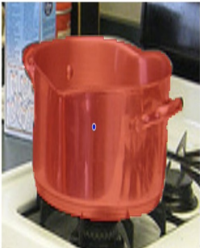

_非常高分（9-10）的遮罩示例：遮罩边缘只有微小错误。_

_图20：这里我们提供了人类审查遮罩质量时给予标注者的完整指南。部分图像经过轻微编辑，人脸进行了模糊处理以便于发布。最佳观看方式为放大查看。（第二部分，共两部分）_

---