# SAM 2：图像与视频中的万物分割

Nikhila Ravi*,†, Valentin Gabeur*, Yuan-Ting Hu*, Ronghang Hu*, Chaitanya Ryali*, Tengyu Ma*, Haitham Khedr*, Roman Rädle*, Chloe Rolland, Laura Gustafson, Eric Mintun, Junting Pan, Kalyan Vasudev Alwala, Nicolas Carion, Chao-Yuan Wu, Ross Girshick, Piotr Dolkar†, Christoph Feichtenhofer*,†

Meta FAIR

*核心贡献者，†项目负责人

我们提出了 Segment Anything Model 2 (SAM 2)，这是一个旨在解决图像和视频中可提示视觉分割任务的基础模型。我们构建了一个数据引擎，通过用户交互来改进模型和数据，从而收集了迄今为止规模最大的视频分割数据集。我们的模型采用简单的 Transformer 架构，并配备流式内存以实现实时视频处理。在我们的数据上训练的 SAM 2 在广泛的任务中表现出了强大的性能。在视频分割方面，我们观察到其精度更高，且交互次数比先前的方法少 \(3 \times\)。在图像分割方面，我们的模型比 Segment Anything Model (SAM) 精度更高，速度快 \(6 \times\)。我们相信，我们的数据、模型和见解将成为视频分割及相关感知任务的重要里程碑。我们正在发布模型的一个版本、数据集以及一个交互式演示。

演示：https://sam2.metademolab.com

代码：https://github.com/facebookresearch/segment-anything-2

网站：https://ai.meta.com/sam2

# 1 引言

Segment Anything (SA) 引入了一个用于图像中可提示分割的基础模型 (Kirillov et al., 2023)。然而，图像仅仅是现实世界的静态快照，其中的视觉片段可能表现出复杂的运动，并且随着多媒体内容的快速增长，相当一部分内容现在都带有时间维度，尤其是在视频数据中。AR/VR、机器人技术、自动驾驶汽车和视频编辑中的许多重要应用都需要超越图像级分割的时间定位。我们认为一个通用的视觉分割系统应该同时适用于图像和视频。

视频分割旨在确定实体的时空范围，这带来了图像之外独特的挑战。由于运动、变形、遮挡、光照变化和其他因素，实体的外观可能会发生显著变化。由于相机运动、模糊和较低的分辨率，视频的质量通常低于图像。此外，高效处理大量帧是一个关键挑战。虽然 SA 成功解决了图像中的分割问题，但现有的视频分割模型和数据集在提供与“视频中的万物分割”相当的能力方面仍有不足。

我们介绍了 Segment Anything Model 2 (SAM 2)，这是一个用于视频和图像分割的统一模型（我们将图像视为单帧视频）。我们的工作包括一项任务、一个模型和一个数据集（见图 1）。

我们专注于可提示视觉分割 (PVS) 任务，该任务将图像分割推广到了视频领域。该任务将视频任意帧上的点、边界框或掩码作为输入，以定义感兴趣的区域，并预测其时空掩码（即“掩码片段”）。一旦预测出掩码片段，就可以通过在额外的帧中提供提示来迭代地优化它。

我们的模型 (§4) 生成感兴趣对象在单幅图像和跨视频帧的分割掩码。SAM 2 配备了一个内存，用于存储有关对象和先前交互的信息，这使其能够生成整个视频的掩码片段预测，并有效地根据先前观察帧中存储的对象内存上下文来修正这些预测。我们的流式架构是 SAM 向视频领域的自然推广，它一次处理一帧视频，并配备了一个内存注意力模块来关注目标对象的先前记忆。当应用于图像时，内存为空，模型的行为类似于 SAM。

---

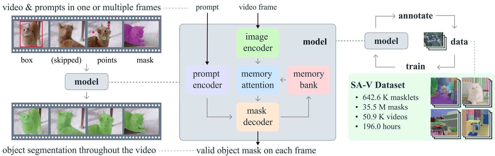

_(a) 任务：可提示的视觉分割_

_(b) 模型：Segment Anything Model 2_

_(c) 数据：数据引擎和数据集_

_图 1 我们介绍了 Segment Anything Model 2 (SAM 2)，旨在利用我们的基础模型 解决可提示的视觉分割任务 (a)，该模型通过我们的数据引擎 收集的大规模 SA-V 数据集进行训练。SAM 2 能够利用存储先前提示和预测的流式记忆，通过在一个或多个视频帧上的提示（点击、边界框或掩码）来交互式地分割区域。_

我们采用数据引擎（§5）来生成训练数据，方法是将我们的模型与标注人员结合在循环中，以交互式标注新的和具有挑战性的数据。与大多数现有的视频分割数据集不同，我们的数据引擎不限于特定类别的对象，而是旨在为分割任何具有有效边界的对象（包括部件和子部件）提供训练数据。与现有的模型辅助方法相比，我们在循环中使用 SAM 2 的数据引擎在质量相当的情况下速度快了 \(8.4 \times\)。我们最终的 Segment Anything Video (SA-V) 数据集（§5.2）包含 50.9K 个视频中的 35.5M 个掩码，比任何现有的视频分割数据集多 \(53 \times\)。SA-V 具有挑战性，包含小对象和部件，这些对象和部件在视频中会被遮挡并重新出现。我们的 SA-V 数据集在地理上具有多样性，对 SAM 2 的公平性评估表明，基于感知性别的视频分割性能差异极小，在我们评估的三个感知年龄组之间的差异也很小。

我们的实验（§6）表明，SAM 2 带来了视频分割体验的飞跃式变化。与先前的方法相比，SAM 2 可以在使用 \(3 \times\) 更少交互的情况下产生更好的分割精度。此外，SAM 2 在既定的视频对象分割基准测试中、在多种评估设置下均优于先前的工作，并且在图像分割基准测试中比 SAM 提供更好的性能，同时速度快了 \(6 \times\)。通过包括 17 个视频分割和 37 个单图像分割在内的众多零样本基准测试，结果表明 SAM 2 对各种视频和图像分布都有效。

我们将在宽松的开源许可下发布我们的工作，包括 SA-V 数据集 (CC by 4.0)、SAM 2 模型版本 (Apache 2.0)，以及位于 https://sam2.metademolab.com 的交互式在线演示。

# 2 相关工作

图像分割。Segment Anything (Kirillov et al., 2023) 引入了一项可提示的图像分割任务，其目标是在给定输入提示（例如指向感兴趣对象的边界框或点）的情况下输出有效的分割掩码。在 SA-1B 数据集上训练的 SAM 允许通过灵活的提示进行零样本分割，这使其能够被广泛采用于各种下游应用。最近的工作通过提高质量扩展了 SAM。例如，HQ-SAM (Ke et al., 2024) 通过引入高质量输出令牌并在细粒度掩码上训练模型来增强 SAM。另一项工作集中在 SAM 的效率上，以使其在现实世界和移动应用中得到更广泛的使用，例如 EfficientSAM (Xiong et al., 2023)、MobileSAM (Zhang et al., 2023a) 和 FastSAM (Zhao et al., 2023)。SAM 的成功使其被广泛应用于各种领域，例如医学影像 (Ma et al., 2024; Deng et al., 2023; Mazurowski et al., 2023; Wu et al., 2023a)、遥感 (Chen et al., 2024; Ren et al., 2024)、运动分割 (Xie et al., 2024) 和伪装目标检测 (Tang et al., 2023)。

---

---

**交互式视频目标分割**。交互式视频目标分割已成为一项关键任务，旨在通过用户引导（通常以涂鸦、点击或边界框的形式）高效地获取视频中的目标分割（masklets）。一些早期方法（Wang et al., 2005; Bai & Sapiro, 2007; Fan et al., 2015）采用基于图的优化来指导分割标注过程。更多近期的方法（Heo et al., 2020; Cheng et al., 2021b; Delatolas et al., 2024）通常采用模块化设计，将用户输入转换为单帧上的掩码表示，然后将其传播到其他帧。我们的工作与这些工作的目标相似，即通过良好的交互体验分割视频中的目标，为了实现这一目标，我们构建了一个强大的模型以及一个大规模且多样化的数据集。

特别是，DAVIS 交互式基准（Caelles et al., 2018）允许通过在多帧上输入涂鸦来交互式分割目标。受 DAVIS 交互式基准的启发，我们在 §6.1 中也为可提示视频分割任务采用了交互式评估设置。

对于交互式视频分割，基于点击的输入更易于收集（Homayounfar et al., 2021）。近期的工作通常将图像上的 SAM 与基于掩码（Cheng et al., 2023b; Yang et al., 2023; Cheng et al., 2023c）或基于点（Rajic et al., 2023）的视频跟踪器结合使用。然而，这些方法存在局限性：跟踪器可能不适用于所有目标，SAM 在视频图像帧上的表现可能不佳，并且除了在错误帧上从头开始使用 SAM 重新标注并从那里重新开始跟踪外，没有机制可以交互式修正模型的错误。

**半监督视频目标分割**。半监督 VOS 通常以第一帧中的目标掩码作为输入开始，该掩码必须在整个视频中被准确跟踪（Pont-Tuset et al., 2017）。它被称为“半监督”，因为输入掩码可以被视为仅在第一帧可用的目标外观的监督信号。由于其在视频编辑、机器人和自动背景移除等各种应用中的相关性，该任务引起了广泛关注。

早期的基于神经网络的方法经常在第一帧视频（Caelles et al., 2016; Perazzi et al., 2016; Yoon et al., 2017; Maninis et al., 2017; Hu et al., 2018a; Bhat et al., 2020; Robinson et al., 2020）或所有帧（Voigtlaender & Leibe, 2017）上进行在线微调，以使模型适应目标对象。通过离线训练的模型实现了更快的推理，这些模型要么仅以第一帧为条件（Hu et al., 2018b; Chen et al., 2018），要么也整合前一帧（Oh et al., 2018; Yang et al., 2018, 2020）。这种多条件处理已通过 RNN（Xu et al., 2018a）和交叉注意力机制（Oh et al., 2019; Cheng et al., 2021a; Li et al., 2022a; Yang et al., 2021b, 2024; Cheng & Schwing, 2022; Yang & Yang, 2022; Wang et al., 2022; Cheng et al., 2023a; Goyal et al., 2023）扩展到所有帧。近期的方法（Zhang et al., 2023b; Wu et al., 2023b）扩展了单个视觉Transformer以联合处理当前帧以及所有先前的帧和相关预测，从而产生了简单的架构，但推理成本极高。半监督 VOS 可以被视为我们的可提示视觉分割（PVS）任务的一个特例，因为它等同于仅在第一帧提供掩码提示。尽管如此，在第一帧中标注所需的高质量目标掩码在实际操作中具有挑战性且耗时。

**视频分割数据集**。为了支持 VOS 任务，人们提出了许多数据集。早期的 VOS 数据集（Prest et al., 2012; Li et al., 2013; Ochs et al., 2014; Fan et al., 2015），例如 DAVIS（Pont-Tuset et al., 2017; Caelles et al., 2019），包含高质量的标注，但其规模有限，无法训练基于深度学习的方法。YouTube-VOS（Xu et al., 2018b）涵盖了 94 个目标类别和 4000 多个视频，是 VOS 任务的第一个大规模数据集。随着算法的改进和基准性能开始饱和，研究人员通过特别关注遮挡（Qi et al., 2022; Ding et al., 2023）、长视频（Hong et al., 2023, 2024）、极端变换（Tokmakov et al., 2022）、目标多样性（Wang et al., 2021b, 2023）或场景多样性（Athar et al., 2022），致力于增加 VOS 任务的难度。

我们发现，目前的视频分割数据集缺乏足够的覆盖范围，无法实现“分割视频中任何物体”的能力。它们的标注通常覆盖整个目标（而非部分），且数据集通常围绕特定的目标类别，例如人、车辆和动物。与这些数据集相比，我们发布的 SA-V 数据集不仅关注整个目标，还广泛覆盖了目标部分，并且包含的掩码数量多出一个数量级以上。

---

---

_步骤 1_

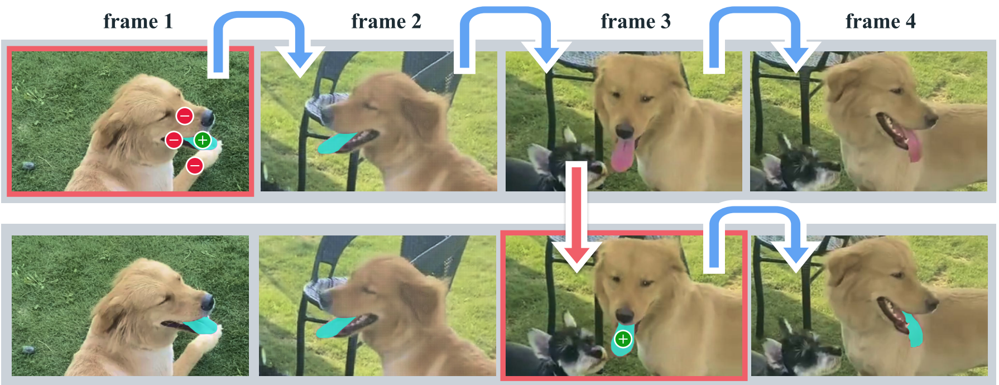

_图 2 使用 SAM 2 进行交互式分割。步骤 1（选择）：我们在第 1 帧中提示 SAM 2 以获得目标对象（舌头）的分割片段。绿色/红色点分别表示正/负提示。SAM 2 自动将片段传播到后续帧（蓝色箭头）以形成掩码片段。如果 SAM 2 丢失了对象（在第 2 帧之后），我们可以通过在新帧中提供额外的提示（红色箭头）来纠正掩码片段。步骤 2（修正）：在第 3 帧中单击一次就足以恢复对象并将其传播以获得正确的掩码片段。解耦的 SAM + 视频跟踪器方法需要在第 3 帧中多次点击（就像在第 1 帧中一样）才能正确重新关联对象，因为分割是从头开始重新启动的。凭借 SAM 2 的记忆机制，单击即可恢复舌头。_

# 3 任务：可提示视觉分割

PVS 任务允许在视频的任何帧上向模型提供提示。提示可以是正/负点击、边界框或掩码，用于定义要分割的对象或细化模型预测的对象。为了提供交互式体验，在接收到特定帧上的提示后，模型应立即响应该对象在此帧上的有效分割掩码。在接收到初始（一个或多个）提示（在同一帧或不同帧上）后，模型应传播这些提示以获得对象在整个视频中的掩码片段，其中包含目标对象在每个视频帧上的分割掩码。可以在任何帧上向模型提供额外的提示，以细化整个视频中的分割片段（示例见图 2）。有关任务的详细信息，请参阅 §A。

下一节（§4）介绍的 SAM 2 被作为数据收集工具应用于 PVS 任务，用于构建我们的 SA-V 数据集（§5）。该模型在在线和离线设置下进行了评估（§6），通过模拟涉及跨多帧标注的交互式视频分割场景，在标注仅限于第一帧的传统半监督 VOS 设置中，以及在 SA 基准上的图像分割中。

# 4 模型

我们的模型可以看作是 SAM 向视频（和图像）领域的泛化。SAM 2（图 3）支持在单个帧上进行点、框和掩码提示，以定义要在视频中分割的对象的空间范围。对于图像输入，模型的行为与 SAM 类似。一个可提示的轻量级掩码解码器接受帧嵌入和当前帧上的提示（如果有），并输出该帧的分割掩码。可以在帧上迭代添加提示以细化掩码。

与 SAM 不同，SAM 2 解码器使用的帧嵌入不是直接来自图像编码器，而是取决于过去预测和提示帧的记忆。提示帧也可能相对于当前帧“来自未来”。帧的记忆由记忆编码器基于当前预测创建，并放置在记忆库中供后续帧使用。记忆注意力操作从图像编码器获取每帧嵌入，并根据记忆库对其进行条件化，以产生一个随后传递给掩码解码器的嵌入。

我们在下面描述各个组件和训练，并在附录 C 中提供更多细节。

---

---

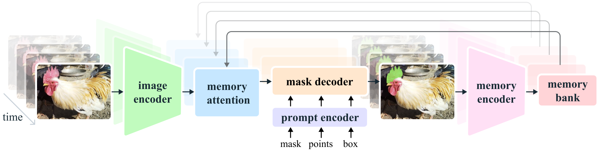

_图 3 SAM 2 架构。对于给定的帧，分割预测以当前提示和/或先前观察到的记忆为条件。视频以流式方式处理，图像编码器一次消耗一帧，并对来自先前帧的目标对象记忆进行交叉注意力。掩码解码器（可选地也接收输入提示）预测该帧的分割掩码。最后，记忆编码器转换预测和图像编码器嵌入（图中未显示）以供未来帧使用。_

图像编码器。为了对任意长度的视频进行实时处理，我们采用流式方法，在视频帧可用时立即对其进行处理。图像编码器在整个交互过程中仅运行一次，其作用是提供代表每一帧的无条件标记（特征嵌入）。我们使用经过 MAE (He et al., 2022) 预训练的 Hiera (Ryali et al., 2023; Bolya et al., 2023) 图像编码器，该编码器具有分层结构，允许我们在解码期间使用多尺度特征。

记忆注意力。记忆注意力的作用是根据过去的帧特征和预测以及任何新的提示来调节当前帧特征。我们堆叠 \( L \) 个 Transformer 块，第一个块将当前帧的图像编码作为输入。每个块执行自注意力，随后对存储在记忆库（见下文）中的（有提示/无提示）帧和对象指针（见下文）的记忆执行交叉注意力，最后是一个 MLP。我们在自注意力和交叉注意力中使用了标准的注意力操作，使我们能够受益于高效注意力内核 的最新发展。

提示编码器和掩码解码器。我们的提示编码器与 SAM 相同，可以通过点击（正向或负向）、边界框或掩码进行提示，以定义对象在给定帧中的范围。稀疏提示由位置编码表示，并与每种提示类型的学习嵌入相加，而掩码通过卷积进行嵌入，并与帧嵌入相加。

我们的解码器设计很大程度上遵循 SAM。我们堆叠“双向” Transformer 块来更新提示和帧嵌入。与 SAM 一样，对于可能有多个兼容目标掩码的模糊提示（即单击），我们会预测多个掩码。这种设计对于确保模型输出有效掩码非常重要。在视频中，模糊性可能跨越视频帧，模型会在每一帧上预测多个掩码。如果没有后续提示解决模糊性，模型仅传播当前帧预测 IoU 最高的掩码。

与 SAM 不同（在 SAM 中，给定正向提示总是存在有效的分割对象），在 PVS 任务中，某些帧上可能不存在有效的对象（例如由于遮挡）。为了适应这种新的输出模式，我们添加了一个额外的头部，用于预测当前帧上是否存在感兴趣的对象。与 SAM 的另一个区别是，我们使用来自分层图像编码器（绕过记忆注意力）的跳跃连接 来合并用于掩码解码的高分辨率信息（见 §C）。

记忆编码器。记忆编码器通过使用卷积模块对输出掩码进行下采样，并将其与来自图像编码器的无条件帧嵌入（图 3 中未显示）逐元素相加，随后通过轻量级卷积层融合信息，从而生成记忆。

记忆库。记忆库通过维护多达 \( N \) 个最近帧的记忆的 FIFO 队列来保留有关视频中目标对象过去预测的信息，并在多达 \( M \) 个有提示帧的 FIFO 队列中存储来自提示的信息。例如，在 VOS 任务中，初始掩码是唯一的提示，记忆库会持续保留第一帧的记忆以及多达 \( N \) 个最近（无提示）帧的记忆。这两组记忆都存储为空间特征图。

除了空间记忆之外，我们还基于每一帧的掩码解码器输出标记 (Meinhardt et al., 2022)，存储了一个对象指针列表作为轻量级向量，用于表示待分割对象的高级语义信息。我们的记忆注意力会对空间记忆特征和这些对象指针都进行交叉注意力。

---

---

我们将时间位置信息嵌入到 \( N \) 个最近帧的记忆中，使模型能够表示短期物体运动，但未将其嵌入到提示帧的记忆中，这是因为来自提示帧的训练信号更加稀疏，且更难泛化到推理场景，因为在推理时提示帧可能来自与训练期间所见的时间范围非常不同的时段。

**训练。** 该模型在图像和视频数据上进行联合训练。与之前的工作（Kirillov et al., 2023; Sofiiuk et al., 2022）类似，我们模拟了对模型的交互式提示。我们采样 8 帧的序列，并随机选择最多 2 帧进行提示，并以概率方式接收校正点击，这些点击是在训练期间使用真值掩码子序列和模型预测采样得到的。训练任务是按顺序（且“交互式”地）预测真值掩码子序列。模型的初始提示可以是：以 0.5 的概率为真值掩码，以 0.25 的概率为从真值掩码中采样的正点击，或以 0.25 的概率为边界框输入。更多详情请参见 §C。

# 5 数据

为了开发在视频中“分割任何东西”的能力，我们构建了一个数据引擎来收集大规模且多样化的视频分割数据集。我们采用了人机协同的交互式模型设置。与 Kirillov et al. (2023) 类似，我们没有对标注的掩码子序列施加语义约束，而是同时关注整体物体（例如，一个人）和部分（例如，一个人的帽子）。我们的数据引擎经历了三个阶段，每个阶段根据提供给标注员的模型辅助水平进行分类。接下来，我们将描述每个数据引擎阶段和我们的 SA-V 数据集。

# 5.1 数据引擎

**第一阶段：SAM 逐帧处理。** 初始阶段使用基于图像的交互式 SAM（Kirillov et al., 2023）来辅助人工标注。标注员的任务是使用 SAM 在 6 帧/秒（FPS）的视频的每一帧中标注目标对象的掩码，并使用像素级精确的手动编辑工具，如“画笔”和“橡皮擦”。该阶段不涉及跟踪模型来辅助掩码向其他帧的时间传播。由于这是一种逐帧方法，且所有帧都需要从头开始标注掩码，因此该过程缓慢，在我们的实验中平均每帧标注时间为 37.8 秒。然而，这产生了每帧高质量的空间标注。在此阶段，我们在 1.4K 个视频中收集了 16K 个掩码子序列。我们进一步使用此方法来标注我们的 SA-V 验证集和测试集，以减轻 SAM 2 在评估期间潜在的偏差。

**第二阶段：SAM + SAM 2 Mask。** 第二阶段将 SAM 2 纳入循环，其中 SAM 2 仅接受掩码作为提示。我们将此版本称为 SAM 2 Mask。标注员像第一阶段一样使用 SAM 和其他工具在第一帧生成空间掩码，然后使用 SAM 2 Mask 将标注的掩码在时间上传播到其他帧，以获得完整的时空掩码子序列。在任何后续视频帧中，标注员都可以通过使用 SAM、“画笔”和/或“橡皮擦”从头标注掩码来空间修改 SAM 2 Mask 的预测，并使用 SAM 2 Mask 重新传播，重复此过程直到掩码子序列正确。SAM 2 Mask 最初是在第一阶段的数据和公开可用的数据集上训练的。在第二阶段期间，我们使用收集的数据在标注循环中重新训练并更新了 SAM 2 Mask 两次。在第二阶段，我们收集了 63.5K 个掩码子序列。标注时间降至 7.4 秒/帧，比第一阶段快了约 5.1 倍。

尽管标注时间有所改善，但这种解耦的方法需要在没有先前记忆的情况下，从头开始标注中间帧的掩码。随后我们继续开发了功能齐全的 SAM 2，它能够在统一的模型中同时执行交互式图像分割和掩码传播。

**第三阶段：SAM 2。** 在最后阶段，我们利用功能齐全的 SAM 2，它接受各种类型的提示，包括点和掩码。SAM 2 利用物体在时间维度上的记忆来生成掩码预测。这意味着标注员只需偶尔向 SAM 2 提供修正点击以编辑中间帧中预测的掩码子序列，而无需使用没有此类记忆上下文的空间 SAM 从头进行标注。在第三阶段期间，我们使用收集的标注数据重新训练并更新了 SAM 2 五次。随着 SAM 2 纳入循环，每帧的标注时间降至 4.5 秒，比第一阶段快了约 8.4 倍。在第三阶段，我们收集了 197.0K 个掩码子序列。

---

<table><tr><td rowspan="2"></td><td rowspan="2">模型闭环</td><td rowspan="2">每帧耗时</td><td rowspan="2">编辑帧比例</td><td rowspan="2">每点击帧点击次数</td><td colspan="4">第一阶段掩码对齐分数 (IoU&gt;0.75)</td></tr><tr><td>全部</td><td>小</td><td>中</td><td>大</td></tr><tr><td>第一阶段</td><td>仅 SAM</td><td>37.8 s</td><td>100.00 %</td><td>4.80</td><td>-</td><td>-</td><td>-</td><td>-</td></tr><tr><td>第二阶段</td><td>SAM + SAM 2 掩码</td><td>7.4 s</td><td>23.25 %</td><td>3.61</td><td>86.4 %</td><td>71.3 %</td><td>80.4 %</td><td>97.9 %</td></tr><tr><td>第三阶段</td><td>SAM 2</td><td>4.5 s</td><td>19.04 %</td><td>2.68</td><td>89.1 %</td><td>72.8 %</td><td>81.8 %</td><td>100.0 %</td></tr></table>

_表 1：数据引擎各阶段的演变，展示了每帧平均标注时间、每个掩码序列的平均编辑帧百分比、每次点击帧的手动点击次数，以及按掩码大小计算的与第一阶段掩码的对齐度。_

质量验证。为了保持高标准的标注质量，我们引入了一个验证步骤。另一组标注人员负责验证每个标注掩码序列的质量，将其标记为“满意”（在所有帧中正确且一致地跟踪目标对象）或“不满意”（目标对象定义明确且边界清晰，但掩码序列不正确或不一致）。不满意的掩码序列会被退回标注流程进行细化。任何跟踪未明确定义对象的掩码序列都会被完全拒绝。

自动掩码序列生成。确保标注的多样性对于实现我们模型的“万物分割”能力至关重要。由于人类标注人员通常更关注显著对象，我们通过自动生成的掩码序列（称为“Auto”）来扩充标注数据。这既增加了标注的覆盖率，也有助于识别模型的失效案例。为了生成自动掩码序列，我们在第一帧中使用规则的点网格提示 SAM 2，并生成候选掩码序列。然后，这些候选序列被送入掩码序列验证步骤进行筛选。标记为“满意”的自动掩码序列会被添加到 SA-V 数据集中。被识别为“不满意”的掩码序列（即模型失效案例）会被采样，并由标注人员使用闭环中的 SAM 2 进行细化（数据引擎的第三阶段）。这些自动掩码序列不仅覆盖了大的显著中心对象，还覆盖了背景中不同大小和位置的对象。

分析。表 1 通过对照实验展示了数据引擎每个阶段中标注协议的比较（详见 §D.2.2）。我们比较了每帧平均标注时间、每个掩码序列的手动编辑帧平均百分比以及每次点击帧的平均点击次数。为了进行质量评估，我们将第一阶段掩码对齐分数定义为与第一阶段中相应掩码相比 IoU 超过 0.75 的掩码百分比。选择第一阶段数据作为参考是因为它具有逐帧的高质量手动标注。使用闭环 SAM 2 的第三阶段提高了效率并保持了相当的质量：它比第一阶段快 \(8.4 \times\)，具有最低的编辑帧百分比和每帧点击次数，并产生了更好的对齐效果。

在表 2 中，我们展示了在保持迭代次数固定的情况下，使用每个阶段结束时可用数据训练的 SAM 2 的性能比较，因此仅衡量额外数据的影响。我们在自己的 SA-V 验证集以及 9 个零样本基准测试上进行了评估（详见 §E.1），在第一帧上进行 3 次点击提示时，使用标准的 \(\mathcal{I}\&\mathcal{F}\) 准确率指标（越高越好）。我们注意到，在迭代包含每个阶段的数据后，不仅在域内的 SA-V 验证集上，而且在 9 个零样本基准测试上，都有一致的改进。

<table><tr><td>训练数据</td><td>SA-V val</td><td>9 zero-shot</td></tr><tr><td>VOS + SA-1B</td><td>50.0</td><td>62.5</td></tr><tr><td>+ Phase 1</td><td>53.0</td><td>66.9</td></tr><tr><td>+ Phase 2</td><td>58.8</td><td>70.9</td></tr><tr><td>+ Phase 3</td><td>62.5</td><td>71.2</td></tr><tr><td>+ Auto</td><td>63.2</td><td>71.5</td></tr></table>

_表 2：添加来自数据引擎各阶段数据后的分割准确率 (\(\mathcal{J}\& \mathcal{F}\) 指标) 提升。“VOS”是一组视频对象分割数据集。详见 §E。_

# 5.2 SA-V 数据集

通过我们的数据引擎收集的 SA-V 数据集包含 50.9K 个视频和 642.6K 个掩码序列。在表 3 中，我们比较了 SA-V 与常见 VOS 数据集在视频数量、掩码序列数量和掩码数量方面的组成。值得注意的是，标注掩码的数量比任何现有的 VOS 数据集多 \(53 \times\)（如果不包括自动生成的则为 \(15 \times\)），为未来的工作提供了大量资源。我们将在宽松的许可下发布 SA-V。

视频。我们收集了一组新的 50.9K 个视频，由众包工作者拍摄。视频包含 \(54\%\) 的室内场景和 \(46\%\) 的室外场景，平均时长为 14 秒。视频展示了“野外”多样的环境，并涵盖了各种日常场景。我们的数据集比现有的 VOS 数据集有更多的视频，如图 5 所示，这些视频跨越 47 个国家，由不同的参与者（自我报告的人口统计数据）拍摄。

---

---

_图 4 SA-V 数据集中的示例视频，叠加了 masklets（手动和自动）。每个 masklet 具有唯一的颜色，每一行代表来自一个视频的帧，帧间隔为 1 秒。_

---

---

<table><tr><td></td><td>#Videos</td><td>Duration</td><td>#Masklets</td><td>#Masks</td><td>#Frames</td><td>Disapp. Rate</td></tr><tr><td>DAVIS 2017 (Pont-Tuset et al., 2017)</td><td>0.2K</td><td>0.1 hr</td><td>0.4K</td><td>27.1K</td><td>10.7K</td><td>16.1 %</td></tr><tr><td>YouTube-VOS (Xu et al., 2018b)</td><td>4.5K</td><td>5.6 hr</td><td>8.6K</td><td>197.3K</td><td>123.3K</td><td>13.0 %</td></tr><tr><td>UVO-dense (Wang et al., 2021b)</td><td>1.0K</td><td>0.9 hr</td><td>10.2K</td><td>667.1K</td><td>68.3K</td><td>9.2 %</td></tr><tr><td>VOST (Tokmakov et al., 2022)</td><td>0.7K</td><td>4.2 hr</td><td>1.5K</td><td>175.0K</td><td>75.5K</td><td>41.7 %</td></tr><tr><td>BURST (Athar et al., 2022)</td><td>2.9K</td><td>28.9 hr</td><td>16.1K</td><td>600.2K</td><td>195.7K</td><td>37.7 %</td></tr><tr><td>MOSE (Ding et al., 2023)</td><td>2.1K</td><td>7.4 hr</td><td>5.2K</td><td>431.7K</td><td>638.8K</td><td>41.5 %</td></tr><tr><td>Internal</td><td>62.9K</td><td>281.8 hr</td><td>69.6K</td><td>5.4M</td><td>6.0M</td><td>36.4 %</td></tr><tr><td>SA-V Manual</td><td>50.9K</td><td>196.0 hr</td><td>190.9K</td><td>10.0M</td><td>4.2M</td><td>42.5 %</td></tr><tr><td>SA-V Manual+Auto</td><td>50.9K</td><td>196.0 hr</td><td>642.6K</td><td>35.5M</td><td>4.2M</td><td>27.7 %</td></tr></table>

_表 3：我们的数据集与开源 VOS 数据集在视频数量、时长、Masklet 数量、掩码数量、帧数和消失率方面的对比。SA-V Manual 仅包含人工标注的标签。SA-V Manual+Auto 结合了人工标注的标签与自动生成的 masklets。_

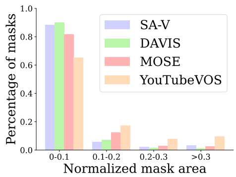

_(a) 规模_

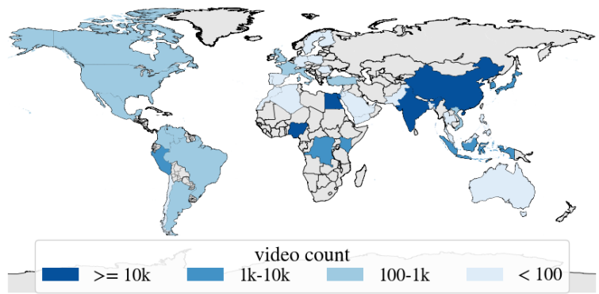

_(b) 地理分布_

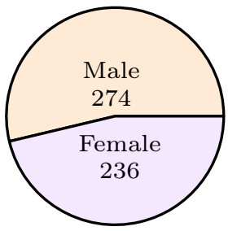

_(i) 性别_

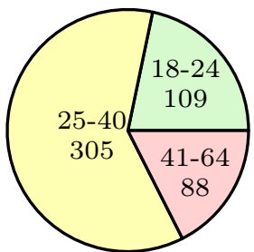

_(ii) 年龄_

_(c) 众包工人人口统计特征_

_图 5 数据集分布： masklet 大小分布（按视频分辨率归一化）， 视频的地理多样性，以及 自我报告的录制视频的众包工人人口统计特征。_

Masklets。标注包含 190.9K 个人工标注的 masklet 和 451.7K 个使用我们的数据引擎收集的自动 masklet。图 4 展示了叠加了 masklet（人工和自动）的示例视频。SA-V 的掩码数量比最大的 VOS 数据集多 \(53 \times\)（如果不包含自动标注则为 \(15 \times\)）。SA-V Manual 中的消失率（Ding et al., 2023）（即至少在一帧中消失随后又重新出现的已标注 masklet 的百分比）为 \(42.5\%\)，在现有数据中具有竞争力。图 5a 展示了与 DAVIS、MOSE 和 YouTubeVOS 相比的掩码大小分布（按视频分辨率归一化）。超过 \(88\%\) 的 SA-V 掩码的归一化面积小于 0.1。

SA-V 训练集、验证集和测试集划分。我们基于视频作者（及其地理位置）对 SA-V 进行划分，以确保相似对象的重叠最小。为了创建 SA-V 验证集和 SA-V 测试集，我们在选择视频时专注于具有挑战性的场景，并要求标注员识别具有挑战性的目标，这些目标移动速度快、被其他物体复杂遮挡以及具有消失/重现模式。这些目标是使用 §5.1 中数据引擎第一阶段设置以 6 FPS 的帧率进行标注的。SA-V 验证集划分包含 293 个 masklet 和 155 个视频，SA-V 测试集划分包含 278 个 masklet 和 150 个视频。

内部数据集。我们还使用了内部可用的许可视频数据来进一步扩充我们的训练集。我们的内部数据集包含 62.9K 个视频和 69.6K 个在第二阶段和第三阶段（参见 §5.1）标注的 masklet 用于训练，以及 96 个视频和 189 个使用第一阶段标注的 masklet 用于测试（Internal-test）。

有关数据引擎和 SA-V 数据集的更多详情，请参阅附录 D。

# 6 零样本实验

在这里，我们将 SAM 2 与以前在零样本视频任务（§6.1）和图像任务（§6.2）方面的工作进行了比较。我们报告了视频的标准 J&F 指标（Pont-Tuset et al., 2017）和图像任务的 mIoU 指标。除非另有说明，本节报告的结果遵循我们的默认设置，即使用分辨率为 1024 的 Hiera-B+ 图像编码器，并在所有数据集的组合上进行训练，即表 7 中的 SAM 2 (Hiera-B+)（有关详细信息，另请参见 §C.2）。

---

---

# 6.1 视频任务

# 6.1.1 可提示视频分割

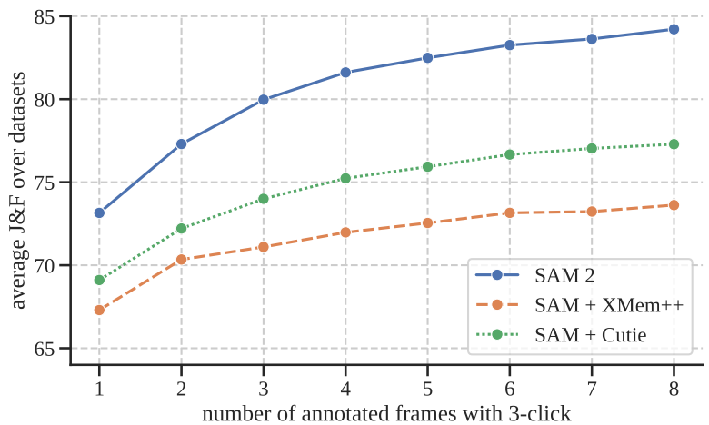

_(a) 跨数据集离线平均 \(\mathcal{J}\& \mathcal{F}\) (3次点击)_

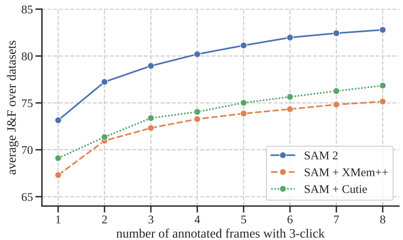

_(b) 跨数据集在线平均 \(\mathcal{J}\& \mathcal{F}\) (3次点击)_

_图 6 在交互式离线和在线评估设置下，9个数据集上的零样本准确率。_

我们首先评估可提示视频分割，这涉及模拟类似于用户体验的交互式设置。我们有两种设置：离线评估，即多次遍历视频以根据最大模型误差选择要交互的帧；以及在线评估，即在单次前向遍历视频的过程中对帧进行标注。这些评估在 9 个密集标注的零样本视频数据集上进行，每帧使用 \( N_{\mathrm{click}} = 3 \) 次点击（详情见 §E.1）。

我们基于两个最先进的视频对象分割模型 XMem++ (Bekuzarov et al., 2023) 和 Cutie (Cheng et al., 2023a)，创建了两个强基线 SAM+XMem++ 和 SAM+Cutie。我们使用 XMem++ 基于一帧或多帧上的掩码输入生成视频分割。SAM 用于提供初始掩码或优化输出（通过将当前分割作为掩码提示输入 SAM）。对于 SAM+Cutie 基线，我们修改了 Cutie 以允许在多帧上接收掩码输入。

在图 6 中，我们报告了在 \(N_{\mathrm{frame}} = 1,\ldots,8\) 个交互帧上的平均 \(\mathcal{J}\&\mathcal{F}\) 准确率。SAM 2 在离线和在线评估设置中均优于 SAM+XMem++ 和 SAM+Cutie。在所有 9 个数据集上（见 §E.1 中的各数据集结果），SAM 2 均优于这两种方法，证实了 SAM 2 能够通过少量点击生成高质量的视频分割，同时还允许通过进一步的提示持续优化结果。总体而言，SAM 2 可以生成更好的分割准确率，且交互次数减少了 \(>3\times\)。

# 6.1.2 半监督视频对象分割

<table><tr><td>方法</td><td>1次点击</td><td>3次点击</td><td>5次点击</td><td>边界框</td><td>真值掩码‡</td></tr><tr><td>SAM+XMem++</td><td>56.9</td><td>68.4</td><td>70.6</td><td>67.6</td><td>72.7</td></tr><tr><td>SAM+Cutie</td><td>56.7</td><td>70.1</td><td>72.2</td><td>69.4</td><td>74.1</td></tr><tr><td>SAM 2</td><td>64.3</td><td>73.2</td><td>75.4</td><td>72.9</td><td>77.6</td></tr></table>

_表 4 在半监督 VOS 评估下，使用不同提示在 17 个视频数据集上的零样本准确率。该表显示了在视频第一帧中每种提示类型（1、3 或 5 次点击、边界框或真值掩码）的平均 \(\mathcal{I}\&\mathcal{F}\)（\(\ddagger\)：在这种情况下，我们直接将掩码作为输入输入 XMem++ 或 Cutie，而不使用 SAM）。_

接下来，我们评估半监督视频对象分割 (VOS) 设置 (Pont-Tuset et al., 2017)，仅在视频的第一帧上使用点击、框或掩码提示。使用点击提示时，我们在第一个视频帧上交互式地采样 1、3 或 5 次点击，然后基于这些点击跟踪对象。

与 §6.1.1 中的交互式设置类似，我们与 XMem++ 和 Cutie 进行比较，使用 SAM 处理点击和框提示，并在使用掩码提示时采用其默认设置。我们报告标准的 \(\mathcal{I}\&\mathcal{F}\) 准确率 (Pont-Tuset et al., 2017)，除了 VOST (Tokmakov et al., 2022)，我们按照其协议报告 \(\mathcal{I}\) 指标。结果见表 4。在使用各种输入提示的情况下，SAM 2 在 17 个数据集上的表现均优于这两个基线。结果强调，SAM 2 在传统的、非交互式的带掩码输入的 VOS 任务上也表现出色，而这些其他工作正是专门为此设计的。更多详情见 §E.1.3。

---

---

# 6.1.3 公平性评估

我们在不同人口统计群体中评估了 SAM 2 的公平性。我们收集了 Ego-Exo4D (Grauman et al., 2023) 数据集中人物类别的标注，该数据集包含视频主体提供的自我报告的人口统计信息。我们采用了与 SA-V 验证集和测试集相同的标注设置，并将其应用于第三人称视角视频的 20 秒片段。我们使用 1 次点击、3 次点击以及第一帧的真实掩码在该数据上评估了 SAM 2。

<table><tr><td></td><td>1-click</td><td>3-click</td><td>mask</td></tr><tr><td colspan="4">gender (性别)</td></tr><tr><td>male (男性)</td><td>81.9</td><td>95.1</td><td>95.9</td></tr><tr><td>female (女性)</td><td>75.1</td><td>94.1</td><td>95.2</td></tr><tr><td colspan="4">age (年龄)</td></tr><tr><td>18-26</td><td>77.2</td><td>95.0</td><td>95.7</td></tr><tr><td>26-50</td><td>76.7</td><td>94.7</td><td>95.8</td></tr><tr><td>50+</td><td>81.4</td><td>95.1</td><td>96.2</td></tr></table>

_表 5：SAM 2 在受保护的人口统计群体上的公平性评估（使用 \(\mathcal{I}\& \mathcal{F}\) 指标）。_

表 5 展示了 SAM 2 在不同性别和年龄下分割人物时的 \(\mathcal{J}\&\mathcal{F}\) 准确率对比。在 3 次点击和使用真实掩码提示时，差异微乎其微。我们手动检查了 1 次点击的预测结果，发现模型经常预测的是某个部分的掩码而不是整个人。当将对比范围限制在人物被正确分割的片段中时，1 次点击的差距显著缩小（\(\mathcal{J}\&\mathcal{F}\) 男性 94.3，女性 92.7），这表明这种差异部分可归因于提示的歧义性。

在附录 G 中，我们提供了 SA-V 的模型卡、数据卡和标注卡。

# 6.2 图像任务

我们在 37 个零样本数据集上评估了 SAM 2 的“分割任何物体”任务，其中包括 SAM 之前用于评估的 23 个数据集。表 6 报告了 1 次点击和 5 次点击的 mIoU，我们展示了按数据集领域划分的平均 mIoU 以及模型在单张 A100 GPU 上的速度（以每秒帧数 FPS 为单位）。

第一列（SA-23 All）显示了 SAM 使用的 23 个数据集上的准确率。SAM 2 在不使用任何额外数据的情况下，实现了比 SAM 更高的准确率（1 次点击下 \(58.9\mathrm{mIoU}\)，SAM 为 58.1 mIoU），同时速度快了 \(6\times\)。这主要归功于 SAM 2 中更小但更高效的 Hiera 图像编码器。

底行展示了在我们的 SA-1B 和视频数据混合体上进行训练如何将这 23 个数据集的平均准确率进一步提高到 \(61.4\%\)。我们还看到在 SA-23 中的视频基准测试以及我们添加的 14 个新视频数据集上，模型获得了显著的提升（视频数据集作为图像进行评估，与 Kirillov et al. (2023) 相同）。

<table><tr><td rowspan="2">Model (模型)</td><td rowspan="2">Data (数据)</td><td colspan="4">1 (5) click mIoU</td><td rowspan="2">FPS</td></tr><tr><td>SA-23 All</td><td>SA-23 Image</td><td>SA-23 Video</td><td>14 new Video</td></tr><tr><td>SAM</td><td>SA-1B</td><td>58.1 (81.3)</td><td>60.8 (82.1)</td><td>54.5 (80.3)</td><td>59.1 (83.4)</td><td>21.7</td></tr><tr><td>SAM 2</td><td>SA-1B</td><td>58.9 (81.7)</td><td>60.8 (82.1)</td><td>56.4 (81.2)</td><td>56.6 (83.7)</td><td>130.1</td></tr><tr><td>SAM 2</td><td>our mix (我们的混合数据)</td><td>61.4 (83.7)</td><td>63.1 (83.9)</td><td>59.1 (83.3)</td><td>69.6 (86.0)</td><td>130.1</td></tr></table>

_表 6：在 37 个数据集上的“分割任何物体”（SA）任务的零样本准确率。该表展示了 SAM 2 与 SAM 按领域（图像/视频）划分的平均 1 次和 5 次点击 mIoU。我们报告了 SAM 使用的 23 个数据集（SA-23）上的平均指标，以及 14 个额外的零样本视频数据集的平均指标（详见 §E.3）。_

总的来说，这些发现强调了 SAM 2 在交互式视频和图像分割方面的双重能力，这种优势源于我们多样化的训练数据，涵盖了跨视觉领域的视频和静态图像。更多详细结果（包括按数据集细分的分类）见 §E.3。

# 7 与半监督视频目标分割（VOS）中最先进方法的比较

我们的主要关注点是通用的交互式 PVS 任务，但我们也解决了特定的半监督 VOS 设置（即提示是第一帧的真实掩码），因为这是一个历史上通用的协议。我们在表 7 中展示了与现有最先进方法的比较，并使用标准协议报告了准确率。我们评估了两个版本的 SAM 2，它们具有不同的图像编码器尺寸（Hiera-B+/-L），具有不同的速度-准确率权衡。SAM 2 在准确率和推理速度（最后一列显示的 FPS）方面都显示出比现有最佳方法的显著改进。为了获得最佳的整体结果，我们观察到使用更大的图像编码器可以带来全面的显著准确率提升。

---

---

<table><tr><td rowspan="2">方法</td><td colspan="5">J&amp;F</td><td>G</td><td rowspan="2">FPS</td></tr><tr><td>MOSE val</td><td>DAVIS 2017 val</td><td>LVOS val</td><td>SA-V val</td><td>SA-V test</td><td>YTVOS 2019 val</td></tr><tr><td>STCN (Cheng et al., 2021a)</td><td>52.5</td><td>85.4</td><td>-</td><td>61.0</td><td>62.5</td><td>82.7</td><td>13.2</td></tr><tr><td>SwinB-AOT (Yang et al., 2021b)</td><td>59.4</td><td>85.4</td><td>-</td><td>51.1</td><td>50.3</td><td>84.5</td><td>-</td></tr><tr><td>SwinB-DeAOT (Yang &amp; Yang, 2022)</td><td>59.9</td><td>86.2</td><td>-</td><td>61.4</td><td>61.8</td><td>86.1</td><td>-</td></tr><tr><td>RDE (Li et al., 2022a)</td><td>46.8</td><td>84.2</td><td>-</td><td>51.8</td><td>53.9</td><td>81.9</td><td>24.4</td></tr><tr><td>XMem (Cheng &amp; Schwing, 2022)</td><td>59.6</td><td>86.0</td><td>-</td><td>60.1</td><td>62.3</td><td>85.6</td><td>22.6</td></tr><tr><td>SimVOS-B (Wu et al., 2023b)</td><td>-</td><td>88.0</td><td>-</td><td>44.2</td><td>44.1</td><td>84.2</td><td>3.3</td></tr><tr><td>JointFormer (Zhang et al., 2023b)</td><td>-</td><td>90.1</td><td>-</td><td>-</td><td>-</td><td>87.4</td><td>3.0</td></tr><tr><td>ISVOS (Wang et al., 2022)</td><td>-</td><td>88.2</td><td>-</td><td>-</td><td>-</td><td>86.3</td><td>5.8</td></tr><tr><td>DEVA (Cheng et al., 2023b)</td><td>66.0</td><td>87.0</td><td>55.9</td><td>55.4</td><td>56.2</td><td>85.4</td><td>25.3</td></tr><tr><td>Cutie-base (Cheng et al., 2023a)</td><td>69.9</td><td>87.9</td><td>66.0</td><td>60.7</td><td>62.7</td><td>87.0</td><td>36.4</td></tr><tr><td>Cutie-base+ (Cheng et al., 2023a)</td><td>71.7</td><td>88.1</td><td>-</td><td>61.3</td><td>62.8</td><td>87.5</td><td>17.9</td></tr><tr><td>SAM 2 (Hiera-B+)</td><td>75.8</td><td>90.9</td><td>74.9</td><td>73.6</td><td>74.1</td><td>88.4</td><td>43.8</td></tr><tr><td>SAM 2 (Hiera-L)</td><td>77.2</td><td>91.6</td><td>76.1</td><td>75.6</td><td>77.6</td><td>89.1</td><td>30.2</td></tr></table>

_表 7 VOS 与先前工作的对比。在基于首帧真值掩码提示的视频分割任务中，SAM 2 在准确率 \((\mathcal{J}\& \mathcal{F},\mathcal{G})\) 和速度 (FPS) 方面均表现优异。SAM 2 在 SA-V val/test 上的表现显著优于其他方法。所有 FPS 估算均在 A100 GPU 上进行。我们模型的 FPS 估算数据取自 Cheng et al. (2023a)。_

我们还在 SA-V 验证集和测试集上评估了现有工作，这些数据集衡量了对“任意”对象类别的开放世界分割性能。在该基准测试上进行比较时，我们发现大多数先前方法的准确率峰值大致相同。先前工作在 SA-V val 和 SA-V test 上的最佳性能显著较低，这体现了与“分割视频中任何物体”这一能力之间的差距。最后，正如 LVOS 基准测试结果所示，我们看到 SAM 2 在长期视频目标分割方面也带来了显著的提升。

# 8 数据与模型消融实验

本节介绍了指导 SAM 2 设计决策的消融实验。我们在 MOSE 开发集（“MOSE dev”）上进行评估，该数据集包含从 MOSE 训练集中随机抽取的 200 个视频，并在我们的消融实验中被排除在训练数据之外，同时我们也评估了 SA-V val 以及 9 个零样本视频数据集的平均结果。作为比较指标，我们报告了在首帧进行 3 次点击输入下的 \(\mathcal{I}\&\mathcal{F}\) 值，以此作为 1 次点击机制和 VOS 风格掩码提示之间的平衡。此外，我们报告了 SAM 用于图像 SA 任务的 23 数据集基准上的平均 1 次点击 mIoU。除非另有说明，我们在 512 分辨率下运行消融实验，并使用 SA-V manual 和 SA-1B 的 10% 子集。更多细节见 §C.2。

# 8.1 数据消融实验

数据混合消融。在表 8 中，我们比较了 SAM 2 在不同数据混合比例下训练时的准确率。我们在 SA-1B 上进行预训练，然后为每个设置训练一个单独的模型。我们固定迭代次数（200k）和批量大小（128），实验之间仅改变训练数据。我们报告了在 SA-V val 集合、MOSE、9 个零样本视频基准以及 SA-23 任务（§6.2）上的准确率。第 1 行显示，仅在 VOS 数据集（Davis、MOSE、YouTubeVOS）上训练的模型在域内的 MOSE dev 上表现良好，但在所有其他数据集（包括 9 个零样本 VOS 数据集）上表现不佳（59.7 J&F）。

我们观察到，将我们的数据引擎数据加入训练混合数据带来了巨大的好处，包括在 9 个零样本数据集上的平均性能提升了 +12.1%（第 11 行 vs 第 1 行）。这可以归因于 VOS 数据集的覆盖范围和规模有限。添加 SA-1B 图像提高了图像分割任务的性能（第 3 行 vs 第 4 行，第 5 行 vs 第 6 行，第 9 行 vs 第 10 行，第 11 行 vs 第 12 行），而没有降低 VOS 能力。仅在 SA-V 和 SA-1B 上训练（第 4 行）足以在除 MOSE 之外的所有基准上获得强劲的性能。总体而言，当混合所有数据集：VOS、SA-1B 和我们的数据引擎数据（第 12 行）时，我们获得了最佳结果。

数据量消融。接下来，我们研究扩大训练数据规模的影响。SAM 2 在 SA-1B 上进行预训练，然后在不同规模的 SA-V 上进行训练。我们报告平均 \(\mathcal{I}\&\mathcal{F}\) 分数（在首帧进行 3 次点击提示时

---

---

<table><tr><td rowspan="2"></td><td colspan="4">训练数据</td><td colspan="4">J&amp;F</td><td>mIoU</td></tr><tr><td>VOS</td><td>内部</td><td>SA-V</td><td>SA-1B</td><td>SA-V val</td><td>内部测试</td><td>MOSE dev</td><td>9个零样本</td><td>SA-23</td></tr><tr><td>1</td><td>✓</td><td></td><td></td><td></td><td>48.1</td><td>60.2</td><td>76.9</td><td>59.7</td><td>45.4</td></tr><tr><td>2</td><td></td><td>✓</td><td></td><td></td><td>57.0</td><td>72.2</td><td>70.6</td><td>70.0</td><td>54.4</td></tr><tr><td>3</td><td></td><td></td><td>✓</td><td></td><td>63.0</td><td>72.6</td><td>72.8</td><td>69.7</td><td>53.0</td></tr><tr><td>4</td><td></td><td></td><td>✓</td><td>✓</td><td>62.9</td><td>73.2</td><td>73.6</td><td>69.7</td><td>58.6</td></tr><tr><td>5</td><td></td><td>✓</td><td>✓</td><td></td><td>63.0</td><td>73.2</td><td>73.3</td><td>70.9</td><td>55.8</td></tr><tr><td>6</td><td></td><td>✓</td><td>✓</td><td>✓</td><td>63.6</td><td>75.0</td><td>74.4</td><td>71.6</td><td>58.6</td></tr><tr><td>7</td><td>✓</td><td></td><td></td><td>✓</td><td>50.0</td><td>63.2</td><td>77.6</td><td>62.5</td><td>54.8</td></tr><tr><td>8</td><td>✓</td><td>✓</td><td></td><td></td><td>54.9</td><td>71.5</td><td>77.9</td><td>70.6</td><td>55.1</td></tr><tr><td>9</td><td>✓</td><td></td><td>✓</td><td></td><td>61.6</td><td>72.8</td><td>78.3</td><td>69.9</td><td>51.0</td></tr><tr><td>10</td><td>✓</td><td></td><td>✓</td><td>✓</td><td>62.2</td><td>74.1</td><td>78.5</td><td>70.3</td><td>57.3</td></tr><tr><td>11</td><td>✓</td><td>✓</td><td>✓</td><td></td><td>61.8</td><td>74.4</td><td>78.5</td><td>71.8</td><td>55.7</td></tr><tr><td>12</td><td>✓</td><td>✓</td><td>✓</td><td>✓</td><td>63.1</td><td>73.7</td><td>79.0</td><td>71.6</td><td>58.9</td></tr></table>

_表 8 我们在不同的数据混合集上训练模型，包括 VOS (Davis, MOSE, YouTubeVOS)，以及内部训练集、SA-V 和 SA-1B 的子集。我们报告了在 SA-V val、内部测试集、MOSE 和 9 个零样本数据集上，通过在第一帧点击 3 次进行提示时的 \(\mathcal{I}\&\mathcal{F}\) 准确率，以及在 SA-23 数据集上的平均 1 次点击 mIoU。_

第一帧）在 3 个基准测试上的表现：SA-V val、零样本和 MOSE dev。图 7 显示了在所有基准测试上，训练数据量与视频分割准确率之间存在一致的幂律关系。

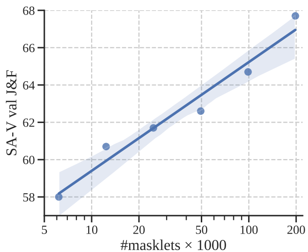

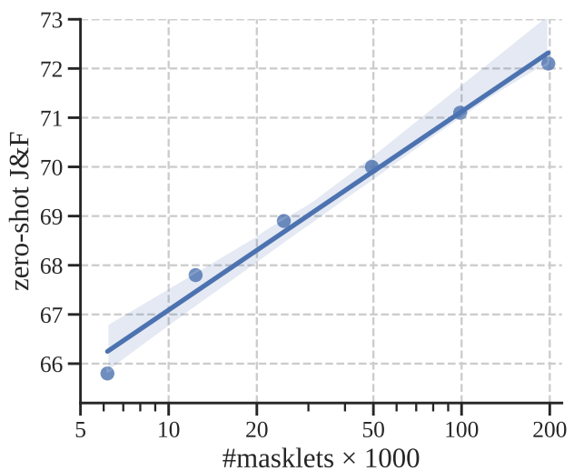

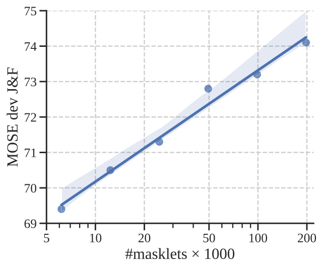

_图 7 SAM 2 的性能作为 SA-V 数量的函数。我们报告了在 SA-V val（左）、9 个零样本数据集（中）和 MOSE dev（右）上，通过在第一帧进行 3 次点击提示时的 \(\mathcal{J}\&\mathcal{F}\) 准确率。_

数据质量消融实验。在表 9 中，我们实验了基于质量的过滤策略。我们从 SA-V 中子采样 \(50\mathrm{k}\) 个子掩码，方式包括随机采样或选择被标注员编辑次数最多的子掩码。基于编辑帧数的过滤策略仅使用 \(25\%\) 的数据即可带来强劲的性能，并且优于随机采样。然而，它不如使用全部 \(190\mathrm{k}\) 个 SA-V 子掩码的效果好。

<table><tr><td rowspan="2">设置</td><td colspan="4">J&amp;F</td><td>mIoU</td></tr><tr><td>SA-V val</td><td>内部测试</td><td>MOSE dev</td><td>9个零样本</td><td>SA-23</td></tr><tr><td>SA-1B + SA-V 50k 随机</td><td>63.7</td><td>70.3</td><td>72.3</td><td>68.7</td><td>59.1</td></tr><tr><td>SA-1B + SA-V 50k 最多编辑</td><td>66.2</td><td>73.0</td><td>72.5</td><td>69.2</td><td>58.6</td></tr><tr><td>SA-1B + SA-V</td><td>69.9</td><td>73.8</td><td>73.9</td><td>70.8</td><td>59.8</td></tr></table>

_表 9 我们在 SA-V 手动数据的不同子集上训练模型：50k 个随机采样的子掩码、50k 个编辑帧数最多的子掩码，以及完整的 SA-V 数据集（190k 个子掩码）。_

# 8.2 模型架构消融实验

在此，我们提出了指导设计决策的模型消融实验。我们报告了视频 \((\mathcal{I}\& \mathcal{F})\) 和图像 任务中的分割准确率，以及视频分割速度 (FPS)。我们发现图像和视频组件的设计选择在很大程度上是解耦的——这可以归因于我们的模块化设计和训练策略。

---

---

<table><tr><td rowspan="2">res.</td><td colspan="3">J&amp;F</td><td colspan="2">mIoU</td></tr><tr><td>MOSE dev</td><td>SA-V val</td><td>9 zero-shot</td><td>FPS</td><td>SA-23</td></tr><tr><td>512</td><td>73.0</td><td>68.3</td><td>70.7</td><td>77.3</td><td>59.7</td></tr><tr><td>768</td><td>76.1</td><td>71.1</td><td>72.5</td><td>62.5</td><td>61.0</td></tr><tr><td>1024</td><td>77.0</td><td>70.1</td><td>72.3</td><td>44.6</td><td>61.5</td></tr></table>

_(a) 分辨率 (Resolution)._

<table><tr><td rowspan="2">#mem.</td><td colspan="3">J&amp;F</td><td colspan="2">mIoU</td></tr><tr><td>MOSE dev</td><td>SA-V val</td><td>9 zero-shot</td><td>FPS</td><td>SA-23</td></tr><tr><td>4</td><td>73.5</td><td>68.6</td><td>70.5</td><td>77.4</td><td>59.9</td></tr><tr><td>6</td><td>73.0</td><td>68.3</td><td>70.7</td><td>77.3</td><td>59.7</td></tr><tr><td>8</td><td>73.2</td><td>69.0</td><td>70.7</td><td>67.7</td><td>59.9</td></tr></table>

_(c) #记忆块 (#Memories)._

<table><tr><td rowspan="2">(#sa, #ca)</td><td colspan="3">J&amp;F</td><td colspan="2">mIoU</td></tr><tr><td>MOSE dev</td><td>SA-V val</td><td>9 zero-shot</td><td>FPS</td><td>SA-23</td></tr><tr><td>(2, 2)</td><td>73.3</td><td>67.3</td><td>70.2</td><td>85.8</td><td>59.9</td></tr><tr><td>(3, 2)</td><td>72.7</td><td>64.1</td><td>69.5</td><td>84.2</td><td>60.0</td></tr><tr><td>(4, 4)</td><td>73.0</td><td>68.3</td><td>70.7</td><td>77.3</td><td>59.7</td></tr></table>

_(e) 记忆注意力 (Memory attention)._

<table><tr><td rowspan="2">#frames</td><td colspan="3">J&amp;F</td><td colspan="2">mIoU</td></tr><tr><td>MOSE dev</td><td>SA-V val</td><td>9 zero-shot</td><td>FPS</td><td>SA-23</td></tr><tr><td>4</td><td>71.1</td><td>60.0</td><td>67.7</td><td>77.3</td><td>60.1</td></tr><tr><td>8</td><td>73.0</td><td>68.3</td><td>70.7</td><td>77.3</td><td>59.7</td></tr><tr><td>10</td><td>74.5</td><td>68.1</td><td>71.1</td><td>77.3</td><td>59.9</td></tr></table>

_(b) #帧数 (#Frames)._

<table><tr><td rowspan="2">chan. dim.</td><td colspan="3">J&amp;F</td><td colspan="2">mIoU</td></tr><tr><td>MOSE dev</td><td>SA-V val</td><td>9 zero-shot</td><td>FPS</td><td>SA-23</td></tr><tr><td>64</td><td>73.0</td><td>68.3</td><td>70.7</td><td>77.3</td><td>59.7</td></tr><tr><td>256</td><td>73.4</td><td>66.4</td><td>70.0</td><td>77.0</td><td>60.0</td></tr></table>

_(d) 记忆通道维度 (Memory channels)._

<table><tr><td rowspan="2">img. enc.</td><td colspan="3">J&amp;F</td><td colspan="2">mIoU</td></tr><tr><td>MOSE dev</td><td>SA-V val</td><td>9 zero-shot</td><td>FPS</td><td>SA-23</td></tr><tr><td>S</td><td>70.9</td><td>65.5</td><td>69.4</td><td>78.3</td><td>57.8</td></tr><tr><td>B+</td><td>73.0</td><td>68.3</td><td>70.7</td><td>77.3</td><td>59.7</td></tr><tr><td>L</td><td>75.0</td><td>66.3</td><td>71.9</td><td>62.6</td><td>61.1</td></tr></table>

_(f) 图像编码器尺寸 (Image encoder size)._

_表 10 容量消融实验。我们沿输入尺寸（分辨率、#帧数）、记忆尺寸（#记忆块、记忆通道维度）和模型尺寸（记忆注意力、图像编码器）对建模容量进行了消融。灰色为消融默认值。_

# 8.2.1 容量消融实验

输入尺寸。在训练期间，我们对固定分辨率和固定长度（此处记为 #帧数）的帧序列进行采样。我们在表 10a 和 10b 中消融了它们的影响。更高的分辨率在图像和视频任务中均带来了显著的改进。增加帧数在视频基准测试中带来了可观的收益，我们默认使用 8 帧以平衡速度和准确性。

记忆尺寸。增加（最大）记忆块数量 \( N \) 通常有助于提升性能，尽管可能存在一些差异，如表 10c 所示。我们使用默认值 6 个过去帧，以在时序上下文长度和计算成本之间取得平衡。如表 10d 所示，为记忆使用更少的通道不会导致明显的性能回退，同时使存储所需的内存减少了 \( 4 \times \)。

模型尺寸。增加主干网络或记忆注意力的容量通常会带来更好的结果，如表 10e 和 10f 所示。扩大主干网络的规模在图像和视频指标上均带来收益，而扩大记忆注意力的规模仅能提升视频指标。我们默认使用 \(\mathrm{B + }\) 主干网络，它在速度和准确性之间提供了合理的平衡；我们注意到，即使使用 \(\mathrm{B + }\) 主干网络，SAM 2 已经能够显著超越 SAM ViT-H（见表 6）。

<table><tr><td rowspan="2">图像编码器中的 RPB</td><td rowspan="2">记忆注意力中的 2d-RoPE</td><td colspan="4">J&amp;F</td><td colspan="2">mIoU</td></tr><tr><td>MOSE dev</td><td>SA-V val</td><td>LVOSv2 val</td><td>9 zero-shot</td><td>FPS</td><td>SA-23</td></tr><tr><td></td><td>✓</td><td>73.0</td><td>68.3</td><td>71.6</td><td>70.7</td><td>77.3</td><td>59.7</td></tr><tr><td>✓</td><td>✓</td><td>73.6</td><td>67.9</td><td>71.0</td><td>71.5</td><td>77.3</td><td>60.0</td></tr><tr><td></td><td></td><td>72.8</td><td>67.1</td><td>70.3</td><td>70.3</td><td>84.4</td><td>59.9</td></tr></table>

_表 11 相对位置编码。我们默认在记忆注意力中使用 2d-RoPE，并移除图像编码器中的 RPB（灰色）。尽管在此表中 512 分辨率下的 FPS 相似，但移除 RPB 使我们能够启用 FlashAttention-2 (Dao, 2023)，这在 1024 分辨率下带来了显著的速度提升。在 1024 的较高分辨率下，2d-RoPE（第 1 行）和无 RoPE 基线（第 3 行）之间的 FPS 差距变得小得多。_

# 8.2.2 相对位置编码

默认情况下，我们在图像编码器和记忆注意力中始终使用绝对位置编码。在本节中，我们研究了相对位置编码的设计选择。这里我们还在 LVOSv2 (Hong et al., 2024) 上进行了评估，在第 1 帧上进行 3 次点击，作为长期视频目标分割的基准。

---

---

虽然 SAM (Kirillov et al., 2023) 遵循 Li et al. (2022b) 的做法，在所有主干网络层中添加了相对位置偏置（RPB），但 Bolya et al. (2023) 通过移除除全局注意力层之外的所有层的 RPB 并采用“绝对胜出”的位置编码对此进行了改进，这带来了显著的速度提升。我们通过从主干网络中移除所有 RPB 进一步改进了这一点，在 SA-23 上没有性能下降，在视频基准测试上也只有极小的下降（见表 11），同时在 1024 分辨率下带来了显著的速度提升。我们还发现，在记忆注意力中使用 2d-RoPE (Su et al., 2021; Heo et al., 2024) 是有益的。

# 8.2.3 记忆架构消融实验

循环记忆。我们研究了在将记忆特征存入记忆库之前将其输入到 GRU 的有效性。与 §8.2.2 类似，我们也在 LVOSv2 上进行了评估，将其作为长期目标分割的额外基准。尽管先前的工作通常采用 GRU (Cho et al., 2014) 状态作为将记忆融入跟踪过程的一种手段，但我们在表 12 中的研究结果表明，这种方法并没有带来改进（除了在 LVOSv2 上略有提升）。相反，我们发现直接将记忆特征存储在记忆库中就足够了，这既更简单又更高效。

对象指针。我们消融了来自其他帧的掩码解码器输出的对象指针向量进行交叉注意力的影响（见 §4）。表 12 中展示的结果表明，虽然对对象指针进行交叉注意力并没有提高在 9 个零样本数据集上的平均性能，但它显著提升了在 SA-V val 数据集以及具有挑战性的 LVOSv2 基准测试（验证集 split）上的性能。因此，我们默认采用对对象指针和记忆库一起进行交叉注意力的做法。

<table><tr><td rowspan="2">对象指针</td><td rowspan="2">GRU</td><td colspan="4">J&amp;F</td><td colspan="2">mIoU</td></tr><tr><td>MOSE dev</td><td>SA-V val</td><td>LVOSv2 val</td><td>9 zero-shot</td><td>FPS</td><td>SA-23</td></tr><tr><td></td><td></td><td>73.1</td><td>64.5</td><td>67.0</td><td>70.9</td><td>79.7</td><td>59.9</td></tr><tr><td></td><td>✓</td><td>72.3</td><td>65.3</td><td>68.9</td><td>70.5</td><td>76.9</td><td>60.0</td></tr><tr><td>✓</td><td></td><td>73.0</td><td>68.3</td><td>71.6</td><td>70.7</td><td>77.3</td><td>59.7</td></tr></table>

_表 12 记忆设计的消融实验。我们默认使用对象指针（灰色），并研究了循环 GRU 记忆。_

# 9 结论

我们提出了 Segment Anything 模型向视频领域的自然演进，基于三个关键方面： 将可提示分割任务扩展到视频， 装备 SAM 架构以在应用于视频时使用记忆，以及 用于训练和基准测试视频分割的多样化的 SA-V 数据集。我们相信 SAM 2 标志着视觉感知的重大进步，将我们的贡献定位为推动该领域进一步研究和应用的里程碑。

# 10 致谢

感谢 Alexander Kirillov 和 Jitendra Malik 关于项目方向的讨论。感谢 Andrew Huang、Sahir Gomez、Miguel Martin、Devansh Kukreja 和 Somya Jain 在演示方面的工作，感谢 Aohan Li 和 Meng Wang 制作了数据集可视化工具。我们感谢 Shoubhik Debnath 和 Sagar Vaze 在数据集准备方面的工作。还要感谢 William Ngan 和 Sasha Mitts 的设计专业知识，以及 Grant Gardner 和 George Orlin 领导的产品管理工作。我们感谢 Joelle Pineau、Daniel Bolya、Kate Saenko、Pengchuan Zhang 和 Christopher Chedeau 的宝贵讨论。感谢 Rene Martinez Doehner 和 Baishan Guo 的数据支持，以及我们的标注工程和管理合作伙伴：Robert Kuo、Rishi Godugu、Bob Kamma、Ida Cheng、Claudette Ward、Kai Brown、Jake Kinney、Jenny Truong 和 Karen Bergan。感谢 Vispi Cassod、Parth Malani、Shiva Koduvayur、Alexander Miller 和 Caleb Ho 在计算和基础设施方面的支持。最后，我们感谢 Azita Shokrpour、Mallika Malhotra、Rodrick Shepard、Jonathan Torres、Luc Dahlin、David Soofian、Alex Bosenberg 和 Amanda Kallet 的项目级支持。

---

---

# 附录

# 目录:

\(\S A\) : 任务详情

\(\S \mathrm{B}\) : 局限性

\(\S \mathrm{C}\) : 模型详情

\(\S \mathrm{D}\) : 数据集详情

\(\S \mathrm{E}\) : 零样本实验详情

\(\S G\) : 数据集、标注与模型说明

\(\S\)D.2.1: 标注指南

# A 关于 PVS 任务的详情

可提示视觉分割（Promptable Visual Segmentation，简称 PVS）任务可以看作是“分割任何物体”（Segment Anything，简称 SA）任务从静态图像到视频的扩展。在 PVS 设置中，给定一个输入视频，模型可以在视频的任意帧上通过不同类型的输入（包括点击、边界框或掩码）进行交互式提示，其目标是在整个视频中分割（并跟踪）有效物体。在与视频交互时，模型会在被提示的帧上提供即时响应（类似于 SAM 在图像上的交互体验），并且以近实时的方式返回物体在整个视频中的分割结果。与 SAM 类似，我们的重点是具有清晰边界的有效物体，而不考虑没有视觉边界的区域（例如 Bekuzarov et al. (2023)）。图 8 展示了该任务。

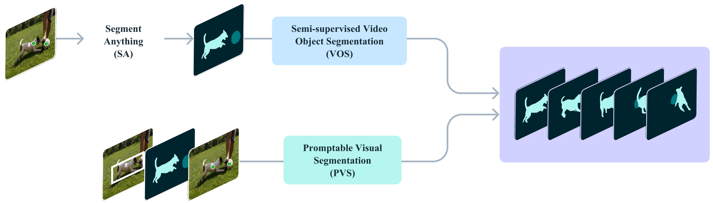

_图 8：可提示视觉分割（PVS）任务的示意图。先前研究的任务，如“分割任何物体”（SA）和半监督视频物体分割（VOS），均可视为 PVS 任务的特殊情况。_

PVS 与静态图像和视频领域中的若干任务相关。在图像方面，SA 任务可以被视为 PVS 的一个子集，即将视频缩减为单帧的情况。类似地，传统的半监督和交互式 VOS（Pont-Tuset et al., 2017）任务也是 PVS 的特殊情况，前者仅限于在第一帧提供掩码提示，后者则是在多帧上提供涂鸦以分割视频中的物体。在 PVS 中，提示可以是点击、掩码或边界框，重点在于增强交互体验，从而能够通过最少的交互轻松优化物体的分割结果。

# B 局限性

SAM 2 在静态图像和视频领域均表现出强劲的性能，但在某些场景下仍面临困难。模型可能无法在镜头切换时分割物体，或者在拥挤场景中、长时间遮挡后以及长视频中丢失跟踪目标或混淆物体。为了缓解这一问题，我们

---

设计了在任意帧中提示 SAM 2 的能力：如果模型丢失了目标或出现错误，在额外帧上进行修正点击通常可以快速恢复正确的预测。SAM 2 在准确跟踪具有非常纤细或微小细节的目标时也面临挑战，特别是当这些目标快速移动时。另一种具有挑战性的场景是当附近存在外观相似的目标时（例如，多个相同的杂耍球）。在 SAM 2 中加入更明确的运动建模可以缓解此类情况下的错误。

虽然 SAM 2 可以同时跟踪视频中的多个目标，但 SAM 2 分别处理每个目标，仅利用共享的逐帧嵌入，而没有目标间的通信。虽然这种方法很简单，但加入共享的目标级上下文信息可能有助于提高效率。

我们的数据引擎依赖人工标注员来验证 masklet（掩码片段）的质量并选择需要修正的帧。未来的发展可能包括自动化这一过程以提高效率。

# C SAM 2 细节

# C.1 架构

在此我们进一步讨论架构细节，对 \(\S 4\) 中的模型描述进行扩展。

图像编码器。我们使用特征金字塔网络（Lin et al., 2017）来融合分别来自 Hiera 图像编码器第 3 阶段和第 4 阶段的步长为 16 和 32 的特征，从而为每一帧生成图像嵌入。此外，第 1 阶段和第 2 阶段的步长为 4 和 8 的特征虽然未在记忆注意力中使用，但被添加到了掩码解码器的上采样层中，如图 9 所示，这有助于产生高分辨率的分割细节。我们遵循 Bolya et al. (2023) 的做法，在 Hiera 图像编码器中使用窗口化的绝对位置嵌入。在 Bolya et al. (2023) 中，RPB（相对位置偏置）提供了跨越主干网络中窗口的位置信息，取而代之的是，我们采用了一种更简单的方法，即通过插值全局位置嵌入来跨越窗口。我们不使用任何相对位置编码。我们训练了具有不同图像编码器尺寸的模型——T、S、B+ 和 L。我们遵循 Li et al. (2022b) 的做法，仅在图像编码器层的一个子集中使用全局注意力（见表 13）。

记忆注意力。除了正弦绝对位置嵌入外，我们在自注意力层和交叉注意力层中使用了 2D 空间旋转位置嵌入（RoPE）（Su et al., 2021; Heo et al., 2024）。目标指针标记被排除在 RoPE 之外，因为它们没有特定的空间对应关系。默认情况下，记忆注意力使用 \( L = 4 \) 层。

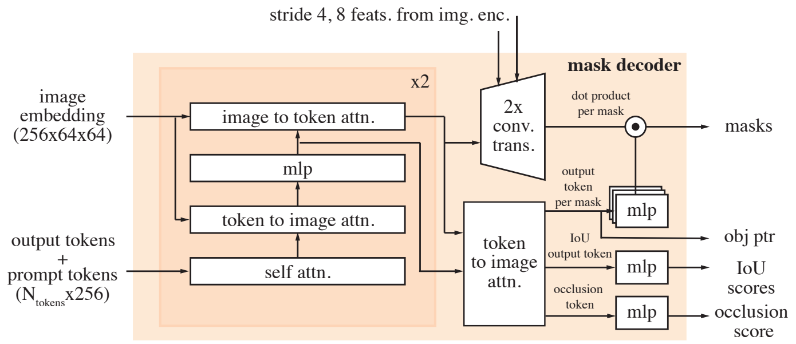

_图 9 掩码解码器架构。该设计很大程度上遵循了 SAM，我们在上采样过程中额外包含了来自图像编码器的步长 4 和步长 8 的特征。我们还将对应于输出掩码的掩码标记用作对象指针，并生成一个遮挡分数，用于指示感兴趣的目标在当前帧中是否可见。_

提示编码器和掩码解码器。提示编码器的设计遵循 SAM，接下来我们讨论掩码解码器设计变更的其他细节。我们将对应于输出掩码的掩码标记作为该帧的对象指针标记，并将其放置在记忆库中。正如 §4 中所讨论的，我们还

---

引入了一个遮挡预测头。这是通过在掩码和 IoU 输出 token 之外增加一个额外的 token 来实现的。对这个新 token 应用一个额外的 MLP 头，以产生一个分数，指示感兴趣物体在当前帧中可见的可能性（如图 9 所示）。

SAM 引入了在面临图像中被分割物体的歧义时输出多个有效掩码的能力。例如，当一个人点击自行车的轮胎时，模型可以将此点击解释为仅指轮胎或整辆自行车，并输出多个预测。在视频中，这种歧义可以跨越视频帧延伸。例如，如果在一帧中只有轮胎可见，点击轮胎可能仅与轮胎有关；或者随着后续帧中自行车的更多部分变得可见，此点击可能意在指代整辆自行车。为了处理这种歧义，SAM 2 在视频的每一步预测多个掩码。如果进一步的提示未能解决歧义，模型会选择当前帧中预测 IoU 最高的掩码，以便在视频中继续传播。

**记忆编码器和记忆库**。我们的记忆编码器不使用额外的图像编码器，而是重用由 Hiera 编码器生成的图像嵌入，这些嵌入与预测的掩码信息融合以产生记忆特征（如 §4 中所述）。这种设计使记忆特征能够受益于图像编码器产生的强大表示（特别是当我们扩大图像编码器规模时）。此外，我们将记忆库中的记忆特征投影到 64 维，并将 256 维的对象指针拆分为 4 个 64 维的 token，用于与记忆库进行交叉注意力。

# C.2 训练

# C.2.1 预训练

我们首先在 SA-1B 数据集（Kirillov et al., 2023）上的静态图像上预训练 SAM 2。表 13a 详细介绍了在 SA-1B 上预训练期间使用的设置——此处未提及的其他设置遵循 Kirillov et al. (2023)。图像编码器从 MAE 预训练的 Hiera（Ryali et al., 2023）初始化。与 SAM 类似，我们过滤掉覆盖超过图像 \(90\%\) 的掩码，并将训练限制为每张图像随机采样 64 个掩码。

与 SAM 不同，我们发现使用 \(\ell_1\) 损失来更积极地监督 IoU 预测是有益的，并对 IoU logits 应用 sigmoid 激活以将输出限制在 0 到 1 之间。对于多掩码预测（在第一次点击时），我们监督所有掩码的 IoU 预测，以鼓励更好地学习何时掩码可能较差，但仅监督具有最低分割损失（focal 和 dice 损失的线性组合）的掩码 logits。在 SAM 中，在点的迭代采样期间，插入了两次没有额外提示的迭代（仅输入前一个掩码 logits）——我们在训练期间不添加此类迭代，并使用 7 次修正点击（而不是 SAM 中的 8 次）。我们还在训练期间采用水平翻转增强，并将图像大小调整为 \(1024 \times 1024\) 的正方形尺寸。

我们使用 AdamW（Loshchilov & Hutter, 2019）并对图像编码器应用层衰减（layer decay）（Clark et al., 2020），并遵循倒数平方根计划（reciprocal square-root schedule）（Zhai et al., 2022）。有关我们预训练阶段的超参数，请参见表 13。

# C.2.2 完整训练

预训练后，我们在引入的数据集 SA-V + Internal（第 §5.2 节）、SA-1B 的 \(10\%\) 子集以及包括 DAVIS（Pont-Tuset et al., 2017; Caelles et al., 2019）、MOSE（Ding et al., 2023）和 YouTubeVOS（Xu et al., 2018b）在内的开源视频数据集混合上训练 SAM 2。我们发布的模型是在 SA-V manual + Internal 和 SA-1B 上训练的。

SAM 2 专为两项任务设计；PVS 任务（在视频上）和 SA 任务（在图像上）。训练是在图像和视频数据上联合进行的。为了优化我们在训练期间的数据使用和计算资源，我们在视频数据（多帧）和静态图像（单帧）之间采用交替训练策略。具体来说，在每个训练迭代中，我们从图像或视频数据集中采样一个完整的批次，其采样概率与每个数据源的大小成正比。这种方法允许对两项任务进行平衡的接触，并为每个数据源使用不同的批次大小以最大化计算利用率。此处未明确提及的图像任务设置遵循预训练阶段的设置。有关我们完整训练阶段的超参数，请参见表 13。训练数据混合由 \(\sim 15.2\%\) 的 SA-1B、\(\sim 70\%\) 的 SA-V 和 \(\sim 14.8\%\) 的 Internal 组成。当使用开源数据集时使用相同的设置

---

<table><tr><td>配置</td><td>数值</td></tr><tr><td>数据</td><td>SA-1B</td></tr><tr><td>步数</td><td>~90k</td></tr><tr><td>分辨率</td><td>1024</td></tr><tr><td>精度</td><td>float16</td></tr><tr><td>优化器</td><td>AdamW</td></tr><tr><td>优化器动量</td><td>β1, β2=0.9, 0.999</td></tr><tr><td>梯度裁剪</td><td>类型: l2, 最大值: 0.1</td></tr><tr><td>权重衰减</td><td>0.1</td></tr><tr><td>学习率</td><td>4e-4</td></tr><tr><td>学习率调度</td><td>倒数平方根, 时间尺度=1000</td></tr><tr><td>预热</td><td>线性, 1k 次迭代</td></tr><tr><td>冷却</td><td>线性, 5k 次迭代</td></tr><tr><td>层级衰减</td><td>0.8 (T, S), 0.9 (B+), 0.925 (L)</td></tr><tr><td>数据增强</td><td>水平翻转, 调整大小至 1024 (正方形)</td></tr><tr><td>批大小</td><td>256</td></tr><tr><td>Drop Path</td><td>0.1 (T, S), 0.2 (B+), 0.3 (L)</td></tr><tr><td>掩码损失 (权重)</td><td>focal (20), dice (1)</td></tr><tr><td>IoU 损失 (权重)</td><td>l1 (1)</td></tr><tr><td>每张图最大掩码数</td><td>64</td></tr><tr><td>修正点数量</td><td>7</td></tr><tr><td>全局注意力块</td><td>5-7-9 (T), 7-10-13 (S), 12-16-20 (B+), 23-33-43 (L)</td></tr></table>

_(a) 预训练_

<table><tr><td>配置</td><td>数值</td></tr><tr><td>数据</td><td>SA-1B, Internal, SA-V</td></tr><tr><td>步数</td><td>~300k</td></tr><tr><td>分辨率</td><td>1024</td></tr><tr><td>精度</td><td>float16</td></tr><tr><td>优化器</td><td>AdamW</td></tr><tr><td>优化器动量</td><td>β1, β2=0.9, 0.999</td></tr><tr><td>梯度裁剪</td><td>类型: ℓ2, 最大值: 0.1</td></tr><tr><td>权重衰减</td><td>0.1</td></tr><tr><td>学习率</td><td>主干网络: 6e-5, 其他: 3.0e-4</td></tr><tr><td>学习率调度</td><td>余弦</td></tr><tr><td>预热</td><td>线性, 15k 次迭代</td></tr><tr><td>层级衰减</td><td>0.8 (T, S), 0.9 (B+), 0.925 (L)</td></tr><tr><td>图像增强</td><td>水平翻转, 调整大小至 1024 (正方形)</td></tr><tr><td>视频增强</td><td>水平翻转, 仿射 (角度: 25, 剪切: 20), 颜色抖动 (b: 0.1, c: 0.03, s: 0.03, h: null), 灰度化 (0.05), 逐帧颜色抖动 (b: 0.1, c: 0.05, s: 0.05, h: null)</td></tr><tr><td>批大小</td><td>256</td></tr><tr><td>Drop Path</td><td>0.1 (T, S), 0.2 (B+), 0.3 (L)</td></tr><tr><td>掩码损失 (权重)</td><td>focal (20), dice (1)</td></tr><tr><td>IoU 损失 (权重)</td><td>ℓ1 (1)</td></tr><tr><td>遮挡损失 (权重)</td><td>交叉熵 (1)</td></tr><tr><td>每帧最大掩码数</td><td>图像: 64, 视频: 3</td></tr><tr><td>修正点数量</td><td>7</td></tr><tr><td>全局注意力块</td><td>5-7-9 (T), 7-10-13 (S), 12-16-20 (B+), 23-33-43 (L)</td></tr></table>

_(b) 完整训练_

_表 13 SAM 2 预训练和完整训练的超参数及详细信息。请注意，某些设置会根据图像编码器的大小 (T, S, B+, L) 而变化。_

...（此处省略了部分翻译，因为原文中“are included...”这一段似乎是上一段表格说明的结尾，或者是一个不完整的句子。根据上下文，它应该是指数据集的构成。）

数据集构成包括，变化之处在于包含了额外的数据（\(\sim 1.3\%\) DAVIS, \(\sim 9.4\%\) MOSE, \(\sim 9.2\%\) YouTubeVOS, \(\sim 15.5\%\) SA-1B, \(\sim 49.5\%\) SA-V, \(\sim 15.1\%\) Internal）。

我们通过模拟交互式设置进行训练，采样 8 帧序列并随机选择最多 2 帧（包括第一帧）进行修正点击。在训练期间，我们使用真值掩码片段和模型预测来采样提示，其中初始提示为真值掩码（50% 概率）、来自真值掩码的正向点击（25%）或边界框输入（25%）。

我们将每个 8 帧序列的最大掩码片段限制为 3 个随机选择的片段。我们以 \(50\%\) 的概率反转时间顺序，以帮助泛化到双向传播。当我们采样修正点击时，有 \(10\%\) 的小概率我们会从真值掩码中随机采样点击，而不考虑模型预测，以允许掩码细化具有额外的灵活性。

损失与优化。我们使用 Focal 损失和 Dice 损失的线性组合来监督掩码预测，使用平均绝对误差 (MAE) 损失来监督 IoU 预测，并使用交叉熵损失来监督对象预测，它们的比例分别为 20:1:1:1。与预训练期间一样，对于多掩码预测，我们只监督分割损失最低的那个掩码。如果真值在某一帧中不包含掩码，我们则不监督任何掩码输出（但始终监督遮挡预测头，该预测头预测帧中是否应该存在掩码）。

# C.3 速度基准测试

我们在单个 A100 GPU 上使用 PyTorch 2.3.1 和 CUDA 12.1 运行所有基准测试实验，并在 bfloat16 自动混合精度下进行。我们使用 torch.compile 编译所有 SAM 2 模型的图像编码器，为了在 SA 任务上进行直接比较，我们对 SAM 和 HQ-SAM 也执行了相同的操作（表 6 和 15）。SA 任务的 FPS 测量使用的批大小为 10 张图像，发现在所有三种模型类型中这能产生最高的 FPS。对于视频任务，我们遵循视频分割的通用协议，使用批大小 1。

---

---

# D 数据详情

# D.1 SA-V 数据集详情

视频。视频分辨率范围从 240p 到 4K，平均尺寸为 \(1,401 \times 1,037\)。视频时长范围从 4 秒到 2.3 分钟，平均为 13.8 秒，总计包含 420 万个标注帧和 196 小时的视频。

自动掩码片段。类似于 Kirillov 等人 (2023) 描述的方法，自动掩码片段是通过使用规则网格提示模型生成的。我们在第一帧上使用 \( 32 \times 32 \) 的网格提示模型，此外，我们在第一帧的 4 个放大图像裁剪区域（源自 \( 2 \times 2 \) 重叠窗口）上使用 \( 16 \times 16 \) 的网格，并在第一帧的 16 个放大图像裁剪区域（源自 \( 4 \times 4 \) 重叠窗口）上使用 \( 4 \times 4 \) 的网格。我们

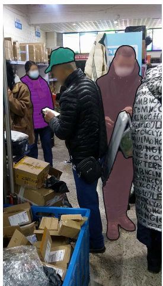

_(a) 仅人工标注_

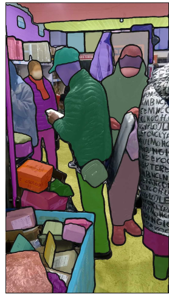

_(b) 包含自动标注_

_图 10 叠加在第一帧上的标注：(a) 仅人工标签 (ML)，(b) 包含自动标签 (Auto)。自动标签增加了多样性和覆盖范围。_

应用了两个后处理步骤。首先，我们移除面积小于 200 像素的微小不连通分量。其次，如果孔洞面积小于 200 像素，我们填充分割掩码中的孔洞。这些后处理步骤应用于所有帧。通过将这些自动生成的掩码片段与人工创建的掩码片段相结合，我们增强了 SA-V 数据集中标注的覆盖范围，如图 10 所示。

# D.2 数据引擎详情

# D.2.1 标注协议

图 11 展示了我们数据引擎中使用的标注协议图。标注任务被分为几个步骤，每个步骤由不同的标注员执行：步骤 1 和 2 侧重于对象选择，步骤 3 和 4 侧重于掩码片段跟踪，步骤 5 侧重于质量验证。SAM 2 部署在 GPU 上作为 API，并集成到标注工具中以实现交互式使用。

与图像分割标注相比，大规模视频分割标注带来了独特的挑战，这需要在标注任务设计和协议上进行创新。为了提高模型“分割万物”的能力，重点关注 SAM 2 表现困难的对象进行标注至关重要。我们利用了在线模型闭环设置来实现这一点，要求标注员交互式地使用 SAM 2 来识别失败模式，然后对其进行修正。

我们发现编辑帧的数量可以作为对象“难度”的代理指标，如表 9 所示。因此，我们要求标注员标注那些在 SAM 2 闭环辅助下至少需要编辑 2 帧的对象。为了将标注重点放在不突出且更具挑战性的案例上，我们向标注员展示预先填充了已验证满意的自动掩码片段的视频，并要求他们寻找未标注的挑战性对象。我们进一步将对象选择任务与标注任务解耦：在选择任务中，标注员专注于在一帧中选择挑战性对象；而在标注任务中，标注员面对一个挑战性目标对象，被要求在整个视频中持续地标注掩码片段。

# D.2.2 数据引擎阶段比较

表 1 中显示的数据引擎阶段比较是使用 169 个视频和 452 个掩码片段进行的对照实验。我们要求三组标注员使用每个阶段的标注协议标注同一组对象。我们根据第一帧中的掩码面积将掩码片段分为三类（小：1 到 \(32^2\)，中：\(32^2\) 到 \(96^2\)，大：等于或大于 \(96^2\)）。第 1 阶段的数据被用作质量参考，因为通过 SAM 逐帧手动标注产生了高质量的掩码。

# E 关于零样本迁移实验的详情

在本节中，我们将进一步介绍零样本实验（§6）的详情。除非另有说明，本节报告的结果均遵循我们的默认设置，即使用分辨率为

---

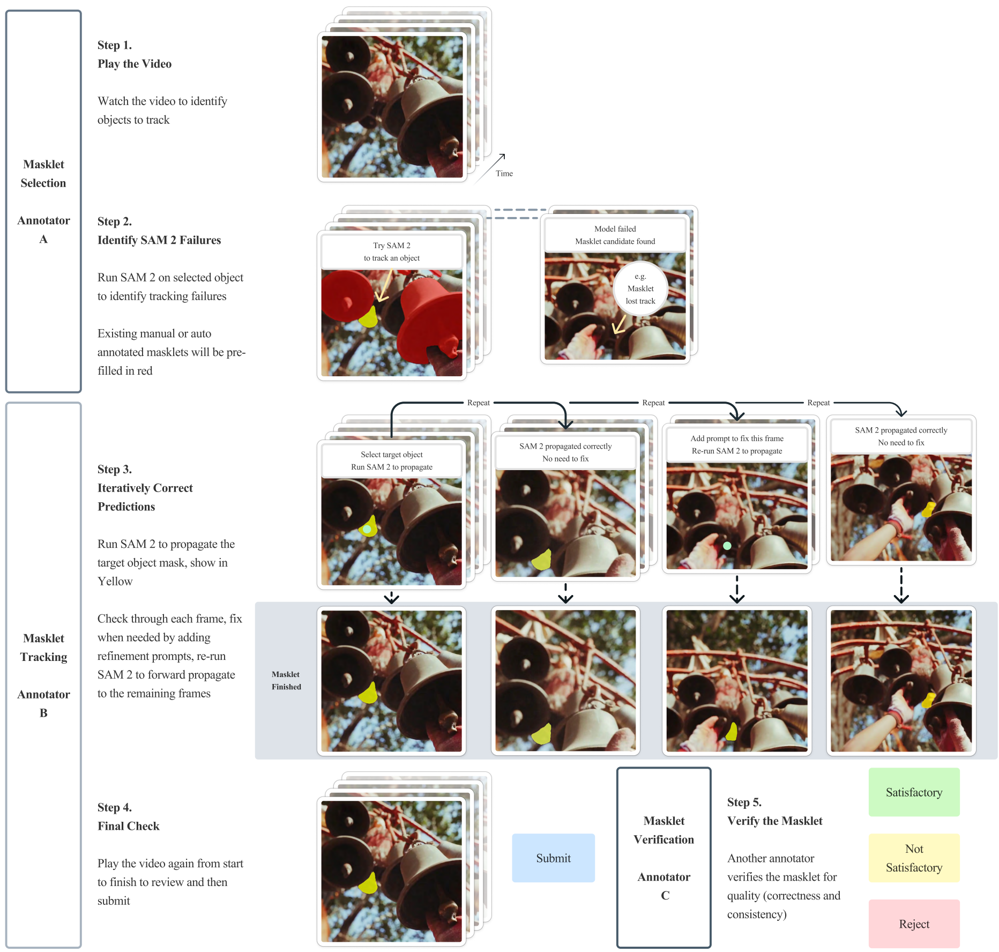

_图 11 标注指南概览。共有 3 个主要的标注任务：masklet 选择、masklet 追踪和 masklet 验证。每个任务由不同的标注员组完成。_

1024 并在数据集的全量组合上训练，即表 7 中的 SAM 2 (Hiera-B+)。

# E.1 零样本视频任务

# E.1.1 视频数据集详情

我们在 17 个零样本数据集的多样化基准上评估了 SAM 2：EndoVis 2018 (Allan et al., 2020) 包含带有手术机器人的医疗手术视频。ESD (Huang et al., 2023) 包含来自机械臂摄像头的视频，通常伴有运动模糊。LVOSv2 (Hong et al., 2024) 是一个长期视频对象分割的基准。LV-VIS (Wang et al., 2023) 包含来自多样化开放词汇对象类别的视频。UVO (Wang et al., 2021b) 包含用于开放世界对象分割的视频，VOST (Tokmakov et al., 2022) 包含对象发生剧烈形变的视频，例如鸡蛋破碎或纸张撕裂。PUMaVOS (Bekuzarov et al., 2023) 包含围绕对象部位（如人的脸颊）进行分割的视频。Virtual KITTI 2 (Cabon et al., 2020) 是一个包含驾驶场景的合成视频数据集。VIPSeg (Miao et al., 2022) 提供全景视频中的对象分割。Wildfires (Toulouse et al., 2017)

---

包含来自科西嘉岛火灾数据库不同条件下的野火视频。VISOR (Darkhalil et al., 2022) 包含厨房场景下的以自我为中心的视频，其中包含围绕手部和交互物体的片段。FBMS (Brox et al., 2010) 提供了视频中移动物体的运动分割。Ego-Exo4D (Grauman et al., 2023) 是一个包含围绕各种人类活动的以自我为中心视频的大型数据集。Cityscapes (Cordts et al., 2016) 包含城市驾驶场景的视频。Lindenthal Camera (Haucke & Steinhage, 2021) 包含野生动物园的视频，其中包含围绕被观察动物（如鸟类和哺乳动物）的片段。HT1080WT Cells (Gómez-de Mariscal et al., 2021) 包含带有细胞分割的显微视频。Drosophila Heart (Fishman et al., 2023) 包含果蝇心脏的显微视频。

在上述 17 个零样本视频数据集中，有 9 个（EndoVis, ESD, LVOSv2, LV-VIS, UVO, VOST, PUMaVOS, Virtual KITTI 2 和 VIPSeg）为每个视频帧标注了密集的物体片段。在其余 8 个数据集（Wildfires, VISOR, FBMS, Ego-Exo4D, Cityscapes, Lindenthal Camera, HT1080WT Cells 和 Drosophila Heart）中，物体片段仅在视频帧的子集上进行稀疏标注，我们在那些存在真值分割掩码的帧上计算指标。在本文的大多数评估中，我们仅在这 9 个密集标注的数据集上评估零样本性能，而在我们的半监督 VOS 评估（§6.1.2）中，我们在上面列出的所有这 17 个数据集上进行评估。

# E.1.2 交互式离线和在线评估细节

离线评估涉及对整个视频进行多次遍历。我们从第一帧的点击提示开始，在整个视频中分割物体，然后在下一次遍历中，我们选择相对于真值分割 IoU 最低的帧作为新的提示帧。然后，模型根据之前收到的所有提示再次在整个视频中分割物体，直到达到最大 \( N_{\mathrm{frame}} \) 次遍历（每次遍历有一个新的提示帧）。

在线评估仅涉及对整个视频进行一次遍历。我们从第一帧的点击提示开始，并将提示传播到整个视频，当遇到预测质量较低的帧（与真值的 IoU \(< 0.75\)）时暂停传播。然后我们在暂停的帧上添加额外的点击提示以纠正该帧上的分割，并恢复向前传播，直到遇到另一个 IoU \(< 0.75\) 的低质量帧。重复此过程，直到提示帧的数量小于最大值 \(N_{\mathrm{frame}}\)。与之前的离线评估不同，在此设置下，新的提示仅影响当前暂停帧之后的帧，而不影响它之前的帧。

在这两种设置下，我们都在 §E.1.1 中的 9 个密集标注数据集（EndoVis, ESD, LVOSv2, LV-VIS, UVO, VOST, PUMaVOS, Virtual KITTI 2 和 VIPSeg）上进行评估。如果视频的真值注释中包含多个要分割的物体，我们会独立地对每个物体进行推理。我们模拟交互式视频分割，每帧使用 \( N_{\mathrm{click}} = 3 \) 次点击，假设用户会通过视觉定位物体以对其进行标注（使用初始点击）或优化其当前的分割预测（使用纠正点击）。具体来说，当开始第一次遍历（此时尚无任何现有预测）时，我们在第一帧的物体真值掩码中心1放置一个初始点击，然后根据错误区域中心（在真值掩码和第一帧的预测片段之间）交互式地再添加两次点击。然后在随后的遍历中（此时已有预测片段），我们根据错误区域中心（在真值掩码和被提示帧的预测片段之间）交互式地添加三次点击。

我们报告了在 \(N_{\mathrm{frame}} = 1,\ldots ,8\) 个交互帧上的平均 \(\mathcal{J}\& \mathcal{F}\) 指标，以及基于以下假设的不同视频标注时间下的 \(\mathcal{J}\& \mathcal{F}\) 指标：

- 在每一帧上，注释员视觉定位物体需要 \( T_{\mathrm{loc}} = 1 \) 秒，添加每次点击需要 \( T_{\mathrm{click}} = 1.5 \) 秒，遵循 Delatolas et al. (2024) 的设定。

- 在离线模式下，在 300 帧的视频上每轮检查结果需要 \( T_{\mathrm{exam}} = 30 \) 秒，包括寻找分割质量最差的帧以添加纠正（对于更长或更短的视频，此时间与视频长度 \( L \) 成正比，假设注释员可以以 10 FPS 的速度检查结果）。

1掩码的中心定义为具有到掩码边界最大欧几里得距离的掩码像素。

---

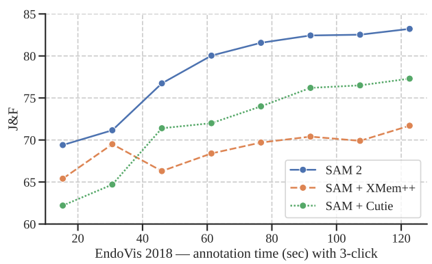

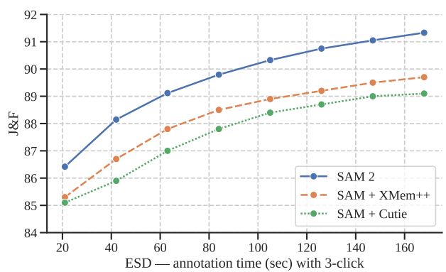

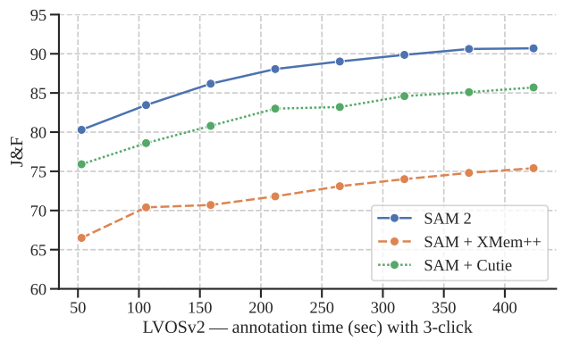

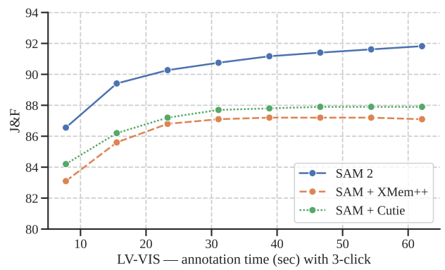

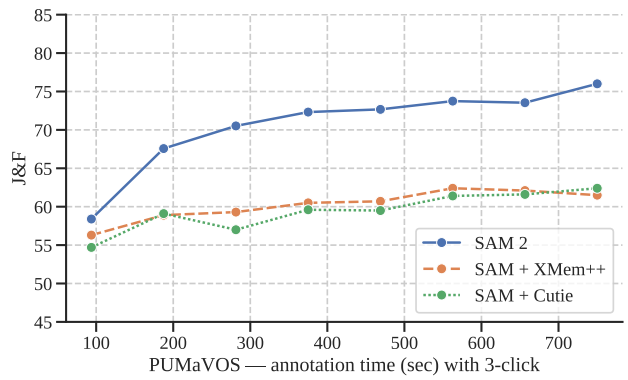

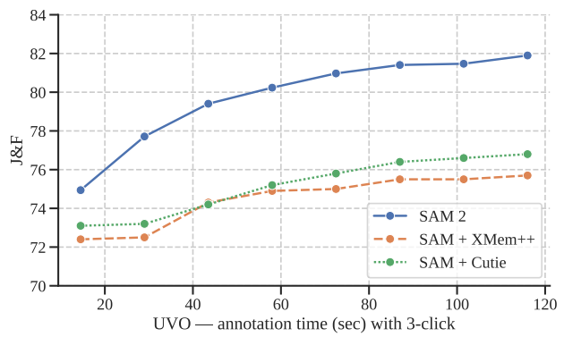

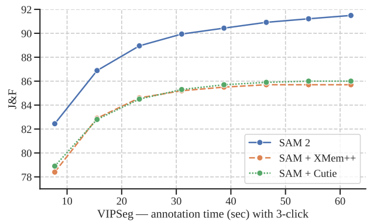

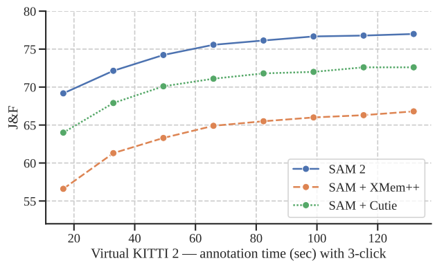

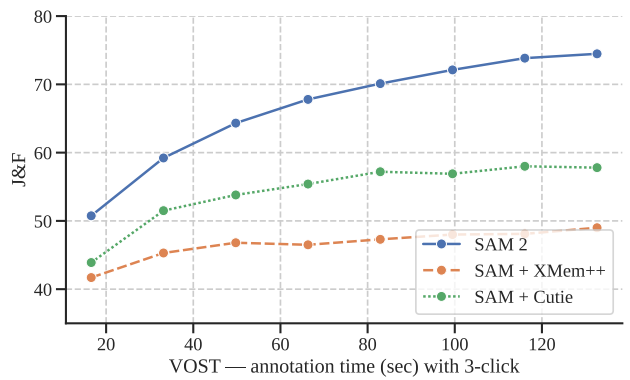

_(a) 在不同交互帧数下各数据集上的 \(\mathcal{I}\& \mathcal{F}\) 性能（3次点击）_

<table><tr><td>方法</td><td>EndoVis 2018</td><td>ESD</td><td>LVOSv2</td><td>LV-VIS</td><td>PUMaVOS</td><td>UVO</td><td>VIPSeg</td><td>Virtual KITTI 2</td><td>VOST</td><td>(平均)</td></tr><tr><td>SAM + XMem++</td><td>68.9</td><td>88.2</td><td>72.1</td><td>86.4</td><td>60.2</td><td>74.5</td><td>84.2</td><td>63.8</td><td>46.6</td><td>71.7</td></tr><tr><td>SAM + Cutie</td><td>71.8</td><td>87.6</td><td>82.1</td><td>87.1</td><td>59.4</td><td>75.2</td><td>84.4</td><td>70.3</td><td>54.3</td><td>74.7</td></tr><tr><td>SAM 2</td><td>78.4</td><td>89.6</td><td>87.3</td><td>90.4</td><td>70.6</td><td>79.8</td><td>89.0</td><td>74.7</td><td>66.6</td><td>80.7</td></tr></table>

_(b) 在8个交互帧下各数据集上的平均 \(\mathcal{I}\& \mathcal{F}\)（3次点击）_

_图 12：在不同交互帧数下，SAM 2 与基线方法（SAM+XMem++ 和 SAM+Cutie）在交互式离线评估中的零样本性能对比，每个交互帧使用 3 次点击。详情请参见 §E.1.2。_

- 在在线模式下，在一个 300 帧的视频中检查整个视频的结果总共需要 \( T_{\mathrm{exam}} = 30 \) 秒，包括在质量较低的帧处暂停以进行进一步修正（并且该时间与视频长度 \( L \) 成正比，类似于离线模式）。

- 在离线模式下，一个对象的标注时间为 \((T_{\mathrm{exam}} \cdot (L / 300) + T_{\mathrm{loc}} + T_{\mathrm{click}} \cdot N_{\mathrm{click}}) \cdot N_{\mathrm{frame}}\)，而在在线模式下为 \(T_{\mathrm{exam}} \cdot (L / 300) + (T_{\mathrm{loc}} + T_{\mathrm{click}} \cdot N_{\mathrm{click}}) \cdot N_{\mathrm{frame}}\)，其中 \(L\) 是视频中的总帧数，\(N_{\mathrm{frame}} = 1, \ldots, 8\) 是标注的帧数（即交互轮数），\(N_{\mathrm{click}} = 3\) 是每帧的点击次数。

我们在图 12 和图 13 中展示了 SAM 2 和两个基线方法（SAM+XMem++ 和 SAM+Cutie，详见下文）在交互式离线和在线评估中的各数据集结果。SAM 2 在所有数据集和设置上都以显著优势优于这两个基线方法。

# E.1.3 半监督 VOS 评估详情

在 §6.1.2 中，我们还在半监督 VOS 设置（Pont-Tuset et al., 2017）下与之前的视频跟踪方法进行了比较，其中提示（可以是前景/背景点击、边界框或真实对象掩码）仅在视频的第一帧上提供。当使用点击提示时，我们在第一个视频帧上交互式地采样 1、3 或 5 次点击，然后基于这些点击跟踪对象。遵循先前工作中基于点击的评估（Kirillov et al., 2023; Sofiiuk et al., 2022），初始

2我们注意到，该估算未考虑模型的跟踪 FPS。直觉是，人工标注员只能以较低的速度检查结果，因此模型的跟踪时间被包含在 \( T_{\mathrm{exam}} \) 中。

---

---

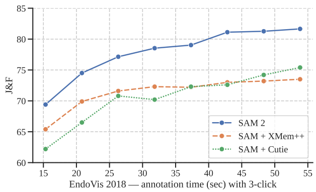

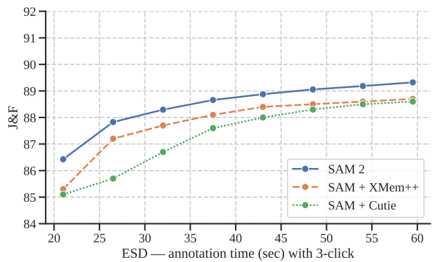

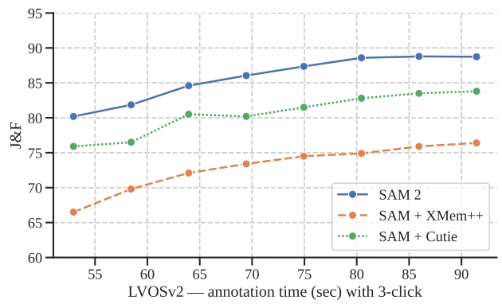

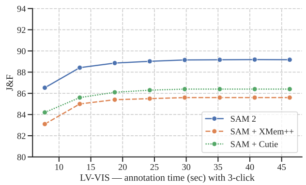

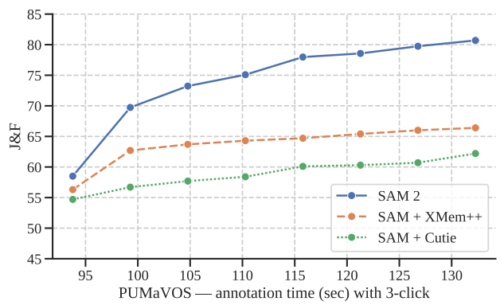

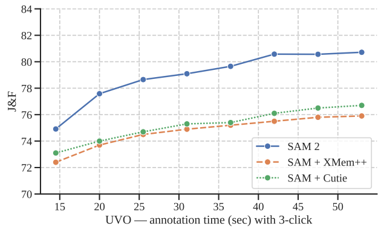

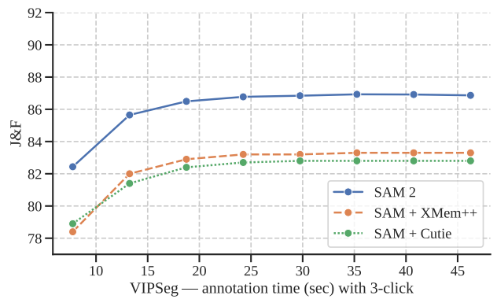

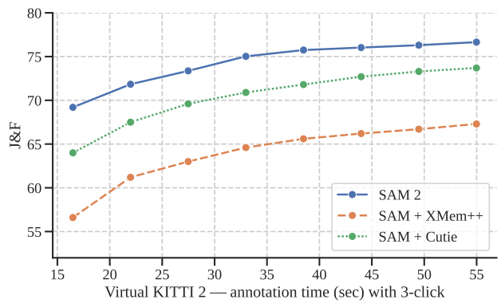

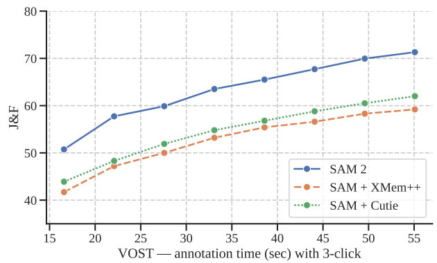

_(a) 在不同交互帧数下，每个数据集上的 \(\mathcal{I}\& \mathcal{F}\) 性能（3次点击）_

<table><tr><td>方法</td><td>EndoVis 2018</td><td>ESD</td><td>LVOSv2</td><td>LV-VIS</td><td>PUMaVOS</td><td>UVO</td><td>VIPSeg</td><td>Virtual KITTI 2</td><td>VOST</td><td>(平均)</td></tr><tr><td>SAM + XMem++</td><td>71.4</td><td>87.8</td><td>72.9</td><td>85.2</td><td>63.7</td><td>74.7</td><td>82.5</td><td>63.9</td><td>52.7</td><td>72.8</td></tr><tr><td>SAM + Cutie</td><td>70.5</td><td>87.3</td><td>80.6</td><td>86.0</td><td>58.9</td><td>75.2</td><td>82.1</td><td>70.4</td><td>54.6</td><td>74.0</td></tr><tr><td>SAM 2</td><td>77.8</td><td>88.5</td><td>85.8</td><td>88.7</td><td>74.2</td><td>79.0</td><td>86.1</td><td>74.3</td><td>63.3</td><td>79.7</td></tr></table>

_(b) 在8个交互帧下，每个数据集上的平均 \(\mathcal{J}\& \mathcal{F}\)（3次点击）_

_图 13：在不同交互帧数下，SAM 2 与基线方法（SAM+XMem++ 和 SAM+Cutie）在交互式在线评估中的零样本性能，每次交互使用 3 次点击。详情请参见 §E.1.2。_

第一次点击放置在物体中心，随后的点击从错误区域的中心获取。

与交互式设置类似，这里我们也使用 SAM+XMem++ 和 SAM+Cutie 作为两种基线方法。对于点击或框提示，首先使用 SAM 处理点击或边界框输入，然后将其输出的掩码作为 XMem++ 或 Cutie 的输入。对于掩码提示，第一帧的真实物体掩码直接用作 XMem++ 和 Cutie 的输入——这是标准的半监督 VOS 设置，用于评估不使用 SAM 的 XMem++ 和 Cutie 的性能。

在此设置下，我们在 §E.1.1 的所有 17 个零样本视频数据集上进行了评估。如果数据集不符合标准 VOS 格式，我们将其预处理为类似于 MOSE (Ding et al., 2023) 的格式。在处理过程中，我们确保每个视频中的所有物体在第一帧都有有效的非空分割掩码，以兼容半监督 VOS 评估。如果物体未出现在第一帧中，我们会为该物体创建一个单独的视频，从该物体出现的第一帧开始。

我们报告了此次评估的标准 \(\mathcal{J}\& \mathcal{F}\) 指标 (Pont-Tuset et al., 2017)。如果数据集提供了官方评估工具包，我们将使用它进行评估（在 VOST 数据集上，我们遵循其官方协议 (Tokmakov et al., 2022) 报告 \(\mathcal{J}\) 指标）。结果如表 4 所示，其中 SAM 2 在 17 个数据集中的大多数上，针对不同类型的提示，其表现均优于两种基线方法。

我们在图 14 中展示了 SAM 2 和两种基线方法（SAM+XMem++ 和 SAM+Cutie，详见下文）在半监督 VOS 评估中每个数据集的结果。对于不同类型的提示，SAM 2 在大多数这些数据集上的表现均优于两种基线方法。

---

---

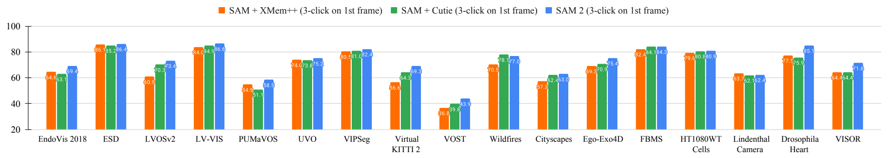

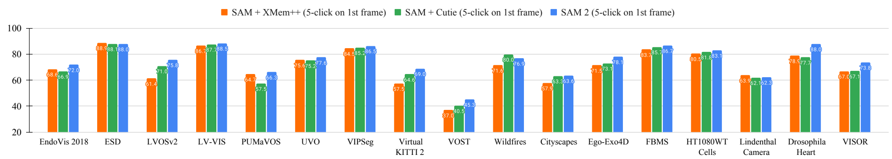

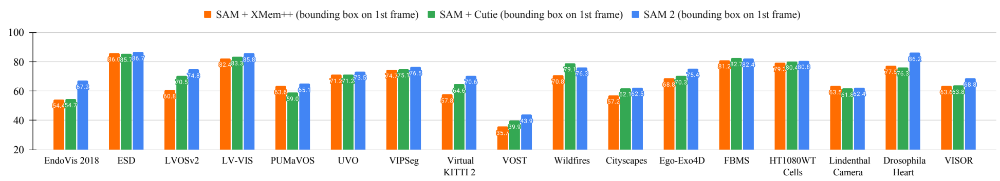

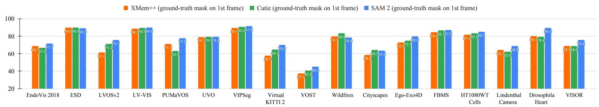

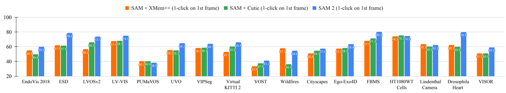

_图 14：SAM 2 与两个基线（SAM+XMem++ 和 SAM+Cutie）在 17 个视频数据集上的零样本性能对比。在半监督 VOS 评估下使用了不同的提示（1、3 或 5 次点击、边界框，或第一帧上的真实掩码），每种提示类型在数据集上的平均性能如表 4 所示。详见 §E.1.3。_

# E.1.4 SAM+XMem++ 和 SAM+Cutie 基线详情

我们采用 SAM+XMem++ 和 SAM+Cutie 作为可提示视频分割的两个基线，其中点击（或框）提示首先由 SAM 处理以获得目标掩码，然后 XMem++ / Cutie 模型在视频中跟踪该 SAM 掩码以获得最终的掩码片段（masklet）。在这两个基线中，SAM 可用于在第一帧提供初始目标掩码，或用于校正 XMem++ 或 Cutie 输出的现有目标掩码。这用于交互式离线和在线评估中的后续交互帧，其中提供新的正负点击作为对现有掩码的校正。

当使用 SAM 对给定帧中的现有掩码预测应用校正时，我们遵循 EVA-VOS (Delatolas et al., 2024) 的策略，在融入新的校正点击之前，首先利用 XMem++ 或 Cutie 的输出掩码初始化 SAM。具体而言，我们首先重建 XMem++ 或 Cutie 的输出

---

---

mask in SAM 中，通过从中采样点击并将其作为输入馈送到 SAM 中，直到 SAM 中重建的 mask 与 XMem++ 或 Cutie 输出 mask 的 IoU 达到 \(>0.8\)。然后，为了结合新的正负点击进行修正，我们将这些额外的修正点击与 mask 构建期间采样的初始点击拼接起来，并将拼接后的联合列表作为输入馈送到 SAM 中，以获得最终的修正 mask。我们发现这种策略比其他几种替代方案效果更好（例如，将 XMem++ 或 Cutie 输出 mask 作为 mask 提示与新的修正点击一起馈送到 SAM 中，或者仅将修正点击作为输入馈送到 SAM 而忽略 XMem++ 或 Cutie 输出 mask）。

# E.2 DAVIS 交互式基准测试

我们还在 DAVIS 交互式基准测试（Caelles et al., 2018）上进行了评估，该测试类似于我们在 §6.1.1 中的交互式离线评估，其中在每一轮交互中，评估服务器会提供分割表现最差的帧的新标注。官方的 DAVIS 评估工具包在交互期间提供涂鸦提示，而其他工作如 CiVOS（Vujasinovic et al., 2022）也将其扩展到了点击提示。

在这里，我们遵循 CiVOS 使用正负点击作为输入提示，并采用相同的点击采样策略。我们报告了该基准测试评估器提供的 \(\mathcal{J}\& \mathcal{F}@\mathrm{60s}\) 和 AUC-\(\mathcal{J}\& \mathcal{F}\) 指标，并与两个基线进行了比较：MiVOS（Cheng et al., 2021b），它通过涂鸦转 mask 模块直接使用提供的涂鸦（在 Vujasinovic et al., 2022 中也扩展到了点击提示），以及 CiVOS，它从提供的涂鸦中采样点击。结果如表 14 所示，其中 SAM 2（基于点击输入）在点击输入下的表现优于两个基线。我们注意到，SAM 2 往往倾向于在第一次点击时分割物体部分（例如人的手臂），而 DAVIS 数据集主要包含完整物体（例如整个人），这可能会降低 SAM 2 在该基准测试上的 \(\mathcal{J}\& \mathcal{F}\) 性能。我们通过观察一个在较少部分标注上训练的早期模型的更好准确性（点击输入下的 0.86 AUC-\(\mathcal{J}\& \mathcal{F}\) 和 0.89 \(\mathcal{J}\& \mathcal{F}@\mathrm{60s}\)）验证了这一点。

<table><tr><td>方法</td><td>输入类型</td><td>AUC-J&amp;F</td><td>J&amp;F@60s</td></tr><tr><td>MiVOS (Cheng et al., 2021b)</td><td>涂鸦</td><td>0.87</td><td>0.88</td></tr><tr><td>MiVOS (Cheng et al., 2021b)‡</td><td>点击</td><td>0.75</td><td>0.75</td></tr><tr><td>CiVOS (Vujasinović et al., 2022)</td><td>点击</td><td>0.83</td><td>0.84</td></tr><tr><td>SAM 2</td><td>点击</td><td>0.84</td><td>0.87</td></tr></table>

_表 14 SAM 2 和其他模型在 DAVIS 交互式基准测试上的性能。对于 SAM 2，我们遵循 CiVOS (Vujasinović et al., 2022) 的点击采样策略使用点击作为输入。详见 §E.2（\(\ddagger\)：Vujasinović et al., 2022 中报告的性能）。_

# E.3 零样本图像任务

# E.3.1 数据集详情

对于交互式分割任务，我们在一套包含 37 个数据集的综合数据集上评估了 SAM 2。这套数据集包括 SAM 以前用于零样本评估的 23 个数据集。为了完整性，我们列出这 23 个数据集：LVIS (Gupta et al., 2019), ADE20K (Zhou et al., 2019), Hypersim (Roberts et al., 2021), Cityscapes (Cordts et al., 2016), BBBC038v1 (Caicedo et al., 2019), DOORS (Pugliatti & Topputo, 2022), DRAM (Cohen et al., 2022), EgoHOS (Zhang et al., 2022), GTEA (Fathi et al., 2011; Li et al., 2015), iShape (Yang et al., 2021a), NDD20 (Trotter et al., 2020), NDISPark (Ciampi et al., 2021, 2022), OVIS (Qi et al., 2022), PPDLS (Minervini et al., 2016), Plittersdorf (Haucke et al., 2022), STREETS (Snyder & Do, 2019), TimberSeg (Fortin et al., 2022), TrashCan (Hong et al., 2020), VISOR (Darkhalil et al., 2022; Damen et al., 2022), WoodScape (Yogamani et al., 2019), PIDRay (Wang et al., 2021a), ZeroWaste-f (Bashkirova et al., 2022), 和 IBD (Chen et al., 2022)。关于这些数据集的更多详细信息，我们建议读者参阅 Kirillov et al. (2023)。除了这 23 个数据集外，我们还对从 14 个视频数据集中采样的帧进行了评估，以评估 SAM 2 在来自视频域的图像上的性能。使用的视频数据集如下：Lindenthal Camera Traps (LCT) (Haucke & Steinhage, 2021), VOST (Tokmakov et al., 2022), LV-VIS (Wang et al., 2023), FBMS (Brox et al., 2010), Virtual KITTI 2 (Cabon et al., 2020), Corsican Fire Database (CFD) (Toulouse et al., 2017), VIPseg (Miao et al., 2022), Drosophila Heart OCM (DH OCM) (Fishman et al., 2023), EndoVis 2018 (Allan et al., 2020), ESD (Huang et al., 2023), UVO (Wang et al.,

---

2021b), Ego-Exo4d (Grauman et al., 2023), LVOSv2 (Hong et al., 2024), 和 HT1080WT (Gómez-de Mariscal et al., 2021)。表 16 对这些数据集进行了更详细的描述。（其中一些数据集与 §E.1.1 中零样本视频数据集的数据来源相同。）

# E.3.2 详细的零样本实验

在本节中，我们将提供 §6.2 中实验的更详细版本。我们在表 15 中将 SAM 2 与不同模型规模的 SAM 和 HQ-SAM 进行了比较。我们用于评估的主要指标是 1 次点击和 5 次点击的 mIoU，并且我们按数据集领域对结果进行了分类。

表 15 首先展示了仅在图像上训练（针对 SA 任务）的模型在 SA-23 基准以及 14 个新引入的视频数据集上，使用不同骨干网络规模的比较。仅在 SA-1B 上训练的 SAM 2 (Hiera-B+) 在 1 次点击准确率上优于 SAM (ViT-H)，在 5 次点击准确率上优于 SAM (ViT-H) 和 HQ-SAM (ViT-H)，同时速度快 6 倍。SAM 2 (Hiera-L) 进一步将 1 次点击准确率平均提高了 1 个点，但牺牲了速度。尽管比 Hiera-B+ 慢，但它仍然比 SAM (ViT-H) 快 3.4 倍，比 SAM (ViT-B) 快 1.5 倍。

表 15 的最后两行说明了使用我们的图像和视频混合数据进行训练的好处，这使得在 23 个数据集上的平均准确率在 Hiera-B+ 骨干网络下提升到了 \(61.4\%\)。此外，我们观察到在 SA-23 的视频基准以及 14 个新引入的视频数据集上有显著改进。我们注意到我们没有扩展到比 Hiera-L 更大的规模，但预计更大的模型会有更好的性能。

<table><tr><td rowspan="2">模型</td><td rowspan="2">数据</td><td colspan="4">1 (5) 次点击 mIoU</td><td rowspan="2">FPS</td></tr><tr><td>SA-23 全部</td><td>SA-23 图像</td><td>SA-23 视频</td><td>14 个新视频</td></tr><tr><td>SAM (ViT-B)</td><td>SA-1B</td><td>55.9 (80.9)</td><td>57.4 (81.3)</td><td>54.0 (80.4)</td><td>54.5 (82.6)</td><td>76.7</td></tr><tr><td>SAM (ViT-H)</td><td>SA-1B</td><td>58.1 (81.3)</td><td>60.8 (82.1)</td><td>54.5 (80.3)</td><td>59.1 (83.4)</td><td>21.7</td></tr><tr><td>HQ-SAM (ViT-B)</td><td>HQSEG-44k</td><td>53.9 (72.1)</td><td>56.3 (73.9)</td><td>50.7 (69.9)</td><td>54.5 (75.0)</td><td>73.5</td></tr><tr><td>HQ-SAM (ViT-H)</td><td>HQSEG-44k</td><td>59.1 (79.8)</td><td>61.8 (80.5)</td><td>55.7 (78.9)</td><td>58.9 (81.6)</td><td>21.4</td></tr><tr><td>SAM 2 (Hiera-B+)</td><td>SA-1B</td><td>58.9 (81.7)</td><td>60.8 (82.1)</td><td>56.4 (81.2)</td><td>56.6 (83.7)</td><td>130.1</td></tr><tr><td>SAM 2 (Hiera-L)</td><td>SA-1B</td><td>60.0 (81.8)</td><td>62.0 (82.2)</td><td>57.4 (81.2)</td><td>58.5 (83.8)</td><td>61.4</td></tr><tr><td>SAM 2 (Hiera-B+)</td><td>我们的混合数据</td><td>61.9 (83.6)</td><td>63.2 (83.8)</td><td>60.3 (83.3)</td><td>69.9 (85.9)</td><td>130.1</td></tr><tr><td>SAM 2 (Hiera-L)</td><td>我们的混合数据</td><td>63.5 (83.5)</td><td>64.3 (83.7)</td><td>62.4 (83.2)</td><td>71.2 (85.6)</td><td>61.4</td></tr></table>

_表 15：在一套 37 个数据集上的“分割任何物体”（SA）任务上的零样本性能。该表显示了 SAM 2 与两个基线相比的平均 1 次和 5 次点击 mIoU，按数据集领域分类。我们报告了 SAM 用于零样本评估的 23 个数据集上的平均指标，以及 14 个新引入的零样本视频基准的平均指标。_

图 15 展示了各数据集的准确率细分，其中相对于 SAM 的 1 次点击 mIoU 的每数据集增量通过颜色编码来指示数据类型（图像或视频）。值得注意的是，尽管使用了较小的 Hiera-B+ 骨干网络，SAM 2 (Hiera-B+) 在 29 个数据集3上超过了 SAM，最高提升幅度达 \(53.9\mathrm{mIoU}\)。

# F 关于与半监督 VOS 最先进技术比较的详细信息

我们提供了关于与半监督 VOS 领域先前最先进技术（§7）进行比较的更多详细信息。我们包括了仅在 SA-1B、SA-V 和内部数据上训练的 SAM 2 的结果，针对不同的编码器规模。

定性比较：在图 16 中，我们展示了在第一帧中使用掩码提示时，我们的基线（Cutie-base+，顶行）与我们的模型（SAM 2，底行）之间的比较。虽然第一帧中的掩码提示仅覆盖了人物的衬衫，但基线预测的掩码片段错误地传播到了整个人物。然而，我们的模型能够将掩码片段限制在目标物体上。

定量比较：在表 17 中，我们将我们的模型与先前方法在额外的半监督 VOS 指标上进行了性能比较。在所有评估的基准和所有指标上，SAM 2 均优于先前的工作。请注意，与这些先前的方法不同，SAM 2 并非专门针对半监督 VOS

3我们注意到 OVIS 对于 SAM 2 来说并非严格意义上的零样本，因为其视频被用于 MOSE（我们训练数据混合的一部分）。

---

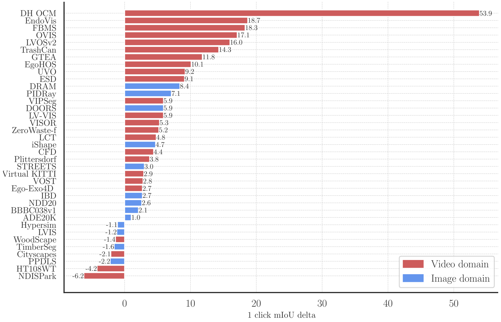

_图 15 SAM 2 与 SAM 在 37 个数据集套件上的 Zero-shot 性能对比。该图展示了 SAM 2 和 SAM 之间在中心 1 次点击 mIoU 上的差值。源自视频分布的数据集以红色高亮显示，而源自图像分布的数据集以蓝色高亮显示。_

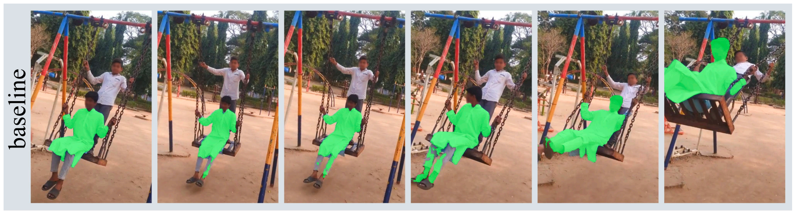

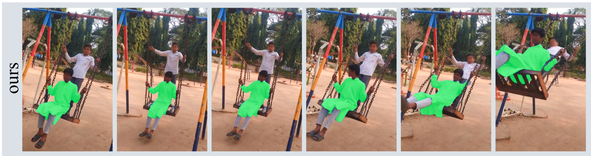

_图 16 当在第一帧中使用掩码提示时，我们的基线模型（Cutie-base+，顶行）与我们的模型（SAM 2，底行）之间的对比。_

任务，但能够进行更通用的可提示分割。SAM 2 也不受限于特定的对象类别集。我们的模型在 SA-V 基准测试（表 17a）上的表现证明了其在视频中分割任何物体的能力。

---

---

<table><tr><td>数据集</td><td>缩写 &amp; 链接</td><td>视频类型</td><td>描述</td><td>标注类型</td><td>源数据划分</td><td>采样视频数</td><td>采样掩码片段数</td><td>采样帧数</td><td>采样掩码数</td></tr><tr><td>LV-VIS (Wang et al., 2023)</td><td>LV-VIS</td><td>开放词汇</td><td>大规模开放词汇视频实例分割</td><td>密集</td><td>验证集</td><td>690</td><td>2536</td><td>15,604</td><td>54,077</td></tr><tr><td>A Drosophila heart optical coherence microscopy database for automatic video segmentation (Fishman et al., 2023)</td><td>DH OCM</td><td>显微镜；心脏</td><td>光学相干显微镜视频中果蝇心脏的分割</td><td>稀疏</td><td>全部</td><td>213</td><td>213</td><td>608,000</td><td>607,158</td></tr><tr><td>Video Object Segmentation under Transformations (Tokmakov et al., 2022)</td><td>VOST</td><td>形变</td><td>侧重于形状变换的视频对象分割</td><td>密集</td><td>验证集</td><td>635</td><td>882</td><td>67,004</td><td>89,722</td></tr><tr><td>Cityscapes-VPS (Cordts et al., 2016; Kim et al., 2020)</td><td>Cityscapes-VPS</td><td>驾驶</td><td>Cityscapes 驾驶数据集的全景分割</td><td>稀疏</td><td>验证集实例</td><td>209</td><td>1372</td><td>4,259</td><td>4,579</td></tr><tr><td>Corsican Fire Database (Toulouse et al., 2017)</td><td>CFD</td><td>野火</td><td>野火分割</td><td>稀疏</td><td>全部</td><td>5</td><td>5</td><td>541</td><td>541</td></tr><tr><td>Partial and Unusual Masks for Video Object Segmentation (Bekuzarov et al., 2023)</td><td>PUMaVOS</td><td>部件</td><td>侧重于部件和实际用例的视频对象分割</td><td>密集</td><td>全部</td><td>24</td><td>26</td><td>21,187</td><td>21,485</td></tr><tr><td>EPIC-KITCHENS VISOR (Darkhalil et al., 2022)</td><td>VISOR</td><td>第一视角</td><td>包含烹饪第一视角视频的视频对象分割基准，侧重于分割活动物体。</td><td>稀疏</td><td>验证集</td><td>921</td><td>921</td><td>736,030</td><td>4,426</td></tr><tr><td>HT1080WT cells embedded in 3D collagen type I matrices (Gómez-de Mariscal et al., 2021)</td><td>HT1080WT</td><td>显微镜；细胞</td><td>HT1080WT 细胞运动的延时视频</td><td>稀疏</td><td>全部</td><td>60</td><td>150</td><td>1,010</td><td>2,694</td></tr><tr><td>Freiburg-Berkeley Motion Segmentation Dataset (Brox et al., 2010)</td><td>FBMS</td><td>移动物体</td><td>移动物体的精确分割</td><td>稀疏</td><td>全部</td><td>45</td><td>70</td><td>9734</td><td>755</td></tr><tr><td>Virtual KITTI 2 (Cabon et al., 2020)</td><td>Virtual KITTI 2</td><td>合成；驾驶</td><td>由游戏引擎生成的合成驾驶视频，重现了真实的 KITTI 视频。</td><td>密集</td><td>视频角度 Camera_0 的全部数据</td><td>996</td><td>1,638</td><td>109,368</td><td>162,708</td></tr><tr><td>EndoVis 2018 (Allan et al., 2020)</td><td>EndoVis 2018</td><td>内窥镜视频；手术</td><td>内窥镜视频中的医疗器械分割</td><td>密集</td><td>全部</td><td>15</td><td>29</td><td>2,325</td><td>4,314</td></tr><tr><td>Lindenthal Camera Traps (Haucke &amp; Steinhage, 2021)</td><td>LCT</td><td>立体</td><td>使用立体相机拍摄的野生动物视频。</td><td>稀疏</td><td>全部</td><td>12</td><td>12</td><td>4,012</td><td>412</td></tr><tr><td>LVOSv2 (Hong et al., 2024)</td><td>LVOSv2</td><td>长视频</td><td>长期视频对象分割基准，平均时长 1.14 分钟</td><td>密集</td><td>验证集</td><td>136</td><td>225</td><td>64,523</td><td>91,510</td></tr><tr><td>UVO (Wang et al., 2021b)</td><td>UVO</td><td>开放世界</td><td>视频中所有物体的开放世界实例分割</td><td>密集</td><td>验证集</td><td>54</td><td>311</td><td>4,860</td><td>26,747</td></tr><tr><td>EgoExo4d (Grauman et al., 2023)</td><td>EgoExo4d</td><td>第一视角</td><td>参与者完成熟练技能活动的第一视角视频。</td><td>稀疏</td><td>第一视角相机的验证集视频</td><td>1185</td><td>1185</td><td>327,080</td><td>9,035</td></tr><tr><td>VIPSeg (Miao et al., 2022)</td><td>VIPSeg</td><td>全景</td><td>用于视频全景分割的大规模真实场景数据</td><td>密集</td><td>验证集</td><td>152</td><td>1,457</td><td>3,416</td><td>30,408</td></tr><tr><td>Event-based Segmentation Dataset (Huang et al., 2023)</td><td>ESD</td><td>杂乱环境</td><td>室内杂乱环境下的桌面物体分割</td><td>密集</td><td>全部</td><td>135</td><td>814</td><td>13,325</td><td>78,243</td></tr></table>

_表 16 用于零样本评估的视频分割数据集。_

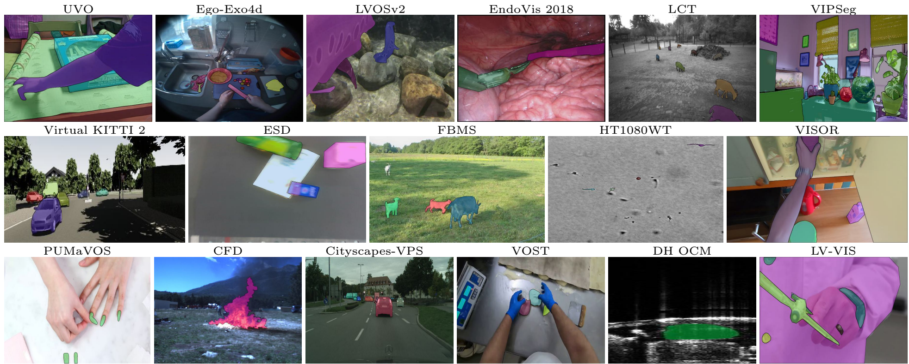

_图 17 SAM 2 零样本视频基准套件示例。_

---

---

<table><tr><td rowspan="2">方法</td><td colspan="3">SA-V 验证集</td><td colspan="3">SA-V 测试集</td></tr><tr><td>J&amp;F</td><td>J</td><td>F</td><td>J&amp;F</td><td>J</td><td>F</td></tr><tr><td>STCN (Cheng et al., 2021a)</td><td>61.0</td><td>57.4</td><td>64.5</td><td>62.5</td><td>59.0</td><td>66.0</td></tr><tr><td>SwinB-AOT-L (Yang et al., 2021b)</td><td>51.1</td><td>46.4</td><td>55.7</td><td>50.3</td><td>46.0</td><td>54.6</td></tr><tr><td>SwinB-DeAOT-L (Yang &amp; Yang, 2022)</td><td>61.4</td><td>56.6</td><td>66.2</td><td>61.8</td><td>57.2</td><td>66.3</td></tr><tr><td>RDE (Li et al., 2022a)</td><td>51.8</td><td>48.4</td><td>55.2</td><td>53.9</td><td>50.5</td><td>57.3</td></tr><tr><td>XMem (Cheng &amp; Schwing, 2022)</td><td>60.1</td><td>56.3</td><td>63.9</td><td>62.3</td><td>58.9</td><td>65.8</td></tr><tr><td>SimVOS-B (Wu et al., 2023b)</td><td>44.2</td><td>40.0</td><td>48.3</td><td>44.1</td><td>40.5</td><td>47.7</td></tr><tr><td>DEVA (Cheng et al., 2023b)</td><td>55.4</td><td>51.5</td><td>59.2</td><td>56.2</td><td>52.4</td><td>60.1</td></tr><tr><td>Cutie-base (Cheng et al., 2023a)</td><td>60.7</td><td>57.7</td><td>63.7</td><td>62.7</td><td>59.7</td><td>65.7</td></tr><tr><td>Cutie-base+ (Cheng et al., 2023a)</td><td>61.3</td><td>58.3</td><td>64.4</td><td>62.8</td><td>59.8</td><td>65.8</td></tr><tr><td>SAM 2 (Hiera-B+)</td><td>73.6</td><td>70.4</td><td>76.9</td><td>74.1</td><td>70.6</td><td>77.5</td></tr><tr><td>SAM 2 (Hiera-L)</td><td>75.6</td><td>72.3</td><td>78.9</td><td>77.6</td><td>74.0</td><td>81.1</td></tr><tr><td>SAM 2 (Hiera-T)‡</td><td>73.7</td><td>70.3</td><td>77.1</td><td>75.0</td><td>71.5</td><td>78.5</td></tr><tr><td>SAM 2 (Hiera-S)‡</td><td>72.7</td><td>69.4</td><td>76.0</td><td>74.9</td><td>71.4</td><td>78.4</td></tr><tr><td>SAM 2 (Hiera-B+)‡</td><td>75.3</td><td>71.8</td><td>78.7</td><td>74.7</td><td>71.2</td><td>78.2</td></tr><tr><td>SAM 2 (Hiera-L)‡</td><td>76.1</td><td>72.9</td><td>79.2</td><td>76.0</td><td>72.6</td><td>79.3</td></tr></table>

(a) SAM 2 与先前工作在我们的 SA-V 基准上针对半监督 VOS 任务的比较。我们使用先前工作的开源代码和检查点在 SA-V 上对其进行了评估。

<table><tr><td colspan="4">LVOS 验证集</td></tr><tr><td>方法</td><td>J&amp;F</td><td>J</td><td>F</td></tr><tr><td>DEVA (Cheng et al., 2023b)</td><td>55.9</td><td>51.1</td><td>60.7</td></tr><tr><td>DDMemory (Hong et al., 2023)</td><td>60.7</td><td>55.0</td><td>66.3</td></tr><tr><td>Cutie-base (Cheng et al., 2023a)</td><td>66.0</td><td>61.3</td><td>70.6</td></tr><tr><td>SAM 2 (Hiera-B+)</td><td>74.9</td><td>70.2</td><td>79.6</td></tr><tr><td>SAM 2 (Hiera-L)</td><td>76.1</td><td>71.6</td><td>80.6</td></tr><tr><td>SAM 2 (Hiera-T)‡</td><td>73.6</td><td>68.8</td><td>78.3</td></tr><tr><td>SAM 2 (Hiera-S)‡</td><td>73.5</td><td>68.6</td><td>78.4</td></tr><tr><td>SAM 2 (Hiera-B+)‡</td><td>76.2</td><td>71.6</td><td>80.7</td></tr><tr><td>SAM 2 (Hiera-L)‡</td><td>77.9</td><td>73.1</td><td>82.7</td></tr></table>

(b) SAM 2 与先前工作在 LVOS (Hong et al., 2023) 基准上的比较。

<table><tr><td rowspan="2">方法</td><td colspan="5">LVOSv2 验证集</td></tr><tr><td>J&amp;F</td><td>Js</td><td>Fs</td><td>Ju</td><td>Fu</td></tr><tr><td>STCN (Cheng et al., 2021a)</td><td>60.6</td><td>57.2</td><td>64.0</td><td>57.5</td><td>63.8</td></tr><tr><td>RDE (Li et al., 2022a)</td><td>62.2</td><td>56.7</td><td>64.1</td><td>60.8</td><td>67.2</td></tr><tr><td>SwinB-DeAOT (Yang &amp; Yang, 2022)</td><td>63.9</td><td>61.5</td><td>69.0</td><td>58.4</td><td>66.6</td></tr><tr><td>XMem (Cheng &amp; Schwing, 2022)</td><td>64.5</td><td>62.6</td><td>69.1</td><td>60.6</td><td>65.6</td></tr><tr><td>SAM 2 (Hiera-B+)</td><td>75.8</td><td>78.9</td><td>85.3</td><td>65.1</td><td>73.8</td></tr><tr><td>SAM 2 (Hiera-L)</td><td>78.1</td><td>78.9</td><td>85.2</td><td>69.7</td><td>78.6</td></tr><tr><td>SAM 2 (Hiera-T)‡</td><td>75.3</td><td>75.2</td><td>81.8</td><td>67.7</td><td>76.4</td></tr><tr><td>SAM 2 (Hiera-S)‡</td><td>76.4</td><td>77.1</td><td>84.0</td><td>67.5</td><td>77.0</td></tr><tr><td>SAM 2 (Hiera-B+)‡</td><td>75.8</td><td>77.0</td><td>83.4</td><td>67.0</td><td>75.6</td></tr><tr><td>SAM 2 (Hiera-L)‡</td><td>79.8</td><td>80.0</td><td>86.6</td><td>71.6</td><td>81.1</td></tr></table>

(c) SAM 2 与先前工作在 LVOSv2 (Hong et al., 2024) 基准上的比较。我们报告了由 LVOSv2 作者评估的先前工作的性能。

<table><tr><td rowspan="2">方法</td><td colspan="3">MOSE 验证集</td><td colspan="3">DAVIS17 验证集</td><td colspan="3">DAVIS17 测试集</td><td colspan="6">YTVOS19 验证集</td></tr><tr><td>J&amp;F</td><td>J</td><td>F</td><td>J&amp;F</td><td>J</td><td>F</td><td>J&amp;F</td><td>J</td><td>F</td><td>G</td><td>Js</td><td>Fs</td><td>Ju</td><td>Fu</td><td></td></tr><tr><td>STCN (Cheng et al., 2021a)</td><td>52.5</td><td>48.5</td><td>56.6</td><td>85.4</td><td>82.2</td><td>88.6</td><td>76.1</td><td>72.7</td><td>79.6</td><td>82.7</td><td>81.1</td><td>85.4</td><td>78.2</td><td>85.9</td><td></td></tr><tr><td>SwinB-AOT-L (Yang et al., 2021b)</td><td>59.4</td><td>55.5</td><td>63.2</td><td>85.4</td><td>82.4</td><td>88.4</td><td>81.2</td><td>77.3</td><td>85.1</td><td>84.5</td><td>84.0</td><td>88.8</td><td>78.4</td><td>86.7</td><td></td></tr><tr><td>SwinB-DeAOT-L (Yang &amp; Yang, 2022)</td><td>59.9</td><td>55.7</td><td>64.0</td><td>86.2</td><td>83.1</td><td>89.2</td><td>82.8</td><td>78.9</td><td>86.7</td><td>86.1</td><td>85.3</td><td>90.2</td><td>80.4</td><td>88.6</td><td></td></tr><tr><td>RDE (Li et al., 2022a)</td><td>46.8</td><td>42.4</td><td>51.3</td><td>84.2</td><td>80.8</td><td>87.5</td><td>77.4</td><td>73.6</td><td>81.2</td><td>81.9</td><td>81.1</td><td>85.5</td><td>76.2</td><td>84.8</td><td></td></tr><tr><td>XMem (Cheng &amp; Schwing, 2022)</td><td>59.6</td><td>55.4</td><td>63.7</td><td>86.0</td><td>82.8</td><td>89.2</td><td>79.6</td><td>76.1</td><td>83.0</td><td>85.6</td><td>84.1</td><td>88.5</td><td>81.0</td><td>88.9</td><td></td></tr><tr><td>SimVOS-B (Wu et al., 2023b)</td><td>-</td><td>-</td><td>-</td><td>88.0</td><td>85.0</td><td>91.0</td><td>80.4</td><td>76.1</td><td>84.6</td><td>84.2</td><td>83.1</td><td>-</td><td>79.1</td><td>-</td><td></td></tr><tr><td>JointFormer (Zhang et al., 2023b)</td><td>-</td><td>-</td><td>-</td><td>90.1</td><td>87.0</td><td>93.2</td><td>88.1</td><td>84.7</td><td>91.6</td><td>87.4</td><td>86.5</td><td>90.9</td><td>82.0</td><td>90.3</td><td></td></tr><tr><td>ISVOS (Wang et al., 2022)</td><td>-</td><td>-</td><td>-</td><td>88.2</td><td>84.5</td><td>91.9</td><td>84.0</td><td>80.1</td><td>87.8</td><td>86.3</td><td>85.2</td><td>89.7</td><td>81.0</td><td>89.1</td><td></td></tr><tr><td>DEVA (Cheng et al., 2023b)</td><td>66.0</td><td>61.8</td><td>70.3</td><td>87.0</td><td>83.8</td><td>90.2</td><td>82.6</td><td>78.9</td><td>86.4</td><td>85.4</td><td>84.9</td><td>89.4</td><td>79.6</td><td>87.8</td><td></td></tr><tr><td>Cutie-base (Cheng et al., 2023a)</td><td>69.9</td><td>65.8</td><td>74.1</td><td>87.9</td><td>84.6</td><td>91.1</td><td>86.1</td><td>82.4</td><td>89.9</td><td>87.0</td><td>86.0</td><td>90.5</td><td>82.0</td><td>89.6</td><td></td></tr><tr><td>Cutie-base+ (Cheng et al., 2023a)</td><td>71.7</td><td>67.6</td><td>75.8</td><td>88.1</td><td>85.5</td><td>90.8</td><td>88.1</td><td>84.7</td><td>91.4</td><td>87.5</td><td>86.3</td><td>90.6</td><td>82.7</td><td>90.5</td><td></td></tr><tr><td>SAM 2 (Hiera-B+)</td><td>75.8</td><td>71.8</td><td>79.9</td><td>90.9</td><td>87.7</td><td>94.1</td><td>88.3</td><td>85.0</td><td>91.5</td><td>88.4</td><td>87.1</td><td>91.7</td><td>83.3</td><td>91.4</td><td></td></tr><tr><td>SAM 2 (Hiera-L)</td><td>77.2</td><td>73.3</td><td>81.2</td><td>91.6</td><td>88.3</td><td>94.9</td><td>89.0</td><td>85.8</td><td>92.2</td><td>89.1</td><td>87.5</td><td>92.0</td><td>84.5</td><td>92.4</td><td></td></tr><tr><td>SAM 2 (Hiera-T)‡</td><td>70.9</td><td>66.7</td><td>75.2</td><td>89.2</td><td>85.7</td><td>92.7</td><td>86.7</td><td>83.3</td><td>90.0</td><td>87.4</td><td>85.5</td><td>90.0</td><td>83.0</td><td>91.2</td><td></td></tr><tr><td>SAM 2 (Hiera-S)‡</td><td>71.5</td><td>67.3</td><td>75.6</td><td>88.8</td><td>85.4</td><td>92.2</td><td>86.3</td><td>82.8</td><td>89.9</td><td>87.5</td><td>85.7</td><td>90.1</td><td>83.2</td><td>91.2</td><td></td></tr><tr><td>SAM 2 (Hiera-B+)‡</td><td>72.8</td><td>68.8</td><td>76.9</td><td>88.9</td><td>85.5</td><td>92.2</td><td>86.7</td><td>83.2</td><td>90.1</td><td>87.9</td><td>86.2</td><td>90.7</td><td>83.2</td><td>91.4</td><td></td></tr><tr><td>SAM 2 (Hiera-L)‡</td><td>74.6</td><td>70.6</td><td>78.6</td><td>89.3</td><td>85.7</td><td>92.8</td><td>88.1</td><td>84.6</td><td>91.6</td><td>88.6</td><td>86.6</td><td>91.3</td><td>84.2</td><td>92.2</td><td></td></tr></table>

(d) SAM 2 与先前工作在半监督 VOS 任务上的比较。

表 17 SAM 2 与先前工作在各种基准上的详细比较 (\(\ddagger\)：在 SA-1B、SA-V 和我们的内部数据集上训练的模型版本，如 §5.2 中所述)。

---

---

# G 模型、数据与标注说明卡片

# G.1 模型说明卡片

_模型概述_

<table><tr><td>名称</td><td>SAM 2 (Segment Anything Model 2)</td></tr><tr><td>版本</td><td>1.0</td></tr><tr><td>日期</td><td>2024</td></tr><tr><td>组织机构</td><td>Meta FAIR</td></tr><tr><td>模型类型</td><td>可提示分割模型</td></tr><tr><td>架构</td><td>参见第 4 节</td></tr><tr><td>代码仓库</td><td>https://github.com/facebookresearch/segment-anything-2</td></tr><tr><td>许可证</td><td>Apache 2.0</td></tr><tr><td colspan="2">预期用途</td></tr><tr><td>主要预期用户</td><td>SAM 2 被设计为一个用于可提示视频和图像分割任务的统一模型。该模型主要为研究用例开发。SAM 2 采用 Apache 2.0 许可证发布。</td></tr><tr><td>超出范围的用例</td><td>关于限制条件，请参阅伦理考量和许可证部分。</td></tr><tr><td>注意事项与建议</td><td>关于局限性，请参阅附录 B。</td></tr><tr><td colspan="2">相关因素</td></tr><tr><td>群体</td><td>SAM 2 与类别无关，旨在用于可提示的图像和视频分割。它可以分割和跟踪任何物体。</td></tr><tr><td>工具与环境</td><td>SAM 2 在多种类型的视频和图像数据上进行了评估。视频基准测试套件包括驾驶数据、显微镜图像、第一人称视角视频、机器人手术等领域。关于基准测试的描述请参见表 16，示例帧请参见图 17。SAM 2 在与 Kirillov 等人 (2023) 相同的图像基准测试套件上进行了评估，涵盖了水下图像、绘画、鱼眼图像等领域。</td></tr><tr><td colspan="2">评估指标</td></tr><tr><td>评估数据</td><td>我们使用以下指标评估 SAM 2 的性能： 
J&amp;F：我们使用 J&amp;F (Pont-Tuset et al., 2017) 评估可提示视频分割和半监督 VOS 任务的性能。 
G：我们在 YTVOS 2019 上使用 G 评估半监督 VOS 任务。 
mIoU：我们使用 mIoU 评估可提示图像分割任务的性能。</td></tr><tr><td colspan="2">训练数据</td></tr><tr><td>数据来源</td><td>SAM 2 在 SA-V 数据集以及内部可用的许可视频数据上进行了训练。更多详情请参阅正文第 5 节，关于 SA-V 数据集的数据说明卡片请参阅附录 G.2。</td></tr><tr><td colspan="2">伦理考量</td></tr><tr><td>数据</td><td>关于 SAM 2 训练数据的更多详情，请参阅第 5 节。在第 5.2 节中，我们展示了 SA-V 数据集中视频的地理分布以及收集视频的众包工作者的人口统计分布。</td></tr><tr><td>计算成本与影响</td><td>发布的 SAM 2 模型在 256 张 A100 GPU 上训练了 108 小时。这相当于 12165.12 千瓦时的电力消耗，估计排放了 3.89 公吨二氧化碳当量 (Patterson et al., 2021; Lacoste et al., 2019)。训练发布的 SAM 2 所产生的排放量相当于一辆普通汽油乘用车行驶约 1 万英里的排放量 (Agency, 2022)。</td></tr><tr><td>风险与危害</td><td>在正文第 6.1.3 节中，我们分析了 SAM 2 在不同人口群体的人员身上的表现。在新环境中使用 SAM 2 时，我们建议研究人员针对其特定用例对 SAM 2 进行独立的公平性评估。</td></tr><tr><td>用例</td><td>我们恳请用户运用其最佳判断力。</td></tr></table>

_表 18 遵循 Mitchell 等人 (2019) 提出的结构的 SAM 2 模型说明卡片_

---

---

# G.2 SA-V 数据集数据卡片

# 动机

1. **创建该数据集的目的是什么？是否有特定的任务目标？是否有特定的空白需要填补？请提供描述。** 该数据集专为 PVS（原型视频分割）任务设计。本数据集对视觉社区的贡献包括：(1) 该数据集由 50.9K 个视频和 642.6K 个掩码片段组成，是迄今为止公开可用的最大的视频分割数据集（参见 5.2 节与当前 VOS 数据集的对比）；(2) 该数据集在 https://ai.meta.com/datasets/segment-anything-video/ 上根据知识共享署名 4.0 国际公共许可证（Creative Commons Attribution 4.0 International Public License）提供；(3) 与以往的数据集相比，该数据集在地理分布上更加多样化，且为公开可用的视频分割数据集。

2. **谁创建了该数据集（例如，哪个团队、研究小组），代表哪个实体（例如，公司、机构、组织）？** 该数据集由 Meta FAIR 创建。基础视频是通过签约的第三方公司收集的。

3. **谁资助了该数据集的创建？** 该数据集由 Meta FAIR 资助。

4. **是否有其他补充说明？** 无。

# 组成

1. **组成数据集的实例代表什么（例如，文档、照片、人员、国家）？是否有多种类型的实例（例如，电影、用户和评分；人员及其互动；节点和边）？请提供描述。** 数据集中的所有实例均为视频。我们鼓励题材的多样性，在视频收集过程中未应用特定的主题。视频的常见主题包括：地点、物体、场景。所有视频都是独特的，但也有一些视频组拍摄的是相同的题材。

2. **总共有多少个实例（如果适用，每种类型有多少）？** 共有 50.9K 个视频。

3. **数据集包含所有可能的实例，还是来自更大集合的实例样本（不一定是随机的）？如果是样本，那么更大的集合是什么？该样本是否代表更大的集合（例如，地理覆盖范围）？如果是，请描述如何验证/核实这种代表性。如果不是，请描述原因（例如，为了覆盖更多样化的实例范围，因为实例被保留或不可用）。** 虽然数据集包含所有可能的实例，但审核人员被建议拒绝标注包含露骨图像的内容。

4. **每个实例包含什么数据？“原始”数据（例如，未处理的文本或图像）还是特征？无论哪种情况，请提供描述。** 每个实例都是一个视频。

5. **每个实例是否有关联的标签或目标？如果有，请提供描述。** 每个视频都标注了在视频中跟踪物体的掩码片段。掩码片段没有关联的类别或文本。数据标注速率为 6 FPS。平均每个视频有 3.8 个手动掩码片段和 8.9 个自动掩码片段，总共有 642.6K 个掩码片段。

6. **单个实例中是否缺少任何信息？如果是，请提供描述，解释为什么缺少这些信息（例如，因为无法获得）。这不包括故意删除的信息，但可能包括例如编辑过的文本。** 无。

7. **单个实例之间的关系是否明确（例如，用户的电影评分、社交网络链接）？如果是，请描述这些关系是如何明确的。** 无。

8. **数据集中是否有任何错误、噪声源或冗余？如果是，请提供描述。** 对于手动掩码片段，可能存在人为错误；例如，标注人员可能会遗漏需要检查或修复的帧。对于自动掩码片段，由于使用 SAM 2 生成它们，可能存在模型错误，例如掩码片段的不一致。

9. **数据集是自包含的，还是链接到或依赖外部资源（例如，网站、推文、其他数据集）？如果链接到或依赖外部资源，a) 是否有保证它们会随着时间的推移存在并保持不变；b) 是否有完整数据集的官方存档版本（例如，包括数据集创建时存在的外部资源）；c) 是否有任何与任何外部资源相关的限制（例如，许可证、费用）可能适用于数据集使用者？请提供所有外部资源及与其相关的任何限制的描述，以及适当的链接或其他访问点。** 数据集是自包含的。

10. **数据集是否包含可能被视为机密的数据（例如，受法律特权或医患保密保护的数据，包括个人非公开通信内容的数据）？如果是，请提供描述。** 无。

11. **数据集是否包含如果直接观看可能具有冒犯性、侮辱性、威胁性或可能引起焦虑的数据？如果是，请描述原因。** 我们有三项安全措施来防止令人反感的内容：(1) 指示收集视频的众包工作人员不要录制可能包含令人反感的内容（例如，暴力画面、裸露或不适当的内容）的视频。(2) 指示标注视频的专家标注人员，如果存在令人反感的内容，将其标记并拒绝。(3) 关于数据集中视频的报告可以发送至 segment-anything@meta.com。

12. **数据集是否识别了任何亚群体（例如，按年龄、性别）？如果是，请描述如何识别这些亚群体，并提供它们在数据集中各自分布的描述。** 数据集未识别视频中任何人员的亚群体。收集数据集中视频的众包工作人员的人口统计特征在 5.2 节中展示。

13. **是否可以直接或间接（即结合其他数据）从数据集中识别个人（即一个或多个自然人）？如果是，请描述如何识别。** 视频经过了人脸模糊模型处理。关于数据集中视频的报告可以发送至 segment-anything@meta.com。

14. **数据集是否包含可能以任何方式被视为敏感的数据（例如，揭示种族或民族出身、性取向、宗教信仰、政治观点或工会成员身份或位置的数据；金融或健康数据；生物识别或遗传数据；政府身份证明形式，例如社会安全号码；犯罪历史）？如果是，请提供描述。** 数据集不侧重于可能被视为敏感的数据。关于数据集中视频的报告可以发送至 segment-anything@meta.com。

---

15. 其他评论？无。

# 数据收集流程

1. 如何获取与每个实例关联的数据？数据是直接可观测的（例如，原始文本、电影评分），由受试者报告（例如，调查回复），还是从其他数据中间接推断/导出的（例如，词性标注、基于模型的年龄或语言猜测）？如果数据是由受试者报告或从其他数据中间接推断/导出的，是否对数据进行了验证/核实？如果是，请描述如何进行。与每个视频关联的已发布 masklets（子掩码）是使用两种方法收集的。(1) SAM 2 辅助的手动标注 (2) 由 SAM 2 自动生成并由标注员验证。

2. 使用了什么机制或程序来收集数据（例如，硬件设备或传感器、人工人工筛选、软件程序、软件 API）？这些机制或程序是如何验证的？数据集中的视频是通过签约的第三方供应商收集的。这些视频是由众包工作者使用未知设备拍摄的。

3. 如果数据集是来自更大集合的样本，采样策略是什么（例如，确定性采样、具有特定采样概率的概率采样）？不适用。

4. 谁参与了数据收集过程（例如，学生、众包工作者、承包商），他们是如何获得报酬的（例如，众包工作者获得了多少报酬）？(1) 数据集中的视频是通过签约的第三方供应商收集的。这些视频是由众包工作者拍摄的，他们获得了供应商设定的时薪。(2) 数据集中手动收集的 masklets 是由标注员通过另一家第三方供应商收集的。标注员获得了供应商设定的时薪。

5. 数据收集是在什么时间范围内进行的？此时间范围是否与与实例关联的数据的创建时间范围相匹配（例如，对旧新闻文章的近期爬取）？如果不匹配，请描述与实例关联的数据的创建时间范围。视频拍摄于 2023 年 11 月至 2024 年 3 月之间。Masklet 标注收集于 2024 年 4 月至 2024 年 7 月之间。

6. 是否进行了任何伦理审查流程（例如，由机构审查委员会进行）？如果是，请提供这些审查流程的描述，包括结果，以及指向任何支持文档的链接或其他访问点。如果数据集不涉及人员，您可以跳过本节的其余问题。该项目经历了内部审查流程。

7. 您是直接从相关个人那里收集数据，还是通过第三方或其他来源（例如网站）获取数据？我们与第三方供应商签约，以收集视频并生成或审查标注。

8. 是否通知了相关个人有关数据收集的情况？如果是，请描述（或通过截图或其他信息展示）如何提供通知，并提供指向通知本身确切语言的链接或其他访问点，或以其他方式复制该语言。视频是由众包工作者通过签约的第三方供应商收集的。众包工作者同意了同意书。

9. 相关个人是否同意收集和使用其数据？如果是，请描述（或通过截图或其他信息展示）如何请求和提供同意，并提供指向个人同意的确切语言的链接或其他访问点，或以其他方式复制该语言。视频是通过签约的第三方收集的，该方就收集个人所需的任何通知和同意提供了适当的声明。

10. 如果获得了同意，是否为同意的个人提供了一种机制，以便他们在未来或对于某些用途撤销其同意？如果是，请提供描述以及指向该机制的链接或其他访问点（如果适用）。根据合同，签约的第三方收集了同意，并提供了撤销同意的机会。

11. 是否对数据集及其使用对数据主体的潜在影响进行了分析（例如，数据保护影响分析）？如果是，请提供此分析的描述，包括结果，以及指向任何支持文档的链接或其他访问点。详情见 6.1.3 节。

12. 其他评论？无。

# 预处理 / 清洗 / 标注

1. 是否对数据进行了任何预处理 / 清洗 / 标注（例如，离散化或分桶、分词、词性标注、SIFT 特征提取、删除实例、缺失值处理）？如果是，请提供描述。如果不是，您可以跳过本节的其余问题。视频被重新采样至 24 fps 并转换为 mp4 格式。

2. 除了预处理/清洗/标注的数据外，是否保存了“原始”数据（例如，以支持不可预见的未来用途）？如果是，请提供指向“原始”数据的链接或其他访问点。否。

# 用途

1. 该数据集是否已用于任何任务？如果是，请提供描述。该数据集已被用于训练和评估 SAM 2。

2. 该数据集还可用于哪些（其他）任务？该数据集可用于 VOS（视频目标分割）、iVOS（交互式视频目标分割）或 PVS（传播视频分割）任务。如果从视频中采样帧，该数据集可用于图像分割任务。

3. 关于数据集的组成或其收集和预处理/清洗/标注的方式，是否有任何可能影响未来用途的因素？例如，数据集使用者是否需要了解某些事项以避免导致对个人或群体不公平待遇（例如，刻板印象、服务质量问题）或其他风险或危害（例如，法律风险、财务损害）的用途？如果是，请提供描述。数据集使用者可以做些什么来减轻这些风险或危害？我们在 5.2 节中对我们数据集的地理分布和众包工作者人口统计特征进行了分析。虽然我们相信我们的数据集在这些因素上比目前大多数现有的同类公开数据集更具代表性，但我们承认我们在所有地理和人口统计群体之间并不具备完全的均等性，我们鼓励数据集的使用者注意模型在使用此数据集时可能产生的任何潜在偏差。

---

4. 是否存在不应使用该数据集的任务？如果有，请提供说明。没有。该数据集的完整使用条款可在 https://ai.meta.com/datasets/segment-anything-video-downloads/ 获取。

5. 是否有其他意见？没有。

# 分发

1. 该数据集是否会分发给代表创建该数据集的实体（例如公司、机构、组织）之外的第三方？如果是，请提供说明。该数据集将在宽松的知识共享署名 4.0 国际公共许可证下提供。

2. 该数据集将如何分发（例如网站上的 tarball 压缩包、API、GitHub）？该数据集是否有数字对象标识符（DOI）？该数据集可在 https://ai.meta.com/datasets/segment-anything-video/ 获取。

3. 何时分发该数据集？该数据集将于 2024 年 7 月分发。

4. 该数据集是否将在版权或其他知识产权（IP）许可证和/或适用使用条款下分发？如果是，请描述此许可证和/或使用条款，并提供相关许可条款或使用条款的链接或其他访问点，或以其他方式复制任何相关的许可条款或使用条款，以及与这些限制相关的任何费用。是的，该数据集将在知识共享署名 4.0 国际公共许可证下提供。数据集的许可协议和使用条款可在 https://ai.meta.com/datasets/segment-anything-video-downloads/ 找到。用户在下载或使用数据集之前必须同意使用条款。

5. 是否有第三方对与实例相关的数据施加了基于知识产权或其他方面的限制？如果是，请描述这些限制，并提供相关许可条款的链接或其他访问点，或以其他方式复制任何相关的许可条款，以及与这些限制相关的任何费用。SA-V 数据集的完整使用条款和使用限制可在 https://ai.meta.com/datasets/segment-anything-video-downloads/ 找到。

6. 该数据集或单个实例是否适用任何出口管制或其他监管限制？如果是，请描述这些限制，并提供支持性文档的链接或其他访问点，或以其他方式复制任何相关的支持性文档。SA-V 数据集的许可和使用限制可在 https://ai.meta.com/datasets/segment-anything-video-downloads/ 找到。

7. 是否有其他意见？没有。

# 维护

1. 谁将支持/托管/维护该数据集？该数据集将托管在 https://ai.meta.com/datasets/segment-anything-video/ 并由 Meta FAIR 维护。

2. 如何联系数据集的所有者/策展人/管理者（例如电子邮件地址）？请发送电子邮件至 segment-anything@meta.com。

3. 是否有勘误表？如果是，请提供链接或其他访问点。没有。

4. 该数据集是否会更新（例如更正标注错误、添加新实例、删除实例）？如果是，请描述更新频率、由谁更新以及如何将更新传达给数据集使用者（例如邮件列表、GitHub）？可能会根据发送至 segment-anything@meta.com 的反馈进行更新。

5. 如果该数据集涉及人员，对与实例相关的数据保留是否有适用的限制（例如，是否告知相关人员其数据将被保留固定的时间段然后删除）？如果是，请描述这些限制并解释如何执行这些限制。对数据保留没有限制。

6. 是否会继续支持/托管/维护该数据集的旧版本？如果是，请描述如何进行。如果不是，请描述如何将其淘汰通知给数据集使用者。不会。如果对数据集进行了更新，将不会继续托管以前的版本。

7. 如果其他人想要扩展/增强/基于/贡献该数据集，是否有相应的机制？如果有，请提供说明。这些贡献是否会经过验证/核实？如果是，请描述如何进行。如果不是，请解释原因。是否有向数据集使用者传达/分发这些贡献的流程？如果是，请提供说明。我们鼓励对 SA-V 进行进一步的标注，但这些标注不会由 Meta 进行验证/核实，也不会得到 Meta 的支持/托管/维护。

8. 是否有其他意见？没有。

# G.3 数据标注卡

# 任务制定

1. 从宏观层面来看，您任务的主观方面有哪些？在视频中选择要遮罩和跟踪的对象本质上是一项主观任务，标注员在遮罩对象的决策上可能存在差异。

2. 您对标注员做了哪些假设？我们假设我们的标注员理解 PVS（视频分割）任务，并接受过与视频相关任务的充分培训。我们的标注员全职从事我们的标注任务。这使得通过定期分享反馈来培训标注员成为可能。

3. 您是如何选择任务说明的具体措辞的？是否采取了任何步骤来核实任务说明和措辞对标注员而言的清晰度？（1）任务说明包括视觉示例（图像和视频）以提供清晰度。（2）标注员在处理生产队列之前接受了充分培训。（3）研究团队每天分享反馈，并每周与标注员举行问答会议。

4. 您的任务对标注员构成哪些风险（如果有），并且他们在参与任务前是否已被告知这些风险？已告知标注员拒绝令人反感的视频。

---

---

5. 向标注员提供了哪些具体的指令？详见第11节关于标注指令的细节。

# 选择标注员

1. 是否有某些视角应当被优先考虑？如果是，您是如何寻找这些视角的？我们选择与具有过往视频标注经验的标注员合作。

2. 是否有某些视角包含其中会有害？如果是，您是如何筛选掉这些视角的？没有。

3. 是否使用了社会人口统计学特征来为您任务的标注员进行筛选？如果是，请详述过程。对于 masklet（掩码片段）标注，并未使用社会人口统计学特征来筛选标注员。对于视频收集，我们向第三方供应商强调了众包工人多样性的重要性。虽然这不是硬性要求，但我们鼓励纳入多样化的众包工人群体，以便为数据收集过程注入丰富的视角。这种方法旨在自然地融入多样性，而不基于社会人口统计学因素施加严格的筛选。

4. 如果您有关于标注员群体的汇总社会人口统计数据，请予以描述。您是否有理由认为标注员的社会人口统计学特征可能影响了他们标注数据的方式？为什么或为什么不？关于收集视频的众包工人的汇总社会人口统计数据已在 5.2 节中展示。

5. 考虑到数据集的预期使用背景，以及可能受到基于此数据集训练的模型影响的个人和群体。这些群体在您的标注员群体中是否有代表？SA-V 数据集是一个地理上多样化的、公开可用的视频分割数据集，如 5.2 节所述。此外，我们分析了基于该数据集训练的模型在负责任 AI 方面的表现，如 6.1.3 节所述。

# 平台与基础设施选择

1. 您使用了什么标注平台？从宏观来看，有哪些考量因素影响了您选择该平台的决策？所选平台是否充分满足了您对标注员群体提出的要求？是否有未涵盖的方面？我们使用了内部标注平台。

2. 您所选的平台提供了哪些（如果有）沟通渠道以促进与标注员的交流？这种沟通渠道如何影响了标注过程和/或最终的标注结果？研究团队每天分享反馈，并与标注员每周会面，以对齐任务指令和预期，并举行问答环节。在这些会议之外，标注员还可以通过电子表格和聊天群与研究团队进行沟通。

3. 标注员获得了多少报酬？在确定报酬时，您是否考虑了任何特定的薪酬标准？如果是，请描述。(1) 视频收集的众包工人获得了由供应商设定的时薪报酬。(2) 标注员获得了由供应商设定的时薪报酬。

# 数据集分析与评估

1. 在您的背景下，您如何定义标注的质量，以及您如何评估所构建数据集中的质量？标注员在进入生产队列之前必须接受培训。标注员在供应商主导的为期 2 天的培训课程后，被要求对培训队列中的任务进行标注。在供应商问答团队或研究团队审查其工作并评估质量后，标注员才能从培训转入生产阶段。平均而言，标注员在进入生产阶段前需要花费 1 - 2 周的时间进行培训。同样，供应商和研究团队问答组每天手动审查生产队列中的标注，并每天分享反馈。

2. 您是否对分歧模式进行了任何分析？如果是，您使用了哪些分析方法，主要发现是什么？您是否分析了潜在的分歧来源？分歧模式在反馈和问答环节中每天和每周进行分享。

3. 个别标注员的回复与数据集中发布的最终标签之间有什么关系？最终标签是经过数据清洗和后处理后的个别标注员回复结果。

# 数据集发布与维护

1. 您是否有理由认为此数据集中的标注可能会随时间变化？您是否计划更新数据集？没有。

2. 是否有任何条件或定义，如果发生改变，可能会影响您数据集的效用？没有。

3. 您是否会尝试追踪、限制或以其他方式影响数据集的使用方式？如果是，如何影响？SA-V 数据集是在宽松的 CC by 4.0 许可下发布的。

4. 是否告知了标注员数据将如何对外公开？如果对数据集进行更改，是否会通知他们？没有。

5. 是否有流程允许标注员随后选择从数据集中撤回其数据？如果有，请详述。没有。

---

---

# 参考文献

美国环境保护署. 温室气体当量计算器. https://www.epa.gov/energy/greenhouse-gas-equivalencies-calculator, 2022.

Max Allan, Satoshi Kondo, Sebastian Bodenstedt, Stefan Leger, Rahim Kadkhodamohammadi, Imanol Luengo, Felix Fuentes, Evangello Flouty, Ahmed Mohammed, Marius Pedersen, 等. 2018 机器人场景分割挑战. arXiv 预印本 arXiv:2001.11190, 2020.

Ali Athar, Jonathon Luiten, Paul Voigtlaender, Tarasha Khurana, Achal Dave, Bastian Leibe, 和 Deva Ramanan. *Burst: 一个用于统一视频中目标识别*、分割和跟踪的基准. *WACV*, 页 1674–1683, 2022.

Xue Bai 和 Guillermo Sapiro. 用于快速交互式图像和视频分割及抠图的测地线框架. 发表于 ICCV, 2007.

Dina Bashkirova, Mohamed Abdelfattah, Ziliang Zhu, James Akl, Fadi Alladkani, Ping Hu, Vitaly Ablavsky, Berk Calli, Sarah Adel Bargal, 和 Kate Saenko. ZeroWaste 数据集：面向杂乱场景下的可变形物体分割. CVPR, 2022.

Maksym Bekuzarov, Ariana Bermudez, Joon-Young Lee, 和 Hao Li. Xmem++：基于少量标注帧的生产级视频分割. 发表于 ICCV, 页 635-644, 2023.

Goutam Bhat, Felix Järemo Lawin, Martin Danelljan, Andreas Robinson, Michael Felsberg, Luc Van Gool, 和 Radu Timofte. 视频目标分割的学习内容学习. ECCV, abs/2003.11540, 2020.

Daniel Bolya, Chaitanya Ryali, Judy Hoffman, 和 Christoph Feichtenhofer. 窗口注意力存在缺陷：如何不插值位置嵌入. *ICLR*, 2023.

T Brox, J Malik, 和 P Ochs. 弗莱堡-伯克利运动分割数据集 (fbms-59). 发表于 ECCV, 卷 1, 页 9, 2010.

Yohann Cabon, Naila Murray, 和 Martin Humenberger. Virtual KITTI 2. arXiv 预印本 arXiv:2001.10773, 2020.

Sergi Caelles, Kevis-Kokitsi Maninis, Jordi Pont-Tuset, Laura Leal-Taixe, Daniel Cremers, 和 Luc Van Gool. 单样本视频目标分割. CVPR, 页 5320-5329, 2016.

Sergi Caelles, Alberto Montes, Kevis-Kokitsi Maninis, Yuhua Chen, Luc Van Gool, Federico Perazzi, 和 Jordi Pont-Tuset. 2018 年视频目标分割 DAVIS 挑战赛. arXiv 预印本 arXiv:1803.00557, 2018.

Sergi Caelles, Jordi Pont-Tuset, Federico Perazzi, Alberto Montes, Kevis-Kokitsi Maninis, 和 Luc Van Gool. 2019 年 VOS DAVIS 挑战赛：无监督多目标分割. arXiv 预印本 arXiv:1905.00737, 2019.

Juan C. Caicedo, Allen Goodman, Kyle W. Karhohs, Beth A. Cimini, Jeanelle Ackerman, Marzieh Haghighi, CherKeng Heng, Tim Becker, Minh Doan, Claire McQuin, Mohammad Rohban, Shantanu Singh, 和 Anne E. Carpenter. 跨成像实验的细胞核分割：2018 年数据科学碗. Nature Methods, 2019.

Jiazhou Chen, Yanghui Xu, Shufang Lu, Ronghua Liang, 和 Liangliang Nan. MVS 建筑物的三维实例分割. IEEE Transactions on Geoscience and Remote Sensing, 2022.

Keyan Chen, Chenyang Liu, Hao Chen, Haotian Zhang, Wenyuan Li, Zhengxia Zou, 和 Zhenwei Shi. Rrsprompter：基于视觉基础模型学习提示以进行遥感实例分割. IEEE Transactions on Geoscience and Remote Sensing, 2024.

Yuhua Chen, Jordi Pont-Tuset, Alberto Montes, 和 Luc Van Gool. 利用像素级度量学习实现极速视频目标分割. CVPR, 页 1189-1198, 2018.

Ho Kei Cheng 和 Alexander G Schwing. Xmem：基于阿特金森-希夫林记忆模型的长时视频目标分割. 发表于 ECCV, 页 640-658. Springer, 2022.

Ho Kei Cheng, Yu-Wing Tai, 和 Chi-Keung Tang. 通过改进的内存覆盖率重新思考时空网络以实现高效视频目标分割. 发表于 NeurIPS, 2021a.

Ho Kei Cheng, Yu-Wing Tai, 和 Chi-Keung Tang. 模块化交互式视频目标分割：交互到掩码、传播和差异感知融合. 发表于 CVPR, 2021b.

Ho Kei Cheng, Seoul Wug Oh, Brian Price, Joon-Young Lee, 和 Alexander Schwing. 将物体重新放回视频目标分割中. 发表于 arXiv, 2023a.

---

Ho Kei Cheng, Seoul Wug Oh, Brian L. Price, Alexander Schwing, and Joon-Young Lee. Tracking anything with decoupled video segmentation. ICCV, pp. 1316–1326, 2023b.

Ho Kei Cheng, Seoul Wug Oh, Brian L. Price, Alexander Schwing, and Joon-Young Lee. 利用解耦视频分割跟踪所有目标. ICCV, pp. 1316–1326, 2023b.

Yangming Cheng, Liulei Li, Yuanyou Xu, Xiaodi Li, Zongxin Yang, Wenguan Wang, and Yi Yang. Segment and track anything. arXiv preprint arXiv:2305.06558, 2023c.

Yangming Cheng, Liulei Li, Yuanyou Xu, Xiaodi Li, Zongxin Yang, Wenguan Wang, and Yi Yang. 分割并跟踪所有目标. arXiv 预印本 arXiv:2305.06558, 2023c.

Kyunghyun Cho, Bart van Merrienboer, Caglar Gulcehre, Dzmitry Bahdanau, Fethi Bougares, Holger Schwenk, and Yoshua Bengio. Learning phrase representations using rnn encoder-decoder for statistical machine translation, 2014. cite arxiv:1406.1078Comment: EMNLP 2014.

Kyunghyun Cho, Bart van Merrienboer, Caglar Gulcehre, Dzmitry Bahdanau, Fethi Bougares, Holger Schwenk, and Yoshua Bengio. 使用 RNN 编码器-解码器学习短语表示以用于统计机器翻译, 2014. 引用 arxiv:1406.1078评论：EMNLP 2014.

Luca Ciampi, Carlos Santiago, Joao Costeira, Claudio Gennaro, and Giuseppe Amato. Domain adaptation for traffic density estimation. International Joint Conference on Computer Vision, Imaging and Computer Graphics Theory and Applications, 2021.

Luca Ciampi, Carlos Santiago, Joao Costeira, Claudio Gennaro, and Giuseppe Amato. 用于交通密度估计的域适应. 计算机视觉、成像和计算机图形学理论与应用国际联合会议, 2021.

Luca Ciampi, Carlos Santiago, Joao Costeira, Claudio Gennaro, and Giuseppe Amato. Night and day instance segmented park (NDISPark) dataset: a collection of images taken by day and by night for vehicle detection, segmentation and counting in parking areas. Zenodo, 2022.

Luca Ciampi, Carlos Santiago, Joao Costeira, Claudio Gennaro, and Giuseppe Amato. 昼夜实例分割公园 (NDISPark) 数据集：一组用于停车场车辆检测、分割和计数的白天和夜间拍摄的图像集合. Zenodo, 2022.

Kevin Clark, Minh-Thang Luong, Quoc V Le, and Christopher D Manning. ELECTRA: Pre-training text encoders as discriminators rather than generators. In ICLR, 2020.

Kevin Clark, Minh-Thang Luong, Quoc V Le, and Christopher D Manning. ELECTRA：将文本编码器预训练为判别器而非生成器. 发表于 ICLR, 2020.

Nadav Cohen, Yael Newman, and Ariel Shamir. Semantic segmentation in art paintings. Computer Graphics Forum, 2022.

Nadav Cohen, Yael Newman, and Ariel Shamir. 艺术绘画中的语义分割. 计算机图形学论坛, 2022.

Marius Cordts, Mohamed Omran, Sebastian Ramos, Timo Rehfeld, Markus Enzweiler, Rodrigo Benenson, Uwe Franke, Stefan Roth, and Bernt Schiele. The cityscapes dataset for semantic urban scene understanding. In \(CVPR\), pp. 3213-3223, 2016.

Marius Cordts, Mohamed Omran, Sebastian Ramos, Timo Rehfeld, Markus Enzweiler, Rodrigo Benenson, Uwe Franke, Stefan Roth, and Bernt Schiele. 用于语义城市场景理解的 Cityscapes 数据集. 发表于 \(CVPR\), pp. 3213-3223, 2016.

Dima Damen, Hazel Doughty, Giovanni Maria Farinella, Antonino Furnari, Jian Ma, Evangelos Kazakos, Davide Moltisanti, Jonathan Munro, Toby Perrett, Will Price, and Michael Wray. Rescaling egocentric vision: Collection, pipeline and challenges for EPIC-KITCHENS-100. IJCV, 2022.

Dima Damen, Hazel Doughty, Giovanni Maria Farinella, Antonino Furnari, Jian Ma, Evangelos Kazakos, Davide Moltisanti, Jonathan Munro, Toby Perrett, Will Price, and Michael Wray. 重塑以自我为中心的视觉：EPIC-KITCHENS-100 的数据采集、处理流程与挑战. IJCV, 2022.

Tri Dao. Flashattention-2: Faster attention with better parallelism and work partitioning. arXiv preprint arXiv:2307.08691, 2023.

Tri Dao. FlashAttention-2：通过更好的并行性和工作分区实现更快的注意力机制. arXiv 预印本 arXiv:2307.08691, 2023.

Ahmad Darkhalil, Dandan Shan, Bin Zhu, Jian Ma, Amlan Kar, Richard Higgins, Sanja Fidler, David Fouhey, and Dima Damen. Epic-kitchens visor benchmark: Video segmentations and object relations. NeurIPS, 35:13745-13758, 2022.

Ahmad Darkhalil, Dandan Shan, Bin Zhu, Jian Ma, Amlan Kar, Richard Higgins, Sanja Fidler, David Fouhey, and Dima Damen. Epic-Kitchens VISOR 基准：视频分割与物体关系. NeurIPS, 35:13745-13758, 2022.

Thanos Delatolas, Vicky Kalogeiton, and Dim P Papadopoulos. Learning the what and how of annotation in video object segmentation. In WACV, pp. 6951-6961, 2024.

Thanos Delatolas, Vicky Kalogeiton, and Dim P Papadopoulos. 学习视频对象分割中标注的内容与方式. 发表于 WACV, pp. 6951-6961, 2024.

Ruining Deng, Can Cui, Quan Liu, Tianyuan Yao, Lucas W Remedios, Shunxing Bao, Bennett A Landman, Lee E Wheless, Lori A Coburn, Keith T Wilson, et al. Segment anything model (sam) for digital pathology: Assess zero-shot segmentation on whole slide imaging. arXiv preprint arXiv:2304.04155, 2023.

Ruining Deng, Can Cui, Quan Liu, Tianyuan Yao, Lucas W Remedios, Shunxing Bao, Bennett A Landman, Lee E Wheless, Lori A Coburn, Keith T Wilson, 等. 用于数字病理学的分割任何模型 (SAM)：评估全幻灯片成像上的零样本分割性能. arXiv 预印本 arXiv:2304.04155, 2023.

Henghui Ding, Chang Liu, Shuting He, Xudong Jiang, Philip H. S. Torr, and Song Bai. Mose: A new dataset for video object segmentation in complex scenes. ICCV, pp. 20167-20177, 2023.

Henghui Ding, Chang Liu, Shuting He, Xudong Jiang, Philip H. S. Torr, and Song Bai. MOSE：一个用于复杂场景视频对象分割的新数据集. ICCV, pp. 20167-20177, 2023.

Qingnan Fan, Fan Zhong, Dani Lischinski, Daniel Cohen-Or, and Baoquan Chen. Jumpcut: non-successive mask transfer and interpolation for video cutout. ACM Transactions on Graphics, 2015.

Qingnan Fan, Fan Zhong, Dani Lischinski, Daniel Cohen-Or, and Baoquan Chen. Jumpcut：用于视频抠图的非连续掩码传输与插值. ACM 图形学汇刊, 2015.

Alireza Fathi, Xiaofeng Ren, and James M. Rehg. Learning to recognize objects in egocentric activities. CVPR, 2011.

Alireza Fathi, Xiaofeng Ren, and James M. Rehg. 在以自我为中心的活动中学习识别物体. CVPR, 2011.

Matthew Fishman, Abigail Matt, Fei Wang, Elena Gracheva, Jiantao Zhu, Xiangping Ouyang, Andrey Komarov, Yuxuan Wang, Hongwu Liang, and Chao Zhou. A drosophila heart optical coherence microscopy dataset for automatic video segmentation. Scientific Data, 10(1):886, 2023.

Matthew Fishman, Abigail Matt, Fei Wang, Elena Gracheva, Jiantao Zhu, Xiangping Ouyang, Andrey Komarov, Yuxuan Wang, Hongwu Liang, and Chao Zhou. 用于自动视频分割的果蝇心脏光学相干显微镜数据集. 科学数据, 10(1):886, 2023.

Jean-Michel Fortin, Olivier Gamache, Vincent Grondin, François Pomerleau, and Philippe Giguère. Instance segmentation for autonomous log grasping in forestry operations. IROS, 2022.

Jean-Michel Fortin, Olivier Gamache, Vincent Grondin, François Pomerleau, and Philippe Giguère. 用于林业作业中自主原木抓取的实例分割. IROS, 2022.

Estibaliz Gómez-de Mariscal, Hasini Jayatilaka, Özgün Çiçek, Thomas Brox, Denis Wirtz, and Arrate Muñoz-Barrutia. Search for temporal cell segmentation robustness in phase-contrast microscopy videos. arXiv preprint arXiv:2112.08817, 2021.

Estibaliz Gómez-de Mariscal, Hasini Jayatilaka, Özgün Çiçek, Thomas Brox, Denis Wirtz, and Arrate Muñoz-Barrutia. 探索相衬显微镜视频中时序细胞分割的鲁棒性. arXiv 预印本 arXiv:2112.08817, 2021.

Raghav Goyal, Wan-Cyuan Fan, Mennatullah Siam, and Leonid Sigal. Tam-vt: Transformation-aware multi-scale video transformer for segmentation and tracking. arXiv preprint arXiv:2312.08514, 2023.

Raghav Goyal, Wan-Cyuan Fan, Mennatullah Siam, and Leonid Sigal. TAM-VT：用于分割和跟踪的变换感知多尺度视频 Transformer. arXiv 预印本 arXiv:2312.08514, 2023.

---

---

Kristen Grauman, Andrew Westbury, Lorenzo Torresani, Kris Kitani, Jitendra Malik, Triantafyllos Afouras, Kumar Ashutosh, Vijay Baiyya, Siddhant Bansal, Bikram Boote, 等. Ego-exo4d: 从第一人称和第三人称视角理解人类熟练活动. arXiv 预印本 arXiv:2311.18259, 2023.

Agrim Gupta, Piotr Dollar, 和 Ross Girshick. LVIS: 一个大规模词汇实例分割数据集. CVPR, 2019.

Timm Haucke 和 Volker Steinhage. 利用深度信息进行野生动物监测. arXiv 预印本 arXiv:2102.05607, 2021.

Timm Haucke, Hjalmar S. Kuhl, 和 Volker Steinhage. SOCRATES: 在视觉野生动物监测中引入立体视觉深度信息. Sensors, 2022.

Kaiming He, Xinlei Chen, Saining Xie, Yanghao Li, Piotr Dolkar, 和 Ross Girshick. 掩码自编码器是可扩展的视觉学习器. In CVPR, 2022.

Byeongho Heo, Song Park, Dongyoon Han, 和 Sangdoo Yun. 视觉Transformer的旋转位置编码. arXiv 预印本 arXiv:2403.13298, 2024.

Yuk Heo, Yeong Jun Koh, 和 Chang-Su Kim. 使用全局和局部传递模块的交互式视频对象分割. In ECCV, 2020.

Namdar Homayounfar, Justin Liang, Wei-Chiu Ma, 和 Raquel Urtasun. Videoclick: 单击视频对象分割. arXiv 预印本 arXiv:2101.06545, 2021.

Jungseok Hong, Michael Fulton, 和 Junaed Sattar. *TrashCan: 一个面向海洋垃圾视觉检测的语义分割数据集*. arXiv:2007.08097, 2020.

Lingyi Hong, Wenchao Chen, Zhongying Liu, Wei Zhang, Pinxue Guo, Zhaoyu Chen, 和 Wenqiang Zhang. Lvos: 长期视频对象分割基准. In ICCV, pp. 13480-13492, 2023.

Lingyi Hong, Zhongying Liu, Wenchao Chen, Chenzhi Tan, Yuang Feng, Xinyu Zhou, Pinxue Guo, Jinglun Li, Zhaoyu Chen, Shuyong Gao, 等. Lvos: 大规模长期视频对象分割基准. arXiv 预印本 arXiv:2404.19326, 2024.

Yuan-Ting Hu, Jia-Bin Huang, 和 Alexander G. Schwing. MaskRNN: 实例级视频对象分割. In NeurIPS, 2018a.

Yuan-Ting Hu, Jia-Bin Huang, 和 Alexander G. Schwing. VideoMatch: 基于匹配的视频对象分割. ECCV, abs/1809.01123, 2018b.

Xiaoqian Huang, Kachole Sanket, Abdulla Ayyad, Fariborz Baghaei Naeini, Dimitrios Makris, 和 Yahya Zweiri. 一个用于室内杂乱环境中对象分割的神经形态数据集. arXiv 预印本 arXiv:2302.06301, 2023.

Lei Ke, Mingqiao Ye, Martin Danelljan, Yu-Wing Tai, Chi-Keung Tang, Fisher Yu, 等. 高质量分割任何事物. NeurIPS, 36, 2024.

Dahun Kim, Sanghyun Woo, Joon-Young Lee, 和 In So Kweon. 视频全景分割. In CVPR, 2020.

Alexander Kirillov, Eric Mintun, Nikhila Ravi, Hanzi Mao, Chloe Rolland, Laura Gustafson, Tete Xiao, Spencer Whitehead, Alexander C Berg, Wan-Yen Lo, 等. 分割任何事物. In ICCV, 2023.

Alexandre Lacoste, Alexandra Luccioni, Victor Schmidt, 和 Thomas Dandres. 量化机器学习的碳排放. arXiv 预印本 arXiv:1910.09700, 2019.

Fuxin Li, Taeyoung Kim, Ahmad Humayun, David Tsai, 和 James M. Rehg. 通过跟踪多个图形-前景片段进行视频分割. CVPR, pp. 2192-2199, 2013.

Mingxing Li, Liucheng Hu, Zhiwei Xiong, Bang Zhang, Pan Pan, 和 Dong Liu. 用于视频对象分割的循环动态嵌入. CVPR, pp. 1322-1331, 2022a.

Yanghao Li, Hanzi Mao, Ross Girshick, 和 Kaiming He. 探索用于目标检测的普通视觉Transformer骨干网络. In ECCV, 2022b.

Yin Li, Zhefan Ye, 和 James M. Rehg. 深入研究以自我为中心的动作. CVPR, 2015.

Tsung-Yi Lin, Piotr Dlár, Ross Girshick, Kaiming He, Bharath Hariharan, 和 Serge Belongie. 用于目标检测的特征金字塔网络. In CVPR, 2017.

---

---

Ilya Loshchilov 和 Frank Hutter. 解耦权重衰减正则化. *ICLR*, 2019.

Jun Ma, Yuting He, Feifei Li, Lin Han, Chenyu You, 和 Bo Wang. 医学图像中的分割一切模型. Nature Communications, 15(1):654, 2024.

Kevis-Kokitsi Maninis, Sergi Caelles, Yuhua Chen, Jordi Pont-Tuset, Laura Leal-Taixe, Daniel Cremers, 和 Luc Van Gool. 无时序信息的视频对象分割. IEEE Transactions on Pattern Analysis and Machine Intelligence, 41:1515-1530, 2017.

Maciej A Mazurowski, Haoyu Dong, Hanxue Gu, Jichen Yang, Nicholas Konz, 和 Yixin Zhang. 用于医学图像分析的分割一切模型：一项实验研究. Medical Image Analysis, 89:102918, 2023.

Tim Meinhardt, Alexander Kirillov, Laura Leal-Taixe, 和 Christoph Feichtenhofer. Trackformer：基于Transformer的多目标跟踪. In CVPR, June 2022.

Jiaxu Miao, Xiaohan Wang, Yu Wu, Wei Li, Xu Zhang, Yunchao Wei, 和 Yi Yang. 野外大规模视频全景分割：一个基准. In CVPR, pp. 21033-21043, 2022.

Massimo Minervini, Andreas Fischbach, Hanno Scharr, 和 Sotirios A. Tsaftaris. 用于基于图像的植物表型分析的细粒度标注数据集. Pattern Recognition Letters, 2016.

Margaret Mitchell, Simone Wu, Andrew Zaldivar, Parker Barnes, Lucy Vasserman, Ben Hutchinson, Elena Spitzer, Inioluwa Deborah Raji, 和 Timnit Gebru. 用于模型报告的模型卡片. In Proceedings of the conference on fairness, accountability, and transparency, pp. 220-229, 2019.

Peter Ochs, Jitendra Malik, 和 Thomas Brox. 基于长期视频分析的运动目标分割. IEEE Transactions on Pattern Analysis and Machine Intelligence, 36(6):1187-1200, 2014.

Seoung Wug Oh, Joon-Young Lee, Kalyan Sunkavalli, 和 Seon Joo Kim. 基于参考引导掩码传播的快速视频对象分割. CVPR, pp. 7376-7385, 2018.

Seoung Wug Oh, Joon-Young Lee, N. Xu, 和 Seon Joo Kim. 使用时空记忆网络的视频对象分割. ICCV, pp. 9225–9234, 2019.

David Patterson, Joseph Gonzalez, Quoc Le, Chen Liang, Lluis-Miquel Munguia, Daniel Rothchild, David So, Maud Texier, 和 Jeff Dean. 碳排放与大型神经网络训练. arXiv preprint arXiv:2104.10350, 2021.

Federico Perazzi, Anna Khoreva, Rodrigo Benenson, Bernt Schiele, 和 Alexander Sorkine-Hornung. 从静态图像中学习视频对象分割. CVPR, pp. 3491-3500, 2016.

Jordi Pont-Tuset, Federico Perazzi, Sergi Caelles, Pablo Arbeláez, Alexander Sorkine-Hornung, 和 Luc Van Gool. 2017年DAVIS视频对象分割挑战赛. arXiv:1704.00675, 2017.

Alessandro Prest, Christian Leistner, Javier Civera, Cordelia Schmid, 和 Vittorio Ferrari. 从弱标注视频中学习目标类别检测器. CVPR, pp. 3282-3289, 2012.

Mattia Pugliatti 和 Francesco Topputo. DOORS：用于巨石分割的数据集. Zenodo, 2022.

Jiyang Qi, Yan Gao, Yao Hu, Xinggang Wang, Xiaoyu Liu, Xiang Bai, Serge Belongie, Alan Yuille, Philip Torr, 和 Song Bai. 遮挡视频实例分割：一个基准. IJCV, 2022.

Frano Rajic, Lei Ke, Yu-Wing Tai, Chi-Keung Tang, Martin Danelljan, 和 Fisher Yu. 分割一切模型遇上点跟踪. arXiv:2307.01197, 2023.

Simiao Ren, Francesco Luzi, Saad Lahrichi, Kaleb Kassaw, Leslie M Collins, Kyle Bradbury, 和 Jordan M Malof. 从太空分割一切？ In WACV, pp. 8355-8365, 2024.

Mike Roberts, Jason Ramapuram, Anurag Ranjan, Atulit Kumar, Miguel Angel Bautista, Nathan Paczan, Russ Webb, 和 Joshua M. Susskind. Hypersim：用于整体室内场景理解的真实感合成数据集. ICCV, 2021.

Andreas Robinson, Felix Järemo Lawin, Martin Danelljan, Fahad Shahbaz Khan, 和 Michael Felsberg. 学习用于视频对象分割的快速且鲁棒的目标模型. CVPR, pp. 7404-7413, 2020.

Chaitanya Ryali, Yuan-Ting Hu, Daniel Bolya, Chen Wei, Haoqi Fan, Po-Yao Huang, Vaibhav Aggarwal, Arkabandhu Chowdhury, Omid Poursaeed, Judy Hoffman, Jitendra Malik, Yanghao Li, 和 Christoph Feichtenhofer. Hiera：一个没有花哨功能的分层视觉Transformer. ICML, 2023.

Corey Snyder 和 Minh Do. STREETS：一种用于交通流的新型摄像头网络数据集. NeurIPS, 2019.

---

---

Konstantin Sofiiuk, Ilya A Petrov, and Anton Konushin. Reviving iterative training with mask guidance for interactive segmentation. In ICIP, pp. 3141-3145. IEEE, 2022.

Konstantin Sofiiuk, Ilya A Petrov 和 Anton Konushin。利用掩码引导复兴迭代训练以进行交互式分割。见 ICIP，第 3141-3145 页。IEEE，2022 年。

Jianlin Su, Yu Lu, Shengfeng Pan, Bo Wen, and Yunfeng Liu. Roformer: Enhanced transformer with rotary position embedding. arXiv preprint arXiv:2104.09864, 2021.

Jianlin Su, Yu Lu, Shengfeng Pan, Bo Wen 和 Yunfeng Liu。Roformer：融合旋转位置嵌入的增强型 Transformer。arXiv 预印本 arXiv:2104.09864，2021 年。

Lv Tang, Haoke Xiao, and Bo Li. Can sam segment anything? when sam meets camouflaged object detection. arXiv preprint arXiv:2304.04709, 2023.

Lv Tang, Haoke Xiao 和 Bo Li。SAM 能分割万物吗？当 SAM 遇上伪装目标检测。arXiv 预印本 arXiv:2304.04709，2023 年。

Pavel Tokmakov, Jie Li, and Adrien Gaidon. Breaking the "object" in video object segmentation. CVPR, pp. 22836-22845, 2022.

Pavel Tokmakov, Jie Li 和 Adrien Gaidon。打破视频目标分割中的“物体”概念。CVPR，第 22836-22845 页，2022 年。

Tom Toulouse, Lucile Rossi, Antoine Campana, Turgay Celik, and Moulay A Akhloufi. Computer vision for wildfire research: An evolving image dataset for processing and analysis. *Fire Safety Journal*, 92:188-194, 2017.

Tom Toulouse, Lucile Rossi, Antoine Campana, Turgay Celik 和 Moulay A Akhloufi。用于野火研究的计算机视觉：一个用于处理和分析的演进图像数据集。《消防安全杂志》，92:188-194，2017 年。

Cameron Trotter, Georgia Atkinson, Matt Sharpe, Kirsten Richardson, A. Stephen McGough, Nick Wright, Ben Burville, and Per Berggren. NDD20: A large-scale few-shot dolphin dataset for coarse and fine-grained categorisation. arXiv:2005.13359, 2020.

Cameron Trotter, Georgia Atkinson, Matt Sharpe, Kirsten Richardson, A. Stephen McGough, Nick Wright, Ben Burville 和 Per Berggren。NDD20：一个用于粗粒度和细粒度分类的大规模少样本海豚数据集。arXiv:2005.13359，2020 年。

Paul Voigtlaender and B. Leibe. Online adaptation of convolutional neural networks for video object segmentation. ArXiv, abs/1706.09364, 2017.

Paul Voigtlaender 和 B. Leibe。用于视频目标分割的卷积神经网络在线自适应。ArXiv，abs/1706.09364，2017 年。

Stéphane Vujasinović, Sebastian Bullinger, Stefan Becker, Norbert Scherer-Negenborn, Michael Arens, and Rainer Stiefelhagen. Revisiting click-based interactive video object segmentation. In ICIP, pp. 2756-2760. IEEE, 2022.

Stéphane Vujasinović, Sebastian Bullinger, Stefan Becker, Norbert Scherer-Negenborn, Michael Arens 和 Rainer Stiefelhagen。再探基于点击的交互式视频目标分割。见 ICIP，第 2756-2760 页。IEEE，2022 年。

Boying Wang, Libo Zhang, Longyin Wen, Xianglong Liu, and Yanjun Wu. Towards real-world prohibited item detection: A large-scale x-ray benchmark. CVPR, 2021a.

Boying Wang, Libo Zhang, Longyin Wen, Xianglong Liu 和 Yanjun Wu。面向真实世界的违禁品检测：一个大规模 X 射线基准。CVPR，2021a。

Haochen Wang, Cilin Yan, Shuai Wang, Xiaolong Jiang, Xu Tang, Yao Hu, Weidi Xie, and Efstratios Gavves. Towards open-vocabulary video instance segmentation. In ICCV, pp. 4057-4066, 2023.

Haochen Wang, Cilin Yan, Shuai Wang, Xiaolong Jiang, Xu Tang, Yao Hu, Weidi Xie 和 Efstratios Gavves。面向开放词汇视频实例分割。见 ICCV，第 4057-4066 页，2023 年。

Jue Wang, Pravin Bhat, R Alex Colburn, Maneesh Agrawala, and Michael F Cohen. Interactive video cutout. ACM Transactions on Graphics, 2005.

Jue Wang, Pravin Bhat, R Alex Colburn, Maneesh Agrawala 和 Michael F Cohen。交互式视频抠图。ACM 图形学汇刊，2005 年。

Junke Wang, Dongdong Chen, Zuxuan Wu, Chong Luo, Chuanxin Tang, Xiyang Dai, Yucheng Zhao, Yujia Xie, Lu Yuan, and Yu-Gang Jiang. Look before you match: Instance understanding matters in video object segmentation. CVPR, pp. 2268-2278, 2022.

Junke Wang, Dongdong Chen, Zuxuan Wu, Chong Luo, Chuanxin Tang, Xiyang Dai, Yucheng Zhao, Yujia Xie, Lu Yuan 和 Yu-Gang Jiang。匹配之前先观察：实例理解在视频目标分割中的重要性。CVPR，第 2268-2278 页，2022 年。

Weiyao Wang, Matt Feiszli, Heng Wang, and Du Tran. Unidentified video objects: A benchmark for dense, open-world segmentation. In ICCV, pp. 10776-10785, 2021b.

Weiyao Wang, Matt Feiszli, Heng Wang 和 Du Tran。未识别的视频对象：一个面向密集开放世界分割的基准。见 ICCV，第 10776-10785 页，2021b。

Junde Wu, Wei Ji, Yuanpei Liu, Huazhu Fu, Min Xu, Yanwu Xu, and Yueming Jin. Medical sam adapter: Adapting segment anything model for medical image segmentation. arXiv preprint arXiv:2304.12620, 2023a.

Junde Wu, Wei Ji, Yuanpei Liu, Huazhu Fu, Min Xu, Yanwu Xu 和 Yueming Jin。医学 SAM 适配器：调整分割万物模型以用于医学图像分割。arXiv 预印本 arXiv:2304.12620，2023a。

Qiangqiang Wu, Tianyu Yang, Wei Wu, and Antoni B. Chan. Scalable video object segmentation with simplified framework. In ICCV, 2023b.

Qiangqiang Wu, Tianyu Yang, Wei Wu 和 Antoni B. Chan。基于简化框架的可扩展视频目标分割。见 ICCV，2023b。

Junyu Xie, Charig Yang, Weidi Xie, and Andrew Zisserman. Moving object segmentation: All you need is sam (and flow). arXiv preprint arXiv:2404.12389, 2024.

Junyu Xie, Charig Yang, Weidi Xie 和 Andrew Zisserman。运动目标分割：你只需要 SAM（和光流）。arXiv 预印本 arXiv:2404.12389，2024 年。

Yunyang Xiong, Bala Varadarajan, Lemeng Wu, Xiaoyu Xiang, Fanyi Xiao, Chenchen Zhu, Xiaoliang Dai, Dilin Wang, Fei Sun, Forrest Iandola, Raghuraman Krishnamoorthi, and Vikas Chandra. Efficientsam: Leveraged masked image pretraining for efficient segment anything, 2023.

Yunyang Xiong, Bala Varadarajan, Lemeng Wu, Xiaoyu Xiang, Fanyi Xiao, Chenchen Zhu, Xiaoliang Dai, Dilin Wang, Fei Sun, Forrest Iandola, Raghuraman Krishnamoorthi 和 Vikas Chandra。Efficientsam：利用掩码图像预训练实现高效的分割万物，2023 年。

N. Xu, L. Yang, Yuchen Fan, Jianchao Yang, Dingcheng Yue, Yuchen Liang, Brian L. Price, Scott D. Cohen, and Thomas S. Huang. Youtube-vos: Sequence-to-sequence video object segmentation. In ECCV, 2018a.

N. Xu, L. Yang, Yuchen Fan, Jianchao Yang, Dingcheng Yue, Yuchen Liang, Brian L. Price, Scott D. Cohen 和 Thomas S. Huang。Youtube-vos：序列到序列视频目标分割。见 ECCV，2018a。

N. Xu, L. Yang, Yuchen Fan, Dingcheng Yue, Yuchen Liang, Jianchao Yang, and Thomas S. Huang. Youtube-vos: A large-scale video object segmentation benchmark. *ArXiv*, abs/1809.03327, 2018b.

N. Xu, L. Yang, Yuchen Fan, Dingcheng Yue, Yuchen Liang, Jianchao Yang 和 Thomas S. Huang。Youtube-vos：一个大规模视频目标分割基准。《ArXiv》，abs/1809.03327，2018b。

Jinyu Yang, Mingqi Gao, Zhe Li, Shang Gao, Fangjing Wang, and Feng Zheng. Track anything: Segment anything meets videos. arXiv preprint arXiv:2304.11968, 2023.

Jinyu Yang, Mingqi Gao, Zhe Li, Shang Gao, Fangjing Wang 和 Feng Zheng。追踪万物：分割万物模型遇上视频。arXiv 预印本 arXiv:2304.11968，2023 年。

L. Yang, Yanran Wang, Xuehan Xiong, Jianchao Yang, and Aggelos K. Katsaggelos. Efficient video object segmentation via network modulation. CVPR, pp. 6499-6507, 2018.

L. Yang, Yanran Wang, Xuehan Xiong, Jianchao Yang 和 Aggelos K. Katsaggelos。通过网络调制实现高效视频目标分割。CVPR，第 6499-6507 页，2018 年。

Lei Yang, Yan Zi Wei, Yisheng HE, Wei Sun, Zhenhang Huang, Haibin Huang, and Haoqiang Fan. iShape: A first step towards irregular shape instance segmentation. arXiv:2109.15068, 2021a.

Lei Yang, Yan Zi Wei, Yisheng HE, Wei Sun, Zhenhang Huang, Haibin Huang 和 Haoqiang Fan。iShape：迈向不规则形状实例分割的第一步。arXiv:2109.15068，2021a。

---

Zongxin Yang 和 Yi Yang。用于视频目标分割的分层传播中的特征解耦。见 NeurIPS，2022。

Zongxin Yang，Yunchao Wei 和 Yi Yang。通过前景-背景融合的协同视频目标分割。见 ECCV，2020。

Zongxin Yang，Yunchao Wei 和 Yi Yang。利用 Transformer 关联目标进行视频目标分割。见 NeurIPS，2021b。

Zongxin Yang，Jiaxu Miao，Yunchao Wei，Wenguan Wang，Xiaohan Wang 和 Yi Yang。基于识别机制的可扩展视频目标分割。TPAMI，2024。

Senthil Yogamani，Ciarán Hughes，Jonathan Horgan，Ganesh Sistu，Padraig Varley，Derek O'Dea，Michal Uricár，Stefan Milz，Martin Simon，Karl Amende 等。WoodScape：一个用于自动驾驶的多任务、多相机鱼眼数据集。ICCV，2019。

Jae Shin Yoon，François Rameau，Junsik Kim，Seokju Lee，Seunghak Shin 和 In-So Kweon。使用卷积神经网络进行视频目标分割的像素级匹配。ICCV，第 2186-2195 页，2017。

Xiaohua Zhai，Alexander Kolesnikov，Neil Houlsby 和 Lucas Beyer。扩展视觉 Transformer。见 CVPR，第 12104-12113 页，2022。

Chaoning Zhang，Dongshen Han，Yu Qiao，Jung Uk Kim，Sung-Ho Bae，Seungkyu Lee 和 Choong Seon Hong。快速分割任何物体：面向移动应用的轻量级 SAM，2023a。

Jiaming Zhang，Yutao Cui，Gangshan Wu 和 Limin Wang。视频目标分割中的特征、对应关系及压缩记忆的联合建模。ArXiv，abs/2308.13505，2023b。

Lingzhi Zhang，Shenghao Zhou，Simon Stent 和 Jianbo Shi。细粒度以自我为中心的手-物体分割：数据集、模型与应用。ECCV，2022。

Xu Zhao，Wenchao Ding，Yongqi An，Yinglong Du，Tao Yu，Min Li，Ming Tang 和 Jinqiao Wang。快速分割任何物体，2023。

Bolei Zhou，Hang Zhao，Xavier Puig，Tete Xiao，Sanja Fidler，Adela Barriuso 和 Antonio Torralba。通过 ADE20K 数据集对场景进行语义理解。IJCV，2019。