# SAM 3：基于概念的分割一切模型

Nicolas Carion*, Laura Gustafson*, Yuan-Ting Hu*, Shoubhik Debnath*, Ronghang Hu*, Didac Suris*, Chaitanya Ryali*, Kalyan Vasudev Alwala*, Haitham Khedr*, Andrew Huang, Jie Lei, Tengyu Ma, Baishan Guo, Arpit Kalla, Markus Marks, Joseph Greer, Meng Wang, Peize Sun, Roman Rädle, Triantafyllos Afouras, Effrosyni Mavroudi, Katherine Xu°, Tsung-Han Wu°, Yu Zhou°, Liliane Momeni°, Rishi Hazra°, Shuangrui Ding°, Sagar Vaze°, Francois Porcher°, Feng Li°, Siyuan Li°, Aishwarya Kamath°, Ho Kei Cheng°, Piotr Dollár†, Nikhila Ravi†, Kate Saenko†, Pengchuan Zhang†, Christoph Feichtenhofer†


Meta 超级智能实验室


*核心贡献者，°实习生，†项目负责人，组内排名不分先后


我们提出了 Segment Anything Model (SAM) 3，这是一个统一的模型，能够根据概念提示在图像和视频中检测、分割和跟踪对象。我们将概念提示定义为简短的名词短语（例如，“黄色校车”）、图像示例，或两者的组合。可提示概念分割接收此类提示，并返回所有匹配对象实例的分割掩码和唯一身份标识。为了推进 PCS 的发展，我们构建了一个可扩展的数据引擎，该引擎生成了一个包含 400 万个独特概念标签（包括困难负样本）的高质量数据集，涵盖图像和视频。我们的模型由一个图像级检测器和一个基于内存的视频跟踪器组成，两者共享同一个主干网络。识别和定位通过存在头进行解耦，从而提高了检测精度。SAM 3 在图像和视频 PCS 中的准确率是现有系统的两倍，并改进了先前 SAM 在视觉分割任务上的能力。我们开源了 SAM 3 以及我们新的用于可提示概念分割的 Segment Anything with Concepts (SA-Co) 基准测试。


演示：https://segment-anything.com


代码：https://github.com/facebookresearch/sam3


网站：https://ai.meta.com/sam3


Meta


# 1 引言


在视觉场景中查找并分割任何内容的能力是多模态 AI 的基础，它为机器人技术、内容创作、增强现实、数据标注以及更广泛的科学领域的应用提供支持。SAM 系列（Kirillov 等人，2023；Ravi 等人，2024）引入了针对图像和视频的可提示分割任务，主要关注使用点、框或掩码进行可提示视觉分割（PVS），以在每个提示下分割单个对象。虽然这些方法取得了突破，但它们并未解决查找和分割出现在输入中任何位置的所有概念实例这一通用任务（例如，视频中所有的“猫”）。


_可提示视觉分割_


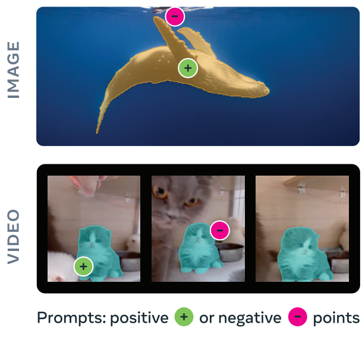


_可提示概念分割_


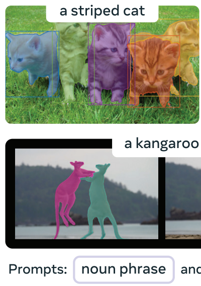


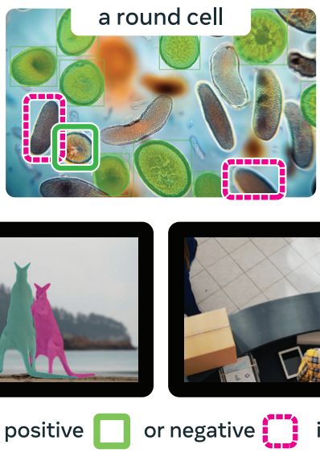


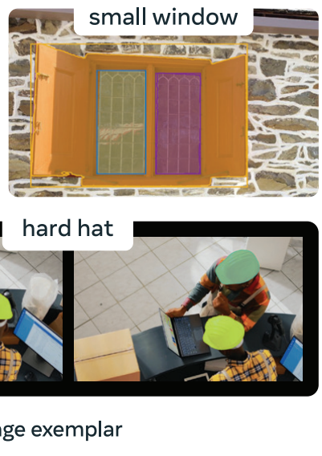


_图 1 SAM 3 在基于点击的可提示视觉分割方面改进了 SAM 2（左图），并引入了新的可提示概念分割能力（右图）。用户可以分割由简短名词短语、图像示例（正样本或负样本）或两者组合指定的视觉概念的所有实例。_

---

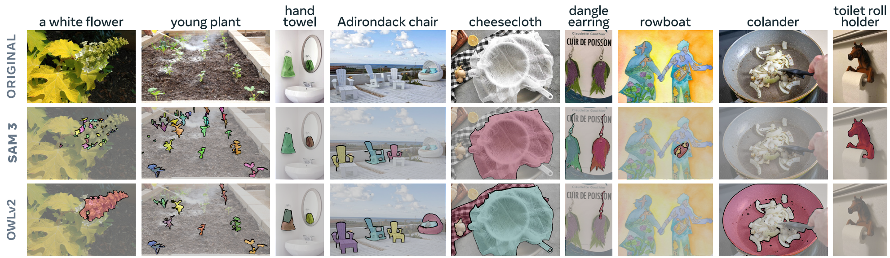


_图 2：在 SA-Co 基准测试上，SAM 3 相比 OWLv2 (Minderer et al., 2024) 改进了开放词汇概念分割的示例。更多 SAM 3 的输出请参见 §F.6.1。_


为了填补这一空白，我们提出了 SAM 3，该模型在图像和视频的可提示分割方面实现了质的飞跃，相比 SAM 2 提高了 PVS（提示视频分割）性能，并为可提示概念分割（PCS）树立了新的标杆。我们将 PCS 任务（§2）形式化为：以文本和/或图像样本作为输入，预测每个匹配该概念的对象的实例和语义掩码，同时在视频帧之间保持对象身份（见图 1）。为了专注于识别原子视觉概念，我们将文本限制为简单的名词短语，例如“红苹果”或“条纹猫”。虽然 SAM 3 并非专为长指代表达式或需要推理的查询而设计，但我们表明它可以轻松地与多模态大语言模型（MLLM）结合，以处理更复杂的语言提示。与之前的 SAM 版本一致，SAM 3 是完全交互式的，允许用户通过添加细化提示来解决歧义，从而引导模型生成预期的输出。


我们的模型（§3）由一个检测器和一个跟踪器组成，它们共享一个视觉编码器 (Bolya et al., 2025)。检测器是一个基于 DETR (Carion et al., 2020) 的模型，以文本、几何和图像样本为条件。为了解决开放词汇概念检测的挑战，我们引入了一个独立的“存在头”来解耦识别和定位，这在处理具有挑战性的否定短语进行训练时特别有效。跟踪器继承了 SAM 2 的 Transformer 编码器-解码器架构，支持视频分割和交互式细化。检测和跟踪的解耦设计避免了任务冲突，因为检测器需要与身份无关，而跟踪器的主要目标是在视频中区分不同的身份。


为了解锁显著的性能提升，我们构建了一个人机与模型协同的数据引擎（§4），用于标注一个庞大且多样化的训练数据集。我们在先前的数据引擎基础上进行了三个关键方面的创新： 媒体策展：我们策展的媒体领域比过去依赖同质化网络源的方法更加多样化， 标签策展：我们利用本体论和多模态 LLM 作为“AI 标注员”来生成名词短语和困难负样本，从而显著增加了标签的多样性和难度， 标签验证：我们通过微调 MLLM 使其成为高效的“AI 验证员”，将标注吞吐量翻倍，其准确率接近人类水平。


从嘈杂的“媒体-短语-掩码”伪标签开始，我们的数据引擎使用人类和 AI 验证员检查掩码的质量和完整性，过滤掉正确标注的示例并识别出具有挑战性的错误案例。人类标注员随后专注于通过手动修正掩码来修复这些错误。这使我们能够标注出包含 400 万个独特短语和 5200 万个掩码的高质量训练数据，以及一个包含 3800 万个短语和 14 亿个掩码的合成数据集。我们还创建了“带概念的分割任何东西”（SA-Co）基准用于 PCS 评估（$\S 5$），其中包含 12 万张图像和 1.7 千个视频中的 20.7 万个独特概念及其详尽掩码，概念数量比现有基准多出 $>50\times$。


我们的实验（§6）表明，SAM 3 在可提示分割方面树立了新的最先进水平，例如在 LVIS 上达到了 48.8 的零样本掩码 AP，而当前的最佳水平为 38.5；在我们新的 SA-Co 基准测试上超越基线至少 $2 \times$（见图 2 中的示例）；并在视觉提示上改进了 SAM 2。消融实验（§A）验证了主干网络的选择、新颖的存在头以及添加困难负样本都能提升结果，并确立了 PCS 任务在高质量和合成数据集上的缩放定律。我们开源了 SA-Co 基准测试，并发布了 SAM 3 的检查点和推理代码。在 H200 GPU 上，SAM 3 处理包含 $100+$ 个检测对象的单张图像仅需 30 毫秒。在视频中，推理延迟随对象数量变化，对于约 5 个并发对象可维持接近实时的性能。我们在 §7 中回顾了相关工作；接下来，我们将深入探讨该任务。

---

---

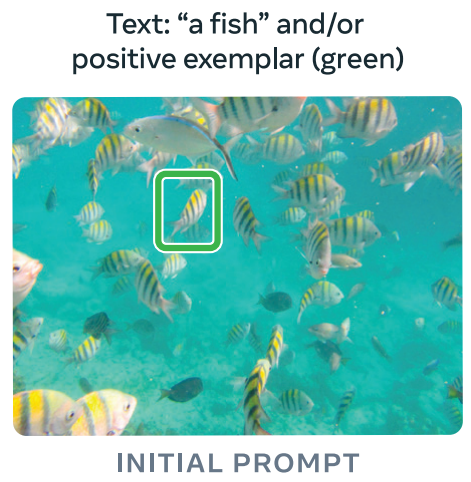


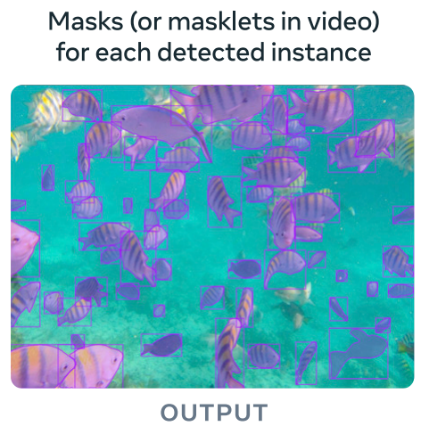


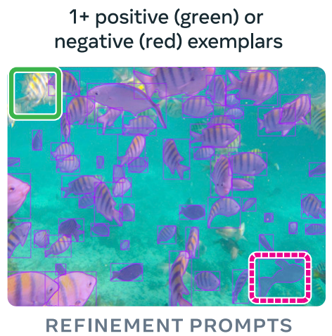


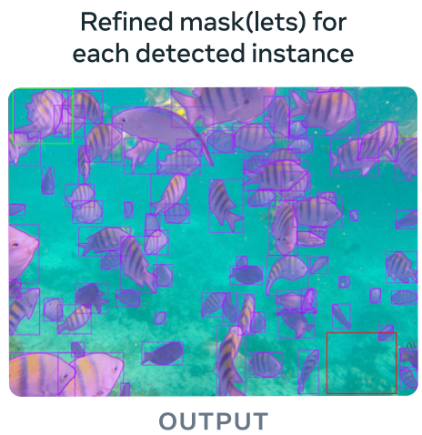


_图 3：PCS 任务中支持的初始提示和可选交互式细化提示的示意图。_


# 2 可提示概念分割 (PCS)

我们将可提示概念分割任务定义如下：给定一张图像或短视频（$\leq 30$ 秒），检测、分割并跟踪由短文本短语、图像样本或两者结合指定的视觉概念的所有实例。我们将概念限制为由名词和可选修饰语组成的简单名词短语定义的概念。名词短语提示（如果提供）对于图像/视频的所有帧是全局的，而图像样本可以作为正样本或负样本边界框在单个帧上提供，以迭代地细化目标掩码（见图 3）。

所有提示在其类别定义上必须保持一致，否则模型的行为是未定义的；例如，不能仅用鱼尾的后续样本提示来细化“鱼”，而应更新文本提示。当模型最初遗漏某些实例，或者该概念罕见时，样本提示特别有用。

我们的词汇表包括任何可在视觉场景中定位的简单名词短语，这使得该任务本质上是模棱两可的。由于多义性（“鼠标”设备 vs 动物）、主观描述符（“舒适”、“大”）、模糊或依赖上下文的短语（甚至可能无法定位，如“品牌标识”）、边界歧义（“镜子”是否包含边框）以及遮挡和模糊等掩盖物体范围的因素，短语可能存在多种解释。虽然类似的问题出现在大型封闭词汇语料库中（例如 LVIS (Gupta et al., 2019)），但通过精心策划词汇表并为所有感兴趣的类别设定明确的定义，这些问题得到了缓解。我们通过收集三位专家的测试注释、调整评估协议以允许多种有效的解释（$\S$E.3）、设计数据管道/指南以最大程度减少注释中的歧义以及模型中的歧义模块（$\S$C.2）来解决歧义问题。


# 3 模型

SAM 3 是 SAM 2 的泛化版本，支持新的 PCS 任务（§2）以及 PVS 任务。它接收概念提示（简单名词短语、图像样本）或视觉提示（点、框、掩码）来定义要在时空上（单独）分割的对象。可以在单个帧上迭代添加图像样本和视觉提示以细化目标掩码——可以使用图像样本分别删除或添加误报和漏报对象，并且可以按照 SAM 2 的风格使用 PVS 细化单个掩码。我们的架构广泛基于 SAM 和 (M)DETR (Carion et al., 2020; Kamath et al., 2021) 系列。图 4 展示了 SAM 3 的架构，它由一个双编码器-解码器 Transformer 组成——一个用于图像级功能的检测器——该检测器与跟踪器和视频内存结合使用。检测器和跟踪器从对齐的感知编码器 (PE) 主干网络 (Bolya et al., 2025) 获取视觉-语言输入。我们在下面进行概述，详情请参阅 §C。

检测器架构。检测器的架构遵循通用的 DETR 范式。图像和文本提示首先由 PE 编码，如果存在图像样本，则由样本编码器编码。我们将图像样本标记和文本标记统称为“提示标记”。融合编码器然后接收来自图像编码器的无条件嵌入，并通过交叉关注提示标记来对其进行条件化。融合之后是一个类似 DETR 的解码器，其中学习的对象查询交叉关注来自融合编码器的条件化图像嵌入。

---

---

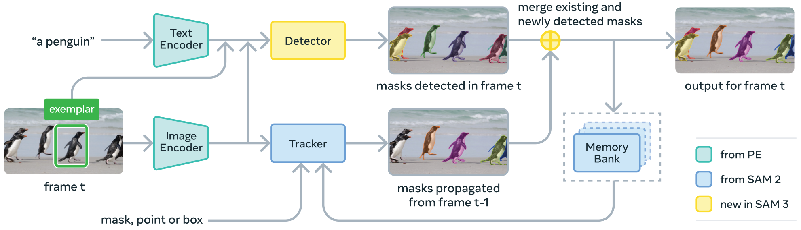


_图 4 SAM 3 架构概览。更详细的图表参见图 10。_


每个解码器层都会为每个对象查询（query）预测一个分类 logit（在我们的例子中，是一个表示对象是否对应于提示的二值标签），以及一个相对于上一级预测的边界框的增量，遵循 Zhu 等人（2020）的方法。我们使用框区域位置偏置（box-region positional bias，Lin et al., 2023）来帮助将注意力集中在每个对象上，但与最近的 DETR 模型不同，我们坚持使用标准的注意力机制。在训练期间，我们采用了来自 DAC-DETR（Hu et al., 2023）的双重监督，以及 Align 损失（Cai et al., 2024）。Mask head 改编自 MaskFormer（Cheng et al., 2021）。此外，我们还有一个语义分割 head，它预测图像中每个像素的二值标签，指示其是否对应于提示。详细信息请参见 §C。


存在性 Token。对于每个提议查询来说，既要识别（是什么）又要定位（在哪里）图像/帧中的对象可能很困难。对于识别组件，来自整个图像的上下文线索很重要。然而，强迫提议查询去理解全局上下文可能会产生反效果，因为这与定位目标本质上具有的局部性相冲突。我们通过引入一个可学习的全局存在性 token 来解耦识别和定位步骤。这个 token 仅负责预测以名词短语（NP）形式表示的目标概念是否存在于图像/帧中，即 $ p(\mathrm{NP}$ 存在于输入中)。每个提议查询 $ q_{i} $ 只需要解决定位问题 $ p(q_{i}\text{是匹配的}|\mathrm{NP}$ 存在于输入中)。每个提议查询的最终得分是其自身得分与存在性得分的乘积。


图像示例与交互性。SAM 3 支持图像示例，以一对的形式给出——一个边界框和一个关联的二值标签（正样本或负样本——可以单独使用，也可以用来补充文本提示。然后，模型会检测所有与提示匹配的实例。例如，给定一个狗的正样本边界框，模型将检测图像中所有的狗。这与 SAM 1 和 2 中的 PVS 任务不同，后者的视觉提示仅产生单个对象实例。每个图像示例由示例编码器分别编码，使用位置嵌入、标签嵌入和 ROI 池化的视觉特征，然后连接起来并由一个小型 Transformer 处理。生成的提示与文本提示连接在一起，组成提示 tokens。图像示例可以根据当前检测中的错误交互式地提供，以优化输出。


跟踪器与视频架构。给定一个视频和一个提示 $ P $，我们使用检测器和一个跟踪器（见图 4）来检测和跟踪整个视频中与提示对应的对象。在每一帧上，检测器发现新对象 $ \mathcal{O}_t $，跟踪器将 masklet $\mathcal{M}_{t-1}$（时空掩码）从上一时刻 $ t-1 $ 的帧传播到当前时刻 $ t $ 的当前帧上的新位置 $\hat{\mathcal{M}}_t$。我们使用一个匹配函数将传播的 masklet $\hat{\mathcal{M}}_t$ 与当前帧 $ \mathcal{O}_t $ 中出现的新对象掩码关联起来，


$$
\hat {\mathcal {M}} _ {t} = \mathrm {p r o p a g a t e} \left(\mathcal {M} _ {t - 1}\right), \qquad \mathcal {O} _ {t} = \mathrm {d e t e c t} \left(I _ {t}, P\right), \qquad \mathcal {M} _ {t} = \mathrm {m a t c h \_ a n d \_ u p d a t e} \left(\hat {\mathcal {M}} _ {t}, \mathcal {O} _ {t}\right).
$$


使用 SAM 2 风格传播跟踪对象。为在第一帧上检测到的每个对象初始化一个 masklet。然后，在随后的每一帧上，跟踪器模块根据这些已被跟踪对象的先前位置 $\mathcal{M}_{t-1}$，通过类似于 SAM 2 中视频对象分割任务的单帧传播步骤，预测它们的新 masklet 位置 $\hat{\mathcal{M}}_t$。跟踪器与检测器共享相同的图像/帧编码器（PE backbone）。在训练检测器之后，我们冻结 PE 并像 SAM 2 那样训练跟踪器，包括一个提示编码器、掩码解码器、记忆编码器和一个编码了……的记忆库

---

---

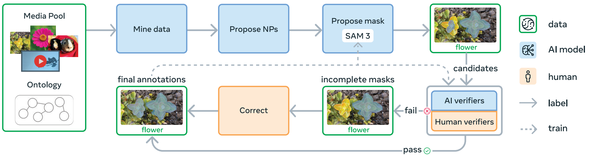


_图 5 最终 SAM 3 数据引擎概览。有关收集数据的详细信息，请参见 §E.1。_


利用来自过去帧和条件帧（首次检测到物体或用户提示的帧）的特征来处理物体的外观。记忆编码器是一个 Transformer，它在当前帧的视觉特征之间进行自注意力计算，并在视觉特征与记忆库中的空间记忆特征之间进行交叉注意力计算。我们在 §C.3 中描述了我们视频方法的细节。

在推理过程中，我们只在记忆库中保留物体确实存在的帧。掩码解码器是编码器隐藏状态和输出标记之间的双向 Transformer。为了处理歧义，我们为每个帧上的每个被跟踪物体预测三个输出掩码及其置信度，并选择置信度最高的输出作为当前帧的预测掩码。

基于检测的匹配与更新。在获得跟踪掩码 $\hat{\mathcal{M}}_t$ 后，我们通过一个简单的基于 IoU 的匹配函数（§C.3）将它们与当前帧的检测结果 $\mathcal{O}_t$ 进行匹配，并将它们添加到当前帧的 $\mathcal{M}__t$ 中。我们进一步为所有未匹配的新检测到的物体生成新的掩码片段。合并过程可能会受到歧义的影响，特别是在拥挤的场景中。我们通过下面概述的两种时序消歧策略来解决这个问题。

首先，我们使用以掩码片段检测评分（§C.3）形式存在的时序信息，来衡量掩码片段在时序窗口内与检测结果的匹配一致性（基于其在过去帧中与检测结果匹配的帧数）。如果掩码片段的检测评分低于阈值，我们将其抑制。其次，我们利用检测器的输出来解决跟踪器由于遮挡或干扰物而产生的特定失效模式。我们定期使用高置信度的检测掩码 $\mathcal{O}_t$ 重新提示跟踪器，替换跟踪器自身的预测 $\hat{\mathcal{M}}_t$。这确保了记忆库拥有近期且可靠的参考信息（除了跟踪器自身的预测之外）。

使用视觉提示进行实例细化。在获得初始掩码（或掩码片段）集后，SAM 3 允许使用正向和负向点击来细化单个掩码（或掩码片段）。具体而言，给定用户点击，我们应用提示编码器对其进行编码，并将编码后的提示输入掩码解码器以预测调整后的掩码。在视频中，掩码随后会传播到整个视频以获得细化的掩码片段。

**训练阶段。** 我们分四个阶段训练 SAM 3，逐步增加数据和功能：1) 感知编码器 (PE) 预训练，2) 检测器预训练，3) 检测器微调，以及 4) 冻结骨干网络的跟踪器训练。详情请参见 §C.4.1。

# 4 数据引擎

利用 SAM 3 在 PCS（每秒分割成本/概念分割）上实现质的飞跃，需要在现有数据集之外，在包含大量、多样化的概念和视觉域的数据集上进行训练（见图 12）。我们构建了一个高效的数据引擎，通过 SAM 3、人类标注员和 AI 标注员之间的反馈循环迭代生成标注数据，主动挖掘当前版本的 SAM 3 无法生成高质量训练数据的媒体-短语对，以进一步改进模型。通过将某些任务委托给 AI 标注员——匹配或超越人类准确率的模型——与仅由人工标注的流水线相比，我们的吞吐量提高了一倍多。我们分四个阶段开发该数据引擎，每个阶段都增加了 AI 模型的使用，以引导人类精力处理最具挑战性的失效案例，同时扩大视觉域的覆盖范围。第 1-3 阶段仅关注图像，第 4 阶段扩展到视频。我们在此描述关键步骤；详细信息和指标见 §D。

---

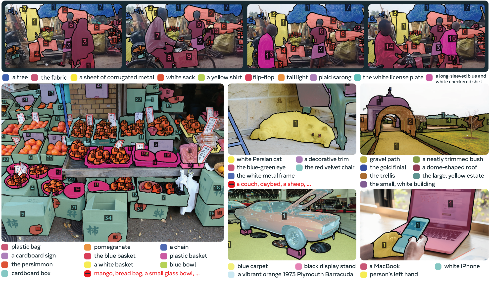


_图 6 来自 SA-Co 的示例视频（顶部）和图像（底部），其中标注了短语和实例掩码/ID。_


数据引擎组件（图 5）。借助精心策划的本体，从大型资源池中挖掘媒体输入（图像或视频）。AI 模型提出描述视觉概念的名词短语，随后由另一个模型（例如 SAM 3）为每个提议的 NP 生成候选实例掩码。提议的掩码经过两步流程验证：首先，在掩码验证（MV）阶段，标注员根据掩码的质量及其与 NP 的相关性接受或拒绝掩码。其次，在穷尽性验证（EV）阶段，标注员检查输入中是否已遮蔽了该 NP 的所有实例。任何未通过穷尽性检查的媒体-NP 对都会被送入人工校正阶段，在该阶段，人员会添加、移除或编辑掩码（在基于浏览器的工具中使用 SAM 1），或者对细小、难以分离的对象使用“分组”掩码。标注过程可能会拒绝无法落地或模棱两可的短语。


第一阶段：人工验证。我们首先使用简单的字幕生成器和解析器随机采样图像和 NP 提议。初始掩码提议模型是由现成的开放词汇检测器输出提示的 SAM 2，初始验证器为人工。在此阶段，我们收集了 430 万个图像-NP 对作为初始 SA-Co/HQ 数据集。我们在此数据上训练 SAM 3，并将其作为下一阶段的掩码提议模型。


第二阶段：人工 + AI 验证。在下一阶段，我们利用第一阶段收集的 MV 和 EV 任务的人工接受/拒绝标签来微调 Llama 3.2 (Dubey et al., 2024)，以创建自动执行 MV 和 EV 任务的 AI 验证器。这些模型接收图像-短语-掩码三元组，并输出关于掩码质量或穷尽性的多选评级。这种新的自动验证流程使我们的人力能够专注于最具挑战性的情况。我们继续在新收集的数据上重新训练 SAM 3，并对其进行了 6 次更新。随着 SAM 3 和 AI 验证器的改进，更高比例的标签由自动生成，进一步加速了数据收集。引入用于 MV 和 EV 的 AI 验证器，使数据引擎的吞吐量相比人工标注员大约翻了一番。关于 AI 验证器如何提高数据引擎吞吐量的详细分析，我们请参阅 §A.4。我们进一步将 NP 提议步骤升级为基于 Llama 的流程，该流程还会提出针对 SAM 3 的对抗性困难负样本 NP。第二阶段向 SA-Co/HQ 增加了 1.22 亿个图像-NP 对。


第三阶段：扩展与领域泛化。在第三阶段，我们使用 AI 挖掘越来越具挑战性的案例，并将 SA-Co/HQ 的领域覆盖范围扩大到 15 个数据集（图 15）。领域是文本和视觉数据的独特分布。在新领域中，MV AI 验证器在零样本情况下表现良好，但 EV AI 验证器需要通过适度的人工监督来改进特定领域的性能。我们还通过从可用的图像替代文本中提取 NP，以及基于 Wikidata（17 个顶级类别，72 个子类别）从拥有 2240 万个节点的 SA-Co 本体（§D.2）中挖掘概念，将概念覆盖范围扩展到了长尾、细粒度的概念。我们迭代训练 SAM 3 共 7 次，迭代 AI 验证器 3 次，并向 SA-Co/HQ 增加了 1950 万个图像-NP 对。

---

---

**第四阶段：视频标注。** 该阶段将数据引擎扩展到了视频领域。我们使用成熟的图像 SAM 3 来收集针对性的质量标注，以捕捉视频特有的挑战。数据挖掘管道应用了场景/动作过滤器、内容平衡、排序和定向搜索。视频帧被采样（随机采样或按对象密度采样）并送入图像标注流程（来自第三阶段）。Masklets（时空掩码）由 SAM 3（现已扩展至视频）生成，并通过去重和移除平凡掩码进行后处理。由于视频标注更为困难，我们通过优先选择包含大量拥挤对象和跟踪失败的片段，将人工精力集中在可能的失败案例上。收集到的视频数据 SA-Co/VIDEO 包含 52.5K 个视频和 467K 个 masklets。详情见 §D.6。


# 5 带有概念的数据集 (SA-Co)


**训练数据。** 我们为 PCS 任务收集了三个图像数据集： SA-Co/HQ，在阶段 1-4 中由数据引擎收集的高质量图像数据； SA-Co/SYN，由成熟数据引擎（阶段 3）标注且无需人工参与的合成图像数据集； SA-Co/EXT，15 个具有实例掩码标注的外部数据集，并通过我们的本体管道丰富了困难负样本。值得注意的是，在 SA-Co/HQ 数据集中，我们标注了 520 万张图像和 400 万个独特的 NP（名词短语），使其成为最大的高质量开放词汇分割数据集。我们还标注了一个视频数据集 SA-Co/VIDEO，包含 52.5K 个视频和 2.48 万个独特的 NP，形成了 13.4 万个视频-NP 对。这些视频平均包含 84.1 帧，帧率为 6 fps。详情包括完整统计数据、与现有数据集的比较以及概念分布，见 §E.1。


**SA-Co 基准。** SA-Co 评估基准包含 20.7 万个独特短语、12.1 万张图像和视频，以及超过 300 万个带有困难负样本标签的媒体-短语对，用于测试开放词汇识别能力。它包含 4 个划分： SA-Co/Gold 包含七个领域，每个图像-NP 对由三名不同的标注员标注（用于衡量人类性能）； SA-Co/Silver 包含十个领域，每个图像-NP 对仅有一个人类标注； SA-Co/Bronze 和 SA-Co/Bio 是九个现有数据集，要么具有现有的掩码标注，要么通过使用边界框作为提示给 SAM 2 来生成掩码。SA-Co/VEval 基准包含三个领域，每个视频-NP 对有一个标注员。数据集统计见表 28，标注示例见图 6。


**评估指标。** 我们的目标是衡量模型在下游应用中的实用性。平均精度 (AP) 等检测指标不考虑校准，这意味着模型在实际使用中可能很困难。为了解决这个问题，我们只评估置信度高于 0.5 的预测，有效地引入了一个模仿下游使用并强制执行良好校准的阈值。PCS 任务可以自然地分为两个子任务：定位和分类。我们使用阳性微 $ F1 $ ($ \mathrm{pmF}_1 $) 在至少有一个真实掩码的阳性媒体-短语对上评估定位。分类使用图像级马修斯相关系数 (IL_MCC) 来衡量，其范围为 $[-1,1]$，并在图像级别评估二元预测（“对象是否存在？”），而不考虑掩码质量。我们的主要指标，分类门控 $ F1 $ ($ \mathrm{cgF}_1 $)，将这两者结合如下：$ \mathrm{cgF}_1 = 100 * \mathrm{pmF}_1 * \mathrm{IL_MCC} $。完整定义见 §E.3。


**处理歧义。** 我们在 SA-Co/Gold 上为每个 NP 收集了 3 个标注。我们通过将每个预测与所有真实值进行比较并选择最佳分数来衡量神谕准确率。见 §E.3。


# 6 实验


我们在图像和视频分割、检测和计数基准的少样本适应，以及使用 SAM 3 + MLLM 进行复杂语言查询的分割等方面评估了 SAM 3。我们还展示了部分消融实验，更多内容见 §A。参考文献、更多结果和细节见 §F。


**基于文本的图像 PCS。** 我们在外部基准和我们自己的基准上评估了实例分割、边界框检测和语义分割。SAM 3 每次接收一个 NP 作为提示，并预测实例掩码、边界框或语义掩码。作为基线，我们评估了 OWLv2、GroundingDino (gDino) 和 LLMDet 的边界框检测，并使用它们生成的边界框提示 SAM 1 来评估分割。我们还与 APE、DINO-X 以及通用的 LLM Gemini 2.5 Flash 进行了比较。表 1 显示，在零样本情况下，SAM 3 在封闭词汇的 COCO、COCO-O 和 LVIS 边界框上树立了新的最先进水平，并且在 LVIS 掩码上显著优于基线。在开放词汇的 SA-Co/Gold 上，SAM 3 的 $\mathrm{cgF}_1$ 分数是最强基线 OWLv2\* 的两倍多，达到了估计人类性能的 $74\%$。在其他 SA-Co 划分上，提升更为显著。在 ADE-847、PascalConcept-59 和 Cityscapes 上的开放词汇语义分割结果表明，SAM 3 优于强大的专家基线 APE。详情见 §F.1。

---

---

<table><tr><td rowspan="3">模型</td><td colspan="6">实例分割</td><td colspan="9">边界框检测</td><td colspan="3">语义分割</td></tr><tr><td colspan="2">LVIS</td><td colspan="4">SA-Co</td><td colspan="2">LVIS</td><td colspan="2">COCO</td><td colspan="5">SA-Co</td><td>ADE-847</td><td>PC-59</td><td>Cityscapes</td></tr><tr><td>cgF1</td><td>AP</td><td>Gold cgF1</td><td>Silver cgF1</td><td>Bronze cgF1</td><td>Bio pmF1</td><td>cgF1</td><td>AP</td><td>AP</td><td>APo</td><td>Gold cgF1</td><td>Silver cgF1</td><td>Bronze cgF1</td><td>Bio pmF1</td><td>mIoU</td><td>mIoU</td><td>mIoU</td><td></td></tr><tr><td>人类</td><td>-</td><td>-</td><td>72.8</td><td>-</td><td>-</td><td>-</td><td>-</td><td>-</td><td>-</td><td>-</td><td>74.0</td><td>-</td><td>-</td><td>-</td><td>-</td><td>-</td><td>-</td><td>-</td></tr><tr><td>OWLv2</td><td>20.1</td><td>-</td><td>17.3</td><td>7.6</td><td>3.9</td><td>0.64</td><td>19.9</td><td>35.2</td><td>38.2</td><td>42.4</td><td>16.9</td><td>7.1</td><td>4.1</td><td>0.95</td><td>-</td><td>-</td><td>-</td><td>-</td></tr><tr><td>OWLv2*</td><td>29.3</td><td>43.4</td><td>24.6</td><td>11.5</td><td>11.7</td><td>0.04</td><td>30.2</td><td>45.5</td><td>46.1</td><td>23.9</td><td>24.5</td><td>11.0</td><td>12.0</td><td>0.08</td><td>-</td><td>-</td><td>-</td><td>-</td></tr><tr><td>gDino-T</td><td>14.7</td><td>-</td><td>3.3</td><td>2.7</td><td>7.0</td><td>0.34</td><td>15.1</td><td>20.5</td><td>45.7</td><td>35.3</td><td>3.4</td><td>2.5</td><td>7.6</td><td>0.35</td><td>-</td><td>-</td><td>-</td><td>-</td></tr><tr><td>LLMDet-L</td><td>35.1</td><td>36.3</td><td>6.5</td><td>7.1</td><td>12.5</td><td>0.15</td><td>39.3</td><td>42.0</td><td>55.6</td><td>49.8</td><td>6.8</td><td>6.7</td><td>14.0</td><td>0.17</td><td>-</td><td>-</td><td>-</td><td>-</td></tr><tr><td>APE-D*</td><td>-</td><td>53.0†</td><td>16.4</td><td>7.3</td><td>12.4</td><td>0.00</td><td>-</td><td>59.6†</td><td>58.3†</td><td>-</td><td>17.3</td><td>7.7</td><td>14.3</td><td>0.00</td><td>9.2†</td><td>58.5†</td><td>44.2†</td><td></td></tr><tr><td>DINO-X</td><td>-</td><td>38.5†</td><td>21.3δ</td><td>-</td><td>-</td><td>-</td><td>-</td><td>52.4†</td><td>56.0†</td><td>-</td><td>22.5δ</td><td>-</td><td>-</td><td>-</td><td>-</td><td>-</td><td>-</td><td>-</td></tr><tr><td>Gemini 2.5</td><td>13.4</td><td>-</td><td>13.0</td><td>8.3</td><td>7.3</td><td>10.7</td><td>16.1</td><td>-</td><td>-</td><td>-</td><td>14.4</td><td>9.4</td><td>8.2</td><td>12.4</td><td>-</td><td>-</td><td>-</td><td>-</td></tr><tr><td>SAM 3</td><td>37.2</td><td>48.5</td><td>54.1</td><td>49.6</td><td>42.6</td><td>55.4</td><td>40.6</td><td>53.6</td><td>56.4</td><td>55.7</td><td>55.7</td><td>50.0</td><td>47.1</td><td>56.3</td><td>13.8</td><td>60.8</td><td>65.2</td><td></td></tr></table>


_表 1：基于文本的图像概念分割评估。 $\mathrm{AP_o}$ 对应 COCO-O 准确率，$\star$：在 LVIS 上部分训练，†：来自原始论文，$\delta$：来自 DINO-X API。灰色数字表示使用了相应的闭集训练数据（LVIS/COCO）。更多基线和结果详见 §F.1，人类表现详见 §E.4。_


<table><tr><td rowspan="2">模型</td><td colspan="2">ODinW13</td><td colspan="2">RF-100VL</td></tr><tr><td>AP0</td><td>AP10</td><td>AP0</td><td>AP10</td></tr><tr><td>Gemini2.5-Pro</td><td>33.7</td><td>-</td><td>11.6</td><td>9.8</td></tr><tr><td>gDino-T</td><td>49.7</td><td>-</td><td>15.7</td><td>33.7</td></tr><tr><td>gDino1.5-Pro</td><td>58.7</td><td>67.9</td><td>-</td><td>-</td></tr><tr><td>SAM 3</td><td>61.0</td><td>71.8</td><td>15.2</td><td>36.5</td></tr></table>


_表 2：野外数据集上的零样本和 10 样本迁移。_


<table><tr><td rowspan="2">模型</td><td colspan="4">COCO</td><td colspan="4">LVIS</td><td colspan="4">ODinW13</td></tr><tr><td>AP T</td><td>AP+ T</td><td>AP+ I</td><td>AP+ T+I</td><td>AP T</td><td>AP+ T</td><td>AP+ I</td><td>AP+ T+I</td><td>AP T</td><td>AP+ T</td><td>AP+ I</td><td>AP+ T+I</td></tr><tr><td>T-Rex2</td><td>52.2</td><td>-</td><td>58.5</td><td>-</td><td>45.8</td><td>-</td><td>65.8</td><td>-</td><td>50.3</td><td>-</td><td>61.8</td><td>-</td></tr><tr><td>SAM 3</td><td>56.4</td><td>58.8</td><td>76.8</td><td>78.1</td><td>52.4</td><td>54.7</td><td>76.0</td><td>78.4</td><td>61.1</td><td>63.1</td><td>82.2</td><td>81.8</td></tr></table>


_表 3：在 COCO、LVIS 和 ODinW13 上使用 1 个示例进行提示。针对不同提示类型的评估：T（仅文本）、I（仅图像）和 $\mathrm{T} + \mathrm{I}$（文本和图像结合）。 $\mathrm{AP^{+}}$ 仅在正样本上进行评估。_


少样本适应。我们在 ODinW13 和 RF100-VL 上评估了 SAM 3 的零样本和少样本迁移性能，使用其原始标签作为提示。我们未进行任何提示微调。我们在不使用掩码损失的情况下对 SAM 3 进行微调，并在表 2 中报告了平均边界框 mAP。SAM 3 实现了最先进的 10 样本性能，超越了 Gemini 的上下文提示和目标检测专家；更多细节详见 §F.3。RF-100VL 包含超出 SAM 3 当前范围的专业提示领域，但 SAM 3 通过微调比基线更有效地适应了这些领域。


使用 1 个示例的 PCS。我们首先使用从真值中随机采样的单个输入框来评估图像示例。这只能在“正”数据上进行，即每个提示的对象都出现在图像中。我们在表 3 中报告了三种设置下的相应 $\mathrm{AP}^{+}$：文本提示（T）、示例图像（I）以及文本和图像 $(\mathrm{T} + \mathrm{I})$；SAM 3 在 COCO (+18.3)、LVIS (+10.3) 和 ODinW (+20.5) 上以显著优势超越了先前的最先进模型 T-Rex2。更多细节和 SA-Co/Gold 上的结果详见 §F.2。


使用 K 个示例的 PCS。接下来，我们在交互式设置中评估 SAM 3，模拟与人类标注员的协作。从文本提示开始，我们每次迭代添加一个示例提示：漏检的真值是候选正提示，误检是候选负提示。结果（图 7）与完美的 PVS 基线进行比较，其中我们模拟用户使用理想的边界框到掩码修正来手动修复错误。SAM 3 的 PCS 改善


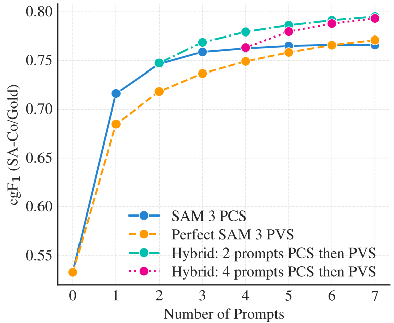


_图 7：与理想 PVS 基线相比，SAM 3 的 $\mathrm{cgF}_1$ 与交互式边界框提示数量的关系，取 SA-Co/Gold 短语的平均值。_


$\mathrm{cgF}_1$ 的速度更快，因为它能从示例中泛化（例如，检测或抑制相似对象），而 PVS 仅修正单个实例。经过 3 次点击后，交互式 PCS 的表现优于仅文本提示 $+21.6 \mathrm{cgF}_1$ 分，优于 PVS 修正 $+2.0$ 分。在 4 次点击后性能趋于平稳，因为示例无法修复低质量的掩码。此时模拟切换到 PVS 的混合模式会带来收益，显示了互补性。

---

---

**目标计数**。我们在目标计数基准 CountBench 和 PixMo-Count 上进行了评估，以与多个多模态大语言模型（MLLM）进行比较，使用了先前技术报告和我们自己评估中的准确率 $(\%)$ 和平均绝对误差（MAE）。结果见表 4，更多评估细节见 §F.4。与 MLLMs 相比，SAM 3 不仅实现了良好的目标计数准确率，还提供了大多数 MLLMs 无法提供的目标分割。

<table><tr><td rowspan="2">模型</td><td colspan="2">CountBench</td><td colspan="2">PixMo-Count</td></tr><tr><td>MAE ↓</td><td>Acc ↑</td><td>MAE ↓</td><td>Acc ↑</td></tr><tr><td>DINO-X</td><td>0.62</td><td>82.9</td><td>0.21</td><td>85.0</td></tr><tr><td>Qwen2-VL-72B</td><td>0.28</td><td>86.7</td><td>0.61</td><td>63.7</td></tr><tr><td>Molmo-72B</td><td>0.27</td><td>92.4</td><td>0.17</td><td>88.8</td></tr><tr><td>Gemini 2.5 Pro</td><td>0.24</td><td>92.4</td><td>0.38</td><td>78.2</td></tr><tr><td>SAM 3</td><td>0.12</td><td>93.8</td><td>0.21</td><td>86.2</td></tr></table>

_表 4：计数基准上的准确率。灰色表示使用了训练集。_

**基于文本的视频 PCS**。我们在 SA-Co/VEval 基准和现有的公共基准上评估了使用文本提示的视频分割。对于 SA-Co/VEval，我们报告了其子集（SA-V、YT-Temporal-1B、SmartGlasses）的 $\mathrm{cgF}_1$ 和 pHOTA 指标（定义见 §F.5）。对于公共基准，我们使用其官方指标。基线包括 GLEE（一个开放词汇图像和视频分割模型）、"LLMDet + SAM 3 Tracker"（用 LLMDet 替换我们的检测器）和 "SAM 3 Detector + T-by-D"（用基于跟踪-检测范式的关联模块替换我们的跟踪器）。在表 5 中，SAM 3 在很大程度上优于这些基线，特别是在包含大量名词短语的基准上。在 SA-Co/VEval 上，它达到了超过人类 pHOTA 的 $80\%$。更多细节见 §F.5。

<table><tr><td rowspan="3">模型</td><td colspan="6">SA-Co/VEval 基准测试集</td><td colspan="4">公共基准</td></tr><tr><td colspan="2">SA-V (2.0K NPs)</td><td colspan="2">YT-Temporal-1B (1.7K NPs)</td><td colspan="2">SmartGlasses (2.4K NPs)</td><td rowspan="2">LVVIS (1.2K NPs) test mAP</td><td rowspan="2">BURST (482 NPs) test HOTA</td><td rowspan="2">YTVIS21 (40 NPs) val mAP</td><td rowspan="2">OVIS (25 NPs) val mAP</td></tr><tr><td>$cgF_1$</td><td>pHOTA</td><td>$cgF_1$</td><td>pHOTA</td><td>$cgF_1$</td><td>pHOTA</td></tr><tr><td>Human</td><td>53.1</td><td>70.5</td><td>71.2</td><td>78.4</td><td>58.5</td><td>72.3</td><td>-</td><td>-</td><td>-</td><td>-</td></tr><tr><td>$\text{GLEE}^\dagger$ (all NPs at once)</td><td>0.1</td><td>8.7</td><td>1.6</td><td>16.7</td><td>0.0</td><td>4.7</td><td>20.8</td><td>28.4</td><td>62.2</td><td>38.7</td></tr><tr><td>$\text{GLEE}^\dagger$ (one NP at a time)</td><td>0.1</td><td>11.8</td><td>2.2</td><td>18.9</td><td>0.1</td><td>5.6</td><td>9.3</td><td>20.2</td><td>56.5</td><td>32.4</td></tr><tr><td>$\text{LLMDet}^\dagger + \text{SAM 3 Tracker}$</td><td>2.3</td><td>30.1</td><td>8.0</td><td>37.9</td><td>0.3</td><td>18.6</td><td>15.2</td><td>33.3</td><td>31.3</td><td>20.4</td></tr><tr><td>SAM 3 Detector + T-by-D</td><td>25.7</td><td>55.7</td><td>47.6</td><td>68.2</td><td>29.7</td><td>60.0</td><td>35.9</td><td>39.7</td><td>56.5</td><td>55.1</td></tr><tr><td>SAM 3</td><td>30.3</td><td>58.0</td><td>50.8</td><td>69.9</td><td>36.4</td><td>63.6</td><td>36.3</td><td>44.5</td><td>57.4</td><td>60.5</td></tr></table>

_表 5：SA-Co/VEval 和公共基准上基于文本提示的视频 PCS（开放词汇视频实例分割）（更多结果和分析见表 39）。SAM 3 表现出强劲的性能，特别是在包含大量 NP 的基准上。†：GLEE 和 LLMDet 在 SA-Co/VEval 上的零样本表现不佳。_

**PVS**。我们在一系列视觉提示任务上评估了 SAM 3，包括视频目标分割（VOS）和交互式图像分割。表 6 将 SAM 3 与 VOS 任务上最近的先进方法进行了比较。SAM 3 在大多数基准上实现了比 SAM 2 显著的改进，特别是在具有挑战性的 MOSEv2 数据集上，SAM 3 以 6.5 分的优势超越了先前的工作。对于交互式图像分割任务，我们在 Ravi et al. (2024) 引入的 37 个数据集基准上评估了 SAM 3。如表 7 所示，SAM 3 在平均 mIoU 上优于 SAM 2。交互式视频分割的更多内容请参见 §F.6 和图 21。

<table><tr><td rowspan="2">模型</td><td colspan="5">J&amp;F</td><td>G</td><td>J&amp;F</td></tr><tr><td>MOSEv1 val</td><td>DAVIS17 val</td><td>LVOSv2 val</td><td>SA-V val</td><td>SA-V test</td><td>YTVOS19 val</td><td>MOSEv2 val</td></tr><tr><td>SAMURAI</td><td>72.6</td><td>89.9</td><td>84.2</td><td>79.8</td><td>80.0</td><td>88.3</td><td>51.1</td></tr><tr><td>SAM2Long</td><td>75.2</td><td>91.4</td><td>85.9</td><td>81.1</td><td>81.2</td><td>88.7</td><td>51.5</td></tr><tr><td>SeC</td><td>75.3</td><td>91.3</td><td>86.5</td><td>82.7</td><td>81.7</td><td>88.6</td><td>53.8</td></tr><tr><td>SAM 2.1 L</td><td>77.9</td><td>90.7</td><td>79.6</td><td>77.9</td><td>78.4</td><td>89.3</td><td>$47.9^{\dagger}$</td></tr><tr><td>SAM 3</td><td>78.4</td><td>92.2</td><td>88.5</td><td>83.5</td><td>84.4</td><td>89.7</td><td>60.3</td></tr></table>

_表 6：SAM 3 在 VOS 上相比 SAM 2 的改进。†：零样本。_

<table><tr><td rowspan="2">模型</td><td colspan="3">平均 mIoU</td><td rowspan="2">FPS</td></tr><tr><td>1-click</td><td>3-clicks</td><td>5-clicks</td></tr><tr><td>SAM 1 H</td><td>58.5</td><td>77.0</td><td>82.1</td><td>41.0</td></tr><tr><td>SAM 2.1 L</td><td>66.4</td><td>80.3</td><td>84.3</td><td>93.0</td></tr><tr><td>SAM 3</td><td>66.1</td><td>81.3</td><td>85.1</td><td>43.5</td></tr></table>

_表 7：SA-37 基准上的交互式图像分割。_

**SAM 3 Agent**。我们实验了一个使用 SAM 3 作为工具来分割更复杂文本查询的 MLLM（见图 25）。该 MLLM 提出名词短语查询来提示 SAM 3 并分析返回的掩码，直到掩码满意为止进行迭代。表 8 显示，这个在 ReasonSeg 和 OmniLabel 上零样本评估的 "SAM 3 Agent" 超越了先前的工作，且未在任何指代表达分割或推理分割数据上进行训练。SAM 3 Agent 还在 RefCOCO+ 和 RefCOCOg 上超越了先前的零样本结果。SAM 3 可以与各种 MLLM 结合，并且对所有这些 MLLM 使用相同的系统提示集，展示了 SAM 3 的鲁棒性。更多细节见 §G。

---

---

<table><tr><td rowspan="3">模型</td><td rowspan="3">MLLM</td><td colspan="4">ReasonSeg (gIoU)</td><td colspan="4">Omnilabel (AP)</td></tr><tr><td>验证集</td><td colspan="3">测试集</td><td colspan="4">验证集 2023</td></tr><tr><td>全部</td><td>全部</td><td>短文本</td><td>长文本</td><td>描述</td><td>描述-S</td><td>描述-M</td><td>描述-L</td></tr><tr><td>X-SAM</td><td>Phi-3-3.8B</td><td>56.6</td><td>57.8</td><td>47.7</td><td>56.0</td><td>12.0*</td><td>17.1*</td><td>11.4*</td><td>8.8*</td></tr><tr><td>SegZero</td><td>Qwen2.5-VL 7B</td><td>62.6</td><td>57.5</td><td>-</td><td>-</td><td>13.5*</td><td>20.7*</td><td>12.4*</td><td>9.1*</td></tr><tr><td>RSVP</td><td>GPT-4o</td><td>64.7</td><td>55.4</td><td>61.9</td><td>60.3</td><td>-</td><td>-</td><td>-</td><td>-</td></tr><tr><td colspan="2">Overall state-of-the-art†</td><td>65.0</td><td>61.3</td><td>55.4</td><td>63.2</td><td>36.5</td><td>54.4</td><td>33.2</td><td>25.5</td></tr><tr><td>SAM 3 Agent</td><td>Qwen2.5-VL 7B</td><td>62.2</td><td>63.0</td><td>59.4</td><td>64.1</td><td>36.7</td><td>52.6</td><td>34.3</td><td>26.6</td></tr><tr><td>SAM 3 Agent</td><td>Llama4 Maverick</td><td>68.5</td><td>67.1</td><td>66.8</td><td>67.2</td><td>32.8</td><td>43.7</td><td>30.9</td><td>27.5</td></tr><tr><td>SAM 3 Agent</td><td>Qwen2.5-VL 72B</td><td>74.6</td><td>70.8</td><td>70.3</td><td>71.0</td><td>42.0</td><td>56.0</td><td>40.4</td><td>33.2</td></tr><tr><td>SAM 3 Agent</td><td>Gemini 2.5 Pro</td><td>77.0</td><td>74.0</td><td>75.8</td><td>73.4</td><td>45.3</td><td>53.8</td><td>45.1</td><td>37.7</td></tr></table>


_表 8 SAM 3 Agent 的结果。灰色表示在 ReasonSeg (train) 上微调后的结果，* 表示复现的结果，下划线表示主要指标。†：ReasonSeg 对应 LISA-13B-LLaVA1.5；OmniLabel 对应 REAL。_


<table><tr><td></td><td>cgF1</td><td>IL_MCC</td><td>pmF1</td></tr><tr><td>×</td><td>50.7</td><td>0.77</td><td>65.4</td></tr><tr><td>✓</td><td>52.2</td><td>0.82</td><td>63.4</td></tr></table>


_(a) 存在性检测头。_


<table><tr><td>#/img</td><td>cgF1</td><td>IL_MCC</td><td>pmF1</td></tr><tr><td>0</td><td>28.3</td><td>0.44</td><td>62.4</td></tr><tr><td>5</td><td>39.4</td><td>0.62</td><td>62.9</td></tr><tr><td>15</td><td>41.8</td><td>0.67</td><td>62.4</td></tr><tr><td>30</td><td>43.0</td><td>0.68</td><td>62.8</td></tr></table>


_(b) 困难负样本。_


<table><tr><td colspan="2">EXT SYN</td><td>HQ</td><td>cgF1</td><td>IL_MCC</td><td>pmF1</td></tr><tr><td>✓</td><td>×</td><td>×</td><td>23.7</td><td>0.46</td><td>50.4</td></tr><tr><td>✓</td><td>✓</td><td>×</td><td>32.8</td><td>0.57</td><td>56.9</td></tr><tr><td>✓</td><td>×</td><td>✓</td><td>45.5</td><td>0.71</td><td>64.0</td></tr><tr><td>✓</td><td>✓</td><td>✓</td><td>47.4</td><td>0.74</td><td>63.8</td></tr></table>


_(c) 训练数据。_


<table><tr><td>模型</td><td>cgF1</td><td>IL_MCC</td><td>pmF1</td></tr><tr><td>人类</td><td>72.8</td><td>0.94</td><td>77.0</td></tr><tr><td>SAM 3</td><td>54.0</td><td>0.82</td><td>65.9</td></tr><tr><td>+ EV AI</td><td>61.2</td><td>0.86</td><td>70.8</td></tr><tr><td>+ MV AI</td><td>62.3</td><td>0.87</td><td>71.1</td></tr></table>


_(d) SAM 3 + AI 验证器。_


_表 9 在 SA-Co/Gold 上选定的模型和数据消融实验。各表之间的数值不可直接比较。_


选定的消融实验。在表 9 中，我们报告了 $\S A$ 中更广泛的消融实验的一个子集。请注意，消融模型来自与上述评估模型不同、且训练周期更短的运行过程。存在性检测头将 $\mathrm{cgF_1}$ 提升了 $+1.5$ (表 9a)，使以 IL_MCC 衡量的图像级识别能力提高了 $+0.05$。表 9b 表明，添加困难负样本显著提高了模型性能，最显著的是图像级 IL_MCC 从 0.44 提高到了 0.68。表 9c 显示，合成 (SYN) 训练数据相比外部 (EXT) 数据提高了 $+8.8\mathrm{cgF}_1$，而我们的高质量 (HQ) 标注在此基线之上又增加了 $+14.6\mathrm{cgF}_1$。我们在 $\S A.2$ 中展示了这两类数据的详细数据缩放定律，显示了它们在域内和域外测试集上的有效性。在表 9d 中，我们展示了 AI 验证器如何改进伪标签。用穷尽性验证 (EV) AI 验证器的分数替换 SAM 3 的存在性分数，将 $\mathrm{cgF_1}$ 提升了 $+7.2$。使用掩码验证 (MV) AI 验证器来剔除劣质掩码又增加了 1.1 个点。总体而言，AI 验证器填补了 SAM 3 与人类性能之间差距的一半。


域适应消融实验。利用由 SAM 3 + AI 验证器生成的特定域合成数据，我们表明无需任何人工标注即可显著提升新域上的性能。我们在训练 SAM 3 和 AI 验证器时保留了 SA-Co 域中的一个——“Food&drink”（食品与饮料）。随后，我们针对这个新的“Food&drink”域使用了三种变体的训练数据：如 SA-Co/HQ 中的高质量 AI+人工标注（称为 SA-Co/HQ-Food），如 SA-Co/SYN 中的合成标注，使用 AI 但不涉及人工（SA-Co/SYN-Food），以及在 AI 验证步骤之前生成的伪标签，即跳过 AI 验证器和人工（PL-Food）。图 8 绘制了随着每种类型的训练数据增加，在 SA-Co/Gold 基准的“Food&drink”测试集上的性能变化。我们将特定域数据与高质量通用域数据按 1:1 的比例混合。与基线 SAM 3（零样本）相比，PL-Food 提供了一定的改进，但由于其质量较低，远低于其他


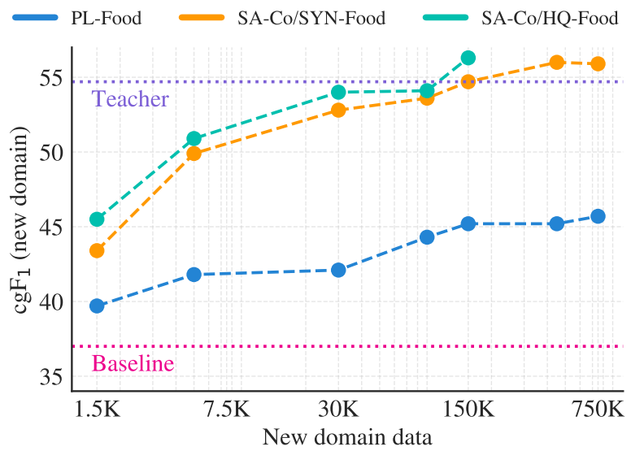


_图 8 通过合成数据进行域适应。由 SAM 3 + AI 验证器（教师系统）生成的合成 (SYN) 数据实现了与人工标注 (HQ) 数据类似的缩放行为。_


变体。HQ-Food 和 SYN-Food 表现出类似的缩放行为，SYN-Food 略低但最终追平，且无需任何人工标注成本。这指出了一种可扩展的方法来提升新数据分布上的性能。更多细节见 §A.3。

---

---

# 7 相关工作

可提示与交互式视觉分割。SAM (Kirillov et al., 2023) 引入了具有交互式细化功能的“可提示”图像分割。虽然最初的任务定义包含文本提示，但并未完全发展成熟。SAM 2 (Ravi et al., 2024) 将可提示视觉分割任务扩展到了视频领域，允许在任意帧上进行细化点的标注。SAM 3 继承了基于几何的分割方式，同时扩展纳入了文本和图像示例提示，以便在图像和视频中分割出某个概念的所有实例。

图像中的开放词汇检测与分割旨在用粗略的边界框（检测）或细粒度的像素掩码（分割）详尽地标注开放词汇对象类别的每一个实例。最近的开放词汇（OV）检测 (Gu et al., 2021; Minderer et al., 2022) 和分割 (Ding et al., 2022; Liang et al., 2023) 方法利用大规模视觉-语言编码器（如 CLIP (Radford et al., 2021)）来处理由任意文本描述的类别，甚至是那些在训练过程中从未见过的类别。虽然 DETR (Carion et al., 2020) 仅限于训练时见过的封闭类别集，但 MDETR (Kamath et al., 2021) 将该方法演进为以原始文本查询为条件。使用图像示例作为提示来指定所需对象类别（例如 DINOv (Li et al., 2023a), T-Rex2 (Jiang et al., 2024)）提供了一种实用的文本替代方案，但在像文本提示那样有效地传达对象的抽象概念方面有所欠缺。我们为 OV 分割引入了一个新的基准，其包含的独特概念比以往的工作多 $>100\times$。

视觉定位是指用边界框或掩码定位图像中指代特定区域的语言表达。(Plummer et al., 2020) 将短语检测引入为判定短语是否与图像相关并对其进行定位。GLIP (Li et al., 2022b) 和 GroundingDino (Liu et al., 2023) 将目标检测构建为短语定位，在训练期间统一了这两项任务。MQ-GLIP (Xu et al., 2023) 在文本查询的基础上增加了图像示例。顺应这种支持多任务和多模态的模型趋势，GLEE (Wu et al., 2024a) 允许使用文本短语、指代表达式和视觉提示在图像和视频中进行类别和实例定位。与 SAM 3 不同，GLEE 不支持示例或交互式细化。LISA (Lai et al., 2024) 允许进行需要推理的分割，而 OMG-LLaVa (Zhang et al., 2024a) 和 GLaMM (Rasheed et al., 2024) 则生成与相应分割掩码交织的自然语言响应，其中 GLaMM 接受文本和可选的图像提示作为输入。一些通用的 MLLM 可以输出边界框和掩码 (Gemini2.5 (Comanici et al., 2025)) 或点 (Molmo (Deitke et al., 2025))。SAM 3 可以作为“视觉工具”与 MLLM 结合使用 (§6)。

多目标跟踪与分割方法用于识别视频中的目标实例并对其进行跟踪，为每个实例关联一个唯一的 ID。在基于检测的跟踪方法中，检测是在每一帧上独立执行的，以产生边界框和置信度分数，随后使用基于运动和外观的匹配方法对边界框进行关联，如 SORT (Bewley et al., 2016; Wojke et al., 2017)、Tracktor (Bergmann et al., 2019)、ByteTrack (Zhang et al., 2022c)、SAM2MOT (Jiang et al., 2025) 或 OC-SORT (Cao et al., 2023)。另一种方法是端到端可训练的架构，联合进行检测和关联，例如 TrackFormer (Meinhardt et al., 2022)、TransTrack (Sun et al., 2020) 或 MOTR (Zeng et al., 2022)。TrackFormer 使用类似 DETR 的编码器-解码器，从静态目标查询初始化新轨迹，并使用保持身份的轨迹查询自回归地跟踪现有轨迹。联合模型的一个挑战是检测和跟踪之间的冲突 (Feichtenhofer et al., 2017; Yu et al., 2023a)，其中一个需要关注语义，而另一个需要理清身份，即使它们的空间位置随时间重叠。SAM 3 是一个强大的图像检测器，它紧密集成到跟踪器中，以在视频中分割概念。

# 8 结论

我们提出了基于概念的分割任何模型，使得在交互式分割中能够使用开放词汇的文本和图像示例作为提示。我们的主要贡献包括： 引入了 PCS 任务和 SA-Co 基准； 一种解耦了识别、定位和跟踪的架构，在保留视觉分割能力的同时扩展了 SAM 2 以解决概念分割问题； 一个高质量、高效的数据引擎，利用了人类和 AI 标注员的互补优势。SAM 3 取得了最先进的结果，在 SA-Co 数据集的图像和视频 PCS 任务上，性能比以前的系统提高了一倍。尽管如此，我们的模型仍有几个局限性。例如，它难以泛化到域外术语，这可以通过自动域扩展来缓解，但需要额外的训练。我们在 §B 中讨论了我们模型的这一局限性及其他局限性。我们相信 SAM 3 和 SA-Co 基准将是重要的里程碑，并为计算机视觉未来的研究和应用铺平道路。

---

# 9 致谢

我们要感谢以下人员对 SAM 3 项目的贡献：Alex He, Alexander Kirillov, Alyssa Newcomb, Ana Paula Kirschner Mofarrej, Andrea Madotto, Andrew Westbury, Ashley Gabriel, Azita Shokpour, Ben Samples, Bernie Huang, Carleigh Wood, Ching-Feng Yeh, Christian Puhrsch, Claudette Ward, Daniel Bolya, Daniel Li, Facundo Figueroa, Fazila Vhora, George Orlin, Hanzi Mao, Helen Klein, Hu Xu, Ida Cheng, Jake Kinney, Jiale Zhi, Jo Sampaio, Joel Schlosser, Justin Johnson, Kai Brown, Karen Bergan, Karla Martucci, Kenny Lehmann, Maddie Mintz, Mallika Malhotra, Matt Ward, Michelle Chan, Michelle Restrepo, Miranda Hartley, Muhammad Maaz, Nisha Deo, Peter Park, Phillip Thomas, Raghu Nayani, Rene Martinez Doehner, Robbie Adkins, Ross Girshik, Sasha Mitts, Shashank Jain, Spencer Whitehead, Ty Toledano, Valentin Gabeur, Vincent Cho, Vivian Lee, William Ngan, Xuehai He, Yael Yungster, Ziqi Pang, Ziyi Dou, Zoe Quake。我们还要感谢 IDEA 团队授予我们 DINO-X 和 T-Rex2 的访问权限，以便在 SA-Co/Gold 数据集上对其进行基准测试。


# 附录


# A 消融实验 13


A.1 模型消融实验 13


A.2 图像训练数据消融实验 14


A.3 自动域适应 16


A.4 图像数据引擎标注速度 17


A.5 视频数据引擎标注速度 18


A.6 视频训练数据消融实验 18


# B 局限性 18


# C 模型细节 19


C.1 模型架构 19


C.2 图像实现细节 19


C.3 视频实现细节 22


C.4 模型训练 23


# D 数据引擎细节 26


D.1 媒体池 26


D.2 SA-Co 本体 26


D.3 阶段 1：人工验证 26


D.4 阶段 2：人工 + AI 验证 28


D.5 阶段 3：扩展与域泛化 32


D.6 阶段 4：视频标注 32


# E SA-Co 数据集与指标细节 34


E.1 SA-Co 训练数据 34


E.2 SA-Co 评估基准 35


E.3 评估指标 37


E.4 SA-Co 上的人类表现 37


E.5 额外数据集示例 39

---

---

F 补充实验与细节 45


F.1 图像上的 NPs PCS 45


F.2 视觉示例与交互性 46


F.3 少样本微调 46


F.4 目标计数 47


F.5 视频 PCS 细节 48


F.6 PVS 细节 50


G SAM 3 智能体 55


G.1 智能体设计 55


G.2 定性分析 58


G.3 完整定量结果 60


H 模型与标注说明卡 64


H.1 数据标注说明卡 64


H.2 模型说明卡 65


# A 消融实验


# A.1 模型消融


存在性 Token。我们首先对存在性 Token 及其训练方法的影响进行了消融实验。存在性 Token 被包含在解码器中（在 §C.2 中进一步讨论），与目标查询 一起，用于预测概念存在性分数。在联合训练期间，存在性分数仅在 PCS 任务上接收梯度，并且始终使用二元交叉熵损失，根据图像中概念的存在（或不存在）进行监督。使用存在性 Token 来解耦存在性和定位带来了显著的性能提升，特别是在 IL_MCC 上，见表 9a。

当使用存在性分数时，我们发现当概念是图像级负样本时，框/掩码的目标分数最好不接收梯度，见表 10 中的设置。请注意，这与典型的 DETR 变体中的方法相反，在后者的方法中，所有单独的目标分数都会受到负监督，以反映图像中不存在该概念，见表 10 中的设置。我们发现，当与存在性分数一起使用时， 的效果不如。当概念存在于图像中时，各个目标查询始终基于匈牙利匹配 接收分类监督。设置 与我们的识别-定位解耦设计一致，其中存在性分数负责识别（图像中的存在性），而目标分数负责定位（即，在所有提议中将最佳匹配与正样本真值 排在最高位）。

在推理过程中，我们将全局存在性分数与目标分数的乘积作为总目标分数。在设置 中，我们探索了直接监督总目标分数（而不是典型的目标分数）为正或负（由匹配决定）；这种设置可以略微提高整体的 $\mathrm{cgF}_1$，但灵活性较低，因为存在性分数和目标分数是联合校准的，例如，这种模型不太适合以已知存在于图像中的概念为条件。最后，表 10 中的设置 调查了在监督总分数时将存在性分数从计算图中分离，但这并没有比 带来改进。

使用存在性进行训练可以被视为一种后训练形式，发生在我们训练流程的第 3 阶段（见 §C.4.1）。默认情况下，除非另有说明，消融实验不经过此阶段。

视觉和文本编码器。虽然 SAM 2 使用 MAE (He et al., 2022) 预训练的 Hiera (Ryali et al., 2023) 视觉编码器，以其强大的定位能力和处理更具几何特性的 PVS 任务的效率，但 SAM 3 还需要强大的语义和语言理解能力以及广泛的覆盖面。我们为 SAM 3 的视觉和文本编码器调整了 PE (Bolya et al., 2025)，以便在训练的第 1 阶段能看到大量且多样化的概念集，同时产生对齐的图像和文本编码器。在表 11 中，我们比较了以下情况的性能：

---

---

<table><tr><td rowspan="2"></td><td rowspan="2">仅当概念存在时监督掩码分数</td><td rowspan="2">监督总分数</td><td rowspan="2">监督总分数，分离存在性</td><td colspan="3">SA-Co/Gold</td></tr><tr><td>cgF1</td><td>IL_MCC</td><td>pmF1</td></tr><tr><td>a.</td><td>✓</td><td>×</td><td>×</td><td>54.0</td><td>0.82</td><td>65.5</td></tr><tr><td>b.</td><td>×</td><td>×</td><td>×</td><td>52.2</td><td>0.81</td><td>64.2</td></tr><tr><td>c.</td><td>✓</td><td>✓</td><td>×</td><td>54.9</td><td>0.83</td><td>66.0</td></tr><tr><td>d.</td><td>✓</td><td>×</td><td>✓</td><td>53.6</td><td>0.83</td><td>64.9</td></tr></table>


_表 10 带有存在性标记的模型对物体/掩码分数的监督策略。我们发现最佳的监督策略是仅对正样本概念监督掩码分数，并分别监督存在性分数和掩码分数，尽管在推理过程中它们的乘积被用作总物体分数。_


Hiera 和 DINOv2 (Oquab et al., 2024)；由于这些视觉编码器缺乏对齐的文本编码器，我们使用 DistilRoBERTa-base (Sanh et al., 2019)。我们发现 PE 是整体最佳的视觉主干选择，并且使用其自带的已对齐文本编码器比使用未对齐文本基线的 PE 能带来进一步的提升。使用 PE 使得 SAM 3 具有强大的鲁棒性（此处通过 COCO-O 上的 AP 来衡量，展示了在各种域偏移下的良好物体检测能力，例如“素描”、“卡通”、“绘画”等）。


<table><tr><td>编码器（补丁大小）</td><td>SA-Co/Gold (cgF1)</td><td>COCO-O (AP)</td></tr><tr><td>PE-L+ (14)</td><td>43.2</td><td>42.5</td></tr><tr><td>PE-L+ (14) w/ DistilRoBERTa</td><td>38.1</td><td>39.6</td></tr><tr><td>DINOv2-L (14)</td><td>35.3</td><td>31.9</td></tr><tr><td>Hiera-L (16)</td><td>32.8</td><td>22.0</td></tr></table>


_表 11 编码器的选择。由于 SAM 3 既需要语义视觉理解也需要语言理解，我们发现 PE 的对齐图像和文本编码器效果良好。_


实现细节。对于 PE、DINOv2 和 Hiera，图像分辨率分别设置为 1008 px、1008 px 和 1152 px，以确保由于补丁大小的差异，检测器中的标记数量相同。所有视觉编码器仅在一部分层中使用全局注意力，否则使用窗口化（$24 \times 24$ 个标记）注意力。由于 Hiera 是一个分层多尺度编码器，我们在编码器的第 3 阶段（拥有大部分 FLOPs）将窗口大小设置为 $24 \times 24$。由于 PE 能够通过 RoPE (Su et al., 2021; Heo et al., 2024) 使用相对位置信息，我们遵循 Bolya et al. (2024) 的方法，在 Hiera 和 DINOv2 的全局层中包含相对位置嵌入。所有模型均使用 SA-Co/HQ 进行训练，在整个训练过程中查看了 500 万个样本。针对每种编码器选择分别优化了训练方案。来自各个视觉编码器的标记在被传递到融合编码器和检测器之前，会通过 $2 \times 2$ 下采样至 1296 个标记。


# A.2 图像训练数据消融实验


设置。在本节的消融实验中，我们采用了一种简化、更轻量的模型和训练策略。具体而言，我们使用 (i) SAM 3 的步长为 28（而非 14）的变体，在检测器中使用的标记数减少 $4 \times$，(ii) 限制使用整个 SA-Co/SYN 数据集的 $45\%$，并采用 (iii) 更短的训练计划，且不运行“存在性后训练”（见 §A），(iv) 评估在 SA-Co/Gold 的内部版本上进行，该版本的人类表现略低于公开版本（$\mathrm{cgF}_1$：内部 70.8 vs 公开 72.8）。这使得能够更高效地运行消融实验（但与 SAM 3 相比，绝对准确率较低）。我们在大规模训练时观察到了类似的趋势。


SAM 3 训练数据。表 9c 分析了各种 SA-Co 训练数据子集的影响。即使仅使用 SA-Co/EXT 进行训练，也能在 SA-Co/Gold 上展现出与最佳外部模型相当的性能（见表 1 中 OWLv2 和 DINO-X 的性能），表明这是一个强大的基础模型。在训练混合数据中加入合成数据 SA-Co/SYN 可显著提高性能。在加入高质量的 SA-Co/HQ 数据后，由于数据质量及其与 SA-Co/Gold 的分布相似性，性能进一步提升。尽管 SA-Co/HQ 是大规模的且与 SA-Co/Gold 属于同一领域，但在 SA-Co/HQ 之上加入 SA-Co/SYN 仍能在 SA-Co/Gold 上带来进一步增益。


SA-Co/HQ 缩放定律。表 12 探究了 SA-Co/HQ 训练数据的缩放行为。对于此消融实验，数据混合是从整个 SA-Co/HQ（收集自 §4 中的三个阶段）中以固定的比例随机采样的

---

---

<table><tr><td rowspan="2">训练数据</td><td colspan="3">SA-Co/Gold (All) 
(域内)</td><td colspan="3">SA-Co/Gold-MetaCLIP 
(域内)</td><td colspan="3">SA-Co/Gold-Wiki-Food&amp;Drink 
(域内)</td></tr><tr><td>cgF1</td><td>IL_MCC</td><td>pmF1</td><td>cgF1</td><td>IL_MCC</td><td>pmF1</td><td>cgF1</td><td>IL_MCC</td><td>pmF1</td></tr><tr><td>SA-Co/EXT</td><td>23.7</td><td>0.46</td><td>50.4</td><td>21.5</td><td>0.45</td><td>47.7</td><td>20.5</td><td>0.45</td><td>45.4</td></tr><tr><td>+ 1% SA-Co/HQ</td><td>34.0</td><td>0.57</td><td>59.6</td><td>30.8</td><td>0.56</td><td>54.6</td><td>33.4</td><td>0.55</td><td>60.7</td></tr><tr><td>+ 4% SA-Co/HQ</td><td>37.3</td><td>0.62</td><td>59.6</td><td>35.4</td><td>0.65</td><td>54.7</td><td>39.2</td><td>0.66</td><td>58.9</td></tr><tr><td>+ 10% SA-Co/HQ</td><td>40.0</td><td>0.65</td><td>60.9</td><td>37.5</td><td>0.67</td><td>55.7</td><td>46.6</td><td>0.71</td><td>65.5</td></tr><tr><td>+ 20% SA-Co/HQ</td><td>42.2</td><td>0.68</td><td>61.8</td><td>38.5</td><td>0.69</td><td>56.1</td><td>50.3</td><td>0.74</td><td>67.6</td></tr><tr><td>+ 100% SA-Co/HQ</td><td>45.5</td><td>0.71</td><td>64.0</td><td>40.3</td><td>0.71</td><td>57.1</td><td>53.3</td><td>0.77</td><td>68.9</td></tr><tr><td>教师 (人类)</td><td>70.8</td><td>0.944</td><td>71.5</td><td>63.3</td><td>0.936</td><td>67.7</td><td>77.3</td><td>0.964</td><td>80.2</td></tr></table>


_表 12 SA-Co/HQ 扩展性。仅凭 SA-Co/EXT 数据不足以解决 SA-Co/Gold，而在 SA-Co/HQ 上的训练性能随数据量的增加而良好扩展。在适用的情况下，人类表现以估计范围给出，详情参见 §E.4。消融实验使用了比 SAM 3 更轻量的模型和训练设置。_


<table><tr><td rowspan="2">训练数据</td><td colspan="3">SA-Co/Gold (All)</td><td colspan="3">SA-Co/Gold-MetaCLIP 
(域内)</td><td colspan="3">SA-Co/Gold-Wiki-Food&amp;Drink 
(域外)</td></tr><tr><td>cgF1</td><td>IL_MCC</td><td>pmF1</td><td>cgF1</td><td>IL_MCC</td><td>pmF1</td><td>cgF1</td><td>IL_MCC</td><td>pmF1</td></tr><tr><td>SA-Co/EXT</td><td>23.7</td><td>0.46</td><td>50.4</td><td>21.5</td><td>0.45</td><td>47.7</td><td>20.5</td><td>0.45</td><td>45.4</td></tr><tr><td>+ 1% SA-Co/SYN</td><td>30.1</td><td>0.52</td><td>57.3</td><td>31.0</td><td>0.58</td><td>53.7</td><td>26.2</td><td>0.44</td><td>59.1</td></tr><tr><td>+ 4% SA-Co/SYN</td><td>30.7</td><td>0.53</td><td>56.9</td><td>31.8</td><td>0.59</td><td>53.6</td><td>27.8</td><td>0.47</td><td>59.7</td></tr><tr><td>+ 15% SA-Co/SYN</td><td>32.1</td><td>0.56</td><td>56.6</td><td>33.3</td><td>0.62</td><td>53.4</td><td>29.5</td><td>0.50</td><td>59.5</td></tr><tr><td>+ 45% SA-Co/SYN</td><td>32.8</td><td>0.57</td><td>56.9</td><td>34.5</td><td>0.64</td><td>53.6</td><td>30.1</td><td>0.51</td><td>59.6</td></tr><tr><td>教师 (SAM 3 + AI 验证器)</td><td>55.4</td><td>0.84</td><td>65.3</td><td>48.3</td><td>0.83</td><td>58.5</td><td>59.0</td><td>0.87</td><td>68.1</td></tr></table>


_表 13 SA-Co/SYN 扩展性。SAM 3 从增加的 SA-Co/SYN 数据中受益，无论是在与合成数据同域的 MetaCLIP 上，还是在合成数据域外的 Wiki 概念上均是如此。生成 SA-Co/SYN 数据的教师模型由旧版本的 SAM 3 和来自 SAM 3 数据引擎的 AI 验证器组成。消融实验使用了比 SAM 3 更轻量的模型和训练设置。_


百分比。我们还报告了在 SA-Co/Gold 的两个特定子集上的扩展行为：MetaCLIP Xu et al. (2024b) 子集，标注了通用的从标题衍生的名词短语（NP），以及 Wiki-Food&Drink 子集，标注了来自 SA-Co 本体节点的细粒度名词短语。正如预期的那样，SA-Co/HQ 提高了这两个子集上的性能，因为它们来自相同的分布（域内）。我们在最后一行还报告了教师（人类）的性能。由于设置简化，SAM 3 与人类之间的差距比最好的 SAM 3 模型要大。

SA-Co/SYN 扩展定律。表 13 显示，SAM 3 在 SA-Co/Gold 基准上随着 SA-Co/SYN 数据的增加而良好扩展，因为它受益于从 Llama4 生成的图像标题和图像关联的替代文本中捕获的大规模概念，这既适用于域内的 MetaCLIP 子集，也适用于 SA-Co/Gold 基准中域外的 WikiFood&Drink 子集。最后一行显示教师性能（旧版本的 SAM 3 和 AI 验证器）明显优于学生模型，这解释了为什么 SA-Co/SYN 很有用。当比较表 13 中的 SA-Co/SYN 和表 12 中的 SA-Co/HQ 时，MetaCLIP 上较小的域内性能差距（42.5 vs. 49.0）源于 SA-Co/SYN 相对较弱的标注质量，这是由于缺乏人工修正步骤。在域外的 Wiki-Food&Drink 集合上差距更大（37.4 vs. 59.9），因为 SA-Co/SYN 仅涵盖 MetaCLIP 图像和来自标题模型的名词短语；见表 26。我们还在图 9 中展示，通过额外的域内合成数据，我们可以在没有任何人工参与的情况下缩小 SA-Co/Gold-Wiki-Food&Drink 子集上的性能差距。

困难负样本。我们在表 9b 中消融了 SA-Co/HQ 中每张图像的困难负样本名词短语的数量。我们表明，增加负样本的数量可以提高 SAM 3 在所有指标上的性能，最显著的是 IL_MCC。困难负样本是指图像中不存在但（上一代）SAM 3 为其预测了掩码的短语，即它们对（上一代）SAM 3 具有对抗性。在这种干扰性样本上进行训练有助于提高 IL_MCC 指标所捕获的图像级分类性能。

SAM 3 和 AI 验证器。如表 9d 所示，AI 验证器在 PCS 任务上比单独的最终 SAM 3 模型提高了性能，每个域的结果见表 14。我们首先用穷尽性验证（EV）AI 验证器的存在性分数替换 SAM 3 的存在性分数（给定图像和没有对象的名词短语作为输入，非穷尽性的概率，定义见表 22）。这带来了 +7.2 个点的提升

---

---

在 $\mathrm{cgF_1}$ 上均有提升，这既来自于 IL_MCC，也来自于 $\mathrm{pmF_1}$。EV 存在分数之所以能提升 $\mathrm{pmF_1}$，是因为它能更好地校准物体分数。随后，我们将掩码验证（MV）AI 验证器应用于每个掩码，并移除被拒绝的掩码。这使得 $\mathrm{cgF_1}$ 进一步提升了 1.1 个点。该系统几乎填补了 SAM 3 与人类表现之间差距的一半，这表明通过扩大 SA-Co/SYN 数据和 SAM 3 模型规模，SAM 3 仍有进一步改进的潜力。


<table><tr><td></td><td colspan="3">平均</td><td colspan="3">Metaclip</td><td colspan="3">SA-1B</td><td colspan="3">拥挤场景</td><td colspan="3">食品&饮料</td><td colspan="3">运动器材</td><td colspan="3">属性</td><td colspan="3">Wiki-Common</td></tr><tr><td></td><td>cgF1</td><td>IL_MCC</td><td>pmF1</td><td>cgF1</td><td>IL_MCC</td><td>pmF1</td><td>cgF1</td><td>IL_MCC</td><td>pmF1</td><td>cgF1</td><td>IL_MCC</td><td>pmF1</td><td>cgF1</td><td>IL_MCC</td><td>pmF1</td><td>cgF1</td><td>IL_MCC</td><td>pmF1</td><td>cgF1</td><td>IL_MCC</td><td>pmF1</td><td>cgF1</td><td>IL_MCC</td><td>pmF1</td></tr><tr><td>SAM 3</td><td>54.0</td><td>0.82</td><td>65.9</td><td>46.9</td><td>0.81</td><td>58.8</td><td>53.8</td><td>0.85</td><td>63.4</td><td>60.3</td><td>0.90</td><td>67.0</td><td>56.1</td><td>0.81</td><td>69.2</td><td>63.0</td><td>0.89</td><td>71.0</td><td>54.2</td><td>0.76</td><td>71.0</td><td>42.9</td><td>0.70</td><td>60.9</td></tr><tr><td>SAM 3 +EV</td><td>61.2</td><td>0.86</td><td>70.8</td><td>54.2</td><td>0.85</td><td>64.0</td><td>56.0</td><td>0.89</td><td>62.9</td><td>61.3</td><td>0.88</td><td>69.8</td><td>67.6</td><td>0.86</td><td>78.5</td><td>67.5</td><td>0.89</td><td>75.6</td><td>71.1</td><td>0.91</td><td>77.8</td><td>51.1</td><td>0.76</td><td>67.1</td></tr><tr><td>SAM 3 +EV&amp;MV</td><td>62.3</td><td>0.87</td><td>71.1</td><td>56.5</td><td>0.88</td><td>64.3</td><td>58.0</td><td>0.90</td><td>64.2</td><td>62.7</td><td>0.89</td><td>70.6</td><td>68.0</td><td>0.86</td><td>78.9</td><td>67.2</td><td>0.88</td><td>76.0</td><td>70.9</td><td>0.92</td><td>77.4</td><td>52.3</td><td>0.79</td><td>66.5</td></tr><tr><td>Human</td><td>72.8</td><td>0.94</td><td>77.0</td><td>64.1</td><td>0.94</td><td>68.5</td><td>64.3</td><td>0.97</td><td>66.6</td><td>70.4</td><td>0.94</td><td>75.3</td><td>78.3</td><td>0.96</td><td>81.2</td><td>80.4</td><td>0.97</td><td>83.1</td><td>80.2</td><td>0.95</td><td>84.4</td><td>71.6</td><td>0.89</td><td>80.1</td></tr></table>


_表 14 表 9d 中 SAM 3 + AI 验证器在各领域的具体结果。_


# A.3 自动域适应


利用由 SAM 3 + AI 验证器生成的特定领域合成数据，我们展示了无需任何人工标注即可显著提升新领域性能的效果。我们选择包含 MetaCLIP 图像的“食品与饮料”概念作为新领域。我们在该“食品与饮料”领域生成了三种变体的合成训练数据，同时确保在训练 AI 标注器（包括 SAM 3 和 AI 验证器）时未使用任何来自新领域的数据：


- PL-Food：我们选择“食品与饮料”Wiki 节点并从 MetaCLIP 中挖掘图像（有关数据挖掘的更多细节，请参阅 §D.4 中的概念选择、离线索引和在线挖掘步骤）。为了对细粒度的“食品与饮料”概念进行伪标注，我们利用 Wiki 本体来识别 SAM 3 擅长的相关粗粒度概念，并使用这些概念提示 SAM 3 生成掩码。该数据类似于先前工作中用于检测自训练的典型伪标签数据（例如 Minderer et al. (2022)）。


- SA-Co/SYN-Food：PL-Food 经 AI 验证器清洗：使用 MV AI 验证器移除劣质掩码，并使用 EV AI 验证器验证（图像，名词短语）对的穷尽性/否定性，如图 5 中的 AI 验证步骤所示。


- SA-Co/HQ-Food：PL-Food 经人工验证器针对 MV 和 EV 任务进行清洗。对于 EV 后的非穷尽数据点，人工标注员会进一步手动修正它们，如图 5 中的“修正”步骤所示。


我们通过在 SA-Co/Gold 基准的 Wiki-Food&Drink 子集上评估性能，研究了这三种变体的数据扩展定律。


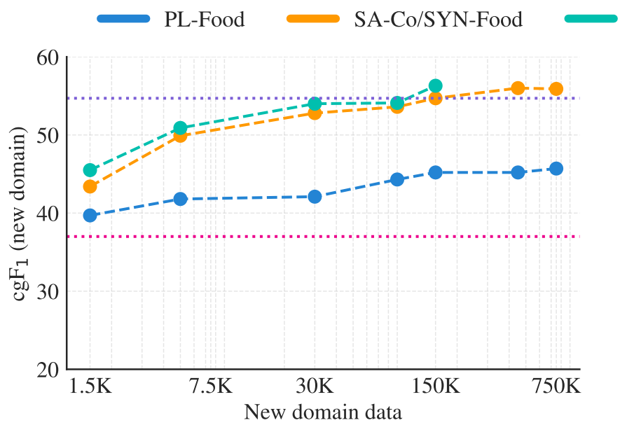


_(a) 以 1:1 的比例混合预训练数据进行数据扩展。_


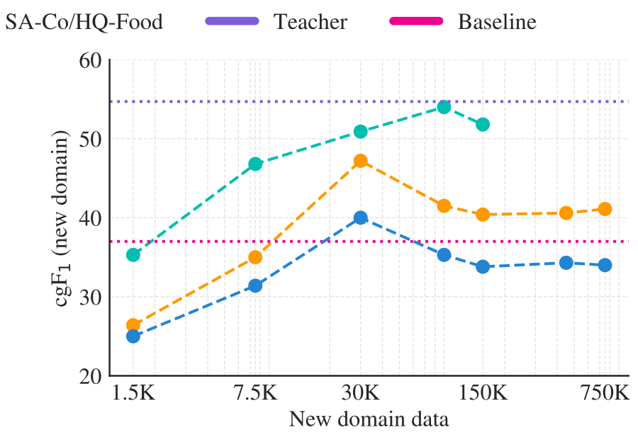


_(b) 不混合预训练数据进行数据扩展。_


_图 9 通过合成数据进行域适应。(a) SAM 3 + AI 验证器（教师系统）可以标注新领域（例如细粒度食品概念）的合成（SYN）数据，并实现与人工标注（HQ）数据类似的扩展行为。(b) 在新领域上进行微调时，如果不混合高质量的预训练数据，可能会限制性能提升，尤其是在使用合成数据时。_


为了隔离新领域数据与其他数据的影响，并分摊训练成本，我们分两步训练模型。首先，我们使用“SA-Co/HQ 减去 SA-Co/HQ-Food”数据预训练一个基础模型，以

---

建立基础能力和共同的起点。接下来，我们在两种设置下使用这三种数据变体对同一个基础模型进行微调：混合或不混合预训练数据。


图 9a 展示了将新领域的合成数据与预训练数据以 1:1 比例混合时的缩放定律。我们观察到与基线相比，PL-Food 有所改进，但由于质量较低，其他变体之间存在较大差距。SA-Co/HQ-Food 和 SA-Co/SYN-Food 具有相似的数据缩放行为，SA-Co/SYN-Food 略低但最终追上，且无需任何人工标注成本。得益于微调过程中混合的高质量预训练数据，在 SA-Co/SYN-Food 上训练的模型最终超越了其教师系统的性能。


图 9b 展示了仅使用新领域的合成数据进行微调时的缩放定律。所有三种数据变体的性能均低于图 9a。在此设置下，SA-Co/HQ-Food 和 SA-Co/SYN-Food 之间的差距更大，这反映了 SA-Co/SYN-Food 的质量较低（主要由于缺乏人工修正而导致覆盖不全）。比较图 9a 和 9b，在新领域微调 SAM 3 时，包含高质量的通用领域数据是有益的，尤其是在使用合成数据时。


# A.4 图像数据引擎标注速度


表 15 测量了在包含细粒度概念的新领域收集数据时，通过添加 AI 验证器为 SAM 3 数据引擎带来的加速比。我们使用与图 9 相同的设置，标注由数据引擎生成的 Wiki-Food&Drink 数据，其中 SAM 3 和 AI 验证器均未在 Wiki-Food&Drink 数据上受过训练。我们在四种设置下标注同一组图像-NP对：


- Human (NP Input)。人工标注员获得来自 SA-Co/HQ-Food 的单个图像名词短语对，并被要求手动标注所有实例掩码。在此循环中不使用掩码提议或 AI 验证器。


- Human (Mask Input)。与“NP input”相同的标注任务，但在这种设置下，人工标注员从 PL-Food 开始，即包含由 SAM 3 生成的掩码提议的图像名词短语对。


- Engine (All Human)。类似于 SAM 3 数据引擎中的阶段 1，人类从 PL-Food 开始，并顺序执行 3 个任务：掩码验证、穷尽性验证和修正。所有这三个任务均由人类执行。


- Engine (Full)。类似于 SAM 3 数据引擎中的阶段 3，掩码验证和穷尽性验证任务由 AI 验证器完成，修正由人类完成，即手动标注任务中的人工标注员从 SA-Co/SYN-Food 开始。


<table><tr><td>Task</td><td>Human from NP</td><td>Human from masks</td><td>Engine - all human</td><td>Engine - full</td></tr><tr><td>Time for datamix (sec)</td><td>90</td><td>86</td><td>50</td><td>23</td></tr><tr><td>Time for positive NP (sec)</td><td>236</td><td>205</td><td>207</td><td>152</td></tr><tr><td>Time for negative NP (sec)</td><td>71</td><td>70</td><td>30</td><td>6</td></tr></table>


_表 15 数据引擎效率 - 图像。AI 验证器显著提高了吞吐量，使人类能够专注于困难案例和手动修正任务。AI 验证器使得否定短语的提速达到 5 倍，肯定短语提速 $36\%$。datamix 的时间是根据 SA-Co/HQ 中 $88.5\%$ 的否定样本计算的，数据集组成见表 24。计时基于 Wiki-Food&Drink 领域。与基于描述词的领域相比，细粒度领域需要标注员进行更多研究以理解概念，导致否定短语的标注时间和每个掩码的分摊时间要高得多。_


表 15 显示，从未在这个新领域受过训练的 SAM 3 模型和 AI 验证器版本使数据引擎的吞吐量翻了一番。AI 验证器还允许在大规模下验证生成的困难否定 NP，且几乎无需人工标注员参与。随着 SAM 3 和 AI 验证器利用收集的数据进行更新并改进，人工标注员需要手动修正的错误更少。这导致吞吐量越来越高，并且在给定的人工标注时间内能收集到更具挑战性的数据。


在表 23 中，我们展示了 AI 验证器在 MV 和 EV 任务上实现了与人类验证器相似甚至更好的性能，因此这四种设置下的标注质量是相似的。

---

# A.5 视频数据引擎标注速度


使用与 A.4 节所述相同的设置，我们通过在 SA-Co/VEval - SA-V 的正样本视频-NP 对上比较人工（NP 输入）和引擎（全人工），评估了视频数据引擎的标注速度。与图像数据引擎相反，我们观察到以 PL（伪标签）为起点会增加标注时间，但同时也通过为标注员提供更多视觉线索和候选掩码片段（masklet）提高了详尽度。


<table><tr><td>任务</td><td>人工 (NP 输入)</td><td>引擎 (全人工)</td></tr><tr><td>正样本 NP 耗时 (秒)</td><td>2307</td><td>3221</td></tr><tr><td>每个视频-NP 对的掩码片段数量</td><td>2.52</td><td>2.76</td></tr><tr><td>总掩码片段数</td><td>1700</td><td>1860</td></tr></table>


_表 16 数据引擎效率 - 视频。虽然引擎 - 全人工模式比人工（NP 输入）标注慢 $40\%$，但它产生的掩码片段多出了 $9\%$。PL 帮助标注员专注于可能存在掩码片段的区域，但人工验证和修正所需的额外时间增加了整体标注时间。本实验是在 SA-Co/VEval 数据最终清洗之前运行的，因此掩码片段的数量可能与发布的版本有所不同。_


# A.6 视频训练数据消融实验


我们分析了 SAM 3 模型从通过视频数据引擎获得的 SA-Co/VIDEO 中的视频和标注中获益多少，这些数据用于第 4 阶段（视频级）训练（详见 §C.4.1）。具体而言，我们使用来自 SA-Co/VIDEO 的不同数量的掩码片段作为 VOS 训练数据来训练模型，并在 $\mathcal{I}\&\mathcal{F}$ 指标下，在 SA-Co/VEval 上评估所得检查点在 VOS 任务上的表现。结果如表 17 所示，其中添加通过视频数据引擎（作为额外的第 4 阶段训练数据）收集的带有名词短语的掩码片段，提高了在 SA-Co/VEval 以及 DAVIS17 (Pont-Tuset et al., 2017a) 和 SA-V (Ravi et al., 2024) 等公共基准上的 $\mathcal{I}\&\mathcal{F}$ 性能。


<table><tr><td>第 4 阶段训练数据</td><td>SA-Co/VEval YT-1B
验证集 J&amp;F</td><td>SA-Co/VEval SA-V
验证集 J&amp;F</td><td>DAVIS17
验证集 J&amp;F</td><td>SA-V
验证集 J&amp;F</td><td>SA-V
测试集 J&amp;F</td></tr><tr><td>仅使用 SAM 2 视频数据</td><td>80.7</td><td>84.9</td><td>91.6</td><td>77.0</td><td>77.1</td></tr><tr><td>+ 25% SA-Co 训练视频</td><td>80.9</td><td>85.3</td><td>91.3</td><td>75.2</td><td>76.9</td></tr><tr><td>+ 50% SA-Co 训练视频</td><td>81.2</td><td>85.3</td><td>91.5</td><td>76.7</td><td>77.0</td></tr><tr><td>+ 75% SA-Co 训练视频</td><td>81.4</td><td>85.9</td><td>91.7</td><td>76.5</td><td>78.5</td></tr><tr><td>+ 100% SA-Co 训练视频</td><td>81.4</td><td>86.5</td><td>91.5</td><td>77.4</td><td>78.0</td></tr></table>


_表 17 在第 4 阶段（视频级）训练下对 SA-Co/VEval 的扩展分析，通过视频对象分割（VOS）任务下的 $\mathcal{I}\&\mathcal{F}$ 指标在多个基准上进行评估。请注意，“SA-Co/VEval YT-1B”和“SA-Co/VEval SA-V”分别指基于 YT-Temporal-1B 视频和 SA-V 视频构建的 SA-Co/VEval 子集，而“SA-V”指的是 Ravi et al. (2024) 中发布的 VOS 评估数据集。_


# B 局限性


SAM 3 在图像和视频的 PCS 任务上表现出色，但在许多场景下仍存在局限性。


SAM 3 难以以零样本方式泛化到细粒度的域外概念（例如，飞机型号、医学术语），尤其是在小众视觉领域（例如，热成像）。对于 PCS 任务而言，概念泛化本质上比 PVS 任务对新视觉域的类别不可知泛化更具挑战性，后者是使 SAM 和 SAM 2 能够在各种设置中成功零样本应用的关键。我们的实验表明，当在少量人工标注的数据上进行微调时，SAM 3 能够快速适应新概念和视觉领域（表 2）。此外，我们表明，我们可以使用数据引擎生成的特定领域合成数据，在没有任何人工参与的情况下提高新领域的性能（图 9）。


根据我们对 PCS 任务的表述，SAM 3 仅限于简单的名词短语提示，不支持超过一两个属性的多属性查询，也不支持包含指代表达式的较长短语。我们表明，当与 MLLM 结合时，SAM 3 能够处理更复杂的短语（§6 和 §G）。

---

---

在视频领域，SAM 3 使用 SAM 2 风格的 masklet（掩码片段）来跟踪每个对象，这意味着 SAM 3 推理的成本与被跟踪对象的数量呈线性关系。为了在实际应用（例如网络演示）中支持对视频的实时推理（30 FPS），我们在多个 GPU 上并行化推理：在 2 张 H200 上最多支持 10 个对象，在 4 张 H200 上最多支持 28 个对象，在 8 张 H200 上最多支持 64 个对象。此外，在当前架构下，没有共享的对象级上下文信息来辅助解决多对象跟踪场景中的歧义。未来的开发可以通过跨多个对象的共享全局内存来解决这一问题，这也将提高推理效率。

在支持 PVS 的实例级交互的同时，支持 PCS 的概念级交互带来了几个挑战。为了在不影响概念的所有其他实例的情况下支持实例级修改，我们在模型内部强制执行了从概念模式到实例模式的硬性“模式切换”。未来的工作可能包括更无缝地交错概念和实例提示。

# C 模型细节


# C.1 模型架构


我们的架构主要基于 SAM 系列（Ravi et al., 2024; Kirillov et al., 2023）和 DETR（Carion et al., 2020），并使用了（双重）编码器-解码器 Transformer 架构，概览见图 10。SAM 3 是 SAM 2 的泛化版本，支持新的可提示概念分割（PCS）任务以及可提示视觉分割（PVS）任务（Ravi et al., 2024）。该设计支持图像和视频中的多模态提示（例如文本、框、点）和交互性。


SAM 3 拥有约 850M（8.5 亿）个参数，分布如下：视觉和文本编码器（Bolya et al., 2025）分别拥有约 450M 和约 300M 个参数，检测器和跟踪器组件拥有约 100M 个参数。我们接下来讨论用于图像的检测器架构，然后是构建在其之上用于视频的跟踪器组件。


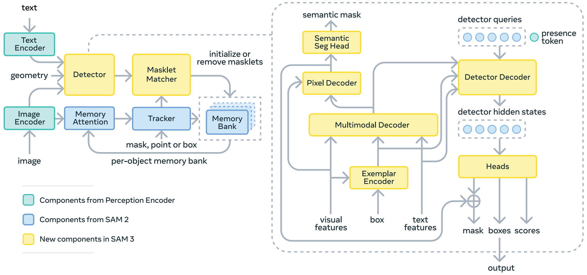


_图 10 SAM 3 架构。新组件以黄色显示，SAM 2（Ravi et al., 2024）以蓝色显示，PE（Bolya et al., 2025）以青色显示。_


# C.2 图像实现细节


图像检测器是一个编码器-解码器 Transformer 架构。我们将在本节中描述其细节。


图像和文本编码器。图像和文本编码器是 Transformer（Vaswani et al., 2017），按照感知编码器（PE）（Bolya et al., 2025）的方法，使用 54 亿对图像-文本对进行对比性视觉语言训练，训练详情见 §C.4.1。与 SAM 2 一样，视觉编码器使用窗口注意力（Ryali et al., 2023; Li et al., 2022d），并且仅在一小部分层（4 层）中使用全局注意力

---

---

（32），其中 1008 像素的图像被划分为 $3 \times 3$ 个不重叠的窗口，每个窗口 336 像素。视觉编码器在每一层中使用 RoPE (Su et al., 2021; Heo et al., 2024)，并像 Bolya et al. (2024) 一样使用窗口化的绝对位置嵌入。文本编码器是因果性的，最大上下文长度为 32。

与 Ravi et al. (2024) 一样，我们采用流式处理方法，在新帧可用时将其摄入。我们在整个交互过程中每帧只运行一次 PE 主干网络，该过程可能跨越视频的多次前向/反向传播步骤。主干网络向由下述融合编码器和用于视频的内存注意力组成的双编码器，提供代表每一帧的无条件 Token（特征/嵌入）。

几何与示例编码器。几何与示例编码器主要用于编码图像示例（如果存在），用于 PCS 任务。此外，它还用于编码图像上 PVS 任务的视觉提示，作为一种辅助功能，主要用于在训练的第 2、3 阶段包含 PVS 任务的预训练数据（参见 §C.4.1），以实现更模块化的训练方法。

每个单独的图像示例使用位置嵌入、标签嵌入（正样本或负样本）和 ROI 池化的视觉特征进行编码，这些特征被拼接在一起（构成“示例 Token”）并由一个小型 Transformer 处理。用于辅助训练的视觉提示（点、框）以类似的方式编码，构成“几何 Token”。可能既不存在“几何 Token”也不存在“示例 Token”（例如，仅使用文本提示时）。几何或示例 Token 通过自注意力相互关注，同时也交叉关注来自图像编码器的相应（无条件）帧的帧嵌入。

融合编码器。文本和几何/示例 Token 共同构成提示 Token。融合编码器接收无条件的帧嵌入，并使用由 6 个 Transformer 块组成的堆栈对提示 Token 进行条件化处理，这些块包含自注意力和交叉注意力（针对提示 Token）层，后接一个 MLP。我们使用标准的自注意力操作。融合编码器的输出是条件化的帧嵌入。

解码器。解码器架构以 Carion et al. (2020); Kamath et al. (2021) 为起点，由 6 个 Transformer 块组成。$Q$ 个可学习的对象查询（注意不要与提示混淆）相互进行自关注，并交叉关注提示 Token（由文本和几何/示例 Token 组成）和条件化的帧嵌入，后接一个 MLP。我们在关注条件化帧嵌入的交叉注意力层中使用框到像素的相对位置偏差 (Lin et al., 2023)。

遵循更强大的 DETR 变体的标准实践，我们使用迭代框细化 (Zhu et al., 2020)、前视两次 (Zhang et al., 2022a)、混合匹配 (Jia et al., 2022) 以及分而治之 (DAC) DETR (Hu et al., 2023)。默认情况下，我们使用 $ Q = 200 $ 个对象查询。边界框和分数使用专用的 MLP 进行预测，并接收对象查询作为输入。

存在性头。由于信息不足，单独对每个对象进行分类通常很困难，并且可能需要图像其余部分的上下文信息。然而，强制每个对象查询获得这种全局意识是有害的，并且可能与本质上非常局部的定位目标相冲突。为了解决这个问题，我们提出将分类问题分解为两个互补的组成部分：一个确定整个图像中对象存在的全局级分类，以及一个作为前景-背景分割同时防止重复检测的局部级定位。形式上，我们添加了以下结构：我们不再直接预测 $ p(\text{query}_i $ 匹配 NP)，而是将其分解为

$p(\mathrm{query}_i$ 匹配 NP) $= p(\mathrm{query}_i$ 匹配 NP | NP 出现在图像中) $\cdot p(\mathrm{NP}$ 出现在图像中).

为了计算 $ p(\mathrm{NP}) $ 出现在图像中)，我们使用一个存在性 Token，它被添加到我们的解码器中，然后通过 MLP 分类头。关键在于，存在性分数由所有对象查询共享。每个查询的分类损失保持不变，但为了适应这种分解，我们仅在 NP 出现在图像中时才计算它（关于监督策略的消融实验参见 §A.1）。同样的分解也应用于语义分割头，我们在那里重用相同的存在性分数，并且仅在正样本上训练二值掩码头。

除了对误报更鲁棒之外，以这种方式分解预测也更灵活，例如，在典型的计数任务中，我们已经知道 NP 存在于图像中，而是想知道存在多少个实例——在这种情况下，我们可以简单地设置 $ p(\mathrm{NP}) $ 存在于帧中) = 1。存在性 Token 在所有操作中与对象查询拼接，但在 DAC 中被排除。

---

我们还学习了 4 个几何查询。它们的功能类似于 SAM 1 和 2 中的 4 个几何查询（在那里它们被称为“输出 tokens”），并用于在训练的第 2、3 阶段对单个图像或视频帧执行 PVS，参见 §C.4.1。提示由“几何 tokens”以视觉提示的形式提供。当在单帧上执行 PVS 任务时，存在分数被设置为 1，因为已知目标存在于该帧中。

**分割头。** 分割头改编自 MaskFormer (Cheng et al., 2021)。语义分割和实例分割共享同一个分割头。来自融合编码器的条件特征被用于生成语义分割掩码，而实例分割还额外使用解码器输出的对象查询。我们使用 SimpleFPN (Li et al., 2022d) 向分割头提供“多尺度”特征，因为视觉编码器是一个（单尺度的）ViT。

**处理歧义。** 实验表明，如果我们训练一个 SAM 3 模型而不以任何方式处理 §2 中所述的歧义，我们会观察到该模型倾向于预测该短语的几种有效但相互冲突的解释。这是意料之中的；如果在我们训练数据集中，一个给定的短语有两种不同的解释，并且大约一半的数据假设第一种解释进行标注，而另一半遵循第二种解释，那么最小化训练损失的解决方案就是以 50% 的置信度输出这两种解释。然而，这种行为对于最终用户来说是不可取的，因为它会产生冲突的、有时甚至是重叠的掩码。

为了解决这个问题，我们在模型中添加了一个歧义头。与 SAM 1 和 2 类似，这个头是一个混合专家模型，其中我们并行训练 $ K $ 个专家，并且只监督损失最低的专家（赢家通吃）。我们发现 $ K = 2 $ 效果最好，并且由于模式崩溃，训练 $ K > 3 $ 个专家更加困难。

对于 $K$ 个专家的混合，每个专家产生一个输出 $y_{k}$ 并具有损失 $\mathcal{L}_k$，混合损失是加权平均：

$$
\mathrm {L o s s :} \quad \mathcal {L} _ {\mathrm {M o E}} = \sum_ {k = 1} ^ {K} p _ {k} \mathcal {L} _ {k} \qquad \mathrm {G r a d i e n t :} \quad \frac {\partial \mathcal {L} _ {\mathrm {M o E}}}{\partial \theta_ {j}} = p _ {j} \frac {\partial \mathcal {L} _ {j}}{\partial \theta_ {j}}.
$$

在我们的赢家通吃变体中，只有损失最低的专家接收梯度：

$$
\mathrm {L o s s :} k ^ {\star} = \underset {k} {\arg \min} \mathcal {L} _ {k}, \qquad \mathcal {L} _ {\mathrm {W T A}} = \mathcal {L} _ {k ^ {\star}}
$$

$$
\begin{array}{r l} \mathrm {G r a d i e n t :} & \frac {\partial \mathcal {L} _ {\mathrm {W T A}}}{\partial \theta_ {j}} = \left\{ \begin{array}{l l} \frac {\partial \mathcal {L} _ {k ^ {\star}}}{\partial \theta_ {j}}, & \mathrm {i f} j = k ^ {\star}, \\ 0, & \mathrm {o t h e r w i s e .} \end{array} \right. \end{array}
$$

仅通过损失最低的专家反向传播损失，使得每个专家能够专门处理一种类型的解释。这种行为在图 11 中进行了说明。


_(a) 原始图像_


_(b) 专家 1 的预测_


_(c) 专家 2 的预测_

_图 11：两个专家学习到的名词短语“large circular shape”（大圆形）的两种解释（SA-1B 图像）。_

虽然这种策略允许专家进行专门化处理，但它并没有显式地选择在推理时间应该使用哪个专家。为了解决这个问题，我们训练了一个分类头，用于预测具有最高的……

---

正确的概率。分类头以监督方式进行训练，使用交叉熵损失，通过预测在训练期间获得最小损失的专家。歧义头仅调整分类 logits，保持掩码、边界框和存在分数不变。我们在冻结的 SAM 3 模型之上对其进行训练。

最后，为了检测重叠实例，我们计算掩码之间的最小交集比。IoM 在识别嵌套实例方面比交并比更有效。借助歧义头，我们将重叠实例减少了 $15\%$。

# C.3 视频实现细节

跟踪器架构遵循 Ravi 等人 (2024) 的设计，为方便起见，我们在此简要描述，随后讨论我们引入的消歧策略。

**跟踪器。** 图像编码器是与检测器共享的 PE (Bolya et al., 2025)，它通过一个独立的颈部网络为记忆注意力提供无条件 tokens。记忆注意力接收这些无条件 PE tokens，堆叠自注意力和交叉注意力层，根据空间记忆和记忆库中相应的对象指针对当前帧的 tokens 进行条件化。记忆的编码方式是将帧的掩码预测与来自图像编码器的无条件 PE tokens 融合，然后存入记忆库。

与 Ravi 等人 (2024) 一样，解码器包含一个遮挡头，用于指示感兴趣的对象在当前帧中可见的可能性。在推理过程中，遮挡分数也可用于自适应地选择要放入记忆库的帧。

SAM 引入了在面临图像中被分割对象的歧义时输出多个有效掩码的能力。例如，当用户点击自行车的轮胎时，模型可以将此点击解释为仅指轮胎或整辆自行车，并输出多个预测。在视频中，这种歧义可以跨越视频帧延伸。例如，如果在一个帧中只看到轮胎，点击轮胎可能仅与轮胎有关；或者随着后续帧中自行车更多部分变得可见，此点击可能意在指代整辆自行车。为了处理这种歧义，SAM 2 在视频的每一步预测多个掩码。如果进一步的提示未能消除歧义，模型会选择当前帧中预测 IoU 最高的掩码进行视频中的进一步传播，尽管也可以采用其他策略。

**消歧策略。** 如 §3 所述，视频中的跟踪可能会受到掩码传播中的歧义、检测器的错误预测，或在具有高度重叠对象的拥挤场景中基于 IoU 的匹配的局限性的影响。在本节中，我们介绍了用于解决这些挑战的时间消歧策略的细节。我们首先介绍本节中使用的符号。

设 $\mathcal{D}_{\tau}$ 和 $\hat{\mathcal{M}}_{\tau}$ 分别表示帧 $\tau$ 上的检测器输出集合和跟踪器的预测掩码集合。我们将帧 $\tau$ 上的掩码子序列 $i$ 的逐帧匹配函数 $\Delta_i(\tau)$ 定义为

$$
\Delta_ {i} (\tau) = \left\{ \begin{array}{l l} + 1, & \mathrm {i f} \exists d \in \mathcal {D} _ {\tau} \mathrm {s . t .} \mathrm {I o U} (d, \hat {\mathcal {M}} _ {\tau} ^ {i}) > \mathrm {i o u \_ t h r e s h o l d} \\ - 1, & \mathrm {o t h e r w i s e ,} \end{array} \right.
$$

其中 $\hat{\mathcal{M}}_{\tau}^{i}$ 是对象 $i$ 在帧 $\tau$ 上的预测输出掩码。此外，我们在区间 $[t,t^{\prime}]$ 上定义掩码子序列检测分数 (MDS) 为 $S_{i}(t,t^{\prime}) = \sum_{\tau = t}^{t^{\prime}}\Delta_{i}(\tau)$。该分数衡量掩码子序列在时间窗口内与检测结果的匹配一致性。对象 $i$ 出现的第一帧记为 $t_{\mathrm{first}}^{i}$。

**跟踪确认延迟。** 为了减少虚假和重复的掩码子序列，我们稍微延迟模型的输出。具体而言，仅在观察到帧 $\tau + T$ 后才显示帧 $\tau$ 的输出。这种延迟为在输出掩码之前验证候选掩码子序列提供了时间上下文。默认情况下，我们使用 $T = 15$，这对于每秒 30 帧的视频来说，以约半秒的轻微延迟为代价实现了良好的准确性。在延迟期间，我们应用以下两个标准来移除未确认或重复的掩码子序列。

**移除未确认的掩码子序列。** 如果候选掩码子序列在确认窗口 $[t, t + T]$ 内的 MDS 低于阈值（$S_{i}(t, t + T) < V$），并且该掩码子序列首次出现在该窗口内（$t_{\mathrm{first}}^{i} \geq t$），则认为其未确认。如果这两个条件在确认延迟内都满足，我们将从跟踪器的状态中移除该掩码子序列。我们选择 $V = 0$，要求掩码子序列至少被匹配到检测结果

---

确认延迟期内的一半帧被确认。该策略有助于剔除部分误检，避免对其进行跟踪。


**重复掩码片段的移除**。如果跟踪器在某些帧中未能成功预测对象的掩码，但检测器在这些帧中继续检测到了该对象，这可能会导致为同一对象创建一个新的掩码片段。结果，两个掩码片段可能最终跟踪同一个对象：一个是原始的（较旧的）掩码片段，另一个是在跟踪器丢失该对象期间启动的新掩码片段。为了解决这个问题，在确认延迟期内，如果两个掩码片段持续与同一个检测重叠，我们将移除较晚开始的那一个。具体来说，如果在帧 $\tau$ 上存在一个检测 $d \in \mathcal{D}_{\tau}$，使得 $\mathrm{IoU}(\hat{\mathcal{M}}_{\tau}^{i},d) \geq \mathrm{iou\_threshold}$ 且 $\mathrm{IoU}(\hat{\mathcal{M}}_{\tau}^{j},d) \geq \mathrm{iou\_threshold}$，则认为两个掩码片段 $i$、$j$ 在该帧是重复的。如果两个掩码片段 $i$ 和 $j$ 在至少 $\lceil T/2 \rceil$ 帧中被发现是重复的，且仅当首次出现时间较晚的那个掩码片段的 $t_{\mathrm{first}}$ 位于确认窗口 $[t,t + T]$ 内时，我们才移除它。根据经验，我们发现使用 iou_threshold $= 0.1$ 能获得最佳结果。


**掩码片段抑制**。对于在确认延迟期内未被移除的已确认掩码片段，我们会应用一个额外的抑制步骤：如果一个掩码片段在其整个生命周期内的 MDS 在任意帧 $\tau$ 处降至零以下（即 $S_{i}(t_{\mathrm{first}}^{i},\tau) < 0$），我们通过将其掩码置零来抑制其输出。但是，我们会在跟踪器的状态中保留该掩码片段，以便该对象可能在未来的帧中被重新确认。该策略主要解决模棱两可的检测问题，例如对象在边界附近进入场景的情况。例如，当一个人进入画面时只有手是可见的，检测器可能无法确定该对象是否与文本提示匹配（例如，无法区分是男性还是女性）。在这种情况下，如果检测器在对象完全进入场景后随后未能检测到该对象，掩码片段抑制标准将确保这些掩码片段被抑制，除非它们持续与新的检测相匹配。


**周期性重提示**。在涉及遮挡或视觉上相似的干扰对象的具有挑战性的场景中，跟踪器可能会丢失目标对象。为了解决此类跟踪失败问题，我们利用最新的检测输出定期重提示跟踪器。具体来说，在第 $N$ 帧的每一帧 $\tau$ 上，我们将每个检测 $d \in \mathcal{D}_{\tau}$ 与跟踪器的当前预测 $\hat{\mathcal{M}}_{\tau}$ 进行比较。如果检测 $d$ 与跟踪器的预测重叠度高（即 $\mathrm{IoU}(d, \hat{\mathcal{M}}_{\tau}^{i}) \geq 0.8$），并且检测分数和掩码片段预测分数均超过 0.8 的置信度阈值，我们使用检测输出掩码为该对象重新初始化跟踪器。我们观察到，重提示在对象未被遮挡且完全可见的帧上最为有效，这也促使我们选择了较高的置信度阈值。在我们的实验中，我们默认设置 $N = 16$。这种周期性重提示有助于跟踪器从临时故障中恢复，并在整个视频过程中保持准确的对象跟踪。


**检测引导的重提示**。在跟踪器的预测可能发生漂移且其预测的掩码变得泄漏的情况下，我们采用检测器的输出。对于每一帧 $\tau$，我们将每个检测 $d \in \mathcal{D}_{\tau}$ 与跟踪器的当前预测 $\hat{\mathcal{M}}_{\tau}$ 进行比较。如果匹配度最高的检测 $d$ 与相应的跟踪器预测 $\hat{\mathcal{M}}_{\tau}^{i}$ 具有较低的边界框 IoU（即 $\mathrm{IoU}_{\mathrm{bbox}}(d, \hat{\mathcal{M}}_{\tau}^{i}) < 0.85$），我们使用最新的检测器输出为该对象重新调节跟踪器。这种方法确保跟踪器与可靠的检测结果保持同步。


表 39 中对这些策略的影响进行了消融实验，结果表明它们在我们的评估集上带来了定量的改进。


# C.4 模型训练


# C.4.1 训练阶段


SAM 3 分 4 个阶段进行训练，每个阶段都引入了新功能或改进了现有功能。表 18 列出了每个阶段使用的数据。


**阶段 1**。感知编码器（PE）预训练（Bolya et al., 2025），利用 54 亿对图像-文本对预训练图像和文本编码器。除了广泛的概念覆盖外，该阶段对于鲁棒性至关重要（参见 §A.1）。由于视觉编码器需要支持多项任务（同时又不能太大），我们选择了“L+”规格；视觉和文本编码器分别是具有 450M 和 300M 参数的 Transformer。

---

。我们主要遵循 Bolya 等人 (2025) 的方法，但在本阶段不使用蒸馏，也不进行视频微调。


**第 2 阶段。** 该阶段用于检测器预训练，利用大规模图像分割数据（包括作为图像处理的视频帧）训练（图像级）检测器以及视觉和文本编码器。本阶段同时使用了伪标注数据和人工标注数据，见表 18。该阶段的主要目标是实现对（图像，名词短语，掩码）元组的广泛概念覆盖。在本阶段结束时，模型已经能够相当出色地在多个领域执行开放词汇目标检测、实例分割和语义分割。


本阶段的一个额外目标是为后续阶段的任务准备好基础模型。为了准备 PCS 任务，（图像，名词短语）对被随机（$p = 0.2$）转换为视觉查询（即丢弃名词短语）或通过输入边界框（$p = 0.2$）进行增强。


除了针对 PCS 任务的训练外，在本阶段，模型还在视觉提示的 PVS 任务上进行了预训练。这是通过遵循 SAM 1 & 2 的设计，添加 4 个针对该任务的特定解码器查询来实现的。训练数据包括图像（例如 SA-1B）和视频帧（例如 SA-V），见表 18；为了效率，交互步数被限制为 4 步。我们主要遵循 Ravi 等人 (2024) 的设置，但使用 Align 损失 (Cai et al., 2024) 代替 IoU 预测损失，并借用该任务的对象查询分类头。


我们训练了约 $\sim 95\mathrm{k}$ 次迭代，批大小为 896，包含 $5\mathrm{k}$ 步预热和冷却步，使用 AdamW (Loshchilov & Hutter, 2019)。我们对视觉编码器应用了 0.9 的逐层学习率衰减 (Clark et al., 2020)。我们使用倒数平方根调度 (Zhai et al., 2022) 和 0.1 的权重衰减。我们使用 $5e - 4$ 的初始学习率，视觉和文本编码器使用 $1e - 4$，所有其他组件使用 $1e - 3$。对于边界框，我们使用权重分别为 5 和 2 的 $L_{1}$ 和 gIoU 损失。分类损失使用的权重为 100，Focal 损失和 Dice 损失使用的权重分别为 200 和 10。编码器和解码器使用的 Dropout 为 0.1。


**第 3 阶段。** 该阶段利用最高质量的人工标注图像分割数据进一步训练模型，扩展了交互能力，并引入了后训练以提高检测性能。


具体而言，在交互性方面， 在 PVS 任务中，交互步数增加到 7 步； 在 PCS 任务中引入了交互，即根据模型误差提供正样本或负样本示例，如下所述。我们迭代采样框提示以模拟真实的用户策略。正样本框从假阴性错误中采样，我们提示其对应的真值框。负样本框从与真值没有显著重叠的高置信度假阳性预测中采样。在每次迭代中，框输入被添加到先前的框之上。如果同时存在有效的正样本和负样本框，我们随机选择一个；如果没有可用的有效候选，则不给出额外的提示。该过程重复 5 次。


本阶段 PCS 和 PVS 中扩展的交互性显著减慢了训练速度，但之前针对 PVS 的有限交互和针对 PCS 的无交互（但使用图像示例和文本提示）进行的广泛预训练为模型做好了充分准备，确保只需较短的第 3 阶段就足够了。


该阶段仅保留质量最高、经过穷尽性验证的数据（例如，SA-Co/SYN 被剔除），并引入了存在性令牌（和存在性损失）以更好地对目标片段的存在及其位置进行建模，从而极大地提高了模型的精度。存在性损失是权重为 20 的二元交叉熵损失。所有学习率降低 0.025 倍。我们训练了约 $\sim 5\mathrm{k}$ 次迭代，批大小为 512，其他设置与第 2 阶段相同。


**第 4 阶段。** 对于视频，跟踪器解码器在冻结的主干网络之上进行训练。这一阶段能够冻结主干网络，归功于之前阶段在视频帧级别对 VOS 数据进行的预训练。该阶段保留了上一阶段强大的空间定位能力，并专注于时空跟踪，同时不降低其他能力。我们使用 512 的批大小，训练约 $\sim 190\mathrm{k}$ 次迭代，使用余弦调度，峰值学习率为 $5.0e^{-4}$，线性预热为 1k 次迭代。我们使用损失的加权和来监督模型的输出：用于掩码预测的 focal 和 dice 损失的线性组合，用于 IoU 预测的平均绝对误差 (MAE) 损失，以及用于目标遮挡预测的交叉熵损失，其权重分别为 20:1:1:1。对于多掩码预测，我们仅对分割损失最低的掩码应用监督。如果帧的真值不包含掩码，我们不对该帧的任何掩码输出进行监督；然而，我们始终监督遮挡预测头，该头决定

---

---

是否应存在掩码。与 Ravi 等人 (2024) 一样，我们进一步使用 16 帧和 32 帧的视频，以更长的时间上下文对跟踪器进行微调，进行了 60k 次迭代，同时将学习率按 0.1 的系数进行缩放。

<table><tr><td>数据集</td><td>摄入形式</td><td>训练</td><td>测试</td><td>阶段 1</td><td>阶段 2</td><td>阶段 3</td><td>阶段 4</td></tr><tr><td colspan="8">可提示视觉分割 - 图像</td></tr><tr><td>SA-1B</td><td>图像</td><td>✓</td><td></td><td></td><td>✓</td><td>✓</td><td>✓</td></tr><tr><td>SA-Co/VIDEO</td><td>帧</td><td>✓</td><td></td><td></td><td>✓</td><td>✓</td><td>✓</td></tr><tr><td>SA-Co/VIDEO-EXT</td><td>帧</td><td>✓</td><td></td><td></td><td>✓</td><td>✓</td><td>✓</td></tr><tr><td>SA-37</td><td>图像</td><td></td><td>✓</td><td></td><td>✓</td><td>✓</td><td>✓</td></tr><tr><td colspan="8">可提示视觉分割 - 视频</td></tr><tr><td>SA-Co/VIDEO</td><td>视频</td><td>✓</td><td></td><td></td><td></td><td></td><td>✓</td></tr><tr><td>SA-Co/VIDEO-EXT</td><td>视频</td><td>✓</td><td></td><td></td><td></td><td></td><td>✓</td></tr><tr><td>SA-V val</td><td>视频</td><td></td><td>✓</td><td></td><td></td><td></td><td>✓</td></tr><tr><td>LVOSv2</td><td>视频</td><td></td><td>✓</td><td></td><td></td><td></td><td>✓</td></tr><tr><td colspan="8">可提示概念分割 - 图像</td></tr><tr><td>SA-Co/SYN</td><td>图像</td><td>✓</td><td></td><td></td><td>✓</td><td></td><td></td></tr><tr><td>SA-Co/HQ</td><td>图像</td><td>✓</td><td></td><td></td><td>✓</td><td>✓</td><td></td></tr><tr><td>SA-Co/EXT</td><td>图像</td><td>✓</td><td></td><td></td><td>✓</td><td>✓</td><td></td></tr><tr><td>SA-Co/VIDEO</td><td>帧</td><td>✓</td><td></td><td></td><td>✓</td><td>✓</td><td></td></tr><tr><td>SA-Co/Gold</td><td>图像</td><td></td><td>✓</td><td></td><td>✓</td><td>✓</td><td></td></tr><tr><td>SA-Co/Silver</td><td>图像</td><td></td><td>✓</td><td></td><td>✓</td><td>✓</td><td></td></tr><tr><td>SA-Co/Bronze, SA-Co/Bio</td><td>图像</td><td></td><td>✓</td><td></td><td>✓</td><td>✓</td><td></td></tr><tr><td colspan="8">可提示概念分割 - 视频</td></tr><tr><td>SA-Co/VEval</td><td>视频</td><td></td><td>✓</td><td></td><td></td><td></td><td>✓</td></tr></table>


_表 18 不同任务和训练阶段中的数据集使用情况。_


# C.4.2 附加训练设置


数据增强。对于 PCS 任务，我们应用以下变换：


- **几何：** 我们使用一些裁剪和调整大小操作来改变长宽比，并有助于处理小目标。我们模型的输入分辨率始终是一个固定的正方形（通常为 $1008 \times 1008$）。在评估期间，图像被调整为该大小，而不考虑其长宽比。在训练期间，我们应用我们的增强操作，如果结果尺寸小于 $1008 \times 1008$，则进行填充。我们发现很重要的一点是，要在所有边上随机分布填充，以避免对图像的特定区域产生偏差。如果数据集不包含左右的概念，我们还会应用随机水平翻转。


- **语义：** 当在具有封闭词汇表的数据集上进行训练时，我们利用到 Wikidata 的映射来进一步增强训练。我们可以利用本体的三种主要方式： 采样同义词，以扩展模型的词汇表； 采样负样本（通常，如果数据集是穷尽式标注的，我们可以采样图中对应于类别且未出现在图像中的任何节点）；以及 确保概念的层次闭合（例如，如果我们在同一图像中有“canoe”（独木舟）和“boat”（船）的标注，我们需要确保所有“canoe”对象也被标记为“boat”，因为独木舟是船的一种）。


- **安全性：** 为了防止模型对不安全的概念进行随机预测，我们在训练时随机采样其中一些概念并将其作为负样本添加。这些概念主要包括各种类型的侮辱性词汇。我们还试图防止模型对主观和非视觉的形容词进行预测，特别是当应用于人时。这包括褒义词（如“聪明的人”）以及贬义词（如“迟钝的人”）。


- **马赛克：** 在某些数据集上，我们通过制作马赛克来进一步增加图像的复杂性 (Bochkovskiy et al., 2020)。我们马赛克的最大网格尺寸为 $3 \times 3$，我们采样任何不超过该尺寸的配置，包括不规则的配置，只要组成部分仍然是正方形。例如，在一个 $3 \times 3$ 的常规网格中，我们可以有一个有效覆盖 $2 \times 2$ 区域的大图像，并在剩余的 5 个位置使用 $1 \times 1$ 的图像。在开放词汇表设置中，统一不同的图像可能很棘手，因为无法保证概念是穷尽标注的。例如，如果一张图像标注了汽车，但第二张

---

---

不存在（既不是正样本也不是负样本），那么我们就无法得知第二张图片中是否有车，从而可能产生一些标注噪声。为了避免这种情况，我们只对那些不太可能出现此类缺失标注的数据集进行拼接（要么是封闭词汇表的数据集，要么是通过特定挖掘模式创建的数据集）。为了合并标注，如果可用，我们再次依赖 Wikidata 映射，否则依赖纯文本查询进行适当的合并。

# D 数据引擎详情

SAM 3 数据引擎组件的概览如图 5 所示。在本节中，我们将详细介绍该引擎的图像版本（阶段 1-3）和视频版本（阶段 4）中每个组件的实现方式。每个阶段收集的数据集以及性能提升情况见表 19。

# D.1 媒体池

媒体（图像和视频）池包含许多来源，涵盖不同的视觉领域，从网络抓取的数据到为特定领域（如艺术、食品或驾驶）收集的数据集。表 26 列出了用于为 SA-Co 训练数据的每个子集挖掘媒体的所使用的数据集。网络抓取的图像和替代说明文字来源于 MetaCLIP (Xu et al., 2024b)，它是 CommonCrawl 的一个精选版本。我们通过借助一个精选的本体论从大型池中挖掘媒体，进一步扩大了覆盖范围。与之前主要依赖未经筛选的网络抓取数据的工作（如 OWLv2 (Minderer et al. (2024))）相比，我们的目标挖掘策略覆盖了 12 个媒体领域。

# D.2 SA-Co 本体论

为了跟踪和改进我们数据中概念的覆盖范围和整体分布，我们从 Wikidata (Vrandecic & Krötzsch, 2014) 构建了一个自定义的视觉概念 SA-Co 本体论，它涵盖了全面的实体集，并通过其图数据结构提供层次信息。我们手动选择高层级的 Wikidata 节点（例如，人类、哺乳动物），并递归地包含它们的所有后代。生成的 2240 万个节点被分为 17 个顶级类别（例如，动物、家具与家居）和 72 个子类别（例如，鸟类、家用电器）。类别和 Wikidata 节点计数的完整列表见表 20。我们进一步开发了一种映射过程，可以利用检索模型从任意 NP 映射到 SA-Co 本体论中的节点，该过程利用检索模型来获取候选节点，并使用 AI 标注器作为评判者来选择最匹配的节点。此映射用于跟踪数据集中节点的分布（见图 12）以及创建否定短语（详见下文）。

# D.3 阶段 1：人工验证

数据挖掘。在此阶段，我们从 MetaCLIP 中随机抽取图像。

提出 NP。我们使用 BLIP-2 标注器生成图像级说明文字，然后使用 spaCy 解析器将说明文字解析为 NP。

提出掩码。我们使用名词短语提示现成的开放词汇检测器 FIBER (Dou et al., 2022) 或 OWLv2 (Minderer et al., 2024)，并使用生成的边界框提示 SAM 2 生成掩码提议。

<table><trthead><tr><th rowspan="2"></th><th colspan="3">SA-Co/HQ</th><th colspan="2">SA-Co/SYN</th><th colspan="2">SA-Co/EXT</th><th colspan="2">SA-Co/VIDEO</th><th colspan="3">SAM 3 性能</th></tr><tr><th>#img</th><th>#img-NP</th><th>#annotation domains</th><th>#img</th><th>#img-NP</th><th>#img</th><th>#img-NP</th><th>#vid</th><th>#vid-NP</th><th>SA-Co/Gold (cgF1)</th><th>SA-Co/Silver (gCF1)</th><th>SA-Co/VEval (test pHOTA)</th></tr></tr><tr><th>Phase 1</th><td>1.2M</td><td>4.3M</td><td>1</td><td>0</td><td>0</td><td>0</td><td>0</td><td>0</td><td>0</td><td>-</td><td>-</td><td>-</td></tr><tr><th>Phase 2</th><td>2.4M</td><td>122.2M</td><td>5</td><td>0</td><td>0</td><td>0</td><td>0</td><td>0</td><td>0</td><td>21.4</td><td>18.9</td><td>-</td></tr><tr><th>Phase 3</th><td>1.6M</td><td>19.5M</td><td>15</td><td>39.4M</td><td>1.7B</td><td>9.3M</td><td>136.6M</td><td>-</td><td>-</td><td>54.4</td><td>50.5</td><td>-</td></tr><tr><th>Phase 4</th><td>-</td><td>-</td><td>-</td><td>-</td><td>-</td><td>-</td><td>-</td><td>52.5K</td><td>134.3K</td><td>54.5</td><td>50.1</td><td>63.9</td></tr></trthead></table>

_表 19 数据引擎阶段和 SAM 3 进度。_

---

<table><tr><td>1. 动物</td><td>2.3M</td></tr><tr><td>昆虫与甲壳类动物</td><td>1.7M</td></tr><tr><td>软体动物</td><td>188.4K</td></tr><tr><td>其他动物</td><td>166.5K</td></tr><tr><td>鱼类与其他脊索动物</td><td>85.7K</td></tr><tr><td>鸟类</td><td>52.4K</td></tr><tr><td>哺乳动物</td><td>38.3K</td></tr><tr><td>爬行动物</td><td>28.2K</td></tr><tr><td>棘皮动物</td><td>23.0K</td></tr><tr><td>两栖动物</td><td>14.2K</td></tr><tr><td>2. 艺术、历史与宗教</td><td>3.1M</td></tr><tr><td>艺术作品</td><td>3.1M</td></tr><tr><td>收藏品</td><td>10.2K</td></tr><tr><td>宗教物品</td><td>9.1K</td></tr><tr><td>旗帜</td><td>8.3K</td></tr><tr><td>乐器</td><td>4.9K</td></tr><tr><td>宝石</td><td>526</td></tr><tr><td>艺术材料</td><td>438</td></tr><tr><td>3. 建筑与地点</td><td>2.7M</td></tr><tr><td>场所</td><td>2.4M</td></tr><tr><td>地理特征</td><td>343.2K</td></tr><tr><td>4. 天体</td><td>9.2K</td></tr><tr><td>气象现象</td><td>5.3K</td></tr><tr><td>太空相关</td><td>3.1K</td></tr><tr><td>光线相关</td><td>734</td></tr><tr><td>5. 文档与OCR</td><td>201.3K</td></tr><tr><td>字形符号</td><td>173.4K</td></tr><tr><td>标志</td><td>21.0K</td></tr><tr><td>文档</td><td>6.0K</td></tr><tr><td>卡片</td><td>435</td></tr><tr><td>信息图表</td><td>324</td></tr><tr><td>GUI与布局元素</td><td>135</td></tr><tr><td>地图</td><td>23</td></tr></table>


<table><tr><td>6. 电子产品</td><td>10.2K</td></tr><tr><td>电子产品</td><td>6.9K</td></tr><tr><td>相机</td><td>3.3K</td></tr><tr><td>7. 设备</td><td>14.9K</td></tr><tr><td>军事装备</td><td>10.2K</td></tr><tr><td>体育器材</td><td>2.0K</td></tr><tr><td>安全设备</td><td>1.2K</td></tr><tr><td>医疗设备</td><td>1.1K</td></tr><tr><td>农业机械</td><td>458</td></tr><tr><td>8. 时尚与美容</td><td>7.5K</td></tr><tr><td>时尚</td><td>3.9K</td></tr><tr><td>美容与保健产品</td><td>3.7K</td></tr><tr><td>9. 食品与饮料</td><td>33.1K</td></tr><tr><td>菜肴</td><td>12.9K</td></tr><tr><td>其他食品</td><td>6.7K</td></tr><tr><td>水果</td><td>6.6K</td></tr><tr><td>饮料</td><td>6.3K</td></tr><tr><td>蔬菜</td><td>621</td></tr><tr><td>10. 家具与家居</td><td>2.7K</td></tr><tr><td>家具</td><td>1.3K</td></tr><tr><td>家用电器</td><td>486</td></tr><tr><td>文具</td><td>472</td></tr><tr><td>家庭用品</td><td>417</td></tr><tr><td>11. 人类</td><td>11.3M</td></tr><tr><td>人类</td><td>11.0M</td></tr><tr><td>职业</td><td>140.8K</td></tr><tr><td>虚构角色</td><td>87.8K</td></tr><tr><td>手势与表情</td><td>158</td></tr></table>


<table><tr><td>12. 物体部件</td><td>101.9K</td></tr><tr><td>身体部位</td><td>75.8K</td></tr><tr><td>其他物体部件</td><td>26.1K</td></tr><tr><td>13. 其他产品</td><td>3.5K</td></tr><tr><td>其他产品</td><td>2.7K</td></tr><tr><td>庆典用品</td><td>384</td></tr><tr><td>动物相关产品</td><td>359</td></tr><tr><td>烟草制品</td><td>51</td></tr><tr><td>14. 纹理与材料</td><td>896.6K</td></tr><tr><td>材料</td><td>885.6K</td></tr><tr><td>纹理与形状</td><td>10.9K</td></tr><tr><td>15. 植物与真菌</td><td>1.5M</td></tr><tr><td>植物</td><td>1.1M</td></tr><tr><td>真菌</td><td>376.4K</td></tr><tr><td>16. 工具与器具</td><td>14.5K</td></tr><tr><td>其他器具</td><td>6.5K</td></tr><tr><td>玩具</td><td>3.0K</td></tr><tr><td>工具</td><td>1.8K</td></tr><tr><td>厨房用具</td><td>1.6K</td></tr><tr><td>容器</td><td>945</td></tr><tr><td>光源</td><td>672</td></tr><tr><td>17. 交通工具</td><td>258.1K</td></tr><tr><td>船只</td><td>178.9K</td></tr><tr><td>陆地车辆</td><td>41.6K</td></tr><tr><td>飞行器</td><td>27.4K</td></tr><tr><td>其他车辆</td><td>6.4K</td></tr><tr><td>交通基础设施</td><td>3.7K</td></tr><tr><td>工程机械</td><td>100</td></tr></table>


_表 20 SA-Co 本体顶级类别和子类别及其在 Wikidata 中对应的节点数量。_


验证（人工）。掩码提案的验证包含两项任务，可由人工或 AI 标注员执行：掩码质量验证和掩码穷尽性验证。在第一阶段，验证仅由人工完成。每个人工验证员专门负责一种任务类型。

- 掩码验证（MV）。给定一个图像、一个名词短语和该短语的一组候选掩码，任务是接受或拒绝每个掩码。如果掩码与给定的名词短语匹配且质量高（无孔洞、覆盖问题等），则接受该掩码。如果掩码与该短语无关或质量低，则拒绝该掩码。

- 穷尽性验证（EV）。验证任务中所有被接受的掩码都会被送去进行穷尽性检查。给定一个图像、名词短语以及该短语通过先前掩码验证的任何已接受掩码，任务是决定这些已接受的掩码（如果有）是否穷尽地覆盖了图像中该短语的所有实例。如果存在未被掩码覆盖的短语实例，标注员需要决定剩余实例中是否至少有一个是可分离的，或者剩余实例是否过于拥挤而无法分离。在此步骤中被标注为非穷尽的短语将被发送至修正任务。被标注为穷尽的短语将直接发送至最终标注。

修正。人工标注员获得的输入与穷尽性任务相同：一个图像、名词短语以及来自掩码验证任务的任何（0 个或多个）已接受掩码。标注员通过基于浏览器的工具用点击提示 SAM 1，为名词短语未被掩码覆盖的实例手动添加单独的掩码。如果存在不可分离的短语实例，标注员使用特殊的组掩码来指示掩码覆盖了多个实例。该任务的输出是一组完整的实例和/或组掩码，覆盖图像中对应于该名词短语的所有像素。不存在的名词短语将不提交掩码。如果由于掩码复杂性无法获得完整的掩码集，标注员将拒绝该任务。

---

---

在每个任务中，如果标注员认为该短语无法作为一组对象进行掩码处理（例如 "it" [它]、"blue" [蓝色]），或者经过查询后仍不确定图像中是否存在该对象（例如，动物的细粒度物种），他们有权拒绝该图像-名词短语（NP）配对。过滤掉模糊的短语并允许标注员表示“不确定”，提高了最终标注结果的一致性和一致性。

# D.4 第二阶段：人工 + AI 验证


数据挖掘。我们使用检索模型（包括感知编码器、DINoV2 和 MetaCLIPv2）来挖掘那些具有挑战性且在第一阶段字幕名词短语中不常见的概念。我们利用 SA-Co 本体来确定候选概念列表，随后进行离线索引编制，并使用 MetaCLIP 进行在线挖掘。

- **概念选择**。我们使用一种由分类体系引导的挖掘策略，以平衡整体本体分布，扩大概念覆盖范围，并增强对长尾和细粒度短语的性能。从 SA-Co 本体中选择了两组概念进行针对性挖掘：**Wiki-Common** 是由大语言模型（LLM）判定为常见概念的节点；**Wiki-FG** 是来自“体育器材”和“食品饮料”子图的所有节点，选择这些节点是为了测试模型对非常细粒度概念的泛化能力，例如“开菲尔”、“润喉糖”和“壶铃”。


- **离线概念索引**。对于每个新概念，我们从维基百科收集参考图像，并离线计算它们的 K 维嵌入。我们聚合来自所有参考图像的嵌入，从而为每个概念生成一个单一的嵌入。我们对所有 N 个概念重复此过程，最终生成一个 $\mathbf{N}^{*}\mathbf{K}$ 维的离线索引。


- **在线挖掘**。使用基于图像和基于文本的挖掘方法来检索每个概念的相关图像。在基于图像的检索中，我们计算每张图像的嵌入，在离线索引上运行 KNN（K 近邻）算法，接着进行 top-k 采样，并在将其映射到特定概念之前应用阈值。在基于文本的检索中，我们计算输入概念的文本嵌入与语料库中图像嵌入之间基于 CLIP 的相似度分数，并在将图像映射到特定概念之前应用阈值。


为了进一步优化选择过程，我们采用了以下额外的挖掘策略。

- **图像类型平衡**。网络数据集通常由少数几种类型的图像主导，例如广告或产品照片。为了避免某些图像类型的过度代表性，我们使用一个 MLLM（Llama 3.2），并通过零样本提示将其分类为不同的图像类型（如广告、产品照片、室内和室外场景、信息图表），然后基于与类型无关的概率进行采样。


提出名词短语。我们改进了这一步骤，以生成更高质量更多样化的名词短语。

- **图像级描述生成器和解析器**。我们使用图像描述模型（Llama 3.2）生成图像级描述，并使用短语解析器（Llama 3.1）根据描述提出名词短语。与第一阶段的 BLIP-2 相比，Llama 3.2 描述模型提高了概念的召回率。该短语解析器针对此任务进行了微调，其性能显著优于其零样本模型变体和 spaCy 解析器。


- **移除不可定位短语**。解析器可能会生成非特定短语，如 "it"（它）、"them"（它们），或难以分割的短语，如 "middle"（中间）。为了解决这个问题，我们使用了另一个经过微调的 AI 验证器（MLLM）来对这些情况进行分类，并将其从后续流程中移除。


- **名词短语平衡**。我们采用启发式方法来避免收集过多频繁或简单的对象。如果数据引擎已经标注了足够的实例，或者在使用该名词短语提示时 SAM 3 具有很高的准确率，或者基于一份固定列表（例如出现频率高、有害的内容），我们会移除这些名词短语。从第三阶段开始，我们依赖 AI 验证器来移除简单样本。


- **清洗名词短语**。我们将名词短语单数化，去重几乎相同的短语，并移除所有格形式。


- **困难负样本提出**。一个困难负样本短语生成器用于提出图像级负样本短语，即图像中不存在且对 SAM 3 具有对抗性的短语。给定已验证的正样本名词短语（即图像中存在的），系统会提出负样本名词短语，然后检查其对抗性。

---

- **提议**。困难负样本的提议通过两种方式完成。第一种方法将每个正例名词短语（NP）映射到 SA-Co 本体中的一个节点，然后在本体图中导航以查找对应于不同但相关概念的兄弟、堂兄弟或叔伯节点。例如，名词短语“灰色暹罗猫”映射到节点“暹罗猫”，这可能会产生像“虎斑猫”（兄弟）、“狗”（叔伯）或“吉娃娃”（堂兄弟）这样的负样本候选。第二种方法依赖于一个 MLLM（Llama 4），它为每个正例 NP 提出视觉上相似的负样本。

- **对抗性检查**。一旦负例 NP 被提出，它们将被过滤以仅保留那些对当前 SAM 3 版本具有对抗性的样本。对于每个负例 NP 候选，获取来自 SAM 3 的预测。如果预测集为空，则丢弃该候选。如果模型预测了一个或多个对象，则将这些预测与相应正例 NP 的原始分割掩码进行比较。如果负例 NP 预测与正例 NP 标注之间的重叠超过特定阈值，则保留该负例 NP 作为困难负样本。这最后的检查是必要的，因为初始提议可能不是真正的负样本，而可能只是相对于现有正例 NP 的负样本（即该对象可能仍然存在于图像的其他位置）。

**提议掩码**。我们使用正例和负例短语集提示 SAM 3，以生成图像的候选实例掩码和语义掩码。对于伪标注 SAM 3 失败的细粒度概念领域（例如，角镰鱼），我们确定 SAM 3 表现良好的相关粗粒度概念（例如，青蛙），并将其用作提示来生成掩码。我们基于 IoU 指标对每个 NP 生成的掩码进行去重。这些嘈杂的伪标签会经过人工和 AI 标注员的进一步清洗。

**验证（人工+AI）**。我们训练“AI 验证器”来执行掩码验证（MV）和穷尽性验证（EV）任务。更具体地说，我们在数据引擎第一阶段收集的人工标注数据上，对 Llama 3.2 Dubey et al. (2024) 进行了微调，以完成这两项任务。

- **任务制定**。表 21 提供了掩码验证任务的一个示例数据点：给定一个（图像、短语、掩码）三元组，我们将掩码渲染在图像之上作为图像提示，提供任务指导作为文本提示，并使用人工标注（5 个选项中的 1 个）作为输出。每个掩码的质量是独立于同一图像-短语对的其他掩码进行评估的。使用了渲染技巧以更好地可视化小对象，并避免掩码叠加带来的颜色混淆。表 22 提供了穷尽性验证任务的一个示例数据点：给定（图像、短语、掩码）三元组，我们在图像之上渲染掩码的边界框并将其作为图像提示，提供任务指导作为文本提示，并使用人工标注（6 个选项中的 1 个）作为输出。

- **评估**。我们利用所有 SA-Co 测试集中由多名人工标注员审核过的任务，为“AI 验证器”构建测试集。我们将一份人工标注保留为人工预测，并将其余人工标注的多数投票作为基本真值。这使我们能够比较人工和 AI 验证器的准确性。

- **训练**。每个任务的训练数据不仅来自任务本身，还来自修正任务。例如，每个手动添加的掩码都是掩码验证任务中的一个好数据点。修正任务中每个穷尽完成的作业都会在穷尽性验证任务中产生一个好数据点。我们将这两个任务的所有训练数据合并在一起（超过 2 亿个图像-文本对）来预训练一个基础 AI 验证器，然后仅使用来自任务本身的高质量人工标注数据（约 1000 万规模）来微调两个 AI 验证器，每个任务一个。

- **结果**。得益于这两个任务的简单性（图像-文本对上的多选题任务）以及第一阶段海量的训练数据，AI 验证器在这两项任务上达到了甚至超过了人工表现，如表 23 所示。我们还在 PCS 任务上端到端地评估了 SAM 3 和 AI 验证器系统，该系统始终优于单一的 SAM 3 模型，如表 9d 所示。

- **向新领域的泛化**。我们还研究了 AI 验证器的泛化能力。对于给定的新领域，MV AI 验证器通常与人工验证器持平，无需任何特定领域的数据；EV AI 标注器在零样本评估中通常不如人工，但仅需数千个特定领域的数据点即可达到人工表现。

正如 §A.4 中所讨论的，使用 AI 验证器是有效的，它允许人工标注员专注于最具挑战性的数据点，即那些掩码质量差或缺少掩码的点。这种方法不仅仅

---

<table><tr><td>输入</td><td>AI 验证器的图像输入（左）和人工标注的用户界面（右）</td></tr><tr><td>AI 验证器指令</td><td>你是一位物体分割掩膜的专业标注员。给定一张图像和一个预定义的标签，你将获得一个掩膜并被要求评估该掩膜的质量。在给掩膜评分时，请遵循以下规则。
1. 当标签准确描述了被掩膜覆盖的物体，且掩膜以良好的边界覆盖了该物体时，将掩膜评为“接受”。在此任务中，我们不需要掩膜达到像素级完美。然而，掩膜应覆盖物体的所有重要部分。
2. 当掩膜覆盖了文本且标签与被掩膜覆盖的文本完全匹配时，将掩膜评为“作为文本接受”。掩膜应覆盖文本的所有重要部分（所有指定的字母/标点符号等）。
3. 当标签对应于种族、族裔、性取向、宗教、社会经济地位、医疗状况、残疾、贬义词/脏话以及针对个人的动物相关短语时，将掩膜评为“标记标签”。
4. 当标签对应于整张图像时，将掩膜评为“整张图像”。指代整张图像的描述可能会描述场景设置（例如，室内、室外、白天、夜晚）、媒体类型（例如，传单、截图、照片）、图像类型（例如，特写、鸟瞰图）和地点（例如，机场、树林、卧室）。
5. 否则，将掩膜评为“拒绝”。
请直接给出你的评分，无需任何解释。现在让我们开始。在给定的图中，左半部分显示了一个紫红色方框，突出显示了原始图像中的感兴趣区域，右半部分显示了一个紫红色掩膜，叠加在该区域的放大视图上。
请为标签“a computer monitor”（一台计算机显示器）对紫红色掩膜进行评分：。 标记标签。 拒绝。 接受。 整张图像。</td></tr><tr><td>掩膜验证结果</td><td>。 接受。</td></tr></table>


_表 21 掩膜验证（人工或 AI 验证器）的一个示例数据点。AI 验证器会获得图像的两个裁剪版本：一个是突出显示物体的方框的缩小视图，另一个是突出显示掩膜的放大视图。这样可以更好地可视化小物体，并避免因掩膜叠加而产生的颜色混淆。AI 验证器指令是提供给人工标注员的标注指南的精简版。人工标注员还可以选择在图像级别以“模糊”为由拒绝该短语。对于 AI 验证器，我们使用选项标记（例如 A/B/C/D/E）的模型输出 logits 作为相应标签的 logits，并对这些 logits 进行 soft-max 运算以获得其概率。_

---

---

<table><tr><td>输入</td><td>AI 验证器的图像输入（左）和人工标注的用户界面（右）</td></tr><tr><td>AI 验证器指令</td><td>你是一位目标检测领域的专家标注员。给定一张图像和一个预定义的标签，你将获得一些边界框，并被要求评估这些边界框是否详尽（即是否覆盖了所有目标）。在评估边界框时，请遵循以下规则。
1. 当没有未检测到的与标签匹配的对象，或者标签模糊（例如“租金”、“它”）或格式错误（严重拼写错误）时，将边界框评为“接受”。
2. 当存在未检测到的对象，且至少有一些未检测到的实例可以被区分开时，将边界框评为“拒绝”。
3. 当存在未检测到的对象但无法区分时，将边界框评为“拒绝但不可分”。这种情况常见于群体对象，无法区分未检测到的个体或将它们与其他对象区分开来。
4. 当标签涉及种族、民族、性取向、宗教、社会经济地位、健康状况、残疾、贬义词/脏话以及针对个人的动物性短语时，将边界框评为“标记标签”。
5. 当标签对应整张图像时，将边界框评为“整张图像”。指代整张图像的描述可能描述场景（例如室内、室外、白天、夜晚）、媒体类型（例如传单、截图、照片）、图像类型（例如特写、鸟瞰图）和地点（例如机场、树林、卧室）。
6. 当标签是一个无法定位或模糊的概念（例如“角落”、“缝隙”），或者你不确定该短语是否在图像中时，将边界框评为“无法定位 / 模糊 / 不确定”。
现在让我们开始。给定的图显示了一个或多个红色边界框，突出了原始图像中的感兴趣区域。请针对标签“a computer monitor”（一台电脑显示器）评估红色边界框，并从以下选项中选择你的答案：(A). 拒绝但不可分。(B). 整张图像。(C). 拒绝。(D). 无法定位 / 模糊 / 不确定。(E). 接受。(F). 标记标签。</td></tr><tr><td>详尽性验证结果</td><td>(E). 接受。</td></tr></table>


_表 22 详尽性验证（人工或 AI 验证器）的一个示例数据点。对于 AI 验证器，目标对象通过图像中的边界框高亮显示。如果没有候选对象，则使用原始图像，并在文本提示中将“一个或多个红色边界框”替换为“零个红色边界框”。对于 AI 验证器，我们使用模型对选项标记（例如 A/B/C/D/E/F）输出的 logits 作为相应标签的 logits，并对 logits 进行 soft-max 运算以获得其概率。来自 EV AI 验证器的存在性分数定义为 1 - Prob(Accept|输入无边界框)。Prob(Accept|输入无掩码) 是在输入零个检测结果时“接受”（无缺失对象）的概率，这等同于“不存在”的概率。_


<table><tr><td rowspan="2"></td><td colspan="2">属性</td><td colspan="2">拥挤场景</td><td colspan="2">食品&饮料</td><td colspan="2">运动器材</td><td colspan="2">MetaCLIP</td><td colspan="2">SA-1B</td><td colspan="2">Wiki-Common</td><td colspan="2">平均</td></tr><tr><td>MV</td><td>EV</td><td>MV</td><td>EV</td><td>MV</td><td>EV</td><td>MV</td><td>EV</td><td>MV</td><td>EV</td><td>MV</td><td>EV</td><td>MV</td><td>EV</td><td>MV</td><td>EV</td></tr><tr><td>人类</td><td>72.3</td><td>81.2</td><td>72.9</td><td>82.4</td><td>76.8</td><td>76.7</td><td>79.2</td><td>87.3</td><td>72.4</td><td>79.5</td><td>72.3</td><td>73.8</td><td>79</td><td>91.5</td><td>75</td><td>81.8</td></tr><tr><td>AI 验证器</td><td>77.1</td><td>82.6</td><td>74.6</td><td>81.3</td><td>79.4</td><td>75.1</td><td>80.1</td><td>84.7</td><td>75.3</td><td>78.8</td><td>75.9</td><td>76.8</td><td>81.3</td><td>88.4</td><td>77.7</td><td>81.1</td></tr></table>


_表 23 人工/AI 验证器在掩码验证（MV）和详尽性验证（EV）任务上的准确率_

---

---

……使 SAM 3 数据引擎的吞吐量翻倍。随着 SAM 3 和 AI 验证器模型的不断改进，仅使用 SAM 3 和 AI 验证器就能对更多数据进行详尽的标注。这带来了越来越高的吞吐量，并确保人工标注员仅处理 SAM 3 失败的案例。

**修正**。我们在任何需要的地方进行人工修正，如第一阶段所述。

# D.5 第三阶段：扩展与领域泛化


**数据挖掘**。我们延续第二阶段的数据挖掘方法，并将其扩展到更多新颖的领域。此外，我们针对网络数据集中罕见且对模型具有挑战性的案例进行定向挖掘：物体数量密集的场景以及包含极小物体的图像。为了挖掘此类图像，我们依赖带有掩码标注的 SA-1B 数据集，并计算“拥挤度”指标，即计算成对掩码之间的 IoU（交并比），然后对所有掩码对进行聚合。我们还利用掩码数量和掩码面积的统计数据来识别物体数量多和包含极小物体的图像。


**提出名词短语**。我们继续利用第二阶段的方法。此外，我们还通过从每张图像的替代文本中提取名词短语（如果有的话）以及从 SA-Co 本体中挖掘概念，将概念覆盖范围扩展到了长尾、细粒度的概念。


**提出掩码**。与第二阶段保持不变。


**验证（人工+AI）**。我们继续分别使用第一阶段和第二阶段中描述的人工验证器和 AI 验证器，但主要依赖 AI 验证器以提高数据引擎的吞吐量。


**修正（人工）**。我们在任何需要的地方进行人工修正，如第一阶段所述。要求标注员正确掩码图像中给定概念的所有出现实例。


# D.6 第四阶段：视频标注


在第四阶段，我们将数据引擎扩展到了视频领域。我们使用与图像版本相同的高级阶段，但采用了视频特定的实现细节，具体描述如下。


**媒体池**。我们从 SA-V、SA-V 内部数据、YouTube-1B 和 SA-FARI（野生动物摄像机）数据集中策划了一个包含约 O(100万) 小时视频的资源池，涵盖了多样化的领域和一系列视频质量。


**数据挖掘**。为了高效利用人工标注资源，我们开发了激进的数据挖掘过滤器，并仅选择呈现最具挑战性目标跟踪场景的视频。挖掘管道寻找 5-30 秒长的具有挑战性的单镜头视频片段。专注于单镜头片段在很大程度上减少了标注时间，也避免了在编辑视频中尝试跨越镜头跟踪物体所产生的歧义。挖掘管道包含以下步骤：


- **场景与运动过滤器**。首先，我们利用场景边界检测和 FFmpeg（FFmpeg 开发者）的 VMAF 运动评分来识别媒体池中的非静态单镜头摄像机片段。为了进一步提高单镜头片段选择的精度，我们还使用了 PySceneDetect（PySceneDetect 开发者）库中的镜头边界检测；


- **内容平衡**。我们使用视频特定的本体来平衡内容分布。我们通过结合以下两点构建分类体系：1) 在图像数据引擎中标注的、往往与较高运动评分相关的频繁名词短语，以及 2) 强调人类活动、动物和交通的分类体系。然后，我们基于视频本体生成一组文本查询，并利用 PE Bolya et al. (2025) 嵌入来检索每个文本查询的视频候选。我们提出的文本查询旨在引出成组的物体和拥挤的场景，例如“一群狗”就是基于概念“狗”的文本查询；


- **挑战性轨迹过滤器**。我们使用一个 MLLM（PLM (Cho et al., 2025)）作为评判器来选择具有挑战性跟踪场景的视频。这是通过针对各种困难场景的存在性问题执行视频问答（video-QA），并选择对这些问题获得更多肯定回答的视频来实现的；


---

---

- **针对性语义搜索**。最后，我们通过执行视频相似性搜索（使用 PE 嵌入）来增强对困难场景的搜索，其中使用在人工标注中识别出的已知困难视频作为种子。

**提出名词短语**。我们获取视频中对象的候选名词短语。

- **帧级描述器和解析器**。我们在每个视频帧上应用阶段 3 的描述器和解析器，而不是在视频级别，以最大化候选名词短语的多样性和数量。

- **名词短语过滤**。为了仅保留相关短语，我们实施了一系列过滤器。首先，我们使用微调过的 Llama 3.1 模型过滤掉对应于整体场景的名词短语（例如“房间”）。同样，我们使用之前训练的 EV AI 验证器过滤掉过于模糊而无法被遮罩的名词短语，该验证器经过专门训练以分类此类情况。接下来，如果名词短语出现在给定的受限名词短语列表中，我们将其移除。该列表包含：1) 在之前的标注轮次中被标注为不可遮罩的短语；2) 我们已有大量标注的短语；以及 3) 对应于“背景”概念的短语，因为我们的重点是具有挑战性的移动对象。接下来，我们可选择性地过滤掉不属于某些预先指定的超类别的短语（例如“动物”或“车辆”），以进一步聚焦于移动对象。我们使用 Llama 3.1 模型来确定给定名词短语的超类别。

- **名词短语清洗**。应用与之前阶段相同的清洗流程。

**提出遮罩片段**。我们使用最新版本的 SAM 3，通过提出的名词短语作为提示来生成实例遮罩片段。

- **遮罩片段生成**。最初，我们在图像级别使用 SAM 3 独立处理帧，然后使用 SAM 2 传播遮罩。如果在非传播帧中检测到的遮罩未被传播的遮罩片段覆盖，它们将用作新的 SAM 2 遮罩片段传播的起始点。一旦 SAM 3 的视频性能超越了这种解耦系统，流水线便更新为单独使用 SAM 3。

- **遮罩片段去重**。获得遮罩片段后，我们基于其 IoU（交并比）对其进行去重。

- **遮罩片段过滤**。我们过滤掉导致遮罩片段包含整个场景的名词短语。

- **过滤简单案例**。我们的目标是具有挑战性的多对象场景，即相对拥挤且包含多个同类对象的视频。伪标签流水线的最后一步过滤掉所有对象数量少于 $ \mathrm{N} = 3 $ 的名词短语，以及包含少于 $ \mathrm{M} = 2 $ 个此类名词短语的视频。

# 验证与修正（人工）

- **验证**。人工标注员检查视频是否经过良好的预处理，例如没有场景切换、分屏或敏感内容。然后他们检查名词短语是否在整个视频中均可定位，例如没有可能不明确的比较或尺寸属性，也没有可能随时间线变化的动作属性。最后，他们检查遮罩片段是否难以跟踪但仍然可以标注，即专注于快速运动和高度遮挡的对象，但这些对象仍可被人类标注员识别，且不会因过于模糊而无法正确标注。

- **修正**。另一位标注员审查提出的遮罩片段，移除不正确的片段（提高精确度），并使用在线 SAM 2 循环修正那些可以改进的片段。接下来，他们检查是否有遗漏的遮罩片段，并在需要时使用 SAM 2 添加它们（提高召回率）。此标注任务产生两种类型的数据：完全穷尽的跟踪数据，其中所有匹配名词短语的对象都被标注；或部分穷尽的跟踪数据，其中可能遗漏了一些遮罩片段，因为它们无法标注（例如，与名词短语匹配的不可分离的背景对象）。

- **穷尽性确认**。为了确保数据质量，进行了最后一轮穷尽性检查。如果仍有任何遗漏的遮罩片段，会根据需要添加它们。

**采样帧标注**。为了增加标注视频数据的多样性和数量，我们还采样视频帧并使用图像数据引擎（阶段 3）对其进行标注，在此过程中它们被视为与其他图像相同。采样遵循两种独立的策略。第一种仅仅是随机采样一个

---

视频中的帧。这保证了我们能够覆盖帧的分布。第二种策略包括首先运行视频数据引擎流水线，并利用结果来确定包含大量对象的帧。

# E SA-Co 数据集与指标详情


# E.1 SA-Co 训练数据


SAM 3 的训练数据包括来自许多不同来源的图像和视频，包括现有的带有边界框或掩码标注的数据集。训练数据由三个图像数据集和一个视频数据集组成。图 12 可视化了这些子集的统计数据，并与现有的开源图像和视频检测及实例分割数据集进行了比较，此外还展示了图像数据集上 SA-Co 本体顶层类别的分布。每个子集的更详细统计数据以及与开源数据集的比较显示在表 24 和表 25 中。按子集划分的原始数据集来源列于表 26 中。


SA-Co/HQ：高质量。该图像数据集由数据引擎在第 1-3 阶段生成，具有高质量标注，这些标注经人工标注员或具有与人类相当准确率的 AI 验证器验证。


SA-Co/SYN：合成。我们通过第 3 阶段的数据引擎生成此合成数据集，仅依赖 AI 标注员。我们使用 MetaCLIP 图像作为媒体池，并从两个来源提取 NP（名词短语）：1) 与图像关联的替代文本说明，2) 由 Llama4 生成的说明。我们使用提取的 NP 提示 SAM 3 以生成掩码提案。然后，图像-NP-掩码提案由 MV 和 EV AI 验证器进行验证，从而产生高质量的合成数据。我们还生成困难负样本提案（§D.4），并使用 EV AI 验证器对其进行验证，从而产生详尽的图像级负样本。这个可扩展的系统实现了大规模合成数据的生成，最终产生了 3900 万张图像、17 亿个图像-NP 和 14 亿个掩码。


SA-Co/EXT：外部。该数据集包括十八个现有的带有实例掩码或边界框标注的外部数据集。对于仅有边界框的数据集，我们使用 SAM 2 生成实例掩码。我们通过将原始标签映射到 SA-Co 本体，并使用 Wikidata 层级结构提出额外的负标签，进一步丰富了这些外部数据集。


SA-Co/VIDEO：视频。该视频数据集通过第 4 阶段的数据引擎收集，具有高质量标注。SA-Co/VIDEO 中的所有数据均由人工标注员验证。


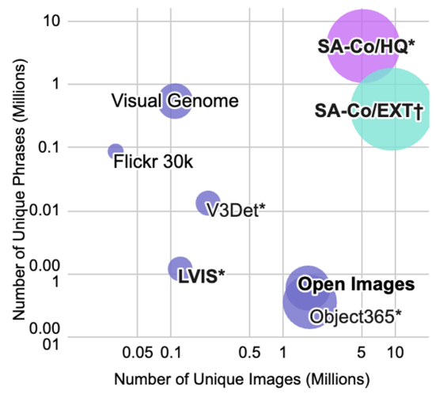


_(a)_


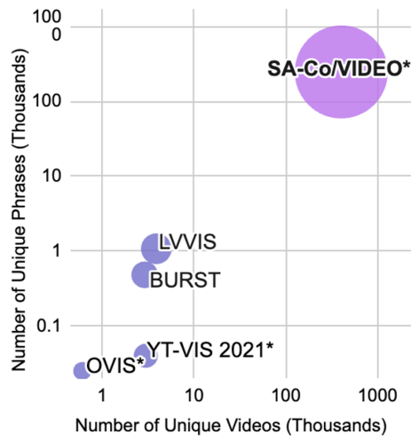


_(b)_


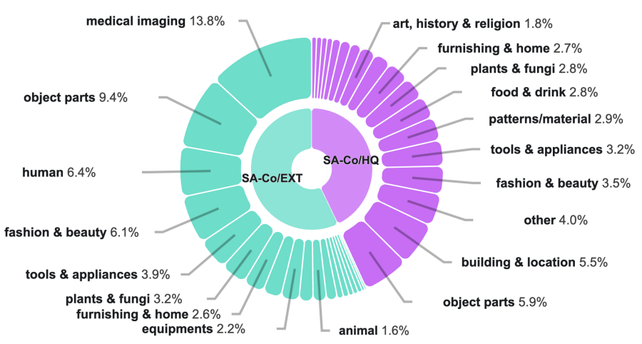


_(c)_


_图 12 (a) SAM 3 图像训练数据统计及与现有开源图像检测和实例分割数据集的比较。气泡大小表示 NP-掩码/边界框对的总数。加粗的数据集带有掩码标注，其他仅带有边界框。带有 * 的数据集是详尽标注的，带有 † 的数据集是部分详尽标注的。(b) SAM 3 视频训练数据统计及与现有开源视频实例分割数据集的比较。气泡大小表示 NP-掩码片段对的总数。带有 * 的数据集是详尽标注的。(c) SA-Co/HQ 和 SA-Co/EXT 中 SA-Co 本体顶层类别之间的实例掩码分布。SA-Co/EXT 包含了几个医学和显微镜图像数据集，除了表 20 中的类别外，我们将它们归类在医学成像下。_

---

<table><tr><td>数据集</td><td># NPs</td><td># 图像</td><td># 图像-NP</td><td>% 负样本</td><td># NP-bbox</td><td># NP-mask</td><td># masks per pair</td></tr><tr><td>Flickr 30k</td><td>86.4K</td><td>30.1K</td><td>193.0K</td><td>-</td><td>312.2K</td><td>-</td><td>-</td></tr><tr><td>LVIS*</td><td>1.2K</td><td>120.0K</td><td>1.6M</td><td>72.7%</td><td>1.5M</td><td>1.5M</td><td>3.51</td></tr><tr><td>V3Det*</td><td>13.2K</td><td>213.2K</td><td>737.7K</td><td>-</td><td>1.6M</td><td>-</td><td>-</td></tr><tr><td>Visual Genome</td><td>542.6K</td><td>108.1K</td><td>4.3M</td><td>-</td><td>6.3M</td><td>-</td><td>-</td></tr><tr><td>Open Images</td><td>600</td><td>1.7M</td><td>4.1M</td><td>-</td><td>13.3M</td><td>2.7M</td><td>2.79</td></tr><tr><td>Object365*</td><td>365</td><td>1.7M</td><td>10.1M</td><td>-</td><td>22.9M</td><td>-</td><td>-</td></tr><tr><td>SA-Co/HQ*</td><td>4.0M</td><td>5.2M</td><td>146.1M</td><td>88.5%</td><td>52.3M</td><td>52.3M</td><td>3.10</td></tr><tr><td>SA-Co/EXT†</td><td>497.4K</td><td>9.3M</td><td>136.6M</td><td>71.8%</td><td>70.5M</td><td>70.5M</td><td>1.83</td></tr><tr><td>SA-Co/SYN*</td><td>38.0M</td><td>39.4M</td><td>1.7B</td><td>74.0%</td><td>1.4B</td><td>1.4B</td><td>3.17</td></tr></table>


_表 24 图像训练数据集的详细统计数据，并与现有的开源图像检测和实例分割数据集进行比较。带有 * 的数据集是穷尽式标注的，带有 † 的数据集是部分穷尽式标注的。% Negatives 表示为负样本的图像-NP的百分比。_


<table><tr><td>数据集</td><td># NPs</td><td># 视频</td><td># 视频-NP</td><td>% 负样本</td><td># NP-masklet</td><td># masklets per pair</td></tr><tr><td>OVIS*</td><td>25</td><td>607</td><td>886</td><td>-</td><td>3.6K</td><td>4.04</td></tr><tr><td>YTVIS 2021*</td><td>40</td><td>3.0K</td><td>3.9K</td><td>-</td><td>6.3K</td><td>1.61</td></tr><tr><td>BURST</td><td>482</td><td>2.9K</td><td>6.9K</td><td>-</td><td>16.0K</td><td>2.33</td></tr><tr><td>LVVIS</td><td>1.2K</td><td>3.9K</td><td>13.8K</td><td>-</td><td>19.7K</td><td>1.40</td></tr><tr><td>SA-Co/VIDEO*</td><td>24.8K</td><td>52.5K</td><td>134.3K</td><td>26.7%</td><td>467.1K</td><td>4.75</td></tr></table>


_表 25 视频训练数据集的详细统计数据，并与现有的开源视频实例分割数据集进行比较。带有 * 的数据集是穷尽式标注的。% Negatives 表示为负样本的视频-NP的百分比。_


# E.2 SA-Co 评估基准


我们创建了“分割任何概念”（Segment Anything with Concepts，SA-Co）基准，用于评估图像和视频中的可提示概念分割（PCS）。我们的基准包含与文本标签配对的图像和视频，每个标签都在所有匹配该标签的对象实例上穷尽式标注了掩码。该数据集是联邦式的，这意味着并非所有图像都标注了所有标签，而是每张图像仅验证了少数正样本和负样本标签作为真值。我们添加了大量具有挑战性的困难负样本标签标注，以测试模型处理大型开放词汇的能力。具体而言，与现有的穷尽式标注掩码数据集 LVIS-test 相比，SA-Co/Gold 基准包含的独特短语数量多出约 $\sim 50\times$。SA-Co 基准涵盖了多样化的子领域，包括常见物体、细粒度概念、食物、艺术、机器人技术等。有关基准的详细统计数据，请参见表 28；有关子领域列表及其原始来源，请参见表 27。


具体而言，SA-Co/Gold 基准包含七个子领域，如图 14 和表 27 所示，旨在测试概念和图像分布的不同方面：


<table><tr><td>SA-Co/HQ</td><td>SA-Co/SYN</td><td>SA-Co/EXT</td><td>SA-Co/VIDEO</td><td>SA-Co/VIDEO-EXT</td></tr><tr><td>MetaCLIP (Xu et al., 2024b,a)</td><td>MetaCLIP</td><td>Objects365 (Shao et al., 2019)</td><td>SA-V (Ravi et al., 2024)</td><td>DAVIS2017 (Pont-Tuset et al., 2017b)</td></tr><tr><td>SA-1B (Kirillov et al., 2023)</td><td></td><td>OpenImages (Kuznetsova et al., 2020)</td><td>SA-V internal (Ravi et al., 2024)</td><td>MOSEv2 (Ding et al., 2025)</td></tr><tr><td>Armbench (Mitash et al., 2023)</td><td></td><td>ImageNet (Russakovsky et al., 2015)</td><td>YT-Temporal-1B (Zellers et al., 2022)</td><td>YTVOS2019 (Xu et al., 2018)</td></tr><tr><td>National Gallery of Art (National Gallery of Art)</td><td></td><td>VisualGenome (Krishna et al., 2017)</td><td>SA-FARI (SA-FARI Dataset)</td><td></td></tr><tr><td>Ego4d (Grauman et al., 2022)</td><td></td><td>Sapiens Body-Parts (Khirodkar et al., 2024)</td><td></td><td></td></tr><tr><td>MyFoodRepo-273 (Mohanty et al., 2021)</td><td></td><td>EDEN (Le et al., 2021)</td><td></td><td></td></tr><tr><td>GeoDE (Ramaswamy et al., 2023)</td><td></td><td>Fashionpedia (Jia et al., 2020)</td><td></td><td></td></tr><tr><td>DROID (Khazatsky et al., 2024)</td><td></td><td>Fathomnet (Katija et al., 2021)</td><td></td><td></td></tr><tr><td>BDD100k (Yu et al., 2020)</td><td></td><td>iNaturalist-2017 (Horn et al., 2017)</td><td></td><td></td></tr><tr><td>SA-V (Ravi et al., 2024)</td><td></td><td>BDD100k (Yu et al., 2020)</td><td></td><td></td></tr><tr><td>SA-V internal (Ravi et al., 2024)</td><td></td><td>Livecell (Edlund et al., 2021)</td><td></td><td></td></tr><tr><td>YT-Temporal-1B (Zellers et al., 2022)</td><td></td><td>PanNuke (Gamper et al., 2019, 2020)</td><td></td><td></td></tr><tr><td></td><td></td><td>MedSAM2 (Ma et al., 2025)</td><td></td><td></td></tr><tr><td></td><td></td><td>SNOW (Ding et al., 2023)</td><td></td><td></td></tr><tr><td></td><td></td><td>Visdrone (Zhu et al., 2021)</td><td></td><td></td></tr><tr><td></td><td></td><td>WCS Camera Traps (LILA BC)</td><td></td><td></td></tr><tr><td></td><td></td><td>HierText (Long et al., 2023, 2022)</td><td></td><td></td></tr><tr><td></td><td></td><td>FSC-147 (Ranjan et al., 2021)</td><td></td><td></td></tr></table>


_表 26 用于构建每个 SA-Co 训练子集的媒体池。每个领域及其标注的示例请参见图 13 以及图 15 至 18。_

---

---

**MetaCLIP** MetaCLIP 图像（网络抓取）标注了由字幕生成器提议的名词短语。

- **SA-1B** SA-1B 图像（库存照片，单张图像包含的对象多于 MetaCLIP）标注了由字幕生成器提议的名词短语。

- **Attributes（属性）** MetaCLIP 图像标注了属性短语。为了更好地测试对属性的理解，我们还标注了交换了名词的短语，例如 “pink rose” $\rightarrow$ “pink flamingo”，以及交换了形容词的短语，例如 “pink rose” $\rightarrow$ “red rose”。

- **Crowded Scenes（拥挤场景）** 筛选出的 SA-1B 图像，用于选择非常拥挤的场景，标注了由 MLLM 提议的名词短语。

- **Wiki-Common** MetaCLIP 图像标注了对应于 SA-Co 本体中 1K 个节点的标签，这些节点由 LLM 判定为常见概念。这些概念旨在将词汇量扩展到像 “car” 这样的高频词汇之外，但仍然能被非专业人士识别，例如 “Jeep”（吉普车）、“bunk bed”（双层床）、“ballot box”（投票箱）。

- **Wiki-Food&Drink** MetaCLIP 图像标注了对应于 SA-Co 本体中 Food&Drink 分支节点的标签。许多是非常细粒度的概念，如 “kefir”（开菲尔）、“pastille”（润喉糖）。

- **Wiki-Sports Equipment** MetaCLIP 图像标注了对应于 SA-Co 本体中 Sports Equipment 分支节点的标签，包含许多细粒度概念，如 “kettlebell”（壶铃）。

上述所有子领域也包含大量困难负样本标注，见表 28。

<table><tr><td>SA-Co/Gold</td><td>SA-Co/Silver</td><td>SA-Co/Bronze</td><td>SA-Co/Bio</td><td>SA-Co/VEval</td></tr><tr><td>MetaCLIP</td><td>BDD100k</td><td>BDD100k</td><td>Livecell</td><td>SA-V</td></tr><tr><td>SA-1B</td><td>DROID</td><td>EDEN</td><td>PanNuke</td><td>YT-Temporal-1B</td></tr><tr><td>Attributes (MetaCLIP)</td><td>Ego4D</td><td>Fashionpedia</td><td>MedSAM2</td><td>SmartGlasses</td></tr><tr><td>Crowded Scenes (SA-1B)</td><td>MyFoodRepo-273</td><td>Visdrone</td><td>SNOW</td><td></td></tr><tr><td>Wiki-Common (MetaCLIP)</td><td>GeoDE</td><td>WCS Camera Traps</td><td></td><td></td></tr><tr><td>Wiki-Food&amp;Drink (MetaCLIP)</td><td>iNaturalist-2017</td><td></td><td></td><td></td></tr><tr><td>Wiki-Sports Equipment (MetaCLIP)</td><td>National Gallery of Art SA-V</td><td></td><td></td><td></td></tr><tr><td></td><td>YT-Temporal-1B</td><td></td><td></td><td></td></tr><tr><td></td><td>Fathomnet</td><td></td><td></td><td></td></tr></table>


_表 27 每个 SA-Co 评估基准子集中的领域。关于每个领域和标注的示例，请参见图 13、14 以及 16 至 18。_


<table><tr><td>数据集</td><td># NPs</td><td># 图像</td><td># 图像-NP</td><td>% 负样本</td><td># NP-掩码</td><td>% 0-shot NPs</td></tr><tr><td>LVIS test</td><td>1.2K</td><td>19.8K</td><td>-</td><td>-</td><td>-</td><td>-</td></tr><tr><td>COCO test2017</td><td>80</td><td>40.7K</td><td>-</td><td>-</td><td>-</td><td>-</td></tr><tr><td>ODinW-35 test</td><td>290</td><td>15.6K</td><td>26.1K</td><td>-</td><td>131.1K</td><td>-</td></tr><tr><td>SA-Co/Gold</td><td>51.8K</td><td>15.8K</td><td>168.9K</td><td>84.4%</td><td>126.9K</td><td>6.98%</td></tr><tr><td>SA-Co/Silver</td><td>54.6K</td><td>66.1K</td><td>1.8M</td><td>94.0%</td><td>219.8K</td><td>8.00%</td></tr><tr><td>SA-Co/Bronze</td><td>105.3K</td><td>32.5K</td><td>1.0M</td><td>84.9%</td><td>261.5K</td><td>57.25%</td></tr><tr><td>SA-Co/Bio</td><td>166</td><td>5.4K</td><td>35.9K</td><td>71.8%</td><td>264.6K</td><td>-</td></tr><tr><td colspan="7">(a)</td></tr><tr><td>数据集</td><td># NPs</td><td># 视频</td><td># 视频-NP</td><td>% 负样本</td><td># NP-掩码片段</td><td>% 0-shot NPs</td></tr><tr><td>LVVIS test</td><td>1.2K</td><td>908</td><td>-</td><td>-</td><td>5.7K</td><td>-</td></tr><tr><td>BURST test</td><td>482</td><td>1.4K</td><td>3.4K</td><td>-</td><td>8.0K</td><td>-</td></tr><tr><td>SA-Co/VEval</td><td>5.2K</td><td>1.7K</td><td>10.3K</td><td>75.4%</td><td>11.2K</td><td>6.37%</td></tr></table>


_(b)_


_表 28 (a) SA-Co 图像评估基准按子集划分的汇总统计，以及与现有图像实例分割基准的对比。(b) SA-Co/VEval 基准的汇总统计以及视频实例分割基准的对比。% 负样本表示为负样本的 Image-NPs 或 Video-NPs 的百分比。报告了每个子集中零样本 NPs 的百分比。零样本 NP 定义为在 SA-Co/HQ、SA-Co/EXT 和 SA-Co/VIDEO 的合并集中未出现过的短语。_

---

---

# E.3 评估指标

我们引入了分类门控 $ F1 $（$ \mathrm{cgF}_1 $）来评估图像上的 PCS 任务。传统的 AP（平均精度）指标是为闭集检测任务（例如 COCO）设计的，当应用于具有极大标签空间的开集检测时会失效。虽然对 80 个类别的 AP 进行平均是可行的，但在面对数万个类别时，大多数类别在测试集中仅出现一次，导致平均值主要由噪声主导。为所有标签计算完整的精确率-召回率曲线在计算上也是不可行的，并且对于实际用例而言并非必要。AP 也不考虑模型的校准，这意味着高分模型在实际应用中可能难以使用。固定置信度阈值下的 F1 分数是一个很好的替代方案，但它对高比例的负样本标注很敏感：对于负样本正确地预测为“无”不会给予额外奖励，但预测为假阳性会降低分数。

为了解决这些问题，我们为 PCS 任务设计了新的指标。给定由预测值和真值组成的、包含（媒体，短语，掩码）三元组的数据点，我们计算以下指标以分别衡量定位和分类性能：


- **定位**。我们仅对至少有一个真实掩码的正样本数据点进行测量。对于一个样本，假设我们有 $N$ 个预测掩码 $m_{1}, \dots, m_{N}$ 和 $M$ 个真实掩码 $\hat{m}_{1}, \dots, \hat{m}_{M}$。我们计算 IoU 矩阵 $\mathrm{iou}_{i,j} = \mathrm{iou}(m_{i}, \hat{m}_{j})$，然后推导出最优二分匹配 $\hat{\sigma} = \operatorname{argmax}_{\sigma} \sum_{i} \mathrm{iou}_{i,\sigma(i)}$。我们固定一个 IoU 阈值 $\tau$，然后对于每一个预测 $i$，如果它被匹配且 $\mathrm{iou}_{i,\sigma(i)} \geq \tau$，则计为 TP（真正例），否则为 FP（假正例）。未被匹配的真实值计为 FN（假负例）。我们为每个数据点计算 $\mathrm{F}_1^\tau = \frac{2\mathrm{TP}^\tau}{2\mathrm{TP}^\tau + \mathrm{FP}^\tau + \mathrm{FN}^\tau}$，称为局部 F1 分数。我们在所有至少有一个真实掩码的数据点上累加 TP、FP 和 FN 的计数，并计算“正样本微平均 F1”分数 $\mathrm{pmF}_1^\tau$。我们计算所有 $\tau \in [0.5, 0.95]$（步长为 0.05）的 $\mathrm{pmF}_1^\tau$，然后取平均值得到最终的 $\mathrm{pmF}_1$：


$$
\mathrm {p m F} _ {1} ^ {\tau} = \frac {2 \mathrm {T P} _ {t o t a l} ^ {\tau}}{2 \mathrm {T P} _ {t o t a l} ^ {\tau} + \mathrm {F P} _ {t o t a l} ^ {\tau} + \mathrm {F N} _ {t o t a l} ^ {\tau}}, \quad p m F _ {1} = \frac {1}{1 0} \sum_ {\tau \in \mathrm {n p . l i n s p a c e (0 . 5 , 0 . 9 5 , 1 0)}} \mathrm {p m F} _ {1} ^ {\tau}. \qquad (1)
$$


我们还计算所有至少有一个真实掩码的数据点上的局部 F1 分数的平均值，得到“正样本宏平均 F1”分数。我们在评分图表中同时报告正样本微平均和宏平均 F1 分数，并选择正样本微平均分数 $\mathrm{pmF}_1$ 作为定位的主要指标。

- **分类**。该指标取值范围为 $[-1, 1]$，用于衡量模型当且仅当数据点为正样本时预测一个或多个掩码的能力。这可以看作是图像级别的二分类预测任务（“物体是否存在？”），关键在于，在这个指标中我们不关心预测掩码的质量。如果数据点是正样本，且模型预测了任意掩码（置信度大于 0.5），则计为 IL_TP（图像级真正例），否则为 IL_FN。如果数据点是负样本，且模型预测了任意掩码，则计为 IL_BP（图像级假正例），否则为 IL_TN。我们将该混淆矩阵总结为单一指标，并使用马修斯相关系数（MCC）来衡量潜在的失衡：


$$
\mathrm {I L \_ M C C} = \frac {\mathrm {I L \_ T P} \cdot \mathrm {I L \_ T N} - \mathrm {I L \_ F P} \cdot \mathrm {I L \_ F N}}{\sqrt {(\mathrm {I L \_ T P} + \mathrm {I L \_ F P}) \cdot (\mathrm {I L \_ T P} + \mathrm {I L \_ F N}) \cdot (\mathrm {I L \_ T N} + \mathrm {I L \_ F P}) \cdot (\mathrm {I L \_ T N} + \mathrm {I L \_ F N})}}. (2)
$$


作为我们的主要指标，我们结合这两个指标来计算 $\mathrm{cgF}_1$（“分类门控 F1”），定义为


$$
\mathrm {c g F} _ {1} = 1 0 0 \cdot \mathrm {p m F} _ {1} \cdot \mathrm {I L \_ M C C}. \tag {3}
$$


PCS 任务在许多情况下相当模糊，为了缓解这个问题，我们的 SA-Co/Gold 子集包含每个数据点的三个独立真实标注。为了适应我们的指标，我们使用了一种神谕设置，即将模型的预测与每个数据点的每个真实标注进行比较，并选择产生最佳局部 F1 分数的那一个。

# E.4 SA-Co 上的人类表现

如 §2 所述，PCS 任务本质上是模糊的。给定一个图像-NP 或视频-NP 对，即使是受过训练的标注员也可能有不同的解释，且这些解释都是有效的。当短语模糊时，标注员

---

<table><tr><td rowspan="2"></td><td colspan="3">SA-Co/Gold</td><td colspan="8">SA-Co/VEval</td></tr><tr><td colspan="3">3-Reviewed Subset</td><td colspan="4">YT-Temporal-1B test</td><td colspan="4">SmartGlasses test</td></tr><tr><td>Evaluation Protocol</td><td>cgF1</td><td>IL_MCC</td><td>pmF1</td><td>cgF1</td><td>pHOTA</td><td>pDetA</td><td>pAssA</td><td>cgF1</td><td>pHOTA</td><td>pDetA</td><td>pAssA</td></tr><tr><td>Oracle</td><td>76.2</td><td>0.99</td><td>77.0</td><td>85.1</td><td>88.4</td><td>84.7</td><td>92.6</td><td>73.5</td><td>83.1</td><td>75.4</td><td>92.0</td></tr><tr><td>Random Pair</td><td>55.5</td><td>0.87</td><td>63.4</td><td>75.9</td><td>82.0</td><td>73.8</td><td>91.3</td><td>53.4</td><td>70.2</td><td>54.9</td><td>90.2</td></tr></table>


_表 29 SA-Co 基准上 Oracle（最优）和 Random Pair（随机对）协议之间的人类实例分割性能比较。该比较展示了基准中具有三个人类标注的子集上的结果。_


甚至在 NP（名词短语）是否存在这一点上也可能存在分歧。因此，在 SA-Co 基准上进行评估时，与真值不一致并不一定意味着预测是错误的。为此，研究 PCS 任务上的人类水平性能（即熟练标注员之间的一致性）非常重要，以便于解释模型性能。


SA-Co/Gold 上的人类性能。在图像基准上，我们提供了由不同标注员完成的三组标注。图 14 展示了基准中每个域的每个（短语，图像）对的三次独立标注的示例。这些标注是从零开始完成的，这意味着标注员在创建掩码（使用 SAM 1）时没有看到任何 SAM 3 模型的解释。我们定义了“Oracle”指标如下，以衡量人类性能的上限。对于每个图像-NP，通过最大化局部 F1 分数或在局部 F1 分数持平的情况下最小化假阴性（FN）和假阳性（FP）之和，从所有三对标注中选择最佳对。然后，我们使用一个标注作为真值，另一个作为预测，根据这些选定的最佳对报告 $\mathrm{cgF}_1$ 指标。为了使模型性能具有可比性，“Oracle”模型性能是通过将模型预测与所有三组标注进行比较并选择最佳对来计算的。


作为“Oracle”协议的替代方案，人类性能也可以在随机选择的对上进行测量。具体而言，我们采用以下协议来计算具有三组标注的 SA-Co 基准上的“Random Pair”人类性能：1) 为每个图像/视频-NP 随机选择一对标注，然后聚合所有图像/视频-NP 以获得指标值，2) 重复该过程一千次并报告每个指标的 0.5 分位数。如表 29 所示，在图像和视频基准上，Oracle 和 Random Pair 性能之间存在明显差距，这表明 PCS 任务本质上具有歧义性。


图像基准包含大量困难负样本。这些短语经过了人工验证，但由于数据量巨大，在整个数据集上收集三组人类标注成本过高，因此负例名词短语只有一个真值标签。这些短语上的人类性能是通过在短语子样本上收集额外的人类标注并将其与初始标注（即真值）进行比较来估算的。具体而言，我们在 SA-Co/Gold 的每个域中收集了约一千个图像-NP 的额外人类标注。由于真值均为负例，这些短语仅贡献于 IL_MCC 指标。我们计算这些样本上的 IL_TN 和 IL_FP 计数，然后将这些结果外推以估算整个困难负样本集的相应计数。然后将这些估算的计数与基准其余部分（其中 NP 有三个标注）的图像级计数相结合，以获得最终的 IL_MCC。


通常，我们的标注协议允许标注员在不确定时将 NP 标记为歧义。在这次针对困难负样本的额外人工审查中，我们移除了不确定选项，并提示他们在正例和负例之间做出选择，从而减少可能由歧义数据引起的不确定性和潜在偏差。


SA-Co/VEval 上的人类性能。标注视频比静态图像昂贵得多，因此我们在视频基准上每个 NP 只收集了一组标注。为了保证标注质量，这些真值标注经过了多轮人工细化。为了以一种与视频 PCS 中的模型评估直接可比的方式衡量人类性能，我们在所有子域的测试集中的每个 NP 收集了一个额外的从零开始的人类标注。然后，通过将此额外标注与真值进行比较，使用与模型评估相同的指标（$\mathrm{cgF}_1$ 和 pHOTA）来报告视频 PCS 任务上的人类性能。

---

此外，为了研究随机配对和 Oracle 协议之间的差距，我们在 SA-Co/VEval 数据集的 YT-Temporal-1B 和 SmartGlasses 测试集上额外收集了两组人工标注（总共三组）。这使我们能够验证图像领域中观察到的差距在视频领域中也同样存在（见表 29）。

# E.5 额外数据集示例

图 13 和图 15 至图 18 展示了我们图像和视频数据集中每个视觉领域的示例。图 14 展示了我们 SA-Co/Gold 评估基准中的领域以及每个样本的三组独立标注。图 19 展示了我们合成数据集 SA-Co/SYN 中的一张示例图片，其中图注中包含其正向名词短语，图片中包含其负向名词短语。

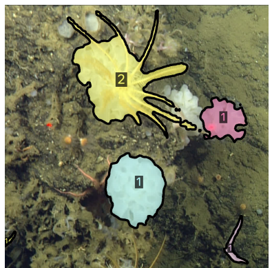


_Farrea Crinoidea Farrea occa Asbestopluma_


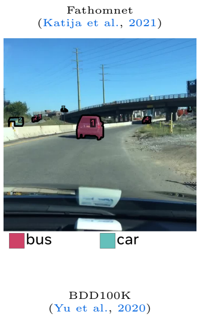


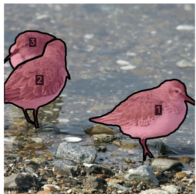


_Calidris alpina_


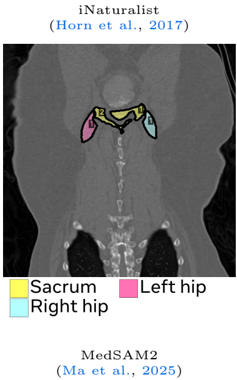


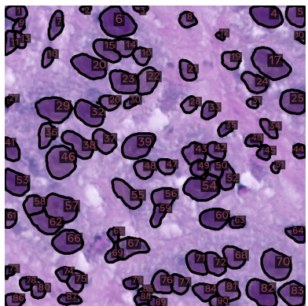


_Cell_


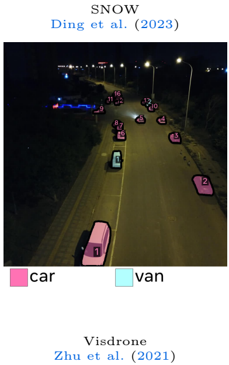


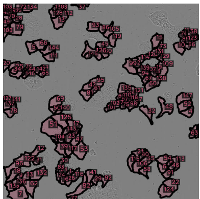


_Cell_


_Livecell (Edlund et al., 2021)_


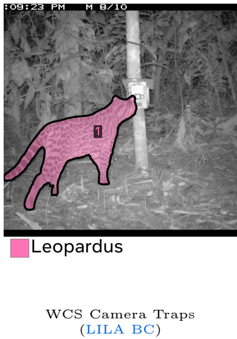


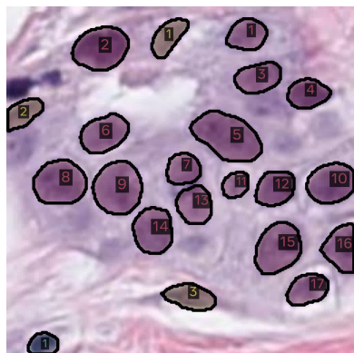


_Neoplastic Cell Connective Cell Inflammatory Cell_


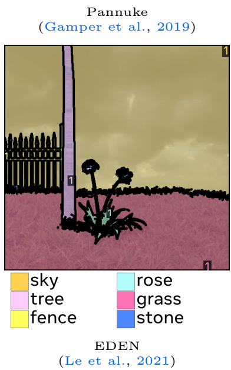


_图 13 SA-Co/EXT 中各领域的示例。展示了标注短语及叠加的掩码。_

---

---


_图 14 我们 SA-Co/Gold 基准中的标注。每一行展示了来自七个领域之一的示例（图像，名词短语）对，并叠加了三位独立标注者的掩码。没有掩码表示标注者判定该短语未出现在图像中。虚线边框表示覆盖了不止单个实例的特殊组掩码，用于在难以区分为单个实例时的情况。标注者有时会在精确的掩码边界、实例数量（例如，房屋、西兰花、脚蹼）或短语是否适用（Jeep）上存在分歧。我们使用这 3 组真值（GT）标注来衡量人类在该任务上的表现，以此作为模型性能的上限。_

---

---

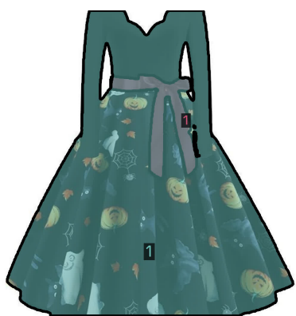


腰带


万圣节南瓜 ...


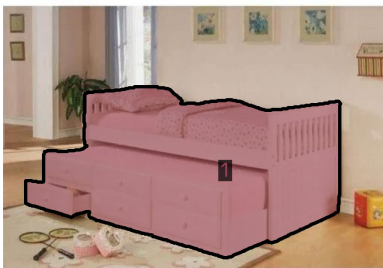


带脚轮的矮床


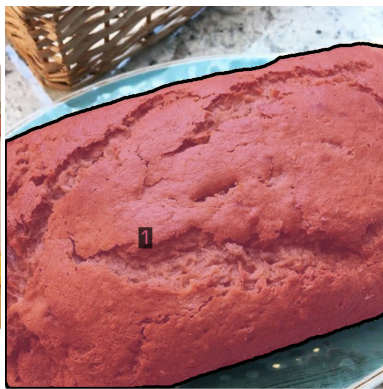


香蕉面包


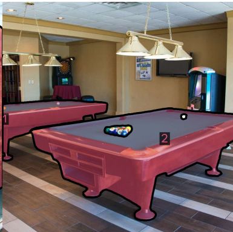


台球桌


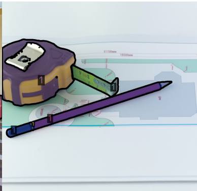


红色主体


卷尺


红铅笔


白色带状物


黑白黄相间的...


MetaCLIP 替代文本


(Xu et al., 2024b)


MetaCLIP 通用 WikiNodes


MetaCLIP 食品与饮料


MetaCLIP 体育器材


SA-1B


(Kirillov et al., 2023)


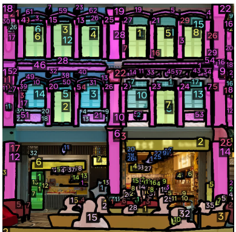


标志


嗡嗡声


#


风


庭院


I


药丸


衬衫


P


动物


雕刻品


背包


照明装置


自动售货机


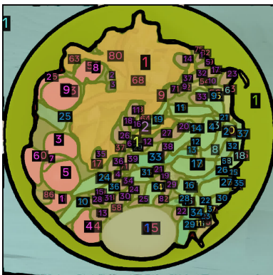


桌子


鸡蛋


塑料


番茄


配料


哈路米芝士


沙拉蔬菜


陶瓷制品


黄色碗


生番茄


南瓜籽


樱桃番茄


哈路米奶酪


各种配料


混合生菜


浅色木...


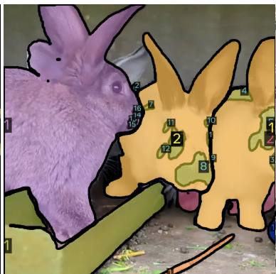


树枝


黑点


黑兔


灰兔


白兔


生锈的金属槽


一只带着...的白兔


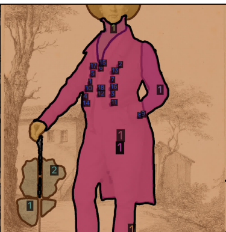


灌木


图画


绅士


左手


正装


男子的装束


白色领巾


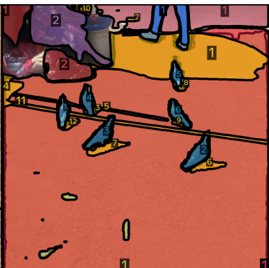


道路


一个人 一个影子


黑裤子


地面


鸽子


蓝色防水布


土路


泥土地面


SA-1B 拥挤场景


食物识别


2022 挑战赛


(Mohanty et al., 2021)


SA-V 内部数据


(Ravi et al., 2024)


国家美术馆


(National Gallery of Art)


SA-V


(Ravi et al., 2024)


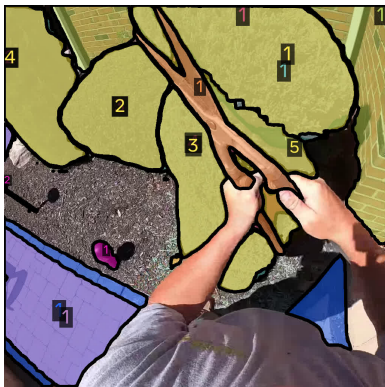


灌木


花园


黑光灯


砖砌小径


红砖房


浓密的绿色灌木


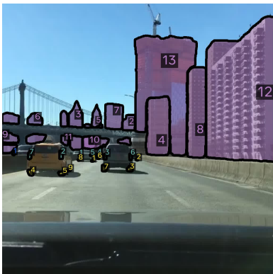


轮胎


建筑物


前灯


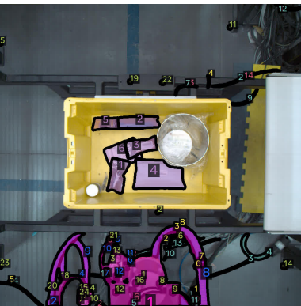


电线


夹子


机器


螺丝


包裹


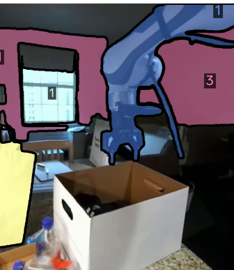


窗户


灰墙


机械臂


白色纸袋


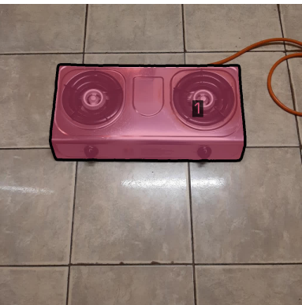


炉灶


Ego4d


(Grauman et al., 2022)


BDD100K


(Yu et al., 2020)


Armbench


(Mitash et al., 2023)


DROID


(Khazatsky et al., 2024)


GeoDE


(Ramaswamy et al., 2023)


_图 15 SA-Co/HQ 中各领域的示例。展示了标注短语和叠加的掩码。_

---

---


_图 16 SA-Co/VIDEO 和 SA-Co/VEval 数据集中 SA-V 媒体的标注示例。_

---

---

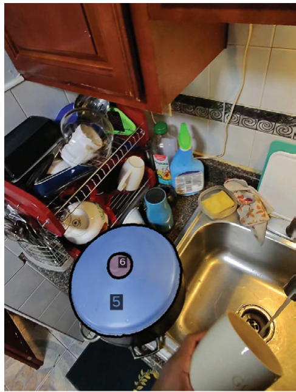


_银色盖子_


_黑色旋钮_


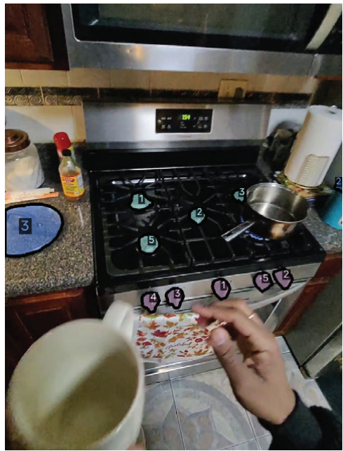


_黑色燃烧器_


_一张白纸_


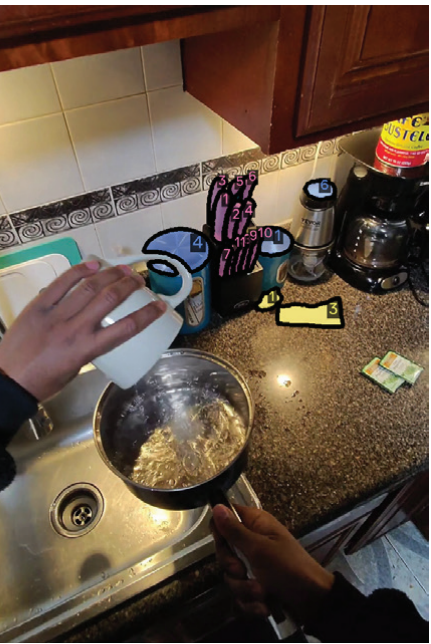


_一把蓝柄刀_


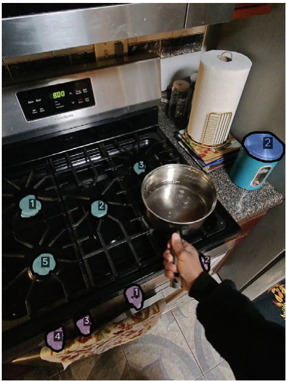


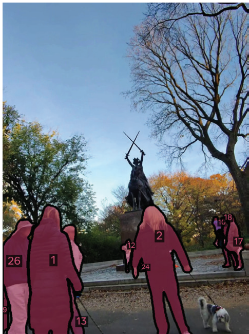


_一个人_


_图 17 SA-Co/VEval 数据集中智能眼镜媒体的标注示例。_


_白鼻浣熊_


_松鼠猴_


_图 18 SA-FARI 数据集的标注示例。_

---

---


_图 19 SA-Co/SYN 数据集中一张图像上的标注示例。该图像有 19 个正向名词短语，为了更好的可视化效果，我们将其分为 4 组进行展示。AI 验证器为每个名词短语分配了一个详尽性标签：绿色框内的名词短语表示该名词短语对应的掩码是详尽的，粉色框内的名词短语表示不详尽。该图像有 20 个经 AI 验证器核实并确认的负向名词短语：一根黑白相间的柱子、一根蓝黄相间的柱子、一辆大型红白卡车、一根橙黑相间的柱子、一艘大型橙白相间的船、一根绿红相间的柱子、那辆大型橙白相间的摩托车、那个橙白相间的护柱、一根紫黄相间的柱子、黄色饰带、马来西亚航空波音 737-800、展示车辆、赞博尼磨冰车、靴子、那个小型折叠纸包、一辆长黄色车辆、那个小型礼品包装包裹、小型拖车、消防战斗服、双座模型。_

---

---

# F 附加实验与细节


# F.1 图像上的名词短语 PCS


本节详细描述了表 1 中的实验。我们将我们的方法与 OWLv2 (Minderer et al., 2024)、GroundingDino (Liu et al., 2024a) 和 LLMDet (Fu et al., 2025) 进行了比较。由于它们仅生成边界框，我们使用 SAM 1 将其转换为掩码以评估分割性能。我们还与 APE (Shen et al., 2024) 和 DINO-X (Ren et al., 2025) 这两种最先进的分割模型进行了比较，最后还与通用大语言模型 Gemini 2.5 Flash (Comanici et al., 2025) 进行了比较。


我们在 LVIS (Gupta et al., 2019)、COCO (Lin et al., 2014)、COCO-O (Mao et al., 2023)、Cityscapes (Cordts et al., 2016)、ADE (Zhou et al., 2019) 和 Pascal Context (Mottaghi et al., 2014) 上报告了性能，并采用了它们的官方指标。对于 LVIS，我们报告 AP-fixed (Dave et al., 2022)。在我们新的 SA-Co 基准测试中，我们报告了所有划分的平均结果。我们报告 $\mathrm{cgF}_1$ 指标，除了 SA-Co/Bio 划分，我们报告 $\mathrm{pmF}_1$ 指标（该划分没有负样本，因此仅定位是有意义的）。在 SA-Co/Gold 上，每个数据点有三个真实标注，因此我们报告了 Oracle 指标和估算的人类性能（人类性能测量详见 §E.4）。为了使用 SAM 3 评估语义分割，我们为每个语义类别预测实例掩码，并使用存在分数、掩码分数和掩码面积过滤预测结果，从而为每张图像创建语义掩码。在表 34 中，我们在 ADE-150 (Zhou et al., 2019) 和 PC-459 (Mottaghi et al., 2014) 上包含了额外的语义分割评估。


我们使用了以下 Hugging Face 模型检查点：OWLv2 使用 “google/owlv2-large-patch14”，OWLv2\* 使用 “google/owlv2-large-patch14-ensemble”，gDino-T 使用 “IDEA-Research/grounding-dino-tiny”，LLMDet-L 使用 “iSEE-Laboratory/llmdet_large”。OWLv2\* 利用了在自训练后和在 LVIS 基础类上微调后的检查点权重的集成，相比仅进行微调，这展示了更好的开放世界泛化能力 (Minderer et al., 2024)。我们在表 30 中提供了所有基线、SAM 3 和人类在 SA-Co/Gold 上的实例分割各领域性能，在表 31 和表 32 中提供了 SA-Co/Silver 上的性能。我们还在表 9d 中包含了 AI 验证器消度研究的各领域性能。在表 33 中，我们使用 “IDEA-Research/grounding-dino-base” (gDino-B) 和 “iSEE-Laboratory/llmdet_base” (LLMDet-B) 与额外的基线进行了比较。


对于 OWLv2、GroundingDino 和 LLMDet，我们以 0.1 为间隔扫描检测阈值，并使用 LVIS 边界框检测任务的 $\mathrm{cgF}_1$ 指标确定最佳阈值。然后，我们在其余数据集上应用该阈值来计算边界框检测和实例分割任务的 $\mathrm{cgF}_1$。LLMDet-L、LLMDet-B 和 gDino-T 的检测阈值设置为 0.4；OWLv2\* 设置为 0.3；OWLv2 和 gDino-B 设置为 0.2。对于 DINO-X，我们发现检测阈值 0.5 能产生最佳的 $\mathrm{cgF}_1$ 指标。此外，我们发现对于给定图像，一次性提示多个名词短语比每次提示一个名词短语能显著提高 GroundingDino 和 LLMDet 的性能。例如，对于 SA-Co/Gold，我们使用 30 个提示来提示 GroundingDino 和 LLMDet；对于 SA-Co/Silver、SA-Co/Bronze 和 SA-Co/Bio，则使用 20 个提示。


对于 Gemini 2.5 Flash，我们通过 Gemini API 运行推理。对于每个（图像，文本查询）对，我们使用与 Gemini Flash 2.5 图像分割演示中相同的提示模板 (Paul Voigtlaender, Valentin Gabeur and Rohan Doshi, 2025) 和相同的生成设置来提示 Gemini 2.5。此外，如果在生成过程中出现任何错误，或者将结果解析为一组掩码和边界框时出现问题，我们会多次提示模型。


<table><tr><td></td><td colspan="3">平均</td><td colspan="3">Metaclip</td><td colspan="3">SA-1B</td><td colspan="3">Crowded</td><td colspan="3">Food&amp;Drink</td><td colspan="3">Sports Equip.</td><td colspan="3">Attributes</td><td colspan="3">Wiki-Common</td></tr><tr><td></td><td>cgF1</td><td>IL_MCC</td><td>pmF1</td><td>cgF1</td><td>IL_MCC</td><td>pmF1</td><td>cgF1</td><td>IL_MCC</td><td>pmF1</td><td>cgF1</td><td>IL_MCC</td><td>pmF1</td><td>cgF1</td><td>IL_MCC</td><td>pmF1</td><td>cgF1</td><td>IL_MCC</td><td>pmF1</td><td>cgF1</td><td>IL_MCC</td><td>pmF1</td><td>cgF1</td><td>IL_MCC</td><td>pmF1</td></tr><tr><td>gDino-T</td><td>3.3</td><td>0.15</td><td>16.2</td><td>2.9</td><td>0.21</td><td>13.9</td><td>3.1</td><td>0.20</td><td>15.4</td><td>0.28</td><td>0.08</td><td>3.4</td><td>0.96</td><td>0.10</td><td>9.8</td><td>1.1</td><td>0.10</td><td>11.2</td><td>13.8</td><td>0.29</td><td>47.3</td><td>0.70</td><td>0.06</td><td>12.1</td></tr><tr><td>OWLv2*</td><td>24.6</td><td>0.57</td><td>42.0</td><td>17.7</td><td>0.52</td><td>34.3</td><td>13.3</td><td>0.50</td><td>26.8</td><td>15.8</td><td>0.51</td><td>30.7</td><td>32.0</td><td>0.65</td><td>49.4</td><td>36.0</td><td>0.64</td><td>56.2</td><td>35.6</td><td>0.63</td><td>56.2</td><td>21.7</td><td>0.54</td><td>40.3</td></tr><tr><td>OWLv2</td><td>17.3</td><td>0.46</td><td>36.8</td><td>12.2</td><td>0.39</td><td>31.3</td><td>9.8</td><td>0.45</td><td>21.7</td><td>8.9</td><td>0.36</td><td>24.8</td><td>24.4</td><td>0.51</td><td>47.9</td><td>24.4</td><td>0.52</td><td>47.0</td><td>25.9</td><td>0.54</td><td>48.2</td><td>15.4</td><td>0.42</td><td>36.6</td></tr><tr><td>LLMDet-L</td><td>6.5</td><td>0.21</td><td>27.3</td><td>4.5</td><td>0.23</td><td>19.4</td><td>5.3</td><td>0.23</td><td>22.8</td><td>2.4</td><td>0.18</td><td>13.7</td><td>5.5</td><td>0.19</td><td>29.1</td><td>4.4</td><td>0.17</td><td>25.3</td><td>22.2</td><td>0.39</td><td>57.1</td><td>1.2</td><td>0.05</td><td>23.3</td></tr><tr><td>APE-D</td><td>16.4</td><td>0.40</td><td>36.9</td><td>12.6</td><td>0.42</td><td>30.1</td><td>2.2</td><td>0.22</td><td>10.0</td><td>7.2</td><td>0.35</td><td>20.3</td><td>22.7</td><td>0.51</td><td>45.0</td><td>31.8</td><td>0.56</td><td>56.5</td><td>26.7</td><td>0.47</td><td>57.3</td><td>11.6</td><td>0.29</td><td>39.5</td></tr><tr><td>DINO-X</td><td>21.3</td><td>0.38</td><td>55.2</td><td>17.2</td><td>0.35</td><td>49.2</td><td>19.7</td><td>0.48</td><td>40.9</td><td>12.9</td><td>0.34</td><td>37.5</td><td>30.1</td><td>0.49</td><td>61.7</td><td>28.4</td><td>0.41</td><td>69.4</td><td>31.0</td><td>0.42</td><td>74.0</td><td>9.7</td><td>0.18</td><td>53.5</td></tr><tr><td>Gemini 2.5</td><td>13.0</td><td>0.29</td><td>46.1</td><td>9.9</td><td>0.29</td><td>33.8</td><td>13.1</td><td>0.41</td><td>32.1</td><td>8.2</td><td>0.27</td><td>30.3</td><td>19.6</td><td>0.33</td><td>59.5</td><td>15.1</td><td>0.28</td><td>53.5</td><td>18.8</td><td>0.30</td><td>63.1</td><td>6.5</td><td>0.13</td><td>50.3</td></tr><tr><td>SAM 3</td><td>54.1</td><td>0.82</td><td>66.1</td><td>47.3</td><td>0.81</td><td>58.6</td><td>53.7</td><td>0.86</td><td>62.6</td><td>61.1</td><td>0.9</td><td>67.7</td><td>53.4</td><td>0.79</td><td>67.3</td><td>65.5</td><td>0.89</td><td>73.8</td><td>54.9</td><td>0.76</td><td>72.0</td><td>42.5</td><td>0.70</td><td>60.9</td></tr><tr><td>Human</td><td>72.8</td><td>0.94</td><td>77.0</td><td>64.1</td><td>0.94</td><td>68.5</td><td>64.3</td><td>0.97</td><td>66.6</td><td>70.4</td><td>0.94</td><td>75.3</td><td>78.3</td><td>0.96</td><td>81.2</td><td>80.4</td><td>0.97</td><td>83.1</td><td>80.2</td><td>0.95</td><td>84.4</td><td>71.6</td><td>0.89</td><td>80.1</td></tr></table>


_表 30 SA-Co/Gold 上实例分割的各领域结果。$\star$：在 LVIS 上经过部分训练。_

---

<table><tr><td></td><td colspan="3">平均</td><td colspan="3">BDD100k</td><td colspan="3">DROID</td><td colspan="3">Ego4D</td><td colspan="3">MyFoodRepo-273</td><td colspan="3">GeoDE</td></tr><tr><td></td><td>cgF1</td><td>IL_MCC</td><td>pmF1</td><td>cgF1</td><td>IL_MCC</td><td>pmF1</td><td>cgF1</td><td>IL_MCC</td><td>pmF1</td><td>cgF1</td><td>IL_MCC</td><td>pmF1</td><td>cgF1</td><td>IL_MCC</td><td>pmF1</td><td>cgF1</td><td>IL_MCC</td><td>pmF1</td></tr><tr><td>gDino-T</td><td>2.7</td><td>0.12</td><td>16.6</td><td>2.2</td><td>0.17</td><td>12.7</td><td>3.6</td><td>0.15</td><td>23.8</td><td>2.4</td><td>0.10</td><td>23.6</td><td>0.52</td><td>0.05</td><td>10.3</td><td>10.5</td><td>0.24</td><td>43.8</td></tr><tr><td>OWLv2*</td><td>11.5</td><td>0.32</td><td>33.0</td><td>15.0</td><td>0.46</td><td>32.6</td><td>11.1</td><td>0.36</td><td>30.7</td><td>7.6</td><td>0.23</td><td>33.0</td><td>20.0</td><td>0.44</td><td>45.4</td><td>27.6</td><td>0.50</td><td>55.2</td></tr><tr><td>OWLv2</td><td>7.6</td><td>0.23</td><td>31.1</td><td>7.6</td><td>0.31</td><td>24.7</td><td>7.3</td><td>0.25</td><td>29.0</td><td>5.5</td><td>0.18</td><td>30.7</td><td>13.4</td><td>0.32</td><td>41.8</td><td>12.9</td><td>0.28</td><td>46.2</td></tr><tr><td>LLMDet-L</td><td>7.1</td><td>0.17</td><td>28.7</td><td>1.5</td><td>0.08</td><td>17.1</td><td>2.3</td><td>0.10</td><td>23.2</td><td>2.1</td><td>0.08</td><td>26.6</td><td>0.90</td><td>0.06</td><td>15.0</td><td>21.0</td><td>0.37</td><td>56.8</td></tr><tr><td>APE-D</td><td>7.3</td><td>0.24</td><td>24.5</td><td>6.7</td><td>0.32</td><td>20.9</td><td>8.9</td><td>0.30</td><td>29.6</td><td>6.3</td><td>0.23</td><td>27.9</td><td>7.0</td><td>0.26</td><td>26.5</td><td>26.9</td><td>0.47</td><td>57.5</td></tr><tr><td>Gemini 2.5</td><td>8.3</td><td>0.19</td><td>38.1</td><td>5.1</td><td>0.19</td><td>26.9</td><td>4.5</td><td>0.14</td><td>31.8</td><td>0.32</td><td>0.01</td><td>32.4</td><td>8.6</td><td>0.24</td><td>35.9</td><td>16.4</td><td>0.26</td><td>62.9</td></tr><tr><td>SAM 3</td><td>49.6</td><td>0.76</td><td>65.2</td><td>46.6</td><td>0.78</td><td>60.1</td><td>45.6</td><td>0.76</td><td>60.4</td><td>38.6</td><td>0.62</td><td>62.6</td><td>53.0</td><td>0.79</td><td>67.2</td><td>70.1</td><td>0.89</td><td>78.7</td></tr></table>


_表 31 SA-Co/Silver 上实例分割的各领域结果。 $\star$ ：在 LVIS 上部分训练过。_


<table><tr><td></td><td colspan="3">iNaturalist-2017</td><td colspan="3">国家艺术馆</td><td colspan="3">SA-V</td><td colspan="3">YT-Temporal-1B</td><td colspan="3">Fathomnet</td></tr><tr><td></td><td>cgF1</td><td>IL_MCC</td><td>pmF1</td><td>cgF1</td><td>IL_MCC</td><td>pmF1</td><td>cgF1</td><td>IL_MCC</td><td>pmF1</td><td>cgF1</td><td>IL_MCC</td><td>pmF1</td><td>cgF1</td><td>IL_MCC</td><td>pmF1</td></tr><tr><td>gDino-T</td><td>0.00</td><td>0.00</td><td>3.7</td><td>0.88</td><td>0.09</td><td>9.8</td><td>4.2</td><td>0.19</td><td>22.0</td><td>2.5</td><td>0.16</td><td>15.6</td><td>0.00</td><td>0.00</td><td>0.74</td></tr><tr><td>OWLv2*</td><td>5.6</td><td>0.14</td><td>40.3</td><td>6.7</td><td>0.31</td><td>21.7</td><td>11.5</td><td>0.32</td><td>35.8</td><td>9.9</td><td>0.38</td><td>26.2</td><td>0.07</td><td>0.01</td><td>9.3</td></tr><tr><td>OWLv2</td><td>3.3</td><td>0.10</td><td>33.2</td><td>5.8</td><td>0.25</td><td>23.1</td><td>10.8</td><td>0.32</td><td>33.6</td><td>9.9</td><td>0.35</td><td>28.3</td><td>-0.20</td><td>-0.01</td><td>20.7</td></tr><tr><td>LLMDet-L</td><td>32.7</td><td>0.46</td><td>71.2</td><td>1.8</td><td>0.13</td><td>13.7</td><td>5.0</td><td>0.19</td><td>26.3</td><td>3.2</td><td>0.16</td><td>20.0</td><td>0.65</td><td>0.04</td><td>16.9</td></tr><tr><td>APE-D</td><td>1.1</td><td>0.10</td><td>11.2</td><td>3.1</td><td>0.21</td><td>14.7</td><td>7.6</td><td>0.26</td><td>28.8</td><td>5.8</td><td>0.28</td><td>20.8</td><td>0.1</td><td>0.01</td><td>7.2</td></tr><tr><td>Gemini 2.5</td><td>26.6</td><td>0.36</td><td>74.0</td><td>5.6</td><td>0.20</td><td>27.8</td><td>7.4</td><td>0.22</td><td>33.8</td><td>6.9</td><td>0.23</td><td>29.9</td><td>2.1</td><td>0.08</td><td>25.6</td></tr><tr><td>SAM 3</td><td>65.8</td><td>0.82</td><td>80.7</td><td>38.1</td><td>0.66</td><td>57.6</td><td>44.4</td><td>0.67</td><td>66.1</td><td>42.1</td><td>0.72</td><td>58.4</td><td>51.5</td><td>0.86</td><td>60.0</td></tr></table>


_表 32 SA-Co/Silver 上实例分割的各领域结果（续）。 $\star$ ：在 LVIS 上部分训练过。_


# F.2 视觉示例与交互性


在表 35 的视觉示例实验中，我们报告了 3 种设置下的性能：(1) 仅文本提示，(2) 仅视觉提示，以及 (3) 文本和视觉提示兼有。我们注意到 (2) 相当模糊。例如，给定一个狗的视觉示例，用户可能想要检测所有的狗，或者仅检测相同颜色或品种的狗。因此，与设置 (1) 相比，SAM 3 在设置 (2) 下在 SA-Co/Gold 上的表现更差。因此，设置 (3) 更为合适，因为文本消除了大部分歧义，且额外的输入框为不熟悉的概念提供了提示。


# F.3 少样本微调


我们通过使用两个既定基准：OdinW13 Li et al. (2022a) 和 Roboflow-100VL Robicheaux et al. (2025) 进行全面的零样本和少样本实验，评估了 SAM 3 在真实世界数据上的目标检测能力。这些基准分别包含 13 个和 100 个多样化的目标检测数据集，涵盖了广泛的现实场景，并具有标准化的训练和测试拆分，从而能够与现有方法进行公平比较。


少样本训练与评估。对于 OdinW13 少样本实验，我们在所有三个官方少样本训练拆分上进行训练，并报告测试拆分上的平均性能及标准差。对于 Roboflow-100VL，我们利用该基准提供的官方 FSOD 训练拆分，并报告测试拆分上的数值。我们将少样本微调运行与传统训练运行类似处理，但存在一些差异。我们以批量大小 2 训练 40 个轮次，使用的学习率降低为标准值的十分之一。由于这些基准仅专注于目标检测而不包含掩码标注，我们在训练期间禁用了所有掩码特定的组件和损失。


OdinW13 结果。图 20a 展示了我们在 OdinW13 上的少样本性能，将 SAM 3 与以前的最先进方法 Ren et al. (2024a); Wu et al. (2024b); Xu et al. (2023); Zhang et al. (2022b) 进行了比较。我们报告了在所有 13 个数据集上平均的 BoxAP，SAM 3 始终实现卓越的性能并建立了新的最先进结果。每个 OdinW13 数据集的完整特定数据集结果在图 20b 中提供。


Roboflow-100VL 结果。表 36 总结了我们在 Roboflow-100VL 上跨零样本、少样本和全量微调设置的综合评估，结果在所有 100 个数据集上取平均。虽然 SAM 3 在零样本评估中的表现落后于当前最先进的方法 Liu et al. (2023)，但在少样本和全量微调场景下均超过了领先的方法 Liu et al. (2023); Chen et al. (2024a)。这证明了 SAM 3 在提供特定任务训练数据时具有强大的视觉泛化能力。我们将此归因于

---

---

<table><tr><td rowspan="3">模型</td><td colspan="8">边界框检测</td></tr><tr><td colspan="2">LVIS</td><td colspan="2">COCO</td><td colspan="4">SA-Co</td></tr><tr><td>cgF1</td><td>AP</td><td>AP</td><td>APo</td><td>Gold cgF1</td><td>Silver cgF1</td><td>Bronze cgF1</td><td>Bio pmF1</td></tr><tr><td>人类</td><td>-</td><td>-</td><td>-</td><td>-</td><td>74.0</td><td>-</td><td>-</td><td>-</td></tr><tr><td>OWLv2 (Minderer et al., 2024)</td><td>19.9</td><td>35.2</td><td>38.2</td><td>42.4</td><td>16.9</td><td>7.1</td><td>4.1</td><td>0.95</td></tr><tr><td>OWLv2* (Minderer et al., 2024)</td><td>30.2</td><td>45.5</td><td>46.1</td><td>23.9</td><td>24.5</td><td>11.0</td><td>12.0</td><td>0.08</td></tr><tr><td>gDino-B (Liu et al., 2024a)</td><td>15.8</td><td>25.7</td><td>52.5</td><td>45.5</td><td>6.0</td><td>4.2</td><td>12.2</td><td>0.90</td></tr><tr><td>gDino-T (Liu et al., 2024a)</td><td>15.1</td><td>20.5</td><td>45.7</td><td>35.3</td><td>3.4</td><td>2.5</td><td>7.6</td><td>0.35</td></tr><tr><td>LLMDet-L (Fu et al., 2025)</td><td>39.3</td><td>42.0</td><td>55.6</td><td>49.8</td><td>6.8</td><td>6.7</td><td>14.0</td><td>0.17</td></tr><tr><td>LLMDet-B (Fu et al., 2025)</td><td>36.6</td><td>37.8</td><td>54.2</td><td>39.4</td><td>5.0</td><td>7.3</td><td>14.5</td><td>0.27</td></tr><tr><td>APE-D (Shen et al., 2024)</td><td>-</td><td>59.6†</td><td>58.3†</td><td>-</td><td>17.3</td><td>7.7</td><td>14.3</td><td>0.00</td></tr><tr><td>DINO-X (Ren et al., 2025)</td><td>-</td><td>52.4†</td><td>56.0†</td><td>-</td><td>22.5δ</td><td>-</td><td>-</td><td>-</td></tr><tr><td>Gemini 2.5 (Comanici et al., 2025)</td><td>16.1</td><td>-</td><td>-</td><td>-</td><td>14.4</td><td>9.4</td><td>8.2</td><td>12.4</td></tr><tr><td>SAM 3</td><td>41.0</td><td>53.7</td><td>56.4</td><td>55.7</td><td>55.7</td><td>50.0</td><td>47.1</td><td>56.3</td></tr></table>


_表 33 边界框检测的附加评估。 $\mathrm{AP}_{\circ}$ 对应于 COCO-O 准确率， $\star$：在 LVIS 上部分训练，†：来自原始论文， $\delta$：来自 DINO-X API。灰色数字表示使用了相应的闭集训练数据（LVIS/COCO）。关于人类性能的详细信息请参见 §E.4。_


<table><tr><td rowspan="2">模型</td><td colspan="5">语义分割</td></tr><tr><td>ADE-847 mIoU</td><td>ADE-150 mIoU</td><td>PC-59 mIoU</td><td>PC-459 mIoU</td><td>Cityscapes mIoU</td></tr><tr><td>APE-D</td><td>9.2</td><td>30.0</td><td>58.5</td><td>21.8</td><td>44.2</td></tr><tr><td>SAM 3</td><td>13.8</td><td>39.0</td><td>60.8</td><td>18.8</td><td>65.2</td></tr></table>


_表 34 语义分割的附加评估。_


在 Roboflow-100VL 上，零样本性能与使用专门的、特定于数据集的提示之间存在差距，后者可能缺乏广泛的泛化能力。然而，即使是最小程度的微调也能弥补这一差距，并实现显著的性能提升。Roboflow-100VL 还将其 100 个数据集分为七种数据集类型；我们在表 37 中报告了每种数据集类型的平均值。


# F.4 目标计数


我们在目标计数基准 CountBench (Paiss et al., 2023) 和 PixMo-Count (Deitke et al., 2025) 上评估了 SAM 3 的内部检查点，以便与多模态大语言模型（MLLMs）(Wang et al., 2024; Deitke et al., 2025; Comanici et al., 2025) 和检测专家模型 (Ren et al., 2025) 进行比较。结果见表 38。评估指标包括准确率（%）和平均绝对误差（MAE）。CountBench (Paiss et al., 2023) 包含 540 张图像及其对应的标题，每张图像中有 2-10 个物体。通过移除链接不可用的图像，我们在 487 张图像上进行了测试。PixMo-Count (Deitke et al., 2025) 包含 540 张图像及其文本描述（形式为简单的名词短语），每张图像中有 2 到 10 个物体。通过移除链接不可用的图像，我们在 529 张图像上进行了测试。


为了在 CountBench 上评估 MLLMs，我们使用了与 Molmo (Deitke et al., 2025) 相同的问题集，该问题集继承自 PaliGemma (Beyer et al., 2024)。在 CountBench 上评估 SAM 3 时，我们将问题句子修改为简单的名词短语。为了在 PixMo-Count 上评估 MLLMs，我们将问题构建为“How many {} are there in this image”（这张图像中有多少个 {}）或“Count the {}.”（数一数 {}），其中 {} 是 PixMo-Count 标注提供的简单名词短语。


我们发现存在令牌对 SAM 3 的计数任务没有帮助，因此我们没有使用它。对于一组


<table><tr><td rowspan="2">模型</td><td colspan="3">SA-Co/Gold</td></tr><tr><td>pmF1T</td><td>pmF1I</td><td>pmF1T+I</td></tr><tr><td>T-Rex2 (Jiang et al., 2024)</td><td>-</td><td>57.6</td><td>-</td></tr><tr><td>SAM 3</td><td>66.4</td><td>69.5</td><td>74.6</td></tr></table>


_表 35 SA-Co/Gold 上的视觉提示。我们报告了不同提示类型下的 $\mathrm{pmF_1}$ 指标：T（仅文本）、I（仅图像）和 T+I（文本和图像结合）。_

---

---

<table><tr><td>模型</td><td>零样本</td><td>1样本</td><td>3样本</td><td>5样本</td><td>10样本</td><td>全部</td></tr><tr><td></td><td colspan="6">AP</td></tr><tr><td>GLIPv2-H</td><td>55.5</td><td>61.7 ± 0.5</td><td>64.1 ± 0.8</td><td>64.4 ± 0.6</td><td>65.9 ± 0.3</td><td>70.4</td></tr><tr><td>GLEE-Pro</td><td>53.4</td><td>59.4 ± 1.5</td><td>61.7 ± 0.5</td><td>64.3 ± 1.3</td><td>65.6 ± 0.4</td><td>69.0</td></tr><tr><td>MQ-GLIP-L</td><td>54.1</td><td>62.4</td><td>64.2</td><td>65.4</td><td>66.6</td><td>71.3</td></tr><tr><td>Grounding DINO 1.5 Pro</td><td>58.7</td><td>62.4 ± 1.1</td><td>66.3 ± 1.0</td><td>66.9 ± 0.2</td><td>67.9 ± 0.3</td><td>72.4</td></tr><tr><td>SAM 3</td><td>61.0</td><td>66.1 ± 0.8</td><td>69.1 ± 0.0</td><td>70.2 ± 0.3</td><td>71.8 ± 0.4</td><td>75.8</td></tr></table>


_(a) 不同模型在 ODinW13 数据集少样本设置下的对比。_


<table><tr><td></td><td>无人机海事(I)</td><td>水族馆</td><td>兔子</td><td>自拍手部(g)</td><td>北美蘑菇</td><td>包裹</td><td>PascalVOC</td></tr><tr><td></td><td colspan="7">AP</td></tr><tr><td>0样本</td><td>20.9</td><td>44.5</td><td>80.9</td><td>70.0</td><td>89.6</td><td>74.6</td><td>65.2</td></tr><tr><td>1样本</td><td>31.5 ± 2.6</td><td>46.5 ± 0.4</td><td>82.3 ± 1.6</td><td>73.4 ± 0.3</td><td>94.8 ± 0.6</td><td>82.9 ± 1.6</td><td>69.0 ± 0.9</td></tr><tr><td>3样本</td><td>35.9 ± 1.0</td><td>49.5 ± 0.8</td><td>84.8 ± 0.2</td><td>72.3 ± 1.0</td><td>97.7 ± 1.0</td><td>88.4 ± 1.7</td><td>70.1 ± 0.3</td></tr><tr><td>5样本</td><td>37.7 ± 0.9</td><td>53.4 ± 1.4</td><td>83.8 ± 0.2</td><td>73.1 ± 1.0</td><td>98.1 ± 1.4</td><td>87.9 ± 1.3</td><td>70.6 ± 0.3</td></tr><tr><td>10样本</td><td>39.1 ± 0.8</td><td>54.1 ± 0.7</td><td>84.6 ± 0.7</td><td>73.5 ± 0.6</td><td>99.7 ± 0.4</td><td>92.7 ± 1.3</td><td>70.7 ± 0.1</td></tr><tr><td>全部</td><td>40.1</td><td>61.5</td><td>84.7</td><td>79.6</td><td>100.0</td><td>98.0</td><td>77.4</td></tr><tr><td></td><td>浣熊</td><td>贝类</td><td>车辆</td><td>手枪</td><td>坑洼</td><td>热成像DP</td><td>13类平均</td></tr><tr><td></td><td colspan="7">AP</td></tr><tr><td>0样本</td><td>65.9</td><td>63.7</td><td>65.0</td><td>62.2</td><td>29.3</td><td>61.2</td><td>61.0</td></tr><tr><td>1样本</td><td>69.8 ± 3.1</td><td>64.8 ± 1.5</td><td>67.0 ± 1.9</td><td>70.5 ± 1.0</td><td>36.5 ± 1.0</td><td>70.2 ± 2.6</td><td>66.1 ± 0.8</td></tr><tr><td>3样本</td><td>77.9 ± 2.5</td><td>64.0 ± 2.1</td><td>68.0 ± 1.0</td><td>71.5 ± 0.7</td><td>40.5 ± 0.9</td><td>77.9 ± 2.6</td><td>69.1 ± 0.0</td></tr><tr><td>5样本</td><td>79.9 ± 1.6</td><td>64.8 ± 2.3</td><td>67.3 ± 0.8</td><td>73.1 ± 0.9</td><td>42.7 ± 1.1</td><td>79.9 ± 3.0</td><td>70.2 ± 0.3</td></tr><tr><td>10样本</td><td>84.3 ± 0.3</td><td>66.1 ± 0.8</td><td>68.0 ± 1.5</td><td>73.1 ± 0.5</td><td>45.4 ± 0.9</td><td>82.2 ± 1.9</td><td>71.8 ± 0.4</td></tr><tr><td>全部</td><td>86.4</td><td>58.8</td><td>72.1</td><td>78.8</td><td>58.6</td><td>89.7</td><td>75.8</td></tr></table>


_(b) SAM 3 在 ODinW13 各数据集上的结果。_


_图 20 ODinW13 上的零样本和少样本结果。_


对于这些物体，我们发现 SAM 3 会同时输出针对每个个体和整个群体的预测，这与计数任务相矛盾。


作为后处理步骤，我们执行非极大值抑制（NMS）以去除重复检测。我们使用最小交互比，而不是通常的交并比标准，即将重叠面积除以较小掩码的面积，而不是并集的面积。通过这种方式，我们可以检测整体与部分的情况：如果一个掩码被另一个完全覆盖，即使覆盖掩码大得多（这会导致较低的 IoU），IoM 也会很高。我们在 NMS 过程中将 IoM 阈值设置为 0.5。最后，我们选择置信度高于 0.5 的预测作为最终预测，并将预测的数量作为计数结果。


# F.5 视频 PCS 细节


在本节中，我们将提供视频 PCS 评估的更多细节（见 §6 和表 5）。


基准。我们基于输入文本提示（类似于开放词汇视频实例分割任务 (Wang et al., 2023)），在我们收集的视频基准 SA-Co/VEval 和公共基准上评估 SAM 3 模型的视频 PCS 能力。对于 SA-Co/VEval，我们根据数据源在每个子集（SA-V、YT-Temporal-1B 和 SmartGlasses）上分别进行评估，并报告分类门控 F1（$cgF_1$）、基于短语的 HOTA（$pHOTA$）和全目标跟踪精度（TETA）。SA-Co/VEval 基准包含大量名词短语（SA-V 和 YT-Temporal-1B 子集中有 5.1K 个，


<table><tr><td>模型</td><td>零样本</td><td>10样本 AP</td><td>全部</td></tr><tr><td>Grounding Dino</td><td>15.7</td><td>33.7</td><td>—</td></tr><tr><td>LW-DETRm</td><td>—</td><td>—</td><td>59.8</td></tr><tr><td>SAM 3</td><td>15.2</td><td>36.5</td><td>61.6</td></tr></table>


_表 36 Roboflow100-VL 上的对比。_

---

---

<table><tr><td></td><td>航拍</td><td>文档</td><td>动植物</td><td>工业</td><td>医疗</td><td>其他</td><td>体育</td><td>平均</td></tr><tr><td></td><td colspan="8">AP</td></tr><tr><td>0-Shot</td><td>24.0</td><td>12.9</td><td>23.9</td><td>9.0</td><td>2.6</td><td>17.0</td><td>15.6</td><td>15.2</td></tr><tr><td>10-Shot</td><td>35.4</td><td>35.8</td><td>39.6</td><td>40.4</td><td>25.7</td><td>35.0</td><td>40.3</td><td>36.5</td></tr><tr><td>All</td><td>56.9</td><td>64.2</td><td>60.1</td><td>68.4</td><td>52.5</td><td>63.8</td><td>61.5</td><td>61.6</td></tr></table>


_表 37 SAM 3 在 Roboflow100-VL 数据集上按数据集类型分类的结果。_


<table><tr><td rowspan="2">模型</td><td rowspan="2">存在性</td><td rowspan="2">IoM</td><td colspan="2">CountBench</td><td colspan="2">PixMo-Count</td></tr><tr><td>MAE ↓</td><td>Acc (%) ↑</td><td>MAE ↓</td><td>Acc (%) ↑</td></tr><tr><td>SAM 3</td><td>×</td><td>×</td><td>0.34</td><td>84.8</td><td>0.34</td><td>76.9</td></tr><tr><td>SAM 3</td><td>✓</td><td>×</td><td>0.50</td><td>83.7</td><td>0.41</td><td>75.8</td></tr><tr><td>SAM 3</td><td>×</td><td>✓</td><td>0.11</td><td>94.0</td><td>0.21</td><td>86.3</td></tr><tr><td>SAM 3</td><td>✓</td><td>✓</td><td>0.38</td><td>89.3</td><td>0.29</td><td>85.2</td></tr></table>


_表 38 在内部 SAM 3 检查点上关于计数结果的消融实验。_


SmartGlasses），并为每个视频提供一份名词短语列表作为文本提示。在评估过程中，对于每个评估视频，我们使用为该视频提供的名词短语列表来提示 SAM 3，如表 39 (a, b, c) 所示。

对于公共基准，我们在 LVVIS (Wang et al., 2023)、BURST (Athar et al., 2023)、YTVIS (Ke et al., 2022)、OVIS (Qi et al., 2022)、BDD100K (Yu et al., 2020)、GMOT40 (Bai et al., 2021) 和 DeepSeaMOT (Barnard et al., 2025) 上进行了评估，并报告了每个数据集的官方指标（对于 DeepSeaMOT，我们报告了其 4 个子集的平均性能）。这些公共基准通常基于一组类别，其中 LVVIS 和 BURST 的词汇量相对较大（LVVIS 有 1196 个类别，BURST 有 482 个类别），而其他数据集的类别数量则少得多。我们使用类别名称作为文本提示，并在每个评估视频上使用数据集中的所有类别名称来提示 SAM 3，如表 39 (d) 所示。

视频 PCS 指标。与 §E.3 中图像领域的定义类似，我们在视频上定义了分类门控 F1（$cgF_1$）指标，即关于名词短语是否存在于视频中的视频级马修斯相关系数（VL_MCC）与关于正样本名词短语的正样本定位宏 F1（$pmF_1$）之间的乘积。为了确定预测的掩码片段是否与真实掩码片段匹配，我们测量它们的体积交并比，定义为它们在视频上的总交集体积除以总并集体积。在计算 $pmF_1$ 时，我们计算了多个体积 IoU 阈值（从 0.5 到 0.95，步长为 0.05）下的平均结果，这与图像上的计算方式类似。

我们还评估了基于短语的 HOTA（pHOTA）指标，其中我们计算了所有视频-NP 对上的高阶跟踪准确度（HOTA）指标（Luiten et al., 2021），并将其细分为基于短语的检测准确度（pDetA）和基于短语的关联准确度（pAssA）。由于 HOTA 指标最初是为基于类别的评估而设计的，为了获得其用于开放词汇提示的基于短语的变体 pHOTA，我们将评估基准中的每个视频-NP 对重新映射为一个新的唯一视频 ID，然后将所有真实标注和预测设置为具有相同的类别 ID（即，重新映射后的视频 ID 总数等于评估基准中视频-NP 对的总数）。也就是说，基准中的每个视频-NP 对都被视为一个孤立的预测和评估样本，结果以类别不可知的方式聚合在所有视频-NP 对上。更具体地说，我们将重新映射的真实标注和预测保存为 YTVIS 格式的 JSON 文件，并使用 TrackEval 包（Jonathon Luiten, 2020）在这个重新映射的数据集上获取掩码 HOTA 统计数据（使用 TrackEval 中的 YTVIS 数据集包装器及其默认参数），并将其结果报告为 pHOTA、pDetA 和 pAssA。类似地，我们还评估了这些数据集上掩码片段预测的跟踪万物准确度（TETA）指标（Li et al., 2022c）。

基线。我们将 SAM 3 模型与几个基线进行了比较，包括 GLEE (Wu et al., 2024a)（一项关于开放词汇图像/视频分割的先前工作）、“LLMDet 作为检测器 + SAM 3 跟踪器”（通过用最近的开放词汇检测器 LLMDet (Fu et al., 2025) 替换 SAM 3 中的检测器组件），以及“SAM 3 检测器 + T-by-D 作为跟踪器”（通过用类似于跟踪-检测方法中的关联模块替换 SAM 3 中的跟踪器）。

---

---

对于 GLEE (Wu et al., 2024a)，我们遵循其官方实现。由于 GLEE 支持同时输入多个文本提示，我们通过两种方式对其进行评估：a) 使用评估视频中的所有名词短语一次性进行提示，在表 39 中记为“GLEE (prompted w/ all NPs at once)”；b) 遍历评估视频中的每个名词短语，每次使用一个名词短语提示 GLEE，在表 39 中记为“GLEE (prompted w/ one NP at a time)”。我们发现，对于视频中的开放词汇分割，通常每次使用一个名词短语提示 GLEE 比一次性使用所有名词短语提示效果更好。

对于“LLMDet as Detector + SAM 3 Tracker”，我们用 LLMDet (Fu et al., 2025) 的边界框输出替换 SAM 3 检测器的检测输出，并通过 SAM 3 组件进行提示来获取掩码输出。然后，我们像处理 SAM 3 检测器输出一样应用 SAM 3 跟踪器。我们还要指出，GLEE 和 LLMDet 并未在 SA-Co 数据集的名词短语上进行过训练，因此它们的结果应被视为在 SA-Co/VEval 基准上的零样本结果。

对于“SAM 3 Detector + T-by-D as tracker”，我们用一个检测到掩码片段的关联模块替换了 SAM 3 跟踪器，该模块通常用于跟踪即检测范式，例如 Wojke et al. (2017); Zhang et al. (2022c)。检测到掩码片段的关联模块试图根据每个检测对象的视觉特征与掩码片段过去 16 帧的视觉特征之间的点积，将前一帧中已跟踪的掩码片段与当前帧中的检测对象进行匹配。如果一个高置信度的检测未匹配到任何现有的掩码片段，我们将其作为一个新对象添加，并为其启动一个新的掩码片段。该关联模块是在 SA-Co 数据集上训练的。

结果。如表 39 所示，SAM 3 在所有基准测试中均大幅优于这些基线。在包含大量名词短语的 SA-Co/VEval 上，SAM 3 在帧级检测 (pDetA) 和跨帧关联 (pAssA) 方面均表现出色。与“LLMDet as Detector + SAM 3 Tracker”和“SAM 3 Detector + T-by-D as tracker”的比较表明，SAM 3 中的检测器模块和跟踪器模块对最终的视频性能都起着至关重要的作用。在公共基准测试中，SAM 3 也取得了优异的性能，包括在 LVVIS 和 OVIS 上取得了新的最先进结果。我们还要指出，GLEE 和 LLMDet 并未在 SA-Co 数据集上训练，因此它们的结果应被视为在 SA-Co/VEval 上的零样本结果。此外，SA-Co/VEval 中的 SmartGlasses 子集包含许多以自我为中心的视频，这可能超出了 GLEE 和 LLMDet 的训练分布范围。

时间消歧策略。如 §C.3 所述，SAM 3 采用了多种策略来解决视频中的歧义。在表 39 中，我们还报告了另外两种设置，其中关闭了所有这些时间消歧义策略（“SAM 3 w/o any temporal disambiguation”）。结果表明，消歧策略提升了视频 PCS 性能（特别是在 pHOTA 指标下）。我们还发现，消歧策略显著改善了视频的定性输出。

# F.6 PVS 详情

我们按照 Ravi et al. (2024) 的方法，在一系列可提示视频分割 (PVS) 任务上评估了 SAM 3。

视频目标分割 (VOS)。VOS 任务要求在给定输入分割掩码的情况下，在整个视频中跟踪一个对象。如表 6 所示，我们将 SAM 3 与 VOS 任务上最近的最先进模型进行了比较，包括 SAMURAI (Yang et al., 2024)、SAM2Long (Ding et al., 2024) 和 SeC (Zhang et al., 2025)。SAM 3 在所有数据集上都有所提升，包括具有挑战性的 MOSEv2 基准 (Ding et al., 2025) 以及包含长视频的数据集，如 LVOSv2 (Hong et al., 2024)。

交互式图像分割。我们在 Ravi et al. (2024) 引入的 37 数据集基准上评估了 SAM 3 的交互式图像分割任务。如表 7 所示，SAM 3 在平均 mIoU 上优于 SAM 1 和 SAM 2，在使用 1 次或 5 次点击进行提示时产生了更准确的分割掩码。

交互式视频分割。我们遵循 Ravi et al. (2024) 的交互式离线和在线评估协议，并将 SAM 3 与基线方法进行了比较，包括 SAM 2、SAM + XMem++ 和 SAM + Cutie。交互式离线评估涉及对整个视频进行多次遍历，而交互式在线评估仅涉及对整个视频进行一次遍历。我们使用与 Ravi et al. (2024) 相同的 9 个零样本数据集，每个交互帧 3 次点击（有关详细信息，请参阅 Ravi et al. (2024) 的 Sec. F.1.2）。结果如图 21 所示，其中 SAM 3 在交互式离线和在线评估中均实现了更好的整体性能。

---

<table><tr><td rowspan="2">模型</td><td colspan="7">SA-Co/VEval SA-V val (1.5K NPs)</td><td colspan="7">SA-Co/VEval SA-V test (1.5K NPs)</td></tr><tr><td>cgF1</td><td>VL_MCC</td><td>pmF1</td><td>pHOTA</td><td>pDetA</td><td>pAssA</td><td>TETA</td><td>cgF1</td><td>VL_MCC</td><td>pmF1</td><td>pHOTA</td><td>pDetA</td><td>pAssA</td><td>TETA</td></tr><tr><td>人类</td><td>53.9</td><td>0.86</td><td>62.4</td><td>71.7</td><td>56.9</td><td>90.8</td><td>68.9</td><td>53.1</td><td>0.87</td><td>60.8</td><td>70.5</td><td>55.5</td><td>90.2</td><td>69.1</td></tr><tr><td>GLEET(一次性提示所有 NPs)</td><td>0.1</td><td>0.17</td><td>0.4</td><td>7.7</td><td>2.6</td><td>28.5</td><td>6.5</td><td>0.1</td><td>0.22</td><td>0.6</td><td>8.7</td><td>2.8</td><td>30.9</td><td>7.1</td></tr><tr><td>GLEET(每次提示一个 NP)</td><td>0.2</td><td>0.06</td><td>2.5</td><td>12.4</td><td>3.9</td><td>41.7</td><td>15.7</td><td>0.1</td><td>0.05</td><td>2.2</td><td>11.8</td><td>3.4</td><td>43.1</td><td>14.9</td></tr><tr><td>LLMDet† 作为检测器 + SAM 3 跟踪器</td><td>1.6</td><td>0.11</td><td>14.1</td><td>30.5</td><td>13.0</td><td>72.1</td><td>29.3</td><td>2.3</td><td>0.15</td><td>14.7</td><td>30.1</td><td>12.0</td><td>76.0</td><td>28.5</td></tr><tr><td>SAM 3 检测器 + T-by-D 作为跟踪器</td><td>23.7</td><td>0.68</td><td>34.7</td><td>57.6</td><td>44.5</td><td>75.3</td><td>53.4</td><td>25.7</td><td>0.72</td><td>35.8</td><td>55.7</td><td>40.2</td><td>78.3</td><td>53.2</td></tr><tr><td>SAM 3 不含任何时序消歧</td><td>24.4</td><td>0.56</td><td>43.4</td><td>57.4</td><td>40.1</td><td>83.1</td><td>57.4</td><td>27.1</td><td>0.63</td><td>42.9</td><td>55.9</td><td>37.9</td><td>83.4</td><td>57.1</td></tr><tr><td>SAM 3</td><td>29.3</td><td>0.66</td><td>44.5</td><td>60.7</td><td>44.7</td><td>83.2</td><td>57.3</td><td>30.3</td><td>0.69</td><td>43.7</td><td>58.0</td><td>40.9</td><td>83.4</td><td>56.8</td></tr></table>


_(a) SA-Co/VEval SA-V 验证集和测试集上的结果_


<table><tr><td rowspan="2">模型</td><td colspan="7">SA-Co/VEval YT-Temporal-1B val (1.4K NPs)</td><td colspan="7">SA-Co/VEval YT-Temporal-1B test (1.5K NPs)</td></tr><tr><td>cgF1</td><td>VL_MCC</td><td>pmF1</td><td>pHOTA</td><td>pDetA</td><td>pAssA</td><td>TETA</td><td>cgF1</td><td>VL_MCC</td><td>pmF1</td><td>pHOTA</td><td>pDetA</td><td>pAssA</td><td>TETA</td></tr><tr><td>人类</td><td>71.3</td><td>0.98</td><td>73.1</td><td>78.3</td><td>68.6</td><td>89.6</td><td>83.4</td><td>71.2</td><td>0.97</td><td>73.2</td><td>78.4</td><td>68.8</td><td>89.7</td><td>84.3</td></tr><tr><td>GLEET(一次性提示所有 NPs)</td><td>1.8</td><td>0.26</td><td>7.0</td><td>17.1</td><td>7.3</td><td>42.0</td><td>16.9</td><td>1.6</td><td>0.24</td><td>6.7</td><td>16.7</td><td>6.8</td><td>42.6</td><td>16.5</td></tr><tr><td>GLEET(每次提示一个 NP)</td><td>2.3</td><td>0.23</td><td>10.3</td><td>19.5</td><td>9.2</td><td>42.0</td><td>23.2</td><td>2.2</td><td>0.22</td><td>9.9</td><td>18.9</td><td>8.5</td><td>42.9</td><td>22.5</td></tr><tr><td>LLMDet† 作为检测器 + SAM 3 跟踪器</td><td>10.5</td><td>0.39</td><td>26.8</td><td>39.6</td><td>20.1</td><td>78.3</td><td>37.0</td><td>8.0</td><td>0.33</td><td>24.1</td><td>37.9</td><td>18.7</td><td>77.0</td><td>33.4</td></tr><tr><td>SAM 3 检测器 + T-by-D 作为跟踪器</td><td>46.0</td><td>0.90</td><td>51.3</td><td>68.5</td><td>61.0</td><td>77.6</td><td>70.4</td><td>47.6</td><td>0.93</td><td>51.3</td><td>68.2</td><td>60.8</td><td>77.0</td><td>70.4</td></tr><tr><td>SAM 3 不含任何时序消歧</td><td>47.0</td><td>0.84</td><td>55.8</td><td>68.6</td><td>57.8</td><td>82.0</td><td>70.1</td><td>47.3</td><td>0.84</td><td>56.3</td><td>67.8</td><td>57.1</td><td>81.2</td><td>69.8</td></tr><tr><td>SAM 3</td><td>50.2</td><td>0.88</td><td>57.2</td><td>70.5</td><td>60.5</td><td>82.7</td><td>70.8</td><td>50.8</td><td>0.89</td><td>57.2</td><td>69.9</td><td>60.2</td><td>81.7</td><td>70.5</td></tr></table>


_(b) SA-Co/VEval YT-Temporal-1B 验证集和测试集上的结果_


<table><tr><td rowspan="2">模型</td><td colspan="7">SA-Co/VEval SmartGlasses val (2.2K NPs)</td><td colspan="7">SA-Co/VEval SmartGlasses test (2.2K NPs)</td></tr><tr><td>cgF1</td><td>VL_MCC</td><td>pmF1</td><td>pHOTA</td><td>pDetA</td><td>pAssA</td><td>TETA</td><td>cgF1</td><td>VL_MCC</td><td>pmF1</td><td>pHOTA</td><td>pDetA</td><td>pAssA</td><td>TETA</td></tr><tr><td>人类</td><td>53.9</td><td>0.91</td><td>59.6</td><td>68.1</td><td>53.0</td><td>87.9</td><td>71.0</td><td>58.5</td><td>0.92</td><td>63.5</td><td>72.3</td><td>58.8</td><td>89.4</td><td>77.1</td></tr><tr><td>GLEET(一次性提示所有 NPs)</td><td>0.0</td><td>0.15</td><td>0.2</td><td>4.1</td><td>1.4</td><td>13.1</td><td>8.4</td><td>0.0</td><td>0.16</td><td>0.3</td><td>4.7</td><td>1.6</td><td>15.3</td><td>9.3</td></tr><tr><td>GLEET(每次提示一个 NP)</td><td>0.1</td><td>0.14</td><td>0.5</td><td>4.7</td><td>1.4</td><td>16.0</td><td>13.3</td><td>0.1</td><td>0.14</td><td>0.4</td><td>5.6</td><td>1.8</td><td>18.2</td><td>14.7</td></tr><tr><td>LLMDet† 作为检测器 + SAM 3 跟踪器</td><td>0.3</td><td>0.02</td><td>14.1</td><td>16.4</td><td>3.8</td><td>71.4</td><td>36.9</td><td>0.3</td><td>0.02</td><td>16.8</td><td>18.6</td><td>4.7</td><td>74.1</td><td>39.0</td></tr><tr><td>SAM 3 检测器 + T-by-D 作为跟踪器</td><td>27.2</td><td>0.84</td><td>32.4</td><td>56.2</td><td>46.6</td><td>68.4</td><td>60.6</td><td>29.7</td><td>0.85</td><td>35.1</td><td>60.0</td><td>50.6</td><td>71.7</td><td>61.2</td></tr><tr><td>SAM 3 不含任何时序消歧</td><td>30.9</td><td>0.71</td><td>43.5</td><td>58.1</td><td>43.2</td><td>78.7</td><td>65.1</td><td>34.4</td><td>0.75</td><td>45.8</td><td>61.6</td><td>47.0</td><td>81.2</td><td>66.0</td></tr><tr><td>SAM 3</td><td>33.5</td><td>0.76</td><td>44.4</td><td>60.2</td><td>46.2</td><td>79.3</td><td>65.0</td><td>36.4</td><td>0.78</td><td>46.6</td><td>63.6</td><td>50.0</td><td>81.5</td><td>65.9</td></tr></table>


_(c) SA-Co/VEval SmartGlasses 验证集和测试集上的结果_


<table><tr><td rowspan="2">模型</td><td colspan="3">LVVIS test (1.2K NPs)</td><td colspan="3">BURST test (482 NPs)</td><td>YTVIS21 val (40 NPs)</td><td>OVIS val (25 NPs)</td><td>BDD100K val (8 NPs)</td><td>GMOT40 (10 NPs)</td><td>DeepSeaMOT (29 NPs)</td></tr><tr><td>mAP</td><td>$ \mathrm{mAP}_{\text{base}} $</td><td>$ \mathrm{mAP}_{\text{novel}} $</td><td>HOTA</td><td>$ \mathrm{HOTA}_{\text{common}} $</td><td>$ \mathrm{HOTA}_{\text{uncommon}} $</td><td>mAP</td><td>mAP</td><td>TETA</td><td>HOTA</td><td>HOTA</td></tr><tr><td>GLEE (一次性提示所有 NPs)</td><td>20.8</td><td>24.0</td><td>18.4</td><td>28.4</td><td>46.4</td><td>24.8</td><td>62.2</td><td>38.7</td><td>18.0</td><td>36.8</td><td>6.8</td></tr><tr><td>GLEE (每次提示一个 NP)</td><td>9.3</td><td>13.9</td><td>5.9</td><td>20.2</td><td>42.9</td><td>15.7</td><td>56.5</td><td>32.4</td><td>14.9</td><td>29.9</td><td>22.9</td></tr><tr><td>LLMDet 作为检测器 + SAM 3 跟踪器</td><td>15.2</td><td>15.1</td><td>15.3</td><td>33.3</td><td>45.8</td><td>30.8</td><td>31.3</td><td>20.4</td><td>28.9</td><td>24.9</td><td>36.4</td></tr><tr><td>SAM 3 检测器 + T-by-D 作为跟踪器</td><td>35.9</td><td>32.9</td><td>38.2</td><td>39.7</td><td>59.7</td><td>35.8</td><td>56.5</td><td>55.1</td><td>51.0</td><td>60.5</td><td>35.5</td></tr><tr><td>SAM 3</td><td>36.3</td><td>33.3</td><td>38.5</td><td>44.5</td><td>63.5</td><td>40.7</td><td>57.4</td><td>60.5</td><td>47.2</td><td>60.3</td><td>39.9</td></tr></table>


_(d) 公共基准上的结果_


表 39 关于 SA-Co/VEval 和公共基准上基于文本提示的视频 PCS（开放词汇视频实例分割）的更多细节（括号中为每个基准的名词短语数量）。SAM 3 在帧级检测和跨帧关联方面均表现出色，并大幅优于基线模型，特别是在包含大量名词短语的基准上。†：GLEE 和 LLMDet 未在 SA-Co 数据集上进行训练，因此它们在 SA-Co/VEval 上的结果应视为零样本结果。

---

---


_(a) 9个数据集平均的离线 $\mathcal{I}\& \mathcal{F}$ 分数_


_(b) 9个数据集平均的在线 $\mathcal{J}\& \mathcal{F}$ 分数_


<table><tr><td>方法</td><td>EndoVis 2018</td><td>ESD</td><td>LVOSv2</td><td>LV-VIS</td><td>PUMaVOS</td><td>UVO</td><td>VIPSeg</td><td>Virtual KITTI 2</td><td>VOST</td><td>(平均)</td></tr><tr><td>SAM + XMem++</td><td>68.9</td><td>88.2</td><td>72.1</td><td>86.4</td><td>60.2</td><td>74.5</td><td>84.2</td><td>63.8</td><td>46.6</td><td>71.7</td></tr><tr><td>SAM + Cutie</td><td>71.8</td><td>87.6</td><td>82.1</td><td>87.1</td><td>59.4</td><td>75.2</td><td>84.4</td><td>70.3</td><td>54.3</td><td>74.7</td></tr><tr><td>SAM 2</td><td>77.0</td><td>90.2</td><td>87.9</td><td>90.3</td><td>68.5</td><td>79.2</td><td>88.3</td><td>74.1</td><td>67.5</td><td>80.3</td></tr><tr><td>SAM 3</td><td>79.1</td><td>91.0</td><td>89.7</td><td>88.8</td><td>68.9</td><td>77.6</td><td>85.9</td><td>75.6</td><td>71.6</td><td>80.9</td></tr></table>


_(c) 交互式离线评估下，每个数据集在 $1\sim 8$ 个交互帧上的平均 $\mathcal{I}\& \mathcal{F}$ 分数_


<table><tr><td>方法</td><td>EndoVis 2018</td><td>ESD</td><td>LVOSv2</td><td>LV-VIS</td><td>PUMaVOS</td><td>UVO</td><td>VIPSeg</td><td>Virtual KITTI 2</td><td>VOST</td><td>(平均)</td></tr><tr><td>SAM + XMem++</td><td>71.4</td><td>87.8</td><td>72.9</td><td>85.2</td><td>63.7</td><td>74.7</td><td>82.5</td><td>63.9</td><td>52.7</td><td>72.8</td></tr><tr><td>SAM + Cutie</td><td>70.5</td><td>87.3</td><td>80.6</td><td>86.0</td><td>58.9</td><td>75.2</td><td>82.1</td><td>70.4</td><td>54.6</td><td>74.0</td></tr><tr><td>SAM 2</td><td>77.5</td><td>88.9</td><td>87.8</td><td>88.7</td><td>72.7</td><td>78.6</td><td>85.5</td><td>74.0</td><td>65.0</td><td>79.8</td></tr><tr><td>SAM 3</td><td>79.2</td><td>89.6</td><td>89.7</td><td>87.9</td><td>73.1</td><td>77.5</td><td>84.2</td><td>75.6</td><td>67.9</td><td>80.5</td></tr></table>


_(d) 交互式在线评估下，每个数据集在 $1\sim 8$ 个交互帧上的平均 $\mathcal{I}\& \mathcal{F}$ 分数_


_图 21 SAM 3 与基线方法在离线和在线评估下的交互式视频分割结果，遵循 Ravi 等人 (2024) 的实验设置，使用相同的 9 个零样本数据集，每个交互帧包含 3 次点击。不同交互帧数量下的 $\mathcal{I}\&\mathcal{F}$ 分数显示在 和 中，而每个数据集上的 $\mathcal{I}\&\mathcal{F}$ 分数显示在 和 中。_

---

---

# F.6.1 不同任务的额外模型输出


_手套 下巴带 粉色花 白色T恤 开花植物 白色园艺手套_


_沙发 花瓶 蓝色灯 台面 木桌 大窗户 玻璃花瓶 家居用品_


_- 碗
- 床头柜
- 家具
- 毛绒舒适被
- 香槟酒瓶
- 金棕色图案_


_男人   
成年人   
人   
土路   
一排全地形车（ATV）   
银色头盔   
一群人_


_- 鸡蛋面 - 盘子
- 熟牛排 - 烤牛肉
- 切片牛排
- 浓郁的黑酱汁
- 圆形灰色盘子
- 木制砧板_


_番茄 托盘 碗 锅 平锅 人 菜肴 金属锅 粉色围裙 砧板 木勺 蒜头 白色台面 各种新鲜蔬菜_


_男孩 盒子 男人 抽屉 成年人 蓝色衬衫 个人 纸板箱_


_儿子   
盒子   
短裤   
小男孩   
积木   
小盒子   
深色短发  
大纸板箱_


_山丘 夹克 山脉 男装 大背包_


_水果 蓝莓 树莓_


_浆果 黑莓 火龙果 球_


_男人   
脚踝   
白色鞋底   
白色背景_


_□ 盒子 一系列 Whiz 产品_


_尾巴的头部_


_红衬衫_


_清澈的蓝天_


_图 22 SA-Co/Gold 数据集上的预测示例。由于这些是模型输出，可能存在偶尔的错误。_

---


_图 23 在 SA-Co/VEval SA-V 测试集（上两行）和 SA-Co/VEval SmartGlasses 测试集（下两行）上的视频概念分割预测示例。_


_图 24 Countbench 数据集上的预测示例。_

---

---

# G SAM3 智能体


# G.1 智能体设计


在本节中，我们将介绍 SAM 3 智能体，这是一个视觉智能系统，通过动态查询多模态大语言模型（MLLM）和 SAM 3，将自然语言分割请求转换为精确的掩码。给定输入图像和用户请求，MLLM 充当规划器/控制器：它分析图像，制定分步计划，调用 SAM 3 生成掩码，检查结果，并确定候选掩码。在每次操作后，智能体会接收描述更新后环境状态的视觉和文本反馈，从而使其能够修订计划并决定下一步操作。这种感知-动作循环持续进行，直到智能体确信已满足目标（或确定不存在有效掩码），此时它返回最终的掩码集。生成的流程处理的查询远比简单的名词短语复杂，后者需要理解场景元素之间的关系和视觉常识。

每个操作都包含调用几个“工具”中的一个。我们为 MLLM 定义了以下四个基本工具：分割短语、检查每个掩码、选择掩码并返回以及报告无掩码。在这四个工具中，选择掩码并返回和报告无掩码是返回工具，它们将触发返回函数并结束当前任务。另外两个功能：分割短语和检查每个掩码，是中间工具，它们将根据名词短语调用 SAM 3 模型，或触发一个迭代过程供 MLLM 检查每个生成的掩码。


# 工具 #1：分割短语


(1) 定义：使用 Segment Anything 3 模型，通过生成覆盖原始输入图像上这些实例的分割掩码，来定位简单名词短语的所有实例。同时，所有先前生成的掩码将被删除，且无法在后续消息中被引用。


(2) 用例：给定一个简单、直接且单一的名词短语（不是需要额外理解/推理的指代表达式），分割短语将尝试定位原始输入图像上与您提供的简单名词短语匹配的所有对象实例。该工具还将把所有生成的分割掩码渲染到图像上，供您检查并决定下一步。


(3) 参数：{"type": "object", "properties": {"text_prompt": {"type": "string", "description": "A short and simple noun phrase, e.g., rope, bird beak, speed monitor, brown handbag, person torso"}}, "required": ["text_prompt"]}


(4) 返回类型：一张渲染了不同颜色分割掩码的新图像，以及一条文本消息，指示 Segment Anything 3 模型专门为此“text_prompt”生成的掩码数量。


# 工具 #2：检查每个掩码


(1) 定义：当分割短语工具生成了多个细小或重叠的掩码，导致难以区分正确的掩码时，请使用此工具。检查每个掩码允许您独立渲染和检查每个掩码，以便清晰地看到细小的掩码并避免混淆重叠的掩码。


(2) 用例：有时图像上渲染了多个细小的掩码或重叠的掩码，导致难以区分每个掩码。在这种情况下，您应该调用 examine_each_mask 工具来单独验证每个掩码并过滤掉不正确的掩码。


(3) 参数：无


(4) 返回类型：一张渲染了被 examine_each_mask 工具接受的彩色分割掩码的新图像，以及一条指示接受了多少个掩码的文本消息。

---

---

# 工具 #3：选择掩码并返回


(1) 定义：调用此工具以选择在最新图像上渲染的掩码的一个子集或全部掩码，作为你的最终输出。在调用 `select_masks_and_return` 时，你不能在 `final_answer_masks` 中选择除最新一轮之外的任何由前几轮生成的掩码。你只能使用消息历史中最新图像里的掩码。


(2) 用例：给定一张已经渲染了一个或多个分割掩码的图像，`select_masks_and_return` 将你选择的一组掩码作为最终输出返回。


(3) 参数：`{"type": "object", "properties": {"final_answer_masks": {"type": "array", "description": "一个整数数组，代表你想要选择作为最终输出的掩码，例如 [1, 4, 5]"}}}, "required": ["final_answer_masks"]}`


(4) 返回类型：无（对话结束）


# 工具 #4：报告无掩码


(1) 定义：当你完全确定图像中没有任何物体匹配或回答初始用户输入查询时，调用此工具。


(2) 用例：报告给定图像不包含任何匹配或回答初始用户输入查询的目标物体。


(3) 参数：无


(4) 返回类型：无（对话结束）


在每次执行中间工具调用后，系统将为 MLLM 提供以下两条信息：


- 用户输入图像，其上以 Set-of-Marks（Yang et al., 2023）的方式渲染了所有已生成且当前可用的分割掩码。掩码被随机着色，并根据生成掩码时接收到的 SAM 3 置信度分数，按从高到低的顺序从 1 编号到 N。当前可用的掩码集合与原始用户输入图像一起，定义了 SAM 3 Agent 在当前时间步的环境状态。


- 一条自动生成的文本消息，说明相对于前一个环境状态的所有变化（例如，`segmentPhrase` 工具生成了多少个掩码，或者 `examine_each_mask` 工具移除了多少个掩码）。


在结合初始用户查询（任务目标）的背景下，分析了渲染了当前可用掩码的更新图像（当前环境状态）后，MLLM 必须更新其工具调用计划并生成下一个工具调用（当前动作）。我们允许 MLLM 在对输入图像上的最终分割掩码集（终止状态）感到满意之前，根据需要多次调用每个中间工具。


根据经验观察，我们发现对于特别具有挑战性的查询，SAM 3 Agent 可能会在对其定位结果感到满意并调用返回工具之前，产生多达 60 步的试错。这会导致极长的环境状态上下文历史，每一步都包含一张新图像，这挑战了即使是当前最先进的 MLLM 的上下文限制和多图像推理能力。


为了解决这个问题，我们提出了一种激进的上下文工程机制，该机制会修剪初始用户文本查询与最近一次 Agent 调用 `segmentPhrase` 工具之间的所有中间试错状态。我们还在每次调用 `segmentPhrase` 工具后丢弃所有先前生成的掩码，以避免渲染的 Set-of-Marks 图像被冗余掩码弄得杂乱。为了避免丢失来自被修剪步骤的重要失败经验，我们提供了一个持续更新的列表，其中包含所有先前使用过（且已丢弃）的 SAM 3 名词短语提示，供模型参考。

---

---


_在动物界，某些物种的雄性拥有区别于雌性的显著特征。这张图片中的什么特征表明该动物是雄性？_


_更适合拍摄近距离物体的相机镜头_


_不需要电力或汽油的交通工具_


_如果图中的人是这辆蓝色汽车的车主并且想要驾驶它，哪扇车门最不可能是他进入的那扇？_


_这张图片的哪个部分既滑稽又显得格格不入？_


_如果警方想要识别这辆车，这张图片的哪个部分可能包含有用信息？_


_蜜蜂可以从中吸食花蜜的地方_


_显示两个网页的白色苹果电脑显示器_


_这张图片中的什么物体可能反映此人的婚姻状况？_


_我想环游世界，但我需要一些交通工具来帮助我跨越海洋。图片中哪种交通工具能满足这一要求？_


_这个人用什么在遛狗？_


_在历史建筑中，建筑物通常拥有由顶部呈弧形或尖形的大型开口构成的入口。图片中的哪个特征类似于这样的入口？_


_图 25 SAM 3 Agent (Qwen2.5-VL 72B) 在推理分割数据集 ReasonSeg (Lai et al., 2024) 和指代表达分割数据集 RefCOCOg (Kazemzadeh et al., 2014) 上的成功示例。对于每个示例，请参阅原始输入图像（左）、文本用户查询（下）以及来自 SAM 3 Agent 的最终分割输出（如适用）（右）。_

---

---


_(a) 原始输入图像_


_(b) SAM 3 中间掩码_


_(c) 最终选定的掩码_


_图 26 SAM 3 Agent (Qwen2.5-VL 72B) 的错误示例，包括原始输入图像和 SAM 3 中间输出掩码。文本用户查询是“A black object that protects you from the rain, being held by a person in jeans”（一个能为你遮雨的黑色物体，被一个穿牛仔裤的人拿着）。Agent 能够进行推理并找到了调用 SAM 3 的合适定位目标（“black umbrella” [黑色雨伞]）。然而，由于 MLLM 的视觉推理错误，它未能在此最终掩码选择阶段选择正确的掩码。_


# G.2 定性分析


在本节中，我们提供了 SAM 3 Agent 在 ReasonSeg (Lai et al., 2024) 和 RefCOCOg (Kazemzadeh et al., 2014) 数据集上的成功 25 和失败 26 示例，因为它们目前最具挑战性且被广泛使用的推理分割和指代表达分割数据集。我们还提供了一个 SAM 3 Agent 的完整推理轨迹示例，展示了 SAM 3 Agent 如何利用 SAM 3 进行精确定位，并利用 MLLM 进行视觉推理，从而解决复杂的推理分割查询。


根据实证观察，我们发现 SAM 3 Agent 能够处理具有不同空间和逻辑推理复杂度的自由形式文本查询。它能够拒绝那些未指向给定图像中任何对象的查询，并能为匹配给定图像中多个对象的查询生成多个输出掩码。MLLM 主干网络使 SAM 3 Agent 能够稳健地处理不同长度和格式的查询。它还使 SAM 3 Agent 能够准确分割 SAM 3 单独难以处理的细粒度概念，例如特定的飞机类型和细粒度的食品类别。


# SAM3 Agent 完整推理轨迹示例


```
```cpp
{
    "role": "system",
    "content": {包含工具定义、Agent 指令和响应格式的系统提示词}
},
};
{
    "role": "user",
    "content": [
        "type": "image",
        "image": Figure{\ref{fig:agent_mario_1}}
    ],
        "type": "text",
        "text": "the stronger Mario"
    ]
}
},
```

---

---

```json
"text": "上下文中只有一张图片。图片显示了一个横幅，上面有像素艺术风格的角色，类似于马里奥。用户想要定位“the stronger Mario”，这似乎是横幅上等式右侧的角色。我将使用‘segment Phrase’（分割短语）功能，并以“stronger Mario”作为文本提示词，尝试定位目标对象。\n\n在继续之前，我提醒自己，每次调用‘segment Phrase’都会删除所有之前生成的掩码，所以我需要确保我的计划一次有效。我将首先尝试定位“stronger Mario”。\n\n<tool>{\"name\": \"segment Phrase\", \"parameters\": {\"text_prompt\": \"stronger Mario\"}}</tool>\n\n}\n},\n{\n\t\t\"role\": \"user\",\n\t\t\"content\": [ {\n\t\t\t\"type\": \"text\",\n\t\t\t\"text\": \"SAM3 没有为提示词‘stronger Mario’生成任何掩码，请使用不同的、也许更通用和简单的名词短语提示词再次调用 segment Phrase 工具。\"\n\t\t}\n},\n{\n\t\t\"role\": \"assistant\",\n\t\t\"content\": [ {\n\t\t\t\"type\": \"text\",\n\t\t\t\"text\": \"上下文中仍然只有一张图片。之前尝试定位“stronger Mario”没有产生任何掩码。我需要尝试一个更简单、更通用的名词短语，同时仍然能捕捉到目标的本质。鉴于像素艺术风格，我将尝试定位“Mario”，看看是否能捕捉到等式右侧的角色。\n\n我提醒自己，每次调用‘segment Phrase’都会删除所有之前生成的掩码，所以我需要确保我的计划一次有效。我现在将尝试定位“Mario”。\\n\\n<tool>{\"name\": \"segment Phrase\", \"parameters\": {\"text_prompt\": \"Mario\"}}</tool>\\n\"\n\t}\n},\n{\n\t\t\"role\": \"user\",\n\t\t\"content\": [ {\n\t\t\t\"type\": \"text\",\n\t\t\t\"text\": \"SAM3 没有为提示词‘Mario’生成任何掩码，请使用不同的、也许更通用和简单的名词短语提示词再次调用 segment Phrase 工具。\"\n\t}\n},\n{\n\t\t\"role\": \"assistant\",\n\t\t\"content\": [ {\n\t\t\t\"type\": \"text\",\n\t\t\t\"text\": \"上下文中仍然只有一张图片。之前尝试定位“stronger Mario”和“Mario”都没有产生任何掩码。鉴于像素艺术风格和图片的上下文，我将尝试一个与角色外观相关的、更通用和简单的名词短语。我将尝试定位“pixel character”（像素角色），看看是否能捕捉到目标。\n\n我提醒自己，每次调用‘segment Phrase’都会删除所有之前生成的掩码，所以我需要确保我的计划一次有效。我现在将尝试定位“pixel character”。\\n\\n<tool>{\"name\": \"segment Phrase\", \"parameters\": {\"text_prompt\": \"pixel character\"}}</tool>\\n\"\n\t}\n},\n{\n\t\t\"role\": \"user\",\n\t\t\"content\": [ {\n\t\t\t\"type\": \"text\",\n\t\t\t\"text\": \"原始用户查询是：‘the stronger Mario’，而你使用的 SAM3 提示词是：‘pixel character’。SAM3 为提示词‘pixel character’生成了 4 个掩码，它们已渲染在最新的图片中，现在请分析这张新图片并决定你的下一步行动。\"\n\t},\n\t\t}\n},\n"
```

---


_(a) 原始输入图像_


_(b) SAM 3 中间掩码_


_(c) 最终输出掩码_


_图 27 SAM 3 智能体（Qwen2.5-VL 72B）完整推理轨迹示例图像，包括来自智能体上下文的图像 和 包含最终智能体输出掩码的图像。文本用户查询是“the stronger Mario”。SAM 3 中间掩码是由 SAM 3 使用文本提示“pixel character”生成的。_


```
"role": "assistant",  
"content": [  
{  
    "type": "text",  
    "text": "</think> 上下文中现在有两张图像：原始输入图像和当前渲染了四个掩码的输出图像。掩码 2 对应于“stronger Mario”角色，这是用户查询的目标。掩码 1、3 和 4 与查询无关。\\n\n由于我已经识别出了正确的掩码，我将继续选择它作为最终答案。\\n\n</think>\n<tool> {{"name":"select)masks_and_return\"}, {"parameters":"final_answer)masks\": [2]}} </tool>}  
}  
},  
{  
    "role": "user",  
    "content": [  
        {  
            "type": "text",  
            "text": "最终答案："  
        },  
        {  
            "type": "image",  
            "image": Figure{\ref{fig:agent_mario_3}}  
        }  
    }  
},
```


# G.3 完整定量结果

我们在表 40 中报告了 SAM 3 智能体在 ReasonSeg 上的完整定量实验结果，在表 41 中报告了 OmniLabel 的结果，在表 42 中报告了 RefCOCO-Seg 的结果。SAM 3 智能体以零样本方式在 ReasonSeg 和 OmniLabel 上均取得了最佳结果，且未在任何指代表达分割或推理分割数据上进行训练。SAM 3 智能体还在 RefCOCO+ 和 RefCOCOg 上超越了以往的零样本最先进结果，并接近利用了训练数据集的最佳方法。我们推测，在 RefCOCO 上，由于所有掩码均来自 MSCOCO 数据集，且每个查询仅指向一个真实对象掩码，基于训练的方法学习了特定的数据集标注偏差。我们在图 28 中展示了 RefCOCO-Seg 数据集中此类标注偏差的示例。SAM 3 智能体作为一种零样本方法，无法利用这些（通常是不理想的）偏差。

---

---

<table><tr><td colspan="2">模型</td><td colspan="2">训练</td><td colspan="2">验证集</td><td colspan="2">测试集</td><td colspan="2">测试 (短文本)</td><td colspan="2">测试 (长文本)</td></tr><tr><td>名称</td><td>版本</td><td>RES</td><td>ReasonSeg</td><td>gIoU</td><td>cIoU</td><td>gIoU</td><td>cIoU</td><td>gIoU</td><td>cIoU</td><td>gIoU</td><td>cIoU</td></tr><tr><td>SEEM</td><td>-</td><td>×</td><td>×</td><td>25.5</td><td>21.2</td><td>24.3</td><td>18.7</td><td>20.1</td><td>11.5</td><td>25.6</td><td>20.8</td></tr><tr><td>Grounded SAM</td><td>-</td><td>×</td><td>×</td><td>26.0</td><td>14.5</td><td>21.3</td><td>16.4</td><td>17.8</td><td>10.8</td><td>22.4</td><td>18.6</td></tr><tr><td>OVSeg</td><td>-</td><td>×</td><td>×</td><td>28.5</td><td>18.6</td><td>26.1</td><td>20.8</td><td>18.0</td><td>15.5</td><td>28.7</td><td>22.5</td></tr><tr><td>GLaMM</td><td>Vicuna 7B</td><td>✓</td><td>×</td><td>47.4</td><td>47.2</td><td>-</td><td>-</td><td>-</td><td>-</td><td>-</td><td>-</td></tr><tr><td>SAM4MLLM</td><td>Qwen-VL 7B</td><td>✓</td><td>×</td><td>46.7</td><td>48.1</td><td>-</td><td>-</td><td>-</td><td>-</td><td>-</td><td>-</td></tr><tr><td>SAM4MLLM</td><td>LLaVA1.6 8B</td><td>✓</td><td>×</td><td>58.4</td><td>60.4</td><td>-</td><td>-</td><td>-</td><td>-</td><td>-</td><td>-</td></tr><tr><td>Seg-Zero</td><td>Qwen2.5-VL 3B</td><td>✓</td><td>×</td><td>58.2</td><td>53.1</td><td>56.1</td><td>48.6</td><td>-</td><td>-</td><td>-</td><td>-</td></tr><tr><td>Seg-Zero</td><td>Qwen2.5-VL 7B</td><td>✓</td><td>×</td><td>62.6</td><td>62.0</td><td>57.5</td><td>52.0</td><td>-</td><td>-</td><td>-</td><td>-</td></tr><tr><td>X-SAM</td><td>Phi3 3.8B</td><td>✓</td><td>✓</td><td>56.6</td><td>32.9</td><td>57.8</td><td>41.0</td><td>47.7</td><td>48.1</td><td>56.0</td><td>40.8</td></tr><tr><td>HyperSeg</td><td>Phi2 3B</td><td>✓</td><td>✓</td><td>59.2</td><td>56.7</td><td>-</td><td>-</td><td>-</td><td>-</td><td>-</td><td>-</td></tr><tr><td>Kang et al.</td><td>LLaVA1.5 7B</td><td>×</td><td>×</td><td>-</td><td>52.4</td><td>-</td><td>48.7</td><td>-</td><td>48.0</td><td>-</td><td>49.1</td></tr><tr><td>Kang et al.</td><td>LLaVA1.5 13B</td><td>×</td><td>×</td><td>-</td><td>60.5</td><td>-</td><td>49.9</td><td>-</td><td>48.7</td><td>-</td><td>51.0</td></tr><tr><td>LISA</td><td>LLaVA 7B</td><td>✓</td><td>×</td><td>44.4</td><td>46.0</td><td>36.8</td><td>34.1</td><td>37.6</td><td>34.4</td><td>36.6</td><td>34.7</td></tr><tr><td>LISA</td><td>LLaVA 7B</td><td>✓</td><td>✓</td><td>52.9</td><td>54.0</td><td>47.3</td><td>34.1</td><td>40.6</td><td>40.6</td><td>49.4</td><td>51.0</td></tr><tr><td>LISA</td><td>LLaVA 13B</td><td>✓</td><td>×</td><td>48.9</td><td>46.9</td><td>44.8</td><td>45.8</td><td>39.9</td><td>43.3</td><td>46.4</td><td>46.5</td></tr><tr><td>LISA</td><td>LLaVA 13B</td><td>✓</td><td>✓</td><td>56.2</td><td>62.9</td><td>51.7</td><td>51.1</td><td>44.3</td><td>42.0</td><td>54.0</td><td>54.3</td></tr><tr><td>LISA</td><td>Llama2 13B</td><td>✓</td><td>✓</td><td>60.0</td><td>67.8</td><td>51.5</td><td>51.3</td><td>43.9</td><td>45.8</td><td>54.0</td><td>53.8</td></tr><tr><td>LISA</td><td>LLaVA1.5 7B</td><td>✓</td><td>×</td><td>53.6</td><td>52.3</td><td>48.8</td><td>47.1</td><td>48.3</td><td>48.8</td><td>49.2</td><td>48.9</td></tr><tr><td>LISA</td><td>LLaVA1.5 7B</td><td>✓</td><td>✓</td><td>61.3</td><td>62.9</td><td>55.6</td><td>56.9</td><td>48.3</td><td>46.3</td><td>57.9</td><td>59.7</td></tr><tr><td>LISA</td><td>LLaVA1.5 13B</td><td>×</td><td>×</td><td>57.7</td><td>60.3</td><td>53.8</td><td>50.8</td><td>50.8</td><td>50.0</td><td>54.7</td><td>50.9</td></tr><tr><td>LISA</td><td>LLaVA1.5 13B</td><td>✓</td><td>✓</td><td>65.0</td><td>72.9</td><td>61.3</td><td>62.2</td><td>55.4</td><td>50.6</td><td>63.2</td><td>65.3</td></tr><tr><td>RSVP</td><td>LLaVA1.6 7B</td><td>×</td><td>×</td><td>59.2</td><td>56.7</td><td>56.9</td><td>50.7</td><td>47.9</td><td>42.0</td><td>58.4</td><td>53.0</td></tr><tr><td>RSVP</td><td>Qwen2-VL 7B</td><td>×</td><td>×</td><td>58.6</td><td>48.5</td><td>56.1</td><td>51.6</td><td>48.5</td><td>44.3</td><td>57.1</td><td>53.0</td></tr><tr><td>RSVP</td><td>Gemini1.5-Flash</td><td>×</td><td>×</td><td>56.9</td><td>49.2</td><td>57.1</td><td>59.2</td><td>47.3</td><td>40.2</td><td>60.2</td><td>65.6</td></tr><tr><td>RSVP</td><td>GPT-4o</td><td>×</td><td>×</td><td>64.7</td><td>63.1</td><td>60.3</td><td>60.0</td><td>55.4</td><td>50.4</td><td>61.9</td><td>62.5</td></tr><tr><td>Gemini Seg</td><td>Gemini2.5 Flash</td><td>?</td><td>?</td><td>28.3</td><td>13.3</td><td>30.6</td><td>9.2</td><td>16.5</td><td>8.0</td><td>35.0</td><td>9.5</td></tr><tr><td>SAM 3 Agent</td><td>Qwen2.5-VL 7B</td><td>×</td><td>×</td><td>62.2</td><td>49.1</td><td>63.0</td><td>53.5</td><td>59.4</td><td>43.5</td><td>64.1</td><td>56.2</td></tr><tr><td>SAM 3 Agent</td><td>Qwen2.5-VL 72B</td><td>×</td><td>×</td><td>74.6</td><td>65.1</td><td>70.8</td><td>64.0</td><td>70.3</td><td>55.7</td><td>71.0</td><td>66.3</td></tr><tr><td>SAM 3 Agent</td><td>Llama4Maverick</td><td>×</td><td>×</td><td>68.5</td><td>61.5</td><td>67.1</td><td>60.9</td><td>66.8</td><td>59.4</td><td>67.2</td><td>61.3</td></tr><tr><td>SAM 3 Agent</td><td>Qwen3-VL 8B Thinking</td><td>×</td><td>×</td><td>68.5</td><td>57.4</td><td>70.2</td><td>67.3</td><td>70.5</td><td>62.5</td><td>70.2</td><td>68.6</td></tr><tr><td>SAM 3 Agent</td><td>Qwen3-VL 235B Thinking</td><td>×</td><td>×</td><td>76.6</td><td>67.0</td><td>73.7</td><td>71.8</td><td>75.1</td><td>67.2</td><td>73.3</td><td>73.0</td></tr><tr><td>SAM 3 Agent</td><td>Gemini2.5 Pro</td><td>×</td><td>×</td><td>77.0</td><td>66.0</td><td>74.0</td><td>72.1</td><td>75.8</td><td>67.5</td><td>73.4</td><td>73.2</td></tr></table>


_表 40 SAM 3 Agent 在 ReasonSeg 数据集（Lai et al., 2024）上进行的推理分割实验。Training-RES 表示模型是否在指代表达分割任务上进行了微调。Training-ReasonSeg 表示模型是否在 ReasonSeg 训练集上进行了微调。整体最佳性能以粗体显示，未在 ReasonSeg 训练集上训练的模型中最佳零样本性能以下划线标出。值得注意的基线包括：SEEM (Zou et al., 2023), Grounded SAM (Ren et al., 2024b), OVSeg (Liang et al., 2023), GLaMM (Rasheed et al., 2024), SAM4MLLM (Chen et al., 2024b), Seg-Zero (Liu et al., 2025), X-SAM (Wang et al., 2025a), HyperSeg (Wei et al., 2024), (Kang et al., 2025), LISA (Lai et al., 2024), RSVP (Lu et al., 2025) 以及 Gemini-seg (Paul Voigtlaender, Valentin Gabeur and Rohan Doshi, 2025)_


_全地形车_


_胡萝卜_


_上一个提示左侧的第二个橙子块_


_前面的碗_


_图 28 RefCOCO-Seg 数据集（Kazemzadeh et al., 2014; Mao et al., 2016）中的标注偏差和真值错误示例。对于每个示例，请参阅原始数据集真值标注（左图）、文本用户查询（底部文本）以及 SAM 3 Agent (Qwen2.5-VL 72B) 的最终分割输出（右图）。我们的错误分析表明，此类标注偏差和真值错误是 SAM 3 Agent 在 RefCOCO-Seg 数据集上产生低 IoU 预测的主要原因。_

---

---

_模型_


_2023 验证集 (AP @ IoU=0.50:0.95)_


<table><tr><td>名称</td><td>版本</td><td>AP</td><td>AP-categ</td><td>AP-descr</td><td>AP-descr-pos</td><td>AP-descr-S</td><td>AP-descr-M</td><td>AP-descr-L</td></tr><tr><td>FIBER</td><td>FIBER-B</td><td>25.7</td><td>30.3</td><td>22.3</td><td>34.8</td><td>38.6</td><td>19.5</td><td>12.4</td></tr><tr><td>GLIP</td><td>GLIP-T</td><td>19.3</td><td>23.6</td><td>16.4</td><td>25.8</td><td>29.4</td><td>14.8</td><td>8.2</td></tr><tr><td>GLIP</td><td>GLIP-L</td><td>25.8</td><td>32.9</td><td>21.2</td><td>33.2</td><td>37.7</td><td>18.9</td><td>10.8</td></tr><tr><td>Zhao et al.</td><td>GLIP-T</td><td>22.2</td><td>27.2</td><td>18.8</td><td>29.0</td><td>-</td><td>-</td><td>-</td></tr><tr><td>Zhao et al.</td><td>FIBER-B</td><td>28.1</td><td>32.1</td><td>25.1</td><td>36.5</td><td>-</td><td>-</td><td>-</td></tr><tr><td>DesCo</td><td>GLIP-T</td><td>23.8</td><td>27.4</td><td>21.0</td><td>30.4</td><td>-</td><td>-</td><td>-</td></tr><tr><td>DesCo</td><td>FIBER-B</td><td>29.3</td><td>31.6</td><td>27.3</td><td>37.7</td><td>-</td><td>-</td><td>-</td></tr><tr><td>GLEE</td><td>Lite</td><td>20.3</td><td>37.5</td><td>14.0</td><td>19.1</td><td>23.0</td><td>12.7</td><td>10.0</td></tr><tr><td>GLEE</td><td>Lite-Scale</td><td>22.7</td><td>35.5</td><td>16.7</td><td>22.3</td><td>33.7</td><td>14.3</td><td>10.2</td></tr><tr><td>GLEE</td><td>Plus</td><td>25.4</td><td>46.7</td><td>17.5</td><td>23.9</td><td>28.4</td><td>16.3</td><td>12.5</td></tr><tr><td>GLEE</td><td>Plus-Scale</td><td>27.0</td><td>44.5</td><td>19.4</td><td>25.9</td><td>36.0</td><td>17.2</td><td>12.4</td></tr><tr><td>Real</td><td>Swin-B</td><td>-</td><td>-</td><td>36.5</td><td>52.1</td><td>54.4</td><td>33.2</td><td>25.5</td></tr><tr><td>LED</td><td>Qwen2</td><td>27.9</td><td>33.9</td><td>23.7</td><td>36.2</td><td>-</td><td>-</td><td>-</td></tr><tr><td>LED</td><td>InternLM2-2B</td><td>27.9</td><td>33.4</td><td>23.9</td><td>36.1</td><td>-</td><td>-</td><td>-</td></tr><tr><td>LED</td><td>InternLM2-6B</td><td>26.3</td><td>32.0</td><td>22.4</td><td>34.3</td><td>-</td><td>-</td><td>-</td></tr><tr><td>ROD-MLLM</td><td>Vicuna 7B</td><td>-</td><td>-</td><td>25.3</td><td>30.9</td><td>31.8</td><td>24.5</td><td>21.0</td></tr><tr><td>WSCL</td><td>GLIP-T</td><td>24.3</td><td>23.9</td><td>24.7</td><td>34.4</td><td>39.3</td><td>21.6</td><td>16.4</td></tr><tr><td>WSCL</td><td>FIBER-B</td><td>30.5</td><td>31.6</td><td>29.5</td><td>40.3</td><td>43.7</td><td>26.3</td><td>21.3</td></tr><tr><td>WSCL</td><td>Desco-GLIP</td><td>26.5</td><td>27.1</td><td>25.9</td><td>35.6</td><td>38.1</td><td>23.2</td><td>18.7</td></tr><tr><td>WSCL</td><td>Desco-FIBER</td><td>32.0</td><td>33.1</td><td>30.9</td><td>40.4</td><td>45.2</td><td>27.7</td><td>22.9</td></tr><tr><td>SAM 3 Agent</td><td>Qwen2.5-VL 7B</td><td>38.8</td><td>41.1*</td><td>36.7</td><td>42.8</td><td>52.6</td><td>34.3</td><td>26.6</td></tr><tr><td>SAM 3 Agent</td><td>Qwen2.5-VL 72B</td><td>41.6</td><td>41.1*</td><td>42.0</td><td>52.6</td><td>56.0</td><td>40.4</td><td>33.2</td></tr><tr><td>SAM 3 Agent</td><td>Llama4 Maverick</td><td>36.5</td><td>41.1*</td><td>32.8</td><td>43.0</td><td>43.7</td><td>30.9</td><td>27.5</td></tr><tr><td>SAM 3 Agent</td><td>Qwen3-VL 8B Thinking</td><td>40.9</td><td>41.1*</td><td>40.7</td><td>52.9</td><td>53.3</td><td>39.5</td><td>32.4</td></tr><tr><td>SAM 3 Agent</td><td>Qwen3-VL 235 Thinking</td><td>44.4</td><td>41.1*</td><td>48.4</td><td>59.4</td><td>58.0</td><td>47.8</td><td>41.5</td></tr><tr><td>SAM 3 Agent</td><td>Gemini2.5 Pro</td><td>43.1</td><td>41.1*</td><td>45.3</td><td>63.8</td><td>53.8</td><td>45.1</td><td>37.7</td></tr></table>


_表 41 SAM 3 Agent 在 OmniLabel 数据集（Schulter et al., 2023）（2023 验证集）上针对广义指代表达理解（边界框预测）的实验结果。* 表示由基础 SAM 3 模型（不包含 MLLM）生成的预测结果。整体最佳性能以粗体显示。值得注意的基线模型包括：FIBER (Dou et al., 2022)、GLIP (Li et al., 2022b)、(Zhao et al., 2024)、DesCo (Li et al., 2023c)、GLEE (Wu et al., 2024a)、Real (Chen et al., 2025)、LED (Zhou et al., 2025)、ROD-MLLM (Yin et al., 2025) 和 WSCL (Park et al., 2024)。_

---

---

<table><tr><td colspan="2">模型</td><td colspan="2">训练</td><td colspan="3">RefCOCO</td><td colspan="3">RefCOCO+</td><td colspan="2">RefCOCOg</td></tr><tr><td>名称</td><td>版本</td><td>RES</td><td>val</td><td>testA</td><td>testB</td><td>val</td><td>testA</td><td>testB</td><td>val (U)</td><td>test (U)</td><td>val (G)</td></tr><tr><td>LISA</td><td>LLaVA 7B</td><td>✓</td><td>74.9</td><td>79.1</td><td>72.3</td><td>65.1</td><td>70.8</td><td>58.1</td><td>67.9</td><td>70.6</td><td>-</td></tr><tr><td>GSVA</td><td>13B</td><td>✓</td><td>79.2</td><td>81.7</td><td>77.1</td><td>70.3</td><td>73.8</td><td>63.6</td><td>75.7</td><td>77.0</td><td>-</td></tr><tr><td>GLaMM</td><td>Vicuna 7B</td><td>✓</td><td>79.5</td><td>83.2</td><td>76.9</td><td>72.6</td><td>78.7</td><td>64.6</td><td>74.2</td><td>74.9</td><td>-</td></tr><tr><td>SAM4MLLM</td><td>LLaVA1.6 7B</td><td>✓</td><td>79.6</td><td>82.8</td><td>76.1</td><td>73.5</td><td>77.8</td><td>65.8</td><td>74.5</td><td>75.6</td><td>-</td></tr><tr><td>SAM4MLLM</td><td>LLaVA1.6 8B</td><td>✓</td><td>79.8</td><td>82.7</td><td>74.7</td><td>74.6</td><td>80.0</td><td>67.2</td><td>75.5</td><td>76.4</td><td>-</td></tr><tr><td>GLEE</td><td>Plus</td><td>✓</td><td>79.5</td><td>-</td><td>-</td><td>68.3</td><td>-</td><td>-</td><td>70.6</td><td>-</td><td>-</td></tr><tr><td>GLEE</td><td>Pro</td><td>✓</td><td>80.0</td><td>-</td><td>-</td><td>69.6</td><td>-</td><td>-</td><td>72.9</td><td>-</td><td>-</td></tr><tr><td>DETRIS</td><td>DETRIS-L</td><td>✓</td><td>81.0</td><td>81.9</td><td>79.0</td><td>75.2</td><td>78.6</td><td>70.2</td><td>74.6</td><td>75.3</td><td>-</td></tr><tr><td>UniLSeg</td><td>UniLSeg-20</td><td>✓</td><td>80.5</td><td>81.8</td><td>78.4</td><td>72.7</td><td>77.0</td><td>67.0</td><td>78.4</td><td>79.5</td><td>-</td></tr><tr><td>UniLSeg</td><td>UniLSeg-100</td><td>✓</td><td>81.7</td><td>83.2</td><td>79.9</td><td>73.2</td><td>78.3</td><td>68.2</td><td>79.3</td><td>80.5</td><td>-</td></tr><tr><td>PSALM</td><td>Phi1.5 1.3B</td><td>✓</td><td>83.6</td><td>84.7</td><td>81.6</td><td>72.9</td><td>75.5</td><td>70.1</td><td>73.8</td><td>74.4</td><td>-</td></tr><tr><td>EVF-SAM</td><td>RC</td><td>✓</td><td>82.1</td><td>83.7</td><td>80.0</td><td>75.2</td><td>78.3</td><td>70.1</td><td>76.8</td><td>77.4</td><td>-</td></tr><tr><td>EVF-SAM</td><td>Extra Data</td><td>✓</td><td>82.4</td><td>84.2</td><td>80.2</td><td>76.5</td><td>80.0</td><td>71.9</td><td>78.2</td><td>78.3</td><td>-</td></tr><tr><td>RICE</td><td>Qwen2.5-7B</td><td>✓</td><td>83.5</td><td>85.3</td><td>81.7</td><td>79.4</td><td>82.8</td><td>75.4</td><td>79.8</td><td>80.4</td><td>-</td></tr><tr><td>MLCD-seg</td><td>Qwen2.5-7B</td><td>✓</td><td>83.6</td><td>85.3</td><td>81.5</td><td>79.4</td><td>82.9</td><td>75.6</td><td>79.7</td><td>80.5</td><td>-</td></tr><tr><td>HyperSeg</td><td>Phi2 2.7B</td><td>✓</td><td>84.8</td><td>85.7</td><td>83.4</td><td>79.0</td><td>83.5</td><td>75.2</td><td>79.4</td><td>78.9</td><td>-</td></tr><tr><td>X-SAM</td><td>Phi3 3.8B</td><td>✓</td><td>85.1</td><td>87.1</td><td>83.4</td><td>78.0</td><td>81.0</td><td>74.4</td><td>83.8</td><td>83.9</td><td>-</td></tr><tr><td>GL-CLIP</td><td>ResNet-50</td><td>×</td><td>32.7</td><td>35.3</td><td>30.1</td><td>37.7</td><td>40.7</td><td>34.9</td><td>41.6</td><td>42.9</td><td>44.0</td></tr><tr><td>GL-CLIP</td><td>ViT-B/32</td><td>×</td><td>32.9</td><td>34.9</td><td>30.1</td><td>38.4</td><td>42.1</td><td>32.7</td><td>42.0</td><td>42.0</td><td>42.7</td></tr><tr><td>CaR</td><td>ViT-B/16</td><td>×</td><td>33.6</td><td>35.4</td><td>30.5</td><td>34.2</td><td>36.0</td><td>31.0</td><td>36.7</td><td>36.6</td><td>36.6</td></tr><tr><td>Ref-Diff</td><td>VAE</td><td>×</td><td>37.2</td><td>38.4</td><td>37.2</td><td>37.3</td><td>40.5</td><td>33.0</td><td>44.0</td><td>44.5</td><td>44.3</td></tr><tr><td>TAS</td><td>ResNet-50</td><td>×</td><td>39.9</td><td>42.9</td><td>35.9</td><td>44.0</td><td>50.6</td><td>36.4</td><td>47.7</td><td>47.4</td><td>48.7</td></tr><tr><td>TAS</td><td>ViT-B/32</td><td>×</td><td>39.8</td><td>41.1</td><td>36.2</td><td>43.6</td><td>49.1</td><td>36.5</td><td>46.6</td><td>46.8</td><td>48.1</td></tr><tr><td>IteRPrimeE</td><td>-</td><td>×</td><td>40.2</td><td>46.5</td><td>33.9</td><td>44.2</td><td>51.6</td><td>35.3</td><td>46.0</td><td>45.1</td><td>45.8</td></tr><tr><td>Pseudo-RIS</td><td>CRIS</td><td>×</td><td>39.8</td><td>44.8</td><td>33.0</td><td>42.2</td><td>46.3</td><td>34.5</td><td>43.7</td><td>43.4</td><td>43.8</td></tr><tr><td>Pseudo-RIS</td><td>ETRIS</td><td>×</td><td>41.1</td><td>48.2</td><td>33.5</td><td>44.3</td><td>51.4</td><td>35.1</td><td>46.0</td><td>46.7</td><td>46.8</td></tr><tr><td>LGD+DINO</td><td>ViT-B/32</td><td>×</td><td>49.5</td><td>54.7</td><td>41.0</td><td>49.6</td><td>58.4</td><td>38.6</td><td>50.3</td><td>51.1</td><td>52.5</td></tr><tr><td>VLM-VG</td><td>ResNet-50</td><td>×</td><td>47.7</td><td>51.8</td><td>44.7</td><td>41.2</td><td>45.9</td><td>34.7</td><td>46.6</td><td>47.1</td><td>-</td></tr><tr><td>VLM-VG</td><td>ResNet-101</td><td>×</td><td>49.9</td><td>53.1</td><td>46.7</td><td>42.7</td><td>47.3</td><td>36.2</td><td>48.0</td><td>48.5</td><td>-</td></tr><tr><td>HybridGL</td><td>ViT-B/32</td><td>×</td><td>49.5</td><td>53.4</td><td>45.2</td><td>43.4</td><td>49.1</td><td>37.2</td><td>51.3</td><td>51.6</td><td>-</td></tr><tr><td>Kang et al.</td><td>LLaVA-1.5 7B</td><td>×</td><td>74.2</td><td>76.5</td><td>70.4</td><td>62.5</td><td>65.2</td><td>56.0</td><td>64.2</td><td>68.1</td><td>-</td></tr><tr><td>Kang et al.</td><td>LLaVA-1.5 13B</td><td>×</td><td>76.1</td><td>78.9</td><td>72.8</td><td>64.1</td><td>67.1</td><td>57.3</td><td>67.7</td><td>69.0</td><td>-</td></tr><tr><td>SAM 3 Agent</td><td>Qwen2.5-VL 7B</td><td>×</td><td>59.4</td><td>64.3</td><td>55.0</td><td>51.4</td><td>57.0</td><td>44.9</td><td>57.2</td><td>58.8</td><td>59.7</td></tr><tr><td>SAM 3 Agent</td><td>Qwen2.5-VL 72B</td><td>×</td><td>71.6</td><td>74.9</td><td>66.0</td><td>64.9</td><td>70.8</td><td>57.9</td><td>68.8</td><td>70.2</td><td>70.4</td></tr><tr><td>SAM 3 Agent</td><td>Llama4 Maverick</td><td>×</td><td>71.7</td><td>76.5</td><td>66.5</td><td>65.1</td><td>71.2</td><td>57.6</td><td>67.7</td><td>68.7</td><td>68.4</td></tr><tr><td>SAM 3 Agent</td><td>Qwen3-VL 8B Thinking</td><td>×</td><td>68.6</td><td>72.3</td><td>63.9</td><td>59.3</td><td>64.5</td><td>55.6</td><td>66.4</td><td>66.9</td><td>67.8</td></tr><tr><td>SAM 3 Agent</td><td>Qwen3-VL 235 Thinking</td><td>×</td><td>73.9</td><td>77.0</td><td>69.7</td><td>66.9</td><td>70.9</td><td>62.2</td><td>72.1</td><td>72.9</td><td>72.5</td></tr><tr><td>SAM 3 Agent</td><td>Gemini2.5 Pro</td><td>×</td><td>75.5</td><td>77.6</td><td>71.0</td><td>67.3</td><td>71.1</td><td>63.4</td><td>73.4</td><td>74.0</td><td>74.6</td></tr></table>


_表 42：SAM 3 Agent 在 RefCOCO / RefCOCO+ / RefCOCOg 数据集（Kazemzadeh et al., 2014; Mao et al., 2016）上的指代表达式分割（RES）实验结果。Training-RES 表示模型是否在 RefCOCO/RefCOCO+/RefCOCOg 分割数据集上进行了微调（注意，几乎所有的 MLLM 都在 RefCOCO/RefCOCO+/RefCOCOg 边界框数据集上进行过训练）。整体最佳性能以粗体显示，未在 RES 任务上训练的模型中的最佳零样本性能以下划线标出。SAM 3 Agent 在零样本设置下于 RefCOCO+/RefCOCOg 上实现了最先进的性能，并且接近最佳微调模型。值得注意的基线包括：LISA (Lai et al., 2024), GSVA (Xia et al., 2024), GLaMM (Rasheed et al., 2024), SAM4MLLM (Chen et al., 2024b), GLEE (Wu et al., 2024a), DETRIS (Huang et al., 2025), UniLSeg (Liu et al., 2024b), PSALM (Zhang et al., 2024c), EVF-SAM (Zhang et al., 2024b), RICE (Xie et al., 2025), MLCD-seg (An et al., 2024), HyperSeg (Wei et al., 2024), X-SAM (Wang et al., 2025a), GL-CLIP (Yu et al., 2023b), CaR (Sun et al., 2024), Ref-Diff (Ni et al., 2023), TAS (Suo et al., 2023), IteRPrimeE (Wang et al., 2025c), Pseudo-RIS (Yu et al., 2024), LGD+DINO (Li et al., 2025), VLM-VG (Wang et al., 2025b), HybridGL (Liu & Li, 2025), 以及 (Kang et al., 2025)。_

---

---

# H 模型与标注卡片


# H.1 数据标注卡片


# 任务表述。

1. 从宏观层面来看，你任务的主观方面有哪些？该任务存在歧义。对于给定短语应遮罩的内容，标注人员可能存在多种合理的解释。例如，如果一个人背着背包，短语“person”的遮罩是否应该包含背包？如果这个人站在一幅包含人物的画旁边，画中的人物也应该被遮罩吗？我们接受任务中的这种歧义性，并在黄金标准集中使用了三位不同标注人员的评审结果，以帮助捕捉多种解释。


2. 你对标注人员做了哪些假设？标注人员全职从事标注任务，这使得能够频繁分享反馈，从而提高标注质量。标注人员精通英语，并进行了充分的研究以理解他们不熟悉的概念。这项研究使我们能够标注更细粒度或特定的概念，如汽车品牌。标注人员注重细节，寻找图像中短语的所有可能实例。我们更注重标注质量而非标注速度，以便标注人员仔细寻找所有实例。


3. 你是如何选择任务指令的具体措辞的？是否采取了任何步骤来核实任务指令和措辞对标注人员来说是否清晰？我们提供了详细的指南，其中包含大量正确和错误标注的示例。我们将任务分解为不同的场景，以及每个场景的预期结果。我们频繁更新指南以处理歧义，并解决供应商提出的新极端情况。供应商根据更新后的指南培训评分人员，并对标注人员进行质量保证（QA）以确保其采纳。我们维护了一份记录供应商提出的关于指南澄清的问题和答案的日志。我们每周与供应商会面，提供关于标注质量的反馈，并指出常见的错误模式。这减少了重复错误，提高了供应商 QA 的质量。


4. 你的任务对标注人员有什么风险（如果有），他们在参与任务前是否被告知这些风险？标注人员被指示拒绝令人反感的内容，并标记有害或冒犯性的短语以作为基准。


5. 提供给标注人员的具体指令是什么？指令因每个标注任务而异。对于图像，我们让标注人员处理三个独立的任务。1) 验证图像中给定短语的遮罩质量。2) 检查图像中给定短语的遮罩是否已详尽标注。3) 添加任何缺失的遮罩并修正遮罩标注，使得图像中短语的所有实例都被遮罩。对于视频，有两个独立的任务。1) 详尽标注视频中短语的所有实例。2) 验证视频中的所有实例是否都标注了高质量的遮罩片段。


# 选择标注人员。

1. 是否有某些视角应该优先考虑？如果是，你是如何寻找这些视角的？所有标注人员的英语水平至少达到 B-2 级。标注人员具有以前的分割经验。标注人员研究了他们不熟悉的细粒度概念。


2. 是否有某些视角包含其中会有害？如果是，你是如何筛选掉这些视角的？没有。


3. 是否使用了社会人口统计学特征来为你任务的标注人员？如果是，请详细说明过程。没有。


4. 如果你有关于标注人员群体的任何汇总社会人口统计数据，请描述。你是否有理由认为标注人员的社会人口特征可能影响了他们标注数据的方式？为什么或为什么不？我们与位于亚太地区 (APAC) 和欧洲、中东及非洲地区 (EMEA) 的标注人员合作。标注人员的社会人口特征可能对标注数据产生一些影响。在不同地区，词义可能有所不同，同一概念在不同地区可能看起来不同。


5. 考虑到数据集的预期使用背景，以及可能受到基于此数据集训练的模型影响的个人和社区。这些社区在你的标注人员群体中有代表吗？我们的标注人员群体并不代表所有将使用 SAM 3 的社区。标注人员研究了他们不熟悉的概念。当标注人员不确定时，他们会研究概念以更好地理解该概念的不同视觉表现形式。如果标注人员仍然不确定，他们会因“不确定”而拒绝该任务，以确保我们的标注只包含自信的回复。标注人员会标记在图像或视频语境中有害的概念。


# 平台与基础设施选择。

1. 你使用了什么标注平台？从宏观层面来看，哪些考虑因素影响了你选择该平台的决定？所选平台是否充分满足你为标注人员群体概述的要求？有哪些方面未涵盖？我们使用了内部标注平台。


2. 你选择的平台提供了哪些沟通渠道（如果有）以促进与标注人员的沟通？这种沟通渠道如何影响标注过程和/或最终的标注结果？


研究团队对供应商的质量团队和标注人员进行了质量保证（QA），分享了反馈，并每周与供应商会面以在指南上达成一致，澄清歧义并指出常见的错误模式。研究团队维护了一个电子表格，在其中回答供应商的问题，这些问题涉及针对特定任务（属于极端情况或模棱两可）的所需标注。指南被频繁更新以包含新出现的极端情况。这些流程有助于使供应商与我们的预期输出保持一致，从而使供应商能够更有效地对标注人员进行 QA，并提供针对每位标注人员的反馈，这减少了重复错误。研究团队和供应商之间还维护了聊天群组。


3. 标注人员获得了多少报酬？在确定报酬时，你是否考虑了任何特定的薪酬标准？如果是，请描述。标注人员获得了由供应商设定的时薪作为报酬。


# 数据集分析与评估。

---

1. 在您的语境下，您如何定义标注的质量，以及您如何评估所构建数据集的质量？


标注质量更多地基于确保标注员解释的完整性和有效性。我们从三个维度定义质量：1) 掩码质量（例如，掩码不应有孔洞或缺失部分）2) 掩码概念正确性（例如，当概念是“猫”时，不应在狗周围有掩码）3) 掩码详尽性（例如，包括小的背景实例在内的所有实例都应被掩码覆盖）。我们设定了很高的质量标准，并与供应商就正确标注的要求达成了一致。对于每项任务，标注员在供应商的带领下接受了为期 2 天的培训，随后从培训队列中开始标注工作。只有在供应商 QA 或研究团队审查了他们的标注并确认质量合格后，他们才有资格进入生产标注队列。供应商 QA 团队持续审查生产标注，平均覆盖所有标注的 $10\%$，根据任务复杂度的不同，在整个项目期间覆盖范围在 $5\% - 20\%$ 之间波动。研究团队手动审查了生产标注的一小部分，并每周分享反馈意见。


我们通过允许标注员拒绝低置信度或模糊的标注来确保高数据质量。要求标注员研究他们不熟悉的概念或不确定媒体中是否存在这些概念。如果在研究后，标注员仍然不确定，或者该概念被认为过于模糊（例如“阳光”），则指示标注员因“不确定”而拒绝该任务。


此外，所有视频标注都经过人工审查，只有那些在所有三个维度上都符合标准的标注才会被接受用于训练和评估，从而确保数据集仅包含高质量、经过验证的数据。


2. 您是否对分歧模式进行过任何分析？如果是，您使用了哪些分析方法，主要发现是什么？您是否分析了潜在的分歧来源？PCS 任务本质上是模棱两可的，标注分歧的来源在 §2 中有解释。我们在 §E.4 中进一步展示了这种模棱两可性的影响。对于 SA-Co/Gold，我们存储了所有 3 位标注员的响应，以捕捉任务中的模棱两可性。


3. 单个标注员的响应与数据集中发布的最终标签有何关系？对于图像，每个图像-短语对都经历了三个标注任务：1) SAM-3 PL 掩码的掩码质量验证 2) 对该短语接受的掩码的详尽性验证 3) 手动添加缺失的掩码，直到该概念的所有实例都被掩码覆盖。对于视频标注，单个标注员的响应会经过验证，只有符合所需质量标准的标注才会被接受。视频子集中发布的最终标签完全由这些被接受的标注组成。


对于 SA-Co/Gold：Gold 子集经过了 3 次多重审查。对于掩码的接受，必须所有三位标注员都认为该掩码质量合格，才能将其包含在数据集中。在第二步中，如果至少有一位评分员将该短语标记为未详尽标注，则该图像-短语对将被送去进行人工标注。对于人工标注，所有三位标注员的响应都作为该给定图像-短语对的标注的单独版本保存。这有助于捕捉任务中自然的模棱两可性以及对概念的不同有效解释。


对于 SA-Co/Silver：Silver 子集经过了 1 次审查。第一位标注员接受的掩码被交给详尽性标注员。如果详尽性标注员将该短语和掩码集标记为详尽的，这就是


# 数据集发布与维护


1. 您是否有理由相信此数据集中的标注可能会随时间变化？您是否计划更新您的数据集？该数据集包含对公共图像或外部公共数据集的标注。一些图像或数据集可能会随着时间的推移而无法获取。


2. 是否有任何条件或定义，如果发生变化，可能会影响您数据集的实用性？概念可能会在视觉上发生变化——例如，标注为“智能手机”的掩码可能不再代表现代的智能手机。新的短语或物品类型将无法得到体现。


3. 您是否会尝试追踪、限制或以其他方式影响您数据集的使用方式？如果是，如何影响？我们的基准用于模型评估，不应用于训练。


4. 是否告知了标注员数据将如何对外公开？如果对数据集进行更改，是否会通知他们？没有。


5. 是否有流程允许标注员稍后选择从数据集中撤回其数据？如果有，请详述。没有。


# H.2 模型卡片

---

---

# 模型概览


<table><tr><td>名称</td><td>SAM 3 (Segment Anything Model 3)</td></tr><tr><td>版本</td><td>1.0</td></tr><tr><td>日期</td><td>2025</td></tr><tr><td>组织</td><td>Meta SAM Team</td></tr><tr><td>模型类型</td><td>可提示分割模型</td></tr><tr><td>架构</td><td>见第 3 节</td></tr><tr><td>代码库</td><td>https://github.com/facebookresearch/sam3</td></tr><tr><td>许可证</td><td>SAM 许可证（详见 SAM 3 代码库）</td></tr><tr><td colspan="2">预期用途</td></tr><tr><td>主要预期用户</td><td>SAM 3 被设计为一种用于图像和视频中的可提示概念分割（PCS）以及可提示视觉分割的模型。该模型主要为研究用例开发。SAM 3 根据 SAM 3 代码库中详述的许可证发布。</td></tr><tr><td>超出范围的用例</td><td>SAM 3 不支持复杂的文本查询或包含指代表达式的查询。限制条件请参阅许可证。</td></tr><tr><td>注意事项和建议</td><td>SAM 3 通常在零样本设置下表现良好，但针对特定领域进行微调将使其受益。在视频方面，推理成本与被跟踪对象的数量呈线性增长关系。有关局限性的详细讨论，请参见 §B。</td></tr><tr><td colspan="2">相关因素</td></tr><tr><td>群体</td><td>SAM 3 是为开放世界词汇开发的。关于文本提示的局限性，请参见 §B。</td></tr><tr><td>工具和环境</td><td>SAM 3 在多样化的媒体池集上进行了训练，这些媒体在工具（如医疗仪器、水下图像、相机陷阱）和设置（如日常场景、驾驶、机器人技术、野生动物）方面各不相同。</td></tr><tr><td colspan="2">评估指标</td></tr><tr><td rowspan="2">评估数据</td><td>我们使用针对特定任务定制的指标来评估 SAM 3 的性能。对于图像任务，我们使用以下指标：· 带文本的图像 PCS：cgF1, IL MCC, pmF1, AP。详情见 §E.3。· 带示例的图像 PCS：cgF1, AP。详情见 §E.3。· 实例分割、边界框检测、少样本边界框检测：cgF1, AP· 语义和交互式实例分割（SAM 1 任务）：mIoU· 计数：MAE, Accuracy对于视频任务，我们使用以下指标：· 视频 PCS：cgF1, pHOTA, mAP。详情见 §F.5。· VOS：J&amp;F, G· 可提示视频分割（SAM 2 任务）：离线平均 J&amp;F, 在线平均 J&amp;F</td></tr><tr><td>对于可提示概念分割，SAM 3 使用 SA-Co 基准进行评估，该基准由以下部分组成：· SA-Co/Gold· SA-Co/Bronze· SA-Co/VEval· SA-Co/Silver· SA-Co/Bio这些子集中的每一个都由一系列数据源组成，详情见 §E.2。SA-Co 基准注释已在 https://github.com/facebookresearch/sam3 公开发布。</td></tr><tr><td>训练数据</td><td>SAM 3 使用以下数据集进行训练：· SA-Co/HQ· SA-Co/SYN· SA-Co/VIDEO-EXT· SA-Co/EXT, SA-Co/VIDEO, SA-Co/SYN, SA-Co/HQ, SA-Co/VIDEO-EXT 由多个数据源组成，子集的数据源列表见表 26（§E.1）。关于哪些训练阶段使用哪些数据集的详情，见表 18（§C.4.1）。</td></tr><tr><td colspan="2">伦理考量</td></tr><tr><td>数据计算成本和影响</td><td rowspan="3">数据标注卡见 §H.1发布的 SAM 3 模型使用了 172k A100 GPU 小时和 86k H200 GPU 小时进行训练。这估计相当于 142k-176k 千瓦时的电力消耗，以及 65.3 到 77.6 公吨二氧化碳当量的排放量（Patterson et al., 2021; Lacoste et al., 2019）。训练发布的 SAM 3 模型所产生的排放量相当于一辆普通汽油乘用车行驶 166k 英里的排放量（Agency, 2022）。SAM 3 对于主观或带有倾向性的查询（例如：宏伟的画作）的行为是未定义的，不应被用来对物体或人做出主观判断。用户应评估 SAM 3 在其特定用例下的安全性。我们恳请用户运用最佳判断力。</td></tr><tr><td>风险和危害</td></tr><tr><td>用例</td></tr></table>


_表 43：SAM 3 的模型卡片，遵循 (Mitchell et al., 2019) 中的结构_

---

---

# 参考文献

美国环境保护署. 温室气体当量计算器, 2022. URL https://www.epa.gov/energy/greenhouse-gas-equivalencies-calculator.

Xiang An, Kaicheng Yang, Xiangzi Dai, Ziyong Feng, and Jiankang Deng. 用于视觉表示学习的多标签簇判别. In 欧洲计算机视觉国际会议, pp. 428-444. Springer, 2024.

Ali Athar, Jonathon Luiten, Paul Voigtlaender, Tarasha Khurana, Achal Dave, Bastian Leibe, and Deva Ramanan. Burst: 一个统一视频目标识别、分割和跟踪的基准. In IEEE/CVF 计算机视觉应用冬季会议论文集, pp. 1674-1683, 2023.

Hexin Bai, Wensheng Cheng, Peng Chu, Juehuan Liu, Kai Zhang, and Haibin Ling. Gmot-40: 一个通用多目标跟踪基准. In IEEE/CVF 计算机视觉与模式识别会议论文集, pp. 6719-6728, 2021.

Kevin Barnard, Elaine Liu, Kristine Walz, Brian Schlining, Nancy Jacobsen Stout, and Lonny Lundsten. DeepSea MOT: 一个用于深海视频多目标跟踪的基准数据集. arXiv 预印本 arXiv:2509.03499, 2025. doi: 10.48550/arXiv.2509.03499.

Philipp Bergmann, Tim Meinhardt, and Laura Leal-Taixe. 无需花哨技巧的跟踪. In IEEE/CVF 国际计算机视觉会议论文集, pp. 941-951, 2019.

Alex Bewley, Zongyuan Ge, Lionel Ott, Fabio Ramos, and Ben Upcroft. 简单的在线和实时跟踪. In 2016 IEEE 国际图像处理会议 (ICIP), pp. 3464-3468. IEEE, 2016.

Lucas Beyer, Andreas Steiner, André Susano Pinto, Alexander Kolesnikov, Xiao Wang, Daniel Salz, Maxim Neumann, Ibrahim Alabdulmohsin, Michael Tschannen, Emanuele Bugliarello, et al. PaliGemma: 一个用于迁移学习的多功能 3B 视觉语言模型. arXiv 预印本 arXiv:2407.07726, 2024.

Alexey Bochkovskiy, Chien-Yao Wang, and Hong-Yuan Mark Liao. Yolov4: 目标检测的最佳速度与精度, 2020. URL https://arxiv.org/abs/2004.10934.

Daniel Bolya, Chaitanya Ryali, Judy Hoffman, and Christoph Feichtenhofer. 窗口注意力存在缺陷: 如何不插值位置嵌入. In 国际学习表征会议, 2024.

Daniel Bolya, Po-Yao Huang, Peize Sun, Jang Hyun Cho, Andrea Madotto, Chen Wei, Tengyu Ma, Jiale Zhi, Jathushan Rajasegaran, Hanoona Rasheed, Junke Wang, Marco Monteiro, Hu Xu, Shiyu Dong, Nikhila Ravi, Daniel Li, Piotr Dollár, and Christoph Feichtenhofer. 感知编码器: 最好的视觉嵌入不在网络输出端. arXiv:2504.13181, 2025.

Zhi Cai, Songtao Liu, Guodong Wang, Zeming Li, Zheng Ge, Xiangyu Zhang, and Di Huang. Align-detr: 利用对齐损失增强端到端目标检测. In 第 35 届英国机器视觉会议 2024, BMVC 2024, Glasgow, UK, November 25-28, 2024. BMVA, 2024. URL https://papers.bmvc2024.org/0211.pdf.

Jinkun Cao, Jiangmiao Pang, Xinshuo Weng, Rawal Khirodkar, and Kris Kitani. 以观察为中心的排序: 重新思考排序以实现鲁棒的多目标跟踪. In IEEE/CVF 计算机视觉与模式识别会议论文集, pp. 9686-9696, 2023.

Nicolas Carion, Francisco Massa, Gabriel Synnaeve, Nicolas Usunier, Alexander Kirillov, and Sergey Zagoruyko. 基于变换器的端到端目标检测. In 欧洲计算机视觉国际会议, pp. 213-229. Springer, 2020.

Qiang Chen, Xiangbo Su, Xinyu Zhang, Jian Wang, Jiahui Chen, Yunpeng Shen, Chuchu Han, Ziliang Chen, Weixiang Xu, Fanrong Li, et al. Lw-detr: 一种用于实时检测的 YOLO 替代变换器. arXiv 预印本 arXiv:2406.03459, 2024a.

Yi-Chia Chen, Wei-Hua Li, Cheng Sun, Yu-Chiang Frank Wang, and Chu-Song Chen. Sam4mllm: 增强用于指代表达分割的多模态大语言模型. In 欧洲计算机视觉国际会议, pp. 323-340. Springer, 2024b.

Yuming Chen, Jiangyan Feng, Haodong Zhang, Lijun Gong, Feng Zhu, Rui Zhao, Qibin Hou, Ming-Ming Cheng, and Yibing Song. 利用智能体工作流重新将语言与视觉目标对齐. In 国际学习表征会议, 2025.

Bowen Cheng, Alexander G. Schwing, and Alexander Kirillov. 逐像素分类并非语义分割的全部. In 神经信息处理系统大会, 2021.

---

Jang Hyun Cho, Andrea Madotto, Effrosyni Mavroudi, Triantafyllos Afouras, Tushar Nagarajan, Muhammad Maaz, Yale Song, Tengyu Ma, Shuming Hu, Hanoona Rasheed, Peize Sun, Po-Yao Huang, Daniel Bolya, Suyog Jain, Miguel Martin, Huiyu Wang, Nikhila Ravi, Shashank Jain, Temmy Stark, Shane Moon, Babak Damavandi, Vivian Lee, Andrew Westbury, Salman Khan, Philipp Krahenbuhl, Piotr Dlár, Lorenzo Torresani, Kristen Grauman, and Christoph Feichtenhofer. Perceptionlm: Open-access data and models for detailed visual understanding. arXiv:2504.13180, 2025.


Kevin Clark, Minh-Thang Luong, Quoc V Le, and Christopher D Manning. ELECTRA: Pre-training text encoders as discriminators rather than generators. In ICLR, 2020.


Gheorghe Comanici, Eric Bieber, Mike Schaekermann, Ice Pasupat, Noveen Sachdeva, Inderjit Dhillon, Marcel Blistein, Ori Ram, Dan Zhang, Evan Rosen, et al. Gemini 2.5: Pushing the frontier with advanced reasoning, multimodality, long context, and next generation agentic capabilities. arXiv preprint arXiv:2507.06261, 2025.


Marius Cordts, Mohamed Omran, Sebastian Ramos, Timo Rehfeld, Markus Enzweiler, Rodrigo Benenson, Uwe Franke, Stefan Roth, and Bernt Schiele. The cityscapes dataset for semantic urban scene understanding. In Proc. of the IEEE Conference on Computer Vision and Pattern Recognition (CVPR), 2016.


Achal Dave, Piotr Dlár, Deva Ramanan, Alexander Kirillov, and Ross Girshick. Evaluating large-vocabulary object detectors: The devil is in the details, 2022. URL https://arxiv.org/abs/2102.01066.


Matt Deitke, Christopher Clark, Sangho Lee, Rohun Tripathi, Yue Yang, Jae Sung Park, Mohammadreza Salehi, Niklas Muennighoff, Kyle Lo, Luca Soldaini, et al. Molmo and pixmo: Open weights and open data for state-of-the-art vision-language models. In Proceedings of the Computer Vision and Pattern Recognition Conference, pp. 91-104, 2025.


Henghui Ding, Kaining Ying, Chang Liu, Shuting He, Xudong Jiang, Yu-Gang Jiang, Philip HS Torr, and Song Bai. Mosev2: A more challenging dataset for video object segmentation in complex scenes. arXiv preprint arXiv:2508.05630, 2025.


Kexin Ding, Mu Zhou, He Wang, Olivier Gevaert, Dimitris Metaxas, and Shaoting Zhang. A large-scale synthetic pathological dataset for deep learning-enabled segmentation of breast cancer. *Scientific Data*, 10(1):231, 2023.


Shuangrui Ding, Rui Qian, Xiaoyi Dong, Pan Zhang, Yuhang Zang, Yuhang Cao, Yuwei Guo, Dahua Lin, and Jiaqi Wang. Sam2long: Enhancing sam 2 for long video segmentation with a training-free memory tree. arXiv preprint arXiv:2410.16268, 2024.


Zheng Ding, Jieke Wang, and Zhuowen Tu. Open-vocabulary universal image segmentation with maskclip. arXiv preprint arXiv:2208.08984, 2022.


Zi-Yi Dou, Aishwarya Kamath, Zhe Gan, Pengchuan Zhang, Jianfeng Wang, Linjie Li, Zicheng Liu, Ce Liu, Yann LeCun, Nanyun Peng, Jianfeng Gao, and Lijuan Wang. Coarse-to-fine vision-language pre-training with fusion in the backbone, 2022. URL https://arxiv.org/abs/2206.07643.


Abhimanyu Dubey, Abhinav Jauhri, Abhinav Pandey, Abhishek Kadian, Ahmad Al-Dahle, Aiesha Letman, Akhil Mathur, Alan Schelten, Amy Yang, Angela Fan, et al. The llama 3 herd of models. arXiv e-prints, pp. arXiv-2407, 2024.


Christoffer Edlund, Timothy R Jackson, Nabeel Khalid, Nicola Bevan, Timothy Dale, Andreas Dengel, Sheraz Ahmed, Johan Trygg, and Rickard Sjögren. Livecell—a large-scale dataset for label-free live cell segmentation. Nature methods, 18(9):1038-1045, 2021.


Christoph Feichtenhofer, Axel Pinz, and Andrew Zisserman. Detect to track and track to detect. In Proceedings of the IEEE international conference on computer vision, pp. 3038-3046, 2017.


FFmpeg developers. FFmpeg. https://ffmpeg.org/.


Shenghao Fu, Qize Yang, Qijie Mo, Junkai Yan, Xihan Wei, Jingke Meng, Xiaohua Xie, and Wei-Shi Zheng. Llmdet: Learning strong open-vocabulary object detectors under the supervision of large language models. In Proceedings of the IEEE/CVF conference on computer vision and pattern recognition, 2025.


Jevgenij Gamper, Navig Alemi Koohbanani, Ksenija Benes, Ali Khuram, and Nasir Rajpoot. Pannuke: an open pan-cancer histology dataset for nuclei instance segmentation and classification. In European Congress on Digital Pathology, pp. 11-19. Springer, 2019.

---

Jevgenij Gamper, Navid Alemi Koohbanani, Simon Graham, Mostafa Jahanifar, Syed Ali Khurram, Ayesha Azam, Katherine Hewitt, and Nasir Rajpoot. Pannuke dataset extension, insights and baselines. arXiv preprint arXiv:2003.10778, 2020.


Kristen Grauman, Andrew Westbury, Eugene Byrne, Zachary Chavis, Antonino Furnari, Rohit Girdhar, Jackson Hamburger, Hao Jiang, Miao Liu, Xingyu Liu, Miguel Martin, Tushar Nagarajan, Iija Radosavovic, Santhosh Kumar Ramakrishnan, Fiona Ryan, Jayant Sharma, Michael Wray, Mengmeng Xu, Eric Zhongcong Xu, Chen Zhao, Siddhant Bansal, Dhruv Batra, Vincent Cartillier, Sean Crane, Tien Do, Morrie Doulaty, Akshay Erapalli, Christoph Feichtenhofer, Adriano Fragomeni, Qichen Fu, Christian Fuegen, Abrham Gebreselasie, Cristina Gonzalez, James Hillis, Xuhua Huang, Yifei Huang, Wenqi Jia, Weslie Khoo, Jachym Kolar, Satwik Kottur, Anurag Kumar, Federico Landini, Chao Li, Yanghao Li, Zhenqiang Li, Karttikeya Mangalam, Raghava Modhugu, Jonathan Munro, Tullie Murrell, Takumi Nishiyasu, Will Price, Paola Ruiz Puentes, Merey Ramazanova, Leda Sari, Kiran Somasundaram, Audrey Southerland, Yusuke Sugano, Ruijie Tao, Minh Vo, Yuchen Wang, Xindi Wu, Takuma Yagi, Yunyi Zhu, Pablo Arbelaez, David Crandall, Dima Damen, Giovanni Maria Farinella, Bernard Ghanem, Vamsi Krishna Ithapu, C. V. Jawahar, Hanbyul Joo, Kris Kitani, Haizhou Li, Richard Newcombe, Aude Oliva, Hyun Soo Park, James M. Rehg, Yoichi Sato, Jianbo Shi, Mike Zheng Shou, Antonio Torralba, Lorenzo Torresani, Mingfei Yan, and Jitendra Malik. Ego4d: Around the World in 3,000 Hours of Egocentric Video. In IEEE/CVF Computer Vision and Pattern Recognition (CVPR), 2022.


Xiuye Gu, Tsung-Yi Lin, Weicheng Kuo, and Yin Cui. Open-vocabulary object detection via vision and language knowledge distillation. arXiv preprint arXiv:2104.13921, 2021.


Agrim Gupta, Piotr Dollar, and Ross Girshick. Lvis: A dataset for large vocabulary instance segmentation. In Proceedings of the IEEE/CVF conference on computer vision and pattern recognition, pp. 5356-5364, 2019.


Kaiming He, Xinlei Chen, Saining Xie, Yanghao Li, Piotr Dolkar, and Ross Girshick. Masked autoencoders are scalable vision learners. In Proceedings of the IEEE/CVF conference on computer vision and pattern recognition, pp. 16000-16009, 2022.


Byeongho Heo, Song Park, Dongyoon Han, and Sangdoo Yun. Rotary position embedding for vision transformer. arXiv preprint arXiv:2403.13298, 2024.


Lingyi Hong, Zhongying Liu, Wenchao Chen, Chenzhi Tan, Yuang Feng, Xinyu Zhou, Pinxue Guo, Jinglun Li, Zhaoyu Chen, Shuyong Gao, et al. Lvos: A benchmark for large-scale long-term video object segmentation. arXiv preprint arXiv:2404.19326, 2024.


Matthew Honnibal, Ines Montani, Sofie Van Landeghem, and Adriane Boyd. spaCy: Industrial-strength Natural Language Processing in Python. 2020. doi: 10.5281/zenodo.1212303.


Grant Van Horn, Oisin Mac Aodha, Yang Song, Alexander Shepard, Hartwig Adam, Pietro Perona, and Serge J. Belongie. The inaturalist challenge 2017 dataset. CoRR, abs/1707.06642, 2017. URL http://arxiv.org/abs/1707.06642.


Zhengdong Hu, Yifan Sun, Jingdong Wang, and Yi Yang. DAC-DETR: Divide the attention layers and conquer. In Advances in Neural Information Processing Systems, 2023.


Jiaqi Huang, Zunnan Xu, Ting Liu, Yong Liu, Haonan Han, Kehong Yuan, and Xiu Li. Densely connected parameter-efficient tuning for referring image segmentation. In Proceedings of the AAAI Conference on Artificial Intelligence, pp. 3653-3661, 2025.


Ding Jia, Yuhui Yuan, Haodi He, Xiaopei Wu, Haojun Yu, Weihong Lin, Lei Sun, Chao Zhang, and Han Hu. Detrs with hybrid matching. arXiv preprint arXiv:2207.13080, 2022.


Menglin Jia, Mengyun Shi, Mikhail Sirotenko, Yin Cui, Claire Cardie, Bharath Hariharan, Hartwig Adam, and Serge J. Belongie. Fashionpedia: Ontology, segmentation, and an attribute localization dataset. CoRR, abs/2004.12276, 2020. URL https://arxiv.org/abs/2004.12276.


Junjie Jiang, Zelin Wang, Manqi Zhao, Yin Li, and DongSheng Jiang. Sam2mot: A novel paradigm of multi-object tracking by segmentation. arXiv preprint arXiv:2504.04519, 2025.


Qing Jiang, Feng Li, Zhaoyang Zeng, Tianhe Ren, Shilong Liu, and Lei Zhang. T-rex2: Towards generic object detection via text-visual prompt synergy. In European Conference on Computer Vision, pp. 38-57. Springer, 2024.


Arne Hoffhues Jonathon Luiten. Trackeval. https://github.com/JonathonLuiten/TrackEval, 2020.


Aishwarya Kamath, Mannat Singh, Yann LeCun, Gabriel Synnaeve, Ishan Misra, and Nicolas Carion. Mdetr-modulated detection for end-to-end multi-modal understanding. In Proceedings of the IEEE/CVF international conference on computer vision, pp. 1780-1790, 2021.

---

---

Seil Kang, Jinyeong Kim, Junhyeok Kim, and Seong Jae Hwang. Your large vision-language model only needs a few attention heads for visual grounding. In Proceedings of the Computer Vision and Pattern Recognition Conference, pp. 9339-9350, 2025.


Seil Kang, Jinyeong Kim, Junhyeok Kim 和 Seong Jae Hwang. 你的大型视觉-语言模型只需要少量注意力头即可实现视觉定位. 见: 计算机视觉与模式识别会议论文集, 9339-9350页, 2025年.


Kakani Katija, Eric C. Orenstein, Brian Schlining, Lonny Lundsten, Kevin Barnard, Giovanna Sainz, Oceane Boulais, Benjamin G. Woodward, and Katy Croff Bell. Fathomnet: A global underwater image training set for enabling artificial intelligence in the ocean. CoRR, abs/2109.14646, 2021. URL https://arxiv.org/abs/2109.14646.


Kakani Katija, Eric C. Orenstein, Brian Schlining, Lonny Lundsten, Kevin Barnard, Giovanna Sainz, Oceane Boulais, Benjamin G. Woodward 和 Katy Croff Bell. Fathomnet: 一个用于赋能海洋人工智能的全球水下图像训练集. CoRR, abs/2109.14646, 2021. 网址 https://arxiv.org/abs/2109.14646.


Sahar Kazemzadeh, Vicente Ordonez, Mark Matten, and Tamara Berg. Referitgame: Referring to objects in photographs of natural scenes. In Proceedings of the 2014 conference on empirical methods in natural language processing (EMNLP), pp. 787-798, 2014.


Sahar Kazemzadeh, Vicente Ordonez, Mark Matten 和 Tamara Berg. Referitgame: 指代自然场景照片中的物体. 见: 2014年自然语言处理经验方法会议 (EMNLP) 论文集, 787-798页, 2014年.


Lei Ke, Henghui Ding, Martin Danelljan, Yu-Wing Tai, Chi-Keung Tang, and Fisher Yu. Video mask transfiner for high-quality video instance segmentation. In European Conference on Computer Vision, pp. 731-747. Springer, 2022.


Lei Ke, Henghui Ding, Martin Danelljan, Yu-Wing Tai, Chi-Keung Tang 和 Fisher Yu. 用于高质量视频实例分割的视频掩码转换精炼器. 见: 欧洲计算机视觉会议, 731-747页. Springer, 2022年.


Alexander Khazatsky, Karl Pertsch, Suraj Nair, Ashwin Balakrishna, Sudeep Dasari, Siddharth Karamcheti, Soroush Nasiriany, Mohan Kumar Srirama, Lawrence Yunliang Chen, Kirsty Ellis, Peter David Fagan, Joey Hejna, Masha Itkina, Marion Lepert, Yecheng Jason Ma, Patrick Tree Miller, Jimmy Wu, Suneel Belkhale, Shivin Dass, Huy Ha, Arhan Jain, Abraham Lee, Youngwoon Lee, Marius Memmel, Sungjae Park, Iija Radosavovic, Kaiyuan Wang, Albert Zhan, Kevin Black, Cheng Chi, Kyle Beltran Hatch, Shan Lin, Jingpei Lu, Jean Mercat, Abdul Rehman, Pannag R Sanketi, Archit Sharma, Cody Simpson, Quan Vuong, Homer Rich Walke, Blake Wulfe, Ted Xiao, Jonathan Heewon Yang, Arefeh Yavary, Tony Z. Zhao, Christopher Agia, Rohan Baijal, Mateo Guaman Castro, Daphne Chen, Qiuyu Chen, Trinity Chung, Jaimyn Drake, Ethan Paul Foster, Jensen Gao, Vitor Guizilini, David Antonio Herrera, Minho Heo, Kyle Hsu, Jiaheng Hu, Muhammad Zubair Irshad, Donovon Jackson, Charlotte Le, Yunshuang Li, Kevin Lin, Roy Lin, Zehan Ma, Abhiram Maddukuri, Suvir Mirchandani, Daniel Morton, Tony Nguyen, Abigail O'Neill, Rosario Scalise, Derick Seale, Victor Son, Stephen Tian, Emi Tran, Andrew E. Wang, Yilin Wu, Annie Xie, Jingyun Yang, Patrick Yin, Yunchu Zhang, Osbert Bastani, Glen Berseth, Jeannette Bohg, Ken Goldberg, Abhinav Gupta, Abhishek Gupta, Dinesh Jayaraman, Joseph J Lim, Jitendra Malik, Roberto Martin-Martin, Subramanian Ramamoorthy, Dorsa Sadigh, Shuran Song, Jiajun Wu, Michael C. Yip, Yuke Zhu, Thomas Kollar, Sergey Levine and Chelsea Finn. Droid: A large-scale in-the-wild robot manipulation dataset. 2024.


Alexander Khazatsky, Karl Pertsch, Suraj Nair, Ashwin Balakrishna, Sudeep Dasari, Siddharth Karamcheti, Soroush Nasiriany, Mohan Kumar Srirama, Lawrence Yunliang Chen, Kirsty Ellis, Peter David Fagan, Joey Hejna, Masha Itkina, Marion Lepert, Yecheng Jason Ma, Patrick Tree Miller, Jimmy Wu, Suneel Belkhale, Shivin Dass, Huy Ha, Arhan Jain, Abraham Lee, Youngwoon Lee, Marius Memmel, Sungjae Park, Iija Radosavovic, Kaiyuan Wang, Albert Zhan, Kevin Black, Cheng Chi, Kyle Beltran Hatch, Shan Lin, Jingpei Lu, Jean Mercat, Abdul Rehman, Pannag R Sanketi, Archit Sharma, Cody Simpson, Quan Vuong, Homer Rich Walke, Blake Wulfe, Ted Xiao, Jonathan Heewon Yang, Arefeh Yavary, Tony Z. Zhao, Christopher Agia, Rohan Baijal, Mateo Guaman Castro, Daphne Chen, Qiuyu Chen, Trinity Chung, Jaimyn Drake, Ethan Paul Foster, Jensen Gao, Vitor Guizilini, David Antonio Herrera, Minho Heo, Kyle Hsu, Jiaheng Hu, Muhammad Zubair Irshad, Donovon Jackson, Charlotte Le, Yunshuang Li, Kevin Lin, Roy Lin, Zehan Ma, Abhiram Maddukuri, Suvir Mirchandani, Daniel Morton, Tony Nguyen, Abigail O'Neill, Rosario Scalise, Derick Seale, Victor Son, Stephen Tian, Emi Tran, Andrew E. Wang, Yilin Wu, Annie Xie, Jingyun Yang, Patrick Yin, Yunchu Zhang, Osbert Bastani, Glen Berseth, Jeannette Bohg, Ken Goldberg, Abhinav Gupta, Abhishek Gupta, Dinesh Jayaraman, Joseph J Lim, Jitendra Malik, Roberto Martin-Martin, Subramanian Ramamoorthy, Dorsa Sadigh, Shuran Song, Jiajun Wu, Michael C. Yip, Yuke Zhu, Thomas Kollar, Sergey Levine 和 Chelsea Finn. Droid: 一个大规模的真实场景机器人操作数据集. 2024年.


Rawal Khirodkar, Timur Bagautdinov, Julieta Martinez, Su Zhaoen, Austin James, Peter Selednik, Stuart Anderson, and Shunsuke Saito. Sapiens: Foundation for human vision models, 2024. URL https://arxiv.org/abs/2408.12569.


Rawal Khirodkar, Timur Bagautdinov, Julieta Martinez, Su Zhaoen, Austin James, Peter Selednik, Stuart Anderson 和 Shunsuke Saito. Sapiens: 人类视觉模型的基础, 2024年. 网址 https://arxiv.org/abs/2408.12569.


Alexander Kirillov, Eric Mintun, Nikhila Ravi, Hanzi Mao, Chloe Rolland, Laura Gustafson, Tete Xiao, Spencer Whitehead, Alexander C Berg, Wan-Yen Lo, et al. Segment anything. In Proceedings of the IEEE/CVF international conference on computer vision, pp. 4015-4026, 2023.


Alexander Kirillov, Eric Mintun, Nikhila Ravi, Hanzi Mao, Chloe Rolland, Laura Gustafson, Tete Xiao, Spencer Whitehead, Alexander C Berg, Wan-Yen Lo 等. 分割任何物体. 见: IEEE/CVF 国际计算机视觉会议论文集, 4015-4026页, 2023年.


Ranjay Krishna, Yuke Zhu, Oliver Groth, Justin Johnson, Kenji Hata, Joshua Kravitz, Stephanie Chen, Yannis Kalantidis, Li-Jia Li, David A Shamma, et al. Visual genome: Connecting language and vision using crowdsourced dense image annotations. International journal of computer vision, 123(1):32-73, 2017.


Ranjay Krishna, Yuke Zhu, Oliver Groth, Justin Johnson, Kenji Hata, Joshua Kravitz, Stephanie Chen, Yannis Kalantidis, Li-Jia Li, David A Shamma 等. Visual genome: 使用众包密集图像标注连接语言与视觉. 国际计算机视觉杂志, 123(1):32-73, 2017年.


Alina Kuznetsova, Hassan Rom, Neil Alldrin, Jasper Uijlings, Ivan Krasin, Jordi Pont-Tuset, Shahab Kamali, Stefan Popov, Matteo Malloci, Alexander Kolesnikov, et al. The open images dataset v4: Unified image分类, object detection, and visual relationship detection at scale. International journal of computer vision, 128(7):1956-1981, 2020.


Alina Kuznetsova, Hassan Rom, Neil Alldrin, Jasper Uijlings, Ivan Krasin, Jordi Pont-Tuset, Shahab Kamali, Stefan Popov, Matteo Malloci, Alexander Kolesnikov 等. Open Images 数据集 v4: 大规模统一的图像分类、目标检测和视觉关系检测. 国际计算机视觉杂志, 128(7):1956-1981, 2020年.


Alexandre Lacoste, Alexandra Luccioni, Victor Schmidt, and Thomas Dandres. Quantifying the carbon emissions of machine learning. arXiv preprint arXiv:1910.09700, 2019.


Alexandre Lacoste, Alexandra Luccioni, Victor Schmidt 和 Thomas Dandres. 量化机器学习的碳排放. arXiv 预印本 arXiv:1910.09700, 2019年.


Xin Lai, Zhuotao Tian, Yukang Chen, Yanwei Li, Yuhui Yuan, Shu Liu, and Jiaya Jia. Lisa: Reasoning segmentation via large language model. In Proceedings of the IEEE/CVF Conference on Computer Vision and Pattern Recognition, pp. 9579-9589, 2024.


Xin Lai, Zhuotao Tian, Yukang Chen, Yanwei Li, Yuhui Yuan, Shu Liu 和 Jiaya Jia. Lisa: 通过大型语言模型进行推理分割. 见: IEEE/CVF 计算机视觉与模式识别会议论文集, 9579-9589页, 2024年.


Hoang-An Le, Partha Das, Thomas Mensink, Sezer Karaoglu, and Theo Gevers. EDEN: Multimodal Synthetic Dataset of Enclosed garDEN Scenes. In Proceedings of the IEEE/CVF Winter Conference of Applications on Computer Vision (WACV), 2021.


Hoang-An Le, Partha Das, Thomas Mensink, Sezer Karaoglu 和 Theo Gevers. EDEN: 封闭花园场景的多模态合成数据集. 见: IEEE/CVF 计算机视觉应用冬季会议 (WACV) 论文集, 2021年.


Chunyuan Li, Haotian Liu, Liunian Li, Pengchuan Zhang, Jyoti Aneja, Jianwei Yang, Ping Jin, Houdong Hu, Zicheng Liu, Yong Jae Lee, et al. Elevater: A benchmark and toolkit for evaluating language-augmented visual models. Advances in Neural Information Processing Systems, 35:9287-9301, 2022a.


Chunyuan Li, Haotian Liu, Liunian Li, Pengchuan Zhang, Jyoti Aneja, Jianwei Yang, Ping Jin, Houdong Hu, Zicheng Liu, Yong Jae Lee 等. Elevater: 用于评估语言增强视觉模型的基准测试和工具包. 神经信息处理系统进展, 35:9287-9301, 2022a年.


Feng Li, Qing Jiang, Hao Zhang, Tianhe Ren, Shilong Liu, Xueyan Zou, Hu-Sheng Xu, Hongyang Li, Chun yue Li, Jianwei Yang, Lei Zhang, and Jianfeng Gao. Visual in-context prompting. 2024 IEEE/CVF Conference on Computer


Feng Li, Qing Jiang, Hao Zhang, Tianhe Ren, Shilong Liu, Xueyan Zou, Hu-Sheng Xu, Hongyang Li, Chun yue Li, Jianwei Yang, Lei Zhang 和 Jianfeng Gao. 视觉上下文提示. 2024年 IEEE/CVF 计算机视觉与模式识别会议

---

---

计算机视觉与模式识别 (CVPR), 第 12861-12871 页, 2023a. URL https://api_semanticscholar.org/CorpusID:265351501.


Jiachen Li, Qing Xie, Renshu Gu, Jinyu Xu, Yongjian Liu, and Xiaohan Yu. Lgd: 利用生成描述进行零样本指代图像分割. arXiv 预印本 arXiv:2504.14467, 2025.


Junnan Li, Dongxu Li, Silvio Savarese, and Steven Hoi. Blip-2: 使用冻结图像编码器和大语言模型自举语言-图像预训练, 2023b. URL https://arxiv.org/abs/2301.12597.


Liuian Li, Zi-Yi Dou, Nanyun Peng, and Kai-Wei Chang. Desco: 利用丰富的语言描述学习物体识别. 神经信息处理系统进展, 36:37511-37526, 2023c.


Liuian Harold Li, Pengchuan Zhang, Haotian Zhang, Jianwei Yang, Chunyuan Li, Yiwu Zhong, Lijuan Wang, Lu Yuan, Lei Zhang, Jenq-Neng Hwang, et al. 基础语言-图像预训练. 见: IEEE/CVF 计算机视觉与模式识别会议论文集, 第 10965-10975 页, 2022b.


Siyuan Li, Martin Danelljan, Henghui Ding, Thomas E Huang, and Fisher Yu. 在野外追踪所有物体. 见: 欧洲计算机视觉会议, 2022c.


Yanghao Li, Hanzi Mao, Ross Girshick, and Kaiming He. 探索用于目标检测的纯视觉Transformer骨干网络. 见: 欧洲计算机视觉会议, 第 280-296 页. Springer, 2022d.


Feng Liang, Bichen Wu, Xiaoliang Dai, Kunpeng Li, Yinan Zhao, Hang Zhang, Peizhao Zhang, Peter Vajda, and Diana Marculescu. 使用掩码适配CLIP进行开放词汇语义分割. 见: IEEE/CVF 计算机视觉与模式识别会议论文集, 第 7061-7070 页, 2023.


LILA BC. WCS相机陷阱. URL https://lila.science/datasets/wscameraatrips.


Tsung-Yi Lin, Michael Maire, Serge Belongie, James Hays, Pietro Perona, Deva Ramanan, Piotr Dolkar, and C Lawrence Zitnick. Microsoft coco: 上下文中的常见物体. 见: 欧洲计算机视觉会议, 第 740-755 页. Springer, 2014.


Yutong Lin, Yuhui Yuan, Zheng Zhang, Chen Li, Nanning Zheng, and Han Hu. DETR不需要多尺度或局部性设计. 见: IEEE/CVF 国际计算机视觉会议论文集, 第 6545-6554 页, 2023.


Shilong Liu, Zhaoyang Zeng, Tianhe Ren, Feng Li, Hao Zhang, Jie Yang, Chun yue Li, Jianwei Yang, Hang Su, Jun-Juan Zhu, and Lei Zhang. Grounding dino: 结合DINO与基础预训练进行开放集目标检测. 见: 欧洲计算机视觉会议, 2023. URL https://api-semanticscholar.org/CorpusID:257427307.


Shilong Liu, Zhaoyang Zeng, Tianhe Ren, Feng Li, Hao Zhang, Jie Yang, Qing Jiang, Chunyuan Li, Jianwei Yang, Hang Su, et al. Grounding dino: 结合DINO与基础预训练进行开放集目标检测. 见: 欧洲计算机视觉会议, 第 38-55 页. Springer, 2024a.


Ting Liu and Siyuan Li. 用于零样本指代图像分割的增强空间引导混合全局-局部表示. 见: 计算机视觉与模式识别会议论文集, 第 29634-29643 页, 2025.


Yong Liu, Cairong Zhang, Yitong Wang, Jiahao Wang, Yujiu Yang, and Yansong Tang. 基于语言指令的任意粒度通用分割. 见: IEEE/CVF 计算机视觉与模式识别会议论文集, 第 3459-3469 页, 2024b.


Yuqi Liu, Bohao Peng, Zhisheng Zhong, Zihao Yue, Fanbin Lu, Bei Yu, and Jiaya Jia. Seg-zero: 通过认知强化进行推理链引导分割. arXiv 预印本 arXiv:2503.06520, 2025.


Shangbang Long, Siyang Qin, Dmitry Panteleev, Alessandro Bissacco, Yasuhisa Fujii, and Michalis Raptis. 迈向端到端统一场景文本检测与布局分析. 见: IEEE/CVF 计算机视觉与模式识别会议论文集, 2022.


Shangbang Long, Siyang Qin, Dmitry Panteleev, Alessandro Bissacco, Yasuhisa Fujii, and Michalis Raptis. ICDAR 2023分层文本检测与识别竞赛. arXiv 预印本 arXiv:2305.09750, 2023.


Ilya Loshchilov and Frank Hutter. 解耦权重衰减正则化. *ICLR*, 2019.


Yi Lu, Jiawang Cao, Yongliang Wu, Bozheng Li, Licheng Tang, Yangguang Ji, Chong Wu, Jay Wu, and Wenbo Zhu. RSVP: 通过视觉提示和多模态思维链进行推理分割. arXiv 预印本 arXiv:2506.04277, 2025.

---

---

Jonathon Luiten, Aljosa Osep, Patrick Dendorfer, Philip Torr, Andreas Geiger, Laura Leal-Taixe, 和 Bastian Leibe. Hota: 一种用于评估多目标跟踪的高阶度量. International Journal of Computer Vision, pp. 548-578, 2021.


Jun Ma, Zongxin Yang, Sumin Kim, Bihui Chen, Mohammed Baharoon, Adibvafa Fallahpour, Reza Asakereh, Hongwei Lyu, 和 Bo Wang. Medsam2: 在3D医学图像和视频中分割任何事物. arXiv preprint arXiv:2504.03600, 2025.


Junhua Mao, Jonathan Huang, Alexander Toshev, Oana Camburu, Alan L Yuille, 和 Kevin Murphy. 无歧义物体描述的生成与理解. In Proceedings of the IEEE conference on computer vision and pattern recognition, pp. 11-20, 2016.


Xiaofeng Mao, Yuefeng Chen, Yao Zhu, Da Chen, Hang Su, Rong Zhang, 和 Hui Xue. Coco-o: 自然分布偏移下的目标检测基准, 2023. URL https://arxiv.org/abs/2307.12730.


Tim Meinhardt, Alexander Kirillov, Laura Leal-Taixe, 和 Christoph Feichtenhofer. Trackformer: 使用Transformer进行多目标跟踪. In Proceedings of the IEEE/CVF conference on computer vision and pattern recognition, pp. 8844-8854, 2022.


Matthias Minderer, Alexey Gritsenko, Austin Stone, Maxim Neumann, Dirk Weissenborn, Alexey Dosovitskiy, Aravindh Mahendran, Anurag Arnab, Mostafa Dehghani, Zhuoran Shen, 等. 简单的开放词汇目标检测. In European conference on computer vision, pp. 728-755. Springer, 2022.


Matthias Minderer, Alexey Gritsenko, 和 Neil Houlsby. 扩展开放词汇目标检测, 2024. URL https://arxiv.org/abs/2306.09683.


Chaitanya Mitash, Fan Wang, Shiyang Lu, Vikedo Terhuja, Tyler Garaas, Felipe Polido, 和 Manikantan Nambi. Armbench: 一个以物体为中心的机器人操作基准数据集. arXiv preprint arXiv:2303.16382, 2023.


Margaret Mitchell, Simone Wu, Andrew Zaldivar, Parker Barnes, Lucy Vasserman, Ben Hutchinson, Elena Spitzer, Inioluwa Deborah Raji, 和 Timnit Gebru. 用于模型报告的模型卡片. In Proceedings of the conference on fairness, accountability, and transparency, pp. 220-229, 2019.


Sharada Prasanna Mohanty, Gaurav Singhal, Eric Antoine Scuccimarra, Djilani Kebaili, Harris Héritier, Victor Boulanger, 和 Marcel Salathé. 食品识别基准: 使用深度学习识别图像中的食品, 2021. URL https://arxiv.org/abs/2106.14977.


Roozbeh Mottaghi, Xianjie Chen, Xiaobai Liu, Nam-Gyu Cho, Seong-Whan Lee, Sanja Fidler, Raquel Urtasun, 和 Alan Yuille. 上下文在自然环境下目标检测和语义分割中的作用. In IEEE Conference on Computer Vision and Pattern Recognition (CVPR), 2014.


National Gallery of Art. 公共领域收藏数据集. URL https://www.nga.gov/artworks/ free-images-and-open-access.


Minheng Ni, Yabo Zhang, Kailai Feng, Xiaoming Li, Yiwen Guo, 和 Wangmeng Zuo. Ref-diff: 使用生成模型进行零样本指代图像分割. arXiv preprint arXiv:2308.16777, 2023.


Maxime Oquab, Timothee Darcet, Theo Moutakanni, Huy Vo, Marc Szafraniec, Vasil Khalidov, Pierre Fernandez, Daniel Haziza, Francisco Massa, Alaaeldin El-Nouby, Russell Howes, Po-Yao Huang, Hu Xu, Vasu Sharma, Shang-Wen Li, Wojciech Galuba, Mike Rabbat, Mido Assran, Nicolas Ballas, Gabriel Synnaeve, Ishan Misra, Herve Jegou, Julien Mairal, Patrick Labatut, Armand Joulin, 和 Piotr Bojanowski. Dinov2: 在无监督情况下学习鲁棒视觉特征. Transactions on Machine Learning Research, 2024. URL https://openreview.net/forum?id=a68SUt6zFt.


Roni Paiss, Ariel Ephrat, Omer Tov, Shiran Zada, Inbar Mosseri, Michal Irani, 和 Tali Dekel. 教会CLIP数到十. In Proceedings of the IEEE/CVF International Conference on Computer Vision, pp. 3170-3180, 2023.


Kwanyong Park, Kuniaki Saito, 和 Donghyun Kim. 基于生成模型用于基于语言的目标检测的弱到强组合学习. In European Conference on Computer Vision, pp. 1-19. Springer, 2024.


David Patterson, Joseph Gonzalez, Quoc Le, Chen Liang, Lluis-Miquel Munguia, Daniel Rothchild, David So, Maud Texier, 和 Jeff Dean. 碳排放与大型神经网络训练. arXiv preprint arXiv:2104.10350, 2021.


Paul Voigtlaender, Valentin Gabeur 和 Rohan Doshi. 使用 Gemini 2.5 进行对话式图像分割. https://developers.googleblog.com/en/conversational-image-segmentation-gemini-2-5/, 2025.

---

---

Bryan A Plummer, Kevin J Shih, Yichen Li, Ke Xu, Svetlana Lazebnik, Stan Sclaroff, and Kate Saenko. Revisiting image-language networks for open-ended phrase detection. IEEE transactions on pattern analysis and machine intelligence, 44(4):2155-2167, 2020.


Jordi Pont-Tuset, Federico Perazzi, Sergi Caelles, Pablo Arbeláez, Alex Sorkine-Hornung, and Luc Van Gool. The 2017 davis challenge on video object segmentation. arXiv preprint arXiv:1704.00675, 2017a.


Jordi Pont-Tuset, Federico Perazzi, Sergi Caelles, Pablo Arbeláez, Alexander Sorkine-Hornung, and Luc Van Gool. The 2017 davis challenge on video object segmentation. arXiv:1704.00675, 2017b.


PySceneDetect 开发团队. PySceneDetect. https://www.scenedetect.com/.


Jiyang Qi, Yan Gao, Yao Hu, Xinggang Wang, Xiaoyu Liu, Xiang Bai, Serge Belongie, Alan Yuille, Philip Torr, and Song Bai. Occluded video instance segmentation: A benchmark. International Journal of Computer Vision, 2022.


Alec Radford, Jong Wook Kim, Chris Hallacy, Aditya Ramesh, Gabriel Goh, Sandhini Agarwal, Girish Sastry, Amanda Askell, Pamela Mishkin, Jack Clark, et al. Learning transferable visual models from natural language supervision. In International conference on machine learning, pp. 8748-8763. PmLR, 2021.


Vikram V. Ramaswamy, Sing Yu Lin, Dora Zhao, Aaron B. Adcock, Laurens van der Maaten, Deepti Ghadiyaram, and Olga Russakovsky. Geode: a geographically diverse evaluation dataset for object recognition. In NeurIPS Datasets and Benchmarks, 2023.


Viresh Ranjan, Udbhav Sharma, Thu Nguyen, and Minh Hoai. Learning to count everything. In Proceedings of the IEEE/CVF Conference on Computer Vision and Pattern Recognition, pp. 3394-3403, 2021.


Hanoona Rasheed, Muhammad Maaz, Sahal Shaji, Abdelrahman Shaker, Salman Khan, Hisham Cholakkal, Rao M Anwer, Eric Xing, Ming-Hsuan Yang, and Fahad S Khan. Glamm: Pixel grounding large multimodal model. In Proceedings of the IEEE/CVF Conference on Computer Vision and Pattern Recognition, pp. 13009-13018, 2024.


Nikhila Ravi, Valentin Gabeur, Yuan-Ting Hu, Ronghang Hu, Chaitanya Ryali, Tengyu Ma, Haitham Khedr, Roman Rädle, Chloe Rolland, Laura Gustafson, et al. SAM 2: Segment anything in images and videos. arXiv preprint arXiv:2408.00714, 2024.


Tianhe Ren, Qing Jiang, Shilong Liu, Zhaoyang Zeng, Wenlong Liu, Han Gao, Hongjie Huang, Zhengyu Ma, Xiaoke Jiang, Yihao Chen, et al. Grounding dino 1.5: Advance the" edge" of open-set object detection. arXiv preprint arXiv:2405.10300, 2024a.


Tianhe Ren, Shilong Liu, Ailing Zeng, Jing Lin, Kunchang Li, He Cao, Jiayu Chen, Xinyu Huang, Yukang Chen, Feng Yan, et al. Grounded sam: Assembling open-world models for diverse visual tasks. arXiv preprint arXiv:2401.14159, 2024b.


Tianhe Ren, Yihao Chen, Qing Jiang, Zhaoyang Zeng, Yuda Xiong, Wenlong Liu, Zhengyu Ma, Junyi Shen, Yuan Gao, Xiaoke Jiang, Xingyu Chen, Zhuheng Song, Yuhong Zhang, Hongjie Huang, Han Gao, Shilong Liu, Hao Zhang, Feng Li, Kent Yu, and Lei Zhang. Dino-x: A unified vision model for open-world object detection and understanding, 2025. URL https://arxiv.org/abs/2411.14347.


Peter Robicheaux, Matvei Popov, Anish Madan, Isaac Robinson, Joseph Nelson, Deva Ramanan, and Neehar Peri. Roboflow100-vl: A multi-domain object detection benchmark for vision-language models. arXiv preprint arXiv:2505.20612, 2025.


Olga Russakovsky, Jia Deng, Hao Su, Jonathan Krause, Sanjeev Satheesh, Sean Ma, Zhiheng Huang, Andrej Karpathy, Aditya Khosla, Michael Bernstein, et al. Imagenet large scale visual recognition challenge. International journal of computer vision, 115(3):211-252, 2015.


Chaitanya Ryali, Yuan-Ting Hu, Daniel Bolya, Chen Wei, Haoqi Fan, Po-Yao Huang, Vaibhav Aggarwal, Arkabandhu Chowdhury, Omid Poursaeed, Judy Hoffman, Jitendra Malik, Yanghao Li, and Christoph Feichtenhofer. Hiera: A hierarchical vision transformer without the bells-and-whistles. ICML, 2023.


SA-FARI 数据集. https://www.conserationxlabs.com/sa-fari.


Victor Sanh, Lysandre Debut, Julien Chaumont, and Thomas Wolf. Distilbert, a distilled version of bert: smaller, faster, cheaper and lighter. ArXiv, abs/1910.01108, 2019.


Samuel Schulter, Yumin Suh, Konstantinos M Dafnis, Zhixing Zhang, Shiyu Zhao, Dimitris Metaxas, et al. Omnilabel: A challenging benchmark for language-based object detection. In Proceedings of the IEEE/CVF International Conference on Computer Vision, pp. 11953-11962, 2023.

---

---

Shuai Shao, Zeming Li, Tianyuan Zhang, Chao Peng, Gang Yu, Xiangyu Zhang, Jing Li, and Jian Sun. Objects365: A large-scale, high-quality dataset for object detection. In Proceedings of the IEEE/CVF international conference on computer vision, pp. 8430-8439, 2019.


Yunhang Shen, Chaoyou Fu, Peixian Chen, Mengdan Zhang, Ke Li, Xing Sun, Yunsheng Wu, Shaohui Lin, and Rongrong Ji. Aligning and prompting everything all at once for universal visual perception. In Proceedings of the IEEE/CVF Conference on Computer Vision and Pattern Recognition (CVPR), pp. 13193-13203, June 2024.


Jianlin Su, Yu Lu, Shengfeng Pan, Bo Wen, and Yunfeng Liu. Roformer: Enhanced transformer with rotary position embedding. arXiv preprint arXiv:2104.09864, 2021.


Peize Sun, Jinkun Cao, Yi Jiang, Rufeng Zhang, Enze Xie, Zehuan Yuan, Changhu Wang, and Ping Luo. Transtrack: Multiple object tracking with transformer. arXiv preprint arXiv:2012.15460, 2020.


Shuyang Sun, Runjia Li, Philip Torr, Xiuye Gu, and Siyang Li. Clip as rnn: Segment countless visual concepts without training endeavor. In Proceedings of the IEEE/CVF Conference on Computer Vision and Pattern Recognition, pp. 13171-13182, 2024.


Yucheng Suo, Linchao Zhu, and Yi Yang. Text augmented spatial-aware zero-shot referring image segmentation. arXiv preprint arXiv:2310.18049, 2023.


Ashish Vaswani, Noam Shazeer, Niki Parmar, Jakob Uszkoreit, Llion Jones, Aidan N Gomez, Lukasz Kaiser, and Illia Polosukhin. Attention is all you need. In I. Guyon, U. Von Luxburg, S. Bengio, H. Wallach, R. Fergus, S. Vishwanathan, and R. Garnett (eds.), Advances in Neural Information Processing Systems, volume 30. Curran Associates, Inc., 2017. URL https://proceedings.neurips.cc/paper_files/paper/2017/file/3f5ee243547dee91fbd053c1c4a845aa-Paper.pdf.


Denny Vrandecic and Markus Krötzsch. Wikidata: a free collaborative knowledgebase. Commun. ACM, 57(10):78-85, September 2014. ISSN 0001-0782. doi: 10.1145/2629489. URL https://doi.org/10.1145/2629489.


Hao Wang, Limeng Qiao, Zequn Jie, Zhijian Huang, Chengjian Feng, Qingfang Zheng, Lin Ma, Xiangyuan Lan, and Xiaodan Liang. X-sam: From segment anything to any segmentation. arXiv preprint arXiv:2508.04655, 2025a.


Haochen Wang, Cilin Yan, Shuai Wang, Xiaolong Jiang, Xu Tang, Yao Hu, Weidi Xie, and Efstratios Gavves. Towards open-vocabulary video instance segmentation. In proceedings of the IEEE/CVF international conference on computer vision, pp. 4057-4066, 2023.


Peng Wang, Shuai Bai, Sinan Tan, Shijie Wang, Zhihao Fan, Jinze Bai, Keqin Chen, Xuejing Liu, Jialin Wang, Wenbin Ge, et al. Qwen2-vl: Enhancing vision-language model's perception of the world at any resolution. arXiv preprint arXiv:2409.12191, 2024.


Shijie Wang, Dahun Kim, Ali Taalimi, Chen Sun, and Weicheng Kuo. Learning visual grounding from generative vision and language model. In 2025 IEEE/CVF Winter Conference on Applications of Computer Vision (WACV), pp. 8057-8067. IEEE, 2025b.


Yuji Wang, Jingchen Ni, Yong Liu, Chun Yuan, and Yansong Tang. Iterprime: Zero-shot referring image segmentation with iterative grad-cam refinement and primary word emphasis. In Proceedings of the AAAI Conference on Artificial Intelligence, pp. 8159-8168, 2025c.


Cong Wei, Yujie Zhong, Haoxian Tan, Yong Liu, Zheng Zhao, Jie Hu, and Yujiu Yang. Hyperseg: Towards universal visual segmentation with large language model. arXiv preprint arXiv:2411.17606, 2024.


Nicolai Wojke, Alex Bewley, and Dietrich Paulus. Simple online and realtime tracking with a deep association metric. In 2017 IEEE international conference on image processing (ICIP), pp. 3645-3649. IEEE, 2017.


Junfeng Wu, Yi Jiang, Qihao Liu, Zehuan Yuan, Xiang Bai, and Song Bai. General object foundation model for images and videos at scale. In Proceedings of the IEEE/CVF Conference on Computer Vision and Pattern Recognition, pp. 3783-3795, 2024a.


Junfeng Wu, Yi Jiang, Qihao Liu, Zehuan Yuan, Xiang Bai, and Song Bai. General object foundation model for images and videos at scale. In Proceedings of the IEEE/CVF Conference on Computer Vision and Pattern Recognition, pp. 3783-3795, 2024b.


Zhuofan Xia, Dongchen Han, Yizeng Han, Xuran Pan, Shiji Song, and Gao Huang. Gsva: Generalized segmentation via multimodal large language models. In Proceedings of the IEEE/CVF Conference on Computer Vision and Pattern Recognition, pp. 3858-3869, 2024.

---

---

Yin Xie, Kaicheng Yang, Xiang An, Kun Wu, Yongle Zhao, Weimo Deng, Zimin Ran, Yumeng Wang, Ziyong Feng, Roy Miles, 等. 基于区域的聚类判别用于视觉表示学习. arXiv 预印本 arXiv:2507.20025, 2025.


Hu Xu, Po-Yao Huang, Xiaqing Ellen Tan, Ching-Feng Yeh, Jacob Kahn, Christine Jou, Gargi Ghosh, Omer Levy, Luke Zettlemoyer, Wen-tau Yih, 等. Altogether: 通过重新对齐替代文本进行图像描述. arXiv 预印本 arXiv:2410.17251, 2024a.


Hu Xu, Saining Xie, Xiaoqing Ellen Tan, Po-Yao Huang, Russell Howes, Vasu Sharma, Shang-Wen Li, Gargi Ghosh, Luke Zettlemoyer, 和 Christoph Feichtenhofer. 揭秘 CLIP 数据, 2024b. URL https://arxiv.org/abs/2309.16671.


N. Xu, L. Yang, Yuchen Fan, Dingcheng Yue, Yuchen Liang, Jianchao Yang, 和 Thomas S. Huang. Youtube-vos: 一个大规模视频对象分割基准. ArXiv, abs/1809.03327, 2018.


Yifan Xu, Mengdan Zhang, Chaoyou Fu, Peixian Chen, Xiaoshan Yang, Ke Li, 和 Changsheng Xu. 野外环境下的多模态查询对象检测. 神经信息处理系统进展, 36:4452-4469, 2023.


Cheng-Yen Yang, Hsiang-Wei Huang, Wenhao Chai, Zhongyu Jiang, 和 Jenq-Neng Hwang. *Samurai: 利用运动感知记忆调整分割任何模型以实现零样本视觉跟踪.* arXiv 预印本 arXiv:2411.11922, 2024.


Jianwei Yang, Hao Zhang, Feng Li, Xueyan Zou, Chunyuan Li, 和 Jianfeng Gao. Set-of-mark 提示在 GPT-4V 中释放了非凡的视觉定位能力. arXiv 预印本 arXiv:2310.11441, 2023.


Heng Yin, Yuqiang Ren, Ke Yan, Shouhong Ding, 和 Yongtao Hao. Rod-mllm: 迈向多模态大语言模型中更可靠的目标检测. 见 计算机视觉与模式识别会议论文集, 页 14358-14368, 2025.


En Yu, Tiancai Wang, Zhuoling Li, Yang Zhang, Xiangyu Zhang, 和 Wenbing Tao. Motrv3: 用于端到端多目标跟踪的 Releasefetch 监督. arXiv 预印本 arXiv:2305.14298, 2023a.


Fisher Yu, Haofeng Chen, Xin Wang, Wenqi Xian, Yingying Chen, Fangchen Liu, Vashisht Madhavan, 和 Trevor Darrell. Bdd100k: 用于异构多任务学习的多样化驾驶数据集. 见 IEEE 计算机视觉与模式识别会议 (CVPR), 2020年6月.


Seonghoon Yu, Paul Hongsuck Seo, 和 Jeany Son. 利用全局-局部上下文特征进行零样本指代图像分割. 见 IEEE/CVF 计算机视觉与模式识别会议论文集, 页 19456-19465, 2023b.


Seonghoon Yu, Paul Hongsuck Seo, 和 Jeany Son. Pseudo-ris: 用于指代图像分割的独特伪监督生成. 见 欧洲计算机视觉会议, 页 18-36. Springer, 2024.


Rowan Zellers, Jiasen Lu, Ximing Lu, Youngjae Yu, Yanpeng Zhao, Mohammadreza Salehi, Aditya Kusupati, Jack Hessel, Ali Farhadi, 和 Yejin Choi. Merlot reserve: 通过视觉、语言和声音获取的多模态神经脚本知识. 见 CVPR, 2022.


Fangao Zeng, Bin Dong, Yuang Zhang, Tiancai Wang, Xiangyu Zhang, 和 Yichen Wei. Motr: 基于 Transformer 的端到端多目标跟踪. 见 欧洲计算机视觉会议, 页 659-675. Springer, 2022.


Xiaohua Zhai, Alexander Kolesnikov, Neil Houlsby, 和 Lucas Beyer. 扩展视觉 Transformer, 2022. URL https://arxiv.org/abs/2106.04560.


Hao Zhang, Feng Li, Shilong Liu, Lei Zhang, Hang Su, Jun Zhu, Lionel M Ni, 和 Heung-Yeung Shum. Dino: 用于端到端目标检测的改进去噪锚框 DETR. arXiv 预印本 arXiv:2203.03605, 2022a.


Haotian Zhang, Pengchuan Zhang, Xiaowei Hu, Yen-Chun Chen, Liunian Li, Xiyang Dai, Lijuan Wang, Lu Yuan, Jenq-Neng Hwang, 和 Jianfeng Gao. Glipv2: 统一定位与视觉-语言理解. 神经信息处理系统进展, 35:36067-36080, 2022b.


Tao Zhang, Xiangtai Li, Hao Fei, Haobo Yuan, Shengqiong Wu, Shunping Ji, Chen Change Loy, 和 Shuicheng Yan. Omg-llava: 弥合图像级、对象级和像素级推理与理解. 神经信息处理系统进展, 37:71737-71767, 2024a.


Yifu Zhang, Peize Sun, Yi Jiang, Dongdong Yu, Fucheng Weng, Zehuan Yuan, Ping Luo, Wenyu Liu, 和 Xinggang Wang. Bytetrack: 通过关联每个检测框进行多目标跟踪. 见 欧洲计算机视觉会议, 页 1-21. Springer, 2022c.

---

Yuxuan Zhang, Tianheng Cheng, Lianghui Zhu, Rui Hu, Lei Liu, Heng Liu, Longjin Ran, Xiaoxin Chen, Wenyu Liu, and Xinggang Wang. Evf-sam: Early vision-language fusion for text-prompted segment anything model. arXiv preprint arXiv:2406.20076, 2024b.


Zheng Zhang, Yeyao Ma, Enming Zhang, and Xiang Bai. Psalm: Pixelwise segmentation with large multi-modal model. In European Conference on Computer Vision, pp. 74-91. Springer, 2024c.


Zhixiong Zhang, Shuangrui Ding, Xiaoyi Dong, Songxin He, Jianfan Lin, Junsong Tang, Yuhang Zang, Yuhang Cao, Dahua Lin, and Jiaqi Wang. Sec: Advancing complex video object segmentation via progressive concept construction. arXiv preprint arXiv:2507.15852, 2025.


Shiyu Zhao, Long Zhao, Yumin Suh, Dimitris N Metaxas, Manmohan Chandraker, Samuel Schulter, et al. Generating enhanced negatives for training language-based object detectors. In Proceedings of the IEEE/CVF Conference on Computer Vision and Pattern Recognition, pp. 13592-13602, 2024.


Bolei Zhou, Hang Zhao, Xavier Puig, Tete Xiao, Sanja Fidler, Adela Barriuso, and Antonio Torralba. Semantic understanding of scenes through the ade20k dataset. International Journal of Computer Vision, 127(3):302-321, 2019.


Yang Zhou, Shiyu Zhao, Yuxiao Chen, Zhenting Wang, Can Jin, and Dimitris N Metaxas. Led: Llm enhanced open-vocabulary object detection without human curated data generation. arXiv preprint arXiv:2503.13794, 2025.


Pengfei Zhu, Longyin Wen, Dawei Du, Xiao Bian, Heng Fan, Qinghua Hu, and Haibin Ling. Detection and tracking meet drones challenge. IEEE Transactions on Pattern Analysis and Machine Intelligence, 44(11):7380-7399, 2021.


Xizhou Zhu, Weijie Su, Lewei Lu, Bin Li, Xiaogang Wang, and Jifeng Dai. Deformable detr: Deformable transformers for end-to-end object detection. arXiv preprint arXiv:2010.04159, 2020.


Xueyan Zou, Jianwei Yang, Hao Zhang, Feng Li, Linjie Li, Jianfeng Wang, Lijuan Wang, Jianfeng Gao, and Yong Jae Lee. Segment everything everywhere all at once. Advances in neural information processing systems, 36:19769-19782, 2023.

---