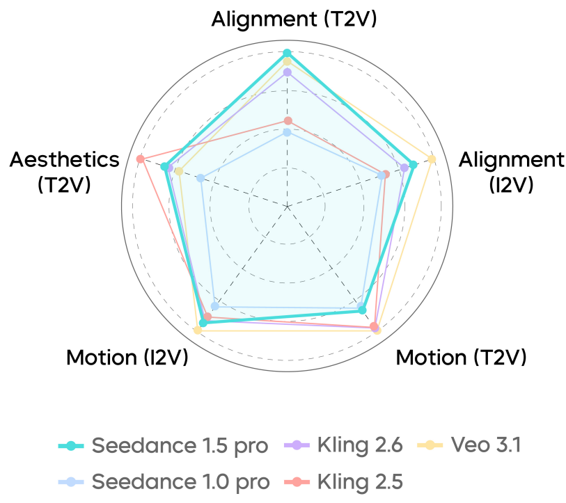
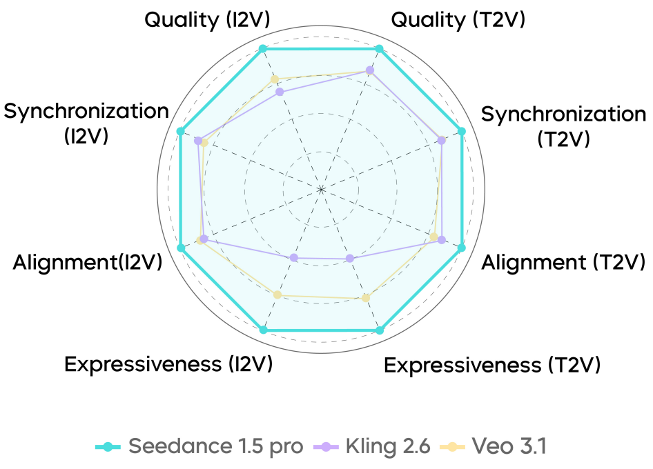
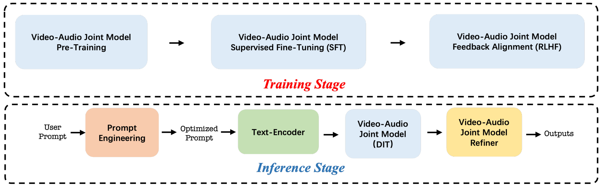
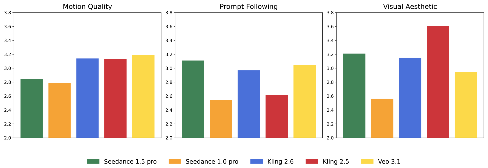
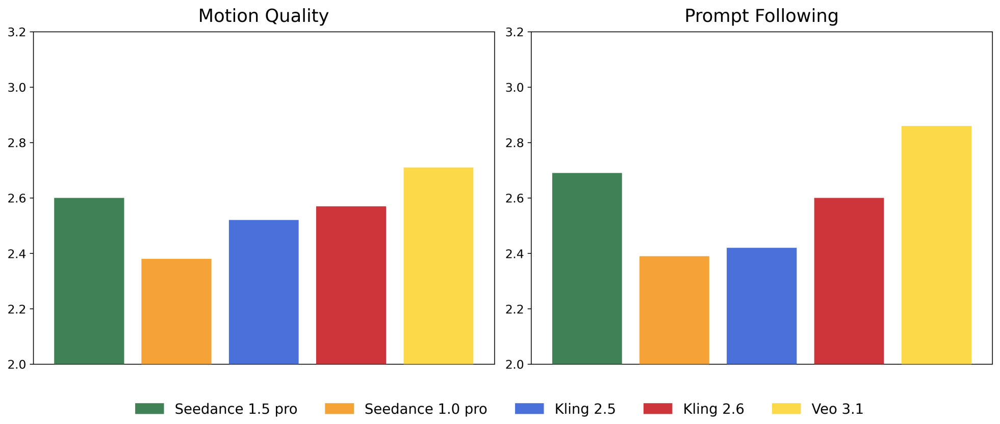
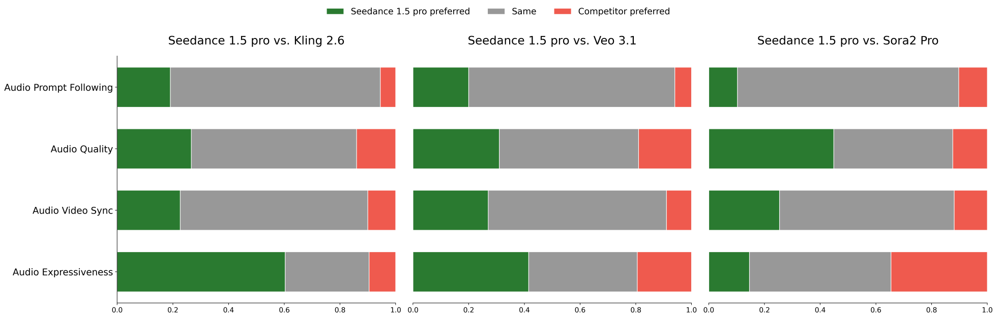
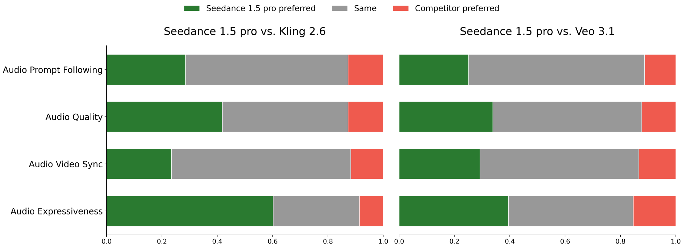
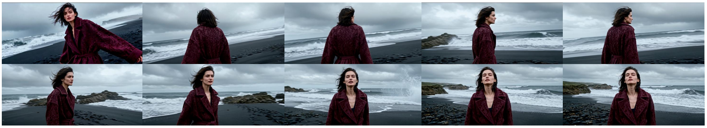
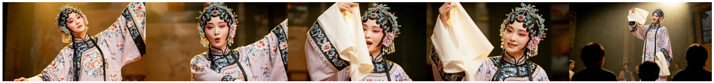
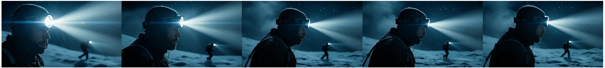

# Seedance 1.5 pro：原生音视频联合生成基础模型

ByteDance Seed

# 摘要

视频生成领域的最新进展为统一的音视频生成铺平了道路。在这项工作中，我们提出了 Seedance 1.5 pro，这是一个专为原生音视频联合生成而设计的基础模型。该模型利用双分支 Diffusion Transformer（扩散变换器）架构，集成了跨模态联合模块与专门的多阶段数据流水线，实现了卓越的音视频同步性和卓越的生成质量。为了确保其实用性，我们实施了精细的后训练优化，包括在高质量数据集上进行监督微调（SFT）以及利用多维奖励模型进行基于人类反馈的强化学习（RLHF）。此外，我们引入了一个加速框架，将推理速度提升了 10 倍以上。Seedance 1.5 pro 以其精准的多语言和方言唇形同步、动态的电影级镜头控制以及增强的叙事连贯性而脱颖而出，使其成为专业级内容创作的强大引擎。Seedance 1.5 pro 现已在火山引擎α上提供服务。

官方主页：https://seed.bytedance.com/seedance1_5_pro
$^{\alpha}$模型 ID：Doubao-Seedance-1.5-pro

_视频能力评估_

_音频能力评估_

_图 1 整体评估。左图：视频评估；右图：音频评估。_

---

---

# 1 引言

在过去的一年里，视觉（视频）生成领域 [2, 5, 9, 11-13] 取得了飞速发展。Veo、Sora、Kling 系列和 Seedance [3] 等专有商业系统的出现，以及 Wan [11] 和 Hunyuan Video 1.5 [6] 等开源模型的推出，极大地推动了视频生成技术在学术界和工业界的广泛应用。最近，联合音视频生成方面也取得了实质性进展。Wan 2.5、Kling 2.6 和 Sora 2 的发布标志着坚实的一步，将视频生成能力转化为实用的、以效用为导向的工具。

在这项工作中，我们推出了 Seedance 1.5 pro，这是一个原生支持联合视频-音频生成的基础模型。它能够执行多种任务，包括文本到音视频合成和图像引导的音视频生成。Seedance 1.5 pro 包含以下关键技术进步：

- **全面的视听数据框架。** 我们提出了一个用于高质量视频-音频生成的整体数据框架，该框架集成了多阶段筛选管线、先进的字幕系统和可扩展的基础设施。该管线优先考虑视频-音频一致性、动作表现力和基于课程的数据调度，而我们的字幕系统则为视频和音频模态提供了丰富、专业级的描述。这一强大的框架由高效的基础工程架构支撑，该架构针对海量多模态数据处理进行了优化。

- **统一的多模态联合生成架构。** 为了实现原生的视频-音频联合合成，我们提出了一种基于 MMDiT [1] 架构的统一框架。该设计促进了深度的跨模态交互，确保了视觉流和听觉流之间精确的时间同步和语义一致性。通过在大规模混合模态数据集上进行多任务预训练，我们的模型在各种下游任务中实现了强大的泛化能力，包括文本到视频-音频（T2VA）、图像到视频-音频（I2VA）和单模态视频生成（T2V, I2V）。

- **精细的后训练优化。** 我们利用高质量的音视频数据集进行了监督微调（SFT），随后使用了专门针对音视频上下文定制的基于人类反馈的强化学习（RLHF [7, 14-16]）算法。具体而言，我们的多维奖励模型增强了文本到视频（T2V）和图像到视频（I2V）任务的性能，提高了动作质量、视觉美感和音频保真度。此外，针对 RLHF 管线的定向基础设施优化使训练速度提高了近 $3 \times$。

- **高效的推理加速。** 我们进一步优化了多阶段蒸馏框架 [4, 8, 10]，以大幅减少生成过程中所需的函数评估次数（NFE）。通过集成推理基础设施优化——如量化和并行处理，我们在保持模型性能的同时实现了超过 $10 \times$ 的端到端加速。

_图 2 Seedance 1.5 pro 训练与推理管线概览。_

Seedance 1.5 pro 旨在提升视觉冲击力和动作表现力的上限。Seedance 1.5 pro 在多语言适配、动作表现力、镜头

---

---

调度以及方言表达。在中国电影制作、短剧和传统表演艺术等场景中的表现，展示了其在多镜头视频生成工作流中巨大的实际应用潜力：

- **精准的音视频同步与多语言支持。** 该模型在生成过程中实现了高度的音视频一致性，显著提升了唇形动作、语调和表演节奏的 alignment accuracy（对齐精度）。它原生支持多种语言和地区方言，能够准确捕捉其独特的韵律特征和情感张力。这种能力为喜剧和动画等风格化叙事赋予了自然的表演质感，从而极大地增强了角色的氛围感和表现力。

- **电影级镜头控制与动态张力。** 该模型具备自主的镜头调度能力，能够执行连续长镜头和滑动变焦（希区柯克变焦）等复杂运镜。此外，它还实现了电影级的场景转场和专业调色，大幅增强了视频的动态张力。

- **增强的语义理解与叙事连贯性。** 通过强化语义理解，Seedance 1.5 pro 实现了对叙事语境的精准分析。它显著改善了音视频片段的整体叙事协调性，为专业级内容创作提供了强有力的支持。

Seedance 1.5 pro 计划于 2025 年 12 月前集成到豆包1和即梦2等多个平台。我们设想该模型将成为一款至关重要的生产力工具，旨在提升专业工作流和日常创意应用的质量。

# 2 评估

随着 AIGC 视频生成向更深层次的多模态集成发展，音频能力的引入已成为将视频生成从高质量视觉素材转变为整体化、可投入生产的成品作品的关键因素。通过实现精准的音视频同步和连贯的情感对齐，模型输出不再是碎片化的视觉画面，而是代表着日益成熟、具有叙事完整性和沉浸感的制作作品。

本章对 Seedance 1.5 pro 模型进行了全面分析。第 2.1 节详细介绍了内部评估，概述了我们在视频和音频维度的评估方法，并展示了与最先进（SOTA）视频生成模型的对比分析。最后，我们重点介绍了该模型在多样化应用场景中的独特优势。

# 2.1 综合评估

与优先考虑普通用户偏好的第三方基准不同，我们建立了一个全面的多维框架，旨在评估模型在不同领域和能力方面的表现。通过将严格的基准构建与具体的评估标准相结合，该框架提供了细致的洞察力，以指导模型开发并促进快速迭代。在基于真实用户提示分析的 SeedVideoBench-1.0 的基础上，我们引入了增强版的 SeedVideoBench-1.5。与前代相比，该版本显著扩展了广告和微短剧等行业特定场景的覆盖范围，同时引入了用于音频评估的高级指标。与我们既定方法一致，我们与专业电影导演合作将这些标准规范化，并邀请来自电影制作、摄影和设计的专家进行专家级的人工评估。

# 2.1.1 SeedVideoBench 1.5

在视频维度方面，我们提供了详细的评估案例分类法和属性标签，涵盖主体、运动动态、交互和镜头移动等核心方面。更新后的基准测试

1https://www.doubao.com/chat/create-video

$^{2}$https://jimeng.jianying.com/ai-tool/video/generate

---

此外，该数据集还集成了针对多样化应用场景的标签，涵盖广告、社交媒体内容和短篇叙事内容。鉴于 Seedance 1.5 具备音视频联合生成能力，我们升级了评估框架，纳入了全面的音频维度。主要标签类别定义如下：

- **人声类型**：作为视频创作的关键组成部分，此类包含语音、歌唱和非语言发声（如笑声）。SeedVideoBench 1.5 引入了一套全面的分类体系，包含细粒度的子维度，以捕捉人声生成的多样化需求。

- **人声属性**：这些标签描述了特定的声音特质，包括音色、口音和情感基调。

- **非语音音频（音效/音乐）**：此类包含所有对于感知真实感和场景连贯性至关重要的环境音和音乐元素。标签系统根据来源（如动物、机械工具）、声学特性、音乐流派和技术参数对音频进行分类。

音频标注方法在 T2V（文本生成视频）和 I2V（图像生成视频）任务中遵循一致的原则。然而，在 I2V 语境下，音频合成显式地以参考图像中的视觉线索为条件，以确保语义一致性和跨模态连贯性。

# 2.1.2 视频评估指标

在 SeedVideoBench 1.5 中，我们在先前关注运动动态、提示词遵循度、美学质量和主体一致性的基础上，引入了专门的评估指标，旨在更好地反映专业制作的需求。主要更新详情如下：

- **运动质量**：运动质量仍然是用户最直接且最关心的问题。虽然稳定性、物理合理性和时间准确性等基准属性仍然是强制性的，但本基准测试版本重新强调了**视频生动感**，这一指标已成为下游专业应用中日益重要的衡量标准。随着整个领域生成能力的成熟，基础运动指标可能会接近性能饱和。因此，广告和电影制作从业者越来越要求视频输出在各种场景下表现出更高水平的生动感。值得注意的是，在若干最先进的模型中，我们观察到一种普遍的权衡现象，即利用慢动作生成来人为增强感知到的稳定性，这种策略显著损害了运动生动感和表现质量。为了解决这一局限性，我们将视频生动感作为一项综合感知指标，从四个主要维度进行评估：动作、运镜、氛围和情感。其中以下两个方面受到了特别考察：

  **动作维度**：动作的生动感表现为细腻的面部表情、美学上精炼的身体姿态、对细粒度动作的高保真还原以及与环境的逼真互动。这些因素共同决定了生成运动的感知真实性和情感表现力。

  **运镜维度**：电影构图和动态运镜在增强视觉表现力、强化情感传递以及支持跨镜头的时间叙事连贯性方面发挥着关键作用。

- **提示词遵循**：虽然当用户明确要求逐字执行时，严格遵循用户指令仍然是必要的，但提示词遵循度的定义已更新，以反映现代生成模型改进后的语义理解和意图识别能力。评估现在优先考虑与用户潜在意图的一致性，而不是强调表面的关键词匹配。

在叙事驱动的社交媒体场景中，只要核心用户意图得到保留，模型被允许进行一定程度的、与意图对齐的创意发挥。这种灵活性可能包括补全缺失的视觉细节、完善叙事结构，或生成更符合预期情感基调的对话——从而有助于提升叙事质量和跨模态表现连贯性。

---

# 2.1.3 音频评估指标

我们的音频评估指标旨在从多个维度定量表征模型性能，为推进音频生成向电影级制作标准迈进确立路线图。该评估框架包含四个核心组成部分：

- **音频提示遵循**：类似于文本-视频对齐，该指标评估人声元素、对话和音效对用户指令及预期语义的忠实度，即使在创造性推演（即意图一致的内容扩展）期间也不发生语义漂移。常见的失效模式包括遗漏指定音效、语言或方言不准确，以及音频-视觉不匹配（例如，生成语音时没有相应的唇部动作）。

- **音频质量**：该指标量化输出的内在声学质量，涵盖人声和非人声成分。关键评估标准包括伪影的存在（例如削波、截断）、空间声场渲染、音色逼真度以及整体信号清晰度。

- **音视频同步**：该指标测量听觉流与视觉流之间的时间对齐。它评估语音与唇部动态的同步（例如减轻感知的腹语效应）、音效与视觉事件的对齐，以及与屏幕显著动作相对应的听觉线索的存在。

- **音频表现力**：该指标评估音频增强视频情感共鸣的程度。它考虑背景音乐（BGM）的主题适切性、语音的情感抑扬顿挫，以及音频对氛围沉浸感、叙事连贯性和深度的贡献。

# 2.1.4 人工评估

**视频**：利用 SeedVideoBench 1.5 框架，我们针对 Seedance 1.5 pro 与几种最先进的视频生成模型，在文本生成视频（T2V）和图像生成视频（I2V）任务上进行了全面的对比评估。对比基线包括 Kling 2.5、Kling 2.6、Veo 3.1 和 Seedance 1.0 Pro。为了确保稳健的评估，我们采用了双重指标评估协议：

- **绝对评分**：该指标使用 5 点李克特量表（从 1 分“非常不满意”到 5 分“非常满意”），以促进不同模型之间的标准化性能比较。

- **优-同-差（GSB）**：该指标涉及成对比较以评估相对视频质量，从而实现对模型输出的更细粒度区分。

_图 3 文本生成视频任务的视频绝对评估。_

图 3 和图 4 展示了视频生成模型在文本生成视频（T2V）和图像生成视频（I2V）任务中的绝对评估得分。Seedance 1.5 pro 较其上一代产品表现出显著提升。

---

---

其前身 Seedance 1.0 Pro 相比。具体而言，在文本生成视频（T2V）任务中，Seedance 1.5 pro 在指令遵循（对齐）方面处于领先地位。此外，在视觉美学、动态表现力以及图生视频（I2V）任务方面，它也展现出了极强的竞争力。

_图 4 图生视频任务的视频绝对评估结果。_

音频。图 5 和图 6 展示了 Seedance 1.5 pro 与若干竞争系统之间音频性能的多维度并列（GSB）对比评估。虽然 Veo 3.1、Wan 2.5、Kling 2.6 和 Sora 2 等模型展现了稳健的音频生成能力，但 Seedance 1.5 pro 在几个关键维度上表现出了显著优势：

_图 5 文本生成视频任务的音频 GSB 评估结果。_

中文音频的优越性。在中文语音生成方面，Seedance 1.5 pro 始终优于 Veo 3.1。它在合成中文语境下的对话、方言和独白方面表现出明显优势，能够可靠地生成发音清晰度高的准确响应。值得注意的是，该模型基本不存在漏读字节或发音错误等常见伪影。

增强的音视频同步。Seedance 1.5 pro 模型在将音轨和音效与视觉线索对齐方面表现出色。在唇音同步方面，该模型能够准确对应说话角色的数量和身份，有效缓解了通常导致音视频时序错位的口部动作冗余或缺失等相关错误。在这方面，其性能超越了 Veo 3.1 和 Kling 2.6。

---

---

<!-- [翻译失败，保留原文] -->

_Figure 6 Audio GSB Evaluation for Image-to-Video task._

Comparative Analysis of Audio Expressiveness. Sora 2 demonstrates strong competence in emotional expressiveness, delivering particularly vivid emotional inflection in its audio outputs. By contrast, Seedance 1.5 pro maintains a more balanced and controlled expressiveness profile, achieving consistent emotional alignment with visual content while avoiding over-exaggeration. This characteristic is especially advantageous in professional production scenarios that require stable tone control and narrative coherence.

# 2.2 Potential Advantages in Application Scenarios

Seedance 1.5 pro further strengthens its capabilities in character expressiveness and stylized visual construction, with particularly strong performance in Chinese-language contexts. Compared to previous generations, Seedance 1.5 pro demonstrates substantial improvements in character dialogue, including support for multiple Chinese dialects, as well as in the execution of complex camera dynamics. These advancements make the model well-suited for Chinese film production, short-form micro-dramas, and theatrical storytelling scenarios.

Specifically, Seedance 1.5 pro maintains consistent lip synchronization, vocal tonality, and performance rhythm across continuous shots. The model exhibits robust performance in dialect-rich settings, such as Sichuanese, Taiwan Mandarin, Cantonese, and Shanghainese, producing natural prosody and speech patterns that closely resemble authentic regional usage. These capabilities are particularly beneficial for genre-specific storytelling, including comedy and comic-style narratives, where dialectical cadence and performative tension play a critical role in establishing atmosphere and comedic timing.

In terms of visual composition, Seedance 1.5 pro demonstrates mature control over complex camera operations. The model reliably executes orbital, arc, and tracking shots while preserving visual style consistency between generated sequences and reference imagery, thereby ensuring cinematic visual continuity across scenes. Moreover, leveraging improved prompt understanding, Seedance 1.5 pro can autonomously introduce novel subjects and actions that remain aligned with the narrative genre, enhancing overall scene coherence and immersive continuity.

Additionally, Seedance 1.5 pro demonstrates a heightened sensitivity to the traditional Chinese performance

---

在戏曲场景体系中。虽然该模型对不同戏曲子流派中特定唱腔风格的掌握仍在不断演进，但它已经能够捕捉到戏曲念白独特的韵律与韵味。通过兰花指等细腻的表演细节以及丑角特有的程式化眼神，Seedance 1.5 pro 有效地构建了一种深深植根于东方戏曲美学的表演氛围。

在写实的电影特写镜头中，Seedance 1.5 pro 通过细腻且连贯的面部微表情来维持情感的连续性。即使在对话极少的片段中，该模型也能保持角色表演的完整性，为创作者提供了更大的叙事灵活性以及留白与解读的空间。

综上所述，Seedance 1.5 pro 在中文生成、风格化视觉渲染、复杂运镜控制以及传统戏曲表现力方面的进步，实现了高度的叙事表现力和无缝的视听融合。总体而言，这些能力增强了该模型在华语电影制作、短剧创作以及戏曲化视听叙事等多种应用领域的创作可控性。

---

---

# 参考文献

[1] Patrick Esser, Sumith Kulal, Andreas Blattmann, Rahim Entezari, Jonas Müller, Harry Saini, Yam Levi, Dominik Lorenz, Axel Sauer, Frederic Boesel, 等. 扩展整流流 Transformer 用于高分辨率图像合成. 见于 _第四十一届国际机器学习会议_, 2024.

[2] Yu Gao, Lixue Gong, Qiushan Guo, Xiaoxia Hou, Zhichao Lai, Fanshi Li, Liang Li, Xiaochen Lian, Chao Liao, Liyang Liu, 等. Seedream 3.0 技术报告. arXiv 预印本 arXiv:2504.11346, 2025.

[3] Yu Gao, Haoyuan Guo, Tuyen Hoang, Weilin Huang, Lu Jiang, Fangyuan Kong, Huixia Li, Jiashi Li, Liang Li, Xiaojie Li, 等. Seedance 1.0：探索视频生成模型的边界. arXiv 预印本 arXiv:2506.09113, 2025.

[4] Zhengyang Geng, Mingyang Deng, Xingjian Bai, J Zico Kolter, 和 Kaiming He. 用于一步式生成建模的平均流. arXiv 预印本 arXiv:2505.13447, 2025.

[5] Lixue Gong, Xiaoxia Hou, Fanshi Li, Liang Li, Xiaochen Lian, Fei Liu, Liyang Liu, Wei Liu, Wei Lu, Yichun Shi, 等. Seedream 2.0：一个原生的中英双语图像生成基础模型. arXiv 预印本 arXiv:2503.07703, 2025.

[6] Weijie Kong, Qi Tian, Zijian Zhang, Rox Min, Zuozhuo Dai, Jin Zhou, Jiangfeng Xiong, Xin Li, Bo Wu, Jianwei Zhang, 等. Hunyuanvideo：一个面向大型视频生成模型的系统框架. arXiv 预印本 arXiv:2412.03603, 2024.

[7] Jie Liu, Gongye Liu, Jiajun Liang, Yangguang Li, Jiaheng Liu, Xintao Wang, Pengfei Wan, Di Zhang, 和 Wanli Ouyang. Flow-grpo：通过在线强化学习训练流匹配模型. arXiv 预印本 arXiv:2505.05470, 2025.

[8] Yuxi Ren, Xin Xia, Yanzuo Lu, Jiacheng Zhang, Jie Wu, Pan Xie, Xing Wang, 和 Xuefeng Xiao. Hyper-sd：用于高效图像合成的轨迹分段一致性模型. 神经信息处理系统进展, 37:117340-117362, 2025.

[9] Team Seedream, Yunpeng Chen, Yu Gao, Lixue Gong, Meng Guo, Qiushan Guo, Zhiyao Guo, Xiaoxia Hou, Weilin Huang, Yixuan Huang, 等. Seedream 4.0：迈向下一代多模态图像生成. arXiv 预印本 arXiv:2509.20427, 2025.

[10] Huiyang Shao, Xin Xia, Yuhong Yang, Yuxi Ren, Xing Wang, 和 Xuefeng Xiao. Rayflow：通过自适应流轨迹实现实例感知的扩散加速. arXiv 预印本 arXiv:2503.07699, 2025.

[11] Team Wan, Ang Wang, Baole Ai, Bin Wen, Chaojie Mao, Chen-Wei Xie, Di Chen, Feiwu Yu, Haiming Zhao, Jianxiao Yang, 等. Wan：开放且先进的大规模视频生成模型. arXiv 预印本 arXiv:2503.20314, 2025.

[12] Bing Wu, Chang Zou, Changlin Li, Duojun Huang, Fang Yang, Hao Tan, Jack Peng, Jianbing Wu, Jiangfeng Xiong, Jie Jiang, 等. Hunyuanvideo 1.5 技术报告. arXiv 预印本 arXiv:2511.18870, 2025.

[13] Chenfei Wu, Jiahao Li, Jingren Zhou, Junyang Lin, Kaiyuan Gao, Kun Yan, Sheng-ming Yin, Shuai Bai, Xiao Xu, Yilei Chen, 等. Qwen-image 技术报告. arXiv 预印本 arXiv:2508.02324, 2025.

[14] Jie Wu, Yu Gao, Zilyu Ye, Ming Li, Liang Li, Hanzhong Guo, Jie Liu, Zeyue Xue, Xiaoxia Hou, Wei Liu, 等. Rewarddance：视觉生成中的奖励缩放. arXiv 预印本 arXiv:2509.08826, 2025.

[15] Zeyue Xue, Jie Wu, Yu Gao, Fangyuan Kong, Lingting Zhu, Mengzhao Chen, Zhiheng Liu, Wei Liu, Qiushan Guo, Weilin Huang, 等. Dancegrpo：在视觉生成中释放 GRPO 的潜力. arXiv 预印本 arXiv:2505.07818, 2025.

[16] Jiacheng Zhang, Jie Wu, Yuxi Ren, Xin Xia, Huafeng Kuang, Pan Xie, Jiashi Li, Xuefeng Xiao, Min Zheng, Lean Fu, 等. Unifl：通过统一反馈学习改进 Stable Diffusion. arXiv 预印本 arXiv:2404.05595, 2024.

---

# 附录

# A 贡献与致谢

Seedance 的所有作者按姓氏字母顺序排列。

# 作者

陈赫一

陈思言

陈鑫

陈彦飞

陈莹

陈卓

程峰

程天恒

程新琪

迟旭岩

丛健

崔婧

崔钦鹏

董启德

范俊良

方静

方泽塔

冯成健

冯涵

高明远

高宇

郭东

郭秋山

郝博洋

郝宏祥

郝庆凯

何碧波

何倩

黄廷

胡若清

胡希

黄蔚林

黄朝阳

黄忠毅

纪东磊

姜建文

姜思琪

姜云普

姜卓

Kim Ashley

孔佳楠

赖志超

劳珊珊

冷一翀

李艾

李飞雅

李根

李会霞

李佳石

李亮

李明

李珊珊

李涛

李贤

李晓杰

李晓阳

李星星

李亚梦

李一夫

李莹莹

梁超

梁涵

梁建忠

梁莹

梁志强

廖旺

廖雅琳

林恒

林肯宇

林善川

林希

林志杰

凌峰

刘芳芳

刘高红

刘佳伟

刘杰

刘继豪

刘寿达

刘舒

刘思超

刘松玮

刘鑫

刘雪

刘一博

刘紫琨

刘祖希

吕俊林

吕乐成

吕倩

穆涵

聂晓楠

宁景哲

潘希彤

彭阳华

廉联科

屈雪琼

任玉玺

沈凯

时光

石雷

宋岩

宋应龙

孙凡

孙丽

孙仁飞

孙艳

孙泽宇

唐文静

唐亚雪

陶子瑞

王峰

王福瑞

王金然

王俊凯

王科

王可欣

王清义

王瑞

王森

王帅

王亭如

王伟晨

王鑫

王延辉

王悦

王玉平

王宇轩

王子宇

魏国强

魏婉如

吴迪

吴国红

吴汉杰

吴建

吴杰

吴若兰

吴兴龙

吴永辉

---

---

Ruiqi Xia

Liang Xiang

Fei Xiao

XueFeng Xiao

Pan Xie

Shangyi Xie

Shuang Xu

Jinlan Xue

Shen Yan

Bangbang Yang

Ceyuan Yang

Jiaqi Yang

Runkai Yang

Tao Yang

Yang Yang

Yihang Yang

ZhiXian Yang

Ziyan Yang

Songting Yao

Yifan Yao

Zilyu Ye

Bowen Yu

Jian Yu

Chujie Yuan

Linxiao Yuan

Sichun Zeng

Weihong Zeng

Xuejiao Zeng

Yan Zeng

Chuntao Zhang

Heng Zhang

Jingjie Zhang

Kuo Zhang

Liang Zhang

Liying Zhang

Manlin Zhang

Ting Zhang

Weida Zhang

Xiaohe Zhang

Xinyan Zhang

Yan Zhang

Yuan Zhang

Zixiang Zhang

Fengxuan Zhao

Huating Zhao

Yang Zhao

Hao Zheng

Jianbin Zheng

Xiaozheng Zheng

Yangyang Zheng

Yijie Zheng

Jiexin Zhou

Jiahui Zhu

Kuan Zhu

Shenhan Zhu

Wenjia Zhu

Benhui Zou

Feilong Zuo

---