# WAN：开放且先进的大规模视频生成基础模型

万兴团队，阿里巴巴集团

# 摘要

本报告介绍了 Wan，这是一套全面且开放的视频基础模型，旨在突破视频生成的边界。Wan 基于主流的扩散 Transformer 范式构建，通过一系列创新在生成能力方面取得了显著进展，这些创新包括我们新颖的时空变分自编码器、可扩展的预训练策略、大规模数据整理以及自动化评估指标。这些贡献共同提升了模型的性能和通用性。具体而言，Wan 具有四个关键特征：领先的性能：Wan 的 14B 模型在包含数十亿图像和视频的海量数据集上进行了训练，展示了视频生成在数据和模型规模方面的缩放定律。在多个内部和外部基准测试中，它始终优于现有的开源模型以及最先进的商业解决方案，展示了明显且显著的性能优势。全面性：Wan 提供了两个能力强大的模型，即 1.3B 和 14B 参数，分别兼顾了效率和有效性。它还涵盖了多个下游应用，包括图生视频、指令引导的视频编辑和个人视频生成，包含多达八项任务。同时，Wan 是第一个能够生成中英文视觉文本的模型，显著增强了其实用价值。消费级效率：1.3B 模型展示了卓越的资源效率，仅需 8.19 GB 显存，使其能够与广泛的消费级 GPU 兼容。与更大的开源模型相比，它还表现出优越的性能，展示了在文本生成视频方面的显著效率。开放性：我们开源了 Wan 的全系列，包括源代码和所有模型，旨在促进视频生成社区的发展。这种开放性旨在显著扩展行业视频制作的创意可能性，并为学术界提供高质量的视频基础模型。此外，我们进行了广泛的实验分析，涵盖了所提出的 Wan 的各个方面，展示了详细的结果和见解。我们相信这些发现和结论将显著推进视频生成技术。所有代码和模型均可在 https://github.com/Wan-Video/Wan2.1 获取。

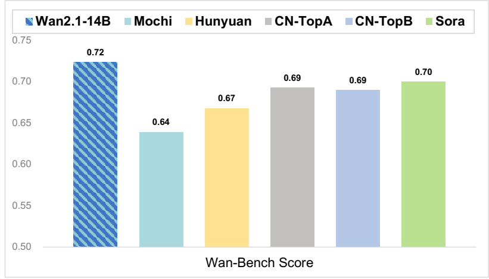

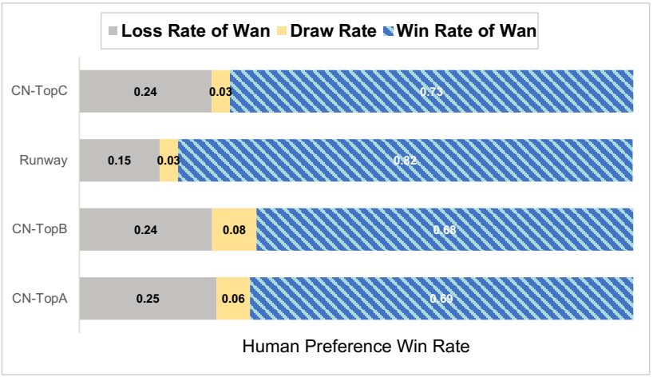

_图 1：Wan 与最先进的开源及闭源模型的比较。在基准测试和人类评估中，Wan 始终表现出更优的结果。请注意，HunyuanVideo Kong et al. (2024) 是使用开源模型进行测试的。_

---

# 目录

1 引言 3

2 相关工作 3

3 数据处理流程 5

3.1 预训练数据 6

3.2 后训练数据 7

3.3 密集视频描述 8

3.3.1 开源数据集 8

3.3.2 内部数据集 8

3.3.3 模型设计 9

3.3.4 评估 10

4 模型设计与加速 10

4.1 时空变分自编码器 10

4.1.1 模型设计 10

4.1.2 训练 11

4.1.3 高效推理 11

4.1.4 评估 12

4.2 模型训练 13

4.2.1 视频扩散 Transformer 14

4.2.2 预训练 14

4.2.3 后训练 15

4.3 模型扩展与训练效率 15

4.3.1 工作负载分析 15

4.3.2 并行策略 16

4.3.3 内存优化 17

4.3.4 集群可靠性 17

4.4 推理 17

4.4.1 并行策略 17

4.4.2 扩散缓存 18

4.4.3 量化 18

4.5 提示对齐 19

4.6 基准测试 20

4.7 评估 22

4.7.1 指标与结果 22

4.7.2 消融实验 24

5 扩展应用 26

5.1 图生视频 26

5.1.1 模型设计 26

5.1.2 数据集 27

5.1.3 评估 27

5.2 统一视频编辑 30

5.2.1 模型设计 31

5.2.2 数据集与实现 34

5.2.3 评估 35

5.3 文生图 35

5.4 视频个性化 35

5.4.1 模型设计 35

5.4.2 数据集 37

5.4.3 评估 37

5.5 运镜可控性 38

5.6 实时视频生成 38

5.6.1 方法 38

5.6.2 流式视频生成 40

5.6.3 一致性模型蒸馏 44

5.7 音频生成 44

5.7.1 模型设计 45

5.7.2 评估 47

6 局限性与结论 47

7 贡献者 49

---

---

# 1 引言

自 OpenAI 推出 Sora (OpenAI, 2024) 以来，视频生成技术引起了工业界和学术界的广泛关注，推动了该领域的飞速发展。能够生成媲美专业制作内容的模型的出现，显著提高了内容创作的效率，同时也降低了视频制作的相关成本。视频生成技术的这些快速进步也极大地归功于开源社区的发展。像 HunyuanVideo (Kong et al., 2024)、Mochi (GenmoTeam, 2024) 和 CogVideoX (Yang et al., 2025b) 这样的杰出项目，公开了其视频基础模型的代码和权重，逐渐缩小了开源模型与商业模型之间的差距。然而，必须承认的是，这些优秀的开源模型与最新的闭源模型之间仍存在持续的差距。这种差距主要体现在三个方面：性能欠佳：仍然存在明显的性能差距，因为商业模型的发展速度远超当前的开源模型，导致其能力显著更优。能力受限：大多数基础模型仅限于通用的文本生成视频（T2V）任务，而视频创作的需求是多方面的。因此，基础的 T2V 模型不足以解决这些多样化的需求。效率不足：尽管这些模型性能令人印象深刻且规模庞大，但对于计算资源有限的创意团队来说往往不切实际，阻碍了其可访问性和可用性。这些挑战共同对开源社区的持续增长和创新构成了限制。

为了解决上述挑战，本报告介绍并公开发布了一系列新型的高性能基础视频生成模型，称为 Wan，为该领域树立了新的标杆。Wan 的核心设计灵感来源于扩散 Transformer 的成功结合 Flow Matching (Lipman et al., 2022)，这一框架已通过在文本生成图像（T2I）(Esser et al., 2024) 和文本生成视频（T2V）(Kong et al., 2024) 任务中的扩展，展示了可实现的显著性能提升。在这种架构范式下，采用交叉注意力来嵌入文本条件，同时经过精心优化模型设计以确保计算效率和精确的文本可控性。为了进一步增强模型捕捉复杂动态的能力，引入了完整的时空注意力机制。通过广泛的实验，该模型在大规模上得到了验证，参数量达到了 140 亿（14 billion）。随后，Wan 处理了包含数十亿图像和视频的大规模数据，总计约 \(\mathcal{O}(1)\) 万亿个 Token。这种广泛的训练促进了模型能力的涌现，使其能够在运动幅度和质量、视觉文本生成、镜头控制、指令遵循和风格多样性等多个维度上展现出强大的性能。基于强大的基础模型，我们将其能力扩展到了众多下游任务，包括图像生成视频（I2V）、指令引导的视频编辑（V2V）、零样本个性化定制、实时视频生成和音频生成等关键应用。为了最大限度地降低推理成本，除了 14B 模型外，我们还为 T2V 和 I2V 引入了一个 1.3B 模型，两者均支持 480p 分辨率，并极大地提高了推理效率。值得注意的是，1.3B 模型仅需 8.19G 显存，使其能够在许多消费级 GPU 上运行，同时其性能超过了许多更大的开源模型。

此外，我们还将公开整个训练过程，包括大规模数据构建管道、视频变分自编码器（VAE）、训练策略、加速技术和自动评估算法，以赋能社区开发专业化的基础视频模型。此外，我们将提供全面的设计细节和实验结果，深入探讨在资源密集型大型生成模型训练过程中观察到的现象，以及我们的关键发现和结论。我们相信这些贡献将在加速视频生成技术进步方面发挥关键作用。

# 2 相关工作

在生成式建模进步的推动下，大规模视频模型的格局发生了显著演变，特别是在基于扩散的框架中。我们的综述主要集中在两大类：闭源模型和开源社区的贡献。

---

---

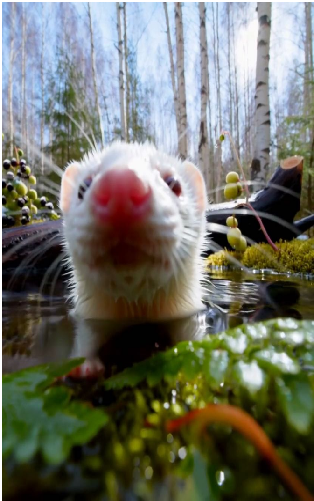

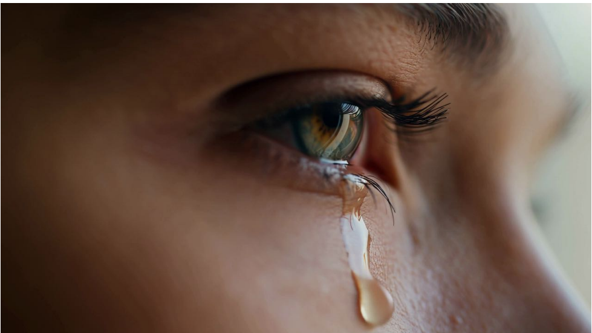

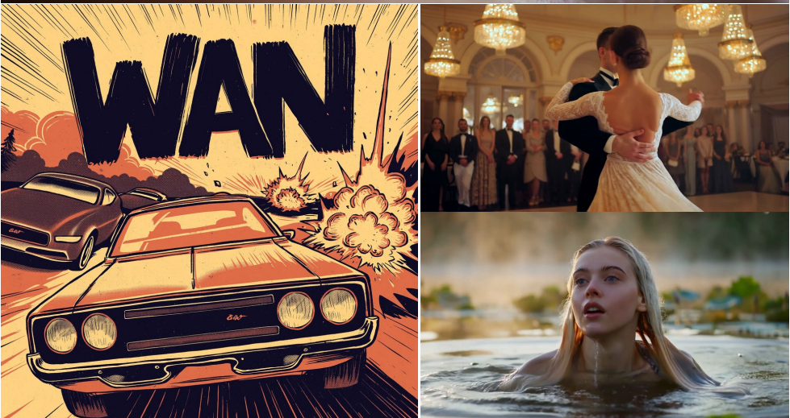

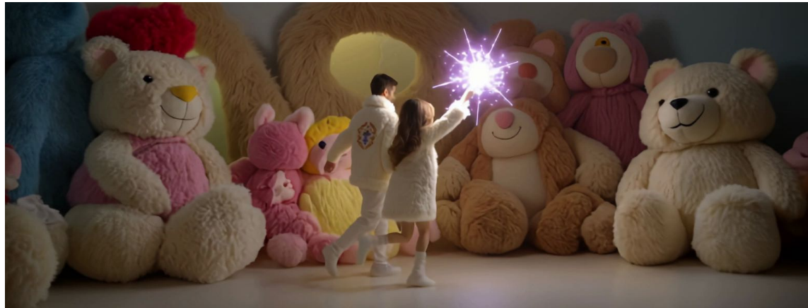

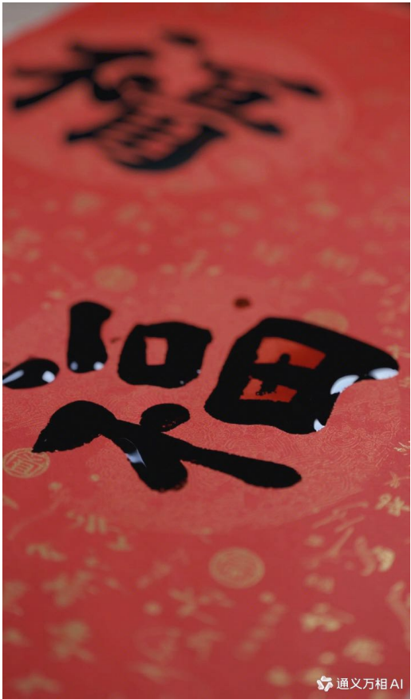

_图 2：Wan 生成的样本。Wan 能够生成大幅度运动、高保真度且细节逼真的视频。它也是首个能够在视频中生成中英文文本的模型。此外，Wan 提供了一系列功能，包括文生视频、图生视频以及视频编辑能力。_

闭源模型。闭源模型主要由大型科技公司开发，得益于投入的巨额资源，这些模型旨在实现高质量、专业的视频生成。我们按时间顺序整理了过去一年发布的知名模型。2024 年 2 月，OpenAI 推出了 Sora (OpenAI, 2024)，标志着 AI 生成内容领域的重大飞跃。2024 年 6 月，快手的 Kling (Kuaishou, 2024.06) 和 LUMA AI 的 Luma 1.0 (LumaLabs, 2024.06) 开放公测，提供了强大的视频生成能力。与此同时，Runway 发布了 Gen-3 (Runway, 2024.06)，在 Gen-2 (Runway, 2023) 的基础上进一步提升了视频创作的标准。2024 年 7 月，生数科技发布了配备自研 U-ViT (Bao et al., 2023) 架构的 Vidu (Bao et al., 2024)。2024 年 9 月，Kling 和 Luma 均更新至 1.5 版本。同期，MiniMax 推出了

---

---

海螺视频（MiniMax，2024.09），向公众展示了令人印象深刻的视觉效果。2024年10月，Pika Labs推出了Pika 1.5（PikaLabs，2024.10），使用户能够定制视频中的视觉和物理属性。此外，Meta推出了Movie Gen（Polyak等人），这是一系列详细说明了其训练过程和应用的视频基础模型。2024年12月，可灵（Kling）升级到1.6版本，与此同时，Google发布了Veo 2（DeepMind，2024.12），其对现实世界物理和人体运动细微差别的理解得到了改进。

这些发展凸显了视频生成领域激烈的全球竞争。在此背景下，我们的开源模型Wan在内部和外部基准测试中均表现出与这些商业模型相媲美甚至更优越的性能，并在多个属性上处于领先地位。

开源社区的贡献。另一方面，开源社区不仅对整体视频生成模型做出了重大贡献，而且对基本模型组件的探索也功不可没。基于扩散的视频生成模型通常建立在Stable Diffusion（Rombach等人，2022）架构之上。它主要涉及三个关键模块：一个用于将原始视频映射到紧凑潜在空间的自编码器，一个用于提取文本嵌入的文本编码器，以及一个通过扩散模型优化以学习这些视频潜在分布的神经网络。在网络结构方面，最初用于图像生成（Ho等人，2020；Song等人，2020）的U-Net（Ronneberger等人，2015）通过引入时间维度被适配用于视频生成。VDM（Ho等人，2022）将2D U-Net扩展为3D版本，而另一种范式（Zhou等人，2022；Wang等人，2023a；Guo等人，2024b）引入了结合2D空间注意力块的1D时间注意力，以降低计算成本。值得注意的是，仅依赖Transformer块的扩散Transformer（DiT (Peebles & Xie, 2023)）在视觉生成任务中优于U-Net（Chen等人，2023a）。这种结构也被迁移到了视频模型中（Ma等人，2024），产生了两种常见的变体：使用交叉注意力处理文本嵌入的原始DiT（Peebles & Xie，2023；HaCohen等人，2024），以及将文本嵌入与视觉嵌入拼接进行全注意力处理的MM-DiT（GenmoTeam，2024；Kong等人，2024）。关于自编码器，虽然早期方法（Rombach等人，2022）采用标准VAE（Kingma，2013），但像VQ-VAE（Van Den Oord等人，2017）和VQGAN（Esser等人，2021）这样的近期自编码器改进了模型设计，以实现更好的重建和压缩效果。LTX-Video（HaCohen等人，2024）修改了VAE解码器以执行最终的去噪步骤并将潜在变量转换为像素，其中缺失的高频细节在解码过程中生成。文本编码器对于基于文本的视频生成也至关重要。当前强大的视频生成模型主要利用T5系列（Raffel等人，2020）作为主要的文本编码器，通常与CLIP（Radford等人，2021）结合使用。在混元视频（HunyuanVideo）（Kong等人，2024）的案例中，T5被替换为多模态大语言模型（Liu等人，2023c；Li等人，2023），以实现文本嵌入与视觉特征之间更稳健的对齐。

通过将这些关键模块与有效的基于扩散的优化技术（Ho等人，2020；Song & Ermon，2019；Lipman等人，2022）相结合，出现了多个有前途的开源视频生成模型（GenmoTeam，2024；Kong等人，2024；HaCohen等人，2024；Zheng等人，2024；Lin等人，2024；Jin等人，2024；Yang等人，2025b）。在Wan中，我们精心设计或选择了每个关键组件，以确保高质量的视频合成。我们提供了详细的设计信息和消融研究，这可以促进未来视频生成模型的设计。

此外，许多研究探讨了视频生成中的下游任务。这些任务包括修复（AI，2022；Zhou等人，2023）、编辑（Meng等人，2021；Brooks等人，2023；Zhang等人，2023a；Wang等人，2023b；Wei等人，2024b）、可控生成（Zhang等人，2023b；Jiang等人，2024；Wang等人，2024c）和帧参考生成（Yang等人，2025b；Guo等人，2024a），通常通过利用基于适配器和类似ControlNet的架构（Zhang等人，2023b；Chu等人，2023）来结合用户指定的条件。我们还基于Wan开发了各种下游应用，这些应用表现出了卓越的性能。

# 3 数据处理流程

高质量的数据对于训练大型生成模型至关重要，而自动化的数据构建流程能显著提高训练过程的效率。在开发我们的数据集时，我们优先考虑了三个核心原则：高质量、高多样性和大规模。遵循这些原则，我们策划了一个包含数十亿个视频和图像的数据集。本节详细介绍用于Wan的数据构建流程。

---

# 3.1 预训练数据

我们从内部版权来源和公开可获取的数据中收集并去重了一个候选数据集。在预训练阶段，我们的目标是从这个庞大但嘈杂的数据集中选择高质量且多样化的数据，以促进有效的训练。在整个数据挖掘过程中，我们设计了一个四步数据清洗流程，重点关注基础维度、视觉质量和运动质量。随后，我们还将重点介绍用于构建视觉文本数据的数据处理工作流程。

**基础维度**。我们数据过滤框架的基础维度侧重于源视频和图像数据的内在属性，从而能够高效地初步过滤掉所有不合适的数据。具体而言，我们的多维过滤方法包含以下关键方面：

*   **文本检测**。实施了一个轻量级 OCR 检测器来量化文本覆盖率，有效排除文本元素过多的视频和图像，以保持视觉清晰度。
*   **美学评估**。我们使用广泛采用的 LAION-5B (Schuhmann et al., 2021) 美学分类器对我们的图像进行初步质量评估，快速过滤掉低质量数据。
*   **NSFW 评分**。通过我们内部的安全评估模型，我们根据所有训练数据中计算出的 NSFW 分数系统性地评估并过滤不当内容。
*   **水印和 Logo 检测**。我们检测视频或图像是否包含水印和 Logo，并在训练期间裁剪这些元素。
*   **黑边检测**。利用基于启发式的检测方法，我们自动裁剪多余的黑边，以保持对内容丰富区域的关注。
*   **过曝检测**。我们训练的专家分类器评估并过滤色调分布异常的数据，确保训练数据集中的最佳视觉质量。
*   **合成图像检测**。经验证据表明，即使只有极少量 \((< 10\%)\) 的生成图像污染，也会显著降低模型性能。因此，我们训练了一个专家分类器来过滤掉这些“污染”图像。
*   **模糊检测**。一个内部开发的模型为训练材料分配定量模糊分数，从而能够系统性地去除视觉不清晰的内容。
*   **时长和分辨率**。我们还执行了约束条件，即视频时长必须超过 4 秒，并在不同的训练阶段应用分辨率阈值以过滤掉低质量数据。

通过实施这些高效的预处理策略，我们成功剔除了初始数据集中约 \(50\%\) 的数据。保留的高质量数据随后进入更高级的语义驱动选择阶段进行进一步细化。

**视觉质量**。这主要涉及从候选数据集中选择相对高质量且符合预训练标准的数据。该数据子集必须具有良好的视觉质量，且其整体分布应与自然数据的分布保持一致。在此过程中，我们将任务分为两部分：聚类和打分。聚类用于将所有数据拆分为较小的子集，允许我们单独处理每个子集。这种方法的好处是，可以防止因长尾分布而可能导致微小但重要的数据片段丢失，从而保持原始数据分布。具体而言，我们将数据分为 100 个聚类，然后从每个聚类中选择一定量的数据进行下一阶段的数据处理。打分用于为每个视频或图像分配质量分数，以便于在不同阶段进行数据的选择和处理。具体而言，我们从每个聚类中选择样本进行人工打分（范围从 1 到 5，1 为最差，5 为最好）。然后，我们使用所有标注数据训练一个专家评估模型，对整个数据集进行打分。

**运动质量**。运动质量评估的目标是选择自然、完整且具有显著运动的视频，同时避免静态或抖动的运动。我们将视频数据分为六个不同的运动质量等级：

*   **最佳运动**：该级别代表具有最佳属性的视频，例如显著的运动布局、视角和幅度，以及干净、流畅的运动。
*   **中等质量运动**：此类别的视频表现出明显的运动，但可能存在一些小问题，如多个主体或部分遮挡。这些数据确保了运动多样性，可在预训练期间使用，以帮助模型更好地理解时空关系。
*   **静态视频**：此类别主要针对那些主要由聊天和采访风格视频组成的视频。虽然这些视频包含的运动信息很少，但它们质量很高。因此，我们需要单独识别它们并降低其采样比例。
*   **相机驱动运动**：以相机运动（例如航拍镜头）为主且主体运动极少的画面。鉴于它们与静态图像相似，它们的采样优先级大大降低。
*   **低质量运动**：表现出主体过多、严重遮挡或主体不清晰（例如拥挤的街道场景）的视频。此类内容因对训练效率和运动产生负面影响而被排除。

---

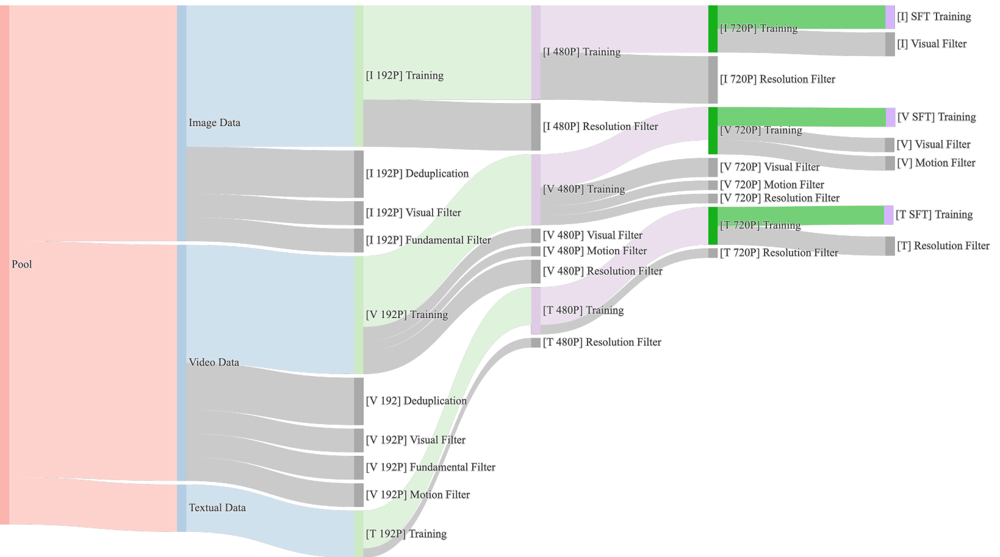

_图 3：不同训练阶段的数据配置。在每个阶段，我们根据数据吞吐量动态调整与运动、质量和类别相关的数据比例。_

生成质量。**晃动镜头素材**：指具有明显相机抖动的业余录制视频，通常会导致运动模糊和前景背景界限模糊。此类数据被系统地排除在训练之外。

**视觉文本数据**。此外，我们还引入了一种新颖的数据处理方法来增强 Wan 的视觉文本生成能力。该方法包含两个独立的处理分支，旨在同时提高文本渲染的准确性和和谐度。一方面，我们通过在纯白背景上渲染中文字符，合成了数亿张包含文本的图像。另一方面，我们从海量真实世界数据中收集了大量包含文本的图像。我们采用多种 OCR 模型，准确地从图像和视频中识别英文和中文文本，随后将这些提取的文本内容输入到多模态语言模型 Qwen2-VL 中。这一过程生成了图像的自然描述，确保描述中包含尽可能精确的文本内容。我们利用这一处理管道收集了大量的真实世界图像-文本对。通过在预训练阶段结合合成数据和真实数据，我们的方法能够有效地泛化，在视频中生成具有准确字形和高度真实感的生僻字，在视觉文本生成方面表现出显著的优越性。

# 3.2 后训练数据 (POST-TRAINING DATA)

后训练的核心目标是通过高质量数据提高生成视频的视觉保真度和运动动态。在此阶段，我们的数据处理管道针对静态数据和动态数据采用了不同的策略：图像数据经过优化以提高视觉质量，而视频数据则经过专门处理以提升运动质量。

**图像处理**。从高评分图像数据池中，我们执行额外的精炼过程，以识别在质量、构图和细节等方面表现卓越的顶级样本。具体而言，我们使用两种方法构建精选数据集：基于专家模型的收集和人工收集。前者涉及根据专家模型预测的分数选择前 \(20\%\) 的图像。对于该子集，我们还考虑了风格和类别等因素，以确保数据分布的多样性。后者涉及从各种类别和数据源中人工收集顶级图像，同时填补数据集中缺失的概念，以增强模型的泛化能力。通过这一过程，我们总共收集了数百万张精选图像。

---

---

**视频处理。** 在此阶段，我们采用类似于图像处理的策略来收集高质量视频。首先，我们利用视觉质量分类器从候选数据集中筛选出部分排名靠前的视频。然后，基于运动质量分类器，我们选取了数百万个包含简单运动的视频和数百万个包含复杂运动的视频。所有视频的筛选都遵循强调类别平衡和高多样性的策略。同时，我们从科技、动物、艺术、人物、车辆等 12 个主要类别中选取数据，以增强模型对常用类别的生成能力。

# 3.3 密集视频描述 (DENSEVIDEOCAPTION)

虽然我们的数据集包含许多图像和视频的原始网页文本描述，但这些描述往往过于简单，无法传达详细的视觉内容。DALL-E 3 (Betker et al., 2023) 证明了，通过在高度描述性的生成视觉描述上进行训练，可以显著增强视觉生成模型遵循提示词的能力。因此，我们开发了一个内部描述模型，为数据集中的每个图像和视频生成密集描述。为了训练该模型，我们结合了开源的视觉-语言数据集以及内部收集的额外数据。

# 3.3.1 开源数据集

我们收集了广泛使用的图像和视频视觉-语言数据集。我们的集合不仅包含描述数据集，还包含专注于视觉内容（如动作、计数和 OCR）的视觉问答数据集。在某些场景下，我们需要描述模型根据用户指令生成特定风格或内容的描述。因此，我们还收集了纯文本指令数据，以增强模型遵循指令的能力。

# 3.3.2 内部数据集

我们为各种任务收集了内部数据集，以增强模型在特定领域的能力。

**名人、地标和电影角色。** 为了训练我们的模型识别名人、地标和角色，我们收集了一个包含数千个身份的数据集。首先，我们使用大型语言模型（LLM）收集名字，然后使用 CLIP 风格的模型从我们的图像-文本数据库中检索相应的图像。我们测试了多种 CLIP 风格的模型，发现 TEAM (Xie et al., 2022) 在识别个体方面表现出色，特别是中国名人。为了进一步减少数据集中的噪声，我们对图像-文本对的描述实施了关键词匹配。只有当图像被 TEAM 模型检索到并且匹配指定的关键词时，才会被保留。

**物体计数。** 为了增强模型的视觉计数能力，我们通过检索包含“一”、“二”、“三”等词语的文本描述的图像，编制了一个计数数据集。这些数字为图像提供了粗略的标注。然后，我们使用 LLM 从相应的文本中提取（类别，计数）对。最后，我们使用 Grounding DINO (Liu et al., 2023d) 统计这些类别中的物体。只有当图像的文本描述与 Grounding DINO (Liu et al., 2023d) 的结果匹配时，才会被保留。

**OCR。** 为了提高模型生成文本描述的能力，我们收集了一个 OCR 增强的图像描述数据集。最初，我们使用现成的 OCR 检测器从图像中提取文本。然后，我们提示我们的描述模型基于这些 OCR 结果生成描述。这种方法通过使用提取的 OCR 文本作为先验知识，确保了准确的文本描述。目前，我们仅包含英文和中文文本。

**摄像机角度和运动。** 我们观察到，当前的多模态语言模型（MLLM）在预测摄像机角度和运动方面存在困难，包括像 GPT-4o 和 Google Gemini Pro 这样的最先进商业模型。为了增强这些预测能力，我们首先标注了一组用于摄像机角度和运动的数据集。该数据集可以以两种方式使用：直接用于训练我们在最终训练阶段使用的描述模型，或者通过训练一个专家模型来标注更多视频数据，以在我们的模型早期训练阶段提供帮助。该数据集增强了我们关于运动和角度描述的准确性，从而提高了视频生成模型的摄像机运动可控性。

---

---

细粒度类别。为了增强模型识别动物、植物和车辆等细粒度类别的能力，我们创建了一个包含数百万张这些类别图像的数据集。

关系理解。我们通过整合现有的目标检测数据集，收集了专注于空间关系（如左、右、上、下）的数据集，从而增强了模型的关系理解能力。

重新描述。字幕模型的一个重要能力是利用现有的标签或简短的字幕生成密集的字幕。为此，我们策划了一个重新描述数据集，能够根据图像内容将简短的文本标签或字幕扩展为详细的描述。

编辑指令字幕。我们收集了一个描述两张图像之间差异或变换的数据集。这类字幕对于图像编辑任务非常有价值。

组图描述。我们收集了一个为图像组提供描述的数据集。每条字幕首先描述图像共有的特征，然后使用相似的措辞分别描述每张图像。

人工标注的图像和视频字幕。我们收集了人工标注的图像和视频密集字幕。这些代表了我们质量最高的字幕数据，用于模型训练的最后阶段。

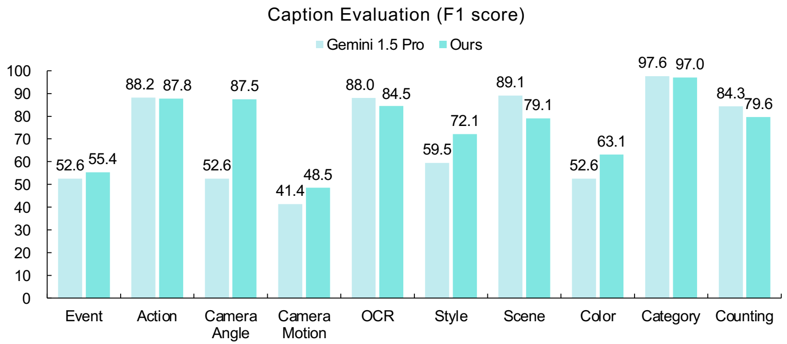

_图 4：我们的字幕模型整体性能与 Google Gemini 1.5 Pro 相当。特别是在事件、拍摄角度、镜头运动、风格和颜色等方面表现优异。_

# 3.3.3 模型设计

架构。我们的字幕模型采用了 LLaVA 风格的架构 (Liu et al., 2023c)。我们使用 ViT 编码器来提取图像和视频帧的视觉嵌入。这些嵌入通过两层感知机投影，然后输入到 Qwen LLM (QwenTeam, 2024) 中。

对于图像输入，我们采用了类似 LLaVA 的动态高分辨率策略。一张图像最多可以被划分为七个图块。对于每个图块，我们将视觉嵌入自适应池化为一个 \(12 \times 12\) 的网格表示，以降低计算量。

对于视频，我们每秒采样 3 帧，上限为 129 帧。为了进一步降低计算量，我们采用了慢-快编码策略：每四帧保持原始分辨率，对其余帧的嵌入应用全局平均池化。在长视频基准测试上的实验表明，慢-快机制能够在视觉标记数量有限的情况下增强理解能力（例如，在 VideoMME (Fu et al., 2024) 上，性能从 \(67.6\%\) 提升到了 \(69.1\%\)），且无需字幕。

训练。遵循最近的最先进方法，我们的训练过程分为三个阶段。在第一阶段，我们冻结 ViT 和 LLM，仅训练多层感知机，以将视觉嵌入与 LLM 输入空间对齐，学习率设为 1e-3。在第二阶段，所有参数都变为可训练状态。在最后阶段，我们在一小部分上进行端到端训练

---

---

高质量数据。在最后两个阶段，我们将 LLM 和 MLP 的学习率设置为 1e-5，将 ViT 的学习率设置为 1e-6。

# 3.3.4 评估

自动评估对于我们的字幕模型开发至关重要，使我们能够识别每个模型版本的优缺点。遵循 CAPability (Liu et al., 2025b) 的方法，我们开发了一个自动字幕评估流程。我们专注于视频生成中的十个关键视觉维度：动作、拍摄角度、运镜、物体类别、物体颜色、物体计数、OCR、场景、风格和事件。对于每个维度，我们随机抽取了 1,000 个视频及其由模型生成的相应字幕。我们还使用 Google Gemini 1.5 Pro 为该数据集生成了密集视频字幕。我们遵循 CAPability (Liu et al., 2025b) 的方法，通过计算每个维度的 F1 指标来评估我们的字幕和 Gemini 生成的字幕。结果如图 4 所示。我们的字幕在视频事件、拍摄角度、运镜、风格和物体颜色方面表现更好，而 Gemini 在动作、OCR、场景、物体类别和物体计数方面表现出色。

# 4 模型设计与加速

# 4.1 时空变分自编码器

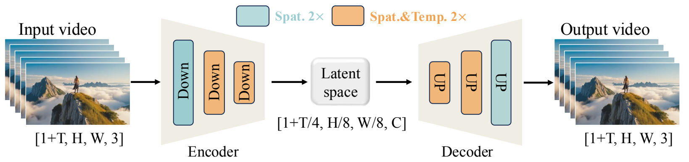

_图 5：我们的 Wan-VAE 框架。Wan-VAE 可以将视频的时空维度压缩 \(4 \times 8 \times 8\) 倍。橙色矩形代表 \(2 \times\) 时空压缩，绿色矩形代表 \(2 \times\) 空间压缩。_

变分自编码器 (VAEs) (Wu et al., 2024; Blattmann et al., 2023; OpenAI, 2024) 在从高维视觉数据（尤其是视频）中学习紧凑的潜在表示方面发挥着关键作用，从而促进了生成模型（例如扩散模型）的可扩展且高效的训练。然而，为视频生成任务设计有效的 VAE 面临着若干挑战。首先，视频本质上具有空间和时间维度，要求 VAE 能够捕捉复杂的时空依赖关系。其次，视频固有的高维特性（例如具有高分辨率像素的多帧）增加了内存消耗和计算成本，使得将 VAE 扩展到长视频序列变得困难。第三，确保时间因果性（即未来的帧不影响过去的帧）对于生成逼真且连贯的视频内容至关重要，然而这一约束引入了额外的架构复杂性。

为了解决这些挑战，我们提出了一种专为视频设计的新型 3D 因果 VAE 架构 (Wan-VAE)。我们结合多种策略 (Wu et al., 2024) 来改善时空压缩、减少内存使用并确保时间因果性。这些增强使 Wan-VAE 更加高效和可扩展，并且更适合与基于扩散的生成模型（如 DiT）集成。接下来，我们将介绍 Wan-VAE 的网络设计、训练细节、高效推理和实验对比。

# 4.1.1 模型设计

为了实现高维像素空间与低维潜在空间之间的双向映射，我们设计了一个 3D 因果 VAE，如图 5 所示。给定输入视频 \(V \in \mathbb{R}^{(1 + T) \times H \times W \times 3}\)，Wan-VAE 将其时空维度压缩至 \([1 + T/4, H/8, W/8]\)，同时将通道数 \(C\) 扩展为 16。具体而言，第一帧仅进行空间

---

---

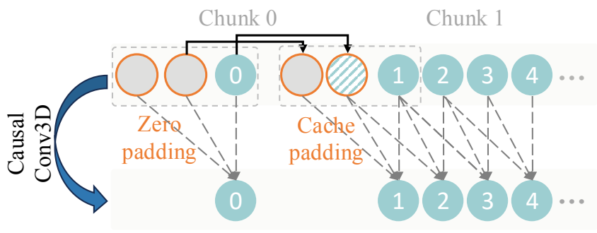

_(a) 默认设置下的特征缓存_

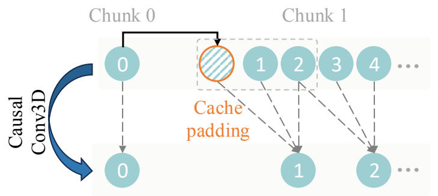

_(b) \(2 \times\) 时序下采样下的特征缓存_

_图 6：我们的特征缓存机制。 和 分别展示了我们在常规因果卷积和时序下采样中如何使用该机制。_

参照 MagViT-v2 (Yu et al., 2023) 的方法，我们对数据进行压缩以更好地处理图像数据。在架构方面，我们将所有 GroupNorm 层 (Wu & He, 2018) 替换为 RMSNorm 层 (Zhang & Sennrich, 2019)，以保持时序因果性。这一修改使得特征缓存机制（参见 4.1.3 节）得以应用，显著提高了推理效率。此外，我们将空间上采样层中的输入特征通道数减半，从而使推理过程中的内存消耗减少了 \(33\%\)。

通过进一步精细调整基础通道数，Wan-VAE 实现了仅 127M 参数的紧凑模型规模。这一优化减少了编码时间和内存使用，从而有利于后续扩散 Transformer 模型的训练。

# 4.1.2 训练

我们采用三阶段方法来训练 Wan-VAE。首先，我们构建一个具有相同结构的 2D 图像 VAE，并在图像数据上进行训练。然后，我们将训练好的 2D 图像 VAE 膨胀为 3D 因果 Wan-VAE，以提供初始的空间压缩先验，与从头开始训练视频 VAE 相比，这极大地提高了训练速度。在此阶段，Wan-VAE 在低分辨率 \((128\times 128)\) 和少帧数（5 帧）的视频上进行训练，以加速收敛速度。训练损失包括 \(L1\) 重建损失、KL 损失和 LPIPS 感知损失，其权重系数分别为 3、3e-6 和 3。最后，我们在具有不同分辨率和帧数的高质量视频上对模型进行微调，并结合来自 3D 判别器的 GAN 损失 (Esser et al., 2021)。

# 4.1.3 高效推理

为了高效支持任意长度视频的编码和解码 (Yang et al., 2025a; Yao et al., 2021)，我们在 Wan-VAE 的因果卷积模块中实现了特征缓存机制。

具体而言，视频序列帧数遵循 \(1 + T\) 输入格式，因此我们将视频分为 \(1 + T / 4\) 个块，这与潜在特征的数量一致。在处理输入视频序列时，模型采用分块策略，其中每次编码和解码操作仅处理对应于单个潜在表示的视频块。基于时序压缩比，每个处理块中的帧数限制为最多 4 帧，从而有效防止内存溢出。

为了确保上下文块之间的时序连续性，我们的模型有策略地维护来自先前块的帧级特征缓存。这些缓存特征被系统地整合到后续块的因果卷积计算中。具体过程如图 6 所示，该图展示了我们特征缓存机制中的两种典型场景。在图 6 中，在我们的默认设置下，因果卷积不改变帧数，我们需要维护来自历史帧的两个缓存特征（卷积核大小为 3）。对于初始块，我们应用两个虚拟帧的零填充来初始化缓存缓冲区。后续块系统地复用前一块的最后两帧作为缓存特征，同时丢弃过时的历史数据。图 6 展示了涉及 \(2 \times\) 时序下采样（步长等于 2）的场景。在此场景下，需要不同的缓存管理策略：我们实现了单帧缓存

---

---

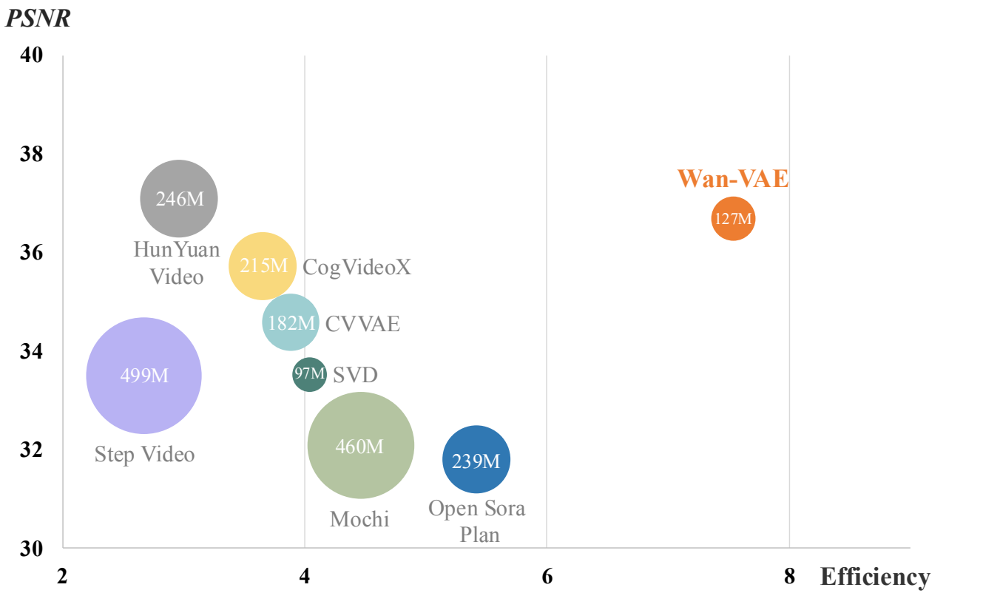

_注 1：球体面积代表模型参数的大小。（帧/延迟）注 2：默认压缩率为 \(4\times 8\times 8\) ，除了 SVD: \(1\times 8\times 8\) ，Mochi: \(6\times 8\times 8\) 和 Step Video: \(8\times 16\times 16\)_

_图 7：在 \(720 \times 720\) 分辨率和 25 帧下的视频重建性能对比。_

仅对非初始数据块进行填充，以确保维度一致性。这种配置保证了输出序列长度遵循精确的下采样比率，同时维持了数据块边界上的因果关系。

这种特征缓存机制不仅优化了内存利用率，还保持了跨数据块边界的特征连贯性，从而支持无限长度视频的稳定推理。

# 4.1.4 评估

定量结果。本研究通过分析峰值信噪比（PSNR）和处理效率（每单位延迟（秒）处理的帧数），对各种最先进（SOTA）视频 VAE 模型（Kong et al., 2024; Yang et al., 2025b）的性能进行了综合评估。值得注意的是，为了进行公平比较，大多数模型（Kong et al., 2024; Yang et al., 2025b）采用了与我们方法相同的压缩率和潜在特征维度，即压缩率为 \(4 \times 8 \times 8\)，潜在维度为 16。Open Sora Plan (Lab & etc., 2024) 的压缩率与我们相同，但潜在维度为 4。SVD (Blattmann et al., 2023) 采用的压缩率为 \(1 \times 8 \times 8\)，潜在维度为 4；Step Video (Ma et al., 2025) 采用的压缩率为 \(8 \times 16 \times 16\)，潜在维度为 64；Mochi (GenmoTeam, 2024) 使用的压缩率为 \(6 \times 8 \times 8\)，潜在维度为 12。评估在 200 个视频上进行。这些视频包含 25 帧，分辨率设定为 \(720 \times 720\)。在图 7 中，圆圈的大小与模型参数的数量呈正相关。

实验结果表明，Wan-VAE 在这两项指标上都表现出极具竞争力的性能，展示了卓越的视频质量和高处理效率的双重优势。值得注意的是，在相同的硬件环境下，我们 VAE 的重建速度比现有的 SOTA 方法（即 HunYuan Video）快 2.5 倍。由于我们 VAE 模型的小尺寸设计和特征缓存机制，这种速度优势在更高分辨率下将得到进一步体现。

这一进步为视频重建任务和视频生成训练提供了一种高效的解决方案。这些发现不仅验证了所提模型设计的有效性，也为 VAE 技术的未来发展提供了宝贵的见解。

定性结果。为了验证我们的方法在不同场景下的视频重建性能，图 8 展示了纹理、人脸、文本和高动态场景的视觉结果。与现有的 VAE 模型相比，Wan-VAE 在这些场景中表现出更优越的性能。在第一行展示的纹理场景中，我们的方法能够更准确地捕捉细节，例如头发的纹理和方向。在第二行描绘的人脸场景中，Wan-VAE 很好地保留了面部

---

---

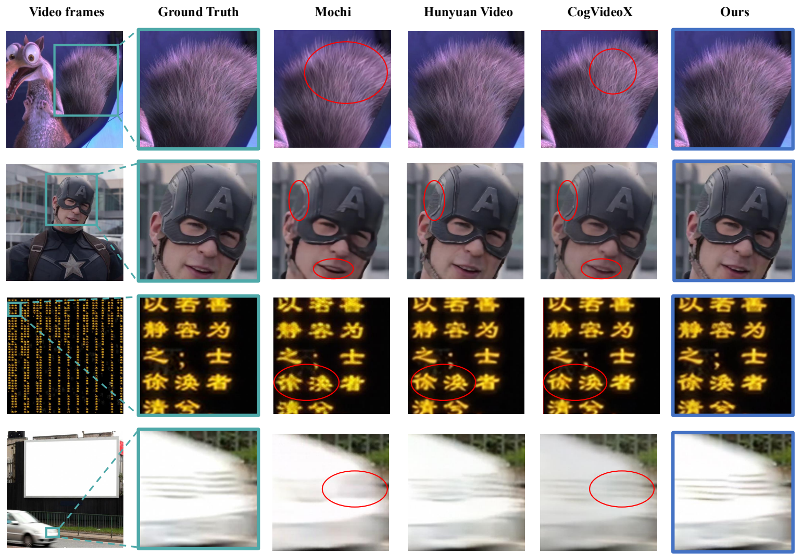

_图 8：不同场景下的视频重建可视化结果，包括纹理（第一行）、人脸（第二行）、文本（第三行）和高运动（第四行）。上述视频具有丰富的细节，但未用于训练。_

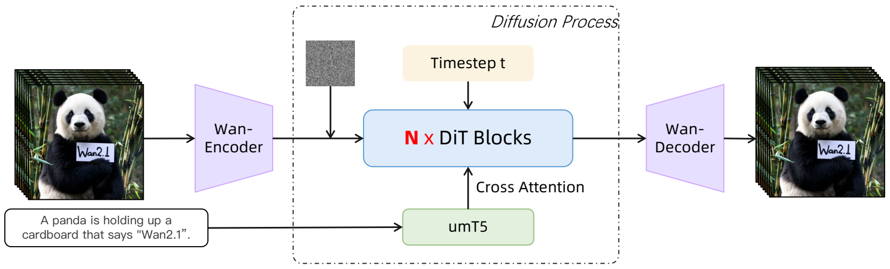

_图 9：Wan 的架构图。_

特征，同时减少了嘴唇周围的模糊和扭曲。在第三行展示的文本场景中，我们的方法成功清晰地恢复了文本内容，缓解了字符扭曲和丢失的问题。在第四行展示的高运动场景中，Wan-VAE 保持了视频帧的运动清晰度。这些结果表明，我们的方法在处理各种复杂场景方面具有显著优势。

# 4.2 模型训练

在本节中，我们将详细介绍基础视频模型的架构设计，特别是针对文本生成视频任务，以及预训练和后训练阶段的细节。

在图 9 中，我们展示了 Wan 的架构，该架构基于当前主流的 DiT (Peebles & Xie, 2023) 架构设计，通常由三个主要组件组成：Wan-VAE、扩散 Transformer 和文本编码器。对于给定的视频 \( V \in \mathbb{R}^{(1 + T) \times H \times W \times 3} \)，

---

Wan-VAE 的编码器将其从像素空间编码到潜在空间 \( x \in \mathbb{R}^{1 + T / 4 \times H / 8 \times W / 8} \)，随后将其输入到后续的扩散 Transformer 结构中。

# 4.2.1 视频扩散 Transformer (VIDEO DIFFUSION TRANSFORMER)

扩散 Transformer。扩散 Transformer 主要由三个组件组成：分块模块、Transformer 块和去分块模块。在每个块内，我们专注于有效地建模时空上下文关系，并将文本条件与时间步嵌入在一起。在分块模块中，我们使用核大小为 \((1,2,2)\) 的 3D 卷积，并应用展平操作将 \(x\) 转换为形状为 \((B,L,D)\) 的特征序列，其中 \(B\) 表示批次大小，\(L = (1 + T / 4) \times H / 16 \times W / 16\) 代表序列长度，\(D\) 表示潜在维度。具体而言，如图 10 所示，我们采用交叉注意力机制来嵌入输入的文本条件，这可以确保模型即使在长上下文建模下也能遵循指令的能力。此外，我们采用一个包含线性层和 SiLU (Elfwing et al., 2018) 层的 MLP 来处理输入的时间嵌入，并分别预测六个调制参数。该 MLP 在所有 Transformer 块之间共享，每个块学习一组独特的偏置。通过大量的

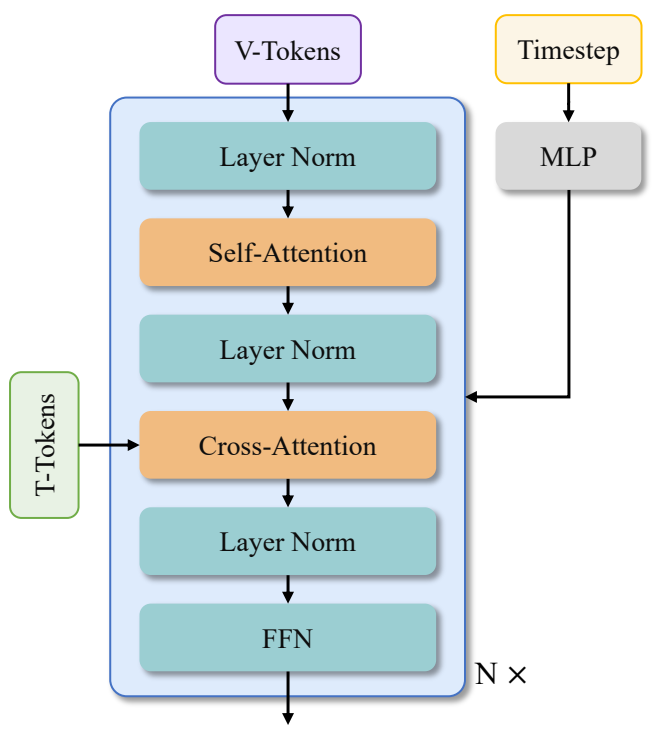

_图 10：Wan 的 Transformer 块。_

实验，我们已经证明这种设计可以将参数量减少约 \(25\%\)，并在相同的参数规模下显示出显著的性能提升。

文本编码器。Wan 的架构使用 umT5 (Chung et al., 2023) 来编码输入文本。通过大量实验，我们发现 umT5 在我们的框架中具有几个优势：1) 它拥有强大的多语言编码能力，能够有效地理解中文和英文，以及输入的视觉文本；2) 在相同条件下，我们发现 umT5 在组合能力方面优于其他单向注意力机制的 LLM；3) 它表现出卓越的收敛性，在相同的参数规模下，umT5 实现了更快的收敛。基于这些发现，我们最终选择 umT5 作为我们的文本嵌入器。

# 4.2.2 预训练 (PRE-TRAINING)

我们利用流匹配框架 (Lipman et al., 2022; Esser et al., 2024) 来建模跨图像和视频域的统一去噪扩散过程。我们首先在低分辨率图像上进行预训练，随后对图像和视频进行多阶段联合优化。图像-视频联合训练在各个阶段中通过逐步上采样数据分辨率和扩展时间持续时间来进行演变。

训练目标。流匹配为学习扩散模型中的连续时间生成过程提供了一个理论框架。它避免了迭代速度预测，能够通过常微分方程 (ODEs) 实现稳定训练，同时保持与最大似然目标的等价性。在训练期间，给定图像或视频潜在 \( x_{1} \)、随机噪声 \( x_{0} \sim \mathcal{N}(0, I) \) 以及从 logit-normal 分布中采样的时间步 \( t \in [0, 1] \)，获得中间潜在 \( x_{t} \) 作为训练输入。遵循修正流 (Rectified Flows, RFs) (Esser et al., 2024)，\( x_{t} \) 被定义为 \( x_{0} \) 和 \( x_{1} \) 之间的线性插值，即

$$
x _ {t} = t x _ {1} + (1 - t) x _ {0}. \tag {1}
$$

真实速度 \( v_{t} \) 为

$$
v _ {t} = \frac {d x _ {t}}{d t} = x _ {1} - x _ {0}. \tag {2}
$$

模型被训练来预测速度，因此，损失函数可以表述为模型输出与 \( v_{t} \) 之间的均方误差 (MSE)，

---

$$
\mathcal {L} = \mathbb {E} _ {x _ {0}, x _ {1}, c _ {t x t}, t} | | u (x _ {t}, c _ {t x t}, t; \theta) - v _ {t} | | ^ {2}, \tag {3}
$$

其中 \( c_{txt} \) 是长度为 512 个 token 的 umT5 文本嵌入序列，\( \theta \) 是模型权重，\( u(x_t, c_{txt}, t; \theta) \) 表示模型预测的输出速度。

图像预训练。我们的实验分析揭示了直接使用高分辨率图像和长时长视频序列进行联合训练存在的两个关键挑战：(1) 扩展的序列长度（对于 \(1280 \times 720\) 的视频通常为 81 帧）显著降低了训练吞吐量。在固定的 GPU 时长预算下，这导致数据吞吐量不足，从而阻碍了模型的收敛速度。(2) 过高的 GPU 内存占用迫使采用次优的批次大小，进而由梯度方差峰值引发训练不稳定。为了缓解这些问题，我们通过低分辨率 \((256px)\) 文本到图像预训练来初始化 14B 模型的训练，在逐步引入高分辨率视频模态之前，强制执行跨模态的语义-文本对齐和几何结构保真度。

图像-视频联合训练。在大规模 \(256px\) 文本到图像预训练之后，我们通过分辨率渐进式课程，利用图像和视频数据实施分阶段联合训练。该训练协议包含三个不同的阶段，以空间分辨率区域区分：(1) 在第一阶段，我们使用 \(256px\) 分辨率的图像和 5 秒的视频片段（\(192px\) 分辨率，16 fps）进行联合训练。(2) 在第二阶段，我们通过将图像和视频的分辨率均升级至 \(480px\) 来启动空间分辨率缩放，同时保持固定的 5 秒视频时长。(3) 在最后阶段，我们将图像和 5 秒视频片段的空间分辨率提升至 \(720px\)。

预训练配置。我们采用 bf16 混合精度的高效训练，并结合 AdamW（Loshchilov & Hutter, 2017; Kingma & Ba, 2014）优化器，权重衰减系数设为 \(1e^{-3}\)。初始学习率设定为 \(1e^{-4}\)，并根据 FID 和 CLIP Score 指标的平台期动态降低。

# 4.2.3 后训练

在后训练阶段，我们保持与预训练阶段相同的模型架构和优化器配置，并使用预训练检查点初始化网络。我们使用第 3.2 节中详述的后训练视频数据集，在 \(480px\) 和 \(720px\) 分辨率下进行联合训练。

# 4.3 模型扩展与训练效率

# 4.3.1 工作负载分析

在 Wan 中，与文本编码器和 VAE 编码器相关的计算成本低于 DiT 模型，后者在训练期间占总计算的 \(85\%\) 以上。对于 DiT 模型，主要的计算成本由表达式 \(L(\alpha bsh^2 + \beta bs^2 h)\) 给出，其中 \(L\) 表示 DiT 层的数量，\(b\) 是微批次大小，\(s\) 表示序列长度，\(h\) 表示隐藏维度大小。这里，\(\alpha\) 对应于线性层的成本，而 \(\beta\) 对应于注意力层的成本；对于 Wan 中使用的非因果注意力，\(\beta\) 在前向传播中为 4，在后向传播中为 8。与通用的 LLM 模型不同，Wan 处理的序列长度 \(s\) 经常达到数十万甚至更多。由于注意力的计算成本随 token 数量呈二次方增长，而线性层的成本仅呈线性增长，注意力机制逐渐成为训练的瓶颈。在序列长度达到 100 万的场景中，注意力的计算时间可能占端到端训练时间的 95%。

在训练过程中，仅优化 DiT 模型，而文本编码器和 VAE 编码器保持冻结状态。因此，GPU 内存使用主要集中在 DiT 的训练上。DiT 的 GPU 内存使用量可以表示为 \(\gamma L b s h\)，其中 \(\gamma\) 取决于 DiT 层的实现，\(L\) 表示 DiT 层的数量。由于视频 token、输入提示词和时间步被作为模型输入，\(\gamma\) 的值通常大于普通的 LLM 模型。例如，虽然标准 LLM 的 \(\gamma\) 可能为 34（Korthikanti 等），但 DiT 模型的 \(\gamma\) 可能超过 60。因此，当序列长度达到 100 万 token 且微批次大小为 1 时，14B DiT 模型中激活值的总 GPU 内存使用量可能超过 8 TB。

---

---

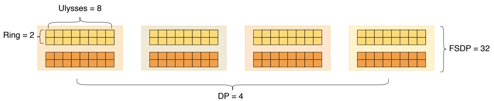

_图 11：DiT 并行策略示意图。假设共有 128 个 GPU，最内层由 Ulysses=8 和 Ring=2 组合而成。外层采用 FSDP=32，而最外层利用 DP=4。全局批次大小是微批次大小的 8 倍。_

综上所述，Wan 中的主要计算开销源于注意力机制。虽然计算成本随序列长度 \( s \) 呈二次方增长，但 GPU 显存使用量仅随 \( s \) 线性缩放。这为指导后续的优化工作提供了宝贵的参考。

# 4.3.2 并行策略

Wan 模型主要包含三个模块：VAE、文本编码器和 DiT。遵循第 4.1.3 节中概述的缓存机制优化，VAE 模块占用的 GPU 显存极少，可以无缝采用数据并行。相比之下，文本编码器需要超过 20 GB 的 GPU 显存，因此必须使用模型权重分片来为后续的 DiT 模块节省显存。为此，我们采用了结合数据并行和完全分片数据并行（FSDP）(Zhao et al., 2023) 的策略。DiT 的模型参数、梯度和优化器状态将超过单个 GPU 的容量，在涉及 100 万 token 且批次大小为 1 的场景中，激活值存储达到约 8 TB。此外，DiT 部分占据了整体计算工作量的很大比例。因此，我们专注于专门为 DiT 模块开发高效的分布式策略。

DiT 并行策略。鉴于 DiT 模型的规模适中，并考虑到计算与通信重叠的优化以及最大化数据并行规模，我们选择了 FSDP 作为我们的参数分片策略。

关于激活值，DiT 块的输入形状为 \([b, s, h]\)，其中 \(b\) 维度对应数据并行，\(s\) 代表序列长度，\(h\) 表示隐藏维度。因此，我们需要检查 \(s\) 和 \(h\) 维度的分片策略。沿 \(s\) 维度的分片通过上下文并行（CP）实现，常用方法包括 Ulysses (Jacobs et al., 2023) 和 Ring Attention (Liu et al., 2023a)。沿 \(h\) 维度的分片主要涉及 Megatron 的张量并行（TP）(Shoeybi et al., 2019) 结合序列并行（SP）(Korthikanti et al.)，通过分割权重来对激活值的隐藏维度进行分片。由于 CP 的通信开销小于 \((\mathrm{TP} + \mathrm{SP})\)，我们提议使用 CP 来加速批次级别的计算，同时减少每个 GPU 上的激活值显存占用。我们设计了一种结合了 Ulysses 和 Ring Attention 特点的二维（2D）CP，类似于 USP (Fang & Zhao, 2024)。在此设计中，外层采用 Ring Attention，内层利用 Ulysses。这种组合缓解了 Ulysses 固有的缓慢跨机通信问题，并解决了 Ring Attention 分片后对大块大小的需求，从而最大化了外层通信与内层计算之间的重叠。在序列长度为 256K 且跨 2 台机器共 16 个 GPU 的场景中，二维上下文并行的通信开销从 Ulysses 的超过 \(10\%\) 降低到了 \(1\%\) 以下。

FSDP 组和 CP 组在 FSDP 组内相交，DP 大小等于 FSDP 大小除以 CP 大小。在满足显存和单批次延迟要求后，我们使用 DP 进行扩展。图 11 展示了 DiT 模块的分布式方案。例如，在拥有 128 个 GPU 的配置中，CP 大小为 16，其中 Ulysses 设置为 8，Ring Attention 设置为 2；FSDP 设置为 32，对应批次大小为 2b；DP 设置为 4，最终全局批次大小为 8b。

不同模块的分布式策略切换。在训练期间，不同模块使用相同的资源。具体而言，我们对 VAE 和文本编码器应用 DP，而 DiT 模块则采用 DP 和 CP 的组合。因此，当 VAE 和文本编码器的输出在训练期间输入到 DiT 模块时，需要切换分布式策略以避免

---

资源浪费。具体而言，CP 要求 CP 组内的设备读取同一批次数据。然而，如果 VAE 和 Text Encoder 部分的设备也读取相同的数据，这将导致冗余计算。为了消除这种冗余，CP 组内的设备最初读取不同的数据。然后，在 CP 之前，我们执行一次大小等于 CP 大小的循环遍历，依次将 CP 组内不同设备读取的数据进行广播，以确保 CP 内部的输入是一致的。通过这种方式，VAE 和 Text Encoder 在单次模型迭代中的时间占比降低到了 \(1 / CP\)，从而提升了整体性能。

# 4.3.3 内存优化

如前所述，Wan 中的计算开销随序列长度 \(s\) 呈二次方增长，而 GPU 显存使用量随 \(s\) 呈线性增长。这意味着在长序列场景下，计算时间最终可能会超过卸载激活值所需的 PCIe 传输时间。具体而言，卸载一个 DiT 层激活值的 PCIe 传输时间可以与仅 1 到 3 个 DiT 层的计算时间重叠。与梯度检查点策略（Chen et al., 2016）相比，允许计算重叠的激活值卸载（Rhu et al., 2016）为在不牺牲端到端性能的前提下减少 GPU 显存占用提供了一种有效途径。因此，我们优先采用激活值卸载来降低 GPU 显存占用。由于 CPU 内存在长序列场景下也容易耗尽，我们将卸载与 GC 策略相结合，优先对 GPU 显存与计算量比值较高的层使用梯度检查点。

# 4.3.4 集群可靠性

通过利用阿里巴巴云在训练集群内的高级智能调度、慢节点检测以及强大的自愈能力，我们确保了高稳定性。硬件问题会在作业启动阶段被识别出来，确保只有健康的节点被分配给训练任务。在整个训练过程中，任何故障节点都会被及时隔离和修复，任务会自动重启，训练无缝恢复。这种高效编排有效地将可靠性与高性能结合在一起，确保了整体系统的稳定性。

# 4.4 推理

推理优化的主要目标是最大限度地减少视频生成的延迟。与训练不同，推理过程涉及多个采样步骤，通常约为 50 步。因此，我们采用量化和分布式计算等技术来减少每个单独步骤所需的时间。此外，我们利用步骤之间的注意力相似性来降低整体计算负载。此外，对于无分类器引导（CFG）（Ho & Salimans, 2022），我们利用其内在相似性进一步减少计算需求。

# 4.4.1 并行策略

如第 4.3.2 节所述，我们利用上下文并行来在扩展到多个 GPU 时降低生成单个视频的延迟。此外，对于像 Wan 14B 这样的大模型，我们采用模型分片来缓解 GPU 显存限制。模型分片策略：鉴于推理期间的序列长度较长，与 TP 相比，FSDP 产生的通信开销更少，并且允许计算重叠。因此，我们采用 FSDP 方法进行模型分片，这与我们的训练方法一致。上下文并行策略：我们采用与训练阶段相同的 2D 上下文并行，其中 RingAttention 作为外层循环，Ulysses 作为内层循环。配备 2D 上下文并行和 FSDP 并行策略，DiT 在 Wan 14B 模型上实现了近乎

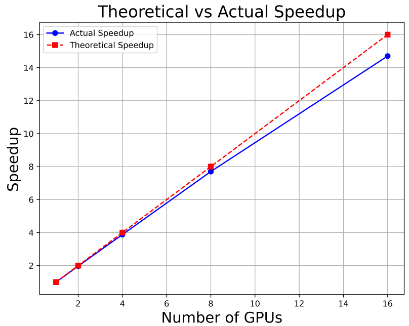

_图 12：通过多 GPU 扩展推理。_

线性的加速比，如图 12 所示。

---

# 4.4.2 扩散缓存 (DIFFUSION CACHE)

我们对 Wan 模型进行了深入分析，并确定了其推理过程中的以下特征：

- 注意力相似性：在同一个 DiT 模块内，不同采样步骤的注意力输出表现出显著的相似性。

- CFG 相似性：在采样的后期阶段，有条件和无条件 DiT 输出之间存在显著的相似性。

这些发现也在近期的工作中得到了强调，例如 DiTFastAttn (Yuan et al., 2024b) 和 FasterCache (Lv et al., 2024)。我们利用这些特征来实现扩散缓存，以减少计算工作量。在实践中，我们针对 Wan 模型定制了扩散缓存，以确保无损性能。具体来说，我们使用验证集来选择特定的步骤进行缓存：

- 注意力缓存：对于注意力组件，我们每隔几个步骤执行一次注意力前向传播并缓存结果，在其他步骤中重用缓存的结果。

- CFG 缓存：对于无条件部分，我们每隔几个步骤执行一次 DiT 前向传播，并在其他步骤中重用有条件的结果。此外，我们应用了类似于 FasterCache 的残差补偿方法，以防止细节质量下降。

在将扩散缓存应用于 Wan 14B 文本生成视频模型后，我们将推理性能提升了 \(1.62 \times\)。

# 4.4.3 量化 (QUANTIZATION)

FP8 GEMM。我们发现，在 GEMM 操作中使用 FP8 精度，并结合权重的按张量量化和采样步骤中激活值的按令牌量化，带来的性能损失极小。因此，我们对 DiT 模块中的所有 GEMM 操作应用了 FP8 量化。FP8 GEMM 的性能是 BF16 GEMM 的两倍，并在 DiT 模块中实现了 \(1.13 \times\) 的加速。

8-Bit FlashAttention。尽管 FlashAttention3 (Shah et al., 2025) 实现了高性能，但正如我们在实验中观察到的那样，其原生的 FP8 实现在视频生成中会导致显著的质量下降。相反，SageAttention (Zhang et al., 2024) 采用 int8 和 fp16 的混合精度来减少精度损失，但它没有针对 Hopper GPU 提供特定的适配。截至本报告发布时，SageAttention 的后续优化已显示出改进的 Hopper 兼容性。未来的工作将探索整合这些性能增强。

我们介绍了应用于 FA3-FP8 实现的优化，重点关注数值稳定性和计算效率。

精度。为了缓解在 Wan 模型中观察到的 FA3-FP8 量化下的注意力数值误差，我们采用了两种主要技术：

- 混合 8 位优化。FA3 的原生实现对所有输入张量 \((Q, K, V)\) 使用 FP8 (E4M3)。基于我们对数据分布的分析以及来自 SageAttention 的经验证据，我们采用了一种混合量化策略：对 \(S = QK^T\) 使用 Int8，对 \(O = PV\) 使用 FP8。

- 跨块归约的 FP32 累加。原生的 FP8 WGMMA 实现使用 14 位累加器，使其在长序列处理中容易溢出。为了解决这一限制，我们的方法利用 FP8 WGMMA 进行块内 \(PV\) 归约，同时通过带有 Float32 寄存器的 CUDA 核心实现跨块累加，这一策略受到了 DeepSeek-V3 (Liu et al., 2024a) 的 FP8 GEMM 方法论的启发。

性能。为了在混合 INT8-FP8 量化下保持内核性能，同时提高 \( O = PV \) 的累加精度，我们采用了两种技术：

- 融合 Float32 累加与线程组内流水线。FlashAttention3 采用了一种线程组内流水线，将 WGMMA 与 softmax 和缩放重叠。为了缓解

---

<table><tr><td>用户提示词</td><td>重写结果</td></tr><tr><td>A Viking warrior wields a great axe with both hands, battling a mammoth at dusk, amidst a snowy landscape with snowflakes swirling in the air.</td><td>史诗般的战斗场面展开，一名高大强壮的维京战士双手挥舞着沉重的巨斧，与一头巨大的猛犸象对峙。战士身穿皮甲，头戴角盔，肌肉线条分明，表情凶猛而坚定。猛犸象身披长毛，长着锋利的獠牙，愤怒地咆哮着。此时正值黄昏，雪地景观中雪花飞舞，营造出紧张而充满戏剧性的氛围。背景是一片荒芜的冰原，远处群山的轮廓依稀可见。冷色调的灯光运用强调了力量与勇气。该场景采用高角度动态特写镜头捕捉。</td></tr><tr><td>The camera follows a motor-boat chasing dolphins in the sea.</td><td>以纪录片摄影风格，镜头跟随一艘在浩瀚海洋中追逐海豚群的摩托艇。摩托艇上，一名驾驶员身穿救生衣，戴着安全头盔，神情专注而兴奋。海豚身形流畅光滑，不时跃出水面，又敏捷地潜回水中。天空湛蓝，阳光普照，海面波光粼粼。远处的天空中点缀着几朵白云。场景充满活力与能量，以中景镜头和跟踪视角拍摄。</td></tr><tr><td>The tiny Potato King, wearing a majestic crown, sits on the throne as potato subjects pay homage to it.</td><td>以超现实主义风格，微小的土豆国王戴着宏伟的金冠，坐在高耸的宝座上。它的皮肤呈现自然的土黄色调，带有微妙的凹凸纹理。土豆臣民们分列两侧，低头向国王致敬。背景展示了宫殿宏伟的内部，金红色的装饰显得奢华而庄严。一束光从上方照射下来，营造出神圣的氛围。该场景采用高角度特写镜头捕捉。</td></tr></table>

_表 1：用户提示词及其重写结果示例。这些示例最初为中文，为了展示目的已翻译成英文。_

为了减少跨块进行 Float32 \(PV\) 累加所带来的性能损耗，我们将 Float32 累加与 `rescale_o` 操作进行了融合。

- **块大小调优**。由于跨块的 Float32 PV 累加寄存器引入了额外的寄存器压力，我们调整了块大小以减少寄存器溢出。经过优化，我们的 8 位 FlashAttention 在 NVIDIA H20 GPU 上达到了 \(95\%\) 的 MFU。

因此，借助 8 位 FlashAttention，我们将推理效率提升了 \(1.27 \times\) 以上。

# 4.5 提示词对齐

提示词对齐旨在通过将用户输入的提示词与训练期间使用的字幕格式和风格相对齐，来提升模型推理的有效性。在此过程中，我们采用了两种主要策略。首先，我们为每个视频配以多种多样的字幕，从而增加多样性。其次，我们重写用户提示词，使其与训练阶段视频字幕的分布相对齐。下文中，我们将详细阐述这些策略。

为了适应多样化的用户输入，每张图片或视频都配有反映不同风格和长度的多个字幕。例如，我们使用不同长度（如长、中、短）和风格（如正式、非正式和诗意）的字幕，为训练数据创建了多样化的样本-字幕对。这些字幕建立了文本与视频之间不同的映射关系，有效地覆盖了用户可能提供的各种提示词范围。

---

---

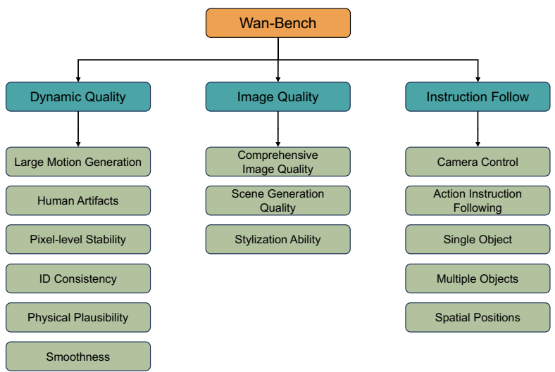

_图 13：Wan-Bench 涵盖的维度。_

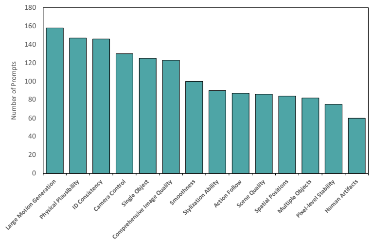

_图 14：Wan-Bench 各维度下提示词数量的分布。_

尽管描述文本具有多样性，但数据集描述与用户输入提示词之间往往存在分布不匹配的问题。通常，用户更倾向于由少量简单词汇组成的简洁提示词，这显著短于训练描述。这种差异可能会对生成视频的质量产生不利影响。为了解决这一问题，我们利用大语言模型（LLM）来重写提示词，以优化用户输入。我们的主要目标是使这些优化后的提示词的分布与训练描述的分布保持一致，从而获得更好的推理性能。LLM 在重写用户提示词时遵循以下原则：

1. 我们指示 LLM 在不改变原意的前提下为提示词添加细节，以增强生成场景的完整性和视觉吸引力。

2. 重写后的提示词应包含自然的运动属性，我们会根据主体类别添加适当的动作，以确保生成视频中的运动更加平滑流畅。

3. 我们建议重写后的提示词采用与后训练描述类似的结构，以视频风格开头，随后是内容摘要，最后是详细描述。这种方法有助于使提示词与高质量视频描述的分布保持一致。

我们在基准测试上评估了 LLM 辅助提示词重写的有效性，部分结果展示在表 1 中。研究结果表明，具有强大指令遵循能力的 LLM 可以生成合适的提示词，从而提升视频生成效果。为了平衡速度和性能，我们选用 Qwen2.5-Plus 作为我们的重写模型。

# 4.6 基准测试

现有的视频生成评估方法，如 Fréchet Video Distance (FVD) (Unterthiner et al., 2018) 和 Fréchet Inception Distance (FID) (Heusel et al., 2017)，缺乏与人类感知的一致性。我们提出了一种自动化、全面且符合人类感知的 Wan-Bench，用于评估视频生成模型。

Wan-Bench 由三个核心维度组成：动态质量、图像质量和指令遵循，包含 14 个细粒度指标。我们为每个维度设计了特定的评分算法，对于简单任务（如目标检测）使用传统检测器，而对于复杂任务则使用多模态大语言模型（MLLM）。

动态质量。动态质量旨在评估模型在非静态场景下的质量和稳定性。

大幅度运动生成。为了衡量运动生成的上限，提示词的设计旨在激发大幅度的运动。我们使用 RAFT (Teed & Deng, 2021) 计算生成视频的光流，并通过归一化光流的幅度来评估运动分数。

人工痕迹。现有的评估方法缺乏检测 AI 生成痕迹的能力。因此，我们在 20,000 张标注了 AI 生成痕迹的图像上训练了一个基于 YOLOv3 的模型 Redmon & Farhadi (2018）

---

...由人类识别伪影的位置。伪影得分综合考虑了预测的可能性、边界框以及相应的持续时间。

物理合理性与流畅度。为了评估物理合理性，我们设计了提示词以生成与物理相关的运动（例如，球体弹跳、物体交互、水流），并利用 Qwen2-VL (Bai et al., 2023) 借助其丰富的现实世界物理知识。通过视频问答模型，我们检测违反物理定律的现象，例如物体穿模、不真实的碰撞或反重力的运动。为了评估流畅度，我们精心设计了包含复杂运动的提示词，并利用 Qwen2-VL 识别伪影以评估运动的流畅性。

像素级稳定性。像素级稳定性用于确定视频中是否频繁出现噪点。我们利用光流来识别静态区域，并计算这些区域内的逐帧差异。对于稳定的视频，静态区域内的这些差异相对较小。

ID 一致性。考虑了三个子维度：人体一致性、动物一致性和物体一致性，分别涵盖不同的提示词集合。提取逐帧的 DINO (Caron et al., 2021) 特征，以比较逐帧的相似度作为一致性得分。

图像质量。图像质量维度的目的是评估视觉质量和审美感知。

综合图像质量。测量视觉质量需要对保真度和美学进行评估。在保真度方面，我们采用 MANIQA (Yang et al., 2022)，它能有效检测模糊和伪影，确保对清晰度的精确评估。在美学方面，我们利用两个成熟的模型：基于 LAION 的美学预测器 (LAION-AI, 2022) 和 MUSIQ (Ke et al., 2021)。我们通过计算这三个评估器的平均值来得出最终的图像质量得分。

场景生成质量。我们评估两个关键方面：逐帧场景一致性和场景-文本对齐。对于一致性，我们测量连续帧之间的 CLIP 相似度 (Radford et al., 2021) 以确保时间连贯性。对于对齐，我们计算帧与其相应文本之间的 CLIP 相似度以验证语义准确性。我们通过对这些指标进行加权平均来计算质量得分。

风格化。我们利用 Qwen2-VL 通过逐帧问答来评估艺术视频生成能力。

指令遵循。指令遵循评估模型理解和执行文本指令的能力。

单物体与多物体及空间位置。我们利用 Qwen2-VL 预测视频中的物体类别、数量和空间关系。评估得分表示准确对应给定提示词的帧的平均数量。

镜头控制。我们通过 130 个定制的提示词评估五种镜头运动风格：平移、升降、推拉（变焦）、航拍镜头和跟拍镜头。对于平移、升降和推拉，我们通过 RAFT 分析光流以评估运动风格。对于复杂的航拍和跟拍镜头，我们利用 Qwen2-VL 通过视频问答推断镜头运动。

动作指令遵循。我们将运动分为人体（例如，奔跑）、动物（例如，爬行）和物体运动（例如，飞行）。由于评估这些运动需要关于其执行方式的先验知识，我们通过向 Qwen2-VL 提供关键帧来进行评估。我们查询模型关于动作的对齐度、动作的完成度以及伪影的存在情况，从而全面评估文本与视频之间的对齐度。

人类反馈引导的加权策略。我们利用人类反馈来分配综合视频质量得分，考虑到每个维度对用户偏好的影响不同，而不是简单地对它们取平均值。我们收集了超过 5,000 对由不同模型（包括 Wan）生成的视频的成对比较。用户根据给定文本评估视频对，指出他们的偏好并分配近似分数。维度偏好权重源自模型生成的得分与人类评分之间的皮尔逊相关系数，并作为最终得分计算中的加权因子。

---

<table><tr><td>Wan-Bench 维度</td><td>CNTopB</td><td>混元</td><td>Mochi</td><td>CNTopA</td><td>Sora</td><td>Wan 1.3B</td><td>Wan 14B</td></tr><tr><td>大幅度运动生成</td><td>0.405</td><td>0.413</td><td>0.420</td><td>0.284</td><td>0.482</td><td>0.468</td><td>0.415</td></tr><tr><td>人工制品</td><td>0.712</td><td>0.734</td><td>0.622</td><td>0.833</td><td>0.786</td><td>0.707</td><td>0.691</td></tr><tr><td>像素级稳定性</td><td>0.977</td><td>0.983</td><td>0.981</td><td>0.974</td><td>0.952</td><td>0.976</td><td>0.972</td></tr><tr><td>ID 一致性</td><td>0.940</td><td>0.935</td><td>0.930</td><td>0.936</td><td>0.925</td><td>0.938</td><td>0.946</td></tr><tr><td>物理合理性</td><td>0.836</td><td>0.898</td><td>0.728</td><td>0.759</td><td>0.933</td><td>0.912</td><td>0.939</td></tr><tr><td>平滑度</td><td>0.765</td><td>0.890</td><td>0.530</td><td>0.880</td><td>0.930</td><td>0.790</td><td>0.910</td></tr><tr><td>综合图像质量</td><td>0.621</td><td>0.605</td><td>0.530</td><td>0.668</td><td>0.665</td><td>0.596</td><td>0.640</td></tr><tr><td>场景生成质量</td><td>0.369</td><td>0.373</td><td>0.368</td><td>0.386</td><td>0.388</td><td>0.385</td><td>0.386</td></tr><tr><td>风格化能力</td><td>0.623</td><td>0.386</td><td>0.403</td><td>0.346</td><td>0.606</td><td>0.430</td><td>0.328</td></tr><tr><td>单一物体准确性</td><td>0.987</td><td>0.912</td><td>0.949</td><td>0.942</td><td>0.932</td><td>0.930</td><td>0.952</td></tr><tr><td>多物体准确性</td><td>0.840</td><td>0.850</td><td>0.693</td><td>0.880</td><td>0.882</td><td>0.859</td><td>0.860</td></tr><tr><td>空间位置准确性</td><td>0.518</td><td>0.464</td><td>0.512</td><td>0.434</td><td>0.458</td><td>0.476</td><td>0.590</td></tr><tr><td>镜头控制</td><td>0.465</td><td>0.406</td><td>0.605</td><td>0.529</td><td>0.380</td><td>0.483</td><td>0.527</td></tr><tr><td>动作指令遵循</td><td>0.917</td><td>0.735</td><td>0.907</td><td>0.783</td><td>0.721</td><td>0.844</td><td>0.860</td></tr><tr><td>加权得分</td><td>0.690</td><td>0.673</td><td>0.639</td><td>0.693</td><td>0.700</td><td>0.689</td><td>0.724</td></tr></table>

_表 2：使用 Wan-Bench 的商业模型与开源模型的性能对比。_

# 4.7 评估

# 4.7.1 指标与结果

基线与指标。截至撰写时，市场上存在众多竞争者，包括商业模型，如 Kling (快手, 2024.06)、Hailuo (MiniMax, 2024.09)、Sora (OpenAI, 2024)、Runway (Runway, 2024.06) 和 Vidu (生数科技, 2024.07)，以及开源模型，如 Mochi (GenmoTeam, 2024)、CogVideoX (Yang et al., 2025b) 和 Hunyuan (Kong et al., 2024)。在本节中，我们将我们的模型与经过基准测试评估并获得相对积极用户反馈的商业和开源模型进行了比较。

定量结果。我们使用 Wan-Bench 提示词为每个候选模型收集了 1,035 个样本，并通过 Wan-Bench 评分进行了公平评估。评估侧重于三个关键指标：动态质量、图像质量和指令遵循准确性。我们通过计算根据人类偏好（第 4.6 节）加权的总分来对不同生成模型的性能进行排名。表 2 中的结果表明，Wan 优于现有的商业和开源模型。

定性结果。如图 15 所示，Wan 能够直接从文本描述有效地生成多样化、高质量的视频。Wan 擅长合成涉及大规模、复杂运动的动态场景，以及反映物理交互的场景。此外，它能熟练处理各种艺术风格，并持续产出电影级质量的视觉效果。此外，Wan 展示了强大的多语言文本生成能力，将中文和英文文本集成到动画中，从而产生电影级的文本效果。

人工评估。我们设计了 700 多项评估任务，由 20 多人进行标注，并从四个关键维度进行评估：对齐度、图像质量、动态质量和整体质量。表 3 中的结果表明，在 T2V（文本生成视频）任务中，Wan 14B 模型在所有视觉质量维度上均表现出色，表明其具有卓越的性能。

Wan 在公开排行榜上的表现。Wan 在 VBench 排行榜（Huang et al., 2023）上展示了最先进的性能，这是视频生成任务中广泛使用的评估方法。VBench 采用多维评估架构，将视频质量评估分解为 16 个独特的、与人类对齐的维度，涵盖美学质量、运动平滑度和语义连贯性。

我们的分析重点关注两个模型变体：拥有 140 亿参数的 Wan 14B 和 Wan 1.3B 变体（见表 4）。Wan 14B 模型取得了基准领先的性能，综合得分为 \(86.22\%\)，其中视觉质量得分为 \(86.67\%\)，语义一致性得分为 \(84.44\%\)，

---

---

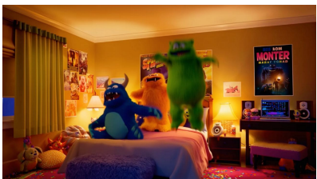

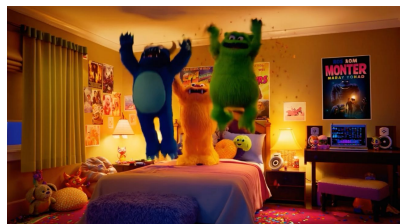

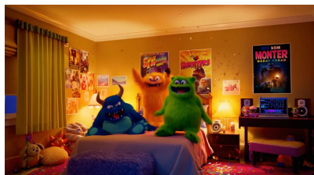

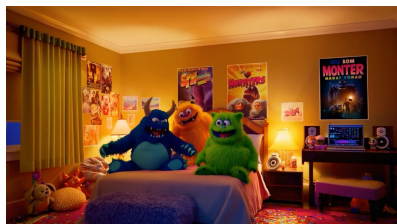

_提示词：复古80年代怪兽恐怖喜剧电影场景：彩色胶片，沐浴在柔和温暖光线中的儿童卧室。各种尺寸和颜色的毛绒怪兽正在举办一场混乱的派对，在床上跳跃，随着欢快的音乐跳舞，并抛洒彩纸。墙上装饰着经典80年代电影的海报，房间里充满了孩子们顽皮的笑声。_

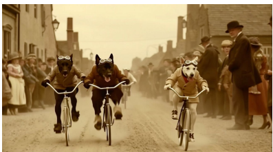

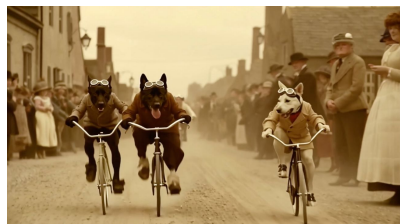

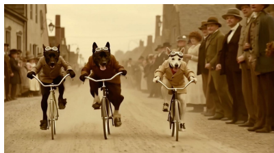

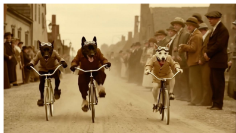

_提示词：一张棕褐调的复古照片，描绘了一场异想天开的自行车比赛，几只狗戴着护目镜，身穿迷你的骑行服装。这些狗狗赛手表情坚定，动作模糊，在尘土飞扬的道路上蹬着微型自行车。身穿时代服装的观众排列在道路两旁，增添了怀旧的氛围。照片略带颗粒感和模糊，模仿老照片的效果，柔和的侧光增强了场景的暖色调和质朴魅力。“自行车赛”以中景捕捉了这一独特时刻，聚焦于赛手和生动的人群。_

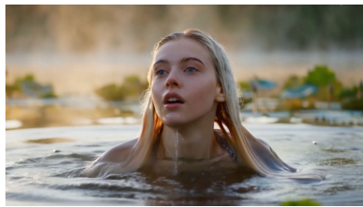

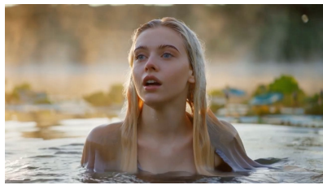

_提示词：胶片质感，专业品质，细节丰富。视频开始展示池塘表面，镜头缓慢推进至特写。水面开始冒泡，随后看到一位金发女郎全身湿透地从荷花池中出来，展现她面部表情的微妙变化，营造出梦幻般的氛围。_

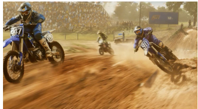

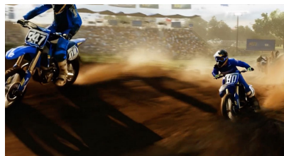

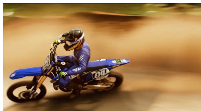

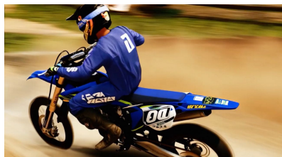

_提示词：充满动感的体育摄影，几辆摩托车在黄土飞扬的赛道上激烈角逐，车轮卷起漫天尘土。摩托车手身穿专业赛车服。相机使用高速快门捕捉瞬间，从侧面和后方跟随拍摄，最后定格在一辆摩托车的特写上，展示其精致的车身线条和充满力量的机械美感，营造出紧张刺激的赛车氛围。近距离动态视角，完美呈现速度与力量的视觉冲击。_

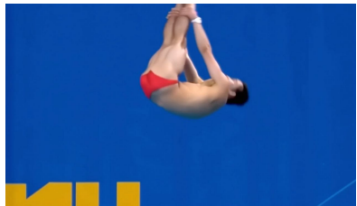

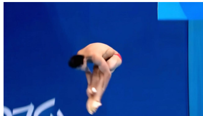

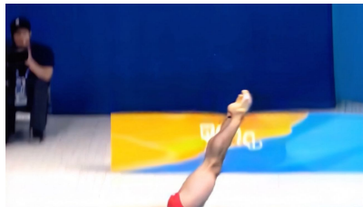

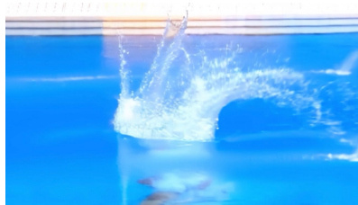

_提示词：一名专业男性跳水运动员从高台表演优雅的跳水动作。全身侧视图捕捉到他身穿鲜红色泳裤，处于倒立姿势，双臂完全伸展，双腿笔直并拢。随着他潜入下方的水中，镜头向下摇摄，激起戏剧性的水花，入水姿态完美。_

_提示词：一位失重的年轻人，五官柔和，带着宁静而惊讶的表情，正慢慢漂浮在阳光普照、随风摇曳的草地上方。采用复古电影风格拍摄，带有温暖的金色调和轻微的颗粒感，侧光突显了他被风吹乱的凌乱头发的质感。广角镜头捕捉了广阔的景观，增强了这个安静、超现实的漂浮场景，充满了平静的惊奇和温和的荒诞感，挑战了对现实的预期。_

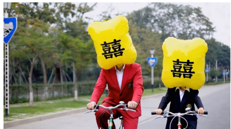

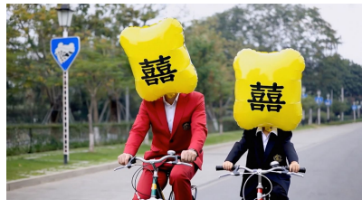

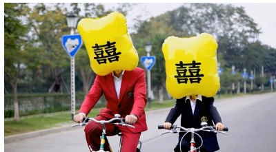

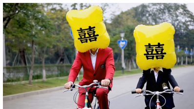

_提示词：一对独特的父子俩骑着自行车穿过城市街道，身穿引人注目的服装——父亲身穿鲜艳的红色西装，儿子身穿整洁的校服。他们的显著特征是：巨大的黄色气球代替了他们的头，每个气球上都精心绘制着粗体黑色墨迹的喜庆汉字“囍”，随着他们在城市景观中骑行而轻轻摇曳。_

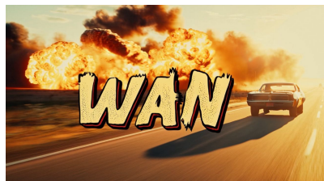

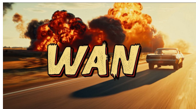

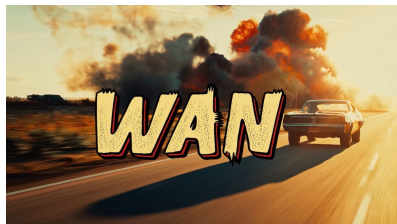

_提示词：一部虚构动作电影的70年代复古风格片头序列。手绘风格化的文字“WAN”动态地出现在屏幕上，叠加在汽车追逐、爆炸和大胆特技的快节奏剪辑片段上。文字粗犷、略带颗粒感且略有扭曲，反映了70年代动作电影的美学。一系列高能场景的蒙太奇，带有复古胶片颗粒效果，采用温暖复古的色彩。序列沐浴在黄金时刻的光线中，增强了怀旧感。_

_图15：Wan-T2V 的生成结果。我们的模型擅长生成复杂的运动、创意的转场、电影质感的视频，并能准确生成中英文文本。_

---

---

<table><tr><td></td><td>CN-TopA</td><td>CN-TopB</td><td>CN-TopC</td><td>Runway</td><td>All Rounds</td></tr><tr><td>Visual Quality</td><td>30.6%</td><td>15.9%</td><td>27.8%</td><td>48.1%</td><td>5710</td></tr><tr><td>Motion Quality</td><td>16.1%</td><td>9.7%</td><td>14.9%</td><td>40.3%</td><td>5785</td></tr><tr><td>Matching</td><td>46.0%</td><td>57.9%</td><td>56.7%</td><td>69.1%</td><td>5578</td></tr><tr><td>Overall Ranking</td><td>44.0%</td><td>44.0%</td><td>48.9%</td><td>67.6%</td><td>5560</td></tr></table>

_* 该表显示了在成对比较中，Wan 14B 模型优于其他模型的实例比例，该比例相对于比较的总次数计算。_

_表 3：T2V 的胜率差距。_

显著优于 OpenAI 的 Sora 和 MiniMax 的 Hailuo 等竞争对手。高效的 Wan 1.3B 变体也保持了竞争力，得分为 \(83.96\%\)，超越了混元视频（HunyuanVideo，Kong et al., 2024）和 Kling 1.0（Kuaishou, 2024.06）等商业模型，以及开源的 CogVideoX1.5-5B（Yang et al., 2025b）。

<table><tr><td>模型名称</td><td>质量得分</td><td>语义得分</td><td>总得分</td></tr><tr><td>MiniMax-Video-01 (MiniMax, 2024.09)</td><td>84.85%</td><td>77.65%</td><td>83.41%</td></tr><tr><td>Hunyuan (Open-Source Version) (Kong et al., 2024)</td><td>85.09%</td><td>75.82%</td><td>83.24%</td></tr><tr><td>Gen-3 (2024-07) (Runway, 2024.06)</td><td>84.11%</td><td>75.17%</td><td>82.32%</td></tr><tr><td>CogVideoX1.5-5B (5s SAT prompt-optimized) (Yang et al., 2025b)</td><td>82.78%</td><td>79.76%</td><td>82.17%</td></tr><tr><td>Kling (2024-07 high-performance mode) (Kuaishou, 2024.06)</td><td>83.39%</td><td>75.68%</td><td>81.85%</td></tr><tr><td>Sora (OpenAI, 2024)</td><td>85.51%</td><td>79.35%</td><td>84.28%</td></tr><tr><td>Wan 1.3B</td><td>84.92%</td><td>80.10%</td><td>83.96%</td></tr><tr><td>Wan 14B (2025-02-24)</td><td>86.67%</td><td>84.44%</td><td>86.22%</td></tr></table>

_表 4：Vbench 上的模型性能得分。_

# 4.7.2 消融实验

我们对模型设计中的关键模块进行了消融实验，以深入理解整体架构的贡献。实验在 1.3B 版本上进行，以便进行快速评估。

自适应归一化层的消融实验。鉴于 DiT（Peebles & Xie, 2023）中自适应归一化层（Perez et al., 2018）（adaLN）的参数量巨大，我们探讨了将参数集中在 adaLN 中还是增加网络层深度更为有效。为了调整参数量，我们遵循 PixArt（Chen et al., 2023a）的设置来研究是否共享 adaLN。在非共享配置中，每个块的缩放和位移参数由一个特定于该块的 MLP 预测，该 MLP 以时间嵌入作为输入。相反，共享 AdaLN 配置（在 PixArt 中称为 AdaLN-single）计算一组全局参数，这涉及在第一个块中预测缩放和位移值，然后在所有块之间共享这些值。这种共享显著减少了参数数量。

我们评估了四种配置：(i) Full-shared-adaLN-1.3B：这是我们的原始模型，其中 adaLN 在所有 30 个注意力块中完全共享。(ii) Half-shared-adaLN-1.5B：AdaLN 在前 15 个注意力块中共享，而在其余块中不共享。这产生了一个 1.5B 的模型，参数量增加了 0.2B。(iii) Full-shared-adaLN-1.5B (extended)：AdaLN 在所有注意力块中共享，但模型深度增加到 35 层，保持 1.5B 的参数量。(iv) Non-shared-AdaLN-1.7B：AdaLN 在任何块中都不共享，模型深度保持在 30 层，产生一个 1.7B 的模型。我们保持其他参数不变，从头开始训练模型以执行文生图任务 200,000 步（即我们文生视频训练的第一阶段），全局批次大小为 1536。为了进行比较，我们在训练阶段测量生成图像与真实图像在潜在空间之间的 L2 损失，训练损失越小表示收敛性越好。

---

---

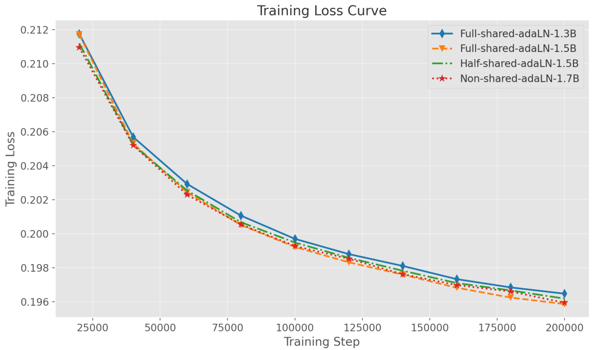

_图 16：不同配置下的训练损失曲线。_

如图 16 所示，参数量较少的 Full-shared-AdaLN-1.3B 模型相比其他模型产生了略高的训练损失。当比较参数量相同的 Half-shared-AdaLN-1.5B 和 Full-shared-AdaLN-1.5B 时，Full-shared-AdaLN-1.5B 始终实现了最低的训练损失。这表明，专注于模型深度而非 AdaLN 中的参数量能带来更好的性能。此外，Non-shared-AdaLN-1.7B 模型虽然拥有更多参数，但表现并未优于 Full-shared-AdaLN-1.5B，这进一步支持了该观点。因此，我们采用全共享 AdaLN 设计，以便在保持性能的同时有效减少参数数量。

文本编码器消融实验。我们选择了三种能够处理双语输入的文本编码器：umT5 (Chung et al., 2023) (5.3B)、Qwen2.5-7B-Instruct (QwenTeam, 2024) 和 GLM-4-9B (TeamGLM et al., 2024)。T5 系列一直是视频生成模型的热门选择 (GenmoTeam, 2024; Yang et al., 2025b)，而后两种编码器在语言理解方面表现出色，特别是在 10B 参数以下的所有 LLM 模型中。在此消融实验中，我们保持其他设置不变，并在全局大小为 1536 的情况下训练文本到图像任务。文本嵌入源自 Qwen2.5-7B-Instruct 和 GLM-4-9B 的倒数第二层。我们测量了训练损失，如图 17 所示。

与其他强大的基于 LLM 的编码器相比，umT5 展示出了更优越的文本嵌入性能。值得注意的是，Hunyuan-Video (Kong et al., 2024) 强调指出，仅解码器的 LLM 使用因果注意力，而 umT5 采用双向注意力，这使其适用于扩散模型。遵循 HunyuanVideo 的策略，我们引入了一个双向 token 精炼器作为适配器层。我们将此设置应用于 Qwen2.5-7B-Instruct 和 GLM-4-9B，但训练损失和可视化结果仍显示 umT5 表现最佳。此外，我们将 umT5 与一个预训练的多模态大语言模型（即 Qwen-VL-7B-Instruct (Bai

<table><tr><td>模型</td><td>VAE</td><td>VAE-D</td></tr><tr><td>10k 步</td><td>42.60</td><td>44.21</td></tr><tr><td>15k 步</td><td>40.55</td><td>41.16</td></tr></table>

_表 5：VAE 和 VAE-D 的 FID 分数 (↓)。_

et al., 2023)）进行了比较。如表 6 所示，使用 Qwen-VL 倒数第二层的特征可以获得与 umT5 相当的生成性能，但模型规模更大。

<table><tr><td>模型</td><td>umT5</td><td>Qwen-VL-7B (最后一层)</td><td>Qwen-VL-7B (倒数第二层)</td></tr><tr><td>FID(↓)</td><td>43.01</td><td>43.72</td><td>42.91</td></tr></table>

_表 6：不同文本编码器的 FID 分数。“最后一层”和“倒数第二层”分别指从编码器的最后一层和倒数第二层提取的文本特征。_

自编码器消融实验。除了我们的 VAE 之外，我们设计了一个名为 VAE-D 的变体，其中重构损失被替换为扩散损失。我们在文本到图像生成任务中同时采用了预训练的 VAE 和 VAE-D，训练了 150,000 步直至收敛。我们测量了

---

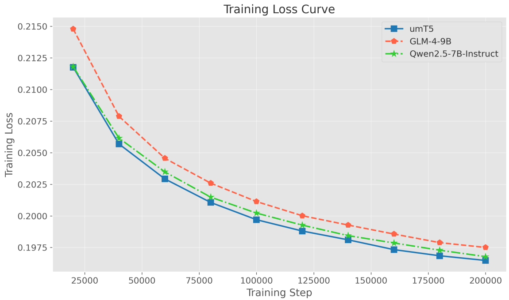

_图 17：使用不同文本编码器的训练损失曲线。_

在 100,000 步和 150,000 步时的 FID 分数。如表 5 所示，与 VAE-D 相比，VAE 模型始终获得更低的 FID。

# 5 扩展应用

# 5.1 图生视频生成

图生视频（I2V）生成任务专注于在文本提示的引导下，从静态输入图像合成动态视频序列。这种方法通过将输出锚定到特定的初始帧，显著增强了视频生成的可控性，从而在研究界引起了极大的关注。现有的方法，如 I2VGen-XL (Zhang et al., 2023c)、SVD (Blattmann et al., 2023) 和 CogVideo (Yang et al., 2025b)，通过将条件潜在表示与噪声潜在表示在通道维度上进行拼接，将 T2V 框架扩展到了 I2V。基于这一范式，我们的 Wan-I2V 模型采用了类似的策略，利用基础 T2V 模型中嵌入的鲁棒先验知识来实现高质量的 I2V 生成。

# 5.1.1 模型设计

我们引入一个额外的条件图像作为第一帧来控制视频合成。具体来说，我们将条件图像 \( I \in R^{C \times 1 \times H \times W} \) 与沿时间轴填充零的帧进行拼接，这些引导帧 \( I_{c} \in R^{C \times T \times H \times W} \) 被 Wan-VAE 压缩为条件潜在变量 \( z_{c} \in R^{c \times t \times h \times w} \) （\( c = 16 \) 表示潜在通道，\( t = 1 + (T - 1)/4, h = H/8, w = W/8 \)）。此外，我们引入了一个二值掩码 \( M \in \{0,1\}^{1 \times T \times h \times w} \)，其中 1 表示保留帧，0 表示待生成帧。掩码 \( M \) 的空间尺寸与条件潜在变量 \( z_{c} \) 一致，但 \( M \) 与目标视频具有相同的时间长度，随后被重排为 \( s \times t \times h \times w \) 的形状，其中 \( s \) 是 Wan-VAE 的时间步长。噪声潜在变量 \( z_{t} \)、条件潜在变量 \( z_{c} \) 和重排后的掩码 \( m \) 沿通道轴拼接，然后通过 Wan 的 DiT 模型。由于 I2V DiT 模型的输入通道数比 T2V 多（即 \( 2 \times c + s \) 对比 \( c \)），我们采用了一个以零值初始化的额外投影层。此外，我们利用 CLIP (Radford et al., 2021) 的图像编码器从条件图像中提取特征表示，提取的特征通过三层多层感知机（MLP）进行投影，该 MLP 充当全局上下文的作用。产生的全局上下文随后通过解耦交叉注意力注入到 DiT 模型中。

在实践中，如图 18 所示的上述方法可扩展到其他可控生成任务，如首尾帧变换和视频续写。所提出的掩码机制明确描绘了输入条件并指定了待生成的帧。为了优化掩码策略的效能，我们将多个任务，即图生视频生成、视频续写、首尾帧变换和随机帧插值，整合到我们的统一框架中。具体而言，我们针对 I2V 模型采用了以下训练范式。

---

---

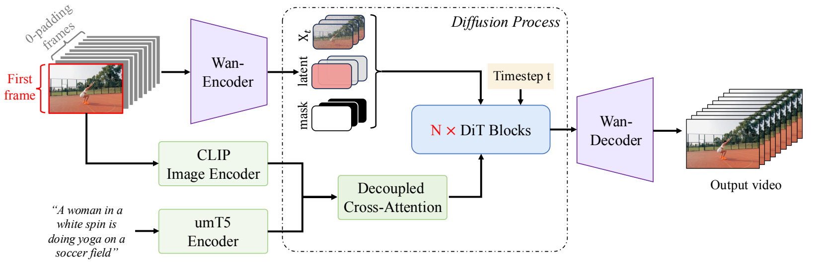

_图 18：Wan-I2V 模型框架。掩码机制使模型能够选择性地关注输入帧，使得所提出的框架展现出与视频延续和首尾帧转换任务的兼容性。_

在联合训练阶段，我们针对这些多样化的任务对掩码引导模型进行统一的预训练。该阶段有助于模型根据输入内容来辨别哪些位置应该保留，哪些位置应该生成。随后，在微调阶段，我们专注于针对每个单独的任务优化模型的性能。

# 5.1.2 数据集

在联合训练阶段，我们使用了与 T2V 预训练相同的训练数据集。该阶段使模型具备根据参考图像生成运动的基础能力。在微调阶段，我们精心策划了针对每个单独任务的独特特性而定制的特定任务数据集。

图像到视频数据集。在早期的实验中，我们发现当训练数据中的第一帧与视频内容差异显著时，模型难以学习稳定的图像驱动视频生成。从这个角度来看，训练数据中第一帧与视频内容之间的差异较小有利于模型训练。我们基于 SigLIP (Zhai et al., 2023) 特征计算第一帧与视频内容之间的差异。具体而言，我们计算第一帧的特征与剩余帧特征均值之间的余弦相似度，然后仅保留相似度高于预定义阈值的视频。

视频延续数据集。同样，我们的发现也表明，在时间一致的视频上进行训练能显著提高视频延续任务的性能。为了量化视频的初始片段和结束片段（即前 1.5 秒和后 3.5 秒）之间的一致性，我们计算它们各自 SigLIP 特征的余弦相似度，随后使用计算出的相似度分数来过滤和筛选所需的训练数据集。

首尾帧转换数据集。与 I2V 任务不同，在图像转换任务中，社区更关注初始帧和结束帧之间的平滑过渡。为此，我们在训练数据集中增加了首尾帧之间具有显著转换的数据样本的比例。

# 5.1.3 评估

I2V 模型以及首尾帧转换和视频延续的训练分为两个阶段。在初始的预训练阶段，我们采用与 T2V 任务相同的数据集。鉴于该阶段涉及的帧数略多，我们排除了图像编码器分支，这样做是出于保持文本输入与视觉输出之间强对齐的需要，确保模型保留对细微文本语义的敏感性。随着预训练阶段的稳定，模型已经展现出包括 I2V 生成、视频延续等多种能力。这证明了预训练过程在为空间和时间理解建立坚实基础方面的有效性。

---

---

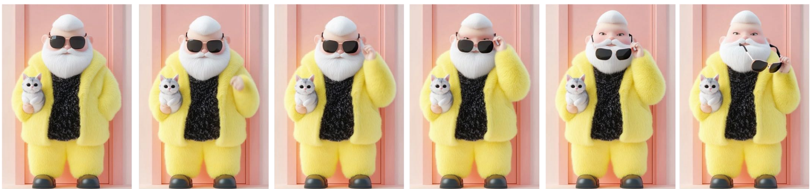

_复古港风摄影聚焦于一位身穿鲜艳黄色天鹅绒夹克、内搭黑色高领毛衣的时尚年轻男子。他缓缓摘下一副时髦的太阳镜，流露出神秘的目光。他温柔地怀里抱着一只灰色小猫，他温柔的拥抱与他粗犷的外表形成了可爱的反差。背景是一面柔和的粉色墙壁，营造出梦幻般的氛围。他脚踩黑色皮鞋，站在画面中央，引人注目。该场景是一个特写肖像，主体侧身面向镜头，散发着独特的个人魅力。_

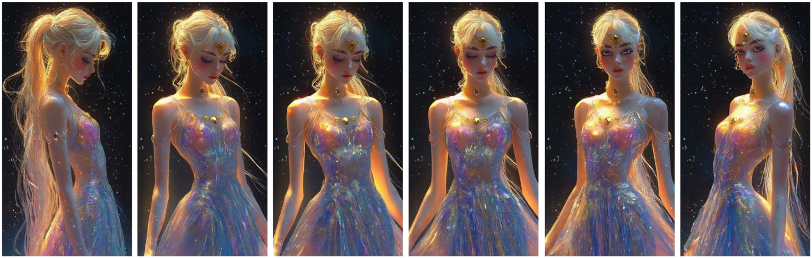

_一帧具有唯美梦幻风格的视频画面，一位留着金色长发的白人女子，长发在风中轻轻摇曳。她侧身站在璀璨的星空下。她佩戴着精致的金色耳环和项链，身穿一件飘逸的银色连衣裙，裙摆闪烁着耀眼的光芒，在微风中轻轻摆动，宛如夜空中最亮的星。背景是深邃的宇宙，点缀着无数繁星，璀璨的银河横贯其中，营造出神秘而浪漫的氛围。她的目光从低垂转为温柔，深情地直视镜头，嘴角勾起一抹淡淡的微笑。她的表情宁静却充满期待。中景镜头捕捉了她从侧脸到正对镜头的流畅动作转换，定格了这一瞬间的静谧之美。_

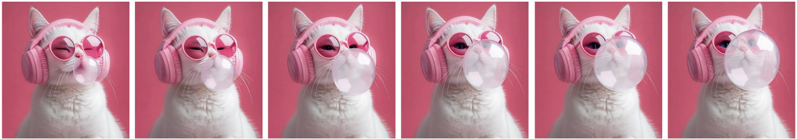

_一幅超现实主义数字艺术作品描绘了三个不同颜色的面孔缓缓睁开眼睛，向镜头投以温暖的微笑。左边的面孔呈粉色，有着醒目的红唇；中间的面孔呈白色，留着乌黑亮丽的长发；右边的面孔呈黄色，饰有鲜艳的橙色嘴唇。三者起初闭着双眼，处于宁静的静止状态，随后轻轻睁开，露出温柔、深情的微笑，仿佛与观众建立了一种神奇的连接。背景采用柔和的浅色调，突出了面部特征，营造出梦幻而神秘的氛围。特写镜头捕捉了表情的细微变化，利用流畅的追踪技术让每一刻都栩栩如生。近景展示了多面孔的特写，伴随着充满深意的眼神交流。_

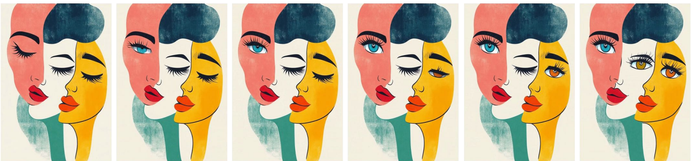

_一幅超现实主义数字艺术作品描绘了三个不同颜色的面孔缓缓睁开眼睛，向镜头投以温暖的微笑。左边的面孔呈粉色，有着醒目的红唇；中间的面孔呈白色，留着乌黑亮丽的长发；右边的面孔呈黄色，饰有鲜艳的橙色嘴唇。三者起初闭着双眼，处于宁静的静止状态，随后轻轻睁开，露出温柔、深情的微笑，仿佛与观众建立了一种神奇的连接。背景采用柔和的浅色调，突出了面部特征，营造出梦幻而神秘的氛围。特写镜头捕捉了表情的细微变化，利用流畅的追踪技术让每一刻都栩栩如生。近景展示了多面孔的特写，伴随着充满深意的眼神交流。_

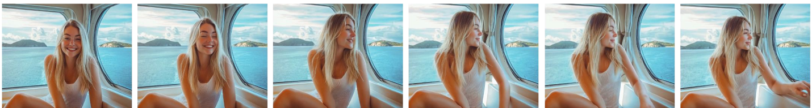

_一段夏日海洋景色的视频，一位身穿浅米色无袖上衣的优雅女子坐在复古的木屋中。她身后是波光粼粼的蔚蓝大海和远处雾气缭绕的翡翠色岛屿。她波浪般的金色长发在风中自由飘动，轻轻地搭在肩上。阳光透过舷窗洒入，照亮了她温暖的笑容，她侧身面向镜头，手肘轻轻靠在座位上，姿态放松而迷人。窗外，晴朗的天空中点缀着几朵悠闲的白云，营造出宁静无忧的氛围。高清视频捕捉了每一缕阳光和海浪的每一个细节，展现了夏日航海的浪漫魅力。女子侧身面向镜头的特写镜头与使用广角镜头拍摄的辽阔海景相得益彰。_

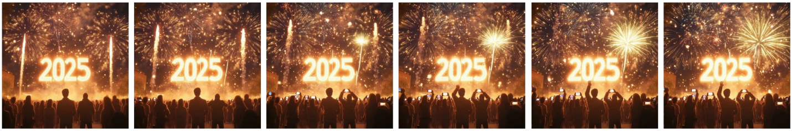

_一个3D渲染的新年庆祝场景展示了一群背对镜头的人群，仰望夜空中绽放的烟花。巨大的“2025”字样由耀眼的烟花组成，照亮了整个天空。人们穿着各式各样的冬装，姿态各异——有些人双臂交叉抱在胸前，另一些人则举起手机记录这一时刻。在背景中，城市的剪影清晰可见，摩天大楼和树木隐约可见。在烟花绽放的瞬间，人群陷入了一种不寻常的静止，共同迎接新年的到来。远景镜头，采用低角度视角拍摄。_

_图19：Wan-I2V模型生成的视频。结果表明，我们的I2V模型有效地捕捉并再现了真实世界场景的动态。_

---

---

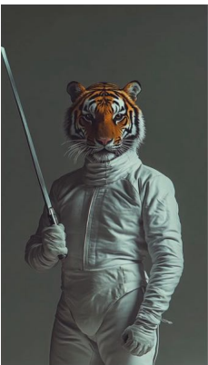

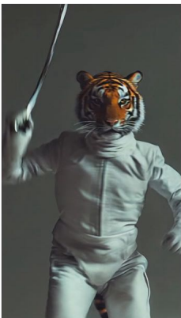

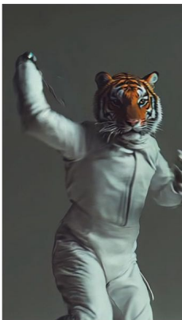

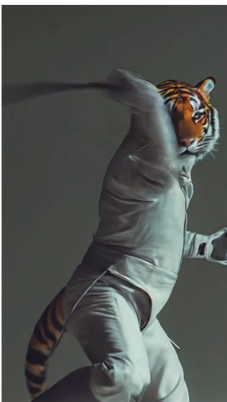

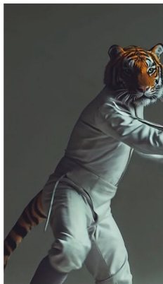

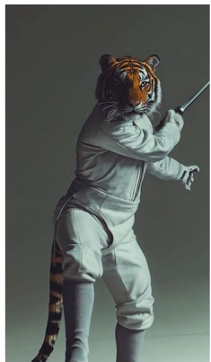

一幅数字艺术插画描绘了一位身穿经典白色击剑服的人形老虎，手持银色花剑，神情严肃，目光锐利专注，流露出强烈的战斗意志。深邃的背景仅由勾勒其轮廓的微光照亮，加剧了紧张感。老虎左脚向前迈出，右膝微屈，摆出标准的击剑姿势，仿佛下一刻就要发起迅猛的攻击。空气中弥漫着专注的气息和决斗的氛围。作品以细腻的笔触和高对比度的色彩渲染，营造出极具动感和张力的视觉效果。展示了角色侧视的特写全身镜头。

捕捉了蝴蝶与花朵之间的互动，使整个画面充满了生机与活力。

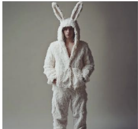

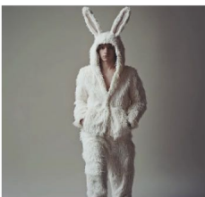

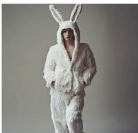

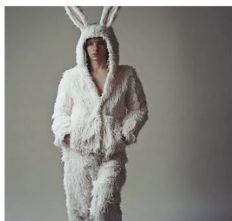

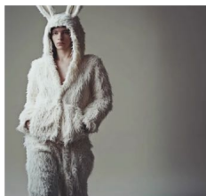

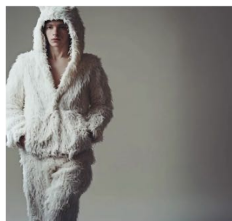

视频呈现为美式卡通风格，主角是一位身穿全白色高品质毛绒兔子服装的成年人。服装细节精致，包括一顶3D兔子耳朵帽子和毛茸茸的尾巴，营造出柔软可爱的氛围。模特站在简单的灰色背景前，双手随意地插在口袋里，散发出轻松自在的态度。这套服装完美地复刻了兔子的形态，呈现出温暖、充满冬日感的视觉效果。在中景镜头中，模特迈着轻盈的步伐缓慢前行，仿佛步入童话世界。视频运用了流畅的跟拍镜头捕捉每一个生动的瞬间。

一个动态的视频场景捕捉了一位充满激情的街头艺术家，他在纯白色的背景下全神贯注地演奏小提琴。他戴着一顶宽边草帽，帽檐温柔地遮住了他明亮的眼睛，身穿简单的白衬衫搭配复古棕色裤子。腰间 stylishly 挂着一把萨克斯风，增添了一丝毫不费力的魅力。艺术家的手指在琴弦上灵活移动，完全沉浸在音乐中，脸上洋溢着对技艺的热爱和专注。周围留白无限延伸，仿佛整个世界都沉浸在他的旋律中，宁静而纯净。在中景镜头中，摄像机从正面捕捉了表演者，聚焦于这完全投入的时刻。

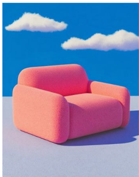

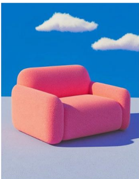

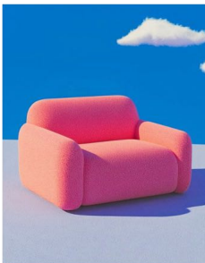

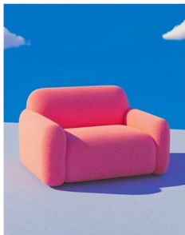

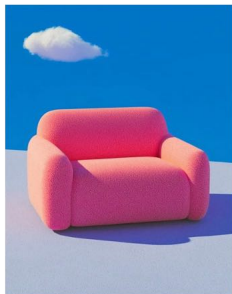

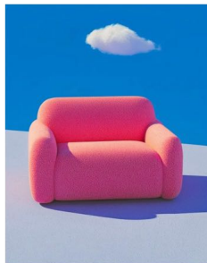

一件现代3D渲染风格的艺术作品展示了一张放置在光滑地板上的粉色单人沙发椅。沙发椅设计极简，表面带有微妙的颗粒纹理。背景是点缀着几朵白云的清澈蓝天，整体色调明亮清新。场景中没有人物，沙发椅显得格外突出。镜头采用中景视角，摄像机轻微旋转，强调了沙发椅的细节和质感。

一幅童话风格的插画描绘了一个小女孩骑在一只飞行的大猫鹰背上。女孩穿着绿色连衣裙，头发扎成双马尾，表情兴奋而专注。猫鹰展开宽阔的翅膀，明亮的眼睛似乎在指引前行的方向。背景是星空下的山川河流，月光洒在大地上，四周散落着发光的花朵。场景充满了梦幻和冒险的氛围。特写镜头，采用低角度视角。

_图 20：由 Wan-I2V 模型生成的视频。结果表明，我们的 I2V 模型能够有效地将多种类型的图像生成为高度逼真且动态的视频。_

---

---

<table><tr><td></td><td>CN-TopA</td><td>CN-TopB</td><td>CN-TopC</td><td>CN-TopD</td><td>All Rounds</td></tr><tr><td>Visual Quality</td><td>29.2%</td><td>60.8%</td><td>24.6%</td><td>55.6%</td><td>896</td></tr><tr><td>Motion Quality</td><td>21.7%</td><td>21.7%</td><td>32.5%</td><td>67.0%</td><td>890</td></tr><tr><td>Matching</td><td>-4.2%</td><td>35.0%</td><td>51.7%</td><td>72.2%</td><td>896</td></tr><tr><td>Overall Ranking</td><td>10.8%</td><td>47.5%</td><td>50.8%</td><td>81.6%</td><td>890</td></tr></table>

_表 7：I2V 模型的胜率差距。表中的数值表示在与其他模型进行的成对比较中，Wan-I2V 模型优于其他模型的实例比例，该比例是相对于进行的比较总数而言的。_

我们的实证观察表明，仅依赖帧级信息不足以在特定任务（如图生视频、视频延续和首尾帧变换）中实现最佳性能。

这一见解表明，虽然预训练模型为基于帧的视频生成提供了基础框架，但它缺乏必要的上下文和语义深度，无法完全捕捉动态视频序列的时间一致性，特别是在条件帧数量非常有限的情况下。

为了解决这一局限性，在 SFT（监督微调）阶段，我们引入了一个图像编码器，通过解耦交叉注意力（Ye et al., 2023）——类似于（Guo et al., 2024a）的做法——来提取图像特征，从而提供全局上下文信息以增强模型的能力。我们基于 480p 和 720p 分辨率的两个预训练检查点进行了实验，涵盖了图生视频、视频延续和首尾帧变换任务的训练。

与对我们的 T2V 模型进行人工评估类似，我们将 I2V 模型与最先进的技术进行基准测试，以提供全面的比较，重点关注视觉质量、运动质量和匹配度等关键方面。表 7 所示的结果表明，我们的模型在所有评估维度上均表现出色。图 19 和图 20 展示了我们 I2V 模型的更多可视化结果，清晰地说明了其在将图像生成为高质量视频方面的卓越性能。

# 5.2 统一视频编辑

文本生成图像和文本生成视频的基础预训练模型促进了各种下游任务和应用的扩展，包括重绘（AI, 2022; Zhou et al., 2023）、编辑（Meng et al., 2021; Brooks et al., 2023; Zhang et al., 2023a; Wang et al., 2023b; Wei et al., 2024b）、可控生成（Zhang et al., 2023b; Jiang et al., 2024; Wang et al., 2024c）、定制化生成（Chen et al., 2023b; Wei et al., 2025）、帧参考生成（Yang et al., 2025b; Guo et al., 2024a）、高效生成（Wang et al., 2023c; Yuan et al., 2024a; Liu et al., 2024b）以及 ID 参考的视频合成（Pan et al., 2024; Yuan et al., 2025; Liu et al., 2025a）。为了增强任务灵活性并最大限度地减少部署多个模型所带来的开销，研究人员越来越关注开发统一的模型架构（Tan et al., 2024; Chen et al., 2024），例如 ACE（Han et al., 2025; Mao et al., 2025）和 OmniGen（Xiao et al., 2024）。这些统一架构旨在将多样化的任务集成到单个图像模型中，从而在保持易用性的同时促进各种应用工作流的创建。在视频领域，时间和空间维度上的协同变换表明，利用统一模型可以为视频创作开启无限可能。

在我们之前的工作 VACE（Jiang et al., 2025）中，我们引入了一个用于可控视频生成和编辑的统一框架，解决了参考生成视频、视频生成视频编辑和掩码视频生成视频编辑等任务。基于 Wan 的预训练模型，我们将多种模态（包括用于编辑的图像和视频、参考图和掩码）集成到视频条件单元（VCU）中，以支持多样化的输入格式。VACE 采用了一种概念解耦策略，使模型能够识别应保留哪些方面以及应修改哪些方面，

---

---

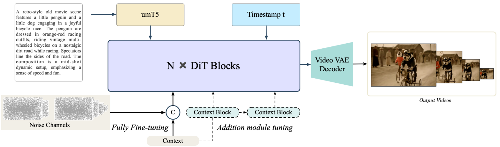

_a. 基于 Wan2.1 的 VACE 框架。_

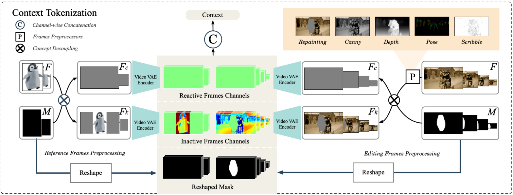

_b. 上下文标记化流程。_

_图 21：统一的可控生成与编辑框架。帧和掩码通过概念解耦、上下文潜在编码和上下文嵌入器进行标记化。我们为 Wan 提出了两种训练策略：全量微调和上下文适配器微调。_

从而在编辑和参考任务中明确区分视觉模态信息。我们提供了两种训练模式。第一种模式涉及以 VCU 作为输入进行训练，对整个 Wan 模型进行全量微调。第二种模式以 Res-Tuning (Jiang et al., 2023) 的方式利用可插拔的上下文适配器结构，从而在不修改基础模型权重的情况下支持可控和编辑任务，但会增加整体模型规模。利用 Wan 强大的视频生成能力，这一创新框架在定量和定性评估中都显示出显著的竞争力。它促进了基础任务的组合式扩展，使得长视频重渲染等场景成为可能。因此，该框架为视频合成提供了一种通用且高效的解决方案，为用户驱动的视频内容创作和编辑开辟了新途径。

# 5.2.1 模型设计

VACE 中提出的视频条件单元（VCU）作为一种输入范式，将多样化的输入条件统一为文本输入、帧序列和掩码序列。它可以形式化地表示为：

$$
V = [ T; F; M ], \tag {4}
$$

其中 \(T\) 是文本提示，而 \(F\) 和 \(M\) 分别是上下文视频帧序列 \(\{u_1, u_2, \dots, u_n\}\) 和掩码序列 \(\{m_1, m_2, \dots, m_n\}\)。这里，\(u\) 处于 RGB 空间，归一化到 \([-1, 1]\)，而 \(m\) 是二值的，其中“1”和“0”分别象征编辑与否的位置。\(F\) 和 \(M\) 在空间尺寸 \(h \times w\) 和时间尺寸 \(n\) 上均对齐。在此范式下，我们采用前述的 Wan-VAE 将输入视频帧和掩码信息标记化为上下文标记。如图 21 (a) 所示，这些上下文标记随后与噪声视频标记结合以微调 Wan 模型。此外，我们提出了一种上下文适配器微调策略，允许上下文标记通过上下文块并重新整合到原始 DiT 块中。这种方法促进了上下文信息的无缝集成，增强了模型处理多样化编辑和生成任务的能力，而无需改变基础模型的权重。

---

---

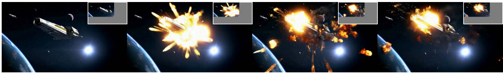

_任务-外绘：一艘巨大的飞船正在太空中飞行，背景中可以看到一艘较小的飞船。突然，这艘大船在一个巨大的火球中爆炸，碎片向四面八方飞溅。爆炸剧烈且明亮，火焰和烟雾从残骸中滚滚而出。那艘小船安然无恙，继续飞离现场。 ..._

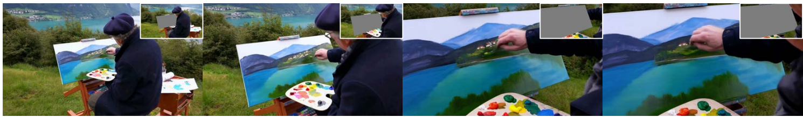

_任务-内绘：一个人正在户外画布上作画，使用的是装有各种颜料的调色板。这个人身穿深蓝色夹克，戴着配套的贝雷帽，坐在一把木椅上。画布上描绘的是一片风景，背景是水域和山脉。这个人正在仔细地将绿色颜料涂抹在画布上，为场景增添细节。 ..._

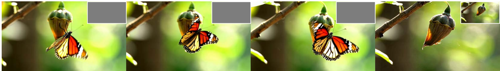

_任务-扩展：一只长着黑色和橙色翅膀的蝴蝶靠近树枝上悬挂的褐色豆荚。蝴蝶落在豆荚上，使其轻微晃动，然后迅速飞走。背景是模糊的绿色，暗示着森林或花园的环境。光线明亮自然，表明是白天。摄像机保持静止， ..._

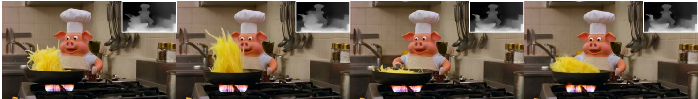

_任务-深度：一只打扮成厨师模样的猪站在厨房里，手里拿着一个平底锅，锅下燃着蓝色的火焰。这只猪戴着白色的厨师帽和围裙，正在翻炒锅里的黄色碎状食物。背景展示了一个现代化的厨房，配有不锈钢电器、水槽，以及台面上各种厨房用具和容器。光线明亮自然， ..._

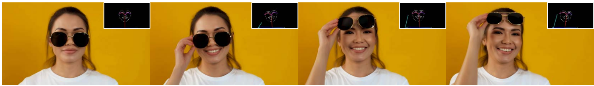

_任务-姿态：一位留着卷发、身穿白衬衫的年轻女子站在黄色背景前。她面带微笑看着镜头，右手将太阳镜举到额头上。这位女子皮肤黝黑，头发梳成松散的卷发，垂在肩头。她戴着一副大圆形太阳镜，镜框是金色的，镜片是红色的。 ..._

_图 22：所提出的 VACE 的可视化结果。_

在分词之前，像素级上下文帧和掩码使用概念解耦策略进行预处理，然后编码到潜在空间中。如图 21 (b) 所示，概念解耦策略基于掩码将不同模态和分布的数据显式分离为两个形状相同的帧序列：\( F_{c} = F \times M \) 和 \( F_{k} = F \times (1 - M) \)，其中 \( F_{c} \) 指的是包含所有待修改像素的反应帧，而 \( F_{k} \) 表示保留所有待保持像素的非活跃帧，命名为非活跃帧。这种机制确保了清晰的任务定义，并保证了模型在不同任务上的收敛性。\( F_{c}, F_{k} \) 由 Wan-VAE 处理并映射到相同的 \( X \) 潜在空间，从而保持其时空一致性。为了避免

---

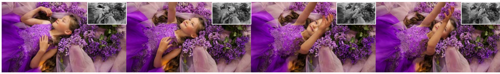

**TASK-GRAY（灰度任务）：** 一个留着长卷发的年轻女孩躺在丁香花和薄织物铺成的床上。她身穿一件带有精致蕾丝细节的粉色连衣裙。女孩伸出手去触摸上方的花朵，面带微笑，神情满足。背景中充满了更多的丁香花和绿叶，营造出一种梦幻般的氛围。拍摄角度为俯视，柔和地捕捉了女孩和周围的花朵...

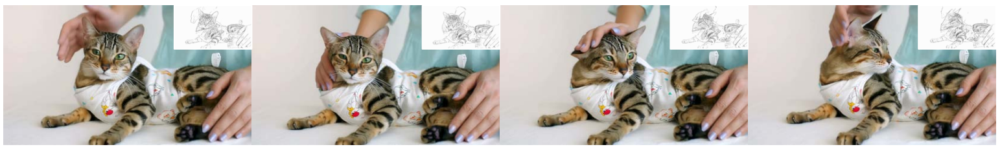

**TASK-SCRIBBLE（涂鸦任务）：** 一个身穿浅蓝色衬衫的人正在轻轻抚摸一只躺在白色桌子上的虎斑猫。这只猫穿着一件印有卡通角色的白色衣服，当这个人抚摸它的头和身体时，它显得放松和满足。背景是素净的浅色，使人们的注意力集中在人与猫的互动上。摄像机保持静止...

**TASK-LAYOUT（布局任务）：** 一只老鹰在晴朗的天空下飞越平静的蓝色海洋。这只老鹰长着褐白相间的羽毛和黄色的喙，它双翼展开，正向水面俯冲。当它接近水面时，它扎入水中，溅起水花，并用爪子抓着一条鱼浮出水面。随后老鹰再次起飞，紧紧抓着鱼飞离镜头...

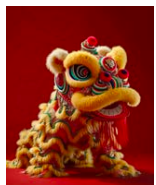

**TASK-OBJECT（物体任务）：** 一个色彩鲜艳的中国舞狮服装在深红色背景的衬托下显得格外醒目，散发着传统文化意义和喜庆气氛。该服装细节精致，边缘饰有黄色皮毛，并配有绿色、红色和金色的复杂图案。装饰包括大而富有表现力的眼睛、露出牙齿的大嘴...

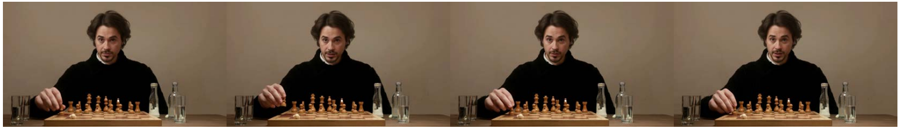

**TASK-FACE（人脸任务）：** 一个男人正坐在桌旁下棋。他右手拿着一枚棋子，似乎正在思考下一步的走法。这个男人留着卷发和胡须，身穿白色翻领衬衫，外面套着黑色毛衣。棋盘摆在他面前，上面还有几枚棋子。桌子上还有几个瓶子。背景素净且色调中性...

_图 23：所提出的 VACE 的可视化结果_

对于任何图像和视频的混合体，参考图像由 Wan-VAE 编码器分别编码，并沿时间维度拼接回来，而相应的部分需要

---

多条件

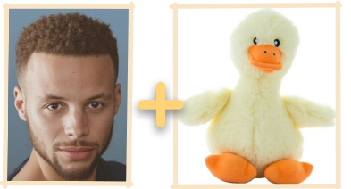

(a) Wan：高级视频编辑

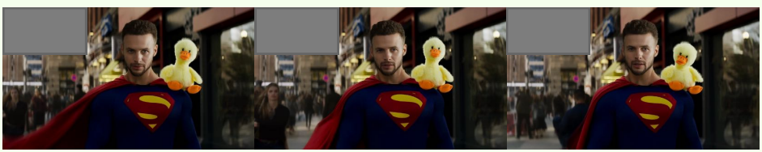

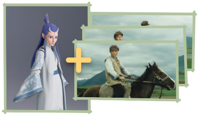

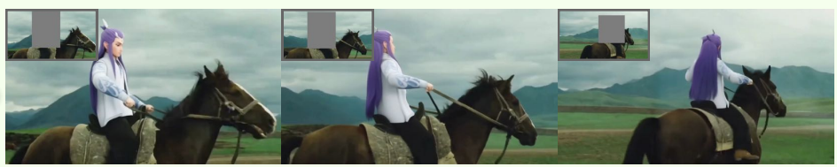

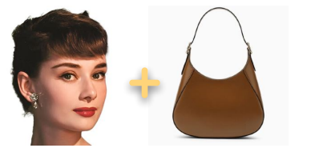

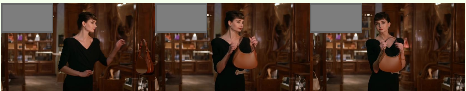

(b) Wan：高级图像编辑

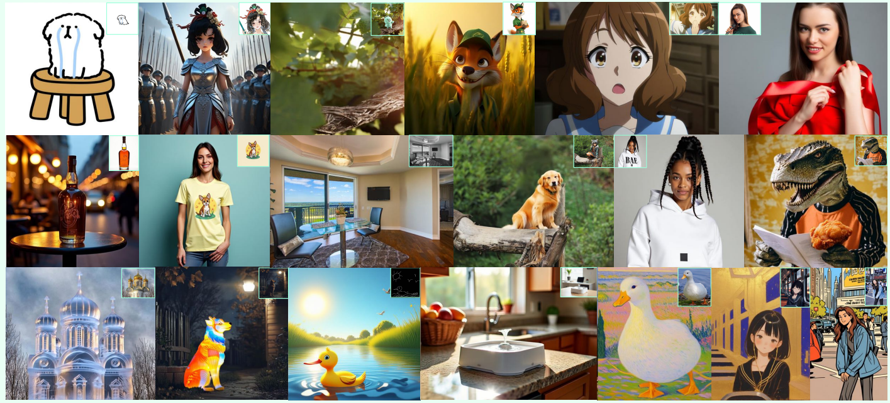

_Figure 24: 高级视频/图像编辑的可视化结果。_

在解码过程中被移除。\(M\) 被直接重塑和插值。之后，\(F_{c}, F_{k}\) 和 \(M\) 被映射到潜在空间，并在形状为 \(n' \times h' \times w'\) 的空间-时间维度上与 \(X\) 对齐。

# 5.2.2 数据集与实现

数据构建。为了开发一个全能型模型，数据构建的多样性和复杂性必须随之提高。对于可控视频生成和编辑任务，输入模态被扩展以包括目标视频、源视频、局部掩码、参考图等。针对各种任务进行高效且快速的数据获取，需要在执行实例级分析和理解的同时保持视频质量。我们首先对视频数据进行镜头分割，并根据分辨率、美学评分和运动幅度进行初步筛选。随后，使用 RAM (Zhang et al., 2023d) 对第一帧进行标注，并利用 Grounding DINO (Liu et al., 2023d) 进行检测处理，从而对目标区域过大或过小的视频进行二次筛选。此外，我们利用 SAM2 (Ravi et al., 2025) 的传播操作进行视频分割，以获取整个视频的实例级信息。基于分割结果，我们根据掩码面积阈值计算有效帧比率，从而在时间维度上进一步筛选实例。针对不同任务的构建必须根据每个任务的具体特性进行定制。详细信息请参阅相关工作 (Jiang et al., 2025)。

实现细节。我们基于 Wan-T2V-14B 预训练模型训练了可控编辑模型，通过多阶段训练过程支持高达 720p 的分辨率。最初，我们专注于修复和扩展等基础任务，以补充预训练的文本到视频

---

---

模型。这一阶段引入了掩码，并发展了空间和时间维度上的上下文生成能力。随后，我们将任务范围从单输入参考帧扩展到多输入参考帧，并从单一任务扩展到复合任务。最后，我们通过使用更高质量的数据和更长的序列对模型进行微调，进一步提升了模型的质量。

# 5.2.3 评估

在图 22 和图 23 中，我们展示了 Wan 单一模型在各种任务下的结果。显而易见，该模型在视频质量和时序一致性方面均达到了很高的性能水平。此外，我们展示了结合不同生成能力而产生的新应用，如图 24 (a) 所示。我们的模型在这些任务上表现出色，展示了巨大的能力扩展潜力。VACE 提出的统一可控生成与编辑框架同样适用于图像生成和编辑，如图 24 (b) 所示。

# 5.3 文生图生成

Wan 是在图像和视频数据集上联合训练的，这不仅赋予了它先进的视频生成能力，还赋予了卓越的图像合成性能。这种双重训练策略促进了跨模态的知识迁移，构建了一个高度通用的框架，在两个领域都取得了强大的成果。实际上，我们的模型训练所用的图像数据集规模几乎是视频数据集的十倍，这使得图像生成和视频生成任务之间能够产生协同效益。这种广泛的训练方案使得图像合成的各个方面都取得了出色的表现。如图 25 所示，Wan 能够在多样化的类别中生成高保真图像，涵盖艺术文字视觉、照片级逼真肖像、充满想象力的创意设计以及专业级的产品摄影。

# 5.4 视频个性化

视频个性化旨在生成与用户提供的参考保持一致身份的视频（Wei et al., 2024a; Li et al., 2024; Yuan et al., 2025）。在本节中，我们将先进的个性化技术集成到视频生成流程中，实现了最先进的性能。随后的讨论将全面阐述我们的方法，包括模型架构、个性化数据和实验验证。

# 5.4.1 模型设计

视频个性化背后的核心技术主要解决两个主要挑战：(1) 获取高保真的个性化身份，以及 (2) 将这些身份特征无缝集成到视频生成流程中。

我们从我们的 Wan-T2V 基础模型开始，首先获取个性化身份信息。现有的视频个性化方法通常依赖于 ID 提取器（例如 ArcFace (Deng et al., 2019)）或通用的视觉提取器（例如 CLIP (Radford et al., 2021)）来获取身份信息。虽然它们取得了一定的进展，但其性能受到特征提取器局限性的瓶颈限制。例如，ID 提取器主要关注用于人脸识别的特征，但可能无法捕捉其他关键的视觉线索，如疤痕或贴纸。此外，它们容易受到低分辨率人脸、光照变化和部分遮挡（如眼镜、口罩或头发）的影响。另一方面，通用视觉提取器并非专门针对人脸领域定制，往往倾向于关注粗粒度的语义信息。因此，我们选择不依赖任何特征提取器以避免信息丢失，我们的生成过程直接在 Wan-VAE 的潜在空间中以输入人脸图像为条件。

将个性化身份信息注入视频生成过程的方法有很多。在我们的实验中，我们发现交叉注意力操作适合与从身份提取器获得的密集表示进行交互，而自注意力更适合对同一潜在空间中的数据进行建模。图 26 展示了我们视频个性化方法的设计，该方法遵循自注意力范式。具体而言，在潜在空间中，我们首先使用分割的人脸图像，在给定视频的前面扩展 \(K\) 个额外的帧。这些人脸图像是使用人脸检测和分割从配对视频中提取的，并且面部特征点

---

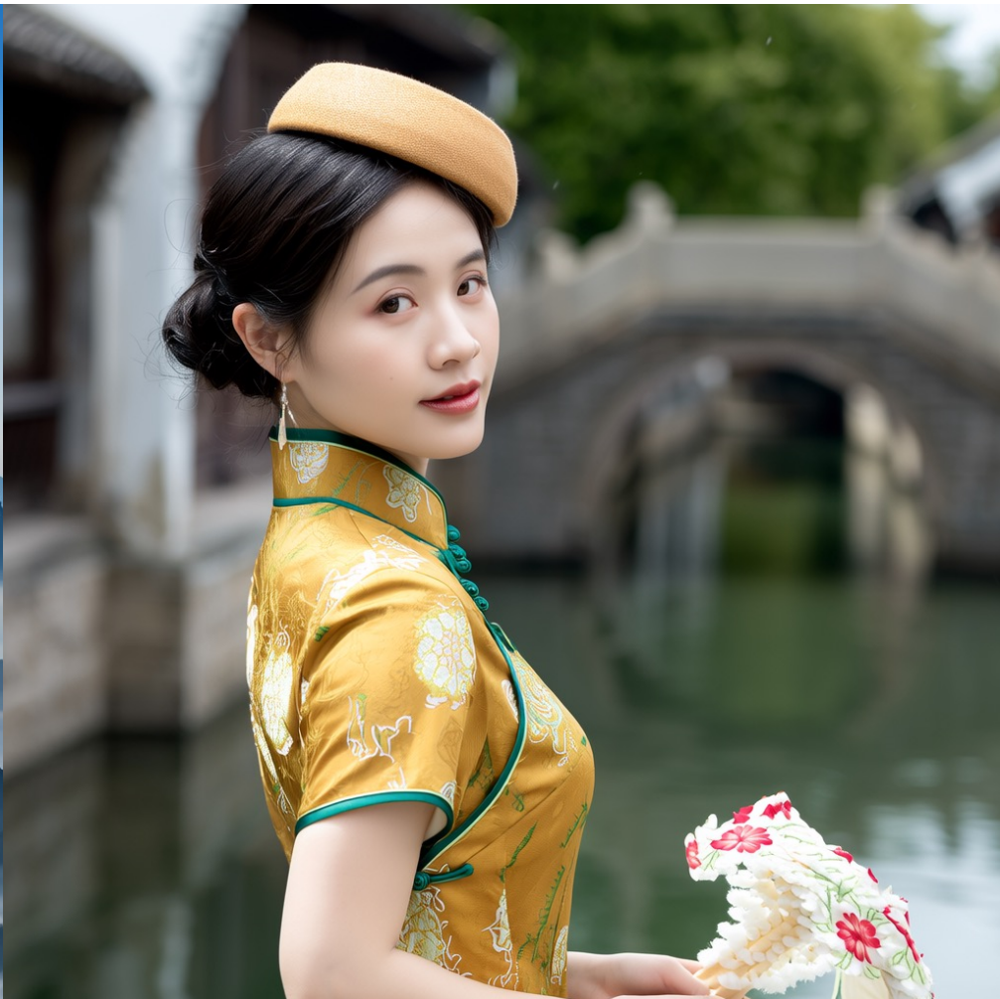

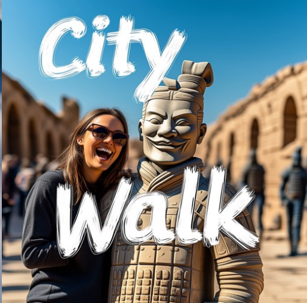

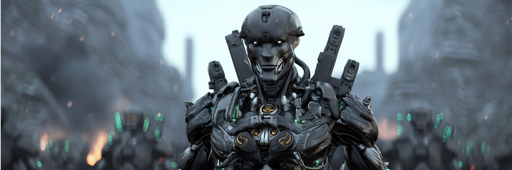

_图 25：由 Wan 模型生成的图像样本。_

---

---

_图 26：Wan-VAE 潜在空间中视频个性化方法的核心设计。_

被进一步对齐到一个与视频帧尺寸相同的黑色画布上。然后，沿着这个扩展视频的通道维度，我们将前 \(K\) 帧的人脸图像与全一掩码进行拼接，将其余帧的空白图像与全零掩码进行拼接。这些拼接后的信号作为条件。最后，在这个时间扩展的视频上执行扩散过程，并以修复的方式以通道级条件信号为条件。请注意，我们的 Wan-T2V 模型没有应用任何其他修改。

在训练期间，我们随机丢弃 \(K\) 个扩展帧中的一部分人脸图像，以支持 0 到 \(K\) 个参考人脸的视频生成。在推理阶段，从扩展视频的纯噪声开始，我们将用户提供的人脸图像（不超过 \(K\) 个）在通道维度上拼接到扩展帧中，并将相应的掩码设置为全一。目标是重建前 \(K\) 帧中的人脸图像，并在随后的帧中合成保留所提供身份的新的个性化视频。

# 5.4.2 数据集

我们通过仔细过滤和自动数据合成，从我们的 T2V 基础模型的训练数据集中策划了一系列个性化数据。我们首先使用内部人工分类器过滤了大约 \(\mathcal{O}(100)\mathrm{M}\) 个视频，并以 1 FPS 的频率对这些视频执行人脸检测。如果在任何一帧中检测到超过一个人脸，或者超过 10% 的帧没有检测到人脸，则该视频将被丢弃。然后我们计算连续帧之间的 ArcFace 相似度，并丢弃相似度较低的视频。之后，我们执行人脸分割以去除分散注意力的背景，并执行人脸关键点检测以便于我们在训练期间进行画布对齐。请注意，我们没有过滤掉面积较小的人脸，因为我们发现此类视频通常包含全身人物。最后，我们构建了大约 \(\mathcal{O}(10)\mathrm{M}\) 个个性化视频，其中每个视频平均伴随 5 个分割后的人脸。

我们还借助自动数据合成来提高人脸多样性。特别是，我们从上述数据中随机选择了 \(\mathcal{O}(1)\mathrm{M}\) 个个性化视频，并采用 Instant-ID (Wang et al., 2024b) 为每个视频合成多样化的人脸。值得注意的是，我们构建了一个包含超过 100 个提示词的文本模板，包括动漫、线稿、电影感、Minecraft 等。每次我们从该模板中随机选取一个提示词，以及从其余视频中估计的随机人体姿态，作为 Instant-ID 的输入。我们进一步测量生成人脸的 ArcFace 相似度，并过滤掉相似度较低的人脸。总共，我们收集了大约 \(\mathcal{O}(1)\mathrm{M}\) 个具有合成人脸的视频，这极大地提高了我们个性化数据集在风格、姿态、光照和遮挡方面的多样性。

<table><tr><td></td><td>Wan</td><td>CN-TopA</td><td>CN-TopB</td><td>CN-TopC</td></tr><tr><td>Arcface 相似度</td><td>0.5526</td><td>0.5655</td><td>0.5197</td><td>0.4998</td></tr></table>

_表 8：与其他领先的视频个性化方法的比较。_

# 5.4.3 评估

我们在图 27 中展示了我们的视频个性化结果，其中左侧代表输入的身份，右侧代表合成的个性化视频。所有测试图像均为

---

……从 Pexels1 中随机选取。我们还在一个未见过的评估集上评估了我们的模型，并以 1 FPS 的采样率从视频中提取人脸，测量输入人脸与输出个性化视频之间的 ArcFace 相似度。最终的相似度得分由这些采样人脸的平均值得出。相应的结果如表 8 所示，与其他领先的商业和闭源中国竞争对手相比，我们的方法展示了具有竞争力的视频个性化性能。

# 5.5 相机运动可控性

相机运动控制模块旨在利用相机轨迹来精确匹配视频的运动和视角。具体而言，我们利用每一帧的外参 \([R,t] \in \mathbb{R}^{3 \times 4}\) 和内参 \(K_{f} \in \mathbb{R}^{3 \times 3}\)。我们的方法包含两个主要部分以有效地注入相机运动条件：相机姿态编码器和相机姿态适配器，如图 28 所示。

**相机姿态编码器。** 首先，对于每个视频帧中的每个像素，我们使用 Plücker 坐标将给定的外参和内参转换为一系列细粒度的位置 \( P \in \mathbb{R}^{6 \times F \times H \times W} \)。为了调整视频潜在特征的压缩分辨率，我们应用 Pytorch (Paszke et al., 2019) 中的 PixelUnshuffle 操作来降低 \( P \) 的空间分辨率，同时增加通道数。最后，我们使用一系列与 DiT 块数量对齐的卷积模块对输出进行编码，以提取多级相机运动特征。

**相机姿态适配器。** 为了将相机运动特征集成到视频潜在特征中，我们采用了一个自适应归一化层。具体而言，我们使用两个零初始化的卷积层将输入的相机运动特征序列转换为缩放因子 \(\gamma_{i}\) 和平移参数 \(\beta_{i}\)。然后，通过公式 \(f_{i} = (\gamma_{i} + 1)*f_{i - 1} + \beta_{i}\) 定义的简单线性投影，将 \(\gamma_{i}\) 和 \(\beta_{i}\) 整合到每个 DiT 块中，其中 \(f_{i}\) 表示第 \(i\) 层的视频潜在特征。

关于训练数据，我们利用一种名为 VGG-SfM (Wang et al., 2024a) 的先进相机姿态估计算法，从表现出显著相机运动的训练视频中提取相机轨迹。该过程产生了大约 \(\mathcal{O}(1)\) 千个视频片段。我们使用 Adam 优化器在我们的文本到视频生成框架内训练该模块。图 29 展示了在相机运动引导下生成的视频的各种示例结果。

# 5.6 实时视频生成

当前的视频生成方法通常需要大量的计算资源和相当长的时间来制作即使是短的视频片段。依赖高端硬件的系统仍然很慢，通常需要几分钟才能生成仅仅几秒钟的视频。虽然近年来这些生成视频的视觉质量有了显著提升，但漫长的处理时间在实际应用和迭代设计工作流中构成了主要瓶颈。在快速原型制作和实时调整至关重要的领域——例如互动娱乐、虚拟现实和视频制作——这些漫长的生成时间限制了创作灵活性，并减慢了视觉内容的精炼过程。

此外，当前方法的缓慢速度限制了它们在需要实时反馈的动态环境中的使用。在直播或游戏等场景中，对于能够即时响应用户操作或变化的输入来渲染合成场景和角色的系统的需求日益增长。生成高质量视频片段的任何延迟都可能导致用户体验欠佳，降低沉浸感和交互性。通过专注于实时生成，Wan 旨在提高视频生成技术的性能和适用性，拓宽其在快节奏、交互式环境中的潜力。图 30 和 31 提供了实时长视频流生成的此类案例。接下来我们将介绍如何使用我们的 Wan 模型实现这一目标。

# 5.6.1 方法

为了构建实时生成流水线，我们基于先前预训练版本的 Wan 模型进行构建。这种设计选择提供了两个主要好处。首先，从一个训练良好的模型开始可以显著加速收敛并提高训练稳定性，因为该模型已经具备了强大的初始化参数。其次，预训练模型已经捕获了关于……的宝贵知识

1www.pexels.com

---

_图 27：我们视频个性化方法的可视化。_

---

---

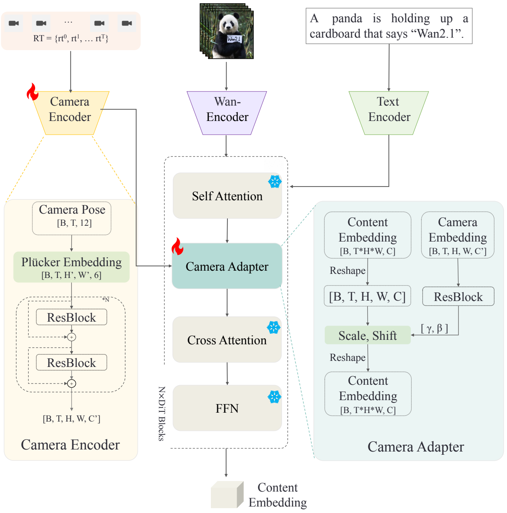

_图 28：由相机运动引导的视频生成框架。_

运动模式和连续的时间动态，这些特性可以被新流程直接继承，以增强生成内容的平滑性和连贯性。因此，我们采用预训练的 Wan 模型作为我们实时流程2的基础。

预训练的 Wan 模型旨在生成固定长度的视频片段，通常为 5 到 10 秒。为了将其转化为能够生成无预定长度（潜在无限）连续视频流的实时流式模型，需要进行两项关键修改：

- 流式流程适配。我们用一种增量生成视频令牌的流式机制，替代了在单次处理中产生固定长度视频令牌序列的静态生成过程。在这种流式设置中，视频令牌通过一个去噪队列进行处理——每次生成并让最旧的令牌出队时，一个新的令牌就会被添加到队列的底部，从而实现无长度限制的连续生成。

- 实时加速。除了实现流式传输外，我们还优化了生成速度，以确保系统满足实时性能要求，即流程必须足够快地生成新帧，以跟上实时播放的速度。

在接下来的章节中，我们将详细描述这些修改中的每一项，包括其设计原理、技术实现和经验性能。

# 5.6.2 流式视频生成

传统的扩散 Transformer (DiT) (Peebles & Xie, 2023) 模型在生成超过几秒长度的视频方面能力受限，即使采用了显著的空间和

\( {}^{2} \) 本节的部分内容在先前发布的技术报告 The Matrix (Feng et al., 2024) 中有所介绍。

---

---

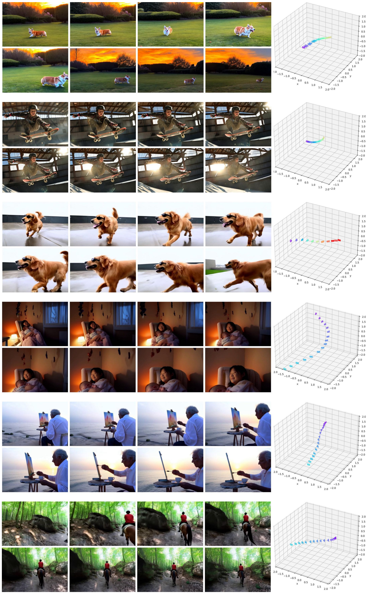

_图 29：由相机运动引导的生成视频结果。_

通过变分自编码器进行的时间压缩 (Kingma, 2013)。这一限制主要源于针对扩展时间序列的注意力机制在计算和内存方面的高度密集特性。为了克服这一挑战，我们提出了 Streamer，这是一种利用滑动时间窗口来高效管理时间依赖关系的新方法，从而能够以流式方式生成长视频甚至无限长度的视频。

---

---

_图 30：使用 8 个 A100 GPU 实时生成 15 分钟视频，帧率为 8 FPS。_

移位窗口去噪过程模型。Streamer 的核心创新在于其假设时序依赖性被限制在一个有限的时间窗口内。通过将注意力计算集中在此窗口内，Streamer 在保持视频连续性的同时显著降低了计算开销。具体而言，Streamer 在队列中处理视频 token，并在多次

---

---

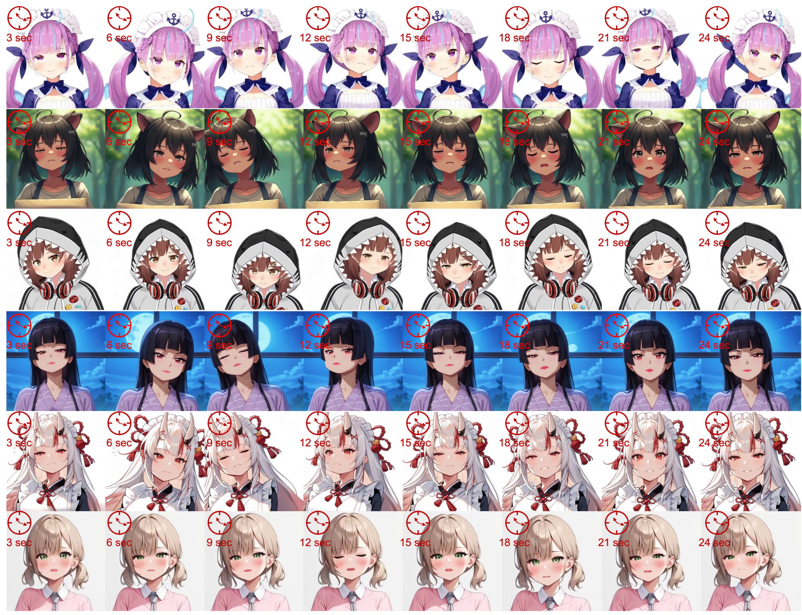

_图 31：使用单块 RTX 4090 GPU，配合 int8 和 TensorRT 量化，以 20 FPS 实时生成的视频。_

窗口内的噪声水平。在经过固定次数的去噪步骤后，最左侧的 token（具有最低的噪声水平）会出列并被缓存，而一个新的带有高斯噪声的 token 会被追加到最右侧的位置。这种滑动机制确保了窗口保持一致的长度，同时促进了连续视频帧的生成。

训练与推理。Streamer 是基于预训练的 DiT 模型进行微调的。在训练期间，采样一段由 \(2w\) 个视频 token 组成的序列，其中 \(w\) 是滑动窗口的大小（通常设置为 \(w = T\)，即扩散求解器的步数）。前 \(w\) 个 token 仅用于“预热”模型，不参与损失计算。损失仅计算最后 \(w\) 个 token，从而确保模型学习在窗口内生成连贯的视频帧。在推理时，采用相同的预热策略：前 \(w\) 个 token 被丢弃，生成的视频从第 \((w + 1)\) 个 token 开始。

确保训练与推理期间的连续性。为了保持连续窗口之间的平滑过渡，缓存的 token 会以 0 噪声水平重新引入到 token 队列中。这使得先前生成的 token 能够参与后续窗口的去噪过程，从而确保生成视频中的时间一致性和连续性。

Streamer 通过将 DiT 模型适配用于流式应用，代表了视频生成领域的重大进步。其滑动时间窗口方法解决了传统 DiT 模型的局限性，能够在保持高质量和时间连贯性的同时，高效生成长度无限的视频。该方法为实时视频生成和长篇幅内容创作开辟了新的可能性。我们将其优势总结如下：

- 无限长度视频生成：通过利用滑动窗口机制，Streamer 可以生成任意长度的视频，而无需承担难以承受的计算成本；

- 高效的注意力计算：将注意力计算限制在一个有限的时间窗口内，降低了对内存和处理能力的需求；

---

- 无缝连续性：通过缓存和重用 token，确保了窗口之间的平滑过渡，从而在长时间跨度内保持视频质量。

# 5.6.3 一致性模型蒸馏

在成功将 DiT 模型扩展为 Streamer 以实现无限长视频生成后，下一个关键步骤是应对实现模拟世界实时渲染的挑战。虽然 Streamer 通过在滑动窗口内高效管理时序依赖，能够生成长视频甚至无限视频，但扩散过程的计算需求仍然是实时应用的瓶颈。为了克服这一点，我们提出了一种将 Streamer 与一致性模型相结合的新颖方法，这是加速基于扩散的生成过程的前沿方法。具体而言，我们利用潜在一致性模型（LCM (Luo et al., 2023)）及其视频版本（VideoLCM (Wang et al., 2023c)），将原始扩散过程和无分类器指导蒸馏为一个高效的四步一致性模型。这种蒸馏过程显著减少了高质量生成所需的采样步数，同时保持了 Streamer 固有的时间连贯性和流式传输能力。

LCM 与 Streamer 的集成旨在保留去噪窗口机制，确保滑动时间窗口继续有效地管理依赖关系。在训练过程中，我们优化了这个组合框架以平衡效率和质量。结果是推理速度实现了 \(10 - 20 \times\) 的加速，使模型能够达到 8 - 16 FPS 的渲染速率。这种性能的巨大提升使得该系统在实时应用中变得可行，例如交互式模拟、实时视频合成以及虚拟环境中的动态内容生成。通过结合 Streamer 的优势——其生成具有时间连贯性的无限长视频的能力——和 LCM 的优势——其加速扩散过程的高效性——我们弥合了高质量视频生成与实时响应之间的差距。这一进步不仅增强了扩散模型在流式应用中的实用性，而且为沉浸式、交互式和实时媒体创作开辟了新的可能性。

面向消费级设备运行的量化。虽然生成速度已加速到实时水平，但由于较高的计算和内存需求，即使在 NVIDIA 4090 等高端 GPU 上，在消费级设备上部署该模型仍然具有挑战性。为了解决这个问题，我们引入了量化技术来优化模型以实现高效部署。具体而言，我们采用了两种不同的量化策略：针对注意力层和线性层的 int8 量化（torchao maintainers & contributors, 2024），以及针对整体模型的 TensorRT 量化（NVIDIA, 2023）。int8 量化方法通过将权重和激活转换为 8 位整数，显著减少了内存消耗，同时保持了整体生成质量。然而，这种方法在生成速度上提供的加速微乎其微，因为它主要关注内存效率而非计算优化。另一方面，TensorRT 量化提供了更全面的解决方案，能够实现生成速度的大幅提升。该技术使模型即使在单个 4090 GPU 上也能达到 8 FPS 的实时性能，使其在消费级设备上成为可能。然而，TensorRT 量化会引入轻微的网络误差增加，即使启用了其内置的错误检查机制，也能观察到这种误差。这种误差表现为输出质量的轻微偏差，例如生成视频中的微小伪影或不一致性。在某些情况下，它还可能导致可测量的不稳定性，例如闪烁或时间不连贯。尽管存在这些权衡，int8 和 TensorRT 量化的结合为针对实时、消费级部署优化模型提供了一种平衡的方法，在保持可接受生成质量的同时确保了效率和实用性。通过仔细调整量化参数并利用 TensorRT 的错误检查功能，我们最大程度地缓解了这些问题，从而在消费级硬件上实现了强大且高效的性能。

# 5.7 音频生成

本工作中音频生成的主要目标是为视频片段制作同步的音轨，构建为一个视频到音频（V2A）生成框架。生成的音轨由环境音和背景音乐组成，明确排除了语音或人声元素。与文本到音频模型（Liu et al., 2023b; 2024c）不同，视频到音频模型生成的环境音必须与视频的视觉内容在时间上保持一致，而

---

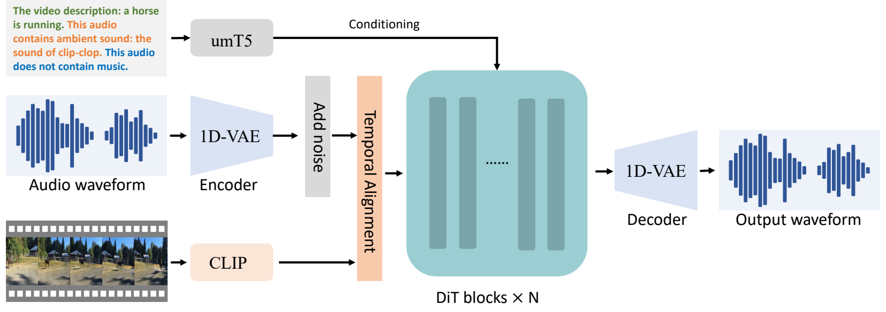

_图 32：视频到音频生成框架。我们的模型将视频片段及其关联的文本描述作为双重输入进行处理，以合成高质量且语义连贯的音频。_

配乐应准确反映视频的情感基调和场景设置，这符合自然的预期。此外，为了增强用户对声音设计的控制，我们的框架整合了视频和文本提示，使用户能够指定画内或画外声音，并定义背景音乐的风格和存在感。

# 5.7.1 模型设计

与我们的视频生成框架一致，我们的视频到音频模型也利用了基于流匹配的扩散 Transformer（DiT）（Peebles & Xie, 2023）（Lipman et al., 2022）来建模音频域中的去噪扩散过程。我们的 V2A 模型的详细流程如图 32 所示。

音频自编码器。一种广泛采用的音频压缩方法涉及将原始波形转换为梅尔频谱图，然后使用基于图像的变分自编码器将其编码为 \( H^{a} \times W^{a} \times C^{a} \) 潜在特征，如 (Liu et al., 2023b; 2024c) 中所示。然而，在扩散 Transformer 主干的背景下，这些潜在特征必须被分割成补丁并重塑为大小为 \( (H^{a} \cdot W^{a}) \times C^{a} \) 的张量。这种补丁分割和重塑过程可能会破坏与相应视频内容的时间对齐，从而给同步带来重大挑战。考虑到这一局限性，我们训练了一个直接在原始波形上运行的压缩模型。我们的 1D-VAE 生成大小为 \( T^{a} \times C^{a} \) 的潜在特征，其中 \( T^{a} \) 表示沿时间轴的序列长度，保留了精确同步所需的显式时间信息。

视频和文本编码器。为了在合成音频和视觉序列之间实现帧级精确同步，我们通过多模态特征融合建立时间连贯性。我们的架构首先使用 CLIP Radford et al. (2021) 模型提取逐帧的视觉嵌入，然后遵循 (Polyak et al.) 的方法，通过特征复制执行时间速率适配以匹配音频特征的采样率。同步的视觉和声学特征通过线性投影层进行维度变换以与 DiT 的潜在空间对齐，随后进行逐元素求和以实现多模态融合。为了实现跨语言的语言理解，我们利用预训练的 umT5 模型（Chung et al., 2023）作为我们的文本编码器，利用其通过冻结参数实现的跨语言表示能力。

数据。我们 V2A 模型的训练数据源自视频生成数据集，经过严格的过滤过程。我们系统性地移除了缺乏音轨或包含语音/人声音乐的视频，从而产生了一个包含 \(\mathcal{O}(1)\) 千小时的精炼子集。为了增强多模态表示，我们采用了全面的描述策略：密集的视频描述辅以由 Qwen2-audio（Chu et al., 2024）生成的音频特定描述。这些音频描述被分类为环境声音和音乐作品，后者通过风格、节奏、旋律和乐器编配来表征。最终的结构化描述整合了三个组成部分：（1）密集视频描述，（2）环境声音表征，以及（3）背景音乐分析，为训练提供了统一的多模态表示。

---

---

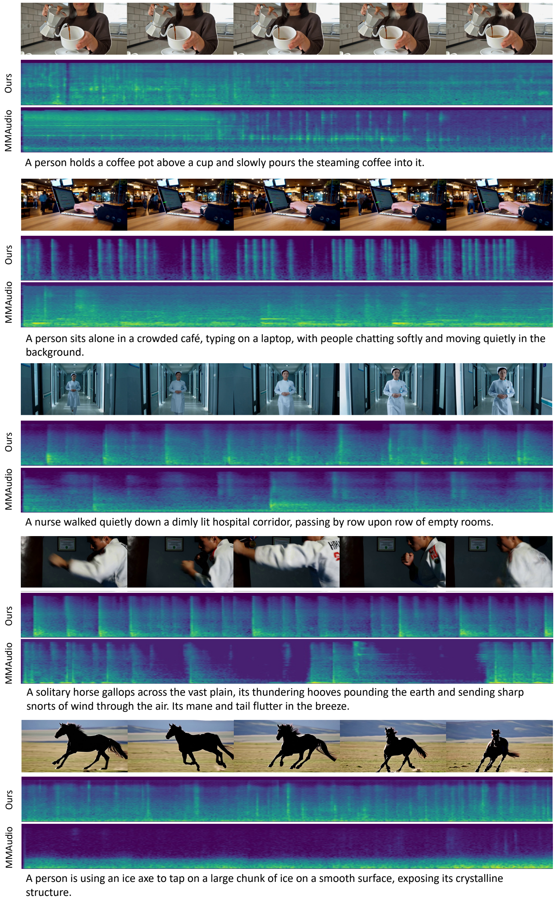

_图 33：MMAudio 和本文方法的音频生成样本。_

---

---

**实现细节。** 我们的 V2A 架构能够以 \(44.1\mathrm{kHz}\) 的采样率生成最长 12 秒的高保真立体声音频。该模型通过专用编码器处理多模态输入：umT5-XXL 生成 4096 维的文本嵌入，而 CLIP 从每一帧提取 1024 维的视觉嵌入。音频和视频特征被投影到 DiT 主干网络内统一的 1536 维潜在空间中。为了实现时间对齐，我们对输入视频进行下采样，为 12 秒的片段精确生成 48 帧，从而确保视觉和音频模态之间帧级别的精确同步。系统在一个批次中处理长度为 256 的潜在序列。为了增强模型仅凭视觉线索生成音频的能力，我们在训练过程中实施了一种随机掩码策略，以预定义的概率有选择地省略环境声音和音乐描述。这种条件机制迫使模型在视觉内容与相应的音频模式之间建立稳健的跨模态关联，同时在文本描述可用时保持利用这些描述的灵活性。

# 5.7.2 评估

我们在图 33 中提供了音频生成的定性评估，其中我们将我们的方法与最近发布的开源方法 MMAudio (Cheng et al., 2024) 进行了比较。这种比较分析特别有意义，因为 MMAudio 代表了与我们的方法最相似且最具竞争力的基线，在音频生成任务中展现了令人印象深刻的性能。这些视频由我们的文本生成视频模型生成，时长为 5 秒。

我们的 V2A 模型在音频生成的几个关键方面展现了卓越的性能，比较结果也证实了这一点。具体而言，该模型表现出增强的长期一致性，这在“倒咖啡”场景中尤为明显（图 33 中的第一个案例）。在第二个“打字”案例中，与 MMAudio 产生的带有较多噪声的结果相比，我们的方法生成的音频输出明显更加纯净。此外，我们的方法在合成有节奏的声音模式方面表现出色，这在“行走”、“拳击”和“马蹄声”示例中得到了证明（图 33 中的最后三个案例），在这些案例中，它实现了更自然、连贯的音频生成。

**局限性。** 我们的方法在生成人类声音方面存在局限性，包括但不限于笑声、哭声和语音。这一局限性主要归因于我们的数据准备过程，其中与语音相关的声音数据被有意从训练数据集中排除。MMAudio 模型产生随机类语音声音的能力源于其训练语料库中保留了语音相关数据。在未来的工作中，我们计划加入语音生成功能以解决这一局限性。

# 6 局限性与结论

**局限性。** 本研究介绍了 Wan，这是一个基础视频生成模型，在多个基准测试中取得了显著进展。具体而言，在运动幅度（例如，体育、舞蹈）和指令遵循能力方面观察到了显著改进。尽管如此，仍然存在几个局限性，需要解决这些局限性以释放 Wan 的更多潜力。首先，在涉及大幅度运动的场景中保留细粒度细节对我们的方法仍然是一个挑战，这也是整个视频生成领域面临的一个广泛问题。需要付出大量努力来提高具有大幅度运动动态的视频的保真度。其次，与大规模模型相关的计算成本仍然高得令人望而却步。在没有额外优化的情况下，目前在单个前端 GPU 上对 14B 模型进行推理大约需要 30 分钟。为了将视频生成民主化为一种普遍可访问的 AI 工具，对效率和可扩展性的进一步研究至关重要。最后，仍然缺乏特定领域的专业知识。作为一个基础视频模型，我们致力于增强 Wan 的通用能力，但在特定的局部场景（例如教育和医学）中的性能可能不足。我们旨在通过开源我们的最新模型并促进跨不同专业领域的社区驱动开发来解决这一局限性。

**结论。** 在本报告中，我们公开发布了我们的最新视频模型 Wan，它为视频生成树立了新的基准。我们全面概述了 Wan-VAE 和 DiT 模型的架构设计，包括对其训练方法、数据策划过程、评估方法和实证结果的详细见解。此外，我们仔细分析了我们的数据预处理管道和为优化模型训练而实施的战略性调整。这种整体方法旨在推动视频生成领域的进步。我们还广泛研究了下游应用，例如图像生成视频、视频

---

编辑以及个性化视频生成，以展示 Wan 在不同场景下的多功能性和实用价值。除了开源 14B 模型外，我们还探索了利用较小规模模型进行高效视频生成的可行性。值得注意的是，我们的 1.3B 模型不仅与更大规模的模型相比具有竞争力，而且还能在消费级 GPU 上实现流畅推理，显著提升了内容创作者的易用性和实用性。展望未来，我们计划专注于扩展数据和模型架构，以解决视频生成领域最紧迫的挑战。我们持续的工作旨在为研究界提供更强大、更通用的视频创作工具，从而推动这一快速发展领域的创新与广泛应用。

---

# 7 贡献者

作者按名字首字母顺序排列。

<table><tr><td>Ang Wang</td><td>Pandeng Li</td><td>Xin Xu</td></tr><tr><td>Baole Ai</td><td>Pingyu Wu</td><td>Yan Kou</td></tr><tr><td>Bin Wen</td><td>Ruihang Chu</td><td>Yangyu Lv</td></tr><tr><td>Chaojie Mao</td><td>Ruili Feng</td><td>Yifei Li</td></tr><tr><td>Chen-Wei Xie</td><td>Shiwei Zhang</td><td>Yijing Liu</td></tr><tr><td>Di Chen</td><td>Siyang Sun</td><td>Yiming Wang</td></tr><tr><td>Feiwu Yu</td><td>Tao Fang</td><td>Yingya Zhang</td></tr><tr><td>Haiming Zhao</td><td>Tianxing Wang</td><td>Yitong Huang</td></tr><tr><td>Jianxiao Yang</td><td>Tianyi Gui</td><td>Yong Li</td></tr><tr><td>Jianyuan Zeng</td><td>Tingyu Weng</td><td>You Wu</td></tr><tr><td>Jiayu Wang</td><td>Tong Shen</td><td>Yu Liu</td></tr><tr><td>Jingfeng Zhang</td><td>Wei Lin</td><td>Yulin Pan</td></tr><tr><td>Jingren Zhou</td><td>Wei Wang~1</td><td>Yun Zheng</td></tr><tr><td>Jinkai Wang</td><td>Wei Wang~2</td><td>Yuntao Hong</td></tr><tr><td>Jixuan Chen</td><td>Wenmeng Zhou</td><td>Yupeng Shi</td></tr><tr><td>Kai Zhu</td><td>Wente Wang</td><td>Yutong Feng</td></tr><tr><td>Kang Zhao</td><td>Wenting Shen</td><td>Zeyinzi Jiang</td></tr><tr><td>Keyu Yan</td><td>Wenyuan Yu</td><td>Zhen Han</td></tr><tr><td>Lianghua Huang</td><td>Xianzhong Shi</td><td>Zhi-Fan Wu</td></tr><tr><td>Mengyang Feng</td><td>Xiaoming Huang</td><td>Ziyu Liu</td></tr><tr><td>Ningyi Zhang</td><td></td><td></td></tr></table>

---

# 参考文献

Runway AI. Stable Diffusion Inpainting Model Card, https://huggingface.co/runwayml/stable-diffusion-inpainting, 2022.

Jinze Bai, Shuai Bai, Shusheng Yang, Shijie Wang, Sinan Tan, Peng Wang, Junyang Lin, Chang Zhou, and Jingren Zhou. Qwen-VL: A versatile vision-language model for understanding, localization, text reading, and beyond. arXiv preprint arXiv.2308.12966, 2023.

Fan Bao, Shen Nie, Kaiwen Xue, Yue Cao, Chongxuan Li, Hang Su, and Jun Zhu. All are worth words: A vit backbone for diffusion models. In IEEE Conf. Comput. Vis. Pattern Recog., 2023.

Fan Bao, Chengdong Xiang, Gang Yue, Guande He, Hongzhou Zhu, Kaiwen Zheng, Min Zhao, Shilong Liu, Yaole Wang, and Jun Zhu. Vidu: a highly consistent, dynamic and skilled text-to-video generator with diffusion models. arXiv preprint arXiv:2405.04233, 2024.

James Betker, Gabriel Goh, Li Jing, Tim Brooks, Jianfeng Wang, Linjie Li, Long Ouyang, Juntang Zhuang, Joyce Lee, Yufei Guo, et al. Improving image generation with better captions (2023). URL https://cdn.opencai.com/papers/dall-e-3.pdf, 2023.

Andreas Blattmann, Tim Dockhorn, Sumith Kulal, Daniel Mendelevitch, Maciej Kilian, Dominik Lorenz, Yam Levi, Zion English, Vikram Voleti, Adam Letts, et al. Stable video diffusion: Scaling latent video diffusion models to large datasets. arXiv preprint arXiv:2311.15127, 2023.

Tim Brooks, Aleksander Holynski, and Alexei A. Efros. InstructPix2Pix: Learning To Follow Image Editing Instructions. In IEEE Conf. Comput. Vis. Pattern Recog., pp. 18392-18402, 2023.

Mathilde Caron, Hugo Touvron, Ishan Misra, Hervé Jégou, Julien Mairal, Piotr Bojanowski, and Armand Joulin. Emerging properties in self-supervised vision transformers. arXiv preprint arXiv:2104.14294, 2021.

Junsong Chen, Jincheng Yu, Chongjian Ge, Lewei Yao, Enze Xie, Yue Wu, Zhongdao Wang, James Kwok, Ping Luo, Huchuan Lu, et al. Pixart-α: Fast training of diffusion transformer for photorealistic text-to-image synthesis. arXiv preprint arXiv:2310.00426, 2023a.

Tianqi Chen, Bing Xu, Chiyuan Zhang, and Carlos Guestrin. Training deep nets with sublinear memory cost. arXiv preprint arXiv:1604.06174, 2016.

Xi Chen, Lianghua Huang, Yu Liu, Yujun Shen, Deli Zhao, and Hengshuang Zhao. AnyDoor: Zero-shot Object-level Image Customization. arXiv preprint arXiv:2307.09481, 2023b.

Xi Chen, Zhifei Zhang, He Zhang, Yuqian Zhou, Soo Ye Kim, Qing Liu, Yijun Li, Jianming Zhang, Nanxuan Zhao, Yilin Wang, Hui Ding, Zhe Lin, and Hengshuang Zhao. UniReal: Universal Image Generation and Editing via Learning Real-world Dynamics. arXiv preprint arXiv:2412.07774, 2024.

---

Ho Kei Cheng, Masato Ishii, Akio Hayakawa, Takashi Shibuya, Alexander Schwing, and Yuki Mitsufuji. Taming multimodal joint training for high-quality video-to-audio synthesis. arXiv preprint arXiv:2412.15322, 2024.

Ruihang Chu, Enze Xie, Shentong Mo, Zhenguo Li, Matthias Nießner, Chi-Wing Fu, and Jiaya Jia. Diffcomplete: Diffusion-based generative 3d shape completion. Adv. Neural Inform. Process. Syst., 2023.

Yunfei Chu, Jin Xu, Qian Yang, Haojie Wei, Xipin Wei, Zhifang Guo, Yichong Leng, Yuanjun Lv, Jinzheng He, Junyang Lin, et al. Qwen2-audio technical report. arXiv preprint arXiv:2407.10759, 2024.

Hyung Won Chung, Noah Constant, Xavier Garcia, Adam Roberts, Yi Tay, Sharan Narang, and Orhan First. Unimax: Fairer and more effective language sampling for large-scale multilingual pretraining. arXiv preprint arXiv:2304.09151, 2023.

Google DeepMind. Veo 2. https://deepmind.google/technologies/veo/veo-2/, 2024.12.

Jiankang Deng, Jia Guo, Niannan Xue, and Stefanos Zafeiriou. Arcface: Additive angular margin loss for deep face recognition. In IEEE Conf. Comput. Vis. Pattern Recog., pp. 4690-4699, 2019.

Stefan Elfwing, Eiji Uchibe, and Kenji Doya. Sigmoid-weighted linear units for neural network function approximation in reinforcement learning. Neural networks, 2018.

Patrick Esser, Robin Rombach, and Bjorn Ommer. Taming transformers for high-resolution image synthesis. In IEEE Conf. Comput. Vis. Pattern Recog., pp. 12873-12883, 2021.

Patrick Esser, Sumith Kulal, Andreas Blattmann, Rahim Entezari, Jonas Müller, Harry Saini, Yam Levi, Dominik Lorenz, Axel Sauer, Frederic Boesel, et al. Scaling rectified flow transformers for high-resolution image synthesis. In Int. Conf. Mach. Learn., 2024.

Jiarui Fang and Shangchun Zhao. Usp: A unified sequence parallelism approach for long context generative ai. arXiv preprint arXiv:2405.07719, 2024.

Ruili Feng, Han Zhang, Zhantao Yang, Jie Xiao, Zhilei Shu, Zhiheng Liu, Andy Zheng, Yukun Huang, Yu Liu, and Hongyang Zhang. The matrix: Infinite-horizon world generation with real-time moving control. arXiv preprint arXiv:2412.03568, 2024.

Chaoyou Fu, Yuhan Dai, Yongdong Luo, Lei Li, Shuhuai Ren, Renrui Zhang, Zihan Wang, Chenyu Zhou, Yunhang Shen, Mengdan Zhang, et al. Video-mme: The first-ever comprehensive evaluation benchmark of multi-modal llms in video analysis. arXiv preprint arXiv:2405.21075, 2024.

GenmoTeam. Mochi 1. https://github.com/genmoai/models, 2024.

---

---

Xun Guo, Mingwu Zheng, Liang Hou, Yuan Gao, Yufan Deng, Pengfei Wan, Di Zhang, Yufan Liu, Weiming Hu, Zhengjun Zha, Haibin Huang, and Chongyang Ma. I2V-Adapter: A General Image-to-Video Adapter for Diffusion Models. In SIGGRAPH, pp. 1–12, 2024a.

Yuwei Guo, Ceyuan Yang, Anyi Rao, Zhengyang Liang, Yaohui Wang, Yu Qiao, Maneesh Agrawala, Dahua Lin, and Bo Dai. Animatediff: Animate your personalized text-to-image diffusion models without specific tuning. International Conference on Learning Representations, 2024b.

Yoav HaCohen, Nisan Chiprut, Benny Brazowski, Daniel Shalem, Dudu Moshe, Eitan Richardson, Eran Levin, Guy Shiran, Nir Zabari, Ori Gordon, Poriya Panet, Sapir Weissbuch, Victor Kulikov, Yaki Bitterman, Zeev Melumian, and Ofir Bibi. Ltx-video: Realtime video latent diffusion. arXiv preprint arXiv:2501.00103, 2024.

Zhen Han, Zeyinzi Jiang, Yulin Pan, Jingfeng Zhang, Chaojie Mao, Chenwei Xie, Yu Liu, and Jingren Zhou. ACE: All-round Creator and Editor Following Instructions via Diffusion Transformer. In Int. Conf. Learn. Represent., 2025.

Martin Heusel, Hubert Ramsauer, Thomas Unterthiner, Bernhard Nessler, and Sepp Hochreiter. Gans trained by a two time-scale update rule converge to a local nash equilibrium. Adv. Neural Inform. Process. Syst., 2017.

Jonathan Ho and Tim Salimans. Classifier-free diffusion guidance. arXiv preprint arXiv:2207.12598, 2022.

Jonathan Ho, Ajay Jain, and Pieter Abbeel. Denoising diffusion probabilistic models. Adv. Neural Inform. Process. Syst., 33:6840-6851, 2020.

Jonathan Ho, Tim Salimans, Alexey Gritsenko, William Chan, Mohammad Norouzi, and David J Fleet. Video diffusion models. arXiv preprint arXiv:2204.03458, 2022.

Ziqi Huang, Yinan He, Jiashuo Yu, Fan Zhang, Chenyang Si, Yuming Jiang, Yuanhan Zhang, Tianxing Wu, Qingyang Jin, and Nattapol Chanpaisit. Vbench: Comprehensive benchmark suite for video generative models. IEEE Conf. Comput. Vis. Pattern Recog., 2023.

Sam Ade Jacobs, Masahiro Tanaka, Chengming Zhang, Minjia Zhang, Shuaiwen Leon Song, Samyam Rajbhandari, and Yuxiong He. Deepspeed ulysses: System optimizations for enabling training of extreme long sequence transformer models. arXiv preprint arXiv:2309.14509, 2023.

Zeyinzi Jiang, Chaojie Mao, Ziyuan Huang, Ao Ma, Yiliang Lv, Yujun Shen, Deli Zhao, and Jingren Zhou. Res-Tuning: A Flexible and Efficient Tuning Paradigm via Unbinding Tuner from Backbone. In Adv. Neural Inform. Process. Syst., 2023.

Zeyinzi Jiang, Chaojie Mao, Yulin Pan, Zhen Han, and Jingfeng Zhang. SCEdit: Efficient and Controllable Image Diffusion Generation via Skip Connection Editing. In IEEE Conf. Comput. Vis. Pattern Recog., pp. 8995-9004, 2024.

---

---

Zeyinzi Jiang, Zhen Han, Chaojie Mao, Jingfeng Zhang, Yulin Pan, and Yu Liu. Vace: All-in-one video creation and editing. arXiv preprint arXiv:2503.07598, 2025.

Yang Jin, Zhicheng Sun, Ningyuan Li, Kun Xu, Kun Xu, Hao Jiang, Nan Zhuang, Quzhe Huang, Yang Song, Yadong Mu, and Zhouchen Lin. Pyramidal flow matching for efficient video generative modeling. arXiv preprint arXiv:2410.05954, 2024.

Junjie Ke, Qifei Wang, Yilin Wang, Peyman Milanfar, and Feng Yang. Musiq: Multi-scale image quality transformer. arXiv preprint arXiv:2108.05997, 2021.

Diederik P Kingma. Auto-encoding variational bayes. arXiv preprint arXiv:1312.6114, 2013.

Diederik P Kingma and Jimmy Ba. Adam: A method for stochastic optimization. arXiv preprint arXiv:1412.6980, 2014.

Weijie Kong, Qi Tian, Zijian Zhang, Rox Min, Zuozhuo Dai, Jin Zhou, Jiangfeng Xiong, Xin Li, Bo Wu, Jianwei Zhang, et al. Hunyuanvideo: A systematic framework for large video generative models. arXiv preprint arXiv:2412.03603, 2024.

Vijay Korthikanti, Jared Casper, Sangkug Lym, Lawrence McAfee, Michael Andersch, Mohammad Shoeybi, and Bryan Catanzaro. Reducing activation recomputation in large transformer models, 2022. arXiv preprint arXiv:2205.05198.

Kuaishou. Kling ai. https://klingai.kuaishou.com/, 2024.06.

PKU-Yuan Lab and Tuzhan AI etc. Open-sora-plan, April 2024.

LAION-AI. aesthetic-predictor, 2022. URL https://github.com/LAION-AI/aesthetic-predictor.

Hengjia Li, Haonan Qiu, Shiwei Zhang, Xiang Wang, Yujie Wei, Zekun Li, Yingya Zhang, Boxi Wu, and Deng Cai. PersonalVideo: High ID-Fidelity Video Customization without Dynamic and Semantic Degradation. arXiv preprint arXiv:2411.17048, 2024.

Yanwei Li, Yuechen Zhang, Chengyao Wang, Zhisheng Zhong, Yixin Chen, Ruihang Chu, Shaoteng Liu, and Jiaya Jia. Mini-gemini: Mining the potential of multimodality vision language models. arXiv preprint arXiv:2403.18814, 2023.

Bin Lin, Yunyang Ge, Xinhua Cheng, Zongjian Li, Bin Zhu, Shaodong Wang, Xianyi He, Yang Ye, Shenghai Yuan, Liuhan Chen, et al. Open-sora plan: Open-source large video generation model. arXiv preprint arXiv:2412.00131, 2024.

Yaron Lipman, Ricky TQ Chen, Heli Ben-Hamu, Maximilian Nickel, and Matt Le. Flow matching for generative modeling. arXiv preprint arXiv:2210.02747, 2022.

Aixin Liu, Bei Feng, Bing Xue, Bingxuan Wang, Bochao Wu, Chengda Lu, Chenggang Zhao, Chengqi Deng, Chenyu Zhang, Chong Ruan, et al. Deepseek-v3 technical report. arXiv preprint arXiv:2412.19437, 2024a.

---

---

Feng Liu, Shiwei Zhang, Xiaofeng Wang, Yujie Wei, Haonan Qiu, Yuzhong Zhao, Yingya Zhang, Qixiang Ye, and Fang Wan. Timestep embedding tells: It's time to cache for video diffusion model. arXiv preprint arXiv:2411.19108, 2024b.

Hao Liu, Matei Zaharia, and Pieter Abbeel. Ring attention with blockwise transformers for near-infinite context. arXiv preprint arXiv:2310.01889, 2023a.

Haohe Liu, Zehua Chen, Yi Yuan, Xinhao Mei, Xubo Liu, Danilo Mandic, Wenwu Wang, and Mark D Plumbley. Audioldm: Text-to-audio generation with latent diffusion models. arXiv preprint arXiv:2301.12503, 2023b.

Haohe Liu, Yi Yuan, Xubo Liu, Xinhao Mei, Qiuqiang Kong, Qiao Tian, Yuping Wang, Wenwu Wang, Yuxuan Wang, and Mark D Plumbley. Audioldm 2: Learning holistic audio generation with self-supervised pretraining. IEEE/ACM Transactions on Audio, Speech, and Language Processing, 2024c.

Haotian Liu, Chunyuan Li, Qingyang Wu, and Yong Jae Lee. Visual instruction tuning. arXiv preprint arXiv:2304.08485, 2023c.

Lijie Liu, Tianxiang Ma, Bingchuan Li, Zhuowei Chen, Jiawei Liu, Qian He, and Xinglong Wu. Phantom: Subject-consistent video generation via cross-modal alignment. arXiv preprint arXiv:2502.11079, 2025a.

Shilong Liu, Zhaoyang Zeng, Tianhe Ren, Feng Li, Hao Zhang, Jie Yang, Chunyuan Li, Jianwei Yang, Hang Su, Jun Zhu, and Lei Zhang. Grounding DINO: Marrying DINO with Grounded Pre-Training for Open-Set Object Detection. arXiv preprint arXiv:2303.05499, 2023d.

Zhihang Liu, Chen-Wei Xie, Bin Wen, Feiwu Yu, Jixuan Chen, Boqiang Zhang, Nianzu Yang, Pandeng Li, Yun Zheng, and Hongtao Xie. What is a good caption? a comprehensive visual caption benchmark for evaluating both correctness and coverage of mllms. arXiv preprint arXiv:2502.14914, 2025b.

Ilya Loshchilov and Frank Hutter. Decoupled weight decay regularization. arXiv preprint arXiv:1711.05101, 2017.

LumaLabs. Dream machine. https://lumalabs.ai/dream-machine, 2024.06.

Simian Luo, Yiqin Tan, Longbo Huang, Jian Li, and Hang Zhao. Latent consistency models: Synthesizing high-resolution images with few-step inference. arXiv preprint arXiv:2310.04378, 2023.

Zhengyao Lv, Chenyang Si, Junhao Song, Zhenyu Yang, Yu Qiao, Ziwei Liu, and Kwan-Yee K. Wong. Fastercache: Training-free video diffusion model acceleration with high quality. arXiv preprint arXiv:2410.19355, 2024.

Guoqing Ma, Haoyang Huang, Kun Yan, Liangyu Chen, Nan Duan, Shengming Yin, Changyi Wan, Ranchen Ming, Xiaoniu Song, Xing Chen, et al. Step-video-t2v technical report: The practice, challenges, and future of video foundation model. arXiv preprint arXiv:2502.10248, 2025.

---

Xin Ma, Yaohui Wang, Gengyun Jia, Xinyuan Chen, Ziwei Liu, Yuan-Fang Li, Cunjian Chen, and Yu Qiao. Latte: Latent diffusion transformer for video generation. arXiv preprint arXiv:2401.03048, 2024.

Chaojie Mao, Jingfeng Zhang, Yulin Pan, Zeyinzi Jiang, Zhen Han, Yu Liu, and Jingren Zhou. ACE++: Instruction-Based Image Creation and Editing via Context-Aware Content Filling. arXiv preprint arXiv:2501.02487, 2025.

Chenlin Meng, Yutong He, Yang Song, Jiaming Song, Jiajun Wu, Jun-Yan Zhu, and Stefano Ermon. SDEdit: Guided Image Synthesis and Editing with Stochastic Differential Equations. In Int. Conf. Learn. Represent., 2021.

MiniMax. Hailuo ai. https://hailuoai.com/video, 2024.09.

NVIDIA. Nvidia tensorrt: Programmable inference accelerator, 2023. Version 8.6.

OpenAI. Video generation models as world simulators, 2024. URL https://openai.com/index/video-generation-models-as-world-simulators/.

Yulin Pan, Chaojie Mao, Zeyinzi Jiang, Zhen Han, and Jingfeng Zhang. Locate, Assign, Refine: Taming Customized Image Inpainting with Text-Subject Guidance. arXiv preprint arXiv:2403.19534, 2024.

Adam Paszke, Sam Gross, Francisco Massa, Adam Lerer, James Bradbury, Gregory Chanan, Trevor Killeen, Zeming Lin, Natalia Gimelshein, Luca Antiga, et al. Pytorch: An imperative style, high-performance deep learning library. Adv. Neural Inform. Process. Syst., 32, 2019.

William Peebles and Saining Xie. Scalable diffusion models with transformers. In Int. Conf. Comput. Vis., pp. 4195-4205, 2023.

Ethan Perez, Florian Strub, Harm De Vries, Vincent Dumoulin, and Aaron Courville. Film: Visual reasoning with a general conditioning layer. In Assoc. Adv. Artif. Intell., volume 32, 2018.

PikaLabs. Pika 1.5. https://pika.art/, 2024.10.

Adam Polyak, Amit Zohar, Andrew Brown, Andros Tjandra, Animesh Sinha, Ann Lee, Apoorv Vyas, Bowen Shi, Chih-Yao Ma, Ching-Yao Chuang, David Yan, Dhruv Choudhary, Dingkang Wang, Geet Sethi, Guan Pang, Haoyu Ma, Ishan Misra, Ji Hou, Jialiang Wang, Kiran Jagadeesh, Kunpeng Li, Luxin Zhang, Mannat Singh, Mary Williamson, Matt Le, Matthew Yu, Mitesh Kumar Singh, Peizhao Zhang, Peter Vajda, Quentin Duval, Rohit Girdhar, Roshan Sumbaly, Sai Saketh Rambhatla, Sam Tsai, Samaneh Azadi, Samyak Datta, Sanyuan Chen, Sean Bell, Sharadh Ramaswamy, Shelly Sheynin, Siddharth Bhattacharya, Simran Motwani, Tao Xu, Tianhe Li, Tingbo Hou, Wei-Ning Hsu, Xi Yin, Xiaoliang Dai, Yaniv Taigman, Yaqiao Luo, Yen-Cheng Liu, Yi-Chiao Wu, Yue Zhao, Yuval Kirstain, Zecheng He, Zijian He, Albert Pumarola, Ali Thabet, Artsiom Sanakoyeu, Arun Mallya, Baishan Guo, Boris Araya, Breena Kerr, Carleigh Wood, Ce Liu, Cen Peng, Dimitry Vengertsev, Edgar Schonfeld, Elliot Blanchard, Felix Juefei-Xu, Fraylie

---

Nord, Jeff Liang, John Hoffman, Jonas Kohler, Kaolin Fire, Karthik Sivakumar, Lawrence Chen, Licheng Yu, Luya Gao, Markos Georgopoulos, Rashel Moritz, Sara K. Sampson, Shikai Li, Simone Parmeggiani, Steve Fine, Tara Fowler, Vladan Petrovic, and Yuming Du. Movie gen: A cast of media foundation models. arXiv preprint arXiv:2410.13720.

QwenTeam. Qwen2.5: A party of foundation models, September 2024. URL https://qwenlm.github.io/blog/qwen2.5/.

Alec Radford, Jong Wook Kim, Chris Hallacy, Aditya Ramesh, Gabriel Goh, Sandhini Agarwal, Girish Sastry, Amanda Askell, Pamela Mishkin, Jack Clark, et al. Learning transferable visual models from natural language supervision. In Int. Conf. Mach. Learn., pp. 8748-8763. PMLR, 2021.

Colin Raffel, Noam Shazeer, Adam Roberts, Katherine Lee, Sharan Narang, Michael Matena, Yanqi Zhou, Wei Li, and Peter J Liu. Exploring the limits of transfer learning with a unified text-to-text transformer. The Journal of Machine Learning Research, 21(1):5485-5551, 2020.

Nikhila Ravi, Valentin Gabeur, Yuan-Ting Hu, Ronghang Hu, Chaitanya Ryali, Tengyu Ma, Haitham Khedr, Roman Rädle, Chloe Rolland, Laura Gustafson, Eric Mintun, Junting Pan, Kalyan Vasudev Alwala, Nicolas Carion, Chao-Yuan Wu, Ross Girshick, Piotr Dólár, and Christoph Feichtenhofer. SAM 2: Segment Anything in Images and Videos. In Int. Conf. Learn. Represent., 2025.

Joseph Redmon and Ali Farhadi. Yolov3: An incremental improvement. arXiv preprint arXiv:1804.02767, 2018.

Minsoo Rhu, Natalia Gimelshein, Jason Clemons, Arslan Zulfiqar, and Stephen W. Keckler. vdnn: virtualized deep neural networks for scalable, memory-efficient neural network design. In The 49th Annual IEEE/ACM International Symposium on Microarchitecture, MICRO-49.IEEE Press,2016.

Robin Rombach, Andreas Blattmann, Dominik Lorenz, Patrick Esser, and Björn Ommer. High-resolution image synthesis with latent diffusion models. In IEEE Conf. Comput. Vis. Pattern Recog., pp. 10684-10695, 2022.

Olaf Ronneberger, Philipp Fischer, and Thomas Brox. U-net: Convolutional networks for biomedical image segmentation. In Medical image computing and computer-assisted intervention-MICCAI 2015: 18th international conference, Munich, Germany, October 5-9, 2015, proceedings, part III 18, pp. 234-241. Springer, 2015.

Runway. Gen-2: Generate novel videos with text, images or video clips. https://runwayml.com/research/gen-2, 2023.

Runway. Gen-3. https://runwayml.com/, 2024.06.

Christoph Schuhmann, Richard Vencu, Romain Beaumont, Robert Kaczmarczyk, Clayton Mullis, Aarush Katta, Theo Coombes, Jenia Jitsev, and Aran Komatsuzaki. Laion-400m: Open dataset of clip-filtered 400 million image-text pairs. arXiv preprint arXiv:2111.02114, 2021.

---

---

Jay Shah, Ganesh Bikshandi, Ying Zhang, Vijay Thakkar, Pradeep Ramani, and Tri Dao. Flashattention-3: Fast and accurate attention with asynchrony and low-precision. Adv. Neural Inform. Process. Syst., 37:68658-68685, 2025.

ShengShu-AI. Vidu. https://www.vidustudio/, 2024.07.

Mohammad Shoeybi, Mostofa Patwary, Raul Puri, Patrick LeGresley, Jared Casper, and Bryan Catanzaro. Megatron-LM: Training multi-billion parameter language models using model parallelism. arXiv preprint arXiv:1909.08053, 2019.

Jiaming Song, Chenlin Meng, and Stefano Ermon. Denoising diffusion implicit models. arXiv:2010.02502, October 2020.

Yang Song and Stefano Ermon. Generative modeling by estimating gradients of the data distribution. Adv. Neural Inform. Process. Syst., 32, 2019.

Zhenxiong Tan, Songhua Liu, Xingyi Yang, Qiaochu Xue, and Xinchao Wang. *OminiControl: Minimal and Universal Control for Diffusion Transformer.* arXiv preprint arXiv:2411.15098, 2024.

TeamGLM, Aohan Zeng, Bin Xu, Bowen Wang, Chenhui Zhang, Da Yin, Diego Rojas, Guanyu Feng, Hanlin Zhao, Hanyu Lai, Hao Yu, Hongning Wang, Jiadai Sun, Jiajie Zhang, Jiale Cheng, Jiayi Gui, Jie Tang, Jing Zhang, Juanzi Li, Lei Zhao, Lindong Wu, Lucen Zhong, Mingdao Liu, Minlie Huang, Peng Zhang, Qinkai Zheng, Rui Lu, Shuaiqi Duan, Shudan Zhang, Shulin Cao, Shuxun Yang, Weng Lam Tam, Wenyi Zhao, Xiao Liu, Xiao Xia, Xiaohan Zhang, Xiaotao Gu, Xin Lv, Xinghan Liu, Xinyi Liu, Xinyue Yang, Xixuan Song, Xunkai Zhang, Yifan An, Yifan Xu, Yilin Niu, Yuantao Yang, Yueyan Li, Yushi Bai, Yuxiao Dong, Zehan Qi, Zhaoyu Wang, Zhen Yang, Zhengxiao Du, Zhenyu Hou, and Zihan Wang. Chatglm: A family of large language models from glm-130b to glm-4 all tools, 2024.

Zachary Teed and Jia Deng. Raft: Recurrent all-pairs field transforms for optical flow (extended abstract). In Assoc. Adv. Artif. Intell., 2021.

torchians and contributors. torchao: Pytorch native quantization and sparsity for training and inference, 2024.

Thomas Unterthiner, Sjoerd Van Steenkiste, Karol Kurach, Raphael Marinier, and Sylvain Gelly. Towards accurate generative models of video: A new metric and challenges, 2018.

Aaron Van Den Oord, Oriol Vinyals, et al. Neural discrete representation learning. Adv. Neural Inform. Process. Syst., 30, 2017.

Jianyuan Wang, Nikita Karaev, Christian Rupprecht, and David Novotny. VGGSfM: Visual geometry grounded deep structure from motion. In IEEE Conf. Comput. Vis. Pattern Recog., 2024a. Highlight.

Jiuniu Wang, Hangjie Yuan, Dayou Chen, Yingya Zhang, Xiang Wang, and Shiwei Zhang. Modelscope text-to-video technical report. arXiv preprint arXiv:2308.06571, 2023a.

---

---

Qixun Wang, Xu Bai, Haofan Wang, Zekui Qin, and Anthony Chen. Instantid: Zero-shot identity-preserving generation in seconds. arXiv preprint arXiv:2401.07519, 2024b.
> Qixun Wang, Xu Bai, Haofan Wang, Zekui Qin, and Anthony Chen. Instantid：几秒钟内的零样本身份保持生成. arXiv preprint arXiv:2401.07519, 2024b.

Xiang Wang, Hangjie Yuan, Shiwei Zhang, Dayou Chen, Jiuniu Wang, Yingya Zhang, Yujun Shen, Deli Zhao, and Jingren Zhou. VideoComposer: Compositional video synthesis with motion controllability. Adv. Neural Inform. Process. Syst., 36:7594-7611, 2023b.
> Xiang Wang, Hangjie Yuan, Shiwei Zhang, Dayou Chen, Jiuniu Wang, Yingya Zhang, Yujun Shen, Deli Zhao, and Jingren Zhou. VideoComposer：具有运动可控性的组合式视频合成. Adv. Neural Inform. Process. Syst., 36:7594-7611, 2023b.

Xiang Wang, Shiwei Zhang, Han Zhang, Yu Liu, Yingya Zhang, Changxin Gao, and Nong Sang. VideoLCM: Video latent consistency model. arXiv preprint arXiv:2312.09109, 2023c.
> Xiang Wang, Shiwei Zhang, Han Zhang, Yu Liu, Yingya Zhang, Changxin Gao, and Nong Sang. VideoLCM：视频潜在一致性模型. arXiv preprint arXiv:2312.09109, 2023c.

Xiang Wang, Shiwei Zhang, Changxin Gao, Jiayu Wang, Xiaogiang Zhou, Yingya Zhang, Luxin Yan, and Nong Sang. Unianimate: Taming unified video diffusion models for consistent human image animation. arXiv preprint arXiv:2406.01188, 2024c.
> Xiang Wang, Shiwei Zhang, Changxin Gao, Jiayu Wang, Xiaogiang Zhou, Yingya Zhang, Luxin Yan, and Nong Sang. Unianimate：驯服统一视频扩散模型以实现一致的人体图像动画. arXiv preprint arXiv:2406.01188, 2024c.

Yujie Wei, Shiwei Zhang, Zhiwu Qing, Hangjie Yuan, Zhiheng Liu, Yu Liu, Yingya Zhang, Jingren Zhou, and Hongming Shan. DreamVideo: Composing your dream videos with customized subject and motion. In IEEE Conf. Comput. Vis. Pattern Recog., pp. 6537-6549, 2024a.
> Yujie Wei, Shiwei Zhang, Zhiwu Qing, Hangjie Yuan, Zhiheng Liu, Yu Liu, Yingya Zhang, Jingren Zhou, and Hongming Shan. DreamVideo：使用定制主体和运动组合您的梦想视频. In IEEE Conf. Comput. Vis. Pattern Recog., pp. 6537-6549, 2024a.

Yujie Wei, Shiwei Zhang, Hangjie Yuan, Xiang Wang, Haonan Qiu, Rui Zhao, Yutong Feng, Feng Liu, Zhizhong Huang, Jiaxin Ye, Yingya Zhang, and Hongming Shan. DreamVideo-2: Zero-Shot Subject-Driven Video Customization with Precise Motion Control. arXiv preprint arXiv:2410.13830, 2024b.
> Yujie Wei, Shiwei Zhang, Hangjie Yuan, Xiang Wang, Haonan Qiu, Rui Zhao, Yutong Feng, Feng Liu, Zhizhong Huang, Jiaxin Ye, Yingya Zhang, and Hongming Shan. DreamVideo-2：具有精确运动控制的零样本主体驱动视频定制. arXiv preprint arXiv:2410.13830, 2024b.

Yujie Wei, Shiwei Zhang, Hangjie Yuan, Biao Gong, Longxiang Tang, Xiang Wang, Haonan Qiu, Hengjia Li, Shuai Tan, Yingya Zhang, and Hongming Shan. DreamRelation: Relation-Centric Video Customization. arXiv preprint arXiv:2503.07602, 2025.
> Yujie Wei, Shiwei Zhang, Hangjie Yuan, Biao Gong, Longxiang Tang, Xiang Wang, Haonan Qiu, Hengjia Li, Shuai Tan, Yingya Zhang, and Hongming Shan. DreamRelation：以关系为中心的视频定制. arXiv preprint arXiv:2503.07602, 2025.

Pingyu Wu, Kai Zhu, Yu Liu, Liming Zhao, Wei Zhai, Yang Cao, and Zheng-Jun Zha. Improved video vae for latent video diffusion model. arXiv preprint arXiv:2411.06449, 2024.
> Pingyu Wu, Kai Zhu, Yu Liu, Liming Zhao, Wei Zhai, Yang Cao, and Zheng-Jun Zha. 用于潜在视频扩散模型的改进视频VAE. arXiv preprint arXiv:2411.06449, 2024.

Yuxin Wu and Kaiming He. Group normalization. In Eur. Conf. Comput. Vis., pp. 3-19, 2018.
> Yuxin Wu and Kaiming He. 组归一化. In Eur. Conf. Comput. Vis., pp. 3-19, 2018.

Shitao Xiao, Yueze Wang, Junjie Zhou, Huaying Yuan, Xingrun Xing, Ruiran Yan, Chaofan Li, Shuting Wang, Tiejun Huang, and Zheng Liu. OmniGen: Unified Image Generation. arXiv preprint arXiv:2409.11340, 2024.
> Shitao Xiao, Yueze Wang, Junjie Zhou, Huaying Yuan, Xingrun Xing, Ruiran Yan, Chaofan Li, Shuting Wang, Tiejun Huang, and Zheng Liu. OmniGen：统一图像生成. arXiv preprint arXiv:2409.11340, 2024.

Chen-Wei Xie, Jianmin Wu, Yun Zheng, Pan Pan, and Xian-Sheng Hua. Token embeddings alignment for cross-modal retrieval. In ACM Int. Conf. Multimedia, 2022.
> Chen-Wei Xie, Jianmin Wu, Yun Zheng, Pan Pan, and Xian-Sheng Hua. 用于跨模态检索的Token嵌入对齐. In ACM Int. Conf. Multimedia, 2022.

Nianzu Yang, Pandeng Li, Liming Zhao, Yang Li, Chen-Wei Xie, Yehui Tang, Xudong Lu, Zhihang Liu, Yun Zheng, Yu Liu, and Junchi Yan. Rethinking video tokenization: A conditioned diffusion-based approach. arXiv preprint arXiv:2503.03708, 2025a.
> Nianzu Yang, Pandeng Li, Liming Zhao, Yang Li, Chen-Wei Xie, Yehui Tang, Xudong Lu, Zhihang Liu, Yun Zheng, Yu Liu, and Junchi Yan. 重新思考视频Token化：一种基于条件扩散的方法. arXiv preprint arXiv:2503.03708, 2025a.

---

Sidi Yang, Tianhe Wu, Shuwei Shi, Shanshan Lao, Yuan Gong, Mingdeng Cao, Jiahao Wang, and Yujiu Yang. Maniaq: Multi-dimension attention network for no-reference image quality assessment. arXiv e-prints, 2022.

Zhuoyi Yang, Jiayan Teng, Wendi Zheng, Ming Ding, Shiyu Huang, Jiazheng Xu, Yuanming Yang, Wenyi Hong, Xiaohan Zhang, Guanyu Feng, Da Yin, Xiaotao Gu, Yuxuan Zhang, Weihan Wang, Yean Cheng, Ting Liu, Bin Xu, Yuxiao Dong, and Jie Tang. CogVideoX: Text-to-Video Diffusion Models with An Expert Transformer. In Int. Conf. Learn. Represent., 2025b.

Zhuoyuan Yao, Di Wu, Xiong Wang, Binbin Zhang, Fan Yu, Chao Yang, Zhendong Peng, Xiaoyu Chen, Lei Xie, and Xin Lei. Wenet: Production oriented streaming and non-streaming end-to-end speech recognition toolkit. In InterSpeech, 2021.

Hu Ye, Jun Zhang, Sibo Liu, Xiao Han, and Wei Yang. Ip-adapter: Text compatible image prompt adapter for text-to-image diffusion models. arXiv preprint arXiv:2308.06721, 2023.

Lijun Yu, José Lezama, Nitesh B Gundavarapu, Luca Versari, Kihyuk Sohn, David Minnen, Yong Cheng, Vighnesh Birodkar, Agrim Gupta, Xiuye Gu, et al. Language model beats diffusion–tokenizer is key to visual generation. arXiv preprint arXiv:2310.05737, 2023.

Hangjie Yuan, Shiwei Zhang, Xiang Wang, Yujie Wei, Tao Feng, Yining Pan, Yingya Zhang, Ziwei Liu, Samuel Albanie, and Dong Ni. InstructVideo: Instructing video diffusion models with human feedback. In IEEE Conf. Comput. Vis. Pattern Recog., pp. 6463-6474, 2024a.

Shanghai Yuan, Jina Huang, Xianyi He, Yunyuan Ge, Yujun Shi, Liuhan Chen, Jiebo Luo, and Li Yuan. Identity-Preserving Text-to-Video Generation by Frequency Decomposition. In IEEE Conf. Comput. Vis. Pattern Recog., 2025.

Zhihang Yuan, Hanling Zhang, Lu Pu, Xuefei Ning, Linfeng Zhang, Tianchen Zhao, Shengen Yan, Guohao Dai, and Yu Wang. DiTFastattn: Attention compression for diffusion transformer models. In Adv. Neural Inform. Process. Syst., 2024b.

Xiaohua Zhai, Basil Mustafa, Alexander Kolesnikov, and Lucas Beyer. Sigmoid loss for language image pre-training. In Int. Conf. Comput. Vis., pp. 11975-11986, 2023.

Biao Zhang and Rico Sennrich. Root mean square layer normalization. Adv. Neural Inform. Process. Syst., 32, 2019.

Jintao Zhang, Haofeng Huang, Penglzhang, Jun Zhu, Jianfei Chen, et al. Sageattention: Accurate 8-bit attention for plug-and-play inference acceleration. arXiv preprint arXiv:2410.02367, 2024.

Kai Zhang, Lingbo Mo, Wenhu Chen, Huan Sun, and Yu Su. MagicBrush: A Manually Annotated Dataset for Instruction-Guided Image Editing. In Adv. Neural Inform. Process. Syst., 2023a.

---

---

Lvmin Zhang, Anyi Rao, 和 Maneesh Agrawala。为文本到图像扩散模型添加条件控制。见 *Int. Conf. Comput. Vis.*，第 3836-3847 页，2023b。

Shiwei Zhang, Jiayu Wang, Yingya Zhang, Kang Zhao, Hangjie Yuan, Zhiwu Qin, Xiang Wang, Deli Zhao, 和 Jingren Zhou。I2vgen-xl：通过级联扩散模型实现高质量的图像到视频合成。arXiv 预印本 arXiv:2311.04145, 2023c。

Youcai Zhang, Xinyu Huang, Jinyu Ma, Zhaoyang Li, Zhaochuan Luo, Yanchun Xie, Yuzhuo Qin, Tong Luo, Yaqian Li, Shilong Liu, Yandong Guo, 和 Lei Zhang。识别万物：一种强大的图像标注模型。arXiv 预印本 arXiv:2306.03514, 2023d。

Yanli Zhao, Andrew Gu, Rohan Varma, Liang Luo, Chien-Chin Huang, Min Xu, Less Wright, Hamid Shojanazeri, Myle Ott, Sam Shleifer, Alban Desmaison, Can Balioglu, Pritam Damania, Bernard Nguyen, Geeta Chauhan, Yuchen Hao, Ajit Mathews, 和 Shen Li。Pytorch fsdp：扩展完全分片数据并行的经验，2023。

Zangwei Zheng, Xiangyu Peng, Tianji Yang, Chenhui Shen, Shenggui Li, Hongxin Liu, Yukun Zhou, Tianyi Li, 和 Yang You。Open-sora：面向所有人的高效视频制作民主化，2024年3月。

Daquan Zhou, Weimin Wang, Hanshu Yan, Weiwei Lv, Yizhe Zhu, 和 Jiashi Feng。Magicvideo：使用潜在扩散模型的高效视频生成。arXiv 预印本 arXiv:2211.11018, 2022。

Shangchen Zhou, Chongyi Li, Kelvin C. K. Chan, 和 Chen Change Loy。ProPainter：改进视频修复的传播与 Transformer 模块。见 *Int. Conf. Comput. Vis.*，第 10477-10486 页，2023。

---